# 第二章. 使用自动相机拍摄自然和野生动物

*国家地理*以其野生动物的亲密照片而闻名。在杂志的页面上，动物常常显得比生命还要大，仿佛它们属于与背后的风景相同的“地理”尺度。这种放大效果可以通过使用广角镜头在非常近的距离上捕捉主题来实现。例如，史蒂夫·温特拍摄的一张难忘的照片显示了一只咆哮的老虎伸出爪子去击打镜头！

让我们考虑实现这种照片的可能方法。摄影师可以亲自跟踪一只野生老虎，但出于安全考虑，这种方法需要一定的距离和长焦镜头。近距离接触可能会危及人类、老虎或两者。或者，摄影师可以使用遥控车或无人机接近并拍摄老虎。这会更安全，但就像第一种技术一样，它很费力，一次只能覆盖一个地点，并且可能会因为吸引动物的注意而破坏即兴或自然照片的机会。最后，摄影师可以在老虎可能访问的多个地点部署隐蔽和自动化的相机，称为**相机陷阱**。

本章将探讨编程相机陷阱的技术。也许我们不会捕捉到任何老虎，但总会有东西走进我们的陷阱！

尽管名字叫“陷阱”，但相机陷阱实际上并没有物理上“捕捉”任何东西。它只是在触发器被触发时捕捉照片。不同的相机陷阱可能使用不同的触发器，但在我们的案例中，触发器将是一个对运动、颜色或某些类别的物体敏感的计算机视觉系统。我们系统的软件组件将包括 OpenCV 3、Python 脚本、shell 脚本以及一个名为 gPhoto2 的相机控制工具。在构建我们的系统时，我们将解决以下问题：

+   我们如何从主机计算机配置和触发照片相机？

+   我们如何检测具有摄影价值的主题的存在？

+   我们如何捕捉和处理一个主题的多个照片以创建一个有效的合成图像或视频？

### 注意

本章项目的所有脚本和数据都可以在本书的 GitHub 仓库中找到，网址为[`github.com/OpenCVBlueprints/OpenCVBlueprints/tree/master/chapter_2/CameraTrap`](https://github.com/OpenCVBlueprints/OpenCVBlueprints/tree/master/chapter_2/CameraTrap)。

本章将重点介绍适用于类 Unix 系统（包括 Linux 和 Mac）的技术。我们假设用户最终将在低成本、低功耗的单板计算机（SBCs）上部署我们的相机陷阱，这些计算机通常运行 Linux 操作系统。一个好的例子是 Raspberry Pi 2 硬件，它通常运行 Raspbian 版本的 Linux。

让我们从我们的软件在图像捕获之前、期间和之后将执行的一些简单任务概述开始。

# 规划相机陷阱

我们将使用一台配备两个摄像头的计算机来设置相机陷阱。一个摄像头将连续捕捉低分辨率图像。例如，这个第一个摄像头可能是一个普通的网络摄像头。我们的软件将分析低分辨率图像以检测主体的存在。我们将探索基于运动、颜色和物体分类的三个基本检测技术。当检测到主体时，第二个摄像头将激活以捕捉和保存一系列有限的高分辨率图像。这个第二个摄像头将是一个专用的数码相机，拥有自己的电池和存储。我们不一定以最快的速度分析和记录图像；相反，我们将注意节约主机计算机的资源以及数码相机的电池功率和存储，以便我们的相机陷阱可以长时间运行。

可选地，我们的软件将为数码相机配置**曝光分级**。这意味着系列中的一些照片将被故意曝光不足，而其他照片将被过度曝光。稍后，我们将从相机上传照片到主机计算机，并合并曝光以产生**高动态范围**（**HDR**）图像。这意味着合并后的照片将在比任何单一曝光能够捕捉的更广泛的阴影、中色调和高光范围内展示精细的细节和饱和的颜色。例如，以下阵容说明了曝光不足（左侧）、过度曝光（右侧）和合并的 HDR 照片（中间）：

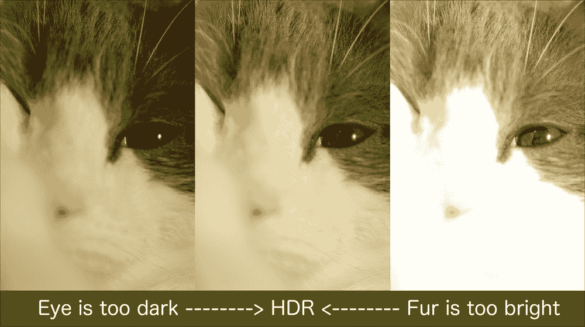

HDR 成像在风景摄影中尤为重要。通常，天空比地面亮得多，但我们希望驯服这种对比度，以便在这两个区域都获得饱和的中色调颜色，而不是白色的无特征天空或黑色的无特征土地。我们还将探索将一系列图像转换为时间流逝视频的技术。

注意，本项目中的两个摄像头满足不同的需求。网络摄像头提供用于实时处理的图像流，而数码相机存储用于后期高质量处理的图像。考虑以下比较表：

| 功能 | 典型网络摄像头 | 典型数码相机 | 高端工业相机 |
| --- | --- | --- | --- |
| 价格 | 低 | 中等 | 高 |
| 功耗 | 低 | 高（但有自己的电池） | 中等 |
| 配置选项 | 少 | 多 | 多 |
| 延迟 | 低 | 高 | 低 |
| 分辨率 | 低 | 非常高 | 高 |
| 耐用性 | 差 | 好 | 一般 |

可能，高端工业相机可以同时满足实时成像和高质量成像的双重目的。然而，一个网络摄像头和数码相机的组合可能更便宜。考虑以下例子：

| 名称 | 目的 | 传感器格式 | 最高分辨率模式 | 接口 | 价格 |
| --- | --- | --- | --- | --- | --- |
| Point Grey Research Grasshopper 3 GS3-U3-120S6M-C | 工业相机 | 1" | 4242x2830 @ 7 FPS | USB 3.0 | $3,700（新品） |
| 卡尔·蔡司耶拿 DDR Tevidon 10mm f/2 镜头 | 工业相机镜头 | 1" | 清晰，适合高分辨率 |  | 300 美元（二手） |
| 尼康 1 J5 配 10-30mm PD-ZOOM 镜头 | 照相机和镜头 | 1" | 5568x3712 @ 20 FPS | USB 2.0 | 500 美元（新品） |
| Odroid USB-Cam 720p | Webcam | 1/4" | 1280x720 @ 30 FPS | USB 2.0 | 20 美元（新品） |

在这里，工业相机和镜头的成本是照相机、镜头和摄像头的八倍，但照相机应该提供最佳图像质量。尽管照相机具有 5568x3712 @ 20 FPS 的 *捕获模式*，请注意，其 USB 2.0 接口速度过慢，无法支持作为 *传输模式*。在列出的分辨率和速率下，照相机只能将图像记录到其本地存储。

对于我们的目的，照相机的主要弱点是高延迟。延迟不仅涉及电子设备，还包括移动的机械部件。为了减轻问题，我们可以采取以下步骤：

+   使用比照相机视角略宽的摄像头。这样，相机陷阱可以提前检测到主题，并为照相机提供更多时间进行第一次拍摄。

+   将照相机置于手动对焦模式，并将焦点设置在您计划拍摄主题的距离。手动对焦更快、更安静，因为自动对焦电机不会运行。

+   如果您使用的是 **数码单反相机**（**DSLR**），请将其置于 **镜锁**（**MLU**）模式（如果支持 MLU）。如果没有 MLU，反射镜（将光线反射到光学取景器）必须在每次拍摄之前移出光学路径。使用 MLU 时，反射镜已经移开（但光学取景器已禁用）。MLU 更快、更安静、振动更小，因为反射镜不会移动。在某些相机上，MLU 被称为 **实时视图**，因为当光学取景器禁用时，数字（实时）取景器可能会被激活。

控制照相机是这个项目的重要组成部分。一旦你学会了编写摄影命令脚本，也许你将开始以新的方式思考摄影——因为它是一个过程，而不仅仅是快门落下的那一刻。现在让我们将注意力转向这个脚本主题。

# 使用 gPhoto2 控制 photo camera

gPhoto2 是一个开源、厂商中立的 Unix-like 系统（如 Linux 和 Mac）相机控制工具。它支持多个品牌的相机，包括佳能、尼康、奥林巴斯、宾得、索尼和富士。支持的功能因型号而异。以下表格列出了 gPhoto2 的主要功能，以及每个功能支持的官方相机数量：

| 功能 | 支持的设备数量 | 描述 |
| --- | --- | --- |
| 文件传输 | 2105 | 在设备和设备之间传输文件 |
| 图像捕捉 | 489 | 使设备捕获图像到其本地存储 |
| 配置 | 428 | 更改设备的设置，例如快门速度 |
| 直播预览 | 309 | 从设备持续抓取实时视频帧 |

这些数字截至版本 2.5.8，是保守的。例如，一些配置功能在尼康 D80 上得到支持，尽管 gPhoto2 文档没有列出此相机为可配置。就我们的目的而言，图像捕获和配置是必需的功能，因此 gPhoto2 至少支持 428 款相机，也许还有更多。这个数字包括各种类型的相机，从便携式紧凑型到专业单反相机。

### 注意

要检查 gPhoto2 的最新版本是否官方支持特定相机的功能，请查看官方列表[`www.gphoto.org/proj/libgphoto2/support.php`](http://www.gphoto.org/proj/libgphoto2/support.php)。

通常，gPhoto2 通过 USB 使用名为**图片传输协议**（**PTP**）的协议与相机通信。在继续之前，请检查您的相机是否有关于 PTP 模式的说明。您可能需要更改相机上的设置，以确保主机计算机将其视为 PTP 设备而不是 USB 存储设备。例如，在许多尼康相机上，必须选择**设置菜单** | **USB** | **PTP**，如下面的图片所示：

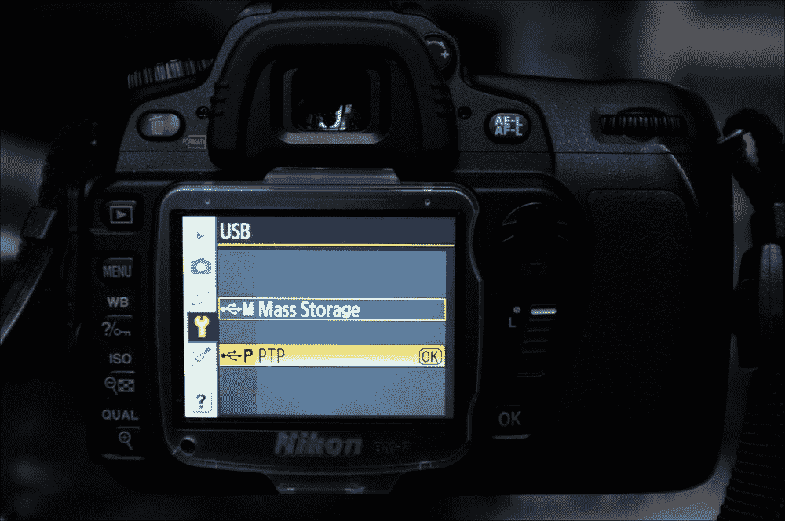

此外，如果相机作为磁盘驱动器挂载，gPhoto2 无法与其通信。这有点问题，因为大多数操作系统都会自动将相机作为磁盘驱动器挂载，无论相机是否处于 PTP 模式。因此，在我们继续安装和使用 gPhoto2 之前，让我们看看如何通过编程方式卸载相机驱动器。

## 编写卸载相机驱动器的 shell 脚本

在 Mac 上，一个名为 PTPCamera 的进程负责代表 iPhoto 等应用程序挂载和控制相机。连接相机后，我们可以在终端中运行以下命令来终止 PTPCamera：

```py
$ killall PTPCamera

```

然后，相机将可用于接收来自 gPhoto2 的命令。然而，请继续阅读，因为我们想编写支持 Linux 的代码！

在大多数桌面 Linux 系统上，当相机连接时，它将被挂载为**Gnome 虚拟文件系统**（**GVFS**）卷。我们可以在终端中运行以下命令来列出挂载的 GVFS 卷：

```py
$ gvfs-mount -l

```

例如，此命令在连接了尼康 D80 相机的 MacBook Pro 笔记本电脑（通过 USB 连接）的 Ubuntu 上产生以下输出：

```py
Drive(0): APPLE SSD SM1024F
  Type: GProxyDrive (GProxyVolumeMonitorUDisks2)
  Volume(0): Recovery HD
    Type: GProxyVolume (GProxyVolumeMonitorUDisks2)
  Volume(1): Macintosh HD
    Type: GProxyVolume (GProxyVolumeMonitorUDisks2)
Drive(1): APPLE SD Card Reader
  Type: GProxyDrive (GProxyVolumeMonitorUDisks2)
Volume(0): NIKON DSC D80
  Type: GProxyVolume (GProxyVolumeMonitorGPhoto2)
  Mount(0): NIKON DSC D80 -> gphoto2://[usb:001,007]/
    Type: GProxyShadowMount (GProxyVolumeMonitorGPhoto2)
Mount(1): NIKON DSC D80 -> gphoto2://[usb:001,007]/
  Type: GDaemonMount
```

注意，输出包括相机的挂载点，在本例中为`gphoto2://[usb:001,007]/`。对于相机驱动器，GVFS 挂载点始终以`gphoto2://`开头。我们可以通过运行如下命令来卸载相机驱动器：

```py
$ gvfs-mount –u gphoto2://[usb:001,007]/

```

现在，如果我们再次运行`gvfs-mount -l`，我们应该会看到相机不再列出。因此，它已卸载，应该可以接收来自 gPhoto2 的命令。

### 小贴士

或者，文件浏览器（如 Nautilus）将显示挂载的相机驱动器，并提供卸载它们的 GUI 控制。然而，作为程序员，我们更喜欢 shell 命令，因为它们更容易自动化。

我们需要在每次插入相机时都卸载相机。为了简化这个过程，让我们编写一个支持多个操作系统（Mac 或任何带有 GVFS 的 Linux 系统）和多个相机的 Bash shell 脚本。创建一个名为 `unmount_cameras.sh` 的文件，并填充以下 Bash 代码：

```py
#!/usr/bin/env bash

if [ "$(uname)" == "Darwin" ]; then
  killall PTPCamera
else
  mounted_cameras=`gvfs-mount -l | grep -Po 'gphoto2://.*/' | uniq`
  for mounted_camera in $mounted_cameras; do
    gvfs-mount -u $mounted_camera
  done
fi
```

注意，此脚本检查操作系统的家族（其中 `"Darwin"` 是 Mac 的家族）。在 Mac 上，它运行 `killall PTPCamera`。在其他系统上，它使用 `gvfs-mount`、`grep` 和 `uniq` 命令的组合来查找每个唯一的 `gphoto2://` 挂载点，然后卸载所有相机。

让我们通过运行以下命令给脚本赋予“可执行”权限：

```py
$ chmod +x unmount_cameras.sh

```

我们随时可以通过执行脚本来确保相机驱动器已卸载：

```py
$ ./unmount_cameras.sh

```

现在，我们有一个标准的方式来使相机可用，因此我们准备安装和使用 gPhoto2。

## 设置和测试 gPhoto2

gPhoto2 及相关库在 Unix-like 系统的开源软件仓库中广泛可用。这并不奇怪——连接到数码相机是当今桌面计算中的常见任务！

对于 Mac，Apple 不提供包管理器，但第三方提供了。MacPorts 包管理器拥有最广泛的仓库。

### 注意

要设置 MacPorts 及其依赖项，请遵循官方指南 [`www.macports.org/install.php`](https://www.macports.org/install.php)。

要通过 MacPorts 安装 gPhoto2，请在终端运行以下命令：

```py
$ sudo port install gphoto2

```

在 Debian 及其衍生版本中，包括 Ubuntu、Linux Mint 和 Raspbian，我们可以通过运行以下命令来安装 gPhoto2：

```py
$ sudo apt-get install gphoto2

```

在 Fedora 及其衍生版本中，包括 Red Hat Enterprise Linux (RHEL) 和 CentOS，我们可以使用以下安装命令：

```py
$ sudo yum install gphoto2

```

OpenSUSE 在 [`software.opensuse.org/package/gphoto`](https://software.opensuse.org/package/gphoto) 提供了 gPhoto2 的一键安装器。

安装 gPhoto2 后，让我们连接一个相机。确保相机已开启并处于 PTP 模式。然后，运行以下命令来卸载相机驱动器和拍照：

```py
$ ./unmount_cameras.sh
$ gphoto2 --capture-image

```

如果相机处于自动对焦模式，你可能会看到或听到镜头移动。（确保相机有可观察的物体，以便自动对焦成功。否则，将不会捕捉到任何照片。）然后，你可能会听到快门打开和关闭。断开相机，使用其查看菜单浏览捕获的照片。如果那里有新照片，gPhoto2 正在运行！

要将相机中的所有图像上传到当前工作目录，我们可以重新连接相机并运行以下命令：

```py
$ ./unmount_cameras.sh
$ gphoto2 --get-all-files
```

要了解 gphoto2 支持的所有标志，我们可以通过运行以下命令打开其手册：

```py
$ man gphoto2
```

接下来，让我们尝试一个更高级的任务，涉及配置以及图像捕捉。我们将以曝光包围的方式拍摄一系列照片。

## 编写用于曝光包围的 shell 脚本

gPhoto2 提供了一个标志，`--set-config`，允许我们重新配置许多相机参数，包括**曝光补偿**。例如，假设我们想要通过相当于一整个光圈的等效值（加倍光圈面积或将其半径增加 sqrt(2) 倍）来过度曝光图像。这种偏差称为曝光补偿（或曝光调整）+1.0 **曝光值**（**EV**）。以下命令配置相机使用 +1.0 EV，然后拍摄照片：

```py
$ gphoto2 --set-config exposurecompensation=1000 --capture-image

```

注意，`exposurecompensation` 的值以千分之一 EV 计价，因此 `1000` 是 +1.0 EV。要欠曝，我们将使用负值。一系列具有不同 EV 的这些命令将实现曝光包围。

我们可以使用 `--set-config` 标志来控制许多摄影属性，而不仅仅是曝光补偿。例如，以下命令以一秒的曝光时间捕捉照片，同时以慢同步模式触发闪光灯：

```py
$ gphoto2 --set-config shutterspeed=1s flashmode=2 --capture-image

```

以下命令列出了给定相机的所有支持属性和值：

```py
$ gphoto2 --list-all-config

```

### 注意

关于光圈、曝光和其他摄影属性的进一步讨论，请参阅第一章，*充分利用您的相机系统*，特别是*捕捉瞬间的主题*部分。

在拍摄一系列曝光包围照片之前，将您的相机调至**光圈优先（A）**模式。这意味着光圈将保持不变，而快门速度将根据光线和 EV 值变化。恒定的光圈将有助于确保所有图像中的同一区域保持对焦。

让我们使用另一个 shell 脚本自动化曝光包围命令，我们将称之为 `capture_exposure_bracket.sh`。它将接受一个标志 `-s`，用于指定帧之间的曝光步长（以千分之一 EV 计），以及另一个标志 `-f`，用于指定帧数。默认值将是 3 帧，间隔为 1.0 EV。以下是脚本的实现：

```py
#!/usr/bin/env bash

ev_step=1000
frames=3
while getopts s:f: flag; do
  case $flag in
    s)
      ev_step="$OPTARG"
      ;;
    f)
      frames="$OPTARG"
      ;;
    ?)
      exit
      ;;
  esac
done

min_ev=$((-ev_step * (frames - 1) / 2))
for ((i=0; i<frames; i++)); do
  ev=$((min_ev + i * ev_step))
  gphoto2 --set-config exposurecompensation=$ev \
    --capture-image
done
gphoto2 --set-config exposurecompensation=0
```

此脚本中的所有命令都适用于 Linux 和 Mac 的跨平台。请注意，我们正在使用 `getopts` 命令来解析参数，并使用 Bash 算术来计算每张照片的 EV 值。

记得通过运行以下命令给脚本赋予“可执行”权限：

```py
$ chmod +x capture_exposure_bracket.sh

```

要卸载相机并每隔 1.5 EV 捕捉 5 张照片，我们可以运行以下命令：

```py
$ ./unmount_cameras.sh
$ ./capture_exposure_bracket.sh –s 1500 –f 5

```

现在我们已经清楚地了解了如何从命令行控制相机，让我们考虑如何将此功能封装在一种通用编程语言中，该语言还可以与 OpenCV 交互。

## 编写用于封装 gPhoto2 的 Python 脚本

Python 是一种高级、动态的编程语言，拥有强大的第三方数学和科学库。OpenCV 的 Python 绑定既高效又相当成熟，封装了 C++ 库的所有主要功能，除了 GPU 优化。Python 也是一种方便的脚本语言，因为其标准库提供了跨平台的接口，可以访问系统的大部分功能。例如，编写 Python 代码来启动一个子进程（也称为子进程）很容易，它可以运行任何可执行文件，甚至是另一个解释器，如 Bash shell。

### 注意

有关从 Python 中启动和与子进程通信的更多信息，请参阅 `subprocess` 模块的文档，网址为 [`docs.python.org/2/library/subprocess.html`](https://docs.python.org/2/library/subprocess.html)。对于子进程是附加 Python 解释器的特殊情况，请参阅 `multiprocessing` 模块的文档，网址为 [`docs.python.org/2/library/multiprocessing.html`](https://docs.python.org/2/library/multiprocessing.html)。

我们将使用 Python 的标准子进程功能来封装 gPhoto2 和我们自己的 shell 脚本。通过从子进程中发送相机命令，我们将使调用者（在 Python 中）将这些视为“发射并忘记”命令。也就是说，Python 进程中的函数会立即返回，这样调用者就不必等待相机处理命令。这是好事，因为相机通常需要几秒钟来自动对焦并捕获一系列照片。

让我们创建一个新的文件，`CameraCommander.py`，并从以下导入语句开始其实现：

```py
import os
import subprocess
```

我们将编写一个名为 `CameraCommander` 的类。作为成员变量，它将有一个当前捕获过程（可能为 `None`）和一个日志文件。默认情况下，日志文件将是 `/dev/null`，这意味着日志输出将被丢弃。在设置成员变量之后，初始化方法将调用一个辅助方法来卸载相机驱动，以便相机准备好接收命令。以下是类的声明和初始化器：

```py
class CameraCommander(object):

  def __init__(self, logPath=os.devnull):
    self._logFile = open(logPath, 'w')
    self._capProc = None
    self.unmount_cameras()
```

当 `CameraCommander` 的实例被删除时，它应该关闭日志文件，如下面的代码所示：

```py
  def __del__(self):
    self._logFile.close()
```

每次打开 `CameraCommander` 的子进程时，命令应由 shell（Bash）解释，命令的打印输出和错误应重定向到日志文件。让我们在以下辅助方法中标准化子进程的这种配置：

```py
  def _open_proc(self, command):
    return subprocess.Popen(
      command, shell=True, stdout=self._logFile,
      stderr=self._logFile)
```

现在，作为我们对 shell 命令的第一个包装器，让我们编写一个方法来在子进程中运行 `unmount_cameras.sh`。卸载相机驱动是一个短暂的过程，它必须在其他相机命令运行之前完成。因此，我们将实现我们的包装器方法，使其在 `unmount_cameras.sh` 返回之前不返回。也就是说，在这种情况下，子进程将以同步方式运行。以下是包装器实现的代码：

```py
  def unmount_cameras(self):
    proc = self._open_proc('./unmount_cameras.sh')
    proc.wait()
```

接下来，让我们考虑如何捕获单个图像。我们首先将调用一个辅助方法来停止任何之前的、冲突的命令。然后，我们将使用通常的`--capture-image`标志调用`gphoto2`命令。以下是包装方法的实现：

```py
  def capture_image(self):
    self.stop_capture()
    self._capProc = self._open_proc(
      'gphoto2 --capture-image')
```

作为另一种捕获模式，我们可以调用`gphoto2`来记录延时摄影系列。`-I`或`--interval`标志，带有一个整数值，指定帧之间的延迟，单位为秒。`-F`或`--frames`标志也接受一个整数值，指定系列中的帧数。如果使用了`-I`标志但省略了`-F`，则过程会无限期地捕获帧，直到被迫终止。让我们提供以下用于延时功能的包装器：

```py
  def capture_time_lapse(self, interval, frames=0):
    self.stop_capture()
    if frames <= 0:
      # Capture an indefinite number of images.
      command = 'gphoto2 --capture-image -I %d' % interval
    else:
      command = 'gphoto2 --capture-image -I %d -F %d' %\
        (interval, frames)
    self._capProc = self._open_proc(command)
```

在拍摄一系列延时摄影照片之前，你可能需要将你的相机调整到**手动曝光**（**M**）模式。这意味着光圈和快门速度将保持恒定，使用手动指定的值。假设场景的光线水平大致恒定，恒定的曝光将有助于防止延时视频中出现不愉快的闪烁。另一方面，如果我们预计在延时摄影系列过程中光线条件会有很大变化，那么 M 模式可能不合适，因为这些情况下，它会导致一些帧曝光不足，而其他帧则曝光过度。

为了允许曝光包围，我们可以简单地包装我们的`capture_exposure_bracket.sh`脚本，如下面的代码所示：

```py
  def capture_exposure_bracket(self, ev_step=1.0, frames=3):
    self.stop_capture()
    self._capProc = self._open_proc(
      './capture_exposure_bracket.sh -s %d -f %d' %\
        (int(ev_step * 1000), frames))
```

正如我们在前三个方法中看到的，在尝试启动另一个之前终止任何正在进行的捕获过程是合理的。（毕竟，相机一次只能处理一个命令）。此外，调用者可能有其他原因要终止捕获过程。例如，主题可能已经离开。我们将提供以下方法来强制终止任何正在进行的捕获过程：

```py
  def stop_capture(self):
    if self._capProc is not None:
      if self._capProc.poll() is None:
        # The process is currently running but might finish
        # before the next function call.
        try:
          self._capProc.terminate()
        except:
          # The process already finished.
          pass
      self._capProc = None
```

同样，我们将提供以下方法来等待任何当前正在运行的捕获过程的完成：

```py
  def wait_capture(self):
    if self._capProc is not None:
      self._capProc.wait()
      self._capProc = None
```

最后，我们将提供以下属性获取器，以便调用者可以检查是否有一个捕获过程目前正在运行：

```py
  @property
  def capturing(self):
    if self._capProc is None:
      return False
    elif self._capProc.poll() is None:
      return True
    else:
      self._capProc = None
      return False
```

这就完成了`CameraCommander`模块。为了测试我们的工作，让我们编写另一个脚本`test_camera_commands.py`，其实现如下：

```py
#!/usr/bin/env python

import CameraCommander

def main():

  cc = CameraCommander.CameraCommander('test_camera_commands.log')

  cc.capture_image()
  print('Capturing image...')
  cc.wait_capture()
  print('Done')

  cc.capture_time_lapse(3, 2)
  print('Capturing 2 images at time interval of 3 seconds...')
  cc.wait_capture()
  print('Done')

  cc.capture_exposure_bracket(1.0, 3)
  print('Capturing 3 images at exposure interval of 1.0 EV...')
  cc.wait_capture()
  print('Done')

if __name__ == '__main__':
  main()
```

确保你的相机已开启，处于 PTP 模式，并且已连接。然后，使测试脚本可执行并运行，如下所示：

```py
$ chmod +x test_camera_commands.py
$ ./test_camera_commands.py

```

等待所有命令完成，然后断开相机以查看图像。检查每张照片的时间戳和 EV 值。理想情况下，应该已经捕获了总共六张照片。然而，实际数量可能会根据诸如自动对焦的成功或失败、捕获和保存每张图像所花费的时间等因素而有所不同。如果有任何疑问，请使用文本编辑器查看日志文件`test_camera_commands.log`。

## 查找 libgphoto2 和包装器

作为使用 gPhoto2 命令行工具的替代方案，我们可以使用底层的 C 库，libgphoto2 ([`github.com/gphoto/libgphoto2`](https://github.com/gphoto/libgphoto2))。该库有几个第三方包装器，包括一组最新的 Python 绑定，称为 python-gphoto2 ([`github.com/gphoto/libgphoto2-python`](https://github.com/gphoto/libgphoto2-python))。

OpenCV 3 的 videoio 模块对 libgphoto2 有可选支持。要启用此功能，我们可以使用`WITH_GPHOTO2` CMake 定义从源代码配置和构建 OpenCV。当然，为了使此选项工作，系统必须已经安装了 libgphoto2 及其头文件。例如，在 Debian、Ubuntu、Linux Mint、Raspbian 和类似系统上，可以通过以下命令安装：

```py
$ sudo apt-get install libgphoto2-dev

```

对于我们的目的，通过 libgphoto2 或 OpenCV 的 videoio 模块控制相机是过度的。我们不想抓取帧进行实时处理。我们只想让我们的 Python 脚本启动额外的进程来卸载和配置相机，并使其捕获照片到其本地存储。gPhoto2 命令行工具和我们的 shell 脚本作为子进程使用非常方便，因此我们将继续在本章的其余部分依赖它们。

### 注意

OpenCV 的一个官方示例演示了通过 videoio 模块使用 gPhoto2 兼容的相机。具体来说，该示例处理焦点控制。请参阅 OpenCV 的 GitHub 仓库中的源代码：[`github.com/Itseez/opencv/blob/master/samples/cpp/autofocus.cpp`](https://github.com/Itseez/opencv/blob/master/samples/cpp/autofocus.cpp)。

# 检测有摄影价值主题的存在

第一章，《充分利用您的相机系统》，提出了一幅照片应该捕捉一个主题在某个时刻。让我们在寻找检测理想或“有摄影价值”的主题和时刻的方法时进一步探讨这个概念。

作为一种媒介，摄影利用光线、光圈、感光表面和时间来描绘场景的图像。最早期的摄影技术，在 19 世纪 20 年代，缺乏分辨率和速度，无法在精确的时刻传达一个详细的主题，但它能够捕捉到晴朗日子里模糊的场景。后来，随着更好的镜头、闪光灯和感光表面，摄影能够捕捉到清晰的场景、正式的肖像、更快更自然的肖像，最终是动作的瞬间，被冻结在时间中。

考虑以下一系列著名的照片，时间跨度从 1826 年到 1942 年：

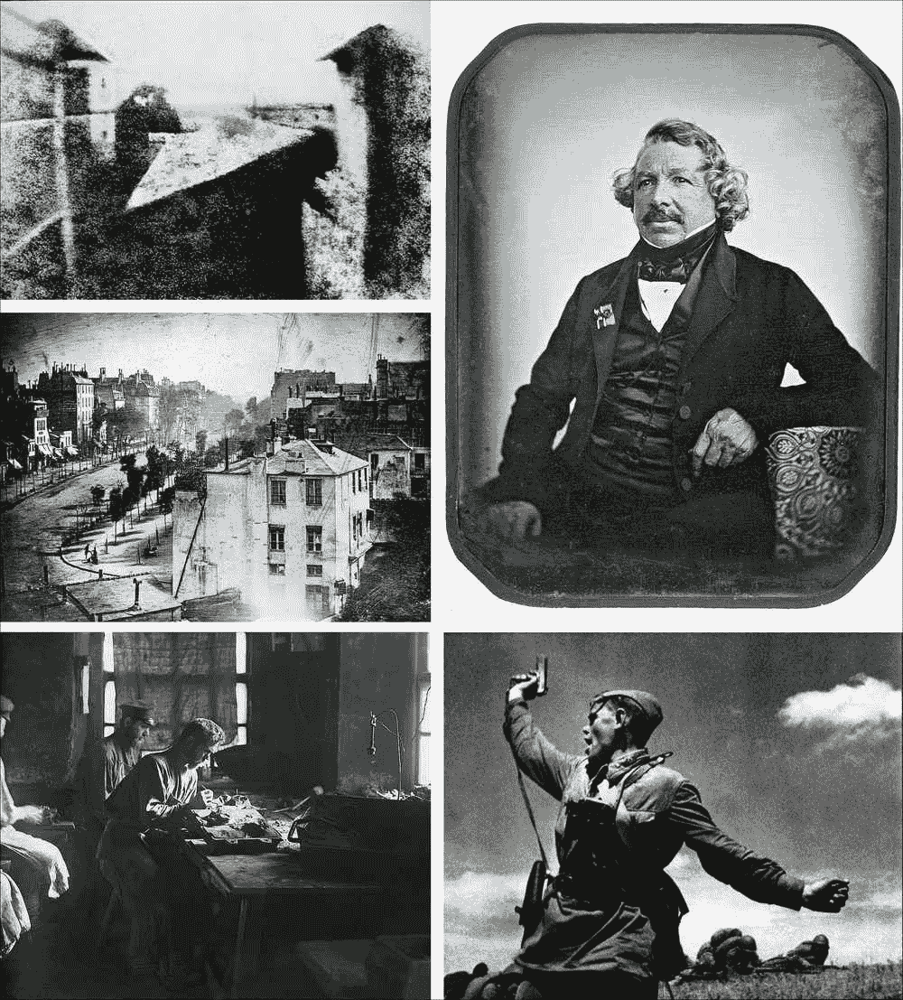

为了一般兴趣，以下是关于前面照片的一些细节：

+   右上角：*勒格拉的窗景*是历史上最早存活的照片，由尼埃普斯在 1826 年或 1827 年在法国圣洛佩-德-瓦雷涅斯拍摄。场景包括尼埃普斯庄园的部分屋顶和乡村。

+   中左：路易·达盖尔在 1838 年拍摄的*特姆普尔大道*被认为是第一张包含人的照片。场景是巴黎的一条繁忙街道，但由于照片的慢速，大多数路人都是不可见的。在街角附近，一个男人正在擦另一个男人的靴子，所以这两个人在一个地方待了足够长的时间，可以被记录下来。

+   右上角：让-巴蒂斯特·萨巴蒂耶-布洛特在 1844 年捕捉了路易·达盖尔的这张正式肖像。

+   左下角：彩色摄影先驱谢尔盖·普罗库丁-戈尔斯基在 1910 年捕捉了这张相对随意的俄罗斯卡斯利工厂工人的肖像。照片中的男子正在卡斯利铁工厂制作铸件，该工厂在 19 世纪和 20 世纪初生产雕塑和豪华家具。

+   左下角：马克斯·阿尔伯特在 1942 年 7 月 12 日，在卢甘斯克（今天在乌克兰）附近拍摄了这张战斗照片。主题是阿列克谢·戈尔杰耶维奇·耶尔缅科，他是红军的一名 23 岁初级政治军官。在照片的瞬间，耶尔缅科正在召集他的部队进攻。几秒钟后，他被击毙。

即使从这些少数例子中，我们也可以推断出一种历史趋势，即更动态的图像，这些图像捕捉了活动、变化甚至暴力的氛围。让我们在自然和野生动物摄影的背景下思考这一趋势。彩色摄影大约在 1907 年开始进入公众视野，经过几十年的技术改进，它成为比黑白更受欢迎的格式。色彩是动态的。风景、植物甚至动物的颜色会根据季节、天气、一天中的时间和它们的年龄而变化。今天，看到一部黑白自然纪录片似乎会很奇怪。

镜头技术的变化也对自然和野生动物摄影产生了深远的影响。随着更长、更快、更锐利的镜头，摄影师能够从远处窥视野生动物的生活。例如，今天，纪录片中充满了捕食者追逐猎物的场景。要拍摄这些场景，使用 20 世纪 20 年代的镜头将是困难的，甚至是不可能的。同样，微距（特写）镜头的质量也得到了很大提高，这对昆虫和其他小型生物的纪录片工作是一个福音。

最后，正如我们在本章开头的讨论中提到的，自动化技术的进步使得摄影师能够在偏远荒野、行动中部署相机。借助数字技术，远程相机可以存储大量的照片，并且这些照片可以轻松组合，产生效果，如时间流逝（强调运动）或 HDR（强调色彩）。如今，这些技术已被广泛使用，因此纪录片爱好者可能熟悉时间流逝的花朵从地面迅速生长或时间流逝的云朵在饱和的 HDR 天空中疾驰的景象。无论大小，一切都被描绘成动态的。

我们可以设计一些简单的规则来帮助区分动态场景和静态场景。以下是一些有用的线索：

+   **运动**：我们可以假设场景中的任何运动都代表捕捉主题在行动或变化时刻的机会。无需知道主题是什么，我们就可以检测其运动并捕捉照片。

+   **颜色**：我们可以假设在特定环境中某些颜色模式是不寻常的，并且它们出现在动态情况下。无需确切知道多彩的主题是什么，我们就可以检测其存在并拍摄它。例如，一大片新颜色可能是云层散开时的日落，或者花朵开放时的景象。

+   **分类**：我们可以假设某些类型的主题是活着的，并且会与它们的环境互动，从而为动态照片创造机会。当我们检测到某个特定的主题类别时，我们可以通过拍照来响应。例如，我们将检测并拍摄哺乳动物的面部。

无论采用何种检测主题的方法，我们必须确保我们的网络摄像头和照相机对场景有相似的观点。它们应该指向同一目标。网络摄像头的视野角度应该与照相机一样宽，甚至更宽，以便网络摄像头能够在照相机视野之前检测到主题。两个摄像头都应该固定牢固，以防止由于振动、风或其他典型干扰而错位。例如，照相机可以安装在坚固的三脚架上，而网络摄像头可以贴在照相机的热靴上（通常为外部闪光灯或外部取景器预留的插槽）。以下图像显示了这种设置的示例：

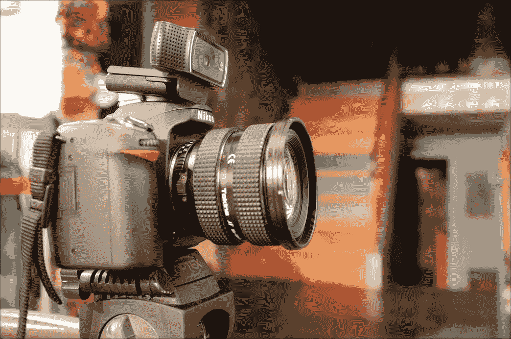

为了提供背景，以下图像是同一设置的稍微远一点的视角。注意，网络摄像头和照相机指向同一主题：

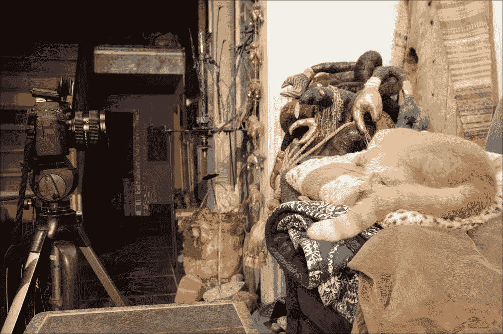

我们将实现每种类型的相机陷阱作为单独的脚本，该脚本将接受命令行参数以调整陷阱的灵敏度。首先，让我们开发一个运动敏感的陷阱。

## 检测移动主题

我们的运动感应摄像头陷阱将依赖于我们之前在*编写用于封装 gPhoto2 的 Python 脚本*部分中实现的`CameraCommander`模块。此外，我们将使用 OpenCV 和 NumPy 来捕捉和分析网络摄像头图像。最后，从 Python 的标准库中，我们将导入`argparse`模块，它将帮助我们解析命令行参数，以及`time`模块，我们将用它来控制检测尝试之间的时间延迟。让我们创建一个文件，`set_motion_trap.py`，并从以下导入开始其实现：

```py
#!/usr/bin/env python

import argparse
import time

import numpy
import cv2

import CameraCommander
```

此脚本将具有简单的结构，只有一个`main()`函数，它读取命令行参数并在循环中进行运动检测。一些参数与网络摄像头的使用有关，我们将称之为检测摄像头。其他参数涉及运动检测算法和相机的使用。`main()`函数开始于以下命令行参数的定义：

```py
def main():

  parser = argparse.ArgumentParser(
    description='This script detects motion using an '
                'attached webcam. When it detects '
                'motion, it captures photos on an '
                'attached gPhoto2-compatible photo '
                'camera.')

  parser.add_argument(
    '--debug', type=bool, default=False,
    help='print debugging information')

  parser.add_argument(
    '--cam-index', type=int, default=-1,
    help='device index for detection camera '
         '(default=0)')
  parser.add_argument(
    '--width', type=int, default=320,
    help='capture width for detection camera '
         '(default=320)')
  parser.add_argument(
    '--height', type=int, default=240,
    help='capture height for detection camera '
         '(default=240)')
  parser.add_argument(
    '--detection-interval', type=float, default=0.25,
    help='interval between detection frames, in seconds '
         '(default=0.25)')

  parser.add_argument(
    '--learning-rate', type=float, default=0.008,
    help='learning rate for background subtractor, which '
         'is used in motion detection (default=0.008)')
  parser.add_argument(
    '--min-motion', type=float, default=0.15,
    help='proportion of frame that must be classified as '
         'foreground to trigger motion event '
         '(default=0.15, valid_range=[0.0, 1.0])')

  parser.add_argument(
    '--photo-count', type=int, default=1,
    help='number of photo frames per motion event '
         '(default=1)')
  parser.add_argument(
    '--photo-interval', type=float, default=3.0,
    help='interval between photo frames, in seconds '
         '(default=3.0)')
  parser.add_argument(
    '--photo-ev-step', type=float, default=None,
    help='exposure step between photo frames, in EV. If '
         'this is specified, --photo-interval is ignored '
         'and --photo-count refers to the length of an '
         'exposure bracketing sequence, not a time-lapse '
         'sequence.')
```

### 注意

当我们运行带有`-h`或`--help`标志的脚本时，将显示参数的`help`文本，如下所示：

```py
$ ./set_motion_trap.py -h
```

到目前为止，我们只声明了参数。接下来，我们需要解析它们并访问它们的值，如下面的代码所示：

```py
  args = parser.parse_args()

  debug = args.debug

  cam_index = args.cam_index
  w, h = args.width, args.height
  detection_interval = args.detection_interval

  learning_rate = args.learning_rate
  min_motion = args.min_motion

  photo_count = args.photo_count
  photo_interval = args.photo_interval
  photo_ev_step = args.photo_ev_step
```

除了参数之外，我们还将使用几个变量。一个`VideoCapture`对象将使我们能够配置并从网络摄像头进行捕捉。矩阵（在 OpenCV 的 Python 包装器中实际上是 NumPy 数组）将使我们能够存储每个网络摄像头的 BGR 和灰度版本，以及一个**前景掩码**。前景掩码将由运动检测算法输出，它将是一个灰度图像，前景（移动）区域为白色，阴影区域为灰色，背景区域为黑色。具体来说，在我们的案例中，运动检测器将是 OpenCV 的`BackgroundSubtractorMOG2`类的实例。最后，我们需要一个`CameraCommander`类的实例来控制相机。以下是相关变量的声明：

```py
  cap = cv2.VideoCapture(cam_index)
  cap.set(cv2.CAP_PROP_FRAME_WIDTH, w)
  cap.set(cv2.CAP_PROP_FRAME_HEIGHT, h)

  bgr = None
  gray = None
  fg_mask = None

  bg_sub = cv2.createBackgroundSubtractorMOG2()

  cc = CameraCommander.CameraCommander()
```

`main()` 函数实现的剩余部分是一个循环。在每次迭代中，我们将线程休眠一个指定的间隔（默认为 0.25 秒），因为这将节省系统资源。因此，我们将跳过一些网络摄像头的帧，但我们可能不需要完整的帧率来检测主题。如果我们没有设置休眠期，摄像头陷阱可能会一直使用 100%的 CPU 核心，尤其是在低功耗 SBC 上的慢速 CPU。以下是循环实现的第一部分：

```py
  while True:
    time.sleep(detection_interval)
```

当我们读取帧时，我们将将其转换为灰度并均衡化：

```py
    success, bgr = cap.read(bgr)
    if success:
      gray = cv2.cvtColor(bgr, cv2.COLOR_BGR2GRAY, gray)
      gray = cv2.equalizeHist(gray, gray)
```

我们将把均衡后的帧和前景掩码传递给`BackgroundSubtractorMOG2`的`apply`方法。此方法累积帧的历史记录，并根据历史记录中帧之间的差异来估计每个像素是否是前景区域、阴影或背景区域的一部分。作为第三个参数，我们将传递一个**学习率**，它是一个范围在[0.0, 1.0]之间的值。低值意味着将更多地考虑旧帧，因此估计将缓慢变化。看看我们如何在以下代码行中调用该方法：

```py
      fg_mask = bg_sub.apply(gray, fg_mask, learning_rate)
```

### 注意

注意，在背景减法算法（如 MOG2）中，前景被定义为像素值在最近历史中发生变化的区域。相反，背景是像素值没有变化的区域。阴影指的是前景的阴影。有关 MOG2 和其他 OpenCV 支持的背景减法算法的详细信息，请参阅官方文档[`docs.opencv.org/3.0-beta/modules/video/doc/motion_analysis_and_object_tracking.html#backgroundsubtractormog2`](http://docs.opencv.org/3.0-beta/modules/video/doc/motion_analysis_and_object_tracking.html#backgroundsubtractormog2)。

作为背景减法器输入和输出的示例，考虑以下图像对。上面的图像是视频的 RGB 帧，而下面的图像是基于视频的前景掩码。请注意，场景是一个岩石海岸，前景有波浪拍打，远处有船只经过：

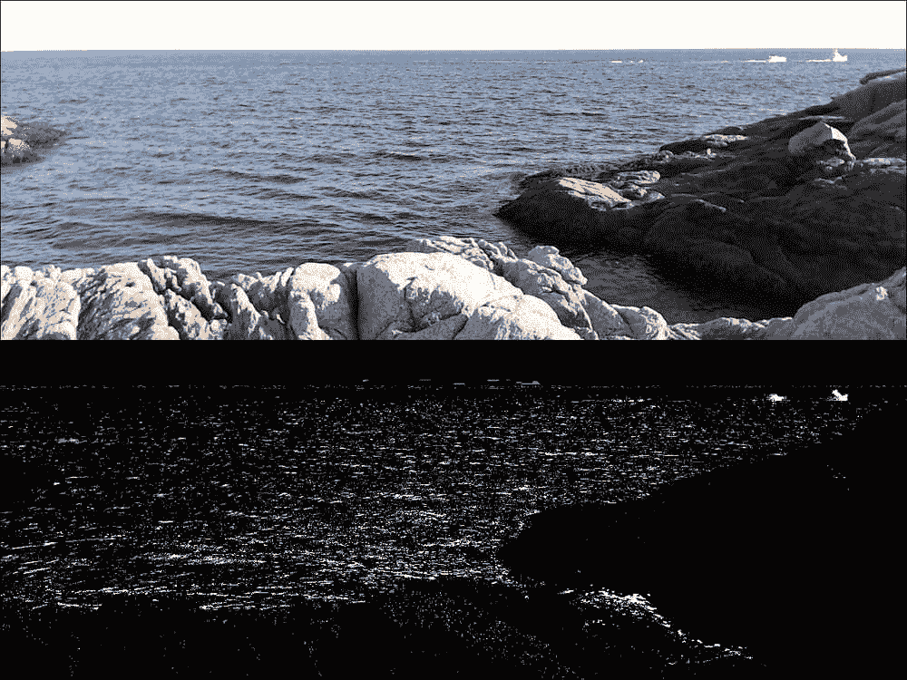

通过计算前景掩码中的白色（前景）值，我们可以得到摄像头在最近历史中捕获的运动量的粗略测量值。我们应该根据帧中的像素数量来归一化这个数值。以下是相关代码：

```py
      h, w = fg_mask.shape
      motion = numpy.sum(numpy.where(fg_mask == 255, 1, 0))
      motion /= float(h * w)
```

如果脚本以`--debug`标志运行，我们将打印运动测量值：

```py
      if debug:
        print('motion=%f' % motion)
```

如果运动超过指定的阈值，并且如果我们还没有开始捕获照片，我们现在将开始捕获照片。根据命令行参数，我们可能捕获曝光分级的系列或时间间隔系列，如下面的代码块所示：

```py
      if motion >= min_motion and not cc.capturing:
        if photo_ev_step is not None:
          cc.capture_exposure_bracket(photo_ev_step, photo_count)
        else:
          cc.capture_time_lapse(photo_interval, photo_count)
```

在这里，循环和`main()`函数结束了。为了确保在执行脚本时`main()`运行，我们必须在脚本中添加以下代码：

```py
if __name__ == '__main__':
  main()
```

我们可以给这个 Python 脚本赋予“可执行”权限，然后像其他 shell 脚本一样运行它，如下面的示例所示：

```py
$ chmod +x set_motion_trap.py
$ ./set_motion_trap.py --debug True
```

考虑下面的图像对。左边的图像显示了运动激活的相机陷阱的物理设置，它恰好运行了带有默认参数的`set_motion_trap.py`。右边的图像是结果照片之一：

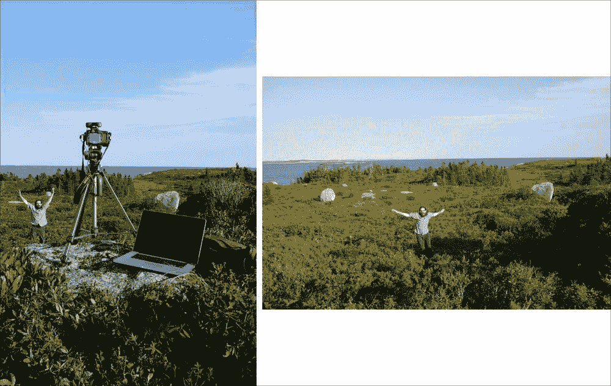

这些图像是用两个不同的相机拍摄的，因此它们在颜色和对比度上有所不同。然而，它们代表的是同一个场景。

尝试调整可选参数，以查看哪些设置对特定相机和移动主体类型最为有效。一旦我们了解了这个相机陷阱的敏感性，让我们继续进行另一个设计，使用一组颜色值作为触发器。

## 检测彩色主体

OpenCV 提供了一套用于测量和比较图像中颜色分布的函数。这个领域被称为直方图分析。直方图只是各种颜色或颜色范围的像素计数的数组。因此，对于每个通道有 256 个可能值的 BGR 图像，直方图可以有高达 256³ = 1680 万个元素。要创建此类直方图，我们可以使用以下代码：

```py
images = [myImage]  # One or more input images
channels =  [0, 1, 2]  # The channel indices
mask = None  # The image region, or None for everything
histSize = [256, 256, 256]  # The channel depths
ranges = [0, 255, 0, 255, 0, 255]  # The color bin boundaries
hist = cv2.calcHist(images, channels, mask, histSize, ranges)
```

直方图值的总和等于输入图像中的像素总数。为了便于比较，我们应该将直方图归一化，使其值的总和为 1.0，换句话说，每个值代表属于给定颜色分组的像素的*比例*。我们可以使用以下代码执行此类归一化：

```py
normalizedHist = cv2.normalize(hist, norm_type=cv2.NORM_L1)
```

然后，为了获得两个归一化直方图的相似度测量值，我们可以使用如下代码：

```py
method = cv2.HISTCMP_INTERSECT  # A method of comparison
similarity = cv2.compareHist(
  normalizedHist, otherNormalizedHist, method)
```

对于`HISTCMP_INTERSECT`方法，相似度是两个直方图的每个元素的最小值的总和。如果我们把直方图看作两条曲线，这个值衡量的是曲线下方的交叠面积。

### 注意

要查看所有支持的直方图比较方法及其数学定义的列表，请参阅官方文档中的[`docs.opencv.org/3.0-beta/modules/imgproc/doc/histograms.html#comparehist`](http://docs.opencv.org/3.0-beta/modules/imgproc/doc/histograms.html#comparehist)。

我们将构建一个使用直方图相似性作为触发器的相机陷阱。当网络摄像头的图像直方图与参考图像的直方图足够相似时，我们将激活照相机。参考图像可以是彩色风景（如果我们对风景的所有颜色都感兴趣），或者它可以是彩色物体的紧密裁剪照片（如果我们只对物体的颜色感兴趣，而不管周围环境如何）。考虑以下紧密裁剪照片的例子：

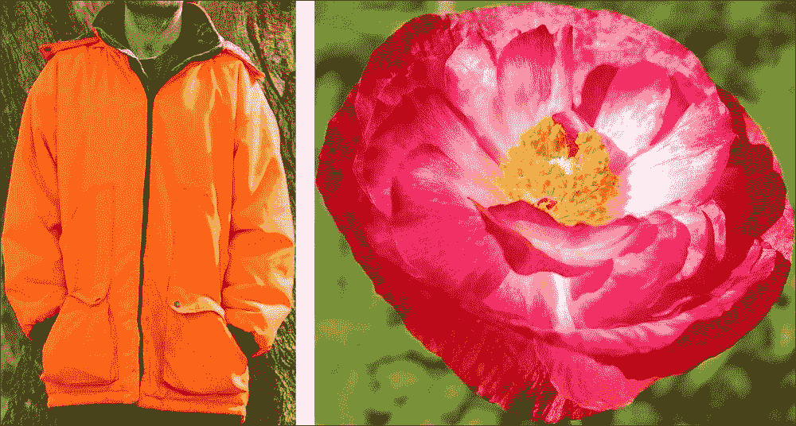

第一张图像（左）展示了一件橙色夹克，这是狩猎季节期间常见的户外服装。 (鲜艳、温暖的色彩使穿着者更易被看到，从而降低了狩猎事故的风险。) 如果我们想检测树林中的人，这可能是一个好的参考图像。第二张图像（右）展示了一种高山罂粟，其花瓣为红色，花蕊为黄色。如果我们想检测花朵开放时的情况，这可能是一个好的参考图像。

### 注意

这些以及其他丰富多彩的图像可以在本书的 GitHub 仓库中找到，网址为[`github.com/OpenCVBlueprints/OpenCVBlueprints/tree/master/chapter_2/CameraTrap/media`](https://github.com/OpenCVBlueprints/OpenCVBlueprints/tree/master/chapter_2/CameraTrap/media)。

让我们在名为`set_color_trap.py`的新脚本中实现基于颜色的相机陷阱。大部分代码将与`set_motion_trap.py`相似，但我们将在这里介绍差异。

在某些情况下，`set_color_trap.py`将打印错误信息到`stderr`。为了实现这一功能，Python 2 和 Python 3 有不同的语法。我们将添加以下导入语句以实现兼容性，即使我们在运行 Python 2，也能使 Python 3 的`print`语法可用：

```py
from __future__ import print_function
```

我们的脚本命令行参数将包括参考图像的路径和一个相似度阈值，这将决定陷阱的灵敏度。以下是参数的定义：

```py
def main():

  parser = argparse.ArgumentParser(
    description='This script detects colors using an '
                'attached webcam. When it detects colors '
                'that match the histogram of a reference '
                'image, it captures photos on an '
                'attached gPhoto2-compatible photo '
                'camera.')

  # ...

  parser.add_argument(
    '--reference-image', type=str, required=True,
    help='path to reference image, whose colors will be '
         'detected in scene')
  parser.add_argument(
    '--min-similarity', type=float, default=0.02,
    help='similarity score that histogram comparator '
         'must find in order to trigger similarity event '
         '(default=0.02, valid_range=[0.0, 1.0])')

  # ...
```

### 注意

要阅读此脚本中省略的部分，请访问本书的 GitHub 仓库，网址为[`github.com/OpenCVBlueprints/OpenCVBlueprints/chapter_2/CameraTrap/set_color_trap.py`](https://github.com/OpenCVBlueprints/OpenCVBlueprints/chapter_2/CameraTrap/set_color_trap.py)。

我们将解析参数并尝试从文件中加载参考图像。如果无法加载图像，脚本将打印错误信息并提前退出，如下面的代码所示：

```py
  args = parser.parse_args()

  # ...

  reference_image = cv2.imread(args.reference_image,
                               cv2.IMREAD_COLOR)
  if reference_image is None:
    print('Failed to read reference image: %s' %
          args.reference_image, file=sys.stderr)
    return

  min_similarity = args.min_similarity

  # ...
```

我们将创建参考图像的归一化直方图，稍后，我们还将创建来自网络摄像头的每一帧的归一化直方图。为了帮助创建归一化直方图，我们将在本地定义另一个函数。（Python 允许嵌套函数定义。）以下是相关代码：

```py
  # ...

  channels = range(3)
  hist_size = [256] * 3
  ranges = [0, 255] * 3

  def create_normalized_hist(image, hist=None):
    hist = cv2.calcHist(
      [image], channels, None, hist_size, ranges, hist)
    return cv2.normalize(hist, hist, norm_type=cv2.NORM_L1)

  reference_hist = create_normalized_hist(reference_image)
  query_hist = None

  # ...
```

再次强调，每次我们从网络摄像头捕获一帧时，我们将找到其归一化直方图。然后，我们将根据比较的`HISTCMP_INTERSECT`方法测量参考直方图和当前场景直方图的相似度，这意味着我们只想计算直方图的交集或重叠区域。如果相似度等于或大于阈值，我们将开始捕获照片。

这里是主循环的实现：

```py
  while True:
    time.sleep(detection_interval)
    success, bgr = cap.read(bgr)
    if success:
      query_hist = create_normalized_hist(
        bgr, query_hist)
      similarity = cv2.compareHist(
        reference_hist, query_hist, cv2.HISTCMP_INTERSECT)
      if debug:
        print('similarity=%f' % similarity)
      if similarity >= min_similarity and not cc.capturing:
        if photo_ev_step is not None:
          cc.capture_exposure_bracket(photo_ev_step, photo_count)
        else:
          cc.capture_time_lapse(photo_interval, photo_count)
```

这就结束了`main()`函数。再次强调，为了确保在脚本执行时调用`main()`，我们将添加以下代码：

```py
if __name__ == '__main__':
  main()
```

使脚本可执行。然后，例如，我们可以这样运行它：

```py
$ ./set_color_trap.py --reference-image media/OrangeCoat.jpg --min-similarity 0.13 --width 640 --height 480 --debug True

```

请看以下图像对。左侧图像显示了相机陷阱的物理设置，正在运行`set_color_trap.py`，并使用我们刚才提到的自定义参数。右侧图像是结果照片之一：

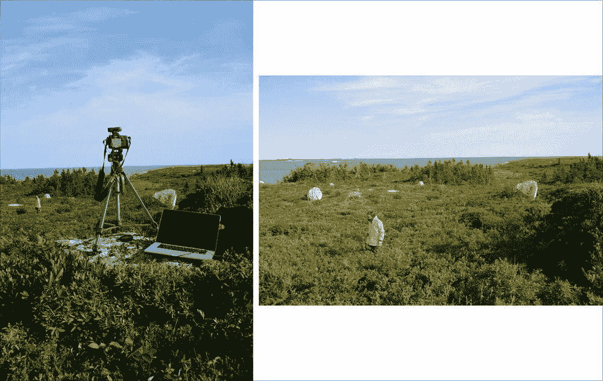

再次强调，这些图像来自不同的相机，它们以不同的方式呈现场景的颜色和对比度。

你可能想尝试`set_color_trap`的参数，特别是参考图像和相似度阈值。请注意，比较方法`HISTCMP_INTERSECT`倾向于产生较低的相似度，因此默认阈值仅为 0.02，即直方图的重叠为 2%。如果你修改代码以使用不同的比较方法，你可能需要一个更高的阈值，并且最大相似度可能超过 1.0。

一旦你完成基于颜色的相机陷阱测试，我们就继续使用人脸检测作为我们的最终触发方式。

## 检测哺乳动物的脸

如你所知，OpenCV 的`CascadeClassifier`类对于人脸检测和其他类型的对象检测非常有用，它使用一个称为级联的对象特征模型，该模型从 XML 文件中加载。我们在第一章的*Supercharging the GS3-U3-23S6M-C and other Point Grey Research cameras*部分使用了`CascadeClassifier`和`haarcascade_frontalface_alt.xml`进行人脸检测，*充分利用您的相机系统*。在本书的后续章节中，在第五章的*Generic Object Detection for Industrial Applications*中，我们将检查`CascadeClassifier`的所有功能，以及一组用于创建任何类型对象的级联的工具。目前，我们将继续使用 OpenCV 附带的前训练级联。值得注意的是，OpenCV 为人类和猫的人脸检测提供了以下级联文件：

+   对于人类的前脸：

    +   `data/haarcascades/haarcascade_frontalface_default.xml`

    +   `data/haarcascades/haarcascade_frontalface_alt.xml`

    +   `data/haarcascades/haarcascade_frontalface_alt2.xml`

    +   `data/lbpcascades/lbpcascade_frontalface.xml`

+   对于人类的侧面脸：

    +   `data/haarcascades/haarcascade_profileface.xml`

    +   `data/lbpcascades/lbpcascade_profileface.xml`

+   对于猫的前脸：

    +   `data/haarcascades/haarcascade_frontalcatface.xml`

    +   `data/haarcascades/haarcascade_frontalcatface_extended.xml`

    +   `data/lbpcascades/lbpcascade_frontalcatface.xml`

LBP 级联比 Haar 级联更快，但稍微不太准确。Haar 级联的扩展版本（如`haarcascade_frontalcatface_extended.xml`中使用的那样）对水平和对角特征都很敏感，而标准的 Haar 级联只对水平特征敏感。例如，猫的胡须可能会被识别为对角特征。

### 注意

本书第五章通用工业应用对象检测将详细讨论级联类型。此外，有关如何使用 OpenCV 的猫级联进行训练的完整教程，请参阅 Joseph Howse（Packt Publishing，2015 年）所著的《OpenCV for Secret Agents》一书中的第三章使用机器学习识别面部表情。

顺便说一下，猫脸检测级联也可能检测到其他哺乳动物的面部。以下图片是使用`haarcascade_frontalcatface_extended.xml`在猫（左）、红熊猫（右上）和猞猁（右下）的照片上检测结果的可视化：

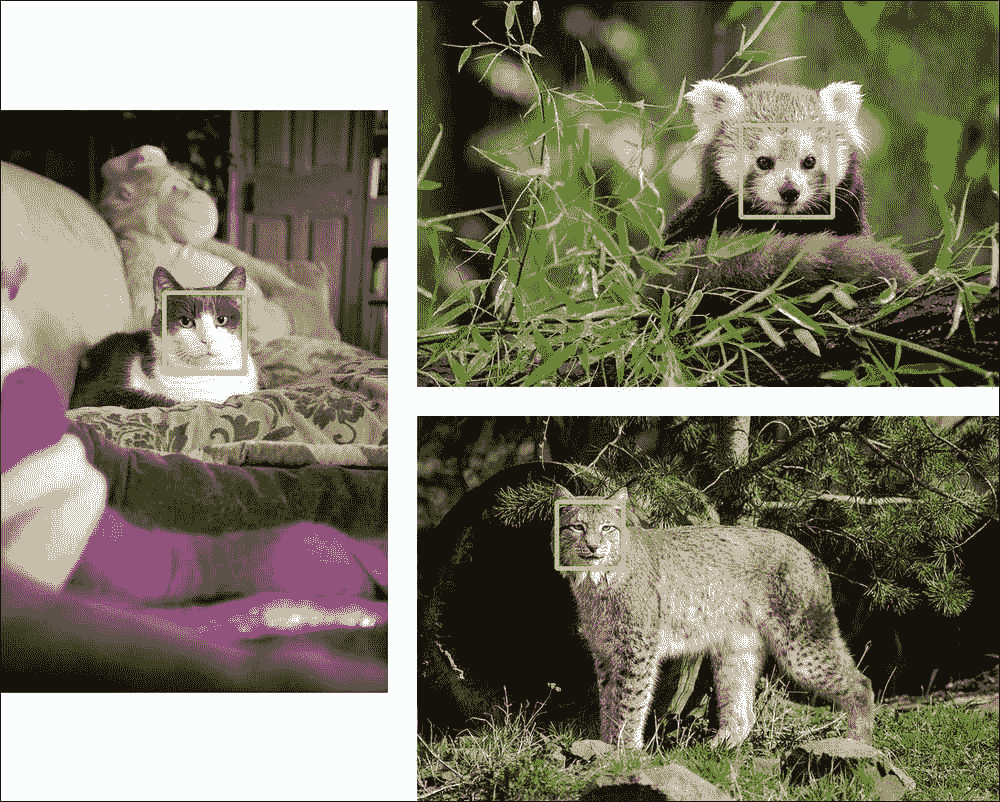

### 注意

红熊猫和猞猁的照片由 Mathias Appel 拍摄，他慷慨地将这些以及其他许多图片发布到公共领域。请参阅他的 Flickr 页面[`www.flickr.com/photos/mathiasappel/`](https://www.flickr.com/photos/mathiasappel/)。

让我们在名为`set_classifier_trap.py`的新脚本中实现基于分类的相机陷阱。必要的导入与`set_color_trap.py`相同。`set_classifier_trap.py`的命令行参数包括级联文件的路径以及影响`CascadeClassifier`使用的其他参数。以下是相关代码：

```py
def main():

  parser = argparse.ArgumentParser(
    description='This script detects objects using an '
                'attached webcam. When it detects '
                'objects that match a given cascade '
                'file, it captures photos on an attached '
                'gPhoto2-compatible photo camera.')

  # ...

  parser.add_argument(
    '--cascade-file', type=str, required=True,
    help='path to cascade file that classifier will use '
         'to detect objects in scene')
  parser.add_argument(
    '--scale-factor', type=float, default=1.05,
    help='relative difference in scale between '
         'iterations of multi-scale classification '
         '(default=1.05)')
  parser.add_argument(
    '--min-neighbors', type=int, default=8,
    help='minimum number of overlapping objects that '
         'classifier must detect in order to trigger '
         'classification event (default=8)')
  parser.add_argument(
    '--min-object-width', type=int, default=40,
    help='minimum width of each detected object'
         '(default=40)')
  parser.add_argument(
    '--min-object-height', type=int, default=40,
    help='minimum height of each detected object'
         '(default=40)')

  # ...
```

### 注意

要阅读此脚本省略的部分，请访问本书的 GitHub 仓库[`github.com/OpenCVBlueprints/OpenCVBlueprints/chapter_2/CameraTrap/set_classifier_trap.py`](https://github.com/OpenCVBlueprints/OpenCVBlueprints/chapter_2/CameraTrap/set_classifier_trap.py)。

在像往常一样解析参数之后，我们将使用指定的级联文件初始化一个`CascadeClassifier`实例。如果文件加载失败，我们将打印错误消息并提前退出脚本。请参阅以下代码：

```py
  args = parser.parse_args()

  # ...

  classifier = cv2.CascadeClassifier(args.cascade_file)
  if classifier.empty():
    print('Failed to read cascade file: %s' %
          args.cascade_file, file=sys.stderr)
    return

  scale_factor = args.scale_factor
  min_neighbors = args.min_neighbors
  min_size = (args.min_object_width, args.min_object_height)

  # ...
```

在脚本主循环的每次迭代中，我们将网络摄像头图像转换为均衡的黑白版本，并将其传递给`CascadeClassifier`的`detectMultiScale`方法。我们将使用一些命令行参数作为额外的参数来控制`detectMultiScale`的灵敏度。如果至少检测到一个面部（或其他相关对象），我们将开始捕获照片，就像往常一样。以下是循环的实现：

```py
  while True:
    time.sleep(detection_interval)
    success, bgr = cap.read(bgr)
    if success:
      gray = cv2.cvtColor(bgr, cv2.COLOR_BGR2GRAY, gray)
      gray = cv2.equalizeHist(gray, gray)
      objects = classifier.detectMultiScale(
        gray, scaleFactor=scale_factor,
        minNeighbors=min_neighbors, minSize=min_size)
      num_objects = len(objects)
      if debug:
        print('num_objects=%d' % num_objects)
      if num_objects > 0 and not cc.capturing:
        if photo_ev_step is not None:
          cc.capture_exposure_bracket(photo_ev_step, photo_count)
        else:
          cc.capture_time_lapse(photo_interval, photo_count)
```

这完成了`main()`函数，剩下的只是在脚本执行时像往常一样调用`main()`：

```py
if __name__ == '__main__':
  main()
```

使脚本可执行。然后，例如，我们可以这样运行它：

```py
$ ./set_classifier_trap.py --cascade-file cascades/haarcascade_frontalcatface_extended.xml --min-neighbors 16 --scale-factor 1.2 --width 640 --height 480 --debug True

```

参考以下一组图片。左侧图片展示了相机陷阱的物理设置，它正在运行`set_classifier_trap.py`，并使用我们刚刚提到的自定义参数。右侧图片是其中两张结果照片：

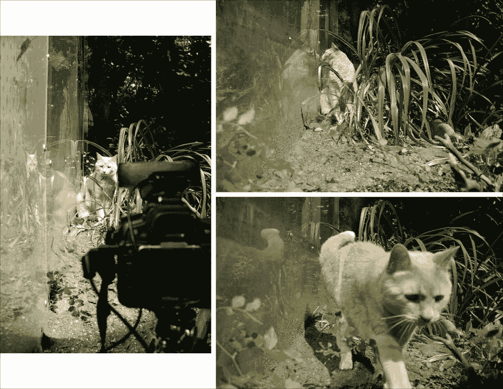

左侧图像和右侧图像来自两个不同的相机，因此颜色和对比度不同。此外，两个右侧图像来自`set_classifier_trap.py`的单独运行，照明条件和相机位置略有变化。

随意尝试`set_classifier_trap.py`的参数。你可能甚至想创建自己的级联文件来检测不同类型的面部或对象。第五章，*工业应用中的通用对象检测*，将提供大量信息，帮助你更好地使用`CascadeClassifier`和级联文件。

接下来，我们将考虑处理我们可能用任何脚本或简单的 gPhoto2 命令捕获的相片的方法。

# 处理图像以显示细微的颜色和运动

到目前为止，你可能已经捕获了一些曝光包围的相片和延时摄影相片。使用照片管理应用、文件浏览器或以下 gPhoto2 命令将它们上传到你的电脑上：

```py
$ gphoto2 --get-all-files

```

后者命令会将文件上传到当前工作目录。

我们将合并曝光包围的相片来创建 HDR 图像，这将改善阴影和亮部的色彩表现。同样，我们将合并延时摄影相片来创建延时视频，这将展示加速尺度上的渐进运动。我们将首先处理来自书籍 GitHub 仓库的一些样本相片，该仓库地址为[`github.com/OpenCVBlueprints/OpenCVBlueprints/tree/master/chapter_2/CameraTrap/media`](https://github.com/OpenCVBlueprints/OpenCVBlueprints/tree/master/chapter_2/CameraTrap/media)，然后你将能够将代码适配以使用你的相片。

## 创建 HDR 图像

OpenCV 3 有一个名为“photo”的新模块。其中两个类，`MergeDebevec`和`MergeMertens`，通过合并曝光包围的相片来创建 HDR 图像。无论使用哪个类，生成的 HDR 图像的通道值都在范围[0.0, 1.0]内。`MergeDebevec`生成的 HDR 图像在可以显示或打印之前需要伽玛校正。该照片模块提供了几个**色调映射**函数，能够执行校正。

另一方面，`MergeMertens`生成的 HDR 图像不需要伽玛校正。其通道值只需放大到范围[0, 255]。我们将使用`MergeMertens`，因为它更简单，并且通常在保留颜色饱和度方面表现更好。

### 注意

有关 OpenCV 3 中 HDR 成像和色调映射的更多信息，请参阅官方文档[`docs.opencv.org/3.0-beta/modules/photo/doc/hdr_imaging.html`](http://docs.opencv.org/3.0-beta/modules/photo/doc/hdr_imaging.html)。还可以查看官方教程[`docs.opencv.org/3.0-beta/doc/tutorials/photo/hdr_imaging/hdr_imaging.html`](http://docs.opencv.org/3.0-beta/doc/tutorials/photo/hdr_imaging/hdr_imaging.html)。

`MergeDebevec`和`MergeMertens`类分别基于以下论文：

P. Debevec, and J. Malik, *从照片中恢复高动态范围辐射图*, ACM SIGGRAPH 会议论文集，1997 年，369 - 378。

T. Mertens, J. Kautz, and F. Van Reeth, *曝光融合*, 第 15 届太平洋计算机图形和应用会议论文集，2007 年，382 - 390。

为了演示目的，GitHub 仓库包含一对名为 Plasma 的猫的曝光包围照片。（她的照片和 HDR 合并版本在本章的*规划相机陷阱*部分中较早出现。）让我们创建一个脚本，`test_hdr_merge.py`，以合并未处理的照片，`media/PlasmaWink_0.jpg`和`media/PlasmaWink_1.jpg`。以下是实现方式：

```py
#!/usr/bin/env python

import cv2

def main():

  ldr_images = [
    cv2.imread('media/PlasmaWink_0.jpg'),
    cv2.imread('media/PlasmaWink_1.jpg')]

  hdr_processor = cv2.createMergeMertens()
  hdr_image = hdr_processor.process(ldr_images) * 255
  cv2.imwrite('media/PlasmaWink_HDR.jpg', hdr_image)

if __name__ == '__main__':
  main()
```

从仓库中获取脚本和媒体文件，运行脚本，查看生成的 HDR 图像。然后，修改脚本以处理您自己的曝光包围照片。HDR 可以为任何具有强烈光线和深阴影的场景产生戏剧性的效果。风景和阳光照射的房间是很好的例子。

使用 HDR 成像，我们压缩了曝光差异。接下来，通过延时摄影，我们将压缩时间差异。

## 创建延时视频

在第一章的*超级充电 PlayStation Eye*部分中，我们创建了一个慢动作视频。记住，我们只是以高速（187 FPS）捕获图像，并将它们放入一个配置为以正常速度（60 FPS）播放的视频中。同样，要创建延时视频，我们将读取以低速（小于 1 FPS）捕获的图像文件，并将它们放入一个配置为以正常速度（60 FPS）播放的视频中。

为了演示目的，本书的 GitHub 仓库包含一组名为 Josephine 的猫的延时照片。当我们为 Josephine 制作延时视频时，我们会看到她非常活跃，即使她坐在椅子上时也是如此！作为预览，以下是延时视频的三个连续帧：

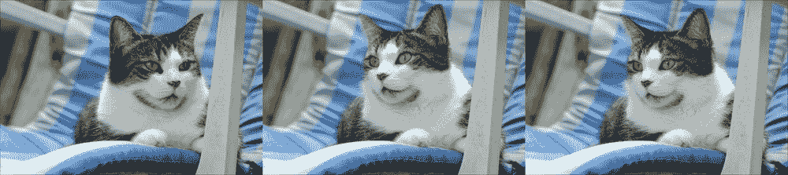

该系列包含 56 张照片，名称从`media/JosephineChair_00.jpg`到`media/JosephineChair_55.jpg`。以下脚本，我们将称之为`test_time_lapse_merge.py`，将读取照片并生成一个名为`media/JosephineChair_TimeLapse.avi`的一秒延时视频：

```py
#!/usr/bin/env python

import cv2

def main():

  num_input_files = 56
  input_filename_pattern = 'media/JosephineChair_%02d.jpg'
  output_filename = 'media/JosephineChair_TimeLapse.avi'
  fourcc = cv2.VideoWriter_fourcc('M', 'J', 'P', 'G')
  fps = 60.0
  writer = None

  for i in range(num_input_files):
    input_filename = input_filename_pattern % i
    image = cv2.imread(input_filename)
    if writer is None:
      is_color = (len(image.shape) > 2)
      h, w = image.shape[:2]
      writer = cv2.VideoWriter(
        output_filename, fourcc, fps, (w, h), is_color)
    writer.write(image)

if __name__ == '__main__':
    main()
```

从仓库中获取脚本和媒体，运行脚本，观看约瑟芬从她的椅子上观看世界的视频结果。然后，修改脚本以处理你自己的图像。也许你会捕捉到其他慢动作动物的运动，花朵的绽放，或者阳光和云朵穿越景观的景象。

作为进一步的项目，你可能希望创建 HDR 延时视频。你可以通过修改我们的`capture_exposure_bracket.sh`脚本来开始，捕捉多批曝光包围的图像，每批之间有时间延迟。（例如，可以使用`sleep 3`命令延迟 3 秒。）将捕获的图像上传到你的电脑后，你可以将每批合并成 HDR 图像，然后将 HDR 图像合并成延时视频。

探索其他摄影技术，然后尝试自动化它们！

# 进一步学习

计算摄影是一个多样化和受欢迎的领域，它结合了艺术家、技术人员和科学家的工作。因此，有许多类型的作者、讲师和导师可以帮助你成为一名更好的“计算摄影师”。以下是一些有用的指南示例：

+   《使用 OpenCV 学习图像处理》，作者格洛丽亚·布埃诺·加西亚等（Packt Publishing，2015 年），涵盖了 OpenCV 3 在图像捕捉、图像编辑和计算摄影方面的广泛功能。本书使用 C++编写，适合计算机视觉初学者。

+   《国家地理摄影大师视频讲座》（The Great Courses，2015 年）提供了对大师摄影师目标和技术的深刻见解。几位讲师是野生动物摄影师，他们使用相机陷阱的做法为这一章节提供了灵感。

+   《开源天体摄影》，作者卡尔·萨诺（CreateSpace Independent Publishing Platform，2013 年），涵盖了使用 gPhoto2 和其他开源软件，以及摄影硬件来捕捉和处理夜空详细图像的使用方法。

+   《好奇摄影师的科学》，作者查尔斯·S·约翰逊（CRC Press，2010 年），解释了光、镜头和摄影的科学历史和原理。此外，它还提供了解决常见摄影问题的实用解决方案，例如为微距摄影选择和设置良好的设备。

不论是作为爱好还是职业，计算摄影都是一种探索和记录世界的绝佳方式，从特定的视角来看。它需要观察、实验和耐心，所以请放慢脚步！花时间从他人的探索中学习，并分享你的经验。

# 摘要

本章展示了一套令人惊讶的灵活的命令和类，使我们能够用简短和简单的代码进行计算摄影实验。我们已经编写了控制相机的脚本。在这个过程中，我们熟悉了 gPhoto2、Bash shell、PTP 通信、GVFS 挂载点和 Python 对子进程的支持。我们还编写了几个照片陷阱的变体，以便在主题进入视野时拍照。为此，OpenCV 为我们提供了检测运动、测量颜色相似性和分类对象的能力。最后，我们使用 OpenCV 将一组照片组合成时间流逝视频或 HDR 图像。

到目前为止，这本书已经提供了一种相当广泛的概述，介绍了如何捕捉光作为数据、控制相机、检测主题以及处理照片的方法。接下来的章节将专注于一系列高级技术，这将使我们能够对图像的主题进行更精细的分类和识别，并且能够以考虑相机运动和视角的方式处理照片和视频。
