# 第三章. 使用机器学习识别面部表情

自九十年代初以来，自动面部表情识别引起了广泛关注，尤其是在人机交互领域。随着计算机开始成为我们生活的一部分，它们需要变得越来越智能。表情识别系统将增强人类与计算机之间的智能交互。

虽然人类可以轻易地识别面部表情，但一个可靠的表情识别系统仍然是一个挑战。在本章中，我们将介绍使用 OpenCV 库中的各种算法的基本面部表情实现，包括使用 ml 模块进行特征提取和分类。

在本章中，我们将简要介绍以下主题：

+   一个简单的识别人类面部表情的架构

+   OpenCV 库中的特征提取算法

+   学习和测试阶段，使用各种机器学习算法

# 介绍面部表情识别

自动面部表情识别是一个有趣且具有挑战性的问题，并在许多领域如人机交互、人类行为理解和数据驱动动画中具有几个重要应用。与面部识别不同，面部表情识别需要区分不同个体中相同的表情。当一个人可能以不同的方式表现出相同的表情时，问题变得更加困难。

当前用于测量面部表情的方法可以分为两种类型：静态图像和图像序列。在静态图像方法中，系统分别分析每个图像帧中的面部表情。在图像序列方法中，系统试图捕捉图像帧序列中面部上看到的运动和变化的时序模式。最近，注意力已经转向图像序列方法。然而，这种方法比静态方法更困难，需要更多的计算。在本章中，我们将遵循静态图像方法，并使用 OpenCV 3 库比较几种算法。

自动面部表情识别的问题包括三个子问题：

+   **在图像中找到面部区域**：面部在图像中的精确位置对于面部分析非常重要。在这个问题中，我们希望在图像中找到面部区域。这个问题可以被视为一个检测问题。在我们的实现中，我们将使用 OpenCV 的 objdetect 模块中的级联分类器来检测面部。然而，级联分类器容易产生对齐错误。因此，我们应用 flandmark 库从面部区域中提取面部特征点，并使用这些特征点来提取精确的面部区域。

    ### 注意

    Flandmark 是一个开源的 C 库，实现了人脸关键点检测器。你可以在以下章节中了解更多关于 flandmark 的信息。基本上，你可以使用你想要的任何库来提取关键点。在我们的实现中，我们将使用这个库来降低复杂性，同时将库集成到我们的项目中。

+   **从人脸区域提取特征**：给定人脸区域，系统将提取面部表情信息作为一个特征向量。特征向量编码了从输入数据中提取的相关信息。在我们的实现中，特征向量是通过结合特征 2d 模块中的特征检测器和核心模块中的 kmeans 算法获得的。

+   **将特征分类到情感类别**：这是一个分类问题。系统使用分类算法将之前步骤中提取的特征映射到情感类别（如快乐、中性或悲伤）。这是本章的主要内容。我们将评估 ml 模块中的机器学习算法，包括神经网络、支持向量机和 K-Nearest-Neighbor。

在以下章节中，我们将向你展示实现面部表情系统的完整过程。在下一节中，你将找到几种提高系统性能的方法来满足你的需求。

## 面部表情数据集

为了简化章节，我们将使用数据集来演示过程，而不是使用实时摄像头。我们将使用标准数据集，**日本女性面部表情**（**JAFFE**）。数据集中有 10 个人的 214 张图片。每个人有每种表情的三张图片。数据集包括以下图所示的七个表情（快乐、悲伤、愤怒、厌恶、恐惧、惊讶和中性）：

### 注意

你需要从以下链接下载数据集：[`www.kasrl.org/jaffe.html`](http://www.kasrl.org/jaffe.html)

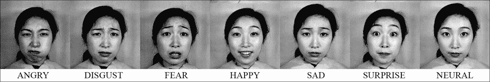

JAFFE 数据集的样本图像。

# 在图像中找到人脸区域

在本节中，我们将向你展示在图像中检测人脸的基本方法。我们将使用 OpenCV 中的级联分类器来检测人脸位置。这种方法可能存在对齐错误。为了获得精确的位置，我们还将提供另一种使用面部关键点来查找人脸区域的高级方法。在我们的实现中，我们只使用人脸区域。然而，许多研究人员使用面部关键点来提取面部组件，如眼睛和嘴巴，并对这些组件分别进行操作。

### 注意

如果你想了解更多，你应该检查本章中的*面部关键点*部分。

## 使用人脸检测算法提取人脸区域

在我们的实现中，我们将在 objdetect 模块中使用基于 Haar 特征的级联分类器。在 OpenCV 中，你也可以使用基于 LBP 的级联提取人脸区域。基于 LBP 的级联比基于 Haar 的级联更快。使用预训练模型，基于 LBP 的级联性能低于基于 Haar 的级联。然而，训练一个基于 LBP 的级联以获得与基于 Haar 的级联相同的性能是可能的。

### 注意

如果你想要详细了解目标检测，你应该查看第五章，*工业应用中的通用目标检测*。

检测人脸的代码非常简单。首先，你需要将预训练的级联分类器加载到你的 OpenCV 安装文件夹中：

```py
CascadeClassifier face_cascade;
face_cascade.load("haarcascade_frontalface_default.xml");
```

然后，以彩色模式加载输入图像，将图像转换为灰度，并应用直方图均衡化以增强对比度：

```py
Mat img, img_gray;
img = imread(imgPath[i], CV_LOAD_IMAGE_COLOR);
cvtColor(img, img_gray, CV_RGB2GRAY);
equalizeHist(img_gray, img_gray);
```

现在，我们可以在图像中找到人脸。`detectMultiScale`函数将所有检测到的人脸存储在向量中，作为 Rect(x, y, w, h)：

```py
vector<Rect> faces;
face_cascade.detectMultiScale( img_gray, faces, 1.1, 3 );
```

在此代码中，第三个参数 1.1 是缩放因子，它指定了在每次缩放时图像大小将如何调整。以下图显示了使用缩放因子的缩放金字塔。在我们的案例中，缩放因子是`1.1`。这意味着图像大小减少了 10%。这个因子越低，我们找到人脸的机会就越大。缩放过程从原始图像开始，直到图像分辨率在 X 或 Y 方向达到模型维度为止。然而，如果缩放级别太多，计算成本会很高。因此，如果你想减少缩放级别，可以将缩放因子增加到`1.2`（20%）、`1.3`（30%）或更高。如果你想增加缩放级别，可以将缩放因子减少到`1.05`（5%）或更高。第四个参数`3`是每个候选位置应具有的最小邻居数，才能成为人脸位置。

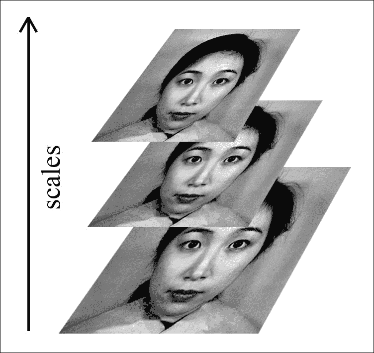

图像尺度金字塔

如果我们将邻居数设置为零，以下图显示了人脸检测的结果：

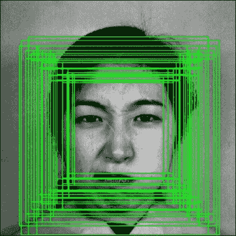

所有的人脸区域候选者

最后，人脸区域的位置可以按以下方式获得：

```py
int bbox[4] = { faces[i].x, faces[i].y, faces[i].x + faces[i].width, faces[i].y + faces[i].height };
```

faces 向量中的每个元素都是一个`Rect`对象。因此，我们可以通过`faces[i].x`和`faces[i].y`获取顶点的位置。右下角的位置是`faces[i].x + faces[i].width`和`faces[i].y + faces[i].height`。这些信息将被用作面部特征点处理过程的初始位置，如以下章节所述。

## 从人脸区域提取面部特征点

面部检测器的一个缺点是结果可能存在错位。错位可能发生在缩放或平移过程中。因此，所有图像中提取的面部区域不会彼此对齐。这种错位可能导致识别性能不佳，尤其是在使用 DENSE 特征时。借助面部特征点，我们可以对所有的提取面部进行对齐，使得每个面部组件在数据集中位于相同的位置。

许多研究人员利用面部特征点与其他情绪识别方法进行分类。

我们将使用 flandmark 库来找到眼睛、鼻子和嘴巴的位置。然后，我们将使用这些面部特征点来提取精确的面部边界框。

### 介绍 flandmark 库

Flandmark 是一个开源的 C 语言库，实现了面部特征点检测器。

### 注意

您可以在以下网址访问 flandmark 库的主页：[`cmp.felk.cvut.cz/~uricamic/flandmark/`](http://cmp.felk.cvut.cz/~uricamic/flandmark/)。

给定一张人脸图像，flandmark 库的目标是估计一个代表面部组件位置的 S 形。S 形中的面部形状是一个表示为(x, y)位置的数组：S = [x[0]y[0]x[1]y[1]....x[n]y[n]]。

flandmark 中的预训练模型包含八个点，如图所示：

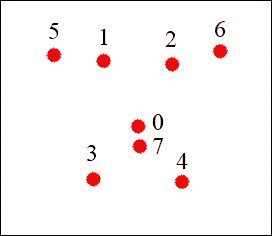

8 个特征点模型以及每个特征点的对应索引。

在我们的实现中，我们使用 flandmark，因为它很容易集成到 OpenCV 项目中。此外，flandmark 库在许多场景中都非常稳健，即使当人戴着眼镜时也是如此。在以下图中，我们展示了在一个人戴着深色眼镜的图像上使用 flandmark 库的结果。红色点表示面部特征点。

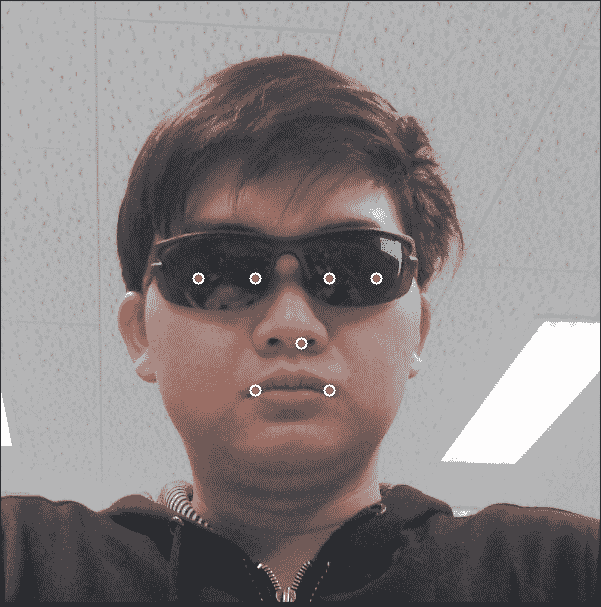

在下一节中，我们将向您展示如何在我们的项目中下载和使用 flandmark。

### 下载和编译 flandmark 库

Flandmark 是用 C 语言实现的，可以轻松集成到我们的项目中。然而，我们需要修改库源代码中的某些头文件，以便与 OpenCV 3 兼容。以下是从下载和编译库的步骤：

1.  前往 flandmark 库的主页并遵循 GitHub 链接：[`github.com/uricamic/flandmark`](http://github.com/uricamic/flandmark)

1.  使用以下命令将库克隆到您的本地机器上：

    ```py
    git clone http://github.com/uricamic/flandmark

    ```

1.  将`libflandmark`文件夹复制到您的项目文件夹中。

1.  将数据文件夹中的`flandmark_model.dat`复制到您的项目文件夹中。

1.  编辑`libflandmark`中的`liblbp.h`文件并更改：

    ```py
    #include "msvc-compat.h"
    ```

    将

    ```py
    #include <stdint.h>
    ```

1.  编辑`libflandmark`中的`flandmark_detector.h`文件并更改：

    ```py
    #include "msvc-compat.h"
    #include <cv.h> 
    #include <cvaux.h>
    ```

    将

    ```py
    #include <stdint.h>
    #include "opencv2/opencv.hpp"
    #include "opencv2/objdetect/objdetect.hpp"
    #include "opencv2/highgui/highgui.hpp"
    #include "opencv2/imgproc/imgproc.hpp"
    #include <iostream>
    #include <stdio.h>
    using namespace std;
    using namespace cv;
    ```

1.  编辑您项目文件夹中的`CMakeLists.txt`以添加 flandmark 库：

    ```py
    add_subdirectory(libflandmark)
    include_directories("${PROJECT_SOURCE_DIR}/libflandmark")
    ```

1.  将可执行文件链接到 flandmark 静态库。

1.  将 flandmark 头文件添加到您的源代码中：

    ```py
    #include "flandmark_detector.h"
    ```

### 使用 flandmark 检测面部特征点

完成上述步骤后，提取面部组件的过程非常简单。

首先，我们创建一个`FLANDMARK_Model`变量来加载预训练模型：

```py
FLANDMARK_Model * model = flandmark_init("flandmark_model.dat");
```

然后，我们将地标数量保存到`num_of_landmark`变量中，并创建一个数组来存储输出结果：

```py
int num_of_landmark = model->data.options.M;
double *points = new double[2 * num_of_landmark];
```

最后，对于每个面部区域，我们创建一个整数数组来存储面部位置，并使用`flandmark_detect`函数在`points`数组中获得最终结果：

```py
int bbox[4] = { faces[i].x, faces[i].y, faces[i].x + faces[i].width, faces[i].y + faces[i].height };
flandmark_detect(new IplImage(img_gray), bbox, model, points);
```

`flandmark_detect`函数的第一个参数是`IplImage`，因此我们需要将我们的灰度图像传递给`IplImage`构造函数。

### 在图像中可视化地标

此步骤是可选的。你不需要在这个部分实现代码。然而，我们建议你尝试并理解结果。以下代码在图像上绘制了地标的位置：

```py
for(int j = 0 ; j < num_of_landmark; j++){
  Point landmark = Point((int)points[2 * j], (int)points[2* j + 1]);
  circle(img, landmark, 4, Scalar(255, 255, 255), -1);
}
```

以下图显示了使用上述代码的多个结果示例：

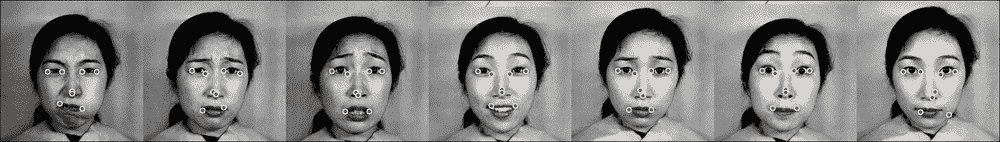

一些在 JAFFE 图像上的 flandmark 结果示例

## 提取面部区域

现在我们有了眼睛、鼻子和嘴的位置。提取面部区域非常容易。

首先，我们计算左眼的中心为点 2 和点 6 的中点：

```py
Point centerLeft = Point( (int) (points[2 * 6] + points[2 * 2]) / 2, (int) (points[2 * 6 + 1] + points[2 * 2 + 1]) / 2 );
```

第二，眼区域宽度是点 2 和点 6 的 x 坐标之差：

```py
int widthLeft = abs(points[2 * 6] - points[2 * 2]);
```

然后，我们找到右眼的中点和宽度：

```py
Point centerRight = Point( (int) (points[2 * 1] + points[2 * 5]) / 2, (int) (points[2 * 1 + 1] + points[2 * 5 + 1]) / 2 );
int widthRight = abs(points[2 * 1] - points[2 * 5]);
```

我们可以假设面部宽度略大于眼睛之间的距离，面部高度大于面部宽度，因此我们可以得到眉毛。我们可以使用以下代码获得良好的面部位置：

```py
int widthFace = (centerLeft.x + widthLeft) - (centerRight.x - widthRight);
int heightFace = widthFace * 1.2;
```

最后，可以使用以下代码提取面部区域：

```py
Mat face = img(Rect( centerRight.x - widthFace/4  , centerRight.y - heightFace/4, widthFace, heightFace ));
```

以下图显示了从我们的实现中提取的一些图像：

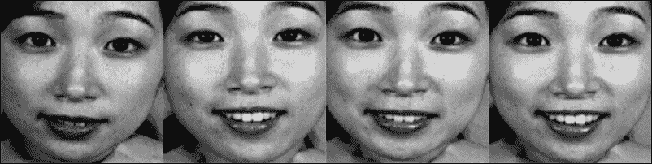

从 JAFFE 图像中提取的一些面部区域示例

## 软件使用指南

我们已经实现了从 JAFFE 数据集中提取面部组件的软件。你可以按照以下方式使用代码：

1.  下载源代码。打开终端，切换到源代码文件夹。

1.  使用以下命令使用`cmake`构建软件：

    ```py
    mkdir build && cd build && cmake .. && make

    ```

1.  你可以使用 facial_components 工具，如下所示：

    ```py
    ./facial_components -src <input_folder> -dest <out_folder>

    ```

### 注意

基于 OpenCV 3 的本章软件可以在以下位置找到：[`github.com/OpenCVBlueprints/OpenCVBlueprints/`](https://github.com/OpenCVBlueprints/OpenCVBlueprints/)

为了简化过程，我们将图像路径保存在一个`.yaml`文件中，`list.yml`。此`.yaml`文件的结构很简单。首先，我们将图像数量保存到`num_of_image`变量中。之后，我们保存所有图像的路径，如下面的截图所示：

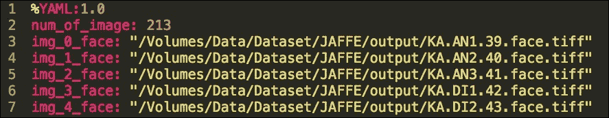

list.yml 文件的图像

# 特征提取

给定一个包含面部区域的数据集，我们可以使用特征提取来获取特征向量，它提供了表情中最重要信息。以下图显示了我们在实现中用于提取特征向量的过程：

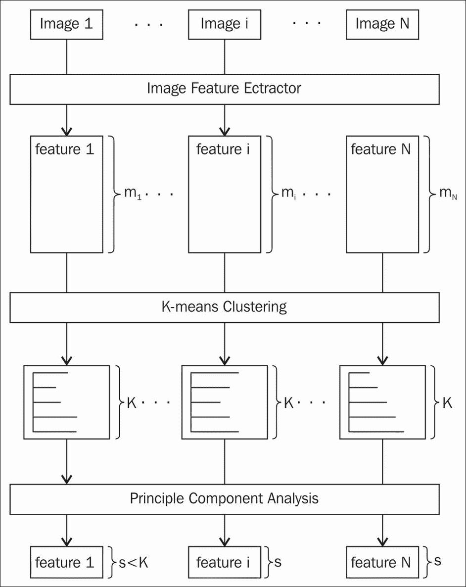

特征提取过程

为了理解本章，您需要了解表情图像的特征表示是图像特征在 k 个簇（在我们的实现中 k = 1000）上的分布。我们已经实现了一些在 OpenCV 中受支持的常见特征类型，例如 SIFT、SURF，以及一些高级特征，如 DENSE-SIFT、KAZE、DAISY。由于这些图像特征是在图像的关键点（如角点）上计算的，除了 DENSE 情况外，图像特征的数量可能在图像之间有所不同。然而，我们希望每个图像都有一个固定的特征大小来进行分类，因为我们将在以后应用机器学习分类技术。重要的是，图像的特征大小必须相同，这样我们才能比较它们以获得最终结果。因此，我们应用聚类技术（在我们的情况下是 kmeans）将图像特征空间分离成 k 个簇。每个图像的最终特征表示是图像特征在 k 个桶上的直方图。此外，为了减少最终特征的维度，我们在最后一步应用主成分分析。 

在接下来的章节中，我们将逐步解释这个过程。在本节的末尾，我们将向您展示如何使用我们的实现来获取数据集的最终特征表示。

## 从面部组件区域提取图像特征

在这一点上，我们将假设您已经拥有了数据集中每个图像的面部区域。下一步是从这些面部区域中提取图像特征。OpenCV 提供了许多知名的关键点检测和特征描述算法的良好实现。

### 注意

每个算法的详细解释超出了本章的范围。

在本节中，我们将向您展示如何在我们的实现中使用这些算法中的一些。

我们将使用一个函数，该函数接受当前区域、特征类型，并返回一个矩阵，其中包含作为行的图像特征：

```py
Mat extractFeature(Mat face, string feature_name);
```

在这个`extractFeature`函数中，我们将从每个 Mat 中提取图像特征并返回描述符。`extractFeature`的实现很简单，如下所示：

```py
Mat extractFeature(Mat img, string feature_name){
    Mat descriptors;
    if(feature_name.compare("brisk") == 0){
        descriptors = extractBrisk(img);
    } else if(feature_name.compare("kaze") == 0){
        descriptors = extractKaze(img);
    } else if(feature_name.compare("sift") == 0){
        descriptors = extractSift(img);
    } else if(feature_name.compare("dense-sift") == 0){
        descriptors = extractDenseSift(img);
    } else if(feature_name.compare("daisy") == 0){
        descriptors = extractDaisy(img);
    }
    return descriptors;
}
```

在上面的代码中，我们为每个特征调用相应的函数。为了简单起见，我们每次只使用一个特征。在本章中，我们将讨论两种类型的特征：

+   **贡献特征**：SIFT、DAISY 和 DENSE SIFT。在 OpenCV 3 中，SIFT 和 SURF 的实现已被移动到 opencv_contrib 模块。

    ### 注意

    这些特征是受专利保护的，如果您想在商业应用中使用它们，则必须付费。

    在本章中，我们将使用 SIFT 特征及其变体，DENSE SIFT。

    ### 注意

    如果你想要使用 opencv_contrib 模块，我们建议你查看*进一步阅读*部分，并查看*编译 opencv_contrib 模块*部分。

+   **高级功能**：BRISK 和 KAZE。这些特征在性能和计算时间上都是 SIFT 和 SURF 的良好替代品。DAISY 和 KAZE 仅在 OpenCV 3 中可用。DAISY 在 opencv_contrib 中，KAZE 在主要的 OpenCV 仓库中。

### 贡献功能

让我们先看看 SIFT 特征。

为了在 OpenCV 3 中使用 SIFT 特征，你需要将 opencv_contrib 模块与 OpenCV 一起编译。

### 注意

我们将假设你已经遵循了*进一步阅读*部分中的说明。

提取 SIFT 特征的代码非常简单：

```py
Mat extractSift(Mat img){
    Mat descriptors;
    vector<KeyPoint> keypoints;

    Ptr<Feature2D> sift = xfeatures2d::SIFT::create();
    sift->detect(img, keypoints, Mat());
    sift->compute(img, keypoints, descriptors);

    return descriptors;
}
```

首先，我们使用`xfeatures2d::SIFT::create()`创建`Feature2D`变量，并使用`detect`函数来获取关键点。检测函数的第一个参数是我们想要处理的图像。第二个参数是一个存储检测到的关键点的向量。第三个参数是一个掩码，指定了查找关键点的位置。我们希望在图像的每个位置都找到关键点，所以我们在这里传递一个空的 Mat。

最后，我们使用`compute`函数在这些关键点上提取特征描述符。计算出的描述符存储在`descriptors`变量中。

接下来，让我们看看 SURF 特征。

获取 SURF 特征的代码与 SIFT 特征的代码大致相同。我们只是将命名空间从 SIFT 更改为 SURF：

```py
Mat extractSurf(Mat img){
    Mat descriptors;
    vector<KeyPoint> keypoints;

    Ptr<Feature2D> surf = xfeatures2d::SURF::create();
    surf->detect(img, keypoints, Mat());
    surf->compute(img, keypoints, descriptors);

    return descriptors;
}
```

现在让我们转向 DAISY。

DAISY 是旋转不变 BRISK 描述符和 LATCH 二进制描述符的改进版本，与较重且较慢的 SURF 相当。DAISY 仅在 OpenCV 3 的 opencv_contrib 模块中可用。实现 DAISY 特征的代码与 Sift 函数相当相似。然而，DAISY 类没有`detect`函数，因此我们将使用 SURF 来检测关键点，并使用 DAISY 来提取描述符：

```py
Mat extractDaisy(Mat img){
    Mat descriptors;
    vector<KeyPoint> keypoints;

    Ptr<FeatureDetector> surf = xfeatures2d::SURF::create();
    surf->detect(img, keypoints, Mat());
    Ptr<DescriptorExtractor> daisy = xfeatures2d::DAISY::create();
    daisy->compute(img, keypoints, descriptors);

    return descriptors;
}
```

现在是时候看看密集 SIFT 特征了。

密集特征在每个图像的位置和尺度上收集特征。有很多应用都使用了密集特征。然而，在 OpenCV 3 中，提取密集特征的接口已被移除。在本节中，我们展示了使用 OpenCV 2.4 源代码中的函数提取关键点向量的简单方法。

提取密集 Sift 函数的函数与 Sift 函数类似：

```py
Mat extractDenseSift(Mat img){
    Mat descriptors;
    vector<KeyPoint> keypoints;

    Ptr<Feature2D> sift = xfeatures2d::SIFT::create();
 createDenseKeyPoints(keypoints, img);
    sift->compute(img, keypoints, descriptors);

    return descriptors;
}
```

我们可以不用`detect`函数，而是使用`createDenseKeyPoints`函数来获取关键点。之后，我们将这个密集关键点向量传递给计算函数。`createDenseKeyPoints`的代码是从 OpenCV 2.4 源代码中获得的。你可以在 OpenCV 2.4 仓库中的`modules/features2d/src/detectors.cpp`找到这段代码：

```py
void createDenseFeature(vector<KeyPoint> &keypoints, Mat image, float initFeatureScale=1.f, int featureScaleLevels=1,
                                    float featureScaleMul=0.1f,
                                    int initXyStep=6, int initImgBound=0,
                                    bool varyXyStepWithScale=true,
                                    bool varyImgBoundWithScale=false){
    float curScale = static_cast<float>(initFeatureScale);
    int curStep = initXyStep;
    int curBound = initImgBound;
    for( int curLevel = 0; curLevel < featureScaleLevels; curLevel++ )
    {
        for( int x = curBound; x < image.cols - curBound; x += curStep )
        {
            for( int y = curBound; y < image.rows - curBound; y += curStep )
            {
                keypoints.push_back( KeyPoint(static_cast<float>(x), static_cast<float>(y), curScale) );
            }
        }
        curScale = static_cast<float>(curScale * featureScaleMul);
        if( varyXyStepWithScale ) curStep = static_cast<int>( curStep * featureScaleMul + 0.5f );
        if( varyImgBoundWithScale ) curBound = static_cast<int>( curBound * featureScaleMul + 0.5f );
    }
}
```

### 高级功能

OpenCV 3 捆绑了许多新的和高级特性。在我们的实现中，我们只会使用 BRISK 和 KAZE 特征。然而，OpenCV 中还有许多其他特性。

让我们熟悉一下 BRISK 的特点。

BRISK 是一个新特性，是 SURF 的一个很好的替代品。自 2.4.2 版本以来，它已被添加到 OpenCV 中。BRISK 采用 BSD 许可，因此你不必担心专利问题，就像 SIFT 或 SURF 一样。

```py
Mat extractBrisk(Mat img){
    Mat descriptors;
    vector<KeyPoint> keypoints;

    Ptr<DescriptorExtractor> brisk = BRISK::create();
    brisk->detect(img, keypoints, Mat());
    brisk->compute(img, keypoints, descriptors);

    return descriptors;
}
```

### 注意

关于这些内容有一篇有趣的文章，*三个描述符的较量：SURF、FREAK 和 BRISK*，可在[`computer-vision-talks.com/articles/2012-08-18-a-battle-of-three-descriptors-surf-freak-and-brisk/`](http://computer-vision-talks.com/articles/2012-08-18-a-battle-of-three-descriptors-surf-freak-and-brisk/)找到。

让我们继续前进，看看 KAZE 特征。

KAZE 是 OpenCV 3 中的一个新特性。它在许多场景下产生最佳结果，尤其是在图像匹配问题上，并且与 SIFT 相当。KAZE 位于 OpenCV 仓库中，因此你不需要 opencv_contrib 就可以使用它。除了高性能之外，使用 KAZE 的另一个原因是它是开源的，你可以在任何商业应用中自由使用它。使用此特性的代码非常简单：

```py
Mat extractKaze(Mat img){
    Mat descriptors;
    vector<KeyPoint> keypoints;

    Ptr<DescriptorExtractor> kaze = KAZE::create();
    kaze->detect(img, keypoints, Mat());
    kaze->compute(img, keypoints, descriptors);

    return descriptors;
}
```

### 注意

KAZE、SIFT 和 SURF 之间的图像匹配比较可在作者仓库中找到：[`github.com/pablofdezalc/kaze`](https://github.com/pablofdezalc/kaze)

### 为每种特征类型可视化关键点

在以下图中，我们可视化每种特征类型的关键点位置。我们在每个关键点处画一个圆圈；圆圈的半径指定了提取关键点的图像的缩放比例。你可以看到这些特征中的关键点和相应的描述符是不同的。因此，系统的性能将根据特征的质量而变化。

### 注意

我们建议您参考*评估*部分以获取更多详细信息。

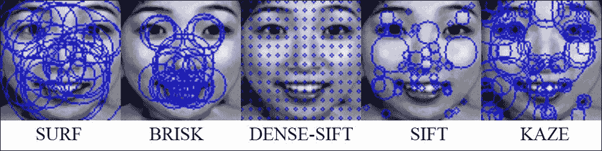

特征提取过程

## 计算特征表示在 k 个簇上的分布

如果你已经遵循了之前的伪代码，你现在应该有一个描述符向量。你可以看到描述符的大小在不同图像之间是不同的。由于我们希望每个图像的特征表示具有固定的大小，我们将计算特征表示在 k 个簇上的分布。在我们的实现中，我们将在核心模块中使用 kmeans 聚类算法。

### 将图像特征空间聚类成 k 个簇

首先，我们假设所有图像的描述符都被添加到一个向量中，称为`features_vector`。然后，我们需要创建一个`Mat rawFeatureData`，它将包含所有图像特征作为行。在这种情况下，`num_of_feature`是每张图像中的特征总数，`image_feature_size`是每个图像特征的大小。我们根据实验选择簇的数量。我们开始于 100，并在几次迭代中增加数量。这取决于特征和数据类型，因此您应该尝试更改此变量以适应您的具体情况。大量簇的一个缺点是，使用 kmeans 的计算成本会很高。此外，如果簇的数量太大，特性向量将过于稀疏，这可能不利于分类。

```py
Mat rawFeatureData = Mat::zeros(num_of_feature, image_feature_size, CV_32FC1);
```

我们需要将描述符向量（代码中的`features_vector`）中的数据复制到`imageFeatureData`：

```py
int cur_idx = 0;
for(int i = 0 ; i < features_vector.size(); i++){
    features_vector[i].copyTo(rawFeatureData.rowRange(cur_idx, cur_idx + features_vector[i].rows));
    cur_idx += features_vector[i].rows;
}
```

最后，我们使用`kmeans`函数对数据进行聚类，如下所示：

```py
Mat labels, centers;
kmeans(rawFeatureData, k, labels, TermCriteria( TermCriteria::EPS+TermCriteria::COUNT, 100, 1.0), 3, KMEANS_PP_CENTERS, centers);
```

让我们讨论`kmeans`函数的参数：

```py
double kmeans(InputArray data, int K, InputOutputArray bestLabels, TermCriteria criteria, int attempts, int flags, OutputArray centers=noArray())
```

+   **InputArray data**: 它包含所有样本作为行。

+   **int K**: 分割样本的簇数（在我们的实现中 k = 1000）。

+   **InputOutputArray bestLabels**: 包含每个样本簇索引的整数数组。

+   **TermCriteria criteria**: 算法终止准则。这包含三个参数（`type`、`maxCount`、`epsilon`）。

+   **Type**: 终止准则的类型。有三种类型：

    +   **COUNT**: 在迭代次数达到一定数量（`maxCount`）后停止算法。

    +   **EPS**: 如果达到指定的精度（epsilon），则停止算法。

    +   **EPS+COUNT**: 如果满足 COUNT 和 EPS 条件，则停止算法。

+   **maxCount**: 这是最大迭代次数。

+   **epsilon**: 这是停止算法所需的精度。

+   **int attempts**: 这是算法以不同初始质心执行次数的数量。算法返回具有最佳紧致性的标签。

+   **int flags**: 此标志指定初始质心如何随机。通常使用`KMEANS_RANDOM_CENTERS`和`KMEANS_PP_CENTERS`。如果您想提供自己的初始标签，应使用`KMEANS_USE_INITIAL_LABELS`。在这种情况下，算法将在第一次尝试中使用您的初始标签。对于进一步的尝试，将应用`KMEANS_*_CENTERS`标志。

+   **OutputArray centers**: 它包含所有簇质心，每行一个质心。

+   **double compactness**: 这是函数返回的值。这是每个样本到对应质心的平方距离之和。

### 为每个图像计算最终特征

现在我们已经为数据集中的每个图像特征有了标签。下一步是为每个图像计算一个固定大小的特征。考虑到这一点，我们遍历每个图像，创建一个包含 k 个元素的特性向量，其中 k 是簇的数量。

然后，我们遍历当前图像中的图像特征，并增加特征向量的第 i 个元素，其中 i 是图像特征的标签。

想象一下，我们正在尝试根据 k 个质心来制作特征的历史图表示。这种方法看起来像是一个词袋方法。例如，图像 X 有 100 个特征，图像 Y 有 10 个特征。我们无法比较它们，因为它们的大小不同。然而，如果我们为它们中的每一个都制作一个 1,000 维度的历史图，它们的大小就相同了，我们就可以轻松地比较它们。

### 维度降低

在本节中，我们将使用**主成分分析**（**PCA**）来降低特征空间的维度。在上一个步骤中，我们为每个图像有 1,000 维的特征向量。在我们的数据集中，我们只有 213 个样本。因此，进一步分类器倾向于在高维空间中过拟合训练数据。因此，我们希望使用 PCA 来获取最重要的维度，这个维度具有最大的方差。

接下来，我们将向您展示如何在我们的系统中使用 PCA。

首先，我们假设您可以将所有特征存储在一个名为`featureDataOverBins`的 Mat 中。这个 Mat 的行数应等于数据集中的图像数量，列数应为 1,000。`featureDataOverBins`中的每一行都是图像的一个特征。

第二，我们创建一个 PCA 变量：

```py
PCA pca(featureDataOverBins, cv::Mat(), CV_PCA_DATA_AS_ROW, 0.90);
```

第一个参数是包含所有特征的数据。我们没有预先计算的平均向量，因此第二个参数应该是一个空的 Mat。第三个参数表示特征向量以矩阵行存储。最后一个参数指定 PCA 应保留的方差百分比。

最后，我们需要将所有特征从 1,000 维特征空间投影到一个较低的空间。投影后，我们可以将这些特征保存以供进一步处理。

```py
for(int i = 0 ; i < num_of_image; i++){
    Mat feature = pca.project(featureDataOverBins.row(i));
    // save the feature in FileStorage
}
```

新特征的数量可以通过以下方式获得：

```py
int feature_size = pca.eigenvectors.rows;
```

## 软件使用指南

我们已经实现了先前的过程来为数据集提取固定大小的特征。使用该软件相当简单：

1.  下载源代码。打开终端并将目录更改为源代码文件夹。

1.  使用以下命令使用`cmake`构建软件：

    ```py
    mkdir build && cd build && cmake .. && make

    ```

1.  您可以使用以下方式使用`feature_extraction`工具：

    ```py
    ./feature_extraction  -feature <feature_name> -src <input_folder> -dest <output_folder>

    ```

`feature_extraction`工具在输出文件夹中创建一个 YAML 文件，该文件包含数据集中每个图像的特征和标签。可用的参数有：

+   `feature_name`: 这可以是 sift、surf、opponent-sift 或 opponent-surf。这是在特征提取过程中使用的特征类型的名称。

+   `input_folder`: 这是指向面部组件位置的绝对路径。

+   `output_folder`: 这是指向您希望保存输出文件的文件夹的绝对路径。

输出文件的结构相当简单。

我们存储了特征的大小、聚类中心、图像数量、训练和测试图像数量、标签数量以及相应的标签名称。我们还存储了 PCA 均值、特征向量和特征值。以下图显示了 YAML 文件的一部分：

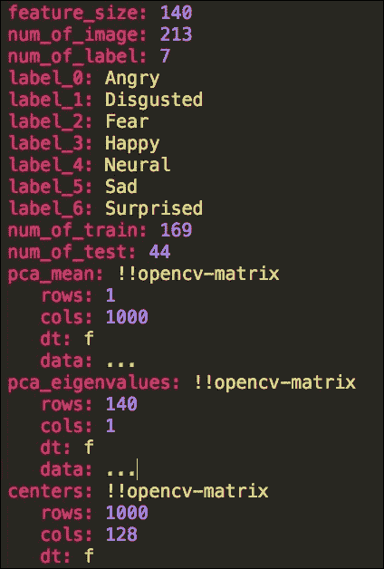

features.yml 文件的一部分

对于每个图像，我们存储三个变量，如下所示：

+   `image_feature_<idx>`：这是一个包含图像 idx 特征的 Mat

+   `image_label_<idx>`：这是图像 idx 的标签

+   `image_is_train_<idx>`：这是一个布尔值，指定图像是否用于训练。

# 分类

一旦你从数据集的所有样本中提取了特征，就到了开始分类过程的时候了。这个分类过程的目标是学习如何根据训练示例自动进行准确的预测。对此问题有许多方法。在本节中，我们将讨论 OpenCV 中的机器学习算法，包括神经网络、支持向量机和 k-最近邻。

## 分类过程

分类被认为是监督学习。在分类问题中，需要一个正确标记的训练集。在训练阶段产生一个模型，该模型在预测错误时进行纠正。然后，该模型用于其他应用的预测。每次你有更多训练数据时，都需要对模型进行训练。以下图显示了分类过程概述：

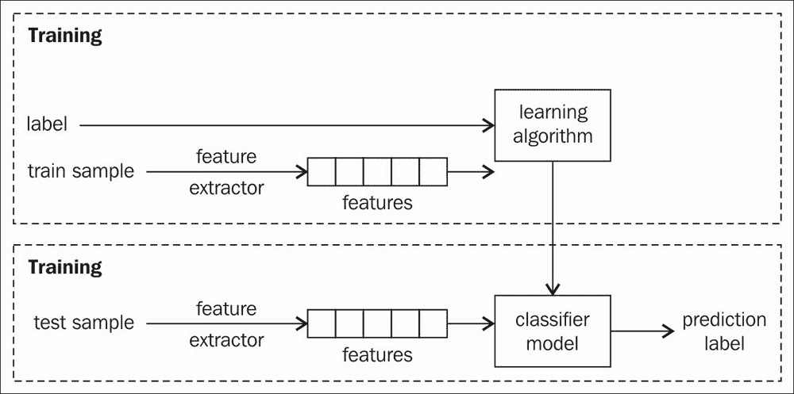

分类过程概述

选择要使用的机器学习算法是一个关键步骤。对于分类问题，有很多解决方案。在本节中，我们列出了 OpenCV 中的一些流行机器学习算法。每种算法在分类问题上的性能可能会有所不同。你应该进行一些评估，并选择最适合你问题的算法以获得最佳结果。这是非常重要的，因为特征选择可能会影响学习算法的性能。因此，我们还需要评估每个学习算法与每个不同的特征选择。

## 将数据集分割成训练集和测试集

将数据集分成两部分，即训练集和测试集，这是非常重要的。我们将使用训练集进行学习阶段，测试集用于测试阶段。在测试阶段，我们希望测试训练好的模型如何预测未见过的样本。换句话说，我们希望测试训练模型的*泛化能力*。因此，测试样本与训练样本不同是很重要的。在我们的实现中，我们将简单地将数据集分成两部分。然而，如果你使用*进一步阅读*部分中提到的 k 折交叉验证会更好。

没有一种准确的方法可以将数据集分成两部分。常见的比例是 80:20 和 70:30。训练集和测试集都应该随机选择。如果它们有相同的数据，评估将是误导性的。基本上，即使你在测试集上达到了 99%的准确率，模型在真实世界中也无法工作，因为真实世界中的数据与训练数据不同。

在我们的特征提取实现中，我们已经随机分割了数据集，并将选择保存在 YAML 文件中。

### 注意

k 折交叉验证在“进一步阅读”部分的末尾有更详细的解释。

## 支持向量机

**支持向量机**（**SVM**）是一种适用于分类和回归的监督学习技术。给定标记的训练数据，SVM 的目标是生成一个最佳超平面，该超平面仅根据测试样本的属性预测测试样本的目标值。换句话说，SVM 基于标记的训练数据生成一个从输入到输出的函数。

例如，假设我们想要找到一条线来分离两组 2D 点。以下图显示了该问题的几个解决方案：

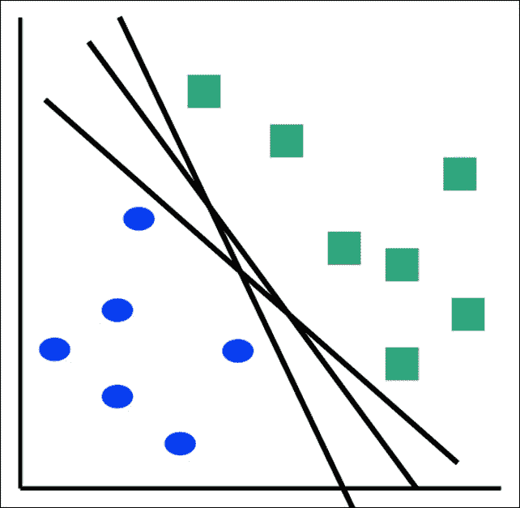

有很多超平面可以解决问题

SVM 的目标是找到一个超平面，该超平面最大化到训练样本的距离。这些距离仅计算最接近超平面的向量。以下图显示了分离两组 2D 点的最佳超平面：

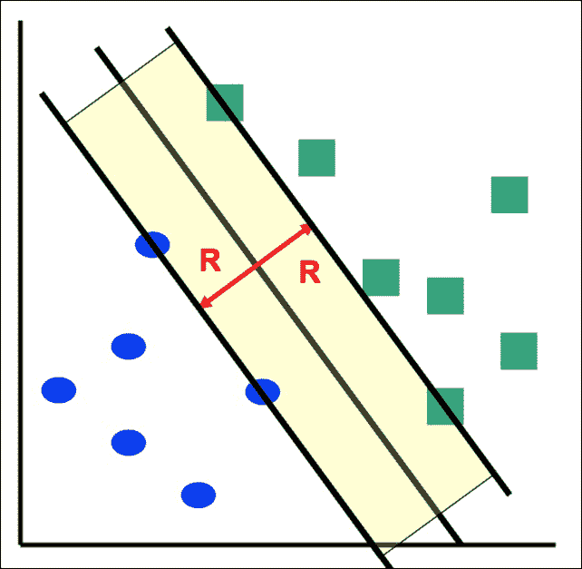

一个最大化到训练样本距离的最佳超平面。R 是最大间隔

在接下来的几节中，我们将向您展示如何使用支持向量机（SVM）来训练和测试面部表情数据。

### 训练阶段

训练 SVM 中最困难的部分之一是参数选择。没有对 SVM 工作原理的深入了解，无法解释所有内容。幸运的是，OpenCV 实现了`trainAuto`方法来自动估计参数。如果你对 SVM 有足够的了解，你应该尝试使用自己的参数。在本节中，我们将介绍`trainAuto`方法，以向您概述 SVM。

SVM 本质上是构建二进制（2 类）分类中最佳超平面的技术。在我们的面部表情问题中，我们想要对七个表情进行分类。一对一和一对多是我们可以使用 SVM 的两种常见方法。一对一方法为每个类别训练一个 SVM。在我们的例子中有七个 SVM。对于类别 i，所有标签为 i 的样本被视为正样本，其余样本被视为负样本。当数据集样本在类别之间不平衡时，这种方法容易出错。一对多方法为每个不同类别的成对训练一个 SVM。总的 SVM 数量是 *N*(N-1)/2* 个 SVM。这意味着在我们的例子中有 21 个 SVM。

在 OpenCV 中，你不必遵循这些方法。OpenCV 支持训练一个多类 SVM。然而，为了获得更好的结果，你应该遵循上述方法。我们仍然将使用一个多类 SVM。训练和测试过程将更简单。

接下来，我们将演示我们的实现来解决面部表情问题。

首先，我们创建一个 SVM 的实例：

```py
Ptr<ml::SVM> svm = ml::SVM::create();
```

如果你想要更改参数，你可以在 `svm` 变量中调用 `set` 函数，如下所示：

```py
svm->setType(SVM::C_SVC);
svm->setKernel(SVM::RBF);
```

+   **类型**：它是 SVM 公式的类型。有五个可能的值：`C_SVC`、`NU_SVC`、`ONE_CLASS`、`EPS_SVR` 和 `NU_SVR`。然而，在我们的多类分类中，只有 `C_SVC` 和 `NU_SVC` 是合适的。这两个之间的区别在于数学优化问题。目前，我们可以使用 `C_SVC`。

+   **核函数**：它是 SVM 核的类型。有四个可能的值：`LINEAR`、`POLY`、`RBF` 和 `SIGMOID`。核函数是一个将训练数据映射到更高维空间的功能，使得数据线性可分。这也被称为 *核技巧*。因此，我们可以使用核的支持在非线性情况下使用 SVM。在我们的情况下，我们选择最常用的核函数，RBF。你可以在这几个核函数之间切换并选择最佳选项。

你也可以设置其他参数，如 TermCriteria、Degree、Gamma。我们只是使用默认参数。

第二，我们创建一个 `ml::TrainData` 变量来存储所有训练集数据：

```py
Ptr<ml::TrainData> trainData = ml::TrainData::create(train_features, ml::SampleTypes::ROW_SAMPLE, labels);
```

+   `train_features`：它是一个 Mat，其中每行包含一个特征向量。`train_features` 的行数是训练样本的数量，列数是一个特征向量的大小。

+   `SampleTypes::ROW_SAMPLE`：它指定每个特征向量位于一行。如果你的特征向量位于列中，你应该使用 COL_SAMPLE。

+   `train_labels`：它是一个 Mat，其中包含每个训练特征的标签。在 SVM 中，`train_labels` 将是一个 Nx1 矩阵，N 是训练样本的数量。每行的值是对应样本的真实标签。在撰写本文时，`train_labels` 的类型应该是 `CV_32S`。否则，你可能会遇到错误。以下是我们创建 `train_labels` 变量的代码：

    ```py
    Mat train_labels = Mat::zeros( labels.rows, 1, CV_32S);
    for(int i = 0 ; i < labels.rows; i ++){
        train_labels.at<unsigned int>(i, 0) = labels.at<int>(i, 0);
    }
    ```

最后，我们将 `trainData` 传递给 `trainAuto` 函数，以便 OpenCV 可以自动选择最佳参数。`trainAuto` 函数的接口包含许多其他参数。为了保持简单，我们将使用默认参数：

```py
svm->trainAuto(trainData);
```

### 测试阶段

在我们训练了 SVM 之后，我们可以将一个测试样本传递给 `svm` 模型的预测函数，并接收一个标签预测，如下所示：

```py
float predict = svm->predict(sample);
```

在这种情况下，样本是一个特征向量，就像训练特征中的特征向量一样。响应是样本的标签。

## 多层感知器

OpenCV 实现了最常见的人工神经网络类型，即多层感知器（MLP）。一个典型的 MLP 由一个输入层、一个输出层和一个或多个隐藏层组成。它被称为监督学习方法，因为它需要期望的输出来进行训练。有了足够的数据，MLP，如果给定足够的隐藏层，可以近似任何函数到任何期望的精度。

具有一个隐藏层的多层感知器可以表示如下图所示：

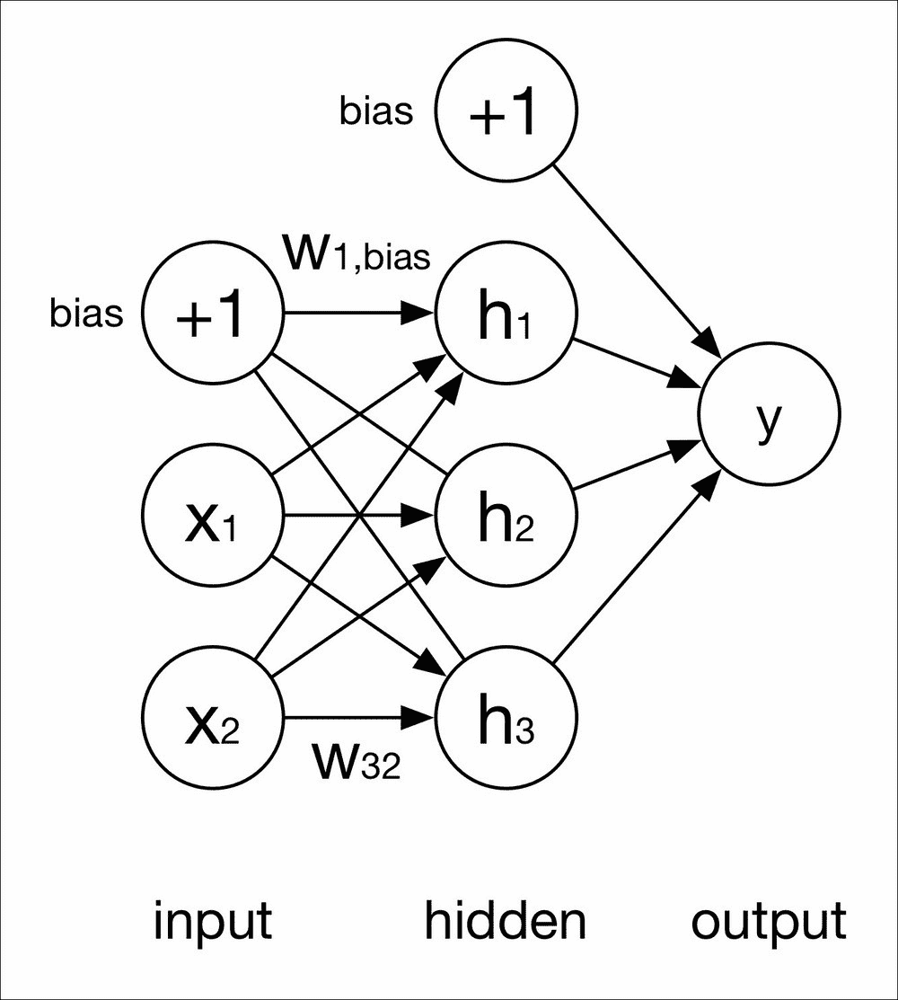

单隐藏层感知器

MLP 如何学习的一个详细解释和证明超出了本章的范围。其思想是每个神经元的输出是前一层神经元的函数。

在上述单隐藏层 MLP 中，我们使用以下符号：

输入层：x[1] x[2]

隐藏层：h[1] h[2] h[3]

输出层：y

每个神经元之间的每个连接都有一个权重。上图所示的权重是当前层中的神经元 i（即 i = 3）和前一层中的神经元 j（即 j = 2）之间的权重，表示为 w[ij]。每个神经元都有一个权重为 1 的偏置值，表示为 w[i,bias]。

神经元 i 的输出是激活函数*f*的结果：

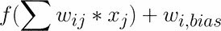

激活函数有很多种类型。在 OpenCV 中，有三种类型的激活函数：恒等函数、Sigmoid 和高斯。然而，在撰写本文时，高斯函数并不完全受支持，恒等函数也不常用。我们建议您使用默认的激活函数，即 Sigmoid。

在接下来的章节中，我们将向您展示如何训练和测试一个多层感知器。

### 训练阶段

在训练阶段，我们首先定义网络，然后训练网络。

#### 定义网络

在我们的面部表情问题中，我们将使用一个简单的四层神经网络。该网络有一个输入层、两个隐藏层和一个输出层。

首先，我们需要创建一个矩阵来保存层的定义。这个矩阵有四行一列：

```py
Mat layers = Mat(3, 1, CV_32S);
```

然后，我们为每一层分配神经元数量，如下所示：

```py
layers.row(0) = Scalar(feature_size);
layers.row(1) = Scalar(20);
layers.row(2) = Scalar(num_of_labels);
```

在这个网络中，输入层的神经元数量必须等于每个特征向量的元素数量，输出层的神经元数量是面部表情标签的数量（`feature_size`等于`train_features.cols`，其中`train_features`是包含所有特征的 Mat，`num_of_labels`在我们的实现中等于 7）。

我们实现中的上述参数并非最优。您可以尝试为不同数量的隐藏层和神经元数量尝试不同的值。请记住，隐藏神经元的数量不应超过训练样本的数量。在隐藏层中神经元数量和网络的层数选择上非常困难。如果您做一些研究，您会发现一些经验规则和诊断技术。选择这些参数的最佳方式是实验。基本上，层和隐藏神经元越多，网络的能力就越强。然而，更多的能力可能会导致过拟合。最重要的规则之一是训练集中的示例数量应大于网络中的权重数量。根据我们的经验，您应该从一个包含少量神经元的隐藏层开始，并计算泛化误差和训练误差。然后，您应该修改神经元数量并重复此过程。

### 注意

记得在更改参数时制作图表以可视化误差。请记住，神经元的数量通常介于输入层大小和输出层大小之间。经过几次迭代后，您可以决定是否添加额外的层。

然而，在这种情况下，我们没有太多数据。这使得网络难以训练。我们可能不会添加神经元和层来提高性能。

#### 训练网络

首先，我们创建一个网络变量，ANN_MLP，并将层定义添加到网络中：

```py
Ptr<ml::ANN_MLP> mlp = ml::ANN_MLP::create();
mlp->setLayerSizes(layers);
```

然后，我们需要为训练算法准备一些参数。MLP 的训练有两种算法：反向传播算法和 RPROP 算法。RPROP 是默认的训练算法。RPROP 有很多参数，所以我们为了简单起见将使用反向传播算法。

下面是我们为反向传播算法设置参数的代码：

```py
mlp->setTrainMethod(ml::ANN_MLP::BACKPROP);
mlp->setActivationFunction(ml::ANN_MLP::SIGMOID_SYM, 0, 0);
mlp->setTermCriteria(TermCriteria(TermCriteria::EPS+TermCriteria::COUNT, 100000, 0.00001f));
```

我们将`TrainMethod`设置为`BACKPROP`以使用反向传播算法。选择 Sigmoid 作为激活函数。在 OpenCV 中有三种激活类型：`IDENTITY`、`GAUSSIAN`和`SIGMOID`。您可以查看本节概述以获取更多详细信息。

最后一个参数是`TermCriteria`。这是算法终止标准。您可以在前一个部分中关于 kmeans 算法的解释中看到这个参数的解释。

接下来，我们创建一个`TrainData`变量来存储所有训练集。其接口与 SVM 部分相同。

```py
Ptr<ml::TrainData> trainData = ml::TrainData::create(train_features, ml::SampleTypes::ROW_SAMPLE, train_labels);
```

`train_features`是一个 Mat，它存储了所有训练样本，就像在 SVM 部分中做的那样。然而，`train_labels`是不同的：

+   `train_features`：这是一个 Mat，它包含每个特征向量作为一行，就像我们在 SVM 中做的那样。`train_features`的行数是训练样本的数量，列数是一个特征向量的大小。

+   `train_labels`：这是一个包含每个训练特征标签的 Mat。与 SVM 中的 Nx1 矩阵不同，MLP 中的 `train_labels` 应该是一个 NxM 矩阵，N 是训练样本的数量，M 是标签的数量。如果第 i 行的特征被分类为标签 j，则 `train_labels` 的位置 (i, j) 将是 1。否则，值将是零。创建 `train_labels` 变量的代码如下：

    ```py
    Mat train_labels = Mat::zeros( labels.rows, num_of_label, CV_32FC1);
    for(int i = 0 ; i < labels.rows; i ++){
        int idx = labels.at<int>(i, 0);
        train_labels.at<float>(i, idx) = 1.0f;
    }
    ```

最后，我们使用以下代码训练网络：

```py
mlp->train(trainData);
```

训练过程需要几分钟才能完成。如果你有大量的训练数据，可能需要几小时。

### 测试阶段

一旦我们训练了我们的 MLP，测试阶段就非常简单。

首先，我们创建一个 Mat 来存储网络的响应。响应是一个数组，其长度是标签的数量。

```py
Mat response(1, num_of_labels, CV_32FC1);
```

然后，我们假设我们有一个名为 sample 的 Mat，它包含一个特征向量。在我们的面部表情案例中，其大小应该是 1x1000。

我们可以调用 `mlp` 模型的 `predict` 函数来获取响应，如下所示：

```py
mlp->predict(sample, response);
```

输入样本的预测标签是响应数组中最大值的索引。你可以通过简单地遍历数组来找到标签。这种类型响应的缺点是，如果你想为每个响应应用一个 `softmax` 函数以获得概率，你必须这样做。在其他神经网络框架中，通常有一个 softmax 层来处理这种情况。然而，这种类型响应的优点是保留了每个响应的大小。

## K-Nearest Neighbors (KNN)

**K-Nearest Neighbors** (**KNN**) 是一种非常简单的机器学习算法，但在许多实际问题中表现良好。KNN 的思想是将未知样本分类为 k 个最近已知样本中最常见的类别。KNN 也被称为非参数懒惰学习算法。这意味着 KNN 对数据分布没有任何假设。由于它只缓存所有训练示例，因此训练过程非常快。然而，测试过程需要大量的计算。以下图示展示了 KNN 在二维点情况下的工作原理。绿色点是一个未知样本。KNN 将在空间中找到 k 个最近的已知样本（本例中 k = 5）。有三个红色标签的样本和两个蓝色标签的样本。因此，预测的标签是红色。

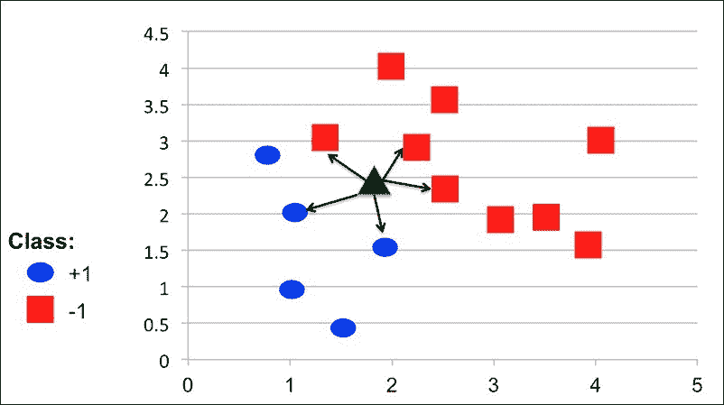

解释 KNN 如何预测未知样本的标签

### 训练阶段

KNN 算法的实现非常简单。我们只需要三行代码来训练一个 KNN 模型：

```py
Ptr<ml::KNearest> knn = ml::KNearest::create();
Ptr<ml::TrainData> trainData = ml::TrainData::create(train_features, ml::SampleTypes::ROW_SAMPLE, labels);
knn->train(trainData);
```

上述代码与 SVM 相同：

+   `train_features`：这是一个包含每个特征向量作为行的 Mat。`train_features` 中的行数是训练样本的数量，列数是一个特征向量的大小。

+   `train_labels`: 这是一个包含每个训练特征标签的 Mat。在 KNN 中，`train_labels`是一个 Nx1 的矩阵，N 是训练样本的数量。每一行的值是对应样本的真实标签。这个 Mat 的类型应该是`CV_32S`。

### 测试阶段

测试阶段非常直接。我们只需将一个特征向量传递给`knn`模型的`findNearest`方法，就可以获得标签：

```py
Mat predictedLabels;
knn->findNearest(sample, K, predictedLabels);
```

第二个参数是最重要的参数。它是用于分类可能使用的最大邻居数。理论上，如果有无限数量的样本可用，更大的 K 总是意味着更好的分类。然而，在我们的面部表情问题中，我们总共有 213 个样本，其中大约有 170 个样本在训练集中。因此，如果我们使用大的 K，KNN 最终可能会寻找非邻居的样本。在我们的实现中，K 等于 2。

预测标签存储在`predictedLabels`变量中，可以按以下方式获取：

```py
float prediction = bestLabels.at<float>(0,0);
```

## 正态贝叶斯分类器

正态贝叶斯分类器是 OpenCV 中最简单的分类器之一。正态贝叶斯分类器假设来自每个类别的特征向量是正态分布的，尽管不一定独立。这是一个有效的分类器，可以处理多个类别。在训练步骤中，分类器估计每个类别的分布的均值和协方差。在测试步骤中，分类器计算特征向量到每个类别的概率。在实践中，我们然后测试最大概率是否超过阈值。如果是，样本的标签将是具有最大概率的类别。否则，我们说我们无法识别该样本。

OpenCV 已经在 ml 模块中实现了这个分类器。在本节中，我们将向您展示如何在我们的面部表情问题中使用正态贝叶斯分类器的代码。

### 训练阶段

实现正态贝叶斯分类器的代码与 SVM 和 KNN 相同。我们只需要调用`create`函数来获取分类器并开始训练过程。所有其他参数与 SVM 和 KNN 相同。

```py
Ptr<ml::NormalBayesClassifier> bayes = ml::NormalBayesClassifier::create();
Ptr<ml::TrainData> trainData = ml::TrainData::create(train_features, ml::SampleTypes::ROW_SAMPLE, labels);
bayes->train(trainData);
```

### 测试阶段

使用正态贝叶斯分类器测试样本的代码与之前的方法略有不同：

1.  首先，我们需要创建两个 Mat 来存储输出类别和概率：

    ```py
    Mat output, outputProb;
    ```

1.  然后，我们调用模型的`predictProb`函数：

    ```py
    bayes->predictProb(sample, output, outputProb);
    ```

1.  计算出的概率存储在`outputProb`中，相应的标签可以检索如下：

    ```py
    unsigned int label = output.at<unsigned int>(0, 0);
    ```

## 软件使用指南

我们已经实现了上述过程，使用训练集进行分类。使用该软件相当简单：

1.  下载源代码。打开终端，切换到源代码文件夹。

1.  使用以下命令使用`cmake`构建软件：

    ```py
    mkdir build && cd build && cmake .. && make

    ```

1.  您可以使用以下方式使用`train`工具：

    ```py
    ./train -algo <algorithm_name> -src <input_features> -dest <output_folder>

    ```

`train` 工具执行训练过程并在控制台上输出准确率。学习到的模型将被保存到输出文件夹中，以便进一步使用，文件名为 `model.yml`。此外，特征提取的 kmeans 中心信息和 pca 信息也将保存在 `features_extraction.yml` 文件中。可用的参数包括：

+   `algorithm_name`：这可以是 `mlp`、`svm`、`knn`、`bayes`。这是学习算法的名称。

+   `input_features`：这是 `prepare_dataset` 工具的 YAML 特征文件的绝对路径。

+   `output_folder`：这是您希望保存输出模型的文件夹的绝对路径。

# 评估

在本节中，我们将展示我们面部表情识别系统的性能。在我们的测试中，我们将保持每个学习算法的参数相同，仅更改特征提取。我们将使用聚类数量等于 200、500、1,000、1,500、2,000 和 3,000 来评估特征提取。

下表显示了系统在聚类数量等于 200、500、1,000、1,500、2,000 和 3,000 时的准确率。

表 1：系统在 1,000 个聚类下的准确率（%）

| K = 1000 | MLP | SVM | KNN | Normal Bayes |
| --- | --- | --- | --- | --- |
| SIFT | 72.7273 | 93.1818 | 81.8182 | 88.6364 |
| SURF | 61.3636 | 79.5455 | 72.7273 | 79.5455 |
| BRISK | 61.3636 | 65.9091 | 59.0909 | 68.1818 |
| KAZE | 50 | 79.5455 | 61.3636 | 77.2727 |
| DAISY | 59.0909 | 77.2727 | 65.9091 | 81.8182 |
| DENSE-SIFT | 20.4545 | 45.4545 | 43.1818 | 40.9091 |

表 2：系统在 500 个聚类下的准确率（%）

| K = 500 | MLP | SVM | KNN | Normal Bayes |
| --- | --- | --- | --- | --- |
| SIFT | 56.8182 | 70.4545 | 75 | 77.2727 |
| SURF | 54.5455 | 63.6364 | 68.1818 | 79.5455 |
| BRISK | 36.3636 | 59.0909 | 52.2727 | 52.2727 |
| KAZE | 47.7273 | 56.8182 | 63.6364 | 65.9091 |
| DAISY | 54.5455 | 75 | 63.6364 | 75 |
| DENSE-SIFT | 27.2727 | 43.1818 | 38.6364 | 43.1818 |

表 3：系统在 200 个聚类下的准确率（%）

| K = 200 | MLP | SVM | KNN | Normal Bayes |
| --- | --- | --- | --- | --- |
| SIFT | 50 | 68.1818 | 65.9091 | 75 |
| SURF | 43.1818 | 54.5455 | 52.2727 | 63.6364 |
| BRISK | 29.5455 | 47.7273 | 50 | 54.5455 |
| KAZE | 50 | 59.0909 | 72.7273 | 59.0909 |
| DAISY | 45.4545 | 68.1818 | 65.9091 | 70.4545 |
| DENSE-SIFT | 29.5455 | 43.1818 | 40.9091 | 31.8182 |

表 4：系统在 1,500 个聚类下的准确率（%）

| K = 1500 | MLP | SVM | KNN | Normal Bayes |
| --- | --- | --- | --- | --- |
| SIFT | 45.4545 | 84.0909 | 75 | 79.5455 |
| SURF | 72.7273 | 88.6364 | 79.5455 | 86.3636 |
| BRISK | 54.5455 | 72.7273 | 56.8182 | 68.1818 |
| KAZE | 45.4545 | 79.5455 | 72.7273 | 77.2727 |
| DAISY | 61.3636 | 88.6364 | 65.9091 | 81.8182 |
| DENSE-SIFT | 34.0909 | 47.7273 | 38.6364 | 38.6364 |

表 5：系统在 2,000 个聚类下的准确率（%）

| K = 2000 | MLP | SVM | KNN | Normal Bayes |
| --- | --- | --- | --- | --- |
| SIFT | 63.6364 | 88.6364 | 81.8182 | 88.6364 |
| SURF | 65.9091 | 84.0909 | 68.1818 | 81.8182 |
| BRISK | 47.7273 | 68.1818 | 47.7273 | 61.3636 |
| KAZE | 47.7273 | 77.2727 | 72.7273 | 75 |
| DAISY | 77.2727 | 81.8182 | 72.7273 | 84.0909 |
| DENSE-SIFT | 38.6364 | 45.4545 | 36.3636 | 43.1818 |

表 6：具有 3,000 个簇的系统准确率（%）

| K = 3000 | MLP | SVM | KNN | 正常贝叶斯 |
| --- | --- | --- | --- | --- |
| SIFT | 52.2727 | 88.6364 | 77.2727 | 86.3636 |
| SURF | 59.0909 | 79.5455 | 65.9091 | 77.2727 |
| BRISK | 52.2727 | 65.9091 | 43.1818 | 59.0909 |
| KAZE | 61.3636 | 81.8182 | 70.4545 | 84.0909 |
| DAISY | 72.7273 | 79.5455 | 70.4545 | 68.1818 |
| DENSE-SIFT | 27.2727 | 47.7273 | 38.6364 | 45.4545 |

## 使用不同学习算法的评估

我们可以用上述结果创建图表，比较以下图中特征与学习算法之间的性能。我们可以看到，在大多数情况下，SVM 和正常贝叶斯比其他算法有更好的结果。在 1,000 个簇的情况下，SVM 和 SIFT 的最佳结果是 93.1818%。MLP 在几乎所有情况下都有最低的结果。一个原因是 MLP 需要大量数据以防止过拟合。我们只有大约 160 个训练图像。然而，每个样本的特征大小在 100 到 150 之间。即使有两个隐藏神经元，权重的数量也大于样本的数量。KNN 似乎比 MLP 表现更好，但无法击败 SVM 和正常贝叶斯。

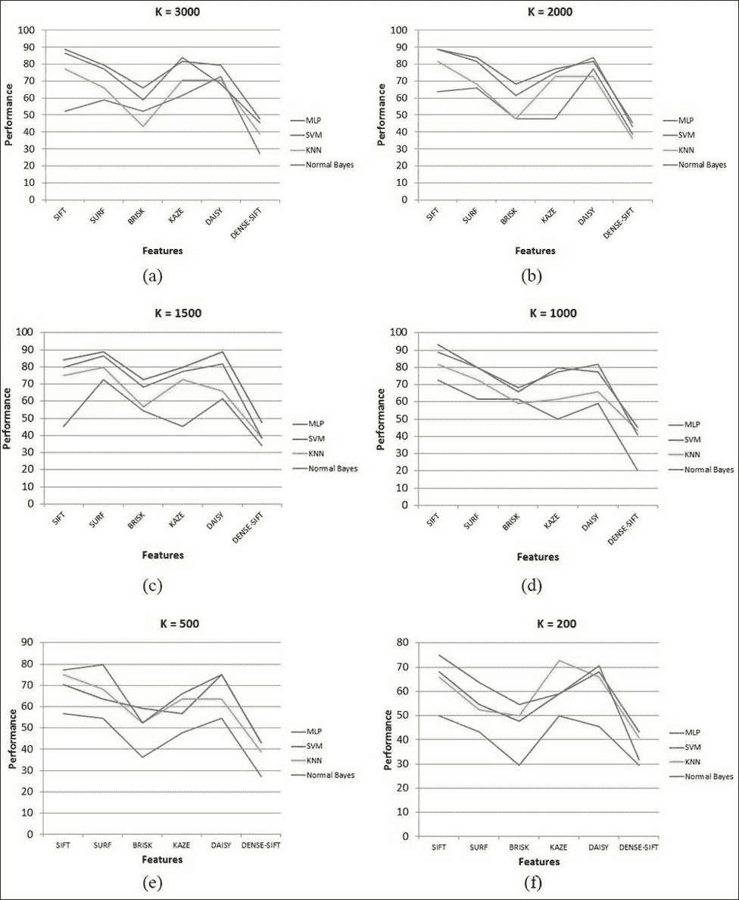

不同簇数量下特征性能与机器算法之间的关系

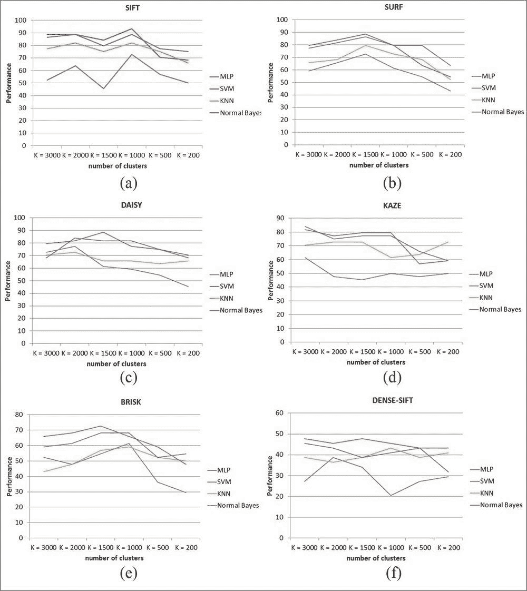

不同机器算法下特征性能与聚类中心数量之间的关系

## 使用不同特征的评估

在图中，*不同簇数量下特征性能与机器算法之间的关系*，我们评估了六个特征。在大多数情况下，SIFT 给出了最佳结果。DAISY 与 SIFT 相当。在某些情况下，KAZE 也给出了良好的结果。由于结果较差，DENSE-SIFT 不是我们面部表情问题的好选择。此外，DENSE 特征的计算成本非常高。总之，SIFT 仍然是最佳选择。然而，SIFT 受专利保护。您可能想看看 DAISY 或 KAZE。我们建议您在自己的数据上评估并选择最合适的特征。

## 使用不同簇数量的评估

在图中，“不同机器算法下特征性能与聚类数量的影响”，我们绘制了一个图表来可视化聚类数量对性能的影响。如您所见，不同特征之间的聚类数量不同。在 SIFT、KAZE 和 BRISK 中，最佳聚类数量是 1,000。然而，在 SURF、DAISY 和 DENSE-SIFT 中，1,500 是更好的选择。基本上，我们不希望聚类数量太大。在 kmeans 中的计算成本随着聚类数量的增加而增加，尤其是在 DENSE-SIFT 中。

# 系统概述

在本节中，我们将解释如何在您的应用程序中应用训练好的模型。给定一张人脸图像，我们分别检测和处理每个面部。然后，我们找到特征点并提取面部区域。从图像中提取特征并传递给 kmeans 以获得一个 1,000 维的特征向量。对该特征向量应用 PCA 以降低其维度。使用学习到的机器学习模型来预测输入面部表情。

下图显示了预测图像中面部表情的完整过程：

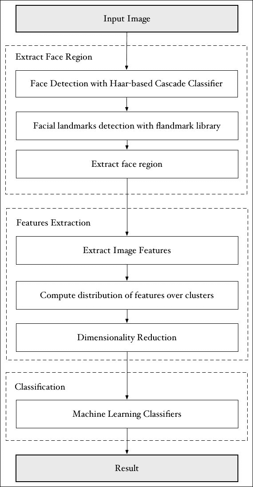

预测新图像中面部表情的过程

# 进一步阅读

我们介绍了一个基本的面部表情系统。如果您对这个主题真正感兴趣，您可能想阅读本节以获取更多关于如何提高系统性能的指导。在本节中，我们将向您介绍编译 `opencv_contrib` 模块、Kaggle 面部表情数据集和 k-交叉验证方法。我们还将提供一些关于如何获得更好的特征提取的建议。

## 编译 opencv_contrib 模块

在本节中，我们将介绍在基于 Linux 的系统中编译 `opencv_contrib` 的过程。如果您使用 Windows，可以使用具有相同选项的 Cmake GUI。

首先，将 `opencv` 仓库克隆到您的本地机器上：

```py
git clone https://github.com/Itseez/opencv.git --depth=1

```

第二，将 `opencv_contrib` 仓库克隆到您的本地机器上：

```py
git clone https://github.com/Itseez/opencv_contrib --depth=1

```

切换到 `opencv` 文件夹并创建一个构建目录：

```py
cd opencv
mkdir build
cd build

```

使用 opencv_contrib 支持从源代码构建 OpenCV。您应将 `OPENCV_EXTRA_MODULES_PATH` 修改为您的机器上 `opencv_contrib` 的位置：

```py
cmake -D CMAKE_BUILD_TYPE=RELEASE -D CMAKE_INSTALL_PREFIX=/usr/local -D OPENCV_EXTRA_MODULES_PATH=~/opencv_contrib/ ..
make -j4
make install

```

## Kaggle 面部表情数据集

Kaggle 是一个优秀的数据科学家社区。Kaggle 主办了许多比赛。2013 年，有一个面部表情识别挑战。

### 注意

目前，您可以通过以下链接访问完整数据集：

[`www.kaggle.com/c/challenges-in-representation-learning-facial-expression-recognition-challenge/`](https://www.kaggle.com/c/challenges-in-representation-learning-facial-expression-recognition-challenge/)

数据集包含 48x48 像素的灰度人脸图像。共有 28,709 个训练样本，3,589 个公开测试图像和 3,589 个最终测试图像。数据集包含七种表情（愤怒、厌恶、恐惧、快乐、悲伤、惊讶和中性）。获胜者获得了 69.769 %的分数。由于这个数据集非常大，所以我们认为我们的基本系统可能无法直接使用。我们相信，如果您想使用这个数据集，您应该尝试提高系统的性能。

## 面部特征点

在我们的面部表情系统中，我们使用人脸检测作为预处理步骤来提取面部区域。然而，人脸检测容易发生错位，因此特征提取可能不可靠。近年来，最常见的方法之一是使用面部特征点。在这种方法中，检测面部特征点并用于对齐面部区域。许多研究人员使用面部特征点来提取面部组件，如眼睛、嘴巴等，并分别进行特征提取。

### 什么是面部特征点？

面部特征点是面部组件的预定义位置。下面的图显示了 iBUG 组的一个 68 点系统的示例 ([`ibug.doc.ic.ac.uk/resources/facial-point-annotations`](http://ibug.doc.ic.ac.uk/resources/facial-point-annotations))

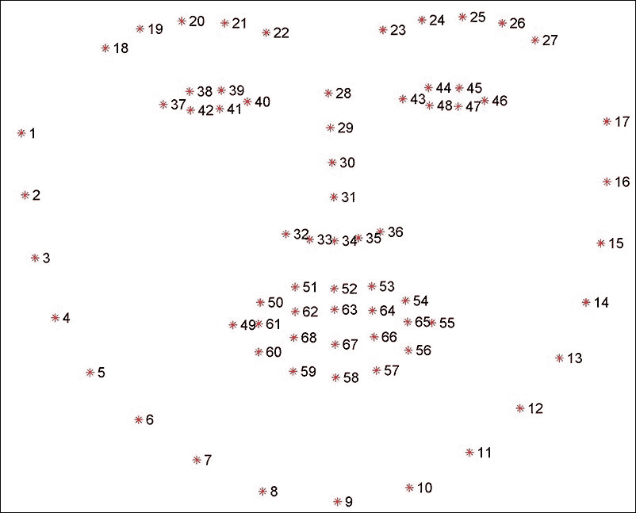

iBUG 组的一个 68 个特征点系统的示例

### 你如何检测面部特征点？

在面部区域内检测面部特征点有几种方法。我们将为您提供一些解决方案，以便您能够轻松开始您的项目。

+   **主动形状模型**：这是解决此问题最常见的方法之一。您可能会发现以下库很有用：

    Stasm: [`github.com/cxcxcxcx/asmlib-opencv`](https://github.com/cxcxcxcx/asmlib-opencv)

+   **Cao 等人通过显式回归进行人脸对齐**：这是关于面部特征点的最新工作之一。这个系统非常高效且非常准确。您可以在以下超链接中找到开源实现：[`github.com/soundsilence/FaceAlignment`](https://github.com/soundsilence/FaceAlignment)

### 你如何使用面部特征点？

您可以使用面部特征点以多种方式。我们将为您提供一些指南：

+   您可以使用面部特征点将面部区域对齐到共同的标准，并提取特征向量，就像我们在基本面部表情系统中做的那样。

+   您可以在不同的面部组件（如眼睛和嘴巴）中分别提取特征向量，并将它们组合成一个特征向量进行分类。

+   您可以使用面部特征点的位置作为特征向量，并忽略图像中的纹理。

+   您可以为每个面部组件构建分类模型，并以加权方式组合预测结果。

## 提高特征提取

特征提取是面部表情分析中最重要的部分之一。最好为你的问题选择合适的特征。在我们的实现中，我们只在 OpenCV 中使用了少数几个特征。我们建议你尝试 OpenCV 中所有可能的特征。以下是 Open CV 支持的特性列表：BRIEF, BRISK, FREAK, ORB, SIFT, SURF, KAZE, AKAZE, FAST, MSER, 和 STAR。

社区中还有其他一些非常适合你问题的优秀特性，例如 LBP, Gabor, HOG 等。

## K 折交叉验证

K 折交叉验证是估计分类器性能的常用技术。给定一个训练集，我们将将其划分为 k 个分区。对于 k 次实验中的每个折 i，我们将使用不属于折 i 的所有样本来训练分类器，并使用折 i 中的样本来测试分类器。

K 折交叉验证的优势在于数据集中的所有示例最终都会用于训练和验证。

将原始数据集划分为训练集和测试集是很重要的。然后，训练集将用于 k 折交叉验证，而测试集将用于最终测试。

交叉验证结合了每个实验的预测误差，从而得到模型更准确的估计。它非常有用，尤其是在我们训练数据不多的情况下。尽管计算时间较长，但如果你想提高系统的整体性能，使用复杂特征是一个很好的主意。

# 摘要

本章展示了 OpenCV 3 中面部表情系统的完整过程。我们走过了系统的每一步，并为每一步提供了许多替代方案。本章还基于特性和学习算法对结果进行了评估。

最后，本章为你提供了一些进一步改进的提示，包括一个面部表情挑战，面部特征点方法，一些特性建议，以及 k 折交叉验证。
