# 第六章. 利用生物特征属性进行高效人员识别

数字媒体的兴起比以往任何时候都要大。人们将越来越多的个人信息放在笔记本电脑、智能手机和平板电脑等数字载体上。然而，许多这些系统并没有提供有效的身份识别和验证系统来确保陌生人无法访问你的个人数据。这就是基于生物特征的识别系统发挥作用并试图使你的数据更加安全、减少对恶意人员的脆弱性的地方。

这些识别系统可以用来锁定你的电脑，防止人们进入安全房间等，但随着技术的每日进步，我们离进一步数字化我们的个人生活只有一步之遥。用你的面部表情来解锁门怎么样？用你的指纹打开汽车怎么样？可能性是无限的。

许多技术和算法已经在开源计算机视觉和机器学习包（如 OpenCV）中可用，可以有效地使用这些个人识别属性。当然，这也为热衷于计算机视觉的程序员创造了基于这些技术的许多不同应用的可能性。

在本章中，我们将关注使用个人生物特征的技术，以便创建超越基于密码的标准登录系统的个人身份验证系统。我们将更深入地探讨虹膜和指纹识别、人脸检测和人脸识别。

我们将首先讨论每种生物特征技术背后的主要原则，然后我们将基于 OpenCV 3 库展示一个实现示例。对于某些生物特征，我们将利用现有的开源框架。所有用于展示技术的数据集都免费在线提供，用于研究目的。然而，如果你想要将它们应用于商业应用，请务必检查它们的许可证！

最后，我们将说明如何结合几种生物特征分类来增加基于个人生物特征的特定人员成功识别的概率。

在本章结束时，你将能够创建一个完全功能化的识别系统，这将帮助你避免个人详细信息被任何恶意方窃取。

# 生物特征，一种通用方法

使用生物特征属性识别人员的通用思想对所有现有的生物特征都是相同的。如果我们想要获得良好的结果，我们应该遵循正确的顺序进行几个步骤。此外，我们还将指出这些一般步骤中的几个重要点，这将帮助你通过极端措施提高识别率。

## 第 1 步 – 获取良好的训练数据集并应用应用特定的归一化

大多数生物特征识别系统的关键是收集一个代表你将实际使用该系统的问题的系统训练数据集。研究已经证明，存在一种称为**数据集偏差**的现象，这意味着如果你在一个具有特定设置、环境因素和记录设备的训练集上训练一个系统，然后将该系统应用于从完全不同的设置、不同的环境因素（如光源）和不同的记录设备中获取的测试集，那么这将会导致性能下降高达 25%。这是一个很大的性能损失，因为你想要确保你的识别系统以最佳性能运行。

因此，在创建你的识别系统的训练集时，有几个方面需要考虑：

+   你应该只收集在应用生物特征识别时将使用的**已知设置**的训练数据。这意味着在开始训练模型和分类器之前，你需要决定硬件。

+   对于生物特征登录系统，尽可能多地**约束你的数据**是很重要的。如果你可以消除光照变化、不同的背景设置、运动、非等距定位等问题，那么你可以极大地提高你应用程序的性能。

+   尽量**规范化你的数据方向**。如果你将所有训练数据对齐到相同的位置，你就可以避免在单个生物特征描述中引入不希望出现的方差。该领域的研究已经证明，这可以提高识别率超过 15%！

+   使用单个生物特征的**多个训练实例**，并使用平均生物特征描述来验证一个人的身份。单次训练系统的一个缺点是，两个生物特征记录之间的细微差异会对分类率产生很大的影响。单次学习仍然是一个非常活跃的研究课题，并且尚未找到一个非常稳定的解决方案来解决这个问题。

如何将这种归一化应用于特定技术将在相应的子主题中进行讨论；例如，在人脸识别的情况下，它实际上可能很大程度上取决于所使用的技术。一旦你获得了一个好的训练集，包含足够的样本，你就可以准备进行第二步了。

### 注意

请记住，在某些情况下，应用约束并不总是一个好的选择。考虑一个基于生物特征特征的笔记本电脑登录系统，该系统仅在灯光打开时（如人脸检测和识别）工作。当有人在黑暗的房间里工作时，该系统将无法工作。在这种情况下，你需要重新考虑你的应用程序，并确保有足够的与光照变化无关的生物特征检查。你甚至可以通过网络摄像头检查光强度，如果可以预测人脸检查会失败，则禁用人脸检查。

应用和情境的简化涉及简化本章讨论的算法，从而在这些受限场景中提高性能。

## 第 2 步 – 创建记录的生物特征的描述符

一旦你收集到构建你的生物识别系统的所需训练数据，找到一种独特描述每个个体的生物参数的方法就变得很重要。这种描述被称为“独特特征向量”，与原始记录图像相比，它具有几个优点：

+   一个全尺寸的高分辨率 RGB 图像（这在生物识别记录中用得很多）包含大量数据。如果我们对整个图像进行分类，它将是：

    +   计算成本非常高。

    +   并非像期望的那样独特，因为不同人的区域可以是相同的或非常相似的。

+   它将输入图像中的重要且独特的信息减少到基于关键点的稀疏表示，这些关键点是每个图像的独特特征。

再次，你如何构建特征描述符取决于你想要用于验证的哪种生物识别。一些方法基于高博滤波器组、局部二值模式描述和 SIFT、SURF、ORB 等关键点描述符。可能性，再次，是无限的。这完全取决于为你的应用找到最好的描述。我们将为每种生物识别提供建议，但为了找到最适合你应用的解决方案，还需要进行更彻底的搜索。

## 第 3 步 – 使用机器学习匹配检索到的特征向量

从第 2 步创建的每个特征向量都需要是唯一的，以确保基于这些特征向量的机器学习技术能够区分不同测试对象的生物特征。因此，拥有足够维度的描述符非常重要。机器学习技术在分离高维空间中的数据方面比人类要好得多，而在低维特征空间中分离数据时，人类大脑的表现优于系统。

选择最佳的机器学习方法是件非常繁琐的事情。原则上，不同的技术可以提供相似的结果，但找到最佳方案则是一场试错的游戏。你可以在每个机器学习方法内部应用参数优化以获得更好的结果。这种优化对于本章来说过于详细。对此感兴趣的人应该深入了解**超参数优化**技术。

### 注意

下面可以找到一些关于这个超参数优化问题的有趣出版物：

+   Bergstra J. S., Bardenet R., Bengio Y. 和 Kégl B. (2011), *超参数优化的算法*, 在《神经信息处理系统进展》(第 2546-2554 页)。

+   Bergstra J. 和 Bengio Y. (2012), *超参数优化的随机搜索*, 《机器学习研究杂志》, 13(1), 281-305。

+   Snoek J., Larochelle H., and Adams R. P. (2012), *《机器学习算法的实用贝叶斯优化》*，收录于《神经信息处理系统进展》（第 2951-2959 页）。

OpenCV 3 中有很多机器学习技术。以下是一些最常用的技术，按复杂度排序：

+   **相似度匹配**使用距离度量。

+   **K-最近邻搜索**：基于高维空间中特征向量之间的距离（欧几里得、汉明等）计算的多（K）类分类。

+   **朴素贝叶斯分类器**：一种使用贝叶斯学习来区分不同类别的二元分类器。

+   **支持向量机**：主要用作二元分类学习方法，但可以适应多类分类系统。这种方法依赖于通过在高维空间中寻找训练数据云和分离边缘之间的最优分离平面来分离数据。

+   **提升和随机森林**：将多个弱分类器或学习器组合成一个复杂模型的技术，能够分离二元和多类问题。

+   **人工神经网络**：一组利用大量神经元（如大脑中的小细胞）的强大能力，通过示例学习连接和决策的技术。由于它们的学习曲线更陡峭，优化步骤复杂，因此在本章中我们将放弃使用它们。

### 注意

如果你对你的分类问题感兴趣，想使用神经网络，那么请查看这个 OpenCV 文档页面：

[`docs.opencv.org/master/d0/dce/classcv_1_1ml_1_1ANN__MLP.html`](http://docs.opencv.org/master/d0/dce/classcv_1_1ml_1_1ANN__MLP.html)

## 第 4 步 – 思考你的认证过程

一旦你有一个对输入特征向量输出分类的机器学习技术，你需要检索一个确定性。这个确定性是确保分类结果确定性的必要条件。例如，如果某个输出在数据库中与条目 2 和条目 5 都有匹配，那么你需要使用确定性来确保你应该继续哪一个匹配。

在这里，考虑你的认证系统如何运行也很重要。它可以是逐一匹配的方法，即匹配每个数据库条目与你的测试样本，直到获得足够高的匹配分数，或者是一对多方法，即匹配整个数据库，然后查看每个匹配的检索分数，并选择最佳匹配。

一对一可以看作是一对多的一种迭代版本。它们通常使用相同的逻辑；区别在于比较过程中使用的数据结构。一对多方法需要更复杂的数据存储和索引方式，而一对一则使用更直接的暴力方法。

### 注意

请记住，由于机器学习中总是可能发生假阳性匹配，这两种技术可能会产生不同的结果。

想象一下你系统的输入测试查询。使用一对一对匹配，当你达到足够高的匹配度时，你会停止分析数据库。然而，如果在更远的地方有一个产生更高分数的匹配，那么这个匹配将被丢弃。使用一对多方法，这可以避免，因此在许多情况下，应用一对多方法更好。

为了举例说明在特定情况下应使用哪种方法，想象一个通往秘密实验室的门。如果你想检查一个人是否有权进入实验室，那么需要一个一对多方法来确保匹配所有数据库条目，并且最高匹配分数的确定性高于某个阈值。然而，如果这个最后的秘密实验室门仅用于选择已经允许进入房间的人，那么一对一方法就足够了。

为了避免两个个体对单一生物特征有非常相似描述符的问题，通常会结合多个生物特征以减少假阳性检测的发生。这一点将在本章末尾进一步讨论，当我们在一个有效的身份验证系统中结合多个生物特征时。

# 人脸检测和识别

大多数现有的身份验证系统都是从检测人脸并尝试将其与使用该系统的已知人员数据库匹配开始的。本小节将更详细地探讨这一点。我们不会深入研究软件的每一个参数。

### 注意

如果你想要关于完整的人脸检测以及人和猫的识别流程的更多信息，那么请查看 PacktPub 出版的一本名为*OpenCV for Secret Agents*的书。它更详细地探讨了整个过程。

如果你想要关于基于 Viola 和 Jones 级联分类管道的 OpenCV 人脸检测接口参数的非常详细的解释，那么我建议你去看第五章，*工业应用中的通用目标检测*，它讨论了用于通用目标检测的通用接口。

无论何时你在关注一个身份验证系统，你都要确保你熟悉需要应用的不同子任务，正如在“使用 Viola 和 Jones 提升级联分类器算法进行人脸检测”一节中图*人脸检测软件及其裁剪的人脸区域*所示。

1.  你应该从使用一个**通用人脸检测器**开始。这是用来在任意输入中找到人脸的；例如，从你的网络摄像头中。我们将使用 OpenCV 中的 Viola 和 Jones 人脸检测器，它基于 AdaBoost 的级联分类器进行训练。

1.  其次，您应该在图像上执行一些归一化操作。在我们的案例中，我们将应用一些灰度化、直方图均衡化以及基于眼和嘴检测的对齐。

1.  最后，需要将数据传递到人脸识别接口。我们将简要讨论不同的选项（LBPH、Eigenfaces 和 Fisherfaces），并带您了解整个过程。这将返回数据库中用于匹配的选定用户。

我们将在所有阶段讨论可能的方法的优势、劣势和风险。我们还将建议几个开源软件包，如果您想进一步优化方法，这将给您机会。

### 注意

本小节的软件可以在以下位置找到：

[`github.com/OpenCVBlueprints/OpenCVBlueprints/tree/master/chapter_6/source_code/face/`](https://github.com/OpenCVBlueprints/OpenCVBlueprints/tree/master/chapter_6/source_code/face/)

## 使用 Viola 和 Jones 增强级联分类器算法进行人脸检测

现在大多数网络摄像头设置都提供高分辨率的 RGB 图像作为输入。然而，请注意，对于所有基于 OpenCV 的操作，OpenCV 都将输入格式化为 BGR 图像。因此，在应用人脸检测器之前，我们应该对输出图像进行一些预处理步骤。

+   首先将图像转换为灰度图像。Viola 和 Jones 方法使用 HAAR 小波或基于局部二值模式的特征，这两种特征都不依赖于颜色。这两种特征类型都寻找像素强度变化的区域。因此，我们可以省略额外的颜色信息，并减少需要处理的数据量。

+   降低图像的分辨率。这取决于网络摄像头的输出格式，但考虑到处理时间会随着分辨率的增加而指数级增加，640x360 的比率对于人脸检测来说已经足够。

+   将**直方图均衡化**应用于图像以覆盖不同光照下的不变性。基本上，这个操作试图使整个图像的强度直方图平坦化。在 OpenCV 3 中训练检测模型时也进行了同样的操作。

### 注意

对于算法，始终使用不同的输入和输出容器是好的，因为内联操作往往会非常恶劣地处理输出。如果您不确定内联替换是否受支持，通过声明一个额外的变量来避免问题。

以下代码片段说明了这种行为：

```py
Mat image, image_gray, image_hist;
VideoCapture webcam(0);
Webcam >> image;
resize(image, image, Size(640,360));
cvtColor(image, image_gray, COLOR_BGR2GRAY);
equalizeHist(image_gray, image_hist);
```

在完成所有预处理后，您可以将以下代码应用于输入图像以获得一个可操作的人脸检测器：

```py
CascadeClassifier cascade('path/to/face/model/');
vector<Rect> faces;
cascade.detectMultiScale(image_hist, faces, 1.1, 3);
```

您现在可以在图像上绘制检索到的矩形来可视化检测。

### 注意

如果您想了解更多关于使用参数或检索到的检测信息，请查看第五章，《工业应用中的通用目标检测》，其中更详细地讨论了此接口。

人脸检测将看起来像下面的图：

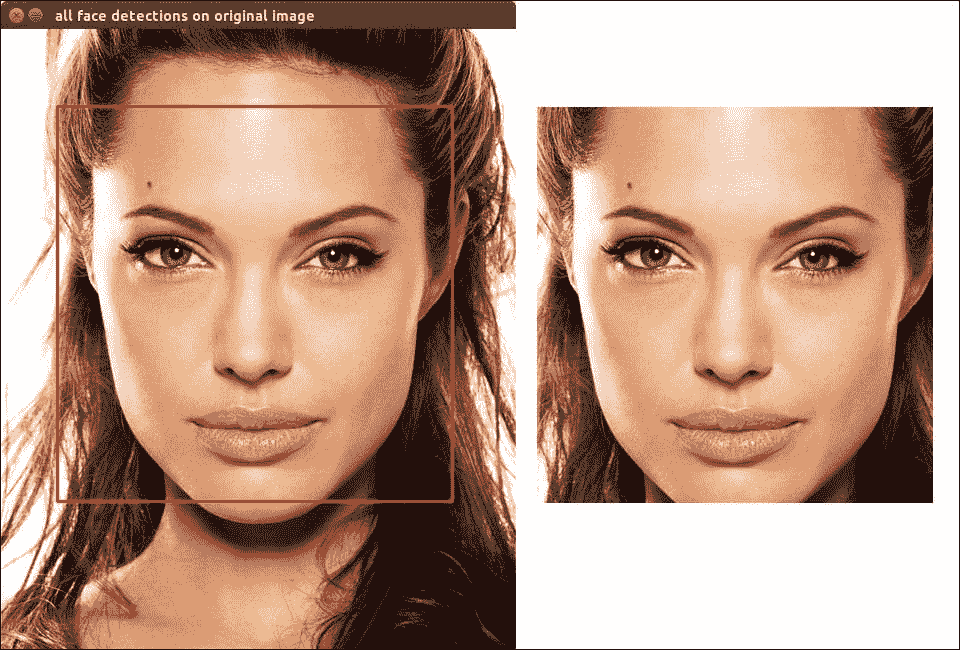

人脸检测软件示例及其裁剪的人脸区域

最后，您应该裁剪检测到的人脸区域，以便将它们传递给将处理图像的接口。最佳方法是从原始调整大小的图像中获取这些人脸区域，如图中所示，而不是从可视化矩阵中获取，以避免裁剪掉红色边框并污染人脸图像。

```py
for(int i=0; i<faces.size(); i++){
   Rect current_face = faces[i];
   Mat face_region = image( current_face ).clone();
   // do something with this image here
}
```

### 注意

执行此人脸检测的软件可以在以下位置找到：

[`github.com/OpenCVBlueprints/OpenCVBlueprints/tree/master/chapter_6/source_code/face/face_detection/`](https://github.com/OpenCVBlueprints/OpenCVBlueprints/tree/master/chapter_6/source_code/face/face_detection/).

## 在检测到的人脸区域上进行数据归一化

如果您只对基本的测试设置感兴趣，那么人脸归一化步骤实际上并不是必需的。它们主要用于提高您的人脸识别软件的质量。

一个好的开始方法是减少图像中的变化量。您已经可以应用转换为灰度图和直方图均衡化来从图像中移除信息，如前一个子主题中所述。如果您只想进行简单的测试设置，这将是足够的，但需要人员保持与为该人员抓取训练数据时相同的位置。如果不是这样，那么由于头部位置不同而产生的数据微小变化就足以触发与数据库中另一人的错误匹配。

为了避免这种情况，并提高以下人脸识别系统的质量，我们建议应用人脸对齐。这可以通过几种方式完成。

+   作为一种基本方法，可以运行基于现有 OpenCV 检测器的眼和嘴检测器，并使用检测的中心作为对齐人脸的方式。

    ### 注意

    对于非常详细的解释，请参阅 Shervan Emami 所著的《精通 OpenCV》第八章（[`github.com/MasteringOpenCV/code/tree/master/Chapter8_FaceRecognition`](https://github.com/MasteringOpenCV/code/tree/master/Chapter8_FaceRecognition)）。他讨论了使用眼检测对人脸进行对齐的几种方法。

    此外，请参阅第三章，《使用机器学习识别面部表情》中关于“在图像中找到人脸区域”的部分。

+   更高级的方法是应用面部特征点检测器，并使用所有这些点来归一化和对齐面部。

    ### 注意

    如果您对更高级的技术感兴趣，请查看 flandmark 库（[`cmp.felk.cvut.cz/~uricamic/flandmark/`](http://cmp.felk.cvut.cz/~uricamic/flandmark/)）。有关使用面部特征点技术的更多信息，请参阅第三章, *使用机器学习识别面部表情*，该章节讨论了如何安装此库、配置软件，并在任何给定的面部图像上运行它。

关于面部对齐的良好讨论可以在以下 OpenCV Q&A 论坛找到：[`answers.opencv.org/question/24670/how-can-i-align-face-images/`](http://answers.opencv.org/question/24670/how-can-i-align-face-images/)。多个活跃的论坛用户聚集了他们的 OpenCV 知识，提出了一种基于基本面部特征点技术的非常有前景的对齐技术。

最基本的对齐可以通过以下方法实现：

1.  首先使用提供的眼脸级联检测两个眼睛。

1.  找到两个眼睛检测的中心点。

1.  计算双眼之间的角度。

1.  围绕图像自身的中心旋转图像。

以下代码执行此操作：

```py
CascadeClassifier eye('../haarcascades/haarcascade_eye.xml');
vector<Rect> eyes_found;
eye.detectMultiScale(face_region, eyesfound, 1.1, 3);
// Now let us assume only two eyes (both eyes and no FP) are found
double angle = atan( double(eyes_found[0].y - eyes_found[1].y) / double(eyes_found[0].x - eyes_found[1].x) ) * 180 / CV_PI;
Point2f pt(image.cols/2, image.rows/2);
Mat rotation = getRotationMatrix2D(pt, angle, 1.0);
Mat rotated_face;
warpAffine(face_region, rotated_face, rotation, Size(face_region.cols, face_region.rows));
```

### 注意

```py
Ptr<BasicFaceRecognizer> face_model = createEigenFaceRecognizer();
```

这将生成一个基于特征向量的模型，准备进行训练，该模型将使用所有特征向量（可能较慢）且没有确定性阈值。为了能够使用它们，您需要使用面部识别器的重载接口。

+   `Ptr<BasicFaceRecognizer> face_model = createEigenFaceRecognizer(20);`

+   `Ptr<BasicFaceRecognizer> face_model = createEigenFaceRecognizer(20, 100.0);`

在这里，您需要决定您实际上想要实现什么。使用少量特征向量进行训练将很快，但准确性会较低。为了提高准确性，增加使用的特征向量的数量。由于它很大程度上取决于训练数据，因此获取正确的特征向量数量相当繁琐。作为一个启发式方法，您可以使用少量特征向量训练一个识别器，在测试集上测试识别率，然后只要您没有达到识别率目标，就增加特征向量的数量。

然后，可以使用以下代码学习模型：

```py
// train a face recognition model
vector<Mat> faces;
vector<int> labels;
Mat test_image = imread("/path/to/test/image.png");
// do not forget to fill the data before training
face_model.train(faces, labels);
// when you want to predict on a new image given, using the model
int predict = modelàpredict(test_image);
```

如果您想获得更多关于预测的信息，例如预测置信度，那么您可以替换最后一行：

```py
int predict = -1; // a label that is unexisting for starters
double confidence = 0.0;
modelàpredict(test_image, predict, confidence);
```

这是一个基本设置。为了提高您模型的质量，您需要记住以下事项：

+   通常，一个人拥有的训练人脸越多，对该人的新样本识别效果越好。然而，请注意，您的训练样本应包含尽可能多的不同情况，包括照明条件、面部毛发、属性等。

+   增加用于投影的特征向量的数量可以提高准确性，但也会使算法变慢。为你的应用找到一个好的折衷方案非常重要。

+   为了避免通过数据库中的最佳匹配原则引入欺诈，你可以使用置信度分数来阈值化掉不够安全的匹配项

### 注意

如果你想进一步研究算法的细节，我建议阅读一篇更详细描述该技术的论文：

Turk, Matthew, 和 Alex P. Pentland. "使用特征脸进行人脸识别" 计算机视觉与模式识别，1991 年。CVPR'91 会议论文集，IEEE 计算机协会。1991 年。

如果你想要与基于 Eigenface 模型的内部数据进行交互，你可以使用以下代码检索有趣的信息：

```py
// Getting the actual eigenvalues (reprojection values on the eigenvectors for each sample)
Mat eigenvalues = face_model->getEigenValues();
// Get the actual eigenvectors used for projection and dimensionality reduction
Mat eigenvectors = face_model->getEigenVectors();
// Get the mean eigenface
Mat mean = face_model->getMean();
```

下面这张图中展示了我们在测试中使用的样本的一些输出结果。记住，如果你想展示这些图像，你需要将它们转换到[0 255]的范围内。OpenCV 3 FaceRecognizer 指南清楚地说明了你应该如何进行这一操作。喷射色彩空间常用于可视化 Eigenfaces 数据。

### 注意

完整且详细的 OpenCV 3 FaceRecognizer 接口指南可以在以下网页找到，并深入讨论了这些参数的进一步使用，比本章更详细。

[`docs.opencv.org/master/da/d60/tutorial_face_main.html`](http://docs.opencv.org/master/da/d60/tutorial_face_main.html)

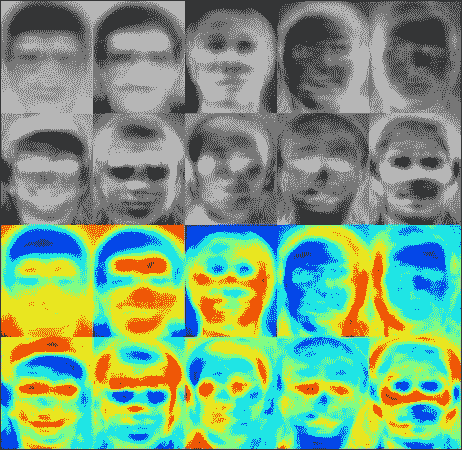

在最常见的色彩空间中可视化前十个 Eigenfaces，包括灰度和 JET。注意背景的影响。

### 使用 Fisher 准则的线性判别分析

使用 Eigenface 分解的缺点是，如果你考虑的是给定数据的纯重建，那么这种变换是最佳的，然而，该技术并没有考虑到类别标签。这可能导致最大方差轴实际上是由外部来源而不是人脸本身创建的情况。为了应对这个问题，引入了基于 Fisher 准则的 LDA（线性判别分析）技术。这最小化了单个类别的方差，同时最大化类别之间的方差，从而使技术在长期内更加稳健。

执行此人脸检测的软件可以在以下位置找到：

### 注意

[`github.com/OpenCVBlueprints/OpenCVBlueprints/tree/master/chapter_6/source_code/face/face_recognition_fisher/`](https://github.com/OpenCVBlueprints/OpenCVBlueprints/tree/master/chapter_6/source_code/face/face_recognition_fisher/)

要使用 Fisher 准则构建 LDA 人脸识别器接口，你应该在 OpenCV 3 中使用以下代码片段：

```py
// Again make sure that the data is available
vector<Mat> faces;
vector<int> labels;
Mat test_image = imread("/path/to/test/image.png");
// Now train the model, again overload functions are available
Ptr<BasicFaceRecognizer> face_model = createFisherFaceRecognizer();
face_modelàtrain(faces, labels);
// Now predict the outcome of a sample test image
int predict = face_modelàpredict(test_image);
```

如果你想要获取模型更具体的属性，可以通过属性特定的函数来实现，如下所示。记住，如果你想展示这些图像，你需要将它们转换到[0 255]的范围内。骨骼颜色空间常用于可视化 Fisherfaces 数据。

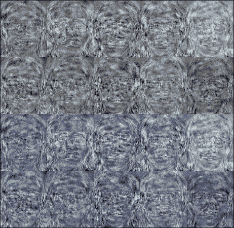

最常见的颜色空间中可视化的前 10 个 Fisherface 维度，包括灰度和 BONE。

### 注意

注意，与之前的 Eigenfaces 技术相比，这些 Fisherfaces 的背景影响最小。这是 Fisherfaces 相对于 Eigenfaces 的主要优势。

很好知道，Eigenfaces 和 Fisherfaces 都支持在映射到选定的维度时，在某个点上重建任何给定输入到特征空间或 Fisher 空间内。这是通过以下代码实现的：

```py
// Get the eigenvectors or fishervectors and the mean face
Mat mean = face_modelàgetMean();
Mat vectors = face_modelàgetEigenValues();
// Then apply the partial reconstruction
// Do specify at which stage you want to look
int component_index = 5;
Mat current_slice = vectors.col(component_index);
// Images[0] is the first image and used for reshape properties
Mat projection = cv::LDA::subspaceProject(current_slice, mean, images[0].reshape(1,1));
Mat reconstruction = cv::LDA::subspaceReconstruct(current_slice, mean, projection);
// Then normalize and reshape the result if you want to visualize, as explained on the web page which I referred to.
```

### 注意

执行此人脸检测的软件可以在以下位置找到：

[`github.com/OpenCVBlueprints/OpenCVBlueprints/tree/master/chapter_6/source_code/face/face_recognition_projection/`](https://github.com/OpenCVBlueprints/OpenCVBlueprints/tree/master/chapter_6/source_code/face/face_recognition_projection/)

这将导致以下图所示的输出。我们在特征空间的不同阶段重新投影一个测试对象，随后向表示中添加 25 个特征向量。在这里，你可以清楚地看到我们成功地在 12 步中重建了个体。我们可以对 Fisherfaces 应用类似的程序。然而，由于 Fisherfaces 的维度较低，并且我们只寻找用于区分标签的特征，我们无法期望重建的效果像 Eigenfaces 那样纯净。

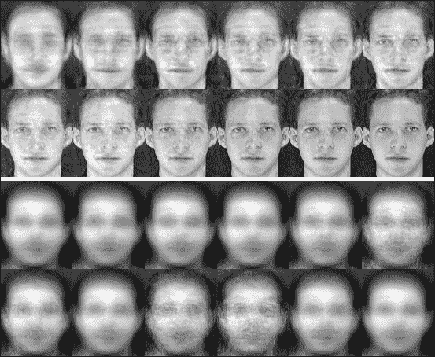

Eigenfaces 和 Fisherfaces 的重投影结果

### 注意

如果你想进一步研究算法的细节，我建议阅读一篇更详细描述该技术的论文：

Belhumeur Peter N.，João P. Hespanha，David J. Kriegman，*Eigenfaces vs. Fisherfaces: Recognition using class specific linear projection*，Pattern Analysis and Machine Intelligence，IEEE Transactions on 19.7 (1997): 711-720。

### 局部二值模式直方图

除了简单地降低到通用轴的维度之外，另一种方法是使用局部特征提取。通过观察局部特征而不是特征的完整全局描述，研究人员试图应对部分遮挡、光照和样本量小等问题。使用局部二值模式强度直方图是一种观察局部面部信息而不是观察单个个体的全局面部信息的技术。这种度量比之前的技术更容易受到光照条件变化的影响。

### 注意

执行此面部检测的软件可以在以下位置找到：

[`github.com/OpenCVBlueprints/OpenCVBlueprints/tree/master/chapter_6/source_code/face/face_recognition_LBPH/`](https://github.com/OpenCVBlueprints/OpenCVBlueprints/tree/master/chapter_6/source_code/face/face_recognition_LBPH/)

下图展示了 LBPH 特征。它们清楚地表明，与 Eigenfaces 或 Fisherfaces 相比，它们提供了更局部化的特征描述。

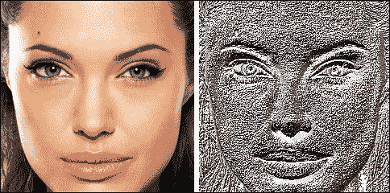

示例面部图像及其 ELBP 投影

### 注意

执行此 LBPH 面部投影的软件可以在以下位置找到：

[`github.com/OpenCVBlueprints/OpenCVBlueprints/tree/master/chapter_6/source_code/face/face_to_ELBP/`](https://github.com/OpenCVBlueprints/OpenCVBlueprints/tree/master/chapter_6/source_code/face/face_to_ELBP/)

要使用局部二值模式直方图构建 LBP 面部识别接口，你应该在 OpenCV 3 中使用以下代码片段：

```py
// Again make sure that the data is available
vector<Mat> faces;
vector<int> labels;
Mat test_image = imread("/path/to/test/image.png");
// Now train the model, again overload functions are available
Ptr<LBPHFaceRecognizer> face_model = createLBPHFaceRecognizer();
face_modelàtrain(faces, labels);
// Now predict the outcome of a sample test image
int predict = face_modelàpredict(test_image);
```

LBPH 接口还有一个重载函数，但这次与 LBPH 模式的结构有关，而不是投影轴。这可以从下面看到：

```py
// functionality createLBPHFaceRecognizer(radius, neighbors, grid_X, grid_Y, treshold)
cv::createLBPHFaceRecognizer(1,8,8,8,123.0);
// Getting the properties can be done using the getInt function.
int radius = model->getRadius();
int neighbors = model->getNeighbors();
int grid_x = model->getGridX();
int grid_y = model->getGridY();
double threshold = model->getThreshold();
```

再次强调，该函数可以在预先设置阈值的情况下或不设置阈值的情况下运行。获取或设置模型参数也可以通过特定的获取器和设置器函数来完成。

### 注意

如果你想进一步研究算法的细节，我建议阅读一篇更详细描述该技术的论文：

Ahonen Timo, Abdenour Hadid, 和 Matti Pietikäinen, 《基于局部二值模式的面部识别》, 计算机视觉-eccv 2004, Springer Berlin Heidelberg, 2004. 469-481.

我们为上述三个接口都提供了功能，也计算了正确分类和错误分类的测试样本数量，如下所示。在 LBPH 的情况下，这意味着我们在测试样本上有 96.25%的正确分类率，这对于只有每人八个样本的非常有限的训练数据来说是非常惊人的。

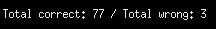

每次运行后都会输出正确分类样本的数量。

## 当前基于 OpenCV 3 的实现中面部识别的问题

讨论的技术使我们能够识别一个面部并将其与数据集中的某个人联系起来。然而，这个系统仍然存在一些需要解决的问题：

+   当使用特征脸系统时，一个普遍的规则是，你使用的特征向量越多，系统就会变得越好，准确性也会更高。定义你需要多少维度才能得到一个不错的识别结果是令人沮丧的，因为这取决于数据是如何呈现给系统的。原始数据中的变化越多，任务就越具挑战性，因此你需要更多的维度。Philipp Wagner 的实验表明，在 AT&T 数据库中，大约 300 个特征向量应该足够了。

+   你可以将阈值法应用于特征脸和 Fisher 脸。如果你想确保分类的准确性，这是必须的。如果你不应用这个方法，那么系统基本上会返回最佳匹配。如果给定的人不是数据集的一部分，那么你想要避免这种情况，可以通过调用带有阈值值的接口来实现！

+   请记住，对于所有面部识别系统，如果你用一种设置中的数据训练它们，然后用包含完全不同情况和设置的数据测试它们，那么准确性的下降将会很大。

+   如果你基于 2D 图像信息构建一个识别系统，那么欺诈者只需简单地打印出该人的 2D 图像并将其展示给系统，就能破解它。为了避免这种情况，要么包含 3D 知识，要么添加额外的生物识别信息。

### 注意

更多关于添加 3D 信息以避免欺诈尝试的信息可以在以下出版物中找到：

Akarun Lale, B. Gokberk, 和 Albert Ali Salah，*3D 面部识别在生物识别应用中的研究*，信号处理会议，2005 年第 13 届欧洲 IEEE，2005 年。

Abate Andrea F. 等，*2D 和 3D 面部识别：综述*，模式识别快报 28.14（2007）：1885-1906。

然而，这个主题过于具体和复杂，超出了本章的范围，因此将不再进一步讨论。

# 指纹识别，它是如何进行的？

在上一节中，我们讨论了使用第一个生物识别技术，即尝试登录系统的个人的面部。然而，由于我们提到使用单一生物识别技术是危险的，因此最好向系统中添加二级生物识别检查，比如指纹。市面上有几种相当便宜的现成指纹扫描仪，它们可以返回扫描图像。然而，你仍然需要为这些扫描仪编写自己的注册软件，这可以使用 OpenCV 完成。以下是一些指纹图像的示例：

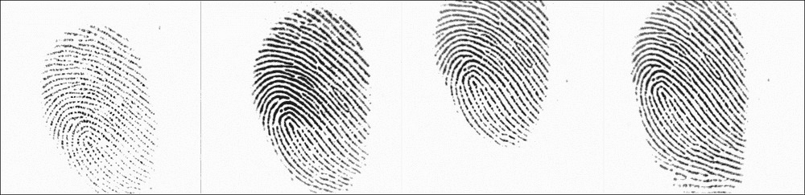

不同扫描仪的单个指纹示例

此数据集可以从博洛尼亚大学发布的 FVC2002 竞赛网站下载。网站([`bias.csr.unibo.it/fvc2002/databases.asp`](http://bias.csr.unibo.it/fvc2002/databases.asp))包含四个指纹数据库，可供公众以下格式下载：

+   四个指纹捕获设备，DB1 - DB4

+   对于每个设备，有 10 个人的指纹可用

+   对于每个人，记录了八个不同的指纹位置

我们将使用这个公开可用的数据集来构建我们的系统。我们将专注于第一个捕获设备，使用每个个体的最多四个指纹来训练系统并制作指纹的平均描述符。然后，我们将使用其他四个指纹来评估我们的系统，并确保人员仍然可以通过我们的系统被识别。

如果您想研究捕获二值图像的系统与捕获灰度图像的系统之间的差异，可以将相同的方法应用于从其他设备获取的数据。然而，我们将提供进行二值化的技术。

## 在 OpenCV 3 中实现该方法

### 注意

处理从指纹扫描仪获取的指纹的完整指纹软件可以在以下位置找到：

[`github.com/OpenCVBlueprints/OpenCVBlueprints/tree/master/chapter_6/source_code/fingerprint/fingerprint_process/`](https://github.com/OpenCVBlueprints/OpenCVBlueprints/tree/master/chapter_6/source_code/fingerprint/fingerprint_process/)

在本小节中，我们将描述如何在 OpenCV 界面中实现这种方法。我们首先从指纹系统获取图像并应用二值化。这使我们能够从图像中去除任何噪声，同时帮助我们更好地区分皮肤和手指皱褶表面的对比度：

```py
// Start by reading in an image
Mat input = imread("/data/fingerprints/image1.png", IMREAD_GRAYSCALE);
// Binarize the image, through local thresholding
Mat input_binary;
threshold(input, input_binary, 0, 255, THRESH_BINARY | THRESH_OTSU);
```

Otsu 阈值化将自动选择最佳通用阈值，以在前景和背景信息之间获得良好的对比度。这是因为图像包含双峰分布（这意味着我们有一个具有两个峰值直方图的图像）的像素值。对于该图像，我们可以取那些峰值中间的近似值作为阈值值（对于非双峰分布的图像，二值化将不准确）。Otsu 允许我们避免使用固定的阈值值，使系统更兼容捕获设备。然而，我们也承认，如果您只有一个捕获设备，那么尝试使用固定的阈值值可能对特定设置产生更好的图像。阈值化的结果如下所示。

为了使从下一个骨骼化步骤的细化尽可能有效，我们需要反转二值图像。

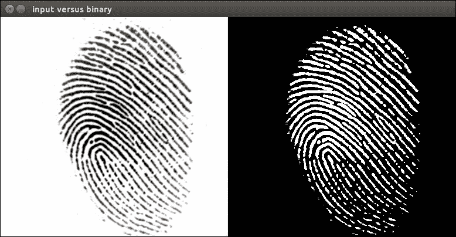

灰度化和二值化指纹图像的比较

一旦我们有一个二值图像，我们就准备好计算我们的特征点和特征点描述符。然而，为了进一步提高过程，最好是进行图像骨架化。这将创建更多独特且更强的兴趣点。以下代码片段可以在二值图像上应用骨架化。骨架化基于 Zhang-Suen 线细化方法。

### 注意

特别感谢 OpenCV Q&A 论坛的`@bsdNoobz`，他提供了这种迭代方法。

```py
#include <opencv2/imgproc.hpp>
#include <opencv2/highgui.hpp>

using namespace std;
using namespace cv;

// Perform a single thinning iteration, which is repeated until the skeletization is finalized
void thinningIteration(Mat& im, int iter)
{
    Mat marker = Mat::zeros(im.size(), CV_8UC1);
    for (int i = 1; i < im.rows-1; i++)
    {
        for (int j = 1; j < im.cols-1; j++)
        {
            uchar p2 = im.at<uchar>(i-1, j);
            uchar p3 = im.at<uchar>(i-1, j+1);
            uchar p4 = im.at<uchar>(i, j+1);
            uchar p5 = im.at<uchar>(i+1, j+1);
            uchar p6 = im.at<uchar>(i+1, j);
            uchar p7 = im.at<uchar>(i+1, j-1);
            uchar p8 = im.at<uchar>(i, j-1);
            uchar p9 = im.at<uchar>(i-1, j-1);

            int A  = (p2 == 0 && p3 == 1) + (p3 == 0 && p4 == 1) + 
                     (p4 == 0 && p5 == 1) + (p5 == 0 && p6 == 1) + 
                     (p6 == 0 && p7 == 1) + (p7 == 0 && p8 == 1) +
                     (p8 == 0 && p9 == 1) + (p9 == 0 && p2 == 1);
            int B  = p2 + p3 + p4 + p5 + p6 + p7 + p8 + p9;
            int m1 = iter == 0 ? (p2 * p4 * p6) : (p2 * p4 * p8);
            int m2 = iter == 0 ? (p4 * p6 * p8) : (p2 * p6 * p8);

            if (A == 1 && (B >= 2 && B <= 6) && m1 == 0 && m2 == 0)
                marker.at<uchar>(i,j) = 1;
        }
    }

    im &= ~marker;
}

// Function for thinning any given binary image within the range of 0-255\. If not you should first make sure that your image has this range preset and configured!
void thinning(Mat& im)
{
    // Enforce the range to be in between 0 - 255  
    im /= 255;

    Mat prev = Mat::zeros(im.size(), CV_8UC1);
    Mat diff;

    do {
        thinningIteration(im, 0);
        thinningIteration(im, 1);
        absdiff(im, prev, diff);
        im.copyTo(prev);
    } 
    while (countNonZero(diff) > 0);

    im *= 255;
}
```

上述代码可以简单地应用于我们之前的步骤，通过在之前生成的二值图像上调用细化函数。此代码如下：

```py
// Apply thinning algorithm
Mat input_thinned = input_binary.clone();
thinning(input_thinned);
```

这将导致以下输出：

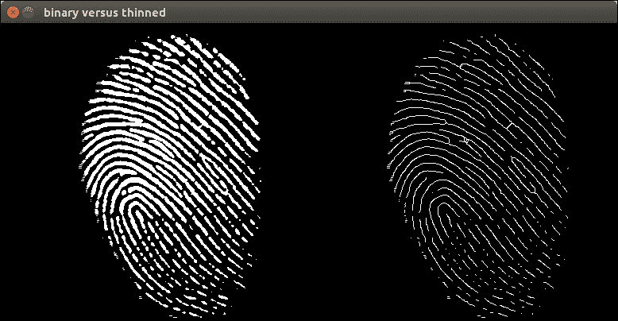

使用骨架化技术比较二值化和细化指纹图像

当我们得到这个骨架图像时，下一步是寻找指纹脊上的交叉点，称为特征点。我们可以使用一个寻找局部对比度大变化的特征点检测器来完成这项工作，就像 Harris 角检测器。由于 Harris 角检测器能够检测到强角和边缘，它非常适合指纹问题，其中最重要的特征点是短边缘和分叉——边缘汇合的位置。

### 注意

关于特征点和 Harris 角检测的更多信息可以在以下出版物中找到：

Ross Arun A.，Jidnya Shah，和 Anil K. Jain，*从特征点重建指纹*，国防和安全。国际光学和光子学学会，2005。

Harris Chris 和 Mike Stephens，*一种结合角和边缘检测器*，Alvey 视觉会议，第 15 卷，1988。

在 OpenCV 中对骨架化和二值化图像调用 Harris 角操作相当直接。Harris 角以与图像中其角响应值相对应的位置存储。如果我们想检测具有特定角响应的点，那么我们只需简单地阈值化图像。

```py
Mat harris_corners, harris_normalised;
harris_corners = Mat::zeros(input_thinned.size(), CV_32FC1);
cornerHarris(input_thinned, harris_corners, 2, 3, 0.04, BORDER_DEFAULT);
normalize(harris_corners, harris_normalised, 0, 255, NORM_MINMAX, CV_32FC1, Mat());
```

我们现在有一个地图，其中包含所有可用的角响应，已重新缩放到[0 255]的范围，并以浮点值存储。我们现在可以手动定义一个阈值，这将为我们应用程序生成大量关键点。调整此参数可能会在其他情况下提高性能。这可以通过以下代码片段来完成：

```py
float threshold = 125.0;
vector<KeyPoint> keypoints;
Mat rescaled;
convertScaleAbs(harris_normalised, rescaled);
Mat harris_c(rescaled.rows, rescaled.cols, CV_8UC3);
Mat in[] = { rescaled, rescaled, rescaled };
int from_to[] = { 0,0, 1,1, 2,2 };
mixChannels( in, 3, &harris_c, 1, from_to, 3 );
for(int x=0; x<harris_normalised.cols; x++){
   for(int y=0; y<harris_normalised.rows; y++){
          if ( (int)harris_normalised.at<float>(y, x) > threshold ){
             // Draw or store the keypoint location here, just like
             //you decide. In our case we will store the location of 
             // the keypoint
             circle(harris_c, Point(x, y), 5, Scalar(0,255,0), 1);
             circle(harris_c, Point(x, y), 1, Scalar(0,0,255), 1);
             keypoints.push_back( KeyPoint (x, y, 1) );
          }
       }
    }
```

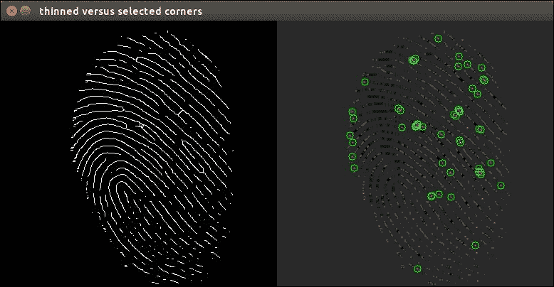

细化指纹与 Harris 角响应以及所选 Harris 角的比较

现在我们已经有一个关键点列表，我们需要为每个关键点周围的区域创建某种形式的正式描述符，以便能够从其他关键点中唯一地识别它。

### 注意

第三章，*使用机器学习识别面部表情*，更详细地讨论了现有的广泛关键点。在本章中，我们将主要关注过程。请随意调整界面以适应其他关键点检测器和描述符，无论结果好坏。

由于我们的应用中拇指的方向可能不同（因为它不在固定位置），我们希望有一个关键点描述符能够很好地处理这些细微差异。这种描述符中最常见的一个是 SIFT 描述符，代表**尺度不变特征变换**。然而，SIFT 不在 BSD 许可之下，这在使用商业软件时可能会引起问题。在 OpenCV 中，一个好的替代品是 ORB 描述符。你可以按照以下方式实现它：

```py
Ptr<Feature2D> orb_descriptor = ORB::create();
Mat descriptors;
orb_descriptor->compute(input_thinned, keypoints, descriptors);
```

这使我们能够仅使用 ORB 方法计算描述符，因为我们已经使用 Harris 角方法检索了关键点的位置。

到目前为止，我们可以为任何给定指纹的每个检测到的关键点检索一个描述符。描述符矩阵包含每个关键点的一行，包含其表示。

让我们从只有一个参考图像的指纹的例子开始。然后我们有一个包含数据库中训练人员的特征描述符的数据库。我们有一个单一的新条目，由在注册时找到的关键点的多个描述符组成。现在我们必须将这些描述符与数据库中存储的描述符进行匹配，以查看哪一个匹配得最好。

实现这一点的最简单方法是通过使用不同关键点描述符之间的汉明距离标准进行暴力匹配。

```py
// Imagine we have a vector of single entry descriptors as a database
// We will still need to fill those once we compare everything, by using the code snippets above
vector<Mat> database_descriptors;
Mat current_descriptors;
// Create the matcher interface
Ptr<DescriptorMatcher> matcher = DescriptorMatcher::create("BruteForce-Hamming");
// Now loop over the database and start the matching
vector< vector< DMatch > > all_matches;
for(int entry=0; i<database_descriptors.size();entry++){
   vector< DMatch > matches;
   matcheràmatch(database_descriptors[entry], current_descriptors, matches);
   all_matches.push_back(matches);
}
```

现在我们已经将所有匹配存储为 DMatch 对象。这意味着，对于每一对匹配，我们将有原始关键点、匹配关键点和两个匹配之间的浮点分数，表示匹配点之间的距离。

这看起来相当直接。我们查看匹配过程返回的匹配数量，并按它们的欧几里得距离进行加权，以增加一些确定性。然后我们寻找产生最大分数的匹配过程。这将是我们最佳匹配，也是我们想要从数据库中返回的所选匹配。

如果你想避免冒名顶替者被分配到最佳匹配分数，你可以在评分之上添加一个手动阈值，以避免匹配并忽略那些不够好的匹配。然而，如果你将分数提高太多，那些变化很小的人可能会被系统拒绝，例如，如果有人割伤了手指，从而剧烈改变了他们的模式。

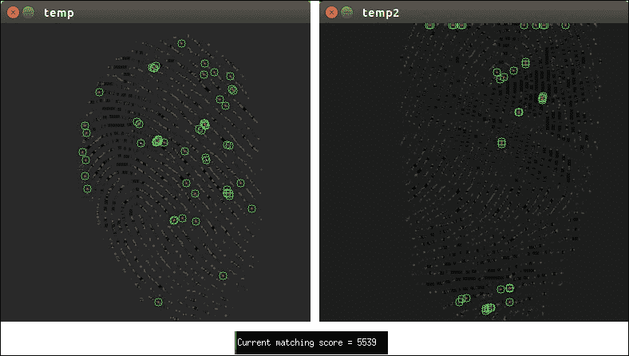

指纹匹配过程的可视化

# 虹膜识别，是如何进行的？

我们将要使用的最后一种生物识别技术是虹膜扫描的输出。考虑到我们的设置，可能有几种方法来抓取虹膜数据：

+   我们可以使用面部检测来分离面部，并使用高分辨率摄像头应用眼部检测器。我们可以使用得到的区域来进行虹膜分割和分类。

+   我们可以使用特定的眼部摄像头，它抓取用于分类的眼部图像。这可以通过 RGB 或近红外（NIR）来实现。

由于第一种方法容易遇到很多问题，如生成的眼部图像分辨率低，更常见的方法是使用单独的眼部摄像头来抓取眼部图像。这是我们本章将使用的方法。以下是 RGB（可见颜色）和 NIR（近红外）光谱中捕获的眼部图像的示例：

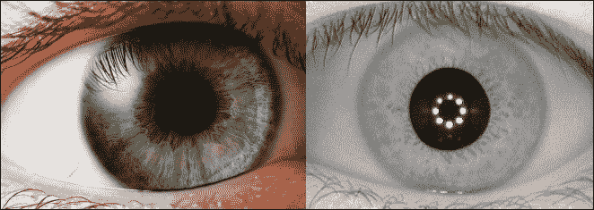

一个基于 RGB 和 NIR 的虹膜图像示例

使用近红外图像可以帮助我们以多种方式：

+   首先，由于在抓取虹膜图像时，许多条件如外部光源等都会影响颜色信息，因此我们省略了颜色信息。

+   其次，瞳孔中心变得更加清晰且完全为黑色，这使得我们可以使用依赖于这一点的技术来分割瞳孔中心。

+   第三，由于近红外光谱，即使在不同的光照条件下，可用的结构也能得到保持。

+   最后，虹膜区域的边缘更加清晰，因此更容易分离。

我们将使用 CASIA 眼部数据集的数据进行虹膜识别，该数据集可在[`biometrics.idealtest.org/`](http://biometrics.idealtest.org/)找到。该数据集可供研究和非商业用途免费使用，并且可以通过网站申请访问。我们软件仓库中有一小部分数据，其中包含一个人的左右眼，由于没有两个虹膜是相同的，我们可以将它们视为两个人。每个眼睛有 10 个样本，我们将使用其中的 8 个进行训练，2 个进行测试。

我们将要实现的虹膜识别方法基于约翰·道格曼（John Daugman）提出的技术。这项技术被广泛接受并在商业系统中使用，从而证明了其质量。

### 注意

约翰·道格曼（John Daugman）撰写的原始论文可以在以下网址找到：[`www.cl.cam.ac.uk/~jgd1000/irisrecog.pdf`](http://www.cl.cam.ac.uk/~jgd1000/irisrecog.pdf)

## 在 OpenCV 3 中实现此方法

获取虹膜信息的第一步是分割出包含虹膜和瞳孔的实际眼部区域。我们在数据上应用一系列操作以实现所需的结果。这个过程是必要的，以保留所需数据并移除所有多余的眼部数据。

我们首先尝试获取瞳孔。瞳孔是近红外图像中最暗的区域，这些信息可以为我们带来优势。以下步骤将引导我们找到眼图中的瞳孔区域：

+   首先，我们需要对最暗的区域进行分割。我们可以使用`inRange()`图像，因为瞳孔所在的位置值对于捕获系统是特定的。然而，由于它们都使用近红外(NIR)，最终结果对于每个独立的系统将是相同的。

+   然后，我们应用轮廓检测以获取瞳孔的外边缘。我们确保只从外部轮廓中获取最大的轮廓，这样我们只保留一个区域。

### 注意

如果你想提高性能，你也可以先寻找红外 LED 的亮点，将它们从区域中移除，然后再运行轮廓检测。当红外 LED 亮点靠近瞳孔边缘时，这将提高鲁棒性。

单个虹膜的完整过程代码可以在以下位置找到：[`github.com/OpenCVBlueprints/OpenCVBlueprints/tree/master/chapter_6/source_code/iris/iris_processing/`](https://github.com/OpenCVBlueprints/OpenCVBlueprints/tree/master/chapter_6/source_code/iris/iris_processing/)

通过以下代码片段可以实现这种行为：

```py
// Read in image and perform contour detection
Mat original = imread("path/to/eye/image.png", IMREAD_GRAYSCALE);
Mat mask_pupil;
inRange(original, Scalar(30,30,30), Scalar(80,80,80), mask_pupil);
vector< vector<Point> > contours;
findContours(mask_pupil.clone(), contours, RETR_EXTERNAL, CHAIN_APPROX_NONE);
// Calculate all the corresponding areas which are larger than
vector< vector<Point> > filtered;
for(int i=0; i<contours.size(); i++){
   double area = contourArea(contours[i]);
   // Remove noisy regions
   if(area > 50.0){
      filtered.push_back(contours[i]);
   }
}
// Now make a last check, if there are still multiple contours left, take the one that has a center closest to the image center
vector<Point> final_contour=filtered[0];
if(filtered.size() > 1){
   double distance = 5000;
   int index = -1;
   Point2f orig_center(original.cols/2, original.rows/2); 
   for(int i=0; i<filtered.size(); i++){
      Moments temp = moments(filtered[i]);
      Point2f current_center((temp.m10/temp.m00), (temp.m01/temp.m00));
      // Find the Euclidean distance between both positions
      double dist = norm(Mat(orig_center), Mat(current_center));
      if(dist < distance){
         distance = dist;
         index = i;
      }   
   }
   final_contour = filtered[index];
}
// Now finally make the black contoured image;
vector< vector<Point> > draw;
draw.push_back(final_contour);
Mat blacked_pupil = original.clone();
drawContours(blacked_pupil, draw, -1, Scalar(0,0,0), FILLED);
```

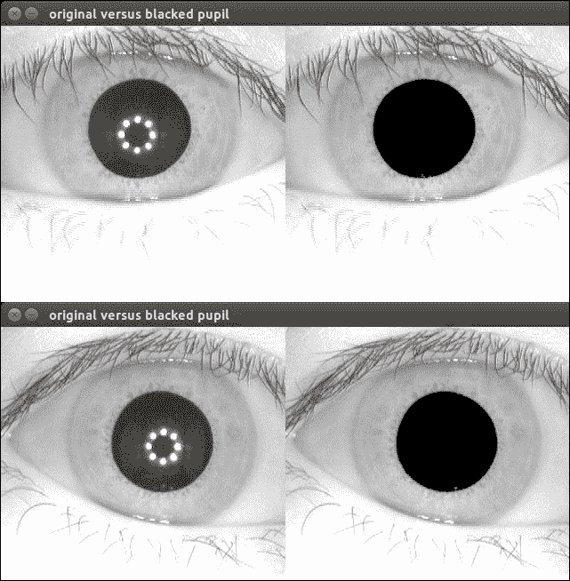

```py
NoteSometimes, the Hough circle detection will not yield a single circle. This is not the case with the proposed database, but if you encounter this, then looking at other techniques like the Laplacian of Gaussians should help you to find and reconstruct the iris region.
```

```py
// Make sure that the input image is gray, we took care of that while reading in the original image and making sure that the blacked pupil image is a clone of that.
// Apply a canny edge filter to look for borders
// Then clean it a bit by adding a smoothing filter, reducing noise
Mat preprocessed;
Canny(blacked_pupil, blacked_pupil, 5, 70);
GaussianBlur(blacked_pupil, preprocessed, Size(7,7));
// Now run a set of HoughCircle detections with different parameters
// We increase the second accumulator value until a single circle is left and take that one for granted
int i = 80;
vector<Point3f> found_circle;
while (i < 151){
   vector< vector<Point3f> > storage;
   // If you use other data than the database provided, tweaking of these parameters will be necessary
   HoughCircles(preprocessed, storage, HOUGH_GRADIENT, 2, 100.0, 30, i, 100, 140);
   if(storage.size() == 1){
      found_circle = storage[0];
      break;
   }
   i++;
}
// Now draw the outer circle of the iris
int radius = found_circle[2];
Mat mask = Mat::zeros(blacked_pupil.rows, blacked_pupil.cols, CV_8UC1);
// The centroid value here must be the same as the one of the inner pupil so we reuse it back here
Moments temp = Moments(final_contour);
Point2f centroid((temp.m10/temp.m00), (temp.m01/temp.m00));
Circle(mask, centroid, radius, Scalar(255,255,255), FILLED);
bitwise_not(mask, mask);
Mat final_result;
subtract(blacked_pupil, blacked_pupil.clone(), final_result, mask);
// Visualize the final result
imshow("final blacked iris region", final_result);
```

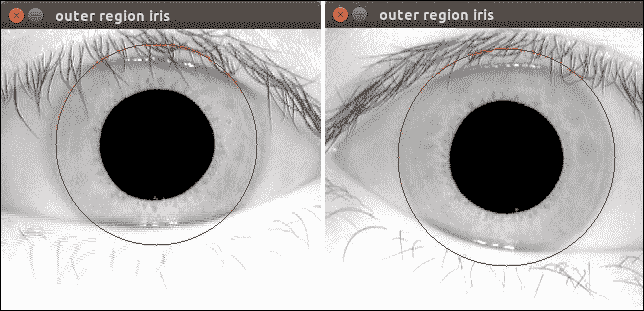

左眼和右眼的 Hough 圆检测结果的示例，它给出了虹膜区域的外边缘

一旦我们成功找到外轮廓，从原始输入中掩码虹膜区域就非常直接了，如图所示：

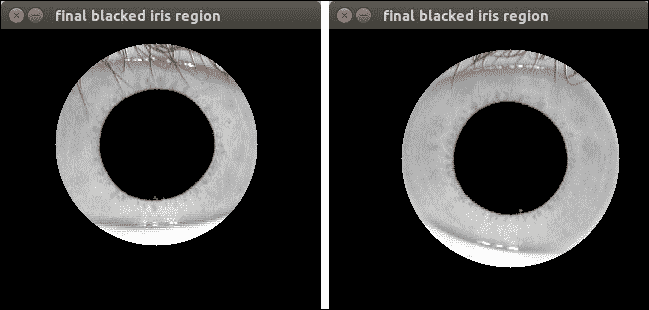

下面是一个掩码虹膜图像的示例

现在我们有了感兴趣的区域，即只有虹膜区域，如图所示。我们承认该区域内可能仍有一些部分胡须，但现阶段我们将简单地忽略它们。现在，我们希望将这个虹膜图像编码成一个特征向量以进行比较。为了达到这个水平，我们还需要进行两个步骤：

+   将虹膜图案从极坐标系展开到笛卡尔坐标系以进行进一步处理

+   将虹膜图像进行编码并与已知表示的数据库进行匹配

我们首先提供一个代码片段，该代码片段将展开从检索到的最终结果中所需的虹膜区域：

```py
// Lets first crop the final iris region from the image
int x = int(centroid[0] - radius);
int y = int(centroid[1] - radius);
int w = int(radius * 2);
int h = w;
Mat cropped_region = final_result( Rect(x,y,w,h) ).clone();
// Now perform the unwrapping
// This is done by the logpolar function who does Logpolar to Cartesian coordinates, so that it can get unwrapped properly
Mat unwrapped;
int center = (float(cropped_region.cols/2.0), float(cropped_region.cols /2.0));
LogPolar(image, unwrapped, c, 60.0, INTER_LINEAR +  WARP_FILL_OUTLIERS);
imshow("unwrapped image", unwrapped); waitKey(0);
```

这将导致以下转换，它给出了如图所示的虹膜区域的径向展开：

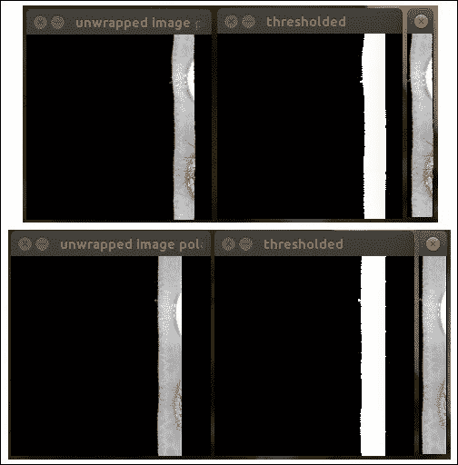

左眼和右眼的径向展开虹膜图像示例

这种径向展开是对每个眼睛的八个训练图像以及我们也有每个眼睛的两个测试图像进行的。Daugman 方法通过相位象限调制来编码虹膜模式。然而，这尚未在 OpenCV 中实现，并且对于本章来说过于复杂。因此，我们决定寻找一个可用的 OpenCV 实现，可以用来匹配虹膜。一个好的方法是用局部二值模式直方图比较，因为我们正在寻找能够识别局部纹理的东西，这也在人脸识别中得到了应用。

### 注意

可以在以下位置找到用于展开完整套虹膜图像的软件：

[`github.com/OpenCVBlueprints/OpenCVBlueprints/tree/master/chapter_6/source_code/iris/iris_processing_batch/`](https://github.com/OpenCVBlueprints/OpenCVBlueprints/tree/master/chapter_6/source_code/iris/iris_processing_batch/)

创建匹配界面的软件可以在以下位置找到：

[`github.com/OpenCVBlueprints/OpenCVBlueprints/tree/master/chapter_6/source_code/iris/iris_recognition/`](https://github.com/OpenCVBlueprints/OpenCVBlueprints/tree/master/chapter_6/source_code/iris/iris_recognition/)

最后，在 OpenCV 3 中编码的工作方式如下：

```py
// Try using the facerecognizer interface for these irises
// Choice of using LBPH --> local and good for finding texture
Ptr<LBPHFaceRecognizer> iris_model = createLBPHFaceRecognizer();
// Train the facerecognizer
iris_model->train(train_iris, train_labels);
// Loop over test images and match their labels
int total_correct = 0, total_wrong = 0;
for(int i=0; i<test_iris.size(); i ++){
       int predict = iris_model->predict(test_iris[i]);
       if(predict == test_labels[i]){
            total_correct++;
       }else{
            total_wrong++;
       }
}
```

我们再次计算测试结果，得到下图中所示的结果：

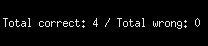

编码的虹膜图像及其相应的虹膜代码可视化。

# 结合技术创建高效的人员注册系统

前几节分别讨论了特定的生物识别属性。现在，让我们结合所有这些信息来创建一个高效的识别系统。我们将实现的方法遵循下图中描述的结构：

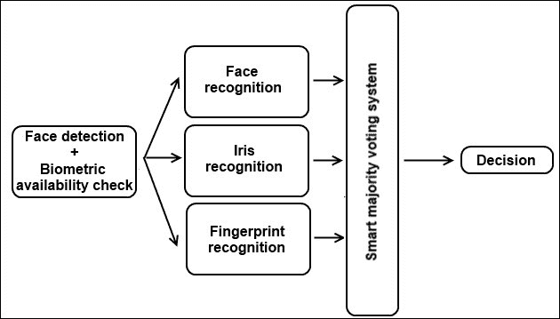

人员认证流程

如上图所示，第一步是使用相机界面检查相机前是否真的有一个人。这是通过对输入图像执行人脸检测来完成的。我们还测试了其他生物识别系统是否处于活动状态。这留下了两个需要执行的检查：

+   检查虹膜扫描仪是否在使用中。这当然取决于所使用的系统。如果它依赖于从人脸检测中检索到的眼睛，则此检查应被忽略。如果使用实际的眼球扫描仪检索眼睛，那么至少应该检测到一个眼睛以给出一个积极的信号。

+   检查指纹扫描仪是否处于活动状态。我们是否真的有可用于获取指纹图像的手指？这是通过对空场景应用背景减法来检查的。如果手指到位，那么应该对背景前景减法有响应。

当然，我们知道其中一些系统使用基于压力的检测来找到手或手指。在这种情况下，你不必自己执行此检查，而是让系统决定是否继续。

一旦我们有了所有系统，我们就可以开始之前章节中描述的个别识别系统。它们将输出已知人员的身份，这些人员是从为这个目的构建的公共数据库中输出的。然后，将这些结果提交给智能多数投票。这个系统会检查几个方面：

+   它通过从数据库返回匹配结果来检查生物识别系统是否实际成功。如果没有，则不允许人员进入，系统会要求重新确认失败的生物识别信息。

+   如果系统需要连续三次以上测量生物识别信息，系统会卡住，直到系统所有者解锁它才会工作。这是为了避免当前界面中利用系统并试图进入的漏洞。

+   如果生物识别检查成功，则对结果应用智能多数投票。这意味着如果两个生物识别识别到 A 个人，但一个生物识别识别到 B 个人，则输出结果仍然是 A 个人。如果那个人被标记为所有者，则系统将允许访问。

+   根据提供的各个子主题的独立软件，将它们组合成一个单一界面应该相当直接。

+   如果系统仍然失败（这是一个案例研究，不是一个 100%万无一失的系统），可以采取一些措施来实现预期结果。

    +   你应该尝试提高每个单独生物识别的检测和匹配质量。这可以通过提供更好的训练数据、尝试不同的特征提取方法或不同的特征比较方法来实现，如本章引言中所述。组合的种类无穷无尽，所以大胆尝试吧。

    +   你应该尝试为每个生物识别输出分配一个置信度分数。由于我们有多个系统投票确认一个人的身份，我们可以考虑它们在单个分类上的置信度。例如，当运行数据库时，匹配到最佳匹配的距离可以转换为[0 100]的刻度范围，以给出置信度百分比。然后我们可以将每个生物识别的投票乘以其权重，并进行智能加权多数投票。

# 摘要

在本章中，你了解到，通过使用尝试认证的人的多个生物识别属性，认证系统可以不仅仅是简单的面部识别界面。我们展示了如何使用 OpenCV 库执行虹膜和指纹识别，以创建一个多生物识别认证系统。可以添加更多的生物识别到系统中，因为可能性是无限的。

本章的重点是激发人们对生物识别技术力量和 OpenCV 库无限可能性的兴趣。如果你因此受到启发，不妨进一步实验，并与社区分享你的想法。

### 注意

我要感谢 OpenCV 问答讨论论坛的用户们，在我遇到难题时，他们帮助我突破了限制。我特别想感谢以下用户提供的指导：Berak、Guanta、Theodore 和 GilLevi。
