# 第七章. 陀螺仪视频稳定化

视频稳定化是计算机视觉中的一个经典问题。其理念很简单——你有一个摇曳的视频流，你试图找到最佳方法来消除相机的运动，以在图像之间产生平滑的运动。结果视频更容易观看，并且具有电影般的视觉效果。

在过去的几年里，已经尝试了多种方法来解决这一问题。传统上，视频是通过使用仅从图像中可用的数据或使用专用硬件来消除相机中的物理运动来进行稳定的。移动设备中的陀螺仪介于这两种方法之间。

在本章中，我们将涵盖以下内容：

+   一个 Android 相机应用程序来记录媒体和陀螺仪轨迹

+   使用视频和陀螺仪轨迹来寻找数学未知数

+   使用物理相机未知数来补偿相机运动

+   识别相机中的滚动快门

### 注意

相机传感器上的滚动快门会产生不希望的效果。我们将在后面的部分详细讨论这个问题。同时，请参阅第一章，*最大限度地发挥您的相机系统的作用*，以获取详细讨论。

在我们开始之前，让我们看看过去用来解决这个问题的一些技术。

# 使用图像进行稳定化

仅使用图像进行视频稳定化似乎是第一个合乎逻辑的步骤。确实，最初关于稳定由相机捕获的视频的研究是基于使用来自相机传感器的可用信息来理解它们是如何逐帧移动的。

理念是在图像序列中找到关键点，以了解它们是如何逐帧移动的。关键点是图像上满足以下标准的像素位置：

+   关键点应该容易识别，并且彼此之间可以区分开来。物体的角点是好的关键点，而空白墙上的一个点则不是。

+   应该能够跟踪多个图像中的关键点以计算运动。你应该能够确切地知道关键点从一个帧移动到另一个帧的确切位置。

+   为了性能，识别这些关键点应该是快速且内存高效的。这通常是低内存和低功耗设备上的瓶颈。

以这些标准进行的研究导致了几个独特的方法，包括一些著名的算法，如 SIFT、SURF、ORB、FREAK 等。这些技术通常效果很好。

OpenCV 附带了一些常见的特征点检测器。这些包括 ORB、FAST、BRISK、SURF 等。有关如何使用这些检测器的更多信息，请参阅 2D 特征框架文档页面：[`docs.opencv.org/3.0-beta/modules/features2d/doc/feature_detection_and_description.html`](http://docs.opencv.org/3.0-beta/modules/features2d/doc/feature_detection_and_description.html)。

然而，关键点检测器也有其自身的缺点。首先，稳定化的结果高度依赖于图像的质量。例如，低分辨率图像可能不会产生最佳的特征集。对焦不清晰和模糊的图像也是另一个问题。这限制了可以稳定化序列的类型。一个清晰的蓝天和黄色沙子的场景可能不包含足够多的特征。

重复图案的表面会混淆算法，因为相同的特征在不同的位置反复出现。

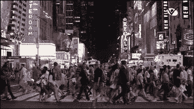

### 注意

上面的图像来自：[`d2v9y0dukr6mq2.cloudfront.net/video/thumbnail/kG-5Wkc/crowd-of-people-walking-crossing-street-at-night-in-times-square-slow-motion-30p_ekqzvese__S0000.jpg`](https://d2v9y0dukr6mq2.cloudfront.net/video/thumbnail/kG-5Wkc/crowd-of-people-walking-crossing-street-at-night-in-times-square-slow-motion-30p_ekqzvese__S0000.jpg)

其次，如果图像中有大量的运动（如背景中行走的人群或路上行驶的卡车），由于这种运动，稳定化将会偏斜。关键点是跟踪移动的物体，而不是相机的运动本身。这限制了可以使用这种方法成功稳定化的视频类型。有绕过这种限制的方法——然而，这使算法变得更加复杂。

# 使用硬件进行稳定化

某些行业，如电影行业和军事行业，期望高质量的图像稳定。在这些复杂的环境中仅使用图像是无法工作的。这导致行业创建了基于硬件的图像稳定装置。例如，带有相机的四旋翼无人机即使在（可能）恶劣的照明条件下、风中等情况下，也需要有高质量的视频输出。

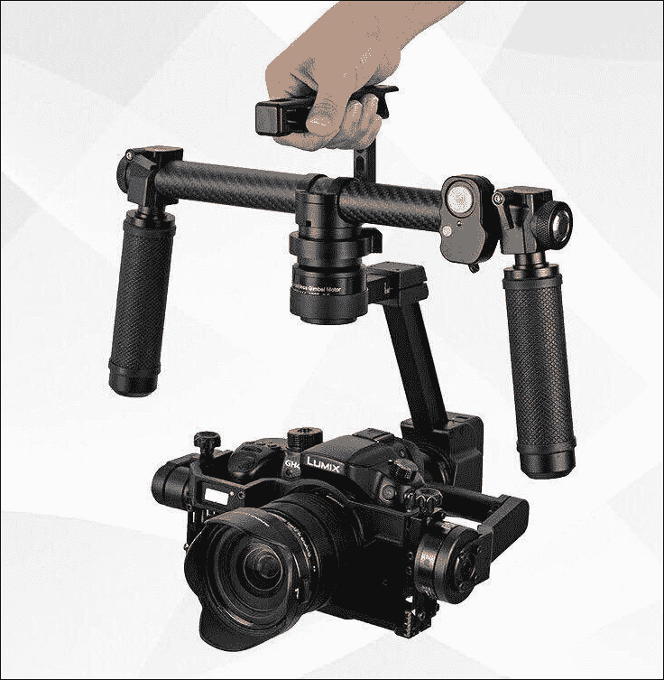

### 注意

上面的图像来自 [`g01.a.alicdn.com/kf/HTB1.ogPIpXXXXaXXVXXq6xXFXXXw/GH4-A7S-SUMMER-DYS-3-axis-3-Axis-Gimbal-dslr-camera-Stabilizer-gyro-brushless-gimbal-steadicam.jpg`](http://g01.a.alicdn.com/kf/HTB1.ogPIpXXXXaXXVXXq6xXFXXXw/GH4-A7S-SUMMER-DYS-3-axis-3-Axis-Gimbal-dslr-camera-Stabilizer-gyro-brushless-gimbal-steadicam.jpg)

这些设备使用陀螺仪来物理移动和旋转相机，从而使图像序列保持稳定。由于实际上是在补偿相机的运动，所以结果看起来非常出色。

这些设备往往价格较高，因此对于普通消费者来说可能负担不起。它们也往往相当庞大。普通人不会想在度假时携带两公斤重的装置。

# 硬件与软件的混合体

本章介绍了原始纯软件方法和硬件设备之间的混合解决方案。这种解决方案只有在智能手机出现之后才成为可能。人们现在可以在一个小型设备上获得高质量的相机和陀螺仪。

这种方法背后的思想是使用陀螺仪来捕捉运动，使用相机传感器来捕捉光线。然后，将这两个流融合在一起，以便图像始终稳定。

随着传感器密度的增加，我们朝着 4K 相机发展，选择图像的（稳定）子区域变得越来越可行，因为我们可以在不牺牲质量的情况下丢弃更多的图像。

# 数学

在我们深入代码之前，让我们概述一下算法。有四个关键组件。

+   第一是针孔相机模型。我们试图使用这个矩阵将现实世界的位置近似到像素。

+   第二是相机运动估计。我们需要使用陀螺仪的数据来确定手机在任何给定时刻的朝向。

+   第三是滚动快门计算。我们需要指定滚动快门的方向并估计滚动快门的持续时间。

+   第四是图像扭曲表达式。使用之前计算的所有信息，我们需要生成一个新的图像，使其变得稳定。

## 相机模型

我们使用标准的针孔相机模型。这个模型在几个算法中使用，并且是实际相机的良好近似。

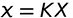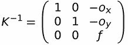

有三个未知数。*o* 变量表示图像平面上相机轴的原点（这些可以假设为 0）。矩阵中的两个 1 表示像素的宽高比（我们假设像素是正方形的）。*f* 表示镜头的焦距。我们假设水平和垂直方向上的焦距相同。

使用这个模型，我们可以看到：

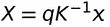

这里，X 是现实世界中的点。还有一个未知的比例因子，*q* 存在。

### 注意

如果不知道物体的物理尺寸，对于单目视觉来说，估计这个未知数是不可能的。

*K* 是内在矩阵，*x* 是图像上的点。

## 相机运动

我们可以假设世界原点与相机原点相同。然后，相机的运动可以用相机的朝向来描述。因此，在任意给定的时间 *t*：

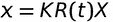

可以通过积分相机的角速度（从陀螺仪获得）来计算旋转矩阵 *R*。

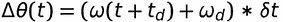

这里，*ω[d]* 是陀螺仪漂移，*t[d]* 是陀螺仪和帧时间戳之间的延迟。这些也是未知数；我们需要一种机制来计算它们。

## 滚动快门补偿

当你点击一张照片时，常见的假设是整个图像一次性被捕获。对于使用 CCD 传感器捕获的图像来说，这确实是正确的（这些传感器曾经很普遍）。随着 CMOS 图像传感器的商业化，这种情况已经不再适用。一些 CMOS 传感器也支持全局快门，但在这个章节中，我们将假设传感器具有滚动快门。

图像是一行一行地捕获的——通常首先捕获第一行，然后是第二行，依此类推。图像的连续行之间存在非常小的延迟。

这会导致奇怪的效果。当我们纠正相机抖动时（例如，如果相机有大量运动），这种现象非常明显。

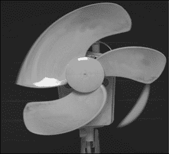

扇叶大小相同；然而，由于快速运动，滚动快门导致传感器记录的图像中出现了伪影。

要模拟滚动快门，我们需要确定特定行是在何时被捕获的。这可以通过以下方式完成：

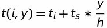

在这里，*t[i]* 是第 i 个帧被捕获的时间，*h* 是图像帧的高度，而 *t[s]* 是滚动快门的持续时间，即从顶部到底部扫描所需的时间。假设每一行花费相同的时间，第 y 行需要额外的 *t[s] * y / h* 时间来扫描。

### 注意

这假设滚动快门是从顶部到底部发生的。从底部到顶部的滚动快门可以通过将 t[s] 的值设置为负数来建模。同样，从左到右的滚动快门可以通过将 *y / h* 替换为 *x / w* 来建模，其中 *w* 是帧的宽度。

## 图像扭曲

到目前为止，我们已经有了估计的相机运动和纠正滚动快门的模型。我们将两者结合起来，并在多个帧之间识别关系：

+   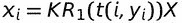（对于旋转配置为 1 的帧 i）

+   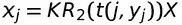（对于旋转配置为 2 的帧 j）

我们可以将这两个方程组合起来：

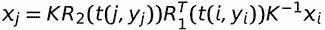

从这里，我们可以计算一个扭曲矩阵：

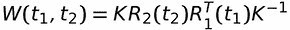

现在，点 x[i] 和 x[j] 之间的关系可以更简洁地描述为：

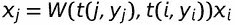

这个扭曲矩阵同时纠正了视频抖动和滚动快门。

现在，我们可以将原始视频映射到一个具有平滑运动和全局快门（无滚动快门伪影）的人工相机。

这个人工相机可以通过对输入相机的运动进行低通滤波并将滚动快门持续时间设置为零来模拟。低通滤波器从相机方向中移除高频噪声。因此，人工相机的运动将看起来更加平滑。

理想情况下，这个矩阵可以针对图像中的每一行进行计算。然而，在实践中，将图像分成五个子部分也能产生良好的结果（性能更佳）。

# 项目概述

让我们花点时间来理解本章中的代码是如何组织的。我们有两个移动部分。一个是移动应用程序，另一个是视频稳定器。

移动应用程序只记录视频并在视频期间存储陀螺仪信号。它将这些数据放入两个文件中：一个`.mp4`文件和一个`.csv`文件。这两个文件是下一步的输入。在移动设备上没有进行计算。在本章中，我们将使用 Android 作为我们的平台。迁移到任何其他平台应该相对容易——我们只进行任何平台都应该支持的基本任务。

视频稳定器在桌面运行。这是为了帮助你更容易地了解稳定化算法中发生的情况。在移动设备上调试、逐步执行代码和查看图像相对较慢，比在桌面迭代要慢。我们有一些非常好的免费科学模块可用（来自 Python 社区。在这个项目中，我们将使用 Scipy、Numpy 和 Matplotlib）。

# 捕获数据

首先，我们需要创建一个移动设备应用程序，它可以同时捕获图像和陀螺仪信号。有趣的是，这些并不容易获得（至少在 Android 上）。

一旦我们有了视频和陀螺仪流，我们将探讨如何使用这些数据。

创建一个标准的 Android 应用程序（我使用 Android Studio）。我们首先创建一个空白应用程序。目标是创建一个简单的应用程序，在触摸屏幕时开始录制视频和陀螺仪信号。再次触摸时，录制停止，并在手机上保存一个视频文件和一个文本文件。这两个文件然后可以被 OpenCV 用来计算最佳稳定化。

### 注意

本节中的代码可在本书的 GitHub 仓库中找到：[`github.com/OpenCVBlueprints/OpenCVBlueprints/tree/master/chapter_7`](https://github.com/OpenCVBlueprints/OpenCVBlueprints/tree/master/chapter_7)

## 录制视频

我们将首先实现一个简单的视频录制工具。在 Android Studio 中创建一个新的空白项目（我命名为 GyroRecorder，并将活动命名为 Recorder）。首先，我们开始添加权限到我们的应用程序。在你的项目中打开`AndroidManifest.xml`并添加以下权限：

```py
<manifest ...>
    <uses-permission android:name="android.permission.CAMERA" />
    <uses-permission android:name="android.permission.WRITE_EXTERNAL_STORAGE" />
    <application ...>
```

这只是让我们的应用程序访问相机并写入存储（陀螺仪文件和视频）。接下来，打开主活动视觉编辑器，在垂直 LinearLayout 中添加一个 TextureView 和一个 Button 元素。

将这些元素的名称分别更改为`texturePreview`和`btnRecord`。

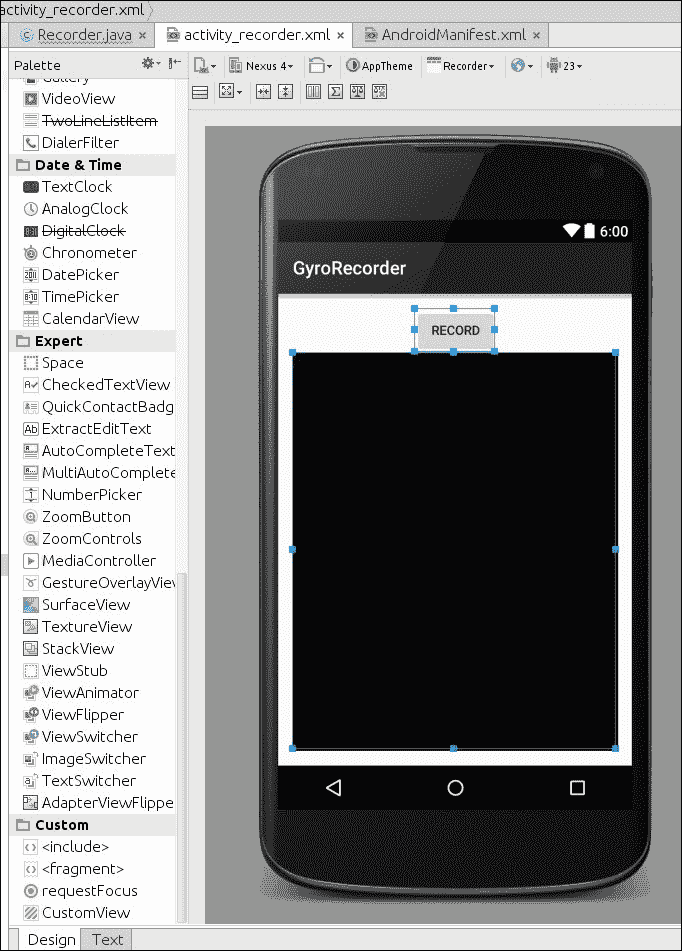

现在我们开始编写一些代码。在主活动类中，添加以下这些行：

```py
public class Recorder extends AppCompatActivity {
    private TextureView mPreview;  // For displaying the live camera preview
    private Camera mCamera;        // Object to contact the camera hardware
    private MediaRecorder mMediaRecorder;    // Store the camera's image stream as a video

    private boolean isRecording = false; // Is video being recoded?
    private Button btnRecord;            // Button that triggers recording
```

这些对象将被用来与 Android 通信，指示何时开始录制。

### 注意

Android Studio 在你键入时自动将导入添加到你的代码中。例如，上面的代码片段会导致以下导入的添加：

```py
import android.hardware.Camera;
import android.media.MediaRecorder;
import android.view.TextureView;
```

接下来，我们需要初始化这些对象。我们在`onCreate`事件中这样做。

```py
    protected void onCreate(Bundle savedInstanceState) {
        super.onCreate(savedInstanceState);
        setContentView(R.layout.activity_recorder);

        mPreview = (TextureView)findViewById(R.id.texturePreview);
        btnRecord = (Button)findViewById(R.id.btnRecord);

        btnRecord.setOnClickListener(new View.OnClickListener() {
            @Override
            public void onClick(View view) {
                onCaptureClick(view);
            }
        });
```

`onCreate`方法已经包含了一些方法（如`super.onCreate`、`setContentView`等；我们将在之后添加几行）。现在，我们需要定义`onCaptureClick`的作用。

```py
    public void onCaptureClick(View view) {
        if (isRecording) {
            // Already recording? Release camera lock for others
            mMediaRecorder.stop();
            releaseMediaRecorder();
            mCamera.lock();

            isRecording = false;
            releaseCamera();
            mGyroFile.close();
            mGyroFile = null;
            btnRecord.setText("Start");
            mStartTime = -1;
        } else {
            // Not recording – launch new "thread" to initiate!
            new MediaPrepareTask().execute(null, null, null);
        }
    }
```

### 注意

如果你想探索`strings.xml`，请参考 PacktPub 书籍《使用 OpenCV 的 Android 应用程序编程》的第二章，*与相机帧一起工作*，部分 0023_split_000.html#LTSU2-940925703e144daa867f510896bffb69。

在这里，我们使用内部的`isRecording`变量来通知媒体录制器和相机开始保存流。我们需要创建一个新的线程，因为初始化媒体录制器和相机通常需要几毫秒。如果在主线程中这样做，这种延迟会在 UI 上变得明显。

一旦我们完成录制（用户点击停止按钮，我们需要释放媒体录制器。这发生在`releaseMediaRecorder`方法中）：

```py
    private void releaseMediaRecorder() {
        if(mMediaRecorder != null) {
            mMediaRecorder.reset();
            mMediaRecorder.release();
            mMediaRecorder = null;
            mCamera.lock();
        }
    }
```

现在，我们来看创建一个新的线程。在你的主活动类中创建这个类。

```py
    class MediaPrepareTask extends AsyncTask<Void, Void, Boolean>{
        @Override
        protected Boolean doInBackground(Void... voids) {
            if(prepareVideoRecorder()) {
                mMediaRecorder.start();
                isRecording = true;
            } else {
                releaseMediaRecorder();
                return false;
            }
            return true;
        }

        @Override
        protected void onPostExecute(Boolean result) {
            if(!result) {
                Recorder.this.finish();
            }

            btnRecord.setText("Stop");
        }
    }
```

这创建了一个`AsyncTask`类型的对象。创建这个类的新对象会自动创建一个新的线程，并在该线程中运行`doInBackground`。我们想在同一个线程中准备媒体录制器。准备媒体录制器涉及到从相机识别支持的视频尺寸，找到合适的高度，设置视频的比特率以及指定目标视频文件。

在你的主活动类中，创建一个名为`prepareVideoRecorder`的新方法：

```py
    @TargetApi(Build.VERSION_CODES.HONEYCOMB)
    private boolean prepareVideoRecorder() {
        mCamera = Camera.open();

        Camera.Parameters parameters = mCamera.getParameters();
        List<Camera.Size> mSupportedPreviewSizes = parameters.getSupportedPreviewSizes();
```

现在我们有了支持的视频尺寸，我们需要找到相机的最佳图像尺寸。这是在这里完成的：

```py
        Camera.Size optimalSize = getOptimalPreviewSize(mSupportedPreviewSizes,mPreview.getWidth(),mPreview.getHeight());
        parameters.setPreviewSize(optimalSize.width,optimalSize.height);
```

拥有最佳尺寸后，我们现在可以设置相机录制器设置：

```py
        CamcorderProfile profile = CamcorderProfile.get(CamcorderProfile.QUALITY_HIGH);
        profile.videoFrameWidth = optimalSize.width;
        profile.videoFrameHeight = optimalSize.height;
```

现在，我们尝试接触相机硬件并设置这些参数：

```py
        mCamera.setParameters(parameters);
        try {
               mCamera.setPreviewTexture(mPreview.getSurfaceTexture());
        } catch(IOException e) {
            Log.e(TAG,"Surface texture is unavailable or unsuitable" + e.getMessage());
            return false;
        }
```

在这里，除了设置相机参数外，我们还指定了一个预览表面。预览表面用于显示相机实时看到的画面。

相机设置完成后，我们现在可以设置媒体录制器：

```py
    mMediaRecorder = new MediaRecorder();
        mCamera.unlock();
        mMediaRecorder.setCamera(mCamera);

        mMediaRecorder.setVideoSource(MediaRecorder.VideoSource.CAMERA);

        mMediaRecorder.setOutputFormat(profile.fileFormat);
        mMediaRecorder.setVideoFrameRate(profile.videoFrameRate);
        mMediaRecorder.setVideoSize(profile.videoFrameWidth,profile.videoFrameHeight);
        mMediaRecorder.setVideoEncodingBitRate(
                                    profile.videoBitRate);

        mMediaRecorder.setVideoEncoder(profile.videoCodec);
        mMediaRecorder.setOutputFile(getOutputMediaFile().toString());
```

这只是设置我们已知的视频流信息——我们只是将收集到的信息传递给媒体录制器。

### 注意

此配置不记录音频。在这个项目中，我们并不关心音频信号。然而，将媒体录制器配置为存储音频应该是相当直接的。

一切准备就绪后，我们尝试启动媒体录制器：

```py
        try {
            mMediaRecorder.prepare();
        } catch (IllegalStateException e) {
            Log.d(TAG, "IllegalStateException preparing MediaRecorder: " + e.getMessage());
            releaseMediaRecorder();
            return false;
        } catch (IOException e) {
            Log.d(TAG, "IOException preparing MediaRecorder: " + e.getMessage());
            releaseMediaRecorder();
            return false;
        }
        return true;
    }
```

这就是`prepareVideoRecorder`方法的结束。我们引用了一些还不存在的变量和函数，所以现在我们将定义其中的一些。

第一个是`getOptimalPreviewSize`。在活动类中定义这个方法：

```py
    private Camera.Size getOptimalPreviewSize(List<Camera.Size> sizes, int w, int h) {
        final double ASPECT_TOLERANCE = 0.1;
        double targetRatio = (double)w / h;

        if(sizes == null) {
            return null;
        }

        Camera.Size optimalSize = null;

        double minDiff = Double.MAX_VALUE;

        int targetHeight = h;

        for (Camera.Size size : sizes) {
            double ratio = (double)size.width / size.height;
            double diff = Math.abs(ratio - targetRatio);

            if(Math.abs(ratio - targetRatio) > ASPECT_TOLERANCE)
                continue;

            if(Math.abs(size.height - targetHeight) < minDiff) {
                optimalSize = size;
                minDiff = Math.abs(size.height - targetHeight);
            }
        }

        if(optimalSize == null) {
            minDiff = Double.MAX_VALUE;
            for(Camera.Size size : sizes) {
                if(Math.abs(size.height-targetHeight) < minDiff) {
                    optimalSize = size;
                    minDiff = Math.abs(size.height-targetHeight);
                }
            }
        }

        return optimalSize;
    }
```

这个函数只是尝试将所有可能的图像尺寸与预期的宽高比进行匹配。如果找不到接近的匹配项，它将返回最接近的匹配项（基于预期的宽度）。

第二个是`getOutputMediaFile`。这个函数使用 Android API 来找到一个可接受的位置来存储我们的视频。在主活动类中定义此方法：

```py
    private File getOutputMediaFile() {
        if(!Environment.getExternalStorageState().equalsIgnoreCase(Environment.MEDIA_MOUNTED)) {
            return null;
        }

        File mediaStorageDir = new File(Environment.getExternalStoragePublicDirectory(Environment.DIRECTORY_PICTURES), "Recorder");

        if(!mediaStorageDir.exists()) {
            if(!mediaStorageDir.mkdirs()) {
                Log.d("Recorder", "Failed to create directory");
                return null;
            }
        }

        String timeStamp = new SimpleDateFormat("yyyyMMdd_HHmmss").format(new Date());
        File mediaFile;
        mediaFile = new File(mediaStorageDir.getPath() + File.separator + "VID_" + timeStamp + ".mp4");

        return mediaFile;
    }
```

它会找到图片和应用程序的媒体存储位置，并将时间戳附加到文件名上。

现在我们几乎拥有了开始录制视频所需的一切。再定义两个方法，我们就会有一个工作的视频录制器。

```py
    private void releaseCamera() {
        if(mCamera != null) {
            mCamera.release();
            mCamera = null;
        }
    }
    @Override
    protected void onPause() {
        super.onPause();

        releaseMediaRecorder();
        releaseCamera();
    }
```

当用户切换到另一个应用程序时，会调用`onPause`方法。当你不使用它们时释放硬件依赖是一个好公民的行为。

## 录制陀螺仪信号

在上一节中，我们只看了录制视频。对于这个项目，我们还需要录制陀螺仪信号。在 Android 中，这是通过使用传感器事件监听器来完成的。我们将为此修改主活动类。添加此`implements`子句：

```py
public class Recorder extends Activity implements SensorEventListener {
    private TextureView mPreview;
    private Camera mCamera;
    ...
```

现在，我们需要向我们的类中添加几个新对象：

```py
    ...
    private Button btnRecord;

    private SensorManager mSensorManager;
    private Sensor mGyro;
    private PrintStream mGyroFile;
    private long mStartTime = -1;

    private static String TAG = "GyroRecorder";

    @Override
    protected void onCreate(Bundle savedInstanceState) {
    ....
```

`SensorManager`对象管理硬件上的所有传感器。我们只对陀螺仪感兴趣，所以我们有一个`Sensor`对象用于它。`PrintStream`将陀螺仪信号写入文本文件。我们现在需要初始化这些对象。我们在`onCreate`方法中这样做。修改该方法，使其看起来像这样：

```py
                onCaptureClick(view);
            }
        });

        mSensorManager = (SensorManager)getSystemService(Context.SENSOR_SERVICE);
        mGyro = mSensorManager.getDefaultSensor(Sensor.TYPE_GYROSCOPE);
        mSensorManager.registerListener(this, mGyro, SensorManager.SENSOR_DELAY_FASTEST);
    }
```

在这里，我们正在获取陀螺仪传感器并注册这个类应该接收事件（`registerListener`）。我们还在说明我们想要数据流动的频率。

接下来，我们在`prepareVideoRecorder`方法中初始化`PrintStream`：

```py
    private boolean prepareVideoRecorder() {
        mCamera = Camera.open();
        ...
        mMediaRecorder.setOutputFile(getOutputMediaFile().toString());

        try {
            mGyroFile = new PrintStream(getOutputGyroFile());
            mGyroFile.append("gyro\n");
        } catch(IOException e) {
            Log.d(TAG, "Unable to create acquisition file");
            return false;
        }

        try {
            mMediaRecorder.prepare();
        ...
```

这尝试打开一个新流到文本文件。我们使用以下方式获取文本文件名：

```py
    private File getOutputGyroFile() {
        if(!Environment.getExternalStorageState().equalsIgnoreCase(Environment.MEDIA_MOUNTED)) {
            return null;
        }

        File gyroStorageDir = new File(Environment.getExternalStoragePublicDirectory(Environment.DIRECTORY_PICTURES), "Recorder");

        if(!gyroStorageDir.exists()) {
            if(!gyroStorageDir.mkdirs()) {
                Log.d("Recorder", "Failed to create directory");
                return null;
            }
        }

        String timeStamp = new SimpleDateFormat("yyyyMMdd_HHmmss").format(new Date());
        File gyroFile;
        gyroFile = new File(gyroStorageDir.getPath() + File.separator + "VID_" + timeStamp + "gyro.csv");

        return gyroFile;
    }
```

这几乎与`getOutputMediaFile`相同，只是它返回的是同一目录下的`.csv`文件（而不是`.mp4`）。

最后一件事情，我们还将录制陀螺仪信号。将此方法添加到主活动类中：

```py
    @Override
    public void onAccuracyChanged(Sensor sensor, int accuracy) {
        // Empty on purpose
        // Required because we implement SensorEventListener
    }

    @Override
    public void onSensorChanged(SensorEvent sensorEvent) {
        if(isRecording) {
            if(mStartTime == -1) {
                mStartTime = sensorEvent.timestamp;
            }
            mGyroFile.append(sensorEvent.values[0] + "," +
                             sensorEvent.values[1] + "," +
                             sensorEvent.values[2] + "," +
                             (sensorEvent.timestamp-mStartTime) + "\n");
        }
    }
```

理念是将传感器返回的值尽可能快地存储到文件中。

# Android 特有内容

在本节中，我们将查看一些 Android 特有的任务：一是将叠加层渲染到相机视图之上，二是读取 Android 上的媒体文件。

该叠加层对一般信息和调试很有帮助，而且看起来也很漂亮！想象一下，它就像消费级相机上的抬头显示一样。

读取媒体文件的部分在本章中我们没有使用（我们使用 Python 读取媒体文件）。然而，如果你决定编写一个在设备本身上处理视频的 Android 应用程序，这一部分应该能帮助你入门。

## 线程化叠加层

现在我们已经使相机预览工作正常，我们想在它上面渲染一些额外的信息。我们将绘制三样东西；首先，一个红色圆圈来指示是否正在录制，其次，当前陀螺仪值（角速度和估计的 theta）仅作为信息，第三，一个安全矩形。在稳定时，我们可能会稍微裁剪一下图像。这个矩形将指导你的视频录制保持在相对安全区域内。

与此同时，我们还将设置它，以便您可以在覆盖层上创建按钮。简单的触摸事件可以用来执行特定功能。

您不需要这个部分来使应用程序工作，但了解如何在录制时在 OpenCV 相机视图中渲染是很重要的。

在我们开始处理覆盖层小部件之前，让我们定义一个支持类，`Point3`。创建一个名为`Point3`的新类，具有三个 double 属性：

```py
public class Point3 {
    public double x;
    public double y;
    public double z;
}
```

我们首先定义了一个新的类，`CameraOverlayWidget`。

```py
public class CameraOverlayWidget extends SurfaceView implements GestureDetector.OnGestureListener, SurfaceHolder.Callback {
    public static String TAG= "SFOCV::Overlay";
    protected Paint paintSafeExtents;
    protected Button btn;
    protected GestureDetector mGestureDetector;
```

我们从`SurfaceView`派生了这个子类，以便能够在它上面渲染事物。它还实现了手势检测类，这样我们就能监控此小部件的触摸事件。

```py
    private long sizeWidth = 0, sizeHeight = 0;

    // Stuff required to paint the recording sign
    protected boolean mRecording = false;
    protected Paint paintRecordCircle;
    protected Paint paintRecordText;

    // Calibrate button
    private Paint paintCalibrateText;
    private Paint paintCalibrateTextOutline;

    private Paint paintTransparentButton;

    private RenderThread mPainterThread;
    private boolean bStopPainting = false;

    private Point3 omega;
    private Point3 drift;
    private Point3 theta;

    public static final double SAFETY_HORIZONTAL = 0.15;
    public static final double SAFETY_VERTICAL = 0.15;
```

我们定义了一组变量，供类使用。其中一些是`Paint`对象——这些对象由`SurfaceView`用于渲染事物。我们为安全矩形、红色记录圆圈和文本创建了不同的油漆。

接下来，有一些变量描述了记录器的当前状态。这些变量回答了诸如，它目前正在录制吗？视频的大小是多少？最新的陀螺仪读数是什么？我们将使用这些状态变量来渲染适当的覆盖层。

我们还定义了一些安全系数——安全矩形将在每一边都有 0.15 的边距。

```py
    protected GestureDetector.OnGestureListener mCustomTouchMethods = null;
    protected OverlayEventListener mOverlayEventListener = null;
```

最后，我们添加了一些事件监听器——我们将使用这些监听器来检测覆盖层特定区域中的触摸（我们实际上不会使用这些）。

让我们看看这个类的构造函数：

```py
    public CameraOverlayWidget(Context ctx, AttributeSet attrs) {
        super(ctx, attrs);

        // Position at the very top and I'm the event handler
        setZOrderOnTop(true);
        getHolder().addCallback(this);

        // Load all the required objects
        initializePaints();

        // Setup the required handlers/threads
        mPainterThread = new RenderThread();
        mGestureDetector = new GestureDetector(ctx, this);
    }
```

在这里，我们在对象初始化时设置了一些基本设置。我们在`initializePaints`中创建油漆对象，为渲染覆盖层创建一个新的线程，并创建一个手势检测器。

```py
    /**
     * Initializes all paint objects.
     */
    protected void initializePaints() {
        paintSafeExtents = new Paint();
        paintSafeExtents.setColor(Color.WHITE);
        paintSafeExtents.setStyle(Paint.Style.STROKE);
        paintSafeExtents.setStrokeWidth(3);

        paintRecordCircle = new Paint();
        paintRecordCircle.setColor(Color.RED);
        paintRecordCircle.setStyle(Paint.Style.FILL);

        paintRecordText = new Paint();
        paintRecordText.setColor(Color.WHITE);
        paintRecordText.setTextSize(20);

        paintCalibrateText = new Paint();
        paintCalibrateText.setColor(Color.WHITE);
        paintCalibrateText.setTextSize(35);
        paintCalibrateText.setStyle(Paint.Style.FILL);

        paintCalibrateTextOutline = new Paint();
        paintCalibrateTextOutline.setColor(Color.BLACK);
        paintCalibrateTextOutline.setStrokeWidth(2);
        paintCalibrateTextOutline.setTextSize(35);
        paintCalibrateTextOutline.setStyle(Paint.Style.STROKE);

        paintTransparentButton = new Paint();
        paintTransparentButton.setColor(Color.BLACK);
        paintTransparentButton.setAlpha(128);
        paintTransparentButton.setStyle(Paint.Style.FILL);
    }
```

如您所见，油漆描述了要绘制的事物的物理属性。例如，`paintRecordCircle`是红色，并填充我们绘制的任何形状。同样，记录文本以白色显示，文本大小为 20。

现在，让我们看看`RenderThread`类——实际绘制覆盖层的那个东西。我们首先定义类本身，并定义`run`方法。当线程启动时执行`run`方法。从这个方法返回后，线程停止。

```py
    class RenderThread extends Thread {
        private long start = 0;
        @Override
        public void run() {
            super.run();

            start = SystemClock.uptimeMillis();

            while(!bStopPainting && !isInterrupted()) {
                long tick = SystemClock.uptimeMillis();
                renderOverlay(tick);
            }
        }
```

现在，让我们将`renderOverlay`方法添加到`RenderThread`中。我们首先锁定画布并绘制一个透明的颜色背景。这将清除覆盖层上已经存在的内容。

```py
        /**
         * A renderer for the overlay with no state of its own.
         * @returns nothing
         */
        public void renderOverlay(long tick) {
            Canvas canvas = getHolder().lockCanvas();

            long width = canvas.getWidth();
            long height = canvas.getHeight();

            // Clear the canvas
            canvas.drawColor(Color.TRANSPARENT, PorterDuff.Mode.CLEAR);
```

现在，我们绘制相机视图的安全边界。在稳定视频时，我们不可避免地必须裁剪图像的某些部分。安全线标记了这个边界。在我们的情况下，我们取视图的一定百分比作为安全区域。

```py
            // Draw the bounds
            long lSafeW = (long)(width * SAFETY_HORIZONTAL);
            long lSafeH = (long)(height * SAFETY_VERTICAL);
            canvas.drawRect(lSafeW, lSafeH, width-lSafeW, height-lSafeH, paintSafeExtents);
```

如果我们在录制，我们想要闪烁红色记录圆圈和记录文本。我们通过获取当前时间和开始时间来实现这一点。

```py
            if(mRecording) {
                // Render this only on alternate 500ms intervals
                if(((tick-start) / 500) % 2 == 1) {
                    canvas.drawCircle(100, 100, 20, paintRecordCircle);
                    final String s = "Recording";
                    canvas.drawText(s, 0, s.length(), 130, 110, paintRecordText);
                }
            }
```

现在我们绘制一个按钮，上面写着“Record”。

```py
            canvas.drawRect((float)(1-SAFETY_HORIZONTAL)*sizeWidth, (float)(1-SAFETY_VERTICAL)*sizeHeight, sizeWidth , sizeHeight, paintTransparentButton);

            final String strCalibrate = "Calibrate";
            canvas.drawText(strCalibrate, 0, strCalibrate.length(), width-200, height-200, paintCalibrateText);
            canvas.drawText(strCalibrate, 0, strCalibrate.length(), width-200, height-200, paintCalibrateTextOutline);
```

在录制视频时，我们还将显示一些有用的信息——当前的角速度和估计的角度。你可以验证算法是否按预期工作。

```py
            if(omega!=null) {
                final String strO = "O: ";
                canvas.drawText(strO, 0, strO.length(), width - 200, 200, paintCalibrateText);
                String strX = Math.toDegrees(omega.x) + "";
                String strY = Math.toDegrees(omega.y) + "";
                String strZ = Math.toDegrees(omega.z) + "";
                canvas.drawText(strX, 0, strX.length(), width - 200, 250, paintCalibrateText);
                canvas.drawText(strY, 0, strY.length(), width - 200, 300, paintCalibrateText);
                canvas.drawText(strZ, 0, strZ.length(), width - 200, 350, paintCalibrateText);
            }

            if(theta!=null) {
                final String strT = "T: ";
                canvas.drawText(strT, 0, strT.length(), width - 200, 500, paintCalibrateText);
                String strX = Math.toDegrees(theta.x) + "";
                String strY = Math.toDegrees(theta.y) + "";
                String strZ = Math.toDegrees(theta.z) + "";
                canvas.drawText(strX, 0, strX.length(), width - 200, 550, paintCalibrateText);
                canvas.drawText(strY, 0, strY.length(), width - 200, 600, paintCalibrateText);
                canvas.drawText(strZ, 0, strZ.length(), width - 200, 650, paintCalibrateText);
            }
```

并且，有了这个，渲染覆盖方法就完成了！

```py
            // Flush out the canvas
            getHolder().unlockCanvasAndPost(canvas);
        }
    }
```

这个类可以用来启动一个新线程，这个线程简单地保持覆盖更新。我们为录制圆圈添加了特殊的逻辑，使其使红色圆圈闪烁。

接下来，让我们看看`CameraOverlayWidget`中的某些支持函数。

```py
    public void setRecording() {
        mRecording = true;
    }

    public void unsetRecording() {
        mRecording = false;
    }
```

两个简单的设置和取消设置方法可以启用或禁用红色圆圈。

```py
    @Override
    public void onSizeChanged(int w,int h,int oldw,int oldh) {
        super.onSizeChanged(w, h, oldw, oldh);

        sizeWidth = w;
        sizeHeight = h;
    }
```

如果小部件的大小发生变化（我们将在预览窗格中将其设置为全屏），我们应该知道这一点并捕获这些变量中的大小。这将影响各种元素和安全性矩形的定位。

```py
    public void setCustomTouchMethods(GestureDetector.SimpleOnGestureListener c){
        mCustomTouchMethods = c;
    }

    public void setOverlayEventListener(OverlayEventListener listener) {
        mOverlayEventListener = listener;
    }
```

我们还有一些设置方法，允许你更改要在覆盖上显示的值。

```py
    public void setOmega(Point3 omega) {
        this.omega = omega;
    }

    public void setDrift(Point3 drift) {
        this.drift = drift;
    }

    public void setTheta(Point3 theta) {
        this.theta = theta;
    }
```

有其他函数可以用来修改正在显示的覆盖。这些函数设置陀螺仪值。

现在，让我们看看一些 Android 特有的生命周期事件，例如暂停、恢复等。

```py
    /**
     * This method is called during the activity's onResume. This ensures a wakeup
     * re-instantiates the rendering thread.
     */
    public void resume() {
        bStopPainting = false;
        mPainterThread = new RenderThread();
    }

    /**
     * This method is called during the activity's onPause method. This ensures
     * going to sleep pauses the rendering.
     */
    public void pause() {
        bStopPainting = true;

        try {
            mPainterThread.join();
        }
        catch(InterruptedException e) {
            e.printStackTrace();
        }
        mPainterThread = null;
    }
```

这两个方法确保当应用不在前台时，我们不会使用处理器周期。如果应用进入暂停状态，我们简单地停止渲染线程，当它返回时继续绘制。

```py
    @Override
    public void surfaceCreated(SurfaceHolder surfaceHolder) {
        getHolder().setFormat(PixelFormat.RGBA_8888);

        // We created the thread earlier - but we should start it only when
        // the surface is ready to be drawn on.
        if(mPainterThread != null && !mPainterThread.isAlive()) {
            mPainterThread.start();
        }
    }

    @Override
    public void surfaceChanged(SurfaceHolder holder, int format, int width, int height) {
        // Required for implementation
    }
    @Override
    public void surfaceDestroyed(SurfaceHolder holder) {
        // Required for implementation
    }
```

当创建表面时，我们设置像素格式（我们希望它是透明的，所以我们创建一个 RGBA 类型的表面）。此外，我们应该启动一个新线程以开始覆盖渲染。

有了这些，我们的覆盖显示就快完成了。最后一件事是响应触摸事件。让我们现在就做这件事：

```py
    @Override
    public boolean onTouchEvent(MotionEvent motionEvent) {
        boolean result = mGestureDetector.onTouchEvent(motionEvent);
        return result;
    }

    @Override
    public boolean onDown(MotionEvent motionEvent) {
        MotionEvent.PointerCoords coords =new MotionEvent.PointerCoords();

        motionEvent.getPointerCoords(0, coords);

        // Handle these only if there is an event listener
        if(mOverlayEventListener!=null) {
            if(coords.x >= (1-SAFETY_HORIZONTAL)*sizeWidth &&coords.x<sizeWidth &&
               coords.y >= (1-SAFETY_VERTICAL)*sizeHeight &&coords.y<sizeHeight) {
                return mOverlayEventListener.onCalibrate(motionEvent);
            }
        }

        // Didn't match? Try passing a raw event - just in case
        if(mCustomTouchMethods!=null)
            return mCustomTouchMethods.onDown(motionEvent);

        // Nothing worked - let it bubble up
        return false;
    }

    @Override
    public void onShowPress(MotionEvent motionEvent) {
        if(mCustomTouchMethods!=null)
            mCustomTouchMethods.onShowPress(motionEvent);
    }

    @Override
    public boolean onFling(MotionEvent motionEvent,MotionEvent motionEvent2,float v, float v2) {
        Log.d(TAG, "onFling");

        if(mCustomTouchMethods!=null)
            return mCustomTouchMethods.onFling(motionEvent,motionEvent2,v, v2);

        return false;
    }

    @Override
    public void onLongPress(MotionEvent motionEvent) {
        Log.d(TAG, "onLongPress");

        if(mCustomTouchMethods!=null)
            mCustomTouchMethods.onLongPress(motionEvent);
    }

    @Override
    public boolean onScroll(MotionEvent motionEvent,MotionEvent motionEvent2,float v, float v2) {
        Log.d(TAG, "onScroll");

        if(mCustomTouchMethods!=null)
            return mCustomTouchMethods.onScroll(motionEvent,motionEvent2,v, v2);

        return false;
    }

    @Override
    public boolean onSingleTapUp(MotionEvent motionEvent) {
        Log.d(TAG, "onSingleTapUp");

        if(mCustomTouchMethods!=null)
            return mCustomTouchMethods.onSingleTapUp(motionEvent);

        return false;
    }
```

这些函数只是将事件传递给事件监听器，如果有任何事件监听器的话。我们正在响应以下事件：`onTouchEvent`、`onDown`、`onShowPress`、`onFlight`、`onLongPress`、`onScroll`、`onSingleTapUp`。

对于覆盖类，我们还有一些代码需要完成。我们在类的某些地方使用了`OverlayEventListener`，但尚未定义它。下面是这个类的样子：

```py
    public interface OverlayEventListener {
        public boolean onCalibrate(MotionEvent e);
    }
}
```

定义了这一点后，我们现在将能够为覆盖上被触摸的特定按钮创建事件处理器（校准和记录按钮）。

## 读取媒体文件

一旦你写好了媒体文件，你需要一个机制来从电影中读取单个帧。我们可以使用 Android 的媒体解码器来提取帧并将它们转换为 OpenCV 的本地 Mat 数据结构。我们将首先创建一个名为`SequentialFrameExtractor`的新类。

这一部分的大部分内容基于 Andy McFadden 在 bigflake.com 上关于使用 MediaCodec 的教程。

### 注意

如前所述，你不需要这个类来完成本章的项目。如果你决定编写一个读取媒体文件的 Android 应用，这个类应该能帮助你入门。如果你喜欢，可以随意跳过这一部分！

我们将仅使用 Android 应用来记录视频和陀螺仪信号。

```py
public class SequentialFrameExtractor {
    private String mFilename = null;
    private CodecOutputSurface outputSurface = null;
    private MediaCodec decoder = null;

    private FrameAvailableListener frameListener = null;

    private static final int TIMEOUT_USEC = 10000;
    private long decodeCount = 0;
}
```

`mFilename`是正在读取的文件名，它应该在创建`SequentialFrameExtractor`对象时设置。`CodecOutputSurface`是从[`bigflake.com`](http://bigflake.com)借用的结构，用于封装使用 OpenGL 渲染帧的逻辑，并为我们获取原始字节。它可以在网站上找到，也可以在配套代码中找到。接下来是`MediaCodec`——Android 让你访问解码管道的方式。

`FrameAvailableListener`是我们即将创建的接口。它允许我们在帧可用时做出响应。

`TIMEOUT_USEC`和`decodeCount`是什么？

```py
    private long decodeCount = 0;
    public SequentialFrameExtractor(String filename) {
        mFilename = filename;
    }

    public void start() {
        MediaExtractor mediaExtractor = new MediaExtractor();
        try {
            mediaExtractor.setDataSource(mFilename);
        } catch(IOException e) {
            e.printStackTrace();
        }
    }
```

我们创建了一个构造函数和一个新的`start`方法。`start`方法是解码开始的地方，它将在新帧可用时开始触发`onFrameAvailable`方法。

```py
            e.printStackTrace();
        }
        MediaFormat format = null;
        int numTracks = mediaExtract.getTrackCount();
        int track = -1;
        for(int i=0;i<numTracks;i++) {
            MediaFormat fmt = mediaExtractor.getTrackFormat(i);
            String mime = fmt.getString(MediaFormat.KEY_MIME);
            if(mime.startswith("video/")) {
                mediaExtractor.selectTrack(i);
                track = i;
                format = fmt;
                break;
            }
        }
        if(track==-1) {
            // Did the user select an audio file?
        }
```

在这里，我们遍历给定文件中所有可用的轨迹（音频、视频等）并识别一个要处理的视频轨迹。我们假设这是一个单声道视频文件，因此我们应该能够选择第一个出现的视频轨迹。

在选择了轨迹之后，我们现在可以开始实际的解码过程。在此之前，我们必须设置解码表面和一些缓冲区。MediaCodec 的工作方式是它将数据持续积累到缓冲区中。一旦它积累了一个完整的帧，数据就会被传递到表面进行渲染。

```py
        int frameWidth = format.getInteger(MediaFormat.KEY_WIDTH);
        int frameHeight = format.getInteger(MediaFormat.KEY_HEIGHT);
        outputSurface = new CodecOutputSurface(frameWidth,frameHeight);

        String mime = format.getString(MediaFormat.KEY_MIME);
        decoder = MediaCodec.createDecoderByType(mime);
        decoder.configure(format,outputSurface.getSurface(),null,0);
        decoder.start();

        ByteBuffer[] decoderInputBuffers =
                                       decoder.getInputBuffers();
        MediaCodec.BufferInfo info = new MediaCodec.BufferInfo();
        int inputChunk = 0;
        boolean outputDone = false, inputDone = false;
        long presentationTimeUs = 0;
```

在完成初始设置后，我们现在进入解码循环：

```py
        while(!outputDone) {
            if(!inputDone) {
                int inputBufIndex =decoder.dequeueInputBuffer(TIMEOUT_USEC);
                if(inputBufIndex >= 0) {
                    ByteBuffer inputBuf =decoderInputBuffers[inputBufIndex];
                    int chunkSize = mediaExtractor.readSampleData(inputBuf, 0);
                    if(chunkSize < 0) {
                        decoder.queueInputBuffer(inputBufIndex,0, 0, 0L,
                               mediaCodec.BUFFER_FLAG_END_OF_STREAM);
                        inputDone = true;
                    } else {
                        if(mediaExtractor.getSampleTrackIndex()!= track) {
                            // We somehow got data that did not
                            // belong to the track we selected
                        }
                        presentationTimeUs =mediaExtractor.getSampleTime();
                        decoder.queueInputBuffer(inputBufIndex,0, chunkSize,                                                                                                                                                           presentationTimeUs, 0);
                        inputChunk++;
                        mediaExtractor.advance();
                    }
                }    
            } else {
                // We shouldn't reach here – inputDone, protect us
            }
        }
```

这是媒体提取的输入部分。这个循环读取文件并将块排队以供解码器使用。随着解码的进行，我们需要将其路由到所需的位置：

```py
            } else {
                // We shouldn't reach here – inputDone, protect us
            }            
            if(!outputDone) {
                int decoderStatus = decoder.dequeueOutputBuffer(
                                              info, TIMEOUT_USEC);
                if(decoderStatus ==
                                MediaCodec.INFO_TRY_AGAIN_LATER) {
                    // Can't do anything here
                } else if(decoderStatus ==
                         MediaCodec.INFO_OUTPUT_BUFFERS_CHANGED) {
                    // Not important since we're using a surface
                } else if(decoderStatus ==
                          MediaCodec.INFO_OUTPUT_FORMAT_CHANGED) {
                    MediaFormat newFormat = decoder.getOutputFormat();
                    // Handled automatically for us
                } else if(decoderStatus < 0) {
                    // Something bad has happened
                } else {
                    if((info.flags & MediaCodec.BUFFER_FLAG_END_OF_STREAM) != ) {
                        outputDone = true;
                    }
                }

                boolean doRender = (info.size != 0);
                decoder.releaseOutputBuffer(decoderStatus, doRender);
                if(doRender) {
                    outputSurface.awaitNewImage();
                    outputSurface.drawImage(true);

                    try {
                        Mat img = outputSurface.readFrameAsMat();
                        if(frameListener != null) {
                            Frame frame = new Frame(img, presentationTimeUs,
                                                    new Point3(), new Point());
                            frameListener.onFrameAvailable(frame);
                        }
                    } catch(IOException e) {
                        e.printStackTrace();
                    }
                    decodeCount++;
                    if(frameListener!=null)
                        frameListener.onFrameComplete(decodeCount);
                }
            }
        }

        medaiExtractor.release();
        mediaExtractor = null;
    }
```

这完成了解码循环的输出部分。每当一个帧完成时，它将原始数据转换为 Mat 结构并创建一个新的`Frame`对象。然后，它被传递到`onFrameAvailable`方法。

一旦解码完成，媒体提取器就会被释放，我们就完成了！

剩下的唯一事情就是定义`FrameAvailableListener`是什么。我们现在就来定义它：

```py
    public void setFrameAvailableListener(FrameAvailableListener listener) {
        frameListener = listener;
    }

    public interface FrameAvailableListener {
        public void onFrameAvailable(Frame frame);
        public void onFrameComplete(long frameDone);
    }
}
```

这是在 Java 中定义此类监听器时的常见模式。监听器包含在特定事件上触发的方法（在我们的案例中，当帧可用或帧处理完成时）。

# 校准

在讨论数学基础的章节中，我们发现了几个未知的相机参数。这些参数需要确定，以便我们可以处理每一张图像并使其稳定。与任何校准过程一样，我们需要使用预定义的场景。使用这个场景和相对握手，我们将尝试估计未知参数。

未知参数包括：

+   镜头的焦距

+   陀螺仪和帧时间戳之间的延迟

+   陀螺仪的偏差

+   滚动快门的持续时间

通常可以使用平台 API（Android 的`getFocalLength()`）检测手机摄像头的焦距（以毫米为单位）。然而，我们感兴趣的是相机空间的焦距。这个数字是物理焦距和转换率的乘积，转换率取决于图像分辨率和相机传感器的物理尺寸，这些可能因相机而异。如果已知传感器和镜头设置的视野（Android 的`getVerticalViewAngle()`和`getHorizontalViewAngle()`），也可以通过三角学找到转换率。但是，我们将它留作未知，让校准为我们找到它。

### 注意

如果你对这方面的更多信息感兴趣，请参阅 PacktPub 的《Android 应用编程与 OpenCV》的第五章，*结合图像跟踪与 3D 渲染*，第五章。

为了提高在急转弯时输出的质量，我们需要估计陀螺仪和帧时间戳之间的延迟。这也抵消了手机在录制视频时引入的任何延迟。

滚动快门效应在高速时可见，估计参数试图纠正这些。

使用一段摇晃的短剪辑可以计算这些参数。我们使用 OpenCV 的特征检测器来完成这个任务。

### 注意

在这个阶段，我们将使用 Python。SciPy 库为我们提供了可以直接使用的数学函数。虽然可以自己实现这些函数，但这将需要更深入地解释数学优化的工作原理。此外，我们还将使用 Matplotlib 来生成图表。

## 数据结构

我们将设置三个关键的数据结构：首先，未知参数，其次，用于读取由 Android 应用生成的陀螺仪数据文件的东西，第三，正在处理的视频的表示。

第一个结构是用来存储校准的估计值。它包含四个值：

+   摄像头焦距的估计（以相机单位表示，而不是物理单位）

+   陀螺仪时间戳和帧时间戳之间的延迟

+   陀螺仪偏差

+   滚动快门估计

让我们先创建一个名为`calibration.py`的新文件。

```py
import sys, numpy

class CalibrationParameters(object):
    def __init__(self):
        self.f = 0.0
        self.td = 0.0
        self.gb = (0.0, 0.0, 0.0)
        self.ts = 0.0
```

### 读取陀螺仪轨迹

接下来，我们将定义一个类来读取由 Android 应用生成的`.csv`文件。

```py
class GyroscopeDataFile(object):
    def __init__(self, filepath):
        self.filepath = filepath
        self.omega = {}

    def getfile_object(self):
        return open(self.filepath)
```

我们使用两个主要变量初始化这个类：读取的文件路径和角速度的字典。这个字典将存储时间戳和该时刻角速度之间的映射。我们最终需要从角速度计算实际角度，但这将在类外发生。

现在我们添加了`parse`方法。这个方法实际上会读取文件并填充 Omega 字典。

```py
    def parse(self):
        with self._get_file_object() as fp:
            firstline = fp.readline().strip()
            if not firstline == 'utk':
                raise Exception("The first line isn't valid")
```

我们验证 csv 文件的第一行是否符合我们的预期。如果不一致，则 csv 文件可能不兼容，并在接下来的几行中出错。

```py
            for line in fp.readlines():
                line = line.strip()
                parts = line.split(",")
```

在这里，我们开始在整个文件上循环。`strip` 函数移除了文件中可能存储的任何额外空白（制表符、空格、换行符等）。

在删除空白后，我们用逗号分隔字符串（这是一个逗号分隔的文件！）。

```py
                timestamp = int(parts[3])
                ox = float(parts[0])
                oy = float(parts[1])
                oz = float(parts[2])
                print("%s: %s, %s, %s" % (timestamp,
                                          ox,
                                          oy,
                                          oz))
                self.omega[timestamp] = (ox, oy, oz)
    return
```

从文件中读取的信息是纯字符串，因此我们将其转换为适当的数值类型并存储在 `self.omega` 中。我们现在可以解析 csv 文件并开始进行数值计算。

在此之前，我们将定义一些更多有用的函数。

```py
    def get_timestamps(self):
        return sorted(self.omega.keys())

    def get_signal(self, index):
        return [self.omega[k][index] for k in self.get_timestamps()]
```

这个类上的 `get_timestamps` 方法将返回一个按顺序排列的时间戳列表。在此基础上，我们还定义了一个名为 `get_signal` 的函数。角速度由三个信号组成。这些信号一起打包在 `self.omega` 中。`get_signal` 函数使我们能够提取信号的特定组件。

例如，`get_signal(0)` 返回角速度的 X 分量。

```py
    def get_signal_x(self):
        return self.get_signal(0)

    def get_signal_y(self):
        return self.get_signal(1)

    def get_signal_z(self):
        return self.get_signal(2)
```

这些实用函数仅返回我们正在查看的特定信号。我们将使用这些信号来平滑单个信号、计算角度等。

另一个我们需要解决的问题是时间戳是离散的。例如，我们可能在时间戳 N 处有角速度，下一次读取可能存在于 N+500000（记住，时间戳是以纳秒为单位的）。然而，视频文件可能在 N+250000 处有一个帧。我们需要在两个角速度读取之间进行插值。

我们将使用简单的线性插值来估计任意时刻的角速度。

```py
    def fetch_approximate_omega(self, timestamp):
        if timestamp in self.omega:
            return self.omega[timestamp]
```

此方法接受一个时间戳并返回估计的角速度。如果确切的时戳已经存在，则无需进行估计。

```py
        i = 0
        sorted_timestamps = self.get_timestamps()
        for ts in sorted_timestamps:
            if  ts > timestamp:
                break
            i += 1
```

在这里，我们遍历时间戳，找到最接近请求的时间戳。

```py
        t_previous = sorted_timestamps[i]
        t_current = sorted_timestamps[i+1]
        dt = float(t_current – t_previous)
        slope = (timestamp – t_previous) / dt

        est_x = self.omega[t_previous][0]*(1-slope) + self.omega[t_current][0]*slope
        est_y = self.omega[t_previous][1]*(1-slope) + self.omega[t_current][1]*slope
        est_z = self.omega[t_previous][2]*(1-slope) + self.omega[t_current][2]*slope
        return (est_x, est_y, est_z)
```

一旦我们有了两个最接近的时间戳（列表 `sorted_timestamps` 中的 `i` 和 `i+1`），我们就准备好开始线性插值。我们计算估计的 X、Y 和 Z 角速度，并返回这些值。

这就完成了我们对陀螺仪文件的读取工作！

### 训练视频

我们还将创建一个新的类，使我们能够将整个视频序列视为一个单一实体。我们将单次遍历视频以提取有用的信息，并将其存储以供将来参考，使我们的代码更快、更节省内存。

```py
class GyroVideo(object):def__init__(self, mp4):
        self.mp4 = mp4
        self.frameInfo = []
        self.numFrames = 0
        self.duration = 0
        self.frameWidth = 0
        self.frameHeight = 0
```

我们使用将在整个过程中使用的变量初始化该类。大多数变量都是不言自明的。`frameInfo` 存储有关每个帧的详细信息——如给定帧的时间戳和关键点（用于校准）。

```py
    def read_video(self, skip_keypoints=False):
        vidcap = cv2.VideoCapture(self.mp4)
        success, frame = vidcap.read()
        prev_frame = None
        previous_timestamp = 0
        frameCount = 0
```

我们定义了一个新的方法，将为我们完成所有繁重的工作。我们首先创建 OpenCV 视频读取对象（`VideoCapture`）并尝试读取一个帧。

```py
        while success:
            current_timestamp = vidcap.get(0) * 1000 * 1000
            print "Processing frame#%d (%f ns)" % (frameCount, current_timestamp)
```

在`VideoCapture`对象上的`get`方法返回有关视频序列的信息。零（0）恰好是获取毫秒级时间戳的常量。我们将此转换为纳秒并打印出有用的信息！

```py
            if not prev_frame:
                self.frameInfo.append({'keypoints': None,
                                       'timestamp': current_timestamp})
                prev_frame = frame
                previous_timestamp = current_timestamp
                continue
```

如果这是第一个被读取的帧，我们将没有前一个帧。我们也不感兴趣存储第一个帧的关键点。所以我们直接跳到下一个帧。

```py
            if skip_keypoints:
                self.frameInfo.append({'keypoints': None,
                                       'timestamp': current_timestamp})
                continue
```

如果你将`skip_keypoints`参数设置为`true`，它将只存储每个帧的时间戳。你可能会在已经校准了你的设备并且已经得到了各种未知数的值之后使用此参数来读取视频。

```py
            old_gray = cv2.cvtColor(prev_frame, cv2.COLOR_BGR2GRAY)
            new_gray = cv2.cvtColor(frame, cv2.COLOR_BGR2GRAY)

            old_corners = cv2.goodFeaturesToTrack(old_gray, 1000, 0.3, 30)
```

我们将前一个和当前帧转换为灰度图并提取一些良好的特征以进行跟踪。我们将使用这些特征并在新帧中跟踪它们。这给我们提供了一个视觉估计，即相机的方向如何改变。我们已经有这个陀螺仪数据；我们只需要校准一些未知数。我们通过使用视觉估计来实现这一点。

```py
            if old_corners == None:
                self.frameInfo.append({'keypoints': None,
                                       'timestamp': current_timestamp})
                frameCount += 1
                previous_timestamp = current_timestamp
                prev_frame = frame
                success, frame = vidcap.read()
                continue
```

如果在旧帧中没有找到任何角，这不是一个好兆头。这是不是一个非常模糊的帧？是否有良好的特征进行跟踪？所以我们简单地跳过处理它。

如果我们确实找到了用于跟踪的关键点，我们使用光流来确定它们在新帧中的位置：

```py
            new_corners, status, err = cv2.calcOpticalFlowPyrLK(old_gray,
                                           new_gray,
                                           old_corners,
                                           None,
                                           winSize=(15,15)
                                           maxLevel=2,
                                           criteria=(cv2.TERM_CRITERIA_EPS
                                                     | cv2.TERM_CRITERIA_COUNT,
                                                     10, 0.03))
```

这给我们提供了新帧中角的位置。然后我们可以估计前一个帧和当前帧之间的运动，并将其与陀螺仪数据相关联。

`goodFeaturesToTrack`的一个常见问题是特征不够稳健。它们经常移动，失去了它们跟踪的位置。为了解决这个问题，我们添加另一个测试，以确保这样的随机异常值不会进入校准阶段。这是通过 RANSAC 来完成的。

### 注意

**RANSAC**代表**Ran**dom **Sa**mple **C**onsensus（随机样本一致性）。RANSAC 的关键思想是给定的数据集包含一组内点，这些内点完美地适合给定的模型。它给你一组最接近满足给定约束的点。在我们的情况下，这些内点将解释为点从一个位置移动到另一个位置。数据集的异常值数量多少并不重要。

OpenCV 附带一个计算两个帧之间透视变换的实用函数。当正在估计变换时，该函数还试图找出哪些点是异常值。我们也将利用这个功能来实现我们的目的！

```py
            if len(old_corners) > 4:
                homography, mask = cv2.findHomography(old_corners, new_corners,
                                                      cv2.RANSAC, 5.0)
                mask = mask.ravel()
                new_corners_homography = [new_corners[i] for i in xrange(len(mask)) if mask[i] == 1])
                old_corners_homography = [old_corners[i] for i in xrange(len(mask)) if mask[i] == 1])
                new_corners_homography = numpy.asarray(new_corners_homography)
                old_corners_homography = numpy.asarray(old_corners_homography)
            else:
                new_corners_homography = new_corners
                old_corners_homography = old_corners
```

我们至少需要四个关键点来计算两个帧之间的透视变换。如果没有足够的点，我们只需存储我们拥有的任何东西。如果有更多的点并且一些被消除，我们得到的结果会更好。

```py
            self.frameInfo.append({'keypoints': (old_corners_homography,
                                                 new_corners_homography),
                                   'timestamp': current_timestamp})
            frameCount += 1
            previous_timestamp = current_timestamp
            prev_frame = frame
            success, frame = vidcap.read()
        self.numFrames = frameCount
        self.duration = current_timstamp
        return
```

一旦我们弄清楚了一切，我们只需将其存储在帧信息列表中。这也标志着我们方法的结束！

## 处理旋转

让我们看看我们如何旋转帧以稳定它们。

### 旋转图像

在我们探讨如何在我们的项目中旋转图像之前，让我们先看看一般如何旋转图像。目标是产生如下所示的图像：

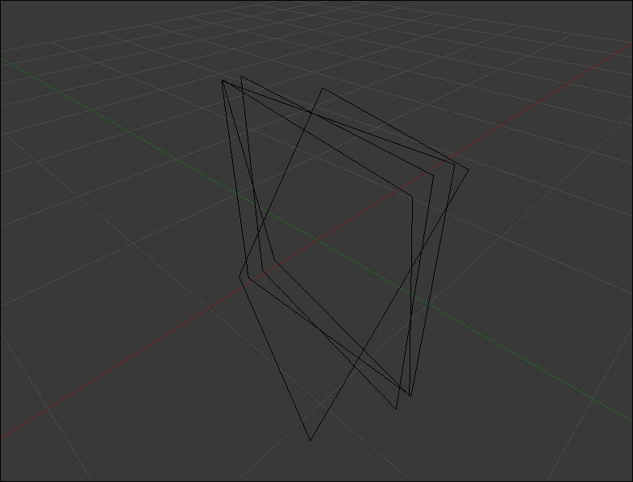

在 2D 中旋转图像很简单，只有一个轴。2D 旋转可以通过使用仿射变换来实现。

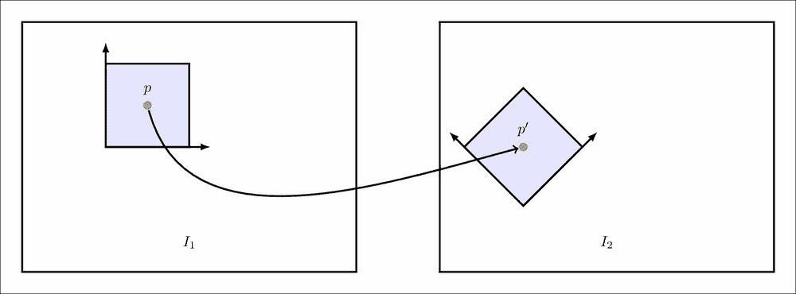

在我们的项目中，我们需要围绕所有三个轴旋转图像。一个仿射变换不足以产生这些变换，因此我们需要转向透视变换。此外，旋转是线性变换；这意味着我们可以将任意旋转分解为其 X、Y 和 Z 分量旋转，并使用这些分量来组合旋转。

为了实现这一点，我们将使用 OpenCV 的 Rodrigues 函数调用生成这些变换矩阵。让我们先写一个函数，它可以任意旋转一个图像。

```py
def rotateImage(src, rx, ry, rz, f, dx=0, dy=0, dz=0, convertToRadians=False):
    if convertToRadians:
        rx = (rx) * math.pi / 180
        ry = (ry) * math.pi / 180
        rz = (rz) * math.pi / 180

    rx = float(rx)
    ry = float(ry)
    rz = float(rz)
```

此方法接受一个需要旋转的源图像，三个旋转角度，一个可选的平移，像素焦距，以及角度是否以弧度表示。如果角度是以度表示的，我们需要将它们转换为弧度。我们还强制将它们转换为`float`。

接下来，我们将计算源图像的宽度和高度。这些，连同焦距，用于将旋转矩阵（在现实世界空间中）转换为图像空间。

```py
    w = src.shape[1]
    h = src.shape[0]
```

现在，我们使用 Rodrigues 函数生成旋转矩阵：

```py
    smallR = cv2.Rodrigues(np.array([rx, ry, rz]))[0]
    R = numpy.array([ [smallR[0][0], smallR[0][1], smallR[0][2], 0],
                      [smallR[1][0], smallR[1][1], smallR[1][2], 0],
                      [smallR[2][0], smallR[2][1], smallR[2][2], 0],
                      [0,            0,            0,            1]])
```

Rodrigues 函数接受一个包含三个旋转角度的向量（列表），并返回一个旋转矩阵。返回的矩阵是一个 3x3 矩阵。我们将将其转换为 4x4 齐次矩阵，这样我们就可以对其应用变换。

### 注意

通常，保持 dz 等于焦距是一个好主意。这意味着图像是在正确的焦距下捕获的，并且需要围绕这个点旋转。你可以自由地将 dz 更改为其他值，但通常将 dz 设置为 F 可以得到很好的结果。

我们现在将一个简单的平移应用到矩阵上。平移矩阵可以很容易地评估如下：

```py
    x = numpy.array([[1.0, 0,   0,   dx],
                     [0,   1.0, 0,   dy],
                     [0,   0,   1.0, dz],
                     [0,   0,   0,   1]])
    T = numpy.asmatrix(x)
```

到目前为止，所有的变换都是在世界空间中发生的。我们需要将这些变换转换为图像空间。这是通过相机的简单针孔模型实现的。

```py
    c = numpy.array([[f, 0, w/2, 0],
                     [0, f, h/2, 0],
                     [0, 0, 1,   0]])
    cameraMatrix = numpy.asmatrix(c)
```

结合这些变换是直接的：

```py
    transform = cameraMatrix * (T*R)
```

这个矩阵现在可以用于 OpenCV 的`warpPerspective`方法来旋转源图像。

```py
    output = cv2.warpPerspective(src, transform, (w, h))
    return output
```

但是这个输出的结果并不是你想要的，图像是围绕图像中的(0, 0)旋转的。我们需要围绕图像中心旋转。为了实现这一点，我们需要在旋转发生之前插入一个额外的平移矩阵。

```py
    w = src.shape[1]
    h = src.shape[0]

    # New code:
    x = numpy.array([ [1, 0, -w/2],
                      [0, 1, -h/2],
                      [0, 0, 0],
                      [0, 0, 1]]
    A1 = numpy.asmatrix(x)
    ...
```

现在，我们在非常开始处插入矩阵 A1：

```py
transform = cameraMatrix * (T*(R*A1))
```

现在图像应该围绕中心旋转；这正是我们想要的，并且是一个自包含的方法，我们可以使用它来使用 OpenCV 在 3D 空间中任意旋转图像。

### 累积旋转

使用单个旋转向量旋转图像相当直接。在本节中，我们将扩展该方法，使其更适合我们的项目。

在录制视频时，我们有两个数据源处于活动状态：图像捕获和陀螺仪轨迹。这些是在不同的速率下捕获的——每几毫秒捕获一次图像，每几微秒捕获一次陀螺仪信号。为了计算稳定图像所需的精确旋转，我们需要累积数十个陀螺仪信号。这意味着旋转矩阵需要有关多个不同陀螺仪数据样本的信息。

此外，陀螺仪和图像传感器不同步；我们需要在陀螺仪信号上使用线性插值来使它们同步。

让我们编写一个返回变换矩阵的函数。

```py
def getAccumulatedRotation(w, h,
                           theta_x, theta_y, theta_z, timestamps,
                           prev, current,
                           f,
                           gyro_delay=None, gyro_drift=None, shutter_duration=None):
    if not gyro_delay:
        gyro_delay = 0

    if not gyro_drift:
        gyro_drift = (0, 0, 0)

    if not shutter_duration:
        shutter_duration = 0
```

这个函数接受很多参数。让我们逐一介绍它们：

+   `w`、`h`：我们需要知道图像的大小，以便将其从世界空间转换为图像空间。

+   theta_*：目前，我们可以访问角速度。从那里，我们可以评估实际角度，这正是这个函数作为参数接受的。

+   时间戳：每个样本被采集的时间。

+   `prev`、`current`：在这些时间戳之间累积旋转。这通常将提供前一帧和当前帧的时间戳。

+   `f`、`gyro_delay`、`gyro_drift`和`shutter_duration`被用来提高旋转矩阵估计的准确性。其中最后三个是可选的（如果你没有传递它们，它们将被设置为 0）。

从上一节中，我们知道我们需要先进行平移（否则我们将得到关于(0, 0)的旋转）。

```py
    x = numpy.array([[1, 0, -w/2],
                  [0, 1, -h/2],
                  [0, 0, 0],
                  [0, 0, 1]])
    A1 = numpy.asmatrix(x)
    transform = A1.copy()
```

我们将使用“变换”矩阵来累积多个陀螺仪样本之间的旋转。

接下来，我们使用`gyro_delay`偏移时间戳。这只是在时间戳上添加（或根据其值的符号减去）。

```py
    prev = prev + gyro_delay
    current = current + gyro_delay
    if prev in timestamps and current in timestamps:
        start_timestamp = prev
        end_timestamp = current
    else:
        (rot, start_timestamp, t_next) = fetch_closest_trio(theta_x,
                                                            theta_y,
                                                            theta_z,
                                                            timestamps,
                                                            prev)
        (rot, end_timestamp, t_next) = fetch_closest_trio(theta_x,
                                                          theta_y,
                                                          theta_z,
                                                          timestamps,
                                                          current)
```

如果更新的`prev`和`current`值存在于时间戳中（这意味着我们在那个时间瞬间从传感器捕获了值）——太好了！不需要插值。否则，我们使用`fetch_closest_trio`函数来将信号插值到给定的时间戳。

这个辅助函数返回三件事：

+   请求时间戳的插值旋转

+   传感器数据中最接近的时间戳

+   它之后的那个时间戳

我们现在使用`start_timestamp`和`end_timestamp`进行迭代。

```py
    for time in xrange(timestamps.index(start_timestamp), timestamps.index(end_timestamp)):
        time_shifted = timestamps[time] + gyro_delay
        trio, t_previous, t_current = fetch_closest_trio(theta_x, theta_y, theta_z, timestamps, time_shifted)
        gyro_drifted = (float(trio[0] + gyro_drift[0]),
                        float(trio[1] + gyro_drift[1]),
                        float(trio[2] + gyro_drift[2]))
```

我们遍历物理数据中的每个时间戳。我们添加陀螺仪延迟并使用它来获取最接近的（插值）信号。一旦完成，我们为每个组件添加陀螺仪漂移。这只是一个常数，应该添加以补偿陀螺仪的错误。

使用这些旋转角度，我们现在计算旋转矩阵，就像上一节中那样。

```py
        smallR = cv2.Rodrigues(numpy.array([-float(gyro_drifted[1]),
                                            -float(gyro_drifted[0]),
                                            -float(gyro_drifted[2])]))[0]
        R = numpy.array([[smallR[0][0], smallR[0][1], smallR[0][2], 0],
                         [smallR[1][0], smallR[1][1], smallR[1][2], 0],
                         [smallR[2][0], smallR[2][1], smallR[2][2], 0],
                         [0,            0,            0,            1]])
        transform = R * transform
```

这段代码几乎与上一节中的相同。尽管如此，也有一些关键的区别。首先，我们向 Rodrigues 提供负值。这是为了抵消运动的影响。其次，X 和 Y 的值被交换了。（`gyro_drifted[1]`排在前面，然后是`gyro_drifted[0]`）。这是必需的，因为陀螺仪的轴和这些矩阵使用的轴是不同的。

这完成了在指定时间戳之间对陀螺仪样本的迭代。为了完成这个任务，我们需要在 Z 方向上平移，就像在上一节中做的那样。由于这可以硬编码，让我们这样做：

```py
    x = numpy.array([[1, 0, 0, 0],
                     [0, 1, 0, 0],
                     [0, 0, 1, f],
                     [0, 0, 0, 1]])
    T = numpy.asmatrix(x)
```

我们还需要使用相机矩阵将世界空间转换为图像空间。

```py
    x = numpy.array([[f, 0, w/2, 0],
                     [0, f, h/2, 0],
                     [0, 0, 1,   0]])
    A2 = numpy.asmatrix(x)
    transform = A2 * (T*transform)
    return transform
```

我们首先在 Z 方向上平移，然后转换为图像空间。这一节实际上允许你使用陀螺仪参数旋转视频帧。

## 校准类

数据结构准备就绪后，我们就处于开始这个项目关键部分的良好位置。校准建立在之前提到的所有类的基础上。

和往常一样，我们将创建一个新的类，它封装了所有与校准相关的任务。

```py
class CalibrateGyroStabilize(object):
    def __init__(self, mp4, csv):
        self.mp4 = mp4
        self.csv = csv
```

该对象需要两个东西：视频文件和陀螺仪数据文件。这些将被存储在对象中。

在直接跳入校准方法之前，让我们创建一些在校准时会有帮助的实用函数。

```py
    def get_gaussian_kernel(sigma2, v1, v2, normalize=True):
        gauss = [math.exp(-(float(x*x) / sigma2)) for x in range(v1, v2+1)]

        if normalize:
            total = sum(guass)
            gauss = [x/total for x in gauss]

        return gauss
```

这个方法生成一个给定大小的高斯核。我们将使用它来平滑角速度信号。

```py
    def gaussian_filter(input_array):
        sigma = 10000
        r = 256
        kernel = get_gaussian_kernel(sigma, -r, r)
        return numpy.convolve(input_array, kernel, 'same')
```

这个函数执行信号的真正平滑。给定一个输入信号，它生成高斯核并与输入信号卷积。

### 注意

卷积是产生新函数的数学工具。你可以把陀螺仪信号看作一个函数；你给它一个时间戳，它就返回一个值。为了使其平滑，我们需要将其与另一个函数结合。这个函数称为高斯函数，是一个平滑的钟形曲线。这两个函数在不同的时间范围内操作（陀螺仪函数可能在 0 秒到 50 秒之间返回值，而高斯函数可能只适用于 0 秒到 5 秒的时间）。卷积这两个函数产生第三个函数，它在某种程度上类似于两者，从而有效地平滑了陀螺仪信号中的微小变化。

接下来，我们编写一个函数，它计算两个点集的错误分数。这将是估计校准效果好坏的一个构建块。

```py
    def calcErrorScore(set1, set2):
        if len(set1) != len(set2):
            raise Exception("The given sets need to have the exact same length")

        score = 0
        for first, second in zip(set1.tolist(), set2.tolist()):
            diff_x = math.pow(first[0][0] – second[0][0], 2)
            diff_y = math.pow(first[0][1] – second[0][1], 2)
            score += math.sqrt(diff_x + diff_y)

        return score
```

这个错误分数是直接的：你有两个点列表，你计算两个列表上对应点的距离并将它们相加。更高的错误分数意味着两个列表上的点不完全对应。

然而，这种方法只给出了单个帧上的错误。我们关心的是整个视频中的错误。因此，我们编写了另一个方法。

```py
    def calcErrorAcrossVideo(videoObj, theta, timestamp, focal_length, gyro_delay=None, gyro_drift=None, rolling_shutter=None):
        total_error = 0
        for frameCount in xrange(videoObj.numFrames):
            frameInfo = videoObj.frameInfo[frameCount]
            current_timestamp = frameInfo['timestamp']

            if frameCount == 0:
                previous_timestamp = current_timestamp
                continue
            keypoints = frameInfo['keypoints']

            if not keypoints:
                continue
```

我们传递视频对象和所有已估计的细节（theta、时间戳、焦距、陀螺仪延迟等）。有了这些细节，我们尝试进行视频稳定并查看视觉跟踪的关键点与基于陀螺仪的转换之间的差异。

由于我们正在计算整个视频的误差，我们需要遍历每一帧。如果帧的信息中没有关键点，我们就简单地忽略该帧。如果帧中有关键点，这里是我们所做的工作：

```py
            old_corners = frameInfo['keypoints'][0]
            new_corners = frameInfo['keypoints'][1]
            transform = getAccumulatedRotation(videoObj.frameWidth,
                                               videoObj.frameHeight,
                                               theta[0], theta[1], theta[2],
                                               timestamps,
                                               int(previous_timestamp),
                                               int(current_timestamp),
                                               focal_length,
                                               gyro_delay,
                                               gyro_drift,
                                               rolling_shutter)
```

`getAccumulatedRotation` 函数是我们很快将要编写的。该函数的关键思想是返回给定 theta（我们需要旋转以稳定视频的角度）的转换矩阵。我们可以将此转换应用于 `old_corners` 并将其与 `new_corners` 进行比较。

由于 `new_corners` 是通过视觉获得的，因此它是真实值。我们希望 `getAccumulatedRotation` 返回一个与视觉真实值完美匹配的转换。这意味着 `new_corners` 和转换后的 `old_corners` 之间的误差应该是最小的。这就是 `calcErrorScore` 帮助我们的地方：

```py
            transformed_corners = cv2.perspectiveTransform(old_corners, transform)
            error = calcErrorScore(new_corners, transformed_corners)
            total_error += error
            previous_timestamp = current_timestamp
        return total_error
```

我们已经准备好在整个视频中计算误差！现在让我们转到校准函数：

```py
    def calibrate(self):
        gdf = GyroscopeDataFile(csv)
        gdf.parse()

        signal_x = gdf.get_signal_x()
        signal_y = gdf.get_signal_y()
        signal_z = gdf.get_signal_z()
        timestamps = gdf.get_timestamps()
```

第一步是平滑角速度信号中的噪声。这是具有平滑运动的期望信号。

```py
        smooth_signal_x = self.gaussian_filter(signal_x)
        smooth_signal_y = self.gaussian_filter(signal_y)
        smooth_signal_z = self.gaussian_filter(signal_z)
```

我们很快将编写 `gaussian_filter` 方法；现在，让我们记住它返回一个平滑的信号。

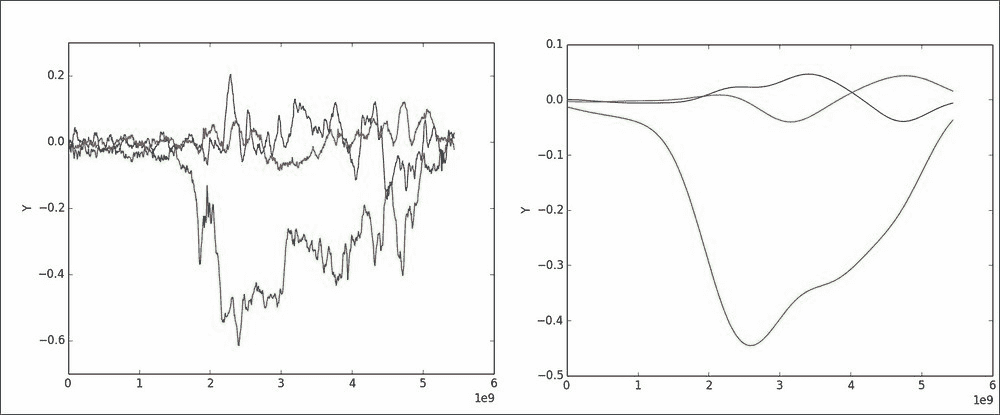

接下来，我们计算物理信号和期望信号之间的差异。我们需要为每个组件分别进行此操作。

```py
        g = [ [], [] [] ]
        g[0] = numpy.subtract(signal_x, smooth_signal_x).tolist()
        g[1] = numpy.subtract(signal_y, smooth_signal_y).tolist()
        g[2] = numpy.subtract(signal_z, smooth_signal_z).tolist()
```

我们还需要计算时间戳之间的差值。我们将使用这个差值来进行积分。

```py
        dgt = self.diff(timestamps)
```

接下来，我们将角速度积分以获得实际角度。积分会引入我们的方程中的误差，但这没关系。对于我们的目的来说，这已经足够好了。

```py
        theta = [ [], [], [] ]
        for component in [0, 1, 2]:
            sum_of_consecutives = numpy.add( g[component][:-1], g[component][1:])
            dx_0 = numpy.divide(sum_of_consecutives, 2 * 1000000000)
            num_0 = numpy.multipy(dx_0, dgt)
            theta[component] = [0]
            theta[component].extend(numpy.cumsum(num_0))
```

就这样。我们已经计算了将稳定图像的 theta 数量！然而，这纯粹是从陀螺仪的角度来看。我们仍然需要计算未知数，以便我们可以使用这些 theta 来稳定图像。

要做到这一点，我们将一些未知数初始化为具有任意初始值的变量（大多数情况下为 0）。同时，我们加载视频并处理关键点信息。

```py
        focal_length = 1080.0
        gyro_delay = 0
        gyro_drift = (0, 0, 0)
        shutter_duration = 0

        videoObj = GyroVideo(mp4)
        videoObj.read_video()
```

现在，我们使用 SciPy 的优化方法来最小化误差。为此，我们必须首先将这些未知数转换为 Numpy 数组。

```py
        parameters = numpy.asarray([focal_length,
                                    gyro_delay,
                                    gyro_drift[0], gyro_drift[1], gyro_drift[2]])
```

由于我们尚未将固定滚动快门纳入其中，因此在参数列表中忽略它。接下来，我们调用实际的优化函数：

```py
        result = scipy.optimize.minimize(self.calcErrorAcrossVideoObjective,
                                         parameters,
                                         (videoObj, theta, timestamps),
                                         'Nelder-Mead')
```

执行此函数需要几秒钟，但它会为我们提供未知数的值。然后我们可以按照以下方式从结果中提取这些值：

```py
        focal_length = result['x'][0]
        gyro_delay = result['x'][1]
        gyro_drift = ( result['x'][2], result['x'][3], result['x'][4] )
        print "Focal length = %f" % focal_length
        print "Gyro delay   = %f" % gyro_delay
        print "Gyro drift   = (%f, %f, %f)" % gyro_drift
```

这样，我们就完成了校准！我们只需要返回刚才所做的所有相关计算。

```py
    return (delta_theta, timestamps, focal_length, gyro_delay, gyro_drift, shutter_duration)
```

就这样，大功告成！

## 矫正图像

在上一节中，我们计算了方程中的所有未知数。现在，我们可以继续修复摇摇晃晃的视频。

我们将首先创建一个新的方法，称为`stabilize_video`。这个方法将接受一个视频文件和一个相应的 csv 文件。

```py
def stabilize_video(mp4, csv):
    calib_obj = CalibrateGyroStabilize(mp4, csv)
```

我们创建了一个我们刚刚定义的校准类对象，并传递了所需的信息。现在，我们只需要调用校准函数。

```py
    delta_theta, timestamps, focal_length, gyro_delay, gyro_drift, shutter_duration = calib_obj.calibrate()
```

这个方法调用可能需要一段时间才能执行，但我们只需要为每个设备运行一次。一旦计算出来，我们可以将这些值存储在文本文件中，并从中读取。

一旦我们估计了所有未知数，我们就开始读取每个帧的视频文件。

```py
    vidcap = cv2.VideoCapture(mp4)
```

现在，我们开始遍历每一帧并纠正旋转。

```py
    frameCount = 0
    success, frame = vidcap.read()
    previous_timestamp = 0
    while success:
        print "Processing frame %d" % frameCount
```

接下来，我们从视频流中获取时间戳，并使用它来获取最近的旋转样本。

```py
        current_timestamp = vidcap.get(cv2.CAP_PROP_POS_MSEC) * 1000 * 1000
```

`VideoCapture`类返回毫秒级的时间戳。我们将它转换为纳秒以保持一致的单位。

```py
        rot, prev, current = fetch_closest_trio(delta_theta[0],delta_theta[1],delta_theta[2],timestamps,current_timestamps)
```

现在我们有了这些部分，我们现在获取累积的旋转。

```py
        rot = accumulateRotation(frame, delta_theta[0],delta_theta[1],delta_theta[2],timestamps, previous_timestamp,prev,focal_length,gyro_delay,gyro_drift,shutter_duration)
```

接下来，我们将变换后的帧写入文件，并继续处理下一帧：

```py
        cv2.imwrite("/tmp/rotated%04d.png" % frameCount, rot)
        frameCount += 1
        previous_timestamp = prev
        success, frame = vidcap.read()
    return
```

这样，我们就完成了消除设备抖动的简单函数。一旦我们有了所有图像，我们就可以使用`ffmpeg`将它们合并成一个单独的视频。

```py
ffmpeg -f image2 -i image%04d.jpg output.mp4
```

## 测试校准结果

校准的有效性取决于它能够多准确地复制视频上的运动。对于任何一帧，我们都有前一帧和当前帧中匹配的关键点。这给出了场景一般运动的感觉。

使用估计的参数，如果我们能够使用前一帧的关键点来生成当前帧的关键点，我们可以假设校准已经成功。

# 滚动快门补偿

到目前为止，我们的视频已经稳定，然而，当场景中的物体快速移动时，滚动快门效应变得更加明显。

为了解决这个问题，我们需要做几件事情。首先，将滚动快门速度纳入我们的校准代码。其次，在扭曲图像时，我们还需要对滚动快门进行反扭曲。

## 校准滚动快门

要开始校准滚动快门持续时间，我们需要调整误差函数以包含另一个项。让我们先看看`calcErrorAcrossVideo`方法。我们感兴趣的部分是：

```py
def calcErrorAcrossVideo(videoObj, theta, timestamp, focal_length, gyro_delay=None, gyro_drift=None, rolling_shutter=None):
    total_error = 0
    ...
        transform = getAccumulatedRotation(...)
        transformed_corners = cv2.perspectiveTransform(old_corners, transform)
    ...
```

此外，我们还需要添加逻辑来根据角落的位置变换一个角落——图像上半部分的角落与下半部分的角落变换方式不同。

到目前为止，我们只有一个变换矩阵，这通常足够了。然而，现在，我们需要有多个变换矩阵，每个行都有一个。我们可以选择为每个像素行都这样做，但这有点过度。我们只需要包含我们正在跟踪的角落的行的变换。

我们将首先替换上面提到的两行。我们需要逐个遍历每个角落并对其进行扭曲。让我们用一个简单的`for`循环来做这件事：

```py
for pt in old_corners:
    x = pt[0][0]
    y = pt[0][1]

    pt_timestamp = int(current_timestamp) + rolling_shutter * (y-frame_height/2) / frame_height
```

在这里，我们提取旧角点的 x 和 y 坐标，并尝试估计这个特定像素被捕获的时间戳。这里，我假设滚动快门是垂直方向的，从画面顶部到底部。

我们使用当前估计的滚动快门持续时间，并根据角点所在的行估计减去和添加的时间。对于水平滚动快门，这也应该很容易适应。你将不得不使用 `x` 和 `frameWidth` 而不是 `y` 和 `frameHeight`——计算将保持不变。目前，我们假设这将是一个垂直滚动快门。

现在我们有了捕获的估计时间戳，我们可以得到那个瞬间的旋转矩阵（记住，陀螺仪产生的数据分辨率高于相机传感器）。

```py
    transform = getAccumulatedRotation(videoObj.frameWidth, videoObj.frameHeight, theta[0], theta[1], theta[2], timestamps, int(previous_timestamp), int(pt_timestamp), focal_length, gyro_delay, gyro_drift, doSub=True)
```

这行几乎与原始的相同；唯一的区别是我们将 `current_timestamp` 替换为 `pt_timestamp`。

接下来，我们需要根据滚动快门持续时间转换这个点。

```py
    output = transform * np.matrix("%f;%f;1.0" % (x, y)).tolist()
    tx = (output[0][0] / output[2][0]).tolist()[0][0]
    ty = (output[1][0] / output[2][0]).tolist()[0][0]
    transformed_corners.append( np.array([tx, ty]) )
```

变换后，我们只需将其追加到 `transformed_corners` 列表（就像我们之前做的那样）。

使用这个，我们就完成了校准部分。现在，我们转向图像扭曲。

## 使用网格点进行扭曲

让我们首先编写一个函数，这个函数将为我们执行扭曲。这个函数接受以下输入：

+   原始图像

+   一系列理想上应该整齐排列在完美网格中的点

点列表的大小给我们提供了预期的行数和列数，并且该函数返回一个完美对齐的图像。

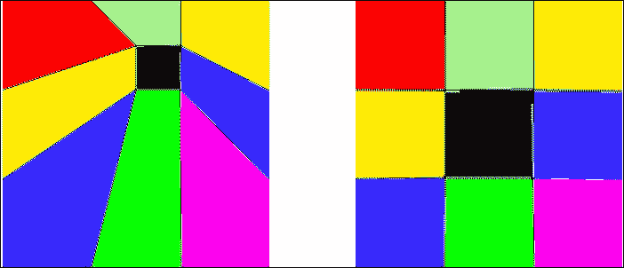

让我们定义一个函数：

```py
def meshwarp(src, distorted_grid):
    """
    src: The original image
    distorted_grid: The list of points that have been distorted
    """
    size = src.shape
```

如前所述，这需要一个图像和控制点的列表。我们存储图像的大小以供将来参考。

```py
    mapsize = (size[0], size[1], 1)
    dst = np.zeros(size, dtype=np.uint8)
```

我们之前存储的大小很可能有三个通道。因此，我们创建了一个名为 `mapsize` 的新变量；它存储了图像的大小，但只有一个通道。我们将在以后使用它来创建 OpenCV 中 remap 函数使用的矩阵。

我们还创建了一个与原始图像大小相同的空白图像。接下来，我们查看计算网格中的行数和列数。

```py
    quads_per_row = len(distorted_grid[0]) – 1
    quads_per_col = len(distorted_grid) – 1
    pixels_per_row = size[1] / quads_per_row
    pixels_per_col = size[0] / quads_per_col
```

我们很快将在一些循环中使用这些变量。

```py
    pt_src_all = []
    pt_dst_all = []
```

这些列表存储了所有源（扭曲）点和目标（完美对齐）点。我们将使用 `distorted_grid` 来填充 `pt_src_all`。我们将根据输入数据中的行数和列数程序性地生成目标。

```py
    for ptlist in distorted_grid:
        pt_src_all.extend(ptlist)
```

变形网格应该是一个列表的列表。每一行是一个包含其点的列表。

现在，我们使用之前计算的 `quads_per_*` 变量生成程序性目标点。

```py
    for x in range(quads_per_row+1):
        for y in range(quads_per_col+1):
            pt_dst_all.append( [x*pixels_per_col,
                                y*pixels_per_row])
```

这根据我们传递给方法的点数生成理想的网格。

我们现在有了计算源网格和目标网格之间插值所需的所有信息。我们将使用`scipy`为我们计算插值。然后我们将其传递给 OpenCV 的 remap 方法，并将其应用于图像。

首先，`scipy`需要一个表示预期输出网格的表示，因此我们需要指定一个包含图像所有像素的密集网格。这是通过以下方式完成的：

```py
gx, gt = np.mgrid[0:size[1], 0:size[0]]
```

一旦我们定义了基本网格，我们就可以使用 Scipy 的`interpolate`模块来为我们计算映射。

```py
g_out = scipy.interpolate.griddata(np.array(pt_dst_all),
                                   np.array(pt_src_all),
                                   (gx, gy), method='linear')
```

`g_out`包含重新映射的`x`和`y`坐标；我们需要将其拆分为单独的组件，以便 OpenCV 的`remap`方法能够工作。

```py
mapx = np.append([], [ar[:,0] for ar in g_out]).reshape(mapsize).astype('float32')
mapy = np.append([], [ar[:,1] for ar in g_out]).reshape(mapsize).astype('float32')
```

这些矩阵正是 remap 所期望的，我们可以现在简单地用适当的参数运行它。

```py
    dst = cv2.remap(src, mapx, mapy, cv2.INTER_LINEAR)
    return dst
```

这样就完成了我们的方法。我们可以在我们的稳定化代码中使用它，并修复滚动快门。

## 使用校准去畸变

在这里，我们讨论了如何根据网格对视频进行稳定化扭曲图像。我们将每一帧分割成 10x10 的网格。我们扭曲网格，这会导致图像扭曲（就像控制点）。使用这种方法，我们应该得到良好的结果和不错的性能。

实际的去畸变发生在`accumulateRotation`方法中：

```py
def accumulateRotation(src, theta_x, theta_y, theta_z, timestamps, prev, current, f, gyro_delay=None, gyro_drift=None, shutter_duration=None):
    ...
    transform = getAccumulatedRotation(src.shape[1], src.shape[0], theta_x, theta_y, theta_z, timestamps, prev, current, f, gyro_delay, gyro_drift)
    o = cv2.warpPerspective(src, transform (src.shape[1], src.shape[0]))
    return o
```

这里，有一个单一的透视变换正在进行。现在，相反，我们必须对每个 10x10 的控制点进行不同的变换，并使用`meshwarp`方法来修复滚动快门。所以用下面的内容替换`transform =`行：

```py
    ...
    pts = []
    transformed_pts = []
    for x in range(10):
        current_row = []
        current_row_transformed = []
        pixel_x = x * (src.shape[1] / 10)
        for y in range(10):
            pixel_y = y * (src.shape[0] / 10)
            current_row.append( [pixel_x, pixel_y] )
        pts.append(current_row)
```

我们现在已经在`pts`列表中生成了原始网格。现在，我们需要生成变换坐标：

```py
        ...
        for y in range(10):
            pixel_y = y * (src.shape[0] / 10
            if shutter_duration:
                y_timestamp = current + shutter_duration*(pixel_y - src.shape[0]/2)
            else:
                y_timestamp = current
        ...
```

如果传递了快门持续时间，我们生成记录这个特定像素的时间戳。现在我们可以根据快门旋转变换（`pixel_x`，`pixel_y`），并将其附加到`current_row_transformed`：

```py
        ...
        transform = getAccumulatedRotation(src.shape[1], src.shape[0], theta_x, theta_y, theta_z, timestamps, prev, y_timestamp, f, gyro_delay, gyro_drift)
        output = cv2.perspectiveTransform(np.array([[pixel_x, pixel_y]], transform)
        current_row_transformed.append(output)
    pts.append(current_row)
    pts_transformed.append(current_row_transformed)
        ...
```

这完成了`meshwarp`的网格。现在我们只需要生成扭曲后的图像。这很简单，因为我们已经有了所需的方法：

```py
    o = meshwarp(src, pts_transformed)
    return o
```

这样就完成了我们的变换。现在，滚动快门也被纳入了我们的去畸变中。

# 接下来是什么？

我们现在有一个非常基础的视频稳定化实现。你可以添加一些东西来使其更健壮、更自动化，并且输出更令人满意。以下是一些开始的方法。

## 识别陀螺仪轴

在本章中，我们硬编码了陀螺仪的轴。这可能并不适用于所有手机制造商。使用类似的校准技术，你应该能够找到一个最小化视频误差的轴配置。

## 估计滚动快门方向

我们已经硬编码了滚动快门的方向。使用特定的技术（比如在相机上快速闪烁 LED），可以估计滚动快门的方向并将其纳入校准代码。某些相机传感器根本不具有滚动快门的伪影。这个测试还可以确定是否使用了这样的传感器。

## 更平滑的时间流逝

现在我们已经稳定了视频，我们可以更好地加快（或减慢）视频的速度。有一些商业软件包执行类似任务——现在你的 OpenCV 代码也可以做到这一点！

## 校准参数仓库

你将不得不校准你遇到的每一种新设备类型。如果你从一个设备类型（比如，从三星 S5 切换到 iPhone 6），你将不得不为此组合的镜头和传感器运行校准。然而，在不同类型的同一设备之间移动不需要重新校准（比如，从一个 iPhone 6 移动到另一个）。如果你能收集足够的校准结果，你的代码几乎可以在任何设备上完美运行。

### 注意

如果仓库中没有所需的参数，你也可以想出一个后备机制。

## 翻译的整合

目前，我们只使用旋转。这意味着如果你在单一平面上摇动相机，算法不会做太多。通过使用加速度计的输入和使用关键点的平移，应该可以补偿平移。这将产生更高品质的视频。

## 额外的提示

在使用 Python 和计算机视觉时，以下是一些需要记住的额外事项。它们应该有助于加快你的工作并让你免受意外崩溃的影响！

### 使用 Python 的 pickle 模块

Python 为我们提供了一种巧妙的方法，可以将 Python 对象作为文件存储在磁盘上。在我们的项目中，我们有陀螺仪校准类。这个类存储了视频尺寸和关键点等信息，这些信息跨越不同的帧。每次你想测试你的代码时，从头开始计算这些信息是繁琐的。你可以轻松地将这个对象序列化到文件中，并在需要时读取回数据。

下面是我们代码中序列化视频对象的示例代码：

```py
import pickle
fp = open("/path/to/file.data", "w")
videoObj = GyroVideo(mp4)
pickle.dump(videoObj, fp)
fp.close()
```

为了将对象读回脚本中：

```py
import pickle
fp = open("/path/to/file.data", "r")
videoObj = pickle.load(fp)
fp.close()
```

这在迭代代码和验证是否按预期工作方面节省了时间。

### 输出单个图像

当处理视频时，你通常最终会使用类似 OpenCV 中的 VideoWriter 类。你给它提供帧，然后它输出一个视频文件。虽然这是一种完全有效的方法来完成工作，但如果你将单个帧写入磁盘，然后使用视频编码器将图像组合成视频流，你会拥有更多的控制权。

使用 `ffmpeg` 是合并多个图像的一个简单方法。

```py
ffmpeg -i /tmp/image%04d.png -f image2 output.mp4

```

### 不使用差值进行测试

在项目中，我们试图稳定视频——因此我们计算实际陀螺仪信号与信号平滑版本之间的差值。

你可能想只用实际的陀螺仪信号来尝试；这将完全保持视频静止。这可能适用于你希望相机看起来完全静止的情况。

# 摘要

在这一章中，我们涵盖了相当多的内容：与陀螺仪通信、使用它来找到未知数、抵消相机抖动和滚动快门的影响。

我们首先创建了一个 Android 应用，该应用使用后台任务将媒体记录到视频文件中。在这个过程中，我们发现了如何扩展 OpenCV 的相机视图类以包含自定义 UI 和响应性。有了这个，你现在可以使用 OpenCV 后端创建非常复杂的 UI。此外，我们还捕获了陀螺仪轨迹并将其存储在一个单独的文件中。陀螺仪和媒体的采样率不同——然而，在这个阶段我们并不关心它。我们将让应用存储更高密度的陀螺仪轨迹（每几百微秒与每几十毫秒的媒体相比）。

一旦我们有了媒体/CSV 对，我们就使用 Python 和 numpy/scipy 库来校准系统。最初我们有三个未知数：相机的像素焦距、陀螺仪延迟（陀螺仪记录和媒体时间戳之间的偏移）以及陀螺仪漂移。

我们设计了一个错误函数，该函数接受预期的关键点和变换后的关键点，并返回错误量。然后我们使用这个函数来计算整个视频的错误。利用这个函数和 Scipy 的优化方法，我们能够找到这些未知数的值。这种校准对于每种设备类型只需要进行一次。

然后我们为校准添加了另一个参数——滚动快门。估计这个未知数的值与前面的三个类似，然而，引入去畸变有点棘手。我们不得不创建一个新的方法`meshwarp`，它接受一个畸变的网格。这个方法校正网格并消除由于滚动快门产生的伪影。我们针对垂直滚动快门进行了工作，然而将其转换为水平滚动快门应该很容易。

我们触及了许多不同的领域：传感器、校准和几何畸变。我希望这一章能让你对设计自己的图像处理管道有所启发。
