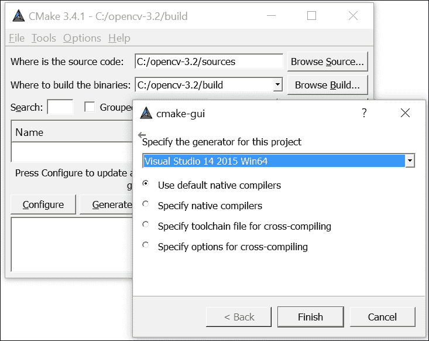
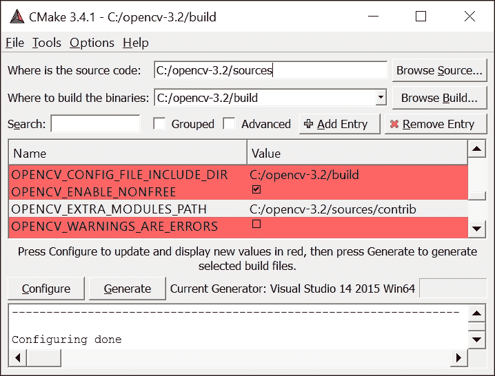
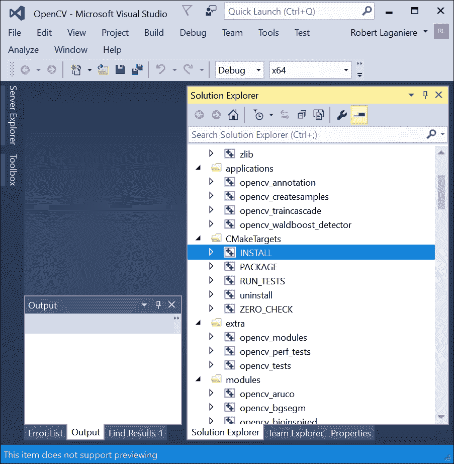
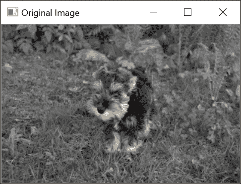
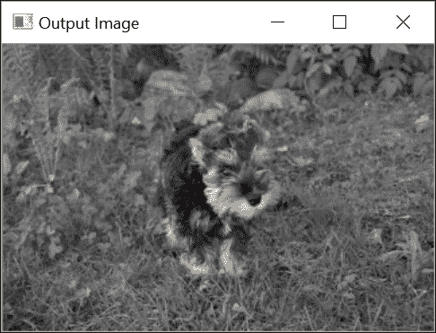
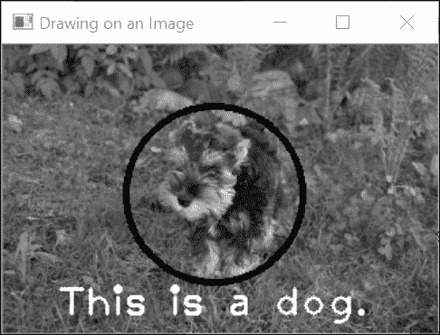
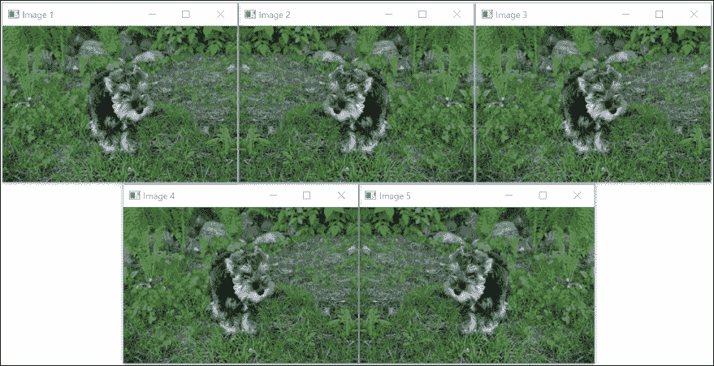
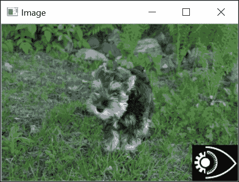
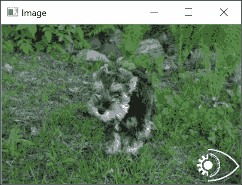

# 第一章. 玩转图像

在本章中，我们将带你开始使用 **OpenCV** 库。你将学习如何执行以下任务：

+   安装 OpenCV 库

+   加载、显示和保存图像

+   探索 `cv::Mat` 数据结构

+   定义感兴趣的区域

# 简介

这章将教你 OpenCV 的基本元素，并展示如何完成最基本图像处理任务：读取、显示和保存图像。然而，在开始使用 OpenCV 之前，你需要安装库。这是一个简单的过程，将在本章的第一个食谱中解释。

你所有的计算机视觉应用程序都将涉及图像的处理。这就是为什么 OpenCV 提供了一个用于处理图像和矩阵的数据结构。这是一个功能强大的数据结构，具有许多有用的属性和方法。它还包含一个高级内存管理模型，这极大地简化了应用程序的开发。本章的最后两个食谱将教你如何使用这个重要的 OpenCV 数据结构。

# 安装 OpenCV 库

OpenCV 是一个开源库，用于开发可在多个平台上运行的计算机视觉应用程序，例如 Windows、Linux、Mac、Android 和 iOS。它可以在遵循 BSD 许可证的学术和商业应用中使用，该许可证允许你自由使用、分发和修改它。本食谱将向你展示如何在你的机器上安装这个库。

## 准备工作

当你访问 OpenCV 官方网站 [`opencv.org/`](http://opencv.org/) 时，你会找到库的最新版本，描述 **应用程序编程接口**（**API**）的在线文档，以及许多其他关于 OpenCV 的有用资源。

## 如何做...

从 OpenCV 网站上找到最新可用的下载，并选择与你的选择平台（Windows、Linux/Mac 或 iOS）相对应的版本。一旦下载了 OpenCV 软件包，运行 WinZip 自解压程序并选择你喜欢的位置。将创建一个 `opencv` 目录；将目录重命名以显示你使用的版本是一个好主意（例如，在 Windows 上，你的最终目录可以是 `C:\opencv-3.2`）。这个目录将包含构成库的文件和目录集合。值得注意的是，你将找到包含所有源文件的 `sources` 目录（是的，它是开源的！）。

为了完成库的安装并使其准备好使用，你需要采取一个重要的步骤：为你的选择环境生成库的二进制文件。这确实是你要决定使用哪个目标平台来创建你的 OpenCV 应用程序的地方。你更喜欢使用哪个操作系统？应该选择哪个编译器？哪个版本？32 位还是 64 位？正如你所见，有许多可能的选项，这就是为什么你必须构建适合你需求的库。

在你的项目开发中使用的**集成开发环境**（**IDE**）也将指导你做出这些选择。请注意，库包还附带预编译的二进制文件，如果你符合这种情况可以直接使用（检查`sources`目录旁边的`build`目录）。如果其中一个预编译的二进制文件满足你的要求，那么你就准备就绪了。

然而，有一个重要的说明。从版本 3 开始，OpenCV 已经分为两个主要组件。第一个是包含成熟算法的主要 OpenCV 源代码库。这就是你下载的那个。还有一个单独的贡献代码库，它包含最近由 OpenCV 贡献者添加的新计算机视觉算法。如果你的计划是只使用 OpenCV 的核心功能，你不需要`contrib`包。但如果你想尝试最新的最先进算法，那么你很可能需要这个额外的模块。实际上，这本烹饪书将向你展示如何使用这些高级算法中的几个。因此，你需要`contrib`模块来遵循这本书的食谱。所以你必须去[`github.com/opencv/opencv_contrib`](https://github.com/opencv/opencv_contrib)下载 OpenCV 的额外模块（下载 ZIP 文件）。你可以将额外模块解压到你的选择目录；这些模块应该在`opencv_contrib-master/modules`中找到。为了简单起见，你可以将这个目录重命名为`contrib`并将其直接复制到主包的`sources`目录中。请注意，你也可以选择你想要的额外模块并只保存它们；然而，在这个阶段，你可能发现简单地保留所有内容会更容易。

现在您已经准备好进行安装。为了构建 OpenCV 的二进制文件，强烈建议您使用位于[`cmake.org`](http://cmake.org)的**CMake**工具。CMake 是另一个开源软件工具，它使用平台无关的配置文件来控制软件系统的编译过程。它生成在您的环境中编译软件库所需的`makefile`或`solution`文件。因此，您必须下载并安装 CMake。另外，请参阅本食谱中的*更多内容...*部分，了解您可能希望在编译库之前安装的附加软件包，即**可视化工具包**（**VTK**）。

您可以使用命令行界面运行`cmake`，但使用带有图形界面的`CMake`（**cmake-gui**）会更简单。在后一种情况下，您只需指定包含 OpenCV 库源代码的文件夹和将包含二进制文件的文件夹。现在点击**Configure**并选择您选择的编译器：



一旦完成初始配置，CMake 将为您提供一系列配置选项。例如，您必须决定是否希望安装文档或是否希望安装一些额外的库。除非您知道自己在做什么，否则最好保持默认选项不变。然而，由于我们想要包含额外的模块，我们必须指定它们可以找到的目录：



一旦指定了额外的模块路径，再次点击**Configure**。现在您就可以通过点击**Generate**按钮来生成项目文件。这些文件将允许您编译库。这是安装过程的最后一步，它将使库准备好在您的开发环境中使用。例如，如果您选择 MS Visual Studio，那么您需要做的就是打开 CMake 为您创建的顶级解决方案文件（`OpenCV.sln`文件）。然后选择**INSTALL**项目（在**CMakeTargets**下）并执行**Build**命令（使用右键点击）。



要同时获得 **发布版** 和 **调试版** 构建，你必须重复编译过程两次，一次针对每个配置。如果一切顺利，你将在 `build` 目录下创建一个 `install` 目录。这个目录将包含所有与你的应用程序链接的 OpenCV 库的 `二进制` 文件以及你的可执行文件在运行时必须调用的动态库文件。确保你设置系统环境变量 `PATH`（从 **控制面板**），以便操作系统在运行应用程序时能够找到 `.dll` 文件（例如，`C:\opencv-3.2\build \install\x64\vc14\bin`）。你还应该定义环境变量 `OPENCV_DIR`，指向 `INSTALL` 目录。这样，CMake 就能在配置未来的项目时找到库。

在 Linux 环境中，你可以使用 Cmake 生成所需的 `Makefiles`；然后通过执行 `sudo make install` 命令来完成安装。或者，你也可以使用打包工具 `apt-get`，它可以自动完成库的完整安装。对于 Mac OS，你应该使用 `Homebrew` 包管理器。一旦安装，你只需输入 `brew install opencv3 --with-contrib` 就可以安装完整的库（运行 `brew info opencv3` 查看所有可能的选项）。

## 它是如何工作的...

OpenCV 是一个不断发展的库。随着版本 3 的发布，该库继续扩展，提供了许多新的功能，并提高了性能。从版本 2 开始的全面 C++ API 的迁移现在几乎完成，并实现了更统一的接口。在这个新版本中引入的一个主要变化是重新组织库的模块，以方便其分发。特别是，创建了一个包含最新算法的独立仓库。这个 `contrib` 仓库还包含受特定许可证约束的非自由算法。目标是让 OpenCV 能够提供开发者和研究人员想要共享的最先进的功能，同时仍然能够提供一个非常稳定且维护良好的核心 API。因此，主要的模块是你从 [`opencv.org/`](http://opencv.org/) 下载库时获得的。额外的模块必须直接从托管在 GitHub 上的开发仓库（[`github.com/opencv/`](https://github.com/opencv/)）下载。由于这些额外模块处于持续开发中，你应该预期它们包含的算法会有更频繁的变更。

OpenCV 库分为几个模块。例如，`opencv_core` 模块包含库的核心功能；`opencv_imgproc` 模块包括主要图像处理函数；`opencv_highgui` 模块提供图像和视频的读写功能以及一些用户界面函数；等等。要使用特定模块，您必须包含相应的顶级头文件。例如，大多数使用 OpenCV 的应用程序都从以下声明开始：

```py
    #include <opencv2/core.hpp> 
    #include <opencv2/imgproc.hpp> 
    #include <opencv2/highgui.hpp> 

```

随着您学习使用 OpenCV，您将发现其众多模块中越来越多的功能。

## 还有更多...

OpenCV 网站 [`opencv.org/`](http://opencv.org/) 包含有关如何安装库的详细说明。它还包含完整的在线文档，其中包括关于库不同组件的几个教程。

### 可视化工具包和 cv::viz 模块

在某些应用中，计算机视觉用于从图像中重建场景的 3D 信息。当处理 3D 数据时，能够将结果可视化在某些 3D 虚拟世界中通常很有用。正如您将在 第十一章 中所学到的，*重建 3D 场景*，`cv::viz` 模块提供了许多有用的函数，允许您在 3D 中可视化场景对象和相机。然而，此模块是建立在另一个开源库 VTK 之上的。因此，如果您想使用 `cv::viz` 模块，在编译 OpenCV 之前，您需要在您的机器上安装 VTK。

VTK 可在 [`www.vtk.org/`](http://www.vtk.org/) 获取。您只需下载库并使用 CMake 来为您的开发环境创建二进制文件。在这本书中，我们使用了版本 6.3.0。此外，您应该定义 `VTK_DIR` 环境变量，指向包含构建文件的目录。同样，在 CMake 在 OpenCV 安装过程中提出的配置选项中，确保已勾选 `WITH_VTK` 选项。

### OpenCV 开发者网站

OpenCV 是一个开源项目，欢迎用户贡献。该库托管在 GitHub 上，这是一个基于 Git 的版本控制和源代码管理工具的在线服务。您可以通过 [`github.com/opencv/opencv/wiki`](https://github.com/opencv/opencv/wiki) 访问开发者网站。在其他方面，您可以访问目前正在开发的 OpenCV 版本。社区使用 Git 作为其版本控制系统。Git 也是一个免费的开源软件系统；它可能是您管理自己的源代码的最佳工具。

### 注意

下载本书的示例源代码：本书中展示的示例源代码也托管在 GitHub 上。请访问作者的仓库[`github.com/laganiere`](https://github.com/laganiere)以获取代码的最新版本。请注意，您可以从您在[`www.packtpub.com`](http://www.packtpub.com)的账户中下载您购买的所有 Packt 书籍的示例代码文件。如果您在其他地方购买了这本书，您可以访问[`www.packtpub.com/support`](http://www.packtpub.com/support)并注册，以便将文件直接通过电子邮件发送给您。

## 参见

+   作者的网站([`www.laganiere.name/`](http://www.laganiere.name/))还提供了如何安装 OpenCV 库最新版本的逐步说明。

+   访问[`git-scm.com/`](https://git-scm.com/)和[`github.com/`](https://github.com/)了解更多关于源代码管理的信息。

# 加载、显示和保存图像

现在是时候运行你的第一个 OpenCV 应用程序了。由于 OpenCV 是关于图像处理的，这个任务将向你展示如何在图像应用开发中执行最基本操作。这些操作包括从文件中加载输入图像、在窗口上显示图像、应用处理函数以及保存输出图像。

## 准备工作

使用您喜欢的 IDE（例如，MS Visual Studio 或 Qt），创建一个新的控制台应用程序，其中包含一个准备填充的`main`函数。

## 如何操作...

首先要做的事情是包含头文件，声明你希望使用的类和函数。在这里，我们只想显示一张图片，因此我们需要包含声明图像数据结构的`core`头文件和包含所有图形界面函数的`highgui`头文件：

```py
    #include <opencv2/core.hpp> 
    #include <opencv2/highgui.hpp> 

```

我们的主要函数首先声明一个将保存图片的变量。在 OpenCV 中，这是通过定义`cv::Mat`类的对象来完成的：

```py
    cv::Mat image; // create an empty image 

```

这个定义创建了一个大小为`0x0`的图像。这可以通过访问`cv::Mat`的大小属性来确认：

```py
    std::cout << "This image is " << image.rows << " x "  
              << image.cols << std::endl; 

```

接下来，对读取函数的简单调用将从文件中读取一张图片，对其进行解码，并分配内存：

```py
    image=  cv::imread("puppy.bmp"); // read an input image 

```

您现在可以使用这张图片了。但是，您应该首先检查图片是否被正确读取（如果文件找不到、损坏或不在可识别的格式中，将发生错误）。使用以下代码测试图像的有效性：

```py
    if (image.empty()) {  // error handling 
      // no image has been created... 
      // possibly display an error message 
      // and quit the application  
      ... 
    } 

```

`empty`方法返回`true`表示没有分配图像数据。

使用这张图片的第一件事可能是显示它。你可以使用`highgui`模块的功能来完成这个操作。首先，声明你想要显示图片的窗口，然后指定要在该特殊窗口上显示的图片：

```py
    // define the window (optional) 
    cv::namedWindow("Original Image"); 
    // show the image  
    cv::imshow("Original Image", image); 

```

如你所见，窗口是通过名称来识别的。你可以重用这个窗口来稍后显示另一张图像，或者你可以创建具有不同名称的多个窗口。当你运行这个应用程序时，你会看到一个图像窗口，如下所示：



现在，你通常会应用一些图像处理。OpenCV 提供了广泛的处理函数，本书中探索了其中的一些。让我们从一个非常简单的例子开始，即水平翻转图像。OpenCV 中的一些图像变换可以在原地执行，这意味着变换直接应用于输入图像（不创建新图像）。翻转方法就是这样。然而，我们始终可以创建另一个矩阵来保存输出结果，这正是我们将要做的：

```py
    cv::Mat result; // we create another empty image 
    cv::flip(image,result,1); // positive for horizontal 
                              // 0 for vertical, 
                              // negative for both 

```

结果将在另一个窗口中显示：

```py
    cv::namedWindow("Output Image");    // the output window 
    cv::imshow("Output Image", result); 

```

由于这是一个在到达 `main` 函数末尾时会终止的控制台窗口，我们在结束程序之前添加了一个额外的 `highgui` 函数来等待用户按键：

```py
    cv::waitKey(0); // 0 to indefinitely wait for a key pressed 
                    // specifying a positive value will wait for 
                    // the given amount of msec 

```

你可以看到，输出图像在以下屏幕截图所示的独立窗口中显示：



最后，你可能想在磁盘上保存处理后的图像。这是使用以下 `highgui` 函数完成的：

```py
    cv::imwrite("output.bmp", result); // save result 

```

文件扩展名决定了将使用哪个编解码器来保存图像。其他流行的支持图像格式包括 JPG、TIFF 和 PNG。

## 工作原理...

OpenCV 的 C++ API 中所有类和函数都在 `cv` 命名空间内定义。你有两种方法可以访问它们。首先，在 `main` 函数的定义之前加上以下声明：

```py
    using namespace cv; 

```

或者，你可以通过在所有 OpenCV 类和函数名称前加上命名空间指定符，即 `cv::`，来代替我们在这本书中所做的方式。使用这个前缀可以使你在代码中更容易识别 OpenCV 类和函数。

`highgui` 模块包含一系列函数，允许你轻松地可视化和与你的图像交互。当你使用 `imread` 函数加载图像时，你也可以选择将其作为灰度图像读取。这非常有优势，因为许多计算机视觉算法都需要灰度图像。在读取图像时即时转换输入彩色图像可以节省你的时间并最小化你的内存使用。这可以通过以下方式完成：

```py
    // read the input image as a gray-scale image 
    image=  cv::imread("puppy.bmp", cv::IMREAD_GRAYSCALE); 

```

这将生成一个由无符号字节（C++中的 `unsigned char`）组成的图像，OpenCV 使用常量 `CV_8U` 来指定。或者，有时即使图像已保存为灰度图像，也必须以三通道彩色图像的形式读取图像。这可以通过使用正的第二个参数调用 `imread` 函数来实现：

```py
    // read the input image as a 3-channel color image 
    image=  cv::imread("puppy.bmp", cv::IMREAD_COLOR); 

```

这次，将创建一个每像素 3 字节的图像，并在 OpenCV 中指定为 `CV_8UC3`。当然，如果你的输入图像已被保存为灰度图像，所有三个通道将包含相同的值。最后，如果你希望以保存的格式读取图像，只需将第二个参数输入为负值。可以使用 `channels` 方法检查图像中的通道数：

```py
    std::cout << "This image has "  
              << image.channels() << " channel(s)"; 

```

当你使用 `imread` 打开图像而没有指定完整路径（就像我们在这里做的那样）时，请注意。在这种情况下，将使用默认目录。当你从控制台运行应用程序时，这个目录显然是当前控制台的目录。然而，如果你直接从 IDE 运行应用程序，默认目录通常是你项目文件所在的目录。因此，请确保你的输入图像文件位于正确的目录中。

当你使用 `imshow` 显示由整数组成的图像（指定为 `CV_16U` 用于 16 位无符号整数或 `CV_32S` 用于 32 位有符号整数）时，该图像的像素值将首先除以 `256`。这是为了尝试使其以 `256` 灰度级别可显示。同样，由浮点数组成的图像将通过假设可能的值范围在 `0.0`（显示为黑色）和 `1.0`（显示为白色）之间来显示。定义范围之外的价值将以白色（对于大于 `1.0` 的值）或黑色（对于小于 `0.0` 的值）显示。

`highgui` 模块对于构建快速原型应用非常有用。当你准备好制作应用程序的最终版本时，你可能会想使用 IDE 提供的 GUI 模块来构建一个外观更专业的应用程序。

在这里，我们的应用程序使用输入和输出图像。作为一个练习，你应该重写这个简单的程序，使其利用函数的就地处理功能，也就是说，不声明输出图像，而是直接写入：

```py
    cv::flip(image,image,1); // in-place processing 

```

## 还有更多...

`highgui` 模块包含一套丰富的函数，可以帮助你与图像交互。使用这些函数，你的应用程序可以响应鼠标或键盘事件。你还可以在图像上绘制形状和写入文本。

### 点击图像

你可以编程你的鼠标，当它在创建的图像窗口之一上时执行特定操作。这是通过定义一个适当的**回调**函数来完成的。回调函数是一个你不会明确调用的函数，但你的应用程序会在响应特定事件时调用它（在这里，涉及鼠标与图像窗口交互的事件）。为了被应用程序识别，回调函数需要具有特定的签名，并且必须注册。在鼠标事件处理程序的情况下，回调函数必须具有以下签名：

```py
    void onMouse( int event, int x, int y, int flags, void* param); 

```

第一个参数是一个整数，用于指定哪种鼠标事件触发了回调函数的调用。其他两个参数简单地是事件发生时鼠标位置的像素坐标。标志用于确定鼠标事件触发时按下了哪个按钮。最后，最后一个参数用于将一个指针作为额外参数发送到函数中。这个回调函数可以通过以下调用在应用程序中注册：

```py
    cv::setMouseCallback("Original Image", onMouse,  
                          reinterpret_cast<void*>(&image)); 

```

在这个例子中，`onMouse`函数与称为**原始图像**的图像窗口相关联，显示的图像地址作为额外参数传递给函数。现在，如果我们定义如以下代码所示的`onMouse`回调函数，那么每次鼠标点击时，相应的像素值将在控制台上显示（这里，我们假设它是一个灰度图像）：

```py
    void onMouse( int event, int x, int y, int flags, void* param)  { 

      cv::Mat *im= reinterpret_cast<cv::Mat*>(param); 

      switch (event) {  // dispatch the event 

        case cv::EVENT_LBUTTONDOWN: // left mouse button down event 

          // display pixel value at (x,y) 
          std::cout << "at (" << x << "," << y << ") value is: "  
                    << static_cast<int>(               
                            im->at<uchar>(cv::Point(x,y))) << std::endl; 
          break; 
      } 
    } 

```

注意，为了获取`(x,y)`处的像素值，我们使用了`cv::Mat`对象的`at`方法；这将在第二章，*操作像素*中讨论。鼠标事件回调函数可以接收的其他可能的事件包括`cv::EVENT_MOUSEMOVE`，`cv::EVENT_LBUTTONUP`，`cv::EVENT_RBUTTONDOWN`和`cv::EVENT_RBUTTONUP`。

### 在图像上绘制

OpenCV 还提供了一些函数来在图像上绘制形状和写文本。基本形状绘制函数的例子有`circle`，`ellipse`，`line`和`rectangle`。以下是如何使用`circle`函数的例子：

```py
    cv::circle(image,                // destination image  
               cv::Point(155,110),   // center coordinate 
               65,                   // radius   
               0,                    // color (here black) 
               3);                   // thickness 

```

`cv::Point`结构在 OpenCV 方法和函数中经常被用来指定一个像素坐标。注意，这里我们假设绘制是在灰度图像上进行的；这就是为什么颜色用单个整数指定。在下一道菜谱中，你将学习如何在使用`cv::Scalar`结构的情况下指定颜色值。也可以在图像上写文本。这可以按以下方式完成：

```py
    cv::putText(image,                    // destination image 
                "This is a dog.",         // text 
                cv::Point(40,200),        // text position 
                cv::FONT_HERSHEY_PLAIN,   // font type 
                2.0,                      // font scale 
                255,                      // text color (here white) 
                2);                       // text thickness 

```

在我们的测试图像上调用这两个函数将导致以下截图：



注意，你必须包含顶层模块头文件`opencv2/imgproc.hpp`，这些示例才能正常工作。

## 参见

+   `cv::Mat`类是用来存储你的图像（以及显然，其他矩阵数据）的数据结构。这个数据结构是所有 OpenCV 类和函数的核心；下一道菜谱将详细解释这个数据结构。

# 探索 cv::Mat 数据结构

在前面的菜谱中，你被介绍到了 `cv::Mat` 数据结构。正如提到的，这是库的关键组件。它用于操作图像和矩阵（实际上，从计算和数学的角度来看，图像是一个矩阵）。由于你将在应用程序开发过程中广泛使用此数据结构，因此熟悉它是至关重要的。值得注意的是，在这个菜谱中，你将了解到这个数据结构包含了一个优雅的内存管理机制。

## 如何操作...

让我们编写以下测试程序，以便我们可以测试 `cv::Mat` 数据结构的各种属性：

```py
    #include <iostream> 
    #include <opencv2/core.hpp> 
    #include <opencv2/highgui.hpp> 

    // test function that creates an image 
    cv::Mat function() { 
       // create image 
       cv::Mat ima(500,500,CV_8U,50); 
       // return it 
       return ima; 
    } 

    int main() { 
      // create a new image made of 240 rows and 320 columns 
      cv::Mat image1(240,320,CV_8U,100); 

      cv::imshow("Image", image1); // show the image 
      cv::waitKey(0); // wait for a key pressed 

      // re-allocate a new image 
      image1.create(200,200,CV_8U); 
      image1= 200; 

      cv::imshow("Image", image1); // show the image 
      cv::waitKey(0); // wait for a key pressed 

      // create a red color image 
      // channel order is BGR 
      cv::Mat image2(240,320,CV_8UC3,cv::Scalar(0,0,255)); 

      // or: 
      // cv::Mat image2(cv::Size(320,240),CV_8UC3); 
      // image2= cv::Scalar(0,0,255); 

      cv::imshow("Image", image2); // show the image 
      cv::waitKey(0); // wait for a key pressed 

      // read an image 
      cv::Mat image3=  cv::imread("puppy.bmp");  

      // all these images point to the same data block 
      cv::Mat image4(image3); 
      image1= image3; 

      // these images are new copies of the source image 
      image3.copyTo(image2); 
      cv::Mat image5= image3.clone(); 

      // transform the image for testing 
      cv::flip(image3,image3,1);  

      // check which images have been affected by the processing 
      cv::imshow("Image 3", image3);  
      cv::imshow("Image 1", image1);  
      cv::imshow("Image 2", image2);  
      cv::imshow("Image 4", image4);  
      cv::imshow("Image 5", image5);  
      cv::waitKey(0); // wait for a key pressed 

      // get a gray-level image from a function 
      cv::Mat gray= function(); 

      cv::imshow("Image", gray); // show the image 
      cv::waitKey(0); // wait for a key pressed 

      // read the image in gray scale 
      image1= cv::imread("puppy.bmp", CV_LOAD_IMAGE_GRAYSCALE);  
      image1.convertTo(image2,CV_32F,1/255.0,0.0); 

      cv::imshow("Image", image2); // show the image 
      cv::waitKey(0); // wait for a key pressed 

      return 0; 
    } 

```

运行此程序并查看它产生的图像：



## 它是如何工作的...

`cv::Mat` 数据结构本质上由两部分组成：一个头和一个数据块。头包含与矩阵相关的所有信息（大小、通道数、数据类型等）。前面的菜谱展示了如何访问该结构头中的一些属性（例如，使用 `cols`、`rows` 或 `channels`）。数据块包含图像的所有像素值。头包含一个指向此数据块的指针变量；它是 `data` 属性。`cv::Mat` 数据结构的一个重要特性是内存块仅在明确请求时才会被复制。确实，大多数操作只是简单地复制 `cv::Mat` 头部，这样多个对象将指向相同的数据块。这种内存管理模型使你的应用程序更高效，同时避免了内存泄漏，但需要理解其后果。本菜谱的示例说明了这一点。

默认情况下，`cv::Mat` 对象在创建时具有零大小，但你也可以指定一个初始大小，如下所示：

```py
    // create a new image made of 240 rows and 320 columns 
    cv::Mat image1(240,320,CV_8U,100); 

```

在这种情况下，你还需要指定每个矩阵元素的类型-这里为 `CV_8U`，对应于 1 字节像素（灰度）图像。这里的 `U` 字母表示它是无符号的。你也可以使用 `S` 声明有符号数字。对于彩色图像，你会指定三个通道（`CV_8UC3`）。你也可以声明大小为 `16` 和 `32` 的整数（例如，`CV_16SC3`）。你还可以访问 32 位和 64 位浮点数（例如，`CV_32F`）。

图像（或矩阵）的每个元素可以由多个值组成（例如，彩色图像的三个通道）；因此，OpenCV 引入了一个简单的数据结构，用于在将像素值传递给函数时使用。这是 `cv::Scalar` 结构，通常用于存储一个或三个值。例如，要创建一个用红色像素初始化的彩色图像，请编写以下代码：

```py
    // create a red color image 
    // channel order is BGR 
    cv::Mat image2(240,320,CV_8UC3,cv::Scalar(0,0,255)); 

```

类似地，灰度图像的初始化也可以通过编写 `cv::Scalar(100)` 来使用此结构完成。

图片大小通常也需要传递给函数。我们之前已经提到，可以使用`cols`和`rows`属性来获取`cv::Mat`实例的维度。大小信息也可以通过只包含矩阵高度和宽度的`cv::Size`结构来提供。`size()`方法允许你获取当前矩阵的大小。这种格式在许多需要指定矩阵大小的函数中都被使用。

例如，一个图片可以创建如下：

```py
    // create a non-initialized color image  
    cv::Mat image2(cv::Size(320,240),CV_8UC3); 

```

可以使用`create`方法始终为图像的数据块分配或重新分配内存。当一个图像已经被之前分配时，其旧内容首先被释放。出于效率的考虑，如果新提议的大小和类型与已存在的类型和大小匹配，则不会执行新的内存分配：

```py
    // re-allocate a new image 
    // (only if size or type are different) 
    image1.create(200,200,CV_8U); 

```

当没有更多的引用指向给定的`cv::Mat`对象时，分配的内存会自动释放。这非常方便，因为它避免了与 C++中动态内存分配通常相关的常见内存泄漏问题。这是 OpenCV（从版本 2 开始引入）中的一个关键机制，通过`cv::Mat`类实现引用计数和浅拷贝来完成。因此，当一个图像被赋值给另一个图像时，图像数据（即像素）不会被复制；两个图像将指向相同的内存块。这也适用于通过值传递或返回的图像。保持引用计数，以便仅在所有对图像的引用都被销毁或赋值给另一个图像时才会释放内存：

```py
    // all these images point to the same data block 
    cv::Mat image4(image3); 
    image1= image3; 

```

对前面任何图像应用任何转换也会影响其他图像。如果你希望创建图像内容的深度副本，请使用`copyTo`方法。在这种情况下，`create`方法被调用在目标图像上。另一个生成图像副本的方法是`clone`方法，它创建一个如下所示的新相同图像：

```py
    // these images are new copies of the source image 
    image3.copyTo(image2); 
    cv::Mat image5= image3.clone(); 

```

在本菜谱的示例中，我们对`image3`应用了转换。其他图片也包含这个图片；其中一些共享相同的数据，而其他则持有这个图片的副本。检查显示的图片，找出哪些受到了`image3`转换的影响。

如果你需要将图片复制到另一个不一定具有相同数据类型的图片中，请使用`convertTo`方法：

```py
    // convert the image into a floating point image [0,1] 
    image1.convertTo(image2,CV_32F,1/255.0,0.0); 

```

在这个例子中，源图片被复制到一个浮点图片中。该方法包括两个可选参数：缩放因子和偏移量。请注意，然而，两个图片必须有相同数量的通道。

`cv::Mat`对象的分配模型还允许你安全地编写返回图像的函数（或类方法）：

```py
    cv::Mat function() { 

      // create image 
      cv::Mat ima(240,320,CV_8U,cv::Scalar(100)); 
      // return it 
      return ima; 
   } 

```

我们也可以如下从我们的`main`函数中调用这个函数：

```py
      // get a gray-level image 
      cv::Mat gray= function(); 

```

如果我们这样做，`gray` 变量将保留由该函数创建的图像，而不需要额外的内存分配。确实，正如我们解释的那样，只有图像的浅拷贝将从返回的 `cv::Mat` 实例传输到灰度图像。当 `ima` 局部变量超出作用域时，此变量将被释放。然而，由于相关的引用计数器指示其内部图像数据正被另一个实例（即 `gray` 变量）引用，其内存块不会被释放。

值得注意的是，在类的情况下，你应该小心，不要返回图像类属性。以下是一个容易出错的实现示例：

```py
    class Test { 
      // image attribute 
      cv::Mat ima; 
      public: 
        // constructor creating a gray-level image 
        Test() : ima(240,320,CV_8U,cv::Scalar(100)) {} 

        // method return a class attribute, not a good idea... 
        cv::Mat method() { return ima; } 
    }; 

```

在这里，如果一个函数调用这个类的这个方法，它将获得图像属性的浅拷贝。如果稍后修改了这个拷贝，`class` 属性也将被秘密修改，这可能会影响类的后续行为（反之亦然）。这是违反面向对象编程中封装重要原则的行为。为了避免这些错误，你应该返回属性的克隆。

## 更多...

当你操作 `cv::Mat` 类时，你会发现 OpenCV 还包括几个其他相关类。了解它们将对你来说非常重要。

### 输入和输出数组

如果你查看 OpenCV 文档，你会看到许多方法和函数接受 `cv::InputArray` 类型的参数作为输入。这是一个简单的代理类，用于泛化 OpenCV 中数组的概念，从而避免重复多个具有不同输入参数类型的方法或函数的多个版本。这基本上意味着你可以提供 `cv::Mat` 对象或其他兼容类型作为参数。由于它被声明为输入数组，你可以保证你的数据结构不会被函数修改。有趣的是，`cv::InputArray` 也可以从流行的 `std::vector` 类构建。这意味着这样的对象可以用作 OpenCV 方法或函数的输入参数（然而，永远不要在你的类和函数中使用这个类）。其他兼容类型是 `cv::Scalar` 和 `cv::Vec`；后者结构将在下一章中介绍。还有一个 `cv::OutputArray` 代理类，用于指定与函数或方法返回的图像对应的参数。

### 操作小矩阵

在编写你的应用程序时，你可能需要操作小矩阵。然后你可以使用 `cv::Matx` 模板类及其子类。例如，以下代码声明了一个 `3x3` 的双精度浮点数矩阵和一个 3 元素向量。然后这两个相乘：

```py
      // a 3x3 matrix of double 
      cv::Matx33d matrix(3.0, 2.0, 1.0, 
                         2.0, 1.0, 3.0, 
                         1.0, 2.0, 3.0); 
      // a 3x1 matrix (a vector) 
      cv::Matx31d vector(5.0, 1.0, 3.0); 
      // multiplication 
      cv::Matx31d result = matrix*vector; 

```

如你所见，通常的数学运算符可以应用于这些矩阵。

## 参见

+   完整的 OpenCV 文档可以在 [`docs.opencv.org/`](http://docs.opencv.org/) 找到

+   第二章，*操作像素*，将向您展示如何高效地访问和修改由 `cv::Mat` 类表示的图像的像素值

+   下一个配方 *定义感兴趣区域* 将解释如何在图像内部定义感兴趣区域

# 定义感兴趣区域

有时，一个处理函数只需要应用于图像的一部分。OpenCV 集成了定义图像子区域并像常规图像一样操作的一个优雅且简单的机制。这个配方将教会您如何在图像内部定义感兴趣区域。

## 准备中

假设我们想要将一个小图像复制到一个大图像上。例如，让我们假设我们想要将以下标志插入到我们的测试图像中：


要做到这一点，可以在一个**感兴趣区域**（**ROI**）上定义复制操作。正如我们将看到的，ROI 的位置将决定标志将插入图像的位置。

## 如何做...

第一步是定义 ROI。一旦定义，ROI 就可以像常规的 `cv::Mat` 实例一样进行操作。关键是 ROI 确实是一个指向其父图像相同数据缓冲区的 `cv::Mat` 对象，并且有一个头文件指定 ROI 的坐标。插入标志的操作如下：

```py
    // define image ROI at image bottom-right 
    cv::Mat imageROI(image,  
              cv::Rect(image.cols-logo.cols,   // ROI coordinates 
                       image.rows-logo.rows, 
                       logo.cols,logo.rows));  // ROI size 

    // insert logo 
    logo.copyTo(imageROI); 

```

在这里，`image` 是目标图像，而 `logo` 是标志图像（尺寸较小）。执行前面的代码后，得到以下图像：



## 它是如何工作的...

定义 ROI 的一种方法是通过使用一个 `cv::Rect` 实例。正如其名称所示，它通过指定左上角的位置（构造函数的前两个参数）和矩形的尺寸（宽度在最后两个参数中给出）来描述一个矩形区域。在我们的例子中，我们使用了图像的大小和标志的大小来确定标志将覆盖图像右下角的位置。显然，ROI 应始终完全位于父图像内部。

ROI 也可以使用行和列的范围来描述。范围是从起始索引到结束索引（不包括两者）的连续序列。`cv::Range` 结构用来表示这个概念。因此，ROI 可以由两个范围定义；在我们的例子中，ROI 可以等价地定义为以下内容：

```py
    imageROI= image(cv::Range(image.rows-logo.rows,image.rows),  
                    cv::Range(image.cols-logo.cols,image.cols)); 

```

在这种情况下，`cv::Mat` 的 `operator()` 函数返回另一个 `cv::Mat` 实例，然后可以在后续调用中使用。任何对 ROI 的转换都会影响原始图像的相应区域，因为图像和 ROI 共享相同的图像数据。由于 ROI 的定义不包括数据的复制，它以恒定的时间执行，无论 ROI 的大小如何。

如果你想要定义由图像的一些行组成的 ROI，可以使用以下调用：

```py
    cv::Mat imageROI= image.rowRange(start,end); 

```

类似地，对于由一些图像列组成的 ROI，可以使用以下方法：

```py
    cv::Mat imageROI= image.colRange(start,end); 

```

## 更多内容...

OpenCV 的方法和函数包括许多在本书的食谱中未讨论的可选参数。当你第一次使用一个函数时，你应该花时间查看文档，以了解更多该函数提供的可能选项。一个非常常见的选项是定义图像掩码。

### 使用图像掩码

一些 OpenCV 操作允许你定义一个掩码，这将限制给定函数或方法的应用范围，这些函数或方法通常应该在所有图像像素上操作。掩码是一个 8 位图像，你应该在你想应用操作的所有位置上非零。在对应于掩码零值的像素位置，图像保持不变。例如，可以使用掩码调用`copyTo`方法。我们可以在这里使用它来复制之前显示的标志的白色部分，如下所示：

```py
    // define image ROI at image bottom-right 
    imageROI= image(cv::Rect(image.cols-logo.cols, 
                             image.rows-logo.rows, 
                             logo.cols,logo.rows)); 
    // use the logo as a mask (must be gray-level) 
    cv::Mat mask(logo); 

    // insert by copying only at locations of non-zero mask 
    logo.copyTo(imageROI,mask); 

```

以下图像是通过执行前面的代码获得的：



我们标志的背景是黑色的（因此，它的值是`0`）；这就是为什么它可以很容易地用作复制的图像和掩码。当然，你可以在你的应用程序中定义你选择的掩码；大多数基于像素的 OpenCV 操作都给你使用掩码的机会。

## 参见

+   `row`和`col`方法将在第二章的“使用邻接访问扫描图像”食谱中用到，*操作像素*。这些是`rowRange`和`colRange`方法的特殊情况，其中起始和结束索引相等，以定义单行或单列 ROI。
