# 第三章：处理图像的颜色

在本章中，我们将介绍以下食谱：

+   使用策略设计模式比较颜色

+   使用 GrabCut 算法分割图像

+   转换颜色表示

+   使用色调、饱和度和亮度表示颜色

# 简介

能够用颜色看世界是人类视觉系统的一个重要特征。人眼视网膜包括称为锥状体的特殊光感受器，它们负责感知颜色。有三种类型的锥状体，它们在吸收光波的波长范围上有所不同；通过这些不同细胞产生的刺激，人脑能够创造出颜色感知。大多数其他动物只有棒状细胞，这些是具有更好光敏感性的光感受器，但它们覆盖了整个可见光谱而没有颜色区分。在人眼中，棒状细胞主要位于视网膜的边缘，而锥状体则集中在中央部分。

在数字成像中，颜色通常是通过使用红色、绿色和蓝色加色原色来再现的。这些颜色被选中是因为当它们组合在一起时，可以产生广泛的颜色范围。实际上，这种原色选择很好地模仿了人类视觉系统的三色色觉，因为不同的锥状细胞对红色、绿色和蓝色光谱的敏感性位于周围。在本章中，你将玩转像素颜色，看看图像可以根据颜色信息进行分割。此外，你将了解到在执行颜色图像处理时，有时使用不同的颜色表示可能是有用的。

# 使用策略设计模式比较颜色

假设我们想要构建一个简单的算法，该算法能够识别图像中所有具有给定颜色的像素。为此，算法必须接受一个图像和一个颜色作为输入，并将返回一个二值图像，显示具有指定颜色的像素。我们希望接受颜色的容差将作为在运行算法之前要指定的另一个参数。

为了实现这一目标，这个食谱将使用**策略设计模式**。这种面向对象的设计模式构成了将算法封装在类中的绝佳方式。这样，替换给定算法为另一个算法，或者将几个算法链接在一起以构建更复杂的过程，就变得更容易了。此外，这个模式通过尽可能隐藏其复杂性，简化了算法的部署，提供了一个直观的编程接口。

## 如何操作...

一旦使用策略设计模式将算法封装在类中，就可以通过创建这个类的实例来部署它。通常，实例将在程序初始化时创建。在构建时，类实例将使用它们的默认值初始化算法的不同参数，以便它立即可以投入使用。也可以使用适当的方法读取和设置算法的参数值。在具有 GUI 的应用程序的情况下，可以使用不同的小部件（文本字段、滑块等）显示和修改这些参数，以便用户可以轻松地玩弄它们。

我们将在下一节向您展示`Strategy`类的结构；让我们从一个示例开始，看看它是如何部署和使用的。让我们编写一个简单的`main`函数，该函数将运行我们提出的颜色检测算法：

```py
    int main() 
    { 
      //1\. Create image processor object 
      ColorDetector cdetect; 

      //2\. Read input image 
      cv::Mat image= cv::imread("boldt.jpg"); 
      if (image.empty()) return 0;  

      //3\. Set input parameters 
      cdetect.setTargetColor(230,190,130);  // here blue sky 

      //4\. Process the image and display the result 
      cv::namedWindow("result"); 
      cv::Mat result = cdetect.process(image); 
      cv::imshow("result",result); 

      cv::waitKey(); 
      return 0; 
    } 

```

运行此程序以检测前一章中展示的彩色版本*城堡*图像中的蓝色天空，产生以下输出：

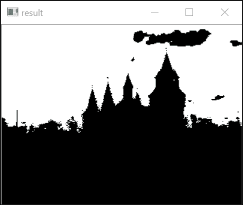

在这里，白色像素表示对所需颜色的积极检测，而黑色表示消极。

显然，我们在这个类中封装的算法相对简单（正如我们将在下一节看到的，它只由一个扫描循环和一个容差参数组成）。当要实现的算法更复杂、有多个步骤并包含多个参数时，策略设计模式变得非常强大。

## 它是如何工作的…

此算法的核心过程很容易构建。它是一个简单的扫描循环，遍历每个像素，比较其颜色与目标颜色。使用我们在上一章的*使用迭代器扫描图像*配方中学到的知识，这个循环可以写成以下形式：

```py
    // get the iterators 
    cv::Mat_<cv::Vec3b>::const_iterator it= image.begin<cv::Vec3b>(); 
    cv::Mat_<cv::Vec3b>::const_iterator itend= image.end<cv::Vec3b>(); 
    cv::Mat_<uchar>::iterator itout= result.begin<uchar>(); 

    //for each pixel 
    for ( ; it!= itend; ++it, ++itout) { 

      // compute distance from target color 
      if (getDistanceToTargetColor(*it)<=maxDist) { 
        *itout= 255; 
      } else { 
       *itout= 0; 
      } 
    } 

```

`cv::Mat`变量`image`指向输入图像，而`result`指向二值输出图像。因此，第一步是设置所需的迭代器。然后扫描循环就很容易实现了。请注意，输入图像迭代器被声明为`const`，因为它们的元素值没有被修改。对每个像素的当前像素颜色和目标颜色之间的距离进行评估，以检查它是否在由`maxDist`定义的容差参数内。如果是这样，则将值`255`（白色）分配给输出图像；如果不是，则分配`0`（黑色）。为了计算到目标颜色的距离，使用`getDistanceToTargetColor`方法。计算这个距离有不同的方法。

例如，可以计算包含 RGB 颜色值的三个向量之间的欧几里得距离。为了使这个计算简单，我们求和 RGB 值的绝对差（这也被称为**曼哈顿距离**）。请注意，在现代架构中，浮点欧几里得距离可能比简单的曼哈顿距离计算更快（此外，您还可以使用平方欧几里得距离以避免昂贵的平方根运算）；这也是您在设计时需要考虑的事情。此外，为了增加灵活性，我们以`getColorDistance`方法的形式编写了`getDistanceToTargetColor`方法，如下所示：

```py
    // Computes the distance from target color. 
    int getDistanceToTargetColor(const cv::Vec3b& color) const { 
      return getColorDistance(color, target); 
    } 
    // Computes the city-block distance between two colors. 
    int getColorDistance(const cv::Vec3b& color1,  
    const cv::Vec3b& color2) const { 
      return abs(color1[0]-color2[0])+
             abs(color1[1]-color2[1])+ 
             abs(color1[2]-color2[2]); 
    } 

```

注意我们如何使用`cv::Vec3d`来存储代表颜色 RGB 值的三个无符号字符。`target`变量显然指的是指定的目标颜色，正如我们将看到的，它被定义为我们将定义的类算法中的一个成员变量。现在，让我们完成处理方法的定义。用户将提供一个输入图像，一旦图像扫描完成，结果就会被返回：

```py
    cv::Mat ColorDetector::process(const cv::Mat &image) { 

      // re-allocate binary map if necessary 
      // same size as input image, but 1-channel 
      result.create(image.size(),CV_8U); 

      // processing loop above goes here 
      return result; 
    }

```

每次调用此方法时，都需要检查包含结果二值图的输出图像是否需要重新分配以适应输入图像的大小。这就是为什么我们使用`cv::Mat`的`create`方法。请记住，此方法只有在指定的尺寸和/或深度与当前图像结构不对应时才会进行重新分配。

现在我们已经定义了核心处理方法，让我们看看还需要添加哪些附加方法才能部署此算法。我们之前已经确定了我们的算法需要哪些输入和输出数据。因此，我们定义了将持有这些数据的类属性：

```py
    class ColorDetector {
      private: 

      // minimum acceptable distance 
      int maxDist;  
      // target color 
      cv::Vec3b target; 

      // image containing resulting binary map 
      cv::Mat result;

```

为了创建一个封装我们算法的类实例（我们将其命名为`ColorDetector`），我们需要定义一个构造函数。请记住，策略设计模式的一个目标是将算法部署尽可能简单。可以定义的最简单的构造函数是一个空的。它将创建一个处于有效状态的类算法实例。然后我们希望构造函数将所有输入参数初始化为其默认值（或通常能给出良好结果的值）。在我们的情况下，我们决定`100`的距离通常是一个可接受的容差参数。我们还设置了默认的目标颜色。我们选择黑色没有特别的原因。目的是确保我们始终以可预测和有效的输入值开始：

```py
    // empty constructor 
    // default parameter initialization here 
    ColorDetector() : maxDist(100), target(0,0,0) {} 

```

另一个选择可能是不要创建一个空的构造函数，而是强制用户在更复杂的构造函数中输入目标颜色和颜色距离：

```py
    // another constructor with target and distance 
    ColorDetector(uchar blue, uchar green, uchar red, int mxDist); 

```

到目前为止，创建我们类算法实例的用户可以立即使用有效的图像调用 process 方法并获得有效的输出。这是策略模式的一个目标，即确保算法始终使用有效的参数运行。显然，这个类的用户将想要使用他们自己的设置。这是通过为用户提供适当的获取器和设置器来实现的。让我们从 `color` 容忍度参数开始：

```py
    // Sets the color distance threshold 
    // Threshold must be positive, 
    // otherwise distance threshold is set to 0\. 
    void setColorDistanceThreshold(int distance) { 

      if (distance<0) 
        distance=0; 
        maxDist= distance; 
      } 

      // Gets the color distance threshold 
      int getColorDistanceThreshold() const { 
        return maxDist; 
      }

```

注意我们首先检查输入的有效性。再次强调，这是为了确保我们的算法永远不会在无效状态下运行。目标颜色可以以类似的方式设置，如下所示：

```py
    // Sets the color to be detected 
    void setTargetColor(uchar blue,
                        uchar green,
                        uchar red) { 
      // BGR order 
      target = cv::Vec3b(blue, green, red); 
    } 
    // Sets the color to be detected 
    void setTargetColor(cv::Vec3b color) { 
      target= color; 
    } 

    // Gets the color to be detected 
    cv::Vec3b getTargetColor() const { 
      return target; 
    } 

```

这次，有趣的是，我们为用户提供了 `setTargetColor` 方法的两种定义。在定义的第一版本中，三个颜色分量被指定为三个参数，而在第二版本中，使用 `cv::Vec3b` 来存储颜色值。再次强调，目的是为了方便使用我们的类算法。用户可以简单地选择最适合他们需求的设置器。

## 还有更多...

在这个食谱中使用的示例算法包括识别图像中颜色足够接近指定目标颜色的像素。这个计算可以以其他方式完成。有趣的是，OpenCV 函数执行类似任务以提取给定颜色的连通组件。此外，可以使用函数对象来补充实现策略设计模式。最后，OpenCV 定义了一个基类 `cv::Algorithm`，它实现了策略设计模式的概念。

### 计算两个颜色向量之间的距离

要计算两个颜色向量之间的距离，我们使用了以下简单的公式：

```py
    return abs(color[0]-target[0])+
           abs(color[1]-target[1])+
           abs(color[2]-target[2]); 

```

然而，OpenCV 包含一个用于计算向量欧几里得范数的函数。因此，我们可以按照以下方式计算我们的距离：

```py
    return static_cast<int>(
           cv::norm<int,3>(cv::Vec3i(color[0]-target[0],
                                     color[1]-target[1],
                                     color[2]-target[2]))); 

```

使用这个 `getDistance` 方法定义，可以得到一个非常相似的结果。在这里，我们使用 `cv::Vec3i`（一个整数的 3 向量数组）因为减法的结果是一个整数值。

还有趣的是，回顾一下第二章，*操作像素*，OpenCV 的矩阵和向量数据结构包括基本算术运算符的定义。因此，可以提出以下距离计算的以下定义：

```py
    return static_cast<int>( cv::norm<uchar,3>(color-target));// wrong! 

```

这个定义乍一看可能看起来是正确的；然而，它是错误的。这是因为所有这些操作始终包含对`saturate_cast`（参见前一章的*使用邻域访问扫描图像*食谱）的调用，以确保结果保持在输入类型的域内（在这里是`uchar`）。因此，当目标值大于相应的颜色值时，将分配`0`值而不是预期的负值。正确表述应该是如下：

```py
    cv::Vec3b dist; 
    cv::absdiff(color,target,dist); 
    return cv::sum(dist)[0];

```

然而，使用两次函数调用计算两个 3 向量数组的距离是不高效的。

### 使用 OpenCV 函数

在这个食谱中，我们使用带迭代器的循环来执行我们的计算。作为替代，我们也可以通过调用一系列 OpenCV 函数来达到相同的结果。颜色检测方法将如下编写：

```py
    cv::Mat ColorDetector::process(const cv::Mat &image) { 
      cv::Mat output; 
      // compute absolute difference with target color 
      cv::absdiff(image,cv::Scalar(target),output); 

      // split the channels into 3 images 
      std::vector<cv::Mat> images; 
      cv::split(output,images); 

      // add the 3 channels (saturation might occurs here) 
      output= images[0]+images[1]+images[2]; 
      // apply threshold 
      cv::threshold(output,                  // same input/output image 
                    output,   
                    maxDist,                // threshold (must be < 256) 
                    255,                    // max value 
                    cv::THRESH_BINARY_INV); // thresholding mode 

      return output; 
    }

```

此方法使用`absdiff`函数，该函数计算图像像素与标量值之间的绝对差值。除了标量值之外，还可以提供另一个图像作为此函数的第二个参数。在后一种情况下，将应用逐像素差异；因此，两个图像必须具有相同的大小。然后使用`split`函数（在第二章的*执行简单图像算术*食谱的*There's more...*部分中讨论，*操作像素*）提取差异图像的各个通道，以便能够将它们相加。需要注意的是，这个总和有时可能大于`255`，但由于总是应用饱和度，结果将被限制在`255`。结果是，在这个版本中，`maxDist`参数也必须小于`256`；如果你认为这种行为不可接受，应该进行修正。

最后一步是通过使用`cv::threshold`函数创建二值图像。这个函数通常用于将所有像素与阈值值（第三个参数）进行比较，在常规阈值模式（`cv::THRESH_BINARY`）中，它将定义的最大值（第四个参数）分配给所有大于指定阈值的像素，并将`0`分配给其他像素。在这里，我们使用了逆模式（`cv::THRESH_BINARY_INV`），其中定义的最大值被分配给值低于或等于阈值的像素。同样值得注意的是`cv::THRESH_TOZERO`和`cv::THRESH_TOZERO_INV`模式，它们将保持大于或小于阈值的像素不变。

使用 OpenCV 函数通常是一个好主意。这样，你可以快速构建复杂的应用程序，并可能减少错误数量。结果通常更高效（归功于 OpenCV 贡献者的优化努力）。然而，当执行许多中间步骤时，你可能会发现结果方法消耗了更多的内存。

### floodFill 函数

我们的`ColorDetector`类识别图像中与给定目标颜色相似的颜色像素。是否接受或拒绝像素的决定是简单地基于每个像素进行的。`cv::floodFill`函数以非常相似的方式进行，但有一个重要的区别：在这种情况下，接受像素的决定也取决于其邻居的状态。这个想法是识别一定颜色的连通区域。用户指定一个起始像素位置和确定颜色相似性的容差参数。

种子像素定义了要寻找的颜色，并且从这个种子位置开始，考虑邻居以识别相似颜色的像素；然后考虑接受邻居的邻居，依此类推。这样，可以从图像中提取出一个颜色恒定的区域。例如，为了检测示例图像中的蓝色天空区域，你可以按以下步骤进行：

```py
    cv::floodFill(image,              // input/ouput image 
           cv::Point(100, 50),        // seed point 
           cv::Scalar(255, 255, 255), // repainted color 
           (cv::Rect*)0,              // bounding rect of the repainted set 
           cv::Scalar(35, 35, 35),    // low/high difference threshold 
           cv::Scalar(35, 35, 35),    // identical most of the time  
           cv::FLOODFILL_FIXED_RANGE);// pixels compared to seed 

```

种子像素（`100`, `50`）位于天空。所有连通像素都将被测试，颜色相似的像素将被重新着色为第三个参数指定的新颜色。为了确定颜色是否相似，为高于或低于参考颜色的值独立定义了不同的阈值。在这里，我们使用了固定范围模式，这意味着测试的像素都将与种子像素的颜色进行比较。默认模式是每个测试像素与其邻居的颜色进行比较。得到的结果如下：

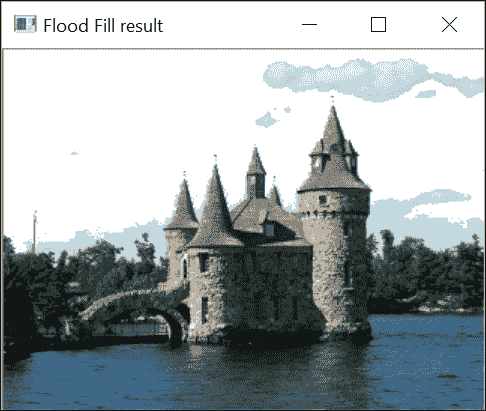

算法将单个连通区域重新着色（在这里，我们将天空涂成了白色）。因此，即使在其他地方有一些颜色相似的像素（例如水中），除非它们与天空区域连通，否则这些像素不会被识别。

### 函数对象或函数对象

使用 C++运算符重载，可以创建一个其实例表现得像函数的类。这个想法是重载`operator()`方法，使得对类处理方法的调用看起来就像一个简单的函数调用。结果类实例被称为函数对象，或**函数对象**。通常，函数对象包括一个完整的构造函数，这样它就可以在创建后立即使用。例如，你可以定义你的`ColorDetector`类的完整构造函数如下：

```py
    // full constructor 
    ColorDetector(uchar blue, uchar green, uchar red, int  maxDist=100): 
                  maxDist(maxDist) {  

      // target color 
      setTargetColor(blue, green, red); 
    } 

```

显然，你仍然可以使用之前定义的设置器和获取器。函数对象方法可以定义如下：

```py
    cv::Mat operator()(const cv::Mat &image) { 
      // color detection code here  
    } 

```

要使用这个函数方法检测给定的颜色，只需编写以下代码片段：

```py
    ColorDetector colordetector(230,190,130,  // color 
                                100);         // threshold 
    cv::Mat result= colordetector(image);     // functor call 

```

如您所见，对颜色检测方法的调用现在看起来像是一个函数调用。

### 算法的 OpenCV 基类

OpenCV 提供了许多执行各种计算机视觉任务的算法。为了便于使用，这些算法中的大多数都被制作成了名为`cv::Algorithm`的通用基类的子类。这个类实现了一些由策略设计模式指定的概念。首先，所有这些算法都是通过一个专门的静态方法动态创建的，该方法确保算法始终处于有效状态（即，对于未指定的参数具有有效的默认值）。以这些子类中的一个为例，`cv::ORB`；这是一个兴趣点算子，将在第八章中讨论的*在多个尺度上检测 FAST 特征*食谱中讨论，*检测兴趣点*。在这里，我们只是简单地将其用作算法的说明性示例。

因此，创建此算法的实例如下：

```py
    cv::Ptr<cv::ORB> ptrORB = cv::ORB::create(); // default state 

```

创建后，算法就可以使用了。例如，可以使用通用的`read`和`write`方法来加载或存储算法的状态。算法还有专门的方法（例如，对于 ORB，可以使用`detect`和`compute`方法来触发其主要计算单元）。算法还有专门的设置方法，允许指定其内部参数。请注意，我们本来可以将指针声明为`cv::Ptr<cv::Algorithm>`，但在这种情况下，我们就无法使用其专门的方法。

## 参见

+   由 A. Alexandrescu 引入的策略类设计是策略设计模式的一个有趣变体，其中算法在编译时被选择

+   *转换颜色表示*食谱介绍了感知均匀颜色空间的概念，以实现更直观的颜色比较

# 使用 GrabCut 算法分割图像

之前的食谱展示了如何利用颜色信息将图像分割成与场景特定元素相对应的区域。物体通常具有独特的颜色，这些颜色通常可以通过识别相似颜色的区域来提取。OpenCV 提出了一种图像分割流行算法的实现：**GrabCut**算法。GrabCut 是一个复杂且计算量大的算法，但它通常会产生非常准确的结果。当你想要从静态图像中提取前景对象时（例如，从一个图片中剪切并粘贴到另一个图片中），这是最好的算法。

## 如何做到这一点...

`cv::grabCut`函数易于使用。你只需要输入一个图像，并标记其中一些像素属于背景或前景。基于这种部分标记，算法将确定整个图像的前景/背景分割。

为输入图像指定部分前景/背景标记的一种方法是在其中定义一个包含前景对象的矩形：

```py
    // define bounding rectangle 
    // the pixels outside this rectangle 
    // will be labeled as background 
    cv::Rect rectangle(5,70,260,120); 

```

这在图像中定义了以下区域：

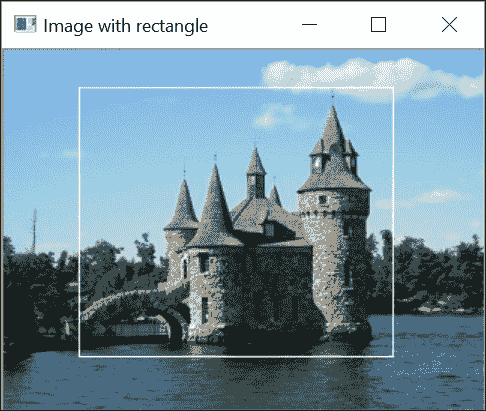

所有这个矩形以外的像素都将被标记为背景。除了输入图像及其分割图像外，调用`cv::grabCut`函数还需要定义两个矩阵，这两个矩阵将包含算法构建的模型，如下所示：

```py
    cv::Mat result;                     // segmentation (4 possible values) 
    cv::Mat bgModel,fgModel;            // the models (internally used) 
    // GrabCut segmentation    
    cv::grabCut(image,                  // input image 
                result,                 // segmentation result 
                rectangle,              // rectangle containing foreground 
                bgModel,fgModel,        // models 
                5,                      // number of iterations 
                cv::GC_INIT_WITH_RECT); // use rectangle 

```

注意我们如何指定使用`cv::GC_INIT_WITH_RECT`标志作为函数的最后一个参数来使用边界矩形模式。输入/输出分割图像可以具有以下四个值之一：

+   `cv::GC_BGD`：这是属于背景的像素的值（例如，在我们例子中的矩形外的像素）

+   `cv::GC_FGD`：这是属于前景的像素的值（在我们例子中没有这样的像素）

+   `cv::GC_PR_BGD`：这是可能属于背景的像素的值

+   `cv::GC_PR_FGD`：这是可能属于前景的像素的值（即我们例子中矩形内像素的初始值）

通过提取具有等于`cv::GC_PR_FGD`值的像素，我们得到了分割的二值图像。这是通过以下代码实现的：

```py
    // Get the pixels marked as likely foreground 
    cv::compare(result,cv::GC_PR_FGD,result,cv::CMP_EQ); 
    // Generate output image 
    cv::Mat foreground(image.size(),CV_8UC3,cv::Scalar(255,255,255)); 
    image.copyTo(foreground,// bg pixels are not copied result);

```

要提取所有前景像素，即具有等于`cv::GC_PR_FGD`或`cv::GC_FGD`值的像素，可以通过检查第一个位来检查值，如下所示：

```py
    // checking first bit with bitwise-and 
    result= result&1; // will be 1 if FG 

```

这是因为这些常量被定义为值`1`和`3`，而其他两个（`cv::GC_BGD`和`cv::GC_PR_BGD`）被定义为`0`和`2`。在我们例子中，由于分割图像不包含`cv::GC_FGD`像素（只有`cv::GC_BGD`像素被输入），因此得到了相同的结果。

然后得到以下图像：


## 它是如何工作的…

在前面的例子中，GrabCut 算法能够通过简单地指定一个包含这个对象（城堡）的矩形来提取前景对象。或者，也可以将`cv::GC_BGD`和`cv::GC_FGD`的值分配给输入图像的一些特定像素，这些像素是通过使用掩码图像作为`cv::grabCut`函数的第二个参数提供的。然后，你会指定`GC_INIT_WITH_MASK`作为输入模式标志。这些输入标签可以通过要求用户交互式标记图像的一些元素来获得。也可以将这两种输入模式结合起来。

使用此输入信息，GrabCut 算法通过以下步骤创建背景/前景分割。最初，将前景标签(`cv::GC_PR_FGD`)暂时分配给所有未标记的像素。根据当前的分类，算法将像素分组为相似颜色的簇（即，背景和前景各有`K`个簇）。下一步是通过在前景和背景像素之间引入边界来确定背景/前景分割。

这是通过一个优化过程来完成的，该过程试图连接具有相似标签的像素，并对在相对均匀强度区域放置边界施加惩罚。这个问题可以使用图割算法有效地解决，这是一种通过将其表示为应用切割以组成最优配置的连接图来找到问题最优解的方法。得到的分割为像素产生新的标签。

然后，可以重复聚类过程，再次找到新的最优分割，依此类推。因此，GrabCut 算法是一个迭代过程，逐渐改进分割结果。根据场景的复杂性，可以在更多或更少的迭代次数中找到良好的解决方案（在简单情况下，一次迭代就足够了）。

这解释了函数的参数，用户可以指定要应用的迭代次数。算法维护的两个内部模型作为函数的参数（并返回）。因此，如果希望通过执行额外的迭代来改进分割结果，可以再次使用上次运行的模型调用该函数。

## 参见

+   文章*GrabCut: Interactive Foreground Extraction using Iterated Graph Cuts*发表在*ACM Transactions on Graphics (SIGGRAPH) 第 23 卷，第 3 期，2004 年 8 月，C. Rother, V. Kolmogorov, 和 A. Blake*上，详细描述了 GrabCut 算法。

+   在第五章的*使用形态学操作变换图像*中，*使用分水岭分割图像*菜谱介绍了另一种图像分割算法。

# 转换颜色表示

RGB 颜色空间基于红色、绿色和蓝色加色原色的使用。我们在本章的第一个菜谱中看到，这些原色被选择是因为它们可以产生与人类视觉系统良好对齐的广泛颜色范围。这通常是数字图像中的默认颜色空间，因为这是获取彩色图像的方式，即通过使用红色、绿色和蓝色过滤器。此外，红色、绿色和蓝色通道被归一化，以便当以相等比例组合时，可以获得灰度强度，即从黑色`(0,0,0)`到白色`(255,255,255)`。

很遗憾，使用 RGB 颜色空间计算颜色之间的距离并不是衡量两种给定颜色相似度的最佳方式。实际上，RGB 不是一个**感知均匀的颜色空间**。这意味着在给定距离的两个颜色可能看起来非常相似，而相隔相同距离的另外两种颜色可能看起来非常不同。

为了解决这个问题，已经引入了具有感知均匀特性的其他颜色表示方法。特别是，**CIE L*a*b**是一个这样的颜色模型。通过将我们的图像转换为这种表示，图像像素与目标颜色之间的欧几里得距离将是一个衡量两种颜色视觉相似度的有意义的度量。在本菜谱中，我们将向您展示如何将颜色从一种表示转换为另一种表示，以便在其他颜色空间中工作。

## 如何做到这一点…

通过使用`cv::cvtColor` OpenCV 函数，不同颜色空间之间的图像转换可以轻松完成。让我们回顾一下本章第一道菜谱中的`ColorDetector`类，*使用策略设计模式比较颜色*。我们现在在过程方法的开始将输入图像转换为 CIE L*a*b*颜色空间：

```py
    cv::Mat ColorDetector::process(const cv::Mat &image) { 

      // re-allocate binary map if necessary 
      // same size as input image, but 1-channel 
      result.create(image.rows,image.cols,CV_8U); 

      // Converting to Lab color space  
      cv::cvtColor(image, converted, CV_BGR2Lab); 

      // get the iterators of the converted image  
      cv::Mat_<cv::Vec3b>::iterator it=  converted.begin<cv::Vec3b>(); 
      cv::Mat_<cv::Vec3b>::iterator itend= converted.end<cv::Vec3b>(); 
      // get the iterator of the output image  
      cv::Mat_<uchar>::iterator itout= result.begin<uchar>(); 

      // for each pixel 
      for ( ; it!= itend; ++it, ++itout) { 

```

`converted`变量包含颜色转换后的图像。在`ColorDetector`类中，它被定义为类属性：

```py
    class ColorDetector { 
      private: 
      // image containing color converted image 
      cv::Mat converted; 

```

你还需要转换输入的目标颜色。你可以通过创建一个只包含一个像素的临时图像来完成这个操作。请注意，你需要保持与早期菜谱中相同的签名，即用户继续以 RGB 格式提供目标颜色：

```py
    // Sets the color to be detected 
    void setTargetColor(unsigned char red, unsigned char green,
                        unsigned char blue) { 

      // Temporary 1-pixel image 
      cv::Mat tmp(1,1,CV_8UC3); 
      tmp.at<cv::Vec3b>(0,0)= cv::Vec3b(blue, green, red); 

      // Converting the target to Lab color space  
      cv::cvtColor(tmp, tmp, CV_BGR2Lab); 

      target= tmp.at<cv::Vec3b>(0,0); 
    } 

```

如果将先前的菜谱应用编译与这个修改过的类一起，它现在将使用 CIE L*a*b*颜色模型检测目标颜色的像素。

## 它是如何工作的…

当图像从一个颜色空间转换为另一个颜色空间时，会对每个输入像素应用线性或非线性变换以生成输出像素。输出图像的像素类型将与输入图像的类型相匹配。即使你大多数时候使用 8 位像素，你也可以使用浮点图像（在这种情况下，像素值通常假设在`0`和`1.0`之间变化）或整数图像（像素值通常在`0`和`65535`之间变化）进行颜色转换。然而，像素值的精确范围取决于特定的颜色空间和目标图像类型。例如，对于`CIE L*a*b*`颜色空间，表示每个像素亮度的`L`通道在`0`和`100`之间变化，在 8 位图像的情况下，它被重新缩放到`0`和`255`之间。

`a`和`b`通道对应于色度成分。这些通道包含有关像素颜色的信息，与其亮度无关。它们的值在`-127`到`127`之间变化；对于 8 位图像，将`128`添加到每个值，以便使其适合`0`到`255`区间。然而，请注意，8 位颜色转换将引入舍入误差，这将使转换不完全可逆。

大多数常用的颜色空间都可用。这只是一个向 OpenCV 函数提供正确的颜色空间转换代码的问题（对于 CIE L*a*b*，此代码为`CV_BGR2Lab`）。其中之一是 YCrCb，这是 JPEG 压缩中使用的颜色空间。要将颜色空间从 BGR 转换为 YCrCb，代码将是`CV_BGR2YCrCb`。请注意，涉及三种常规原色（红色、绿色和蓝色）的所有转换都在 RGB 和 BGR 顺序中可用。

**CIE L*u*v**颜色空间是另一个感知均匀的颜色空间。您可以使用`CV_BGR2Luv`代码将 BGR 转换为 CIE L*u*v。L*a*b*和 L*u*v*使用相同的转换公式来表示亮度通道，但使用不同的表示来表示色度通道。此外，请注意，由于这两个颜色空间为了使其感知均匀而扭曲 RGB 颜色域，这些转换是非线性的（因此，它们在计算上成本较高）。

此外，还有 CIE XYZ 颜色空间（使用`CV_BGR2XYZ`代码）。这是一个标准颜色空间，用于以设备无关的方式表示任何可感知的颜色。在计算 L*u*v 和 L*a*b 颜色空间时，XYZ 颜色空间被用作中间表示。RGB 和 XYZ 之间的转换是线性的。值得注意的是，`Y`通道对应于图像的灰度版本。

HSV 和 HLS 是有趣的颜色空间，因为它们将颜色分解为其色调和饱和度成分以及亮度或亮度成分，这是人类描述颜色的一种更自然的方式。下一配方将介绍这个颜色空间。

您还可以将彩色图像转换为灰度强度。输出将是一个单通道图像：

```py
    cv::cvtColor(color, gray, CV_BGR2Gray); 

```

也可以在相反的方向进行转换，但结果的颜色图像的三个通道将完全填充与灰度图像中相应的值。

## 参见

+   第四章中“使用直方图计数像素”的*使用均值漂移算法查找对象*配方使用 HSV 颜色空间来在图像中查找对象。

+   关于颜色空间理论有许多好的参考资料。其中之一是：*《颜色空间的结构和性质以及颜色图像的表示》，E. Dubois，Morgan and Claypool Publishers，2009*。

# 使用色调、饱和度和亮度表示颜色

在本章中，我们玩转了图像颜色。我们使用了不同的颜色空间，并试图识别具有均匀颜色的图像区域。最初考虑了 RGB 颜色空间，尽管它对于电子成像系统中的颜色捕捉和显示是有效的表示，但这种表示并不直观。确实，这不是人类思考颜色的方式；他们通常用色调、亮度或饱和度（即是否是鲜艳或柔和的颜色）来描述颜色。因此，引入了一个基于色调、饱和度和亮度的颜色空间，以帮助用户使用对他们来说更直观的属性来指定颜色。在本菜谱中，我们将探讨色调、饱和度和亮度作为描述颜色的手段。

## 如何做...

将 BGR 图像转换为另一个颜色空间是通过使用在上一节中探讨的`cv::cvtColor`函数来完成的。在这里，我们将使用`CV_BGR2HSV`转换代码：

```py
    // convert into HSV space 
    cv::Mat hsv; 
    cv::cvtColor(image, hsv, CV_BGR2HSV); 

```

我们可以使用`CV_HSV2BGR`代码回到 BGR 空间。我们可以通过将转换后的图像通道分割成三个独立的图像来可视化每个 HSV 分量，如下所示：

```py
    // split the 3 channels into 3 images 
    std::vector<cv::Mat> channels; 
    cv::split(hsv,channels); 
    // channels[0] is the Hue 
    // channels[1] is the Saturation 
    // channels[2] is the Value 

```

注意，第三个通道是颜色的值，即颜色的亮度的大致度量。由于我们正在处理 8 位图像，OpenCV 会将通道值重新缩放到`0`到`255`的范围（除了色调，它将在下一节中解释，将重新缩放到`0`到`0180`）。这非常方便，因为我们能够将这些通道作为灰度图像显示。

城堡图像的亮度通道将看起来如下：

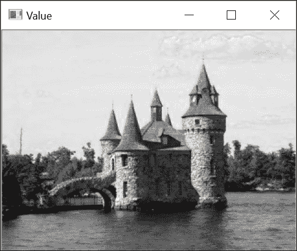

同一图像在饱和度通道中将看起来如下：

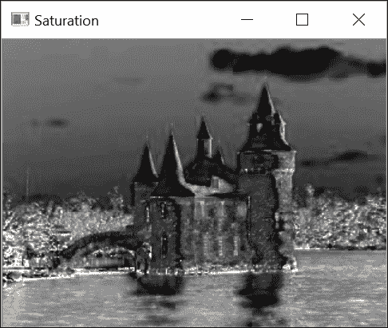

最后，带有色调通道的图像如下：

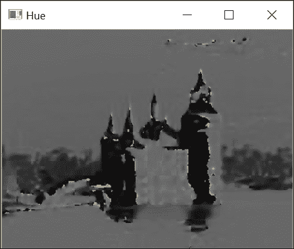

这些图像将在下一节中进行解释。

## 它是如何工作的…

引入色调/饱和度/值颜色空间是因为这种表示方式与人类自然组织颜色的方式相对应。确实，人类更喜欢用直观的属性来描述颜色，如色调、饱和度和亮度。这三个属性是大多数现象颜色空间的基础。**色调**表示主导颜色；我们给颜色起的名字（如绿色、黄色、蓝色和红色）对应于不同的色调值。**饱和度**告诉我们颜色的鲜艳程度；柔和的颜色饱和度低，而彩虹的颜色饱和度高。最后，亮度是一个主观属性，指的是颜色的亮度。其他现象颜色空间使用颜色**值**或颜色**亮度**的概念作为表征相对颜色强度的方法。

这些颜色组件试图模仿人类对颜色的直观感知。因此，它们没有标准定义。在文献中，你会找到关于色调、饱和度和亮度的不同定义和公式。OpenCV 提出了两种现象颜色空间的实现：HSV 和 HLS 颜色空间。转换公式略有不同，但它们给出非常相似的结果。

值组件可能是最容易解释的。在 OpenCV 实现的 HSV 空间中，它被定义为三个 BGR 组件的最大值。这是亮度概念的一种非常简单的实现。为了获得更符合人类视觉系统的亮度定义，你应该使用感知均匀的 L*a*b*和 L*u*v*颜色空间的 L 通道。例如，L 通道考虑了绿色颜色看起来比相同强度的蓝色颜色更亮的事实。

为了计算饱和度，OpenCV 使用基于 BGR 组件最小值和最大值的公式：

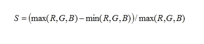

想法是，在灰度颜色中，三个 R、G 和 B 组件都相等时，将对应于完全未饱和的颜色；因此，它将有一个饱和度值为`0`。饱和度是一个介于`0`和`1.0`之间的值。对于 8 位图像，饱和度被缩放到介于`0`和`255`之间的值，并且当以灰度图像显示时，亮度区域对应于饱和度更高的颜色。

例如，从上一节的饱和度图像中可以看出，水的蓝色比天空的浅蓝色粉彩颜色饱和度更高，正如预期的那样。根据定义，不同灰度的饱和度值等于零（因为在这种情况下，所有三个 BGR 组件都相等）。这可以在城堡的不同屋顶上观察到，这些屋顶是由深灰色石头制成的。最后，在饱和度图像中，你可能已经注意到一些位于原始图像非常暗区域对应的白色斑点。这是使用饱和度定义的结果。事实上，因为饱和度只测量最大和最小 BGR 值之间的相对差异，所以像`(1,0,0)`这样的三元组给出完美的饱和度`1.0`，即使这种颜色看起来是黑色的。因此，在暗区域测量的饱和度值是不可靠的，不应予以考虑。

颜色的色调通常用一个介于 `0` 到 `360` 度之间的角度值来表示，红色在 `0` 度。在 8 位图像的情况下，OpenCV 将这个角度值除以二，以便适应 1 字节的范围。因此，每个色调值对应于一种特定的颜色色调，与其亮度和饱和度无关。例如，天空和水都有相同的色调值，大约是 `200` 度（强度，`100`），这对应于蓝色调；背景中树木的绿色色调大约是 `90` 度。需要注意的是，当评估饱和度非常低的颜色时，色调的可靠性较低。

HSB 颜色空间通常用一个圆锥体来表示，其中圆锥体内部的每一个点都对应着一种特定的颜色。角度位置对应于颜色的色调，饱和度是距离中心轴的距离，亮度由高度决定。圆锥体的尖端对应于黑色，其色调和饱和度都是未定义的：

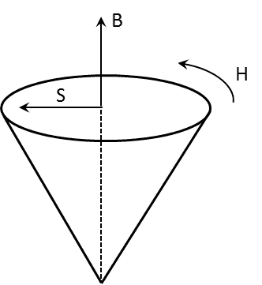

我们还可以生成一个将展示不同色调/饱和度组合的人工图像。

```py
    cv::Mat hs(128, 360, CV_8UC3);   
    for (int h = 0; h < 360; h++) { 
      for (int s = 0; s < 128; s++) { 
        hs.at<cv::Vec3b>(s, h)[0] = h/2;    // all hue angles 
        // from high saturation to low 
        hs.at<cv::Vec3b>(s, h)[1] = 255-s*2; 
        hs.at<cv::Vec3b>(s, h)[2] = 255;    // constant value 
      }       
    }

```

下一个截图的列显示了不同的可能色调（从 0 到 180），而不同的线条说明了饱和度的影响；图像的上半部分显示了完全饱和的颜色，而下半部分则对应于不饱和的颜色。所有显示的颜色都被赋予了`255`的亮度值：

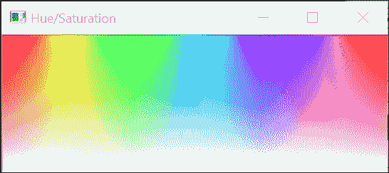

通过调整 HSV 值可以创造出有趣的效果。使用照片编辑软件可以创建出多种颜色效果，这些效果都来自于这个颜色空间。例如，你可能决定通过为图像的所有像素分配一个恒定的亮度来修改图像，而不改变色调和饱和度。这可以按以下方式完成：

```py
    // convert into HSV space 
    cv::Mat hsv; 
    cv::cvtColor(image, hsv, CV_BGR2HSV); 
    // split the 3 channels into 3 images 
    std::vector<cv::Mat> channels; 
    cv::split(hsv,channels); 
    // Value channel will be 255 for all pixels 
    channels[2]= 255; 
    // merge back the channels 
    cv::merge(channels,hsv); 
    // reconvert to BGR 
    cv::Mat newImage; 
    cv::cvtColor(hsv,newImage,CV_HSV2BGR); 

```

这给出了以下图像，现在看起来像一幅画。

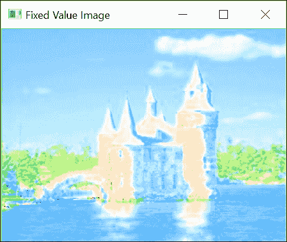

## 还有更多...

当你想寻找特定颜色的物体时，HSV 颜色空间也非常方便使用。

### 使用颜色进行检测 - 肤色检测

颜色信息对于特定物体的初始检测非常有用。例如，在驾驶辅助应用中检测路标可能依赖于标准路标的颜色，以便快速识别潜在的路标候选者。检测肤色是另一个例子，检测到的皮肤区域可以用作图像中存在人类的指示器；这种方法在手势识别中非常常用，其中肤色检测用于检测手的位置。

通常，要使用颜色检测一个对象，你首先需要收集一个包含从不同观察条件下捕获的对象的大数据库图像样本。这些将被用来定义你的分类器的参数。你还需要选择你将用于分类的颜色表示。对于肤色检测，许多研究表明，来自不同种族群体的肤色在色调/饱和度空间中聚类良好。因此，我们将简单地使用色调和饱和度值来识别以下图像中的肤色：

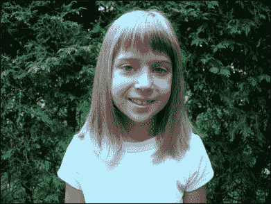

我们定义了一个函数，该函数仅基于一组值（最小和最大色调，以及最小和最大饱和度）将图像的像素分类为肤色或非肤色：

```py
    void detectHScolor(const cv::Mat& image,  // input image 
               double minHue, double maxHue,  // Hue interval 
               double minSat, double maxSat,  // saturation interval 
               cv::Mat& mask) {               // output mask 

      // convert into HSV space 
      cv::Mat hsv; 
      cv::cvtColor(image, hsv, CV_BGR2HSV); 

      // split the 3 channels into 3 images 
      std::vector<cv::Mat> channels; 
      cv::split(hsv, channels); 
      // channels[0] is the Hue 
      // channels[1] is the Saturation 
      // channels[2] is the Value 

      // Hue masking 
      cv::Mat mask1; // below maxHue 
      cv::threshold(channels[0], mask1, maxHue, 255,
                    cv::THRESH_BINARY_INV); 
      cv::Mat mask2; // over minHue 
      cv::threshold(channels[0], mask2, minHue, 255, cv::THRESH_BINARY); 

      cv::Mat hueMask; // hue mask 
      if (minHue < maxHue) 
        hueMask = mask1 & mask2; 
      else // if interval crosses the zero-degree axis 
        hueMask = mask1 | mask2; 

      // Saturation masking 
      // between minSat and maxSat 
      cv::Mat satMask; // saturation mask 
      cv::inRange(channels[1], minSat, maxSat, satMask); 

      // combined mask 
      mask = hueMask & satMask; 
    }

```

如果我们有大量肤色（和非肤色）样本，我们可以使用一种概率方法，其中将估计在肤色类别中观察到给定颜色的可能性与在非肤色类别中观察到相同颜色的可能性。在这里，我们根据经验定义了我们测试图像的可接受色调/饱和度区间（记住，色调的 8 位版本从`0`到`180`，饱和度从`0`到`255`）：

```py
    // detect skin tone 
    cv::Mat mask; 
    detectHScolor(image, 160, 10,  // hue from 320 degrees to 20 degrees  
                  25, 166,         // saturation from ~0.1 to 0.65 
                  mask); 

    // show masked image 
    cv::Mat detected(image.size(), CV_8UC3, cv::Scalar(0, 0, 0)); 
    image.copyTo(detected, mask); 

```

以下检测图像是作为结果获得的：

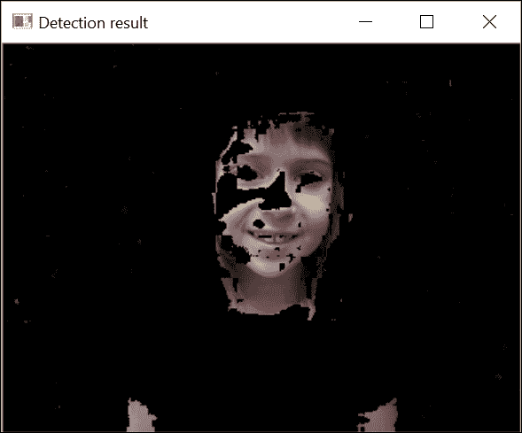

注意，为了简化，我们没有在检测中考虑颜色亮度。实际上，排除较亮的颜色会减少错误地将明亮的红色视为肤色的可能性。显然，要可靠且准确地检测肤色，需要进行更复杂的分析。同时，由于许多因素会影响摄影中的颜色渲染，如白平衡和光照条件，因此很难保证在不同图像上都能获得良好的检测效果。尽管如此，正如这里所示，使用色调/饱和度信息作为初始检测器可以给我们带来可接受的结果。

## 参考内容

+   第五章, 《使用形态学操作转换图像》展示了如何对检测得到的二值图像进行后处理

+   文章《皮肤颜色建模与检测方法综述，模式识别，第 40 卷，2007 年，作者：Kakumanu P.，Makrogiannis S.，Bourbakis N.》回顾了不同的皮肤检测方法
