# 第四章. 使用直方图计数像素

本章我们将介绍以下食谱：

+   计算图像直方图

+   应用查找表以修改图像的外观

+   平衡图像直方图

+   将直方图回投影以检测特定图像内容

+   使用均值漂移算法寻找物体

+   使用直方图比较检索相似图像

+   使用积分图像计数像素

# 简介

图像由不同值的像素（颜色）组成。图像中像素值的分布构成了该图像的重要特征。本章介绍了图像直方图的概念。您将学习如何计算直方图以及如何使用它来修改图像的外观。直方图还可以用于表征图像的内容并检测图像中的特定对象或纹理。本章将介绍一些这些技术。

# 计算图像直方图

图像由具有不同值的像素组成。例如，在 1 通道灰度图像中，每个像素都有一个介于 0（黑色）和 255（白色）之间的整数值。根据图片内容，您将在图像内部找到不同数量的每种灰度色调。

**直方图**是一个简单的表格，它给出了图像中具有给定值的像素数量（有时，是一组图像）。因此，灰度图像的直方图将有 256 个条目（或桶）。桶 0 给出了值为 0 的像素数量，桶 1 给出了值为 1 的像素数量，依此类推。显然，如果您将直方图的条目总和，您应该得到像素总数。直方图也可以归一化，使得桶的总和等于 1。在这种情况下，每个桶给出了图像中具有此特定值的像素的百分比。

## 准备工作

本章的前三个食谱将使用以下图像：

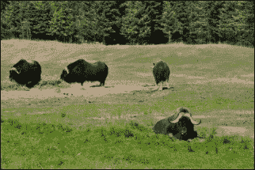

## 如何操作...

使用 OpenCV 计算直方图可以通过使用`cv::calcHist`函数轻松完成。这是一个通用函数，可以计算任何像素值类型和范围的多个通道图像的直方图。在这里，我们将通过为 1 通道灰度图像的情况专门化一个类来简化其使用。对于其他类型的图像，您始终可以直接使用`cv::calcHist`函数，它提供了您所需的所有灵活性。下一节将解释其每个参数。

目前，我们专门化类的初始化如下：

```py
    //To create histograms of gray-level images 
    class Histogram1D { 

      private: 
        int histSize[1];          // number of bins in histogram 
        float hranges[2];         // range of values 
        const float* ranges[1];   // pointer to the value ranges 
        int channels[1];          // channel number to be examined 

      public: 
      Histogram1D() { 

        // Prepare default arguments for 1D histogram 
        histSize[0]= 256;        // 256 bins 
        hranges[0]= 0.0;         // from 0 (inclusive) 
        hranges[1]= 256.0;       // to 256 (exclusive) 
        ranges[0]= hranges;  
        channels[0]= 0;          // we look at channel 0 
      }

```

使用定义的成员变量，可以通过以下方法计算灰度级直方图：

```py
    // Computes the 1D histogram. 
    cv::Mat getHistogram(const cv::Mat &image) { 

      cv::Mat hist; 
      // Compute 1D histogram with calcHist 
      cv::calcHist(&image, 1, // histogram of 1 image only 
                   channels,  // the channel used 
                   cv::Mat(), // no mask is used 
                   hist,      // the resulting histogram 
                   1,         // it is a 1D histogram 
                   histSize,  // number of bins 
                   ranges     // pixel value range 
      ); 

      return hist; 
    } 

```

现在，您的程序只需打开一个图像，创建一个`Histogram1D`实例，并调用`getHistogram`方法：

```py
    // Read input image 
    cv::Mat image= cv::imread("group.jpg", 0); // open in b&w 

    // The histogram object 
    Histogram1D h; 

    // Compute the histogram 
    cv::Mat histo= h.getHistogram(image); 

```

这里的`histo`对象是一个简单的包含`256`个条目的单维数组。因此，您可以通过简单地遍历这个数组来读取每个桶：

```py
    // Loop over each bin 
    for (int i=0; i<256; i++) 
      cout << "Value " << i << " = " 
           <<histo.at<float>(i) << endl; 

```

使用本章开头所示图像，一些显示的值如下：

```py
    Value 7 = 159 
    Value 8 = 208 
    Value 9 = 271 
    Value 10 = 288 
    Value 11 = 340 
    Value 12 = 418 
    Value 13 = 432 
    Value 14 = 472 
    Value 15 = 525 

```

显然，从这一系列值中提取任何直观意义都是困难的。因此，通常方便以函数的形式显示直方图，例如使用条形图。以下方法可以创建这样的图形：

```py
    // Computes the 1D histogram and returns an image of it. 
    cv::Mat getHistogramImage(const cv::Mat &image, int zoom=1) { 

      // Compute histogram first 
      cv::Mat hist= getHistogram(image); 
      // Creates image 
      return getImageOfHistogram(hist, zoom); 
    } 

    // Create an image representing a histogram (static method) 
    static cv::Mat getImageOfHistogram (const cv::Mat &hist, int zoom) { 
      // Get min and max bin values 
      double maxVal = 0; 
      double minVal = 0; 
      cv::minMaxLoc(hist, &minVal, &maxVal, 0, 0); 

      // get histogram size 
      int histSize = hist.rows; 

      // Square image on which to display histogram 
      cv::Mat histImg(histSize*zoom, histSize*zoom,
                      CV_8U, cv::Scalar(255)); 

      // set highest point at 90% of nbins (i.e. image height) 
      int hpt = static_cast<int>(0.9*histSize); 

      // Draw vertical line for each bin  
      for (int h = 0; h < histSize; h++) { 

        float binVal = hist.at<float>(h); 
        if (binVal>0) { 
          int intensity = static_cast<int>(binVal*hpt / maxVal); 
          cv::line(histImg, cv::Point(h*zoom, histSize*zoom),
                   cv::Point(h*zoom, (histSize - intensity)*zoom),
                   cv::Scalar(0), zoom); 
        } 
      } 

      return histImg; 
    }

```

使用`getImageOfHistogram`方法，你可以获得直方图函数的图像，该图像以条形图的形式绘制，使用线条：

```py
    //Display a histogram as an image 
    cv::namedWindow("Histogram"); 
    cv::imshow("Histogram", h.getHistogramImage(image)); 

```

结果是以下图像：

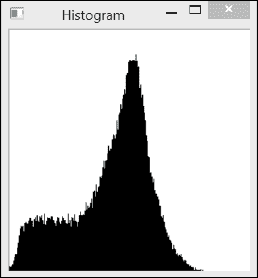

从前面的直方图可以看出，图像显示出中灰度值的大峰值和大量较暗的像素。巧合的是，这两个组主要分别对应图像的背景和前景。这可以通过在这两个组之间的过渡处对图像进行阈值处理来验证。可以使用方便的 OpenCV 函数来完成此操作，即上一章中介绍的`cv::threshold`函数。在这里，为了创建我们的二值图像，我们在直方图向高峰值增加之前的最小值处对图像进行阈值处理（灰度值`70`）：

```py
    cv::Mat thresholded;                 // output binary image 
    cv::threshold(image,thresholded,70,  // threshold value 
                  255,                   // value assigned to  
                                         // pixels over threshold value 
                  cv::THRESH_BINARY);    // thresholding type 

```

生成的二值图像清楚地显示了背景/前景分割：

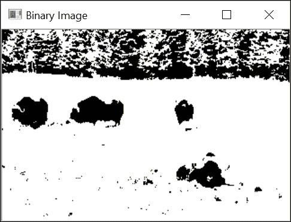

## 它是如何工作的...

`cv::calcHist`函数有许多参数，允许它在许多上下文中使用，如下所示：

```py
    void calcHist(const Mat*images, // source images 
          int nimages,          // number of source images (usually 1) 
          const int*channels,   // list the channels to be used 
          InputArray mask,      // input mask (pixels to consider) 
          OutputArray hist,     // output histogram 
          int dims,             // histogram dimension (number of channels) 
          const int*histSize,   // number of bins in each dimension 
          const float**ranges,  // range of each dimension 
          bool uniform=true,    // true if equally spaced bins 
          bool accumulate=false) // to cumulate over several calls 

```

大多数情况下，你的直方图将是一张单通道或三通道图像。然而，该函数允许你指定一个分布在多个图像（即多个`cv::Mat`）上的多通道图像。这就是为什么输入图像数组是该函数的第一个参数。第六个参数`dims`指定了直方图的维度，例如，对于一维直方图，为 1。即使你正在分析多通道图像，你也不必在直方图的计算中使用其所有`channels`。要考虑的通道列在具有指定维度的`channel`数组中。在我们的类实现中，这个单通道默认为通道`0`。直方图本身由每个维度的 bin 数量（这是整数的`histSize`数组）以及每个维度的最小（包含）和最大（不包含）值（由 2 元素数组的`ranges`数组给出）描述。还可以定义非均匀直方图（在这种情况下，第二个最后一个参数将设置为`false`），在这种情况下，你需要指定每个 bin 的界限。

与许多 OpenCV 函数一样，可以指定一个掩码，表示你想要包含在计数中的像素（掩码值为 `0` 的所有像素将被忽略）。还可以指定两个额外的参数，它们都是布尔值。第一个参数指示直方图是否均匀（默认值为 `true`）。第二个参数允许你累积多个直方图计算的结果。如果最后一个参数为 `true`，则图像的像素计数将添加到当前输入直方图中的值。当你想要计算一组图像的直方图时，这很有用。

结果直方图存储在一个 `cv::Mat` 实例中。实际上，`cv::Mat` 类可以用来操作通用的 N 维矩阵。回想一下 第二章，*操作像素*，这个类为 1、2 和 3 维矩阵定义了 `at` 方法。这就是为什么我们能够在 `getHistogramImage` 方法中访问 1D 直方图的每个分箱时编写以下代码：

```py
    float binVal = hist.at<float>(h); 

```

注意，直方图中的值以 `float` 类型存储。

## 更多内容...

本菜谱中介绍的 `Histogram1D` 类通过将其限制为 1D 直方图简化了 `cv::calcHist` 函数。这对于灰度图像很有用，但对于彩色图像呢？

### 计算彩色图像的直方图

使用相同的 `cv::calcHist` 函数，我们可以计算多通道图像的直方图。例如，一个计算彩色 BGR 图像直方图的类可以定义如下：

```py
    class ColorHistogram { 

      private: 
        int histSize[3];        // size of each dimension 
        float hranges[2];       // range of values (same for the 3 dimensions) 
        const float* ranges[3]; // ranges for each dimension 
        int channels[3];        // channel to be considered 

      public: 
      ColorHistogram() { 

        // Prepare default arguments for a color histogram 
        // each dimension has equal size and range 
        histSize[0]= histSize[1]= histSize[2]= 256; 
        hranges[0]= 0.0;    // BRG range from 0 to 256 
        hranges[1]= 256.0; 
        ranges[0]= hranges; // in this class,   
        ranges[1]= hranges; // all channels have the same range 
        ranges[2]= hranges; 
        channels[0]= 0;     // the three channels: B 
        channels[1]= 1;     // G 
        channels[2]= 2;     // R 
      }

```

在这种情况下，直方图将是三维的。因此，我们需要为三个维度中的每一个指定一个范围。在我们的 BGR 图像中，三个通道具有相同的 `[0,255]` 范围。准备好这些参数后，通过以下方法计算颜色直方图：

```py
    //Computes the histogram. 
    cv::Mat getHistogram(const cv::Mat &image) { 
      cv::Mat hist; 

      //Compute histogram 
      cv::calcHist(&image, 1,  // histogram of 1 image only 
                   channels,   // the channel used 
                   cv::Mat(),  // no mask is used 
                   hist,       // the resulting histogram 
                   3,          // it is a 3D histogram 
                   histSize,   // number of bins 
                   ranges      // pixel value range 
      ); 

      return hist; 
    }

```

返回一个三维的 `cv::Mat` 实例。当选择 `256` 个分箱的直方图时，这个矩阵有 `(256)³` 个元素，这代表超过 1600 万条记录。在许多应用中，减少直方图计算中的分箱数量会更好。也可以使用 `cv::SparseMat` 数据结构，它被设计用来表示大型稀疏矩阵（即具有非常少非零元素的矩阵），而不会消耗太多内存。`cv::calcHist` 函数有一个版本返回这样一个矩阵。因此，为了使用 `cv::SparseMatrix`，修改先前的方 法非常简单：

```py
    //Computes the histogram. 
    cv::SparseMat getSparseHistogram(const cv::Mat &image) { 

      cv::SparseMat hist(3,        // number of dimensions 
                    histSize,      // size of each dimension 
                    CV_32F); 

      //Compute histogram 
      cv::calcHist(&image, 1, // histogram of 1 image only 
                   channels,  // the channel used 
                   cv::Mat(), // no mask is used 
                   hist,      // the resulting histogram 
                   3,         // it is a 3D histogram 
                   histSize,  // number of bins 
                   ranges     // pixel value range 
      ); 
      return hist; 
    }

```

在这种情况下，直方图是三维的，这使得它更难以表示。一种可能的选项是通过显示单个 R、G 和 B 直方图来展示图像中的颜色分布。

## 参见

+   本章后面的 *将直方图反投影以检测特定图像内容* 菜单使用颜色直方图来检测特定图像内容

# 应用查找表以修改图像的外观

图像直方图捕捉了场景使用可用的像素强度值的方式。通过分析图像上像素值的分布，可以使用这些信息来修改和可能改进图像。本菜谱解释了我们可以如何使用一个简单的映射函数，即查找表，来修改图像的像素值。正如我们将看到的，查找表通常由直方图分布生成。

## 如何做...

**查找表**是一个简单的单对单（或一对多）函数，它定义了像素值如何转换成新的值。它是一个 1D 数组，在常规灰度图像的情况下，有`256`个条目。表中的条目`i`给出了相应灰度的新的强度值，其表达式如下：

```py
    newIntensity= lookup[oldIntensity]; 

```

OpenCV 中的`cv::LUT`函数将查找表应用于图像以产生一个新的图像。由于查找表通常由直方图构建，我们已将此函数添加到我们的`Histogram1D`类中：

```py
    static cv::Mat applyLookUp(const cv::Mat& image,   // input image 
                               const cv::Mat& lookup) {// 1x256 8U 
      // the output image 
      cv::Mat result; 

      // apply lookup table 
      cv::LUT(image,lookup,result); 
      return result; 
    }

```

## 如何工作...

当查找表应用于图像时，它会产生一个新的图像，其中像素强度值已根据查找表进行修改。一个简单的转换可以定义为以下：

```py
    //Create an image inversion table 
    cv::Mat lut(1,256,CV_8U); // 256x1 matrix 

    for (int i=0; i<256; i++) { 
      //0 becomes 255, 1 becomes 254, etc. 
      lut.at<uchar>(i)= 255-i; 
    } 

```

这种转换简单地反转了像素强度，即强度`0`变为`255`，`1`变为`254`，以此类推，直到`255`变为`0`。将此类查找表应用于图像将产生原始图像的负片。

在前一个菜谱中的图像，结果如下所示：

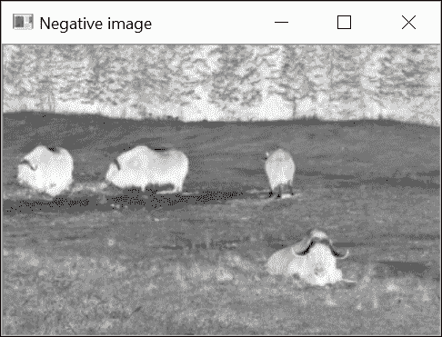

## 更多...

查找表在所有像素强度都赋予新强度值的应用中非常有用。然而，这种转换必须是全局的；也就是说，每个强度值的所有像素都必须经历相同的转换。

### 通过拉伸直方图来提高图像对比度

通过定义一个修改原始图像直方图的查找表，可以改善图像的对比度。例如，如果你观察本章第一个菜谱中显示的图像的直方图，你会注意到实际上没有像素的值高于`200`。因此，我们可以拉伸直方图以产生具有扩展对比度的图像。为此，该程序使用一个百分位数阈值来定义在拉伸图像中可以分配最小强度值（`0`）和最大强度值（`255`）的像素百分比。

因此，我们必须找到最低的（`imin`）和最高的（`imax`）强度值，以确保我们有足够的像素数位于或高于指定的百分位数。这是通过以下循环（其中`hist`是计算出的 1D 直方图）实现的：

```py
    // number of pixels in percentile 
    float number= image.total()*percentile; 

    // find left extremity of the histogram 
    int imin = 0; 
    for (float count=0.0; imin < 256; imin++) { 
      // number of pixel at imin and below must be > number 
      if ((count+=hist.at<float>(imin)) >= number) 
        break; 
    } 

    // find right extremity of the histogram 
    int imax = 255; 
    for (float count=0.0; imax >= 0; imax--) { 
      // number of pixel at imax and below must be > number 
      if ((count += hist.at<float>(imax)) >= number) 
        break; 
    }

```

强度值可以被重新映射，以便`imin`值重新定位到强度`0`，而`imax`值被分配值为`255`。中间的`i`强度值简单地线性重新映射，如下所示：

```py
    255.0*(i-imin)/(imax-imin); 

```

然后具有 1%百分位截断的拉伸图像如下所示：

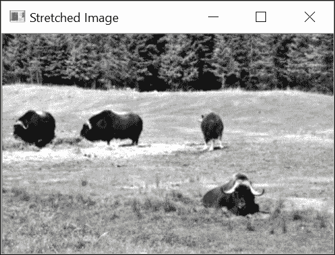

扩展后的直方图看起来如下所示：

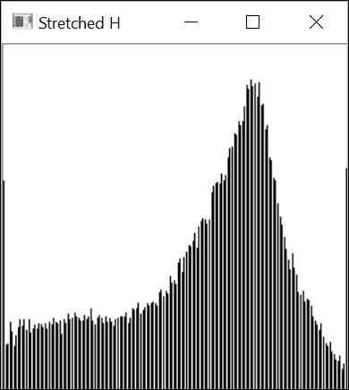

### 将查找表应用于彩色图像

在第二章，*操作像素*中，我们定义了一个颜色减少函数，该函数通过修改图像的 BGR 值来减少可能的颜色数量。我们通过遍历图像的像素并对每个像素应用颜色减少函数来实现这一点。实际上，通过预计算所有颜色减少并使用查找表修改每个像素将更加高效。这正是我们从本菜谱中学到的东西。新的颜色减少函数将如下所示：

```py
    void colorReduce(cv::Mat &image, int div=64) { 

      // creating the 1D lookup table 
      cv::Mat lookup(1,256,CV_8U); 

      // defining the color reduction lookup 
      for (int i=0; i<256; i++)  
        lookup.at<uchar>(i)= i/div*div + div/2; 

      // lookup table applied on all channels 
      cv::LUT(image,lookup,image); 
    }

```

在这里，颜色减少方案被正确应用，因为当一维查找表应用于多通道图像时，该表将单独应用于所有通道。当查找表具有多个维度时，则必须将其应用于具有相同通道数的图像。

## 参见

+   下一个菜谱，*均衡化图像直方图*，展示了另一种提高图像对比度的方法

# 均衡化图像直方图

在前面的菜谱中，我们向您展示了如何通过拉伸直方图来改善图像对比度，使其占据所有可用强度值的完整范围。这种策略确实是一种简单的解决方案，可以有效地提高图像质量。然而，在许多情况下，图像的视觉缺陷并不是它使用了过于狭窄的强度范围。

相反，是因为某些强度值的使用频率远高于其他值。本章第一道菜谱中显示的直方图是这种现象的一个很好的例子。中间灰度强度确实有很高的代表性，而较暗和较亮的像素值则相对罕见。因此，提高图像质量的一种可能方法可能是使所有可用的像素强度得到均衡使用。这正是**直方图均衡化**概念背后的想法，即尽可能使图像直方图变得平坦。

## 如何操作...

OpenCV 提供了一个易于使用的函数，用于执行直方图均衡化。它的调用方式如下：

```py
    cv::equalizeHist(image,result); 

```

在我们的图像上应用它之后，得到以下图像：

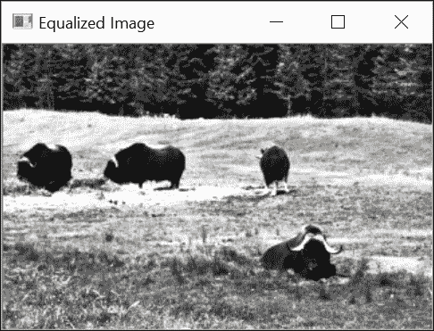

这个均衡化图像具有以下直方图：

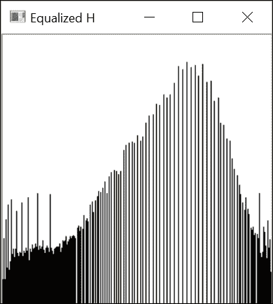

当然，直方图不可能完全平坦，因为查找表是一个全局的多对一转换。然而，可以看出，直方图的一般分布现在比原始的更均匀。

## 它是如何工作的...

在一个完全均匀的直方图中，所有桶都将具有相同数量的像素。这意味着 50%的像素应该具有低于 `128`（中值强度值）的强度，25%应该具有低于 `64` 的强度，依此类推。这个观察结果可以用以下规则表示：在一个均匀的直方图中，`p%` 的像素必须具有低于或等于 `255*p%` 的强度值。均衡直方图的规则是，强度 `i` 的映射应该对应于具有低于 `i` 的强度值的像素百分比。因此，所需的查找表可以从以下方程式构建：

```py
    lookup.at<uchar>(i)= static_cast<uchar>(255.0*p[i]/image.total()); 

```

在这里，`p[i]` 是强度低于或等于 `i` 的像素数量。`p[i]` 函数通常被称为累积直方图，也就是说，它是一个包含低于或等于给定强度的像素计数的直方图，而不是包含具有特定强度值的像素计数。回想一下，`image.total()` 返回图像中的像素数量，所以 `p[i]/image.total()` 是像素的百分比。

通常，直方图均衡化大大改善了图像的外观。然而，根据视觉内容的不同，结果的质量可能因图像而异。

# 使用直方图反向投影检测特定图像内容

直方图是图像内容的一个重要特征。如果你观察一个显示特定纹理或特定对象的图像区域，那么这个区域的直方图可以看作是一个函数，它给出了给定像素属于这个特定纹理或对象的概率。在这个菜谱中，你将学习如何有利地使用**直方图反向投影**的概念来检测特定的图像内容。

## 如何做...

假设你有一个图像，并且你希望在图像中检测特定的内容（例如，在以下图像中，天空中的云）。首先要做的事情是选择一个包含你正在寻找的样本的兴趣区域。这个区域就是以下测试图像中画出的矩形内的区域：

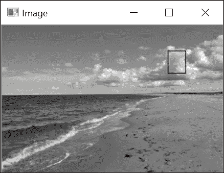

在我们的程序中，感兴趣的区域是通过以下方式获得的：

```py
    cv::Mat imageROI; 
    imageROI= image(cv::Rect(216,33,24,30)); // Cloud region 

```

然后你提取这个感兴趣区域（ROI）的直方图。这可以通过使用本章第一道菜谱中定义的 `Histogram1D` 类轻松完成，如下所示：

```py
    Histogram1D h; 
    cv::Mat hist= h.getHistogram(imageROI); 

```

通过归一化这个直方图，我们得到一个函数，它给出了给定强度值的像素属于定义区域的概率，如下所示：

```py
    cv::normalize(histogram,histogram,1.0); 

```

反向投影直方图包括将输入图像中的每个像素值替换为其在归一化直方图中读取的对应概率值。OpenCV 函数按以下方式执行此任务：

```py
    cv::calcBackProject(&image,
             1,          // one image 
             channels,   // the channels used,  
                         // based on histogram dimension 
             histogram,  // the histogram we are backprojecting 
             result,     // the resulting back projection image 
             ranges,     // the ranges of values 
             255.0       // the scaling factor is chosen  
                         // such that a probability value of 1 maps to 255 
    ); 

```

`result` 是以下概率图。为了提高可读性，我们显示 `result` 图像的负值，属于参考区域的概率从亮（低概率）到暗（高概率）：

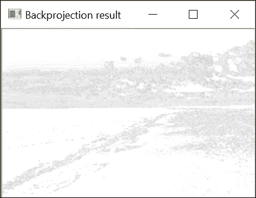

如果我们对这张图像应用阈值，我们就能获得最可能的云像素：

```py
    cv::threshold(result, result, threshold, 255, cv::THRESH_BINARY); 

```

结果如下截图所示：

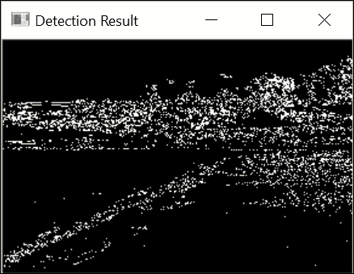

## 它是如何工作的...

前面的结果令人失望，因为除了云层外，其他区域也被错误地检测到了。重要的是要理解，概率函数是从简单的灰度直方图中提取出来的。图像中许多其他像素与云像素具有相同的强度，并且在反向投影直方图时，相同强度的像素被替换为相同的概率值。为了提高检测结果，一个解决方案是使用颜色信息。然而，为了做到这一点，我们需要修改对 `cv::calBackProject` 的调用。这将在 *还有更多...* 部分中解释。

`cv::calBackProject` 函数与 `cv::calcHist` 函数类似。与像素相关联的值指的是一个（可能的多维）直方图的某个 bin。但与增加 bin 计数不同，`cv::calBackProject` 函数将读取该 bin 中的值分配给输出反向投影图像中的相应像素。此函数的第一个参数指定输入图像（大多数情况下，只有一个）。然后你需要列出你希望使用的通道号。传递给函数的直方图这次是一个输入参数；其维度应与通道列表数组相匹配。与 `cv::calcHist` 类似，范围参数指定输入直方图的 bin 边界，形式为一个 float 数组的数组，每个数组指定每个通道的范围（最小值和最大值）。

结果输出是一个包含计算出的概率图的图像。由于每个像素都被替换为在对应 bin 位置读取的直方图中的值，因此结果图像的值在 `0.0` 和 `1.0` 之间（假设已提供归一化直方图作为输入）。最后一个参数允许你选择性地通过乘以给定因子来重新缩放这些值。

## 还有更多...

现在我们来看一下我们如何使用直方图反向投影算法中的颜色信息。

### 反向投影颜色直方图

多维直方图也可以反向投影到图像上。让我们定义一个封装反向投影过程的类。我们首先定义所需的属性并初始化数据如下：

```py
    class ContentFinder { 
      private: 
        // histogram parameters 
        float hranges[2]; 
        const float* ranges[3]; 
        int channels[3]; 
        float threshold;         // decision threshold 
        cv::Mat histogram;       // input histogram  

      public: 
      ContentFinder() : threshold(0.1f) { 
        // in this class, all channels have the same range 
        ranges[0]= hranges;   
        ranges[1]= hranges;  
        ranges[2]= hranges;  
      }

```

引入了一个`threshold`属性，用于创建显示检测结果的二值图。如果此参数设置为负值，将返回原始概率图。输入直方图已归一化（这虽然是可选的），如下所示：

```py
    // Sets the reference histogram 
    void setHistogram(const cv::Mat& h) { 
      histogram= h; 
      cv::normalize(histogram,histogram,1.0); 
    }

```

要进行直方图反向投影，您只需指定图像、范围（我们在这里假设所有通道的范围相同），以及使用的通道列表。`find`方法执行反向投影。此方法有两种版本；第一个使用图像的三个通道的版本调用更通用的版本：

```py
    // Simplified version in which 
    // all channels used, with range [0,256[ by default 
    cv::Mat find(const cv::Mat& image) { 

      cv::Mat result; 
      hranges[0]= 0.0;   // default range [0,256[hranges[1]= 256.0; 
      channels[0]= 0;    // the three channels  
      channels[1]= 1;  
      channels[2]= 2;  
      return find(image, hranges[0], hranges[1], channels); 
    } 

    // Finds the pixels belonging to the histogram 
    cv::Mat find(const cv::Mat& image, float minValue, float maxValue,
                 int *channels) { 

      cv::Mat result; 
      hranges[0]= minValue; 
      hranges[1]= maxValue; 
      // histogram dim matches channel list 
      for (int i=0; i<histogram.dims; i++) 
        this->channels[i]= channels[i]; 

      cv::calcBackProject(&image, 1, // we only use one image  
                  channels,    // channels used  
                  histogram,   // the histogram we are using 
                  result,      // the back projection image 
                  ranges,      // the range of values, 
                               // for each dimension 
                  255.0        //the scaling factor is chosen such  
                               //that a histogram value of 1 maps to 255 
      ); 
    } 

    // Threshold back projection to obtain a binary image 
    if (threshold>0.0) 
      cv::threshold(result, result, 255.0*threshold,
                    255.0, cv::THRESH_BINARY); 

      return result; 
    } 

```

现在，让我们使用之前使用的图像的颜色版本的 BGR 直方图（查看书籍网站以查看此图像的颜色）。这次，我们将尝试检测蓝色天空区域。我们首先加载彩色图像，定义感兴趣的区域，并在减少的颜色空间上计算 3D 直方图，如下所示：

```py
    // Load color image 
    ColorHistogram hc; 
    cv::Mat color= cv::imread("waves.jpg"); 

    // extract region of interest 
    imageROI= color(cv::Rect(0,0,100,45)); // blue sky area 

    // Get 3D color histogram (8 bins per channel) 
    hc.setSize(8); // 8x8x8 
    cv::Mat shist= hc.getHistogram(imageROI); 

```

接下来，您计算直方图并使用`find`方法检测图像的天空部分，如下所示：

```py
    // Create the content finder 
    ContentFinder finder; 
    // set histogram to be back-projected 
    finder.setHistogram(shist); 
    finder.setThreshold(0.05f); 

    // Get back-projection of color histogram 
    Cv::Mat result= finder.find(color); 

```

上一个章节中图像颜色版本的检测结果如下：

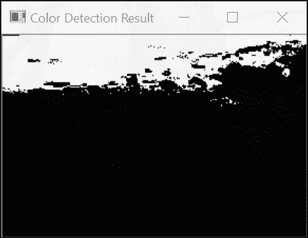

BGR 颜色空间通常不是在图像中识别颜色对象的最佳选择。在这里，为了使其更加可靠，我们在计算直方图之前减少了颜色的数量（记住，原始的 BGR 空间包含超过 1600 万种颜色）。提取的直方图代表了天空区域的典型颜色分布。尝试将其投影到另一张图像上。它也应该检测到天空部分。请注意，使用由多个天空图像构建的直方图可以提高这种检测的准确性。

在这种情况下，从内存使用角度来看，计算稀疏直方图会更好。您应该能够使用`cv::SparseMat`重做这个练习。此外，如果您正在寻找颜色鲜艳的对象，使用 HSV 颜色空间的色调通道可能会更有效。在其他情况下，使用感知均匀空间（如 L*a*b*）的色度分量可能是一个更好的选择。

## 参见

+   *使用均值漂移算法寻找对象*配方使用 HSV 颜色空间在图像中检测对象。这是您可以在某些图像内容检测中使用的许多替代解决方案之一。

+   第三章的最后两个配方，*处理图像的颜色*，讨论了您可以使用直方图反向投影的不同颜色空间。

# 使用均值漂移算法寻找对象

直方图反向投影的结果是一个概率图，表示给定图像内容在特定图像位置被找到的概率。假设我们现在知道图像中一个物体的近似位置；概率图可以用来找到物体的确切位置。最可能的位置将是最大化给定窗口内该概率的位置。因此，如果我们从一个初始位置开始，并迭代地移动以尝试增加局部概率度量，应该可以找到物体的确切位置。这正是**均值漂移算法**所实现的。

## 如何做...

假设我们在这里识别了一个感兴趣的物体，即狒狒的脸，如下面的图像所示：

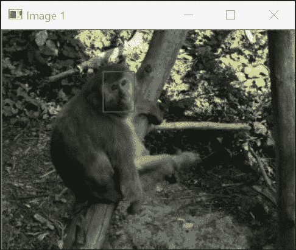

这次，我们将使用 HSV 颜色空间的色调通道来描述这个对象。这意味着我们需要将图像转换为 HSV 图像，然后提取色调通道并计算定义的 ROI 的 1D 色调直方图。参考以下代码：

```py
    // Read reference image 
    cv::Mat image= cv::imread("baboon01.jpg"); 
    // Baboon's face ROI 
    cv::Rect rect(110, 45, 35, 45); 
    cv::Mat imageROI= image(rect); 
    // Get the Hue histogram of baboon's face 
    int minSat=65; 
    ColorHistogram hc; 
    cv::Mat colorhist= hc.getHueHistogram(imageROI,minSat); 

```

如所示，色调直方图是通过我们添加到`ColorHistogram`类中的一个便捷方法获得的：

```py
    // Computes the 1D Hue histogram  
    // BGR source image is converted to HSV 
    // Pixels with low saturation are ignored 
    cv::Mat getHueHistogram(const cv::Mat &image, int minSaturation=0) { 

      cv::Mat hist; 

      // Convert to HSV colour space 
      cv::Mat hsv; 
      cv::cvtColor(image, hsv, CV_BGR2HSV); 

      // Mask to be used (or not) 
      cv::Mat mask; 
      // creating the mask if required 
      if (minSaturation>0) { 

        // Spliting the 3 channels into 3 images 
        std::vector<cv::Mat> v; 
        cv::split(hsv,v); 

        // Mask out the low saturated pixels 
        cv::threshold(v[1],mask,minSaturation,
                      255, cv::THRESH_BINARY); 
      } 

      //Prepare arguments for a 1D hue histogram 
      hranges[0]= 0.0;    // range is from 0 to 180 
      hranges[1]= 180.0; 
      channels[0]= 0;     // the hue channel  

      //Compute histogram 
      cv::calcHist(&hsv, 1,  // histogram of 1 image only 
                   channels, //the channel used 
                   mask,     //binary mask 
                   hist,     //the resulting histogram 
                   1,        //it is a 1D histogram 
                   histSize, //number of bins 
                   ranges    //pixel value range 
      ); 

      return hist; 
    } 

```

结果直方图随后传递到我们的`ContentFinder`类实例，如下所示：

```py
    ContentFinder finder; 
    finder.setHistogram(colorhist); 

```

现在我们打开第二张图像，我们想要定位新的狒狒脸位置。这张图像首先需要转换为 HSV 空间，然后我们反向投影第一张图像的直方图。参考以下代码：

```py
    image= cv::imread("baboon3.jpg"); 
    // Convert to HSV space 
    cv::cvtColor(image, hsv, CV_BGR2HSV); 
    // Get back-projection of hue histogram 
    int ch[1]={0}; 
    finder.setThreshold(-1.0f); // no thresholding 
    cv::Mat result= finder.find(hsv,0.0f,180.0f,ch); 

```

现在，从一个初始矩形区域（即初始图像中狒狒脸的位置），OpenCV 的`cv::meanShift`算法将更新`rect`对象到新的狒狒脸位置，如下所示：

```py
    // initial window position 
    cv::Rect rect(110,260,35,40); 

    // search object with mean shift 
    cv::TermCriteria criteria( 
               cv::TermCriteria::MAX_ITER | cv::TermCriteria::EPS,  
               10, // iterate max 10 times 
               1); // or until the change in centroid position is less than 1px 
    cv::meanShift(result,rect,criteria); 

```

这里显示了初始（红色）和新的（绿色）脸部位置：

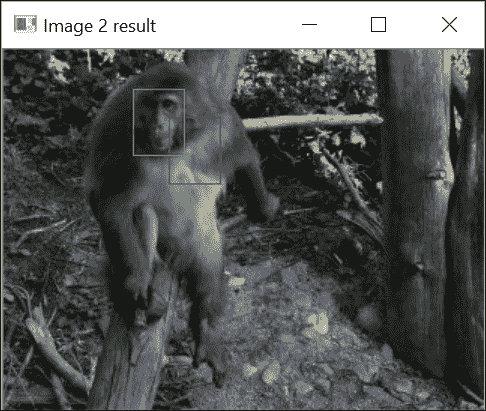

## 它是如何工作的...

在这个例子中，我们使用了 HSV 颜色空间的色调分量来描述我们正在寻找的对象。我们做出这个选择是因为狒狒的脸有一种非常独特的粉红色；因此，像素的色调应该使脸部容易识别。因此，第一步是将图像转换为 HSV 颜色空间。当使用`CV_BGR2HSV`标志时，色调分量是结果图像的第一个通道。这是一个从`0`到`180`（使用`cv::cvtColor`转换的图像与源图像类型相同）的 8 位分量。为了提取色调图像，使用`cv::split`函数将 3 通道 HSV 图像分割成三个 1 通道图像。这三个图像被插入到一个`std::vector`实例中，色调图像是向量的第一个条目（即索引`0`）。

当使用颜色的色调分量时，始终需要考虑其饱和度（这是向量的第二个元素）。确实，当颜色的饱和度低时，色调信息变得不稳定和不可靠。这是由于对于低饱和度颜色，B、G 和 R 分量几乎相等。这使得很难确定所表示的确切颜色。因此，我们决定忽略低饱和度颜色的色调分量。也就是说，它们不计入直方图（使用`minSat`参数，在`getHueHistogram`方法中屏蔽掉饱和度低于此阈值的像素）。

均值漂移算法是一种迭代过程，用于定位概率函数的局部极大值。它是通过找到预定义窗口内数据点的质心，或加权平均值来实现的。然后，算法将窗口中心移动到质心位置，并重复此过程，直到窗口中心收敛到一个稳定点。OpenCV 实现定义了两个停止标准：最大迭代次数（`MAX_ITER`）和窗口中心位移值，低于此值的位移认为位置已经收敛到一个稳定点（`EPS`）。这两个标准存储在`cv::TermCriteria`实例中。`cv::meanShift`函数返回已执行的迭代次数。显然，结果的质量取决于在给定初始位置提供的概率图的质量。注意，在这里，我们使用颜色直方图来表示图像的外观；也可以使用其他特征的直方图来表示对象（例如，边缘方向的直方图）。

## 参见

+   均值漂移算法已被广泛用于视觉跟踪。第十三章，《跟踪视觉运动》，将更详细地探讨对象跟踪的问题。

+   均值漂移算法在文章《均值漂移：一种稳健的特征空间分析方法》中被介绍，该文章由 D. Comaniciu 和 P. Meer 撰写，发表在《IEEE Transactions on Pattern Analysis and Machine Intelligence》杂志第 24 卷第 5 期，2002 年 5 月。

+   OpenCV 还提供了一个**CamShift**算法的实现，这是均值漂移算法的改进版本，其中窗口的大小和方向可以改变。

# 使用直方图比较检索相似图像

基于内容的图像检索是计算机视觉中的一个重要问题。它包括找到一组图像，这些图像呈现的内容与给定的查询图像相似。由于我们已经了解到直方图是表征图像内容的一种有效方式，因此认为它们可以用来解决**基于内容**的图像**检索**问题。

关键在于能够通过简单地比较它们的直方图来测量两张图像之间的相似度。一个测量函数将需要定义，以估计两个直方图有多不同，或者有多相似。过去已经提出了各种这样的度量，OpenCV 在其`cv::compareHist`函数的实现中提出了一些。

## 如何操作...

为了将参考图像与一系列图像进行比较，并找到与查询图像最相似的图像，我们创建了一个`ImageComparator`类。这个类包含一个查询图像和一个输入图像的引用，以及它们的直方图。此外，由于我们将使用颜色直方图进行比较，我们在`ImageComparator`类内部使用了`ColorHistogram`类：

```py
    class ImageComparator { 

      private: 

      cv::Mat refH;         // reference histogram 
      cv::Mat inputH;       // histogram of input image 

      ColorHistogram hist;  // to generate the histograms 
      int nBins;           // number of bins used in each color channel 

      public: 
      ImageComparator() :nBins(8) { 

      } 

```

为了获得可靠的相似度度量，直方图应该在减少的 bins 数量上计算。因此，这个类允许你指定每个 BGR 通道中使用的 bins 数量。查询图像通过一个适当的 setter 指定，该 setter 还会计算参考直方图，如下所示：

```py
    // set and compute histogram of reference image 
    void setReferenceImage(const cv::Mat& image) { 

      hist.setSize(nBins); 
      refH= hist.getHistogram(image); 
    } 

```

最后，一个`compare`方法比较参考图像与给定的输入图像。以下方法返回一个分数，表示两个图像的相似度：

```py
    // compare the images using their BGR histograms 
    double compare(const cv::Mat& image) { 

      inputH= hist.getHistogram(image); 

      // histogram comparison using intersection 
      return cv::compareHist(refH,inputH, cv::HISTCMP_INTERSECT); 
    } 

```

前面的类可以用来检索与给定查询图像相似的图像。以下是如何将参考图像提供给类实例：

```py
    ImageComparator c; 
    c.setReferenceImage(image); 

```

在这里，我们使用的查询图像是本章前面在*将直方图反投影以检测特定图像内容*食谱中显示的海滩图像的颜色版本。这幅图像与以下一系列图像进行了比较。图像按从最相似到最不相似的顺序显示：

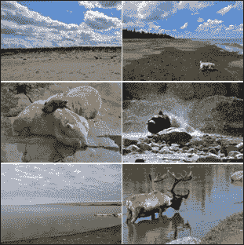

## 工作原理...

大多数直方图比较度量都是基于 bin-by-bin 的比较。这就是为什么在测量两个颜色直方图的相似度时，与一个减少的直方图一起工作很重要，该直方图会将相邻的颜色组合到同一个 bin 中。调用`cv::compareHist`很简单。你只需输入两个直方图，函数就会返回测量的距离。你想要使用的特定测量方法通过一个标志来指定。在`ImageComparator`类中，使用的是交集方法（使用`cv::HISTCMP_INTERSECT`标志）。这种方法简单地比较每个 bin 中每个直方图的两个值，并保留最小的一个。相似度度量，然后，是这些最小值的总和。因此，两个没有共同颜色的直方图的图像将得到一个交集值为`0`，而两个相同的直方图将得到一个等于总像素数的值。

其他可用的方法包括卡方度量（`cv::HISTCMP_CHISQR`标志），它计算桶之间归一化平方差的和；相关方法（`cv::HISTCMP_CORREL`标志），它基于在信号处理中用于测量两个信号之间相似性的归一化互相关算子；以及 Bhattacharyya 度量（`cv::HISTCMP_BHATTACHARYYA`标志）和 Kullback-Leibler 散度（`cv::HISTCMP_KL_DIV`标志），两者都用于统计学中估计两个概率分布之间的相似性。

## 参见

+   OpenCV 文档提供了不同直方图比较度量中使用的确切公式的描述。

+   地球迁移距离是另一种流行的直方图比较方法。它在 OpenCV 中作为`cv::EMD`函数实现。这种方法的主要优点是它考虑了相邻桶中找到的值来评估两个直方图的相似性。它由 Y. Rubner、C. Tomasi 和 L. J. Guibas 在《国际计算机视觉杂志》第 40 卷第 2 期，2000 年，第 99-121 页的论文《The Earth Mover's Distance as a Metric for Image Retrieval》中描述。

# 使用积分图像计数像素

在之前的食谱中，我们了解到直方图是通过遍历图像中的所有像素并累计每个强度值在此图像中出现的频率来计算的。我们还看到，有时我们只对在图像的某个特定区域内计算我们的直方图感兴趣。实际上，在图像的子区域内累计像素总和是许多计算机视觉算法中的常见任务。现在，假设你必须在图像中多个感兴趣区域内计算多个这样的直方图。所有这些计算可能会迅速变得非常昂贵。在这种情况下，有一个工具可以极大地提高在图像子区域内计数像素的效率：积分图像。

积分图像被引入作为一种在图像感兴趣区域中求和像素的高效方法。它们在涉及例如在多个尺度上滑动窗口的计算的应用中得到了广泛的应用。

本食谱将解释积分图像背后的原理。我们的目标是展示如何仅使用三个算术运算来对矩形区域内的像素进行求和。一旦我们掌握了这个概念，本食谱的“还有更多...”部分将展示两个例子，说明积分图像如何被有利地使用。

## 如何做到...

本食谱将使用以下图片进行操作，其中识别出一个感兴趣的区域，显示一个女孩骑自行车：

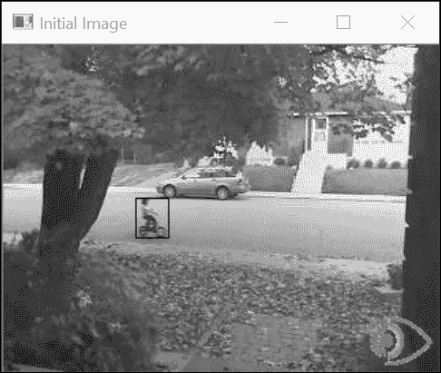

当你需要对多个图像区域内的像素进行求和时，积分图像非常有用。通常情况下，如果你希望获取感兴趣区域内所有像素的总和，你会编写以下代码：

```py
    // Open image 
    cv::Mat image= cv::imread("bike55.bmp",0); 
    // define image roi (here the girl on bike) 
    int xo=97, yo=112; 
    int width=25, height=30; 
    cv::Mat roi(image,cv::Rect(xo,yo,width,height)); 
    // compute sum 
    // returns a Scalar to work with multi-channel images 
    cv::Scalar sum= cv::sum(roi); 

```

`cv::sum` 函数简单地遍历该区域的全部像素并累加总和。使用积分图像，这可以通过仅使用三次加法操作来实现。然而，首先你需要计算积分图像，如下所示：

```py
      // compute integral image 
      cv::Mat integralImage; 
      cv::integral(image,integralImage,CV_32S); 

```

如下一节所述，可以通过在计算出的积分图像上使用这个简单的算术表达式获得相同的结果，如下所示：

```py
    // get sum over an area using three additions/subtractions 
    int sumInt= integralImage.at<int>(yo+height,xo+width)- 
                integralImage.at<int>(yo+height,xo)- 
                integralImage.at<int>(yo,xo+width)+ 
                integralImage.at<int>(yo,xo); 

```

这两种方法都会给出相同的结果。然而，计算积分图像是昂贵的，因为你必须遍历所有图像像素。关键是，一旦完成这个初始计算，你只需要添加四个值就可以得到对感兴趣区域的求和，无论这个区域的大小如何。因此，当需要计算多个不同大小区域的多个像素总和时，积分图像的使用就变得有利。

## 它是如何工作的...

在上一节中，你通过一个简要的演示介绍了积分图像的概念，展示了其背后的魔法，即它们如何被用来以低成本计算矩形区域内的像素总和。为了理解它们是如何工作的，现在让我们定义什么是积分图像。积分图像是通过将每个像素替换为位于由该像素所围成的左上象限内所有像素的总和来获得的。积分图像可以通过扫描图像一次来计算。确实，当前像素的积分值是由当前像素上方的像素的积分值加上当前行的累积和的值。因此，积分图像是一个包含像素总和的新图像。为了避免溢出，这个图像通常是一个 `int` 值的图像（`CV_32S`）或 `float` 值的图像（`CV_32F`）。

例如，在下面的图中，这个积分图像中的像素 **A** 将包含包含在上左角区域内的像素总和，该区域用双虚线图案标识：

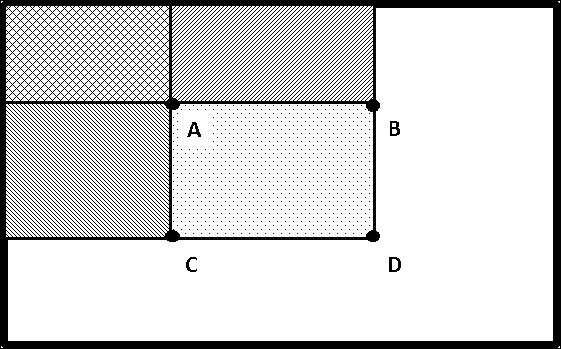

一旦计算出了积分图像，任何对矩形区域的求和都可以通过四次像素访问轻松获得，原因如下。参考前面的图示，我们可以看到，像素 **A**、**B**、**C** 和 **D** 所围区域的像素总和可以通过读取像素 **D** 的积分值来获得，然后从这个值中减去像素 **B** 和 **C** 左侧的像素值。然而，这样做会减去 **A** 的左上角像素总和的两倍；这就是为什么你必须重新加上 **A** 的积分和。形式上，**A**、**B**、**C** 和 **D** 内部像素的总和由 `A-B-C+D` 给出。如果我们使用 `cv::Mat` 方法来访问像素值，这个公式可以转换为以下形式：

```py
    // window at (xo,yo) of size width by height 
    return (integralImage.at<cv::Vec<T,N>>(yo+height,xo+width)- 
            integralImage.at<cv::Vec<T,N>>(yo+height,xo)- 
            integralImage.at<cv::Vec<T,N>>(yo,xo+width)+ 
            integralImage.at<cv::Vec<T,N>>(yo,xo)); 

```

因此，这种计算的复杂度是常数，无论感兴趣的区域大小如何。请注意，为了简单起见，我们使用了`cv::Mat`类的`at`方法，这不是访问像素值最有效的方法（参见第二章，*操作像素*）。这个问题将在本食谱的“更多内容...”部分进行讨论，该部分介绍了两个受益于积分图像概念效率的应用。

## 更多内容...

当必须执行多个像素求和时，会使用积分图像。在本节中，我们将通过介绍自适应阈值化的概念来说明积分图像的使用。积分图像对于在多个窗口上高效计算直方图也非常有用。这一点在本节中也有解释。

### 自适应阈值化

为了创建二值图像并对图像中的有意义元素进行提取，对图像应用阈值可能是一个好方法。假设你有一张书的以下图像：

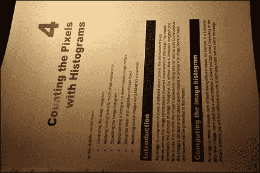

由于你对分析图像中的文本感兴趣，你将按照以下方式对这张图像应用阈值：

```py
    // using a fixed threshold  
    cv::Mat binaryFixed; 
    cv::threshold(image,binaryFixed,70,255,cv::THRESH_BINARY); 

```

你会得到以下结果：

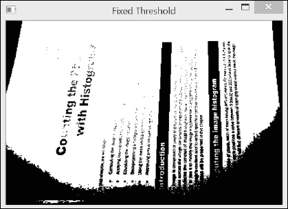

事实上，无论你选择什么阈值值，在图像的某些部分你会得到缺失的文本，而在其他部分，文本则被阴影所掩盖。为了克服这个问题，一个可能的解决方案是使用从每个像素的邻域计算出的局部阈值。这种策略被称为**自适应阈值化**，它包括将每个像素与相邻像素的均值进行比较。然后，与局部均值明显不同的像素将被视为异常值，并通过阈值化过程被截断。

因此，自适应阈值化需要计算每个像素周围的局部均值。这需要通过积分图像高效地计算多个图像窗口的求和。因此，第一步是计算以下积分图像：

```py
    // compute integral image 
    cv::Mat iimage; 
    cv::integral(image,iimage,CV_32S); 

```

现在我们可以遍历所有像素，并在一个正方形邻域内计算均值。我们可以使用我们的`IntegralImage`类来做这件事，但这个类使用效率低下的`at`方法来访问像素。这次，让我们通过使用指针遍历图像来提高效率，正如我们在第二章，*操作像素*中学习的那样。这个循环看起来如下所示：

```py
    int blockSize= 21;  // size of the neighborhood 
    int threshold=10;   // pixel will be compared 
                        // to (mean-threshold) 

    // for each row 
    int halfSize= blockSize/2; 
    for (int j=halfSize; j<nl-halfSize-1; j++) { 

      // get the address of row j 
      uchar* data= binary.ptr<uchar>(j); 
      int* idata1= iimage.ptr<int>(j-halfSize); 
      int* idata2= iimage.ptr<int>(j+halfSize+1); 

      // for each pixel of a line 
      for (int i=halfSize; i<nc-halfSize-1; i++) { 

        // compute sum 
        int sum= (idata2[i+halfSize+1]-data2[i-halfSize]-  
                  idata1[i+halfSize+1]+idata1[i-halfSize]) 
                                      /(blockSize*blockSize); 

        // apply adaptive threshold 
        if (data[i]<(sum-threshold)) 
          data[i]= 0; 
        else 
          data[i]=255; 
      } 
    } 

```

在本例中，使用了一个大小为 `21x21` 的邻域。为了计算每个均值，我们需要访问界定正方形邻域的四个整数像素：两个位于由 `idata1` 指向的线上，另外两个位于由 `idata2` 指向的线上。当前像素与计算出的均值进行比较，然后从中减去一个阈值值（此处设置为 `10`）；这是为了确保被拒绝的像素与它们的局部均值明显不同。随后得到以下二值图像：

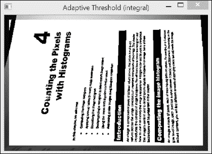

显然，这比我们使用固定阈值得到的结果要好得多。自适应阈值是一种常见的图像处理技术。因此，它也被 OpenCV 如下实现：

```py
    cv::adaptiveThreshold(image,        // input image 
            binaryAdaptive,             // output binary image 
            255,                        // max value for output 
            cv::ADAPTIVE_THRESH_MEAN_C, // method 
            cv::THRESH_BINARY,          // threshold type 
            blockSize,                  // size of the block       
            threshold);                 // threshold used 

```

这个函数调用产生的结果与我们使用积分图像得到的结果完全相同。此外，与使用局部均值进行阈值化不同，此函数允许您在这种情况下使用高斯加权和（方法标志为 `cv::ADAPTIVE_THRESH_GAUSSIAN_C`）。值得注意的是，我们的实现比 `cv::adaptiveThreshold` 调用略快。

最后，值得一提的是，我们还可以通过使用 OpenCV 图像运算符来编写自适应阈值过程。这将是以下步骤：

```py
    cv::Mat filtered; 
    cv::Mat binaryFiltered;     
    // box filter compute avg of pixels over a rectangular region 
    cv::boxFilter(image,filtered,CV_8U,cv::Size(blockSize,blockSize)); 
    // check if pixel greater than (mean + threshold) 
    binaryFiltered= image>= (filtered-threshold); 

```

图像滤波将在 第六章，*滤波图像* 中介绍。

### 使用直方图的视觉跟踪

如我们在前面的食谱中所学，直方图构成了对象外观的可靠全局表示。在本节中，我们将通过向您展示我们如何通过搜索与目标对象具有相似直方图的图像区域来定位图像中的对象来展示积分图像的有用性。我们通过使用直方图反向投影和通过均值漂移进行局部搜索的 *使用均值漂移算法查找对象* 食谱实现了这一点。这次，我们将通过在整幅图像上执行对具有相似直方图区域的显式搜索来找到我们的对象。

在特殊情况下，当在由 `0` 和 `1` 值组成的二值图像上使用积分图像时，积分和给出了指定区域内具有 `1` 值的像素数量。我们将利用这一事实在本食谱中计算灰度图像的直方图。

`cv::integral` 函数也适用于多通道图像。您可以利用这一事实，通过积分图像来计算图像子区域的直方图。您只需将您的图像转换为由二值平面组成的多通道图像；每个平面都与直方图的一个箱相关联，并显示哪些像素的值落在这个箱中。以下函数从一个灰度图像创建这样的多平面图像：

```py
    // convert to a multi-channel image made of binary planes 
    // nPlanes must be a power of 2 
    void convertToBinaryPlanes(const cv::Mat& input,              
                               cv::Mat& output, int nPlanes) { 

      // number of bits to mask out 
      int n= 8-static_cast<int>( 
                     log(static_cast<double>(nPlanes))/log(2.0)); 
      // mask used to eliminate least significant bits 
      uchar mask= 0xFF<<n;  

      // create a vector of binary images 
      std::vector<cv::Mat> planes; 
      // reduce to nBins by eliminating least significant bits 
      cv::Mat reduced= input&mask; 

      // compute each binary image plane 
      for (int i=0; i<nPlanes; i++) { 
        // 1 for each pixel equals to i<<shift 
        planes.push_back((reduced==(i<<n))&0x1); 
      } 

      // create multi-channel image 
      cv::merge(planes,output); 
    } 

```

整数图像的计算也可以封装到一个方便的模板类中，如下所示：

```py
    template <typename T, int N> 
    class IntegralImage { 

      cv::Mat integralImage; 

      public: 

      IntegralImage(cv::Mat image) { 

       // (costly) computation of the integral image          
       cv::integral(image,integralImage, 
                    cv::DataType<T>::type); 
      } 

      // compute sum over sub-regions of any size  
      // from 4 pixel accesses 
      cv::Vec<T,N> operator()(int xo, int yo, int width, int height) { 

      // window at (xo,yo) of size width by height 
      return (integralImage.at<cv::Vec<T,N>>(yo+height,xo+width)- 
              integralImage.at<cv::Vec<T,N>>(yo+height,xo)- 
              integralImage.at<cv::Vec<T,N>>(yo,xo+width)+ 
              integralImage.at<cv::Vec<T,N>>(yo,xo)); 
      } 

    }; 

```

现在我们想要找到在上一张图像中识别出的骑自行车的女孩在后续图像中的位置。让我们首先计算原始图像中女孩的直方图。我们可以使用本章的食谱“计算图像直方图”中构建的`Histogram1D`类来完成此操作。在这里，我们生成一个 16 箱直方图，如下所示：

```py
    // histogram of 16 bins 
    Histogram1D h; 
    h.setNBins(16); 
    // compute histogram over image roi
    cv::Mat refHistogram=  h.getHistogram(roi); 

```

之前的直方图将被用作参考表示，以在后续图像中定位目标对象（骑自行车的女孩）。

假设我们唯一的信息是女孩在大约水平方向上移动。由于我们将在不同的位置计算许多直方图，我们将计算积分图像作为初步步骤。参考以下代码：

```py
    // first create 16-plane binary image 
    cv::Mat planes; 
    convertToBinaryPlanes(secondIimage,planes,16); 
    // then compute integral image 
    IntegralImage<float,16> intHistogram(planes); 

```

为了进行搜索，我们在可能的范围中循环遍历，并将当前直方图与参考直方图进行比较。我们的目标是找到具有最相似直方图的位置。参考以下代码：

```py
    double maxSimilarity=0.0; 
    int xbest, ybest; 
    // loop over a horizontal strip around girl 
    // location in initial image 
    for (int y=110; y<120; y++) { 
      for (int x=0; x<secondImage.cols-width; x++) { 

        // compute histogram of 16 bins using integral image 
        histogram= intHistogram(x,y,width,height); 
        // compute distance with reference histogram 
        double distance= cv::compareHist(refHistogram,
                                         histogram,
                                         CV_COMP_INTERSECT); 
        //find position of most similar histogram 
        if (distance>maxSimilarity) { 

          xbest= x; 
          ybest= y; 
          maxSimilarity= distance; 
        } 
      } 
    } 
    //draw rectangle at best location 
    cv::rectangle(secondImage, cv::Rect(xbest,ybest,width,height),0)); 

```

然后识别具有最相似直方图的位置如下：

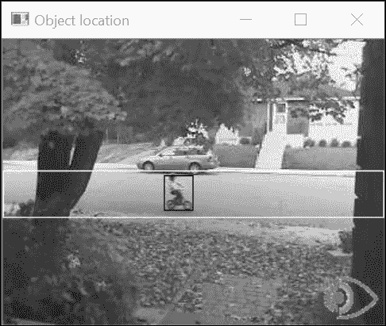

白色矩形表示搜索区域。所有适合该区域的窗口的直方图已经计算完成。我们保持了窗口大小不变，但寻找稍微小一些或大一些的窗口可能是一个好的策略，以便考虑可能的尺度变化。请注意，为了限制计算的复杂性，要计算的直方图中的箱数应保持较低。在我们的例子中，我们将这个数字减少到`16`个箱。因此，多平面图像的平面`0`包含一个二值图像，显示所有介于`0`和`15`之间的像素，而平面`1`显示介于`16`和`31`之间的像素，以此类推。

对象的搜索包括计算给定大小窗口在预定像素范围内的直方图。这代表了从我们的积分图像中高效计算出的`3200`个不同直方图的计算。我们`IntegralImage`类返回的所有直方图都包含在一个`cv::Vec`对象中（由于使用了`at`方法）。然后我们使用`cv::compareHist`函数来识别最相似的直方图（记住，这个函数，像大多数 OpenCV 函数一样，可以通过方便的`cv::InputArray`泛型参数类型接受`cv::Mat`或`cv::Vec`对象）。

## 参见

+   第八章，*检测兴趣点*，将介绍也依赖于积分图像使用的 SURF 算子

+   第十四章中的*使用 Haar 特征级联查找对象和面部*食谱，*从示例中学习*，介绍了使用积分图像计算的 Haar 特征

+   第五章中的应用形态算子于灰度图像的配方,

    *使用形态学操作变换图像*，介绍了一个可以产生与所提出的自适应阈值技术类似结果的算子

+   由*A. Adam*、*E. Rivlin*和*I. Shimshoni*在 2006 年*国际计算机视觉和模式识别会议论文集*中发表的*基于鲁棒片段的跟踪使用积分直方图*一文，描述了一种使用积分图像在图像序列中跟踪对象的有意思的方法
