# 第六章. 图像过滤

在本章中，我们将涵盖以下内容：

+   使用低通滤波器过滤图像

+   使用滤波器对图像进行下采样

+   使用中值滤波器过滤图像

+   应用方向滤波器检测边缘

+   计算图像的拉普拉斯算子

# 简介

过滤是信号和图像处理中的基本任务之一。它是一个旨在选择性地提取图像中某些方面（在特定应用背景下被认为传达了重要信息）的过程。过滤可以去除图像中的噪声，提取有趣的视觉特征，允许图像重采样，等等。它源于一般的**信号与系统**理论。我们在这里不会详细讨论这个理论。然而，本章将介绍一些与过滤相关的重要概念，并展示如何在图像处理应用中使用过滤器。但首先，让我们从频率域分析的概念简要解释开始。

当我们观察图像时，我们观察到不同的灰度级（或颜色）模式覆盖在其上。图像之间的差异在于它们有不同的灰度级分布。然而，还有一种观点可以用来分析图像。我们可以观察图像中存在的灰度级变化。一些图像包含几乎恒定强度的大面积（例如，一片蓝天），而其他图像的灰度级强度在图像上快速变化（例如，一个拥挤的场景，充满了许多小物体）。

因此，观察图像中这些变化的频率构成了表征图像的另一种方式。这种观点被称为**频域**，而通过观察其灰度级分布来表征图像则被称为**空间域**。

频域分析将图像分解为其从最低到最高频率的频率内容。图像强度变化缓慢的区域只包含低频，而高频是由强度快速变化产生的。存在几种著名的变换，如**傅里叶变换**或**余弦变换**，可以用来明确地显示图像的频率内容。请注意，由于图像是一个二维实体，它既包含垂直频率（垂直方向的变化）也包含水平频率（水平方向的变化）。

在频域分析框架下，**滤波器**是一种操作，它放大图像（或保持不变）的某些频率带，同时阻止（或减少）其他图像频率带。例如，低通滤波器是一种消除图像高频成分的滤波器；相反，高通滤波器消除低频成分。本章将介绍一些在图像处理中经常使用的滤波器，并解释它们在图像上应用时的效果。

# 使用低通滤波器进行图像滤波

在这个第一个菜谱中，我们将介绍一些非常基本的低通滤波器。在本章的介绍部分，我们了解到这类滤波器的目的是减少图像变化的幅度。实现这一目标的一种简单方法是将每个像素替换为其周围像素的平均值。通过这样做，快速强度变化将被平滑，从而被更渐进的过渡所取代。

## 如何操作...

`cv::blur`函数的目标是通过用矩形邻域内计算的平均像素值替换每个像素来平滑图像。这个低通滤波器如下应用：

```py
cv::blur(image,result, cv::Size(5,5)); // size of the filter 

```

这种滤波器也被称为**箱式滤波器**。在这里，我们通过使用`5x5`滤波器来应用它，以便使滤波器的影响更加明显。我们的原始图像如下所示：

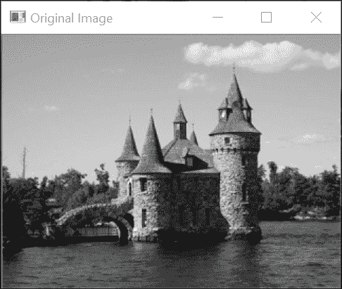

应用在先前图像上的滤波器结果如下所示：

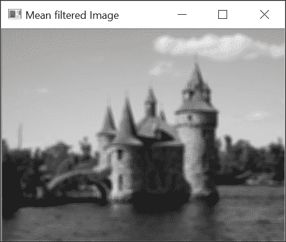

在某些情况下，可能希望给邻域中较近的像素赋予更高的权重。因此，可以计算一个加权平均值，其中附近的像素被分配比较远的像素更大的权重。这可以通过使用遵循**高斯函数**（一种“钟形”函数）的加权方案来实现。`cv::GaussianBlur`函数应用这种滤波器，其调用方式如下：

```py
cv::GaussianBlur(image, result,  
                 cv::Size(5,5), // size of the filter 
                 1.5);          // parameter controlling 
                                // the shape of the Gaussian

```

结果是以下图像：

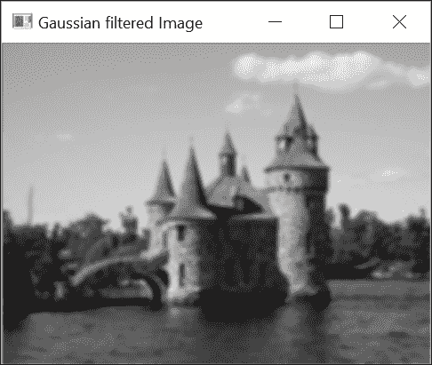

## 它是如何工作的...

如果一个滤波器的应用对应于用一个像素替换为相邻像素的加权总和，那么这个滤波器被称为线性滤波器。这是均值滤波器的情况，其中一个像素被替换为矩形邻域内所有像素的总和除以邻域的大小（以获得平均值）。这就像将每个相邻像素乘以像素总数的`1`，然后将所有这些值相加。滤波器的不同权重可以用一个矩阵来表示，该矩阵显示了与考虑的邻域中每个像素位置相关的乘数。

矩阵的核心元素对应于当前应用滤波器的像素。这种矩阵有时被称为**核**或**掩模**。对于一个`3x3`均值滤波器，相应的核如下所示：

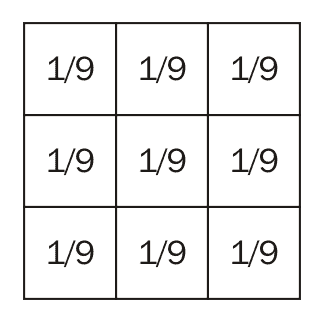

`cv::boxFilter` 函数使用仅由许多 `1` 组成的正方形核过滤图像。它与均值滤波器相似，但不需要将结果除以系数的数量。

应用线性滤波器相当于将核在图像的每个像素上移动，并将每个对应的像素乘以其关联的权重。从数学上讲，这个操作被称为 **卷积**，可以正式写成以下形式：

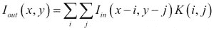

前面的双重求和将当前像素 `(x,y)` 与核的中心对齐，假设核的中心在坐标 `(0,0)`。

观察本食谱生成的输出图像，可以观察到低通滤波器的净效应是模糊或平滑图像。这并不令人惊讶，因为该滤波器衰减了与物体边缘上可见的快速变化相对应的高频分量。

在高斯滤波器的情况下，与像素关联的权重与其与中心像素的距离成正比。回想一下，1D 高斯函数具有以下形式：

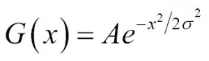

正则化系数 `A` 被选择，使得高斯曲线下的面积等于一。σ (sigma) 值控制着结果高斯函数的宽度。这个值越大，函数就越平坦。例如，如果我们计算区间 `[-4, 0, 4]` 的 1D 高斯滤波器的系数，σ = 0.5，我们得到以下系数：

```py
[0.0 0.0 0.00026 0.10645 0.78657 0.10645 0.00026 0.0 0.0]
```

对于 σ=1.5，这些系数如下：

```py
[0.0076 0.03608 0.1096 0.2135 0.2667 0.2135 0.1096 0.0361 0.0076 ]
```

注意，这些值是通过调用 `cv::getGaussianKernel` 函数并使用适当的 σ 值获得的：

```py
    cv::Mat gauss= cv::getGaussianKernel(9, sigma,CV_32F); 

```

以下图中显示了这两个 σ 值对应的高斯曲线的形状。高斯函数的对称钟形使其成为过滤的良好选择：

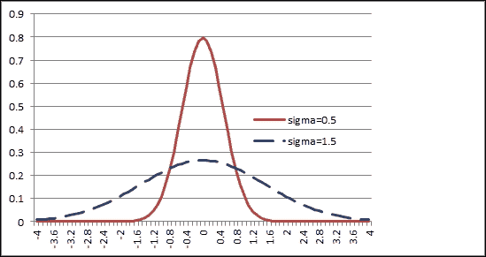

如观察所示，远离中心的像素权重较低，这使得像素间的过渡更平滑。这与平坦的均值滤波器形成对比，远离中心的像素可能导致当前均值值的突然变化。从频率的角度来看，这意味着均值滤波器不会移除所有的高频分量。

要在图像上应用 2D 高斯滤波器，可以先在图像行上应用 1D 高斯滤波器（以过滤水平频率），然后应用另一个 1D 高斯滤波器在图像列上（以过滤垂直频率）。这是可能的，因为高斯滤波器是一个**可分离的滤波器**（即，2D 核可以分解为两个 1D 滤波器）。可以使用`cv::sepFilter2D`函数应用一个通用的可分离滤波器。也可以直接使用`cv::filter2D`函数应用 2D 核。一般来说，可分离滤波器比不可分离滤波器计算速度更快，因为它们需要的乘法操作更少。

在 OpenCV 中，要应用于图像的高斯滤波器通过提供系数数量（第三个参数，为奇数）和σ的值（第四个参数）来指定`cv::GaussianBlur`。您也可以简单地设置σ的值，让 OpenCV 确定合适的系数数量（此时您为滤波器大小输入一个`0`值）。反之亦然，您可以输入一个大小和一个`0`值作为σ。将根据给定的大小确定最佳σ值。

## 参见

+   *使用滤波器对图像进行下采样*配方解释了如何使用低通滤波器减小图像的大小。

+   在第二章的“使用邻域访问配方扫描图像”的*更多内容...*部分中，介绍了`cv::filter2D`函数。此函数允许您通过输入您选择的核来对图像应用线性滤波器。

# 使用滤波器对图像进行下采样

图像通常需要调整大小（重采样）。减小图像大小的过程通常称为**下采样**，而增加其大小称为**上采样**。执行这些操作时的挑战是尽可能多地保留图像的视觉质量。为了实现这一目标，通常使用低通滤波器；本配方解释了原因。

## 如何操作...

您可能会认为，通过简单地消除图像的一些列和行，就可以减小图像的大小。不幸的是，生成的图像看起来不会很好。以下图通过仅保留每 4 列和行的`1`列和行来将原始图像大小减少`4`倍，以说明这一事实。

注意，为了使此图像中的缺陷更加明显，我们通过以四倍像素大小显示图像来放大图像：

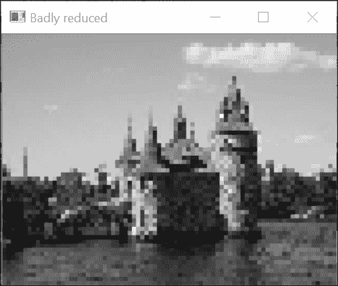

很明显，可以看到图像质量已经下降。例如，原始图像中城堡屋顶的斜边现在在减小后的图像上表现为楼梯状。图像纹理部分（例如砖墙）的其他锯齿形扭曲也可见。

这些不希望出现的伪影是由一种称为**空间混叠**的现象引起的，当你试图在无法容纳这些高频分量的过小图像中包含它们时。确实，较小的图像（即像素较少的图像）无法像高分辨率图像那样很好地表示精细纹理和锐利边缘（想想高清电视与较老电视技术的区别）。由于图像中的细微细节对应于高频，我们在减小图像尺寸之前需要移除这些高频分量。

我们在先前的菜谱中了解到，这可以通过低通滤波器来完成。因此，为了在不添加令人烦恼的伪影的情况下将图像尺寸减小四倍，你必须首先对原始图像应用低通滤波器，然后再丢弃列和行。这是使用 OpenCV 进行此操作的方法：

```py
    // first remove high frequency component 
    cv::GaussianBlur(image,image,cv::Size(11,11),2.0); 
    // keep only 1 of every 4 pixels 
    cv::Mat reduced(image.rows/4,image.cols/4,CV_8U); 
    for (int i=0; i<reduced.rows; i++) 
      for (int j=0; j<reduced.cols; j++) 
        reduced.at<uchar>(i,j)= image.at<uchar>(i*4,j*4); 

```

结果图像（也以四倍正常大小的像素显示）如下：

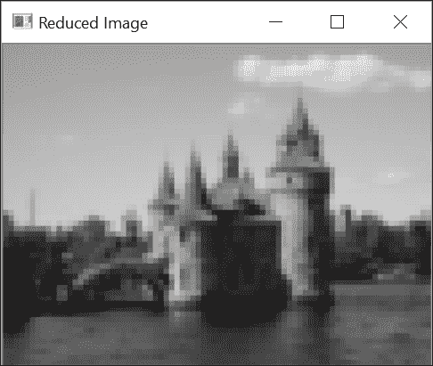

当然，图像的一些细微细节已经丢失，但从整体上看，图像的视觉质量比之前的情况（从远处看这张图像）要好得多。

## 它是如何工作的...

为了避免不希望的混叠效应，在减小图像尺寸之前，必须始终对图像进行低通滤波。正如我们之前解释的，低通滤波器的作用是消除在减小尺寸的图像中无法表示的高频分量。这一事实的正式理论已经建立，通常被称为**奈奎斯特-香农定理**。实质上，该理论告诉我们，如果你将图像下采样为原来的一半，那么可表示的频率带宽也将减少一半。

一个特殊的 OpenCV 函数使用这个原理进行图像减小。这是`cv::pyrDown`函数：

```py
    cv::Mat reducedImage;            // to contain reduced image 
    cv::pyrDown(image,reducedImage); // reduce image size by half 

```

前面的函数使用一个`5x5`高斯滤波器在减小图像尺寸之前对其进行低通滤波。存在一个相反的`cv::pyrUp`函数，可以将图像尺寸加倍。值得注意的是，在这种情况下，上采样是通过在每两列和每两行之间插入 0 值来完成的，然后对扩展后的图像应用相同的`5x5`高斯滤波器（但系数乘以四）。显然，如果你先减小图像尺寸，然后再将其放大，你将无法恢复原始图像。在减小尺寸过程中丢失的内容无法恢复。这两个函数用于创建图像金字塔。这是一种由不同尺寸的图像堆叠版本组成的数据结构，用于高效的多尺度图像分析。结果图像如下：

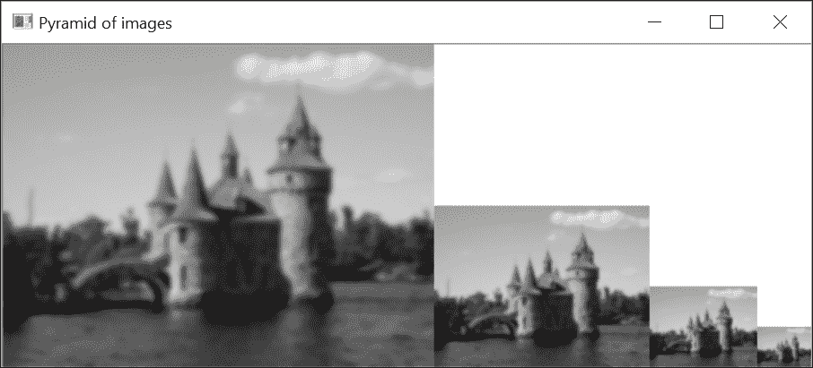

在这里，每个级别比前一个级别小两倍，但减少因子可以更小，不一定是整数（例如，`1.2`）。例如，如果你想高效地检测图像中的对象，可以先在小金字塔顶部的图像上完成检测，当你定位到感兴趣的对象时，可以通过移动到包含更高分辨率图像版本的金字塔较低级别来细化搜索。

注意，还有一个更通用的 `cv::resize` 函数，允许你指定所需的结果图像大小。你只需通过指定一个新大小来调用它，这个大小可以比原始图像小或大：

```py
    cv::Mat resizedImage;                 // to contain resized image 
    cv::resize(image, resizedImage,
               cv::Size(image.cols/4,image.rows/4)); // 1/4 resizing 

```

也可以用缩放因子来指定调整大小。在这种情况下，给定的参数是一个空的大小实例，后跟所需的缩放因子：

```py
    cv::resize(image, resizedImage,  
               cv::Size(), 1.0/4.0, 1.0/4.0); // 1/4 resizing 

```

一个最终参数允许你在重采样过程中选择要使用的插值方法。这将在下一节中讨论。

## 还有更多...

当图像按分数因子调整大小时，必须执行一些像素插值，以便在现有像素之间产生新的像素值。正如在第二章“操作像素”中的“重映射图像”配方所讨论的通用图像重映射，这也是需要像素插值的情况。

### 插值像素值

执行插值的最基本方法是用最近邻策略。必须生成的新的像素网格放置在现有图像的上方，并且每个新像素被分配其原始图像中最接近像素的值。在图像上采样（即，使用比原始网格更密集的新网格）的情况下，这意味着新网格的多个像素将从一个相同的原始像素接收其值。例如，通过最近邻插值将上一节中减小后的图像按四倍大小调整，操作如下：

```py
    cv::resize(reduced, newImage, cv::Size(), 3, 3, cv::INTER_NEAREST); 

```

在这种情况下，插值相当于简单地增加每个像素的大小四倍。一个更好的方法是通过组合几个相邻像素的值来插值新的像素值。因此，我们可以通过考虑其周围的四个像素来线性插值像素值，如下面的图所示：

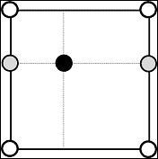

这是通过首先垂直插值两个像素值到添加的像素的左侧和右侧来完成的。然后，使用这两个插值像素（在前面的图中以灰色绘制）来水平插值所需位置的像素值。这种双线性插值方案是 `cv::resize`（也可以通过 `cv::INTER_LINEAR` 标志显式指定）使用的默认方法：

```py
    cv::resize(reduced, newImage, cv::Size(), 4, 4, cv::INTER_LINEAR); 

```

以下为结果：

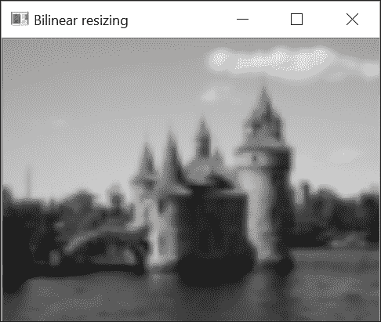

还有其他方法可以产生更优的结果。使用**双三次插值**时，考虑一个`4x4`像素的邻域来进行插值。然而，由于这种方法使用了更多的像素（`16`）并且涉及到立方项的计算，它比双线性插值计算速度慢。

## 参见

+   第二章中关于*使用邻域访问扫描图像*的*更多内容...*部分介绍了`cv::filter2D`函数。此函数允许您通过输入选择的核将线性滤波器应用于图像。

+   第八章中关于*检测尺度不变特征*的配方使用图像金字塔在图像中检测兴趣点。

# 使用中值滤波器过滤图像

本章的第一个配方介绍了线性滤波器的概念。非线性滤波器也存在，并且可以在图像处理中有效地使用。这种滤波器之一就是我们在本配方中介绍的中值滤波器。

由于中值滤波器特别适用于对抗椒盐噪声（或在我们的情况下，仅椒盐），我们将使用我们在第二章中第一个配方中创建的图像，*操作像素*，此处重新呈现：

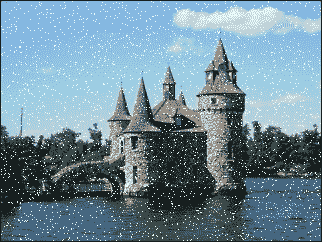

## 如何操作...

调用中值滤波函数的方式与其他滤波器类似：

```py
    cv::medianBlur(image, result, 5);  
    // last parameter is size of the filter 

```

结果图像如下：

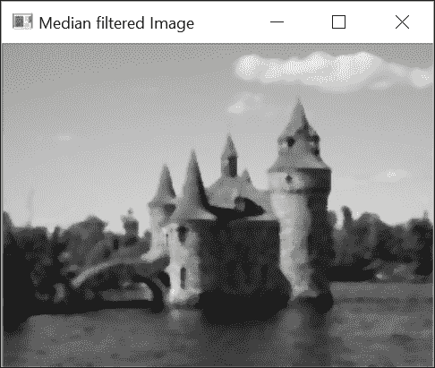

## 如何工作...

由于中值滤波器不是线性滤波器，它不能通过核矩阵表示，不能通过卷积操作应用（即使用本章第一个配方中引入的双重求和方程）。然而，它也作用于像素的邻域以确定输出像素值。像素及其邻域形成一组值，正如其名称所暗示的，中值滤波器将简单地计算这组值的中值（一组的中值是当组排序时中间位置的值）。然后，当前像素被替换为中值值。

这解释了为什么该滤波器在消除椒盐噪声方面如此高效。确实，当给定像素邻域中存在异常的黑色或白色像素时，它永远不会被选为中值值（而是最大或最小值），因此它总是被相邻的值所替代。

相比之下，一个简单的均值滤波器会受到这种噪声的严重影响，如下面的图像所示，它表示了我们的椒盐噪声损坏图像的均值滤波版本：

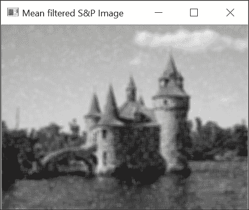

显然，噪声像素改变了相邻像素的均值。因此，即使噪声已被均值滤波器模糊，噪声仍然可见。

中值滤波器也有保留边缘锐度的优势。然而，它会在均匀区域（例如，背景中的树木）洗掉纹理。由于它在图像上产生的视觉影响，中值滤波器通常用于在照片编辑软件工具中创建特殊效果。你应该在彩色图像上测试它，看看它如何产生卡通般的图像。

# 应用方向滤波器以检测边缘

本章的第一种配方介绍了使用核矩阵进行线性滤波的想法。所使用的滤波器具有通过移除或衰减其高频成分来模糊图像的效果。在本配方中，我们将执行相反的转换，即放大图像的高频内容。因此，本配方中引入的高通滤波器将执行**边缘检测**。

## 如何操作...

我们在这里使用的滤波器被称为**Sobel**滤波器。据说它是一个方向滤波器，因为它只影响垂直或水平图像频率，这取决于使用的滤波器核。OpenCV 有一个函数可以对图像应用 Sobel 算子。水平滤波器的调用方式如下：

```py
    cv::Sobel(image,     // input 
              sobelX,    // output 
              CV_8U,     // image type 
              1, 0,      // kernel specification 
              3,         // size of the square kernel 
              0.4, 128); // scale and offset 

```

垂直滤波是通过以下（与水平滤波非常相似）的调用实现的：

```py
    cv::Sobel(image,     // input 
              sobelY,    // output 
              CV_8U,     // image type 
              0, 1,      // kernel specification 
              3,         // size of the square kernel 
              0.4, 128); // scale and offset 

```

函数提供了几个整数参数，这些将在下一节中解释。请注意，这些参数已被选择以生成输出结果的 8 位图像（`CV_8U`）表示。

水平`Sobel`算子的结果如下：

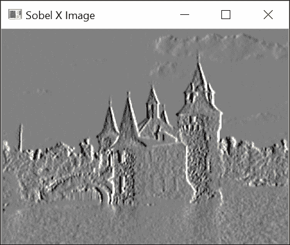

由于，如将在下一节中看到的，`Sobel`算子的核包含正负值，因此`Sobel`滤波器的结果通常在 16 位有符号整数图像（`CV_16S`）中计算。为了将结果显示为 8 位图像，如图中所示，我们使用了零值对应灰度级别`128`的表示。负值由较暗的像素表示，而正值由较亮的像素表示。垂直 Sobel 图像如下：

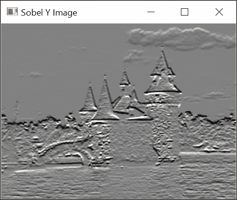

如果你熟悉照片编辑软件，前面的图像可能会让你想起图像浮雕效果，确实，这种图像变换通常基于方向滤波器的使用。

这两个结果（垂直和水平）可以组合起来以获得`Sobel`滤波器的范数：

```py
    // Compute norm of Sobel 
    cv::Sobel(image,sobelX,CV_16S,1,0); 
    cv::Sobel(image,sobelY,CV_16S,0,1); 
    cv::Mat sobel; 
    //compute the L1 norm 
    sobel= abs(sobelX)+abs(sobelY); 

```

可以使用`convertTo`方法的可选缩放参数方便地显示 Sobel 范数，以获得一个图像，其中零值对应白色，而更高的值则分配更暗的灰色阴影：

```py
    // Find Sobel max value 
    double sobmin, sobmax; 
    cv::minMaxLoc(sobel,&sobmin,&sobmax); 
    // Conversion to 8-bit image 
    // sobelImage = -alpha*sobel + 255 
    cv::Mat sobelImage; 
    sobel.convertTo(sobelImage,CV_8U,-255./sobmax,255); 

```

然后生成以下图像：

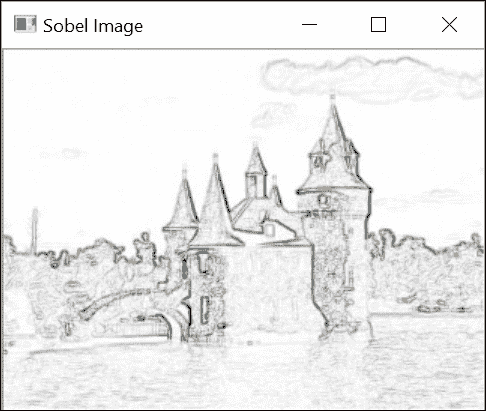

看着这张图，现在很清楚为什么这种算子被称为边缘检测器。然后可以阈值化图像，以获得显示图像轮廓的二值图。以下代码片段创建了随后的图像：

```py
    cv::threshold(sobelImage, sobelThresholded,  
                  threshold, 255, cv::THRESH_BINARY); 

```

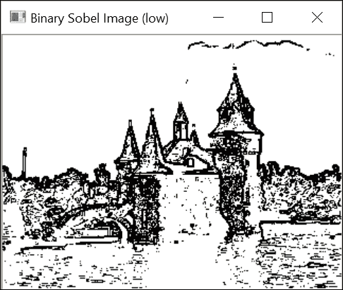

## 它是如何工作的...

Sobel 算子是一种经典的边缘检测线性滤波器，它基于两个简单的`3x3`核，具有以下结构：

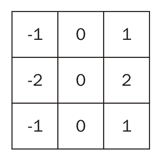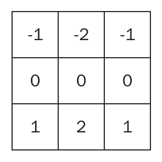

如果我们将图像视为一个二维函数，那么 Sobel 算子可以被视为图像在垂直和水平方向上的变化度量。在数学上，这个度量被称为**梯度**，它定义为从函数的两个正交方向的第一导数构成的二维向量：

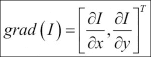

Sobel 算子通过在水平和垂直方向上对像素进行差分，为你提供了一个图像梯度的近似。它在一个围绕感兴趣像素的窗口上操作，以减少噪声的影响。`cv::Sobel`函数计算图像与 Sobel 核卷积的结果。其完整规范如下：

```py
    cv::Sobel(image,         // input 
              sobel,         // output 
              image_depth,   // image type 
              xorder,yorder, // kernel specification   
              kernel_size,   // size of the square kernel 
              alpha, beta);  // scale and offset 

```

通过使用适当的参数，你可以决定是否希望将结果写入无符号字符、有符号整数或浮点图像。当然，如果结果超出了图像像素的域，将会应用饱和度。这就是最后两个参数可能很有用的地方。在将结果存储到图像之前，结果可以被缩放（乘以）`alpha`，并且可以添加一个偏移量`beta`。

这就是在上一节中我们生成一个图像的过程，其中 Sobel 值`0`被表示为中灰度级别`128`。每个 Sobel 掩码对应一个方向上的导数。因此，使用两个参数来指定将要应用的核，即`x`和`y`方向上的导数阶数。例如，水平 Sobel 核是通过为`xorder`和`yorder`参数指定`1`和`0`来获得的，而垂直核将通过指定`0`和`1`来生成。其他组合也是可能的，但这两个是最常用的（二阶导数的情况将在下一个菜谱中讨论）。最后，也可以使用大于`3x3`大小的核。可能的核大小值为`1`、`3`、`5`和`7`。大小为`1`的核对应于 1D Sobel 滤波器（`1x3`或`3x1`）。请参阅以下*更多内容...*部分，了解为什么使用更大的核可能是有用的。

由于梯度是一个二维向量，它有一个范数和一个方向。梯度向量的范数告诉你变化的幅度是多少，它通常被计算为欧几里得范数（也称为**L2 范数**）：

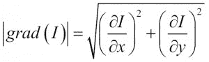

然而，在图像处理中，这个范数通常被计算为绝对值的总和。这被称为**L1 范数**，它给出的值接近 L2 范数，但计算成本更低。这就是我们在本食谱中所做的：

```py
    // compute the L1 norm 
    sobel= abs(sobelX)+abs(sobelY); 

```

梯度向量始终指向最陡变化的方向。对于图像，这意味着梯度方向将与边缘正交，指向暗到亮的方向。梯度角度方向由以下公式给出：

通常，对于边缘检测，只计算范数。但是，如果您需要范数和方向，则可以使用以下 OpenCV 函数：

```py
    // Sobel must be computed in floating points 
    cv::Sobel(image,sobelX,CV_32F,1,0); 
    cv::Sobel(image,sobelY,CV_32F,0,1); 
    // Compute the L2 norm and direction of the gradient 
    cv::Mat norm, dir; 
    // Cartesian to polar transformation to get magnitude and angle 
    cv::cartToPolar(sobelX,sobelY,norm,dir); 

```

默认情况下，方向是以弧度计算的。只需将`true`作为附加参数添加，就可以以度为单位进行计算。

通过对梯度幅度应用阈值，已获得二值边缘图。选择正确的阈值不是一个显而易见的工作。如果阈值值太低，将保留太多（粗）边缘，而如果我们选择更严格的（更高的）阈值，则将获得断裂边缘。为了说明这种权衡情况，可以将前面的二值边缘图与以下使用更高阈值值获得的图进行比较：

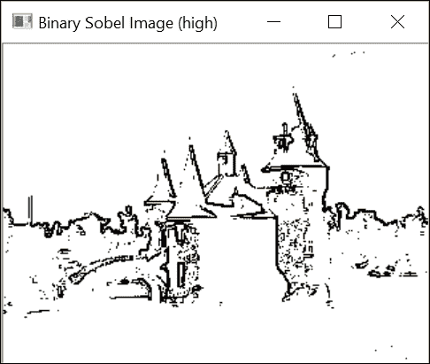

要同时获得低阈值和高阈值的最佳效果，可以使用滞后阈值的概念。这将在下一章中解释，其中我们将介绍 Canny 算子。

## 更多内容...

其他梯度算子也存在。我们将在本节中介绍其中的一些。在应用导数滤波器之前，也可以先应用高斯平滑滤波器。这使其对噪声的敏感性降低，如本节所述。

### 梯度算子

为了估计像素位置的梯度，**Prewitt** **算子**定义了以下核：

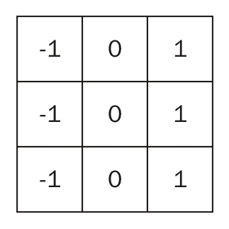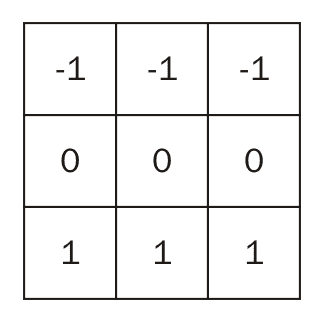

**Roberts 算子**基于以下简单的`2x2`核：

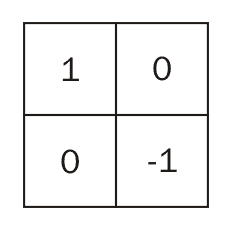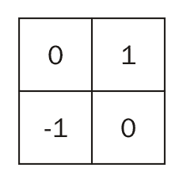

当需要更精确的梯度方向估计时，**Scharr 算子**更受欢迎：

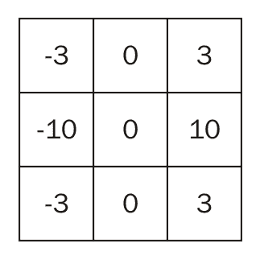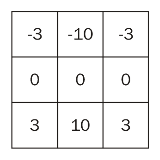

注意，可以通过使用`cv::Sobel`函数并使用`CV_SCHARR`参数来调用它，使用 Scharr 核：

```py
    cv::Sobel(image,sobelX,CV_16S,1,0, CV_SCHARR); 

```

或者，等价地，你可以调用`cv::Scharr`函数：

```py
    cv::Scharr(image,scharrX,CV_16S,1,0,3); 

```

所有这些方向滤波器都试图估计图像函数的一阶导数。因此，在滤波器方向上存在较大强度变化区域，会获得高值，而平坦区域产生低值。这就是为什么计算图像导数的滤波器是高通滤波器。

### 高斯导数

导数滤波器是高通滤波器。因此，它们倾向于放大图像中的噪声和小的、高度对比的细节。为了减少这些高频元素的影响，在应用导数滤波器之前先平滑图像是一个好习惯。你可能会认为这将是两个步骤，即先平滑图像然后计算导数。然而，仔细观察这些操作可以发现，可以通过适当选择平滑核将这两个步骤合并为一个。我们之前了解到，图像与滤波器的卷积可以表示为项的求和。有趣的是，一个著名的数学性质是，项的求和的导数等于项的导数的求和。

因此，而不是在平滑的结果上应用导数，可以推导出核，然后将其与图像进行卷积；这两个操作随后在单个像素遍历中完成。由于高斯核是连续可导的，它是一个特别合适的选择。当你用不同核大小调用`cv::sobel`函数时，就是这样做的。该函数将计算具有不同σ值的高斯导数核。例如，如果我们选择`7x7`索贝尔滤波器（即`kernel_size=7`）在`x`方向上，将得到以下结果：

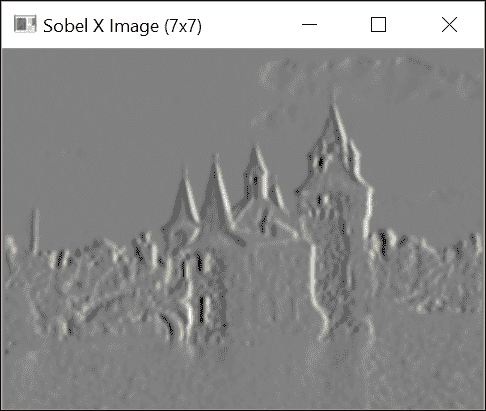

如果你将此图像与之前显示的图像进行比较，可以看出许多细微细节已被移除，从而使得对更重要的边缘更加突出。请注意，我们现在有一个带通滤波器，一些较高频率被高斯滤波器移除，而较低频率被`Sobel`滤波器移除。

## 参见

+   在第七章的*使用 Canny 算子检测图像轮廓*配方中，*提取线、轮廓和组件*展示了如何使用两个不同的阈值值获得二值边缘图

# 计算图像的拉普拉斯算子

拉普拉斯算子是另一种基于图像导数计算的高通线性滤波器。正如将解释的那样，它计算二阶导数以测量图像函数的曲率。

## 如何做到这一点...

OpenCV 函数`cv::Laplacian`计算图像的拉普拉斯算子。它与`cv::Sobel`函数非常相似。事实上，它使用相同的基函数`cv::getDerivKernels`来获取其核矩阵。唯一的区别是没有导数阶数参数，因为这些参数按定义是二阶导数。

对于此算子，我们将创建一个简单的类，它将封装一些与拉普拉斯相关的有用操作。基本属性和方法如下：

```py
    class LaplacianZC { 

      private: 
      // laplacian 
      cv::Mat laplace; 
      // Aperture size of the laplacian kernel 
      int aperture; 

      public: 

      LaplacianZC() : aperture(3) {} 

      // Set the aperture size of the kernel 
      void setAperture(int a) { 
        aperture= a; 
      } 

      // Compute the floating point Laplacian 
      cv::Mat computeLaplacian(const cv::Mat& image) { 

        // Compute Laplacian 
        cv::Laplacian(image,laplace,CV_32F,aperture); 
        return laplace; 
    } 

```

拉普拉斯的计算在这里是在一个浮点图像上进行的。为了得到结果的图像，我们执行了一个缩放，如前一个菜谱中所示。这种缩放基于拉普拉斯的最大绝对值，其中值`0`被分配为灰度级`128`。我们类中的一个方法允许获得以下图像表示：

```py
    // Get the Laplacian result in 8-bit image 
    // zero corresponds to gray level 128 
    // if no scale is provided, then the max value will be 
    // scaled to intensity 255 
    // You must call computeLaplacian before calling this 
    cv::Mat getLaplacianImage(double scale=-1.0) { 
      if (scale<0) { 
        double lapmin, lapmax; 
        // get min and max laplacian values 
        cv::minMaxLoc(laplace,&lapmin,&lapmax); 
        // scale the laplacian to 127 
        scale= 127/ std::max(-lapmin,lapmax); 
      } 

      // produce gray-level image 
      cv::Mat laplaceImage; 
      laplace.convertTo(laplaceImage,CV_8U,scale,128); 
      return laplaceImage; 
    } 

```

使用这个类，从`7x7`核计算得到的拉普拉斯图像如下所示：

```py
    // Compute Laplacian using LaplacianZC class 
    LaplacianZC laplacian; 
    laplacian.setAperture(7); // 7x7 laplacian 
    cv::Mat flap= laplacian.computeLaplacian(image); 
    laplace= laplacian.getLaplacianImage(); 

```

最终生成的图像如下所示：

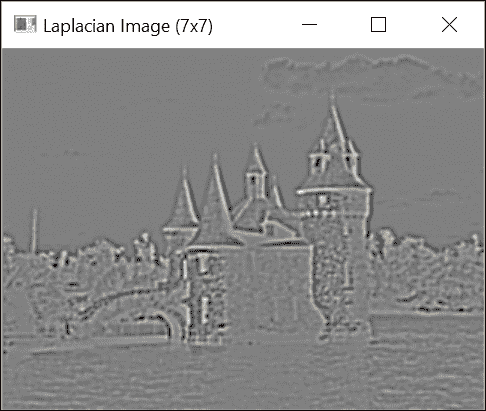

## 如何工作...

形式上，二维函数的拉普拉斯定义为其二阶导数的和：

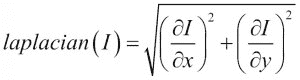

在其最简单形式中，它可以近似为以下`3x3`核：

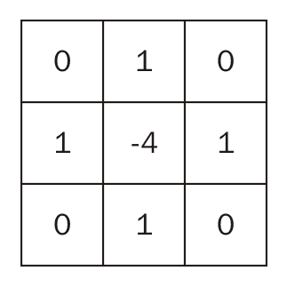

就像 Sobel 算子一样，也可以使用更大的核来计算拉普拉斯，并且由于这个算子对图像噪声更加敏感，因此这样做是可取的（除非计算效率是一个问题）。由于这些较大的核是使用高斯函数的二阶导数计算的，因此相应的算子通常被称为**高斯拉普拉斯**（**LoG**）。请注意，拉普拉斯的核值总是加起来等于`0`。这保证了拉普拉斯将在强度恒定的区域内为零。实际上，由于拉普拉斯测量图像函数的曲率，它应该在平坦区域内等于`0`。

初看之下，拉普拉斯的效果可能难以解释。从核的定义来看，很明显，任何孤立的像素值（即与邻居非常不同的值）都将被算子放大。这是算子对噪声高度敏感的结果。然而，更有趣的是观察图像边缘周围的拉普拉斯值。图像中边缘的存在是不同灰度级强度区域之间快速转换的结果。沿着边缘（例如，由暗到亮的转换引起的）跟踪图像函数的演变，可以观察到灰度级上升必然意味着从正曲率（当强度值开始上升时）到负曲率（当强度即将达到其高平台时）的逐渐过渡。因此，正负拉普拉斯值之间的转换（或反之）是边缘存在的好指标。另一种表达这个事实的方法是说，边缘将位于拉普拉斯函数的零交叉点。我们将通过查看测试图像中一个小窗口内的拉普拉斯值来阐述这个想法。我们选择一个对应于城堡塔楼底部部分创建的边缘的值。在以下图像中画了一个白色框，以显示这个感兴趣区域的精确位置：

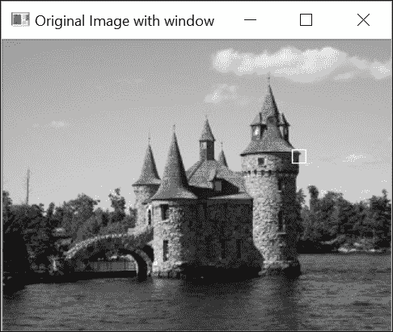

下图显示了所选窗口内拉普拉斯图像（`7x7`核）的数值（除以`100`）：

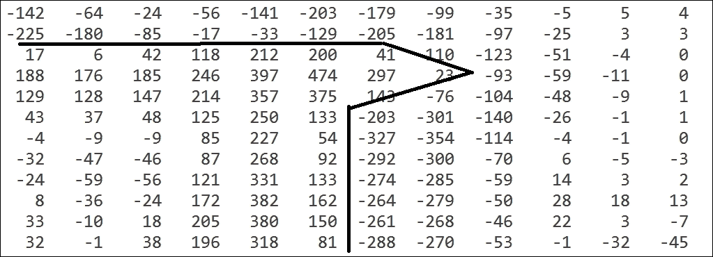

如果，如图所示，你仔细追踪拉普拉斯算子的某些零交叉点（位于不同符号像素之间），你将得到一条曲线，它对应于图像窗口中可见的一些边缘。在先前的图中，我们在所选图像窗口中可见的塔边缘对应的零交叉点上画了线。这意味着，原则上，你甚至可以以亚像素的精度检测图像边缘。

跟随拉普拉斯图像中的零交叉曲线是一项精细的任务。然而，可以使用一个简化的算法来检测近似零交叉位置。这个算法首先在`0`处对拉普拉斯算子进行阈值处理，以便获得一个分隔正负值的分区。这两个分区之间的界限对应于我们的零交叉点。因此，我们使用形态学操作来提取这些轮廓，即我们从拉普拉斯图像中减去膨胀图像（这是在第五章中介绍的 Beucher 梯度，*在灰度图像上应用形态学算子*食谱）。此算法通过以下方法实现，该方法生成零交叉的二值图像：

```py
    // Get a binary image of the zero-crossings 
    // laplacian image should be CV_32F 
    cv::Mat getZeroCrossings(cv::Mat laplace) { 
      // threshold at 0 
      // negative values in black 
      // positive values in white 
      cv::Mat signImage; 
      cv::threshold(laplace,signImage,0,255,cv::THRESH_BINARY); 

      // convert the +/- image into CV_8U 
      cv::Mat binary; 
      signImage.convertTo(binary,CV_8U); 
      // dilate the binary image of +/- regions 
      cv::Mat dilated; 
      cv::dilate(binary,dilated,cv::Mat()); 

      // return the zero-crossing contours 
      return dilated-binary; 
    } 

```

结果是以下二值图：

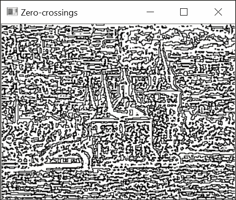

如你所见，拉普拉斯算子的零交叉点检测到了所有的边缘。没有在强边缘和弱边缘之间做出区分。我们还提到，拉普拉斯算子对噪声非常敏感。值得注意的是，一些可见的边缘是由于压缩伪影造成的。所有这些因素解释了为什么操作者检测到这么多边缘。实际上，拉普拉斯算子通常与其他算子结合使用来检测边缘（例如，可以在强梯度幅度的零交叉位置声明边缘）。我们还将了解到第八章，*检测兴趣点*，拉普拉斯算子和其他二阶算子在检测多尺度兴趣点方面非常有用。

## 还有更多...

拉普拉斯算子是一个高通滤波器，但有趣的是，可以通过使用低通滤波器的组合来近似它。但在探讨这个方面之前，让我们谈谈图像增强，这是一个我们已经在第二章中讨论过的主题，*操作像素*。

### 使用拉普拉斯算子增强图像

通过从图像中减去其拉普拉斯变换，可以增强图像的对比度。这就是我们在第二章的*使用邻域访问扫描图像*菜谱中做的事情，*操作像素*，在那里我们引入了核：

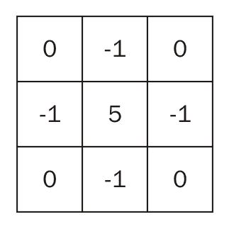

这等于 1 减去拉普拉斯核（即原始图像减去其拉普拉斯变换）。

### 高斯函数差异

本章第一道菜谱中介绍的高斯滤波器提取图像的低频部分。我们了解到，高斯滤波器过滤的频率范围取决于参数σ，它控制滤波器的宽度。现在，如果我们从两个不同带宽的高斯滤波器对图像进行滤波的结果中减去这两个图像，那么得到的图像将只包含一个滤波器保留而另一个没有保留的高频部分。这种操作称为**高斯函数差异**（**DoG**），其计算方法如下：

```py
    cv::GaussianBlur(image,gauss20,cv::Size(),2.0); 
    cv::GaussianBlur(image,gauss22,cv::Size(),2.2); 

    // Compute a difference of Gaussians 
    cv::subtract(gauss22, gauss20, dog, cv::Mat(), CV_32F); 

    // Compute the zero-crossings of DoG 
    zeros= laplacian.getZeroCrossings(dog); 

```

代码的最后一行计算`DoG`算子的零交叉。它得到以下图像：

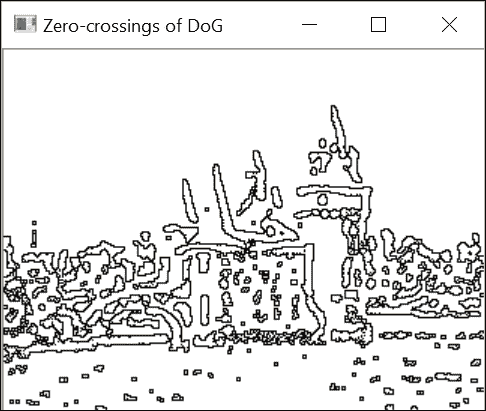

实际上，可以证明，通过适当选择σ值，`DoG`算子可以构成 LoG 滤波器的一个良好近似。此外，如果你从σ值递增的连续对值中计算一系列高斯函数差异，你将获得图像的尺度空间表示。这种多尺度表示很有用，例如，对于尺度不变图像特征检测，将在第八章的*检测兴趣点*中解释。

## 参见

+   第八章中的*检测尺度不变特征*菜谱，*检测兴趣点*，使用拉普拉斯和 DoG 进行尺度不变特征的检测
