# 第八章. 检测兴趣点

在本章中，我们将介绍以下食谱：

+   在图像中检测角点

+   快速检测特征

+   检测尺度不变特征

+   在多个尺度上检测 FAST 特征

# 简介

在计算机视觉中，**兴趣点**的概念，也称为**关键点**或**特征点**，已被广泛用于解决物体识别、图像配准、视觉跟踪、3D 重建等问题。这个概念基于这样一个想法：与其将图像作为一个整体来观察（即提取全局特征），不如选择图像中的某些特殊点并对它们进行局部分析（即提取局部特征）。只要在感兴趣图像中检测到足够数量的此类点，并且这些点是区分性和稳定的特征，可以精确定位，这种方法就会很有效。这些特征可以准确定位。

因为它们用于分析图像内容，所以理想情况下应该在相同的场景或物体位置检测特征点，无论图像是从哪个视角、尺度或方向拍摄的。在图像分析中，视图不变性是一个非常理想化的特性，一直是众多研究的对象。正如我们将看到的，不同的检测器具有不同的不变性特性。本章主要关注关键点提取过程本身。接下来的章节将展示如何在不同的环境中使用兴趣点，例如图像匹配或图像几何估计。

# 在图像中检测角点

当在图像中搜索有趣的特征点时，角点是一个有趣的解决方案。它们确实是图像中的局部特征，可以轻松定位，而且它们在人造物体场景中应该很丰富（它们是由墙壁、门、窗户、桌子等产生的）。角点之所以有趣，还因为它们是二维特征，可以精确检测（甚至可以达到亚像素精度），因为它们位于两条边的交汇处。这与位于均匀区域或物体轮廓上的点形成对比；这些点在其他相同物体的图像上难以精确重复定位。Harris 特征检测器是检测图像角点的经典方法。我们将在这个食谱中探讨这个算子。

## 如何操作...

用于检测 Harris 角点的 OpenCV 基本函数称为`cv::cornerHarris`，使用起来非常简单。你可以在输入图像上调用它，结果是一个浮点图像，它给出了每个像素位置的角点强度。然后对这个输出图像应用一个阈值，以获得一组检测到的角点。这可以通过以下代码实现：

```py
    // Detect Harris Corners 
    cv::Mat cornerStrength; 
    cv::cornerHarris(image,          // input image 
                     cornerStrength, // image of cornerness 
                     3,              // neighborhood size 
                     3,              // aperture size 
                     0.01);          // Harris parameter 

    // threshold the corner strengths 
    cv::Mat harrisCorners; 
    double threshold= 0.0001; 
    cv::threshold(cornerStrength,harrisCorners, 
                  threshold,255,cv::THRESH_BINARY); 

```

这是原始图像：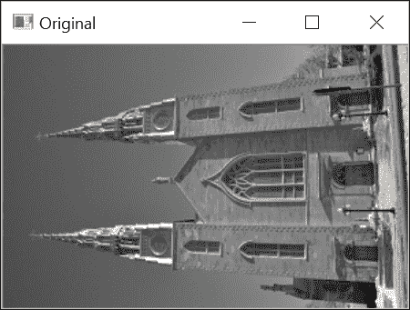

结果是一个二进制映射图像，如下面的截图所示，为了更好的查看，它被反转了（即，我们使用了`cv::THRESH_BINARY_INV`而不是`cv::THRESH_BINARY`来获取检测到的角点为黑色）：

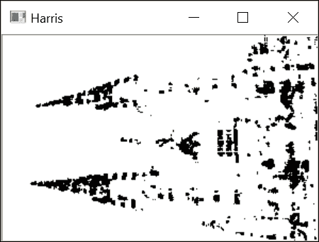

从前面的函数调用中，我们可以观察到这个兴趣点检测器需要几个参数（这些将在下一节中解释），这些参数可能会使其难以调整。此外，获得的角点图包含许多角像素簇，这与我们希望检测到良好定位的点的事实相矛盾。因此，我们将尝试通过定义我们自己的类来检测 Harris 角点来改进角点检测方法。

该类封装了 Harris 参数及其默认值以及相应的 getter 和 setter 方法（此处未显示）：

```py
    class HarrisDetector { 

      private: 

      // 32-bit float image of corner strength 
      cv::Mat cornerStrength; 
      // 32-bit float image of thresholded corners 
      cv::Mat cornerTh; 
      // image of local maxima (internal) 
      cv::Mat localMax; 
      // size of neighborhood for derivatives smoothing 
      int neighborhood; 
      // aperture for gradient computation 
      int aperture; 
      // Harris parameter 
      double k; 
      // maximum strength for threshold computation 
      double maxStrength; 
      // calculated threshold (internal) 
      double threshold; 
      // size of neighborhood for non-max suppression 
      int nonMaxSize; 
      // kernel for non-max suppression 
      cv::Mat kernel; 

      public: 

      HarrisDetector(): neighborhood(3), aperture(3),  
                        k(0.01), maxStrength(0.0),  
                        threshold(0.01), nonMaxSize(3) { 

         // create kernel used in non-maxima suppression 
         setLocalMaxWindowSize(nonMaxSize); 
      } 

```

要在图像上检测 Harris 角点，我们分两步进行。首先，计算每个像素的 Harris 值：

```py
    // Compute Harris corners 
    void detect(const cv::Mat& image) { 

      // Harris computation 
      cv::cornerHarris(image,cornerStrength,                   
                       neighbourhood,// neighborhood size 
                       aperture,     // aperture size 
                       k);           // Harris parameter 

      // internal threshold computation 
      cv::minMaxLoc(cornerStrength,0,&maxStrength); 

      // local maxima detection 
      cv::Mat dilated;  //temporary image 
      cv::dilate(cornerStrength,dilated,cv::Mat()); 
      cv::compare(cornerStrength,dilated, localMax, cv::CMP_EQ); 
    } 

```

接下来，根据指定的阈值值获取特征点。由于 Harris 的可能值范围取决于其参数的特定选择，因此阈值被指定为质量级别，该级别定义为图像中计算的最大 Harris 值的分数：

```py
    // Get the corner map from the computed Harris values 
    cv::Mat getCornerMap(double qualityLevel) { 

      cv::Mat cornerMap; 

      // thresholding the corner strength 
      threshold= qualityLevel*maxStrength; 
      cv::threshold(cornerStrength,cornerTh, threshold, 255,
                    cv::THRESH_BINARY); 

      // convert to 8-bit image 
      cornerTh.convertTo(cornerMap,CV_8U); 

      // non-maxima suppression 
      cv::bitwise_and(cornerMap,localMax,cornerMap); 

      return cornerMap; 
    } 

```

此方法返回检测到的特征的二进制角点图。由于 Harris 特征的检测被分为两种方法，这使得我们可以在不重复昂贵计算的情况下，通过不同的阈值（直到获得适当数量的特征点）来测试检测。此外，还可以将 Harris 特征以`std::vector`的`cv::Point`实例形式获得：

```py
    // Get the feature points from the computed Harris values 
    void getCorners(std::vector<cv::Point> &points, double qualityLevel) { 

      // Get the corner map 
      cv::Mat cornerMap= getCornerMap(qualityLevel); 
      // Get the corners 
      getCorners(points, cornerMap); 
    } 

    // Get the feature points from the computed corner map 
    void getCorners(std::vector<cv::Point> &points,
                    const cv::Mat& cornerMap) { 

      // Iterate over the pixels to obtain all features 
      for( int y = 0; y < cornerMap.rows; y++ ) { 

        const uchar* rowPtr = cornerMap.ptr<uchar>(y); 

        for( int x = 0; x < cornerMap.cols; x++ ) { 

          // if it is a feature point 
          if (rowPtr[x]) { 

            points.push_back(cv::Point(x,y)); 
          } 
        } 
      } 
    } 

```

此类还通过添加非极大值抑制步骤来改进 Harris 角点的检测，这将在下一节中解释。现在可以使用`cv::circle`函数在图像上绘制检测到的点，如下所示的方法：

```py
    // Draw circles at feature point locations on an image 
    void drawOnImage(cv::Mat &image,  
                     const std::vector<cv::Point> &points,  
                     cv::Scalar color= cv::Scalar(255,255,255),  
                     int radius=3, int thickness=1) { 
      std::vector<cv::Point>::const_iterator it= points.begin(); 

      // for all corners 
      while (it!=points.end()) { 

        // draw a circle at each corner location 
        cv::circle(image,*it,radius,color,thickness); 
        ++it; 
      } 
    } 

```

使用此类，Harris 点的检测如下完成：

```py
    // Create Harris detector instance 
    HarrisDetector harris; 
    // Compute Harris values 
    harris.detect(image); 
    // Detect Harris corners 
    std::vector<cv::Point> pts; 
    harris.getCorners(pts,0.02); 
    // Draw Harris corners 
    harris.drawOnImage(image,pts); 

```

这导致了以下图像：

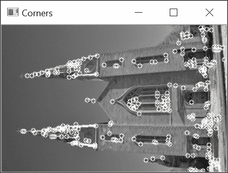

## 它是如何工作的...

为了定义图像中角点的概念，Harris 特征检测器会观察围绕一个假设的兴趣点的小窗口内强度的平均方向变化。如果我们考虑一个位移向量`(u,v)`，则可以通过平方差之和来测量强度变化：

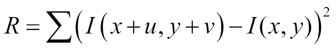

求和是在考虑的像素周围的定义区域上进行的（这个区域的大小对应于`cv::cornerHarris`函数的第三个参数）。然后可以在所有可能的方向上计算平均强度变化，这导致了一个角点的定义，即在一个以上的方向上平均变化较高的点。从这个定义出发，哈里斯测试如下进行：我们首先获得最大平均强度变化的方向。接下来，我们检查正交方向上的平均强度变化是否也较高。如果是这样，那么我们有一个角点。

从数学上讲，这个条件可以通过使用前一个公式的泰勒展开来近似测试：

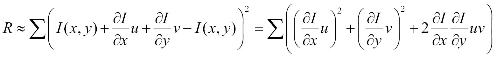

然后将它重写为矩阵形式：

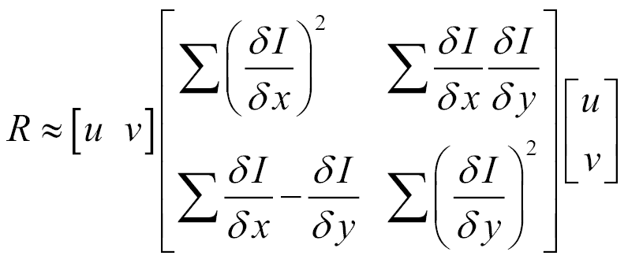

这个矩阵是一个协方差矩阵，它表征了所有方向上强度变化的速度。这个定义涉及到图像的第一导数，这些导数通常使用 Sobel 算子来计算。在 OpenCV 实现中，函数的第四个参数对应于用于 Sobel 滤波器计算的孔径。可以证明，协方差矩阵的两个特征值给出了最大平均强度变化和正交方向上的平均强度变化。然后，如果这两个特征值都较低，我们处于一个相对均匀的区域。如果一个特征值较高而另一个较低，我们必须处于一个边缘上。最后，如果两个特征值都较高，那么我们处于一个角点位置。因此，一个点要被接受为角点，其协方差矩阵的最小特征值必须高于一个给定的阈值。

哈里斯角算法的原始定义使用特征分解理论的一些性质来避免显式计算特征值的成本。这些性质如下：

+   矩阵的特征值的乘积等于其行列式

+   矩阵的特征值之和等于矩阵对角线之和（也称为矩阵的迹）

因此，我们可以通过计算以下分数来验证矩阵的特征值是否较高：

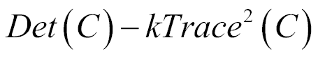

可以很容易地验证，只有当两个特征值都较高时，这个分数才会确实很高。这是`cv::cornerHarris`函数在每个像素位置计算出的分数。`k`的值被指定为函数的第五个参数。确定这个参数的最佳值可能很困难。然而，在实践中，`0.05`到`0.5`范围内的值通常可以得到良好的结果。

为了提高检测结果，前一小节中描述的类添加了一个额外的非最大值抑制步骤。这里的目的是排除相邻的其他 Harris 角。因此，为了被接受，Harris 角不仅必须具有高于指定阈值的分数，而且它还必须是局部最大值。这个条件是通过在`detect`方法中使用一个简单的技巧来测试的，即膨胀 Harris 分数的图像：

```py
    cv::dilate(cornerStrength, dilated,cv::Mat()); 

```

由于膨胀操作将每个像素值替换为定义的邻域中的最大值，因此唯一不会修改的点就是局部最大值。这正是以下等式测试所验证的：

```py
    cv::compare(cornerStrength, dilated, localMax,cv::CMP_EQ); 

```

因此，`localMax`矩阵仅在局部最大值位置为真（即非零）。然后我们在`getCornerMap`方法中使用它来抑制所有非最大特征（使用`cv::bitwise`函数）。

## 还有更多...

可以对原始的 Harris 角算法进行额外的改进。本节描述了 OpenCV 中找到的另一个角检测器，它扩展了 Harris 检测器，使其角在图像中分布得更均匀。正如我们将看到的，这个算子实现了一个通用接口，定义了所有特征检测算子的行为。此接口允许在同一个应用程序中轻松测试不同的兴趣点检测器。

### 轨迹良好的特征

随着浮点处理器的出现，为了避免特征值分解而引入的数学简化变得可以忽略不计，因此，基于显式计算的特征值进行 Harris 角检测成为可能。原则上，这种修改不应显著影响检测结果，但它避免了使用任意的`k`参数。请注意，存在两个函数允许您显式获取 Harris 协方差矩阵的特征值（和特征向量）；这些是`cv::cornerEigenValsAndVecs`和`cv::cornerMinEigenVal`。

第二次修改解决了特征点聚类的问题。事实上，尽管引入了局部最大值条件，但兴趣点往往在图像中分布不均匀，在高度纹理的位置显示出集中。解决这个问题的方法是在两个兴趣点之间施加最小距离。这可以通过以下算法实现。从具有最强 Harris 分数的点（即具有最大的最小特征值）开始，只有当它们位于已接受点的至少给定距离处时，才接受兴趣点。这个解决方案在 OpenCV 中通过**good-features-to-track**（**GFTT**）算子实现，因此得名，因为检测到的特征可以用作视觉跟踪应用中的良好起始集。此算子如下部署：

```py
    // Compute good features to track 
    std::vector<cv::KeyPoint> keypoints; 
    // GFTT detector 
    cv::Ptr<cv::GFTTDetector> ptrGFTT =  
        cv::GFTTDetector::create( 
                        500,   // maximum number of keypoints
                        0.01,  // quality level 
                        10);   //minimum allowed distance between points 
    // detect the GFTT 
    ptrGFTT->detect(image,keypoints); 

```

第一步是使用适当的静态函数（在此处，`cv::GFTTDetector::create`）和初始化参数来创建特征检测器。除了质量级别阈值值和兴趣点之间可容忍的最小距离之外，该函数还使用可以返回的最大点数（这是可能的，因为点按强度顺序接受）。调用此函数返回一个指向检测器实例的 OpenCV 智能指针。一旦构建了此对象，就可以调用其`detect`方法。请注意，通用接口还包括`cv::Keypoint`类的定义，该类封装了每个检测到的特征点的属性。对于 Harris 角点，仅与关键点的位置及其响应强度相关。本章的“检测尺度不变特征”食谱将讨论可以与关键点关联的其他属性。

之前的代码产生以下结果：

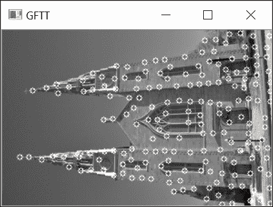

这种方法增加了检测的复杂性，因为它需要按 Harris 分数对兴趣点进行排序，但它也明显改善了点在图像中的分布。请注意，此函数还包括一个可选标志，请求使用经典角点分数定义（使用协方差矩阵的行列式和迹）来检测 Harris 角点。

OpenCV 的特征检测器通用接口定义了一个名为`cv::Feature2D`的抽象类，该类基本上强制执行了以下签名中的`detect`操作：

```py
    void detect( cv::InputArray image,  
                 std::vector<KeyPoint>& keypoints,  
                 cv::InputArray mask ); 

    void detect( cv::InputArrayOfArrays images,                 
                 std::vector<std::vector<KeyPoint> >& keypoints,          
                 cv::InputArrayOfArrays masks ); 

```

第二种方法允许在图像向量中检测兴趣点。该类还包括其他方法，例如计算特征描述符的方法（将在下一章讨论）以及可以读取和写入检测到的点的文件的方法。

## 参见

+   描述 Harris 算子的经典文章由 C. Harris 和 M.J. Stephens 撰写，《A combined corner and edge detector》，《Alvey Vision Conference》，第 147-152 页，1988 年

+   J. Shi 和 C. Tomasi 的文章《Good features to track》，《Int. Conference on Computer Vision and Pattern Recognition》，第 593-600 页，1994 年，介绍了这种特殊特征

+   K. Mikolajczyk 和 C. Schmid 的文章《Scale and Affine invariant interest point detectors》，《International Journal of Computer Vision》，第 60 卷，第 1 期，第 63-86 页，2004 年，提出了一种多尺度且仿射不变性的 Harris 算子

# 快速检测特征

Harris 算子为角点（或更一般地说，兴趣点）提出了基于两个垂直方向上强度变化率的正式数学定义。尽管这是一个合理的定义，但它需要计算图像导数，这是一个成本高昂的操作，尤其是考虑到兴趣点检测通常只是更复杂算法的第一步。

在这个菜谱中，我们介绍另一个特征点操作符，称为**FAST**（**加速段测试中的特征**）。这个操作符是专门设计用来允许快速检测图像中的兴趣点，接受或拒绝关键点的决定仅基于少数像素比较。

## 如何做...

如前一个菜谱的最后部分所看到的，在图像中检测角点，使用 OpenCV 的通用特征点检测接口使得部署任何特征点检测器变得容易。本菜谱中介绍的检测器是 FAST 检测器。正如其名所示，它被设计用来快速检测图像中的兴趣点：

```py
    // vector of keypoints 
    std::vector<cv::KeyPoint> keypoints; 
    // FAST detector with a threshold of 40 
    cv::Ptr<cv::FastFeatureDetector> ptrFAST =
            cv::FastFeatureDetector::create(40); 
    // detect the keypoints 
    ptrFAST->detect(image,keypoints); 

```

注意，OpenCV 还提供了一个通用的函数来在图像上绘制`关键点`：

```py
    cv::drawKeypoints(image,                      // original image 
          keypoints,                              // vector of keypoints 
          image,                                  // the output image 
          cv::Scalar(255,255,255),                // keypoint color 
          cv::DrawMatchesFlags::DRAW_OVER_OUTIMG);// drawing flag 

```

通过指定选择的绘制标志，关键点被绘制在输入图像上，从而产生以下输出结果：

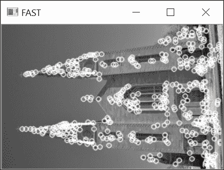

一个有趣的选择是为关键点颜色指定一个负值。在这种情况下，每个绘制的圆将选择不同的随机颜色。

## 它是如何工作的...

就像哈里斯点检测器的情况一样，FAST 特征算法源自构成角点的定义。这次，这个定义基于假设特征点周围的图像强度。是否接受关键点的决定是通过检查以候选点为中心的像素圆来做出的。如果在圆周上找到一个连续点弧，其长度大于圆周长度的四分之三，并且所有像素与中心点的强度显著不同（要么都是较暗的，要么都是较亮的），则宣布存在一个关键点。

这是一个可以快速计算的简单测试。此外，在其原始公式中，该算法使用了一个额外的技巧来进一步加快处理速度。确实，如果我们首先测试圆周上相隔 90 度的四个点（例如，顶部、底部、右侧和左侧点），可以很容易地证明，为了满足之前表达的条件，至少有三个这些点都必须与中心像素一样亮或一样暗。

如果不是这种情况，点可以立即被拒绝，无需检查圆周上的其他点。这是一个非常有效的测试，因为在实践中，大多数图像点都会通过这个简单的 4 比较测试被拒绝。

从原则上讲，检查像素的圆的半径可以是该方法的一个参数。然而，在实践中，半径为`3`既能提供良好的结果，又具有高效率。因此，圆周上需要考虑的像素有`16`个，如下所示：

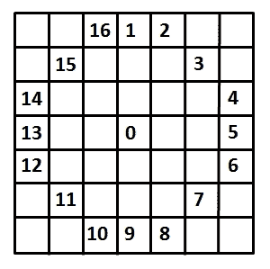

用于预测试的四个点是像素**1**、**5**、**9**和**13**，所需的连续暗或亮点的数量是**9**。这种特定设置通常被称为 FAST-9 角点检测器，这是 OpenCV 默认使用的。实际上，您可以在构建检测器实例时指定要使用的 FAST 检测器类型；还有一个`setType`方法。选项有`cv::FastFeatureDetector::TYPE_5_8`、`cv::FastFeatureDetector::TYPE_7_12`和`cv::FastFeatureDetector::TYPE_9_16`。

要被视为明显更暗或更亮，点的强度必须至少与中心像素的强度差异给定量；此值对应于创建检测器实例时指定的阈值参数。此阈值越大，检测到的角点就越少。

对于 Harris 特征，通常最好对已找到的角点执行非极大值抑制。因此，需要定义一个角点强度度量。可以考虑几种替代度量，而保留的是以下度量。角点的强度由中心像素与识别出的连续弧上的像素之间的绝对差之和给出。您可以从`cv::KeyPoint`实例的`response`属性中读取角点强度。

此算法导致非常快的兴趣点检测，因此在速度是关注点时，这是首选的特征。例如，在实时视觉跟踪或对象识别应用中，必须跟踪或匹配实时视频流中的多个点时，情况就是这样。

## 还有更多...

可以使用不同的策略来使特征检测更适合您的应用程序。

例如，有时可能希望动态调整特征检测以获得预定义数量的兴趣点。实现此目标的一个简单策略是使用宽容的检测阈值，以便获得大量兴趣点。然后，您只需从集合中提取第 n 个最强的点。一个标准的 C++函数允许您完成此操作：

```py
    if (numberOfPoints < keypoints.size()) 
      std::nth_element(keypoints.begin(),
                       keypoints.begin() + numberOfPoints,
                       keypoints.end(),
                       [](cv::KeyPoint& a, cv::KeyPoint& b) { 
                       return a.response > b.response; }); 

```

在这里，`keypoints`是您检测到的兴趣点的`std::vector`，而`numberOfPoints`是期望的兴趣点数量。此函数中的最后一个参数是用于提取最佳兴趣点的 lambda 比较器。请注意，如果检测到的兴趣点数量太低（即低于寻求的数量），这意味着您应该使用较低的阈值进行检测。然而，使用非常宽容的阈值通常会增加计算负载；因此，必须确定一个权衡值。

在检测特征时，经常出现的一个问题是图像中兴趣点的分布不均匀。确实，`关键点`往往聚集在图像的高纹理区域。例如，以下是在我们的教堂图像上检测`100`个兴趣点得到的结果：

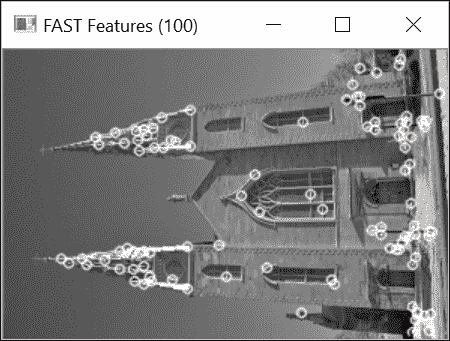

如您所见，大多数特征点位于建筑的上下部分。为了在图像中获得更好的兴趣点分布，常用的策略是将该图像划分为子图像的网格，并对每个子图像进行独立的检测。以下代码执行了这种网格自适应检测：

```py
    // The final vector of keypoints 
    keypoints.clear(); 
    // detect on each grid 
    for (int i = 0; i < vstep; i++) 
      for (int j = 0; j < hstep; j++) { 
        // create ROI over current grid 
        imageROI = image(cv::Rect(j*hsize, i*vsize, hsize, vsize)); 
        // detect the keypoints in grid 
        gridpoints.clear(); 
        ptrFAST->detect(imageROI, gridpoints); 

        // get the strongest FAST features 
        auto itEnd(gridpoints.end()); 
        if (gridpoints.size() > subtotal) {  
          // select the strongest features 
          std::nth_element(gridpoints.begin(),
                           gridpoints.begin() + subtotal, 
                           gridpoints.end(),
                           [](cv::KeyPoint& a,
                           cv::KeyPoint& b) { 
            return a.response > b.response; }); 
          itEnd = gridpoints.begin() + subtotal; 
        } 

        // add them to the global keypoint vector 
        for (auto it = gridpoints.begin(); it != itEnd; ++it) { 
          // convert to image coordinates 
          it->pt += cv::Point2f(j*hsize, i*vsize);  
          keypoints.push_back(*it); 
      } 
    } 

```

这里的关键思想是使用图像区域（ROI）来在每个子图像中进行关键点检测。结果检测显示出更均匀的关键点分布：

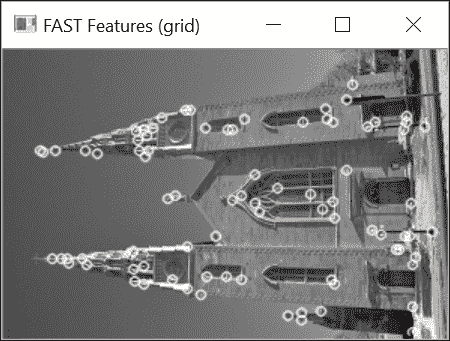

## 参见

+   OpenCV2 包含了专门的适应特征检测包装类；例如，`cv::DynamicAdaptedFeatureDetector` 或 `GridAdaptedFeatureDetector`

+   E. Rosten 和 T. Drummond 的文章，*高速角点检测的机器学习*，*国际欧洲计算机视觉会议，第 430-443 页*，2006 年，详细描述了 FAST 特征算法及其变体。

# 检测尺度不变特征

特征检测的视域不变性在本章引言中被提出作为一个重要概念。虽然方向不变性，即即使图像旋转也能检测到相同点的能力，已经被迄今为止提出的简单特征点检测器相对较好地处理，但尺度变化的不变性更难实现。为了解决这个问题，计算机视觉中引入了尺度不变特征的概念。这里的想法不仅是在任何尺度下都能一致地检测关键点，而且每个检测到的特征点都与一个尺度因子相关联。理想情况下，对于在两个不同图像的两个不同尺度上具有相同对象点的特征点，两个计算出的尺度因子的比率应该对应于它们各自尺度的比率。近年来，已经提出了几种尺度不变特征，本食谱介绍其中之一，即**SURF**特征。SURF 代表**加速鲁棒特征**，正如我们将看到的，它们不仅是尺度不变特征，而且计算效率高。

## 如何操作...

SURF 特征检测器是`opencv_contrib`仓库的一部分。要使用它，你必须已经构建了 OpenCV 库以及这些额外的模块，如第一章中所述，*玩转图像*。特别是，我们对此处的`cv::xfeatures2d`模块感兴趣，它为我们提供了访问`cv::xfeatures2d::SurfFeatureDetector`类的权限。至于其他检测器，首先创建检测器的一个实例，然后调用其`detect`方法来检测兴趣点：

```py
    // Construct the SURF feature detector object 
    cv::Ptr<cv::xfeatures2d::SurfFeatureDetector> ptrSURF =   
                cv::xfeatures2d::SurfFeatureDetector::create(2000.0); 
    // detect the keypoints 
    ptrSURF->detect(image, keypoints); 

```

要绘制这些特征，我们再次使用`cv::drawKeypoints` OpenCV 函数，但现在使用`cv::DrawMatchesFlags::DRAW_RICH_KEYPOINTS`标志，这样我们就可以可视化相关的尺度因子：

```py
    // Draw the keypoints with scale and orientation information 
    cv::drawKeypoints(image,                     // original image 
               keypoints,                        // vector of keypoints 
               featureImage,                     // the resulting image 
               cv::Scalar(255,255,255),          // color of the points 
               cv::DrawMatchesFlags::DRAW_RICH_KEYPOINTS); 

```

检测到特征后的图像如下所示：

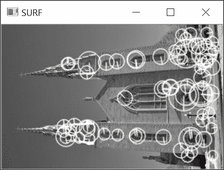

在这里，使用`cv::DrawMatchesFlags::DRAW_RICH_KEYPOINTS`标志得到的特征点圆的大小与每个特征的计算尺度成正比。SURF 算法还与每个特征关联一个方向，使它们对旋转不变。这个方向通过每个绘制圆内的径向线表示。

如果我们用不同尺度的另一张相同物体的照片，特征检测的结果如下：

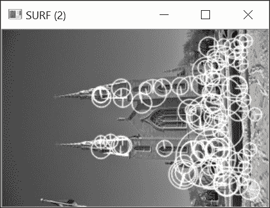

通过仔细观察两张图像上检测到的关键点，可以看出对应圆的大小变化通常与尺度变化成比例。例如，考虑教堂右侧的两个窗户；在两张图像中，都检测到了该位置的一个 SURF 特征，并且两个对应的不同大小的圆包含了相同的视觉元素。当然，并非所有特征都如此，但正如我们将在下一章中发现的，重复率足够高，可以允许两张图像之间进行良好的匹配。

## 它是如何工作的...

在第六章，*过滤图像*中，我们了解到可以使用高斯滤波器估计图像的导数。这些滤波器使用一个`σ`参数，它定义了核的孔径（大小）。正如我们所见，这个`σ`参数对应于构建滤波器所使用的高斯函数的方差，并隐式地定义了评估导数的尺度。确实，具有较大`σ`值的滤波器会平滑掉图像的更细的细节。这就是为什么我们可以说它在更粗的尺度上操作。

现在，如果我们使用不同尺度的高斯滤波器计算给定图像点的拉普拉斯算子，那么会得到不同的值。观察不同尺度因子滤波器响应的变化，我们得到一条曲线，最终在给定的`σ`值处达到最大值。如果我们从两个不同尺度拍摄的两个相同物体的图像中提取这个最大值，这两个`σ`最大值之比应该对应于拍摄图像的尺度之比。这个重要的观察结果是尺度不变特征提取过程的核心。也就是说，尺度不变特征应该在空间空间（在图像中）和尺度空间（通过在不同尺度上应用导数滤波器获得）中的局部最大值中被检测到。

SURF 通过以下步骤实现这个想法。首先，为了检测特征，计算每个像素处的 Hessian 矩阵。这个矩阵衡量函数的局部曲率，定义为如下：

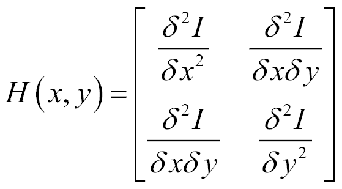

这个矩阵的行列式给出了这个曲率的强度。因此，定义角点为具有高局部曲率（即在一个以上方向上的高变化）的图像点。由于它由二阶导数组成，这个矩阵可以使用不同尺度的高斯核的拉普拉斯算子来计算，即对于不同的`σ`值。因此，当这个 Hessian 的行列式在空间和尺度空间中都达到局部最大值时（即需要进行`3x3x3`非最大值抑制），就声明了一个尺度不变特征。请注意，为了被视为一个有效点，这个行列式必须具有由`cv::xfeatures2d::SurfFeatureDetector`类的`create`方法的第一参数指定的最小值。

然而，在不同尺度上计算所有这些导数是计算上代价高昂的。SURF 算法的目的是使这个过程尽可能高效。这是通过使用仅涉及少量整数加法的近似高斯核来实现的。这些核具有以下结构：

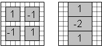

左侧的核用于估计混合的二阶导数，而右侧的核用于估计垂直方向上的二阶导数。这个二阶核的旋转版本用于估计水平方向上的二阶导数。最小的核大小为`9x9`像素，对应于`σ≈1.2`。为了获得尺度空间表示，依次应用不同大小的核。通过`cv::xfeatures2d::SurfFeatureDetector::create`方法的附加参数可以指定应用的滤波器的确切数量。默认情况下，使用`12`种不同大小的核（大小从`99x99`不等）。请注意，正如在第四章中解释的那样，*使用直方图计数像素*，使用积分图像可以保证每个滤波器每个叶子的内部和可以通过仅使用三个与滤波器大小无关的加法来计算。

一旦识别出局部极大值，通过在尺度和图像空间中进行插值，就可以获得每个检测到的兴趣点的精确位置。结果是具有亚像素精度的特征点集，并且与一个尺度值相关联。

## 还有更多...

SURF 算法被开发为另一个著名的尺度不变特征检测器 SIFT（**尺度不变特征变换**）的高效变体。

### SIFT 特征检测算法

SIFT 也在图像和尺度空间中检测特征作为局部极大值，但使用拉普拉斯滤波器响应而不是 Hessian 行列式。这个拉普拉斯在不同的尺度（即`σ`的增大值）上使用高斯差分滤波器计算，如第六章中所述，*图像滤波*。为了提高效率，每次`σ`的值加倍时，图像的大小就减少两倍。每个金字塔层对应一个八度，每个尺度是一个*层*。通常每个八度有三个层。

下图展示了两个八度的金字塔，其中第一个八度的四个高斯滤波图像产生了三个 DoG 层：

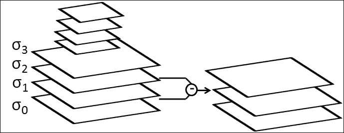

SIFT 特征的检测过程与 SURF 非常相似：

```py
    // Construct the SIFT feature detector object 
    cv::Ptr<cv::xfeatures2d::SiftFeatureDetector> ptrSIFT =    
                         cv::xfeatures2d::SiftFeatureDetector::create(); 
    // detect the keypoints 
    ptrSIFT->detect(image, keypoints); 

```

在这里，我们使用所有默认参数来构建检测器，但你也可以指定所需的 SIFT 点数（保留最强的点），每八度带的层数，以及`σ`的初始值。如图所示，使用三个八度带进行检测（默认值）会导致相当广泛的尺度范围：

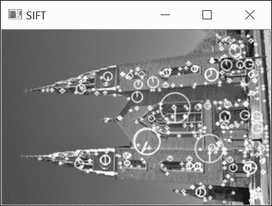

由于特征点的计算基于浮点核，SIFT 通常被认为在空间和尺度方面在特征定位方面更准确。同样，它也更耗费计算资源，尽管这种相对效率取决于每个特定的实现。

注意，在这个配方中，我们使用了`cv::xfeatures2d::SurfFeatureDetector`和`cv::xfeatures2d::SiftFeatureDetector`类来明确表示我们正在将它们用作兴趣点检测器。同样，我们也可以使用`cv::xfeatures2d::SURF`和`cv::xfeatures2d::SIFT`类（它们是类型等效的）。实际上，SURF 和 SIFT 算子涵盖了兴趣点的检测和描述。兴趣点描述是下一章的主题。

最后一点，重要的是要提到 SURF 和 SIFT 算子已被专利，因此它们在商业应用中的使用可能受到许可协议的约束。这种限制是这些特征检测器出现在`cv::xfeatures2d`包中的原因之一。

## 参见

+   第六章中的*计算图像的拉普拉斯算子*配方，*过滤图像*，提供了关于高斯拉普拉斯算子和高斯差分的更多细节

+   第四章中的*使用积分图像计数像素*配方，*使用直方图计数像素*，解释了积分图像如何加速像素和的计算

+   第九章中的*描述和匹配局部强度模式*配方，*描述和匹配兴趣点*，解释了这些尺度不变特征如何被描述以实现鲁棒的图像匹配

+   H. Bay、A. Ess、T. Tuytelaars 和 L. Van Gool 在*计算机视觉与图像理解，第 110 卷，第 3 期，2008 年，第 346-359 页*上发表的*SURF：加速鲁棒特征*文章，描述了 SURF 特征算法

+   D. Lowe 在*国际计算机视觉杂志，第 60 卷，第 2 期，2004 年，第 91-110 页*上发表的*从尺度不变特征中提取独特图像特征*开创性工作，描述了 SIFT 算法

# 在多个尺度上检测 FAST 特征

FAST 被引入作为一种快速检测图像中关键点的方法。在 SURF 和 SIFT 中，重点是设计尺度不变的特征。最近，提出了新的兴趣点检测器，旨在实现快速检测和对尺度变化的鲁棒性。本食谱介绍了**二值鲁棒不变可伸缩关键点**（**BRISK**）检测器。它基于我们在本章先前的食谱中描述的 FAST 特征检测器。另一种称为**ORB**（**方向性 FAST 和旋转 BRIEF**）的检测器也将在本食谱的末尾讨论。这两个特征点检测器构成了在需要快速且可靠图像匹配时的优秀解决方案。当与它们相关的二进制描述符一起使用时，它们尤其有效，这一点将在第九章 *描述和匹配兴趣点* 中讨论。

## 如何操作...

按照我们在先前的食谱中所做的那样，我们首先创建检测器的一个实例，然后在一个图像上调用`detect`方法：

```py
    // Construct the BRISK feature detector object 
    cv::Ptr<cv::BRISK> ptrBRISK = cv::BRISK::create(); 
    // detect the keypoints 
    ptrBRISK->detect(image, keypoints); 

```

图像结果显示了 BRISK 在多个尺度上检测到的`关键点`：

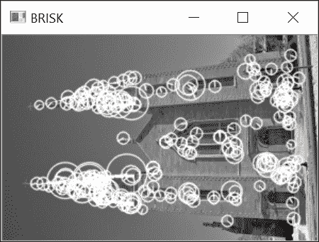

## 它是如何工作的...

BRISK 不仅是一个特征点检测器；该方法还包括一个描述每个检测到的关键点邻域的步骤。这一第二个方面将是下一章的主题。在这里，我们描述了如何使用 BRISK 在多个尺度上快速检测关键点。

为了检测不同尺度的兴趣点，该方法首先通过两个下采样过程构建一个图像金字塔。第一个过程从原始图像大小开始，并在每一层（或八度）将其缩小一半。其次，通过将原始图像下采样一个因子`1.5`来创建中间层，然后从这个缩小后的图像中，通过连续的半采样生成额外的层。

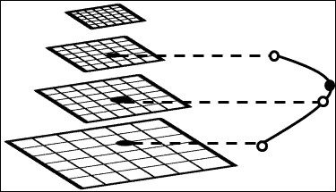

然后将 FAST 特征检测器应用于金字塔中的所有图像。关键点提取基于与 SIFT 使用的类似的标准。首先，一个可接受的兴趣点必须是一个局部最大值，当将其强度与其八个空间邻居之一比较时。如果是这种情况，该点随后将与上下层相邻点的分数进行比较；如果其分数在尺度上更高，则它被接受为兴趣点。BRISK 的一个关键方面在于金字塔的不同层具有不同的分辨率。该方法需要在尺度和空间上进行插值，以精确地定位每个关键点。这种插值基于 FAST 关键点分数。在空间上，插值在`3x3`邻域内进行。在尺度上，它通过沿尺度轴通过当前点及其上下层中的两个相邻局部关键点拟合一维抛物线来计算；这种尺度上的关键点定位在先前的图中进行了说明。因此，即使 FAST 关键点检测是在离散图像尺度上进行的，与每个关键点相关联的检测尺度也是连续值。

`cv::BRISK` 检测器有两个主要参数。第一个参数是用于接受 FAST 关键点的阈值值，第二个参数是将在图像金字塔中生成的八分音数量；在我们的例子中，我们使用了`5`个八分音，这解释了检测到的关键点中存在大量尺度。

## 还有更多...

BRISK 并不是 OpenCV 中提出的唯一的多尺度快速检测器。另一个是 ORB 特征检测器，它也可以执行高效的关键点检测。

### ORB 特征检测算法

ORB 代表定向 FAST 和旋转 BRIEF。这个缩写的第一部分指的是关键点检测部分，而第二部分指的是 ORB 提出的描述符。在这里，我们关注检测方法；描述符将在下一章中介绍。

与 BRISK 一样，ORB 首先创建一个图像金字塔。这个金字塔由多个层组成，每一层都是前一层通过一定比例因子（通常是`8`个尺度，`1.2`的比例因子减少；这些是在创建`cv::ORB`检测器时的默认参数值）的下采样版本。然后接受最强的`N`个关键点，其中关键点分数由本章第一道菜中定义的 Harris 角点度测量，即（该方法的作者发现 Harris 分数比通常的 FAST 角点强度更可靠的度量）。

ORB 检测器的原始特点在于每个检测到的兴趣点都与一个方向相关联。正如我们将在下一章中看到的，这些信息将有助于对齐在不同图像中检测到的关键点的描述符。在第七章的“计算组件的形状描述符”配方中，“提取线条、轮廓和组件”，我们介绍了图像矩的概念，特别是我们展示了如何从组件的前三个矩计算其质心。ORB 建议使用围绕关键点的圆形邻域的质心的方向。由于，根据定义，FAST 关键点总是有一个偏心的质心，因此连接中心点和质心的线的角度总是定义良好的。

ORB 特征检测如下：

```py
    // Construct the ORB feature detector object 
    cv::Ptr<cv::ORB> ptrORB =  
      cv::ORB::create(75,  // total number of keypoints 
                      1.2, // scale factor between layers 
                      8);  // number of layers in pyramid 
    // detect the keypoints 
    ptrORB->detect(image, keypoints); 

```

此调用产生以下结果：

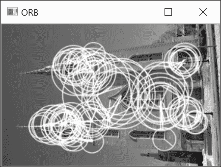

如所示，由于关键点在每个金字塔层上独立检测，检测器倾向于在不同尺度上重复检测相同的特征点。

## 参见

+   第九章的“匹配二进制描述符”配方中，“描述和匹配兴趣点”，解释了如何使用简单的二进制描述符进行高效鲁棒的匹配这些特征。

+   由 S. Leutenegger、M. Chli 和 R. Y. Siegwart 在 2011 年 IEEE 国际计算机视觉会议上的文章“BRISK：二进制鲁棒可伸缩关键点”描述了 BRISK 特征算法。

+   由 E. Rublee、V. Rabaud、K. Konolige 和 G. Bradski 在 2011 年 IEEE 国际计算机视觉会议上的文章“ORB：SIFT 或 SURF 的有效替代方案”，第 2564-2571 页，描述了 ORB 特征算法。
