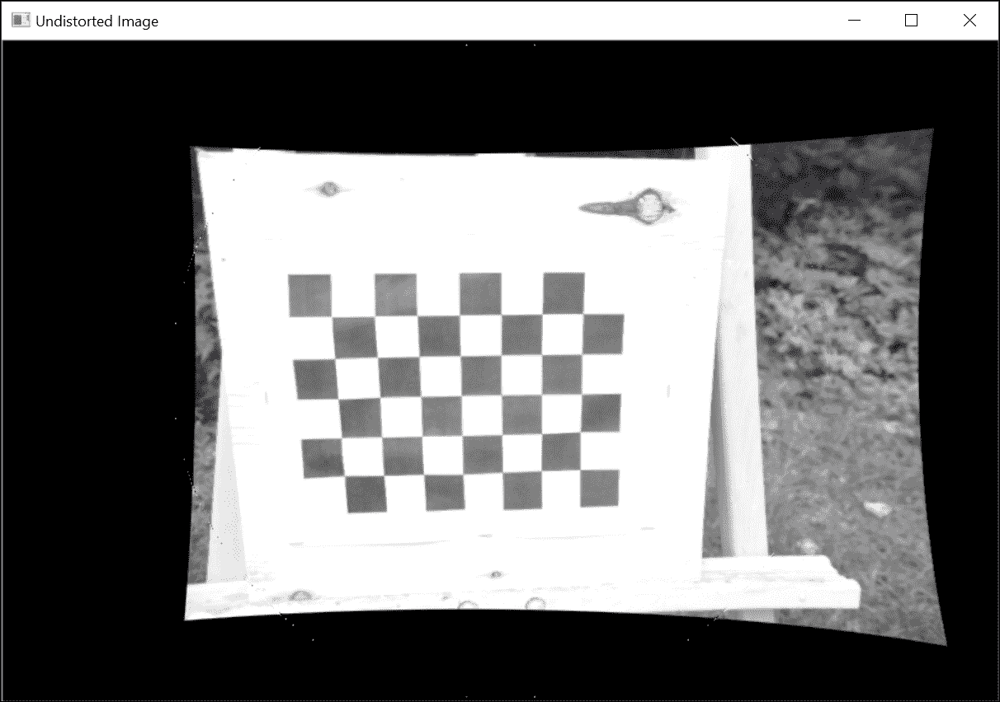

# 第十一章。重建 3D 场景

在本章中，我们将介绍以下内容：

+   校准相机

+   恢复相机姿态

+   从校准相机中重建 3D 场景

+   从立体图像计算深度

# 简介

在上一章中，我们学习了相机如何通过在二维传感器平面上投影光线来捕捉 3D 场景。产生的图像是从特定视角捕捉图像时的场景的准确表示。然而，由于图像形成的本质，这个过程消除了关于所表示场景元素深度的所有信息。本章将介绍在特定条件下，场景的 3D 结构和捕获它的相机的 3D 姿态如何被恢复。我们将看到对投影几何概念的良好理解如何使我们能够设计出实现 3D 重建的方法。因此，我们将回顾上一章中引入的图像形成原理；特别是，我们现在将考虑我们的图像是由像素组成的。

## 数字图像形成

现在我们重新绘制第十章中所示的图像的新版本，该图像描述了针孔相机模型。更具体地说，我们想展示 3D 位置`(X,Y,Z)`上的一个点与其在指定像素坐标的相机上的图像`(x,y)`之间的关系：


注意对原始图像所做的更改。首先，我们在投影中心的参考坐标系中添加了一个参考框架。其次，我们将`Y`轴指向下方，以获得与通常将图像原点放置在图像右上角的习惯相符的坐标系。最后，我们还识别了图像平面上的一个特殊点：考虑到从焦点发出的垂直于图像平面的线，点`(u0,v0)`是这条线穿过图像平面的像素位置。这个点被称为**主点**。从逻辑上讲，可以假设这个主点位于图像平面的中心，但在实践中，这个点可能偏离几个像素，这取决于相机制造的精度。

在上一章中，我们了解到针孔模型中相机的本质参数是其焦距和图像平面的尺寸（它定义了相机的视场）。此外，由于我们处理的是数字图像，图像平面上像素的数量（其分辨率）也是相机的另一个重要特征。我们还了解到，3D 点`(X,Y,Z)`将被投影到图像平面上，其位置为`(fX/Z,fY/Z)`。

现在，如果我们想将这个坐标转换为像素，我们需要分别将 2D 图像位置除以像素宽度（`px`）和高度（`py`）。我们注意到，通过将以世界单位（通常以毫米为单位）给出的焦距除以`px`，我们得到以（水平）像素表示的焦距。因此，让我们定义这个术语为`fx`。同样，`fy = f / py`被定义为以垂直像素单位表示的焦距。因此，完整的投影方程如下：


回想一下，`(u0,v0)`是主点，它被添加到结果中以将原点移动到图像的左上角。还要注意，像素的物理尺寸可以通过将图像传感器的尺寸（通常以毫米为单位）除以像素数（水平或垂直）来获得。在现代传感器中，像素通常是正方形的，也就是说，它们的水平和垂直尺寸相同。

前面的方程可以写成矩阵形式，就像我们在第十章“在图像中估计投影关系”中所做的那样。以下是投影方程在其最一般形式下的完整表达式：


# 校准相机

相机校准是获取不同相机参数（即在投影方程中出现的参数）的过程。显然，可以使用相机制造商提供的规格，但对于某些任务，如 3D 重建，这些规格可能不够精确。通过进行适当的相机校准步骤，可以获得准确的校准信息。

一个主动的相机校准过程将通过向相机展示已知图案并分析获得的图像来进行。然后，一个优化过程将确定解释观察结果的最佳参数值。这是一个复杂的过程，但由于 OpenCV 校准函数的可用性，这个过程变得简单易行。

## 如何操作...

要校准相机，其思路是向相机展示一组已知其 3D 位置的场景点。然后，你需要观察这些点在图像上的投影位置。有了足够数量的 3D 点和相关的 2D 图像点的知识，可以从投影方程中推断出确切的相机参数。显然，为了获得准确的结果，我们需要观察尽可能多的点。实现这一目标的一种方法是对具有许多已知 3D 点的场景拍摄一张照片，但在实践中，这很少可行。更方便的方法是从不同的视角对一组 3D 点拍摄多张照片。这种方法更简单，但除了计算内部相机参数外，还需要计算每个相机视图的位置，幸运的是，这是可行的。

OpenCV 建议你使用棋盘图案来生成校准所需的 3D 场景点集。这个图案在每个方格的角上创建点，由于这个图案是平的，我们可以自由地假设板位于`Z=0`，`X`和`Y`轴与网格对齐。

在这种情况下，校准过程简单地包括从不同的视角向相机展示棋盘图案。以下是在校准步骤中捕获的由`7x5`内角组成的校准图案图像的一个示例：


好处是 OpenCV 有一个函数可以自动检测这个棋盘图案的角。你只需提供一个图像和使用的棋盘大小（水平和垂直内角点的数量）。该函数将返回图像上这些棋盘角的坐标。如果函数无法找到图案，则简单地返回`false`：

```py
    // output vectors of image points 
    std::vector<cv::Point2f> imageCorners; 
    // number of inner corners on the chessboard 
    cv::Size boardSize(7,5); 
    // Get the chessboard corners 
    bool found = cv::findChessboardCorners( 
                         image,         // image of chessboard pattern 
                         boardSize,     // size of pattern 
                         imageCorners); // list of detected corners 

```

输出参数`imageCorners`将简单地包含显示图案中检测到的内角的像素坐标。请注意，如果需要调整算法，该函数接受额外的参数，但这在此处未讨论。还有一个特殊函数可以在棋盘图像上绘制检测到的角，并用线条按顺序连接它们：

```py
    // Draw the corners 
    cv::drawChessboardCorners(image, boardSize,  
                      imageCorners, found); // corners have been found 

```

下面的图像是得到的：


连接点的线条显示了在检测到的图像点向量中点的列表顺序。为了进行校准，我们现在需要指定相应的 3D 点。你可以选择你喜欢的单位来指定这些点（例如，厘米或英寸）；然而，最简单的方法是假设每个方格代表一个单位。在这种情况下，第一个点的坐标将是`(0,0,0)`（假设板位于`Z=0`的深度），第二个点的坐标将是`(1,0,0)`，以此类推，最后一个点位于`(6,4,0)`。这个图案总共有`35`个点，这太少了，无法获得精确的校准。要获得更多点，你需要从不同的视角展示相同校准图案的更多图像。为此，你可以移动图案到相机前，或者移动相机绕板旋转；从数学的角度来看，这是完全等价的。OpenCV 的校准函数假设参考框架固定在校准图案上，并将计算相机相对于参考框架的旋转和平移。

现在我们将校准过程封装在一个`CameraCalibrator`类中。这个类的属性如下：

```py
    class CameraCalibrator { 

      // input points: 
      // the points in world coordinates 
      // (each square is one unit) 
      std::vector<std::vector<cv::Point3f>> objectPoints; 
      // the image point positions in pixels 
      std::vector<std::vector<cv::Point2f>> imagePoints; 
      // output Matrices 
      cv::Mat cameraMatrix; 
      cv::Mat distCoeffs; 
      // flag to specify how calibration is done 
      int flag; 

```

注意，场景点和图像点的输入向量实际上是由点实例的`std::vector`组成的；每个向量元素是一个包含一个视图中点的向量。在这里，我们决定通过指定一个包含棋盘图像文件名的向量作为输入来添加校准点；该方法将负责从这些图像中提取点坐标：

```py
    // Open chessboard images and extract corner points 
    int CameraCalibrator::addChessboardPoints(      
        const std::vector<std::string> & filelist, // list of filenames 
        cv::Size & boardSize) {   // calibration board size 

      // the points on the chessboard 
      std::vector<cv::Point2f> imageCorners; 
      std::vector<cv::Point3f> objectCorners; 

      // 3D Scene Points: 
      // Initialize the chessboard corners  
      // in the chessboard reference frame 
      // The corners are at 3D location (X,Y,Z)= (i,j,0) 
      for (int i=0; i<boardSize.height; i++) { 
        for (int j=0; j<boardSize.width; j++) { 
          objectCorners.push_back(cv::Point3f(i, j, 0.0f)); 
        } 
      } 

      // 2D Image points: 
      cv::Mat image; //to contain chessboard image 
      int successes = 0; 
      // for all viewpoints 
      for (int i=0; i<filelist.size(); i++) { 

        // Open the image 
        image = cv::imread(filelist[i],0); 

        // Get the chessboard corners 
        bool found = cv::findChessboardCorners( 
                         image,         // image of chessboard pattern  
                         boardSize,     // size of pattern 
                         imageCorners); // list of detected corners 

        // Get subpixel accuracy on the corners 
        if (found) { 
          cv::cornerSubPix(image, imageCorners,  
               cv::Size(5, 5), // half size of serach window 
               cv::Size(-1, -1),  
               cv::TermCriteria( cv::TermCriteria::MAX_ITER +   
                   cv::TermCriteria::EPS, 30, // max number of iterations 
                   0.1));                     // min accuracy 

          // If we have a good board, add it to our data 
          if (imageCorners.size() == boardSize.area()) { 
            //Add image and scene points from one view 
            addPoints(imageCorners, objectCorners); 
            successes++; 
          } 
        } 

        // If we have a good board, add it to our data 
        if (imageCorners.size() == boardSize.area()) { 
          //Add image and scene points from one view 
          addPoints(imageCorners, objectCorners); 
          successes++; 
        } 
      } 
      return successes; 
    } 

```

第一个循环输入棋盘的 3D 坐标，相应的图像点是`cv::findChessboardCorners`函数提供的。这适用于所有可用的视点。此外，为了获得更精确的图像点位置，可以使用`cv::cornerSubPix`函数；正如其名所示，图像点将被定位到亚像素精度。由`cv::TermCriteria`对象指定的终止准则定义了最大迭代次数和亚像素坐标的最小精度。这两个条件中先达到的那个将停止角细化过程。

当一组棋盘角成功检测到后，这些点将通过我们的`addPoints`方法添加到图像和场景点的向量中。一旦处理了足够数量的棋盘图像（并且因此，有大量的 3D 场景点/2D 图像点对应关系可用），我们就可以开始计算校准参数，如下所示：

```py
    // Calibrate the camera 
    // returns the re-projection error 
    double CameraCalibrator::calibrate(cv::Size &imageSize) { 
      // Output rotations and translations 
      std::vector<cv::Mat> rvecs, tvecs; 

      // start calibration 
      return 
        calibrateCamera(objectPoints,  // the 3D points 
                        imagePoints,   // the image points 
                        imageSize,     // image size 
                        cameraMatrix,  // output camera matrix 
                        distCoeffs,    // output distortion matrix 
                        rvecs, tvecs,  // Rs, Ts  
                        flag);         // set options 
    } 

```

在实践中，`10`到`20`个棋盘图像就足够了，但这些图像必须从不同的视点和不同的深度拍摄。这个函数的两个重要输出是相机矩阵和畸变参数。这些内容将在下一节中进行描述。

## 它是如何工作的...

为了解释校准的结果，我们需要回到本章引言中提出的投影方程。这个方程描述了通过连续应用两个矩阵将一个 3D 点转换为一个 2D 点的过程。第一个矩阵包括所有的相机参数，这些参数被称为相机的内在参数。这个`3x3`矩阵是`cv::calibrateCamera`函数返回的输出矩阵之一。还有一个名为`cv::calibrationMatrixValues`的函数，它明确返回由校准矩阵给出的内在参数值。

第二个矩阵用于将输入点表示为以相机为中心的坐标。它由一个旋转向量（一个 `3x3` 矩阵）和一个平移向量（一个 `3x1` 矩阵）组成。记住，在我们的校准示例中，参考坐标系被放置在棋盘上。因此，必须为每个视图计算一个刚体变换（由矩阵条目 `r1` 到 `r9` 表示的旋转部分和由 `t1`、`t2` 和 `t3` 表示的平移部分）。这些在 `cv::calibrateCamera` 函数的输出参数列表中。旋转和平移部分通常被称为校准的**外参**，并且对于每个视图都是不同的。内参对于给定的相机/镜头系统是恒定的。

由 `cv::calibrateCamera` 提供的校准结果是通过一个优化过程获得的。这个过程旨在找到内参和外参，以最小化从 3D 场景点的投影计算出的预测图像点位置与实际图像点位置之间的差异。校准过程中指定所有点的这个差异之和被称为**重投影误差**。

我们从基于 `27` 张棋盘图像的校准中获得的测试相机的内参是 `fx=409` 像素，`fy=408` 像素，`u0=237` 像素，和 `v0=171` 像素。我们的校准图像大小为 `536x356` 像素。从校准结果中可以看出，正如预期的那样，主点接近图像中心，但偏离了几像素。校准图像是用尼康 D500 相机和 `18mm` 镜头拍摄的。查看制造商规格，我们发现该相机的传感器尺寸为 `23.5mm x 15.7mm`，这给我们一个像素尺寸为 `0.0438mm`。估计的焦距以像素表示，所以将结果乘以像素尺寸，我们得到一个估计的焦距为 `17.8mm`，这与我们实际使用的镜头是一致的。

现在我们将注意力转向畸变参数。到目前为止，我们提到，在针孔相机模型下，我们可以忽略镜头的影响。然而，这只在使用的镜头不会引入重要的光学畸变时才可能。不幸的是，对于低质量镜头或焦距非常短的镜头来说，情况并非如此。即使是我们在这次实验中使用的镜头也引入了一些畸变：矩形板的边缘在图像中是弯曲的。请注意，这种畸变随着我们远离图像中心而变得更加重要。这是一种典型的与鱼眼镜头观察到的畸变，被称为**径向畸变**。

通过引入适当的畸变模型，可以补偿这些变形。想法是通过一组数学方程来表示由镜头引起的畸变。一旦建立，这些方程就可以被逆转，以消除图像上可见的畸变。幸运的是，在校准阶段，可以同时获得将纠正畸变的变换的确切参数以及其他相机参数。一旦这样做，任何来自新校准相机的图像都将被校正。因此，我们在校准类中添加了另一种方法：

```py
    // remove distortion in an image (after calibration) 
    cv::Mat CameraCalibrator::remap(const cv::Mat &image) { 

      cv::Mat undistorted; 

      if (mustInitUndistort) { // called once per calibration 

        cv::initUndistortRectifyMap(   
                     cameraMatrix, // computed camera matrix 
                     distCoeffs,   // computed distortion matrix 
                     cv::Mat(),    // optional rectification (none)  
                     cv::Mat(),    // camera matrix to generate undistorted 
                     image.size(), // size of undistorted 
                     CV_32FC1,     // type of output map 
                     map1, map2);  // the x and y mapping functions 

        mustInitUndistort= false; 
      } 

      // Apply mapping functions 
      cv::remap(image, undistorted, map1, map2,        
                cv::INTER_LINEAR);     // interpolation type 

      return undistorted; 
    } 

```

在我们的校准图像之一上运行此代码会产生以下未畸变图像：



为了校正畸变，OpenCV 使用一个多项式函数，该函数应用于图像点，以便将它们移动到未畸变的位置。默认情况下，使用五个系数；还有一个由八个系数组成的模型可供选择。一旦获得这些系数，就可以计算两个`cv::Mat`映射函数（一个用于`x`坐标，一个用于`y`坐标），这将给出在畸变图像上图像点的新的未畸变位置。这是通过`cv::initUndistortRectifyMap`函数计算的，而`cv::remap`函数将输入图像的所有点重新映射到新图像。请注意，由于非线性变换，输入图像的一些像素现在超出了输出图像的边界。您可以通过扩展输出图像的大小来补偿这种像素损失，但您现在获得的输出像素在输入图像中没有值（它们将显示为黑色像素）。

## 更多内容...

在进行相机校准时，有更多选项可供选择。

### 使用已知内在参数进行校准

当已知相机内在参数的良好估计时，将它们输入到`cv::calibrateCamera`函数中可能是有益的。然后，它们将在优化过程中用作初始值。为此，您只需添加`cv::CALIB_USE_INTRINSIC_GUESS`标志并将这些值输入到校准矩阵参数中。还可以为主点（`cv::CALIB_FIX_PRINCIPAL_POINT`）指定一个固定值，这通常可以假设为中心像素。您还可以为焦距`fx`和`fy`指定一个固定比率（`cv::CALIB_FIX_RATIO`），在这种情况下，您假设像素是正方形的。

### 使用圆形网格进行校准

除了常用的棋盘格图案外，OpenCV 还提供了使用圆形网格校准相机的可能性。在这种情况下，圆的中心被用作校准点。相应的函数与我们用来定位棋盘格角落的函数非常相似，例如：

```py
    cv::Size boardSize(7,7); 
    std::vector<cv::Point2f> centers; 
    bool found = cv:: findCirclesGrid(image, boardSize, centers); 

```

## 参见

+   由 Z. Zhang 在 2000 年发表的，发表在《IEEE Transactions on Pattern Analysis and Machine Intelligence》第 22 卷第 11 期的《一种灵活的相机校准新方法》文章，是关于相机校准问题的一篇经典论文

# 恢复相机姿态

当相机校准时，就可以将捕获的图像与外部世界联系起来。我们之前解释过，如果知道一个物体的三维结构，那么就可以预测该物体在相机传感器上的成像方式。图像形成的过程实际上完全由本章开头提出的投影方程描述。当这个方程的大部分项已知时，就可以通过观察一些图像来推断其他元素（二维或三维）的值。在这个菜谱中，我们将探讨在观察到已知三维结构时，如何恢复相机姿态的问题。

## 如何做...

让我们考虑一个简单的物体，一个公园里的长椅。我们使用之前菜谱中校准过的相机/镜头系统拍摄了这张照片。我们还手动识别了长椅上的八个不同的图像点，我们将使用这些点来进行我们的相机姿态估计：


能够访问这个物体，就可以进行一些物理测量。这个长椅由一个`242.5cm x 53.5cm x 9cm`的座位和一个`242.5cm x 24cm x 9cm`的靠背组成，靠背固定在座位上方`12cm`处。使用这些信息，我们可以轻松地推导出八个识别点在某个以物体为中心的参考系中的三维坐标（在这里，我们将原点固定在两个平面交点的左侧）。然后我们可以创建一个包含这些坐标的`cv::Point3f`向量：

```py
    // Input object points 
    std::vector<cv::Point3f> objectPoints; 
    objectPoints.push_back(cv::Point3f(0, 45, 0)); 
    objectPoints.push_back(cv::Point3f(242.5, 45, 0)); 
    objectPoints.push_back(cv::Point3f(242.5, 21, 0)); 
    objectPoints.push_back(cv::Point3f(0, 21, 0)); 
    objectPoints.push_back(cv::Point3f(0, 9, -9)); 
    objectPoints.push_back(cv::Point3f(242.5, 9, -9)); 
    objectPoints.push_back(cv::Point3f(242.5, 9, 44.5)); 
    objectPoints.push_back(cv::Point3f(0, 9, 44.5)); 

```

现在的问题是，当拍摄所示图片时，相机相对于这些点的位置在哪里。由于已知这些已知点在二维图像平面上的图像坐标，因此使用`cv::solvePnP`函数就可以很容易地回答这个问题。在这里，三维点和二维点之间的对应关系是手动建立的，但应该能够想出一些方法，使你能够自动获得这些信息：

```py
    // Input image points 
    std::vector<cv::Point2f> imagePoints; 
    imagePoints.push_back(cv::Point2f(136, 113)); 
    imagePoints.push_back(cv::Point2f(379, 114)); 
    imagePoints.push_back(cv::Point2f(379, 150)); 
    imagePoints.push_back(cv::Point2f(138, 135)); 
    imagePoints.push_back(cv::Point2f(143, 146)); 
    imagePoints.push_back(cv::Point2f(381, 166)); 
    imagePoints.push_back(cv::Point2f(345, 194)); 
    imagePoints.push_back(cv::Point2f(103, 161)); 

    // Get the camera pose from 3D/2D points 
    cv::Mat rvec, tvec; 
    cv::solvePnP( 
                 objectPoints, imagePoints,      // corresponding 3D/2D pts  
                 cameraMatrix, cameraDistCoeffs, // calibration  
                 rvec, tvec);                    // output pose 

    //Convert to 3D rotation matrix 
    cv::Mat rotation; 
    cv::Rodrigues(rvec, rotation); 

```

这个函数实际上计算的是将物体坐标从相机中心参考系（即原点位于焦点处的参考系）转换过来的刚体变换（旋转和平移）。值得注意的是，这个函数计算出的旋转是以 3D 向量的形式给出的。这是一种紧凑的表示方式，其中要应用的旋转由一个单位向量（旋转轴）描述，物体围绕这个轴旋转一定角度。这种轴角表示法也称为**罗德里格斯旋转公式**。在 OpenCV 中，旋转角度对应于输出旋转向量的范数，后者与旋转轴对齐。这就是为什么我们使用`cv::Rodrigues`函数来获取出现在我们投影方程中的 3D 旋转矩阵。

这里描述的姿态恢复过程很简单，但我们如何知道我们获得了正确的相机/物体姿态信息呢？我们可以通过使用`cv::viz`模块来评估结果的质量，该模块使我们能够可视化 3D 信息。这个模块的使用在食谱的最后部分有解释，但让我们显示一个简单的 3D 表示，包括我们的物体和捕获它的相机：


仅通过查看这张图片可能很难判断姿态恢复的质量，但如果你在你的电脑上测试这个食谱的例子，你将有机会使用鼠标在 3D 中移动这个表示，这应该会给你一个更好的解决方案感。

## 它是如何工作的...

在这个食谱中，我们假设物体的 3D 结构是已知的，以及物体点集和图像点集之间的对应关系。通过校准，我们也知道了相机的内在参数。如果你查看我们在本章引言中“数字图像形成”部分的投影方程，这意味着我们有坐标为`(X,Y,Z)`和`(x,y)`的点。我们还有第一个矩阵的元素已知（内在参数）。只有第二个矩阵是未知的；这是包含相机外参数的矩阵，也就是相机/物体姿态信息。我们的目标是从对 3D 场景点的观察中恢复这些未知参数。这个问题被称为**透视-n-点**（**PnP**）问题。

旋转有三个自由度（例如，围绕三个轴的旋转角度）和平移也有三个自由度。因此，我们总共有六个未知数。对于每个对象点/图像点对应关系，投影方程给我们三个代数方程，但由于投影方程有一个比例因子，所以我们只有两个独立的方程。因此，至少需要三个点来解决这个方程组。显然，更多的点可以提供更可靠的估计。

在实践中，已经提出了许多不同的算法来解决这个问题，OpenCV 在其 `cv::solvePnP` 函数中提出了多种不同的实现。默认方法是在所谓的重投影误差上进行优化。最小化这种类型的误差被认为是获取从相机图像中准确 3D 信息的最佳策略。在我们的问题中，它对应于找到最优的相机位置，以最小化投影 3D 点（通过应用投影方程获得）和作为输入给出的观察到的图像点之间的 2D 距离。

注意，OpenCV 还有一个 `cv::solvePnPRansac` 函数。正如其名所示，这个函数使用 **RANSAC** 算法来解决 PnP 问题。这意味着一些对象点/图像点对应关系可能是错误的，并且函数将返回被识别为异常值的那部分。当这些对应关系是通过可能失败于某些点的自动过程获得时，这非常有用。

## 还有更多...

当处理 3D 信息时，验证获得的解决方案通常很困难。为此，OpenCV 提供了一个简单但功能强大的可视化模块，它有助于 3D 视觉算法的开发和调试。它允许在虚拟 3D 环境中插入点、线、相机和其他对象，你可以从不同的视角交互式地可视化它们。

### cv::Viz，一个 3D 可视化模块

`cv::Viz` 是 OpenCV 库的一个额外模块，它建立在开源库 **Visualization Toolkit** (**VTK**) 之上。这是一个用于 3D 计算机图形的强大框架。使用 `cv::viz`，你可以创建一个 3D 虚拟环境，你可以向其中添加各种对象。创建了一个可视化窗口，该窗口从给定的视角显示环境。你在这个菜谱中看到了一个 `cv::viz` 窗口中可以显示的示例。这个窗口响应鼠标事件，用于在环境中导航（通过旋转和平移）。本节描述了 `cv::viz` 模块的基本用法。

首先要做的事情是创建可视化窗口。在这里，我们使用白色背景：

```py
    // Create a viz window 
    cv::viz::Viz3d visualizer("Viz window"); 
    visualizer.setBackgroundColor(cv::viz::Color::white()); 

```

接下来，你创建你的虚拟对象并将它们插入场景中。这里有许多预定义的对象。其中之一对我们特别有用；它就是创建虚拟针孔相机的那个：

```py
    // Create a virtual camera 
    cv::viz::WCameraPosition cam( 
                    cMatrix,     // matrix of intrinsics 
                    image,       // image displayed on the plane 
                    30.0,        // scale factor 
                    cv::viz::Color::black()); 
    // Add the virtual camera to the environment 
    visualizer.showWidget("Camera", cam); 

```

`cMatrix`变量是一个`cv::Matx33d`（即，一个`cv::Matx<double,3,3>`）实例，包含从校准中获得的相机内参。默认情况下，这个相机被插入到坐标系的原点。为了表示长凳，我们使用了两个矩形立方体对象：

```py
    // Create a virtual bench from cuboids 
    cv::viz::WCube plane1(cv::Point3f(0.0, 45.0, 0.0),             
                          cv::Point3f(242.5, 21.0, -9.0),   
                          true,     // show wire frame  
                          cv::viz::Color::blue()); 
    plane1.setRenderingProperty(cv::viz::LINE_WIDTH, 4.0); 
    cv::viz::WCube plane2(cv::Point3f(0.0, 9.0, -9.0), 
                          cv::Point3f(242.5, 0.0, 44.5),                
                          true,    // show wire frame  
                          cv::viz::Color::blue()); 
    plane2.setRenderingProperty(cv::viz::LINE_WIDTH, 4.0); 
    // Add the virtual objects to the environment 
    visualizer.showWidget("top", plane1); 
    visualizer.showWidget("bottom", plane2); 

```

这个虚拟长凳也被添加到原点；然后需要将其移动到从我们的`cv::solvePnP`函数中找到的以相机为中心的位置。这是`setWidgetPose`方法执行此操作的责任。这个方法只是应用了估计运动中的旋转和平移分量：

```py
    cv::Mat rotation; 
    // convert vector-3 rotation 
    // to a 3x3 rotation matrix 
    cv::Rodrigues(rvec, rotation); 

    // Move the bench  
    cv::Affine3d pose(rotation, tvec); 
    visualizer.setWidgetPose("top", pose); 
    visualizer.setWidgetPose("bottom", pose); 

```

最后一步是创建一个循环，持续显示可视化窗口。`1ms`暂停是为了监听鼠标事件：

```py
    // visualization loop 
    while(cv::waitKey(100)==-1 && !visualizer.wasStopped()) { 

      visualizer.spinOnce(1,      // pause 1ms  
                          true);  // redraw 
    } 

```

当可视化窗口关闭或在一个 OpenCV 图像窗口上按下键时，这个循环将停止。尝试在这个循环中对一个物体进行一些运动（使用`setWidgetPose`）；这就是创建动画的方法。

## 参见

+   *基于模型的 25 行代码中的对象姿态*，由*D. DeMenthon*和*L. S. Davis*在 1992 年的*欧洲计算机视觉会议*上发表，是一种从场景点恢复相机姿态的著名方法

+   第十章中关于“在图像中估计投影关系”的*使用随机样本一致性匹配图像*配方描述了 RANSAC 算法

+   第一章中关于*安装 OpenCV 库*的配方，*玩转图像*解释了如何安装 RANSAC `cv::viz`扩展模块

# 从校准的相机中重建 3D 场景

在上一个配方中，我们看到了当场景校准时，可以恢复观察 3D 场景的相机的位置。描述的方法利用了这样一个事实：有时，场景中可见的一些 3D 点的坐标可能是已知的。现在我们将学习，如果从多个视角观察场景，即使没有关于 3D 场景的信息，也可以重建 3D 姿态和结构。这次，我们将使用不同视图中图像点之间的对应关系来推断 3D 信息。我们将引入一个新的数学实体，它包含校准相机两个视图之间的关系，并讨论三角测量的原理，以便从 2D 图像中重建 3D 点。

## 如何做到这一点...

让我们再次使用本章第一个配方中校准的相机，并对某个场景拍摄两张照片。我们可以使用，例如，第八章中介绍的 SIFT 检测器和描述符第八章，*检测兴趣点*和第九章中介绍的第九章，*描述和匹配兴趣点*，在这两个视图中匹配特征点。

由于相机的校准参数可用，我们可以使用世界坐标系进行工作；因此，在相机姿态和对应点的位置之间建立物理约束。基本上，我们引入了一个新的数学实体，称为**本质矩阵**，它是前一章中引入的基本矩阵的校准版本。因此，存在一个`cv::findEssentialMat`函数，它与第十章中用于*计算图像对的基本矩阵*的`cv::findFundametalMat`函数相同，该函数在*估计图像中的投影关系*中。我们可以使用已建立的点对应关系调用此函数，并通过 RANSAC 方案过滤掉异常点，仅保留符合找到的几何形状的匹配：

```py
    // vector of keypoints and descriptors 
    std::vector<cv::KeyPoint> keypoints1; 
    std::vector<cv::KeyPoint> keypoints2; 
    cv::Mat descriptors1, descriptors2; 

    // Construction of the SIFT feature detector  
    cv::Ptr<cv::Feature2D> ptrFeature2D =   
                           cv::xfeatures2d::SIFT::create(500); 

    // Detection of the SIFT features and associated descriptors 
    ptrFeature2D->detectAndCompute(image1, cv::noArray(),  
                                   keypoints1, descriptors1); 
    ptrFeature2D->detectAndCompute(image2, cv::noArray(),  
                                   keypoints2, descriptors2); 

    // Match the two image descriptors 
    // Construction of the matcher with crosscheck  
    cv::BFMatcher matcher(cv::NORM_L2, true); 
    std::vector<cv::DMatch> matches; 
    matcher.match(descriptors1, descriptors2, matches); 

    // Convert keypoints into Point2f 
    std::vector<cv::Point2f> points1, points2; 
    for (std::vector<cv::DMatch>::const_iterator it =  
           matches.begin(); it != matches.end(); ++it) { 

      // Get the position of left keypoints 
      float x = keypoints1[it->queryIdx].pt.x; 
      float y = keypoints1[it->queryIdx].pt.y; 
      points1.push_back(cv::Point2f(x, y)); 
      // Get the position of right keypoints 
      x = keypoints2[it->trainIdx].pt.x; 
      y = keypoints2[it->trainIdx].pt.y; 
      points2.push_back(cv::Point2f(x, y)); 
    } 

    // Find the essential between image 1 and image 2 
    cv::Mat inliers; 
    cv::Mat essential = cv::findEssentialMat(points1, points2,            
                                Matrix,         // intrinsic parameters 
                                cv::RANSAC,
                                0.9, 1.0,       // RANSAC method 
                                inliers);       // extracted inliers 

```

结果的匹配内点集如下：


如下一节将解释的，本质矩阵封装了分离两个视图的旋转和平移分量。因此，可以直接从这个矩阵中恢复我们两个视图之间的相对姿态。OpenCV 有一个执行此操作的函数，它是`cv::recoverPose`函数。这个函数的使用方法如下：

```py
    // recover relative camera pose from essential matrix 
    cv::Mat rotation, translation; 
    cv::recoverPose(essential,             // the essential matrix 
                    points1, points2,      // the matched keypoints 
                    cameraMatrix,          // matrix of intrinsics 
                    rotation, translation, // estimated motion 
                    inliers);              // inliers matches 

```

现在我们有了两个相机之间的相对姿态，就可以估计我们已在这两个视图之间建立对应关系的点的位置。下面的截图说明了这是如何可能的。它显示了两个相机在它们估计的位置（左侧的放置在原点）。我们还选择了一对对应点，并且对于这些图像点，我们绘制了一条射线，根据投影几何模型，这条射线对应于所有可能的关联 3D 点的位置：


显然，由于这两个图像点是由同一个 3D 点生成的，因此两条射线必须在一点相交，即 3D 点的位置。当两个相机的相对位置已知时，通过相交两个对应图像点的投影线的方法称为**三角测量**。这个过程首先需要两个投影矩阵，并且可以重复用于所有匹配。然而，请记住，这些必须用世界坐标系表示；这里是通过使用`cv::undistortPoints`函数来实现的。

最后，我们调用我们的三角测量函数，该函数计算三角测量点的位置，这将在下一节中描述：

```py
    // compose projection matrix from R,T 
    cv::Mat projection2(3, 4, CV_64F); // the 3x4 projection matrix 
    rotation.copyTo(projection2(cv::Rect(0, 0, 3, 3))); 
    translation.copyTo(projection2.colRange(3, 4)); 

    // compose generic projection matrix  
    cv::Mat projection1(3, 4, CV_64F, 0.); // the 3x4 projection matrix 
    cv::Mat diag(cv::Mat::eye(3, 3, CV_64F)); 
    diag.copyTo(projection1(cv::Rect(0, 0, 3, 3))); 

    // to contain the inliers 
    std::vector<cv::Vec2d> inlierPts1; 
    std::vector<cv::Vec2d> inlierPts2; 

    // create inliers input point vector for triangulation 
    int j(0); 
    for (int i = 0; i < inliers.rows; i++) { 
      if (inliers.at<uchar>(i)) { 
        inlierPts1.push_back(cv::Vec2d(points1[i].x, points1[i].y)); 
        inlierPts2.push_back(cv::Vec2d(points2[i].x, points2[i].y)); 
      } 
    } 

    // undistort and normalize the image points 
    std::vector<cv::Vec2d> points1u; 
    cv::undistortPoints(inlierPts1, points1u,  
                        cameraMatrix, cameraDistCoeffs); 
    std::vector<cv::Vec2d> points2u; 
    cv::undistortPoints(inlierPts2, points2u,  
                        cameraMatrix, cameraDistCoeffs); 

    // triangulation 
    std::vector<cv::Vec3d> points3D; 
    triangulate(projection1, projection2,  
                points1u, points2u, points3D); 

```

在场景元素表面的 3D 点云因此被发现：


注意，从新的角度来看，我们可以看到我们绘制的两条射线并没有像预期的那样相交。这个事实将在下一节中讨论。

## 工作原理...

校准矩阵是允许我们将像素坐标转换为世界坐标的实体。然后我们可以更容易地将图像点与产生它们的 3D 点联系起来。以下图示展示了这一点，我们将用它来演示世界点与其图像之间的一种简单关系：


图像显示了两个通过旋转`R`和平移`T`分开的相机。值得注意的是，平移向量`T`连接了两个相机的投影中心。我们还有一个向量`x`连接第一个相机中心到一个图像点，以及一个向量`x'`连接第二个相机中心到相应的图像点。由于我们有两个相机之间的相对运动，我们可以用第二个相机的参考来表示`x`的方向，即`Rx`。现在，如果你仔细观察显示的图像点的几何形状，你会注意到向量`T`、`Rx`和`x'`都是共面的。这个事实可以用以下数学关系来表示：


由于叉积也可以通过矩阵运算来表示，因此可以将第一个关系式简化为一个单一的`3x3`矩阵`E`。这个矩阵`E`被称为基本矩阵，与之相关的方程是第十章“在图像中估计投影关系”中介绍的“计算图像对的基本矩阵”食谱中提出的共线约束的校准等效。然后，我们可以从图像对应关系中估计这个矩阵，就像我们估计基本矩阵一样，但这次是在世界坐标系中表达这些对应关系。此外，正如所演示的，基本矩阵是由两个相机之间运动的旋转和平移分量构成的。这意味着一旦估计了这个矩阵，就可以将其分解以获得相机之间的相对姿态。这正是我们通过使用`cv::recoverPose`函数所做的事情。这个函数调用`cv::decomposeEssentialMat`函数，该函数产生四个可能的相对姿态解。正确的一个是通过查看提供的匹配集来确定的，以确定哪个解在物理上是可能的。

一旦获得了相机之间的相对姿态，通过三角测量就可以恢复与匹配对对应的任何点的位置。已经提出了不同的方法来解决三角测量问题。可能最简单的解决方案是考虑两个投影矩阵，`P`和`P'`。在齐次坐标中寻找 3D 点可以表示为`X=[X,Y,Z,1]^T`，我们知道`x=PX`和`x'=P'X`。这两个齐次方程中的每一个都带来两个独立的方程，这足以解决 3D 点位置的三个未知数。这个方程组过定系统可以使用最小二乘法求解，这可以通过一个方便的 OpenCV 实用函数`cv::solve`来完成。完整的函数如下：

```py
    // triangulate using Linear LS-Method 
    cv::Vec3d triangulate(const cv::Mat &p1,  
                          const cv::Mat &p2,                 
                          const cv::Vec2d &u1,  
                          const cv::Vec2d &u2) { 

    // system of equations assuming image=[u,v] and X=[x,y,z,1] 
    // from u(p3.X)= p1.X and v(p3.X)=p2.X 
    cv::Matx43d A(u1(0)*p1.at<double>(2, 0) - p1.at<double>(0, 0),  
                  u1(0)*p1.at<double>(2, 1) - p1.at<double>(0, 1),                      
                  u1(0)*p1.at<double>(2, 2) - p1.at<double>(0, 2),   
                  u1(1)*p1.at<double>(2, 0) - p1.at<double>(1, 0),                 
                  u1(1)*p1.at<double>(2, 1) - p1.at<double>(1, 1),   
                  u1(1)*p1.at<double>(2, 2) - p1.at<double>(1, 2),  
                  u2(0)*p2.at<double>(2, 0) - p2.at<double>(0, 0),  
                  u2(0)*p2.at<double>(2, 1) - p2.at<double>(0, 1),  
                  u2(0)*p2.at<double>(2, 2) - p2.at<double>(0, 2),  
                  u2(1)*p2.at<double>(2, 0) - p2.at<double>(1, 0),          
                  u2(1)*p2.at<double>(2, 1) - p2.at<double>(1, 1),    
                  u2(1)*p2.at<double>(2, 2) - p2.at<double>(1, 2)); 

    cv::Matx41d B(p1.at<double>(0, 3) - u1(0)*p1.at<double>(2, 3), 
                  p1.at<double>(1, 3) - u1(1)*p1.at<double>(2, 3), 
                  p2.at<double>(0, 3) - u2(0)*p2.at<double>(2, 3),  
                  p2.at<double>(1, 3) - u2(1)*p2.at<double>(2, 3)); 

    // X contains the 3D coordinate of the reconstructed point 
    cv::Vec3d X; 
    // solve AX=B 
    cv::solve(A, B, X, cv::DECOMP_SVD); 
    return X; 
  } 

```

在前一个章节中，我们已经注意到，由于噪声和数字化，通常应该相交的投影线在实际中并不相交。因此，最小二乘解将因此找到一个位于交点附近的解。此外，如果你尝试重建一个无穷远点，这种方法将不起作用。这是因为，对于这样的点，齐次坐标的第四个元素应该是`0`，而不是假设的`1`。

最后，重要的是要理解这个 3D 重建仅基于一个比例因子。如果你需要进行实际测量，你需要知道至少一个物理距离，例如，两个相机之间的实际距离或可见物体之一的高度。

## 还有更多...

3D 重建是计算机视觉中的一个研究领域，在 OpenCV 库中还有更多关于这个主题的内容可以探索。

### 投影矩阵分解

在这个配方中，我们了解到可以通过分解基本矩阵来恢复两个相机之间的旋转和平移。我们还在上一章中了解到，在平面的两个视图中存在一个单应性。在这种情况下，这个单应性还包含旋转和平移分量。此外，它还包含有关平面的信息，即每个相机相对于平面的法线。可以使用`cv::decomposeHomographyMat`函数来分解这个矩阵；然而，条件是必须有一个校准过的相机。

### 套索调整

在这个配方中，我们首先从匹配中估计相机位置，然后通过三角测量重建相关的 3D 点。可以通过使用任意数量的视图来泛化这个过程。对于这些视图中的每一个，都会检测特征点并与其他视图进行匹配。利用这些信息，可以写出关联视图之间旋转和平移的方程，以及 3D 点集和校准信息。所有这些未知数可以通过一个旨在最小化每个视图中所有可见点重投影误差的大规模优化过程一起优化。这个联合优化过程被称为 **捆绑调整**。看看 `cv::detail::BundleAdjusterReproj` 类，它实现了一个相机参数细化算法，该算法最小化重投影误差平方和。

## 参见

+   *《三角测量》* 由 *R. Hartley* 和 *P. Sturm* 在 *《计算机视觉与图像理解》* 第 68 卷，第 2 期，1997 年发表，对不同的三角测量方法进行了形式化分析

+   *《从互联网照片集合中建模世界》* 由 *N. Snavely*，*S.M. Seitz* 和 *R. Szeliski* 在 *《国际计算机视觉杂志》* 第 80 卷，第 2 期，2008 年描述了通过捆绑调整进行大规模 3D 重建的应用

# 从立体图像计算深度

人类用两只眼睛以三维方式观察世界。当机器人装备了两台相机时，它们也能做到同样的事情。这被称为 **立体视觉**。立体装置是一对安装在设备上的相机，朝同一场景看，并且通过一个固定的基线（两台相机之间的距离）分离。这个配方将向您展示如何通过计算两个视图之间的密集对应关系，从两幅立体图像中计算深度图。

## 准备中

立体视觉系统通常由两个并排的相机组成，朝同一方向看。以下图示了一个完美对齐的立体系统：


在这种理想配置下，相机之间仅通过水平平移分离，因此所有极线都是水平的。这意味着对应点具有相同的 `y` 坐标，这将匹配搜索减少到一维线。它们 `x` 坐标的差异取决于点的深度。无穷远处的点具有相同的 `(x,y)` 像素坐标，而点越接近立体装置，它们的 `x` 坐标差异就越大。这一事实可以通过观察投影方程来形式化证明。当相机通过纯水平平移分离时，第二台相机的投影方程（右侧的相机）变为如下：


这里，为了简单起见，我们假设像素是正方形的，并且两个相机具有相同的校准参数。现在，如果你计算`x-x'`的差异（不要忘记除以`s`以归一化齐次坐标）并隔离`z`坐标，你将得到以下结果：


术语`(x-x')`被称为**视差**。为了计算立体视觉系统的深度图，必须估计每个像素的视差。这个方法将向你展示如何操作。

## 如何做...

在上一节中展示的理想配置在实际上非常难以实现。即使它们被精确地定位，立体装置中的相机不可避免地会包含一些额外的平移和旋转分量。但幸运的是，可以通过计算立体系统的基本矩阵来实现图像的校正，从而产生水平共线线。这可以通过使用例如上一章中提到的鲁棒匹配算法来实现。这就是我们为以下立体对（在其上绘制了一些共线线）所做的工作：


OpenCV 提供了一个校正函数，它使用单应性变换将每个相机的图像平面投影到完美对齐的虚拟平面上。这种变换是从一组匹配点和基本矩阵计算得出的。一旦计算出来，这些单应性就被用来包裹图像：

```py
    // Compute homographic rectification 
    cv::Mat h1, h2; 
    cv::stereoRectifyUncalibrated(points1, points2,  
                                  fundamental,  
                                  image1.size(), h1, h2); 

    // Rectify the images through warping 
    cv::Mat rectified1; 
    cv::warpPerspective(image1, rectified1, h1, image1.size()); 
    cv::Mat rectified2; 
    cv::warpPerspective(image2, rectified2, h2, image1.size()); 

```

对于我们的示例，校正后的图像对如下：


可以使用假设相机平行性（从而产生水平共线线）的方法来计算视差图：

```py
    // Compute disparity 
    cv::Mat disparity; 
    cv::Ptr<cv::StereoMatcher> pStereo =  
         cv::StereoSGBM::create(0,   // minimum disparity 
                                32,  // maximum disparity 
                                5);  // block size 
    pStereo->compute(rectified1, rectified2, disparity); 

```

获得的视差图可以显示为图像。亮值对应高视差，根据我们在本食谱中早些时候学到的，这些高视差值对应近处的物体：


计算得到的视差质量主要取决于组成场景的不同物体的外观。高度纹理的区域往往会产生更准确的视差估计，因为它们可以被非歧义地匹配。此外，更大的基线增加了可检测深度值的范围。然而，扩大基线也会使视差计算更加复杂且不可靠。

## 它是如何工作的...

计算视差是一项像素匹配练习。我们之前提到，当图像被正确校正时，搜索空间方便地与图像行对齐。然而，困难在于，在立体视觉中，我们通常寻求密集的视差图，也就是说，我们希望将一个图像的每个像素与另一个图像的像素匹配。

这可能比在图像中选择几个独特的点并找到它们在另一图像中的对应点更具挑战性。因此，视差计算是一个复杂的过程，通常由四个步骤组成：

1.  匹配成本计算。

1.  成本聚合。

1.  差异计算和优化。

1.  差异细化。

这些步骤在下一段中详细说明。

将一个像素分配给差异，是在立体集中将一对点对应起来。寻找最佳差异图通常被提出为一个优化问题。从这个角度来看，匹配两个点有一个必须按照定义的度量计算的代价。这可以是，例如，简单绝对或平方的强度、颜色或梯度的差异。在寻找最优解的过程中，匹配代价通常在一个区域内聚合，以应对噪声和局部模糊。然后可以通过评估一个包含平滑差异图、考虑任何可能的遮挡并强制唯一性约束的能量函数来估计全局差异图。最后，通常会应用后处理步骤来细化差异估计，在此期间，例如，检测平面区域或检测深度不连续性。

OpenCV 实现了许多差异计算方法。在这里，我们使用了`cv::StereoSGBM`方法。最简单的方法是`cv::StereoBM`，它基于块匹配。

最后，需要注意的是，如果你准备进行完整的校准过程，可以执行更精确的校正。在这种情况下，`cv::stereoCalibrate`和`cv::stereoRectify`函数与校准图案一起使用。校正映射随后计算相机的新的投影矩阵，而不是简单的单应性。

## 参见

+   D. Scharstein 和 R. Szeliski 在 2002 年发表的《International Journal of Computer Vision》第 47 卷上的文章“A Taxonomy and Evaluation of Dense two-Frame Stereo Correspondence Algorithms”是关于差异计算方法的经典参考文献。

+   H. Hirschmuller 在 2008 年发表的《IEEE Transactions on Pattern Analysis and Machine Intelligence》第 30 卷第 2 期上的文章“Stereo processing by semiglobal matching and mutual information”描述了在此配方中计算差异所使用的方法。
