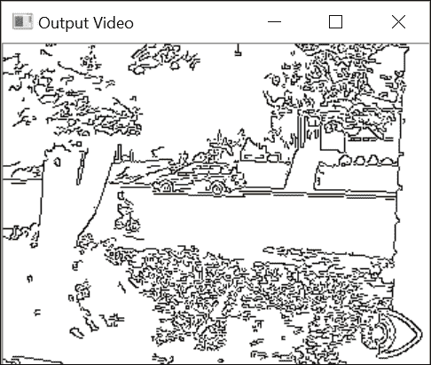
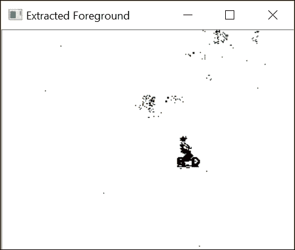
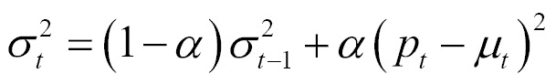

# 第十二章. 处理视频序列

在本章中，我们将涵盖以下配方：

+   读取视频序列

+   处理视频帧

+   写入视频序列

+   从视频中提取前景对象

# 简介

视频信号构成了丰富的视觉信息来源。它们由一系列图像组成，称为**帧**，这些图像以固定的时间间隔（指定为**帧率**，通常以每秒帧数表示）拍摄，并显示一个动态场景。随着强大计算机的出现，现在可以在视频序列上执行高级视觉分析——有时接近或甚至超过实际视频帧率。本章将向您展示如何读取、处理和存储视频序列。

我们将看到，一旦提取了视频序列的各个帧，就可以将本书中介绍的不同图像处理函数应用于每个帧。此外，我们还将探讨执行视频序列时间分析的算法，比较相邻帧，并随时间累积图像统计信息，以提取前景对象。

# 读取视频序列

为了处理视频序列，我们需要能够读取其每一帧。OpenCV 提供了一个易于使用的框架，可以帮助我们从视频文件或甚至从 USB 或 IP 摄像头中提取帧。这个配方将向你展示如何使用它。

## 如何做到这一点...

基本上，你只需要创建一个`cv::VideoCapture`类的实例，以便读取视频序列的帧。然后创建一个循环，用于提取和读取每个视频帧。以下是一个基本的 main 函数，用于显示视频序列的帧：

```py
    int main() 
    { 
      // Open the video file 
      cv::VideoCapture capture("bike.avi"); 
      // check if video successfully opened 
      if (!capture.isOpened()) 
        return 1; 

      // Get the frame rate 
      double rate= capture.get(CV_CAP_PROP_FPS); 

      bool stop(false); 
      cv::Mat frame;    // current video frame 
      cv::namedWindow("Extracted Frame"); 

      // Delay between each frame in ms 
      // corresponds to video frame rate 
      int delay= 1000/rate; 

      // for all frames in video 
      while (!stop) { 

        // read next frame if any 
        if (!capture.read(frame)) 
          break; 

        cv::imshow("Extracted Frame",frame); 

        // introduce a delay 
        // or press key to stop 
        if (cv::waitKey(delay)>=0) 
          stop= true; 
      } 

      // Close the video file. 
      // Not required since called by destructor 
      capture.release(); 
      return 0; 
    } 

```

将会弹出一个窗口，视频将在其中播放，如下面的截图所示：


## 它是如何工作的...

要打开视频，你只需指定视频文件名。这可以通过在`cv::VideoCapture`对象的构造函数中提供文件名来实现。如果已经创建了`cv::VideoCapture`对象，也可以使用`open`方法。一旦视频成功打开（可以通过`isOpened`方法进行验证），就可以开始帧提取。还可以通过使用带有适当标志的`get`方法查询与视频文件相关的`cv::VideoCapture`对象信息。在先前的示例中，我们使用`CV_CAP_PROP_FPS`标志获取了帧率。由于它是一个通用函数，它总是返回一个双精度浮点数，即使在某些情况下预期返回其他类型。例如，视频文件中的总帧数可以通过以下方式获取（作为一个整数）：

```py
    long t= static_cast<long>( capture.get(CV_CAP_PROP_FRAME_COUNT)); 

```

查阅 OpenCV 文档中可用的不同标志，以了解可以从视频中获取哪些信息。

还有一个`set`方法，允许你将参数输入到`cv::VideoCapture`实例中。例如，你可以使用`CV_CAP_PROP_POS_FRAMES`标志请求移动到特定的帧：

```py
    // goto frame 100 
    double position= 100.0; 
    capture.set(CV_CAP_PROP_POS_FRAMES, position); 

```

你也可以使用`CV_CAP_PROP_POS_MSEC`指定以毫秒为单位的位臵，或者你可以使用`CV_CAP_PROP_POS_AVI_RATIO`指定视频内部的相对位臵（`0.0`对应视频的开始，`1.0`对应视频的结束）。该方法在请求的参数设置成功时返回`true`。请注意，获取或设置特定视频参数的可能性很大程度上取决于用于压缩和存储视频序列的编解码器。如果你在某些参数上不成功，那可能只是因为你使用的特定编解码器。

一旦成功打开捕获的视频，就可以通过重复调用`read`方法来按顺序获取帧，就像我们在上一节的例子中所做的那样。也可以等价地调用重载的读取操作符：

```py
    capture >> frame; 

```

还可以调用两个基本方法：

```py
    capture.grab(); 
    capture.retrieve(frame); 

```

还要注意，在我们的例子中，我们引入了显示每个帧的延迟。这是通过使用`cv::waitKey`函数实现的。在这里，我们将延迟设置为与输入视频帧率相对应的值（如果`fps`是每秒的帧数，那么两个帧之间的延迟以毫秒为单位就是`1/fps`）。显然，你可以改变这个值来以较慢或较快的速度显示视频。然而，如果你打算显示视频帧，确保窗口有足够的时间刷新是很重要的（因为这是一个低优先级的过程，如果 CPU 太忙，它将永远不会刷新）。`cv::waitKey`函数还允许我们通过按任意键来中断读取过程。在这种情况下，函数返回按下的键的 ASCII 码。请注意，如果指定给`cv::waitKey`函数的延迟是`0`，那么它将无限期地等待用户按下键。如果有人想通过逐帧检查结果来跟踪一个过程，这非常有用。

最后一条语句调用`release`方法，这将关闭视频文件。然而，这个调用不是必需的，因为`release`也会在`cv::VideoCapture`析构函数中被调用。

重要的是要注意，为了打开指定的视频文件，你的计算机必须安装相应的编解码器；否则，`cv::VideoCapture`将无法解码输入文件。通常，如果你能在你的机器上的视频播放器（如 Windows Media Player）中打开你的视频文件，那么 OpenCV 也应该能够读取这个文件。

## 还有更多...

您还可以读取连接到您计算机的摄像头（例如 USB 摄像头）产生的视频流。在这种情况下，您只需将 ID 号（一个整数）指定给 `open` 函数，而不是文件名。将 ID 指定为 `0` 将打开默认安装的摄像头。在这种情况下，`cv::waitKey` 函数停止处理的作用变得至关重要，因为来自摄像头的视频流将被无限读取。

最后，从 Web 加载视频也是可能的。在这种情况下，您只需提供正确的地址即可，例如：

```py
    cv::VideoCapture capture("http://www.laganiere.name/bike.avi"); 

```

## 参见

+   本章中的 *写入视频序列* 菜谱提供了有关视频编解码器的更多信息。

+   [`ffmpeg.org/`](http://ffmpeg.org/) 网站提供了一个完整的开源和跨平台解决方案，用于音频/视频的读取、录制、转换和流式传输。OpenCV 处理视频文件的类建立在上述库之上。

# 处理视频帧

在这个菜谱中，我们的目标是将对视频序列中的每一帧应用一些处理函数。我们将通过将 OpenCV 视频捕获框架封装到我们自己的类中来完成此操作。这个类将允许我们在每次提取新帧时调用一个函数。

## 如何做...

我们希望能够指定一个处理函数（一个**回调函数**），该函数将为视频序列的每一帧调用。此函数可以定义为接收一个 `cv::Mat` 实例并输出一个处理后的帧。因此，在我们的框架中，处理函数必须具有以下签名才能成为有效的回调：

```py
    void processFrame(cv::Mat& img, cv::Mat& out); 

```

作为此类处理函数的一个示例，考虑以下简单的函数，该函数计算输入图像的 Canny 边缘：

```py
    void canny(cv::Mat& img, cv::Mat& out) { 
      // Convert to gray 
      if (img.channels()==3) 
        cv::cvtColor(img,out, cv::COLOR_BGR2GRAY); 
      // Compute Canny edges 
      cv::Canny(out,out,100,200); 
      // Invert the image 
      cv::threshold(out,out,128,255,cv::THRESH_BINARY_INV); 
    } 

```

我们的 `VideoProcessor` 类封装了视频处理任务的所有方面。使用这个类，步骤将是创建一个类实例，指定输入视频文件，将其回调函数附加到它，然后开始处理。程序上，这些步骤是通过我们提出的类来完成的，如下所示：

```py
      // Create instance 
      VideoProcessor processor; 
      // Open video file 
      processor.setInput("bike.avi"); 
      // Declare a window to display the video 
      processor.displayInput("Current Frame"); 
      processor.displayOutput("Output Frame"); 
      // Play the video at the original frame rate 
      processor.setDelay(1000./processor.getFrameRate()); 
      // Set the frame processor callback function 
      processor.setFrameProcessor(canny); 
      // Start the process 
      processor.run(); 

```

如果运行此代码，则两个窗口将以原始帧率播放输入视频和输出结果（这是由 `setDelay` 方法引入的延迟的结果）。例如，考虑上一个菜谱中显示的输入视频，输出窗口将如下所示：



## 它是如何工作的...

正如我们在其他菜谱中所做的那样，我们的目标是创建一个类，该类封装了视频处理算法的常见功能。正如人们所预期的那样，该类包括几个成员变量，用于控制视频帧处理的不同方面：

```py
    class VideoProcessor { 

      private: 

       // the OpenCV video capture object 
       cv::VideoCapture capture; 
       // the callback function to be called  
       // for the processing of each frame 
       void (*process)(cv::Mat&, cv::Mat&); 
       // a bool to determine if the  
       // process callback will be called 
       bool callIt; 
       // Input display window name 
       std::string windowNameInput; 
       // Output display window name 
       std::string windowNameOutput; 
       // delay between each frame processing 
       int delay; 
       // number of processed frames  
       long fnumber; 
       // stop at this frame number 
       long frameToStop; 
       // to stop the processing 
       bool stop; 

```

第一个成员变量是 `cv::VideoCapture` 对象。第二个属性是 `process` 函数指针，它将指向回调函数。此函数可以使用相应的设置方法指定：

```py
      // set the callback function that 
      // will be called for each frame 
      void setFrameProcessor(void (*frameProcessingCallback)
                             (cv::Mat&, cv::Mat&)) { 

        process= frameProcessingCallback; 
      } 

```

以下方法打开视频文件：

```py
      //set the name of the video file 
      bool setInput(std::string filename) { 

        fnumber= 0; 
        // In case a resource was already  
        // associated with the VideoCapture instance 
        capture.release(); 
        // Open the video file 
        return capture.open(filename); 
      } 

```

通常，在处理过程中显示帧是很有趣的。因此，使用了两种方法来创建显示窗口：

```py
      // to display the input frames 
      void displayInput(std::string wn) { 

        windowNameInput= wn; 
        cv::namedWindow(windowNameInput); 
      } 

      // to display the processed frames 
      void displayOutput(std::string wn) { 
        windowNameOutput= wn; 
        cv::namedWindow(windowNameOutput); 
      } 

```

主方法，称为 `run`，是包含帧提取循环的方法：

```py
    // to grab (and process) the frames of the sequence 
    void run() { 
      // current frame 
      cv::Mat frame; 
      //output frame 
      cv::Mat output; 

      // if no capture device has been set 
      if (!isOpened()) 
        return; 

        stop= false; 
      while (!isStopped()) { 

        // read next frame if any 
        if (!readNextFrame(frame)) 
          break; 

        // display input frame 
        if (windowNameInput.length()!=0)  
          cv::imshow(windowNameInput,frame); 

         // calling the process function 
        if (callIt) { 

          //process the frame 
          process(frame, output); 
          //increment frame number 
          fnumber++; 

        } 
        else { 
          // no processing 
          output= frame; 
        } 

        // display output frame 
        if (windowNameOutput.length()!=0) 
          cv::imshow(windowNameOutput,output); 
          // introduce a delay 
          if (delay>=0 && cv::waitKey(delay)>=0) 
            stopIt(); 

          // check if we should stop 
          if (frameToStop>=0 && getFrameNumber()==frameToStop) 
            stopIt(); 
         } 
     } 

    // Stop the processing 
    void stopIt() { 
      stop= true; 
    } 

    // Is the process stopped? 
    bool isStopped() { 
      return stop; 
    } 

    // Is a capture device opened? 
    bool isOpened() { 
      capture.isOpened(); 
    } 

    // set a delay between each frame 
    // 0 means wait at each frame 
    // negative means no delay 
    void setDelay(int d) { 
      delay= d; 
    } 

```

此方法使用一个 `private` 方法来读取帧：

```py
    // to get the next frame  
    // could be: video file or camera 
    bool readNextFrame(cv::Mat& frame) { 
      return capture.read(frame); 
    } 

```

`run` 方法首先调用 `cv::VideoCapture` 类的读取方法。然后执行一系列操作，但在调用每个操作之前，都会进行检查以确定是否已请求。只有当指定了输入窗口名称（使用 `displayInput` 方法）时，才会显示输入窗口；只有当指定了回调函数（使用 `setFrameProcessor` 方法）时，才会调用回调函数。只有当定义了输出窗口名称（使用 `displayOutput`）时，才会显示输出窗口；只有当指定了延迟（使用 `setDelay` 方法）时，才会引入延迟。最后，如果定义了停止帧（使用 `stopAtFrameNo` 方法），则会检查当前帧号。

可能还希望简单地打开并播放视频文件（不调用回调函数）。因此，我们有两个方法来指定是否调用回调函数：

```py
    // process callback to be called 
    void callProcess() { 
      callIt= true; 
    } 

    // do not call process callback 
    void dontCallProcess() { 
      callIt= false; 
    } 

```

最后，该类还提供了在特定帧号处停止的可能性：

```py
    void stopAtFrameNo(long frame) { 
      frameToStop= frame; 
    } 

    // return the frame number of the next frame 
    long getFrameNumber() { 
      // get info of from the capture device 
      long fnumber= static_cast<long>(capture.get(CV_CAP_PROP_POS_FRAMES)); 
      return fnumber;  
    } 

```

该类还包含了一些 getter 和 setter 方法，基本上只是 `cv::VideoCapture` 框架的通用 `set` 和 `get` 方法的包装器。

## 还有更多...

我们的 `VideoProcessor` 类旨在简化视频处理模块的部署。可以对它进行一些额外的改进。

### 处理一系列图像

有时，输入序列是由一系列单独存储在各自文件中的图像组成的。我们的类可以很容易地修改以适应这种输入。你只需要添加一个成员变量，它将保存一个图像文件名向量和其对应的迭代器：

```py
    // vector of image filename to be used as input 
    std::vector<std::string> images; 
    // image vector iterator 
    std::vector<std::string>::const_iterator itImg; 

```

使用新的 `setInput` 方法来指定要读取的文件名：

```py
    // set the vector of input images 
    bool setInput(const std::vector<std::string>& imgs) { 
      fnumber= 0; 
      // In case a resource was already  
      // associated with the VideoCapture instance 
      capture.release(); 

      // the input will be this vector of images 
      images= imgs; 
      itImg= images.begin(); 
      return true; 
    } 

```

`isOpened` 方法变为以下形式：

```py
    // Is a capture device opened? 
    bool isOpened() { 
      return capture.isOpened() || !images.empty(); 
    } 

```

需要修改的最后一种方法是私有的 `readNextFrame` 方法，它将根据指定的输入从视频或文件名向量中读取。测试方法是，如果图像文件名向量不为空，那么这是因为输入是一个图像序列。使用视频文件名调用 `setInput` 会清除这个向量：

```py
    // to get the next frame  
    // could be: video file; camera; vector of images 
    bool readNextFrame(cv::Mat& frame) { 

      if (images.size()==0) 
        return capture.read(frame); 

      else { 
        if (itImg != images.end()) { 
          frame= cv::imread(*itImg); 
          itImg++; 
          return frame.data != 0; 
        } else 

          return false; 
      } 
    } 

```

### 使用帧处理器类

在面向对象的环境中，使用帧处理类而不是帧处理函数可能更有意义。确实，一个类会给程序员在视频处理算法定义上提供更多的灵活性。因此，我们可以定义一个接口，任何希望被用于 `VideoProcessor` 内部的类都需要实现：

```py
    // The frame processor interface 
    class FrameProcessor { 
      public: 
      // processing method 
      virtual void process(cv:: Mat &input, cv:: Mat &output)= 0; 
    }; 

```

一个设置方法允许您将一个`FrameProcessor`实例输入到`VideoProcessor`框架中，并将其分配给定义为指向`FrameProcessor`对象的指针的添加的`FrameProcessor`成员变量：

```py
    // set the instance of the class that  
    // implements the FrameProcessor interface 
    void setFrameProcessor(FrameProcessor* frameProcessorPtr) { 
      // invalidate callback function 
      process= 0; 
       // this is the frame processor instance  
       // that will be called 
       frameProcessor= frameProcessorPtr; 
       callProcess(); 
    } 

```

当指定了一个帧`processor`类实例时，它将使之前可能已设置的任何帧处理函数无效。如果指定了帧处理函数，同样适用。`run`方法的`while`循环被修改以考虑这种修改：

```py
    while (!isStopped()) { 

      // read next frame if any 
      if (!readNextFrame(frame)) 
        break; 

      // display input frame 
      if (windowNameInput.length()!=0) 
        cv::imshow(windowNameInput,frame); 

      //** calling the process function or method ** 
      if (callIt) { 

        // process the frame 
        if (process) // if call back function 
          process(frame, output); 
        else if (frameProcessor)  
          // if class interface instance 
          frameProcessor->process(frame,output); 
        // increment frame number 
        fnumber++; 
      } 
      else { 
        output= frame; 
      } 
      // display output frame 
      if (windowNameOutput.length()!=0) 
        cv::imshow(windowNameOutput,output); 
      // introduce a delay 
      if (delay>=0 && cv::waitKey(delay)>=0) 
        stopIt(); 
      // check if we should stop 
      if (frameToStop>=0 && getFrameNumber()==frameToStop) 
        stopIt(); 
    } 

```

## 参见

+   第十三章中关于*视频中的跟踪特征点*的配方，*跟踪视觉运动*，为你提供了一个如何使用`FrameProcessor`类接口的例子。

+   GitHub 项目[`github.com/asolis/vivaVideo`](https://github.com/asolis/vivaVideo)展示了在 OpenCV 中使用多线程处理视频的更复杂的框架。

# 编写视频序列

在前面的配方中，我们学习了如何读取视频文件并提取其帧。这个配方将向您展示如何写入帧，从而创建视频文件。这将使我们能够完成典型的视频处理链：读取输入视频流，处理其帧，然后将结果存储在新视频文件中。

## 如何做到这一点...

在 OpenCV 中，使用`cv::VideoWriter`类来编写视频文件。通过指定文件名、生成视频应播放的帧率、每帧的大小以及视频是否以彩色创建来构造一个实例：

```py
    writer.open(outputFile,     // filename 
                codec,          // codec to be used  
                framerate,      // frame rate of the video 
                frameSize,      // frame size 
                isColor);       // color video? 

```

此外，您必须指定您想要保存视频数据的方式。这是`codec`参数；这将在本配方的末尾讨论。

一旦视频文件被打开，可以通过重复调用`write`方法将其添加帧：

```py
    writer.write(frame);   // add the frame to the video file 

```

使用`cv::VideoWriter`类，我们前面配方中引入的`VideoProcessor`类可以很容易地扩展，以便赋予它写入视频文件的能力。一个简单的程序将读取视频，处理它，并将结果写入视频文件，如下所示：

```py
    // Create instance 

    VideoProcessor processor; 

    // Open video file 
    processor.setInput("bike.avi"); 
    processor.setFrameProcessor(canny); 
    processor.setOutput("bikeOut.avi"); 
    // Start the process 
    processor.run(); 

```

按照前面配方中的做法，我们也想给用户提供将帧作为单独图像写入的可能性。在我们的框架中，我们采用一个命名约定，它由一个前缀名称后跟一个由给定数量的数字组成的数字组成。这个数字在保存帧时会自动增加。然后，为了将输出结果保存为一系列图像，您可以将前面的语句替换为以下语句：

```py
    processor.setOutput("bikeOut",  //prefix 
                        ".jpg",     // extension 
                        3,          // number of digits 
                        0);         // starting index 

```

使用指定的数字位数，这个调用将创建`bikeOut000.jpg`、`bikeOut001.jpg`和`bikeOut002.jpg`等文件。

## 它是如何工作的...

现在让我们描述如何修改我们的`VideoProcessor`类，以便赋予它写入视频文件的能力。首先，必须向我们的类中添加一个`cv::VideoWriter`变量成员（以及一些其他属性）：

```py
    class VideoProcessor { 

      private: 

      // the OpenCV video writer object 
      cv::VideoWriter writer; 
      // output filename 
      std::string outputFile; 
      // current index for output images 
      int currentIndex; 
      // number of digits in output image filename 
      int digits; 
      // extension of output images 
      std::string extension; 

```

使用额外的方法来指定（并打开）输出视频文件：

```py
    // set the output video file 
    // by default the same parameters than  
    // input video will be used 
    bool setOutput(const std::string &filename, int codec=0,          
                   double framerate=0.0, bool isColor=true) { 

      outputFile= filename; 
      extension.clear(); 

      if (framerate==0.0) 
        framerate= getFrameRate(); // same as input 

      char c[4]; 
      // use same codec as input 
      if (codec==0) {  
        codec= getCodec(c); 
      } 

      // Open output video 
      return writer.open(outputFile,      // filename 
                         codec,           // codec to be used  
                         framerate,       // frame rate of the video 
                         getFrameSize(),  // frame size 
                         isColor);        // color video? 
    } 

```

一个名为`writeNextFrame`的私有方法处理帧写入过程（在视频文件中或作为一系列图像）：

```py
    // to write the output frame  
    // could be: video file or images 
    void writeNextFrame(cv::Mat& frame) { 
      if (extension.length()) { // then we write images 

        std::stringstream ss; 
        // compose the output filename 
        ss << outputFile << std::setfill('0')  
           << std::setw(digits) << currentIndex++ << extension; 
        cv::imwrite(ss.str(),frame); 

      } else { 
        // then write to video file 
        writer.write(frame); 
      } 
    } 

```

对于输出由单个图像文件组成的情况，我们需要一个额外的设置方法：

```py
    // set the output as a series of image files 
    // extension must be ".jpg", ".bmp" 
    bool setOutput(const std::string &filename, // prefix 
                   const std::string &ext,      // image file extension 
                   int numberOfDigits=3,        // number of digits 
                   int startIndex=0) {          // start index 

      // number of digits must be positive 
      if (numberOfDigits<0) 
        return false; 

      // filenames and their common extension 
      outputFile= filename; 
      extension= ext; 

      // number of digits in the file numbering scheme 
      digits= numberOfDigits; 
      // start numbering at this index 
      currentIndex= startIndex; 

      return true; 
    } 

```

最后，在`run`方法的视频捕获循环中添加了一个新的步骤：

```py
  while (!isStopped()) { 

    // read next frame if any 
    if (!readNextFrame(frame)) 
      break; 

    // display input frame 
    if (windowNameInput.length()!=0) 
      cv::imshow(windowNameInput,frame); 

    // calling the process function or method 
    if (callIt) { 

      // process the frame 
      if (process) 
        process(frame, output); 
      else if (frameProcessor) 
        frameProcessor->process(frame,output); 
      // increment frame number 
      fnumber++; 
    }  else { 
      output= frame; 
    } 

    //** write output sequence ** 
    if (outputFile.length()!=0) 
      writeNextFrame(output); 
    // display output frame 
    if (windowNameOutput.length()!=0) 
      cv::imshow(windowNameOutput,output); 
    // introduce a delay 
    if (delay>=0 && cv::waitKey(delay)>=0) 
      stopIt(); 

    // check if we should stop 
    if (frameToStop>=0 && getFrameNumber()==frameToStop) 
      stopIt(); 
    } 
  } 

```

## 还有更多...

当将视频写入文件时，它使用编解码器进行保存。**编解码器**是一个能够对视频流进行编码和解码的软件模块。编解码器定义了文件的格式以及用于存储信息的压缩方案。显然，使用给定编解码器编码的视频必须使用相同的编解码器进行解码。因此，引入了四字符代码来唯一标识编解码器。这样，当软件工具需要写入视频文件时，它通过读取指定的四字符代码来确定要使用的编解码器。

### 编解码器四字符代码

如其名所示，四字符代码由四个 ASCII 字符组成，也可以通过将它们连接起来转换为整数。使用打开的`cv::VideoCapture`实例的`get`方法的`cv::CAP_PROP_FOURCC`标志，您可以获取打开视频文件的代码。我们可以在`VideoProcessor`类中定义一个方法来返回输入视频的四字符代码：

```py
    // get the codec of input video 
    int getCodec(char codec[4]) { 

      // undefined for vector of images 
      if (images.size()!=0) return -1; 
      union { // data structure for the 4-char code 
        nt value; 
        char code[4]; 
      } returned; 

      // get the code 
      returned.value= static_cast<int>(capture.get(cv::CAP_PROP_FOURCC)); 
      // get the 4 characters 
      codec[0]= returned.code[0]; 
      codec[1]= returned.code[1]; 
      codec[2]= returned.code[2]; 
      codec[3]= returned.code[3]; 

      // return the int value corresponding to the code 
      return returned.value; 
    } 

```

`get`方法始终返回一个`double`值，然后将其转换为`integer`。这个整数代表一个代码，可以使用`union`数据结构从中提取四个字符。如果我们打开我们的测试视频序列，那么我们将有以下语句：

```py
    char codec[4]; 
    processor.getCodec(codec); 
    std::cout << "Codec: " << codec[0] << codec[1] 
              << codec[2] << codec[3] << std::endl; 

```

从前面的语句中，我们得到以下内容，针对我们的示例：

```py
    Codec : XVID 

```

当写入视频文件时，必须使用其四字符代码指定编解码器。这是`cv::VideoWriter`类`open`方法的第二个参数。例如，您可以使用与输入视频相同的编解码器（这是我们的`setOutput`方法中的默认选项）。您还可以传递值`-1`，此时方法将弹出一个窗口，让您从可用的编解码器列表中选择一个编解码器。您将在该窗口中看到的列表对应于您机器上安装的编解码器列表。所选编解码器的代码随后将自动发送到`open`方法。

## 参见

+   [`www.xvid.com/`](https://www.xvid.com/)网站为您提供了一个基于 MPEG-4 标准的开源视频编解码器库。**Xvid**还有一个竞争对手叫做**DivX**，它提供专有但免费的编解码器和软件工具。

# 从视频中提取前景对象

本章主要介绍阅读、编写和视频序列的处理。目标是能够分析完整的视频序列。作为一个例子，在本食谱中，你将学习如何执行序列的时间分析，以提取移动的前景物体。实际上，当固定摄像机观察一个场景时，背景基本上保持不变。在这种情况下，有趣的是场景内部移动的物体。为了提取这些前景物体，我们需要构建一个背景模型，然后将其与当前帧进行比较，以检测任何前景物体。这正是本食谱要做的。前景提取是智能监控应用中的基本步骤。

如果我们手头有一幅场景背景的图像（即，一个不包含前景物体的框架），那么通过简单的图像差分就可以轻松地提取当前帧的前景：

```py
    // compute difference between current image and background 
    cv::absdiff(backgroundImage,currentImage,foreground); 

```

对于这个差值足够高的每个像素，将被宣布为前景像素。然而，大多数情况下，这个背景图像并不容易获得。实际上，可能很难保证给定图像中没有前景物体，在繁忙的场景中，这种情况可能很少发生。此外，背景场景通常会随着时间的推移而变化，例如，由于光照条件的变化（例如，从日出到日落）或因为新物体被添加到背景或从背景中移除。

因此，有必要动态地构建背景场景的模型。这可以通过观察场景一段时间来实现。如果我们假设大多数情况下，背景在每个像素位置都是可见的，那么简单地计算所有观察的平均值可能是一个好的策略。然而，由于多种原因，这并不可行。首先，这需要在计算背景之前存储大量的图像。其次，当我们积累图像来计算平均图像时，不会进行前景提取。这种解决方案还提出了何时以及需要积累多少图像来计算可接受的背景模型的问题。此外，观察到一个像素正在观察前景物体的图像将对平均背景的计算产生影响。

一个更好的策略是动态地通过定期更新来构建背景模型。这可以通过计算所谓的**运行平均值**（也称为**移动平均值**）来实现。这是一种计算时间信号平均值的办法，它考虑了最新接收到的值。如果`p[t]`是给定时间`t`处的像素值，而`μ[t-1]`是当前的平均值，那么这个平均值将使用以下公式进行更新：


`α`参数被称为**学习率**，它定义了当前值对当前估计平均值的影响。这个值越大，运行平均值就越快适应观察值的变化，但与此同时，当学习率设置得太高时，缓慢移动的对象倾向于在背景中消失。实际上，适当的学习率在很大程度上取决于场景的动态。为了构建背景模型，只需对输入帧的每个像素计算运行平均值。然后，根据当前图像与背景模型之间的差异来简单地决定是否声明前景像素。

## 如何做...

让我们构建一个类，该类将使用移动平均学习背景模型，并通过减法提取前景对象。所需的属性如下：

```py
    class BGFGSegmentor : public FrameProcessor { 
      cv::Mat gray;          // current gray-level image 
      cv::Mat background;    // accumulated background 
      cv::Mat backImage;     // current background image 
      cv::Mat foreground;    // foreground image 
      // learning rate in background accumulation 
      double learningRate; 
      int threshold;         // threshold for foreground extraction 

```

主要过程包括将当前帧与背景模型进行比较，然后更新此模型：

```py
    // processing method 
    void process(cv:: Mat &frame, cv:: Mat &output) { 
      // convert to gray-level image 
      cv::cvtColor(frame, gray, cv::COLOR_BGR2GRAY); 
      // initialize background to 1st frame 
      if (background.empty()) 
        gray.convertTo(background, CV_32F); 
      // convert background to 8U 
      background.convertTo(backImage,CV_8U); 

      // compute difference between image and background 
      cv::absdiff(backImage,gray,foreground); 
      // apply threshold to foreground image         
      cv::threshold(foreground,output,threshold, 
                    255,cv::THRESH_BINARY_INV); 

      // accumulate background 
      cv::accumulateWeighted(gray, background,  
                             // alpha*gray + (1-alpha)*background 
                             learningRate,  // alpha 
                             output);       // mask 
    } 

```

使用我们的视频处理框架，前景提取程序将构建如下：

```py
    int main() { 
      // Create video procesor instance 
      VideoProcessor processor; 

      // Create background/foreground segmentor 
       BGFGSegmentor segmentor; 
       segmentor.setThreshold(25); 

      // Open video file 
      processor.setInput("bike.avi"); 

      // Set frame processor 
      processor.setFrameProcessor(&segmentor); 

      // Declare a window to display the video 
      processor.displayOutput("Extracted Foreground"); 

      // Play the video at the original frame rate 
      processor.setDelay(1000./processor.getFrameRate()); 

      // Start the process 
      processor.run(); 
    } 

```

将要显示的其中一个二值前景图像如下：



## 它是如何工作的...

通过`cv::accumulateWeighted`函数计算图像的运行平均值是很容易实现的，该函数将运行平均值公式应用于图像的每个像素。请注意，结果图像必须是一个浮点图像。这就是为什么我们不得不在将背景模型与当前帧比较之前将其转换为背景图像。通过`cv::absdiff`后跟`cv::threshold`计算的一个简单的阈值绝对差值（提取前景图像）。请注意，我们随后使用前景图像作为掩码来`cv::accumulateWeighted`，以避免更新被声明为前景的像素。这是因为我们的前景图像在前景像素上定义为`false`（即`0`），这也解释了为什么前景对象在结果图像中显示为黑色像素）。

最后，需要注意的是，为了简化，我们程序构建的背景模型基于提取帧的灰度版本。保持彩色背景将需要在某些颜色空间中计算运行平均值。正如参数化视觉算法通常的情况一样，所提出的方法中的主要困难是确定适当的阈值，以便为给定的视频提供良好的结果。

## 还有更多...

之前简单的方法在场景中提取前景对象效果良好，适用于显示相对稳定背景的简单场景。然而，在许多情况下，背景场景可能在某些区域之间在不同值之间波动，从而造成频繁的错误前景检测。这些可能是由例如移动的背景对象（例如树叶）或刺眼的效果（例如水面上）引起的。投射的阴影也造成问题，因为它们通常被检测为移动对象的一部分。为了应对这些问题，已经引入了更复杂的背景建模方法。

### 高斯混合方法

这些算法之一是**高斯混合**方法。它以与本文献中介绍的方法类似的方式进行，但增加了一些改进。

首先，该方法为每个像素维护多个模型（即多个运行平均值）。这样，如果一个背景像素在两个值之间波动，比如，两个运行平均值就会被存储。只有当一个新像素值不属于观察到的最频繁的任何模型时，才会将其宣布为前景。所使用的模型数量是该方法的参数之一，一个典型值是`5`。

其次，不仅为每个模型维护运行平均值，还维护运行方差。计算方法如下：



这些计算出的平均值和方差被用来构建一个高斯模型，从而可以估计给定像素值属于背景的概率。这使得确定适当的阈值变得更容易，因为它现在是以概率而不是绝对差异的形式表达的。因此，在背景值波动较大的区域，需要更大的差异来宣布前景对象。

最后，这是一个自适应模型，也就是说，如果一个给定的高斯模型没有被足够频繁地命中，它就会被排除在背景模型之外。相反，当一个像素值被发现目前维护的背景模型之外（即它是前景像素）时，就会创建一个新的高斯模型。如果在未来，这个新模型经常接收像素，那么它就与背景相关联。

这个更复杂的算法显然比我们简单的背景/前景分割器更难实现。幸运的是，存在一个 OpenCV 实现，称为`cv::bgsegm::createBackgroundSubtractorMOG`，它被定义为更通用`cv::BackgroundSubtractor`类的子类。当使用其默认参数时，这个类非常容易使用：

```py
    int main(){ 
      // Open the video file 
      cv::VideoCapture capture("bike.avi"); 
      // check if video successfully opened 
      if (!capture.isOpened()) 
        return 0; 

      // current video frame 
      cv::Mat frame; 
      // foreground binary image 
      cv::Mat foreground; 
      // background image 
      cv::Mat background; 
      cv::namedWindow("Extracted Foreground"); 

      // The Mixture of Gaussian object 
      // used with all default parameters 
      cv::Ptr<cv::BackgroundSubtractor> ptrMOG =
                      cv::bgsegm::createBackgroundSubtractorMOG(); 
      bool stop(false); 
      // for all frames in video 
      while (!stop) { 
        // read next frame if any 
        if (!capture.read(frame)) 
          break; 

        // update the background 
        // and return the foreground 
         ptrMOG->apply(frame,foreground,0.01); 

        // Complement the image 
        cv::threshold(foreground,foreground,128, 
                      255,cv::THRESH_BINARY_INV); 
        //show foreground and background 
        cv::imshow("Extracted Foreground",foreground); 

        // introduce a delay 
        // or press key to stop 
        if (cv::waitKey(10)>=0) 
          stop= true; 
      } 
    } 

```

如您所见，这只是一个创建类实例并调用同时更新背景并返回前景图像（额外参数为学习率）的方法的问题。此外，请注意，这里的背景模型是按颜色计算的。OpenCV 中实现的方法还包括一个机制，通过检查观察到的像素变化是否仅仅是由于亮度（如果是，那么可能是由于阴影）的局部变化来拒绝阴影，或者它是否还包括一些色度变化。

另一个实现也可用，简单称为 `cv::BackgroundSubtractorMOG2`。其中一个改进是，现在动态确定每个像素要使用的适当高斯模型的数量。您可以在前面的示例中使用这个代替之前的版本。您应该在多个视频上运行这些不同的方法，以便欣赏它们各自的性能。一般来说，您将观察到 `cv::BackgroundSubtractorMOG2` 要快得多。

## 参见

+   C. Stauffer 和 W.E.L. Grimso 在 1999 年的 *Conf. on Computer Vision and Pattern Recognition* 发表的论文 *Adaptive Background Mixture Models for Real-Time Tracking* 中，对高斯混合算法给出了更完整的描述。
