# 第十三章。跟踪视觉运动

在这一章中，我们将涵盖以下菜谱：

+   在视频中追踪特征点

+   估计光流

+   在视频中跟踪对象

# 简介

视频序列很有趣，因为它们展示了运动中的场景和对象。上一章介绍了读取、处理和保存视频的工具。在这一章中，我们将探讨不同的算法，这些算法可以跟踪一系列图像中的可见运动。这种可见的或**明显的运动**可能是由在不同方向和不同速度上移动的对象引起的，或者是由摄像机的运动（或两者的组合）引起的。

在许多应用中，跟踪明显的运动至关重要。它允许你在对象移动时跟踪特定的对象，以估计其速度并确定它们将去哪里。它还允许你通过消除或减少手持摄像机拍摄的视频的摄像机抖动来稳定视频。运动估计也用于视频编码，以便压缩视频序列，以便于其传输或存储。本章将介绍一些跟踪图像序列中运动的算法，并且正如我们将看到的，这种跟踪可以是稀疏的（即在少数图像位置，这是**稀疏运动**）或密集的（在图像的每个像素上，这是**密集运动**）。

# 在视频中追踪特征点

我们在前面章节中了解到，通过分析图像的一些最显著点可以导致有效且高效的计算机视觉算法。这在图像序列中也是正确的，其中某些兴趣点的运动可以用来理解捕获场景的不同元素是如何移动的。在这个菜谱中，你将学习如何通过跟踪特征点从一帧移动到另一帧来执行序列的时间分析。

## 如何做...

要开始跟踪过程，首先要做的是在初始帧中检测特征点。然后你尝试在下一帧中跟踪这些点。显然，由于我们处理的是视频序列，所以找到特征点的对象很可能已经移动了（这种运动也可能是由摄像机运动引起的）。因此，你必须在一个点的先前位置周围搜索，以找到它在下一帧中的新位置。这正是`cv::calcOpticalFlowPyrLK`函数所完成的。你输入两个连续帧和第一个图像中的特征点向量；该函数随后返回一个新点位置向量。为了在整个序列中跟踪点，你需要从一帧重复这个过程。请注意，当你跟随点穿越序列时，你不可避免地会失去一些点的跟踪，因此跟踪的特征点数量会逐渐减少。因此，不时地检测新特征可能是一个好主意。

我们现在将利用我们在第十二章中定义的视频处理框架，并定义一个实现本章“处理视频帧”配方中引入的`FrameProcessor`接口的类。这个类的数据属性包括执行特征点检测和跟踪所需的变量：

```py
    class FeatureTracker : public FrameProcessor { 

      cv::Mat gray;      // current gray-level image 
      cv::Mat gray_prev; // previous gray-level image 
      // tracked features from 0->1 
      std::vector<cv::Point2f> points[2]; 
      // initial position of tracked points 
      std::vector<cv::Point2f> initial; 
      std::vector<cv::Point2f> features;  // detected features 
      int max_count;               // maximum number of features to detect 
      double qlevel;               // quality level for feature detection 
      double minDist;              // min distance between two points 
      std::vector<uchar> status;   // status of tracked features 
      std::vector<float> err;      // error in tracking 

      public: 

        FeatureTracker() : max_count(500), qlevel(0.01), minDist(10.) {} 

```

接下来，我们定义一个`process`方法，该方法将为序列中的每一帧调用。基本上，我们需要按以下步骤进行。首先，如果需要，检测特征点。然后，跟踪这些点。你拒绝那些无法跟踪或不再想要跟踪的点。你现在可以处理成功跟踪的点。最后，当前帧及其点成为下一次迭代的上一帧和点。以下是这样做的方法：

```py
    void process(cv:: Mat &frame, cv:: Mat &output) { 

      // convert to gray-level image 
      cv::cvtColor(frame, gray, CV_BGR2GRAY);  
      frame.copyTo(output); 

      // 1\. if new feature points must be added 
      if(addNewPoints()){ 
        // detect feature points 
        detectFeaturePoints(); 
        // add the detected features to  
        // the currently tracked features 
        points[0].insert(points[0].end(),  
                         features.begin(), features.end()); 
        initial.insert(initial.end(),  
                       features.begin(), features.end()); 
      } 

      // for first image of the sequence 
      if(gray_prev.empty()) 
        gray.copyTo(gray_prev); 

      // 2\. track features 
      cv::calcOpticalFlowPyrLK( 
                gray_prev, gray, // 2 consecutive images 
                points[0],       // input point positions in first image 
                points[1],       // output point positions in the 2nd image 
                status,          // tracking success 
                err);            // tracking error 

      // 3\. loop over the tracked points to reject some 
      int k=0; 
      for( int i= 0; i < points[1].size(); i++ ) { 

        // do we keep this point? 
        if (acceptTrackedPoint(i)) { 
          // keep this point in vector 
          initial[k]= initial[i]; 
          points[1][k++] = points[1][i]; 
        } 
      } 

      // eliminate unsuccesful points 
      points[1].resize(k); 
      initial.resize(k); 

      // 4\. handle the accepted tracked points 
      handleTrackedPoints(frame, output); 

      // 5\. current points and image become previous ones 
      std::swap(points[1], points[0]); 
      cv::swap(gray_prev, gray); 
    } 

```

此方法使用四个实用方法。你应该很容易更改这些方法中的任何一个，以定义你自己的跟踪器的新行为。这些方法中的第一个用于检测特征点。请注意，我们已经在第八章的“检测兴趣点”的第一个配方中讨论了`cv::goodFeatureToTrack`函数：

```py
    // feature point detection 
    void detectFeaturePoints() { 

      // detect the features 
      cv::goodFeaturesToTrack(gray,  // the image 
                        features,    // the output detected features 
                        max_count,   // the maximum number of features  
                        qlevel,      // quality level 
                        minDist);    // min distance between two features 
    } 

```

第二种方法确定是否应该检测新的特征点。这将在跟踪点数量可忽略不计时发生：

```py
    // determine if new points should be added 
    bool addNewPoints() { 

      // if too few points 
      return points[0].size()<=10; 
    } 

```

第三种方法根据应用程序定义的标准拒绝了一些跟踪点。在这里，我们决定拒绝那些不移动的点（除了那些无法通过`cv::calcOpticalFlowPyrLK`函数跟踪的点）。我们认为不移动的点属于背景场景，因此没有兴趣：

```py
    //determine which tracked point should be accepted 
    bool acceptTrackedPoint(int i) { 

      return status[i] &&  //status is false if unable to track point i 
        // if point has moved 
        (abs(points[0][i].x-points[1][i].x)+ 
            (abs(points[0][i].y-points[1][i].y))>2); 
    } 

```

最后，第四种方法通过在当前帧上用线连接它们到初始位置（即它们第一次被检测到的位置）来处理跟踪的特征点：

```py
    // handle the currently tracked points 
    void handleTrackedPoints(cv:: Mat &frame, cv:: Mat &output) { 

      // for all tracked points 
      for (int i= 0; i < points[1].size(); i++ ) { 

        // draw line and circle 
        cv::line(output, initial[i],  // initial position  
                 points[1][i],        // new position  
                 cv::Scalar(255,255,255)); 
        cv::circle(output, points[1][i], 3,       
                   cv::Scalar(255,255,255),-1); 
      } 
    } 

```

要在视频序列中跟踪特征点的一个简单主函数可以写成如下：

```py
    int main() { 
      // Create video procesor instance 
      VideoProcessor processor; 

      // Create feature tracker instance 
      FeatureTracker tracker; 
      // Open video file 
      processor.setInput("bike.avi"); 

      // set frame processor 
      processor.setFrameProcessor(&tracker); 

      // Declare a window to display the video 
      processor.displayOutput("Tracked Features"); 

      // Play the video at the original frame rate 
      processor.setDelay(1000./processor.getFrameRate()); 

      // Start the process 
      processor.run(); 
    } 

```

生成的程序将显示随时间推移移动跟踪特征点的演变。例如，这里有两个不同时刻的两个这样的帧。在这段视频中，摄像机是固定的。因此，年轻的自行车手是唯一的移动对象。以下是经过几帧处理后的结果：

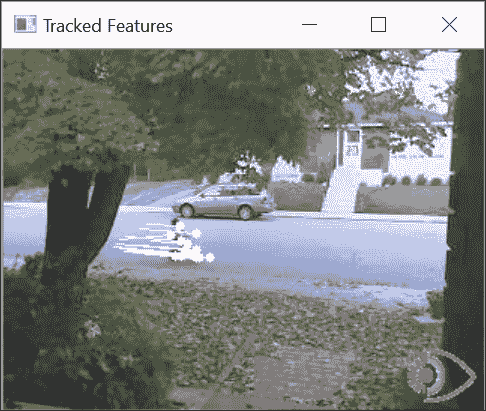

几秒钟后，我们得到以下帧：

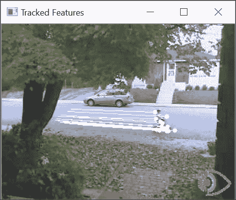

## 工作原理...

要从一帧跟踪到另一帧的特征点，我们必须定位后续帧中特征点的新位置。如果我们假设特征点的强度从一帧到下一帧不会改变，我们正在寻找一个位移`(u,v)`如下：

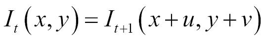

在这里，`I[t]`和`I[t+1]`分别是当前帧和下一个时刻的帧。这个常数强度假设通常适用于在两个相邻时刻拍摄的图像中的小位移。然后我们可以使用泰勒展开来近似这个方程，通过涉及图像导数的方程来近似这个方程：

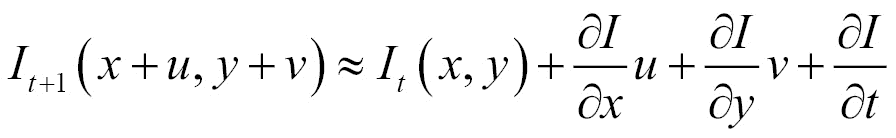

这个后一个方程引出了另一个方程（作为常数强度假设的后果，该假设抵消了两个强度项）：

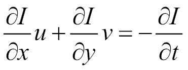

这个约束是基本的**光流**约束方程，也称为**亮度恒常方程**。

这个约束条件被所谓的**卢卡斯-卡纳德特征跟踪**算法所利用。除了使用这个约束条件外，卢卡斯-卡纳德算法还假设特征点周围所有点的位移是相同的。因此，我们可以对所有这些点施加一个独特的`(u,v)`未知位移的光流约束。这给我们带来了比未知数（两个）更多的方程，因此，我们可以以均方误差的方式来解这个方程组。在实践中，它是通过迭代来解决的，OpenCV 的实现也为我们提供了在不同分辨率下执行此估计的可能性，以使搜索更有效，更能容忍较大的位移。默认情况下，图像级别数为`3`，窗口大小为`15`。这些参数显然是可以改变的。您还可以指定终止条件，这些条件定义了停止迭代搜索的条件。`cv::calcOpticalFlowPyrLK`的第六个参数包含用于评估跟踪质量的残差均方误差。第五个参数包含二进制标志，告诉我们跟踪相应的点是否被认为是成功的。

上述描述代表了卢卡斯-卡纳德跟踪器背后的基本原理。当前的实现包含其他优化和改进，使算法在计算大量特征点位移时更加高效。

## 参见

+   第八章，*检测兴趣点*，其中讨论了特征点检测

+   本章的**视频中的物体跟踪**配方使用特征点跟踪来跟踪物体

+   由*B. 卢卡斯*和*T. 卡纳德*撰写的经典文章，*一种迭代图像配准技术及其在立体视觉中的应用*，在*国际人工智能联合会议*上，第 674-679 页，1981 年，描述了原始的特征点跟踪算法

+   J. Shi 和 C. Tomasi 在 1994 年的*IEEE 计算机视觉和模式识别会议*上发表的文章《Good Features to Track》描述了原始特征点跟踪算法的一个改进版本

# 估计光流

当一个场景被相机观察时，观察到的亮度模式被投影到图像传感器上，从而形成一个图像。在视频序列中，我们通常对捕捉运动模式感兴趣，即不同场景元素在图像平面上的 3D 运动的投影。这个投影 3D 运动矢量的图像被称为**运动场**。然而，从相机传感器直接测量场景点的 3D 运动是不可能的。我们所观察到的只是从一帧到另一帧的亮度模式在运动。这种亮度模式的明显运动被称为**光流**。有人可能会认为运动场和光流应该是相等的，但事实并非总是如此。一个明显的例子是观察一个均匀的物体；例如，如果相机在白色墙壁前移动，则不会产生光流。

另一个经典例子是由旋转的理发店旗杆产生的错觉：

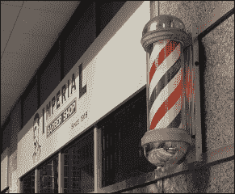

在这种情况下，运动场应该显示在水平方向上的运动矢量，因为垂直圆柱围绕其主轴旋转。然而，观察者将这种运动感知为向上移动的红蓝条纹，这就是光流将显示的内容。尽管存在这些差异，但光流被认为是对运动场的有效近似。这个菜谱将解释如何估计图像序列的光流。

## 准备工作

估计光流意味着量化图像序列中亮度模式的明显运动。所以让我们考虑视频在某一给定时刻的一帧。如果我们观察当前帧上的一个特定像素`(x,y)`，我们想知道这个点在后续帧中移动的位置。也就是说，这个点的坐标随时间变化——这可以用`(x(t),y(t))`来表示——我们的目标是估计这个点的速度`(dx/dt,dy/dt)`。在时间`t`时，这个特定点的亮度可以通过查看序列中的对应帧来获得，即`I(x(t),y(t),t)`。

从我们的**图像亮度恒常**假设出发，我们可以写出这个点的亮度不会随时间变化：

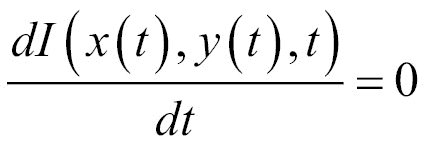

链式法则允许我们写出以下内容：

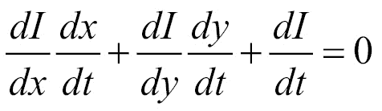

这个方程被称为**亮度恒常方程**，它将光流分量（`x`和`y`随时间的导数）与图像导数相关联。这正是我们在前一个菜谱中推导出的方程；我们只是以不同的方式演示了它。

这个单一方程（由两个未知数组成）然而不足以计算像素位置处的光流。因此，我们需要添加一个额外的约束。一个常见的选择是假设光流的平滑性，这意味着相邻的光流向量应该是相似的。因此，任何偏离这个假设的情况都应该受到惩罚。这个约束的一个特定公式是基于光流的拉普拉斯算子：

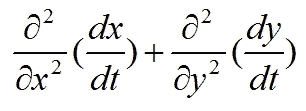

因此，目标是找到最小化亮度恒常方程和光流向量拉普拉斯算子偏差的光流场。

## 如何做...

已经提出了几种方法来解决密集光流估计问题，OpenCV 实现了其中的一些。让我们使用`cv::DualTVL1OpticalFlow`类，它被构建为通用`cv::Algorithm`基类的子类。按照实现的模式，首先要做的是创建这个类的实例并获取它的指针：

```py
    //Create the optical flow algorithm 
    cv::Ptr<cv::DualTVL1OpticalFlow> tvl1 = cv::createOptFlow_DualTVL1(); 

```

由于我们刚刚创建的对象处于可使用状态，我们只需调用计算两个帧之间光流场的方法：

```py
    cv::Mat oflow;   // image of 2D flow vectors 
    //compute optical flow between frame1 and frame2 
    tvl1->calc(frame1, frame2, oflow); 

```

结果是一个表示两个帧之间每个像素位移的二维向量（`cv::Point`）的图像。为了显示结果，我们必须因此显示这些向量。这就是为什么我们创建了一个用于生成光流场图像映射的函数。为了控制向量的可见性，我们使用了两个参数。第一个参数是一个步长值，它被定义为在一定数量的像素中只显示一个向量。这个步长为向量的显示留出了空间。第二个参数是一个缩放因子，它扩展了向量的长度，使其更明显。然后，每个绘制的光流向量都是一个简单的线，以一个普通的圆圈结束，以象征箭头的尖端。因此，我们的映射函数如下：

```py
    // Drawing optical flow vectors on an image 
    void drawOpticalFlow(const cv::Mat& oflow,  // the optical flow 
          cv::Mat& flowImage,      // the produced image 
          int stride,              // the stride for displaying the vectors 
          float scale,             // multiplying factor for the vectors 
          const cv::Scalar& color) // the color of the vectors 
    { 
      // create the image if required 
      if (flowImage.size() != oflow.size()) { 
        flowImage.create(oflow.size(), CV_8UC3); 
        flowImage = cv::Vec3i(255,255,255); 
      } 

      //for all vectors using stride as a step 
      for (int y = 0; y < oflow.rows; y += stride) 
        for (int x = 0; x < oflow.cols; x += stride) { 
          //gets the vector 
          cv::Point2f vector = oflow.at< cv::Point2f>(y, x); 
          // draw the line      
          cv::line(flowImage, cv::Point(x,y), 
                   cv::Point(static_cast<int>(x + scale*vector.x + 0.5),             
                             static_cast<int>(y + scale*vector.y + 0.5)),
                   color); 
          // draw the arrow tip 
          cv::circle(flowImage, 
                     cv::Point(static_cast<int>(x + scale*vector.x + 0.5),  
                               static_cast<int>(y + scale*vector.y + 0.5)),
                     1, color, -1); 
        } 
    } 

```

考虑以下两个帧：

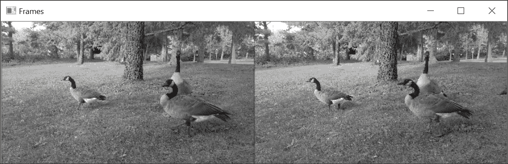

如果使用这些帧，则可以通过调用我们的绘图函数来可视化估计的光流场：

```py
    // Draw the optical flow image 
    cv::Mat flowImage; 
    drawOpticalFlow(oflow,                // input flow vectors 
                    flowImage,            // image to be generated 
                    8,                    // display vectors every 8 pixels 
                    2,                    // multiply size of vectors by 2 
                    cv::Scalar(0, 0, 0)); // vector color 

```

结果如下：

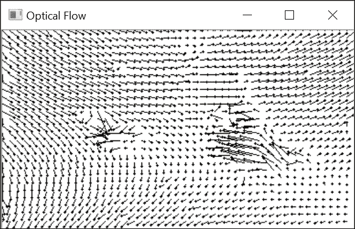

## 它是如何工作的...

在本食谱的第一节中，我们解释了可以通过最小化一个结合亮度恒常约束和光滑性函数的函数来估计光流场。我们提出的方程构成了问题的经典公式，并且这个公式已经以多种方式得到了改进。

在上一节中我们使用的方法被称为**Dual TV L1**方法。它有两个主要成分。第一个成分是使用一个平滑约束，旨在最小化光流梯度的绝对值（而不是它的平方）。这种选择减少了平滑项的影响，尤其是在不连续区域，例如，移动物体的光流向量与其背景的光流向量有很大的不同。第二个成分是使用**一阶泰勒近似**；这线性化了亮度恒常约束的公式。我们在这里不会深入这个公式的细节；只需说这种线性化有助于光流场的迭代估计即可。然而，由于线性近似仅在小的位移下有效，因此该方法需要一个从粗到细的估计方案。

在这个配方中，我们使用默认参数使用这种方法。一些 setter 和 getter 方法允许你修改那些可能影响解决方案质量和计算速度的参数。例如，可以修改在金字塔估计中使用的缩放级别数量，或在每次迭代估计步骤中指定一个更严格或更宽松的停止标准。另一个重要参数是与亮度恒常约束相比的平滑约束的权重。例如，如果我们减少对亮度恒常重要性的考虑，那么我们就会得到一个更平滑的光流场：

```py
    // compute a smoother optical flow between 2 frames 
    tvl1->setLambda(0.075); 
    tvl1->calc(frame1, frame2, oflow); 

```

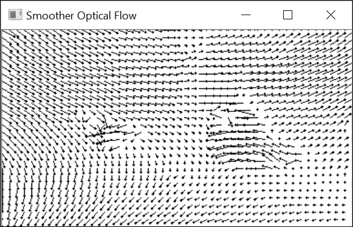

## 参见

+   由*B.K.P. Horn*和*B.G. Schunck*撰写的文章《在人工智能中确定光流》，发表于 1981 年，是光流估计的经典参考文献。

+   由*C. Zach*、*T. Pock*和*H. Bischof*撰写的文章《基于对偶的实时 tv-l 1 光流方法》，发表在 2007 年的*IEEE 计算机视觉与模式识别会议*上，详细描述了`Dual TV-L1`方法的细节。

# 视频中跟踪物体

在前两个配方中，我们学习了如何跟踪图像序列中点和像素的运动。然而，在许多应用中，要求是跟踪视频中的特定移动物体。首先识别感兴趣的物体，然后必须在一个长序列中跟踪它。这是具有挑战性的，因为随着它在场景中的演变，这个物体的图像将因视角和光照变化、非刚性运动、遮挡等因素而经历许多外观变化。

本食谱展示了在 OpenCV 库中实现的一些目标跟踪算法。这些实现基于一个通用框架，便于用一种方法替换另一种方法。贡献者还提供了一些新的方法。请注意，我们已经在第四章的“使用积分图像计数像素”食谱中提出了解决目标跟踪问题的方案，*计数像素使用直方图*；这个方案是基于通过积分图像计算出的直方图的使用。

## 如何操作...

视觉目标跟踪问题通常假设没有关于要跟踪的对象的先验知识。因此，跟踪是通过在帧中识别对象来启动的，跟踪必须从这个点开始。通过指定一个包含目标的边界框来实现对象的初始识别。跟踪模块的目标是在后续帧中重新识别这个对象。

因此，OpenCV 中定义对象跟踪框架的`cv::Tracker`类有两个主要方法。第一个是`init`方法，用于定义初始目标边界框。第二个是`update`方法，它根据新帧输出一个新的边界框。这两个方法都接受一个帧（一个`cv::Mat`实例）和一个边界框（一个`cv::Rect2D`实例）作为参数；在一种情况下，边界框是输入，而在第二种情况下，边界框是输出参数。

为了测试所提出的目标跟踪算法之一，我们使用上一章中提出的视频处理框架。特别是，我们定义了一个帧处理子类，当接收到图像序列的每一帧时，将由我们的`VideoProcessor`类调用。这个子类具有以下属性：

```py
    class VisualTracker : public FrameProcessor { 

      cv::Ptr<cv::Tracker> tracker; 
      cv::Rect2d box; 
      bool reset; 

      public: 
      // constructor specifying the tracker to be used 
      VisualTracker(cv::Ptr<cv::Tracker> tracker) :   
                    reset(true), tracker(tracker) {} 

```

当通过指定新目标边界框重新初始化跟踪器时，`reset`属性被设置为`true`。用于存储新对象位置的`setBoundingBox`方法就是用来做的：

```py
   // set the bounding box to initiate tracking 
   void setBoundingBox(const cv::Rect2d& bb) { 
      box = bb; 
      reset = true; 
   } 

```

用于处理每一帧的回调方法只是简单地调用跟踪器的适当方法，并在要显示的帧上绘制新的计算出的边界框：

```py
    // callback processing method 
    void process(cv:: Mat &frame, cv:: Mat &output) { 

      if (reset) { // new tracking session 
        reset = false; 
        tracker->init(frame, box); 

      } else { 
        // update the target's position 
        tracker->update(frame, box); 
      } 

      // draw bounding box on current frame 
      frame.copyTo(output); 
      cv::rectangle(output, box, cv::Scalar(255, 255, 255), 2); 
    } 

```

为了演示如何使用`VideoProcessor`和`FrameProcessor`实例跟踪一个对象，我们使用 OpenCV 中定义的**中值流跟踪器**：

```py
    int main(){ 
      // Create video procesor instance 
      VideoProcessor processor; 

      // generate the filename 
      std::vector<std::string> imgs; 
      std::string prefix = "goose/goose"; 
      std::string ext = ".bmp"; 

      // Add the image names to be used for tracking 
      for (long i = 130; i < 317; i++) { 

        std::string name(prefix); 
        std::ostringstream ss; ss << std::setfill('0') <<  
                 std::setw(3) << i; name += ss.str(); 
        name += ext; 
        imgs.push_back(name); 
      } 

      // Create feature tracker instance 
      VisualTracker tracker(cv::TrackerMedianFlow::createTracker()); 

      // Open video file 
      processor.setInput(imgs); 

      // set frame processor 
      processor.setFrameProcessor(&tracker); 

      // Declare a window to display the video 
      processor.displayOutput("Tracked object"); 

      // Define the frame rate for display 
      processor.setDelay(50); 

      // Specify the original target position 
      tracker.setBoundingBox(cv::Rect(290,100,65,40)); 

      // Start the tracking 
      processor.run(); 
    } 

```

第一个边界框识别了我们测试图像序列中的一个鹅。然后，它将在后续帧中自动跟踪：

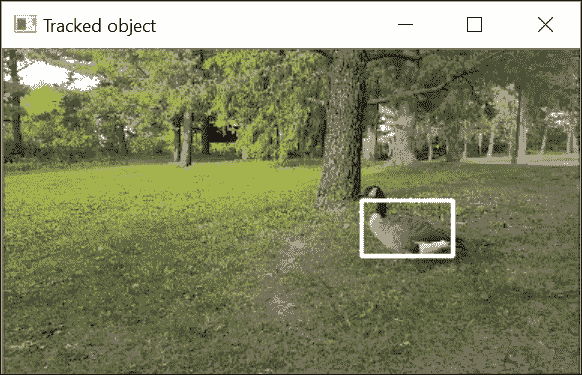

不幸的是，随着序列的进行，跟踪器不可避免地会犯错误。这些小错误的累积将导致跟踪器逐渐偏离真实目标位置。例如，这是在处理了`130`帧之后我们目标的估计位置：

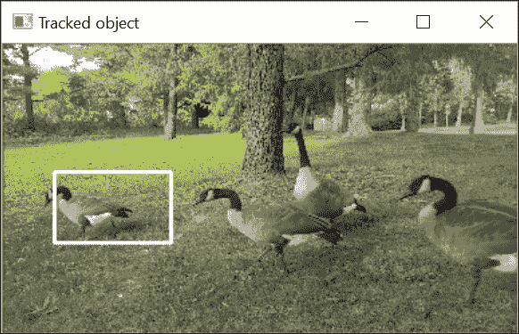

最终，跟踪器将失去对物体的跟踪。跟踪器在长时间内跟踪物体的能力是表征物体跟踪器性能的最重要标准。

## 它是如何工作的...

在这个菜谱中，我们展示了如何使用通用的`cv::Tracker`类在图像序列中跟踪一个物体。我们选择了 Median Flow 跟踪算法来展示跟踪结果。这是一个简单但有效的方法来跟踪纹理物体，只要其运动不是太快，并且没有被严重遮挡。

Median Flow 跟踪器基于特征点跟踪。它首先从定义一个要跟踪的物体的点阵开始。人们可以用例如在第八章中介绍的`FAST`算子来检测物体上的兴趣点。然而，使用预定义位置上的点具有许多优点。它通过避免计算兴趣点来节省时间。它保证了将有足够数量的点可用于跟踪。它还确保这些点在整个物体上分布良好。Median Flow 实现默认使用一个`10x10`点的网格：

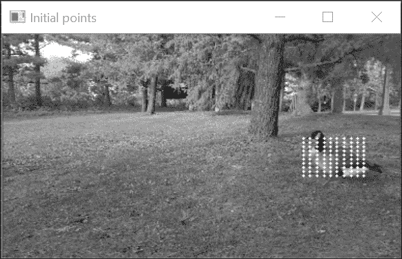

下一步是使用本章第一道菜谱中介绍的 Lukas-Kanade 特征跟踪算法，*在视频中追踪特征点*。然后，网格中的每个点在下一帧中被跟踪：

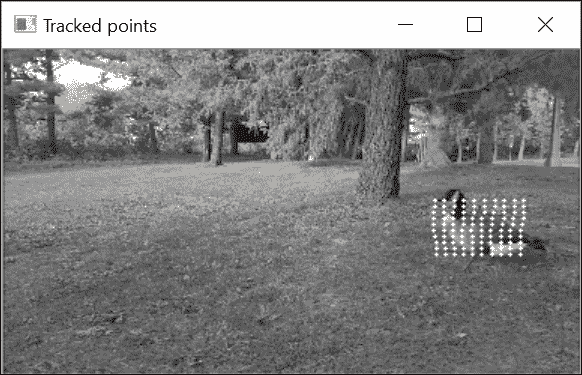

然后，Median Flow 算法估计在跟踪这些点时产生的误差。这些误差可以通过计算点在初始位置和跟踪位置周围窗口中的绝对像素差之和来估计。这是`cv::calcOpticalFlowPyrLK`函数方便计算并返回的错误类型。Median Flow 算法提出的另一种误差度量是所谓的正向-反向误差。在点在帧与下一帧之间被跟踪之后，这些点在新位置被反向跟踪以检查它们是否会返回到初始图像中的原始位置。由此获得的正向-反向位置与初始位置之间的差异是跟踪误差。

一旦计算了每个点的跟踪误差，只有具有最小误差的 50%的点被考虑。这个组被用来计算下一个图像中边界框的新位置。这些点中的每一个都对位移值进行投票，并保留这些可能位移的中位数。对于尺度变化，点被成对考虑。估计初始帧和下一帧中两点之间距离的比率。同样，最终应用的是这些尺度中的中位数。

中值跟踪器是许多基于特征点跟踪的视觉对象跟踪器之一。另一类解决方案是基于模板匹配，我们在 第九章 的“匹配局部模板”食谱中讨论了这个概念。这类方法的一个很好的代表是 **核相关滤波器** (**KCF**) 算法，它在 OpenCV 中实现为 `cv::TrackerKCF` 类：

```py
     VisualTracker tracker(cv::TrackerKCF::createTracker()); 

```

基本上，这种方法使用目标的边界框作为模板来搜索下一视图中的新对象位置。这通常通过简单的相关性计算得出，但 KCF 使用一种基于傅里叶变换的特殊技巧，我们在 第六章 的“过滤图像”引言中简要提到了它。不深入细节，信号处理理论告诉我们，在图像上对模板进行相关性计算相当于在频域中的简单图像乘法。这大大加快了下一帧中匹配窗口的识别速度，使 KCF 成为最快且最稳健的跟踪器之一。例如，以下是使用 KCF 进行 `130` 帧跟踪后的边界框位置：

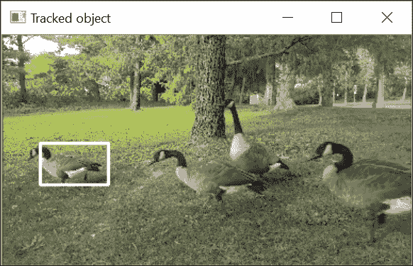

## 参见

+   由 *Z. Kalal*、*K. Mikolajczyk* 和 *J. Matas* 撰写的文章，题为 *Forward-backward error: Automatic detection of tracking failures*，发表在 *Int. Conf. on Pattern Recognition*，2010 年，描述了中值流算法。

+   由 *Z. Kalal*、*K. Mikolajczyk* 和 *J. Matas* 撰写的文章，题为 *Tracking-learning-detection*，发表在 *IEEE Transactions on Pattern Analysis and Machine Intelligence* 期刊，第 34 卷，第 7 期，2012 年，介绍了一种使用中值流算法的高级跟踪方法。

+   由 *J.F. Henriques*、*R. Caseiro*、*P. Martins*、*J. Batista* 撰写的文章，题为 *High-Speed Tracking with Kernelized Correlation Filters*，发表在 *IEEE Transactions on Pattern Analysis and Machine Intelligence* 期刊，第 37 卷，第 3 期，2014 年，描述了 KCF 跟踪器算法。
