# 第十四章. 从示例中学习

本章将涵盖以下食谱：

+   使用局部二值模式的最近邻识别面部

+   使用 Haar 特征级联查找对象和面部

+   使用支持向量机和方向梯度直方图检测对象和人物

# 简介

现在，机器学习经常被用来解决困难的机器视觉问题。实际上，它是一个包含许多重要概念的丰富研究领域，本身就值得一本完整的食谱。本章概述了一些主要的机器学习技术，并解释了如何使用 OpenCV 将这些技术部署在计算机视觉系统中。

机器学习的核心是开发能够自行学习如何对数据输入做出反应的计算机系统。机器学习系统不是被明确编程的，而是在展示期望行为的示例时自动适应和进化。一旦完成成功的训练阶段，预期训练后的系统将对新的未见查询输出正确的响应。

机器学习可以解决许多类型的问题；我们在这里的关注将是分类问题。形式上，为了构建一个能够识别特定概念类实例的分类器，必须使用大量标注样本对其进行训练。在二分类问题中，这个集合将包括**正样本**，代表要学习的类的实例，以及**负样本**，由不属于感兴趣类的不属于该类的实例的逆例组成。从这些观察结果中，必须学习一个**决策函数**，该函数可以预测任何输入实例的正确类别。

在计算机视觉中，这些样本是图像（或视频片段）。因此，首先要做的是找到一个理想的表达方式，以紧凑和独特的方式描述每张图像的内容。一个简单的表达方式可能是使用固定大小的缩略图图像。这个缩略图图像的像素按行排列形成一个向量，然后可以作为一个训练样本提交给机器学习算法。也可以使用其他替代方案，可能更有效的表示。本章的食谱描述了不同的图像表示，并介绍了一些著名的机器学习算法。我们应该强调，我们无法在食谱中详细涵盖所有讨论的不同机器学习技术的理论方面；我们的目标更多的是展示控制它们功能的主要原则。

# 使用局部二值模式的最近邻识别面部

我们对机器学习技术的第一次探索将从可能是最简单的方法开始，即**最近邻分类**。我们还将介绍局部二值模式特征，这是一种流行的表示，以对比度无关的方式编码图像的纹理模式和轮廓。

我们的示例将涉及人脸识别问题。这是一个极具挑战性的问题，在过去 20 年中一直是众多研究的目标。我们在这里提出的基本解决方案是 OpenCV 中实现的人脸识别方法之一。你很快就会意识到这个解决方案并不非常稳健，只在非常有利的情况下才能工作。尽管如此，这种方法构成了对机器学习和人脸识别问题的极好介绍。

## 如何做...

OpenCV 库提出了一系列作为通用`cv::face::FaceRecognizer`子类的实现的人脸识别方法。在本例中，我们将探讨`cv::face::LBPHFaceRecognizer`类，它对我们来说很有趣，因为它基于一种简单但通常非常有效的分类方法，即最近邻分类器。此外，它所使用的图像表示是由**局部二值模式**特征（**LBP**）构建的，这是一种描述图像模式非常流行的方法。

为了创建`cv::face::LBPHFaceRecognizer`的一个实例，需要调用其静态`create`方法：

```py
    cv::Ptr<cv::face::FaceRecognizer> recognizer =
           cv::face::createLBPHFaceRecognizer(1, // radius of LBP pattern 
                   8,       // the number of neighboring pixels to consider 
                   8, 8,    // grid size 
                   200.8);  // minimum distance to nearest neighbor 

```

如下一节所述，提供的第一个参数用于描述要使用的 LBP 特征的特性。下一步是将一系列参考人脸图像输入识别器。这是通过提供两个向量来完成的，一个包含人脸图像，另一个包含相关的标签。每个标签是一个任意整数，用于标识特定的个人。想法是通过向识别器展示每个人的不同图像来训练它。正如你可能想象的那样，你提供的代表性图像越多，正确识别某人的机会就越大。在我们的非常简单的例子中，我们只提供了两个参考人物的图像。要调用的是`train`方法：

```py
    // vectors of reference image and their labels 
    std::vector<cv::Mat> referenceImages; 
    std::vector<int> labels; 
    // open the reference images 
    referenceImages.push_back(cv::imread("face0_1.png",
                              cv::IMREAD_GRAYSCALE)); 
    labels.push_back(0); // person 0 
    referenceImages.push_back(cv::imread("face0_2.png",
                              cv::IMREAD_GRAYSCALE)); 
    labels.push_back(0); // person 0 
    referenceImages.push_back(cv::imread("face1_1.png",
                              cv::IMREAD_GRAYSCALE)); 
    labels.push_back(1); // person 1 
    referenceImages.push_back(cv::imread("face1_2.png",
                              cv::IMREAD_GRAYSCALE)); 
    labels.push_back(1); // person 1 

    // train the recognizer by computing the LBPHs 
    recognizer->train(referenceImages, labels); 

```

使用的图像如下，第一行是人物`0`的图像，第二行是人物`1`的图像：

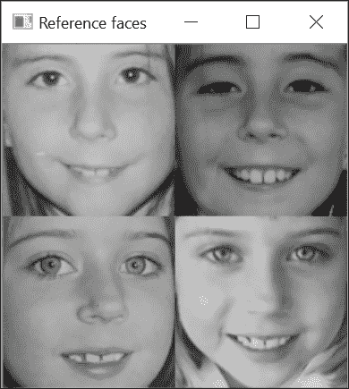

这些参考图像的质量也非常重要。此外，将它们归一化以使主要面部特征位于标准位置是一个好主意。例如，将鼻尖定位在图像中间，并将两只眼睛水平对齐在特定的图像行上。存在面部特征检测方法，可以用来自动以这种方式归一化面部图像。在我们的示例中，我们没有这样做，这会导致识别器的鲁棒性受到影响。尽管如此，这个识别器已经准备好使用，可以提供输入图像，并且它将尝试预测与该面部图像对应的标签：

```py
    // predict the label of this image 
    recognizer->predict(inputImage,      // face image  
                        predictedLabel,  // predicted label of this image  
                        confidence);     // confidence of the prediction 

```

我们的输入图像如下：

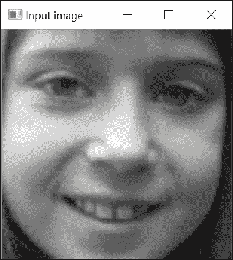

识别器不仅返回预测的标签，还返回一个置信度分数。在`cv::face::LBPHFaceRecognizer`的情况下，这个置信度值越低，识别器对其预测的信心就越大。在这里，我们获得了一个正确的标签预测（`1`），置信度值为`90.3`。

## 它是如何工作的...

为了理解本食谱中展示的人脸识别方法的运作原理，我们需要解释其两个主要组件：所使用的图像表示和应用的分类方法。

如其名称所示，`cv::face::LBPHFaceRecognizer`算法使用 LBP 特征。这是一种不依赖于对比度的描述图像中图像模式的方法。它是一种局部表示，将每个像素转换为一个二进制表示，该表示编码了在邻域中找到的图像强度模式。为了实现这一目标，应用了一个简单的规则；将局部像素与其选定的每个邻居进行比较；如果其值大于其邻居的值，则将`0`分配给相应的位位置，如果不是，则将`1`分配。在其最简单和最常见的形式中，每个像素与其`8`个直接邻居进行比较，这生成一个 8 位模式。例如，让我们考虑以下局部模式：

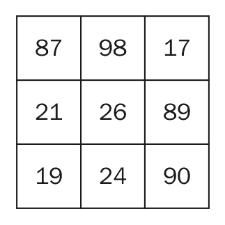

应用所描述的规则会生成以下二进制值：


以初始位置为左上角的像素，按顺时针方向移动，中心像素将被替换为二进制序列`11011000`。然后通过遍历图像的所有像素来生成所有相应的 LBP 字节，从而轻松地生成完整的 8 位 LBP 图像。这是通过以下函数实现的：

```py
    //compute the Local Binary Patterns of a gray-level image 
    void lbp(const cv::Mat &image, cv::Mat &result) { 

      result.create(image.size(), CV_8U); // allocate if necessary 

      for (int j = 1; j<image.rows - 1; j++) { 
        //for all rows (except first and last) 

        // pointers to the input rows 
        const uchar* previous = image.ptr<const uchar>(j - 1);    
        const uchar* current  = image.ptr<const uchar>(j);       
        const uchar* next     = image.ptr<const uchar>(j + 1);   
        uchar* output = result.ptr<uchar>(j);        //output row 

        for (int i = 1; i<image.cols - 1; i++) { 

          // compose local binary pattern 
          *output =  previous[i - 1] > current[i] ? 1 : 0; 
          *output |= previous[i] > current[i] ?     2 : 0; 
          *output |= previous[i + 1] > current[i] ? 4 : 0; 
          *output |= current[i - 1] > current[i] ?  8 : 0; 
          *output |= current[i + 1] > current[i] ? 16 : 0; 
          *output |= next[i - 1] > current[i] ?    32 : 0; 
          *output |= next[i] > current[i] ?        64 : 0; 
          *output |= next[i + 1] > current[i] ?   128 : 0; 
          output++; // next pixel 
        } 
      } 
      // Set the unprocess pixels to 0 
      result.row(0).setTo(cv::Scalar(0)); 
      result.row(result.rows - 1).setTo(cv::Scalar(0)); 
      result.col(0).setTo(cv::Scalar(0)); 
      result.col(result.cols - 1).setTo(cv::Scalar(0)); 
    } 

```

循环体将每个像素与其`8`个邻居进行比较，并通过简单的位移动来分配位值。以下是一个图像示例：

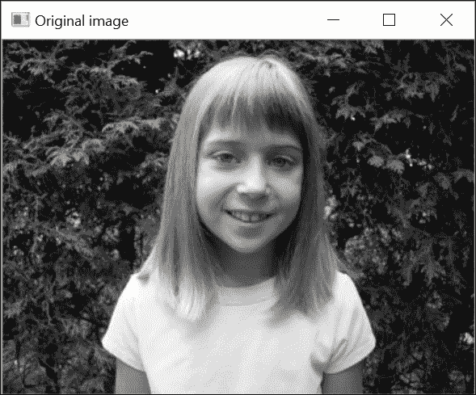

获得一个 LBP 图像，可以显示为灰度图像：


这种灰度级表示实际上并不容易理解，但它只是简单地说明了发生的编码过程。

回到我们的`cv::face::LBPHFaceRecognizer`类，可以看到其`create`方法的前两个参数指定了要考虑的邻域的大小（像素半径）和维度（圆周上的像素数，可能应用插值）。一旦生成了 LBP 图像，该图像被划分为一个网格。这个网格的大小被指定为`create`方法的第三个参数。对于这个网格的每一个块，构建一个 LBP 值的直方图。通过将这些直方图的 bin 计数连接成一个大的向量，最终获得一个全局图像表示。使用`8×8`网格，计算出的 256-bin 直方图集形成一个 16384 维向量。

因此，`cv::face::LBPHFaceRecognizer`类的`train`方法为提供的每个参考图像生成这个长向量。每个面部图像可以看作是在一个非常高维空间中的一个点。当通过其`predict`方法提交新图像时，找到与该图像最近的参考点。因此，与该点关联的标签是预测标签，置信度值将是计算出的距离。这是定义最近邻分类器的原则。通常还会添加另一个成分。如果输入点的最近邻点离它太远，这可能意味着这个点实际上不属于任何参考类别。这个点必须离多远才能被认为是异常值？这由`cv::face::LBPHFaceRecognizer`类的`create`方法的第四个参数指定。

如您所见，这是一个非常简单的想法，当不同的类别在表示空间中生成不同的点云时，它非常有效。这种方法的好处之一是它隐式地处理多个类别，因为它简单地从其最近邻读取预测类别。主要缺点是它的计算成本。在这样一个可能由许多参考点组成的大空间中找到最近邻可能需要时间。存储所有这些参考点在内存中也很昂贵。

## 参考以下内容

+   由*T. Ahonen*、*A. Hadid*和*M. Pietikainen*撰写的文章《使用局部二值模式进行人脸描述：应用于人脸识别》发表在 2006 年的 IEEE《模式分析与机器智能》交易上，描述了 LBP 在人脸识别中的应用。

+   由*B. Froba*和*A. Ernst*撰写的文章《使用改进的计数变换进行人脸检测》发表在 2004 年的 IEEE 会议《自动人脸和手势识别》上，提出了一种 LBP 特征的变体。

+   由*M. Uricar*、*V. Franc*和*V. Hlavac*撰写的文章《基于结构化输出 SVM 学习的人脸特征检测器》发表在 2012 年的《计算机视觉理论与应用国际会议》上，描述了一种基于本章最后一种 SVM 讨论的人脸特征检测器。

# 使用 Haar 特征的级联查找对象和面部

在前一个菜谱中，我们学习了机器学习的一些基本概念。我们展示了如何通过收集不同类别的样本来构建分类器。然而，对于前一个菜谱中考虑的方法，训练分类器简单地就是存储所有样本的表示。从那里，任何新实例的标签可以通过查看最近的（最近邻）标记点来预测。对于大多数机器学习方法，训练是一个迭代过程，其中通过遍历样本来构建机器。因此，产生的分类器的性能随着更多样本的呈现而逐渐提高。当达到某个性能标准或考虑当前训练数据集时不再能获得更多改进时，学习最终停止。这个菜谱将介绍一个遵循此程序的机器学习算法，即**提升分类器的级联**。

在我们查看这个分类器之前，我们首先将注意力转向 Haar 特征图像表示。我们确实了解到，一个好的表示是生产鲁棒分类器的一个基本要素。正如前一个菜谱中描述的，LBPs（局部二值模式）构成了一种可能的选择；下一节将描述另一种流行的表示。

## 准备中

生成分类器的第一步是收集一个（最好是）大型的图像样本集合，展示要识别的对象类别的不同实例。这些样本的表示方式已被证明对从它们构建的分类器的性能有重要影响。像素级表示通常被认为太低级，无法鲁棒地描述每个对象类别的内在特征。能够描述图像中存在的独特模式的各种尺度的表示更受欢迎。这就是**Haar 特征**的目标，有时也称为 Haar-like 特征，因为它们来自 Haar 变换基函数。

Haar 特征定义了像素的小矩形区域，这些区域随后通过简单的减法进行比较。通常考虑三种不同的配置，即 2 矩形、3 矩形和 4 矩形特征


这些特征可以是任何大小，并且可以应用于要表示的图像的任何区域。例如，这里有两个应用于人脸图像的 Haar 特征：

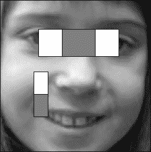

构建 Haar 表示包括选择一定数量的 Haar 特征，这些特征具有给定的类型、大小和位置，并将它们应用于图像。从所选的 Haar 特征集中获得的具体值集构成了图像表示。挑战在于确定要选择哪些特征集。确实，为了区分一类对象和另一类对象，某些 Haar 特征必须比其他特征更相关。例如，在面部图像类的情况下，在眼睛之间应用一个 3 矩形 Haar 特征（如图所示）可能是一个好主意，因为我们期望所有面部图像在这种情况下都能产生一个高值。显然，由于存在数十万个可能的 Haar 特征，手动做出好的选择肯定很困难。因此，我们正在寻找一种机器学习方法，该方法将选择给定类别对象的最相关特征。

## 如何做到这一点...

在这个菜谱中，我们将学习如何使用 OpenCV 构建一个**特征级联提升**，以生成一个二分类器。但在我们这样做之前，让我们解释一下这里使用的术语。一个二分类器是指能够从其余部分（例如，不包含面部图像的图像）中识别出一个类别的实例（例如，面部图像）。因此，在这种情况下，我们有**正样本**（即面部图像）和**负样本**（即非面部图像），这些后者也被称为背景图像。本菜谱中的分类器将由一系列简单分类器组成，这些分类器将依次应用。级联的每个阶段都将基于一小部分特征值快速做出拒绝或不拒绝显示对象的决策。这种级联是提升的，因为每个阶段通过做出更准确的决策来提高（提升）之前阶段的性能。这种方法的主要优势在于，级联的早期阶段由简单的测试组成，这些测试可以快速拒绝肯定不属于感兴趣类别的实例。这些早期拒绝使得级联分类器快速，因为在通过扫描图像查找对象类别时，大多数要测试的子窗口都不会属于感兴趣类别。这样，只有少数窗口需要在被接受或拒绝之前通过所有阶段。

为了为特定类别训练一个提升分类器级联，OpenCV 提供了一个将执行所有必需操作的软件工具。当你安装库时，你应该在适当的`bin`目录中创建了两个可执行模块，这些是`opencv_createsamples.exe`和`opencv_traincascade.exe`。确保你的系统`PATH`指向此目录，这样你就可以在任何地方执行这些工具。

在训练分类器时，首先要做的事情是收集样本。正样本由显示目标类别实例的图像组成。在我们的简单例子中，我们决定训练一个分类器来识别停车标志。以下是我们已经收集的几个正样本：

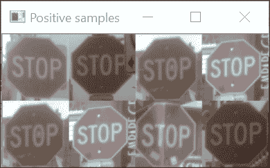

我们拥有的文本文件中必须指定要使用的正样本列表，这里命名为`stop.txt`。它包含图像文件名和边界框坐标：

```py
    stop00.png 1 0 0 64 64 
    stop01.png 1 0 0 64 64 
    stop02.png 1 0 0 64 64 
    stop03.png 1 0 0 64 64 
    stop04.png 1 0 0 64 64 
    stop05.png 1 0 0 64 64 
    stop06.png 1 0 0 64 64 
    stop07.png 1 0 0 64 64 

```

文件名后的第一个数字是图像中可见的正样本数量。接下来是包含此正样本的边界框的左上角坐标，最后是其宽度和高度。在我们的例子中，正样本已经从原始图像中提取出来，这就是为什么我们每个文件只有一个样本，左上角坐标在`(0,0)`。一旦这个文件可用，您就可以通过运行提取工具来创建正样本文件。

```py
 opencv_createsamples -info stop.txt -vec stop.vec -w 24 -h 24 -num 8

```

这将创建一个输出文件`stop.vec`，其中将包含输入文本文件中指定的所有正样本。请注意，我们使样本大小小于原始大小（`24×24`），而原始大小是`64×64`。提取工具将所有样本调整到指定的大小。通常，Haar 特征与较小的模板配合得更好，但这需要在每个具体案例中验证。

负样本仅仅是包含感兴趣类别（在我们的例子中即没有停车标志）实例的背景图像。但这些图像应该展示出分类器预期看到的各种情况。这些负图像可以是任何大小，训练工具将从它们中提取随机的负样本。以下是我们希望使用的背景图像的一个示例。

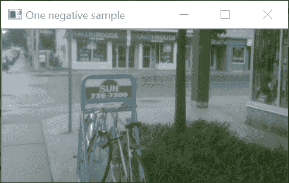

一旦正负样本集已经就绪，分类器级联就准备好进行训练。调用工具的方式如下：

```py
     opencv_traincascade  -data classifier -vec stop.vec   
                     -bg neg.txt -numPos 9  -numNeg 20 
                     -numStages 20 -minHitRate 0.95  
                     -maxFalseAlarmRate 0.5 -w 24 -h 24 

```

这里使用的参数将在下一节中解释。请注意，这个过程可能需要非常长的时间；在某些具有数千个样本的复杂案例中，执行甚至可能需要几天。在运行过程中，级联训练器将在每个阶段的训练完成后打印出性能报告。特别是，分类器会告诉您当前的**命中率**（**HR**）；这是当前被级联接受（即正确识别为正实例）的正样本的百分比。您希望这个数字尽可能接近`1.0`。它还会给出当前的**误报率**（**FA**），即被错误分类为正实例的测试负样本数量（也称为**假阳性**）。您希望这个数字尽可能接近`0.0`。这些数字会为每个阶段中引入的每个特征报告。

我们的简单示例只用了几秒钟。产生的分类器结构在训练阶段的 XML 文件中描述。分类器随后就准备好使用了！你可以提交任何样本给它，它将告诉你它认为这是一个正样本还是一个负样本。

在我们的例子中，我们使用 `24×24` 的图像来训练我们的分类器，但通常，你想要找出图像（任何大小）中是否有任何你的一类对象的实例。为了达到这个目标，你只需扫描输入图像并提取所有可能的样本大小的窗口。如果你的分类器足够准确，只有包含所寻对象的窗口才会返回正检测。但是，只要可见的正样本具有适当的大小，这种方法才会有效。为了在多个尺度上检测实例，你必须通过在每个金字塔级别上以一定比例减小原始图像的大小来构建图像金字塔。这样，较大的对象最终会适应我们在金字塔下降过程中训练的样本大小。这是一个漫长的过程，但好消息是 OpenCV 提供了一个实现此过程的类。它的使用相当简单。首先，通过加载适当的 XML 文件来构建分类器：

```py
    cv::CascadeClassifier cascade; 
    if (!cascade.load("stopSamples/classifier/cascade.xml")) { 
      std::cout << "Error when loading the cascade classfier!"  
                << std::endl;   
      return -1; 
    } 

```

然后，你调用带有输入图像的 `detection` 方法：

```py
    cascade.detectMultiScale(inputImage, // input image 
              detections,           // detection results 
              1.1,                  // scale reduction factor 
              2,                 // number of required neighbor detections 
              0,                    // flags (not used) 
              cv::Size(48, 48),     // minimum object size to be detected 
              cv::Size(128, 128));  // maximum object size to be detected 

```

结果以 `cv::Rect` 实例的向量形式提供。为了可视化检测结果，你只需在输入图像上绘制这些矩形：

```py
    for (int i = 0; i < detections.size(); i++) 
     cv::rectangle(inputImage, detections[i],  
                   cv::Scalar(255, 255, 255), 2); 

```

当我们的分类器在图像上进行测试时，这是我们获得的结果：

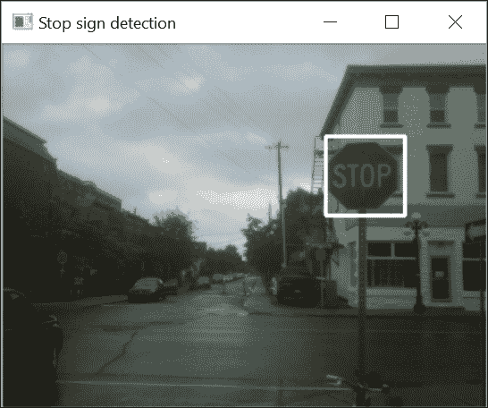

## 工作原理...

在上一节中，我们解释了如何使用一类对象的正负样本构建 OpenCV 级联分类器。现在，我们将概述用于训练此级联的学习算法的基本步骤。我们的级联是通过使用本食谱介绍部分中描述的 Haar 特征进行训练的，但正如我们将看到的，任何其他简单特征都可以用来构建一个提升级联。由于提升学习的理论和原理相当复杂，我们不会在本食谱中涵盖所有方面；感兴趣的读者应参考最后部分列出的文章。

首先，让我们重申，在级联提升分类器的背后有两个核心思想。第一个思想是，可以通过组合多个弱分类器（即基于简单特征的分类器）来构建一个强分类器。其次，因为在机器视觉中，负实例比正实例出现得更为频繁，因此可以分阶段进行有效的分类。早期阶段快速拒绝明显的负实例，而在后期阶段对更难处理的样本做出更精细的决策。基于这两个思想，我们现在描述提升级联学习算法。我们的解释基于称为**AdaBoost**的增强方法，这是最常使用的一种。我们的描述还将使我们能够解释`opencv_traincascade`工具中使用的某些参数。

在这个算法中，我们使用 Haar 特征来构建我们的弱分类器。当应用一个 Haar 特征（给定类型、大小和位置）时，会得到一个值。然后通过找到最佳阈值值来获得一个简单的分类器，这个阈值值将根据这个特征值将负类和正类实例区分开来。为了找到这个最佳阈值，我们有大量的正样本和负样本可供使用（在`opencv_traincascade`中，这一步要使用的正样本和负样本的数量由`-numPos`和`-numNeg`参数给出）。由于我们有许多可能的 Haar 特征，我们检查所有这些特征，并选择那些最能分类我们的样本集的特征。显然，这个非常基础的分类器会犯错误（即错误地分类几个样本）；这就是为什么我们需要构建多个这样的分类器。这些分类器是逐个添加的，每次都寻找提供最佳分类的新 Haar 特征。但是，由于在每次迭代中，我们希望专注于当前被错误分类的样本，因此分类性能是通过给予错误分类样本更高的权重来衡量的。因此，我们获得了一系列简单的分类器，然后通过这些弱分类器的加权求和（性能更好的分类器给予更高的权重）构建一个强分类器。按照这种方法，通过结合几百个简单特征，可以获得性能良好的强分类器。

但是，为了构建一个早期拒绝作为核心机制的分类器级联，我们不想使用由大量弱分类器组成的一个强分类器。相反，我们需要找到非常小的分类器，这些分类器将仅使用少量 Haar 特征，以便快速拒绝明显的负样本，同时保留所有正样本。在其经典形式中，AdaBoost 旨在通过计算错误否定（将正样本分类为负样本）和错误肯定（将负样本分类为正样本）的数量来最小化总的分类错误。在当前情况下，我们需要尽可能多，如果不是所有，的正样本被正确分类，同时最小化错误肯定率。幸运的是，可以通过修改 AdaBoost 来使真正的正样本得到更强的奖励。因此，在训练级联的每个阶段时，必须设置两个标准：最小命中率和最大误报率；在`opencv_traincascade`中，这些参数使用`-minHitRate`（默认值为`0.995`）和`-maxFalseAlarmRate`（默认值为`0.5`）参数指定。只有当两个性能标准得到满足时，Haar 特征才会被添加到阶段。最小命中率必须设置得相当高，以确保正实例将进入下一阶段；记住，如果一个正实例被某个阶段拒绝，那么这个错误是无法恢复的。因此，为了便于生成低复杂度的分类器，你应该将最大误报率相对设置得较高。否则，你的阶段将需要许多 Haar 特征才能满足性能标准，这与简单快速计算分类器阶段的早期拒绝理念相矛盾。

因此，一个好的级联将包含具有少量特征的前期阶段，每个阶段的特征数量随着级联的上升而增加。在`opencv_traincascade`中，每个阶段的最大特征数量使用`-maxWeakCount`（默认为`100`）参数设置，阶段数量使用`-numStages`（默认为`20`）参数设置。

当新阶段的训练开始时，就必须收集新的负样本。这些样本是从提供的背景图像中提取的。这里的困难在于找到能够通过所有先前阶段（即被错误地分类为正样本）的负样本。你训练的阶段越多，收集这些负样本就越困难。这就是为什么提供大量背景图像给分类器很重要。它将能够从中提取出难以分类的片段（因为它们与正样本相似）。请注意，如果在某个阶段，两个性能标准都达到了，而没有添加任何新的特征，那么级联训练将在这一点停止（你可以直接使用它，或者通过提供更困难的样本重新训练它）。相反，如果阶段无法满足性能标准，训练也将停止；在这种情况下，你应该尝试使用更容易的性能标准进行新的训练。

对于由`n`个阶段组成的级联，可以很容易地证明分类器的全局性能至少会优于`minHitRate^n`和`maxFalseAlarmRate^n`。这是由于每个阶段都是建立在先前级联阶段的结果之上的结果。例如，如果我们考虑`opencv_traincascade`的默认值，我们预计我们的分类器将有一个准确率（命中率）为`0.995²⁰`和误报率为`0.5²⁰`。这意味着 90%的正样本将被正确识别，0.001%的负样本将被错误地分类为正样本。请注意，由于我们在级联过程中会丢失一部分正样本，因此你总是需要提供比每个阶段指定的样本数量更多的正样本。在我们刚才给出的数值示例中，我们需要将`numPos`设置为可用正样本数量的 90%。

一个重要的问题是应该使用多少个样本进行训练？这很难回答，但显然，你的正样本集必须足够大，以涵盖你类别实例可能出现的广泛范围。你的背景图像也应该是相关的。在我们的停车标志检测器的情况下，我们包括了城市图像，因为停车标志预计将在这种背景下被看到。一个常见的经验法则是`numNeg= 2*numPos`，但这一点需要在你的数据集上进行验证。

最后，我们在这份食谱中解释了如何使用 Haar 特征构建分类器的级联。这样的特征也可以使用其他特征构建，例如在之前的食谱中讨论的局部二进制模式或将在下一食谱中介绍的梯度直方图。`opencv_traincascade`有一个`-featureType`参数，允许选择不同的特征类型。

## 还有更多...

OpenCV 库提供了一些预训练的级联，您可以使用这些级联来检测人脸、面部特征、人物和其他物体。您将在库源目录的数据目录中以 XML 文件的形式找到这些级联。

### 使用 Haar 级联进行人脸检测

预训练的模型已准备好使用。您只需使用适当的 XML 文件创建`cv::CascadeClassifier`类的实例即可：

```py
    cv::CascadeClassifier faceCascade; 
    if (!faceCascade.load("haarcascade_frontalface_default.xml")) { 
      std::cout << "Error when loading the face cascade classfier!"  
                << std::endl; 
      return -1; 
    } 

```

然后要使用 Haar 特征检测人脸，您按以下步骤进行：

```py
    faceCascade.detectMultiScale(picture, // input image 
               detections,           // detection results 
               1.1,                  // scale reduction factor 
               3,                 // number of required neighbor detections 
               0,                    // flags (not used) 
               cv::Size(48, 48),     // minimum object size to be detected 
               cv::Size(128, 128));  // maximum object size to be detected 

    // draw detections on image 
    for (int i = 0; i < detections.size(); i++) 
      cv::rectangle(picture, detections[i],  
                    cv::Scalar(255, 255, 255), 2); 

```

同样的过程可以用于眼检测器，以下图像是得到的：

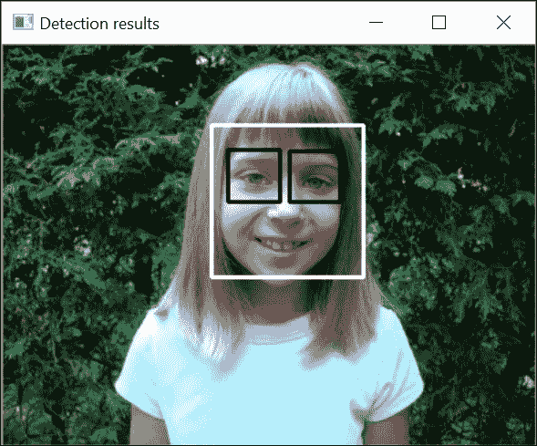

## 参见

+   在第九章的*《描述和匹配兴趣点》*中，“描述和匹配局部强度模式”食谱描述了 SURF 描述符，它也使用了 Haar-like 特征

+   2001 年，P. Viola 和 M. Jones 在《计算机视觉和模式识别》会议上发表的*《使用简单特征快速检测物体》*一文是描述提升分类器级联和 Haar 特征的经典论文

+   1999 年，Y. Freund 和 R.E. Schapire 在《日本人工智能学会杂志》上发表的*《提升的简要介绍》*一文描述了提升的理论基础

+   S. Zhang、R. Benenson 和 B. Schiele 在 2015 年《IEEE 计算机视觉和模式识别会议》上发表的*《用于行人检测的滤波通道特征》*一文提出了类似于 Haar 的特征，可以产生高度准确的检测

# 使用支持向量机和方向梯度直方图检测物体和人物

本食谱介绍另一种机器学习方法，即**支持向量机**（**SVM**），它可以从训练数据中生成准确的二分类器。它们已被广泛用于解决许多计算机视觉问题。这次，分类是通过使用一个数学公式来解决的，该公式考虑了高维空间中问题的几何形状。

此外，我们还将介绍一种新的图像表示方法，该方法通常与 SVMs 一起使用，以生成鲁棒的物体检测器。

## 准备工作

物体的图像主要以其形状和纹理内容为特征。这是由**方向梯度直方图**（**HOG**）表示所捕捉的方面。正如其名称所示，这种表示是基于从图像梯度构建直方图。特别是，因为我们更感兴趣的是形状和纹理，所以分析的是梯度方向分布。此外，为了考虑这些梯度的空间分布，在将图像划分为区域的网格上计算多个直方图。

因此，构建 HOG 表示的第一步是计算图像的梯度。然后，图像被细分为小的单元（例如，`8×8` 像素），并为这些单元中的每一个构建梯度方向的直方图。因此，必须将可能的取向范围划分为区间。通常，只考虑梯度方向，而不考虑它们的方向（这些被称为无符号梯度）。在这种情况下，可能的取向范围从 `0` 到 `180` 度。在这种情况下，9 个区间的直方图会将可能的取向划分为 `20` 度的区间。每个单元中的梯度向量都会对与该梯度大小相对应的权重的一个区间做出贡献。

然后，这些单元被分组到块中。一个块由一定数量的单元组成。这些覆盖图像的块可以相互重叠（即，它们可以共享单元）。例如，在块由 `2×2` 单元组成的情况下，每块单元可以定义一个新的块；这将代表 `1` 单元的块步长，每个单元（除了行中的最后一个单元）将贡献 `2` 个块。相反，如果块步长为 `2` 单元，则块将完全不重叠。一个块包含一定数量的单元直方图（例如，一个由 `2×2` 单元组成的块中有 `4` 个）。这些直方图被简单地连接起来形成一个长向量（例如，`4` 个每个有 `9` 个区间的直方图将产生一个长度为 `36` 的向量）。为了使表示对对比度变化不变，这个向量随后被归一化（例如，每个元素被除以向量的幅度）。最后，你还将与图像中所有块的关联的所有向量（按行顺序）连接成一个非常大的向量（例如，在一个 `64×64` 的图像中，当在 `8×8` 大小的单元上应用 `1` 的步长时，你将总共拥有七个 `16×16` 的块；这代表一个最终向量为 `49x36 = 1764` 维）。这个长向量是图像的 HOG 表示。

如你所见，图像的 HOG 导致一个非常高维的向量（请参阅本配方中 *还有更多...* 部分提出的可视化 HOG 表示的方法）。这个向量表征了图像，然后可以用来对属于不同类别对象的图像进行分类。为了实现这个目标，因此我们需要一个可以处理非常高维向量的机器学习方法。

## 如何做...

在这个配方中，我们将构建另一个停车标志分类器。这显然只是一个玩具示例，用于说明学习过程。正如我们在前面的配方中解释的那样，第一步是收集训练样本。在我们的例子中，我们将使用的正样本集如下：

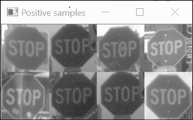

我们（非常小）的负样本集如下：

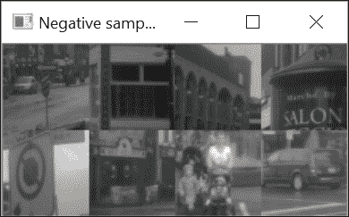

我们现在将学习如何使用`cv::svm`类中实现的 SVM 来区分这两个类别。为了构建一个健壮的分类器，我们将使用 HOG 来表示我们的类实例，正如在本食谱的介绍部分所描述的。更确切地说，我们将使用由`2×2`单元格组成的`8×8`块，块步长为`1`个单元格：

```py
    cv::HOGDescriptor hogDesc(positive.size(), // size of the window 
                              cv::Size(8, 8),  // block size 
                              cv::Size(4, 4),  // block stride 
                              cv::Size(4, 4),  // cell size 
                              9);              // number of bins 

```

使用 9-箱直方图和`64×64`样本，这种配置产生大小为`8100`的 HOG 向量（由`225`个块组成）。我们为我们的每个样本计算这个描述符，并将它们转换成一个单独的矩阵（每行一个 HOG）：

```py
    // compute first descriptor  
    std::vector<float> desc; 
    hogDesc.compute(positives[0], desc); 

    // the matrix of sample descriptors 
    int featureSize = desc.size(); 
    int numberOfSamples = positives.size() + negatives.size(); 

    // create the matrix that will contain the samples HOG 
    cv::Mat samples(numberOfSamples, featureSize, CV_32FC1); 
    // fill first row with first descriptor 
    for (int i = 0; i < featureSize; i++) 
      samples.ptr<float>(0)[i] = desc[i]; 

    // compute descriptor of the positive samples 
    for (int j = 1; j < positives.size(); j++) { 
      hogDesc.compute(positives[j], desc); 
      // fill the next row with current descriptor 
      for (int i = 0; i < featureSize; i++) 
        samples.ptr<float>(j)[i] = desc[i]; 
    } 
    // compute descriptor of the negative samples 
    for (int j = 0; j < negatives.size(); j++) { 
      hogDesc.compute(negatives[j], desc); 
      // fill the next row with current descriptor 
      for (int i = 0; i < featureSize; i++) 
        samples.ptr<float>(j + positives.size())[i] = desc[i]; 
    } 

```

注意我们是如何计算第一个 HOG 以获得描述符的大小，然后创建描述符矩阵的。然后创建第二个矩阵来包含与每个样本关联的标签。在我们的例子中，前几行是正样本（必须分配标签`1`），其余行是负样本（标签为`-1`）：

```py
    // Create the labels 
    cv::Mat labels(numberOfSamples, 1, CV_32SC1); 
    // labels of positive samples 
    labels.rowRange(0, positives.size()) = 1.0; 
    // labels of negative samples 
    labels.rowRange(positives.size(), numberOfSamples) = -1.0; 

```

下一步是构建用于训练的 SVM 分类器；我们还选择了要使用的 SVM 类型和核函数（这些参数将在下一节中讨论）：

```py
    // create SVM classifier 
    cv::Ptr<cv::ml::SVM> svm = cv::ml::SVM::create(); 
    svm->setType(cv::ml::SVM::C_SVC); 
    svm->setKernel(cv::ml::SVM::LINEAR); 

```

我们现在准备开始训练。首先将标记的样本提供给分类器，并调用`train`方法：

```py
    // prepare the training data 
    cv::Ptr<cv::ml::TrainData> trainingData = 
           cv::ml::TrainData::create(samples,
                              cv::ml::SampleTypes::ROW_SAMPLE, labels); 
    // SVM training 
    svm->train(trainingData); 

```

一旦训练阶段完成，任何未知类别的样本都可以提交给分类器，分类器将尝试预测它所属的类别（在这里我们测试了四个样本）：

```py
    cv::Mat queries(4, featureSize, CV_32FC1); 

    // fill the rows with query descriptors 
    hogDesc.compute(cv::imread("stop08.png",  
                           cv::IMREAD_GRAYSCALE), desc); 
    for (int i = 0; i < featureSize; i++) 
      queries.ptr<float>(0)[i] = desc[i]; 
    hogDesc.compute(cv::imread("stop09.png",  
                           cv::IMREAD_GRAYSCALE), desc); 
    for (int i = 0; i < featureSize; i++) 
      queries.ptr<float>(1)[i] = desc[i]; 
    hogDesc.compute(cv::imread("neg08.png",  
                           cv::IMREAD_GRAYSCALE), desc); 
    for (int i = 0; i < featureSize; i++) 
      queries.ptr<float>(2)[i] = desc[i]; 
    hogDesc.compute(cv::imread("neg09.png",  
                           cv::IMREAD_GRAYSCALE), desc); 
    for (int i = 0; i < featureSize; i++) 
      queries.ptr<float>(3)[i] = desc[i]; 
    cv::Mat predictions; 

    // Test the classifier  
    svm->predict(queries, predictions); 
    for (int i = 0; i < 4; i++) 
      std::cout << "query: " << i << ": " <<  
               ((predictions.at<float>(i,) < 0.0)?  
                   "Negative" : "Positive") << std::endl; 

```

如果分类器已经用代表性样本进行了训练，那么它应该能够正确预测新实例的标签。

## 工作原理...

在我们的停车标志识别示例中，我们类中的每个实例都由一个在 8100 维 HOG 空间中的点来表示。显然，无法可视化这样一个大的空间，但支持向量机背后的想法是在该空间中绘制一个边界，将属于一个类别的点与属于另一个类别的点分开。更具体地说，这个边界实际上将只是一个简单的超平面。这个想法最好通过考虑一个二维空间来解释，其中每个实例都表示为一个二维点。在这种情况下，超平面是一个简单的直线。

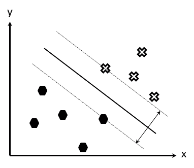

这显然是一个简单的例子，但从概念上讲，在二维空间或 8100 维空间中工作是同一件事。前面的图显示了如何用一条简单的线很好地分离两个类的点。在本例中，还可以看到许多其他线也能实现这种完美的类分离。因此，一个问题就是；应该选择哪条确切的线。为了回答这个问题，你必须首先意识到，我们用来构建分类器的样本只是所有可能实例的一个小快照，当分类器在目标应用中使用时，需要对这些实例进行分类。这意味着我们希望我们的分类器不仅能够正确地分离提供的样本集，而且我们还希望这个分类器对它展示的未来实例做出最佳决策。这个概念通常被称为分类器的**泛化能力**。直观地，我们相信我们的分离超平面应该位于两个类之间，而不是比另一个类更接近。更正式地说，SVMs 提出将超平面设置在最大化定义边界周围边界的位置。这个**边界**被定义为分离超平面与正样本集中最近点的最小距离加上超平面与最近负样本的距离。最近的点（定义边界的点）被称为**支持向量**。SVM 背后的数学定义了一个优化函数，旨在识别这些支持向量。

但是，针对分类问题的提出的解决方案不可能那么简单。如果样本点的分布如下所示，会发生什么？

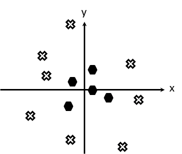

在这种情况下，一个简单的超平面（这里是一条线）无法实现适当的分离。SVM 通过引入人工变量，通过某些非线性变换将问题引入更高维的空间来解决此问题。例如，在上面的例子中，有人可能会提出添加到原点的距离作为一个额外的变量，即计算每个点的*r= sqrt(x²+y²)*。我们现在有一个三维空间；为了简单起见，我们只需在*(r,x)*平面上绘制这些点：

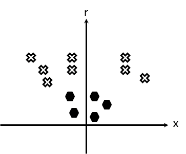

如您所见，我们的样本点现在可以通过一个简单的超平面分离。这意味着您现在必须在这个新空间中找到支持向量。实际上，在 SVM 公式中，您不需要将所有点都带入这个新空间，您只需要定义一种方法来测量这个增强空间中点到超平面的距离。因此，SVM 定义了**核函数**，允许您在不显式计算该空间中点坐标的情况下测量这个距离。这只是一个数学技巧，解释了为什么产生最大间隔的支持向量可以在非常高的（人工）维空间中有效地计算。这也解释了为什么当您想使用支持向量机时，您需要指定要使用哪种核。正是通过应用这些核，您将使非线性不可分的数据在核空间中变得可分。

然而，这里有一个重要的说明。由于在使用支持向量机时，我们经常处理非常高维的特征（例如，在我们的 HOG 示例中为`8100`维），因此我们的样本可能非常容易被一个简单的超平面分离。这就是为什么仍然有意义不使用非线性核（或者更精确地说，使用线性核，即`cv::ml::SVM::LINEAR`）并在原始特征空间中工作。这样得到的分类器在计算上会更简单。但对于更具挑战性的分类问题，核仍然是一个非常有效的工具。OpenCV 为你提供了一系列标准核（例如，径向基函数、Sigmoid 函数等）；这些核的目标是将样本发送到一个更大的非线性空间，使得类别可以通过超平面分离。支持向量机有多个变体；最常见的是 C-SVM，它为每个不在超平面右侧的异常样本添加惩罚。

最后，我们强调，由于它们强大的数学基础，支持向量机非常适合处理非常高维的特征。事实上，它们已经被证明在特征空间的维数大于样本数量时表现最佳。它们在内存效率上也很有优势，因为它们只需要存储支持向量（与需要保留所有样本点的最近邻方法相比）。

## 还有更多...

方向梯度直方图和 SVM 对于构建良好的分类器是一个很好的组合。这种成功的一个原因是 HOG 可以被看作是一个鲁棒的高维描述符，它捕捉了对象类的基本方面。HOG-SVM 分类器已经在许多应用中成功使用；行人检测就是其中之一。

最后，由于这是本书的最后一个配方，因此我们将以机器学习领域最近趋势的视角来结束，这个趋势正在改变计算机视觉和人工智能。

### HOG 可视化

HOG 是从重叠的块中组合的单元格构建的。因此，可视化这个描述符很困难。尽管如此，它们通常通过显示与每个单元格关联的直方图来表示。在这种情况下，与在常规条形图中对齐方向箱不同，方向直方图可以更直观地绘制成星形，其中每条线都与它所代表的箱子的方向相关联，线的长度与该箱子的计数成比例。这些 HOG 表示可以随后显示在图像上：

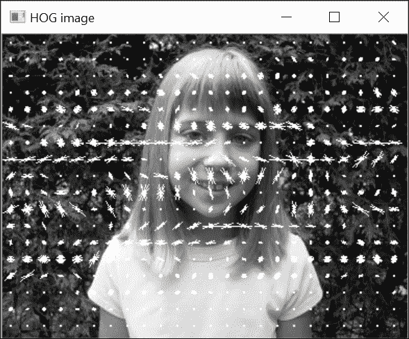

每个单元格的 HOG 表示可以通过一个简单的函数生成，该函数接受一个指向直方图的迭代器。然后为每个`bin`绘制适当方向和长度的线条：

```py
    //draw one HOG over one cell 
    void drawHOG(std::vector<float>::const_iterator hog,  
                       // iterator to the HOG 
                 int numberOfBins,       // number of bins inHOG 
                 cv::Mat &image,         // image of the cell 
                 float scale=1.0) {      // length multiplier 

      const float PI = 3.1415927; 
      float binStep = PI / numberOfBins; 
      float maxLength = image.rows; 
      float cx = image.cols / 2.; 
      float cy = image.rows / 2.; 

      // for each bin 
      for (int bin = 0; bin < numberOfBins; bin++) { 

        // bin orientation 
        float angle = bin*binStep; 
        float dirX = cos(angle); 
        float dirY = sin(angle); 
        // length of line proportion to bin size 
        float length = 0.5*maxLength* *(hog+bin); 

        // drawing the line 
        float x1 = cx - dirX * length * scale; 
        float y1 = cy - dirY * length * scale; 
        float x2 = cx + dirX * length * scale; 
        float y2 = cy + dirY * length * scale; 
        cv::line(image, cv::Point(x1, y1), cv::Point(x2, y2),  
                 CV_RGB(255, 255, 255), 1); 
      } 
    } 

```

HOG 可视化函数将为每个单元格调用此先前的函数：

```py
    // Draw HOG over an image 
    void drawHOGDescriptors(const cv::Mat &image,  // the input image  
             cv::Mat &hogImage, // the resulting HOG image 
             cv::Size cellSize, // size of each cell (blocks are ignored) 
             int nBins) {       // number of bins 

      // block size is image size 
      cv::HOGDescriptor hog( 
              cv::Size((image.cols / cellSize.width) * cellSize.width,     
                       (image.rows / cellSize.height) * cellSize.height), 
              cv::Size((image.cols / cellSize.width) * cellSize.width,   
                       (image.rows / cellSize.height) * cellSize.height),  
              cellSize,    // block stride (ony 1 block here) 
              cellSize,    // cell size 
              nBins);      // number of bins 

      //compute HOG 
      std::vector<float> descriptors; 
      hog.compute(image, descriptors); 
      ... 
      float scale= 2.0 / * 
                  std::max_element(descriptors.begin(),descriptors.end()); 
      hogImage.create(image.rows, image.cols, CV_8U); 
      std::vector<float>::const_iterator itDesc= descriptors.begin(); 

      for (int i = 0; i < image.rows / cellSize.height; i++) { 
        for (int j = 0; j < image.cols / cellSize.width; j++) { 
          //draw each cell 
             hogImage(cv::Rect(j*cellSize.width, i*cellSize.height,  
                      cellSize.width, cellSize.height)); 
           drawHOG(itDesc, nBins,  
                   hogImage(cv::Rect(j*cellSize.width,                  
                                     i*cellSize.height,  
                                     cellSize.width, cellSize.height)),  
                   scale); 
          itDesc += nBins; 
        } 
      } 
    } 

```

此函数计算具有指定单元格大小的 HOG 描述符，但由一个大型块（即具有图像大小的块）组成。因此，这种表示忽略了在每个块级别发生的归一化效果。

### 人体检测

OpenCV 提供了一个基于 HOG 和 SVM 的预训练人体检测器。至于之前菜谱中的分类器级联，这个 SVM 分类器可以通过在图像上扫描多个尺度的窗口来检测整个图像中的实例。然后你只需构建分类器并在图像上执行检测：

```py
    // create the detector 
    std::vector<cv::Rect> peoples; 
    cv::HOGDescriptor peopleHog; 
    peopleHog.setSVMDetector( 
    cv::HOGDescriptor::getDefaultPeopleDetector()); 
    // detect peoples oin an image 
    peopleHog.detectMultiScale(myImage, // input image 
               peoples,           // ouput list of bounding boxes  
               0,       // threshold to consider a detection to be positive 
               cv::Size(4, 4),    // window stride  
               cv::Size(32, 32),  // image padding 
               1.1,               // scale factor 
               2);                // grouping threshold 

```

窗口步长定义了`128×64`模板在图像上移动的方式（在我们的例子中，水平垂直方向上每`4`个像素）。较长的步长会使检测更快（因为评估的窗口更少），但你可能会错过一些落在测试窗口之间的人。图像填充参数简单地在图像的边缘添加像素，以便检测图像边缘的人。SVM 分类器的标准阈值是`0`（因为`1`是分配给正实例的值，`-1`是分配给负实例的值）。但如果你真的想确保你检测到的是人，那么你可以提高这个阈值值（这意味着你希望以牺牲图像中一些人为代价来获得**高精度**）。相反，如果你想确保检测到所有人（即你希望有一个**高召回率**），那么你可以降低阈值；在这种情况下，将会发生更多的误检。

这里是一个检测结果的示例：

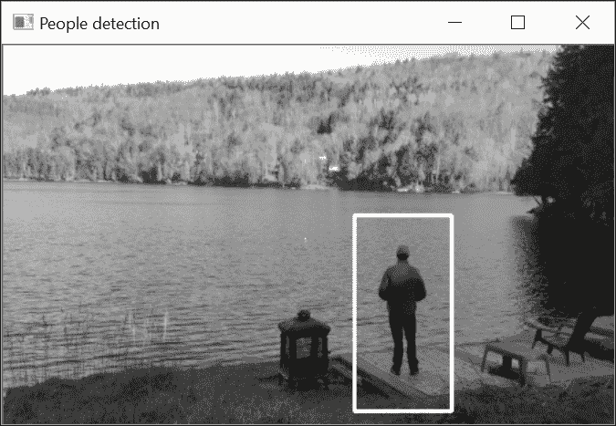

需要注意的是，当分类器应用于整个图像时，在连续位置应用的多窗口通常会围绕正样本产生多个检测。当两个或更多边界框在大约相同的位置重叠时，最好的做法是只保留其中一个。有一个名为 `cv::groupRectangles` 的函数，它简单地合并相似位置和相似大小的矩形（此函数由 `detectMultiScale` 自动调用）。实际上，在特定位置获得一组检测甚至可以被视为一个指标，确认我们确实在这个位置有一个正实例。这就是为什么 `cv::groupRectangles` 函数允许我们指定一个检测簇的最小尺寸，以便将其接受为正检测（即孤立检测应被丢弃）。这是 `detectMultiScale` 方法的最后一个参数。将其设置为 `0` 将保留所有检测（不进行分组），在我们的例子中，这导致了以下结果：

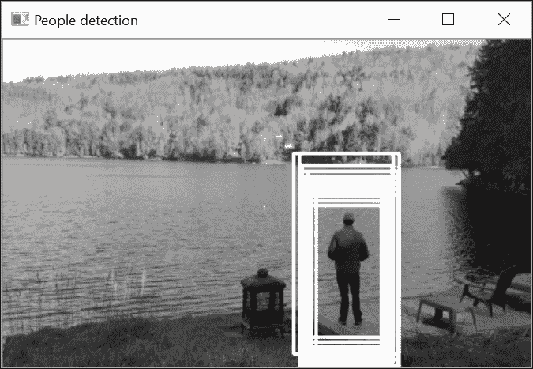

### 深度学习和卷积神经网络

我们在介绍机器学习这一章时，不能不提及深度卷积神经网络。这些网络在计算机视觉分类问题中的应用已经取得了令人印象深刻的成果。实际上，它们在解决现实世界问题时表现出的卓越性能，以至于现在为之前无法想象的新一代应用打开了大门。

深度学习基于 20 世纪 50 年代末引入的神经网络理论。那么，为什么它们今天会如此受到关注呢？基本上有两个原因：首先，现在的计算能力允许部署能够解决挑战性问题的神经网络。虽然第一个神经网络（感知器）只有一个层和很少的权重参数需要调整，但今天的网络可以有数百层和数百万个参数需要优化（因此得名深度网络）。其次，今天可用的海量数据使得它们的训练成为可能。为了表现良好，深度网络确实需要数千甚至数百万个标注样本（这是由于需要优化的参数数量非常庞大）。

最受欢迎的深度网络是**卷积神经网络**（**CNN**）。正如其名所示，它们基于卷积操作（参见第六章，*过滤图像*）。在这种情况下，要学习的参数是所有组成网络的滤波器内核中的值。这些滤波器被组织成层，其中早期层提取基本形状，如线条和角，而高层则逐步检测更复杂的模式（例如，在人类检测器中，例如眼睛、嘴巴、头发）。

OpenCV3 拥有一个 **深度神经网络** 模块，但这个模块主要用于导入使用 TensorFlow、Caffe 或 Torch 等其他工具训练的深度网络。当构建你未来的计算机视觉应用时，你肯定会需要查看深度学习理论及其相关工具。

## 参见

+   在 *Describing and Matching Interest Points* 的第九章 “描述和匹配兴趣点” 中，*Describing and matching local intensity patterns* 菜单描述了与 HOG 描述符相似的 SIFT 描述符

+   N. Dalal 和 B. Triggs 在 2005 年 *Computer Vision and Pattern Recognition* 会议上的文章 *Histograms of Oriented Gradients for Human Detection* 是介绍用于人体检测的梯度直方图的经典论文

+   Y. LeCun、Y. Bengio 和 G. Hinton 在 *Nature, no 521*，2015 年发表的 *Deep Learning* 文章是探索深度学习世界的良好起点
