# 第一章. 为 Java 设置 OpenCV

我相信您想要开始开发令人惊叹的计算机视觉应用程序。您可能已经听说过一个名为 OpenCV 的优秀的 C/C++ 计算机视觉库，它可以帮助您实现这一目标。但如果您想使用您对 Java 编程的了解来开发应用程序，我们有一个好消息要告诉您。自 2013 年 1 月 OpenCV 2.4.4 版本发布以来，Java 绑定已经正式开发。因此，您不仅可以在桌面 Java 中使用它们，还可以用于 Scala 开发。

本章将立即为您设置 OpenCV 开发环境。由于 Java 开发者大多数情况下习惯于使用 **Eclipse**、**NetBeans**、**Apache Ant** 和 **Maven** 等工具，我们将介绍如何使用 Java 开发者更熟悉的开发环境创建一个简单的 OpenCV 应用程序。

在本章中，我们将进行以下操作：

+   获取具有桌面 Java 支持的 OpenCV

+   讨论关于 **Java 本地接口**（**JNI**）的细节

+   配置 Eclipse 和 NetBeans 以支持 OpenCV

+   创建 Apache Ant 和 Maven OpenCV 项目

到本章结束时，用户应该在操作系统上运行一个 OpenCV for Java 安装，可以轻松地链接到 Eclipse、NetBeans、Apache Ant 或 Maven，这些是最常用的 Java 工具和构建系统。

# 获取用于 Java 开发的 OpenCV

在使用 OpenCV 进行 Java 开发时，首先要注意的是 OpenCV 是一个需要使用操作系统特定编译器编译的 C++ 库。生成的本地代码是平台相关的。因此，原生 Linux 代码无法在 Windows 上运行，同样 Android 原生代码也无法在 OSX 上运行。这与为 Java 生成的字节码非常不同，Java 字节码可以在任何平台上由解释器执行。为了在 **Java 虚拟机**（**JVM**）中运行本地代码，需要所谓的 **Java 本地接口**（**JNI**）。这样，本地代码将需要为您的应用程序将要运行的每个平台而准备。

重要的是要理解 JNI 是一个本地编程接口。它允许在 JVM 内部运行的 Java 代码与其他用 C、C++和汇编等编程语言编写的应用程序和库进行交互。由于它架起了 Java 和其他语言之间的桥梁，它需要将这些语言的 datatypes 进行转换，以及创建一些样板代码。好奇的读者可以参考位于`modules/java/generator`文件夹中的`gen_java.py`脚本，该脚本自动化了大部分这项工作。幸运的 Windows 用户可以得到编译后的二进制文件，这意味着源 C++ OpenCV 代码，用 Windows 编译器编译成仅在 Windows 上运行的本地代码，来自 OpenCV 软件包。来自其他操作系统的用户将需要从源代码构建二进制文件，尽管也可以在 Windows 上这样做。为了下载编译后的二进制文件，我们应该从 OpenCV SourceForge 仓库获取版本 2.4.4 或更高版本的 OpenCV Windows 软件包，该仓库位于[`sourceforge.net/projects/opencvlibrary/files/`](http://sourceforge.net/projects/opencvlibrary/files/)。

### 注意

注意到用于 Java 开发的预构建文件位于`opencv/build/java/`。例如，如果你正在使用 3.0.0 版本的 OpenCV，你应该在`opencv-300.jar`中看到包含 Java 接口的文件，以及在 x86 和 x64 原生动态库中，其中包含 Java 绑定，分别在`x86/opencv_java300.dll`和`x64/opencv_java300.dll`中。

# 从源代码构建 OpenCV

在本节中，我们主要关注生成包含在 JAR 文件中的所有 OpenCV Java 类文件，以及 Java OpenCV 的原生动态库。这是一个自包含的库，与 JNI 一起工作，并且是运行 Java OpenCV 应用程序所必需的。

如果你正在使用 Linux 或 OSX，或者你想要在 Windows 上从源代码构建，那么为了获取 OpenCV 中提交的最新功能，你应该使用源代码。你可以访问 OpenCV 下载页面[`opencv.org/downloads.html`](http://opencv.org/downloads.html)，并选择适合你分发版的链接。

获取源代码的另一种方式是使用`git`工具。安装它的适当说明可以在[`git-scm.com/downloads`](http://git-scm.com/downloads)找到。当使用`git`时，请使用以下命令：

```py
git clone git://github.com/Itseez/opencv.git
cd opencv
git checkout 3.0.0-rc1
mkdir build
cd build

```

这些命令将访问 OpenCV 开发者的仓库，并从`branch 3.0.0-rc1`下载最新代码，这是 3.0.0 版本的候选发布版。

在获取源代码的任何一种方法中，你都需要构建工具来生成二进制文件。所需的软件包如下：

+   **CMake 2.6 或更高版本**：这是一个跨平台的开源构建系统。你可以从[`www.cmake.org/cmake/resources/software.html`](http://www.cmake.org/cmake/resources/software.html)下载它。

+   **Python 2.6 或更高版本，以及 python-dev 和 python-numpy**：这是用于运行 Java 构建脚本的 Python 语言。你可以从 [`www.python.org/getit/`](http://www.python.org/getit/) 下载 Python，并从 [`sourceforge.net/projects/numpy/files/NumPy`](http://sourceforge.net/projects/numpy/files/NumPy) 下载这些包。

+   **C/C++ 编译器**：这些编译器是生成原生代码所必需的。在 Windows 上，你可以从 [`www.visualstudio.com/downloads/`](http://www.visualstudio.com/downloads/) 安装免费的 Microsoft Visual Studio Community 或 Express 版本。这些编译器也支持 Visual Studio Professional 版本以及 2010 年以上版本，应该可以正常工作。你也可以让它与 MinGW 一起工作，可以从 [`sourceforge.net/projects/mingw/files/Installer/`](http://sourceforge.net/projects/mingw/files/Installer/) 下载。在 Linux 上，建议你在 Ubuntu 或 Debian 上使用 **Gnu C 编译器**（**GCC**），例如通过简单的 `sudo apt-get install build-essential` 命令。如果你在 Mac 上工作，你应该使用 XCode。

+   **Java 开发工具包 (JDK)**：JDK 是生成 JAR 文件所必需的，这对于每个 Java OpenCV 程序都是必需的。推荐的版本从 Oracle 的 JDK 6、7 或 8 开始，可以从 [`www.oracle.com/technetwork/java/javase/downloads/index-jsp-138363.html`](http://www.oracle.com/technetwork/java/javase/downloads/index-jsp-138363.html) 下载。请按照链接中的操作系统特定说明进行安装。

+   **Apache Ant**：这是一个纯 Java 构建工具。在 [`ant.apache.org/bindownload.cgi`](http://ant.apache.org/bindownload.cgi) 寻找二进制发行版。确保你正确设置了 `ANT_HOME` 变量，正如安装说明中指出的 [`ant.apache.org/manual/index.html`](http://ant.apache.org/manual/index.html)。

为了在 Linux 发行版（如 Ubuntu 或 Debian）中安装这些软件，用户应执行以下命令：

```py
sudo apt-get install build-essential cmake git libgtk2.0-dev pkg-config libavcodec-dev libavformat-dev libswscale-dev python-dev python-numpy libtbb2 libtbb-dev libjpeg-dev libpng-dev libtiff-dev libjasper-dev libdc1394-22-dev ant

```

一旦安装了所有这些包，你就可以准备构建库了。确保你位于 `build` 目录中，如果你已经遵循了前面的 Git 指令，你应该已经做到了。如果你从 OpenCV 下载中下载了源文件，你的构建父目录应该包含 `CMakeLists.txt` 以及 `3rdparty`、`apps`、`cmake`、`data`、`doc`、`include`、`modules`、`platforms`、`samples` 和 `test` 文件夹。

CMake 是一个构建工具，它将生成你特定的编译器解决方案文件。然后你应该使用你的编译器来生成二进制文件。确保你位于 `build` 目录中，因为这应该遵循最后的 `cd build` 命令。如果你使用 Linux，运行以下命令：

```py
cmake -DBUILD_SHARED_LIBS=OFF

```

如果你使用 Windows，运行以下命令：

```py
cmake -DBUILD_SHARED_LIBS=OFF -G "Visual Studio 10"

```

注意，使用 `DBUILD_SHARED_LIBS=OFF` 标志非常重要，因为它将指示 CMake 在一组静态库上构建 OpenCV。这样，它将为 Java 编译一个不依赖于其他库的单个动态链接库。这使得部署你的 Java 项目更容易。

### 注意

如果你正在 Windows 上使用其他编译器，请输入 `cmake –help`，它将显示所有可用的生成器。

如果你想使用 MinGW makefiles，只需将 CMake 命令更改为以下命令：

```py
cmake -DBUILD_SHARED_LIBS=OFF -G "MinGW Makefiles"

```

在通过 CMake 生成项目文件时需要注意的一个关键点是 `java` 是将要构建的模块之一。你应该会看到一个如图所示的屏幕：

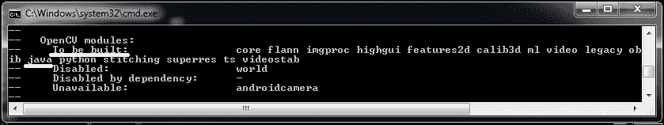

如果你看不到 `java` 作为待构建模块之一，如以下截图所示，你应该检查几个方面，例如 Ant 是否正确配置。同时确保你已经设置了 `ANT_HOME` 环境变量，并且 Python 已经正确配置。通过在 Python 壳中简单地输入 `numpy import *` 来检查 NumPy 是否已安装，并检查是否有任何错误：

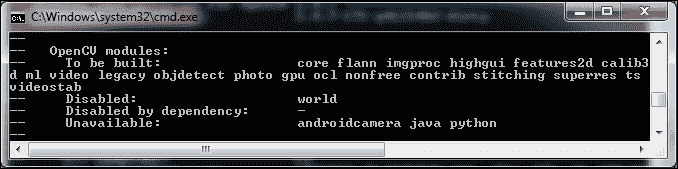

如果你对 Python 和 Java 的安装有疑问，向下滑动以检查它们的配置。它们应该类似于下一张截图：

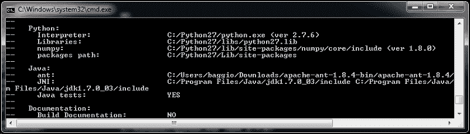

一切配置正确后，就是开始编译源代码的时候了。在 Windows 上，输入以下命令：

```py
msbuild /m OpenCV.sln /t:Build /p:Configuration=Release /v:m

```

注意，你可能会收到一个错误消息，说 `'msbuild' 不是内部或外部命令，也不是可操作的程序或批处理文件`。这发生在你没有设置 `msbuild` 路径时。为了正确设置它，打开 Visual Studio 并在 **工具** 菜单中点击 **Visual Studio 命令提示符**。这将提供一个完全工作的命令提示符，可以访问 `msbuild`。请参考以下截图以获得更清晰的说明：

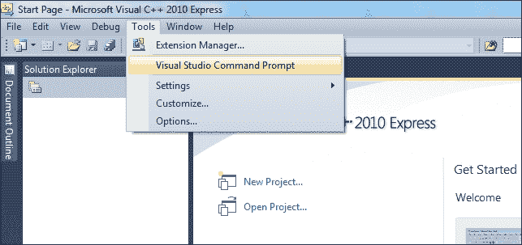

如果你使用的是较新的 Visual Studio 版本，请按 Windows 键并输入**VS2012 命令提示符**。这应该会设置你的环境变量。

为了在 Linux 上开始构建，只需输入以下命令：

```py
make -j8

```

上述命令将编译具有 Java 支持的 OpenCV 库。请注意，`-j8` 标志告诉 `make` 使用八个工作线程并行运行，这从理论上讲可以加快构建速度。

### 提示

**下载示例代码**

你可以从[`www.packtpub.com`](http://www.packtpub.com)下载示例代码文件，这是你购买的所有 Packt 出版物的代码。如果你在其他地方购买了这本书，你可以访问[`www.packtpub.com/support`](http://www.packtpub.com/support)并注册，以便将文件直接通过电子邮件发送给你。

整个过程将持续几分钟，直到生成一个包含 Java 接口的 JAR 文件，该文件位于 `bin/opencv-300.jar`。包含 Java 绑定的原生动态链接库在 `lib/libopencv_java300.so` 或 `bin/Release/opencv_java300.dll` 中生成，具体取决于您的操作系统。这些文件将在我们创建第一个 OpenCV 应用程序时使用。

### 备注

关于如何在您的平台上编译 OpenCV 的更多详细信息，请查找 [`docs.opencv.org/doc/tutorials/introduction/table_of_content_introduction/table_of_content_introduction.html`](http://docs.opencv.org/doc/tutorials/introduction/table_of_content_introduction/table_of_content_introduction.html)。

恭喜！你现在已经完成了成为使用 OpenCV 的优秀开发者的一半旅程！

# Eclipse 中的 Java OpenCV 项目

在任何 IDE 中使用 OpenCV 都非常简单。只需将 OpenCV JAR，即 `opencv-300.jar` 添加到您的类路径即可。但是，因为它依赖于原生代码，所以您需要指出动态链接库——Linux 中的 `so`，Windows 中的 `.dll` 和 MacOSX 中的 `dylib`。

1.  在 Eclipse 中，转到 **文件** | **新建** | **Java 项目**。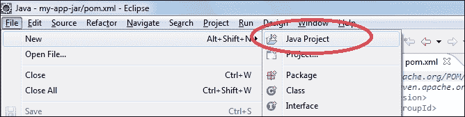

1.  给新项目起一个描述性的名称，例如 `SimpleSample`。在 **包资源管理器** 中选择项目，转到 **项目** 菜单并点击 **属性**。在 **Java 构建路径** 选项卡中，转到 **库** 选项卡，然后点击右侧的 **添加库…** 按钮，如图所示：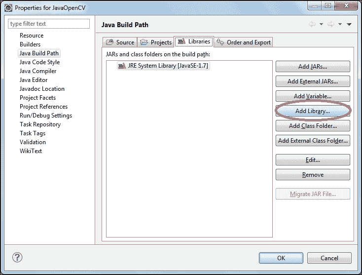

1.  在 **添加库** 对话框中，选择 **用户库**，然后点击 **下一步**。

1.  现在，点击 **用户库…** 按钮。

1.  点击 **新建…**。适当地命名您的库，例如，`opencv-3.0.0`。现在是引用 JAR 文件的时候了。

1.  点击 **添加 JARs…**。

1.  在你的文件系统中选择 `opencv-300.jar` 文件；它应该在 `opencv\build\java` 文件夹中。然后，指向原生库位置，如以下截图所示：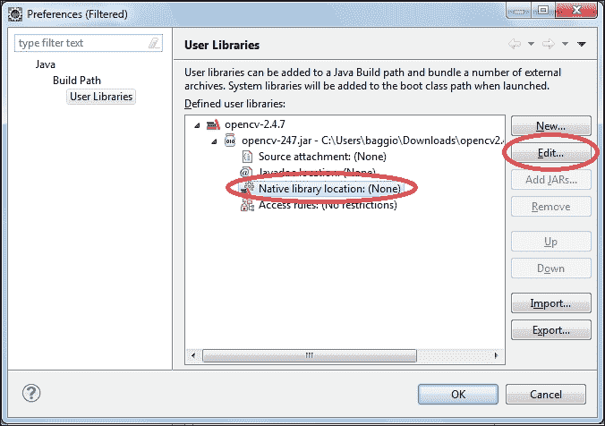

1.  现在，通过点击窗口右侧的 **编辑…** 按钮选择 **原生库位置**，并设置您的原生库位置文件夹，例如，`opencv\build\java\x64\`。

1.  现在 OpenCV 已经正确配置，只需在您的 **添加库** 对话框中选择它，按 **完成**。

注意，你的项目现在指向了 OpenCV JAR。你还可以从 **包资源管理器** 中浏览主类，如图所示：

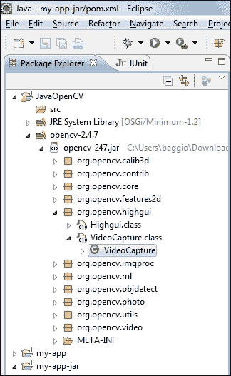

在 *NetBeans 配置* 部分之后，可以找到创建一个简单的 OpenCV 应用程序的源代码。

# NetBeans 配置

如果您更习惯使用 NetBeans，配置过程与 Eclipse 几乎相同：

1.  选择**文件** | **新建项目...**。在**项目**选项卡中，选择**Java 应用程序**，然后单击**下一步**。为新项目提供一个合适的名称，然后单击**完成**。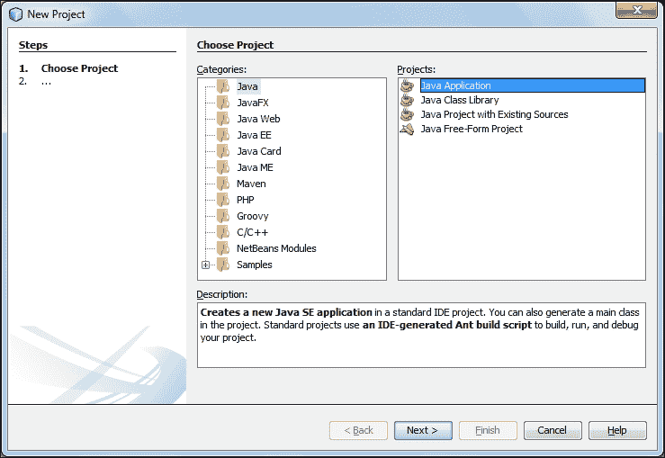

1.  现在，在您的**库**文件夹上右键单击，然后单击**添加库...**，如图所示：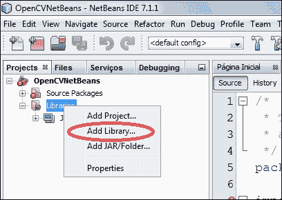

1.  由于我们之前没有进行过这个过程，OpenCV 库将不存在。在窗格的右侧单击**创建...**按钮。它将打开一个对话框，要求输入库名称——命名为`OpenCV`——以及**库类型**，对于此选项，您应保留默认选项**类库**。在下一屏幕中，在**类路径**选项卡中，单击**添加 JAR/Folder...**，如图所示：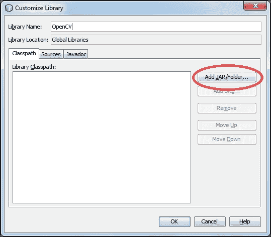

1.  现在指向您的库，即`opencv-300.jar`文件所在的位置——通常在`opencv/build/java/`。由于您的库已正确配置，请在**添加库**对话框中选择它。

1.  需要提供的最后一个细节是库的本地文件路径。在**项目**选项卡中右键单击您的项目名称，然后选择**属性**。在树中的**运行**项下，在**虚拟机选项**下，通过在文本框中输入`-Djava.library.path=C:\Users\baggio\Downloads\opencv\build\java\x64`来设置库路径。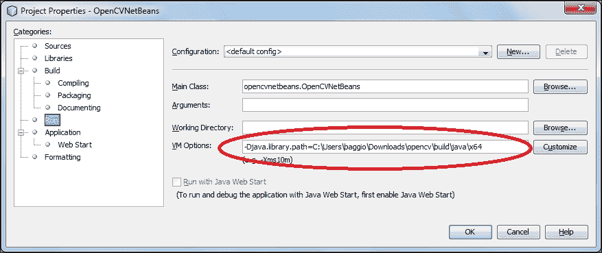

确保将给定的路径更改为您的 OpenCV 安装位置，并且它指向包含本地库的文件夹，即 Windows 中的`opencv_java300.dll`或 Linux 中的`libopencv_java300.so`。现在，将`SimpleSample`类代码添加到您的项目中，如指示。运行示例并确保没有错误发生。

# 一个简单的 Java OpenCV 应用程序

是时候创建一个简单的应用程序来展示我们现在可以使用 OpenCV 编译和执行 Java 代码了。创建一个新的 Java 类，包含一个`Main`方法，并粘贴以下代码。它简单地创建一个 5 x 10 的 OpenCV 矩阵，设置其一些行和列，并将结果打印到标准输出。

确保通过调用`System.loadlibrary("opencv_java300")`加载正确的动态链接库。由于您可能以后想更改库版本，更好的方法是使用`Core.NATIVE_LIBARAY_NAME`常量，这将输出正确的库名称。您也可以在本书的`chapter1`代码库中找到此文件，位于`ant/src`目录下。

```py
import org.opencv.core.Core;
import org.opencv.core.Mat;
import org.opencv.core.CvType;
import org.opencv.core.Scalar;

class SimpleSample {

  static{ System.loadLibrary(Core.NATIVE_LIBRARY_NAME); }

  public static void main(String[] args) {
    System.out.println("Welcome to OpenCV " + Core.VERSION);
    Mat m = new Mat(5, 10, CvType.CV_8UC1, new Scalar(0));
    System.out.println("OpenCV Mat: " + m);
    Mat mr1 = m.row(1);
    mr1.setTo(new Scalar(1));
    Mat mc5 = m.col(5);
    mc5.setTo(new Scalar(5));
    System.out.println("OpenCV Mat data:\n" + m.dump());
  }

}
```

根据 Oracle 的文档，它指出，*类可以有任意数量的静态初始化块。并且它们可以出现在类体的任何位置。运行时系统保证静态初始化块按照它们在源代码中出现的顺序被调用*。

你应该确保所有对 OpenCV 库的调用都由单个 `System.loadLibrary` 调用 precede，以便加载动态库。否则，你将收到一个 `java.lang.UnsatisfiedLinkError: org.opencv.core.Mat.n_Mat(IIIDDDD)J` 错误。这通常发生在静态块中。

如果一切顺利，你应在控制台看到以下输出：

```py
Welcome to OpenCV 3.0.0-rc1
OpenCV Mat: Mat [ 5*10*CV_8UC1, isCont=true, isSubmat=false, nativeObj=0x2291b70, dataAddr=0x229bbd0 ]
OpenCV Mat data:
[ 0, 0, 0, 0, 0, 5, 0, 0, 0, 0;
 1, 1, 1, 1, 1, 5, 1, 1, 1, 1;
 0, 0, 0, 0, 0, 5, 0, 0, 0, 0;
 0, 0, 0, 0, 0, 5, 0, 0, 0, 0;
 0, 0, 0, 0, 0, 5, 0, 0, 0, 0]

```

# 使用 Ant 构建你的项目

如果你想要依赖 Apache Ant 进行构建而不是使用 IDE，OpenCV 示例中提供了一个 `build.xml` 文件。你可以在本章的存储库中找到此文件。以下是其内容：

```py
<project name="SimpleSample" basedir="." default="rebuild-run">
    <property name="src.dir"     value="src"/>
    <property name="lib.dir"     value="${ocvJarDir}"/>
    <path id="classpath">
        <fileset dir="${lib.dir}" includes="**/*.jar"/>
    </path>
    <property name="build.dir"   value="build"/>
    <property name="classes.dir" value="${build.dir}/classes"/>
    <property name="jar.dir"     value="${build.dir}/jar"/>
    <property name="main-class"  value="${ant.project.name}"/>

    <target name="clean">
        <delete dir="${build.dir}"/>
    </target>

    <target name="compile">
        <mkdir dir="${classes.dir}"/>
        <javac includeantruntime="false" srcdir="${src.dir}" destdir="${classes.dir}" classpathref="classpath"/>
    </target>

    <target name="jar" depends="compile">
        <mkdir dir="${jar.dir}"/>
        <jar destfile="${jar.dir}/${ant.project.name}.jar" basedir="${classes.dir}">
            <manifest>
                <attribute name="Main-Class" value="${main-class}"/>
            </manifest>
        </jar>
    </target>

    <target name="run" depends="jar">
        <java fork="true" classname="${main-class}">
            <sysproperty key="java.library.path" path="${ocvLibDir}"/>
            <classpath>
                <path refid="classpath"/>
                <path location="${jar.dir}/${ant.project.name}.jar"/>
            </classpath>
        </java>
    </target>

    <target name="rebuild" depends="clean,jar"/>

    <target name="rebuild-run" depends="clean,run"/>

</project>
```

这是一个基本的 `build.xml` Ant 文件，它定义了诸如清理、编译、打包 `.jar` 文件、运行、重新构建和重新构建运行等任务。它期望你的源代码位于一个名为 `src` 的同级文件夹中。请确保之前提供的 `SimpleSample.java` 源代码位于此目录中。

使用 Ant 编译和运行项目很简单。只需输入以下命令：

```py
ant -DocvJarDir=path/to/dir/containing/opencv-300.jar -DocvLibDir=path/to/dir/containing/opencv_java300/native/library

```

如果你已经下载并解压了预构建的二进制文件，请使用以下命令代替：

```py
ant -DocvJarDir=X:\opencv3.0.0\opencv\build\java -DocvLibDir=X:\opencv3.00\opencv\build\java\x64

```

Ant `build.xml` 成功运行的外观如下所示：

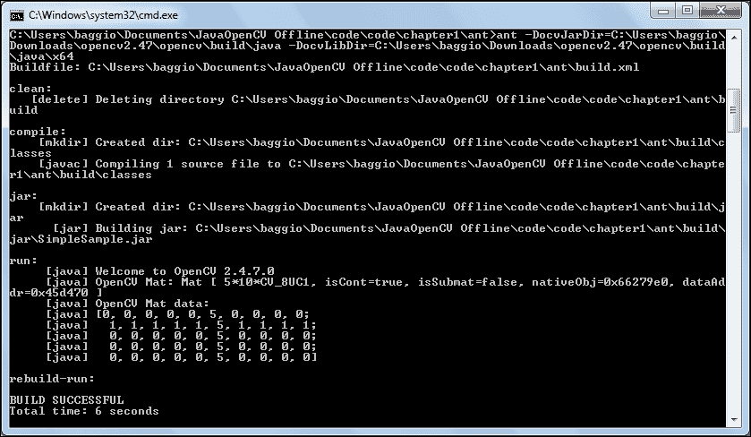

提供的 `build.xml` 文件可以用于构建你的 Java OpenCV 应用程序。为了使用它，请确保项目名称与你的主类名称匹配。如果你的主类位于 `package com.your.company` 中，并且名为 `MainOpenCV`，你应该将 `build.xml` 的第一行从 `<project name="SimpleSample" basedir="." default="rebuild-run">` 更改为 `<project name="com.your.company.MainOpenCV" basedir="." default="rebuild-run">`。

你还可以将 `ocvJarDir` 和 `ocvLibDir` 属性硬编码，这样在调用 Ant 时就不必输入它们。对于 `ocvJarDir`，只需将 `<property name="lib.dir" value="${ocvJarDir}"/>` 命令更改为 `<property name="lib.dir" value="X:\opencv2.47\opencv\build\java"/>`。

# Java OpenCV Maven 配置

Apache Maven 是一个更复杂的构建自动化工具，主要用于 Java 项目。它不仅描述了软件是如何构建的，还描述了它如何依赖于其他库。其项目通过一个名为 `pom.xml` 的**项目对象模型**进行配置。Maven 依赖通常位于 Maven 2 中央仓库。如果在那里找不到，您需要添加其他仓库。您还可以创建一个本地仓库并将自己的依赖项添加到那里。在撰写本书时，没有公开的 Java OpenCV 依赖项。因此，我们将不仅涵盖在本地仓库中安装 Java OpenCV Maven 依赖项的过程，还将介绍如何使用本书的 Maven 仓库进行 OpenCV 3.0.0 版本的 Windows 构建。如果 OpenCV 开发者托管公共 Maven 仓库，则需要做些小的修改。您只需找到官方 OpenCV JAR 的 `groupId`、`artifactId` 和 `version` 并将它们放入您的 `pom.xml` 文件中即可。

为了使您的项目依赖于任何库，您只需在您的 `pom.xml` 文件中提供三个字段即可。它们是 `groupId`、`artifactId` 和 `version`。将项目依赖于不在中央 Maven 仓库中托管的库的推荐方法是使用简单的命令安装它们，例如 `mvn install:install-file -Dfile=non-maven-proj.jar -DgroupId=some.group -DartifactId=non-maven-proj -Dversion=1 -Dpackaging=jar`。

在下一节中，我们将向您展示如何使用 Packt 仓库进行 Windows 构建并随后提供如何在您的本地仓库中安装它们的详细信息，以防您需要这样做。

## 创建指向 Packt 仓库的 Windows Java OpenCV Maven 项目

本节展示了如何创建一个基本的 Maven 项目以及如何自定义它，以便添加 OpenCV 依赖项。除此之外，它还将生成一个 Eclipse 项目，以便读者可以轻松地在 Windows 中生成项目。这里的一个主要优势是，无需手动构建或下载 OpenCV 库。

虽然 Maven 的学习曲线可能比直接在您喜欢的 IDE 中创建项目要陡峭一些，但从长远来看，这是值得的。使用 Maven 的最好之处在于，您根本不需要安装 OpenCV，因为所有依赖项，包括本地文件，都会自动下载。我们将在以下简单步骤中向您展示如何操作：

1.  **从原型构建项目**：为您的项目创建一个空文件夹。让我们将其命名为 `D:\mvnopencv`。在该文件夹中，输入以下命令：

    ```py
    mvn archetype:generate -DgroupId=com.mycompany.app -DartifactId=my-opencv-app -DarchetypeArtifactId=maven-archetype-quickstart -DinteractiveMode=false

    ```

    让我们将其分解为几个部分。`mvn archetype:generate` 命令告诉 Maven 运行来自 archetype 插件的 `generate goal` 命令。从文档中，我们看到 `generate goal` 从一个模板创建 Maven 项目；它会要求用户从模板目录中选择一个模板，并从远程仓库检索它。一旦检索到，它将被处理以创建一个可工作的 Maven 项目。这样，我们推断出 `-DarchetypeArtifactId=maven-archetype-quickstart` 参数是选定的模板。这将生成一个具有以下结构的 Java 项目：

    ```py
    my-opencv-app
    |-- pom.xml
    `-- src
        |-- main
        |   `-- java
        |       `-- com
        |           `-- company
        |               `-- app
        |                   `-- App.java
        `-- test
            `-- java
                `-- com
                    `-- company
                        `-- app
                            `-- AppTest.java
    ```

    ### 注意

    注意到 `-DgroupId=com.mycompany.app -DartifactId=my-opencv-app` 属性将填充 `pom.xml` 并提供项目树的一部分。

1.  **添加** **OpenCV 依赖项**：由于这是一个从通用 Maven 模板生成的项目，我们应该对其进行自定义，使其看起来像一个 Java OpenCV 项目。为了做到这一点，我们需要添加我们的依赖项。在 `D:\mvnopencv\my-opencv-app` 中打开生成的 `pom.xml` 文件。我们首先需要添加 Java OpenCV 依赖项。由于在撰写本书时它们不存在于 Maven 中央仓库中，你还需要指向一个在线仓库。我们为 Windows x86 和 Windows 64 位提供了原生文件。为了添加 Packt Maven 仓库，只需将以下行添加到你的 `pom.xml` 文件中：

    ```py
    <project  
      xsi:schemaLocation="http://maven.apache.org/POM/4.0.0 http://maven.apache.org/maven-v4_0_0.xsd">  

      <repositories>
        <repository>
          <id>javaopencvbook</id>
          <url>https://raw.github.com/JavaOpenCVBook/code/maven2/</url>
        </repository>
     </repositories>

     <modelVersion>4.0.0</modelVersion>
    …
    </project>
    ```

    现在，也添加 OpenCV 依赖项。为了编译你的代码，你只需要添加 OpenCV JAR 依赖项。如果你还想执行它，你还需要 Windows 原生文件。这些文件已经打包在 `opencvjar-runtime-3.0.0-natives-windows-x86.jar` 中，适用于 32 位架构。对于 64 位架构，这些文件打包在 `opencvjar-runtime-3.0.0-natives-windows-x86_64.jar` 中。在 `junit` 依赖项附近，添加以下内容：

    ```py
    <dependencies>
      <dependency>
        <groupId>junit</groupId>
        <artifactId>junit</artifactId>
        <version>3.8.1</version>
        <scope>test</scope>
      </dependency>
      <dependency>
        <groupId>org.javaopencvbook</groupId>
        <artifactId>opencvjar</artifactId>
        <version>3.0.0</version>
      </dependency>
      <dependency>
        <groupId>org.javaopencvbook</groupId>
        <artifactId>opencvjar-runtime</artifactId>
        <version>3.0.0</version>
        <classifier>natives-windows-x86_64</classifier>
      </dependency>
    </dependencies>
    ```

    注意到设置为 opencvjar-runtime 的 classifier 属性。它设置为 `natives-windows-x86_64`。这是你应该用于 64 位平台的值。如果你想要 32 位平台的版本，只需使用 `natives-windows-x86`。

1.  **配置构建插件**：`opencvjar-runtime` 依赖项仅包括 `.dll`、`.so` 等文件。这些文件将在执行 `mvn package` 命令时提取到你的目标位置。但是，这只会发生在你添加了 `maven-nativedependencies-plugin` 的情况下。此外，在创建可分发 JAR 时，将所有 JAR 库复制到你的 `/lib` 文件夹中也很重要。这将由 `maven-dependency-plugin` 处理。最后一个细节是在创建 JAR 时指定主类，这是由 `maven-jar-plugin` 执行的。所有构建插件配置应添加如下：

    ```py
    <build>
      <plugins>
        <plugin>
          <artifactId>maven-jar-plugin</artifactId>
          <version>2.4</version>
          <configuration>
            <archive>
              <manifest>
                <addClasspath>true</addClasspath>
                <classpathPrefix>lib/</classpathPrefix>
                <mainClass>com.mycompany.app.App</mainClass>
              </manifest>
            </archive>
          </configuration>
        </plugin>
        <plugin>
          <groupId>org.apache.maven.plugins</groupId>
          <artifactId>maven-dependency-plugin</artifactId>
          <version>2.1</version>
          <executions>
            <execution>
              <id>copy-dependencies</id>
              <phase>package</phase>
              <goals>
                <goal>copy-dependencies</goal>
              </goals>
              <configuration>
                <outputDirectory>${project.build.directory}/lib</outputDirectory>
                <overWriteReleases>false</overWriteReleases>
                <overWriteSnapshots>false</overWriteSnapshots>
                <overWriteIfNewer>true</overWriteIfNewer>
              </configuration>
            </execution>
          </executions>
        </plugin>
        <plugin>
          <groupId>com.googlecode.mavennatives</groupId>
          <artifactId>maven-nativedependencies-plugin</artifactId>
          <version>0.0.7</version>
          <executions>
            <execution>
              <id>unpacknatives</id>
              <phase>generate-resources</phase>
              <goals>
                <goal>copy</goal>
              </goals>
            </execution>
          </executions>
        </plugin>
      </plugins>
    </build>
    ```

    你可以在本章示例代码的 `chapter1/maven-sample` 目录中看到最终的 `pom.xml` 文件。

1.  **创建一个包**：现在，你应该通过创建一个包来检查一切是否正确。只需输入以下命令：

    ```py
    mvn package

    ```

    前面的步骤应该会下载所有插件和依赖项，从原型中编译你的`App.java`文件，在`target`文件夹中生成你的`my-opencv-app-1.0-SNAPSHOT.jar`，以及将所有依赖库复制到你的`target/lib`文件夹中；检查`junit`、`opencvjar`和`opencvjar-runtime` JAR 文件。此外，本地库被提取到`target` `/natives`文件夹中，因此可以在那里找到`opencv_java300.dll`。你的编译类也可以在`target` `/classes`文件夹中找到。其他生成的文件夹与你的测试相关。

1.  **自定义你的代码**：现在，我们将更改源文件以使用简单的 OpenCV 函数。导航到`D:\mvnopencv\my-opencv-app\src\main\java\com\mycompany\app`并编辑`App.java`文件。只需添加以下代码：

    ```py
    package com.mycompany.app;

    import org.opencv.core.Core;
    import org.opencv.core.Mat;
    import org.opencv.core.CvType;
    import org.opencv.core.Scalar;

    public class App
    {
      static{ System.loadLibrary(Core.NATIVE_LIBRARY_NAME); }

      public static void main(String[] args) {
        System.out.println("Welcome to OpenCV " + Core.VERSION);
        Mat m = new Mat(5, 10, CvType.CV_8UC1, new Scalar(0));
        System.out.println("OpenCV Mat: " + m);
        Mat mr1 = m.row(1);
        mr1.setTo(new Scalar(1));
        Mat mc5 = m.col(5);
        mc5.setTo(new Scalar(5));
        System.out.println("OpenCV Mat data:\n" + m.dump());
      }
    }
    ```

    这与我们在`App`类中放入的`SimpleSample`相同的代码。现在我们只需要运行它。记住通过运行以下命令重新编译它：

    ```py
    mvn package

    ```

1.  **执行你的代码**：执行生成的 JAR 文件，通过`-Djava.library.path`属性指向`/native`文件夹中的本地文件。这应该像输入以下命令一样简单：

    ```py
    D:\mvnopencv\my-opencv-app>java   -Djava.library.path=target\natives -jar target\my-opencv-app-1.0-SNAPSHOT.jar

    ```

    干得好！现在你应该得到与运行`SimpleSample`类相同的输出。如果你想通过`.bat`文件执行你的项目，只需在名为`run.bat`的文件中输入前面的命令，例如，并将其保存到`D:\mvnopencv\my-opencv-app`文件夹中。

1.  **生成一个 Eclipse 项目**：现在，你将能够利用一些 Maven 功能，例如通过简单地输入以下命令来创建 Eclipse 项目：

    ```py
    mvn eclipse:eclipse

    ```

为了将项目导入到 Eclipse 中，打开你的工作空间，然后转到**文件** | **导入...**。然后，选择**现有项目到工作空间**，在**选择根目录**单选按钮中点击**下一步** | **浏览...**，并浏览到`D:\mvnopencv\my-opencv-app`。它应该将此文件夹识别为 Eclipse 项目。然后只需点击**完成**。

如果你现在想运行你的项目，请注意这里有两条警告。默认情况下，Eclipse 不识别 Maven。因此，你会看到一个错误，告诉你“项目无法构建，直到解决构建路径错误”，“未绑定的类路径变量：'M2_REPO/org/javaopencvbook/opencvjar/3.0.0/opencvjar-3.0.0.jar'在项目'my-opencv-app'中”。

这个错误仅仅意味着你的 `M2_REPO` 变量没有定义。转到 **窗口** | **首选项**，在搜索框中输入 classpath 变量。在树中选择它将带出定义此变量的选项卡。点击 **新建...**，将出现 **新建变量条目** 对话框。在 **名称** 输入中，将其命名为 `M2_REPO`，在 **路径** 输入中，选择 **文件夹...** 并浏览到你的 Maven 仓库。这应该位于一个类似于 `C:/Users/baggio/.m2/` 的文件夹中。点击 **确定**，然后在 **首选项** 对话框中再次点击 **确定**。它将要求完全重建。点击 **是**，然后错误应该会消失。

如果你尝试通过右键点击**运行** | **Java 应用程序**来运行你的 `App.java` 类，它应该会给你以下异常：**Exception in thread "main" java.lang.UnsatisfiedLinkError: no opencv_java300 in java.library.path**。

这仅仅意味着 Eclipse 没有找到你的本地文件。修复它就像展开你的项目并定位到 **引用库** | **opencvjar-3.0.0.jar** 一样简单。右键点击它并选择 **属性**。在左侧选择 **本地库**，在 **位置** 路径中，点击 **工作空间...**，**my-opencv-app** | **target** | **natives**。记住，这个文件夹将只在你之前运行了 `mvn package` 命令时存在。再次运行 `App` 类，它应该会工作。

## 创建一个指向本地仓库的 Java OpenCV Maven 项目

上一节中给出的相同说明也适用于此处。唯一的区别是，你不需要将任何额外的仓库添加到你的 `pom.xml` 中，因为它们将位于你的本地仓库中，并且你必须安装并创建 Packt' 仓库中的所有 JAR 文件。我们假设你已经获得了 `opencv-300.jar` 和你架构所需的本地文件，也就是说，如果你在 Linux 上，你已经有了编译好的 `opencv_java300.so`。

为了将你的工件放入本地仓库，你必须使用 `install` 插件的 `goal install-file`。首先，你应该安装 `opencv jar` 文件。它应该位于你的 `build` 目录中，在一个看起来像 `D:\opencv\build\bin` 的文件夹中。在那个文件夹中，输入以下命令：

```py
mvn install:install-file -Dfile=opencvjar-3.0.0.jar -DgroupId=opencvjar -DartifactId=opencvjar -Dversion=3.0.0 -Dpackaging=jar

```

确保你在 `pom.xml` 的依赖项中引用它时使用相同的 `groupId` 和 `artifactId`。现在，为了安装本地文件，几乎将使用相同的程序。在安装本地文件之前，建议将其转换为 `.jar` 文件。如果你使用 Linux，只需从 `opencv_java300.so` 创建一个 `ZIP` 文件并将其重命名为 `opencv_java300.jar`。实际上，`JAR` 文件是一个遵循某些标准的 `ZIP` 文件。在你创建了你的 JAR 文件后，就是时候将其安装到你的本地 Maven 仓库中了。只需输入以下命令：

```py
mvn install:install-file -Dfile=opencvjar -runtime-natives-linux-x86.jar -DgroupId=opencvjar -DartifactId=opencvjar-runtime -Dversion=3.0.0 -Dpackaging=jar -Dclassifier=natives-linux-x86

```

注意 `natives-linux-x86` 分类器。这对于指定依赖项的架构非常重要。在输入它之后，你应该已经安装了所有依赖项。现在，只需简单地更新您的 `pom.xml` 文件，将其引用为 `groupId opencvjar` 而不是 `org.javaopencvbook`。遵循上一节的说明应该会使您准备好从本地仓库使用 Maven。

# 摘要

本章提供了几种不同的方法来为 Java 设置 OpenCV，即通过安装编译后的二进制文件或从源代码编译。它还指向了在 Eclipse 和 NetBeans IDE 中进行主要配置以及使用构建工具（如 Ant 和 Maven）的说明。用户应该准备好轻松地在自己的 Java 项目中使用 OpenCV。

下一章将更深入地探讨 OpenCV，并解决基本任务，例如通过矩阵处理图像、读取图像文件、从摄像头获取帧以及为您的计算机视觉应用程序创建漂亮的 Swing GUI。
