# 第四章：图像变换

本章介绍了将图像转换为数据不同表示的方法，以涵盖计算机视觉和图像处理的重要问题。这些方法的一些示例是用于寻找图像边缘的伪影以及帮助我们找到图像中线条和圆的变换。在本章中，我们介绍了拉伸、收缩、扭曲和旋转操作。一个非常有用且著名的变换是傅里叶变换，它将信号在时域和频率域之间转换。在 OpenCV 中，你可以找到**离散傅里叶变换**（**DFT**）和**离散余弦变换**（**DCT**）。本章我们还介绍了一种与积分图像相关的变换，它允许快速求和子区域，这在人脸追踪算法中是一个非常有用的步骤。此外，本章还将介绍距离变换和直方图均衡化。

我们将涵盖以下主题：

+   梯度和 Sobel 导数

+   拉普拉斯和 Canny 变换

+   线和圆 Hough 变换

+   几何变换：拉伸、收缩、扭曲和旋转

+   离散傅里叶变换 (DFT) 和离散余弦变换 (DCT)

+   整数图像

+   距离变换

+   直方图均衡化

到本章结束时，你将学会一些变换，这些变换将使你能够在图像中找到边缘、线和圆。此外，你将能够拉伸、收缩、扭曲和旋转图像，以及将域从空间域转换为频率域。本章还将涵盖用于人脸追踪的其他重要变换。最后，距离变换和直方图均衡化也将被详细探讨。

# 梯度与 Sobel 导数

计算机视觉的一个关键构建块是寻找边缘，这与在图像中寻找导数的近似密切相关。从基本的微积分中我们知道，导数显示了给定函数或输入信号随某个维度的变化。当我们找到导数的局部最大值时，这将产生信号变化最大的区域，对于图像来说可能意味着边缘。希望有一种简单的方法可以通过核卷积来近似离散信号的导数。卷积基本上意味着将某些变换应用于图像的每一部分。最常用于微分的是 Sobel 滤波器 [1]，它适用于水平、垂直甚至任何阶数的混合偏导数。

为了近似水平导数的值，以下 Sobel 核矩阵与输入图像进行卷积：

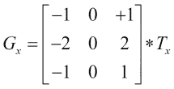

这意味着，对于每个输入像素，将计算其右上角邻居的值加上两倍其右侧邻居的值，加上其右下角邻居的值，减去其左上角邻居的值，减去其左侧邻居的值，减去其左下角邻居的值，从而得到一个结果图像。为了在 OpenCV 中使用此算子，您可以按照以下签名调用 Imgproc 的`Sobel`函数：

```py
public static void Sobel(Mat src, Mat dst, int ddepth, int dx,int dy)
```

`src`参数是输入图像，`dst`是输出。`Ddepth`是输出图像的深度，当将其设置为`-1`时，它将与源图像具有相同的深度。`dx`和`dy`参数将告诉我们每个方向中的顺序。当将`dy`设置为`0`，`dx`设置为`1`时，我们使用的核就是前面矩阵中提到的核。本章的示例项目`kernels`展示了这些算子的可定制外观，如下面的截图所示：

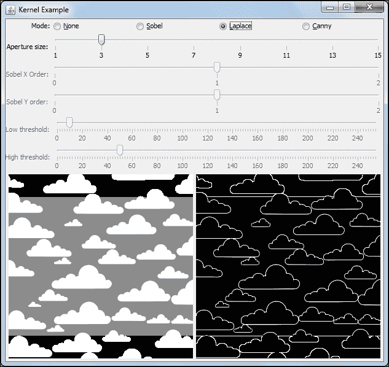

# 拉普拉斯和 Canny 变换

另一个非常有用的算子用于查找边缘的是拉普拉斯变换。而不是依赖于一阶导数，OpenCV 的拉普拉斯变换实现了以下函数的离散算子：

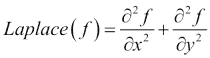

当使用有限差分方法和 3x3 窗口时，矩阵可以近似为以下核的卷积：


前述函数的签名如下：

```py
Laplacian(Mat source, Mat destination, int ddepth)
```

虽然源和目标矩阵是简单的参数，但`ddepth`是目标矩阵的深度。当您将此参数设置为`-1`时，它将与源图像具有相同的深度，尽管在应用此算子时您可能需要更多的深度。此外，此方法还有重载版本，它接收窗口大小、缩放因子和加法标量。

除了使用拉普拉斯方法外，您还可以使用 Canny 算法，这是一种由计算机科学家 John F. Canny 提出的优秀方法，他优化了边缘检测以实现低错误率、单次识别和正确定位。为了实现这一点，Canny 算法应用高斯滤波器以过滤噪声，通过 Sobel 计算强度梯度，抑制虚假响应，并应用双阈值，随后通过滞后抑制弱和不连续的边缘。有关更多信息，请参阅这篇论文[2]。该方法签名如下：

```py
Canny(Mat image, Mat edges, double threshold1, double threshold2, int apertureSize, boolean L2gradient)
```

`image`参数是输入矩阵，`edges`是输出图像，`threshold1`是阈值化过程的第一阈值（小于此值的值将被忽略），而`threshold2`是阈值化过程的高阈值（高于此值的值将被视为强边缘，而较小的值和高于低阈值的值将检查与强边缘的连接）。孔径大小用于计算梯度时的 Sobel 算子，而`boolean`告诉我们使用哪个范数来计算梯度。您还可以查看源代码，以了解如何在内核的项目示例中使用此算子。

# 直线和圆的霍夫变换

如果您需要在图像中找到直线或圆，可以使用霍夫变换，因为它们非常有用。在本节中，我们将介绍 OpenCV 方法来从您的图像中提取它们。

原始霍夫线变换背后的思想是，二值图像中的任何点都可能是一组线条的一部分。假设每条直线都可以用直线方程 *y = mx + b* 来参数化，其中 *m* 是直线的斜率，*b* 是这条线的 *y* 轴截距。现在，我们可以迭代整个二值图像，存储每个 *m* 和 *b* 参数并检查它们的累积。*m* 和 *b* 参数的局部最大值将产生在图像中出现的直线的方程。实际上，我们不是使用斜率和 *y* 轴截距点，而是使用极坐标直线表示。

由于 OpenCV 不仅支持标准的霍夫变换，还支持渐进概率霍夫变换，其中两个函数分别是`Imgproc.HoughLines`和`Imgproc.HoughLinesP`。有关详细信息，请参阅[3]。这些函数的签名如下：

```py
HoughLines(Mat image, Mat lines, double rho, double theta, int threshold)
HoughLinesP(Mat image, Mat lines, double rho, double theta, int threshold)
```

本章的`hough`项目展示了使用它们的示例。以下是从`Imgproc.HoughLines`检索线条的代码：

```py
Mat canny = new Mat();
Imgproc.Canny(originalImage, canny, 10, 50, aperture, false);
image = originalImage.clone();
Mat lines = new Mat();
Imgproc.HoughLines(canny, lines, 1, Math.PI/180, lowThreshold);
```

注意，我们需要在边缘图像上应用霍夫变换；因此，前两行代码将处理此问题。然后，原始图像被克隆以供显示，并在第四行创建一个`Mat`对象以保持线条。在最后一行，我们可以看到`HoughLines`的应用。

`Imgproc.HoughLines`中的第三个参数指的是累加器在像素中的距离分辨率，第四个参数是累加器在弧度中的角度分辨率。第五个参数是累加器阈值，这意味着只有获得超过指定数量票数的线才会被返回。`lowThreshold`变量与示例应用程序中的缩放滑块相关联，以便用户可以对其进行实验。重要的是要注意，线被返回在`lines`矩阵中，该矩阵有两列，其中每条线返回极坐标的`rho`和`theta`参数。这些坐标分别指的是图像左上角与线的旋转之间的距离以及弧度。根据此示例，您将了解如何从返回的矩阵中绘制线。您可以在以下截图中看到霍夫变换的工作原理：

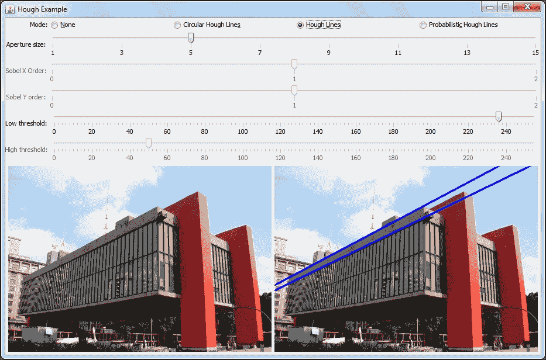

除了标准的霍夫变换外，OpenCV 还提供了概率霍夫线变换以及圆形版本。这两个实现都在同一个`Hough`示例项目中进行了探索，以下截图显示了圆形版本的工作原理：

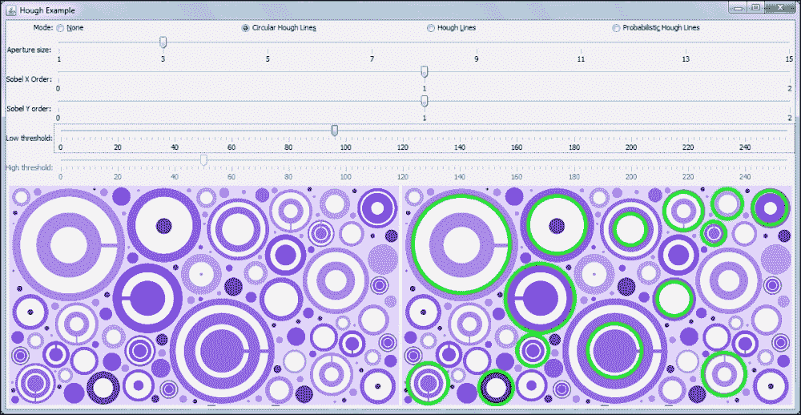

# 几何变换 – 拉伸、收缩、扭曲和旋转

在处理图像和计算机视觉时，您通常会需要使用已知的几何变换来预处理图像，例如拉伸、收缩、旋转和扭曲。后者与非均匀缩放相同。这些变换可以通过将源点与 2 x 3 矩阵相乘来实现，并且它们在将矩形转换为平行四边形时被称为**仿射变换**。因此，它们具有要求目标具有平行边的限制。另一方面，3 x 3 矩阵的乘法表示透视变换。它们提供了更多的灵活性，因为它们可以将二维四边形映射到另一个四边形。以下截图显示了这一概念的一个非常有用的应用。

在这里，我们将找出哪个透视变换将建筑侧面的透视视图映射到其正面视图：

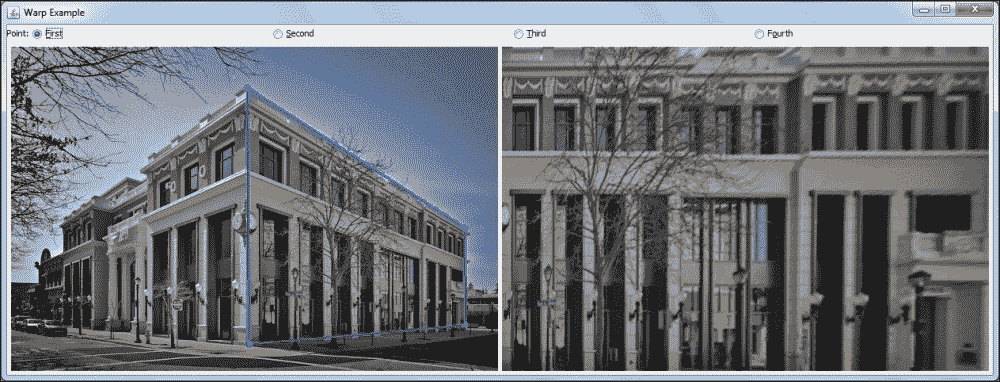

注意，该问题的输入是建筑物的透视照片，如图像左侧所示，以及突出显示的四边形形状的四个角点。输出在右侧，显示了如果观察者从建筑侧面看会看到的内容。

由于仿射变换是透视变换的子集，因此我们将重点关注后者。本例中可用的代码位于本章的 `warps` 项目中。这里使用的主要方法是 `Imgproc` 中的 `warpPerspective`。它对输入图像应用透视变换。以下是 `warpPerspective` 方法的签名：

```py
public static void warpPerspective(Mat src, Mat dst, Mat M, Size dsize)
```

`Mat src` 参数自然是输入图像，即前一张截图中的左侧图像，而 `dst Mat` 是右侧的图像；在使用方法之前，请确保初始化此参数。这里不太直观的参数是 `Mat M`，它是变换矩阵。为了计算它，你可以使用 `Imgproc` 中的 `getPerspectiveTransform` 方法。该方法将从两组相关的四个二维点（源点和目标点）计算透视矩阵。在我们的例子中，源点是截图左侧突出显示的点，而目标点是右侧图像的四个角点。这些点可以通过 `MatOfPoint2f` 类存储，该类存储 `Point` 对象。`getPerspectiveTransform` 方法的签名如下：

```py
public static Mat getPerspectiveTransform(Mat src, Mat dst)
```

`Mat src` 和 `Mat dst` 与之前提到的 `MatOfPoint2f` 类相同，它是 `Mat` 的子类。

在我们的例子中，我们添加了一个鼠标监听器来检索用户点击的点。需要注意的一个细节是，这些点按照以下顺序存储：左上角、右上角、左下角和右下角。在示例应用程序中，可以通过图像上方的四个单选按钮选择当前修改的点。点击和拖动监听器的操作已经被添加到代码中，因此两种方法都可以工作。

# 离散傅里叶变换和离散余弦变换

在处理图像分析时，如果你能够将图像从空间域（即以 *x* 和 *y* 坐标表示的图像）转换为频率域——图像分解为高频和低频成分——这将非常有用，这样你就能看到并操作频率参数。这在图像压缩中可能很有用，因为已知人类视觉对高频信号的敏感度不如对低频信号。通过这种方式，你可以将图像从空间域转换为频率域，并移除高频成分，从而减少表示图像所需的内存，进而压缩图像。下一张图像可以更好地展示图像频率。

为了将图像从空间域转换为频率域，可以使用离散傅里叶变换。由于我们可能需要将其从频率域转换回空间域，因此可以应用另一个变换，即逆离散傅里叶变换。

DFT 的正式定义如下：

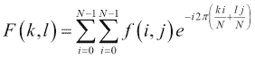

`f(i,j)` 的值是空间域中的图像，而 `F(k,l)` 是频率域中的图像。请注意，`F(k,l)` 是一个复函数，这意味着它有一个实部和虚部。因此，它将由两个 OpenCV `Mat` 对象或具有两个通道的 `Mat` 对象表示。分析 DFT 最简单的方法是绘制其幅度并取其对数，因为 DFT 的值可以处于不同的数量级。

例如，这是一个脉冲模式，它是一个可以从零（表示为黑色）到顶部（表示为白色）的左侧信号，其傅里叶变换幅度及其右侧应用的对数：

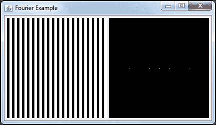

回顾先前的 DFT 变换，我们可以将 `F(k,l)` 视为将空间图像的每个点与一个与频率域相关的基函数相乘，然后求和的结果。记住，基函数是正弦函数，它们具有递增的频率。这样，如果某些基函数的振荡速率与信号相同，它们将能够相加成一个很大的数，这在傅里叶变换图像上会显示为一个白点。另一方面，如果给定的频率在图像中不存在，振荡与图像的乘积将导致一个很小的数，这在傅里叶变换图像中不会被注意到。

从方程中还可以观察到，`F(0,0)` 将产生一个始终为 `1` 的基本函数。这样，`F(0,0)` 就简单地指代了空间图像中所有像素的总和。我们还可以检查 `F(N-1, N-1)` 是否对应于与图像最高频率相关的基函数。请注意，前面的图像基本上有一个直流分量，这将是图像的均值，可以从离散傅里叶变换图像中间的白点中检查出来。此外，左侧的图像可以看作是一系列脉冲，因此它将在 *x* 轴上有一个频率，这可以通过右侧傅里叶变换图像中靠近中心点的两个点来注意到。然而，我们需要使用多个频率来近似脉冲形状。这样，在右侧图像的 *x*-轴上可以看到更多的点。下面的截图提供了更多的见解，并有助于您理解傅里叶分析：

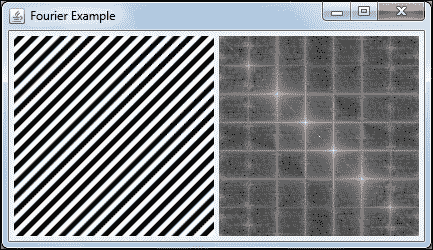

现在，我们将再次检查 DFT 图像中心的直流电平，右侧作为一个明亮的中心点。此外，我们还可以以对角线模式检查多个频率。可以检索的重要信息之一是空间变化的方向，这在 DFT 图像中清晰地显示为明亮的点。

现在是时候编写一些代码了。以下代码展示了如何为应用 DFT 腾出空间。记住，从前面的截图可以看出，DFT 的结果是复数。此外，我们需要将它们存储为浮点值。为此，我们首先将我们的三通道图像转换为灰度，然后转换为浮点。之后，我们将转换后的图像和一个空的`Mat`对象放入一个 mats 列表中，通过使用`Core.merge`函数将它们合并为一个单一的`Mat`对象，如下所示：

```py
Mat gray = new Mat();
Imgproc.cvtColor(originalImage, gray, Imgproc.COLOR_RGB2GRAY);
Mat floatGray = new Mat();
gray.convertTo(floatGray, CvType.CV_32FC1);

List<Mat> matList = new ArrayList<Mat>();
matList.add(floatGray);
Mat zeroMat = Mat.zeros(floatGray.size(), CvType.CV_32F);
matList.add(zeroMat);
Mat complexImage = new Mat();
Core.merge(matList, complexImage);
```

现在，应用原地离散傅里叶变换（DFT）变得容易：

```py
Core.dft(complexImage,complexImage);
```

为了获取一些有意义的信息，我们将打印图像，但首先，我们必须获取其幅度。为了获取它，我们将使用我们在学校学到的标准方法，即获取数字实部和虚部平方和的平方根。

再次，OpenCV 有一个用于此目的的函数，即`Core.magnitude`，其签名是`magnitude(Mat x, Mat y, Mat magnitude)`，如下面的代码所示：

```py
List<Mat> splitted = new ArrayList<Mat>();
Core.split(complexImage,splitted);
Mat magnitude = new Mat();
Core.magnitude(splitted.get(0), splitted.get(1), magnitude);
```

在使用`Core.magnitude`之前，请注意使用`Core.split`在拆分的 mats 中解包 DFT 的过程。

由于值可能处于不同的数量级，因此将值转换为对数尺度非常重要。在进行此操作之前，需要将矩阵中的所有值加 1，以确保在应用`log`函数时不会得到负值。除此之外，OpenCV 已经有一个处理对数运算的函数，即`Core.log`：

```py
Core.add(Mat.ones(magnitude.size(), CvType.CV_32F), magnitude, magnitude);
Core.log(magnitude, magnitude);
```

现在，是时候将图像移至中心，这样更容易分析其频谱。执行此操作的代码简单，如下所示：

```py
int cx = magnitude.cols()/2;
int cy = magnitude.rows()/2;
Mat q0 = new Mat(magnitude,new Rect(0, 0, cx, cy));   
Mat q1 = new Mat(magnitude,new Rect(cx, 0, cx, cy));  
Mat q2 = new Mat(magnitude,new Rect(0, cy, cx, cy));  
Mat q3 = new Mat(magnitude ,new Rect(cx, cy, cx, cy));
Mat tmp = new Mat();
q0.copyTo(tmp);
q3.copyTo(q0);
tmp.copyTo(q3);

q1.copyTo(tmp);
q2.copyTo(q1);
tmp.copyTo(q2);
```

作为最后一步，对图像进行归一化非常重要，这样它才能以更好的方式被看到。在我们对其进行归一化之前，它应该被转换为 CV_8UC1 格式：

```py
magnitude.convertTo(magnitude, CvType.CV_8UC1);
Core.normalize(magnitude, magnitude,0,255, Core.NORM_MINMAX, CvType.CV_8UC1);
```

当处理实值数据时，使用 DFT 通常只需要计算 DFT 的一半，就像图像一样。这样，可以使用一个称为离散余弦变换的类似概念。如果您需要，可以通过`Core.dct`来调用它。

# 积分图像

一些人脸识别算法，如 OpenCV 的人脸检测算法，大量使用以下图像中所示的特征：

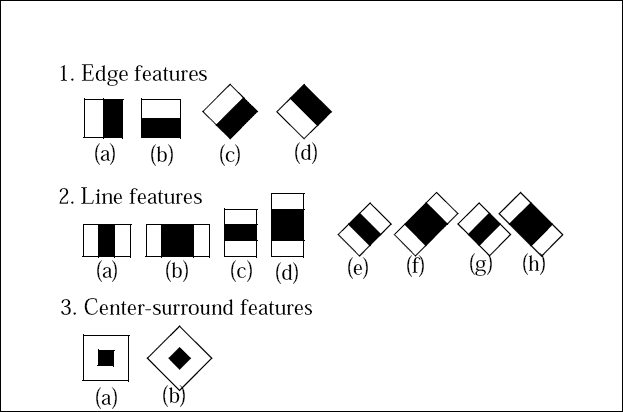

这些被称为 Haar-like 特征，它们是白色区域像素总和减去黑色区域像素总和的计算结果。您可能会觉得这种特征有点奇怪，但在人脸检测的训练中，它可以构建成一个极其强大的分类器，仅使用这两个特征，如下面的图像所示：

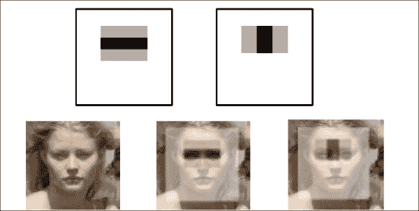

事实上，仅使用前两个特征的分类器可以调整到检测给定面部训练数据库中的 100%，而只有 40% 的误报。从图像中取出所有像素的总和以及计算每个区域的总和可能是一个漫长的过程。然而，这个过程必须针对给定输入图像中的每一帧进行测试，因此快速计算这些特征是我们需要满足的要求。

首先，让我们定义一个积分图像和为以下表达式：

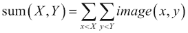

例如，如果以下矩阵代表我们的图像：

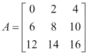

积分图像将类似于以下内容：

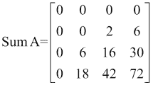

这里的技巧源于以下属性：

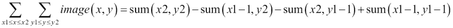

这意味着为了找到由点 `(x1,y1)`、`(x2,y1)`、`(x2,y2)` 和 `(x1,y2)` 界定的给定矩形的和，你只需要使用点 `(x2,y2)` 的积分图像，但你还需要从 `(x1-1,y2)` 到 `(x2,y1-1)` 的点中减去。此外，由于 `(x1-1, y1-1)` 的积分图像被减去了两次，我们只需要加一次。

以下代码将生成前面的矩阵并使用 `Imgproc.integral` 创建积分图像：

```py
Mat image = new Mat(3,3 ,CvType.CV_8UC1);
Mat sum = new Mat();
byte[] buffer = {0,2,4,6,8,10,12,14,16};
image.put(0,0,buffer);
System.out.println(image.dump());
Imgproc.integral(image, sum);
System.out.println(sum.dump());
```

这个程序的输出类似于前面矩阵中 A 和 Sum A 的输出。

由于初始行和列的零值，需要验证输出是一个 4 x 4 矩阵，因为这些零值被用来使计算更高效。

# 距离变换

简而言之，对一个图像应用距离变换将生成一个输出图像，其像素值将是输入图像中零值像素的最短距离。基本上，它们将具有给定的距离度量下的最短距离到背景。以下截图展示了人体轮廓会发生什么：

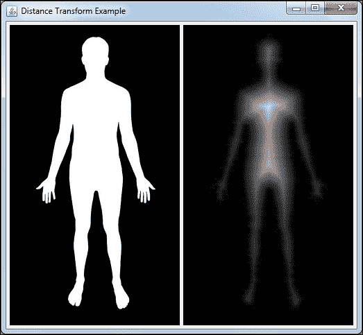

由 J E Theriot 的人体轮廓

这种变换在获取给定分割图像的拓扑骨架以及产生模糊效果的过程中非常有用。这种变换的另一个有趣应用是在分割重叠对象时，与分水岭一起使用。

通常，距离变换应用于由 Canny 滤波器生成的边缘图像。我们将使用 Imgproc 的 `distanceTransform` 方法，这在 `distance` 项目中可以看到，该项目可以在本章的源代码中找到。以下是此示例程序中最重要的一些行：

```py
protected void processOperation() {
  Imgproc.Canny(originalImage, image, 220, 255, 3, false);
  Imgproc.threshold(image, image, 100, 255, Imgproc.THRESH_BINARY_INV );
  Imgproc.distanceTransform(image, image, Imgproc.CV_DIST_L2, 3);
  image.convertTo(image, CvType.CV_8UC1);
  Core.multiply(image, new Scalar(20), image);

  updateView();
}
```

首先，对输入图像应用 Canny 边缘检测器过滤器。然后，使用`THRESH_BINARY_INV`阈值的转换将边缘变为黑色，豆子变为白色。只有在此之后，才应用距离变换。第一个参数是输入图像，第二个参数是输出矩阵，第三个参数指定了距离是如何计算的。在我们的例子中，`CVDIST_L2`表示欧几里得距离，而其他距离，如`CVDIST_L1`或`CVDIST_L12`等也存在。由于`distanceTransform`的输出是一个单通道 32 位浮点图像，需要进行转换。最后，我们应用`Core.multiply`来增强对比度。

以下截图为您提供了整个过程的良好理解：

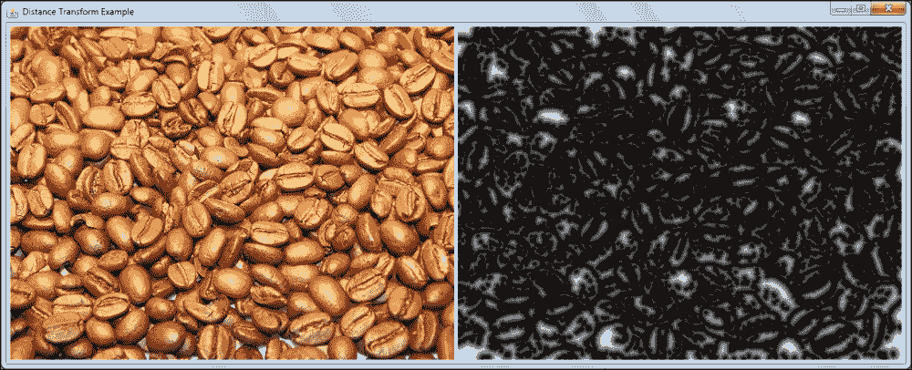

# 直方图均衡化

人类视觉系统对图像中的对比度非常敏感，这是不同物体颜色和亮度的差异。此外，人眼是一个神奇的系统，可以在 10[16]个光级上感受到强度[4]。难怪一些传感器可能会搞乱图像数据。

在分析图像时，绘制它们的直方图非常有用。它们简单地显示了数字图像的亮度分布。为了做到这一点，您需要计算具有确切亮度的像素数量，并将其作为分布图绘制出来。这使我们能够深入了解图像的动态范围。

当相机图片以非常窄的光范围捕捉时，在阴影区域或其他局部对比度较差的区域看细节变得困难。幸运的是，有一种技术可以均匀分布强度，称为**直方图均衡化**。以下图像显示了在应用直方图均衡化技术前后，同一图片及其相应的直方图：

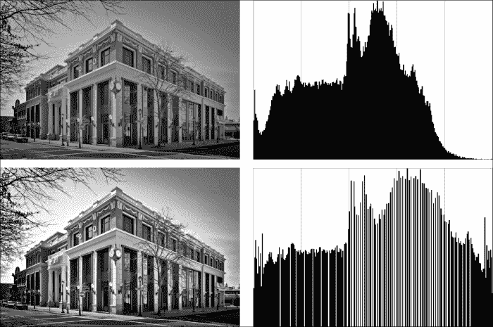

注意，位于上方直方图最右侧的光值很少使用，而中间范围的光值过于集中。在整个范围内扩展这些值会产生更好的对比度，并且细节更容易被感知。直方图均衡化图像更好地利用了产生更好对比度的强度。为了完成这项任务，可以使用累积分布来重新映射直方图，使其类似于均匀分布。然后，只需检查原始直方图的点通过累积高斯分布等方法映射到均匀分布的位置即可。

现在，好事是所有这些细节都封装在一个简单的 OpenCV `equalizeHist`函数调用中。以下是本章`histogram`项目中的示例：

```py
protected void processOperation() {
  Imgproc.cvtColor(originalImage, grayImage, Imgproc.COLOR_RGB2GRAY);
  Imgproc.equalizeHist(grayImage, image);
  updateView();
}
```

这段代码只是将图像转换为单通道图像；然而，只要将每个通道单独处理，你就可以在彩色图像上使用`equalizeHist`。`Imgproc.equalizeHist`方法按照之前提到的概念输出校正后的图像。

# 参考文献

1.  *《用于图像处理的 3x3 各向同性梯度算子》*，在 1968 年斯坦福人工项目演讲中提出，作者：I. Sobel 和 G. Feldman。

1.  *《边缘检测的计算方法》*，IEEE Trans. Pattern Analysis and Machine Intelligence，作者：Canny, J.

1.  *使用渐进概率 Hough 变换进行线的鲁棒检测*，CVIU 78 1，作者：Matas, J. 和 Galambos, C.，以及 Kittler, J.V. 第 119-137 页（2000 年）。

1.  *高级高动态范围成像：理论与实践*，CRC Press，作者：Banterle, Francesco；Artusi, Alessandro；Debattista, Kurt；Chalmers, Alan。

# 摘要

本章涵盖了计算机视觉日常应用的关键方面。我们从重要的边缘检测器开始，通过 Sobel、Laplacian 和 Canny 边缘检测器，你获得了如何找到它们的经验。然后，我们看到了如何使用 Hough 变换来找到直线和圆。之后，通过一个交互式示例，我们探讨了几何变换拉伸、收缩、扭曲和旋转。接着，我们探讨了如何使用离散傅里叶分析将图像从空间域转换到频域。之后，我们展示了通过使用积分图像快速计算 Haar 特征的小技巧。然后，我们探讨了重要的距离变换，并在解释直方图均衡化后结束本章。

现在，准备好深入机器学习算法，因为我们将介绍如何在下一章中检测人脸。你还将学习如何创建自己的对象检测器，并理解监督学习是如何工作的，以便更好地训练你的分类树。
