# 第五章。使用 Ada Boost 和 Haar 级联进行对象检测

本章展示了 OpenCV 的一个非常有趣的功能——在图像或视频流中检测人脸。在后一种情况下，我们称之为**人脸跟踪**。为了做到这一点，本章深入探讨了机器学习算法，特别是带有提升的有监督学习。我们将涵盖**Viola-Jones 分类器**及其理论，以及如何使用 OpenCV 附带的人脸训练分类器的详细说明。

在本章中，我们将涵盖以下主题：

+   提升理论

+   Viola-Jones 分类器

+   人脸检测

+   学习新对象

到本章结束时，你将能够通过提升和 Viola-Jones 分类器理解人脸分类器背后的理论。你还将了解如何使用简单的分类器。此外，你将能够为不同的对象创建自己的对象分类器。

# 提升理论

在图像中检测人脸的问题可以用更简单的方式提出。我们可以通过几个较小的窗口迭代整个图像，并创建一个分类器，该分类器将告诉我们一个窗口是否是人脸。正确识别人脸的窗口将是人脸检测的坐标。

现在，究竟什么是分类器，以及它是如何构建的呢？在机器学习中，分类问题已经被深入探索，并被提出为基于先前训练的已知类别成员资格的集合，确定给定观察属于哪个类别。这可能是像在水果分类应用中，如果给定的图像属于香蕉、苹果或葡萄类别，例如。在人脸检测的情况下，有两个类别——人脸和非人脸。

本节描述了一个元算法，它基本上是一个模板算法，用于使用一组弱学习器创建一个强大的分类器。这些弱学习器是基于某些特征的分类器，尽管它们不能将整个集合分为两类，但它们对某些集合做得很好。比如说，一个弱学习器可能是一个寻找胡子的分类器，以判断给定的人脸是否为男性。即使它可能不会在集合中找到所有男性，但它会对有胡子的那些人做得很好。

## AdaBoost

**AdaBoosting**，即自适应提升，实际上不是一个算法，而是一个元算法，它将帮助我们构建分类器。它的主要任务是构建一个由弱分类器组成的强大分类器，这些弱分类器只是偶然地更好。它的最终形式是给定分类器的加权组合，如下面的方程所示：

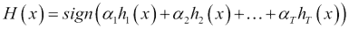

符号运算符在括号内的表达式为正时将返回`+1`，否则返回`-1`。请注意，它是一个二元分类器，输出为*是*或*否*，或者可能是*属于*或*不属于*，或者简单地是`+1`或`-1`。因此，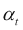是分配给给定分类器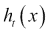在*T*个分类器集中对给定输入*x*的权重。

例如，在一组人中，我们想知道任何给定的人*p*是男性还是女性。假设我们有一些弱分类器，它们是好的猜测，例如：

+   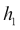：如果身高超过 5 英尺 9 英寸（约 175 厘米），那么这个人就是男性或女性。当然，有些女性的身高超过男性，但平均来看，男性通常更高。

+   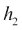：如果一个人有长发，那么这个人就是女性或男性。同样，有几个长头发的男性，但平均来看，女性通常有更长的头发。

+   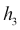：如果一个人有胡须，那么这个人就是男性或女性。在这里，我们可能会错误地将刮胡子的男性分类。

假设我们有一组随机的人群：

| Name/Feature | Height (h1) | Hair (h2) | Beard (h3) | Gender (f(x)) |
| --- | --- | --- | --- | --- |
| Katherine | 1.69 | Long | Absent | Female |
| Dan | 1.76 | Short | Absent | Male |
| Sam | 1.80 | Short | Absent | Male |
| Laurent | 1.83 | Short | Present | Male |
| Sara | 1.77 | Short | Absent | Female |

分类器`h1`将正确分类三个人，而`h2`将正确分类四个人，`h3`将正确分类三个人。然后我们会选择`h2`，这是最好的，因为它最小化了加权错误，并设置其 alpha 值。然后我们会增加错误分类数据（Sara）的权重，并减少其他所有数据（Katherine、Dan、Sam 和 Laurent）的权重。然后我们会在新的分布上寻找最好的分类器。现在 Sara 处于关键位置，要么选择`h2`或`h3`，这取决于错误，因为`h1`以更高的权重错误地将 Sara 分类。然后我们会继续对`T`个弱分类器进行操作，在我们的例子中是 3 个。

AdaBoost 的算法如下：

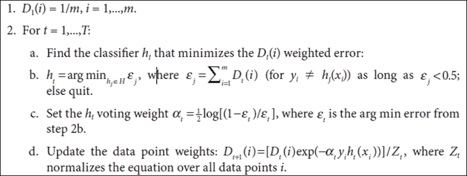

幸运的是，OpenCV 已经实现了 boosting。以下示例可以在第五章的`boost`项目中找到，它展示了如何处理`Boost`类，以及前面的示例。我们首先创建一个名为`data`的 5 x 3 矩阵。这个矩阵存储我们的训练数据集，将被`Boost`用于创建分类器。然后，我们像前面的表格一样输入矩阵。第一列是高度。头发和胡须被赋予值一或零。当头发短时，我们将其设置为`zero`，当头发长时，我们将其设置为`one`。如果胡须存在，其值为`one`否则为`zero`。这些值使用 Mat 的`put`函数设置。请注意，男性或女性的事实并没有进入`data`矩阵，因为这是我们想要的分类器的输出。这样，就创建了一个 5 x 1 列矩阵`responses`。它简单地存储`zero`表示女性和`one`表示男性。

然后，实例化一个`Boost`类，并通过`CvBoostParams`的 setter 设置训练参数。我们使用`setBoostType`方法将 boost 类型设置为**离散 Adaboost**，传递`Boost.DISCRETE`作为参数。其他 boosting 的变体被称为**实 Adaboost**、**LogitBoost**和**温和 Adaboost**。`setWeakCount`方法设置使用的弱分类器的数量。在我们的案例中，它是`3`。下一个设置告诉如果节点中的样本数量小于此参数，则节点将不会分裂。实际上，默认值是`10`，它不会与如此小的数据集一起工作，因此将其设置为`4`以便它能够与这个数据集一起工作。重要的是要注意，Boost 是从 DTrees 派生的，它与决策树相关。这就是为什么它使用节点术语。

在设置参数之后，通过`train`方法使用`data`和`responses`矩阵来训练 boost 分类器。以下是此方法签名：

```py
public boolean train(Mat trainData, int tflag, Mat responses)
```

这是具有特征的`trainData`训练矩阵，而`responses`矩阵是包含分类数据的矩阵。`tflag`参数将告诉特征是放在行还是列中。

之后，预测是一个简单的问题，就是创建一个新的行矩阵，包含输入参数高度、头发大小和胡须存在，并将其传递给`Boost`的`predict`函数。它的输出将把输入分类为男性或女性：

```py
public class App
{
  static{ System.loadLibrary(Core.NATIVE_LIBRARY_NAME); }

  public static void main(String[] args) throws Exception {

    Mat data = new Mat(5, 3, CvType.CV_32FC1, new Scalar(0));

    data.put(0, 0, new float[]{1.69f, 1, 0});
    data.put(1, 0, new float[]{1.76f, 0, 0});
    data.put(2, 0, new float[]{1.80f, 0, 0});
    data.put(3, 0, new float[]{1.77f, 0, 0});
    data.put(4, 0, new float[]{1.83f, 0, 1});

    Mat responses = new Mat(5, 1, CvType.CV_32SC1, new Scalar(0));

    responses.put(0,0, new int[]{0,1,1,0,1});

    Boost boost = Boost.create();
    boost.setBoostType(Boost.DISCRETE);
    boost.setWeakCount(3);
    boost.setMinSampleCount(4);

    boost.train(data, Ml.ROW_SAMPLE, responses);

    //This will simply show the input data is correctly classified

    for(int i=0;i<5;i++){
      System.out.println("Result = " + boost.predict(data.row(i)));
    }

    Mat newPerson = new Mat(1,3,CvType.CV_32FC1, new Scalar(0));
    newPerson.put(0, 0, new float[]{1.60f, 1,0});
    System.out.println(newPerson.dump());
    System.out.println("New (woman) = " + boost.predict(newPerson));

    newPerson.put(0, 0, new float[]{1.8f, 0,1});
    System.out.println("New (man) = " + boost.predict(newPerson));

    newPerson.put(0, 0, new float[]{1.7f, 1,0});
    System.out.println("New (?) = " + boost.predict(newPerson));

  }
}
```

# 然后是级联分类器的检测和训练

有些人可能会想知道 OpenCV 是如何检测人脸的，因为这对于几个月大的婴儿来说是一个非常简单的任务，而对于告诉计算机如何完成这项任务来说则看起来相当复杂。我们将问题分为两部分——*目标检测*，即在分类器说的时候应用分类器并检索对象位置，以及*训练*一个新的分类器来学习新的、应该主要是刚性的对象。

OpenCV 级联分类器最初实现了一种称为*Viola-Jones*检测器的面部检测技术，最初由 Paul Viola 和 Michael Jones 开发，它使用所谓的 Haar-like 特征，以 Alfréd Haar 小波命名。这些特征基于原始图像值矩形区域的和与差的阈值。后来，这个分类器也允许使用**局部二值模式**（**LBP**）特征，与 Haar-like 特征相比是整数值；这导致训练时间更快，但质量相似。

虽然在 OpenCV 中使用级联分类器相当直接，但了解它是如何工作的对于理解使用边界很重要。作为一个经验法则，它应该能够在纹理一致且大部分刚性的物体上工作得很好。级联分类器被提供了一组大小和直方图均衡化的图像，这些图像被标记为包含或不包含感兴趣的对象。分类器通过几个较小的窗口迭代，这些窗口覆盖整个图像，因此它很少会找到一个对象。例如，团体照片中只有几个坐标有面部，而图像的其余部分应该被标记为没有面部。由于它应该最大化拒绝，OpenCV 级联分类器使用一种 AdaBoost 分类器形式的拒绝级联，这意味着非对象补丁应该尽可能早地被丢弃。

特征阈值可以用作弱分类器，通过 AdaBoost 构建强分类器，正如我们在本章所学。在计算一个特征之后，我们可以决定这个问题：*这个值是否高于或低于给定的阈值？* 如果答案是`true`，那么对象是一个面部，例如，否则它就不是。我们通常使用单个特征来做这个决定，但这个数字可以在训练中设置。使用 AdaBoost，我们构建分类器作为弱分类器的加权求和，如下所示：

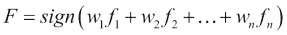

在这里，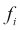是与每个特征`i`相关联的函数，如果特征值高于某个阈值，则返回`+1`，如果低于阈值，则返回`-1`。提升用于正确量化与特征相关的每个权重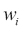。Viola-Jones 分类器将树的每个节点构建为加权求和的信号，就像在函数`F`中一样。一旦这个函数被设置，它就会为 Viola-Jones 分类器提供一个节点，然后使用级联中更高层次的所有存活数据来训练下一个节点，依此类推。最终的树看起来类似于这个：

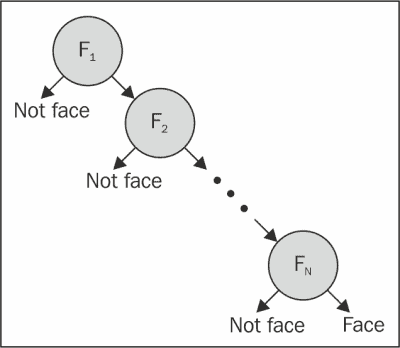

# 检测

OpenCV 已经包含了一些预训练的级联分类器，可以直接使用。其中，我们可以找到正面和侧面面部检测器，以及眼睛、身体、嘴巴、鼻子、下半身和上半身检测器。在本节中，我们将介绍如何使用它们。完整的源代码可以在本章的`cascade`项目中找到。

以下代码展示了如何加载一个训练好的级联：

```py
private void loadCascade() {
  String cascadePath = "src/main/resources/cascades/lbpcascade_frontalface.xml";
  faceDetector = new CascadeClassifier(cascadePath);
}
```

大部分操作发生在`objdetect`包中的`CascadeClassifier`类中。这个类封装了级联加载和对象检测。具有字符串的构造函数已经从给定路径加载了级联。如果您想推迟级联名称，可以使用空构造函数和`load`方法。

`runMainLoop`方法，此处未展示，它将简单地从网络摄像头中抓取一张图片并将其传递给`detectAndDrawFace`方法，该方法将初始化的分类器投入使用。以下为`detectAndDrawFace`方法：

```py
private void detectAndDrawFace(Mat image) {
  MatOfRect faceDetections = new MatOfRect();
  faceDetector.detectMultiScale(image, faceDetections);
  for (Rect rect : faceDetections.toArray()) {
    Core.rectangle(image, new Point(rect.x, rect.y), new Point(rect.x + rect.width, rect.y + rect.height), new Scalar(0, 255, 0));
  }
}
```

首先，我们实例化`faceDetections`对象，它是一个`MatOfRect`容器（一个用于`Rect`的特殊容器）。然后，我们运行`detectMultiScale`方法，将接收到的图像和`MatOfRect`作为参数传递。这就是运行级联检测器的地方。算法将使用滑动窗口扫描图像，为每个窗口运行级联分类器。它还会以不同的图像比例运行此过程。默认情况下，它将每次尝试将图像比例减少 1.1。如果至少有三个检测发生，默认情况下，在三个不同的比例下，坐标被认为是命中，它将成为`faceDetections`数组的一部分，并添加到检测对象的宽度和高度中。

`for`循环简单地遍历返回的矩形，并在原始图像上用绿色绘制它们。

# 训练

虽然 OpenCV 已经打包了几个级联分类器，但可能需要检测一些特定对象或对象类别。创建自定义级联分类器并不简单，因为它需要成千上万张图像，其中应该去除所有差异。例如，如果正在创建面部分类器，所有图像的眼睛都应该对齐。在本节中，我们将描述使用 OpenCV 创建级联分类器的过程。

为了训练级联，OpenCV 提供了一些工具。它们可以在`opencv/build/x86/vc11/bin`目录中找到。`opencv_createsamples`和`opencv_traincascade`可执行文件用于准备正样本的训练数据集以及生成级联分类器。

为了更好地展示这个过程，我们包括了来自 UIUC 图像数据库中用于车辆检测的文件，这些文件由 Shivani Agarwal、Aatif Awan 和 Dan Roth 收集。这些文件可以在“第五章”的`cardata`目录中找到。以下说明依赖于位于此文件夹中才能工作。

### 注意

**正样本 – 包含目标图像的图片**

负样本是任意图像，不得包含旨在检测的对象。

要创建自己的级联分类器，收集目标对象的数百张图片，确保这些图片展示了足够的变化，以便给出被检测对象类别的良好概念。

然后，使用 `opencv_createsamples` 工具准备正样本和测试样本的训练数据集。这将生成一个具有 `.vec` 扩展名的二进制文件，其中包含从给定标记数据集中生成的正样本。没有应用扭曲；它们仅被调整到目标样本的大小并存储在 `vec-file` 输出中。读者应发出以下命令：

```py
opencv_createsamples -info cars.info -num 550 -w 48 -h 24 -vec cars.vec.
```

前面的命令将读取 `cars.info` 文件，该文件中的每一行包含一个图像的路径，后面跟着一个数字 *n*。这个数字是图像中存在的对象实例的数量。随后是 *n* 个对象的边界 `矩形 (x, y, width, height)` 坐标。以下是有效行的示例：

```py
images/image1.jpg  1  90 100 45 45
images/image2.jpg  2  200 300 50 50   100 30 25 25
```

参数 `-w` 和 `-h` 指定要生成的输出样本的宽度和高度。这应该足够小，以便在后续目标检测中搜索图像中的对象时，图像中对象的大小将大于这个大小。`-num` 参数告诉这些样本的数量。

为了为给定的 `.vec` 文件创建分类器，使用 `opencv_traincascade` 工具。此应用程序将读取通过 `-vec` 参数提供的文件中的正样本以及通过 `-bg` 参数提供的文件中的某些负样本。负样本文件简单地指向每行中的一个图像，这些图像是任意的，并且不得包含旨在检测的对象。为了使用此工具，发出以下命令：

```py
opencv_traincascade -data data -vec cars.vec -bg cars-neg.info -numPos 500 -numNeg 500 -numStages 10 -w 48 -h 24 -featureType LBP
```

参数 `-numPos` 和 `-numNeg` 用于指定每个分类器阶段训练中使用的正样本和负样本的数量，而 `-numStages` 指定要训练的级联阶段数量。最后的 `-featureType` 参数设置要使用哪种类型的特征，可以选择 Haar 类特征或 LBP。正如之前所述，LBP 特征是整数值，与 Haar 特征不同，因此使用 LBP 将会使得检测和训练更快，但它们的品质可以相同，这取决于训练。还可以使用更多参数来微调训练，例如误报率、最大树深度和最小命中率。读者应参考文档了解这些设置。现在，关于训练时间，即使在快速机器上，也可能需要从几小时到几天。但是，如果您不想等待最终结果，并且急于检查分类器的工作情况，可以使用以下命令获取中间分类器 XML 文件：

```py
convert_cascade --size="48x24" haarcascade haarcascade-inter.xml
```

在这里，`48`和`24`分别是可能检测到的最小宽度和高度，类似于`opencv_traincascade`命令中的`–w`和`–h`。

一旦发出前面的命令，就会在作为`-data`参数传递的文件夹中创建一个名为`cascade.xml`的文件。在训练成功后，可以安全地删除此文件夹中创建的其他文件。现在，可以通过`CascadeClassifier`类加载并使用它，正如前面*检测*部分所描述的那样。只需使用此文件代替示例中给出的`lbpcascade_frontalface.xml`文件即可。

下面的截图显示了使用训练好的级联分类器正确检测到的玩具汽车以及一个错误检测，这是一个假阳性：

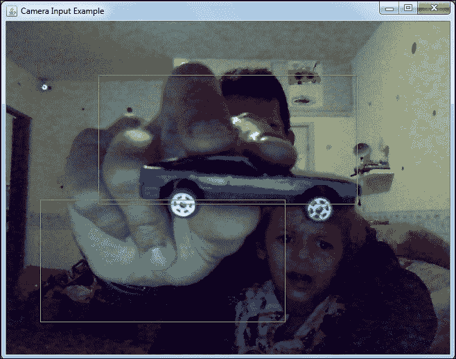

# 参考文献

请参考视频，*OpenCV 教程：训练自己的检测器*，*Packt Publishing*，([`www.packtpub.com/application-development/opencv-computer-vision-application-programming-video`](https://www.packtpub.com/application-development/opencv-computer-vision-application-programming-video))，由 Sebastian Montabone 编写。

# 摘要

本章向读者提供了几个有趣的概念。我们不仅介绍了提升理论的坚实基础，还通过一个实际例子进行了实践。接着，我们还涵盖了 OpenCV 的 Viola-Jones 级联分类器，并应用了实际操作方法，通过`CascadeClassifier`类使用分类器。之后，我们提供了一个完整的、真实世界的例子，用于创建一个新的汽车分类器，它可以适应你偏好的任何主要刚性的物体。

在下一章中，我们将通过帧差分和背景平均等纯图像处理方法研究并实践背景减法领域，以及有趣的 Kinect 设备用于深度图。
