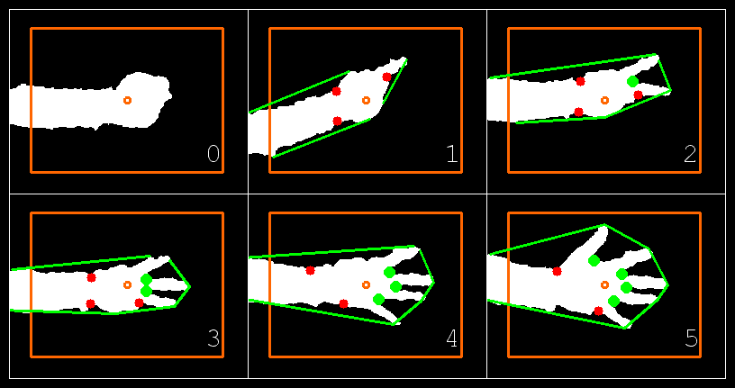
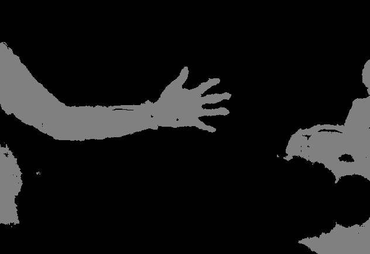
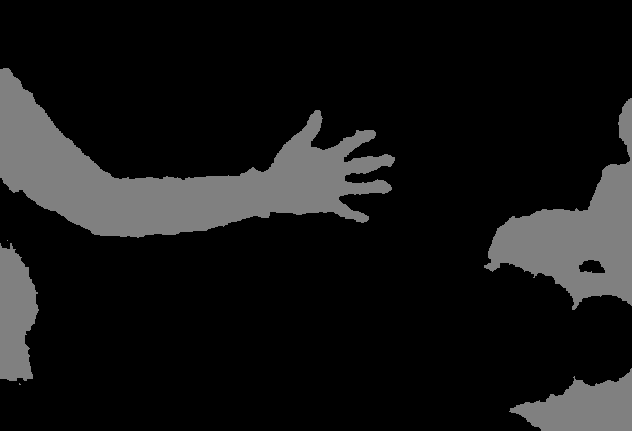
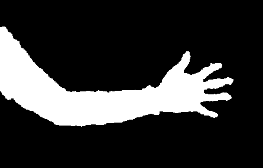
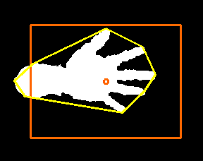
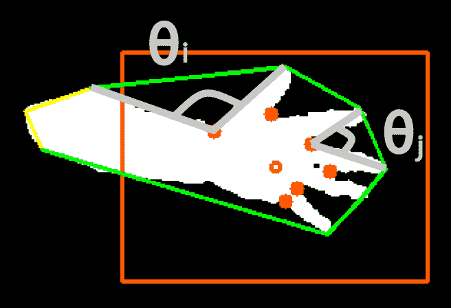
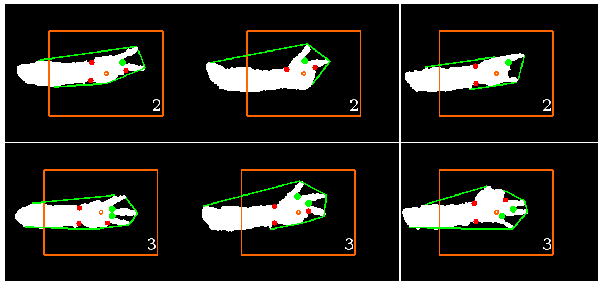

# 第二章：使用 Kinect 深度传感器进行手部手势识别

本章的目标是开发一个应用，该应用能够实时检测和跟踪简单的手部手势，使用深度传感器的输出，例如微软 Kinect 3D 传感器或华硕 Xtion 传感器。该应用将分析每个捕获的帧以执行以下任务：

+   **手部区域分割**：将通过分析 Kinect 传感器的**深度图**输出，在每一帧中提取用户的 hand region，这是通过**阈值化**、应用一些**形态学操作**和找到**连通****组件**来完成的。

+   **手部形状分析**：将通过确定**轮廓**、**凸包**和**凸性缺陷**来分析分割后的手部区域形状。

+   **手部手势识别**：将通过手部轮廓的**凸性缺陷**来确定伸出的手指数量，并根据手势进行分类（没有伸出的手指对应拳头，五个伸出的手指对应张开的手）。

手势识别是计算机科学中一个经久不衰的话题。这是因为它不仅使人类能够与机器进行交流（**人机交互** (**HMI**))，而且也是机器开始理解人体语言的第一步。有了像微软 Kinect 或华硕 Xtion 这样的低成本传感器以及像**OpenKinect**和**OpenNI**这样的开源软件，自己开始这个领域从未如此简单。*那么，我们该如何利用所有这些技术呢？*

在本章中，我们将涵盖以下主题：

+   规划应用

+   设置应用

+   实时跟踪手部手势

+   理解手部区域分割

+   执行手部形状分析

+   执行手部手势识别

我们将在本章中实现的算法的美丽之处在于，它适用于许多手部手势，同时足够简单，可以在普通笔记本电脑上实时运行。此外，如果我们想，我们还可以轻松扩展它以包含更复杂的手部姿态估计。

完成应用后，您将了解如何在自己的应用中使用深度传感器。您将学习如何使用 OpenCV 从深度信息中组合感兴趣的区域形状，以及如何使用它们的几何属性来分析形状。

# 开始

本章要求您安装微软 Kinect 3D 传感器。或者，您也可以安装华硕 Xtion 传感器或任何 OpenCV 内置支持的深度传感器。

首先，从[`www.openkinect.org/wiki/Getting_Started`](http://www.openkinect.org/wiki/Getting_Started)安装 OpenKinect 和**libfreenect**。您可以在我们的 GitHub 仓库中找到本章中展示的代码：[`github.com/PacktPublishing/OpenCV-4-with-Python-Blueprints-Second-Edition/tree/master/chapter2`](https://github.com/PacktPublishing/OpenCV-4-with-Python-Blueprints-Second-Edition/tree/master/chapter2)。

首先，让我们规划本章将要创建的应用程序。

# 规划应用程序

最终的应用程序将包括以下模块和脚本：

+   `gestures`：这是一个包含手势识别算法的模块。

+   `gestures.process`：这是一个实现手势识别整个流程的函数。它接受一个单通道深度图像（从 Kinect 深度传感器获取）并返回一个带有估计的伸出手指数量的注释过的**蓝色、绿色、红色**（**BGR**）彩色图像。

+   `chapter2`：这是本章的主要脚本。

+   `chapter2.main`：这是主函数流程，它遍历从使用`.process`手势处理的深度传感器获取的帧，并展示结果。

最终产品看起来像这样：



无论一只手伸出多少根手指，算法都能正确分割手区域（白色），绘制相应的凸包（围绕手的绿色线条），找到属于手指之间空间的所有凸性缺陷（大绿色点），同时忽略其他部分（小红色点），并推断出正确的伸出手指数量（右下角的数字），即使是对拳头也是如此。

现在，让我们在下一节中设置应用程序。

# 设置应用程序

在我们深入到手势识别算法的细节之前，我们需要确保我们可以访问深度传感器并显示深度帧流。在本节中，我们将介绍以下有助于我们设置应用程序的内容：

+   访问 Kinect 3D 传感器

+   利用与 OpenNI 兼容的传感器

+   运行应用程序和主函数流程

首先，我们将看看如何使用 Kinect 3D 传感器。

# 访问 Kinect 3D 传感器

访问 Kinect 传感器的最简单方法是通过一个名为`freenect`的`OpenKinect`模块。有关安装说明，请参阅上一节。

`freenect`模块具有`sync_get_depth()`和`sync_get_video()`等函数，用于从深度传感器和摄像头传感器分别同步获取图像。对于本章，我们只需要 Kinect 深度图，它是一个单通道（灰度）图像，其中每个像素值是从摄像头到视觉场景中特定表面的估计距离。

在这里，我们将设计一个函数，该函数将从传感器读取一个帧并将其转换为所需的格式，并返回帧以及成功状态，如下所示：

```py
def read_frame(): -> Tuple[bool,np.ndarray]:
```

函数包括以下步骤：

1.  获取一个`frame`；如果没有获取到帧，则终止函数，如下所示：

```py
    frame, timestamp = freenect.sync_get_depth() 
    if frame is None:
        return False, None
```

`sync_get_depth`方法返回深度图和时间戳。默认情况下，该图是 11 位格式。传感器的最后 10 位描述深度，而第一位表示当它等于 1 时，距离估计未成功。

1.  将数据标准化为 8 位精度格式是一个好主意，因为 11 位格式不适合立即使用`cv2.imshow`可视化，以及将来。我们可能想使用返回不同格式的不同传感器，如下所示：

```py
np.clip(depth, 0, 2**10-1, depth) 
depth >>= 2 
```

在前面的代码中，我们首先将值裁剪到 1,023（或`2**10-1`）以适应 10 位。这种裁剪导致未检测到的距离被分配到最远的可能点。接下来，我们将 2 位向右移动以适应 8 位。

1.  最后，我们将图像转换为 8 位无符号整数数组并`返回`结果，如下所示：

```py
return True, depth.astype(np.uint8) 
```

现在，`深度`图像可以按照以下方式可视化：

```py
cv2.imshow("depth", read_frame()[1]) 
```

让我们在下一节中看看如何使用与 OpenNI 兼容的传感器。

# 利用与 OpenNI 兼容的传感器

要使用与 OpenNI 兼容的传感器，您必须首先确保**OpenNI2**已安装，并且您的 OpenCV 版本是在 OpenNI 支持下构建的。构建信息可以按照以下方式打印：

```py
import cv2
print(cv2.getBuildInformation())
```

如果您的版本是带有 OpenNI 支持的构建，您将在`Video I/O`部分找到它。否则，您必须重新构建带有 OpenNI 支持的 OpenCV，这可以通过将`-D WITH_OPENNI2=ON`标志传递给`cmake`来完成。

安装过程完成后，您可以使用`cv2.VideoCapture`像访问其他视频输入设备一样访问传感器。在这个应用程序中，为了使用与 OpenNI 兼容的传感器而不是 Kinect 3D 传感器，您必须遵循以下步骤：

1.  创建一个连接到您的与 OpenNI 兼容的传感器的视频捕获，如下所示：

```py
device = cv2.cv.CV_CAP_OPENNI 
capture = cv2.VideoCapture(device) 
```

如果您想连接到 Asus Xtion，`device`变量应设置为`cv2.CV_CAP_OPENNI_ASUS`值。

1.  将输入帧大小更改为标准**视频图形阵列**（**VGA**）分辨率，如下所示：

```py
capture.set(cv2.cv.CV_CAP_PROP_FRAME_WIDTH, 640) 
capture.set(cv2.cv.CV_CAP_PROP_FRAME_HEIGHT, 480) 
```

1.  在前面的章节中，我们设计了`read_frame`函数，该函数使用`freenect`访问 Kinect 传感器。为了从视频捕获中读取深度图像，您必须将此函数更改为以下内容：

```py
def read_frame():
    if not capture.grab():
        return False,None
    return capture.retrieve(cv2.CAP_OPENNI_DEPTH_MAP)
```

您会注意到我们使用了`grab`和`retrieve`方法而不是`read`方法。原因是当我们需要同步一组相机或多头相机，例如 Kinect 时，`cv2.VideoCapture`的`read`方法是不合适的。

对于此类情况，您可以使用`grab`方法在某个时刻从多个传感器中捕获帧，然后使用`retrieve`方法检索感兴趣传感器的数据。例如，在您的应用程序中，您可能还需要检索一个 BGR 帧（标准相机帧），这可以通过将`cv2.CAP_OPENNI_BGR_IMAGE`传递给`retrieve`方法来实现。

因此，现在您可以从传感器读取数据，让我们在下一节中看看如何运行应用程序。

# 运行应用程序和主函数流程

`chapter2.py`脚本负责运行应用程序，它首先导入以下模块：

```py
import cv2
import numpy as np
from gestures import recognize
from frame_reader import read_frame
```

`recognize`函数负责识别手势，我们将在本章后面编写它。我们还把上一节中编写的`read_frame`方法放在了一个单独的脚本中，以便于使用。

为了简化分割任务，我们将指导用户将手放在屏幕中央。为了提供视觉辅助，我们创建了以下函数：

```py
def draw_helpers(img_draw: np.ndarray) -> None:
    # draw some helpers for correctly placing hand
    height, width = img_draw.shape[:2]
    color = (0,102,255)
    cv2.circle(img_draw, (width // 2, height // 2), 3, color, 2)
    cv2.rectangle(img_draw, (width // 3, height // 3),
                  (width * 2 // 3, height * 2 // 3), color, 2)
```

该函数在图像中心绘制一个矩形，并用橙色突出显示图像的中心像素。

所有繁重的工作都由`main`函数完成，如下面的代码块所示：

```py
def main():
    for _, frame in iter(read_frame, (False, None)):
```

该函数遍历 Kinect 的灰度帧，并在每次迭代中执行以下步骤：

1.  使用`recognize`函数识别手势，该函数返回估计的展开手指数量（`num_fingers`）和注释过的 BGR 颜色图像，如下所示：

```py
num_fingers, img_draw = recognize(frame)
```

1.  在注释过的 BGR 图像上调用`draw_helpers`函数，以提供手势放置的视觉辅助，如下所示：

```py
 draw_helpers(img_draw)
```

1.  最后，`main`函数在注释过的`frame`上绘制手指数量，使用`cv2.imshow`显示结果，并设置终止条件，如下所示：

```py
        # print number of fingers on image
        cv2.putText(img_draw, str(num_fingers), (30, 30),
                    cv2.FONT_HERSHEY_SIMPLEX, 1, (255, 255, 255))
        cv2.imshow("frame", img_draw)
        # Exit on escape
        if cv2.waitKey(10) == 27:
            break
```

因此，现在我们有了主脚本，你会注意到我们缺少的唯一函数就是`recognize`函数。为了跟踪手势，我们需要编写这个函数，我们将在下一节中完成。

# 实时跟踪手势

手势是通过`recognize`函数进行分析的；真正的魔法就在这里发生。这个函数处理整个流程，从原始的灰度图像到识别出的手势。它返回手指的数量和插图框架。它实现了以下步骤：

1.  它通过分析深度图（`img_gray`）提取用户的手部区域，并返回一个手部区域掩码（`segment`），如下所示：

```py
def recognize(img_gray: np.ndarray) -> Tuple[int,np.ndarray]:
    # segment arm region
    segment = segment_arm(img_gray) 
```

1.  它对手部区域掩码（`segment`）执行`contour`分析。然后，它返回图像中找到的最大轮廓（`contour`）和任何凸性缺陷（`defects`），如下所示：

```py
# find the hull of the segmented area, and based on that find the
# convexity defects
contour, defects = find_hull_defects(segment)
```

1.  根据找到的轮廓和凸性缺陷，它检测图像中的展开手指数量（`num_fingers`）。然后，它使用`segment`图像作为模板创建一个插图图像（`img_draw`），并用`contour`和`defect`点进行注释，如下所示：

```py
img_draw = cv2.cvtColor(segment, cv2.COLOR_GRAY2RGB)
num_fingers, img_draw = detect_num_fingers(contour,
                                             defects, img_draw)
```

1.  最后，返回估计的展开手指数量（`num_fingers`）以及注释过的输出图像（img_draw），如下所示：

```py
return num_fingers, img_draw
```

在下一节中，让我们学习如何完成手部区域分割，这是我们程序开始时使用的。

# 理解手部区域分割

手臂的自动检测——以及后来的手部区域——可以设计得任意复杂，可能通过结合手臂或手部形状和颜色的信息。然而，使用肤色作为确定特征在视觉场景中寻找手可能会在光线条件差或用户戴着手套时失败得很惨。相反，我们选择通过深度图中的形状来识别用户的手。

允许各种手在任何图像区域内存在会无谓地复杂化本章的任务，因此我们做出两个简化的假设：

+   我们将指导我们的应用程序用户将他们的手放在屏幕中心前方，使手掌大致平行于 Kinect 传感器的方向，这样更容易识别手的相应深度层。

+   我们还将指导用户坐在 Kinect 大约 1 到 2 米远的地方，并将手臂稍微向前伸展，使手最终处于比手臂稍深的深度层。然而，即使整个手臂可见，算法仍然可以工作。

这样，仅基于深度层对图像进行分割将会相对简单。否则，我们可能需要首先提出一个手部检测算法，这将无谓地复杂化我们的任务。如果你愿意冒险，你可以自己尝试这样做。

让我们看看如何在下一节中找到图像中心区域的最高深度。

# 找到图像中心区域的最高深度

一旦手大致放置在屏幕中心，我们就可以开始寻找所有位于与手相同深度平面的图像像素。这是通过以下步骤完成的：

1.  首先，我们只需确定图像中心区域的最高`深度`值。最简单的方法是只查看中心像素的`深度`值，如下所示：

```py
width, height = depth.shape 
center_pixel_depth = depth[width/2, height/2] 
```

1.  然后，创建一个掩码，其中所有深度为`center_pixel_depth`的像素都是白色，其他所有像素都是黑色，如下所示：

```py
import numpy as np 

depth_mask = np.where(depth == center_pixel_depth, 255, 
     0).astype(np.uint8)
```

然而，这种方法可能不会非常稳健，因为有可能以下因素会使其受损：

+   你的手不会完美地平行放置在 Kinect 传感器上。

+   你的手不会完全平坦。

+   Kinect 传感器的值将会是嘈杂的。

因此，你的手的不同区域将具有略微不同的深度值。

`segment_arm`方法采取了一种稍微更好的方法——它查看图像中心的较小邻域并确定中值深度值。这是通过以下步骤完成的：

1.  首先，我们找到图像帧的中心区域（例如，`21 x 21 像素`），如下所示：

```py
def segment_arm(frame: np.ndarray, abs_depth_dev: int = 14) -> np.ndarray:
    height, width = frame.shape
    # find center (21x21 pixels) region of imageheight frame
    center_half = 10 # half-width of 21 is 21/2-1
    center = frame[height // 2 - center_half:height // 2 + center_half,
                   width // 2 - center_half:width // 2 + center_half]
```

1.  然后，我们确定中值深度值`med_val`如下：

```py
med_val = np.median(center) 
```

现在，我们可以将`med_val`与图像中所有像素的深度值进行比较，并创建一个掩码，其中所有深度值在特定范围`[med_val-abs_depth_dev, med_val+abs_depth_dev]`内的像素都是白色，而其他所有像素都是黑色。

然而，稍后将会变得清楚的原因是，让我们将像素点涂成灰色而不是白色，如下所示：

```py
frame = np.where(abs(frame - med_val) <= abs_depth_dev,
                 128, 0).astype(np.uint8)
```

1.  结果看起来会是这样：



你会注意到分割掩码并不平滑。特别是，它包含深度传感器未能做出预测的点处的孔洞。让我们学习如何在下一节中应用形态学闭运算来平滑分割掩码。

# 应用形态学闭运算以平滑

分割中常见的一个问题是，硬阈值通常会导致分割区域出现小的缺陷（即孔洞，如前一幅图像所示）。这些孔洞可以通过使用形态学开运算和闭运算来缓解。当它被打开时，它会从前景中移除小物体（假设物体在暗前景上较亮），而闭运算则移除小孔（暗区域）。

这意味着我们可以通过应用形态学闭运算（先膨胀后腐蚀）使用一个小的`3` x `3`-像素核来去除我们掩码中的小黑色区域，如下所示：

```py
kernel = np.ones((3, 3), np.uint8)
frame = cv2.morphologyEx(frame, cv2.MORPH_CLOSE, kernel)
```

结果看起来要平滑得多，如下所示：



注意，然而，掩码仍然包含不属于手部或手臂的区域，例如左侧看起来像是膝盖之一和右侧的一些家具。这些物体恰好位于我的手臂和手部的同一深度层。如果可能的话，我们现在可以将深度信息与另一个描述符结合，比如一个基于纹理或骨骼的手部分类器，这将剔除所有非皮肤区域。

一个更简单的方法是意识到大多数情况下，手部并不与膝盖或家具相连。让我们学习如何在分割掩码中找到连通组件。

# 在分割掩码中寻找连通组件

我们已经知道中心区域属于手部。对于这种情况，我们可以简单地应用`cv2.floodfill`来找到所有连通的图像区域。

在我们这样做之前，我们想要绝对确定洪水填充的种子点属于正确的掩码区域。这可以通过将灰度值`128`分配给种子点来实现。然而，我们还想确保中心像素不会意外地位于形态学操作未能封闭的空腔内。

因此，让我们设置一个小的 7 x 7 像素区域，其灰度值为`128`，如下所示：

```py
small_kernel = 3
frame[height // 2 - small_kernel:height // 2 + small_kernel,
      width // 2 - small_kernel:width // 2 + small_kernel] = 128
```

由于**洪填充**（以及形态学操作）可能很危险，OpenCV 要求指定一个掩模，以避免整个图像的*洪流*。这个掩模必须比原始图像宽和高 2 个像素，并且必须与`cv2.FLOODFILL_MASK_ONLY`标志一起使用。

将洪填充限制在图像的较小区域或特定轮廓中可能非常有帮助，这样我们就不需要连接两个本来就不应该连接的相邻区域。*安全总是比后悔好，对吧？*

*然而，今天，我们感到勇气十足!* 让我们将`掩模`完全涂成黑色，如下所示：

```py
mask = np.zeros((height + 2, width + 2), np.uint8)
```

然后，我们可以将洪填充应用于中心像素（种子点），并将所有连接区域涂成白色，如下所示：

```py
flood = frame.copy()
cv2.floodFill(flood, mask, (width // 2, height // 2), 255,
              flags=4 | (255 << 8))
```

到这一点，应该很清楚为什么我们决定先使用一个灰度掩模。我们现在有一个包含白色区域（手臂和手）、灰色区域（既不是手臂也不是手，但同一深度平面中的其他事物）和黑色区域（所有其他事物）的掩模。有了这个设置，很容易应用一个简单的二值`阈值`来突出显示预分割深度平面中的相关区域，如下所示：

```py
ret, flooded = cv2.threshold(flood, 129, 255, cv2.THRESH_BINARY) 
```

这就是生成的掩模看起来像：



生成的分割掩模现在可以返回到`recognize`函数，在那里它将被用作`find_hull_defects`函数的输入，以及绘制最终输出图像（`img_draw`）的画布。该函数分析手的形状，以检测对应于手的壳体的缺陷。让我们在下一节学习如何执行手形状分析。

# 执行手形状分析

现在我们知道（大致）手的位置在哪里，我们旨在了解其形状。在这个应用程序中，我们将根据对应于手的轮廓的凸性缺陷来决定显示的确切手势。

让我们继续学习如何在下一节中确定分割的手区域轮廓，这将是手形状分析的第一步。

# 确定分割的手区域轮廓

第一步涉及确定分割的手区域轮廓。幸运的是，OpenCV 附带了一个这样的算法的预配置版本——`cv2.findContours`。此函数作用于二值图像，并返回一组被认为是轮廓部分的点。由于图像中可能存在多个轮廓，因此可以检索整个轮廓层次结构，如下所示：

```py
def find_hull_defects(segment: np.ndarray) -> Tuple[np.ndarray, np.ndarray]:
    contours, hierarchy = cv2.findContours(segment, cv2.RETR_TREE,
                                           cv2.CHAIN_APPROX_SIMPLE)
```

此外，因为我们不知道我们正在寻找哪个轮廓，所以我们不得不做出一个假设来清理轮廓结果，因为即使在形态学闭合之后，也可能会有一些小腔体残留。然而，我们相当确信我们的掩模只包含感兴趣区域的分割区域。我们将假设找到的最大轮廓就是我们正在寻找的。

因此，我们只需遍历轮廓列表，计算轮廓面积（`cv2.contourArea`），并只存储最大的一个（`max_contour`），如下所示：

```py
max_contour = max(contours, key=cv2.contourArea) 
```

我们找到的轮廓可能仍然有太多的角。我们用一个类似的轮廓来近似`contour`，这个轮廓的边长不超过轮廓周长的 1%，如下所示：

```py
epsilon = 0.01 * cv2.arcLength(max_contour, True)
max_contour = cv2.approxPolyDP(max_contour, epsilon, True)
```

让我们在下一节学习如何找到轮廓区域的凸包。

# 找到轮廓区域的凸包

一旦我们在掩码中识别出最大的轮廓，计算轮廓区域的凸包就很简单了。凸包基本上是轮廓区域的包络。如果你把属于轮廓区域的像素想象成从板上戳出的钉子，那么一个紧绷的橡皮筋围绕着所有钉子形成凸包形状。我们可以直接从最大的轮廓（`max_contour`）中得到凸包，如下所示：

```py
hull = cv2.convexHull(max_contour, returnPoints=False) 
```

由于我们现在想查看这个凸包中的凸性缺陷，OpenCV 文档指导我们将`returnPoints`可选标志设置为`False`。

围绕分割的手部区域绘制的黄色凸包看起来是这样的：



如前所述，我们将根据凸性缺陷确定手势。让我们继续学习如何在下一节中找到凸包的凸性缺陷，这将使我们更接近于识别手势。

# 找到凸包的凸性缺陷

如前一个截图所示，凸包上的所有点并不都属于分割的手部区域。实际上，所有的手指和手腕都造成了严重的*凸性缺陷*——即远离凸包的轮廓点。

我们可以通过查看最大的轮廓（`max_contour`）和相应的凸包（`hull`）来找到这些缺陷，如下所示：

```py
defects = cv2.convexityDefects(max_contour, hull) 
```

这个函数（`defects`）的输出是一个包含所有缺陷的 NumPy 数组。每个缺陷是一个包含四个整数的数组，分别是`start_index`（缺陷开始的轮廓中点的索引）、`end_index`（缺陷结束的轮廓中点的索引）、`farthest_pt_index`（缺陷内离凸包最远的点的索引）和`fixpt_depth`（最远点与凸包之间的距离）。

我们将在尝试估计展开手指的数量时使用这个信息。

然而，到目前为止，我们的工作已经完成。提取的轮廓（`max_contour`）和凸性缺陷（`defects`）可以返回到`recognize`，在那里它们将被用作`detect_num_fingers`的输入，如下所示：

```py
return max_contour, defects 
```

因此，现在我们已经找到了缺陷，让我们继续学习如何使用凸性缺陷进行手势识别，这将使我们向完成应用程序迈进。

# 执行手势识别

需要完成的工作是根据伸出手指的数量对手势进行分类。例如，如果我们发现五个伸出的手指，我们假设手是张开的，而没有伸出的手指则意味着拳头。我们试图做的只是从零数到五，并让应用识别相应的手指数量。

实际上，这比最初看起来要复杂。例如，在欧洲，人们可能会通过伸出**大拇指**、**食指**和**中指**来数到三。如果你在美国这么做，那里的人可能会非常困惑，因为他们通常不会在表示数字二时使用大拇指。

这可能会导致挫败感，尤其是在餐厅里（相信我）。如果我们能找到一种方法来泛化这两种情况——也许是通过适当地计数伸出的手指数量，我们就会有一个算法，不仅能够教会机器简单的手势识别，也许还能教会一个智力一般的人。

如你所猜想的，答案与凸性缺陷有关。如前所述，伸出的手指会在凸包上造成缺陷。然而，反之不成立；也就是说，并非所有凸性缺陷都是由手指引起的！还可能有由手腕、整个手或手臂的总体方向引起的额外缺陷。**我们如何区分这些不同的缺陷原因呢**？

在下一节中，我们将区分凸性缺陷的不同情况。

# 区分不同原因的凸性缺陷

诀窍是观察缺陷内最远的凸包点（`farthest_pt_index`）与缺陷的起点和终点（分别对应`start_index`和`end_index`）之间的角度，如下面的屏幕截图所示：



在之前的屏幕截图中，橙色标记作为视觉辅助工具，将手放在屏幕中间，凸包用绿色勾勒出来。每个红色点对应于每个凸性缺陷检测到的**最远的凸包点**（`farthest_pt_index`）。如果我们比较属于两个伸出的手指的典型角度（例如**θj**）和由一般手部几何形状引起的角度（例如**θi**），我们会发现前者远小于后者。

这显然是因为人类只能稍微张开手指，从而在远端缺陷点和相邻指尖之间形成一个很窄的角度。因此，我们可以遍历所有凸性缺陷，并计算这些点之间的角度。为此，我们需要一个实用函数来计算两个任意向量（如`v1`和`v2`）之间的角度（以弧度为单位），如下所示：

```py
def angle_rad(v1, v2): 
    return np.arctan2(np.linalg.norm(np.cross(v1, v2)), 
         np.dot(v1, v2))
```

此方法使用叉积来计算角度，而不是以标准方式计算。计算两个向量`v1`和`v2`之间角度的标准方式是通过计算它们的点积并将其除以`v1`和`v2`的`norm`。然而，这种方法有两个不完美之处：

+   如果`v1`的`norm`或`v2`的`norm`为零，你必须手动避免除以零。

+   该方法对于小角度返回相对不准确的结果。

类似地，我们提供了一个简单的函数来将角度从度转换为弧度，如下所示：

```py
def deg2rad(angle_deg): 
    return angle_deg/180.0*np.pi 
```

在下一节中，我们将看到如何根据伸出的手指数量对手势进行分类。

# 基于伸出的手指数量对手势进行分类

剩下的工作是根据伸出的手指实例数量对手势进行分类。分类是通过以下函数完成的：

```py
def detect_num_fingers(contour: np.ndarray, defects: np.ndarray,
                       img_draw: np.ndarray, thresh_deg: float = 80.0) -> Tuple[int, np.ndarray]:
```

该函数接受检测到的轮廓（`contour`）、凸性缺陷（`defects`）、用于绘制的画布（`img_draw`）以及用作分类凸性缺陷是否由伸出的手指引起的阈值角度（`thresh_deg`）。

除了大拇指和食指之间的角度外，很难得到接近 90 度的值，所以任何接近这个数字的值都应该可以工作。我们不希望截止角度过高，因为这可能会导致分类错误。完整的函数将返回手指数量和示意图，并包括以下步骤：

1.  首先，让我们关注特殊情况。如果我们没有找到任何凸性`defects`，这意味着我们在凸包计算过程中可能犯了一个错误，或者帧中根本没有任何伸出的手指，因此我们返回`0`作为检测到的手指数量，如下所示：

```py
if defects is None: 
    return [0, img_draw] 
```

1.  然而，我们可以将这个想法进一步发展。由于手臂通常比手或拳头细，我们可以假设手部几何形状总是会产生至少两个凸性缺陷（通常属于手腕）。因此，如果没有额外的缺陷，这意味着没有伸出的手指：

```py
if len(defects) <= 2: 
    return [0, img_draw] 
```

1.  现在我们已经排除了所有特殊情况，我们可以开始计数真实的手指。如果有足够多的缺陷，我们将在每对手指之间找到一个缺陷。因此，为了得到正确的手指数量（`num_fingers`），我们应该从`1`开始计数，如下所示：

```py
num_fingers = 1 
```

1.  然后，我们开始遍历所有凸性缺陷。对于每个缺陷，我们提取三个点并绘制其边界以进行可视化，如下所示：

```py
# Defects are of shape (num_defects,1,4)
for defect in defects[:, 0, :]:
    # Each defect is an array of four integers.
    # First three indexes of start, end and the furthest
    # points respectively
    start, end, far = [contour[i][0] for i in defect[:3]]
    # draw the hull
    cv2.line(img_draw, tuple(start), tuple(end), (0, 255, 0), 2)
```

1.  然后，我们计算从`far`到`start`和从`far`到`end`的两条边的夹角。如果角度小于`thresh_deg`度，这意味着我们正在处理一个最可能是由于两个展开的手指引起的缺陷。在这种情况下，我们想要增加检测到的手指数量（`num_fingers`）并用绿色绘制该点。否则，我们用红色绘制该点，如下所示：

```py
# if angle is below a threshold, defect point belongs to two
# extended fingers
if angle_rad(start - far, end - far) < deg2rad(thresh_deg):
    # increment number of fingers
    num_fingers += 1

    # draw point as green
    cv2.circle(img_draw, tuple(far), 5, (0, 255, 0), -1)
else:
    # draw point as red
    cv2.circle(img_draw, tuple(far), 5, (0, 0, 255), -1)
```

1.  在迭代完所有凸性缺陷后，我们`返回`检测到的手指数量和组装的输出图像，如下所示：

```py
return min(5, num_fingers), img_draw
```

计算最小值将确保我们不超过每只手常见的手指数量。

结果可以在以下屏幕截图中看到：



有趣的是，我们的应用程序能够检测到各种手部配置中展开手指的正确数量。展开手指之间的缺陷点很容易被算法分类，而其他点则被成功忽略。

# 摘要

本章展示了一种相对简单——然而出人意料地鲁棒——的方法，通过计数展开的手指数量来识别各种手部手势。

该算法首先展示了如何使用从微软 Kinect 3D 传感器获取的深度信息来分割图像中的任务相关区域，以及如何使用形态学操作来清理分割结果。通过分析分割的手部区域形状，算法提出了一种根据图像中发现的凸性效应类型来分类手部手势的方法。

再次强调，掌握我们使用 OpenCV 执行所需任务的能力并不需要我们编写大量代码。相反，我们面临的是获得一个重要洞察力，这使我们能够有效地使用 OpenCV 的内置功能。

手势识别是计算机科学中一个流行但具有挑战性的领域，其应用范围广泛，包括**人机交互**（**HCI**）、视频监控，甚至视频游戏行业。你现在可以利用自己对分割和结构分析的高级理解来构建自己的最先进手势识别系统。另一种你可能想要用于手部手势识别的方法是在手部手势上训练一个深度图像分类网络。我们将在第九章中讨论用于图像分类的深度网络，*学习分类和定位对象*。

在下一章中，我们将继续关注在视觉场景中检测感兴趣的对象，但我们将假设一个更为复杂的情况：从任意视角和距离观察对象。为此，我们将结合透视变换和尺度不变特征描述符来开发一个鲁棒的特征匹配算法。
