# 3D 场景重建使用运动结构

在上一章中，你学习了如何在网络摄像头的视频流中检测和跟踪感兴趣的对象，即使对象从不同的角度或距离观看，或者部分遮挡。在这里，我们将进一步跟踪有趣的特征，并通过研究图像帧之间的相似性来了解整个视觉场景。

本章的目标是研究如何通过从相机运动中推断场景的几何特征来重建 3D 场景。这种技术有时被称为**运动结构**。通过从不同角度观察相同的场景，我们将能够推断场景中不同特征的实世界 3D 坐标。这个过程被称为**三角测量**，它允许我们将场景**重建**为一个**3D 点云**。

如果我们从不同角度拍摄同一场景的两张照片，我们可以使用**特征匹配**或**光流**来估计相机在拍摄两张照片之间所经历的任何平移和旋转运动。然而，为了使这可行，我们首先必须校准我们的相机。

在本章中，我们将涵盖以下主题：

+   学习相机标定

+   设置应用程序

+   从一对图像中估计相机运动

+   重建场景

+   理解 3D 点云可视化

+   学习运动结构

一旦完成应用程序，你将了解用于从不同视角拍摄的多张图像中重建场景或对象的经典方法。你将能够将这些方法应用于你自己的应用程序，这些应用程序与从相机图像或视频中构建 3D 模型相关。

# 开始

本章已使用**OpenCV 4.1.0**和**wxPython 4.0.4**（[`www.wxpython.org/download.php`](http://www.wxpython.org/download.php)）进行测试。它还需要 NumPy（[`www.numpy.org`](http://www.numpy.org)）和 Matplotlib（[`www.matplotlib.org/downloads.html`](http://www.matplotlib.org/downloads.html)）。

注意，你可能需要从[`github.com/Itseez/opencv_contrib`](https://github.com/Itseez/opencv_contrib)获取所谓的*额外*模块，并设置`OPENCV_EXTRA_MODULES_PATH`变量来安装**尺度不变特征变换**（**SIFT**）。此外，请注意，你可能需要获得许可证才能在商业应用中使用 SIFT。

你可以在我们的 GitHub 仓库中找到本章中展示的代码，[`github.com/PacktPublishing/OpenCV-4-with-Python-Blueprints-Second-Edition/tree/master/chapter4`](https://github.com/PacktPublishing/OpenCV-4-with-Python-Blueprints-Second-Edition/tree/master/chapter4)。

# 规划应用程序

最终的应用程序将从一对图像中提取并可视化运动结构。我们将假设这两张图像是用同一台相机拍摄的，我们已知其内部相机参数。如果这些参数未知，它们需要在相机标定过程中首先进行估计。

最终的应用程序将包括以下模块和脚本：

+   `chapter4.main`: 这是启动应用程序的主要函数例程。

+   `scene3D.SceneReconstruction3D`: 这是一个包含一系列用于计算和可视化运动结构的功能的类。它包括以下公共方法：

    +   `__init__`: 此构造函数将接受内禀相机矩阵和畸变系数。

    +   `load_image_pair`: 这是一个用于从文件中加载之前描述的相机拍摄的两张图像的方法。

    +   `plot_optic_flow`: 这是一个用于可视化两张图像帧之间光流的方法。

    +   `draw_epipolar_lines`: 此方法用于绘制两张图像的极线。

    +   `plot_rectified_images`: 这是一个用于绘制两张图像校正版本的方法。

    +   `plot_point_cloud`: 这是一个用于将场景的真实世界坐标作为 3D 点云可视化的方法。为了得到一个 3D 点云，我们需要利用极几何。然而，极几何假设了针孔相机模型，而现实中的相机并不遵循此模型。

应用程序的完整流程包括以下步骤：

1.  **相机标定**: 我们将使用棋盘图案来提取内禀相机矩阵以及畸变系数，这些对于执行场景重建非常重要。

1.  **特征匹配**: 我们将在同一视觉场景的两个 2D 图像中匹配点，无论是通过 SIFT 还是通过光流，如以下截图所示：

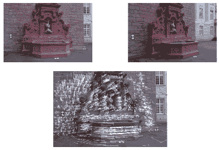

1.  **图像校正**: 通过从一对图像中估计相机运动，我们将提取**基础矩阵**并校正图像，如以下截图所示：

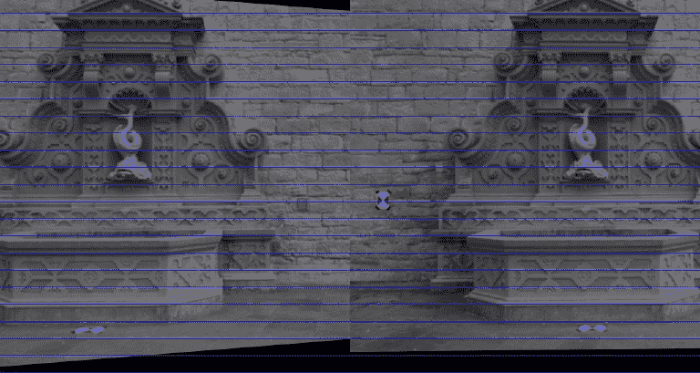

1.  **三角测量法**: 我们将通过利用**极几何**的约束来重建图像点的 3D 真实世界坐标。

1.  **3D 点云可视化**: 最后，我们将使用 Matplotlib 中的散点图来可视化恢复的场景的 3D 结构，这在使用 pyplot 的 Pan 轴按钮进行研究时最为引人入胜。此按钮允许你在三个维度中旋转和缩放点云。在以下截图中，颜色对应于场景中点的深度：

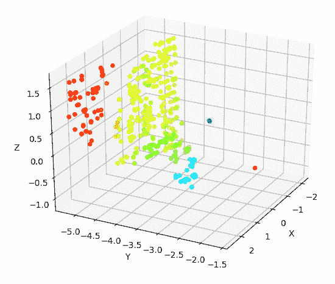

首先，我们需要校正我们的图像，使它们看起来就像是从针孔相机拍摄出来的。为此，我们需要估计相机的参数，这把我们引向了相机标定的领域。

# 学习相机标定

到目前为止，我们一直使用从我们的网络摄像头直接输出的图像，而没有质疑其拍摄方式。然而，每个相机镜头都有独特的参数，例如焦距、主点和镜头畸变。

当相机拍照时，其背后的过程是这样的：光线穿过镜头，然后通过光圈，最后落在光敏器的表面上。这个过程可以用针孔相机模型来近似。估计现实世界镜头参数的过程，使其适合针孔相机模型，被称为相机标定（或**相机重投影**，不应与*光度学*相机标定混淆）。因此，让我们从下一节开始学习针孔相机模型。

# 理解针孔相机模型

**针孔相机模型**是对真实相机的简化，其中没有镜头，相机光圈被近似为一个单点（针孔）。这里描述的公式也完全适用于带薄镜头的相机，以及描述任何普通相机的主要参数。

当观察现实世界的 3D 场景（如一棵树）时，光线穿过点大小的孔径，并落在相机内部的 2D 图像平面上，如下所示图所示：

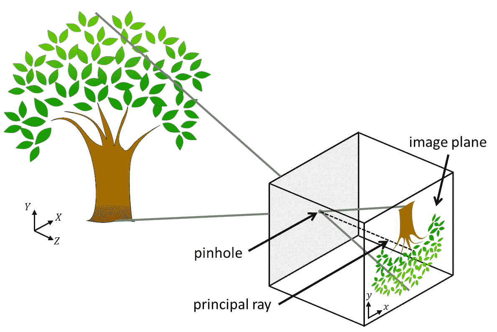

在这个模型中，具有坐标(*X*, *Y*, *Z*)的 3D 点被映射到图像平面上的具有坐标(*x*, *y*)的 2D 点上。请注意，这导致树在图像平面上是倒置的。

垂直于图像平面并通过针孔的线称为**主光线**，其长度称为**焦距**。焦距是内部相机参数的一部分，因为它可能取决于所使用的相机。在简单的带镜头的相机中，**针孔**被镜头取代，焦平面放置在镜头的焦距处，以尽可能减少模糊。

哈特利和齐 isserman 发现了一个数学公式，用以描述如何从具有坐标(*x*, *y*)的 2D 点推断出具有坐标(*X, Y, Z*)的 3D 点，以及相机的内在参数，如下所示：

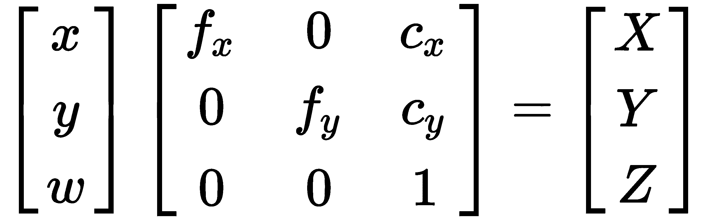

前一个公式中的 3x3 矩阵是**内在相机矩阵**——一个紧凑地描述所有内部相机参数的矩阵。该矩阵包括焦距(*f[x]*和*f[y]*)和光学中心*c[x]*和*c[y]*，在数字成像中，它们简单地用像素坐标表示。如前所述，焦距是针孔和图像平面之间的距离。

小孔相机只有一个焦距，在这种情况下，*f[x]* = *f[x ]*= *f[x ]*。然而，在实际相机中，这两个值可能不同，例如，由于镜头、焦平面（由数字相机传感器表示）或组装的不完美。这种差异也可能是出于某种目的而故意造成的，这可以通过简单地使用在不同方向上具有不同曲率的镜头来实现。主光线与图像平面相交的点称为**主点**，其在图像平面上的相对位置由光学中心（或主点偏移）捕捉。

此外，相机可能受到径向或切向畸变的影响，导致**鱼眼效应**。这是由于硬件不完美和镜头错位造成的。这些畸变可以用**畸变系数**的列表来描述。有时，径向畸变实际上是一种期望的艺术效果。在其他时候，它们需要被校正。

关于小孔相机模型，网上有许多很好的教程，例如[`ksimek.github.io/2013/08/13/intrinsic`](http://ksimek.github.io/2013/08/13/intrinsic)。

由于这些参数是针对相机硬件的特定参数（因此得名 *intrinsic*），我们只需要在相机的整个生命周期中计算一次。这被称为**相机校准**。

接下来，我们将介绍相机的内在参数。

# 估计相机的内在参数

在 OpenCV 中，相机校准相当直接。官方文档提供了该主题的良好概述和一些示例 C++ 脚本，请参阅[`docs.opencv.org/doc/tutorials/calib3d/camera_calibration/camera_calibration.html`](http://docs.opencv.org/doc/tutorials/calib3d/camera_calibration/camera_calibration.html)。

为了教育目的，我们将使用 Python 开发自己的校准脚本。我们需要向要校准的相机展示一个具有已知几何形状（棋盘格板或白色背景上的黑色圆圈）的特殊图案图像。

由于我们知道图案图像的几何形状，我们可以使用特征检测来研究内部相机矩阵的性质。例如，如果相机受到不希望的径向畸变，棋盘格图案的不同角落将在图像中变形，并且不会位于矩形网格上。通过从不同的视角拍摄大约 10-20 张棋盘格图案的快照，我们可以收集足够的信息来正确推断相机矩阵和畸变系数。

为了做到这一点，我们将使用 `calibrate.py` 脚本，该脚本首先导入以下模块：

```py
import cv2
import numpy as np
import wx

from wx_gui import BaseLayout
```

类似于前面的章节，我们将使用基于 `BaseLayout` 的简单布局，该布局嵌入处理网络摄像头视频流。

脚本的 `main` 函数将生成 GUI 并执行应用程序的 `main` 循环：

```py
 def main():
```

后者是通过以下步骤在函数体中完成的：

1.  首先，连接到相机并设置标准 VGA 分辨率：

```py
capture = cv2.VideoCapture(0)
assert capture.isOpened(), "Can not connect to camera"
capture.set(cv2.CAP_PROP_FRAME_WIDTH, 640)
capture.set(cv2.CAP_PROP_FRAME_HEIGHT, 480)
```

1.  类似于前面的章节，创建一个`wx`应用程序和`layout`类，我们将在本节后面组合它们：

```py
app = wx.App()
layout = CameraCalibration(capture, title='Camera Calibration', fps=2)
```

1.  显示 GUI 并执行`app`的`MainLoop`：

```py
layout.Show(True)
app.MainLoop()
```

在下一节中，我们将准备相机校准 GUI，这是我们将在本节后面使用的。

# 定义相机校准 GUI

GUI 是通用`BaseLayout`的定制版本：

```py
class CameraCalibration(BaseLayout): 
```

布局仅由当前相机帧和其下方的单个按钮组成。此按钮允许我们开始校准过程：

```py
    def augment_layout(self):
        pnl = wx.Panel(self, -1)
        self.button_calibrate = wx.Button(pnl, label='Calibrate Camera')
        self.Bind(wx.EVT_BUTTON, self._on_button_calibrate)
        hbox = wx.BoxSizer(wx.HORIZONTAL)
        hbox.Add(self.button_calibrate)
        pnl.SetSizer(hbox)
```

为了使这些更改生效，`pnl`需要添加到现有面板列表中：

```py
self.panels_vertical.Add(pnl, flag=wx.EXPAND | wx.BOTTOM | wx.TOP,
                                 border=1)
```

剩余的可视化管道由`BaseLayout`类处理。我们只需要确保初始化所需的变量并提供`process_frame`方法。

现在我们已经定义了一个用于相机校准的 GUI，接下来我们将初始化一个相机校准算法。

# 初始化算法

为了执行校准过程，我们需要做一些记账工作。我们将通过以下步骤来完成：

1.  现在，让我们专注于一个 10 x 7 的棋盘。算法将检测棋盘的所有`9` x `6`个内部角落（称为*对象点*）并将这些角落检测到的图像点存储在列表中。因此，我们首先将`chessboard_size`初始化为内部角落的数量：

```py
self.chessboard_size = (9, 6) 
```

1.  接下来，我们需要枚举所有对象点并将它们分配对象点坐标，以便第一个点的坐标为（0，0），第二个点（顶部行）的坐标为（1，0），最后一个点的坐标为（8，5）：

```py
        # prepare object points
        self.objp = np.zeros((np.prod(self.chessboard_size), 3),
                             dtype=np.float32)
        self.objp[:, :2] = np.mgrid[0:self.chessboard_size[0],
                                    0:self.chessboard_size[1]]
                                    .T.reshape(-1, 2)
```

1.  我们还需要跟踪我们是否正在记录对象和图像点。一旦用户点击`self.button_calibrate`按钮，我们将启动此过程。之后，算法将尝试在所有后续帧中检测棋盘，直到检测到`self.record_min_num_frames`个棋盘：

```py
        # prepare recording
        self.recording = False
        self.record_min_num_frames = 15
        self._reset_recording()
```

1.  每当点击`self.button_calibrate`按钮时，我们将重置所有记账变量，禁用按钮，并开始记录：

```py
    def _on_button_calibrate(self, event):
        """Enable recording mode upon pushing the button"""
        self.button_calibrate.Disable()
        self.recording = True
        self._reset_recording()
```

重置记账变量包括清除记录的对象和图像点列表（`self.obj_points`和`self.img_points`）以及将检测到的棋盘数量（`self.recordCnt`）重置为`0`：

```py
def _reset_recording(self): 
    self.record_cnt = 0 
    self.obj_points = [] 
    self.img_points = [] 
```

在下一节中，我们将收集图像和对象点。

# 收集图像和对象点

`process_frame`方法负责执行校准技术的艰苦工作，我们将通过以下步骤收集图像和对象点：

1.  在点击`self.button_calibrate`按钮后，此方法开始收集数据，直到检测到总共`self.record_min_num_frames`个棋盘：

```py
    def process_frame(self, frame):
        """Processes each frame"""
        # if we are not recording, just display the frame
        if not self.recording:
            return frame

        # else we're recording
        img_gray = cv2.cvtColor(frame, cv2.COLOR_BGR2GRAY)
                   .astype(np.uint8)
        if self.record_cnt < self.record_min_num_frames:
            ret, corners = cv2.findChessboardCorners(
                               img_gray,
                               self.chessboard_size,
                               None)
```

`cv2.findChessboardCorners`函数将解析灰度图像（`img_gray`）以找到大小为`self.chessboard_size`的棋盘。如果图像确实包含棋盘，该函数将返回`true`（`ret`）以及一个棋盘角列表（`corners`）。

1.  然后，绘制棋盘是直接的：

```py
            if ret:
                print(f"{self.record_min_num_frames - self.record_cnt} chessboards remain")
                cv2.drawChessboardCorners(frame, self.chessboard_size, corners, ret)
```

1.  结果看起来像这样（用彩色绘制棋盘角以增强效果）：

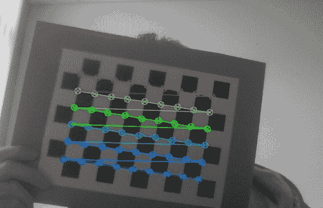

我们现在可以简单地存储检测到的角列表并继续下一帧。然而，为了使校准尽可能准确，OpenCV 提供了一个用于细化角点测量的函数：

```py
criteria = (cv2.TERM_CRITERIA_EPS + cv2.TERM_CRITERIA_MAX_ITER,
            30, 0.01)
cv2.cornerSubPix(img_gray, corners, (9, 9), (-1, -1), criteria)
```

这将细化检测到的角的坐标到亚像素精度。现在我们准备好将对象点和图像点添加到列表中并前进帧计数器：

```py
self.obj_points.append(self.objp) 
self.img_points.append(corners) 
self.record_cnt += 1 
```

在下一节中，我们将学习如何找到相机矩阵，这对于完成适当的 3D 重建是必需的。

# 寻找相机矩阵

一旦收集到足够的数据（即，一旦`self.record_cnt`达到`self.record_min_num_frames`的值），算法就准备好执行校准。这个过程可以通过对`cv2.calibrateCamera`的单次调用来完成：

```py
else:
    print("Calibrating...")
    ret, K, dist, rvecs, tvecs = cv2.calibrateCamera(self.obj_points,
                                                     self.img_points,
                                                     (self.imgHeight,
                                                      self.imgWidth),
                                                     None, None)
```

函数在成功时返回`true`（`ret`），内禀相机矩阵（`K`），畸变系数（`dist`），以及两个旋转和平移矩阵（`rvecs`和`tvecs`）。目前，我们主要对相机矩阵和畸变系数感兴趣，因为这些将允许我们补偿内部相机硬件的任何不完美。

我们将简单地`打印`它们到控制台以便于检查：

```py
print("K=", K)
print("dist=", dist)
```

例如，我的笔记本电脑网络摄像头的校准恢复了以下值：

```py
K= [[ 3.36696445e+03 0.00000000e+00 2.99109943e+02] 
    [ 0.00000000e+00 3.29683922e+03 2.69436829e+02] 
    [ 0.00000000e+00 0.00000000e+00 1.00000000e+00]] 
dist= [[ 9.87991355e-01 -3.18446968e+02 9.56790602e-02 
         -3.42530800e-02 4.87489304e+03]]
```

这告诉我们，我的网络摄像头的焦距为`fx=3366.9644`像素和`fy=3296.8392`像素，光学中心在`cx=299.1099`像素和`cy=269.4368`像素。

一个好主意可能是双重检查校准过程的准确性。这可以通过使用恢复的相机参数将对象点投影到图像上来完成，以便我们可以将它们与我们使用`cv2.findChessboardCorners`函数收集到的图像点列表进行比较。如果这两个点大致相同，我们知道校准是成功的。甚至更好，我们可以通过将列表中的每个对象点投影来计算重建的`平均误差`：

```py
mean_error = 0 
for obj_point, rvec, tvec, img_point in zip(
        self.obj_points, rvecs, tvecs, self.img_points):
    img_points2, _ = cv2.projectPoints(
        obj_point, rvec, tvec, K, dist)
    error = cv2.norm(img_point, img_points2,
                     cv2.NORM_L2) / len(img_points2)
    mean_error += error

print("mean error=", mean_error)
```

在我的笔记本电脑的网络摄像头上进行此检查的结果是平均误差为 0.95 像素，这相当接近 0。

在恢复内部相机参数后，我们现在可以开始拍摄美丽、无畸变的照片，可能从不同的视角，以便我们可以从运动中提取一些结构。首先，让我们看看如何设置我们的应用程序。

# 设置应用程序

接下来，我们将使用一个著名的开源数据集，称为`fountain-P11`。它展示了从不同角度观看的瑞士喷泉：

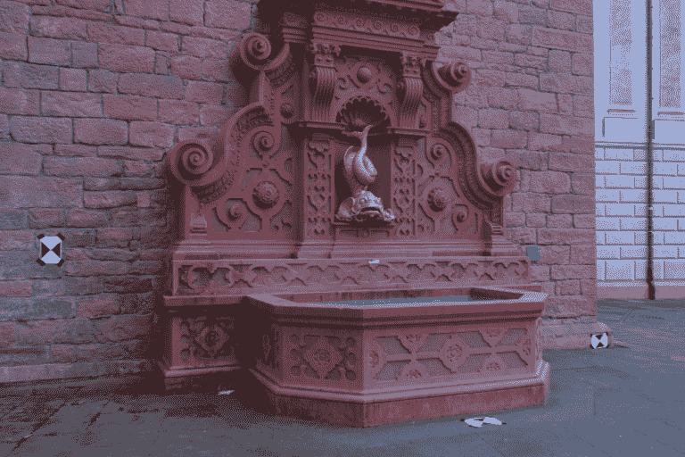

数据集包含 11 张高分辨率图像，可以从[`icwww.epfl.ch/multiview/denseMVS.html`](https://icwww.epfl.ch/multiview/denseMVS.html)下载。如果我们自己拍照，我们就必须通过整个相机标定过程来恢复内禀相机矩阵和畸变系数。幸运的是，这些参数对于拍摄喷泉数据集的相机是已知的，因此我们可以继续在我们的代码中硬编码这些值。

让我们在下一节中准备`main`主函数。

# 理解主函数

我们的`main`主函数将包括创建和与`SceneReconstruction3D`类的实例进行交互。这段代码可以在`chapter4.py`文件中找到。该模块的依赖项是`numpy`以及类本身，它们被导入如下：

```py
import numpy as np 

from scene3D import SceneReconstruction3D

```

接下来，我们定义`main`函数：

```py
def main():
```

函数包括以下步骤：

1.  我们为拍摄喷泉数据集照片的相机定义了内禀相机矩阵（`K`）和畸变系数（`d`）：

```py
K = np.array([[2759.48 / 4, 0, 1520.69 / 4, 0, 2764.16 / 4,
               1006.81 / 4, 0, 0, 1]]).reshape(3, 3)
d = np.array([0.0, 0.0, 0.0, 0.0, 0.0]).reshape(1, 5) 
```

根据摄影师的说法，这些图像已经是无畸变的，因此我们将所有畸变系数设置为 0。

注意，如果您想在除`fountain-P11`之外的数据集上运行本章中展示的代码，您将必须调整内禀相机矩阵和畸变系数。

1.  接下来，我们创建`SceneReconstruction3D`类的实例，并加载一对图像，我们希望将这些图像应用于我们的运动结构技术。数据集被下载到名为`fountain_dense`的子目录中：

```py
scene = SceneReconstruction3D(K, d) 
scene.load_image_pair("fountain_dense/0004.png", 
     "fountain_dense/0005.png")
```

1.  现在，我们已经准备好调用类中执行各种计算的方法：

```py
scene.plot_rectified_images()
scene.plot_optic_flow()
scene.plot_point_cloud()
```

我们将在本章的其余部分实现这些方法，它们将在接下来的章节中详细解释。

因此，现在我们已经准备好了应用程序的主脚本，让我们开始实现`SceneReconstruction3D`类，它执行所有繁重的工作，并包含 3D 重建的计算。

# 实现`SceneReconstruction3D`类

本章所有相关的 3D 场景重建代码都可以在`scene3D`模块中作为`SceneReconstruction3D`类的一部分找到。在实例化时，该类存储用于所有后续计算的内禀相机参数：

```py
import cv2 
import numpy as np 
import sys 

from mpl_toolkits.mplot3d import Axes3D 
import matplotlib.pyplot as plt 
from matplotlib import cm

class SceneReconstruction3D: 
    def __init__(self, K, dist): 
        self.K = K 
        self.K_inv = np.linalg.inv(K) 
        self.d = dist 
```

然后，我们需要加载一对图像来进行操作。

为了做到这一点，首先，我们创建一个静态方法，该方法将加载一个图像，如果它是灰度图像，则将其转换为 RGB 格式，因为其他方法期望一个三通道图像。在喷泉序列的情况下，所有图像都具有相对较高的分辨率。如果设置了可选的`downscale`标志，则该方法将图像下采样到大约`600`像素的宽度：

```py
    @staticmethod
    def load_image(
            img_path: str,
            use_pyr_down: bool,
            target_width: int = 600) -> np.ndarray:

        img = cv2.imread(img_path, cv2.CV_8UC3)
        # make sure image is valid
        assert img is not None, f"Image {img_path} could not be loaded."
        if len(img.shape) == 2:
            img = cv2.cvtColor(img, cv2.COLOR_GRAY2BGR)

        while use_pyr_down and img.shape[1] > 2 * target_width:
            img = cv2.pyrDown(img)
        return img
```

接下来，我们创建一个方法，加载一对图像，并使用之前指定的畸变系数（如果有）对它们进行径向和切向镜头畸变的补偿：

```py
    def load_image_pair(
            self,
            img_path1: str,
            img_path2: str,
            use_pyr_down: bool = True) -> None:

        self.img1, self.img2 = [cv2.undistort(self.load_image(path, 
                                                              use_pyr_down), 
                                              self.K, self.d)
            for path in (img_path1,img_path2)]
```

最后，我们准备进入项目的核心——估计相机运动和重建场景！

# 从一对图像中估计相机运动

现在我们已经加载了同一场景的两个图像（`self.img1`和`self.img2`），例如来自喷泉数据集的两个示例，我们发现自己处于与上一章类似的情况。我们得到了两张据说显示相同刚性物体或静态场景但来自不同视点的图像。

然而，这次我们想要更进一步——如果两张照片之间唯一改变的是相机的位置，我们能否通过观察匹配特征来推断相对相机运动？

好吧，当然可以。否则，这一章就没有太多意义了，对吧？我们将以第一张图像中相机的位置和方向为已知条件，然后找出我们需要重新定位和重新定向相机多少，以便其视点与第二张图像匹配。

换句话说，我们需要恢复第二张图像中相机的**基础矩阵**。基础矩阵是一个 4 x 3 的矩阵，它是 3 x 3 旋转矩阵和 3 x 1 平移矩阵的连接。它通常表示为*[R | t]*。你可以将其视为捕捉第二张图像中相对于第一张图像中相机的位置和方向。

恢复基础矩阵（以及本章中所有其他变换）的关键步骤是特征匹配。我们可以对两张图像应用 SIFT 检测器，或者计算两张图像之间的光流。用户可以通过指定特征提取模式来选择他们喜欢的方

```py
    def _extract_keypoints(self, feat_mode):
        # extract features
        if feat_mode.lower() == "sift":
            # feature matching via sift and BFMatcher
            self._extract_keypoints_sift()
        elif feat_mode.lower() == "flow":
            # feature matching via optic flow
            self._extract_keypoints_flow()
        else:
            sys.exit(f"Unknown feat_mode {feat_mode}. Use 'SIFT' or 
                     'FLOW'")
```

在下一节中，我们将学习如何使用丰富的特征描述符进行点匹配。

# 应用具有丰富特征描述符的点匹配

从图像中提取重要特征的一种鲁棒方法是使用 SIFT 检测器。在本章中，我们想要使用它来处理两张图像，`self.img1`和`self.img2`：

```py
    def _extract_keypoints_sift(self):
        # extract keypoints and descriptors from both images
        detector = cv2.xfeatures2d.SIFT_create()
        first_key_points, first_desc = detector.detectAndCompute(self.img1,
                                                                 None)
        second_key_points, second_desc = detector.detectAndCompute(self.img2,
                                                                   None)
```

对于特征匹配，我们将使用`BruteForce`匹配器，这样其他匹配器（如**FLANN**）也可以工作：

```py
        matcher = cv2.BFMatcher(cv2.NORM_L1, True)
        matches = matcher.match(first_desc, second_desc)
```

对于每个`匹配`，我们需要恢复相应的图像坐标。这些坐标保存在`self.match_pts1`和`self.match_pts2`列表中：

```py
        # generate lists of point correspondences
        self.match_pts1 = np.array(
            [first_key_points[match.queryIdx].pt for match in matches])
        self.match_pts2 = np.array(
            [second_key_points[match.trainIdx].pt for match in matches])
```

以下截图显示了将特征匹配器应用于喷泉序列的两个任意帧的示例：

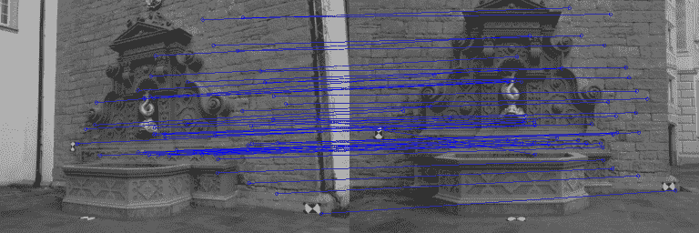

在下一节中，我们将学习使用光流进行点匹配。

# 使用光流进行点匹配

使用丰富特征的替代方案是使用光流。光流是通过计算位移向量来估计两个连续图像帧之间的运动的过程。位移向量可以计算图像中的每个像素（密集）或仅计算选定的点（稀疏）。

计算密集光流最常用的技术之一是 Lukas-Kanade 方法。它可以通过使用`cv2.calcOpticalFlowPyrLK`函数在 OpenCV 中以单行代码实现。

但在这之前，我们需要在图像中选取一些值得追踪的点。同样，这也是一个特征选择的问题。如果我们只想对几个非常突出的图像点获得精确的结果，我们可以使用 Shi-Tomasi 的`cv2.goodFeaturesToTrack`函数。这个函数可能会恢复出如下特征：

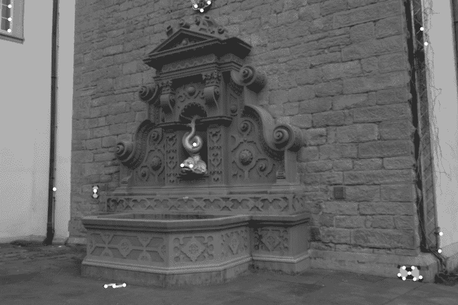

然而，为了从运动中推断结构，我们可能需要更多的特征，而不仅仅是最突出的 Harris 角。一个替代方案是检测**加速分割测试（FAST**）特征：

```py
def _extract_keypoints_flow(self): 
    fast = cv2.FastFeatureDetector() 
    first_key_points = fast.detect(self.img1, None) 
```

然后，我们可以计算这些特征的光流。换句话说，我们想要找到第二张图像中最可能对应于第一张图像中的`first_key_points`的点。为此，我们需要将关键点列表转换为(*x*, *y*)坐标的 NumPy 数组：

```py
first_key_list = [i.pt for i in first_key_points] 
first_key_arr = np.array(first_key_list).astype(np.float32) 
```

然后光流将返回第二张图像中对应特征的一个列表（`second_key_arr`）：

```py
second_key_arr, status, err = 
     cv2.calcOpticalFlowPyrLK(self.img1, self.img2, 
         first_key_arr)
```

该函数还返回一个状态位向量（`status`），它指示关键点的光流是否已找到，以及一个估计误差值向量（`err`）。如果我们忽略这两个附加向量，恢复的光流场可能看起来像这样：

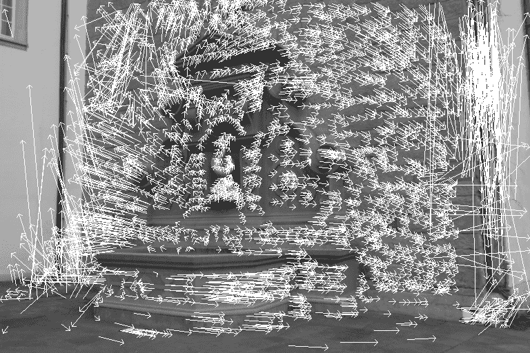

在这张图像中，每个关键点都画了一个箭头，从第一张图像中关键点的位置开始，指向第二张图像中相同关键点的位置。通过检查光流图像，我们可以看到相机主要向右移动，但似乎还有一个旋转分量。

然而，其中一些箭头非常大，而且一些箭头没有意义。例如，图像右下角的像素实际上移动到图像顶部的可能性非常小。更有可能的是，这个特定关键点的光流计算是错误的。因此，我们希望排除所有状态位为 0 或估计误差大于某个值的特征点：

```py
condition = (status == 1) * (err < 5.) 
concat = np.concatenate((condition, condition), axis=1) 
first_match_points = first_key_arr[concat].reshape(-1, 2) 
second_match_points = second_key_arr[concat].reshape(-1, 2) 

self.match_pts1 = first_match_points 
self.match_pts2 = second_match_points 
```

如果我们再次使用有限的关键点集绘制流场，图像将看起来像这样：

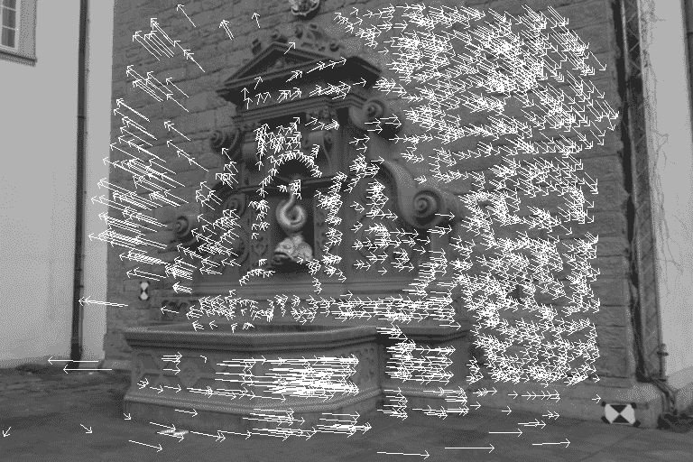

流场可以使用以下公共方法绘制，该方法首先使用前面的代码提取关键点，然后在图像上绘制实际的箭头：

```py
    def plot_optic_flow(self):
        self._extract_keypoints_flow()

        img = np.copy(self.img1)
        for pt1, pt2 in zip(self.match_pts1, self.match_pts2):
            cv2.arrowedLine(img, tuple(pt1), tuple(pt2),
                     color=(255, 0, 0))

        cv2.imshow("imgFlow", img)
        cv2.waitKey()
```

使用光流而不是丰富特征的优势在于，该过程通常更快，并且可以容纳更多点的匹配，使重建更密集。

在处理光流时需要注意的问题是，它最适合由相同硬件连续拍摄的照片，而丰富的特征对此则大多不敏感。

让我们在下一节中学习如何找到相机矩阵。

# 寻找相机矩阵

现在我们已经获得了关键点之间的匹配，我们可以计算两个重要的相机矩阵——基础矩阵和本质矩阵。这些矩阵将指定相机的运动，以旋转和平移分量表示。获取基础矩阵 (`self.F`) 是另一个 OpenCV 一行代码：

```py
def _find_fundamental_matrix(self): 
    self.F, self.Fmask = cv2.findFundamentalMat(self.match_pts1, 
         self.match_pts2, cv2.FM_RANSAC, 0.1, 0.99)
```

`fundamental_matrix` 和 `essential_matrix` 之间的唯一区别是后者作用于校正后的图像：

```py
def _find_essential_matrix(self): 
    self.E = self.K.T.dot(self.F).dot(self.K) 
```

本质矩阵 (`self.E`) 可以通过奇异值分解（**SVD**）分解为旋转和平移分量，表示为 *[R | t]*：

```py
def _find_camera_matrices(self): 
    U, S, Vt = np.linalg.svd(self.E) 
    W = np.array([0.0, -1.0, 0.0, 1.0, 0.0, 0.0, 0.0, 0.0, 
         1.0]).reshape(3, 3)
```

使用单位矩阵 *U* 和 *V* 与一个额外的矩阵 *W* 结合，我们现在可以重建 *[R | t]*。然而，可以证明这种分解有四个可能的解，其中只有一个才是有效的第二个相机矩阵。我们唯一能做的就是检查所有四个可能的解，找到预测所有图像关键点都位于两个相机前面的那个解。

但在那之前，我们需要将关键点从 2D 图像坐标转换为齐次坐标。我们通过添加一个 *z* 坐标来实现这一点，并将其设置为 `1`：

```py
        first_inliers = []
        second_inliers = []
        for pt1,pt2, mask in 
        zip(self.match_pts1,self.match_pts2,self.Fmask):
            if mask:
                first_inliers.append(self.K_inv.dot([pt1[0], pt1[1], 1.0]))
                second_inliers.append(self.K_inv.dot([pt2[0], pt2[1], 
                                      1.0]))
```

我们然后遍历四个可能的解，并选择返回 `_in_front_of_both_cameras` 为 `True` 的那个解：

```py
        R = T = None
        for r in (U.dot(W).dot(Vt), U.dot(W.T).dot(Vt)):
            for t in (U[:, 2], -U[:, 2]):
                if self._in_front_of_both_cameras(
                        first_inliers, second_inliers, r, t):
                    R, T = r, t

        assert R is not None, "Camera matricies were never found!"
```

现在，我们最终可以构建两个相机的 *[R | t]* 矩阵。第一个相机只是一个标准相机（没有平移和旋转）：

```py
self.Rt1 = np.hstack((np.eye(3), np.zeros((3, 1)))) 
```

第二个相机矩阵由之前恢复的 *[R | t]* 组成：

```py
self.Rt2 = np.hstack((R, T.reshape(3, 1))) 
```

`__InFrontOfBothCameras` 私有方法是一个辅助函数，确保每一对关键点都映射到使它们位于两个相机前面的 3D 坐标：

```py
    def _in_front_of_both_cameras(self, first_points, second_points, rot,
                                  trans):
        """Determines whether point correspondences are in front of both
           images"""
        rot_inv = rot
        for first, second in zip(first_points, second_points):
            first_z = np.dot(rot[0, :] - second[0] * rot[2, :],
                             trans) / np.dot(rot[0, :] - second[0] * rot[2, 
                             :],
                                             second)
            first_3d_point = np.array([first[0] * first_z,
                                       second[0] * first_z, first_z])
            second_3d_point = np.dot(rot.T, first_3d_point) - np.dot(rot.T,
                                                                     trans)
```

如果函数发现任何不在两个相机前面的关键点，它将返回 `False`：

```py
if first_3d_point[2] < 0 or second_3d_point[2] < 0: 
    return False 
return True 
```

因此，既然我们已经找到了相机矩阵，那么在下一节中校正图像，这是一个验证恢复的矩阵是否正确的好方法。

# 应用图像校正

确保我们已经恢复了正确的相机矩阵的最简单方法可能是校正图像。如果它们被正确校正，那么第一张图像中的一个点和第二张图像中的一个点将对应于相同的 3D 世界点，并将位于相同的垂直坐标上。

在一个更具体的例子中，比如在我们的案例中，因为我们知道相机是垂直的，我们可以验证校正图像中的水平线与 3D 场景中的水平线相对应。因此，我们遵循以下步骤来校正我们的图像：

1.  首先，我们执行前一小节中描述的所有步骤，以获得第二个相机的*[R | t]*矩阵：

```py
def plot_rectified_images(self, feat_mode="SIFT"): 
    self._extract_keypoints(feat_mode) 
    self._find_fundamental_matrix() 
    self._find_essential_matrix() 
    self._find_camera_matrices_rt() 

    R = self.Rt2[:, :3] 
    T = self.Rt2[:, 3] 
```

1.  然后，可以使用两个 OpenCV 单行代码执行校正，这些代码根据相机矩阵(`self.K`)、畸变系数(`self.d`)、基础矩阵的旋转分量(`R`)和基础矩阵的平移分量(`T`)将图像坐标重新映射到校正坐标：

```py
        R1, R2, P1, P2, Q, roi1, roi2 = cv2.stereoRectify(
            self.K, self.d, self.K, self.d, 
            self.img1.shape[:2], R, T, alpha=1.0)
        mapx1, mapy1 = cv2.initUndistortRectifyMap(
            self.K, self.d, R1, self.K, self.img1.shape[:2],
            cv2.CV_32F)
        mapx2, mapy2 = cv2.initUndistortRectifyMap(
            self.K, self.d, R2, self.K,
            self.img2.shape[:2],
            cv2.CV_32F)
        img_rect1 = cv2.remap(self.img1, mapx1, mapy1, 
                              cv2.INTER_LINEAR)
        img_rect2 = cv2.remap(self.img2, mapx2, mapy2, 
                              cv2.INTER_LINEAR)
```

1.  为了确保校正准确，我们将两个校正后的图像(`img_rect1`和`img_rect2`)并排放置：

```py
        total_size = (max(img_rect1.shape[0], img_rect2.shape[0]),
                      img_rect1.shape[1] + img_rect2.shape[1], 3)
        img = np.zeros(total_size, dtype=np.uint8)
        img[:img_rect1.shape[0], :img_rect1.shape[1]] = img_rect1
        img[:img_rect2.shape[0], img_rect1.shape[1]:] = img_rect2
```

1.  我们还在每`25`像素后绘制水平蓝色线条，穿过并排的图像，以进一步帮助我们视觉上研究校正过程：

```py
        for i in range(20, img.shape[0], 25):
            cv2.line(img, (0, i), (img.shape[1], i), (255, 0, 0))

        cv2.imshow('imgRectified', img)
        cv2.waitKey()
```

现在我们很容易就能说服自己，校正已经成功，如下所示：


现在我们已经校正了我们的图像，让我们在下一节学习如何重建 3D 场景。

# 重建场景

最后，我们可以通过使用称为**三角测量**的过程来重建 3D 场景。由于**极线几何**的工作方式，我们能够推断出点的 3D 坐标。通过计算基础矩阵，我们比我们想象的更多地了解了视觉场景的几何形状。因为两个相机描绘了同一个真实世界的场景，我们知道大多数 3D 真实世界点将出现在两个图像中。

此外，我们知道从 2D 图像点到相应 3D 真实世界点的映射将遵循几何规则。如果我们研究足够多的图像点，我们就可以构建并解决一个（大）线性方程组，以获得真实世界坐标的地面真实值。

让我们回到瑞士喷泉数据集。如果我们要求两位摄影师同时从不同的视角拍摄喷泉的照片，不难意识到第一位摄影师可能会出现在第二位摄影师的照片中，反之亦然。图像平面上可以看到另一位摄影师的点被称为**共轭点**或**极线点**。

用更技术性的术语来说，共轭点是另一个相机的投影中心在第一个相机图像平面上的点。值得注意的是，它们各自图像平面上的共轭点和各自的投影中心都位于一条单一的 3D 直线上。

通过观察极点和图像点之间的线条，我们可以限制图像点的可能 3D 坐标数量。实际上，如果已知投影点，那么极线（即图像点和极点之间的线）是已知的，并且反过来，该点在第二张图像上的投影必须位于特定的极线上。*困惑吗？*我想是的。

让我们来看看这些图像：

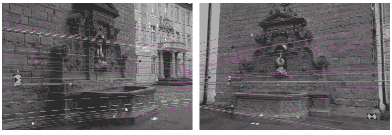

这里每一行都是图像中特定点的极线。理想情况下，左手图像中绘制的所有极线都应该相交于一个点，并且该点通常位于图像之外。如果计算准确，那么该点应该与从第一台相机看到的第二台相机的位置重合。

换句话说，左手图像中的极线告诉我们，拍摄右手图像的相机位于我们的右侧（即第一台相机）。类似地，右手图像中的极线告诉我们，拍摄左侧图像的相机位于我们的左侧（即第二台相机）。

此外，对于在一张图像中观察到的每个点，该点必须在另一张图像上以已知的极线观察到。这被称为**极线约束**。我们可以利用这个事实来证明，如果两个图像点对应于同一个 3D 点，那么这两个图像点的投影线必须精确相交于该 3D 点。这意味着可以从两个图像点计算出 3D 点，这正是我们接下来要做的。

幸运的是，OpenCV 再次提供了一个用于解决大量线性方程的包装器，这是通过以下步骤完成的：

1.  首先，我们必须将我们的匹配特征点列表转换为 NumPy 数组：

```py
first_inliers = np.array(self.match_inliers1).reshape
     (-1, 3)[:, :2]second_inliers = np.array(self.match_inliers2).reshape
     (-1, 3)[:, :2]
```

1.  **三角剖分**接下来使用前面提到的两个*[R | t]*矩阵（`self.Rt1`用于第一台相机，`self.Rt2`用于第二台相机）进行：

```py
pts4D = cv2.triangulatePoints(self.Rt1, self.Rt2, first_inliers.T,
     second_inliers.T).T
```

1.  这将使用 4D 齐次坐标返回三角剖分的真实世界点。要将它们转换为 3D 坐标，我们需要将(*X*, *Y*, *Z*)坐标除以第四个坐标，通常称为*W*：

```py
pts3D = pts4D[:, :3]/np.repeat(pts4D[:, 3], 3).reshape(-1, 3) 
```

因此，现在我们已经获得了 3D 空间中的点，让我们在下一节中可视化它们，看看它们看起来如何。

# 理解 3D 点云可视化

最后一步是可视化三角剖分的 3D 真实世界点。创建 3D 散点图的一个简单方法是通过使用 Matplotlib。然而，如果您正在寻找更专业的可视化工具，您可能会对**Mayavi**([`docs.enthought.com/mayavi/mayavi`](http://docs.enthought.com/mayavi/mayavi))、**VisPy**([`vispy.org`](http://vispy.org))或**点云库**([`pointclouds.org`](http://pointclouds.org))感兴趣。

尽管最后一个还没有为点云可视化提供 Python 支持，但它是一个用于点云分割、过滤和样本一致性模型拟合的出色工具。更多信息，请访问**Strawlab**的 GitHub 仓库[`github.com/strawlab/python-pcl`](https://github.com/strawlab/python-pcl)。

在我们能够绘制我们的 3D 点云之前，我们显然必须提取*[R | t]*矩阵并执行如前所述的三角剖分：

```py

    def plot_point_cloud(self, feat_mode="SIFT"):
        self._extract_keypoints(feat_mode)
        self._find_fundamental_matrix()
        self._find_essential_matrix()
        self._find_camera_matrices_rt()

        # triangulate points
        first_inliers = np.array(self.match_inliers1)[:, :2]
        second_inliers = np.array(self.match_inliers2)[:, :2]
        pts4D = cv2.triangulatePoints(self.Rt1, self.Rt2, first_inliers.T,
                                      second_inliers.T).T

        # convert from homogeneous coordinates to 3D
        pts3D = pts4D[:, :3] / pts4D[:, 3, None]
```

然后，我们只需要打开一个 Matplotlib 图形并绘制`pts3D`的每个条目在 3D 散点图中：

```py

        Xs, Zs, Ys = [pts3D[:, i] for i in range(3)]

        fig = plt.figure()
        ax = fig.add_subplot(111, projection='3d')
        ax.scatter(Xs, Ys, Zs, c=Ys, cmap=cm.hsv, marker='o')
        ax.set_xlabel('X')
        ax.set_ylabel('Y')
        ax.set_zlabel('Z')
        plt.title('3D point cloud: Use pan axes button below to inspect')
        plt.show()
```

使用 pyplot 的`pan axes`按钮研究结果最为引人入胜，它允许你在三个维度中旋转和缩放点云。在下图中，展示了两个投影。

第一个是从顶部拍摄的，第二个是从喷泉左侧某个垂直角度拍摄的。点的颜色对应于该点的深度（*y*坐标）。大多数点都位于与*XZ*平面成角度的平面上（从红色到绿色）。这些点代表喷泉后面的墙壁。其他点（从黄色到蓝色）代表喷泉的其余结构：

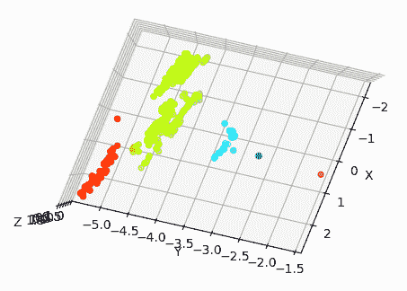

从喷泉左侧某个垂直角度的投影显示在下图中：

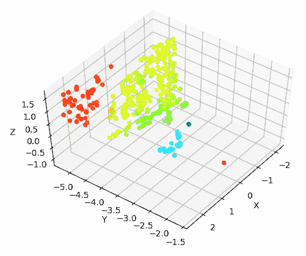

因此，现在你已经完成了你的第一个 3D 重建应用程序，你已经开始深入到计算机视觉领域中的结构从运动领域。这是一个快速发展领域。让我们在下一节中了解这个研究领域试图解决的问题。 

# 学习从运动中获取结构

到目前为止，在本章中，我们已经介绍了一些数学知识，并且可以根据从不同角度拍摄的一组图像重建场景的深度，这是一个从相机运动重建 3D 结构的问题。

在计算机视觉中，根据图像序列重建场景 3D 结构的过程通常被称为**从运动中获取结构**。类似的问题集是**从立体视觉中获取结构**——在立体视觉重建中，有两个相机，它们彼此之间相隔一定距离，而在从运动中获取结构中，有从不同角度和位置拍摄的不同图像。*在概念上没有太大的区别，对吧？*

让我们思考一下人类视觉。人们擅长估计物体的距离和相对位置。一个人甚至不需要两只眼睛来做这件事——我们可以用一只眼睛看，并且相当准确地估计距离和相对位置。此外，立体视觉只有在眼睛之间的距离与物体到眼睛的投影有显著差异时才会发生。

例如，如果一个物体在足球场外，眼睛的相对位置并不重要，而如果你看你的鼻子，视角会改变很多。为了进一步说明立体视觉并不是我们视觉的本质，我们可以看看一张我们可以很好地描述物体相对位置的相片，但我们实际上看到的是一个平面。

人们在大脑发育的早期并不具备这样的技能；观察表明，婴儿在定位物体位置方面很糟糕。因此，可能一个人在意识生活中通过观察世界和玩物体来学习这种技能。接下来，一个问题出现了——*如果一个人学会了世界的 3D 结构，我们能否让计算机也做到这一点？*

已经有一些有趣的模型试图做到这一点。例如，**Vid2Depth** ([`arxiv.org/pdf/1802.05522.pdf`](https://arxiv.org/pdf/1802.05522.pdf)) 是一个深度学习模型，其中作者训练了一个模型，该模型可以预测单张图像中的深度；同时，该模型在没有任何深度标注的视频帧序列上进行了训练。类似的问题现在是研究的热点。

# 摘要

在本章中，我们探索了一种通过推断由同一相机拍摄的 2D 图像的几何特征来重建场景的方法。我们编写了一个脚本来校准相机，并学习了基本和必要的矩阵。我们利用这些知识来进行三角测量。然后，我们继续使用 Matplotlib 中的简单 3D 散点图来可视化场景的真实世界几何形状。

从这里开始，我们将能够将三角化的 3D 点存储在可以被点云库解析的文件中，或者对不同的图像对重复该过程，以便我们可以生成更密集和更精确的重建。尽管我们在这章中已经涵盖了大量的内容，但还有很多工作要做。

通常，当我们谈论运动结构化流程时，我们会包括两个之前未曾提及的额外步骤——**捆绑调整**和**几何拟合**。在这样的流程中，最重要的步骤之一是细化 3D 估计，以最小化重建误差。通常，我们还想将不属于我们感兴趣对象的所有点从点云中移除。但是，有了基本的代码在手，你现在可以继续编写你自己的高级运动结构化流程！

在下一章中，我们将使用我们在 3D 场景重建中学到的概念。我们将使用本章中我们学到的关键点和特征来提取，并将应用其他对齐算法来创建全景图。我们还将深入研究计算摄影学的其他主题，理解核心概念，并创建**高动态范围**（**HDR**）图像。
