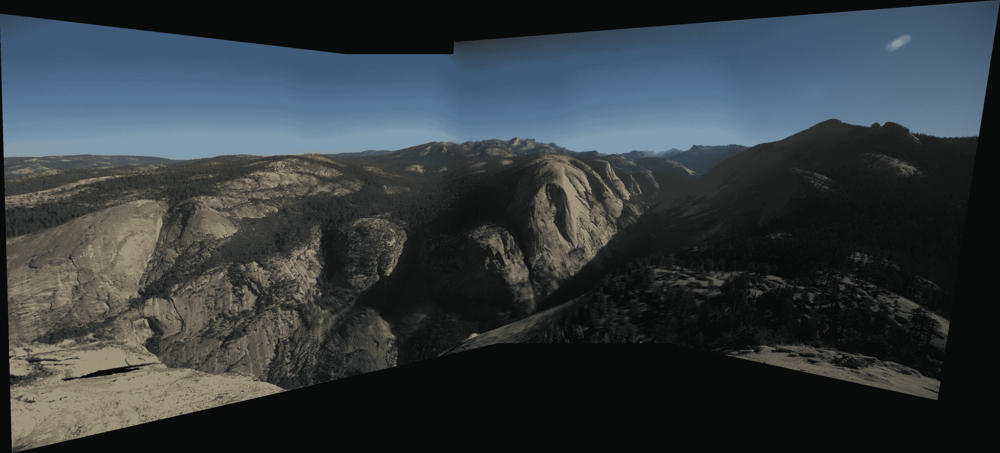

# 使用 OpenCV 进行计算摄影

本章的目标是建立在前面章节中关于摄影和图像处理所涵盖的内容之上，并深入探讨 OpenCV 提供的算法。我们将专注于处理数码摄影和构建能够让您利用 OpenCV 力量的工具，甚至考虑将其作为您编辑照片的首选工具。

在本章中，我们将介绍以下概念：

+   规划应用

+   理解 8 位问题

+   使用**伽玛校正**

+   理解**高动态范围成像**（**HDRI**）

+   理解全景拼接

+   改进全景拼接

学习数码摄影的基础知识和高动态成像的概念不仅可以帮助您更好地理解计算摄影，还可以使您成为一名更好的摄影师。由于我们将详细探讨这些主题，您还将了解编写新算法需要付出多少努力。

通过本章的学习，您将了解如何直接从数码相机处理（RAW）图像，如何使用 OpenCV 的计算摄影工具，以及如何使用低级 OpenCV API 构建全景拼接算法。

我们有很多主题要介绍，所以让我们挽起袖子开始吧。

# 开始学习

您可以在我们的 GitHub 仓库中找到本章中展示的代码，网址为[`github.com/PacktPublishing/OpenCV-4-with-Python-Blueprints-Second-Edition/tree/master/chapter5`](https://github.com/PacktPublishing/OpenCV-4-with-Python-Blueprints-Second-Edition/tree/master/chapter5)。

我们还将使用`rawpy`和`exifread`Python 包来读取 RAW 图像和读取图像元数据。对于完整的需求列表，您可以参考书中 Git 仓库中的`requirements.txt`文件。

# 规划应用

我们有几个概念需要熟悉。为了构建您的图像处理工具箱，我们将把我们要熟悉的概念开发成使用 OpenCV 解决实际问题的 Python 脚本。

我们将使用 OpenCV 实现以下脚本，以便您在需要处理照片时可以使用它们：

+   `gamma_correct.py`：这是一个脚本，它对输入图像应用伽玛校正，并显示结果图像。

+   `hdr.py`：这是一个脚本，它以图像为输入，并生成一个**高动态范围**（**HDR**）图像作为输出。

+   `panorama.py`：这是一个脚本，它以多个图像为输入，并生成一个比单个图像更大的拼接图像。

我们首先讨论数码摄影的工作原理以及为什么我们不需要进行后期处理就无法拍摄完美的照片。让我们从图像的 8 位问题开始。

# 理解 8 位问题

我们习惯看到的典型**联合图像专家小组**（**JPEG**）图像，是通过将每个像素编码为 24 位来工作的——每个**RGB**（红色、绿色、蓝色）颜色组件一个 8 位数字，这给我们一个在 0-255 范围内的整数。这只是一个数字，255，*但这足够信息吗？*为了理解这一点，让我们尝试了解这些数字是如何记录的以及这些数字代表什么。

大多数当前的数码相机使用**拜耳滤波器**，或等效的，它使用相同的原则。拜耳滤波器是一个不同颜色传感器的阵列，放置在一个类似于以下图所示的网格上：


图片来源—https://en.wikipedia.org/wiki/Bayer_filter#/media/File:Bayer_pattern_on_sensor.svg (CC SA 3.0)

在前面的图中，每个传感器测量进入它的光的强度，四个传感器一组代表一个单独的像素。这四个传感器的数据被组合起来，为我们提供 R、G 和 B 的三个值。

不同的相机可能会有红色、绿色和蓝色像素的不同布局，但最终，它们都在使用小的传感器，将它们接收到的辐射量离散化到 0-255 范围内的单个值，其中 0 表示完全没有辐射，255 表示传感器可以记录的最亮辐射。

可检测的亮度范围被称为**动态范围**或**亮度范围**。最小可注册的辐射量（即，1）与最高辐射量（即，255）之间的比率称为**对比度比**。

正如我们所说，JPEG 文件具有*255:1*的对比度比。大多数当前的 LCD 显示器已经超过了这个比例，对比度比高达*1,000:1*。我打赌你正在等待你眼睛的对比度比。我不确定你，但大多数人类可以看到高达*15,000:1*。

因此，我们可以看到比我们最好的显示器显示的还要多，比简单的 JPEG 文件存储的还要多。不要过于绝望，因为最新的数码相机已经迎头赶上，现在可以捕捉到高达*28,000:1*的强度比（真正昂贵的那些）。

小的动态范围是当你拍照时，如果背景有太阳，你要么看到太阳，周围的一切都是白色，没有任何细节，要么前景中的所有东西都极其黑暗的原因。这里是一个示例截图：


图片来源—https://github.com/mamikonyana/winter-hills (CC SA 4.0)

因此，问题是我们要么显示过亮的东西，要么显示过暗的东西。在我们继续前进之前，让我们看看如何读取超过 8 位的文件并将数据导入 OpenCV。

# 了解 RAW 图像

由于本章是关于计算摄影的，一些阅读本章的人可能是摄影爱好者，喜欢使用相机支持的 RAW 格式拍照——无论是**尼康电子格式**（**NEF**）还是**佳能原始版本 2**（**CR2**）。

原始文件通常比 JPEG 文件捕获更多的信息（通常每像素更多位），如果你要进行大量的后期处理，这些文件处理起来会更加方便，因为它们将产生更高品质的最终图像。

因此，让我们看看如何使用 Python 打开 CR2 文件并将其加载到 OpenCV 中。为此，我们将使用一个名为`rawpy`的 Python 库。为了方便，我们将编写一个名为`load_image`的函数，它可以处理 RAW 图像和常规 JPEG 文件，这样我们就可以抽象这部分内容，专注于本章剩余部分更有趣的事情：

1.  首先，我们处理导入（如承诺的那样，只是额外的一个小库）：

```py
import rawpy
import cv2
```

1.  我们定义了一个函数，添加了一个可选的`bps`参数，这将让我们控制我们想要图像具有多少精度，也就是说，我们想要检查我们是否想要完整的 16 位，或者 8 位就足够了：

```py
def load_image(path, bps=16):
```

1.  然后，如果文件具有`.CR2`扩展名，我们使用`rawpy`打开文件并提取图像，而不尝试进行任何后期处理，因为我们想用 OpenCV 来做：

```py
    if path.suffix == '.CR2':
        with rawpy.imread(str(path)) as raw:
            data = raw.postprocess(no_auto_bright=True,
                                   gamma=(1, 1),
                                   output_bps=bps)
```

1.  由于佳能（佳能公司——一家光学产品公司）和 OpenCV 使用不同的颜色顺序，我们切换到**BGR**（**蓝色**、**绿色**和**红色**），这是 OpenCV 中的默认顺序，我们`返回`生成的图像：

```py
        return cv2.cvtColor(data, cv2.COLOR_RGB2BGR)
```

对于任何不是`.CR2`的文件，我们使用 OpenCV：

```py
    else:
        return cv2.imread(str(path))
```

现在我们知道了如何将所有我们的图像放入 OpenCV，是时候开始使用我们最明亮的算法之一了。

由于我的相机具有 14 位动态范围，我们将使用用我的相机捕获的图像：

```py
def load_14bit_gray(path):
    img = load_image(path, bps=16)
    return (cv2.cvtColor(img, cv2.COLOR_BGR2GRAY) / 4).astype(np.uint16)
```

一旦我们知道了如何加载我们的图片，让我们尝试看看我们如何在屏幕上最佳地显示它们。

# 使用伽玛校正

*为什么每个人还在使用只能区分 255 个不同级别的 JPEG 文件呢？**这难道意味着它只能捕捉到 1:255 的动态范围吗？* 事实上，人们使用了一些巧妙的技巧。

如我们之前提到的，相机传感器捕获的值是线性的，也就是说，4 表示它比 1 有 4 倍的光线，80 比 10 有 8 倍的光线。但是 JPEG 文件格式必须使用线性刻度吗？事实并非如此。 因此，如果我们愿意牺牲两个值之间的差异，例如，100 和 101，我们就可以在那里放入另一个值。

为了更好地理解这一点，让我们来看看 RAW 图像灰度像素值的直方图。以下是生成该直方图的代码——只需加载图像，将其转换为灰度，然后使用`pyplot`显示直方图：

```py
    images = [load_14bit_gray(p) for p in args.images]
    fig, axes = plt.subplots(2, len(images), sharey=False)
    for i, gray in enumerate(images):
        axes[0, i].imshow(gray, cmap='gray', vmax=2**14)
        axes[1, i].hist(gray.flatten(), bins=256)
```

这是直方图的结果：


我们有两张图片：左边的是一张*正常*的图片，你可以看到一些云，但几乎看不到前景中的任何东西，而右边的一张则试图捕捉树中的细节，因此烧毁了所有的云。*有没有办法将它们结合起来？*

如果我们仔细观察直方图，我们会看到在右侧直方图上可以看见烧毁的部分，因为存在值为 16,000 的数据被编码为 255，即白色像素。但在左侧图片中，没有白色像素。我们将 14 位值编码为 8 位值的方式非常基础：我们只是将值除以*64 (=2⁶)*，因此我们失去了 2,500 和 2,501 以及 2,502 之间的区别；相反，我们只有 39（255 个中的 39 个）因为 8 位格式中的值必须是整数。

这就是伽玛校正发挥作用的地方。我们不会简单地显示记录的值作为强度，我们将进行一些校正，使图像更具有视觉吸引力。

我们将使用非线性函数来尝试强调我们认为更重要的一部分：


让我们尝试可视化这个公式对于两个不同值——**γ = 0.3**和**γ = 3**：


如您所见，小的伽玛值强调较低的值；**0**-**50**的像素值映射到**0**-**150**的像素值（超过一半的可供值）。对于较高的伽玛值，情况相反——**200**-**250**的值映射到**100**-**250**的值（超过一半的可供值）。因此，如果你想使你的照片更亮，你应该选择**γ < 1**的伽玛值，这通常被称为**伽玛压缩**。如果你想使你的照片变暗以显示更多细节，你应该选择**γ > 1**的伽玛值，这被称为**伽玛扩展**。

我们可以不用整数来表示*I*，而是从一个浮点数开始，得到 O，然后将该数字转换为整数以丢失更少的信息。让我们编写一些 Python 代码来实现伽玛校正：

1.  首先，让我们编写一个函数来应用我们的公式。因为我们使用 14 位数字，所以我们需要将其更改为以下形式：


因此，相关的代码如下：

```py
@functools.lru_cache(maxsize=None)
def gamma_transform(x, gamma, bps=14):
    return np.clip(pow(x / 2**bps, gamma) * 255.0, 0, 255)
```

在这里，我们使用了`@functools.lru_cache`装饰器来确保我们不会两次计算相同的内容。

1.  然后，我们只需遍历所有像素并应用我们的转换函数：

```py
def apply_gamma(img, gamma, bps=14):
    corrected = img.copy()
    for i, j in itertools.product(range(corrected.shape[0]),
                                  range(corrected.shape[1])):
        corrected[i, j] = gamma_transform(corrected[i, j], gamma, bps=bps)
    return corrected
```

现在，让我们看看如何使用这个方法来显示新图像与常规转换的 8 位图像并排。我们将为此编写一个脚本：

1.  首先，让我们配置一个`parser`来加载图像并允许设置`gamma`值：

```py
 if __name__ == '__main__':
    parser = argparse.ArgumentParser()
    parser.add_argument('raw_image', type=Path,
                        help='Location of a .CR2 file.')
    parser.add_argument('--gamma', type=float, default=0.3)
    args = parser.parse_args()
```

1.  将`gray`图像加载为`14bit`图像：

```py
    gray = load_14bit_gray(args.raw_image)
```

1.  使用线性变换来获取输出值作为范围`[0`-`255`]内的整数：

```py
    normal = np.clip(gray / 64, 0, 255).astype(np.uint8)
```

1.  使用我们之前编写的`apply_gamma`函数来获取伽玛校正的图像：

```py
    corrected = apply_gamma(gray, args.gamma)
```

1.  然后，将这两张图像及其直方图一起绘制出来：

```py
    fig, axes = plt.subplots(2, 2, sharey=False)
    for i, img in enumerate([normal, corrected]):
        axes[0, i].imshow(img, cmap='gray', vmax=255)
        axes[1, i].hist(img.flatten(), bins=256)
```

1.  最后，`显示`图像：

```py
    plt.show()
```

我们现在已经绘制了直方图，接下来我们将看看以下两张图像及其直方图中所阐述的神奇之处：


看看右上角的图片——你几乎可以看到一切！而我们才刚刚开始。

结果表明，伽玛补偿在黑白图像上效果很好，但它不能做所有的事情！它要么可以校正亮度，我们就会失去大部分的颜色信息，要么它可以校正颜色信息，我们就会失去亮度信息。因此，我们必须找到一个新最好的朋友——那就是，HDRI。

# 理解高动态范围成像

**高动态范围**成像（**HDR**）是一种技术，可以产生比通过显示介质显示或使用单次拍摄用相机捕获的图像具有更大亮度动态范围（即对比度比）的图像。创建此类图像有两种主要方法——使用特殊的图像传感器，例如过采样二进制图像传感器，或者我们在这里将重点关注的，通过组合多个**标准动态范围**（**SDR**）图像来生成一个组合 HDR 图像。

HDR 成像使用的是每个通道超过 8 位（通常是 32 位浮点值）的图像，这使得动态范围更广。正如我们所知，场景的**动态范围**是其最亮和最暗部分之间的对比度比。

让我们更仔细地看看我们能看到的某些事物的亮度值。以下图表显示了我们可以轻松看到的值，从黑暗的天空（大约*10^(-4) cd/m²*）到日落时的太阳（*10⁵ cd/m²*）：


我们可以看到的不仅仅是这些值。因为有些人可以调整他们的眼睛适应甚至更暗的地方，所以当太阳不在地平线上，而是在更高的天空时，我们肯定可以看到太阳，可能高达*10⁸ cd/m²*，但这个范围已经相当大了，所以我们现在就坚持这个范围。为了比较，一个普通的 8 位图像对比度比为*256:1*，人眼一次可以看到大约百万到 1 的对比度，而 14 位 RAW 格式显示*2¹⁴:1*。

显示媒体也有局限性；例如，典型的 IPS 显示器对比度比约为*1,000:1*，而 VA 显示器对比度可能高达*6,000:1*。因此，让我们将这些值放在这个频谱上，看看它们是如何比较的：


现在，这看起来我们看不到多少，这是真的，因为我们需要时间来适应不同的光照条件。同样的情况也适用于相机。但仅仅一眼，我们的裸眼就能看到比最好的相机还能看到的东西更多。*那么我们该如何解决这个问题呢*？

正如我们所说的，技巧是快速连续拍摄多张照片，大多数相机都能轻松实现这一点。如果我们连续拍摄互补的照片，只需五张 JPEG 图片就能覆盖相当大的光谱范围：


这看起来有点太简单了，但记住，拍摄五张照片相当容易。但是，我们谈论的是一张包含所有动态范围的图片，而不是五张单独的图片。HDR 图像有两个主要问题：

+   *我们如何将多张图像合并成一张图像？*

+   *我们如何显示一个比我们的显示媒体动态范围更高的图像？*

然而，在我们能够合并这些图像之前，让我们更仔细地看看我们如何可以改变相机的曝光，即其对光线的敏感度。

# 探索改变曝光的方法

正如我们在本章前面讨论的，现代**单镜头反光数码相机**（**DSLR**）以及其他数码相机，都有一个固定的传感器阵列（通常放置为拜耳滤镜），它只是测量相机的光强度。

我敢打赌，你见过同一个相机用来捕捉美丽的夜景，其中水面看起来像丝质云朵，以及体育摄影师拍摄的运动员全伸展的照片。*那么他们如何使用同一个相机在如此不同的设置中并获得我们在屏幕上看到的结果呢？*

在测量曝光时，很难测量被捕获的亮度。相对于以 10 的幂次测量亮度来说，测量相对速度要容易得多，这可能相当难以调整。我们以 2 的幂次来测量速度；我们称之为**档位**。

这个技巧是，尽管相机受到限制，但它必须能够捕捉每张图片的有限亮度范围。这个范围本身可以在亮度光谱上移动。为了克服这一点，让我们研究相机的快门速度、光圈和 ISO 速度参数。

# 快门速度

快门速度并不是快门的速度，而是在拍照时相机快门开启的时间长度。因此，这是相机内部数字传感器暴露于光线以收集信息的时间长度。这是所有相机控制中最直观的一个，因为我们能感觉到它的发生。

快门速度通常以秒的分数来衡量。例如，*1/60* 是最快的速度，如果我们手持相机拍照时摇晃相机，它不会在照片中引入模糊。所以如果你要使用自己的照片，确保不要这样做，或者准备一个三脚架。

# 光圈

光圈是光学镜头中光线通过的孔的直径。以下图片展示了设置为不同光圈值的开口示例：


图片来源—https://en.wikipedia.org/wiki/Aperture#/media/File:Lenses_with_different_apertures.jpg (CC SA 4.0)

光圈通常使用*f 数*来衡量。f 数是系统焦距与开口直径（入射光瞳）的比值。我们不会关心镜头的焦距；我们唯一需要知道的是，只有变焦镜头才有可变焦距，因此如果我们不改变镜头的放大倍数，焦距将保持不变。所以我们可以通过平方 f 数的倒数来测量入射光瞳的**面积**：


此外，我们知道面积越大，我们图片中的光线就越多。因此，如果我们增加 f 数，这将对应于入射光瞳大小的减小，我们的图片会变暗，使我们能够在下午拍照。

# ISO 感光度

ISO 感光度是相机中使用的传感器的灵敏度。它使用数字来衡量数字传感器的灵敏度，这些数字对应于计算机出现之前使用的化学胶片。

ISO 感光度以两个数字来衡量；例如，*100/21°*，其中第一个数字是算术尺度上的速度，第二个数字是对数尺度上的数字。由于这些数字有一一对应的关系，通常省略第二个数字，我们简单地写成*ISO 100*。ISO 100 比 ISO 200 对光线的敏感度低两倍，据说这种差异是**1 挡**。

用 2 的幂次方来表示比用 10 的幂次方表示更容易，因此摄影师提出了**挡位**的概念。一挡是两倍不同，两挡是四倍不同，以此类推。因此，*n*挡是*2^n*倍不同。这种类比已经变得如此普遍，以至于人们开始使用分数和实数来表示挡位。

现在我们已经了解了如何控制曝光，让我们来看看可以将多张不同曝光的图片组合成一张图片的算法。

# 使用多曝光图片生成 HDR 图像

现在，一旦我们知道了如何获取更多的图片，我们就可以拍摄多张几乎没有重叠动态范围的图片。让我们先看看最流行的 HDR 算法，该算法最早由 Paul E Debevec 和 Jitendra Malik 于 2008 年发表。

结果表明，如果你想得到好的结果，你需要有重叠的图片，以确保你有一个好的精度，因为照片中存在噪声。通常，图片之间的差异为 1、2 或最多 3 挡。如果我们拍摄五张 8 位图片，差异为 3 挡，我们将覆盖人眼一百万到一的敏感度比：


现在，让我们更详细地看看 Debevec HDR 算法是如何工作的。

首先，让我们假设相机看到的记录值是场景辐照度的某个函数。我们之前提到这应该是线性的，但现实生活中没有任何东西是完全线性的。让记录值矩阵为***Z***，辐照度矩阵为**X**；我们有以下内容：


这里，我们也将**Δt**作为曝光时间的度量，函数***f***被称为我们相机的**响应函数**。我们还假设如果我们加倍曝光并减半辐照度，我们将得到相同的输出，反之亦然。这应该适用于所有图像，而***E***的值不应该从一张图片到另一张图片改变；只有***Z***的记录值和曝光时间**Δt**可以改变。如果我们应用**逆响应函数**(** *f^(-1)* **)并取两边的对数，那么我们得到对于所有我们有的图片(***i***):


现在的技巧是提出一个可以计算***f^(-1)***的算法，这正是 Debevec 等人所做的事情。

当然，我们的像素值不会完全遵循这个规则，我们不得不拟合一个近似解，但让我们更详细地看看这些值是什么。

在我们继续前进之前，让我们看看如何在下一节中从图片文件中恢复**Δt[i]**值。

# 从图像中提取曝光强度

假设我们之前讨论的所有相机参数都遵循**互易原理**，让我们尝试提出一个函数——`exposure_strength`——它返回一个等同于曝光时间的时长：

1.  首先，让我们为 ISO 速度和光圈设置一个参考值：

```py
def exposure_strength(path, iso_ref=100, f_stop_ref=6.375):
```

1.  然后，让我们使用`exifread`Python 包，它使得读取与图像关联的元数据变得容易。大多数现代相机以这种标准格式记录元数据：

```py
    with open(path, 'rb') as infile:
        tags = exifread.process_file(infile)
```

1.  然后，让我们提取`f_stop`值，看看参考的入射光瞳面积大多少：

```py
    [f_stop] = tags['EXIF ApertureValue'].values
    rel_aperture_area = 1 / (f_stop.num / f_stop.den / f_stop_ref) ** 2
```

1.  然后，让我们看看 ISO 设置更加敏感多少：

```py
    [iso_speed] = tags['EXIF ISOSpeedRatings'].values
    iso_multiplier = iso_speed / iso_ref
```

1.  最后，让我们将所有值与快门速度结合，并返回`exposure_time`：

```py
    [exposure_time] = tags['EXIF ExposureTime'].values
    exposure_time_float = exposure_time.num / exposure_time.den
    return rel_aperture_area * exposure_time_float * iso_multipli
```

这里是用于本演示的图片值示例，取自**Frozen River**图片集：

| **照片** | **光圈** | **ISO 速度** | **快门速度** |
| --- | --- | --- | --- |
| AM5D5669.CR2 | 6 3/8 | 100 | 1/60 |
| AM5D5670.CR2 | 6 3/8 | 100 | 1/250 |
| AM5D5671.CR2 | 6 3/8 | 100 | 1/160 |
| AM5D5672.CR2 | 6 3/8 | 100 | 1/100 |
| AM5D5673.CR2 | 6 3/8 | 100 | 1/40 |
| AM5D5674.CR2 | 6 3/8 | 160 | 1/40 |
| AM5D5676.CR2 | 6 3/8 | 250 | 1/40 |

这是使用`exposure_strength`函数对这些图片进行时间估计的输出：

```py
0.016666666666666666, 0.004, 0.00625, 0.01, 0.025, 0.04, 0.0625
```

现在，一旦我们有了曝光时间，让我们看看如何使用它来获取相机响应函数。

# 估计相机响应函数

让我们在*Y*轴上绘制 ![，在*x*轴上绘制**Z[i]**：


我们试图找到一个**f^(-1)**，更重要的是，所有图片的 。这样，当我们把**log(E)**加到曝光的对数上时，我们将有所有像素在同一个函数上。你可以在下面的屏幕截图中看到 Debevec 算法的结果：


Debevec 算法估计了**f^(-1)**，它大约通过所有像素，以及 。**E**矩阵是我们恢复的 HDR 图像矩阵。

现在让我们看看如何使用 OpenCV 来实现这一点。

# 使用 OpenCV 编写 HDR 脚本

脚本的第一个步骤将是使用 Python 内置的`argparse`模块设置脚本参数：

```py
import argparse

if __name__ == '__main__':
    parser = argparse.ArgumentParser()
    img_group = parser.add_mutually_exclusive_group(required=True)
    img_group.add_argument('--image-dir', type=Path)
    img_group.add_argument('--images', type=Path, nargs='+')
    args = parser.parse_args()

    if args.image_dir:
        args.images = sorted(args.image_dir.iterdir())
```

正如你所见，我们设置了两个互斥的参数—`--image-dir`，一个包含图像的目录，以及 `--images`，一个我们将要使用的图像列表。我们确保将所有图像的列表填充到`args.images`中，这样脚本的其他部分就不必担心用户选择了哪个选项。

在我们有了所有的命令行参数之后，接下来的步骤如下：

1.  将所有`images`读入内存：

```py
    images = [load_image(p, bps=8) for p in args.images]
```

1.  使用`exposure_strength`读取元数据和估计曝光时间：

```py
    times = [exposure_strength(p)[0] for p in args.images]
    times_array = np.array(times, dtype=np.float32)
```

1.  计算**相机响应函数**—`crf_debevec`：

```py
    cal_debevec = cv2.createCalibrateDebevec(int samples=200)
    crf_debevec = cal_debevec.process(images, times=times_array)
```

1.  使用相机响应函数来计算 HDR 图像：

```py
    merge_debevec = cv2.createMergeDebevec()
    hdr_debevec = merge_debevec.process(images, times=times_array.copy(),
                                        response=crf_debevec)
```

注意到 HDR 图像是`float32`类型，而不是`uint8`，因为它包含了所有曝光图像的全动态范围。

现在我们有了 HDR 图像，我们已经来到了下一个重要部分。让我们看看我们如何使用我们的 8 位图像表示来显示 HDR 图像。

# 显示 HDR 图像

显示 HDR 图像很棘手。正如我们所说，HDR 比相机有更多的值，所以我们需要找出一种方法来显示它。幸运的是，OpenCV 在这里帮助我们，而且，正如你现在可能已经猜到的，我们可以使用伽玛校正将所有不同的值映射到范围`0`到`255`的较小值域中。这个过程被称为**色调映射**。

OpenCV 有一个方法可以做到这一点，它接受`gamma`作为参数：

```py
    tonemap = cv2.createTonemap(gamma=2.2)
    res_debevec = tonemap.process(hdr_debevec)
```

现在我们必须将所有值`clip`成整数：

```py
    res_8bit = np.clip(res_debevec * 255, 0, 255).astype('uint8')
```

之后，我们可以使用`pyplot`显示我们的结果 HDR 图像：

```py
    plt.imshow(res_8bit)
    plt.show()
```

这会产生以下令人惊叹的图像：


现在，让我们看看如何扩展相机的视野—可能到 360 度！

# 理解全景拼接

计算摄影中另一个非常有趣的话题是**全景拼接**。我相信你们大多数人手机上都有全景功能。本节将专注于全景拼接背后的思想，而不仅仅是调用一个单独的函数，我们将通过所有创建全景所需的步骤。

# 编写脚本参数和过滤图像

我们想要编写一个脚本，该脚本将接受一系列图像并生成一张单独的全景图。因此，让我们为我们的脚本设置`ArgumentParser`：

```py
def parse_args():
    parser = argparse.ArgumentParser()
    img_group = parser.add_mutually_exclusive_group(required=True)
    img_group.add_argument('--image-dir', type=Path)
    img_group.add_argument('--images', type=Path, nargs='+')
    args = parser.parse_args()

    if args.image_dir:
        args.images = sorted(args.image_dir.iterdir())
    return args
```

在这里，我们创建了一个`ArgumentParser`的实例并添加了参数，以便传递图像目录或图像列表。然后，我们确保如果传递了图像目录，我们获取所有图像，而不是传递图像列表。

现在，正如你可以想象的那样，下一步是使用特征提取器并查看图像共享的共同特征。这非常类似于前两个章节，即第三章，*通过特征匹配和透视变换寻找物体*和第四章，*使用运动结构进行 3D 场景重建*。我们还将编写一个函数来过滤具有共同特征的图像，这样脚本就更加灵活。让我们一步一步地通过这个函数：

1.  创建`SURF`特征提取器并计算所有图像的所有特征：

```py
def largest_connected_subset(images):
    finder = cv2.xfeatures2d_SURF.create()
    all_img_features = [cv2.detail.computeImageFeatures2(finder, img)
                        for img in images]
```

1.  创建一个`matcher`类，该类将图像与其最接近的邻居匹配，这些邻居共享最多的特征：

```py
    matcher = cv2.detail.BestOf2NearestMatcher_create(False, 0.6)
    pair_matches = matcher.apply2(all_img_features)
    matcher.collectGarbage()
```

1.  过滤图像并确保我们至少有两个共享特征的图像，这样我们就可以继续算法：

```py
    _conn_indices = cv2.detail.leaveBiggestComponent(all_img_features, pair_matches, 0.4)
    conn_indices = [i for [i] in _conn_indices]
    if len(conn_indices) < 2:
        raise RuntimeError("Need 2 or more connected images.")

    conn_features = np.array([all_img_features[i] for i in conn_indices])
    conn_images = [images[i] for i in conn_indices]
```

1.  再次运行`matcher`以检查我们是否删除了任何图像，并`返回`我们将来需要的变量：

```py
    if len(conn_images) < len(images):
        pair_matches = matcher.apply2(conn_features)
        matcher.collectGarbage()

    return conn_images, conn_features, pair_matches
```

在我们过滤了图像并有了所有特征之后，我们继续下一步，即设置空白画布进行全景拼接。

# 确定相对位置和最终图片大小

一旦我们分离了所有连接的图片并知道了所有特征，就到了确定合并全景的大小并创建空白画布以开始添加图片的时候了。首先，我们需要找到图片的参数。

# 寻找相机参数

为了能够合并图像，我们需要计算所有图像的透视矩阵，然后使用这些矩阵调整图像，以便它们可以合并在一起。我们将编写一个函数来完成这项工作：

1.  首先，我们将创建`HomographyBasedEstimator()`函数：

```py
def find_camera_parameters(features, pair_matches):
    estimator = cv2.detail_HomographyBasedEstimator()
```

1.  一旦我们有了`estimator`，用于提取所有相机参数，我们就使用来自不同图像的匹配`features`：

```py
    success, cameras = estimator.apply(features, pair_matches, None)
    if not success:
        raise RuntimeError("Homography estimation failed.")
```

1.  我们确保`R`矩阵具有正确的类型：

```py
    for cam in cameras:
        cam.R = cam.R.astype(np.float32)
```

1.  然后，我们`返回`所有参数：

```py
    return cameras
```

可以使用细化器（例如，`cv2.detail_BundleAdjusterRay`）来改进这些参数，但现在我们保持简单。

# 创建全景图的画布

现在是时候创建画布了。为此，我们根据所需的旋转方案创建一个`warper`对象。为了简单起见，让我们假设一个平面模型：

```py
    warper = cv2.PyRotationWarper('plane', 1)
```

然后，我们`遍历`所有连接的图像，并获取每张图像中的所有感兴趣区域：

```py
    stitch_sizes, stitch_corners = [], []
    for i, img in enumerate(conn_images):
        sz = img.shape[1], img.shape[0]
        K = cameras[i].K().astype(np.float32)
        roi = warper.warpRoi(sz, K, cameras[i].R)
        stitch_corners.append(roi[0:2])
        stitch_sizes.append(roi[2:4])
```

最后，我们根据所有感兴趣区域估计最终的`canvas_size`：

```py
    canvas_size = cv2.detail.resultRoi(corners=stitch_corners, sizes=stitch_sizes)
```

现在，让我们看看如何使用画布大小来混合所有图像。

# 合并图像

首先，我们创建一个`MultiBandBlender`对象，这将帮助我们合并图像。`blender`不会仅仅从一张或另一张图像中选取值，而是会在可用的值之间进行插值：

```py
    blender = cv2.detail_MultiBandBlender()
    blend_width = np.sqrt(canvas_size[2] * canvas_size[3]) * 5 / 100
    blender.setNumBands((np.log(blend_width) / np.log(2.) - 1.).astype(np.int))
    blender.prepare(canvas_size)
```

然后，对于每个连接的图像，我们执行以下操作：

1.  我们`warp`图像并获取`corner`位置：

```py
    for i, img in enumerate(conn_images):
        K = cameras[i].K().astype(np.float32)
        corner, image_wp = warper.warp(img, K, cameras[i].R,
                                       cv2.INTER_LINEAR, cv2.BORDER_REFLECT)
```

1.  然后，计算画布上图像的`mask`：

```py
        mask = 255 * np.ones((img.shape[0], img.shape[1]), np.uint8)
        _, mask_wp = warper.warp(mask, K, cameras[i].R,
                                 cv2.INTER_NEAREST, cv2.BORDER_CONSTANT)
```

1.  之后，将值转换为`np.int16`并将其`feed`到`blender`中：

```py
        image_warped_s = image_wp.astype(np.int16)
        blender.feed(cv2.UMat(image_warped_s), mask_wp, stitch_corners[i])
```

1.  之后，我们在`blender`上使用`blend`函数来获取最终的`result`，并保存它：

```py
    result, result_mask = blender.blend(None, None)
    cv2.imwrite('result.jpg', result)
```

我们还可以将图像缩小到 600 像素宽并显示：

```py
    zoomx = 600.0 / result.shape[1]
    dst = cv2.normalize(src=result, dst=None, alpha=255.,
                        norm_type=cv2.NORM_MINMAX, dtype=cv2.CV_8U)
    dst = cv2.resize(dst, dsize=None, fx=zoomx, fy=zoomx)
    cv2.imshow('panorama', dst)
    cv2.waitKey()
```

当我们使用来自[`github.com/mamikonyana/yosemite-panorama`](https://github.com/mamikonyana/yosemite-panorama)的图像时，我们最终得到了这张精彩的全景图片：



你可以看到它并不完美，白平衡需要从一张图片到另一张图片进行校正，但这是一个很好的开始。在下一节中，我们将致力于改进拼接输出。

# 改进全景拼接

你可以玩弄我们已有的脚本，添加或删除某些功能（例如，你可以添加一个白平衡补偿器，以确保从一张图片到另一张图片的过渡更加平滑），或者调整其他参数来学习。

但要知道——当你需要快速全景时，OpenCV 还有一个方便的`Stitcher`类，它已经完成了我们讨论的大部分工作：

```py
    images = [load_image(p, bps=8) for p in args.images]

    stitcher = cv2.Stitcher_create()
    (status, stitched) = stitcher.stitch(images)
```

这段代码片段可能比将你的照片上传到全景服务以获得好图片要快得多——所以享受创建全景吧！

不要忘记添加一些代码来裁剪全景，以免出现黑色像素！

# 摘要

在本章中，我们学习了如何使用有限能力的相机拍摄简单的图像——无论是有限的动态范围还是有限的视野，然后使用 OpenCV 将多张图像合并成一张比原始图像更好的单张图像。

我们留下了三个你可以在此基础上构建的脚本。最重要的是，`panorama.py`中仍然缺少很多功能，还有很多其他的 HDR 技术。最好的是，可以同时进行 HDR 和全景拼接。*想象一下，在日落时分从山顶四处张望，那将是多么美妙！*

这是关于相机摄影的最后一章。本书的其余部分将专注于视频监控并将机器学习技术应用于图像处理任务。

在下一章中，我们将专注于跟踪场景中视觉上显著和移动的物体。这将帮助你了解如何处理非静态场景。我们还将探讨如何让算法快速关注场景中的重点，这是一种已知可以加速目标检测、目标识别、目标跟踪和内容感知图像编辑的技术。

# 进一步阅读

在计算摄影学中还有许多其他主题可以探索：

+   特别值得一看的是汤姆·梅滕斯等人开发的**曝光融合**技术。汤姆·梅滕斯、简·考茨和弗兰克·范·里特撰写的《曝光融合》文章，发表于《计算机图形学与应用》，2007 年，太平洋图形学 2007，第 15 届太平洋会议论文集，第 382-390 页，IEEE，2007 年。

+   由保罗·E·德贝维克和吉滕德拉·马利克撰写的《从照片中恢复高动态范围辐射图》文章，收录于 ACM SIGGRAPH 2008 课程中，2008 年，第 31 页，ACM，2008 年。

# 归属

**Frozen River** 照片集可在[`github.com/mamikonyana/frozen-river`](https://github.com/mamikonyana/frozen-river)找到，并经过 CC-BY-SA-4.0 许可验证。
