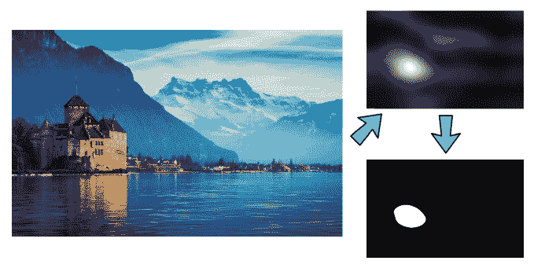
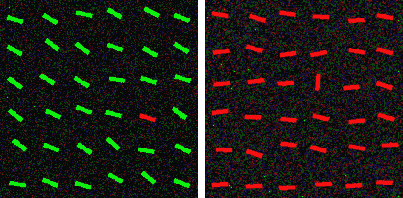
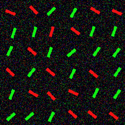
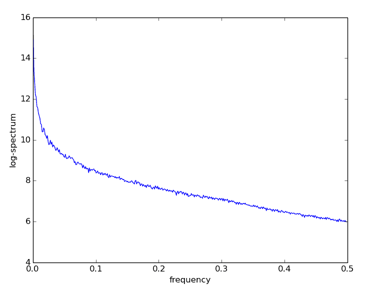
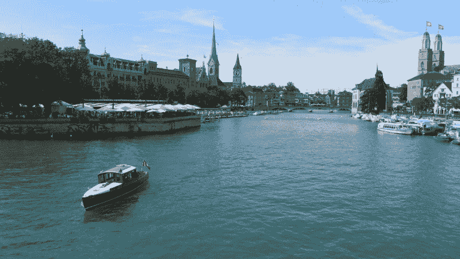
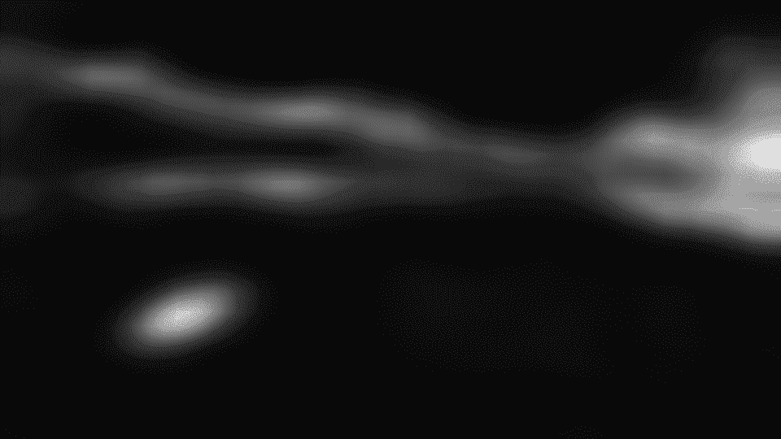
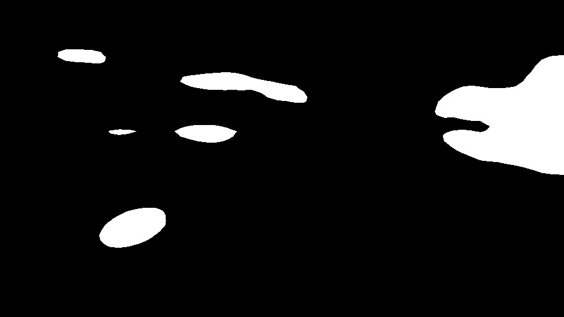
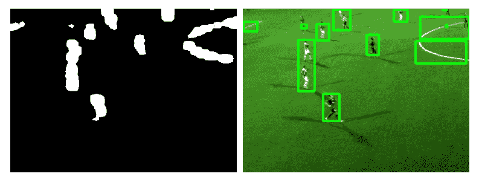
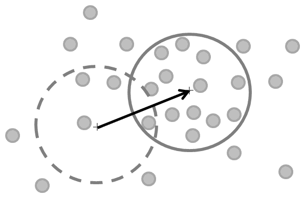
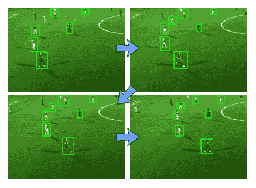

# 第六章：跟踪视觉显著性物体

本章的目标是在视频序列中同时跟踪多个视觉显著性物体。我们不会自己标记视频中的感兴趣物体，而是让算法决定视频帧中哪些区域值得跟踪。

我们之前已经学习了如何在严格控制的情况下检测简单的感兴趣物体（如人手）以及如何从相机运动中推断视觉场景的几何特征。在本章中，我们将探讨通过观察大量帧的**图像统计信息**我们可以了解视觉场景的哪些内容。

在本章中，我们将涵盖以下主题：

+   规划应用

+   设置应用

+   映射视觉显著性

+   理解均值漂移跟踪

+   了解 OpenCV 跟踪 API

+   整合所有内容

通过分析自然图像的**傅里叶频谱**，我们将构建一个**显著性图**，它允许我们将图像中某些统计上有趣的区域标记为（潜在的或实际的）**原型物体**。然后我们将所有原型物体的位置输入到一个**均值漂移跟踪器**中，这将使我们能够跟踪物体从一个帧移动到下一个帧的位置。

# 开始使用

本章使用**OpenCV 4.1.0**，以及额外的包**NumPy**([`www.numpy.org`](http://www.numpy.org))、**wxPython 2.8**([`www.wxpython.org/download.php`](http://www.wxpython.org/download.php))和**matplotlib**([`www.matplotlib.org/downloads.html`](http://www.matplotlib.org/downloads.html))。尽管本章中提出的部分算法已被添加到**OpenCV 3.0.0**版本的可选显著性模块中，但目前还没有 Python API，因此我们将编写自己的代码。

本章的代码可以在书的 GitHub 仓库中找到，仓库地址为[`github.com/PacktPublishing/OpenCV-4-with-Python-Blueprints-Second-Edition/tree/master/chapter6`](https://github.com/PacktPublishing/OpenCV-4-with-Python-Blueprints-Second-Edition/tree/master/chapter6)。

# 理解视觉显著性

**视觉显著性**是来自**认知心理学**的一个术语，试图描述某些物体或项目的视觉质量，使其能够立即吸引我们的注意力。我们的大脑不断引导我们的目光向视觉场景中的**重要**区域，并在一段时间内跟踪它们，使我们能够快速扫描周围环境中的有趣物体和事件，同时忽略不那么重要的部分。

下面是一个常规 RGB 图像及其转换为**显著性图**的示例，其中统计上有趣的**突出**区域显得明亮，而其他区域则显得暗淡：



**傅里叶分析**将使我们能够对自然图像统计有一个一般性的了解，这将帮助我们构建一个关于一般图像背景外观的模型。通过将背景模型与特定图像帧进行比较和对比，我们可以定位图像中突出其周围环境的子区域（如图中所示的前一个屏幕截图）。理想情况下，这些子区域对应于当我们观察图像时，往往会立即吸引我们注意力的图像块。

传统模型可能会尝试将特定的特征与每个目标关联起来（类似于我们在第三章中介绍的特征匹配方法，*通过特征匹配和透视变换查找对象*），这将把问题转化为检测特定类别对象的问题。然而，这些模型需要手动标记和训练。但如果要跟踪的特征或对象的数量是未知的呢？

相反，我们将尝试模仿大脑的工作方式，即调整我们的算法以适应自然图像的统计特性，这样我们就可以立即定位视觉场景中“吸引我们的注意力”的图案或子区域（即偏离这些统计规律的模式）并将它们标记出来进行进一步检查。结果是这样一个算法，它可以适用于场景中任何数量的原型对象，例如跟踪足球场上的所有球员。请参考以下一系列屏幕截图以查看其效果：


正如我们在这四个屏幕截图中所看到的，一旦定位到图像中所有潜在的“有趣”的块，我们可以使用一种简单而有效的方法——**对象** **均值漂移跟踪**——来跟踪它们在多个帧中的运动。由于场景中可能存在多个可能随时间改变外观的原型对象，我们需要能够区分它们并跟踪所有这些对象。

# 规划应用程序

要构建应用程序，我们需要结合之前讨论的两个主要功能——显著性图和对象跟踪**。**最终的应用程序将把视频序列的每个 RGB 帧转换为显著性图，提取所有有趣的原始对象，并将它们输入到均值漂移跟踪算法中。为此，我们需要以下组件：

+   `main`: 这是主函数例程（在`chapter6.py`中），用于启动应用程序。

+   `saliency.py`: 这是一个模块，用于从 RGB 彩色图像生成显著性图和原型对象图。它包括以下功能：

    +   `get_saliency_map`: 这是一个函数，用于将 RGB 彩色图像转换为显著性图。

    +   `get_proto_objects_map`: 这是一个函数，用于将显著性图转换为包含所有原型对象的二值掩码。

    +   `plot_power_density`: 这是一个函数，用于显示 RGB 彩色图像的二维功率密度，这有助于理解傅里叶变换。

    +   `plot_power_spectrum`：这是一个用于显示 RGB 颜色图像的径向平均功率谱的函数，有助于理解自然图像统计信息。

    +   `MultiObjectTracker`：这是一个使用均值漂移跟踪在视频中跟踪多个对象的类。它包括以下公共方法：

        +   `MultiObjectTracker.advance_frame`：这是一个用于更新新帧跟踪信息的方法，它使用当前帧的显著性图上的均值漂移算法来更新从前一帧到当前帧的框的位置。

        +   `MultiObjectTracker.draw_good_boxes`：这是一个用于展示当前帧跟踪结果的方法。

在以下章节中，我们将详细讨论这些步骤。

# 设置应用程序

为了运行我们的应用程序，我们需要执行`main`函数，该函数读取视频流的一帧，生成显著性图，提取原对象的定位，并从一帧跟踪到下一帧。

让我们在下一节学习`main`函数的常规操作。

# 实现主函数

主要流程由`chapter6.py`中的`main`函数处理，该函数实例化跟踪器（`MultipleObjectTracker`）并打开显示场地上足球运动员数量的视频文件：

```py
import cv2
from os import path

from saliency import get_saliency_map, get_proto_objects_map
from tracking import MultipleObjectsTracker

def main(video_file='soccer.avi', roi=((140, 100), (500, 600))):
    if not path.isfile(video_file):
        print(f'File "{video_file}" does not exist.')
        raise SystemExit

    # open video file
    video = cv2.VideoCapture(video_file)

    # initialize tracker
    mot = MultipleObjectsTracker()
```

函数将逐帧读取视频并提取一些有意义的感兴趣区域（用于说明目的）：

```py
    while True: 
        success, img = video.read() 
        if success: 
            if roi: 
                # grab some meaningful ROI 
                img = img[roi[0][0]:roi[1][0], 
                     roi[0][1]:roi[1][1]] 
```

然后，感兴趣区域将被传递到一个函数，该函数将生成该区域的显著性图。然后，基于显著性图生成*有趣的*原对象，最后将它们与感兴趣区域一起输入到跟踪器中。跟踪器的输出是带有边界框的标注输入区域，如前一组截图所示：

```py
        saliency = get_saliency_map(img, use_numpy_fft=False,
                                    gauss_kernel=(3, 3))
        objects = get_proto_objects_map(saliency, use_otsu=False)
        cv2.imshow('tracker', mot.advance_frame(img, objects))
```

应用程序将运行到视频文件结束或用户按下`q`键为止：

```py
if cv2.waitKey(100) & 0xFF == ord('q'): 
    break 
```

在下一节中，我们将了解`MultiObjectTracker`类。

# 理解`MultiObjectTracker`类

跟踪器类的构造函数很简单。它所做的只是设置均值漂移跟踪的终止条件，并存储后续计算步骤中要考虑的最小轮廓面积（`min_area`）和按对象大小归一化的最小平均速度（`min_speed_per_pix`）的条件：

```py
    def __init__(self, min_object_area: int = 400,
                 min_speed_per_pix: float = 0.02):
        self.object_boxes = []
        self.min_object_area = min_object_area
        self.min_speed_per_pix = min_speed_per_pix
        self.num_frame_tracked = 0
        # Setup the termination criteria, either 100 iteration or move by at
        # least 1 pt
        self.term_crit = (cv2.TERM_CRITERIA_EPS | cv2.TERM_CRITERIA_COUNT,
                          5, 1)
```

从那时起，用户可以调用`advance_frame`方法向跟踪器提供新的帧。

然而，在我们充分利用所有这些功能之前，我们需要了解图像统计信息以及如何生成显著性图。

# 映射视觉显著性

如本章前面所述，视觉显著性试图描述某些物体或项目的视觉质量，使它们能够吸引我们的即时注意力。我们的大脑不断引导我们的目光向视觉场景中的**重要**区域，就像在视觉世界的不同子区域上打闪光灯一样，使我们能够快速扫描周围环境中的有趣物体和事件，同时忽略不那么重要的部分。

人们认为，这是一种进化策略，用来应对在视觉丰富的环境中生活所带来的持续**信息过载**。例如，如果你在丛林中随意散步，你希望在欣赏你面前蝴蝶翅膀上复杂的颜色图案之前，就能注意到你左边灌木丛中的攻击性老虎。因此，视觉显著的物体具有从其周围**跳出**的显著特性，就像以下截图中的目标条形：



识别使这些目标跳出的视觉质量可能并不总是微不足道的。如果你在彩色图像中查看左侧图像，你可能会立即注意到图像中唯一的红色条形。然而，如果你以灰度查看这张图像，目标条形可能有点难以找到（它是从上往下数的第四条，从左往右数的第五条）。

与颜色显著性类似，在右侧的图像中有一个视觉显著的条形。尽管左侧图像中的目标条形具有独特的颜色，而右侧图像中的目标条形具有独特的方向，但我们把这两个特征结合起来，突然独特的目标条形就不再那么突出：



在前面的显示中，又有一条独特的条形，与其他所有条形都不同。然而，由于干扰物品的设计方式，几乎没有显著性来引导你找到目标条形。相反，你发现自己似乎在随机扫描图像，寻找有趣的东西。（*提示*：目标是图像中唯一的红色且几乎垂直的条形，从上往下数的第二行，从左往右数的第三列。）

*你可能会问，这与计算机视觉有什么关系？实际上，关系很大。人工视觉系统像我们一样，会遭受信息过载的问题，只不过它们对世界的了解甚至比我们还少。* 如果我们能从生物学中提取一些见解，并用它们来教我们的算法关于世界的一些知识呢？

想象一下你车上的仪表盘摄像头，它会自动聚焦于最相关的交通标志。想象一下作为野生动物观察站一部分的监控摄像头，它会自动检测和跟踪**著名害羞的鸭嘴兽**的出现，但会忽略其他一切。*我们如何教会算法什么是重要的，什么不是？我们如何让那只鸭嘴兽“跳出”来？*

因此，我们进入了**傅里叶分析域**。

# 学习傅里叶分析

要找到图像的视觉显著子区域，我们需要查看其**频谱**。到目前为止，我们一直在**空间域**处理我们的图像和视频帧，即通过分析像素或研究图像强度在不同图像子区域中的变化。然而，图像也可以在**频域**中表示，即通过分析像素频率或研究像素在图像中出现的频率和周期性。

通过应用**傅里叶变换**，可以将图像从空间域转换到频域。在频域中，我们不再以图像坐标（*x*，*y*）为思考单位。相反，我们的目标是找到图像的频谱。傅里叶的激进想法基本上可以归结为以下问题——*如果任何信号或图像可以被转换成一系列圆形路径（也称为**谐波**），会怎样？*

例如，想想彩虹。*美丽，不是吗？*在彩虹中，由许多不同颜色或光谱部分组成的白光被分散到其频谱中。在这里，当光线穿过雨滴（类似于白光穿过玻璃棱镜）时，太阳光的颜色频谱被暴露出来。傅里叶变换的目标就是要做到同样的事情——恢复阳光中包含的所有不同频谱部分。

对于任意图像，也可以实现类似的效果。与彩虹不同，彩虹中的频率对应于电磁频率，而在图像中，我们考虑的是空间频率，即像素值的空间周期性。在一个监狱牢房的图像中，你可以将空间频率视为（两个相邻监狱栏杆之间的）距离的倒数。

从这种视角转变中获得的见解非常强大。不深入细节，我们只需指出，傅里叶频谱既包含幅度也包含相位。幅度描述了图像中不同频率的数量/数量，而相位则讨论这些频率的空间位置。下面的截图显示了左边的自然图像和右边的相应的傅里叶幅度频谱（灰度版本的频谱）：


右侧的幅度频谱告诉我们，在左侧图像的灰度版本中，哪些频率成分是最突出的（明亮）的。频谱被调整，使得图像的中心对应于*x*和*y*方向上的零频率。你越靠近图像的边缘，频率就越高。这个特定的频谱告诉我们，左侧的图像中有许多低频成分（集中在图像的中心附近）。

在 OpenCV 中，这个转换可以通过**离散傅里叶变换**（**DFT**）来实现。让我们构建一个执行这个任务的函数。它包括以下步骤：

1.  首先，如果需要，将图像转换为灰度图。该函数接受灰度和 RGB 彩色图像，因此我们需要确保我们在单通道图像上操作：

```py
def calc_magnitude_spectrum(img: np.ndarray):
    if len(img.shape) > 2:
        img = cv2.cvtColor(img, cv2.COLOR_BGR2GRAY)
```

1.  ****我们调整图像到最佳尺寸。结果发现，DFT 的性能取决于图像大小。对于是 2 的倍数的图像大小，它通常运行得最快。因此，通常一个好的做法是在图像周围填充 0：

```py
    rows, cols = img.shape
    nrows = cv2.getOptimalDFTSize(rows)
    ncols = cv2.getOptimalDFTSize(cols)
    frame = cv2.copyMakeBorder(img, 0, ncols-cols, 0, nrows-rows,
                               cv2.BORDER_CONSTANT, value=0)
```

1.  然后我们应用 DFT。这是一个 NumPy 中的单个函数调用。结果是复数的二维矩阵：

```py
img_dft = np.fft.fft2(img) 
```

1.  然后，将实部和虚部值转换为幅度。一个复数有一个实部和虚部（虚数）部分。为了提取幅度，我们取绝对值：

```py
magn = np.abs(img_dft) 
```

1.  然后我们切换到对数尺度。结果发现，傅里叶系数的动态范围通常太大，无法在屏幕上显示。我们有一些低值和高值的变化，我们无法这样观察。因此，高值将全部显示为白色点，低值则显示为黑色点。

为了使用灰度值进行可视化，我们可以将我们的线性尺度转换为对数尺度：

```py
log_magn = np.log10(magn)
```

1.  然后我们进行象限平移，以便将频谱中心对准图像。这使得视觉检查幅度`频谱`更容易：

```py
spectrum = np.fft.fftshift(log_magn) 
```

1.  我们`返回`结果以进行绘图：

```py
return spectrum/np.max(spectrum)*255 
```

结果可以用`pyplot`绘制。

现在我们已经了解了图像的傅里叶频谱以及如何计算它，让我们在下一节分析自然场景的统计信息。

# 理解自然场景的统计信息

人类的大脑很久以前就找到了如何专注于视觉上显著对象的方法。我们生活的自然世界有一些统计规律性，这使得它独特地**自然**，而不是棋盘图案或随机的公司标志。最常见的一种统计规律性可能是**1/f**定律。它表明自然图像集合的幅度遵循**1/f**分布（如下面的截图所示）。这有时也被称为**尺度不变性**。

一个二维图像的一维功率谱（作为频率的函数）可以用以下`plot_power_spectrum`函数进行可视化。我们可以使用与之前使用的幅度谱相似的配方，但我们必须确保我们正确地将二维频谱折叠到单个轴上：

1.  定义函数并在必要时将图像转换为灰度图（这与之前相同）：

```py
def plot_power_spectrum(frame: np.ndarray, use_numpy_fft=True) -> None:
    if len(frame.shape) > 2:
        frame = cv2.cvtColor(frame, cv2.COLOR_BGR2GRAY)
```

1.  将图像扩展到其最佳尺寸（这与之前相同）：

```py
rows, cols = frame.shape
nrows = cv2.getOptimalDFTSize(rows) 
ncols = cv2.getOptimalDFTSize(cols) 
frame = cv2.copyMakeBorder(frame, 0, ncols-cols, 0, 
     nrows-rows, cv2.BORDER_CONSTANT, value = 0)
```

1.  然后我们应用 DFT 并得到对数频谱。这里我们给用户一个选项（通过`use_numpy_fft`标志）来选择使用 NumPy 的或 OpenCV 的傅里叶工具：

```py
    if use_numpy_fft:
        img_dft = np.fft.fft2(frame)
        spectrum = np.log10(np.real(np.abs(img_dft))**2)
    else:
        img_dft = cv2.dft(np.float32(frame), flags=cv2.DFT_COMPLEX_OUTPUT)
        spectrum = np.log10(img_dft[:, :, 0]**2 + img_dft[:, :, 1]**2)
```

1.  我们接下来进行径向平均。这是比较棘手的部分。简单地沿 *x* 或 *y* 方向平均二维频谱是错误的。我们感兴趣的是作为频率函数的频谱，与精确的取向无关。这有时也被称为**径向平均功率谱**（**RAPS**）。

这可以通过从图像中心开始，向所有可能的（径向）方向求和所有频率的幅度来实现，从某个频率 `r` 到 `r+dr`。我们使用 NumPy 的直方图函数的 binning 功能来求和数字，并将它们累积在 `histo` 变量中：

```py
L = max(frame.shape) 
freqs = np.fft.fftfreq(L)[:L/2] 
dists = np.sqrt(np.fft.fftfreq(frame.shape[0])
     [:,np.newaxis]**2 + np.fft.fftfreq
         (frame.shape[1])**2) 
dcount = np.histogram(dists.ravel(), bins=freqs)[0] 
histo, bins = np.histogram(dists.ravel(), bins=freqs,
     weights=spectrum.ravel())
```

1.  我们接下来绘制结果，最后，我们可以绘制 `histo` 中的累积数字，但不要忘记用 bin 大小（`dcount`）进行归一化：

```py
centers = (bins[:-1] + bins[1:]) / 2 
plt.plot(centers, histo/dcount) 
plt.xlabel('frequency') 
plt.ylabel('log-spectrum') 
plt.show() 
```

结果是一个与频率成反比的函数。如果你想绝对确定 *1/f* 属性，你可以对所有的 *x* 值取 `np.log10`，并确保曲线以大致线性的方式下降。在线性 *x* 轴和对数 *y* 轴上，图表看起来如下截图所示：



这个特性非常显著。它表明，如果我们平均所有自然场景的图像的频谱（当然忽略所有使用花哨图像滤镜拍摄的图像），我们会得到一个看起来非常像前面图像的曲线。

但是，回到平静小船在 **Limmat** 河上的图像，*单张图像又如何呢？* 我们刚刚看了这张图像的功率谱，并见证了 *1/f* 属性。*我们如何利用我们对自然图像统计的了解来告诉算法不要盯着左边的树看，而是专注于在水中缓缓行驶的船呢？* 以下照片描绘了 Limmat 河上的一个场景：



这是我们真正意识到显著性真正含义的地方。

让我们看看如何在下一节中用频谱残差方法生成显著性图。

# 使用频谱残差方法生成显著性图

我们在图像中需要注意的事情不是遵循 *1/f* 法则的图像块，而是突出在平滑曲线之外的图像块，换句话说，是统计异常。这些异常被称为图像的**频谱残差**，对应于图像中可能*有趣*的块（或原对象）。显示这些统计异常为亮点的地图称为**显著性图**。

这里描述的频谱残差方法基于 Xiaodi Hou 和 Liqing Zhang 于 2007 年发表的原科学出版物文章《显著性检测：频谱残差方法》（Saliency Detection: A Spectral Residual Approach），IEEE Transactions on Computer Vision and Pattern Recognition (CVPR)，第 1-8 页，DOI：10.1109/CVPR.2007.383267。

单个通道的显著性图可以通过`_get_channel_sal_magn`函数使用以下过程生成。为了基于频谱残差方法生成显著性图，我们需要分别处理输入图像的每个通道（对于灰度输入图像是单个通道，对于 RGB 输入图像是三个单独的通道）：

1.  通过再次使用 NumPy 的`fft`模块或 OpenCV 功能来计算图像的（幅度和相位）傅里叶频谱：

```py
def _calc_channel_sal_magn(channel: np.ndarray,
                           use_numpy_fft: bool = True) -> np.ndarray:
    if use_numpy_fft:
        img_dft = np.fft.fft2(channel)
        magnitude, angle = cv2.cartToPolar(np.real(img_dft),
                                           np.imag(img_dft))
    else:
        img_dft = cv2.dft(np.float32(channel),
                          flags=cv2.DFT_COMPLEX_OUTPUT)
        magnitude, angle = cv2.cartToPolar(img_dft[:, :, 0],
                                           img_dft[:, :, 1])
```

1.  计算傅里叶频谱的对数幅度。我们将幅度下限裁剪到`1e-9`，以防止在计算对数时除以 0：

```py
log_ampl = np.log10(magnitude.clip(min=1e-9)) 
```

1.  通过与局部平均滤波器卷积来近似典型自然图像的平均光谱：

```py
log_ampl_blur = cv2.blur(log_amlp, (3, 3)) 
```

1.  计算频谱残差。频谱残差主要包含场景的非平凡（或意外）部分：

```py
residual = np.exp(log_ampl - log_ampl_blur)
```

1.  通过使用逆傅里叶变换来计算显著性图，再次通过 NumPy 中的`fft`模块或 OpenCV：

```py
    if use_numpy_fft:
        real_part, imag_part = cv2.polarToCart(residual, angle)
        img_combined = np.fft.ifft2(real_part + 1j * imag_part)
        magnitude, _ = cv2.cartToPolar(np.real(img_combined),
                                       np.imag(img_combined))
    else:
        img_dft[:, :, 0], img_dft[:, :, 1] =%MCEPASTEBIN% cv2.polarToCart(residual,
                                                             angle)
        img_combined = cv2.idft(img_dft)
        magnitude, _ = cv2.cartToPolar(img_combined[:, :, 0],
                                       img_combined[:, :, 1])

    return magnitude
```

单通道显著性图（幅度）由`get_saliency_map`使用，对于输入图像的所有通道重复此过程。如果输入图像是灰度的，我们基本上就完成了：

```py
def get_saliency_map(frame: np.ndarray,
                     small_shape: Tuple[int] = (64, 64),
                     gauss_kernel: Tuple[int] = (5, 5),
                     use_numpy_fft: bool = True) -> np.ndarray:
    frame_small = cv2.resize(frame, small_shape)
    if len(frame.shape) == 2:
        # single channelsmall_shape[1::-1]
        sal = _calc_channel_sal_magn(frame, use_numpy_fft)

```

然而，如果输入图像具有多个通道，例如 RGB 彩色图像，我们需要分别考虑每个通道：

```py
    else:
        sal = np.zeros_like(frame_small).astype(np.float32)
        for c in range(frame_small.shape[2]):
            small = frame_small[:, :, c]
            sal[:, :, c] = _calc_channel_sal_magn(small, use_numpy_fft)
```

多通道图像的整体显著性由平均整体通道确定：

```py
sal = np.mean(sal, 2) 
```

最后，我们需要应用一些后处理，例如可选的模糊阶段，以使结果看起来更平滑：

```py
    if gauss_kernel is not None:
        sal = cv2.GaussianBlur(sal, gauss_kernel, sigmaX=8, sigmaY=0)
```

此外，我们还需要将`sal`中的值平方，以突出显示作者在原始论文中概述的高显著性区域。为了显示图像，我们将它缩放回原始分辨率并归一化值，使得最大值为 1。

接下来，将`sal`中的值归一化，使得最大值为 1，然后平方以突出显示作者在原始论文中概述的高显著性区域，最后将其缩放回原始分辨率以显示图像：

```py
        sal = sal**2 
        sal = np.float32(sal)/np.max(sal) 
        sal = cv2.resize(sal, self.frame_orig.shape[1::-1]) 
    sal /= np.max(sal)
    return cv2.resize(sal ** 2, frame.shape[1::-1])
```

生成的显著性图看起来如下：



现在，我们可以清楚地看到水中的船（在左下角），它看起来是图像中最显著的子区域之一。还有其他显著的区域，例如右边的**格罗斯穆斯特**（*你猜到这个城市了吗？*）。

顺便说一句，这两个区域是图像中最显著的，这似乎是明显的、无可争议的证据，表明算法意识到苏黎世市中心教堂塔楼的数量是荒谬的，有效地阻止了它们被标记为"*显著的*"。

在下一节中，我们将看到如何检测场景中的原型对象。

# 在场景中检测原型对象

在某种意义上，显著度图已经是一个原型对象的显式表示，因为它只包含图像的**有趣**部分。因此，现在我们已经完成了所有艰苦的工作，剩下的工作就是将显著度图进行阈值处理，以获得原型对象图。

这里唯一要考虑的开放参数是阈值。设置阈值过低会导致将许多区域标记为原型对象，包括可能不包含任何有趣内容的区域（误报）。另一方面，设置阈值过高会忽略图像中的大多数显著区域，并可能使我们没有任何原型对象。

原始光谱残差论文的作者选择仅将那些显著度大于图像平均显著度三倍的图像区域标记为原型对象。我们给用户提供了选择，要么实现这个阈值，要么通过将输入标志`use_otsu`设置为`True`来使用**Otsu 阈值**：

```py
def get_proto_objects_map(saliency: np.ndarray, use_otsu=True) -> np.ndarray: 
```

然后，我们将显著度转换为`uint8`精度，以便可以传递给`cv2.threshold`，设置阈值参数，最后应用阈值并返回原型对象：

```py
    saliency = np.uint8(saliency * 255)
    if use_otsu:
        thresh_type = cv2.THRESH_OTSU
        # For threshold value, simply pass zero.
        thresh_value = 0
    else:
        thresh_type = cv2.THRESH_BINARY
        thresh_value = np.mean(saliency) * 3

    _, img_objects = cv2.threshold(saliency,
                                   thresh_value, 255, thresh_type)
    return img_objects
```

结果原型对象掩码看起来如下：



原型对象掩码随后作为跟踪算法的输入，我们将在下一节中看到。

# 理解平均漂移跟踪

到目前为止，我们使用了之前讨论过的显著性检测器来找到原型对象的边界框。我们可以简单地将算法应用于视频序列的每一帧，并得到对象位置的不错概念。然而，丢失的是对应信息。

想象一个繁忙场景的视频序列，比如城市中心或体育场的场景。尽管显著度图可以突出显示记录视频每一帧中的所有原型对象，但算法将无法在上一帧的原型对象和当前帧的原型对象之间建立对应关系。

此外，原型对象映射可能包含一些**误报**，我们需要一种方法来选择最可能对应于真实世界对象的框。以下例子中可以注意到这些**误报**：



注意，从原型对象映射中提取的边界框在前面的例子中至少犯了三个错误——它没有突出显示一个球员（左上角），将两个球员合并到同一个边界框中，并突出显示了一些额外的可能不是有趣（尽管视觉上显著）的对象。为了改进这些结果并保持对应关系，我们想要利用跟踪算法。

为了解决对应问题，我们可以使用之前学过的方法，例如特征匹配和光流，但在这个情况下，我们将使用平均漂移算法进行跟踪。

均值漂移是一种简单但非常有效的追踪任意对象的技巧。均值漂移背后的直觉是将感兴趣区域（例如，我们想要追踪的对象的边界框）中的像素视为从描述目标的最佳概率密度函数中采样的。

例如，考虑以下图像：



在这里，小的灰色点代表概率分布的样本。假设点越近，它们彼此越相似。直观地说，均值漂移试图做的是找到这个景观中最密集的区域，并在其周围画一个圆。算法可能最初将圆的中心放在景观中完全不密集的区域（虚线圆）。随着时间的推移，它将逐渐移动到最密集的区域（实线圆）并锚定在那里。

如果我们设计景观使其比点更有意义，我们可以使用均值漂移追踪来找到场景中的感兴趣对象。例如，如果我们为每个点分配一个值，表示对象的颜色直方图与相同大小的图像邻域的颜色直方图之间的对应关系，我们就可以在生成的点上使用均值漂移来追踪对象。通常与均值漂移追踪相关的是后一种方法。在我们的情况下，我们将简单地使用显著性图本身。

均值漂移有许多应用（如聚类或寻找概率密度函数的模态），但它也非常适合目标追踪。在 OpenCV 中，该算法在`cv2.meanShift`中实现，接受一个二维数组（例如，一个灰度图像，如显著性图）和窗口（在我们的情况下，我们使用对象的边界框）作为输入。它根据均值漂移算法返回窗口的新位置，如下所示：

1.  它固定窗口位置。

1.  它计算窗口内数据的平均值。

1.  它将窗口移动到平均值并重复，直到收敛。我们可以通过指定终止条件来控制迭代方法的长度和精度。

接下来，让我们看看算法是如何追踪并在视觉上映射（使用边界框）场上的球员的。

# 自动追踪足球场上的所有球员

我们的目标是将显著性检测器与均值漂移追踪相结合，以自动追踪足球场上的所有球员。显著性检测器识别出的原型对象将作为均值漂移追踪器的输入。具体来说，我们将关注来自 Alfheim 数据集的视频序列，该数据集可以从[`home.ifi.uio.no/paalh/dataset/alfheim/`](http://home.ifi.uio.no/paalh/dataset/alfheim/)免费获取。

将两个算法（显著性图和均值漂移跟踪）结合的原因是为了在不同帧之间保持对象之间的对应信息，以及去除一些误报并提高检测对象的准确性。

之前介绍过的`MultiObjectTracker`类及其`advance_frame`方法完成了这项艰苦的工作。每当有新帧到达时，就会调用`advance_frame`方法，并接受原型对象和显著性作为输入：

```py
    def advance_frame(self,
                      frame: np.ndarray,
                      proto_objects_map: np.ndarray,
                      saliency: np.ndarray) -> np.ndarray:
```

以下步骤包含在本方法中：

1.  从`proto_objects_map`创建轮廓，并找到面积大于`min_object_area`的所有轮廓的边界矩形。后者是使用均值漂移算法进行跟踪的候选边界框：

```py
        object_contours, _ = cv2.findContours(proto_objects_map, 1, 2)
        object_boxes = [cv2.boundingRect(contour)
                        for contour in object_contours
                        if cv2.contourArea(contour) > self.min_object_area]
```

1.  候选框可能不是在整个帧中跟踪的最佳选择。例如，在这种情况下，如果两个玩家彼此靠近，它们将导致一个单一的对象框。我们需要某种方法来选择最佳的框。我们可以考虑一些算法，该算法将分析从前一帧跟踪的框与从显著性获得的框结合起来，并推断出最可能的框。

但在这里我们将以简单的方式进行——如果显著性图中的框数量没有增加，则使用当前帧的显著性图跟踪从前一帧到当前帧的框，这些框被保存为`objcect_boxes`：

```py
        if len(self.object_boxes) >= len(object_boxes):
            # Continue tracking with meanshift if number of salient objects
            # didn't increase
            object_boxes = [cv2.meanShift(saliency, box, self.term_crit)[1]
                            for box in self.object_boxes]
            self.num_frame_tracked += 1
```

1.  如果它确实增加了，我们将重置跟踪信息，即对象被跟踪的帧数以及对象初始中心的计算：

```py
        else:
            # Otherwise restart tracking
            self.num_frame_tracked = 0
            self.object_initial_centers = [
                (x + w / 2, y + h / 2) for (x, y, w, h) in object_boxes]
```

1.  最后，保存框并将在帧上绘制跟踪信息：

```py
self.object_boxes = object_boxes
return self.draw_good_boxes(copy.deepcopy(frame))
```

我们对移动的框感兴趣。为此，我们计算每个框从跟踪开始时的初始位置的位移。我们假设在帧上出现更大的对象应该移动得更快，因此我们在框宽度上归一化位移：

```py
    def draw_good_boxes(self, frame: np.ndarray) -> np.ndarray:
        # Find total displacement length for each object
        # and normalize by object size
        displacements = [((x + w / 2 - cx)**2 + (y + w / 2 - cy)**2)**0.5 / w
                         for (x, y, w, h), (cx, cy)
                         in zip(self.object_boxes, self.object_initial_centers)]
```

接下来，我们绘制框及其数量，这些框的平均每帧位移（或速度）大于我们在跟踪器初始化时指定的值。为了不在跟踪的第一帧上除以 0，我们添加了一个小的数值：

```py
        for (x, y, w, h), displacement, i in zip(
                self.object_boxes, displacements, itertools.count()):
            # Draw only those which have some avarage speed
            if displacement / (self.num_frame_tracked + 0.01) > self.min_speed_per_pix:
                cv2.rectangle(frame, (x, y), (x + w, y + h),
                              (0, 255, 0), 2)
                cv2.putText(frame, str(i), (x, y),
                            cv2.FONT_HERSHEY_SIMPLEX, 0.5, (255, 255, 255))
        return frame
```

现在你已经理解了如何使用均值漂移算法实现跟踪。这只是众多跟踪方法中的一种。当感兴趣的对象直接朝向相机快速改变大小时，均值漂移跟踪可能会特别失败。

对于此类情况，OpenCV 有一个不同的算法，`cv2.CamShift`，它还考虑了旋转和尺寸的变化，其中**CAMShift**代表**连续自适应均值漂移**。此外，OpenCV 提供了一系列可用的跟踪器，可以直接使用，被称为**OpenCV 跟踪 API**。让我们在下一节中了解它们。

# 了解 OpenCV 跟踪 API

我们已经将均值漂移算法应用于显著性图以跟踪显著对象。当然，世界上并非所有对象都是显著的，因此我们不能使用那种方法来跟踪任何对象。如前所述，我们还可以结合使用 HSV 直方图和均值漂移算法来跟踪对象。后者不需要显著性图——如果选择了区域，那种方法将尝试在后续帧中跟踪所选对象。

在本节中，我们将创建一个脚本，该脚本能够使用 OpenCV 中可用的跟踪算法在整个视频中跟踪一个对象。所有这些算法都有相同的 API，并统称为 OpenCV 跟踪 API。这些算法跟踪单个对象——一旦向算法提供了初始边界框，它将尝试在整个后续帧中维持该框的新位置。当然，也可以通过为每个对象创建一个新的跟踪器来跟踪场景中的多个对象。

首先，我们导入我们将使用的库并定义我们的常量：

```py
import argparse
import time

import cv2
import numpy as np

# Define Constants
FONT = cv2.FONT_HERSHEY_SIMPLEX
GREEN = (20, 200, 20)
RED = (20, 20, 255)
```

OpenCV 目前有八个内置跟踪器。我们定义了一个所有跟踪器构造函数的映射：

```py
trackers = {
    'BOOSTING': cv2.TrackerBoosting_create,
    'MIL': cv2.TrackerMIL_create,
    'KCF': cv2.TrackerKCF_create,
    'TLD': cv2.TrackerTLD_create,
    'MEDIANFLOW': cv2.TrackerMedianFlow_create,
    'GOTURN': cv2.TrackerGOTURN_create,
    'MOSSE': cv2.TrackerMOSSE_create,
    'CSRT': cv2.TrackerCSRT_create
}
```

我们的脚本将能够接受跟踪器的名称和视频的路径作为参数。为了实现这一点，我们创建参数，设置它们的默认值，并使用之前导入的`argparse`模块解析它们：

```py
# Parse arguments
parser = argparse.ArgumentParser(description='Tracking API demo.')
parser.add_argument(
    '--tracker',
    default="KCF",
    help=f"One of {trackers.keys()}")
parser.add_argument(
    '--video',
    help="Video file to use",
    default="videos/test.mp4")
args = parser.parse_args()
```

然后，我们确保存在这样的跟踪器，并尝试从指定的视频中读取第一帧。

现在我们已经设置了脚本并可以接受参数，下一步要做的是实例化跟踪器：

1.  首先，使脚本不区分大小写并检查传递的跟踪器是否存在是一个好主意：

```py
tracker_name = args.tracker.upper()
assert tracker_name in trackers, f"Tracker should be one of {trackers.keys()}"
```

1.  打开视频并读取第一`帧`。然后，如果无法读取视频，则中断脚本：

```py
video = cv2.VideoCapture(args.video)
assert video.isOpened(), "Could not open video"
ok, frame = video.read()
assert ok, "Video file is not readable"
```

1.  选择一个感兴趣的区域（使用边界框）以在整个视频中跟踪。OpenCV 为此提供了一个基于用户界面的实现：

```py
bbox = cv2.selectROI(frame, False)
```

一旦调用此方法，将出现一个界面，您可以在其中选择一个框。一旦按下*Enter*键，就会返回所选框的坐标。

1.  使用第一帧和选定的边界框启动跟踪器：

```py
tracker = trackers[tracker_name]()
tracker.init(frame, bbox)
```

现在我们有一个跟踪器的实例，它已经使用第一帧和选定的感兴趣边界框启动。我们使用下一帧更新跟踪器以找到对象在边界框中的新位置。我们还使用`time`模块估计所选跟踪算法的**每秒帧数**（**FPS**）：

```py
for ok, frame in iter(video.read, (False, None)): 
    # Time in seconds
    start_time = time.time()
    # Update tracker
    ok, bbox = tracker.update(frame)
    # Calcurlate FPS
    fps = 1 / (time.time() - start_time)
```

所有计算都在这一点上完成。现在我们展示每个迭代的计算结果：

```py
    if ok:
        # Draw bounding box
        x, y, w, h = np.array(bbox, dtype=np.int)
        cv2.rectangle(frame, (x, y), (x + w, y + w), GREEN, 2, 1)
    else:
        # Tracking failure
        cv2.putText(frame, "Tracking failed", (100, 80), FONT, 0.7, RED, 2)
    cv2.putText(frame, f"{tracker_name} Tracker",
                (100, 20), FONT, 0.7, GREEN, 2)
    cv2.putText(frame, f"FPS : {fps:.0f}", (100, 50), FONT, 0.7, GREEN, 2)
    cv2.imshow("Tracking", frame)

    # Exit if ESC pressed
    if cv2.waitKey(1) & 0xff == 27:
        break
```

如果算法返回了边界框，我们在帧上绘制该框，否则，我们说明跟踪失败，这意味着所选算法未能找到当前帧中的对象。此外，我们在帧上键入跟踪器的名称和当前 FPS。

你可以用不同的算法在不同的视频上运行这个脚本，以查看算法的行为，特别是它们如何处理遮挡、快速移动的物体以及外观变化很大的物体。尝试了算法之后，你也可能对阅读算法的原始论文感兴趣，以了解实现细节。

为了使用这些算法跟踪多个物体，OpenCV 有一个方便的包装类，它结合了多个跟踪器实例并同时更新它们。为了使用它，首先，我们创建该类的实例：

```py
multiTracker = cv2.MultiTracker_create()
```

接下来，对于每个感兴趣的边界框，创建一个新的跟踪器（在本例中为 MIL 跟踪器）并将其添加到`multiTracker`对象中：

```py
for bbox in bboxes:
    multiTracker.add(cv2.TrackerMIL_create(), frame, bbox)
```

最后，通过用新帧更新`multiTracker`对象，我们获得了边界框的新位置：

```py
success, boxes = multiTracker.update(frame)
```

作为练习，你可能想要用本章介绍的一种跟踪器替换应用程序中用于跟踪显著物体的 mean-shift 跟踪。为了做到这一点，你可以使用`multiTracker`与其中一个跟踪器一起更新原型物体的边界框位置。

# 整合所有内容

您可以在以下一组屏幕截图中看到我们应用程序的结果：



在整个视频序列中，算法能够通过使用 mean-shift 跟踪识别球员的位置，并逐帧成功跟踪他们。

# 摘要

在本章中，我们探索了一种标记视觉场景中可能*有趣*的物体方法，即使它们的形状和数量未知。我们使用傅里叶分析探索了自然图像统计，并实现了一种从自然场景中提取视觉显著区域的方法。此外，我们将显著性检测器的输出与跟踪算法相结合，以跟踪足球比赛视频序列中未知形状和数量的多个物体。

我们介绍了 OpenCV 中可用的其他更复杂的跟踪算法，你可以用它们替换应用程序中的 mean-shift 跟踪，甚至创建自己的应用程序。当然，也可以用之前研究过的技术，如特征匹配或光流，来替换 mean-shift 跟踪器。

在下一章中，我们将进入迷人的机器学习领域，这将使我们能够构建更强大的物体描述符。具体来说，我们将专注于图像中街道标志的检测（*位置*）和识别（*内容*）。这将使我们能够训练一个分类器，它可以用于您汽车仪表盘上的摄像头，并使我们熟悉机器学习和物体识别的重要概念。

# 数据集归属

"*足球视频和球员位置数据集*," *S. A. Pettersen, D. Johansen, H. Johansen, V. Berg-Johansen, V. R. Gaddam, A. Mortensen, R. Langseth, C. Griwodz, H. K. Stensland,* 和 *P. Halvorsen*，在 2014 年 3 月新加坡国际多媒体系统会议（MMSys）论文集中，第 18-23 页。
