# 第七章：学习识别交通标志

我们之前研究了如何通过关键点和特征来描述对象，以及如何在两个不同图像中找到同一物理对象的对应点。然而，我们之前的方法在识别现实世界中的对象并将它们分配到概念类别方面相当有限。例如，在第二章，*使用 Kinect 深度传感器进行手势识别*中，图像中所需的对象是一只手，并且它必须放置在屏幕中央。如果我们可以去除这些限制会更好吗？

本章的目标是训练一个**多类****分类器**来识别交通标志。在本章中，我们将涵盖以下概念：

+   规划应用

+   监督学习概念的概述

+   理解**德国交通标志识别**基准数据集（**GTSRB**）

+   了解数据集特征提取

+   了解**支持向量机**（**SVMs**）

+   整合所有内容

+   使用神经网络提高结果

在本章中，你将学习如何将机器学习模型应用于现实世界的问题。你将学习如何使用现有的数据集来训练模型。你还将学习如何使用 SVMs 进行多类分类，以及如何使用 OpenCV 提供的机器学习算法进行训练、测试和改进，以实现现实世界任务。

我们将训练一个 SVM 来识别各种交通标志。尽管 SVMs 是二元分类器（也就是说，它们最多可以学习两个类别——正面和负面，动物和非动物等），但它们可以被扩展用于多类分类。为了实现良好的分类性能，我们将探索多个颜色空间，以及**方向梯度直方图**（**HOG**）特征。最终结果将是一个能够从数据集中区分 40 多种不同标志的分类器，具有非常高的准确性。

学习机器学习的基础对于未来当你想要使你的视觉相关应用更加智能时将非常有用。本章将教你机器学习的基础知识，后续章节将在此基础上展开。

# 开始学习

GTSRB 数据集可以从[`benchmark.ini.rub.de/?section=gtsrb&subsection=dataset`](http://benchmark.ini.rub.de/?section=gtsrb&subsection=dataset)（见*数据集归属*部分以获取归属详情）免费获取。

你可以在我们的 GitHub 仓库中找到本章中展示的代码：[`github.com/PacktPublishing/OpenCV-4-with-Python-Blueprints-Second-Edition/tree/master/chapter7`](https://github.com/PacktPublishing/OpenCV-4-with-Python-Blueprints-Second-Edition/tree/master/chapter7)。

# 规划应用

为了得到这样一个多类分类器（可以区分数据集中超过 40 个不同的标志），我们需要执行以下步骤：

1.  **预处理数据集**：我们需要一种方法来加载我们的数据集，提取感兴趣的区域，并将数据分为适当的训练集和测试集。

1.  **提取特征**：原始像素值可能不是数据最有信息量的表示。我们需要一种方法从数据中提取有意义的特征，例如基于不同颜色空间和 HOG 的特征。

1.  **训练分类器**：我们将使用一种*一对多*策略在训练数据上训练多类分类器。

1.  **评估分类器**：我们将通过计算不同的性能指标来评估训练的集成分类器的质量，例如**准确率**、**精确度**和**召回率**。

我们将在接下来的章节中详细讨论所有这些步骤。

最终的应用程序将解析数据集，训练集成分类器，评估其分类性能，并可视化结果。这需要以下组件：

+   `main`：主函数例程（在`chapter7.py`中）是启动应用程序所必需的。

+   `datasets.gtsrb`：这是一个解析 GTSRB 数据集的脚本。此脚本包含以下函数：

    +   `load_data`：此函数用于加载 GTSRB 数据集，提取所需特征，并将数据分为训练集和测试集。

    +   `*_featurize`，`hog_featurize`：这些函数被传递给`load_data`以从数据集中提取所需特征。以下是一些示例函数：

        +   `gray_featurize`：这是一个基于灰度像素值创建特征的函数。

        +   `surf_featurize`：这是一个基于**加速鲁棒特征**（**SURF**）创建特征的函数。

分类性能将基于准确率、精确率和召回率进行判断。以下章节将详细解释所有这些术语。

# 监督学习概念的概述

机器学习的一个重要子领域是**监督学习**。在监督学习中，我们试图从一组标记数据中学习——也就是说，每个数据样本都有一个期望的目标值或真实输出值。这些目标值可能对应于函数的连续输出（例如`y = sin(x)`中的`y`），或者对应于更抽象和离散的类别（例如*猫*或*狗*）。

监督学习算法使用已经标记的训练数据，对其进行分析，并从特征到标签产生一个推断函数，该函数可以用于映射新的示例。理想情况下，推断算法将很好地泛化，并为新数据给出正确的目标值。

我们将监督学习任务分为两类：

+   如果我们处理的是连续输出（例如，降雨的概率），这个过程被称为**回归**。

+   如果我们处理的是离散输出（例如，动物的物种），这个过程被称为**分类**。

在本章中，我们专注于对 GTSRB 数据集图像进行标签的分类问题，我们将使用一种称为 SVM 的算法来推断图像与其标签之间的映射函数。

让我们先了解机器学习是如何赋予**机器**像人类一样**学习**的能力的。这里有一个提示——我们训练它们。

# 训练过程

例如，我们可能想要学习猫和狗的外观。为了使这个任务成为监督学习任务，首先，我们必须将其作为一个具有分类答案或实值答案的问题来提出。

这里有一些示例问题：

+   给定的图片中展示了哪种动物？

+   图片中有没有猫？

+   图片中有没有狗？

之后，我们必须收集一个与其对应正确答案的示例图片——**训练数据**。

然后，我们必须选择一个学习算法（**学习者**）并开始以某种方式调整其参数（**学习算法**），以便当学习者面对训练数据中的数据时，可以给出正确的答案。

我们重复这个过程，直到我们对学习者的性能或**分数**（可能是**准确率**、**精确率**或某些其他**成本函数**）满意为止。如果我们不满意，我们将改变学习者的参数，以随着时间的推移提高分数。

这个过程在以下截图中有概述：

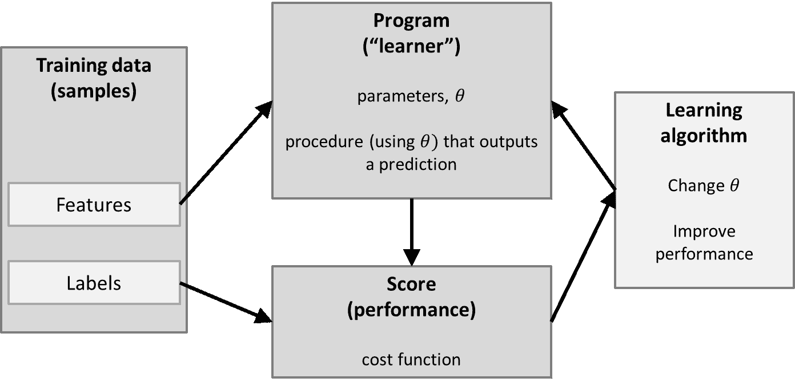

从之前的截图可以看出，训练数据由一组特征表示。对于现实生活中的分类任务，这些特征很少是图像的原始像素值，因为这些往往不能很好地代表数据。通常，寻找最能描述数据的特征的过程是整个学习任务（也称为**特征选择**或**特征工程**）的一个基本部分。

这就是为什么在考虑设置分类器之前，深入研究你正在处理的训练集的统计和外观总是一个好主意。

如你所知，有一个完整的学习者、成本函数和学习算法的动物园。这些构成了学习过程的核心。学习者（例如，线性分类器或 SVM）定义了如何将输入特征转换为评分函数（例如，均方误差），而学习算法（例如，梯度下降）定义了学习者的参数如何随时间变化。

在分类任务中的训练过程也可以被视为寻找一个合适的**决策边界**，这是一个将训练集最好地分成两个子集的线，每个类别一个。例如，考虑只有两个特征（x 和 y 值）以及相应的类别标签（正类（**+**），或负类（**–**））的训练样本。

在训练过程的开始，分类器试图画一条线来区分所有正样本和所有负样本。随着训练的进行，分类器看到了越来越多的数据样本。这些样本被用来更新决策边界，如下面的截图所示：

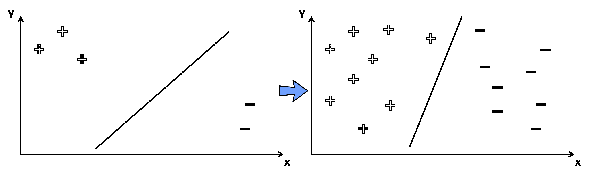

与这个简单的插图相比，SVM 试图在高维空间中找到最优的决策边界，因此决策边界可能比直线更复杂。

我们现在继续了解测试过程。

# 测试过程

为了使训练好的分类器具有任何实际价值，我们需要知道它在应用于从未见过的数据样本（也称为**泛化**）时的表现。为了坚持我们之前展示的例子，我们想知道当我们向它展示一只猫或狗的以前未见过的图片时，分类器预测的是哪个类别。

更普遍地说，我们想知道在以下截图中的问号符号对应哪个类别，基于我们在训练阶段学习到的决策边界：

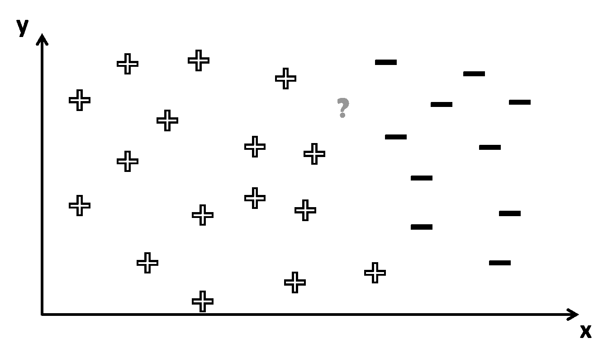

从前面的截图，你可以看到这是一个棘手的问题。如果问号的位置更偏向左边，我们就可以确定相应的类别标签是+。

然而，在这种情况下，有几种方式可以绘制决策边界，使得所有的加号都在它的左边，所有的减号都在它的右边，如下面的截图所示：

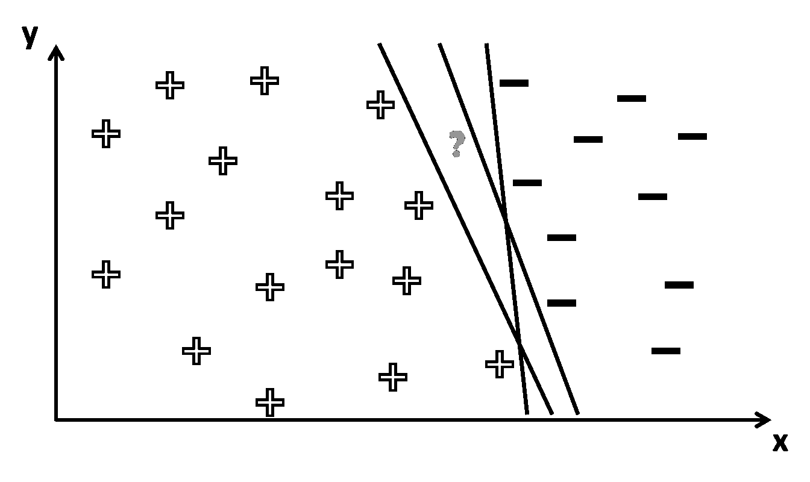

因此，问号的标签取决于在训练期间推导出的确切决策边界。如果前面截图中的问号实际上是减号，那么只有一个决策边界（最左边的）会得到正确的答案。一个常见的问题是训练可能导致一个在训练集上工作得太好的决策边界（也称为**过拟合**），但在应用于未见数据时犯了很多错误。

在那种情况下，学习者很可能会在决策边界上印刻了特定于训练集的细节，而不是揭示关于数据的一般属性，这些属性也可能适用于未见过的数据。

减少过拟合影响的一种常见技术被称为**正则化**。

简而言之：问题总是回到找到最佳分割边界，这个边界不仅分割了训练集，也分割了测试集。这就是为什么分类器最重要的指标是其泛化性能（即它在训练阶段未见过的数据上的分类效果）。

为了将我们的分类器应用于交通标志识别，我们需要一个合适的数据集。一个好的选择可能是 GTSRB 数据集。让我们接下来了解一下它。

# 理解 GTSRB 数据集

GTSRB 数据集包含超过 50,000 张属于 43 个类别的交通标志图片。

该数据集在 2011 年**国际神经网络联合会议**（**IJCNN**）期间被专业人士用于分类挑战。GTSRB 数据集非常适合我们的目的，因为它规模大、组织有序、开源且已标注。

尽管实际的交通标志不一定是一个正方形，也不一定位于每个图像的中心，但数据集附带了一个标注文件，指定了每个标志的边界框。

在进行任何类型的机器学习之前，通常一个好的想法是了解数据集、其质量和其挑战。一些好的想法包括手动浏览数据，了解其一些特征，阅读数据描述（如果页面上有）以了解哪些模型可能最适合，等等。

在这里，我们展示了`data/gtsrb.py`中的一个片段，该片段加载并绘制了训练数据集的随机 15 个样本，并重复 100 次，这样您就可以浏览数据：

```py
if __name__ == '__main__':
    train_data, train_labels = load_training_data(labels=None)
    np.random.seed(75)
    for _ in range(100):
        indices = np.arange(len(train_data))
        np.random.shuffle(indices)
        for r in range(3):
            for c in range(5):
                i = 5 * r + c
                ax = plt.subplot(3, 5, 1 + i)
                sample = train_data[indices[i]]
                ax.imshow(cv2.resize(sample, (32, 32)), cmap=cm.Greys_r)
                ax.axis('off')
        plt.tight_layout()
        plt.show()
        np.random.seed(np.random.randint(len(indices)))
```

另一个不错的策略是绘制每个 43 个类别中的 15 个样本，看看图像如何随给定类别变化。以下截图显示了该数据集的一些示例：

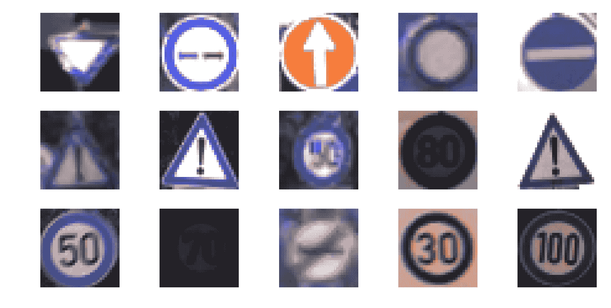

即使从这个小的数据样本来看，也立即清楚这是一个对任何类型的分类器都具有挑战性的数据集。标志的外观会根据观察角度（方向）、观察距离（模糊度）和光照条件（阴影和亮点）发生剧烈变化。

对于其中一些标志——例如第三行的第二个标志——即使是人类（至少对我来说），也很难立即说出正确的类别标签。我们作为机器学习的追求者真是件好事！

让我们现在学习如何解析数据集，以便将其转换为适合 SVM 用于训练的格式。

# 解析数据集

GTSRB 数据集包含 21 个文件，我们可以下载。我们选择使用原始数据以使其更具教育意义，并下载官方训练数据——**图像和标注** (`GTSRB_Final_Training_Images.zip`) 用于训练，以及用于**IJCNN 2011 比赛**的官方训练数据集——**图像和标注** (`GTSRB-Training_fixed.zip`) 用于评分。

以下截图显示了数据集的文件：

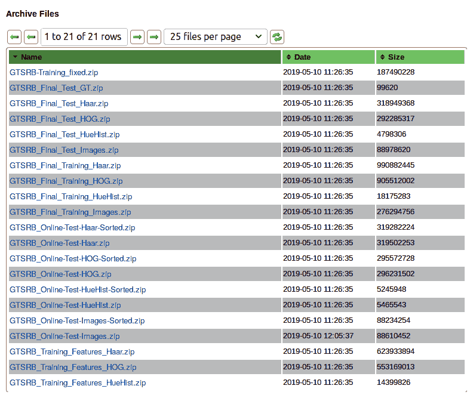

我们选择分别下载训练数据和测试数据，而不是从其中一个数据集中构建自己的训练/测试数据，因为在探索数据后，通常会有 30 张来自不同距离的相同标志的图像看起来非常相似。将这些 30 张图像放入不同的数据集中将扭曲问题，并导致结果极好，尽管我们的模型可能无法很好地泛化。

以下代码是一个从**哥本哈根大学数据档案**下载数据的函数：

```py
ARCHIVE_PATH = 'https://sid.erda.dk/public/archives/daaeac0d7ce1152aea9b61d9f1e19370/'

def _download(filename, *, md5sum=None):
    write_path = Path(__file__).parent / filename
    if write_path.exists() and _md5sum_matches(write_path, md5sum):
        return write_path
    response = requests.get(f'{ARCHIVE_PATH}/{filename}')
    response.raise_for_status()
    with open(write_path, 'wb') as outfile:
        outfile.write(response.content)
    return write_path
```

之前的代码接受一个文件名（您可以从之前的屏幕截图中看到文件及其名称），并检查该文件是否已存在（如果提供了`md5sum`，则检查是否匹配），这样可以节省大量带宽和时间，无需反复下载文件。然后，它下载文件并将其存储在包含代码的同一目录中。

标注格式可以在[`benchmark.ini.rub.de/?section=gtsrb&subsection=dataset#Annotationformat`](http://benchmark.ini.rub.de/?section=gtsrb&subsection=dataset#Annotationformat)查看。

下载文件后，我们编写一个函数，使用与数据一起提供的标注格式解压缩并提取数据，如下所示：

1.  首先，我们打开下载的`.zip`文件（这可能是指训练数据或测试数据），我们遍历所有文件，只打开包含对应类别中每个图像目标信息的`.csv`文件。这在上面的代码中显示如下：

```py
def _load_data(filepath, labels):
    data, targets = [], []

    with ZipFile(filepath) as data_zip:
        for path in data_zip.namelist():
            if not path.endswith('.csv'):
                continue
            # Only iterate over annotations files
            ...
```

1.  然后，我们检查图像的标签是否在我们感兴趣的`labels`数组中。然后，我们创建一个`csv.reader`，我们将使用它来遍历`.csv`文件内容，如下所示：

```py
            ....
            # Only iterate over annotations files
            *dir_path, csv_filename = path.split('/')
            label_str = dir_path[-1]
            if labels is not None and int(label_str) not in labels:
                continue
            with data_zip.open(path, 'r') as csvfile:
                reader = csv.DictReader(TextIOWrapper(csvfile), delimiter=';')
                for img_info in reader:
                    ... 
```

1.  文件的每一行都包含一个数据样本的标注。因此，我们提取图像路径，读取数据，并将其转换为 NumPy 数组。通常，这些样本中的对象并不是完美切割的，而是嵌入在其周围环境中。我们使用存档中提供的边界框信息来切割图像，每个标签使用一个`.csv`文件。在下面的代码中，我们将符号添加到`data`中，并将标签添加到`targets`中：

```py
                    img_path = '/'.join([*dir_path, img_info['Filename']])
                    raw_data = data_zip.read(img_path)
                    img = cv2.imdecode(np.frombuffer(raw_data, np.uint8), 1)

                    x1, y1 = np.int(img_info['Roi.X1']), 
                    np.int(img_info['Roi.Y1'])
                    x2, y2 = np.int(img_info['Roi.X2']), 
                    np.int(img_info['Roi.Y2'])

                    data.append(img[y1: y2, x1: x2])
                    targets.append(np.int(img_info['ClassId']))
```

通常，执行某种形式的特征提取是可取的，因为原始图像数据很少是数据的最佳描述。我们将把这个任务推迟到另一个函数，我们将在稍后详细讨论。

如前一小节所述，将我们用于训练分类器的样本与用于测试的样本分开至关重要。为此，以下代码片段显示我们有两个不同的函数，用于下载训练数据和测试数据并将它们加载到内存中：

```py
def load_training_data(labels):
    filepath = _download('GTSRB-Training_fixed.zip',
                         md5sum='513f3c79a4c5141765e10e952eaa2478')
    return _load_data(filepath, labels)

def load_test_data(labels):
    filepath = _download('GTSRB_Online-Test-Images-Sorted.zip',
                         md5sum='b7bba7dad2a4dc4bc54d6ba2716d163b')
    return _load_data(filepath, labels)
```

现在我们知道了如何将图像转换为 NumPy 矩阵，我们可以继续到更有趣的部分，即我们可以将数据输入到 SVM 中并对其进行训练以进行预测。所以，让我们继续到下一节，该节涵盖了特征提取。

# 学习数据集特征提取

很可能，原始像素值不是表示数据的最佳方式，正如我们在第三章，*通过特征匹配和透视变换寻找对象*中已经意识到的，我们需要从数据中推导出一个可测量的属性，这个属性对分类更有信息量。

然而，通常不清楚哪些特征会表现最好。相反，通常需要尝试不同的特征，这些特征是实践者认为合适的。毕竟，特征的选择可能强烈依赖于要分析的特定数据集或要执行的特定分类任务。

例如，如果你必须区分停车标志和警告标志，那么最显著的特征可能是标志的形状或颜色方案。然而，如果你必须区分两个警告标志，那么颜色和形状将完全帮不上忙，你需要想出更复杂一些的特征。

为了展示特征选择如何影响分类性能，我们将关注以下内容：

+   **一些简单的颜色变换**（例如灰度；**红色、绿色、蓝色**（**RGB**）；以及**色调、饱和度、亮度**（**HSV**））：基于灰度图像的分类将为我们提供分类器的基准性能。RGB 可能会因为某些交通标志独特的颜色方案而提供略好的性能。

预期 HSV 会有更好的性能。这是因为它比 RGB 更稳健地表示颜色。交通标志通常具有非常明亮、饱和的颜色，这些颜色（理想情况下）与周围环境非常不同。

+   **SURF**：到现在为止，这应该对你来说非常熟悉了。我们之前已经将 SURF 识别为从图像中提取有意义特征的一种高效且稳健的方法。那么，我们能否利用这种技术在分类任务中占得先机？

+   **HOG**：这是本章要考虑的最先进的特征描述符。该技术沿着图像上密集排列的网格计算梯度方向的出现次数，非常适合与 SVMs 一起使用。

特征提取是通过 `data/process.py` 文件中的函数完成的，我们将调用不同的函数来构建和比较不同的特征。

这里有一个很好的蓝图，如果你遵循它，将能够轻松地编写自己的特征化函数，并使用我们的代码，比较你的 `your_featurize` 函数是否能产生更好的结果：

```py
def your_featurize(data: List[np.ndarry], **kwargs) -> np.ndarray: 
    ...
```

`_featurize` 函数接收一个图像列表并返回一个矩阵（作为二维 `np.ndarray`），其中每一行代表一个新的样本，每一列代表一个特征。

对于以下大多数特征，我们将使用 OpenCV 中（已经合适的）默认参数。然而，这些值并不是一成不变的，即使在现实世界的分类任务中，也经常需要在一个称为**超参数探索**的过程中，在特征提取和特征学习参数的可能值范围内进行搜索。

现在我们知道了我们在做什么，让我们看看一些基于前几节概念并添加了一些新概念的特性化函数。

# 理解常见的预处理

在我们查看我们得到的结果之前，让我们花时间看看在机器学习任务之前几乎总是应用于任何数据的两种最常见的前处理形式——即，**均值减法**和**归一化**。

均值减法是最常见的预处理形式（有时也称为**零中心化**或去均值），其中计算数据集中所有样本的每个特征维度的平均值。然后将这个特征维度的平均值从数据集中的每个样本中减去。你可以将这个过程想象为将数据的**云**中心化在原点。

归一化是指对数据维度进行缩放，使它们大致具有相同的尺度。这可以通过将每个维度除以其标准差（一旦它已经被零中心化）或缩放每个维度使其位于[-1, 1]的范围内来实现。

只有在你有理由相信不同的输入特征有不同的尺度或单位时，才适用这一步骤。在图像的情况下，像素的相对尺度已经大致相等（并且在[0, 255]的范围内），因此执行这个额外的预处理步骤并不是严格必要的。

带着这两个概念，让我们来看看我们的特征提取器。

# 了解灰度特征

最容易提取的特征可能是每个像素的灰度值。通常，灰度值并不非常能说明它们所描述的数据，但在这里我们将包括它们以供说明之用（即，为了达到基线性能）。

对于输入集中的每个图像，我们将执行以下步骤：

1.  将所有图像调整到相同的大小（通常是更小的尺寸）。我们使用`scale_size=(32, 32)`来确保我们不会使图像太小。同时，我们希望我们的数据足够小，以便在我们的个人电脑上处理。我们可以通过以下代码来实现：

```py
resized_images = (cv2.resize(x, scale_size) for x in data)
```

1.  将图像转换为灰度（值仍在 0-255 范围内），如下所示：

```py
gray_data = (cv2.cvtColor(x, cv2.COLOR_BGR2GRAY) for x in resized_images)
```

1.  将每个图像转换为具有（0, 1）范围内的像素值并展平，因此对于每个图像，我们有一个大小为`1024`的向量，如下所示：

```py
scaled_data = (np.array(x).astype(np.float32).flatten() / 255 for x in gray_data)
```

1.  从展平向量的平均像素值中减去，如下所示：

```py
return np.vstack([x - x.mean() for x in scaled_data])
```

我们使用返回的矩阵作为机器学习算法的训练数据。

现在，让我们看看另一个例子——*如果我们也使用颜色中的信息会怎样？*

# 理解色彩空间

或者，你可能发现颜色包含一些原始灰度值无法捕捉的信息。交通标志通常有独特的色彩方案，这可能表明它试图传达的信息（例如，红色表示停车标志和禁止行为；绿色表示信息标志；等等）。我们可以选择使用 RGB 图像作为输入，但在我们的情况下，我们不必做任何事情，因为数据集已经是 RGB 的。

然而，即使是 RGB 可能也不够有信息量。例如，在晴朗的白天，一个停车标志可能非常明亮和清晰，但在雨天或雾天，其颜色可能看起来要暗淡得多。更好的选择可能是 HSV 颜色空间，它使用色调、饱和度和亮度（或亮度）来表示颜色。

在这个颜色空间中，交通标志的最显著特征可能是色调（对颜色或色相的更感知相关的描述），它提供了区分不同标志类型颜色方案的能力。然而，饱和度和亮度可能同样重要，因为交通标志倾向于使用相对明亮和饱和的颜色，这些颜色在自然场景中通常不会出现（即，它们的周围）。

在 OpenCV 中，将图像转换为 HSV 颜色空间只需要一个`cv2.cvtColor`调用，如下面的代码所示：

```py
    hsv_data = (cv2.cvtColor(x, cv2.COLOR_BGR2HSV) for x in resized_images)
```

因此，总结一下，特征化几乎与灰度特征相同。对于每张图像，我们执行以下四个步骤：

1.  将所有图像调整到相同（通常是较小的）大小。

1.  将图像转换为 HSV（值在 0-255 范围内）。

1.  将每个图像转换为具有（0，1）范围内的像素值，并将其展平。

1.  从展平向量的平均像素值中减去。

现在，让我们尝试看一个使用 SURF 的更复杂的特征提取器的例子。

# 使用 SURF 描述符

但是等等！在第三章“通过特征匹配和透视变换查找对象”中，你了解到 SURF 描述符是描述图像独立于尺度或旋转的最佳和最鲁棒的方法之一。我们能否利用这项技术在分类任务中占得优势？

很高兴你问了！为了使这起作用，我们需要调整 SURF，使其为每张图像返回固定数量的特征。默认情况下，SURF 描述符仅应用于图像中的一小部分*有趣*的关键点，这些关键点的数量可能因图像而异。这对于我们的当前目的来说是不合适的，因为我们想要在每个数据样本中找到固定数量的特征值。

相反，我们需要将 SURF 应用于图像上铺设的固定密集网格，为此我们创建了一个包含所有像素的关键点数组，如下面的代码块所示：

```py
def surf_featurize(data, *, scale_size=(16, 16)):
    all_kp = [cv2.KeyPoint(float(x), float(y), 1)
              for x, y in itertools.product(range(scale_size[0]),
                                            range(scale_size[1]))]
```

然后，我们可以为网格上的每个点获得 SURF 描述符，并将该数据样本附加到我们的特征矩阵中。我们像之前一样，使用`hessianThreshold`值为`400`初始化 SURF，如下所示：

```py
    surf = cv2.xfeatures2d_SURF.create(hessianThreshold=400)
```

通过以下代码可以获得关键点和描述符：

```py
    kp_des = (surf.compute(x, kp) for x in data)
```

因为`surf.compute`有两个输出参数，所以`kp_des`实际上将是关键点和描述符的连接。`kp_des`数组中的第二个元素是我们关心的描述符。

我们从每个数据样本中选择前`num_surf_features`个，并将其作为图像的特征返回，如下所示：

```py
    return np.array([d.flatten()[:num_surf_features]
                     for _, d in kp_des]).astype(np.float32)
```

现在，让我们来看一个在社区中非常流行的概念——HOG。

# 映射 HOG 描述符

需要考虑的最后一种特征描述符是 HOG。之前的研究表明，HOG 特征与 SVMs 结合使用时效果非常好，尤其是在应用于行人识别等任务时。

HOG 特征背后的基本思想是，图像中对象的局部形状和外观可以通过边缘方向的分布来描述。图像被分成小的连通区域，在这些区域内，编译了梯度方向（或边缘方向）的直方图。

下面的截图显示了图片中的一个区域的直方图。角度不是方向性的；这就是为什么范围是（-180，180）：

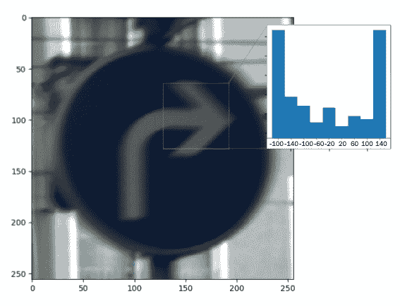

如您所见，它在水平方向上有许多边缘方向（+180 度和-180 度左右的角），因此这似乎是一个很好的特征，尤其是在我们处理箭头和线条时。

然后，通过连接不同的直方图来组装描述符。为了提高性能，局部直方图可以进行对比度归一化，这有助于提高对光照和阴影变化的鲁棒性。您可以看到为什么这种预处理可能非常适合在不同视角和光照条件下识别交通标志。

通过`cv2.HOGDescriptor`在 OpenCV 中可以方便地访问 HOG 描述符，它接受检测窗口大小（32 x 32）、块大小（16 x 16）、单元格大小（8 x 8）和单元格步长（8 x 8）作为输入参数。对于这些单元格中的每一个，HOG 描述符然后使用九个桶计算 HOG，如下所示：

```py
def hog_featurize(data, *, scale_size=(32, 32)):
    block_size = (scale_size[0] // 2, scale_size[1] // 2)
    block_stride = (scale_size[0] // 4, scale_size[1] // 4)
    cell_size = block_stride
    hog = cv2.HOGDescriptor(scale_size, block_size, block_stride,
                            cell_size, 9)
    resized_images = (cv2.resize(x, scale_size) for x in data)
    return np.array([hog.compute(x).flatten() for x in resized_images])
```

将 HOG 描述符应用于每个数据样本就像调用`hog.compute`一样简单。

在提取了我们想要的全部特征之后，我们为每张图像返回一个扁平化的列表。

现在，我们终于准备好在预处理后的数据集上训练分类器了。所以，让我们继续到 SVM。

# 学习 SVMs

SVM 是一种用于二元分类（和回归）的学习器，它试图通过最大化两个类别之间的间隔来分离来自两个不同类别标签的示例。

让我们回到正负数据样本的例子，每个样本恰好有两个特征（x 和 y）和两个可能的决策边界，如下所示：

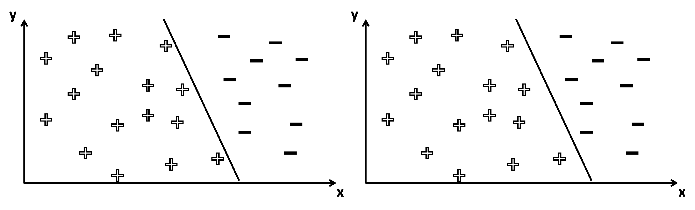

这两个决策边界都能完成任务。它们将所有正负样本分割开来，没有错误分类。然而，其中一个看起来直观上更好。我们如何量化“更好”，从而学习“最佳”参数设置？

这就是 SVMs 发挥作用的地方。SVMs 也被称为**最大间隔分类器**，因为它们可以用来做到这一点——定义决策边界，使得两个云团（+和-）尽可能远；也就是说，尽可能远离决策边界。

对于前面的例子，SVM 会在类别边缘（以下截图中的虚线）上的数据点找到两条平行线，然后将通过边缘中心的线作为决策边界（以下截图中的粗黑线）：

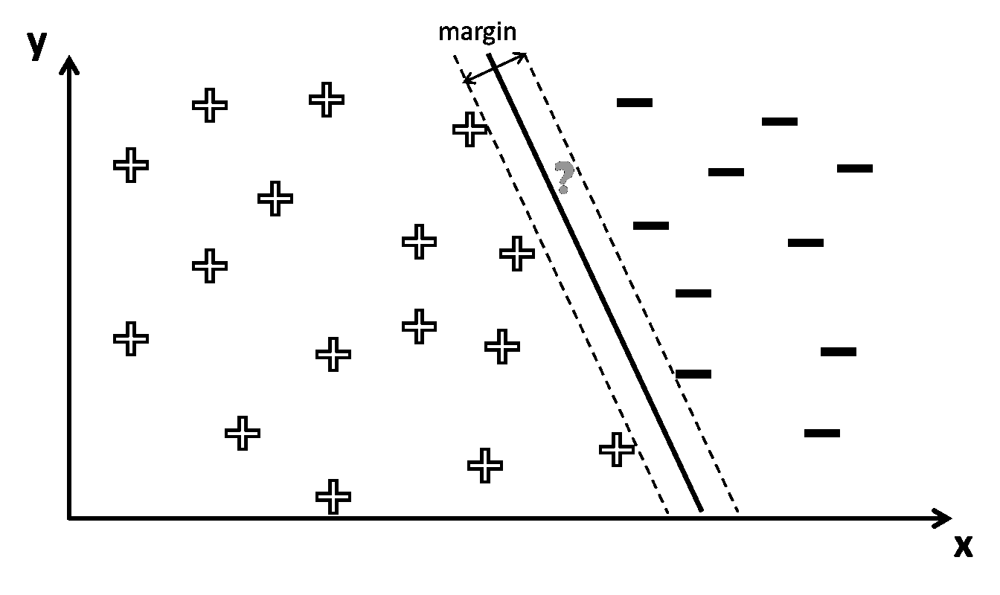

结果表明，为了找到最大间隔，只需要考虑位于类别边缘的数据点。这些点有时也被称为**支持向量**。

除了执行线性分类（即决策边界是直线的情况）之外，SVM 还可以使用所谓的**核技巧**执行非线性分类，隐式地将它们的输入映射到高维特征空间。

现在，让我们看看我们如何将这个二元分类器转换成一个更适合我们试图解决的 43 个类别分类问题的多类分类器。

# 使用 SVM 进行多类分类

与一些分类算法（如神经网络）自然适用于使用多个类别不同，SVM 本质上是二元分类器。然而，它们可以被转换成多类分类器。

在这里，我们将考虑两种不同的策略：

+   **一对多**：`一对多`策略涉及为每个类别训练一个单独的分类器，该类别的样本作为正样本，所有其他样本作为负样本。

对于`k`个类别，这种策略因此需要训练`k`个不同的 SVM。在测试期间，所有分类器可以通过预测一个未见样本属于其类别来表示一个`+1`的投票。

最后，一个未见样本被集成分类器归类为获得最多投票的类别。通常，这种策略会与置信度分数结合使用，而不是预测标签，这样最终可以选取置信度分数最高的类别。

+   **一对一**：`一对一`策略涉及为每个类别对训练一个单独的分类器，第一个类别的样本作为正样本，第二个类别的样本作为负样本。对于`k`个类别，这种策略需要训练`k*(k-1)/2`个分类器。

然而，分类器必须解决一个显著更简单的问题，因此在考虑使用哪种策略时存在权衡。在测试期间，所有分类器可以为第一个或第二个类别表达一个`+1`的投票。最后，一个未见样本被集成分类器归类为获得最多投票的类别。

通常，除非你真的想深入研究算法并从你的模型中榨取最后一丝性能，否则你不需要编写自己的分类算法。幸运的是，OpenCV 已经内置了一个良好的机器学习工具包，我们将在本章中使用。OpenCV 使用一对多方法，我们将重点关注这种方法。

现在，让我们动手实践，看看我们如何使用 OpenCV 编写代码并获取一些实际结果。

# 训练 SVM

我们将把训练方法写入一个单独的函数中；如果我们以后想更改我们的训练方法，这是一个好的实践。首先，我们定义函数的签名，如下所示：

```py
def train(training_features: np.ndarray, training_labels: np.ndarray):
```

因此，我们想要一个函数，它接受两个参数——`training_features` 和 `training_labels`——以及与每个特征对应的正确答案。因此，第一个参数将是一个二维 NumPy 数组的矩阵形式，第二个参数将是一个一维 NumPy 数组。

然后，函数将返回一个对象，该对象应该有一个 `predict` 方法，该方法接受新的未见数据并将其标记。所以，让我们开始，看看我们如何使用 OpenCV 训练 SVM。

我们将我们的函数命名为 `train_one_vs_all_SVM`，并执行以下操作：

1.  使用 `cv2.ml.SVM_create` 实例化 SVM 类，它使用一对一策略创建一个多类 SVM，如下所示：

```py
def train_one_vs_all_SVM(X_train, y_train):
    svm = cv2.ml.SVM_create()
```

1.  设置学习器的超参数。这些被称为 **超参数**，因为这些参数超出了学习器的控制范围（与学习器在学习过程中更改的参数相对）。可以使用以下代码完成：

```py
    svm.setKernel(cv2.ml.SVM_LINEAR)
    svm.setType(cv2.ml.SVM_C_SVC)
    svm.setC(2.67)
    svm.setGamma(5.383)
```

1.  在 SVM 实例上调用 `train` 方法，OpenCV 会负责训练（使用 GTSRB 数据集，在普通笔记本电脑上这可能需要几分钟），如下所示：

```py
    svm.train(X_train, cv2.ml.ROW_SAMPLE, y_train)
    return svm
```

OpenCV 会处理其余部分。在底层，SVM 训练使用 **拉格朗日乘数**来优化一些导致最大边缘决策边界的约束。

优化过程通常是在满足某些终止条件时进行的，这些条件可以通过 SVM 的可选参数指定。

现在我们已经了解了 SVM 的训练过程，让我们来看看如何测试它。

# 测试 SVM

评估分类器有许多方法，但最常见的是，我们通常只对准确率指标感兴趣——也就是说，测试集中有多少数据样本被正确分类。

为了得到这个指标，我们需要从 SVM 中获取预测结果——同样，OpenCV 为我们提供了 `predict` 方法，该方法接受一个特征矩阵并返回一个预测标签数组。因此，我们需要按照以下步骤进行：

1.  因此，我们首先需要对我们的测试数据进行特征化：

```py
        x_train = featurize(train_data)
```

1.  然后，我们将特征化后的数据输入到分类器中，并获取预测标签，如下所示：

```py
        y_predict = model.predict(x_test)
```

1.  之后，我们可以尝试运行以下代码来查看分类器正确标记了多少个标签：

```py
        num_correct = sum(y_predict == y_test)
```

现在，我们准备计算所期望的性能指标，这些指标将在后面的章节中详细描述。为了本章的目的，我们选择计算准确率、精确率和召回率。

`scikit-learn` 机器学习包（可在 [`scikit-learn.org`](http://scikit-learn.org) 找到）直接支持三个指标——准确率、精确率和召回率（以及其他指标），并且还附带了许多其他有用的工具。出于教育目的（以及最小化软件依赖），我们将自己推导这三个指标。

# 准确率

计算最直接的指标可能是准确率。这个指标简单地计算预测正确的测试样本数量，并以总测试样本数的分数形式返回，如下面的代码块所示：

```py
def accuracy(y_predicted, y_true):
    return sum(y_predicted == y_true) / len(y_true)
```

之前的代码显示，我们通过调用 `model.predict(x_test)` 提取了 `y_predicted`。这很简单，但为了使代码可重用，我们将它放在一个接受 `predicted` 和 `true` 标签的函数中。现在，我们将继续实现一些更复杂的、有助于衡量分类器性能的指标。

# 混淆矩阵

混淆矩阵是一个大小为 `(num_classes, num_classes)` 的二维矩阵，其中行对应于预测的类别标签，列对应于实际的类别标签。然后，`[r,c]` 矩阵元素包含预测为标签 `r` 但实际上具有标签 `c` 的样本数量。通过访问混淆矩阵，我们可以计算精确率和召回率。

现在，让我们实现一种非常简单的方式来计算混淆矩阵。类似于准确率，我们创建一个具有相同参数的函数，这样就可以通过以下步骤轻松重用：

1.  假设我们的标签是非负整数，我们可以通过取最高整数并加 `1` 来确定 `num_classes`，以考虑零，如下所示：

```py
def confusion_matrix(y_predicted, y_true):
    num_classes = max(max(y_predicted), max(y_true)) + 1
    ...
```

1.  接下来，我们实例化一个空的矩阵，我们将在这里填充计数，如下所示：

```py
    conf_matrix = np.zeros((num_classes, num_classes))
```

1.  接下来，我们遍历所有数据，对于每个数据点，我们取预测值 `r` 和实际值 `c`，然后在矩阵中增加相应的值。虽然有许多更快的方法来实现这一点，但没有什么比逐个计数更简单了。我们使用以下代码来完成这项工作：

```py
    for r, c in zip(y_predicted, y_true):
        conf_matrix[r, c] += 1
```

1.  在我们处理完训练集中的所有数据后，我们可以返回我们的混淆矩阵，如下所示：

```py
    return conf_matrix
```

1.  这是我们的 GTSRB 数据集测试数据的混淆矩阵：

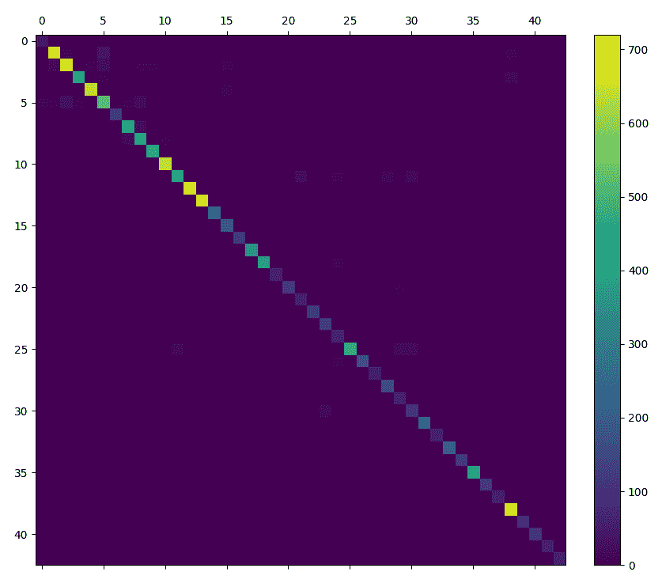

如您所见，大多数值都在对角线上。这意味着乍一看，我们的分类器表现相当不错。

1.  从混淆矩阵中计算准确率也很容易。我们只需取对角线上的元素数量，然后除以总元素数量，如下所示：

```py
    cm = confusion_matrix(y_predicted, y_true)
    accuracy = cm.trace() / cm.sum()  # 0.95 in this case.
```

注意，每个类别中的元素数量都不同。每个类别对准确率的贡献不同，我们的下一个指标将专注于每个类别的性能。

# 精确率

在二元分类中，精度是一个有用的指标，用于衡量检索到的实例中有多少是相关的（也称为**阳性预测值**）。在分类任务中，**真阳性**的数量被定义为正确标记为属于正类别的项目数量。

精度被定义为真阳性数量除以总阳性数量。换句话说，在测试集中，一个分类器认为包含猫的所有图片中，精度是实际包含猫的图片的比例。

注意，在这里，我们有一个正标签；因此，精度是每个类别的值。我们通常谈论一个类别的精度，或者猫的精度等等。

正确样本的总数也可以通过**真阳性**和**假阳性**的总和来计算，后者是指被错误标记为属于特定类别的样本数量。这就是混淆矩阵派上用场的地方，因为它将允许我们通过以下步骤快速计算出假阳性和真阳性的数量：

1.  因此，在这种情况下，我们必须更改我们的函数参数，并添加正类标签，如下所示：

```py
def precision(y_predicted, y_true, positive_label):
    ...
```

1.  让我们使用我们的混淆矩阵，并计算真阳性的数量，这将是在`[positive_label, positive_label]`位置的元素，如下所示：

```py
    cm = confusion_matrix(y_predicted, y_true)
    true_positives = cm[positive_label, positive_label]
```

1.  现在，让我们计算真阳性和假阳性的数量，这将等于`positive_label`行上所有元素的总和，因为该行表示预测的类别标签，如下所示：

```py
    total_positives = sum(cm[positive_label])
```

1.  最后，返回真阳性与所有正性的比率，如下所示：

```py
    return true_positives / total_positives
```

根据不同的类别，我们得到非常不同的精度值。以下是所有 43 个类别的精度分数直方图：

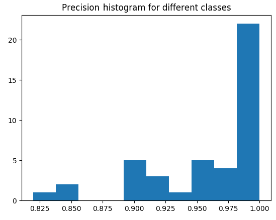

精度较低的类别是 30，这意味着很多其他标志被错误地认为是以下截图中的标志：

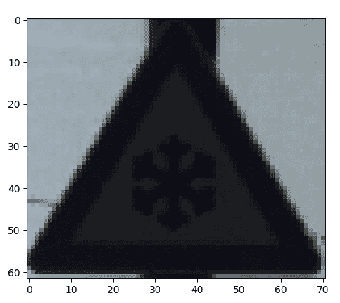

在这种情况下，我们在结冰的道路上驾驶时格外小心是可以的，但可能我们错过了某些重要的事情。因此，让我们看看不同类别的召回值。

# 召回

召回与精度相似，因为它衡量的是检索到的相关实例的比例（而不是检索到的实例中有多少是相关的）。因此，它将告诉我们对于给定的正类（给定的标志），我们不会注意到它的概率。

在分类任务中，**假阴性**的数量是指那些没有被标记为属于正类别的项目，但实际上应该被标记的项目数量。

召回是真阳性数量除以真阳性和假阴性总数。换句话说，在世界上所有猫的图片中，召回是正确识别为猫的图片的比例。

这里是如何使用真实标签和预测标签来计算给定正标签的召回率的：

1.  再次，我们与精度有相同的签名，并且以相同的方式检索真实正例，如下所示：

```py
def recall(y_predicted, y_true, positive_label):
    cm = confusion_matrix(y_predicted, y_true)
    true_positives = cm[positive_label, positive_label]
```

现在，请注意，真实正例和假负例的总和是给定数据类中的点总数。

1.  因此，我们只需计算该类别的元素数量，这意味着我们求混淆矩阵中`positive_label`列的和，如下所示：

```py
    class_members = sum(cm[:, positive_label])
```

1.  然后，我们像精度函数一样返回比率，如下所示：

```py
    return true_positives / class_members
```

现在，让我们看看以下截图所示的所有 43 个交通标志类别的召回值分布：

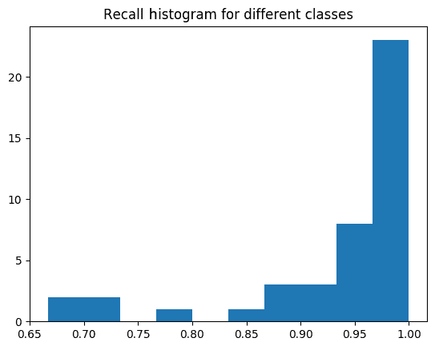

召回值分布得更广，第 21 个类别的值为 0.66。让我们检查哪个类别的值为 21：

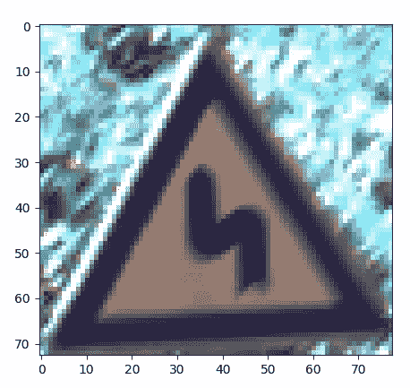

现在，这并不像在覆盖着雪花/冰的道路上驾驶那样有害，但非常重要，不要错过路上的危险弯道。错过这个标志可能会产生不良后果。

下一个部分将演示运行我们的应用程序所需的`main()`函数例程。

# 将所有这些放在一起

要运行我们的应用程序，我们需要执行主函数例程（在`chapter6.py`中）。这加载数据，训练分类器，评估其性能，并可视化结果：

1.  首先，我们需要导入所有相关模块并设置`main`函数，如下所示：

```py
import cv2
import numpy as np
import matplotlib.pyplot as plt

from data.gtsrb import load_training_data
from data.gtsrb import load_test_data
from data.process import grayscale_featurize, hog_featurize
```

1.  然后，目标是比较不同特征提取方法的分类性能。这包括使用不同特征提取方法运行任务。因此，我们首先加载数据，并重复对每个特征化函数进行过程，如下所示：

```py
def main(labels):
    train_data, train_labels = load_training_data(labels)
    test_data, test_labels = load_test_data(labels)
    y_train, y_test = np.array(train_labels), np.array(test_labels)
    accuracies = {}
    for featurize in [hog_featurize, grayscale_featurize, hsv_featurize, 
    surf_featurize]:
       ...
```

对于每个`featurize`函数，我们执行以下步骤：

+   1.  `Featurize`数据，以便我们有一个特征矩阵，如下所示：

```py
        x_train = featurize(train_data)
```

1.  1.  使用我们的`train_one_vs_all_SVM`方法训练模型，如下所示：

```py
        model = train_one_vs_all_SVM(x_train, y_train)
```

1.  1.  通过对测试数据进行特征化并将结果传递给`predict`方法（我们必须单独对测试数据进行特征化以确保没有信息泄露），为训练数据预测测试标签，如下所示：

```py
        x_test = featurize(test_data)
        res = model.predict(x_test)
        y_predict = res[1].flatten()
```

1.  1.  我们使用`accuracy`函数对预测标签和真实标签进行评分，并将分数存储在字典中，以便在所有`featurize`函数的结果出来后进行绘图，如下所示：

```py
        accuracies[featurize.__name__] = accuracy(y_predict, y_test)
```

1.  现在，是时候绘制结果了，为此，我们选择了`matplotlib`的`bar`图功能。我们还确保相应地缩放条形图，以便直观地理解差异的规模。由于准确度是一个介于`0`和`1`之间的数字，我们将`y`轴限制在`[0, 1]`，如下所示：

```py
    plt.bar(accuracies.keys(), accuracies.values())
    plt.ylim([0, 1])
```

1.  我们通过在水平轴上旋转标签、添加`grid`和`title`来为绘图添加一些漂亮的格式化，如下所示：

```py
    plt.axes().xaxis.set_tick_params(rotation=20)
    plt.grid()
    plt.title('Test accuracy for different featurize functions')
    plt.show()
```

1.  并且在执行`plt.show()`的最后一行之后，以下截图所示的绘图在单独的窗口中弹出：

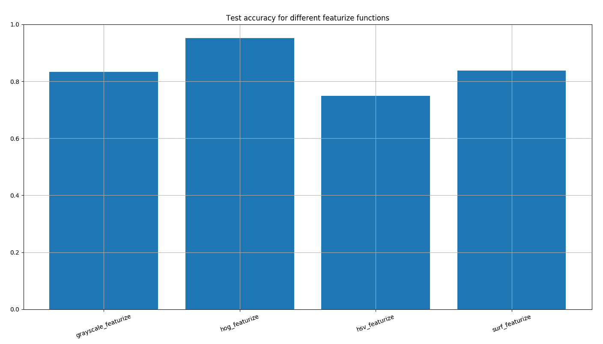

因此，我们看到`hog_featurize`在这个数据集上是一个赢家，但我们离完美的结果还远着呢——略高于 95%。要了解可能得到多好的结果，你可以快速进行一次谷歌搜索，你会找到很多实现 99%+精度的论文。所以，尽管我们没有得到最前沿的结果，但我们使用现成的分类器和简单的`featurize`函数做得相当不错。

另一个有趣的事实是，尽管我们认为具有鲜艳颜色的交通标志应该使用 hsv_featurize（它比灰度特征更重要），但事实并非如此。

因此，一个很好的经验法则是你应该对你的数据进行实验，以发展更好的直觉，了解哪些特征对你的数据有效，哪些无效。

说到实验，让我们用一个神经网络来提高我们获得的结果的效率。

# 使用神经网络提高结果

让我们快速展示一下，如果我们使用一些花哨的**深度神经网络**（**DNNs**），我们可能会达到多好的水平，并给你一个关于本书未来章节内容的预览。

如果我们使用以下“不太深”的神经网络，在我的笔记本电脑上训练大约需要 2 分钟（而 SVM 的训练只需要 1 分钟），我们得到的准确率大约为 0.964！

这里是训练方法的一个片段（你应该能够将其插入到前面的代码中，并调整一些参数以查看你能否在以后做到）：

```py
def train_tf_model(X_train, y_train):
    model = tf.keras.models.Sequential([
        tf.keras.layers.Conv2D(20, (8, 8),
                               input_shape=list(UNIFORM_SIZE) + [3],
                               activation='relu'),
        tf.keras.layers.MaxPooling2D(pool_size=(4, 4), strides=4),
        tf.keras.layers.Dropout(0.15),
        tf.keras.layers.Flatten(),
        tf.keras.layers.Dense(64, activation='relu'),
        tf.keras.layers.Dropout(0.15),
        tf.keras.layers.Dense(43, activation='softmax')
    ])

    model.compile(optimizer='adam',
                  loss='sparse_categorical_crossentropy',
                  metrics=['accuracy'])
    model.fit(x_train, np.array(train_labels), epochs=10)
    return model
```

代码使用了 TensorFlow 的高级 Keras API（我们将在接下来的章节中看到更多），并创建了一个具有以下结构的神经网络：

+   **卷积层**带有最大池化，后面跟着一个 dropout——它只在训练期间存在。

+   **隐藏密集层**后面跟着一个 dropout——它只在训练期间存在。

+   **最终密集层**输出最终结果；它应该识别输入数据属于哪个类别（在 43 个类别中）。

注意，我们只有一个卷积层，这与 HOG 特征化非常相似。如果我们增加更多的卷积层，性能会显著提高，但让我们把这一点留到下一章去探索。

# 摘要

在本章中，我们训练了一个多类分类器来识别 GTSRB 数据库中的交通标志。我们讨论了监督学习的基础，探讨了特征提取的复杂性，并简要介绍了深度神经网络（DNNs）。

使用本章中采用的方法，你应该能够将现实生活中的问题表述为机器学习模型，使用你的 Python 技能从互联网上下载一个标记的样本数据集，编写将图像转换为特征向量的特征化函数，并使用 OpenCV 来训练现成的机器学习模型，帮助你解决现实生活中的问题。

值得注意的是，我们在过程中省略了一些细节，例如尝试微调学习算法的超参数（因为它们超出了本书的范围）。我们只关注准确率分数，并没有通过尝试结合所有不同特征集进行很多特征工程。

在这个功能设置和对其底层方法论的充分理解下，你现在可以分类整个 GTSRB 数据集，以获得高于 0.97 的准确率！0.99 呢？这绝对值得查看他们的网站，在那里你可以找到各种分类器的分类结果。也许你的方法很快就会被添加到列表中。

在下一章中，我们将更深入地探讨机器学习的领域。具体来说，我们将专注于使用**卷积神经网络**（**CNNs**）来识别人类面部表情。这一次，我们将结合分类器与一个目标检测框架，这将使我们能够在图像中找到人脸，然后专注于识别该人脸中包含的情感表情。

# 数据集归属

J. Stallkamp, M. Schlipsing, J. Salmen, and C. Igel, The German Traffic Sign Recognition Benchmark—A multiclass classification competition, in *Proceedings of the IEEE International Joint Conference on Neural Networks*, 2011, pages 1453–1460.
