# 学习识别面部表情

我们之前已经熟悉了对象检测和对象识别的概念。在本章中，我们将开发一个能够同时执行这两项任务的应用程序。该应用程序将能够检测网络摄像头实时流中的每一帧捕获到的您的面部，识别您的面部表情，并在**图形用户界面**（**GUI**）上对其进行标记。

本章的目标是开发一个结合**面部检测**和**面部识别**的应用程序，重点关注识别检测到的面部表情。阅读本章后，您将能够在自己的不同应用程序中使用面部检测和识别。

在本章中，我们将涵盖以下主题：

+   计划应用程序

+   学习面部检测

+   收集机器学习任务的数据

+   理解面部表情识别

+   整合所有内容

我们将简要介绍 OpenCV 附带的两项经典算法——**Haar cascade 分类器**和**MLPs**。前者可以快速检测（或定位，并回答问题“在哪里？”）图像中各种大小和方向的物体，而后者可以用来识别它们（或识别，并回答问题“是什么？”）。

学习 MLPs 也是学习当今最流行算法之一——**深度神经网络**（**DNNs**）的第一步。当我们没有大量数据时，我们将使用 PCA 来加速并提高算法的准确性，以改善我们模型的准确性。

我们将自行收集训练数据，以向您展示这个过程是如何进行的，以便您能够为没有现成数据的学习任务训练机器学习模型。不幸的是，没有合适的数据仍然是当今机器学习广泛采用的最大障碍之一。

现在，在我们动手之前，让我们先看看如何开始。

# 开始

您可以在我们的 GitHub 仓库中找到本章中展示的代码，网址为[`github.com/PacktPublishing/OpenCV-4-with-Python-Blueprints-Second-Edition/tree/master/chapter8`](https://github.com/PacktPublishing/OpenCV-4-with-Python-Blueprints-Second-Edition/tree/master/chapter8)。

除了这些，您应该从官方 OpenCV 仓库下载**Haar cascade**文件，网址为[`github.com/opencv/opencv/blob/master/data/haarcascades/`](https://github.com/opencv/opencv/blob/master/data/haarcascades/)，或者从您的机器安装目录复制它们到项目仓库中。

# 计划应用程序

可靠地识别面部和面部表情是**人工智能**（**AI**）的一个具有挑战性的任务，然而人类能够轻松地完成这些任务。为了使我们的任务可行，我们将限制自己只关注以下有限的情绪表达：

+   Neutral

+   Happy

+   Sad

+   Surprised

+   Angry

+   Disgusted

今天的最先进模型范围从适合**卷积神经网络（CNNs**）的 3D 可变形人脸模型，到深度学习算法。当然，这些方法比我们的方法要复杂得多。

然而，**多层感知器（MLP**）是一种经典的算法，它帮助改变了机器学习的领域，因此出于教育目的，我们将坚持使用 OpenCV 附带的一系列算法。

要达到这样的应用，我们需要解决以下两个挑战：

+   **人脸检测**：我们将使用 Viola 和 Jones 的流行 Haar 级联分类器，OpenCV 为此提供了一系列预训练的示例。我们将利用人脸级联和眼级联从帧到帧可靠地检测和校准面部区域。

+   **面部表情识别**：我们将训练一个 MLP 来识别之前列出的六种不同的情感表达，在每一个检测到的人脸中。这种方法的成功将关键取决于我们组装的训练集，以及我们对每个样本选择的预处理。

为了提高我们自录制的训练集质量，我们将确保所有数据样本都通过**仿射变换**进行对齐，并通过应用**主成分分析（PCA**）来降低特征空间的维度。这种表示有时也被称为**特征脸**。

我们将在一个端到端的单一应用中结合前面提到的算法，该应用将使用预训练模型在每个视频直播捕获的每一帧中为检测到的人脸标注相应的面部表情标签。最终结果可能看起来像以下截图，捕捉了我第一次运行代码时的样本反应：

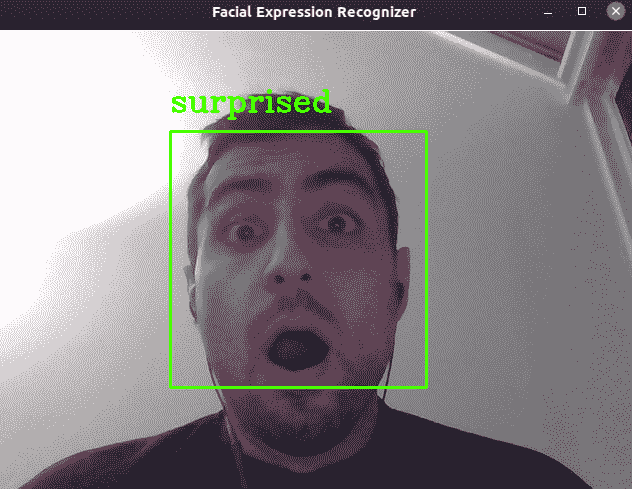

最终的应用将包括一个集成的端到端流程的主脚本——即从人脸检测到面部表情识别，以及一些辅助函数来帮助实现这一过程。

因此，最终产品将需要位于书籍 GitHub 仓库的`chapter8/`目录中的几个组件，如下所示：

+   `chapter8.py`: 这是本章的主要脚本和入口点，我们将用它来进行数据收集和演示。它将具有以下布局：

    +   `chapter8.FacialExpressionRecognizerLayout`: 这是一个基于`wx_gui.BaseLayout`的自定义布局，它将在每个视频帧中检测面部，并使用预训练模型预测相应的类别标签。

    +   `chapter8.DataCollectorLayout`: 这是一个基于`wx_gui.BaseLayout`的自定义布局，它将收集图像帧，检测其中的面部，使用用户选择的表情标签进行标记，并将帧保存到`data/`目录中。

+   `wx_gui.py`: 这是链接到我们在第一章，“滤镜乐趣”中开发的`wxpython` GUI 文件。

+   `detectors.FaceDetector`：这是一个将包含基于 Haar 级联的面部检测所有代码的类。它将有两个以下方法：

    +   `detect_face`：这个方法用于检测灰度图像中的面部。可选地，图像会被缩小以提高可靠性。检测成功后，该方法返回提取的头区域。

    +   `align_head`：这个方法通过仿射变换预处理提取的头区域，使得最终的面部看起来居中且垂直。

+   `params/`：这是一个包含我们用于本书的默认 Haar 级联的目录。

+   `data/`：我们将在这里编写所有存储和处理自定义数据的代码。代码被分为以下文件：

    +   `store.py`：这是一个包含所有将数据写入磁盘和从磁盘将数据加载到计算机内存中的辅助函数的文件。

    +   `process.py`：这是一个包含所有预处理数据的代码的文件，以便在保存之前。它还将包含从原始数据构建特征的代码。

在接下来的章节中，我们将详细讨论这些组件。首先，让我们看看面部检测算法。

# 学习关于面部检测

OpenCV 预装了一系列复杂的通用对象检测分类器。这些分类器都具有非常相似的 API，一旦你知道你在寻找什么，它们就很容易使用。可能最广为人知的检测器是用于面部检测的基于 Haar 特征的**级联检测器**，它最初由 Paul Viola 和 Michael Jones 在 2001 年发表的论文《使用简单特征增强级联的快速对象检测》中提出。

基于 Haar 特征检测器是一种在大量正负标签样本上训练的机器学习算法。在我们的应用中，我们将使用 OpenCV 附带的一个预训练分类器（你可以在“入门”部分找到链接）。但首先，让我们更详细地看看这个分类器是如何工作的。

# 学习关于基于 Haar 级联分类器

每本关于 OpenCV 的书至少应该提到 Viola-Jones 面部检测器。这个级联分类器在 2001 年发明，它颠覆了计算机视觉领域，因为它最终允许实时面部检测和面部识别。

这个分类器基于**Haar-like 特征**（类似于**Haar 基函数**），它们在图像的小区域内求和像素强度，同时捕捉相邻图像区域之间的差异。

下面的截图可视化了四个矩形特征。可视化旨在计算在某个位置应用的特征的值。你应该将暗灰色矩形中的所有像素值加起来，然后从这个值中减去白色矩形中所有像素值的总和：

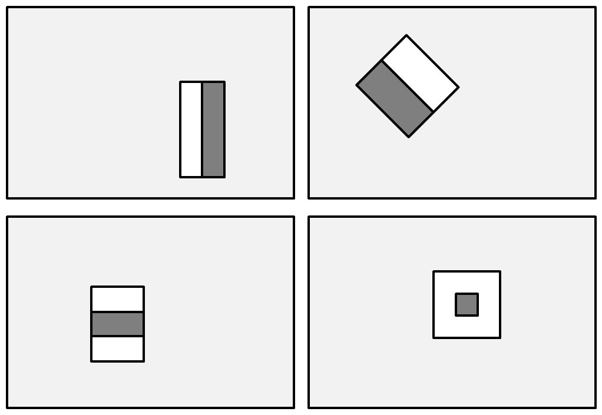

在前面的截图上，第一行显示了两个边缘特征（即你可以用它们检测边缘）的示例，要么是垂直方向的（左上角）要么是 45 度角方向的（右上角）。第二行显示了线特征（左下角）和中心环绕特征（右下角）。

应用这些过滤器在所有可能的位置，允许算法捕捉到人类面部的一些细节，例如，眼睛区域通常比脸颊周围的区域要暗。

因此，一个常见的 Haar 特征将是一个暗色的矩形（代表眼睛区域）在亮色的矩形（代表脸颊区域）之上。将这个特征与一组旋转和略微复杂的**小波**结合，Viola 和 Jones 得到了一个强大的人脸特征描述符。在额外的智慧行为中，这些人想出了一个有效的方法来计算这些特征，这使得第一次能够实时检测到人脸。

最终分类器是多个小型弱分类器的加权总和，每个分类器的二进制分类器都基于之前描述的单一特征。最难的部分是确定哪些特征组合有助于检测不同类型的对象。幸运的是，OpenCV 包含了一系列这样的分类器。让我们在下一节中看看其中的一些。

# 理解预训练的级联分类器

更好的是，这种方法不仅适用于人脸，还适用于眼睛、嘴巴、全身、公司标志；你说的都对。在下表中，展示了一些可以在 OpenCV 安装路径下的`data`文件夹中找到的预训练分类器：

| **级联分类器类型** | **XML 文件名** |
| --- | --- |
| 面部检测器（默认） | **`haarcascade_frontalface_default.xml`** |
| 面部检测器（快速 Haar） | `haarcascade_frontalface_alt2.xml` |
| 眼睛检测器 | `haarcascade_eye.xml` |
| 嘴巴检测器 | `haarcascade_mcs_mouth.xml` |
| 鼻子检测器 | `haarcascade_mcs_nose.xml` |
| 全身检测器 | `haarcascade_fullbody.xml` |

在本章中，我们只使用`haarcascade_frontalface_default.xml`和`haarcascade_eye.xml`。

如果你戴着眼镜，请确保使用`haarcascade_eye_tree_eyeglasses.xml`进行眼睛检测。

我们首先将探讨如何使用级联分类器。

# 使用预训练的级联分类器

可以使用以下代码加载并应用于图像（灰度）的级联分类器：

```py
import cv2

gray_img = cv2.cvtColor(cv2.imread('example.png'), cv2.COLOR_RGB2GRAY)

cascade_clf = cv2.CascadeClassifier('haarcascade_frontalface_default.xml')
faces = cascade_clf.detectMultiScale(gray_img,
                                     scaleFactor=1.1,
                                     minNeighbors=3,
                                     flags=cv2.CASCADE_SCALE_IMAGE)
```

从前面的代码中，`detectMultiScale`函数附带了一些选项：

+   `minFeatureSize`是考虑的最小人脸大小——例如，20 x 20 像素。

+   `searchScaleFactor`是我们重置图像（尺度金字塔）的量。例如，`1.1`的值将逐渐减小输入图像的大小 10%，使得具有更大值的脸（图像）更容易被找到。

+   `minNeighbors`是每个候选矩形必须保留的邻居数量。通常，我们选择`3`或`5`。

+   `flags`是一个选项对象，用于调整算法——例如，是否寻找所有面部或仅寻找最大的面部(`cv2.cv.CASCADE_FIND_BIGGEST_OBJECT`)。

如果检测成功，函数将返回一个包含检测到的面部区域坐标的边界框列表(`faces`)，如下所示：

```py
for (x, y, w, h) in faces: 
    # draw bounding box on frame 
    cv2.rectangle(frame, (x, y), (x + w, y + h), (100, 255, 0), 
                  thickness=2) 
```

在之前的代码中，我们遍历返回的面部，并为每个面部添加一个厚度为`2`像素的矩形轮廓。

如果你预训练的面部级联没有检测到任何东西，一个常见的原因通常是预训练级联文件的路径找不到。在这种情况下，`CascadeClassifier`将静默失败。因此，始终检查返回的分类器`casc = cv2.CascadeClassifier(filename)`是否为空，通过检查`casc.empty()`。

如果你在这张`Lenna.png`图片上运行代码，你应该得到以下结果：

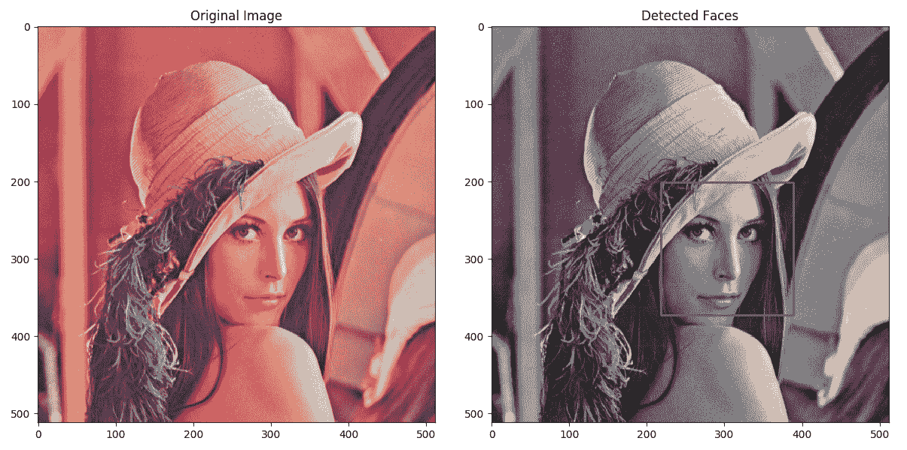

图片来源——Conor Lawless 的 Lenna.png，许可协议为 CC BY 2.0

从前面的截图来看，在左侧，你可以看到原始图像，在右侧是传递给 OpenCV 的图像以及检测到的面部的矩形轮廓。

现在，让我们尝试将这个检测器封装成一个类，使其适用于我们的应用。

# 理解`FaceDetector`类

本章所有相关的面部检测代码都可以在`detectors`模块中的`FaceDetector`类中找到。在实例化时，这个类加载了两个不同的级联分类器，这些分类器用于预处理——即`face_cascade`分类器和`eye_cascade`分类器，如下所示：

```py
import cv2 
import numpy as np 

class FaceDetector:

    def __init__(self, *,
                 face_cascade='params/haarcascade_frontalface_default.xml',
                 eye_cascade='params/haarcascade_lefteye_2splits.xml',
                 scale_factor=4):
```

由于我们的预处理需要一个有效的面部级联，我们确保文件可以被加载。如果不能，我们将抛出一个`ValueError`异常，这样程序将终止并通知用户出了什么问题，如下面的代码块所示：

```py
        # load pre-trained cascades
        self.face_clf = cv2.CascadeClassifier(face_cascade)
        if self.face_clf.empty():
            raise ValueError(f'Could not load face cascade 
            "{face_cascade}"')
```

我们对眼睛分类器也做同样的事情，如下所示：

```py
        self.eye_clf = cv2.CascadeClassifier(eye_cascade)
        if self.eye_clf.empty():
            raise ValueError(
                f'Could not load eye cascade "{eye_cascade}"')
```

面部检测在低分辨率灰度图像上效果最佳。这就是为什么我们也存储一个缩放因子(`scale_factor`)，以便在必要时操作输入图像的缩放版本，如下所示：

```py
self.scale_factor = scale_factor 
```

现在我们已经设置了类的初始化，让我们看看检测面部的算法。

# 在灰度图像中检测面部

现在，我们将之前章节中学到的内容放入一个方法中，该方法将接受一个图像并返回图像中的最大面部。我们返回最大面部是为了简化事情，因为我们知道在我们的应用中，将只有一个用户坐在摄像头前。作为一个挑战，你可以尝试将其扩展以处理多个面部！

我们将检测最大面部的方法称为`detect_face`。让我们一步一步地来看：

1.  如同上一节所述，首先，我们将输入的 RGB 图像转换为灰度图，并通过运行以下代码按`scale_factor`进行缩放：

```py
    def detect_face(self, rgb_img, *, outline=True):
        frameCasc = cv2.cvtColor(cv2.resize(rgb_img, (0, 0),
                                            fx=1.0 / 
                                            self.scale_factor,
                                            fy=1.0 / 
                                            self.scale_factor),
                                 cv2.COLOR_RGB2GRAY)
```

1.  然后，我们在灰度图像中检测人脸，如下所示：

```py
    faces = self.face_clf.detectMultiScale(
            frameCasc,
            scaleFactor=1.1,
            minNeighbors=3,
            flags=cv2.CASCADE_SCALE_IMAGE) * self.scale_factor
```

1.  我们遍历检测到的人脸，如果将`outline=True`关键字参数传递给`detect_face`，则会绘制轮廓。OpenCV 返回给我们头部左上角的`x, y`坐标以及头部宽度和高度`w, h`。因此，为了构建轮廓，我们只需计算轮廓的底部和右侧坐标，然后调用`cv2.rectangle`函数，如下所示：

```py
     for (x, y, w, h) in faces:
            if outline:
                cv2.rectangle(rgb_img, (x, y), (x + w, y + h), 
                              (100, 255, 0), thickness=2)
```

1.  我们从原始 RGB 图像中裁剪出头部。如果我们想要对头部进行更多处理（例如，识别面部表情），可以运行以下代码：

```py
        head = cv2.cvtColor(rgb_img[y:y + h, x:x + w],
                            cv2.COLOR_RGB2GRAY)
```

1.  我们返回以下 4 元组：

    +   一个布尔值，用于检查检测是否成功

    +   添加了人脸轮廓的原图像（如果需要）

    +   根据需要裁剪的头像

    +   原图像中头部位置的坐标

1.  在成功的情况下，我们返回以下内容：

```py
         return True, rgb_img, head, (x, y)
```

在失败的情况下，我们返回没有找到头部的信息，并且对于任何不确定的事项，如这样返回`None`：

```py
        return False, rgb_img, None, (None, None)
```

现在，让我们看看在检测到人脸之后会发生什么，以便为机器学习算法做好准备。

# 预处理检测到的人脸

在检测到人脸之后，我们可能想要在对其进行分类之前先预处理提取的头像区域。尽管人脸级联检测相当准确，但对于识别来说，所有的人脸都必须是竖直且居中于图像中。

这是我们要达成的目标：

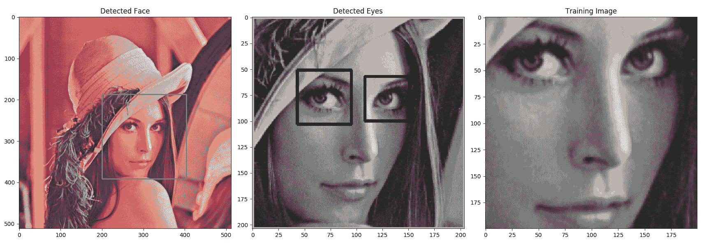

图片来源——由 Conor Lawless 提供的 Lenna.png，许可协议为 CC BY 2.0

如前一个截图所示，由于这不是护照照片，模型中的头部略微向一侧倾斜，同时看向肩膀。人脸区域，如图像级联提取的，显示在前一个截图的中间缩略图中。

为了补偿检测到的盒子中头部朝向和位置，我们旨在旋转、移动和缩放面部，以便所有数据样本都能完美对齐。这是`FaceDetector`类中的`align_head`方法的工作，如下面的代码块所示：

```py
    def align_head(self, head):
        desired_eye_x = 0.25
        desired_eye_y = 0.2
        desired_img_width = desired_img_height = 200
```

在前面的代码中，我们硬编码了一些用于对齐头部的参数。我们希望所有眼睛都在最终图像顶部下方 25%，并且距离左右边缘各 20%，此函数将返回一个头部处理后的图像，其固定大小为 200 x 200 像素。

处理流程的第一步是检测图像中眼睛的位置，之后我们将使用这些位置来构建必要的转换。

# 检测眼睛

幸运的是，OpenCV 自带了一些可以检测睁眼和闭眼的眼睛级联，例如`haarcascade_eye.xml`。这允许我们计算连接两个眼睛中心的线与地平线之间的角度，以便我们可以相应地旋转面部。

此外，添加眼睛检测器将降低我们数据集中出现假阳性的风险，只有当头部和眼睛都成功检测到时，我们才能添加数据样本。

在`FaceDetector`构造函数中从文件加载眼睛级联后，它被应用于输入图像（`head`），如下所示：

```py
        try:
            eye_centers = self.eye_centers(head)
        except RuntimeError:
            return False, head
```

如果我们失败，级联分类器找不到眼睛，OpenCV 将抛出一个`RuntimeError`。在这里，我们正在捕获它并返回一个`(False, head)`元组，表示我们未能对齐头部。

接下来，我们尝试对分类器找到的眼睛的引用进行排序。我们将`left_eye`设置为具有较低第一坐标的眼睛——即左侧的眼睛，如下所示：

```py
        if eye_centers[0][0] < eye_centers[0][1]:
            left_eye, right_eye = eye_centers
        else:
            right_eye, left_eye = eye_centers
```

现在我们已经找到了两个眼睛的位置，我们想要弄清楚我们想要进行什么样的转换，以便将眼睛放置在硬编码的位置——即图像两侧的 25%和顶部以下的 25%。

# 转换面部

转换面部是一个标准过程，可以通过使用`cv2.warpAffine`（回忆第三章，*通过特征匹配和透视变换查找对象*)来实现。我们将遵循以下步骤来完成此转换：

1.  首先，我们计算连接两个眼睛的线与水平线之间的角度（以度为单位），如下所示：

```py
        eye_angle_deg = 180 / np.pi * np.arctan2(right_eye[1] 
                                                 - left_eye[1],
                                                 right_eye[0] 
                                                 - left_eye[0])
```

1.  然后，我们推导出一个缩放因子，将两个眼睛之间的距离缩放到图像宽度的 50%，如下所示：

```py
        eye_dist = np.linalg.norm(left_eye - right_eye)
        eye_size_scale = (1.0 - desired_eye_x * 2) * 
        desired_img_width / eye_dist
```

1.  现在我们有了两个参数（`eye_angle_deg`和`eye_size_scale`），我们可以现在提出一个合适的旋转矩阵，将我们的图像转换，如下所示：

```py
        eye_midpoint = (left_eye + right_eye) / 2
        rot_mat = cv2.getRotationMatrix2D(tuple(eye_midpoint), 
                                          eye_angle_deg,
                                          eye_size_scale)
```

1.  接下来，我们将确保眼睛的中心将在图像中居中，如下所示：

```py
        rot_mat[0, 2] += desired_img_width * 0.5 - eye_midpoint[0]
        rot_mat[1, 2] += desired_eye_y * desired_img_height - 
        eye_midpoint[1]
```

1.  最后，我们得到了一个垂直缩放的图像，看起来像前一个截图中的第三张图像（命名为训练图像），如下所示：

```py
        res = cv2.warpAffine(head, rot_mat, (desired_img_width,
                                             desired_img_width))
        return True, res
```

在这一步之后，我们知道如何从未处理图像中提取整齐、裁剪和旋转的图像。现在，是时候看看如何使用这些图像来识别面部表情了。

# 收集数据

面部表情识别管道封装在`chapter8.py`中。此文件包含一个交互式 GUI，在两种模式（**训练**和**测试**）下运行，如前所述。

我们的应用程序被分成几个部分，如下所述：

1.  使用以下命令从命令行以`collect`模式运行应用程序：

```py
$ python chapter8.py collect
```

之前的命令将在数据收集模式下弹出一个 GUI，以组装一个训练集，

通过`python train_classifier.py`在训练集上训练一个 MLP 分类器。因为这个步骤可能需要很长时间，所以这个过程在自己的脚本中执行。训练成功后，将训练好的权重存储在文件中，以便我们可以在下一步加载预训练的 MLP。

1.  然后，再次以以下方式在`demo`模式下运行 GUI，我们将能够看到在真实数据上面部识别的效果如何：

```py
$ python chapter8.py demo
```

在这种模式下，你将有一个 GUI 来实时对实时视频流中的面部表情进行分类。这一步涉及到加载几个预训练的级联分类器以及我们的预训练 MLP 分类器。然后，这些分类器将被应用于每个捕获的视频帧。

现在，让我们看看如何构建一个用于收集训练数据的应用程序。

# 组装训练数据集

在我们能够训练一个 MLP 之前，我们需要组装一个合适的训练集。这是因为你的脸可能还不是任何现有数据集的一部分（**国家安全局**（**NSA**）的私人收藏不算），因此我们将不得不自己组装。这可以通过回到前几章中的 GUI 应用程序来完成，该应用程序可以访问网络摄像头，并处理视频流的每一帧。

我们将继承`wx_gui.BaseLayout`并调整**用户界面**（**UI**）以满足我们的喜好。我们将有两个类用于两种不同的模式。

GUI 将向用户展示以下六种情感表达之一的选项——即中性、快乐、悲伤、惊讶、愤怒和厌恶。点击按钮后，应用将捕捉到检测到的面部区域并添加到文件中的数据收集。

这些样本然后可以从文件中加载并用于在`train_classifier.py`中训练机器学习分类器，如*步骤 2*（之前给出）所述。

# 运行应用程序

正如我们在前几章中看到的那样，使用**wxpython GUI**，为了运行这个应用（`chapter8.py`），我们需要使用`cv2.VideoCapture`设置屏幕捕获，并将句柄传递给`FaceLayout`类。我们可以通过以下步骤来完成：

1.  首先，我们创建一个`run_layout`函数，它将适用于任何`BaseLayout`子类，如下所示：

```py
def run_layout(layout_cls, **kwargs):
    # open webcam
    capture = cv2.VideoCapture(0)
    # opening the channel ourselves, if it failed to open.
    if not(capture.isOpened()):
        capture.open()

    capture.set(cv2.CAP_PROP_FRAME_WIDTH, 640)
    capture.set(cv2.CAP_PROP_FRAME_HEIGHT, 480)

    # start graphical user interface
    app = wx.App()
    layout = layout_cls(capture, **kwargs)
    layout.Center()
    layout.Show()
    app.MainLoop()
```

如您所见，代码与之前章节中使用的`wxpython`代码非常相似。我们打开网络摄像头，设置分辨率，初始化布局，并启动应用程序的主循环。当你需要多次使用相同的函数时，这种类型的优化是好的。

1.  接下来，我们设置一个参数解析器，它将确定需要运行哪两个布局之一，并使用适当的参数运行它。

为了在两种模式下都使用`run_layout`函数，我们使用`argparse`模块在我们的脚本中添加一个命令行参数，如下所示：

```py
if __name__ == '__main__':
    parser = argparse.ArgumentParser()
    parser.add_argument('mode', choices=['collect', 'demo'])
    parser.add_argument('--classifier')
    args = parser.parse_args()
```

我们使用了 Python 附带的`argparse`模块来设置参数解析器，并添加了具有`collect`和`demo`选项的参数。我们还添加了一个可选的`--classifier`参数，我们将在`demo`模式下使用它。

1.  现在，我们使用用户传递的所有参数，以适当的参数调用`run_layout`函数，如下所示：

```py
    if args.mode == 'collect':
        run_layout(DataCollectorLayout, title='Collect Data')
    elif args.mode == 'demo':
        assert args.svm is not None, 'you have to provide --svm'
        run_layout(FacialExpressionRecognizerLayout,
                   title='Facial Expression Recognizer',
                   classifier_path=args.classifier)
```

如前述代码所示，我们已设置在`demo`模式下传递额外的`classifier_path`参数。我们将在本章后面的部分讨论`FacialExpresssionRecognizerLayout`时看到它是如何被使用的。

现在我们已经建立了如何运行我们的应用程序，让我们构建 GUI 元素。

# 实现数据收集 GUI

与前几章的一些内容类似，该应用程序的 GUI 是通用`BaseLayout`的定制版本，如下所示：

```py
import wx
from wx_gui import BaseLayout

class DataCollectorLayout(BaseLayout):
```

我们通过调用父类的构造函数开始构建 GUI，以确保它被正确初始化，如下所示：

```py
    def __init__(self, *args,
                 training_data='data/cropped_faces.csv',
                 **kwargs):
        super().__init__(*args, **kwargs)
```

注意，我们在之前的代码中添加了一些额外的参数。这些参数是我们类中所有额外的属性，而父类中没有的属性。

在我们继续添加 UI 组件之前，我们还初始化了一个`FaceDetector`实例和用于存储数据的文件引用，如下所示：

```py
        self.face_detector = FaceDetector(
            face_cascade='params/haarcascade_frontalface_default.xml',
            eye_cascade='params/haarcascade_eye.xml')
        self.training_data = training_data
```

注意，我们正在使用硬编码的级联 XML 文件。您可以随意尝试这些文件。

现在，让我们看看我们如何使用`wxpython`构建 UI。

# 增强基本布局

布局的创建再次推迟到名为`augment_layout`的方法中。我们尽可能保持布局简单。我们创建一个用于获取视频帧的面板，并在其下方绘制一排按钮。

然后点击六个单选按钮之一，以指示您要记录哪种面部表情，然后将头部放在边界框内，并点击`Take Snapshot`按钮。

因此，让我们看看如何构建六个按钮，并将它们正确地放置在`wx.Panel`对象上。相应的代码如下所示：

```py
    def augment_layout(self):
        pnl2 = wx.Panel(self, -1)
        self.neutral = wx.RadioButton(pnl2, -1, 'neutral', (10, 10),
                                      style=wx.RB_GROUP)
        self.happy = wx.RadioButton(pnl2, -1, 'happy')
        self.sad = wx.RadioButton(pnl2, -1, 'sad')
        self.surprised = wx.RadioButton(pnl2, -1, 'surprised')
        self.angry = wx.RadioButton(pnl2, -1, 'angry')
        self.disgusted = wx.RadioButton(pnl2, -1, 'disgusted')
        hbox2 = wx.BoxSizer(wx.HORIZONTAL)
        hbox2.Add(self.neutral, 1)
        hbox2.Add(self.happy, 1)
        hbox2.Add(self.sad, 1)
        hbox2.Add(self.surprised, 1)
        hbox2.Add(self.angry, 1)
        hbox2.Add(self.disgusted, 1)
        pnl2.SetSizer(hbox2)
```

您可以看到，尽管代码量很大，但我们所写的大部分内容都是重复的。我们为每种情绪创建一个`RadioButton`，并将按钮添加到`pnl2`面板中。

`Take Snapshot`按钮放置在单选按钮下方，并将绑定到`_on_snapshot`方法，如下所示：

```py
        # create horizontal layout with single snapshot button
        pnl3 = wx.Panel(self, -1)
        self.snapshot = wx.Button(pnl3, -1, 'Take Snapshot')
        self.Bind(wx.EVT_BUTTON, self._on_snapshot, self.snapshot)
        hbox3 = wx.BoxSizer(wx.HORIZONTAL)
        hbox3.Add(self.snapshot, 1)
        pnl3.SetSizer(hbox3)
```

如注释所示，我们创建了一个新的面板，并添加了一个带有`Take Snapshot`标签的常规按钮。重要的是，我们将按钮的点击事件绑定到`self._on_snapshot`方法，这样我们点击`Take Snapshot`按钮后，将处理捕获的每一张图片。

布局将如下截图所示：

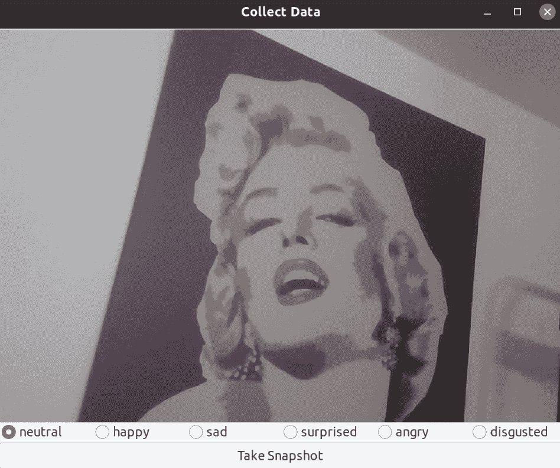

要使这些更改生效，需要将创建的面板添加到现有面板的列表中，如下所示：

```py
        # arrange all horizontal layouts vertically
        self.panels_vertical.Add(pnl2, flag=wx.EXPAND | wx.BOTTOM, 
                                 border=1)
        self.panels_vertical.Add(pnl3, flag=wx.EXPAND | wx.BOTTOM, 
                                 border=1)
```

其余的可视化管道由`BaseLayout`类处理。

现在，让我们看看我们是如何在视频捕获中一旦人脸出现就使用`process_frame`方法添加边界框的。

# 处理当前帧

`process_frame`方法被调用在所有图像上，我们希望在视频流中出现人脸时显示一个围绕人脸的帧。如下所示：

```py
    def process_frame(self, frame_rgb: np.ndarray) -> np.ndarray:
        _, frame, self.head, _ = self.face_detector.detect_face(frame_rgb)
        return frame
```

我们刚刚调用了在布局类的构造函数中创建的`self.face_detector`对象的`FaceDetector.detect_face`方法。记得从上一节中，它使用 Haar 级联在当前帧的降尺度灰度版本中检测人脸。

因此，如果我们识别出人脸，我们就添加一个帧；就是这样。现在，让我们看看我们是如何在`_on_snapshot`方法中存储训练图像的。

# 存储数据

当用户点击“拍摄快照”按钮，并调用`_on_snapshot`事件监听器方法时，我们将存储数据，如下所示：

```py
    def _on_snapshot(self, evt):
        """Takes a snapshot of the current frame

           This method takes a snapshot of the current frame, preprocesses
           it to extract the head region, and upon success adds the data
           sample to the training set.
        """
```

让我们看看这个方法内部的代码，如下所示：

1.  首先，我们通过找出哪个单选按钮被选中来确定图像的标签，如下所示：

```py
        if self.neutral.GetValue():
            label = 'neutral'
        elif self.happy.GetValue():
            label = 'happy'
        elif self.sad.GetValue():
            label = 'sad'
        elif self.surprised.GetValue():
            label = 'surprised'
        elif self.angry.GetValue():
            label = 'angry'
        elif self.disgusted.GetValue():
            label = 'disgusted'
```

如你所见，一旦我们意识到每个单选按钮都有一个`GetValue()`方法，它仅在它被选中时返回`True`，这个过程就非常直接。

1.  接下来，我们需要查看当前帧中检测到的面部区域（由`detect_head`存储在`self.head`中）并将其与其他所有收集到的帧对齐。也就是说，我们希望所有的人脸都是直立的，眼睛是对齐的。

否则，如果我们不对齐数据样本，我们面临的风险是分类器会将眼睛与鼻子进行比较。因为这个计算可能很昂贵，所以我们不在`process_frame`方法的每一帧上应用它，而是在`_on_snapshot`方法中仅在对快照进行操作时应用，如下所示：

```py
        if self.head is None:
            print("No face detected")
        else:
            success, aligned_head = 
            self.face_detector.align_head(self.head)
```

由于这发生在调用`process_frame`之后，我们已经有权限访问`self.head`，它存储了当前帧中头部的图像。

1.  接下来，如果我们已经成功对齐了头部（也就是说，如果我们已经找到了眼睛），我们将存储数据。否则，我们将通过向终端发送一个`print`命令来通知用户，如下所示：

```py
            if success:
                save_datum(self.training_data, label, aligned_head)
                print(f"Saved {label} training datum.")
            else:
                print("Could not align head (eye detection 
                                             failed?)")
```

实际的保存是在`save_datum`函数中完成的，我们将其抽象出来，因为它不是 UI 的一部分。此外，如果你想要向文件中添加不同的数据集，这会很有用，如下所示：

```py
def save_datum(path, label, img):
    with open(path, 'a', newline='') as outfile:
        writer = csv.writer(outfile)
        writer.writerow([label, img.tolist()])
```

如前所述的代码所示，我们使用`.csv`文件来存储数据，其中每个图像都是一个`newline`。所以，如果你想回去删除一个图像（也许你忘记梳理头发），你只需要用文本编辑器打开`.csv`文件并删除那一行。

现在，让我们转向更有趣的部分，找出我们如何使用我们收集的数据来训练一个机器学习模型以检测情感。

# 理解面部情感识别

在本节中，我们将训练一个 MLP 来识别图片中的面部情感。

我们之前已经指出，找到最能描述数据的特征往往是整个学习任务的一个重要部分。我们还探讨了常见的预处理方法，如**均值减法**和**归一化**。

这里，我们将探讨一个在人脸识别中有着悠久传统的额外方法——那就是 PCA。我们希望即使我们没有收集成千上万的训练图片，PCA 也能帮助我们获得良好的结果。

# 处理数据集

类似于第七章，*学习识别交通标志*，我们在`data/emotions.py`中编写了一个新的数据集解析器，该解析器将解析我们自行组装的训练集。

我们定义了一个`load_data`函数，该函数将加载训练数据并`返回`一个包含收集到的`数据`及其对应标签的元组，如下所示：

```py
def load_collected_data(path):
    data, targets = [], []
    with open(path, 'r', newline='') as infile:
        reader = csv.reader(infile)
        for label, sample in reader:
            targets.append(label)
            data.append(json.loads(sample))
    return data, targets
```

这段代码，类似于所有处理代码，是自包含的，并位于`data/process.py`文件中，类似于第七章，*学习识别交通标志*。

本章中的特征化函数将是`pca_featurize`函数，它将对所有样本执行 PCA。但与第七章，*学习识别交通标志*不同，我们的特征化函数考虑了整个数据集的特征，而不是单独对每张图像进行操作。

现在，它将返回一个包含训练数据和应用于测试数据所需的所有参数的训练数据元组，如下所示：

```py
def pca_featurize(data) -> (np.ndarray, List)
```

现在，让我们弄清楚 PCA 是什么，以及为什么我们需要它。

# 学习 PCA

PCA 是一种降维技术，在处理高维数据时非常有用。从某种意义上说，你可以将图像视为高维空间中的一个点。如果我们通过连接所有行或所有列将高度为`m`和宽度为`n`的 2D 图像展平，我们得到一个长度为*m x n*的（特征）向量。这个向量中第 i 个元素的值是图像中第 i 个像素的灰度值。

为了描述所有可能的具有这些精确尺寸的 2D 灰度图像，我们需要一个*m x n*维度的向量空间，其中包含*256^(m x n)*个向量。哇！

当考虑到这些数字时，一个有趣的问题浮现在脑海中——*是否可能存在一个更小、更紧凑的向量空间（使用小于 m x n 的特征）来同样好地描述所有这些图像？* 因为毕竟，我们之前已经意识到灰度值并不是内容的最有信息量的度量。

这就是主成分分析（PCA）介入的地方。考虑一个数据集，我们从其中提取了恰好两个特征。这些特征可能是某些*x*和*y*位置的像素的灰度值，但它们也可能比这更复杂。如果我们沿着这两个特征轴绘制数据集，数据可能被映射到某个多元高斯分布中，如下面的截图所示：

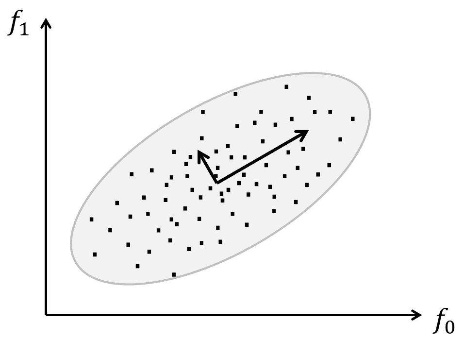

PCA 所做的是将所有数据点旋转，直到数据映射到解释数据大部分*扩散*的两个轴（两个内嵌向量）上。PCA 认为这两个轴是最有信息的，因为如果你沿着它们走，你可以看到大部分数据点分离。用更技术性的术语来说，PCA 旨在通过正交线性变换将数据转换到一个新的坐标系中。

新的坐标系被选择得使得如果你将数据投影到这些新轴上，第一个坐标（称为**第一个主成分**）观察到最大的方差。在前面的截图中，画的小向量对应于协方差矩阵的特征向量，它们的尾部被移动到分布的均值处。

如果我们之前已经计算了一组基向量（`top_vecs`）和均值（`center`），那么转换数据将非常直接，正如前一段所述——我们从每个数据点中减去中心，然后将这些向量乘以主成分，如下所示：

```py
def _pca_featurize(data, center, top_vecs):
    return np.array([np.dot(top_vecs, np.array(datum).flatten() - center)
                     for datum in data]).astype(np.float32)
```

注意，前面的代码将对任何数量的`top_vecs`都有效；因此，如果我们只提供`num_components`数量的顶级向量，它将降低数据的维度到`num_components`。

现在，让我们构建一个`pca_featurize`函数，它只接受数据，并返回转换以及复制转换所需的参数列表——即`center`和`top_vecs`——这样我们就可以在测试数据上应用`_pcea_featurize`，如下所示：

```py
def pca_featurize(training_data) -> (np.ndarray, List)
```

幸运的是，有人已经想出了如何在 Python 中完成所有这些操作。在 OpenCV 中，执行 PCA 就像调用`cv2.PCACompute`一样简单，但我们必须传递正确的参数，而不是重新格式化我们从 OpenCV 得到的内容。以下是步骤：

1.  首先，我们将`training_data`转换为一个 NumPy 2D 数组，如下所示：

```py
x_arr = np.array(training_data).reshape((len(training_data), -1)).astype(np.float32)
```

1.  然后，我们调用`cv2.PCACompute`，它计算数据的中心，以及主成分，如下所示：

```py
    mean, eigvecs = cv2.PCACompute(x_arr, mean=None)
```

1.  我们可以通过运行以下代码来限制自己只使用`num_components`中最有信息量的成分：

```py
    # Take only first num_components eigenvectors.
    top_vecs = eigvecs[:num_components]
```

PCA 的美丽之处在于，根据定义，第一个主成分解释了数据的大部分方差。换句话说，第一个主成分是数据中最有信息量的。这意味着我们不需要保留所有成分来得到数据的良好表示。

1.  我们还将`mean`转换为创建一个新的`center`变量，它是一个表示数据中心的 1D 向量，如下所示：

```py
    center = mean.flatten()
```

1.  最后，我们返回由`_pca_featurize`函数处理过的训练数据，以及传递给`_pca_featurize`函数的必要参数，以便复制相同的转换，这样测试数据就可以以与训练数据完全相同的方式被*特征化*，如下所示：

```py
    args = (center, top_vecs)
    return _pca_featurize(training_data, *args), args
```

现在我们知道了如何清理和特征化我们的数据，是时候看看我们用来学习识别面部情绪的训练方法了。

# 理解 MLP

MLP 已经存在了一段时间。MLP 是用于将一组输入数据转换为输出数据的**人工神经网络（ANNs**）。

MLP 的核心是一个**感知器**，它类似于（但过于简化）生物神经元。通过在多个层中组合大量感知器，MLP 能够对其输入数据进行非线性决策。此外，MLP 可以通过**反向传播**进行训练，这使得它们对于监督学习非常有兴趣。

以下部分解释了感知器的概念。

# 理解感知器

感知器是一种二分类器，由 Frank Rosenblatt 在 20 世纪 50 年代发明。感知器计算其输入的加权总和，如果这个总和超过阈值，它输出一个`1`；否则，它输出一个`0`。

在某种意义上，感知器正在整合证据，其传入信号表示某些对象实例的存在（或不存在），如果这种证据足够强烈，感知器就会活跃（或沉默）。这与研究人员认为生物神经元在大脑中（或可以用来做）做的事情（或可以用来做）松散相关，因此有*ANN*这个术语。

感知器的一个草图在以下屏幕截图中有展示：

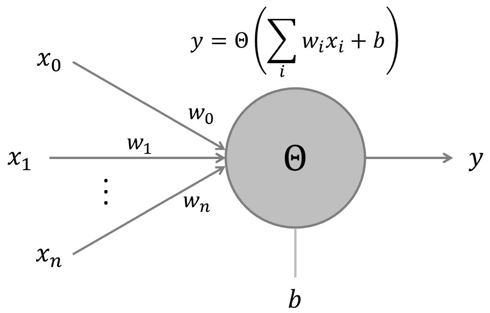

在这里，感知器计算所有输入（`x[i]`）的加权（`w[i]`）总和，加上一个偏置项（`b`）。这个输入被送入一个非线性激活函数（`θ`），它决定了感知器的输出（`y`）。在原始算法中，激活函数是**Heaviside** **阶跃函数**。

在现代 ANN 的实现中，激活函数可以是任何从 Sigmoid 到双曲正切函数的范围。Heaviside 阶跃函数和 Sigmoid 函数在以下屏幕截图中有展示：

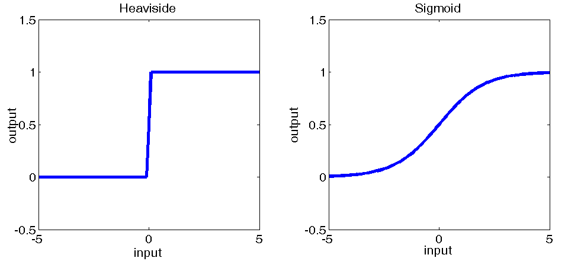

根据激活函数的不同，这些网络可能能够执行分类或回归。传统上，只有当节点使用 Heaviside 阶跃函数时，人们才谈论 MLP。

# 了解深度架构

一旦你搞清楚了感知器的工作原理，将多个感知器组合成更大的网络就很有意义了。MLP（多层感知器）通常至少包含三个层，其中第一层为数据集的每个输入特征都有一个节点（或神经元），而最后一层为每个类别标签都有一个节点。

在第一层和最后一层之间的层被称为隐藏层。以下截图展示了这种前馈神经网络的例子：

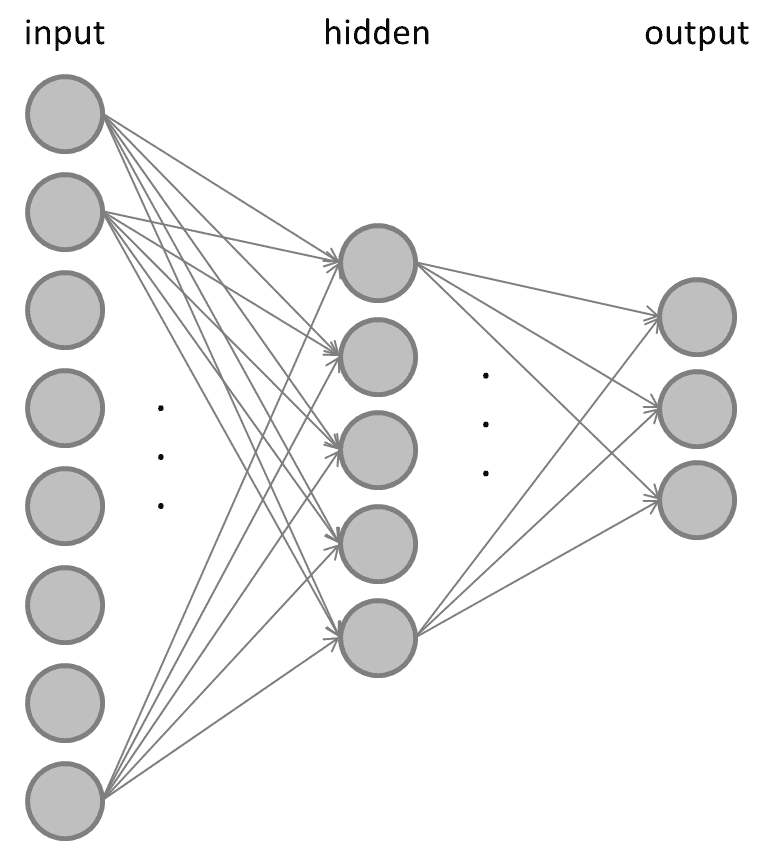

在前馈神经网络中，输入层的一些或所有节点连接到隐藏层的所有节点，隐藏层的一些或所有节点连接到输出层的一些或所有节点。你通常会选择输入层的节点数等于数据集中的特征数，以便每个节点代表一个特征。

类似地，输出层的节点数通常等于数据集中的类别数，因此当输入样本为类别`c`时，输出层的第`c`个节点是活跃的，而其他所有节点都是沉默的。

当然，也可以有多个隐藏层。通常，事先并不清楚网络的理想大小应该是多少。

通常，当你向网络中添加更多神经元时，你会看到训练集上的误差率下降，如下面的截图所示（*较细的*，*红色曲线*）：

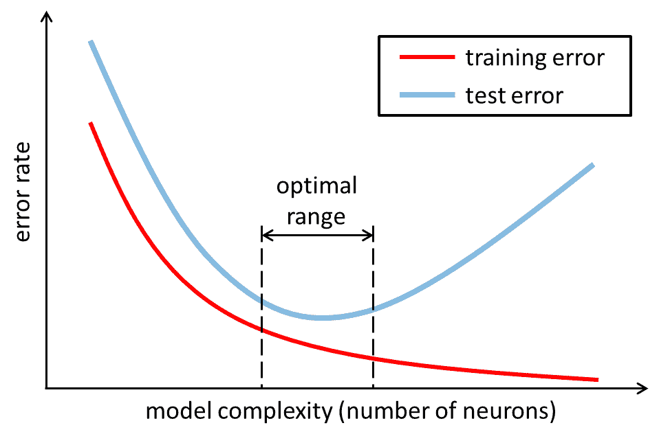

这是因为模型的表达能力或复杂性（也称为**Vapnik-Chervonenkis**或**VC 维度**）随着神经网络规模的增加而增加。然而，对于前面截图中所显示的测试集上的误差率（*较粗的*，*蓝色曲线*）来说，情况并非如此。

相反，你会发现，随着模型复杂性的增加，测试误差会达到其最小值，向网络中添加更多神经元也不再能提高测试数据的性能。因此，你希望将神经网络的规模保持在前面截图中所标记的“最佳范围”，这是网络实现最佳泛化性能的地方。

你可以这样想——一个弱复杂度模型（在图表的左侧）可能太小，无法真正理解它试图学习的数据集，因此训练集和测试集上的误差率都很大。这通常被称为**欠拟合**。

另一方面，图表右侧的模型可能过于复杂，以至于开始记住训练数据中每个样本的具体细节，而没有注意到使样本与众不同的通用属性。因此，当模型需要预测它以前从未见过的数据时，它将失败，从而在测试集上产生很大的误差率。这通常被称为**过拟合**。

相反，你想要的是一个既不过拟合也不欠拟合的模型。通常，这只能通过试错来实现；也就是说，将网络大小视为一个需要根据要执行的确切任务进行调整和微调的超参数。

MLP 通过调整其权重来学习，当展示一个类`c`的输入样本时，输出层的第*c*个节点是活跃的，而其他所有节点都是沉默的。MLP 通过**反向传播**方法进行训练，这是一种计算网络中任何突触权重或神经元偏置相对于**损失函数**的偏导数的算法。这些偏导数可以用来更新网络中的权重和偏置，以逐步减少整体损失。

通过向网络展示训练样本并观察网络的输出，可以获得一个损失函数。通过观察哪些输出节点是活跃的，哪些是休眠的，我们可以计算最后一层的输出与通过损失函数提供的真实标签之间的相对误差。

然后，我们对网络中的所有权重进行修正，以便随着时间的推移误差逐渐减小。结果发现，隐藏层的误差取决于输出层，输入层的误差取决于隐藏层和输出层的误差。因此，从某种意义上说，误差会反向传播通过网络。在 OpenCV 中，通过在训练参数中指定`cv2.ANN_MLP_TRAIN_PARAMS_BACKPROP`来使用反向传播。

梯度下降有两种常见的类型——即**随机梯度下降**和**批量学习**。

在随机梯度下降中，我们在展示每个训练示例后更新权重，而在批量学习中，我们以批量的形式展示训练示例，并且只在每个批量展示后更新权重。在这两种情况下，我们必须确保我们只对每个样本进行轻微的权重调整（通过调整**学习率**），以便网络随着时间的推移逐渐收敛到一个稳定的解。

现在，在学习了 MLP 的理论之后，让我们动手用 OpenCV 来实现它。

# 设计用于面部表情识别的 MLP

类似于第七章，*学习识别交通标志*，我们将使用 OpenCV 提供的机器学习类，即`ml.ANN_MLP`。以下是创建和配置 OpenCV 中 MLP 的步骤：

1.  实例化一个空的`ANN_MLP`对象，如下所示：

```py
    mlp = cv2.ml.ANN_MLP_create()
```

1.  设置网络架构——第一层等于数据的维度，最后一层等于所需的输出大小`6`（用于可能的情绪数量），如下所示：

```py
    mlp.setLayerSizes(np.array([20, 10, 6], dtype=np.uint8)
```

1.  我们将训练算法设置为反向传播，并使用对称的 sigmoid 函数作为激活函数，正如我们在前面的章节中讨论的那样，通过运行以下代码：

```py
    mlp.setTrainMethod(cv2.ml.ANN_MLP_BACKPROP, 0.1)
    mlp.setActivationFunction(cv2.ml.ANN_MLP_SIGMOID_SYM)
```

1.  最后，我们将终止条件设置为在`30`次迭代后或当损失达到小于`0.000001`的值时，如下所示，我们就可以准备训练 MLP 了：

```py
    mlp.setTermCriteria((cv2.TERM_CRITERIA_COUNT | 
                         cv2.TERM_CRITERIA_EPS, 30, 0.000001 ))
```

为了训练 MLP，我们需要训练数据。我们还想了解我们的分类器做得如何，因此我们需要将收集到的数据分为训练集和测试集。

分割数据最好的方式是确保训练集和测试集中没有几乎相同的图像——例如，用户双击了“捕获快照”按钮，我们有两个相隔毫秒的图像，因此几乎是相同的。不幸的是，这是一个繁琐且手动的过程，超出了本书的范围。

我们定义函数的签名，如下。我们想要得到一个大小为`n`的数组的索引，我们想要指定训练数据与所有数据的比例：

```py
def train_test_split(n, train_portion=0.8):
```

带着签名，让我们一步一步地回顾`train_test_split`函数，如下所示：

1.  首先，我们创建一个`indices`列表并对其进行`shuffle`，如下所示：

```py
    indices = np.arange(n)
    np.random.shuffle(indices)
```

1.  然后，我们计算`N`训练数据集中需要有多少个训练点，如下所示：

```py
    N = int(n * train_portion)
```

1.  之后，我们为训练数据的前`N`个索引创建一个选择器，并为剩余的`indices`创建一个选择器，用于测试数据，如下所示：

```py
    return indices[:N], indices[N:]
```

现在我们有一个模型类和一个训练数据生成器，让我们看看如何训练 MLP。

# 训练 MLP

OpenCV 提供了所有的训练和预测方法，因此我们需要弄清楚如何格式化我们的数据以符合 OpenCV 的要求。

首先，我们将数据分为训练/测试，并对训练数据进行特征化，如下所示：

```py
    train, test = train_test_split(len(data), 0.8)
    x_train, pca_args = pca_featurize(np.array(data)[train])
```

这里，`pca_args`是我们如果想要特征化任何未来的数据（例如，演示中的实时帧）需要存储的参数。

因为`cv2.ANN_MLP`模块的`train`方法不允许整数值的类别标签，我们需要首先将`y_train`转换为 one-hot 编码，只包含 0 和 1，然后可以将其输入到`train`方法中，如下所示：

```py
    encoded_targets, index_to_label = one_hot_encode(targets)
    y_train = encoded_targets[train]
    mlp.train(x_train, cv2.ml.ROW_SAMPLE, y_train)
```

one-hot 编码在`train_classifiers.py`中的`one_hot_encode`函数中处理，如下所示：

1.  首先，我们确定数据中有多少个点，如下所示：

```py
def one_hot_encode(all_labels) -> (np.ndarray, Callable):
    unique_lebels = list(sorted(set(all_labels)))
```

1.  `all_labels`中的每个`c`类标签都需要转换为一个长度为`len(unique_labels)`的 0 和 1 的向量，其中所有条目都是 0，除了*c^(th)*，它是一个 1。我们通过分配一个全 0 的向量来准备这个操作，如下所示：

```py
    y = np.zeros((len(all_labels), len(unique_lebels))).astype(np.float32)
```

1.  然后，我们创建字典，将列的索引映射到标签，反之亦然，如下所示：

```py
    index_to_label = dict(enumerate(unique_lebels))
    label_to_index = {v: k for k, v in index_to_label.items()
```

1.  这些索引处的向量元素需要设置为`1`，如下所示：

```py
    for i, label in enumerate(all_labels):
        y[i, label_to_index[label]] = 1
```

1.  我们还返回`index_to_label`，这样我们就能从预测向量中恢复标签，如下所示：

```py
    return y, index_to_label
```

现在我们继续测试我们刚刚训练的 MLP。

# 测试 MLP

类似于第七章，*学习识别交通标志*，我们将评估我们的分类器在准确率、精确率和召回率方面的性能。

为了重用我们之前的代码，我们只需要计算 `y_hat` 并通过以下方式将 `y_true` 一起传递给度量函数：

1.  首先，我们使用存储在特征化训练数据时的 `pca_args` 和 `_pca_featurize` 函数，对测试数据进行特征化，如下所示：

```py
     x_test = _pca_featurize(np.array(data)[test], *pca_args)
```

1.  然后，我们预测新的标签，如下所示：

```py
_, predicted = mlp.predict(x_test)
    y_hat = np.array([index_to_label[np.argmax(y)] for y 
    in predicte
```

1.  最后，我们使用存储的测试索引提取真实的测试标签，如下所示：

```py
    y_true = np.array(targets)[test]
```

剩下的唯一要传递给函数的是 `y_hat` 和 `y_true`，以计算我们分类器的准确率。

我需要 84 张图片（每种情绪 10-15 张）才能达到 `0.92` 的训练准确率，并拥有足够好的分类器向我的朋友们展示我的软件。*你能打败它吗？*

现在，让我们看看如何运行训练脚本，并以演示应用程序能够使用的方式保存输出。

# 运行脚本

可以使用 `train_classifier.py` 脚本来训练和测试 MLP 分类器，该脚本执行以下操作：

1.  脚本首先将 `--data` 命令行选项设置为保存数据的位置，将 `--save` 设置为我们想要保存训练模型的目录位置（此参数是可选的），如下所示：

```py
if __name__ == '__main__':
    parser = argparse.ArgumentParser()
    parser.add_argument('--data', required=True)
    parser.add_argument('--save', type=Path)
    args = parser.parse_args()
```

1.  然后，我们加载保存的数据，并按照上一节中描述的训练过程进行，如下所示：

```py
    data, targets = load_collected_data(args.data)

    mlp = cv2.ml.ANN_MLP_create()
    ...
    mlp.train(...
```

1.  最后，我们通过运行以下代码检查用户是否希望我们保存训练好的模型：

```py
    if args.save:
        print('args.save')
        x_all, pca_args = pca_featurize(np.array(data))
        mlp.train(x_all, cv2.ml.ROW_SAMPLE, encoded_targets)
        mlp.save(str(args.save / 'mlp.xml'))
        pickle_dump(index_to_label, args.save / 'index_to_label')
        pickle_dump(pca_args, args.save / 'pca_args')
```

之前的代码保存了训练好的模型，`index_to_label` 字典，以便在演示中显示可读的标签，以及 `pca_args`，以便在演示中特征化实时摄像头帧。

保存的 `mlp.xml` 文件包含网络配置和学习的权重。OpenCV 知道如何加载它。所以，让我们看看演示应用程序的样子。

# 将所有这些放在一起

为了运行我们的应用程序，我们需要执行主函数例程（`chapter8.py`），该例程加载预训练的级联分类器和预训练的 MLP，并将它们应用于网络摄像头的实时流中的每一帧。

然而，这次，我们不会收集更多的训练样本，而是以不同的选项启动程序，如下所示：

```py
 $ python chapter8.py demo --classifier data/clf1
```

这将启动应用程序，并使用新的 `FacialExpressionRecognizerLayout` 布局，它是 `BasicLayout` 的子类，没有任何额外的 UI 元素。让我们首先看看构造函数，如下所示：

1.  它读取并初始化由训练脚本存储的所有数据，如下所示：

```py
class FacialExpressionRecognizerLayout(BaseLayout):
    def __init__(self, *args,
                 clf_path=None,
                 **kwargs):
        super().__init__(*args, **kwargs)
```

1.  使用 `ANN_MLP_load` 加载预训练的分类器，如下所示：

```py
self.clf = cv2.ml.ANN_MLP_load(str(clf_path / 'mlp.xml'))
```

1.  它加载我们想要从训练中传递的 Python 变量，如下所示：

```py
        self.index_to_label = pickle_load(clf_path 
                                          / 'index_to_label')
        self.pca_args = pickle_load(clf_path / 'pca_args')
```

1.  它初始化一个 `FaceDetector` 类，以便能够进行人脸识别，如下所示：

```py
        self.face_detector = FaceDetector(
            face_cascade='params/
            haarcascade_frontalface_default.xml',
            eye_cascade='params/haarcascade_lefteye_2splits.xml')
```

一旦我们从训练中获得了所有这些部件，我们就可以继续编写代码来为面部添加标签。在这个演示中，我们没有使用任何额外的按钮；因此，我们唯一要实现的方法是`process_frame`，它首先尝试在实时流中检测人脸并在其上方放置标签，我们将按以下步骤进行：

1.  首先，我们尝试通过运行以下代码来检测视频流中是否存在人脸：

```py
   def process_frame(self, frame_rgb: np.ndarray) -> np.ndarray:
        success, frame, self.head, (x, y) = 
        self.face_detector.detect_face(frame_rgb)
```

1.  如果没有人脸，我们不做任何操作，并返回一个未处理的`frame`，如下所示：

```py
        if not success:
            return frame
```

1.  一旦检测到人脸，我们尝试将人脸对齐（与收集训练数据时相同），如下所示：

```py
        success, head = self.face_detector.align_head(self.head)
        if not success:
            return frame
```

1.  如果我们成功，我们将使用 MLP 对头部进行特征化并预测标签，如下所示：

```py
        _, output = self.clf.predict(self.featruize_head(head))
        label = self.index_to_label[np.argmax(output)]
```

1.  最后，我们通过运行以下代码将带有标签的文本放在人脸的边界框上，并将其显示给用户：

```py
        cv2.putText(frame, label, (x, y - 20),
                    cv2.FONT_HERSHEY_COMPLEX, 1, (0, 255, 0), 2)

        return frame
```

在前面的方法中，我们使用了`featurize_head`，这是一个方便的函数来调用`_pca_featurize`，如下面的代码块所示：

```py
    def featurize_head(self, head):
        return _pca_featurize(head[None], *self.pca_args)
```

最终结果如下所示：

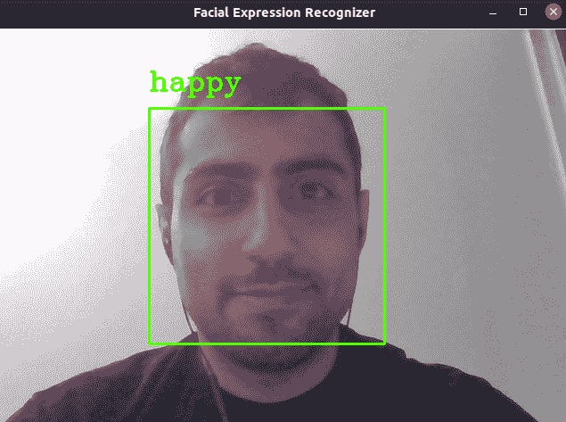

尽管分类器只训练了大约 100 个训练样本，但它能够可靠地检测直播流中每一帧的我的各种面部表情，无论我的脸在那一刻看起来多么扭曲。

这表明之前训练的神经网络既没有欠拟合也没有过拟合数据，因为它能够预测正确的类别标签，即使是对于新的数据样本。

# 摘要

这本书的这一章真正总结了我们的经验，并使我们能够将各种技能结合起来，最终开发出一个端到端的应用程序，该应用程序包括物体检测和物体识别。我们熟悉了 OpenCV 提供的各种预训练的级联分类器，我们收集并创建了我们的训练数据集，学习了 MLP，并将它们训练来识别面部表情（至少是我的面部表情）。

分类器无疑受益于我是数据集中唯一的主题这一事实，但，凭借你在整本书中学到的所有知识和经验，现在是时候克服这些限制了。

在学习本章的技术之后，你可以从一些较小的东西开始，并在你（室内和室外，白天和夜晚，夏天和冬天）的图像上训练分类器。或者，你可以看看**Kaggle 的面部表情识别挑战**，那里有很多你可以玩的数据。

如果你对机器学习感兴趣，你可能已经知道有许多可用的库，例如**Pylearn**、**scikit-learn**和**PyTorch**。

在下一章中，你将开始你的深度学习之旅，并亲手操作深度卷积神经网络。你将熟悉多个深度学习概念，并使用迁移学习创建和训练自己的分类和定位网络。为了完成这项任务，你将使用**Keras**中可用的预训练分类卷积神经网络。在整个章节中，你将广泛使用**Keras**和**TensorFlow**，它们是当时最受欢迎的深度学习框架之一。

# 进一步阅读

+   **Kaggle 面部表情识别挑战**: [`www.kaggle.com/c/challenges-in-representation-learning-facial-expression-recognition-challenge`](https://www.kaggle.com/c/challenges-in-representation-learning-facial-expression-recognition-challenge).

+   **Pylearn**: [`github.com/lisa-lab/pylearn2`](https://github.com/lisa-lab/pylearn2).

+   **scikit-learn**: [`scikit-learn.org`](http://scikit-learn.org).

+   **pycaffe**: [`caffe.berkeleyvision.org`](http://caffe.berkeleyvision.org).

+   **Theano**: [`deeplearning.net/software/theano`](http://deeplearning.net/software/theano).

+   **Torch**: [`torch.ch`](http://torch.ch).

+   **UC Irvine 机器学习库**: [`archive.ics.uci.edu/ml`](http://archive.ics.uci.edu/ml).

# 贡献

`Lenna.png`—图像 Lenna 可在 [`www.flickr.com/photos/15489034@N00/3388463896`](http://www.flickr.com/photos/15489034@N00/3388463896) 由 Conor Lawless 提供，授权为 CC 2.0 Generic。
