# 学习如何分类和定位物体

到目前为止，我们已经研究了一系列算法和方法，你学习了如何借助计算机视觉解决现实世界的问题。近年来，随着**图形处理单元**（**GPU**）等设备提供的强大硬件计算能力的出现，许多算法应运而生，这些算法利用了这种能力，在计算机视觉任务中实现了最先进的结果。通常，这些算法基于神经网络，这使得算法的创造者能够从数据中提取大量有意义的信息。

同时，与经典方法相比，这些信息通常很难解释。从这个角度来看，你可能会说我们正在接近人工智能——也就是说，我们正在给计算机一个方法，然后它自己找出如何完成剩下的工作。为了不让这一切显得如此神秘，让我们在本章中学习关于深度学习模型的知识。

正如你已经看到的，计算机视觉中的一些经典问题包括目标检测和定位。让我们看看在本章中如何使用深度学习模型来分类和定位物体。

本章的目标是学习重要的深度学习概念，如迁移学习，以及如何将它们应用到构建你自己的物体分类器和定位器中。具体来说，我们将涵盖以下主题：

+   准备用于训练深度学习模型的大型数据集

+   理解**卷积神经网络**（**CNNs**）

+   使用卷积神经网络进行分类和定位

+   学习迁移学习

+   实现激活函数

+   理解反向传播

我们将首先准备一个用于训练的数据集。然后，我们将继续了解如何使用预训练模型来创建一个新的分类器。一旦你明白了这个过程，我们将继续前进，构建更复杂的架构，这些架构将执行定位。

在这些步骤中，我们将使用**牛津-IIIT-Pet**数据集。最后，我们将运行一个应用，该应用将使用我们训练好的定位网络进行推理。尽管这个网络仅使用宠物的头部边界框进行训练，但你将看到它对于定位人类头部位置也非常有效。后者将展示我们模型泛化的能力。

了解深度学习的这些概念并在实际应用中看到它们的效果，在你使用深度学习模型创建自己的应用或开始研究全新的深度学习架构时，将会非常有用。

# 开始学习

如我们在这本书的所有章节中提到的，你需要安装 OpenCV。除此之外，你还需要安装 TensorFlow。

牛津-IIIT-Pet 数据集可在[`www.robots.ox.ac.uk/~vgg/data/pets/`](https://www.robots.ox.ac.uk/~vgg/data/pets/)下载，以及我们的数据集准备脚本，该脚本将自动为您下载。

您可以在本章节（GitHub 仓库）中找到我们提供的代码（[`github.com/PacktPublishing/OpenCV-4-with-Python-Blueprints-Second-Edition`](https://github.com/PacktPublishing/OpenCV-4-with-Python-Blueprints-Second-Edition)）。您还可以使用仓库中可用的 Docker 文件在本章中运行代码。有关 Docker 文件的更多信息，请参阅附录 B，*设置 Docker 容器*。

# 规划应用程序

最终的应用程序将包括准备数据集、训练模型以及使用来自相机的输入运行模型推理的模块。这需要以下组件：

+   `main.py`：这是启动应用程序并在实时中定位宠物头部的主要脚本。

+   `data.py`：这是一个模块，用于下载和准备训练数据集。

+   `classification.py`：这是一个用于训练分类网络的脚本。

+   `localization.py`：这是一个用于训练和保存定位网络的脚本。

在准备训练数据集后，我们将执行以下操作以完成我们的应用：

1.  我们将首先使用迁移学习训练一个分类网络。

1.  接下来，我们将使用迁移学习再次训练一个目标定位网络。

1.  在我们创建和训练定位网络后，我们将运行`main.py`脚本以实时定位头部。

让我们从学习如何准备将要运行我们应用的推理脚本开始。该脚本将连接到您的相机，使用我们将创建的定位模型在视频流的每一帧中找到头部位置，并在实时中展示结果。

# 准备推理脚本

我们的推理脚本相当简单。它将首先准备一个绘图函数，然后加载模型并将其连接到相机。然后，它将遍历视频流的帧。在循环中，对于流中的每一帧，它将使用导入的模型进行推理，并使用绘图函数显示结果。让我们按照以下步骤创建一个完整的脚本：

1.  首先，我们导入所需的模块：

```py
import numpy as np
import cv2
import tensorflow.keras as K
```

在此代码中，除了导入 NumPy 和 OpenCV 外，我们还导入了**Keras**。我们将在此脚本中使用 Keras 进行预测；此外，我们将在本章中用它来创建和训练我们的模型。

1.  然后，我们定义一个函数在帧上绘制定位边界框：

```py
def draw_box(frame: np.ndarray, box: np.ndarray) -> np.ndarray:
    h, w = frame.shape[0:2]
    pts = (box.reshape((2, 2)) * np.array([w, h])).astype(np.int)
    cv2.rectangle(frame, tuple(pts[0]), tuple(pts[1]), (0, 255, 0), 2)
    return frame
```

前面的 `draw_box` 函数接受 `frame` 和一个边界框两个角的归一化坐标作为四个数字的数组。该函数首先将框的一维数组重塑为二维数组，其中第一个索引表示点，第二个索引表示 *x* 和 *y* 坐标。然后，它通过乘以一个由图像宽度和高度组成的数组将归一化坐标转换为图像坐标，并将结果转换为同一行的整数值。最后，它使用 `cv2.rectangle` 函数以绿色绘制边界框，并返回 `frame`。

1.  然后，我们将导入本章中准备好的模型并将其连接到摄像头：

```py
model = K.models.load_model("localization.h5")
cap = cv2.VideoCapture(0)
```

`model` 将存储在一个二进制文件中，可以使用 Keras 中的一个方便的函数来导入。

1.  之后，我们遍历来自摄像头的帧，将每个 `frame` 调整到标准大小（即我们将创建的模型的默认图像大小），并将 `frame` 转换为 **RGB**（**红色**、**绿色**、**蓝色**）颜色空间，因为我们将在 RGB 图像上训练我们的模型：

```py
for _, frame in iter(cap.read, (False, None)):
    input = cv2.resize(frame, (224, 224))
    input = cv2.cvtColor(input, cv2.COLOR_BGR2RGB)
```

1.  在相同的循环中，我们将图像归一化，并将一个添加到帧的形状中，因为模型接受图像批次。然后，我们将结果传递给 `model` 进行推理：

```py
    box, = model.predict(input[None] / 255)
```

1.  我们通过使用先前定义的函数绘制预测的边界框、显示结果，然后设置终止条件来继续循环：

```py
    cv2.imshow("res", frame)
    if(cv2.waitKey(1) == 27):
        break
```

现在我们已经准备好了推理脚本，让我们开始创建我们自己的模型的旅程，首先在下一节中准备数据集。

# 准备数据集

如前所述，在本章中，我们将使用牛津-IIIT-Pet 数据集。将数据集的准备封装在一个单独的 `data.py` 脚本中是一个好主意，这样就可以在本章中重复使用。与任何其他脚本一样，首先，我们必须导入所有必需的模块，如下面的代码片段所示：

```py
import glob
import os

from itertools import count
from collections import defaultdict, namedtuple

import cv2
import numpy as np
import tensorflow as tf
import xml.etree.ElementTree as ET
```

为了准备我们的数据集以供使用，我们首先将数据集下载并解析到内存中。然后，从解析的数据中，我们将创建一个 TensorFlow 数据集，这使我们能够以方便的方式处理数据集，并在后台准备数据，以便数据准备不会中断神经网络训练过程。因此，让我们继续在下一节中下载和解析数据集。

# 下载并解析数据集

在本节中，我们首先从官方网站下载数据集，然后将其解析为方便的格式。在这个阶段，我们将省略图像，因为它们占用相当多的内存。我们将在以下步骤中介绍这个程序：

1.  定义我们想要存储宠物数据集的位置，并使用 Keras 中的方便的 `get_file` 函数下载它：

```py
DATASET_DIR = "dataset"
for type in ("annotations", "images"):
    tf.keras.utils.get_file(
        type,
        f"https://www.robots.ox.ac.uk/~vgg/data/pets/data/{type}.tar.gz",
        untar=True,
        cache_dir=".",
        cache_subdir=DATASET_DIR)
```

由于我们的数据集位于存档中，我们还通过传递`untar=True`提取了它。我们还把`cache_dir`指向当前目录。一旦文件保存，`get_file`函数的后续执行将不会采取任何行动。

该数据集超过半吉字节，在第一次运行时，您需要一个稳定且带宽良好的互联网连接。

1.  下载并提取我们的数据集后，让我们定义数据集和注释文件夹的常量，并设置我们想要将图像调整大小到的大小：

```py
IMAGE_SIZE = 224
IMAGE_ROOT = os.path.join(DATASET_DIR,"images")
XML_ROOT = os.path.join(DATASET_DIR,"annotations")
```

大小`224`通常是图像分类网络训练的默认大小。因此，保持该大小可以获得更好的准确性。

1.  该数据集的注释包含有关图像的 XML 格式信息。在解析 XML 之前，让我们首先定义我们想要的数据：

```py
Data = namedtuple("Data","image,box,size,type,breed")
```

`namedtuple`是 Python 中标准元组的扩展，允许您通过名称引用元组中的元素。我们定义的名称对应于我们感兴趣的数据元素。具体来说，这些是图像本身（`image`）、宠物的头部边界框（`box`）、图像大小、`type`（猫或狗）和`breed`（共有 37 个品种）。

1.  `breeds`和`types`在注释中是字符串；我们想要的是与`breed`对应的数字。为此，我们定义了两个字典：

```py
types = defaultdict(count().__next__ )
breeds = defaultdict(count().__next__ )
```

`defaultdict`是一个返回默认值的字典。在这里，当请求时，它将从零开始返回下一个数字。

1.  接下来，我们定义一个函数，给定一个 XML 文件的路径，将返回我们的数据实例：

```py
def parse_xml(path: str) -> Data:
```

之前定义的函数涵盖了以下步骤：

+   1.  打开 XML 文件并解析它：

```py
with open(path) as f:
    xml_string = f.read()
root = ET.fromstring(xml_string)
```

XML 文件的内容使用`ElementTree`模块解析，该模块以方便导航的格式表示 XML。

+   1.  然后，获取对应图像的名称并提取品种名称：

```py
img_name = root.find("./filename").text
breed_name = img_name[:img_name.rindex("_")]
```

+   1.  之后，使用之前定义的`breeds`将品种转换为数字，它为每个未定义的键分配下一个数字：

```py
breed_id = breeds[breed_name]
```

+   1.  同样，获取`types`的 ID：

```py
type_id = types[root.find("./object/name").text]
```

+   1.  然后，提取边界框并归一化它：

```py
box = np.array([int(root.find(f"./object/bndbox/{tag}").text)
                for tag in "xmin,ymin,xmax,ymax".split(",")])
size = np.array([int(root.find(f"./size/{tag}").text)
                 for tag in "width,height".split(",")])
normed_box = (box.reshape((2, 2)) / size).reshape((4))
```

将结果作为`Data`实例返回：

```py
return Data(img_name,normed_box,size,type_id,breed_id)
```

1.  现在我们已经下载了数据集并准备了解析器，让我们继续解析数据集：

```py
xml_paths = glob.glob(os.path.join(XML_ROOT,"xmls","*.xml"))
xml_paths.sort()
parsed = np.array([parse_xml(path) for path in xml_paths])
```

我们还排序了路径，以便在不同的运行环境中以相同的顺序出现。

由于我们已经解析了我们的数据集，我们可能想打印出可用的品种和类型以供说明：

```py
print(f"{len(types)} TYPES:", *types.keys(), sep=", ")
print(f"{len(breeds)} BREEDS:", *breeds.keys(), sep=", ")
```

之前的代码片段输出了两种类型，即`cat`和`dog`及其`breed`：

```py
2 TYPES:, cat, dog
37 BREEDS:, Abyssinian, Bengal, Birman, Bombay, British_Shorthair, Egyptian_Mau, Maine_Coon, Persian, Ragdoll, Russian_Blue, Siamese, Sphynx, american_bulldog, american_pit_bull_terrier, basset_hound, beagle, boxer, chihuahua, english_cocker_spaniel, english_setter, german_shorthaired, great_pyrenees, havanese, japanese_chin, keeshond, leonberger, miniature_pinscher, newfoundland, pomeranian, pug, saint_bernard, samoyed, scottish_terrier, shiba_inu, staffordshire_bull_terrier, wheaten_terrier, yorkshire_terrier
```

在本章的后面部分，我们将不得不将数据集分为训练集和测试集。为了进行良好的分割，我们应该从数据集中随机选择数据元素，以便在训练集和测试集中有比例的`breed`数量。

我们现在可以混合数据集，这样我们就不必担心以后的问题，如下所示：

```py
np.random.seed(1)
np.random.shuffle(parsed)
```

之前的代码首先设置了一个随机种子，这是每次执行代码时获得相同结果所必需的。`seed`方法接受一个参数，即指定随机序列的数字。

一旦设置了`seed`方法，在所有使用随机数的函数中，我们都会有相同的随机数序列。这些数字被称为**伪随机数**。这意味着，尽管它们看起来是随机的，但它们是预先定义的。在我们的例子中，我们使用`shuffle`方法，它打乱了`parsed`数组中元素的位置。

现在我们已经将数据集解析为方便的 NumPy 数组，让我们继续并创建一个 TensorFlow 数据集。

# 创建 TensorFlow 数据集

我们将使用 TensorFlow 数据集适配器来训练我们的模型。当然，我们可以从我们的数据集中创建一个 NumPy 数组，但想象一下，要保留所有图像在内存中需要多少内存。

相反，数据集适配器允许你在需要时将数据加载到内存中。此外，数据在后台加载和准备，这样它就不会成为我们训练过程中的瓶颈。我们按照以下方式转换我们的解析数组：

```py
ds = tuple(np.array(list(i)) for i in np.transpose(parsed))
ds_slices = tf.data.Dataset.from_tensor_slices(ds)
```

从前面的代码片段中，`from_tensor_slices`创建了一个`Dataset`，其元素是给定张量的切片。在我们的例子中，这些张量是标签的 NumPy 数组（包括盒子、品种、图像位置等）。

在底层，它与 Python 的`zip`函数有类似的概念。首先，我们已经相应地准备好了输入。现在让我们打印数据集中的一个元素，看看它是什么样子：

```py
for el in ds_slices.take(1):
    print(el)
```

这将产生以下输出：

```py
(<tf.Tensor: id=14, shape=(), dtype=string, numpy=b'american_pit_bull_terrier_157.jpg'>, <tf.Tensor: id=15, shape=(4,), dtype=float64, numpy=array([0.07490637, 0.07 , 0.58426966, 0.44333333])>, <tf.Tensor: id=16, shape=(2,), dtype=int64, numpy=array([267, 300])>, <tf.Tensor: id=17, shape=(), dtype=int64, numpy=1>, <tf.Tensor: id=18, shape=(), dtype=int64, numpy=13>)
```

这是 TensorFlow 中的`tensor`，它包含了我们从单个 XML 文件中解析出的所有信息。给定数据集，我们可以检查我们的所有边界框是否正确：

```py
for el in ds_slices:
    b = el[1].numpy()
    if(np.any((b>1) |(b<0)) or np.any(b[2:]-b[:2] < 0)):
        print(f"Invalid box found {b} image: {el[0].numpy()}")
```

由于我们已经归一化了盒子，它们应该在`[0,1]`的范围内。此外，我们确保盒子的第一个点的坐标小于或等于第二个点的坐标。

现在，我们定义一个函数，将我们的数据元素转换，以便我们可以将其输入到神经网络中：

```py
def prepare(image,box,size,type,breed):
    image = tf.io.read_file(IMAGE_ROOT+"/"+image)
    image = tf.image.decode_png(image,channels=3)
    image = tf.image.resize(image,(IMAGE_SIZE,IMAGE_SIZE))
    image /= 255
    return Data(image,box,size,tf.one_hot(type,len(types)),tf.one_hot(breed,len(breeds)))
```

该函数首先加载相应的图像，将其调整到标准大小，并将其归一化到`[0,1]`。然后，它使用`tf.one_hot`方法从`types`和`breeds`创建一个`one_hot`向量，并将结果作为`Data`实例返回。

现在剩下的是使用函数`map`我们的数据集，然后我们就可以开始了：

```py
ds = ds_slices.map(prepare).prefetch(32)
```

我们还调用了`prefetch`方法，确保预取一定量的数据，这样我们的网络就不必等待从硬盘加载数据。

如果我们直接运行数据准备脚本，展示一些数据样本可能是个好主意。首先，我们创建一个函数，当给定数据样本时，它会创建一个说明图像：

```py
if __name__ == "__main__":
    def illustrate(sample):
        breed_num = np.argmax(sample.breed)
        for breed, num in breeds.items():
            if num == breed_num:
                break
        image = sample.image.numpy()
        pt1, pt2 = (sample.box.numpy().reshape(
            (2, 2)) * IMAGE_SIZE).astype(np.int32)
        cv2.rectangle(image, tuple(pt1), tuple(pt2), (0, 1, 0))
        cv2.putText(image, breed, (10, 10),
                    cv2.FONT_HERSHEY_SIMPLEX, 0.4, (0, 1, 0))
        return image
```

该函数将`breed`独热向量转换回一个数字，在`breeds`字典中找到品种的名称，并绘制头部边界框以及品种名称。

现在，我们将几个这样的插图连接起来，并展示结果图像：

```py
samples_image = np.concatenate([illustrate(sample)
                                for sample in ds.take(3)], axis=1)
cv2.imshow("samples", samples_image)
cv2.waitKey(0)
```

结果显示在下一张截图：

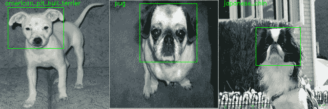

上一张截图显示了预期中头部周围有边界框的可爱宠物。请注意，尽管我们在脚本中使用随机数来混合数据集，但你获得的结果与之前展示的相同。因此，你现在可以看到伪随机数的威力。

现在我们已经准备好了数据集，接下来让我们进入下一节，创建和训练分类器。我们将构建两个分类器——一个用于宠物类型，另一个用于品种。

# 使用 CNN 进行分类

要开始分类，首先，我们必须导入所需的模块：

```py
import tensorflow.keras as K
from data import ds
```

我们必须导入我们准备好的数据集和 Keras，我们将使用它们来构建我们的分类器。

然而，在我们构建我们的分类器之前，让我们首先了解卷积网络，因为我们将要使用它们来构建我们的分类器。

# 理解 CNN

在第一章，“*玩转滤波器*”，你学习了关于滤波器和卷积的知识。特别是，你学习了如何使用滤波器创建铅笔素描图像。在铅笔素描中，你可以看到图像中那些值发生急剧变化的点，也就是说，它们比那些值变化平滑的点要暗。

从那个角度来看，我们应用的滤波器可以被视为边缘检测滤波器。换句话说，滤波器充当特征检测器，其中特征是边缘。或者，你也可以组合一个不同的滤波器，它在角上激活，或者在颜色值没有变化时激活。

我们使用的滤波器作用于单通道图像，并且有两个维度；然而，我们可以通过第三个维度扩展滤波器，这样它就可以应用于多通道图像。例如，如果一个单通道滤波器的大小是*3 x 3*，那么相应的 3 通道（例如，RGB）滤波器的大小将是*3 x 3 x 3*，其中最后一个值是滤波器的深度。

这样的滤波器已经可以用于更复杂的功能。例如，你可能想到一个与绿色颜色一起工作，同时通过在滤波器中相应元素设置零来忽略红色和蓝色值的滤波器。

一旦你找到了一组好的滤波器，你就可以将它们应用到原始图像上，然后将它们堆叠成一个新的多通道图像。例如，如果我们对一个图像应用 100 个滤波器，我们将获得 100 个单通道图像，堆叠后将会得到一个 100 通道的图像。因此，我们构建了一个接受 3 个通道并输出 100 个通道的层。

接下来，我们可以组合新的滤波器，这些滤波器的深度为 100，并作用于组合的 100 通道图像。这些滤波器也可以在更复杂的功能上被激活。例如，如果前面的层中有激活在边缘上的滤波器，我们可以组合一个在边缘交点处激活的滤波器。

经过一系列层之后，我们可能会看到激活的滤波器，例如，在人们的鼻子上、头部、车辆的轮子上等等。这正是卷积网络的工作方式。当然，一个问题随之而来：我们如何组合这些滤波器？答案是，我们不需要，因为它们是学习得到的。

我们提供数据，网络学习它需要的滤波器以做出良好的预测。与您使用的卷积滤波器之间的另一个区别是，除了滤波器的可学习参数之外，还有一个额外的可学习值，称为，它是一个添加到滤波器输出的常数项。

此外，在每个卷积滤波器之后，通常会对滤波器的输出应用一个非线性函数，称为 **激活函数**。由于非线性，网络可以表示更广泛的函数类别，因此构建良好模型的机会相对较高。

现在我们对卷积网络的工作原理有了些了解，让我们先从构建分类器开始。在构建本章中的网络时，您将看到卷积层是如何构建和使用的。如前所述，我们使用预训练模型来构建我们的新模型，换句话说，我们使用迁移学习。让我们在下一节中了解这是什么。

# 学习迁移学习

通常，一个卷积神经网络有数百万个参数。让我们做一个估计，找出所有这些参数的来源。

假设我们有一个 10 层的网络，每层有 100 个大小为 *3 x 3* 的滤波器。这些数字相当低，通常表现良好的网络有数十个层和每层数百个滤波器。在我们的情况下，每个滤波器的深度为 100。

因此，每个滤波器有 3 x 3 x 3 = 900 个参数（不包括偏差，偏差的数量为 100），这意味着每个层的参数为 *900 x 100*，因此整个网络的参数约为 900,000 个。要从头开始学习这么多参数而不发生过拟合，需要相当大的标注数据集。一个问题随之而来：我们还能做什么？

你已经了解到，网络层充当特征提取器。除此之外，自然图像有很多共同之处。因此，使用在大数据集上训练的网络的特征提取器来在不同的、较小的数据集上实现良好的性能是一个好主意。这种技术被称为 **迁移学习**。

让我们选择一个预训练模型作为我们的基础模型，这是 Keras 的一行代码：

```py
base_model = K.applications.MobileNetV2(input_shape=(224,224, 3), include_top=False)
```

在这里，我们使用的是预训练的`MobileNetV2`网络，这是一个健壮且轻量级的网络。当然，你也可以使用其他可用的模型，这些模型可以在 Keras 网站上找到，或者通过简单地使用`dir(K.applications)`列出它们。

我们通过传递`include_top=False`来排除负责分类的顶层版本的网络，因为我们将在其之上构建一个新的分类器。但仍然，网络包括所有在**ImageNet**上训练的其他层。ImageNet 是一个包含数百万图像的数据集，每个图像都标注了数据集中 1,000 个类别中的一个。

让我们看看我们基础模型输出的形状：

```py
print(base_model.output.shape)
```

结果如下：

```py
(None, 7, 7, 1280)
```

第一个数字是未定义的，表示批处理大小，换句话说，输入图像的数量。假设我们同时向网络传递 10 张图像的堆栈；那么，这里的输出将具有形状`(10,7,7,1280)`，张量的第一个维度将对应于输入图像编号。

接下来的两个索引是输出形状的大小，最后一个是通道数。在原始模型中，这个输出代表了从输入图像中提取的特征，这些特征后来用于对 ImageNet 数据集的图像进行分类。

因此，它们很好地代表了所有图像，以便网络可以根据它们对 ImageNet 的图像进行分类。让我们尝试使用这些特征来分类我们宠物的类型和品种。为了做到这一点，让我们在下一节中首先准备一个分类器。

# 准备宠物类型和品种分类器

由于我们将直接使用这些特征，让我们首先冻结网络层的权重，这样它们在训练过程中就不会更新：

```py
for layer in base_model.layers:
    layer.trainable = False
```

通常，激活图中的每个位置都指定了在该位置是否存在对应类型的特征。当我们处理网络的最后一层时，我们可以假设激活图上的不同位置包含相似的信息，并通过平均激活图来减少我们特征的维度：

```py
x = K.layers.GlobalAveragePooling2D()(base_model.output)
```

这个操作被称为`AveragePooling2D`——我们在特征张量的两个维度上池化张量的平均值。你可以通过打印操作输入和输出的形状来查看结果：

```py
print(base_model.output.shape, x.shape)
```

这显示了以下输出：

```py
(None, 7, 7, 1280) (None, 1280)
```

现在我们已经为每张图像有了`1280`个特征，让我们立即添加分类层，并准备我们的数据集以在类型或品种上进行训练：

```py
is_breeds = True
if is_breeds:
    out = K.layers.Dense(37,activation="softmax")(x)
    inp_ds = ds.map(lambda d: (d.image,d.breed))
else:
    out = K.layers.Dense(2,activation="softmax")(x)
    inp_ds = ds.map(lambda d: (d.image,d.type))
```

在类型和品种上训练的不同之处仅在于输出神经元的数量和标签。对于品种，标签的数量是`37`，而对于类型，这是`2`（即猫或狗），你可以在代码中看到。密集层代表密集连接的神经元。这意味着层中的每个神经元都连接到层的所有 1,280 个输入。

因此，每个神经元有 *1280 + 1* 个可学习的参数，其中 1 是用于偏置的。从数学上讲，对于完整的层，核的权重用一个大小为 (1,280，即类别的数量) 的矩阵表示，并且有一个高度为 1280 的列。

层的线性部分可以写成如下形式：

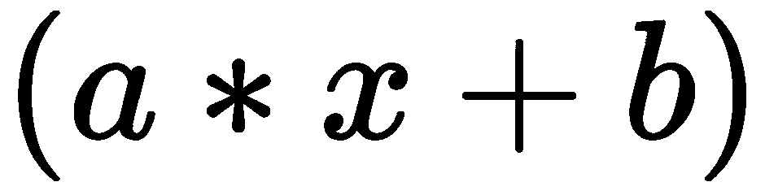

在这里，**x** 是前一层（在我们的情况下是 1,280 个平均特征）的输出，**a** 是矩阵，**b** 是列。

此外，我们还设置了一个 **softmax** 函数作为激活函数，这对于分类任务是一个很好的选择。后者定义如下：

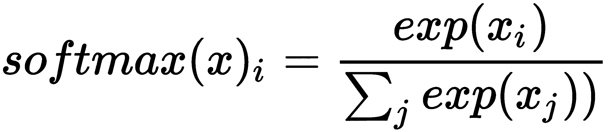

在这里，**x** 是激活函数的输入（线性部分的输出）。

你可以看到所有输出加起来等于一；因此，输出可以被认为是相应类别的概率。

我们在数据集上定义的映射将图像作为数据，品种或类型作为标签。

现在我们已经准备好定义我们的模型：

```py
model = K.Model(inputs=base_model.input, outputs=out)
```

在这里，你可以看到网络的输入是我们的基础模型，输出是我们的分类层。因此，我们已经成功构建了我们的分类网络。

因此，现在我们已经准备好了我们的分类网络，让我们在下一节中对其进行训练和评估：

# 训练和评估分类器

为了训练分类器，我们必须为它配置训练。我们必须指定一个目标函数（损失函数）和一个训练方法。此外，我们可能还想指定一些指标，以便查看模型的性能。我们可以使用模型的 `compile` 方法来配置分类器：

```py
model.compile(loss="categorical_crossentropy", optimizer="adam", metrics=["categorical_accuracy","top_k_categorical_accuracy"])
```

我们将 `metrics` 传递为 `categorical_accuracy`，这将显示数据集的哪一部分被正确分类。除此之外，我们还传递了一个名为 `top_k_categorical_accuracy` 的额外指标，它显示了数据集的哪一部分在网络的前 `k` 预测中是正确的。

`k` 的默认值是五，因此该指标显示了数据集中最有可能被神经网络预测的前五个类别。我们还传递了 `optimizer="adam"`，这强制模型使用 **Adam Optimizer** 作为训练算法。你将在 *理解反向传播* 部分学习神经网络通常是如何训练的。

在训练之前，我们还把数据集分成训练集和测试集，以便查看网络在未见数据上的表现：

```py
evaluate = inp_ds.take(1000)
train = inp_ds.skip(1000).shuffle(10**4)
```

在这里，我们取数据集的前 `1000` 个元素用于测试目的。其余部分用于训练。

通过调用 `shuffle` 方法，训练部分是混合的，这将确保我们在每个训练周期中都有不同的数据顺序。最后，我们通过调用数据集的 `fit` 方法来训练我们的网络，并在验证集上评估它：

```py
model.fit(train.batch(32), epochs=4)
model.evaluate(valid.batch(1))
```

首先，`fit` 方法接受数据集本身，我们通过`32`批次的批量传递。这意味着，在训练过程的每一步，将使用数据集中的`32`张图片。

我们还传递了多个`epochs`，这意味着我们的数据集将被迭代`4`次，直到训练过程停止。最后一个`epoch`的输出如下：

```py
Epoch 4/4
 84/84 [==============================] - 13s 156ms/step - loss: 0.0834 - categorical_accuracy: 0.9717 - top_k_categorical_accuracy: 1.0000
```

我们在训练集上的分类准确率超过 97%。因此，我们在区分猫和狗方面做得相当不错。当然，**top-K 准确率**将是 100%，因为我们只有两个类别。现在，让我们看看我们在验证集上的表现。

训练完成后，模型将被评估，你应该获得与测试集相似的结果：

```py
model.evaluate(valid.batch(1))
```

输出如下所示：

```py
1000/1000 [==============================] - 9s 9ms/step - loss: 0.0954 - categorical_accuracy: 0.9730 - top_k_categorical_accuracy: 1.0000
```

我们再次获得了超过 97% 的分类准确率。因此，我们的模型没有过拟合，在测试集上的表现良好。

如果我们在品种上进行训练，训练输出的结果如下：

```py
Epoch 4/4
 84/84 [==============================] - 13s 155ms/step - loss: 0.3272 - categorical_accuracy: 0.9233 - top_k_categorical_accuracy:
 0.9963
```

同时，测试输出的结果如下所示：

```py
1000/1000 [==============================] - 11s 11ms/step - loss: 0.5646 - categorical_accuracy: 0.8080 - top_k_categorical_accuracy: 0.9890
```

对于品种，我们得到了更差的结果，这是预期的，因为区分一个品种比仅仅判断它是猫还是狗要困难得多。无论如何，模型的表现并不太差。它的第一次尝试猜测有超过 80% 是正确的，我们也可以有大约 99% 的把握，如果它有 5 次尝试，它将猜对品种。

在本节中，我们学习了如何使用预训练分类器网络构建一个新的分类器。在下一节中，让我们继续我们的深度学习之旅，并使用相同的基础模型创建一个对象定位网络——这是一个基础模型从未训练过的任务。

# 使用 CNN 进行定位

能够创建自己的定位器是了解对象检测网络可能如何工作的一种好方法。这是因为对象检测网络和定位网络之间唯一的理念差异在于，定位网络预测单个边界框，而对象检测网络预测多个边界框。此外，这也是开始理解如何构建一个能够完成其他回归任务的神经网络的好方法。

在本节中，我们将使用与上一节相同的预训练分类器网络，`MobileNetV2`。然而，这次我们将使用该网络进行对象定位而不是分类。让我们以与上一节相同的方式导入所需的模块和基础模型——尽管这次，我们不会冻结基础模型中的层：

```py
import tensorflow.keras as K

from data import ds

base_model = K.applications.MobileNetV2(
    input_shape=(224, 224, 3), include_top=False)
```

现在我们已经准备好了所有东西，让我们继续准备我们的定位器模型。

# 准备模型

首先，让我们思考一下我们如何使用基础模型的输出制作一个定位器。

如前所述，基础模型的输出张量形状为`(None, 7, 7, 1280)`。输出张量表示使用卷积网络获得的特征。我们可以假设一些空间信息被编码在空间索引*(7,7)*中。

让我们尝试使用几个卷积层来降低特征图的维度，并创建一个回归器，该回归器应该预测数据集中提供的宠物头部边界框的角坐标。

我们的卷积层将有几个相同的选项：

```py
conv_opts = dict(
    activation='relu',
    padding='same',
    kernel_regularizer="l2")
```

首先，它们都将使用**ReLU**（修正线性单元）作为激活函数。后者是一个简单的函数，当输入小于零时为零，当输入大于或等于零时等于输入。

`padding=same`指定我们不想卷积操作减小特征图的大小。特征图将通过填充零来填充，这样特征图就不会减小大小。这与`padding='valid'`形成对比，后者只将卷积核应用于特征图的边缘。

经常来说，正则化训练参数、归一化它们或两者都做是一个好主意。后者通常允许你更容易、更快地训练，并且泛化得更好。正则化器允许你在优化期间对层参数应用惩罚。这些惩罚被纳入网络优化的损失函数中。

在我们的情况下，我们使用`l2`核正则化器，该正则化器正则化了卷积核权重的**欧几里得**范数。正则化是通过将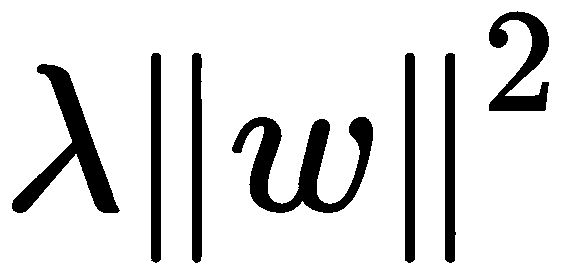项添加到损失函数（目标函数）中实现的。在这里，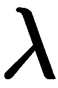是一个小的常数，而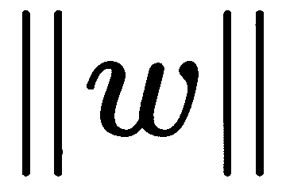是**L2**范数，它等于层参数平方和的平方根。

这是最常用的正则化项之一。现在我们准备好定义我们的卷积层。第一层如下所示：

```py
x = K.layers.Conv2D(256, (1, 1), **conv_opts)(base_model.output)
```

在这里，第一个参数是输出通道数，也就是卷积核的数量。第二个参数描述了卷积核的大小。乍一看，单个像素的卷积核可能没有太多意义，因为它不能编码特征图的上下文信息。

这无疑是正确的；然而，在这种情况下，它被用于不同的目的。这是一个快速操作，允许在较低维度中编码输入特征图的深度。深度从 1280 减少到`256`。

下一个层看起来如下：

```py
x = K.layers.Conv2D(256, (3, 3), strides=2, **conv_opts)(x)
```

在这里，除了我们使用的默认选项之外，我们还使用了步长，它指定了输入上的像素偏移量。在第一章，“与过滤器一起玩乐”，卷积操作在每个位置应用，这意味着过滤器每次移动一个像素，相当于步长等于 1。

当`strides`选项为`2`时，我们每次移动过滤器两个像素。这个选项以复数形式出现，因为我们可能希望在不同方向上有不同的步长，这可以通过传递一个数字元组来实现。使用大于 1 的`stride`值是一种在不丢失空间信息的情况下减小激活图大小的手段。

当然，还有其他可以减小激活图大小的操作。例如，可以使用称为**最大池化**的操作，这是现代卷积网络中最广泛使用的操作之一。后者采用较小的窗口大小（例如，*2 x 2*），从这个窗口中选取一个最大值，然后移动指定数量的像素（例如，2），并在整个激活图上重复此过程。因此，通过这个过程，激活图的大小将减少 2 倍。

与使用步长的方法相比，最大池化操作更适合我们不太关心空间信息的任务。例如，这些任务包括分类任务，我们对其中的对象确切位置不感兴趣，而只是对其是什么感兴趣。在最大池化中丢失空间信息发生在我们简单地从一个窗口中取最大值而不考虑其在窗口中的位置时。

我们最后想要做的是将一个包含四个神经元的密集层连接到卷积层，这将回归到边界框的两个角坐标（每个角为`(x,y)`）：

```py
out = K.layers.Flatten()(x)
out = K.layers.Dense(4, activation="sigmoid")(out)
```

由于边界框的坐标是归一化的，因此使用一个值在`(0,1)`范围内的激活函数，例如`sigmoid`函数，是个好主意。

所有必要的层都已准备就绪。现在，让我们使用新层定义模型，并编译它以进行训练：

```py
model = K.Model(inputs=base_model.input, outputs=out)
model.compile(
    loss="mean_squared_error",
    optimizer="adam",
    metrics=[
        K.metrics.RootMeanSquaredError(),
        "mae"])
```

我们使用**均方误差**（**MSE**）作为`loss`函数，它是真实值和预测值之间平方差的函数。在训练过程中，这个值将被最小化；因此，模型在训练后应该预测角坐标。

我们添加到卷积层的正则化项也如讨论的那样添加到`loss`中。这由 Keras 自动完成。此外，我们还使用**均方根误差**（**RMSE**）和**平均绝对误差**（**MAE**），后者衡量误差的平均幅度，作为我们的指标。

现在，让我们以与上一节相同的方式分割数据集：

```py
inp_ds = ds.map(lambda d: (d.image,d.box))
valid = inp_ds.take(1000)
train = inp_ds.skip(1000).shuffle(10000)
```

剩下的工作就是训练我们的模型，就像我们在上一节中所做的那样。然而，在我们继续训练之前，你可能对了解我们新层的训练是如何完成的感兴趣。在多层神经网络中，训练通常使用**反向传播**算法进行，所以让我们在下一节中首先了解这一点。

# 理解反向传播

当我们有一些网络的优化权重，使得网络对我们的数据做出良好的预测时，我们认为神经网络已经训练好了。所以，问题是我们是怎样达到这些优化权重的？神经网络通常使用**梯度下降**算法进行训练。这可能纯粹是梯度下降算法，或者是一些改进的优化方法，如**Adam 优化器**，它再次基于计算梯度。

在所有这些算法中，我们需要计算损失函数相对于所有权重的梯度。由于神经网络是一个复杂的函数，这可能看起来并不直接。这就是反向传播算法介入的地方，它使我们能够在复杂的网络中轻松地计算梯度，并了解梯度看起来是什么样子。让我们深入了解算法的细节。

假设我们有一个由*N*个连续层组成的神经网络。一般来说，这样的网络中的*i^(th)*层是一个可以定义为以下函数：

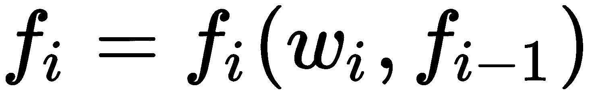

这里，是层的权重，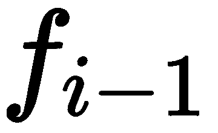是前一层对应的函数。

我们可以将定义为网络的输入，这样公式就适用于包括第一层的完整神经网络。

我们也可以定义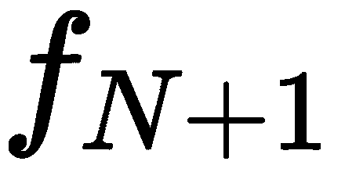为我们的损失函数，这样公式不仅定义了所有层，还定义了损失函数。当然，这种泛化排除了我们已使用的权重归一化项。然而，这是一个简单的项，它只是加到损失上，因此为了简单起见可以省略。

我们可以通过设置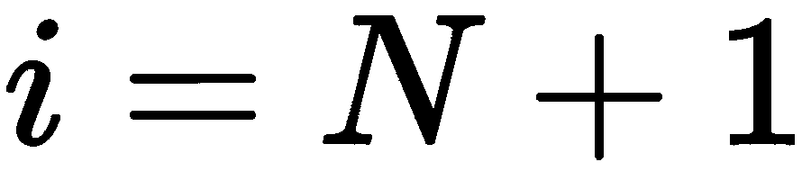并使用链式法则来计算损失函数的梯度：

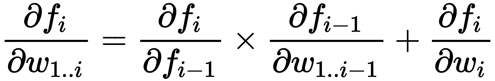

根据我们的定义，这个公式不仅适用于损失函数，而且适用于所有层。在这个公式中，我们可以看到，某一层相对于前一层中所有权重的偏导数（包括当前层）是用前一层的相同导数表示的，即公式中的 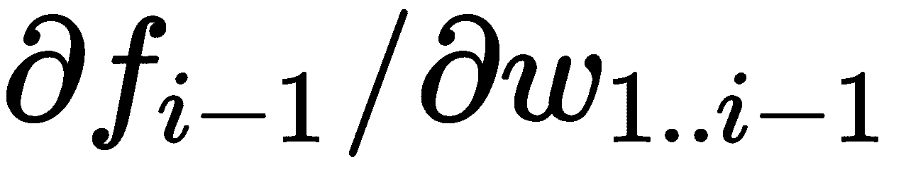 项，以及只能使用当前层计算出的项，即 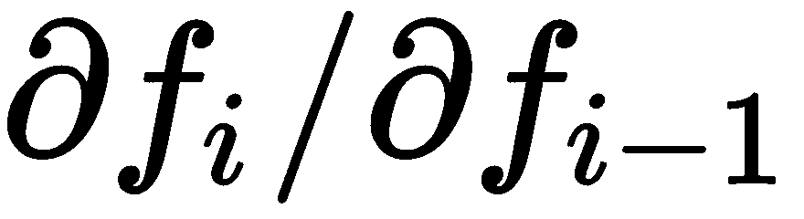 和 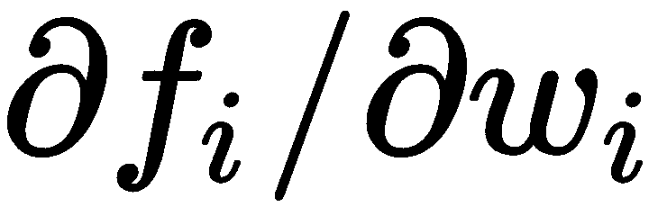。

使用公式，我们现在可以数值地计算梯度。为了做到这一点，我们首先定义一个代表误差信号的变量，并将其初始值设为 1。很快就会清楚为什么它代表误差信号。然后，我们从最后一层（在我们的例子中是损失函数）开始，重复以下步骤，直到我们到达网络的输入层：

1.  计算当前层相对于其权重的偏导数，并乘以误差信号。这将对应于当前层权重的梯度部分。

1.  对前一层的偏导数进行计算，乘以误差信号，然后用得到的结果更新误差信号。

1.  如果网络的输入没有被到达，就移动到前一层并重复这些步骤。

一旦我们到达输入层，我们就有了损失函数相对于可学习权重的所有偏导数；因此，我们得到了损失函数的梯度。现在我们可以注意到，这是在梯度计算过程中通过网络传播的层的偏导数。

那是一个**传播信号**，它影响每个层对损失函数梯度的贡献。例如，如果在传播过程中某处变为全零，那么所有剩余层对梯度的贡献也将为零。这种现象称为**梯度消失问题**。此算法可以推广到具有不同类型分支的循环网络。

为了训练我们的网络，我们剩下的唯一要做的事情就是沿着梯度的方向更新我们的权重，并重复这个过程直到收敛。如果使用纯梯度下降算法，我们只需从权重中减去乘以某个小常数的梯度；然而，通常情况下，我们会使用更高级的优化算法，例如 Adam 优化器。

纯梯度下降算法的问题在于，首先，我们应该找到一个最优的小常数值，以便权重的更新既不会太小，导致学习速度慢，也不会太大，因为太大的值会导致不稳定性。另一个问题是，一旦我们找到了一个最优值，一旦网络开始收敛，我们就必须开始减小它。更重要的是，通常情况下，使用不同的因子更新不同的权重是明智的，因为不同的权重可能距离它们的最优值有不同距离。

这些是我们可能想要使用更高级优化技术（如 Adam 优化器或**RMSProp**）的一些原因，这些技术考虑了这些提到的问题，甚至考虑了一些未提到的问题。同时，在创建你的网络时，你应该注意，优化算法领域的研究仍在进行中，尽管 Adam 优化器对于许多任务来说应该是一个不错的选择，但现有的某些优化器在某些情况下可能比其他优化器更好。

你可能还会注意到，在算法中，我们没有具体说明如何计算层中的偏导数。当然，可以通过改变值并测量响应来数值计算它们，就像使用数值方法计算导数一样。问题是这样的计算既费时又容易出错。更好的方法是定义每个操作的符号表示，然后再次使用链式法则，就像在反向传播中做的那样。

因此，我们现在理解了完整梯度的计算方法。实际上，大多数现代深度学习框架都会为你完成微分。你通常不需要担心它是如何实现的，但如果计划开发新的，即你自己的模型，了解计算的背景可能非常有帮助。

但现在，让我们在下一节中训练我们准备好的模型，看看它的表现如何。

# 训练模型

在我们进行实际训练之前，有一个保存最佳权重的模型的好方法。为此，我们将使用 Keras 的回调：

```py
checkpoint = K.callbacks.ModelCheckpoint("localization.h5",
    monitor='val_root_mean_squared_error',
    save_best_only=True, verbose=1)
```

训练回调将在每次训练周期后调用；它将计算验证数据上预测的`root_mean_square_error`指标，如果指标有所改进，则会将模型保存到`localization.h5`。

现在，我们以与分类相同的方式进行模型训练：

```py
model.fit(
    train.batch(32),
    epochs=12,
    validation_data=valid.batch(1),
    callbacks=[checkpoint])
```

这里，不同之处在于我们这次使用更多的`epochs`进行训练，以及传递我们的回调和验证数据集。

在训练过程中，你首先会看到损失和指标在训练和验证数据上都有所下降。经过几个`epochs`后，你可能会看到验证数据上的指标有所上升。后者可能被认为是过拟合的迹象，但在更多的`epochs`之后，你可能会看到`validation_data`上的指标突然下降。后者的现象是因为模型在优化过程中切换到了更好的最小指标。

这里是监控指标最低值的结果：

```py
Epoch 8/12
 83/84 [============================>.] - ETA: 0s - loss: 0.0012 - root_mean_squared_error: 0.0275 - mae: 0.0212
 Epoch 00008: val_root_mean_squared_error improved from 0.06661 to 0.06268, saving model to best_model.hdf5
 84/84 [==============================] - 39s 465ms/step - loss: 0.0012 - root_mean_squared_error: 0.0275 - mae: 0.0212 - val_loss: 0.0044 - val_root_mean_squared_error: 0.0627 - val_mae: 0.0454 
```

你可以注意到，在这种情况下，是第八个`epoch`在验证数据上表现最好。你可以注意到，在验证数据上的 RMSE 偏差大约是 6%。MAE 小于 6%。我们可以这样解释这个结果——给定一个验证数据集中的图像，边界框的角坐标通常会被图像大小的 1/20 所偏移，由于边界框的大小与图像大小相当，所以这不是一个坏的结果。

你还可能想尝试使用基础模型的冻结层来训练模型。如果你这样做，你将注意到性能远比未冻结模型差。根据指标，它在验证数据集上的表现大约差两倍。考虑到这些数字，我们可以得出结论，基础模型的层能够在数据集上学习，从而使我们的模型在定位任务上表现更好。

因此，现在我们的模型已经准备好了，让我们在下一节使用我们的推理脚本来看看它能做什么。

# 观察推理的实际应用

一旦我们运行推理脚本，它将连接到相机并在每一帧上定位一个框，如下面的照片所示：

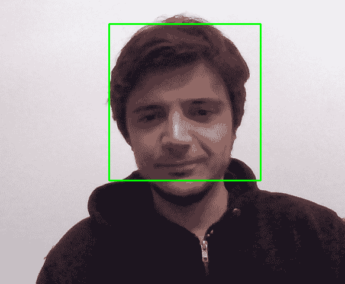

尽管模型是在宠物头部位置上训练的，但我们可以看到它在定位人的头部方面相当出色。这就是你可以注意到模型泛化能力的时刻。

当你创建自己的深度学习应用时，你可能会发现你为特定应用缺乏数据。然而，如果你将你的特定案例与其他可用的数据集联系起来，你可能会找到一些适用的数据集，尽管它们不同，但可能允许你成功训练你的模型。

# 摘要

在本章中，我们使用 Oxford-IIIT-Pet 数据集创建和训练了分类和定位模型。我们学习了如何使用迁移学习创建深度学习分类器和定位器。

你已经开始理解如何使用深度学习解决现实世界的问题。你已经理解了 CNN 是如何工作的，并且知道如何使用基础模型创建一个新的 CNN。

我们还介绍了用于计算梯度的反向传播算法。理解这个算法将使你能够对未来可能想要构建的模型架构做出更明智的决定。

在下一章中，我们将继续我们的深度学习之旅。我们将创建一个能够以高精度检测和跟踪物体的应用程序。

# 数据集归属

**牛津-IIIT-Pet 数据集**：*猫和狗*，O. M. Parkhi, A. Vedaldi, A. Zisserman, C. V. Jawahar 在 IEEE 计算机视觉与模式识别会议，2012 年。
