# 学习检测和跟踪对象

在上一章中，你接触了深度卷积神经网络，并使用迁移学习构建了深度分类和定位网络。你已经开始了深度学习之旅，并熟悉了一系列深度学习概念。你现在理解了深度模型的训练过程，并准备好学习更多高级的深度学习概念。

在本章中，你将继续你的深度学习之旅，首先使用目标检测模型在相关场景的视频中检测不同类型的多个对象，例如带有汽车和人的街景视频。之后，你将学习如何构建和训练这样的模型。

通常，鲁棒的目标检测模型在当今有着广泛的应用。这些领域包括但不限于医学、机器人技术、监控以及许多其他领域。了解它们的工作原理将使你能够使用它们来构建自己的实际应用，并在其基础上开发新的模型。

在我们介绍目标检测之后，我们将实现**简单在线实时跟踪**（**Sort**）算法，该算法能够鲁棒地在帧之间跟踪检测到的对象。在 Sort 算法的实现过程中，你还将熟悉**卡尔曼滤波器**，它通常是在处理时间序列时的重要算法。

一个好的检测器和跟踪器的组合在工业问题中有着多种应用。在本章中，我们将通过计算相关场景视频中出现的不同类型的总对象数量来限制应用范围。一旦你理解了如何完成这个特定任务，你可能会产生自己的使用想法，这些想法最终会体现在你的应用中。

例如，拥有一个好的对象跟踪器可以使你回答诸如场景的哪个部分看起来更密集？以及，在观察时间内，物体移动得更快或更慢的地方在哪里？在某些情况下，你可能对监控特定物体的轨迹、估计它们的速度或它们在场景不同区域停留的时间感兴趣。一个好的跟踪器是解决所有这些问题的方案。

本章将涵盖以下主题：

+   准备应用

+   准备主脚本

+   使用 SSD 检测对象

+   理解对象检测器

+   跟踪检测到的对象

+   实现 Sort 跟踪器

+   理解卡尔曼滤波器

+   观看应用的实际运行

让我们从指出技术要求和规划应用开始本章。

# 开始

正如本书的所有章节所提到的，你需要安装合适的**OpenCV**、**SciPy**和**NumPY**。

你可以在 GitHub 存储库中找到我们本章中展示的代码，网址为[`github.com/PacktPublishing/OpenCV-4-with-Python-Blueprints-Second-Edition/tree/master/chapter10`](https://github.com/PacktPublishing/OpenCV-4-with-Python-Blueprints-Second-Edition/tree/master/chapter10)。

当使用 Docker 运行应用程序时，Docker 容器应能够访问适当的 **X11 服务器**。此应用程序不能在 **无头模式** 下运行。使用 Docker 运行应用程序的最佳环境是 **Linux** 桌面环境。在 **macOS** 上，你可以使用 **xQuartz**（参考[`www.xquartz.org/`](https://www.xquartz.org/)）来创建可访问的 X11 服务器。

你也可以使用存储库中可用的 Docker 文件来运行应用程序。

# 规划应用程序

如前所述，最终的应用程序将能够检测、跟踪和计数场景中的对象。这需要以下组件：

+   `main.py`: 这是用于实时检测、跟踪和计数对象的脚本。

+   `sort.py`: 这是一个实现跟踪算法的模块。

我们首先准备主脚本。在准备过程中，你将学习如何使用检测网络，以及它们的工作原理和训练方法。在同一脚本中，我们将使用跟踪器来跟踪和计数对象。

准备完主脚本后，我们将准备跟踪算法，并能够运行应用程序。现在让我们开始准备主脚本。

# 准备主脚本

主脚本将负责应用程序的完整逻辑。它将处理视频流并使用我们将在本章后面准备的深度卷积神经网络进行对象检测，并结合跟踪算法。

该算法用于从帧到帧跟踪对象。它还将负责展示结果。脚本将接受参数并具有一些内在常量，这些常量在脚本以下初始化步骤中定义：

1.  与任何其他脚本一样，我们首先导入所有必需的模块：

```py
import argparse

import cv2
import numpy as np

from classes import CLASSES_90
from sort import Sort
```

我们将使用 `argparse`，因为我们希望我们的脚本接受参数。我们将对象类别存储在单独的文件中，以避免污染脚本。最后，我们导入我们将在本章后面构建的 `Sort` 跟踪器。

1.  接下来，我们创建并解析参数：

```py
parser = argparse.ArgumentParser()
parser.add_argument("-i", "--input",
                    help="Video path, stream URI, or camera ID ", default="demo.mkv")
parser.add_argument("-t", "--threshold", type=float, default=0.3,
                    help="Minimum score to consider")
parser.add_argument("-m", "--mode", choices=['detection', 'tracking'], default="tracking",
                    help="Either detection or tracking mode")

args = parser.parse_args()
```

我们的第一个参数是输入，可以是视频的路径、摄像头的 ID（默认摄像头为 `0`），或视频流的 **统一资源标识符**（**URI**）。例如，你将能够使用 **实时传输控制协议**（**RTCP**）将应用程序连接到远程 IP 摄像头。

我们将使用的网络将预测对象的边界框。每个边界框都将有一个分数，该分数将指定边界框包含特定类型对象的概率有多高。

下一个参数是 `threshold`，它指定了分数的最小值。如果分数低于 `threshold`，则我们不考虑该检测。最后一个参数是 `mode`，我们想要以该模式运行脚本。如果我们以 `检测` 模式运行，算法的流程将在检测到对象后停止，不会进一步进行跟踪。对象检测的结果将在帧中展示。

1.  OpenCV 接受摄像头的 ID 作为整数。如果我们指定摄像头的 ID，输入参数将是一个字符串而不是整数。因此，如果需要，我们需要将其转换为整数：

```py
if args.input.isdigit():
    args.input = int(args.input)
```

1.  接下来，我们定义所需的常量：

```py
TRACKED_CLASSES = ["car", "person"]
BOX_COLOR = (23, 230, 210)
TEXT_COLOR = (255, 255, 255)
INPUT_SIZE = (300,300)
```

在这个应用中，我们将追踪汽车和行人。我们将用黄色调的色调展示边界框，并用白色书写文字。我们还将定义我们将要用于检测的 **单次检测器**（**SSD**）模型的标准化输入大小。

# 使用 SSD 检测对象

OpenCV 有导入使用深度学习框架构建的模型的方法。我们如下加载 TensorFlow SSD 模型：

```py
config = "./ssd_mobilenet_v1_coco_2017_11_17.pbtxt.txt"
model = "frozen_inference_graph.pb"
detector = cv2.dnn.readNetFromTensorflow(model,config)
```

`readNetFromTensorflow` 方法的第一个参数接受一个包含二进制 **Protobuf**（**协议缓冲区**）格式 TensorFlow 模型的文件路径。第二个参数是可选的。它是包含模型图定义的文本文件路径，同样也是以 Protobuf 格式。

当然，模型文件本身可能包含图定义，OpenCV 可以从模型文件中读取该定义。但是，对于许多网络，可能需要创建一个单独的定义，因为 OpenCV 无法解释 TensorFlow 中所有可用的操作，这些操作应该被 OpenCV 可以解释的操作所替代。

让我们现在定义一些有用的函数来展示检测。第一个函数用于展示单个边界框：

```py
def illustrate_box(image: np.ndarray, box: np.ndarray, caption: str) -> None:
```

从前面的代码中，`illustrate_box` 函数接受一个图像，一个归一化的边界框，作为包含框两个对角顶点的四个坐标的数组。它还接受一个框的标题。然后，函数中涵盖了以下步骤：

1.  首先提取图像的大小：

```py
rows, cols = frame.shape[:2]
```

1.  然后它提取两个点，按图像大小进行缩放，并将它们转换为整数：

```py
points = box.reshape((2, 2)) * np.array([cols, rows])
p1, p2 = points.astype(np.int32)
```

1.  之后，我们使用两个点绘制相应的 `矩形`：

```py
cv2.rectangle(image, tuple(p1), tuple(p2), BOX_COLOR, thickness=4)
```

1.  最后，我们在第一个点附近放置标题：

```py
cv2.putText(
    image,
    caption,
    tuple(p1),
    cv2.FONT_HERSHEY_SIMPLEX,
    0.75,
    TEXT_COLOR,
    2)
```

第二个函数将展示所有 `检测`，如下所示：

```py
def illustrate_detections(dets: np.ndarray, frame: np.ndarray) -> np.ndarray:
    class_ids, scores, boxes = dets[:, 0], dets[:, 1], dets[:, 2:6]
    for class_id, score, box in zip(class_ids, scores, boxes):
        illustrate_box(frame, box, f"{CLASSES_90[int(class_id)]} {score:.2f}")
    return frame
```

从前面的代码片段中，第二个函数接受检测作为二维 `numpy` 数组和用于展示检测的帧。每个检测包括被检测对象的类别 ID、一个分数，表示边界框包含指定类别对象的概率，以及检测本身的边界框。

函数首先提取所有检测的先前所述值，然后使用`illustrate_box`方法展示每个检测的边界框。类别名称和`score`作为框的标题添加。

现在让我们连接到摄像头：

```py
cap = cv2.VideoCapture(args.input)
```

我们将`input`参数传递给`VideoCapture`，正如之前提到的，它可以是一个视频文件、流或摄像头 ID。

现在我们已经加载了网络，定义了所需的说明函数，并打开了视频捕获，我们准备遍历帧、检测对象并展示结果。我们使用`for`循环来完成这个目的：

```py
for res, frame in iter(cap.read, (False, None)):
```

循环体包含以下步骤：

1.  它将帧设置为`detector`网络的输入：

```py
detector.setInput(
    cv2.dnn.blobFromImage(
        frame,
        size=INPUT_SIZE,
        swapRB=True,
        crop=False))
```

`blobFromImage`从提供的图像创建一个四维输入网络。它还将图像调整到输入大小，并将图像的红蓝通道交换，因为网络是在 RGB 图像上训练的，而 OpenCV 读取帧为 BGR。

1.  然后它使用网络进行预测，并得到所需格式的输出：

```py
detections = detector.forward()[0, 0, :, 1:]
```

从前面的代码中，`forward`代表前向传播。结果是二维的`numpy`数组。数组的第一个索引指定检测编号，第二个索引表示一个特定的检测，它通过对象类别、得分和四个值来表示边界框的两个角坐标。

1.  之后，它从`detections`中提取`scores`，并过滤掉得分非常低的那些：

```py
scores = detections[:, 1]
detections = detections[scores > 0.3]
```

1.  当脚本以`detection`模式运行时，立即展示`detections`：

```py
if args.mode == "detection":
    out = illustrate_detections(detections, frame)
    cv2.imshow("out", out)
```

1.  然后我们必须设置终止条件：

```py
if cv2.waitKey(1) == 27:
    exit()
```

现在我们已经准备好以检测模式运行我们的脚本。接下来的图像显示了样本结果：

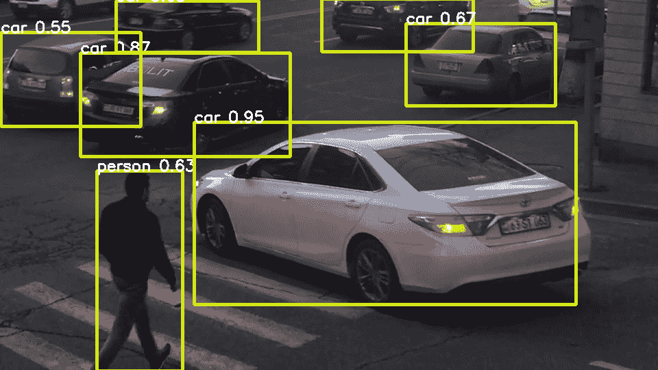

你可以在前一张图像的帧中注意到，SSD 模型已经成功检测到场景中所有的汽车和单个个体（人）。现在让我们看看如何使用其他目标检测器。

# 使用其他检测器

在本章中，我们使用一个目标检测器来获取带有其对象类型的边界框，这些边界框将被 Sort 算法进一步处理以进行跟踪。一般来说，获取这些边界框的确切方式并不重要。在我们的案例中，我们使用了 SSD 预训练模型。现在让我们了解如何用不同的模型替换它。

让我们首先了解如何使用 YOLO 来完成这个目的。YOLO 也是一个单阶段检测器，代表**You Only Look Once**（**YOLO**）。原始 YOLO 模型基于**Darknet**，这是一个另一个开源神经网络框架，用 C++和 CUDA 编写。OpenCV 能够加载基于 Darknet 的网络，类似于它加载 TensorFlow 模型的方式。

为了加载 YOLO 模型，您首先需要下载包含网络配置和网络权重的文件。

这可以通过访问[`pjreddie.com/darknet/yolo/`](https://pjreddie.com/darknet/yolo/)来完成。在我们的例子中，我们将使用**YOLOv3-tiny**，这是当时最轻量级的版本。

下载了网络配置和权重后，你可以像加载 SSD 模型一样加载它们：

```py
detector = cv2.dnn.readNetFromDarknet("yolov3-tiny.cfg", "yolov3-tiny.weights")
```

不同之处在于，使用`readNetFromDarknet`函数而不是`readNetFromTensorflow`。

为了使用这个检测器代替 SSD，我们有一些事情要做：

+   我们必须更改输入的大小：

```py
INPUT_SIZE = (320, 320)
```

网络最初是在指定的尺寸下训练的。如果你有一个高分辨率的输入视频流，并且希望网络检测场景中的小物体，你可以将输入设置为不同的尺寸，例如 160 的倍数，例如尺寸（640，480）。输入尺寸越大，检测到的物体越小，但网络预测会变慢。

+   我们必须更改类名：

```py
with open("coco.names") as f:
    CLASSES_90 = f.read().split("\n")
```

尽管 YOLO 网络是在**COCO**数据集上训练的，但对象的 ID 是不同的。在这种情况下，你仍然可以使用之前的类名运行，但那样你会得到错误的类名。

你可以从 darknet 仓库[`github.com/pjreddie/darknet`](https://github.com/pjreddie/darknet)下载文件。

+   我们必须稍微更改输入：

```py
detector.setInput(
    cv2.dnn.blobFromImage(
        frame,
        scalefactor=1 / 255.0,
        size=INPUT_SIZE,
        swapRB=True,
        crop=False))
```

与 SSD 的输入相比，我们添加了`scalefactor`，它对输入进行归一化。

现在我们已经准备好成功地进行预测。尽管如此，我们还没有完全准备好使用这个检测器显示结果。问题是 YOLO 模型的预测格式不同。

每个检测都包括边界框中心的坐标：边界框的宽度和高度，以及一个表示边界框中每种类型对象概率的 one-hot 向量。为了最终完成集成，我们必须将检测转换为我们在应用中使用的格式。这可以通过以下步骤完成：

1.  我们提取边界框的中心坐标：

```py
centers = detections[:, 0:2]
```

1.  然后，我们也提取边界框的宽度和高度：

```py
sizes = detections[:, 2:4]
```

1.  然后，我们提取`scores_one_hot`：

```py
scores_one_hot = detections[:, 5:]
```

1.  然后，我们找到最大分数的`class_ids`：

```py
class_ids = np.argmax(scores_one_hot, axis=1)
```

1.  之后，我们提取最大分数：

```py
scores = np.max(scores_one_hot, axis=1)
```

1.  然后，我们使用前一步骤获得的结果，以应用其他部分所需格式构建`detections`：

```py
detections = np.concatenate(
    (class_ids[:, None], scores[:, None], centers - sizes / 2, centers + sizes / 2), axis=1)
detections = detections[scores > 0.3]
```

现在我们可以成功运行带有新检测器的应用。根据你的需求、可用资源和所需的精度，你可能希望使用其他检测模型，例如 SSD 的其他版本或**Mask-RCNN**，这是当时最准确的对象检测网络之一，尽管它的速度比 SSD 模型慢得多。

你可以尝试使用 OpenCV 加载你选择的模型，就像我们在本章中为 YOLO 和 SSD 所做的那样。使用这种方法，你可能会遇到加载模型的困难。例如，你可能需要调整网络配置，以便网络中的所有操作都可以由 OpenCV 处理。

后者尤其是因为现代深度学习框架发展非常快，而 OpenCV 至少需要时间来赶上，以便包括所有新的操作。你可能更喜欢的一种方法是使用原始框架运行模型，就像我们在第九章，“学习分类和定位物体”中所做的那样。

因此，既然我们已经了解了如何使用检测器，那么让我们在下一节中看看它们是如何工作的。

# 理解物体检测器

在第九章，“学习分类和定位物体”中，我们学习了如何使用卷积神经网络某一层的特征图来预测场景中物体的边界框，在我们的例子中是头部。

你可能会注意到，我们组成的定位网络与检测网络（我们在本章中使用）之间的区别在于，检测网络预测多个边界框而不是一个，并为每个边界框分配一个类别。

现在让我们在这两种架构之间进行平滑过渡，以便你可以理解像 YOLO 和 SSD 这样的物体检测网络是如何工作的。

# 单物体检测器

首先，让我们看看如何与边界框并行预测类别。在第九章，“学习分类和定位物体”中，你也学习了如何制作一个分类器。没有什么限制我们只能在单个网络中将分类与定位结合起来。这是通过将分类和定位块连接到基础网络的相同特征图，并使用损失函数（定位和分类损失的加和）一起训练来实现的。你可以作为一个练习创建并训练这样的网络。

问题仍然存在，*如果场景中没有物体怎么办？* 为了解决这个问题，我们可以在训练时简单地添加一个与背景相对应的额外类别，并将边界框预测器的损失设置为 0。结果，你将拥有一个可以检测多个类别的物体检测器，但只能检测场景中的一个物体。现在让我们看看我们如何预测多个边界框而不是一个，从而得出物体检测器的完整架构。

# 滑动窗口方法

最早用于创建能够检测场景中多个对象的架构的方法之一是**滑动窗口**方法。使用这种方法，你首先为感兴趣的对象构建一个分类器。然后，你选择一个矩形（窗口）的大小，这个大小是图像大小的几倍或许多倍，你希望在图像中检测对象。之后，你将其滑动到图像的所有可能位置，并判断矩形中的每个位置是否包含所选类型的对象。

在滑动过程中，使用介于框大小的一部分和完整框大小之间的滑动窗口大小。使用不同大小的滑动窗口重复此过程。最后，你选择那些具有高于某个阈值的类别分数的窗口位置，并报告这些窗口位置及其大小是所选对象类别的边界框。

这种方法的缺点是，首先，需要在单张图像上执行大量的分类，因此检测器的架构将会相当庞大。另一个问题是，对象仅以滑动窗口大小的精度进行定位。此外，检测边界框的大小必须等于滑动窗口的大小。当然，如果减小滑动窗口的大小并增加窗口大小的数量，检测效果可能会得到改善，但这将导致更高的计算成本。

你可能已经想到的一个想法是将单目标检测器与滑动窗口方法结合起来，并利用两者的优势。例如，你可以将图像分割成区域。例如，我们可以取一个 5 x 5 的网格，并在网格的每个单元格中运行单目标检测器。

你甚至可以更进一步，通过创建更大或更小的网格，或者使网格单元格重叠。作为一个迷你项目，为了深入理解所涵盖的想法，你可能喜欢实现它们并玩弄结果。然而，使用这些方法，我们使架构更重，也就是说，一旦我们扩大网格大小或网格数量以改进准确性。

# 单次遍历检测器

在之前提到的想法中，我们使用了单目标分类或检测网络来实现多目标检测。在所有场景中，对于每个预定义的区域，我们多次将整个图像或其部分输入到网络中。换句话说，我们有多重遍历，导致架构庞大。

*拥有一个网络，一旦输入图像，就能在单次遍历中检测场景中的所有对象，这不是很好吗？* 你可以尝试的一个想法是为我们的单目标检测器创建更多的输出，使其预测多个框而不是一个。这是一个好主意，但存在问题。假设场景中有多个狗，它们可能出现在不同的位置和不同的数量。

*我们应该如何使狗和输出之间建立一种不变对应关系呢？* 如果我们尝试通过将盒子分配给输出，例如从左到右，来训练这样一个网络，那么我们最终得到的预测结果将接近所有位置的平均值。

SSD 和 YOLO 等网络处理这些问题，并在单次遍历中实现多尺度和多框检测。我们可以用以下三个组件来总结它们的架构：

+   首先，它们有一个位置感知的多框检测器连接到特征图。我们已经讨论了将多个框预测器连接到完整特征图时出现的训练问题。SSD 和 YOLO 的问题通过有一个连接到特征图小区域的预测器来解决，而不是连接到完整特征图。

它预测图像中与特征图对应区域的框。然后，相同的预测器在整个特征图的所有可能位置上进行预测。这个操作是通过卷积层实现的。存在一些卷积核，它们的激活在特征图上滑动，并具有坐标和类别作为它们的输出特征图。

例如，如果你回到定位模型的代码，并用具有四个核的卷积层替换最后两层，这些层将输出展平并创建四个全连接神经元来预测框坐标，你就可以获得类似的操作。此外，由于预测器在特定区域工作，并且只对该区域有意识，它们预测的坐标是相对于该区域的，而不是相对于完整图像的坐标。

+   YOLO 和 SSD 在每个位置都预测多个框，而不是一个。它们从几个**默认框**预测偏移坐标，这些默认框也称为**锚框**。这些框的大小和形状与数据集中或自然场景中的对象非常接近，因此相对坐标值较小，甚至默认框与对象边界框也非常吻合。

例如，一辆车通常表现为一个宽框，而一个人通常表现为一个高框。多个框允许你达到更高的精度，并在同一区域进行多个预测。例如，如果图像中某处有一个人坐在自行车上，而我们只有一个框，那么我们就会忽略其中一个对象。使用多个锚框，对象将对应于不同的锚框。

+   除了具有多尺寸锚框外，它们还使用不同尺寸的多个特征图来完成多尺度预测。如果预测模块连接到网络的小尺寸顶部特征图，它负责大对象。

如果它与底部的某个特征图相连，它负责小物体。一旦在所选特征图中做出所有多框预测，结果将被转换为图像的绝对坐标并连接起来。因此，我们获得了本章中使用的预测形式。

如果你感兴趣更多实现细节，我们建议你阅读相应的论文，以及分析相应的实现代码。

既然你现在已经了解了探测器的工作原理，你可能也对它们的训练原理感兴趣。然而，在我们理解这些原理之前，让我们先了解一个称为**交并比**的度量，它在训练和评估这些网络以及过滤它们的预测时被广泛使用。

我们还将实现一个计算此度量的函数，我们将在构建跟踪的排序算法时使用它。因此，你应该注意，理解这个度量不仅对目标检测很重要，对跟踪也很重要。

# 学习交并比

**交并比**（**IoU**），也称为**Jaccard 指数**，定义为交集大小除以并集大小，其公式如下：

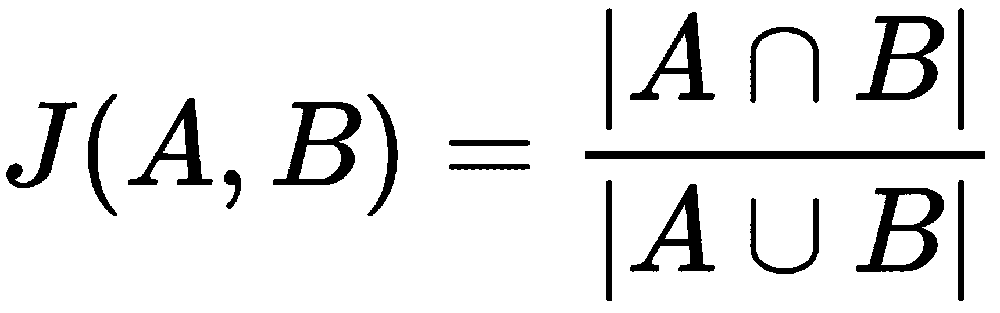

该公式等同于以下公式：

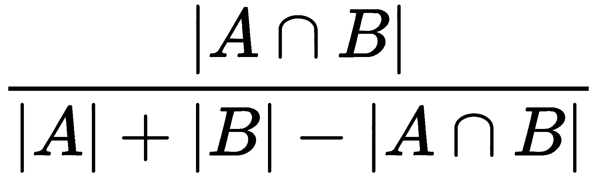

在下面的图中，我们展示了两个框的交并比（IoU）：

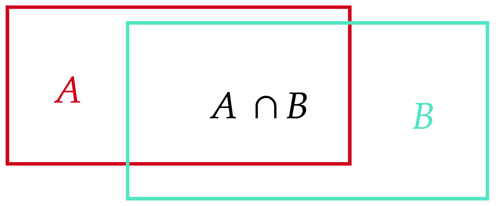

在前面的图中，并集是整个图形的总面积，交集是框重叠的部分。交并比（IoU）的值在（0,1）范围内，只有当框完全匹配时才达到最大值。一旦框分离，它变为零。

让我们定义一个函数，它接受两个边界框并返回它们的`iou`值：

```py
def iou(a: np.ndarray, b: np.ndarray) -> float:
```

为了计算`iou`值，以下步骤是必要的：

1.  我们首先提取两个边界框的左上角和右下角坐标：

```py
a_tl, a_br = a[:4].reshape((2, 2))
b_tl, b_br = b[:4].reshape((2, 2))
```

1.  然后，我们得到两个左上角元素级的`最大值`：

```py
int_tl = np.maximum(a_tl, b_tl)
```

两个数组进行元素级比较，结果将是一个新数组，包含数组中相应索引的较大值。在我们的情况下，获得并存储在`int_tl`中的最大*x*和*y*坐标。如果框相交，这是交集的左上角。

1.  然后，我们得到右下角元素级的`最小值`：

```py
int_br = np.minimum(a_br, b_br)
```

与前一种情况类似，如果框相交，这是交集的右下角。

1.  然后，我们计算边界框的面积：

```py
a_area = np.product(a_br - a_tl)
b_area = np.product(b_br - b_tl)
```

框的右下角和左上角的坐标差是框的宽度和高度，因此结果数组的元素乘积是边界框的面积。

1.  然后，我们计算交集区域：

```py
int_area = np.product(np.maximum(0., int_br - int_tl))
```

如果框没有重叠，结果数组中至少有一个元素将是负数。负值被替换为零。因此，在这种情况下，面积为零，正如预期的那样。

1.  最后，我们计算 IoU 并`返回`结果：

```py
return int_area / (a_area + b_area - int_area)
```

所以，现在你已经理解了什么是 IoU，并且已经构建了一个计算它的函数，你就可以学习如何训练所使用的检测网络了。

# 训练 SSD 和 YOLO 类似的网络

你已经知道，YOLO 和 SSD 等网络使用预定义的锚框来预测对象。在所有可用的框中，只有一个框被选中，对应于对象。在预测时间，该框被分配给对象的类别，并预测偏移量。

*那么，问题来了，我们如何选择那个单独的框呢？* 你可能已经猜到了，IoU 就是用来这个目的的。真实框和锚框之间的对应关系可以如下建立：

1.  创建一个矩阵，包含所有可能的真实框和锚框对的 IoU 值。比如说，行对应于真实框，列对应于锚框。

1.  在矩阵中找到最大元素，并将相应的框分配给对方。从矩阵中移除最大元素的行和列。

1.  重复*步骤 2*，直到没有可用的真实框，换句话说，直到矩阵的所有行都被移除。

一旦完成分配的任务，剩下的就是为每个框定义一个损失函数，将结果相加作为总损失，并训练网络。对于包含对象的框的偏移量损失可以简单地定义为 IoU——IoU 值越大，边界框就越接近真实值，因此其负值应该减少。

不包含对象的锚框不会对损失做出贡献。对象类别的损失也很直接——没有分配的锚框用背景类别训练，而有分配的锚框则用它们对应的类别训练。

考虑到的每个网络都对描述的损失进行了一些修改，以便在特定网络上实现更好的性能。你可以选择一个网络，并自己定义这里描述的损失，这将是一个很好的练习。如果你正在构建自己的应用程序，并且需要在有限的时间内获得相对高精度的相应训练网络，你可能会考虑使用相应网络代码库中附带的训练方法。

所以，现在你已经了解了如何训练这些网络，让我们继续应用程序的`main`脚本，并在下一节中将其与 Sort 跟踪器集成。

# 跟踪检测到的对象

一旦我们能够在每一帧中成功检测到物体，我们就可以通过关联帧之间的检测来跟踪它们。如前所述，在本章中，我们使用 Sort 算法进行多目标跟踪，该算法代表**简单在线实时跟踪**。

给定多个边界框的序列，此算法关联序列元素的边界框，并根据物理原理微调边界框坐标。其中一个原则是物理对象不能迅速改变其速度或运动方向。例如，在正常条件下，一辆行驶的汽车不能在连续两帧之间改变其运动方向。

我们假设检测器正确标注了物体，并且为我们要跟踪的每个物体类别实例化一个**多目标跟踪器**（`mots`）：

```py
TRACKED_CLASSES = ["car", "person"]
mots = {CLASSES_90.index(tracked_class): Sort()
            for tracked_class in TRACKED_CLASSES}
```

我们将实例存储在字典中。字典的键设置为相应的类 ID。我们将使用以下函数跟踪检测到的物体：

```py
def track(dets: np.ndarray,
          illustration_frame: np.ndarray = None):
    for class_id, mot in mots.items():
```

该函数接受检测和可选的插图帧。函数的主循环遍历我们所实例化的多目标跟踪器。然后，对于每个多目标跟踪器，以下步骤被覆盖：

1.  我们首先从所有传递的检测中提取当前多目标跟踪器类型的物体检测。

```py
class_dets = dets[dets[:, 0] == class_id]
```

1.  然后，我们通过将当前物体类型的边界框传递给跟踪器的`update`方法来更新跟踪器：

```py
sort_boxes = mot.update(class_dets[:, 2:6])
```

`update`方法返回与物体 ID 关联的跟踪物体的边界框坐标。

1.  如果提供了插图帧，则在帧中描绘边界框：

```py
if illustration_frame is not None:
    for box in sort_boxes:
        illustrate_box(illustration_frame, box[:4],
            f"{CLASSES_90[class_id]} {int(box[4])}")
```

对于每个返回的结果，将使用我们之前定义的`illustrate_box`函数绘制相应的边界框。每个框将标注类别名称和框的 ID。

我们还想要定义一个函数，该函数将打印关于跟踪在帧上的通用信息：

```py
def illustrate_tracking_info(frame: np.ndarray) -> np.ndarray:
    for num, (class_id, tracker) in enumerate(trackers.items()):
        txt = f"{CLASSES_90[class_id]}:Total:{tracker.count} Now:{len(tracker.trackers)}"
        cv2.putText(frame, txt, (0, 50 * (num + 1)),
                    cv2.FONT_HERSHEY_SIMPLEX, 0.75, TEXT_COLOR, 2)
    return frame
```

对于每个跟踪物体的类别，该函数将写入跟踪物体的总数和当前跟踪物体的数量。

现在我们已经定义了跟踪和插图函数，我们准备修改主循环，该循环遍历帧，以便我们可以以跟踪模式运行我们的应用程序：

```py
if args.mode == "tracking"
    out = frame
    track(detections, frame)
    illustrate_tracking_info(out)
```

从前面的代码片段中，如果应用程序以跟踪模式运行，所选类别的检测到的物体将使用我们的`track`函数在整个帧中进行跟踪，并且跟踪信息将显示在帧上。

剩下的工作是对跟踪算法进行详细阐述，以便最终完成整个应用程序。我们将借助 Sort 跟踪器在下一节中完成这项工作。

# 实现 Sort 跟踪器

排序算法是一种简单而健壮的实时跟踪算法，用于视频序列中检测到的对象的多个对象跟踪。该算法具有一种关联检测和跟踪器的机制，结果是在每个跟踪对象上最多有一个检测框。

对于每个跟踪对象，算法创建一个单一对象跟踪类的实例。基于物体不能快速改变大小或速度的物理原理，该类实例可以预测物体的特征位置，并从一帧到另一帧保持跟踪。后者是通过 **卡尔曼** 滤波器实现的。

我们按照以下方式导入在算法实现中将要使用的模块：

```py
import numpy as np
from scipy.optimize import linear_sum_assignment
from typing import Tuple
import cv2
```

如往常一样，主要依赖项是 `numpy` 和 OpenCV。在将检测到的对象与跟踪对象关联时，将使用不熟悉的 `linear_sum_assignment` 方法。

现在，让我们深入算法，首先了解卡尔曼滤波器是什么，这是在下一节实现单个框跟踪器时使用的。

# 理解卡尔曼滤波器

卡尔曼滤波器是一个在信号处理、控制理论和统计学中有广泛应用的统计模型。卡尔曼滤波器是一个复杂的模型，但可以将其视为一个算法，当我们对系统的动力学有一定准确性的了解时，它可以**去噪**包含大量噪声的物体的观察结果。

让我们来看一个例子，以说明卡尔曼滤波器是如何工作的。想象一下，我们想要找到在铁轨上移动的火车的位置。火车将有一个速度，但不幸的是，我们唯一拥有的测量数据来自雷达，它只显示火车的位置。

我们希望准确地测量火车的位置。如果我们查看每个雷达测量值，我们可以从中学习到火车的位置，但如果雷达不太可靠并且有高测量噪声怎么办。例如，雷达报告的位置如下所示：

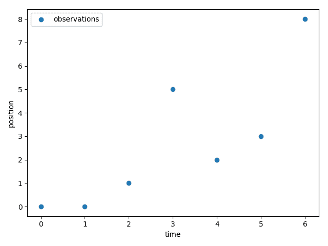

*我们如何了解火车在下午 3 点的实际位置？* 好吧，有一种可能性是火车在位置 5，但因为我们知道火车很重，速度变化很慢，所以火车很难在短时间内两次改变行驶方向，到达位置 5 然后再返回。因此，我们可以利用对事物工作原理的一些了解以及之前的观察，来对火车的位置做出更可靠的预测。

例如，如果我们假设我们可以用位置和速度来描述火车，我们会定义状态如下：

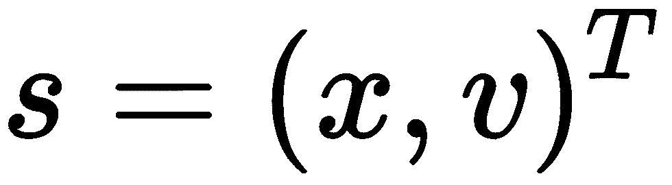

在这里，*x* 是火车的位置，*v* 是火车的速度。

现在我们需要一种方式来描述我们的世界模型，这被称为 **状态转换模型**——对于火车来说，它是简单的：

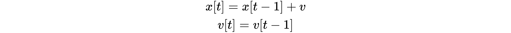

我们可以使用状态变量 *s* 将其写成矩阵形式：

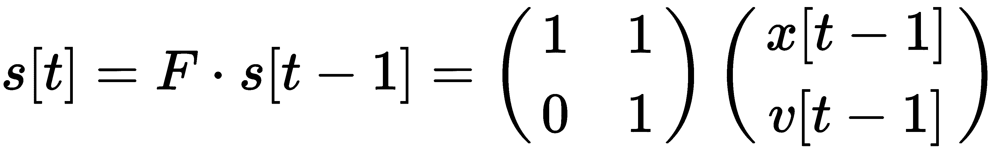

矩阵 *F* 被称为**状态转移矩阵**。

因此，我们相信火车不会改变其速度，并以恒定速度移动。这意味着在观测值的图表上应该有一条直线，但这太严格了，我们知道没有真实的系统会这样表现，所以我们允许系统中存在一些噪声，即**过程噪声**：

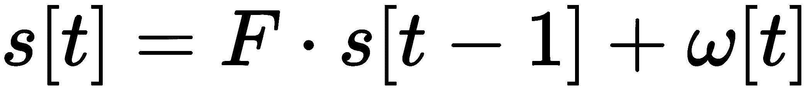

一旦我们对过程噪声的性质做出统计假设，这将成为一个统计框架，这通常是发生的情况。但是，这样，如果我们对我们的状态转移模型不确定，但对观测值确定，那么最好的解决方案仍然是仪器报告的内容。因此，我们需要将我们的状态与我们的观测值联系起来。注意，我们正在观测 *x*，因此观测值可以通过将状态乘以一个简单的行矩阵来恢复：

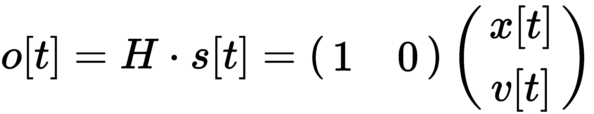

但是，正如我们所说的，我们必须允许观测值不完美（也许我们的雷达非常旧，有时会有错误的读数），也就是说，我们需要允许**观测噪声**；因此，最终的观测值如下：

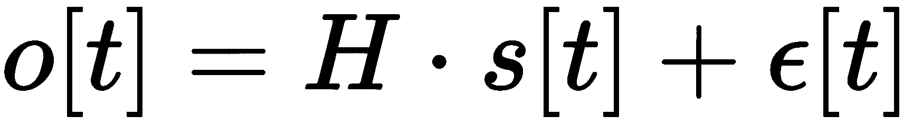

现在，如果我们能够描述过程噪声和观测噪声，卡尔曼滤波器将能够仅使用该时间之前的观测值，为我们提供关于火车在每个位置的好预测。最佳参数化噪声的方式是使用协方差矩阵：

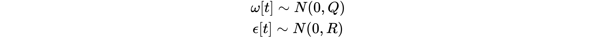

卡尔曼滤波器有一个递归的**状态转移模型**，因此我们必须提供状态初始值。如果我们选择它为 `(0, 0)`，并且如果我们假设**过程噪声**和**测量噪声**是等可能的（这在现实生活中是一个糟糕的假设），卡尔曼滤波器将为每个时间点提供以下预测：

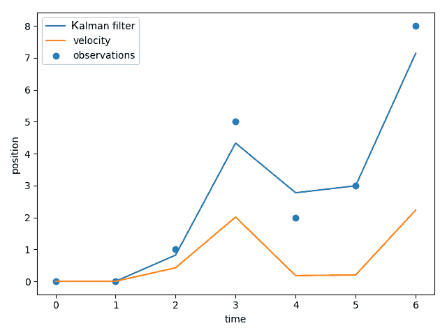

由于我们相信我们的观测值和我们的假设一样，即速度不会改变，我们得到了一条（蓝色）不那么极端的平滑曲线，但它仍然不够令人信服。因此，我们必须确保我们在选择的变量中编码我们的直觉。

现在，如果我们说**信噪比**，即协方差比率的平方根是 10，我们将得到以下结果：

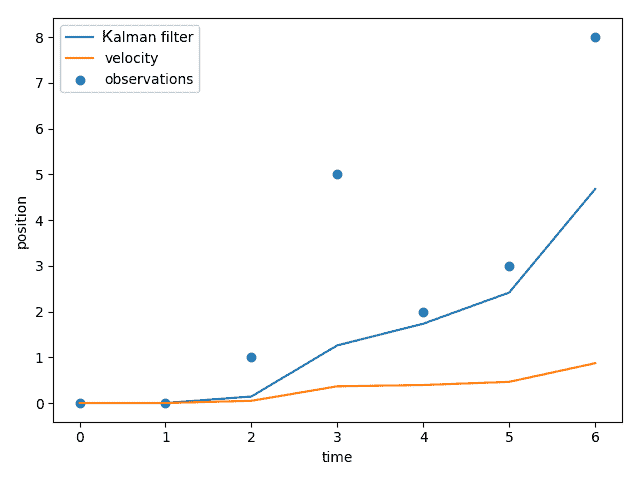

如您所见，速度确实移动得很慢，但我们似乎低估了火车行驶的距离。*或者，是我们高估了吗？*

调整卡尔曼滤波器是一个非常困难的任务，有许多算法可以做到这一点，但不幸的是，没有一个完美无缺。对于本章，我们不会介绍这些；我们将尝试选择有意义的参数，并且我们将看到这些参数给出了相当好的结果。

现在让我们回顾一下我们的单辆车跟踪模型，看看我们应该如何建模系统动力学。

# 使用带有卡尔曼滤波器的框跟踪器

首先，我们必须弄清楚如何建模每辆车的状态。可能从观测模型开始会更好；也就是说，*我们可以测量每辆车的哪些内容？*

好吧，目标检测器给我们提供了框，但它们呈现的方式并不是最好的物理解释；类似于之前给出的火车示例，我们想要可以推理的变量，并且更接近交通的潜在动力学。因此，我们使用以下观测模型：

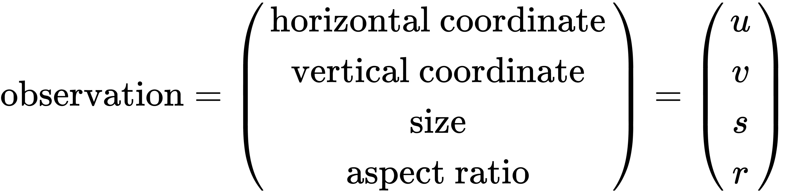

在这里，*u* 和 *v* 是目标中心的水平和垂直像素位置，而 *s* 和 *r* 分别代表目标边界框的尺寸（面积）和宽高比。由于我们的汽车在屏幕周围移动，并且越来越远或越来越近，因此坐标和边界框的大小会随时间变化。

假设没有人在像疯子一样开车，图像中汽车的速率应该保持大致恒定；这就是为什么我们可以将我们的模型限制在物体的位置和速率上。因此，我们将采取的状态如下：

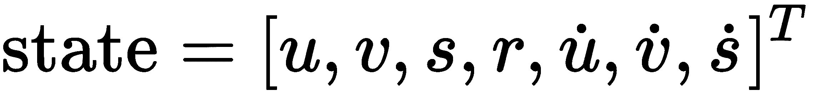

我们使用了一种表示法，其中变量上方的点表示该变量的变化率。

**状态转换模型**将是速度和宽高比随时间保持恒定（带有一些**过程噪声**）。在下面的屏幕截图中，我们可视化了所有的边界框及其对应的状态（中心位置和速度矢量）：

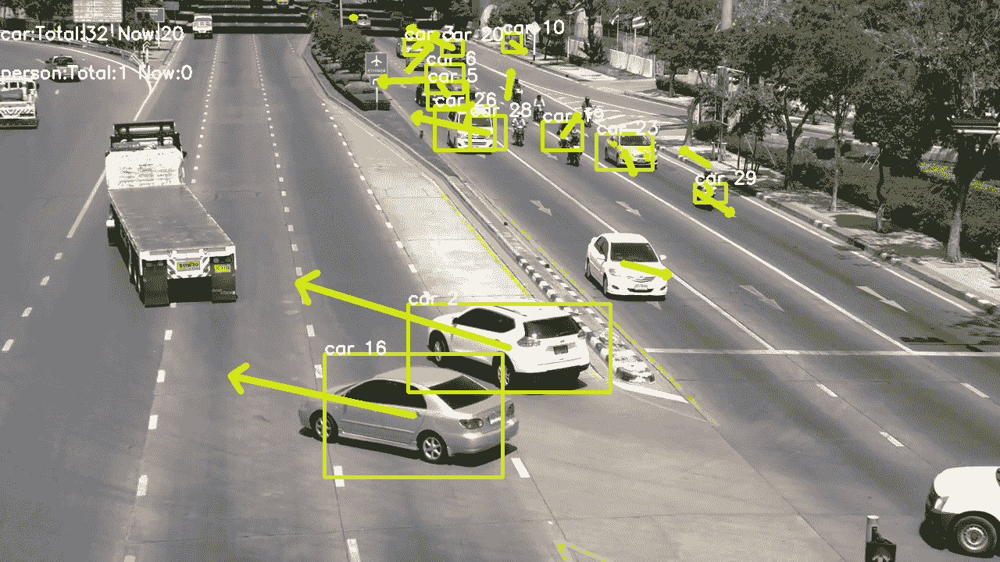

如您所见，我们已经设置了模型，使其观察到的与从我们的跟踪器接收到的略有不同。因此，在下一节中，我们将介绍从边界框到卡尔曼滤波器状态空间的转换函数。

# 将边界框转换为观测值

为了将边界框传递给卡尔曼滤波器，我们必须定义一个从每个边界框到观测模型的转换函数，并且，为了使用预测的边界框进行目标跟踪，我们需要定义一个从状态到边界框的函数。

让我们从边界框到观测值的转换函数开始：

1.  首先，我们计算边界框的中心坐标：

```py
def bbox_to_observation(bbox):
    x, y = (bbox[0:2] + bbox[2:4]) / 2
```

1.  接下来，我们计算框的宽度和高度，我们将使用这些值来计算尺寸（即面积）和比例：

```py
    w, h = bbox[2:4] - bbox[0:2]
```

1.  然后，我们计算 `bbox` 的大小，即面积：

```py
    s = w * h
```

1.  接着，我们计算宽高比，这仅仅是通过将宽度除以高度来完成的：

```py
    r = w / h
```

1.  然后`返回`结果作为一个 4 x 1 矩阵：

```py
    return np.array([x, y, s, r])[:, None].astype(np.float64)
```

现在，既然我们知道我们必须定义逆变换，那么让我们定义`state_to_bbox`：

1.  它接受一个 7 x 1 矩阵作为参数，并解包我们构建边界框所需的所有组件：

```py
def state_to_bbox(x):
    center_x, center_y, s, r, _, _, _ = x.flatten()
```

1.  然后，它根据宽高比和比例计算边界框的宽度和高度：

```py
    w = np.sqrt(s * r)
    h = s / w
```

1.  之后，它计算中心坐标：

```py
    center = np.array([center_x, center_y])
```

1.  然后，它计算盒子的半尺寸作为一个`numpy`元组，并使用它来计算盒子的对角线顶点坐标：

```py
    half_size = np.array([w, h]) / 2
    corners = center - half_size, center + half_size
```

1.  然后，我们将边界框作为一维`numpy`数组返回：

```py
    return np.concatenate(corners).astype(np.float64)
```

配备了转换函数，让我们看看如何使用 OpenCV 构建卡尔曼滤波器。

# 实现卡尔曼滤波器

现在，有了我们的模型，让我们动手编写一个处理所有这些魔法的类。我们将编写一个自定义类，该类将使用`cv2.KalmanFilter`作为卡尔曼滤波器，但我们将添加一些辅助属性来跟踪每个对象。

首先，让我们看看类的初始化，我们将通过传递状态模型、转换矩阵和初始参数来设置我们的卡尔曼滤波器：

1.  我们首先通过初始化类，包括边界框`bbox`和`label`对象的标签：

```py
class KalmanBoxTracker:
    def __init__(self, bbox, label):
```

1.  然后，我们设置一些辅助变量，这将使我们能够过滤在跟踪器中出现和消失的框：

```py
        self.id = label
        self.time_since_update = 0
        self.hit_streak = 0
```

1.  然后，我们使用正确的维数和数据类型初始化`cv2.KalmanFilter`：

```py
        self.kf = cv2.KalmanFilter(dynamParams=7, measureParams=4, type=cv2.CV_64F)
```

1.  我们设置了转换矩阵和相应的过程**噪声协方差矩阵**。协方差矩阵是一个简单的模型，涉及每个对象在水平和垂直方向上的当前恒定速度运动，并使用恒定速率变大或变小：

```py
        self.kf.transitionMatrix = np.array(
            [[1, 0, 0, 0, 1, 0, 0],
             [0, 1, 0, 0, 0, 1, 0],
             [0, 0, 1, 0, 0, 0, 1],
             [0, 0, 0, 1, 0, 0, 0],
             [0, 0, 0, 0, 1, 0, 0],
             [0, 0, 0, 0, 0, 1, 0],
             [0, 0, 0, 0, 0, 0, 1]], dtype=np.float64)
```

1.  我们还设置了我们对恒定速度过程的确定性。我们选择一个**对角协方差矩阵**；也就是说，我们的状态变量不相关，我们将位置变量的方差设置为`10`，速度变量的方差设置为 10,000。我们相信位置变化比速度变化更可预测：

```py
        self.kf.processNoiseCov = np.diag([10, 10, 10, 10, 1e4, 1e4, 1e4]).astype(np.float64)
```

1.  然后，我们将**观测模型**设置为以下矩阵，这意味着我们只是在测量状态中的前四个变量，即所有位置变量：

```py
        self.kf.measurementMatrix = np.array(
            [[1, 0, 0, 0, 0, 0, 0],
             [0, 1, 0, 0, 0, 0, 0],
             [0, 0, 1, 0, 0, 0, 0],
             [0, 0, 0, 1, 0, 0, 0]], dtype=np.float64)
```

1.  现在我们已经设置了噪声协方差的测量，我们相信水平和垂直位置大于宽高比和缩放，因此我们给这两个测量方差赋予较小的值：

```py
        self.kf.measurementNoiseCov = np.diag([10, 10, 1e3, 1e3]).astype(np.float64)

```

1.  最后，我们设置卡尔曼滤波器的初始位置和与之相关的不确定性：

```py
        self.kf.statePost = np.vstack((convert_bbox_to_z(bbox), [[0], [0], [0]]))
        self.kf.errorCovPost = np.diag([1, 1, 1, 1, 1e-2, 1e-2, 1e-4]).astype(np.float64)
```

在我们设置好卡尔曼滤波器之后，我们需要能够预测物体移动时的新位置。我们将通过定义另外两个方法——`update` 和 `predict` 来实现这一点。`update` 方法将根据新的观测值更新卡尔曼滤波器，而 `predict` 方法将根据先前证据预测新位置。现在让我们看看 `update` 方法：

```py
    def update(self, bbox):
        self.time_since_update = 0
        self.hit_streak += 1

        self.kf.correct(bbox_to_observation(bbox))
```

如您所见，`update` 方法接受新位置的边界框 `bbox`，将其转换为观测值，并在 OpenCV 实现上调用 `correct` 方法。我们只添加了一些变量来跟踪我们更新正在跟踪的对象有多长时间了。

现在，让我们看看 `predict` 函数；其过程将在以下步骤中解释：

1.  它首先检查我们是否连续两次调用了 `predict`；如果我们连续两次调用了它，那么它将 `self.hit_streak` 设置为 `0`：

```py
    def predict(self):
        if self.time_since_update > 0:
            self.hit_streak = 0
```

1.  然后它将 `self.time_since_update` 增加 `1`，这样我们就可以跟踪我们跟踪这个对象有多长时间了：

```py
        self.time_since_update += 1
```

1.  然后我们调用 OpenCV 实现的 `predict` 方法，并返回与预测相对应的边界框：

```py
        return state_to_bbox(self.kf.predict())
```

因此，现在我们已经实现了一个单目标跟踪器，下一步是创建一个可以将检测框与跟踪器关联的机制，我们将在下一节中完成。

# 将检测与跟踪器关联

在 Sort 算法中，是否将两个边界框视为同一对象的决策是基于交并比（IoU）。在本章之前，您已经学习了这个指标并实现了一个计算它的函数。在这里，我们将定义一个函数，它将根据它们的 IoU 值将检测框和跟踪框关联起来：

```py
def associate_detections_to_trackers(detections: np.ndarray, trackers: np.ndarray,
          iou_threshold: float = 0.3) -> Tuple[np.ndarray, np.ndarray, np.ndarray]:
```

该函数接受检测的边界框和跟踪器的预测框，以及一个 IoU 阈值。它返回匹配项，作为对应数组中对应索引的数组，未匹配检测框的索引和未匹配跟踪器框的索引。为了实现这一点，它采取以下步骤：

1.  首先，它初始化一个矩阵，其中将存储每个可能框对之间的 IoU 值：

```py
iou_matrix = np.zeros((len(detections), len(trackers)), dtype=np.float32)
```

1.  然后，我们遍历检测和跟踪框，计算每一对的 IoU，并将结果值存储在矩阵中：

```py
for d, det in enumerate(detections):
    for t, trk in enumerate(trackers):
        iou_matrix[d, t] = iou(det, trk)
```

1.  使用 `iou_matrix`，我们将找到匹配的对，使得这些对中 IoU 值的总和达到最大可能值：

```py
row_ind, col_ind = linear_sum_assignment(-iou_matrix)
```

为了这个目的，我们使用了 **匈牙利算法**，它作为 `linear_sum_assignment` 函数实现。它是一个组合优化算法，用于解决 **分配问题**。

为了使用此算法，我们已传递`iou_matrix`的相反值。该算法将索引关联起来，使得总和最小。因此，当我们取矩阵的负值时，我们找到最大值。找到这些关联的直接方法是对所有可能的组合进行迭代，并选择具有最大值的那个。

后者方法的缺点是，其时间复杂度将是指数级的，因此一旦我们有多个检测和跟踪器，它将会非常慢。同时，匈牙利算法的时间复杂度为***O(n³)***。

1.  然后，我们更改算法结果的格式，使其以`numpy`数组中匹配索引对的格式出现：

```py
matched_indices = np.transpose(np.array([row_ind, col_ind]))
```

1.  然后从`iou_matrix`中获取匹配项的交并比值：

```py
iou_values = np.array([iou_matrix[detection, tracker]
                       for detection, tracker in matched_indices])
```

1.  过滤掉具有过低 IoU 值的匹配项：

```py
good_matches = matched_indices[iou_values > 0.3]
```

1.  然后，找到未匹配的检测框的索引：

```py
unmatched_detections = np.array(
    [i for i in range(len(detections)) if i not in good_matches[:, 0]])
```

1.  之后，找到未匹配的跟踪器框的索引：

```py
unmatched_trackers = np.array(
    [i for i in range(len(trackers)) if i not in good_matches[:, 1]])
```

1.  最后，它返回匹配项以及未匹配检测和跟踪框的索引：

```py
return good_matches, unmatched_detections, unmatched_trackers
```

因此，现在我们已经有了跟踪单个对象和将检测与单个对象跟踪器关联起来的机制，接下来要做的就是创建一个类，该类将使用这些机制在帧之间跟踪多个对象。我们将在下一节中这样做，然后算法将完成。

# 定义跟踪器的主要类

类的构造函数如下所示：

```py
class Sort:
    def __init__(self, max_age=2, min_hits=3):
        self.max_age = max_age
        self.min_hits = min_hits
        self.trackers = []
        self.count = 0
```

它存储了两个参数：

+   第一个参数是`max_age`，它指定某个对象的跟踪器在没有关联框的情况下可以连续多少次存在，我们才认为该对象已从场景中消失并删除跟踪器。

+   第二个参数是`min_hits`，它指定跟踪器应连续多少次与一个框关联，我们才将其视为某个对象。它还创建属性以存储跟踪器并在实例生命周期内计算跟踪器的总数。

我们还定义了一个用于创建跟踪器 ID 的方法：

```py
def next_id(self):
    self.count += 1
    return self.count
```

该方法将跟踪器的计数增加一个，并返回该数字作为 ID。

现在，我们已经准备好定义`update`方法，它将执行繁重的工作：

```py
def update(self, dets):
```

`update`方法接受检测框，并包括以下步骤：

1.  对于所有可用的`trackers`，它预测它们的新位置，并立即删除预测失败的`trackers`：

```py
self.trackers = [
    tracker for tracker in self.trackers if not np.any(
        np.isnan(
            tracker.predict()))]
```

1.  然后，我们得到跟踪器的预测框：

```py
trks = np.array([tracker.current_state for tracker in self.trackers])
```

1.  然后，我们将跟踪器预测的框与检测框关联起来：

```py
matched, unmatched_dets, unmatched_trks = associate_detections_to_trackers(
    dets, trks)
```

1.  然后，我们更新匹配的`trackers`与关联的检测：

```py
for detection_num, tracker_num in matched:
    self.trackers[tracker_num].update(dets[detection_num])
```

1.  对于所有未匹配的检测，我们创建新的`trackers`，并使用相应的边界框进行初始化：

```py
for i in unmatched_dets:
    self.trackers.append(KalmanBoxTracker(dets[i, :], self.next_id()))
```

1.  然后，我们将`return`值组合成一个包含相关跟踪器框和跟踪器 ID 连接的`array`：

```py
ret = np.array([np.concatenate((trk.current_state, [trk.id + 1]))
                for trk in self.trackers
                if trk.time_since_update < 1 and trk.hit_streak >= self.min_hits])
```

在之前的代码片段中，我们只考虑了那些在当前帧中更新了检测框并且至少有一个`hit_streak`连续关联检测框的`trackers`。根据算法的特定应用，您可能想要更改此行为，使其更适合您的需求。

1.  然后，我们通过移除一段时间内没有更新新边界框的`trackers`来清理跟踪器：

```py
self.trackers = [
    tracker for tracker in self.trackers if tracker.time_since_update <= self.max_age]
```

1.  最后，我们`返回`结果：

```py
return ret
```

因此，现在我们已经完成了算法的实现，我们一切准备就绪，可以运行应用程序并看到它的实际效果。

# 观看应用程序的实际运行

一旦我们运行我们的应用程序，它将使用传递的视频或另一个视频流，然后处理它并展示结果：

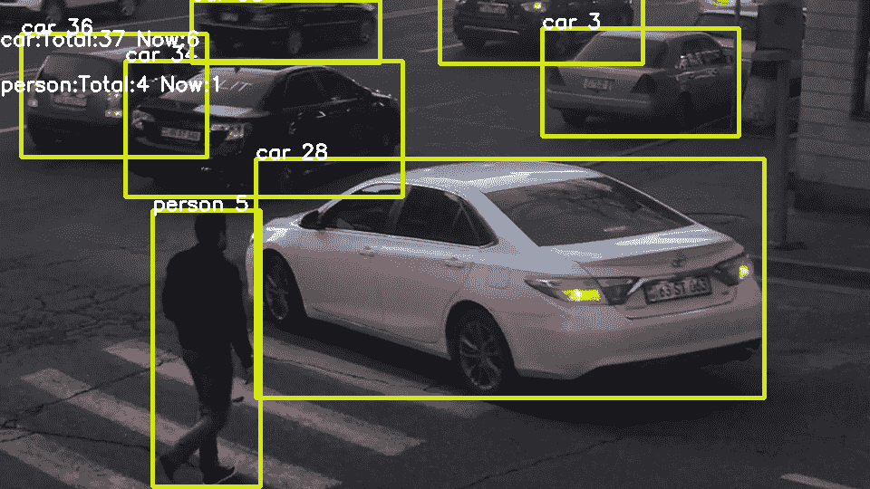

在每个处理的帧中，它将显示物体类型、边界框以及每个跟踪物体的数量。它还会在帧的左上角显示有关跟踪的一般信息。这些一般信息包括每种跟踪物体类型在整个过程中跟踪的视频物体的总数，以及场景中当前可用的跟踪物体。

# 摘要

在本章中，我们使用了一个物体检测网络，并将其与跟踪器结合使用，以跟踪和计数随时间推移的物体。阅读完本章后，您现在应该理解检测网络是如何工作的，以及它们的训练机制。

您已经学会了如何将使用其他框架构建的模型导入 OpenCV，并将其绑定到处理视频或使用其他视频流（如您的相机或远程 IP 相机）的应用程序中。您实现了一个简单但稳健的跟踪算法，它与稳健的检测网络结合使用，可以回答与视频数据相关的多个统计问题。

您现在可以使用并训练您选择的物体检测网络，以便创建您自己的高度精确的应用程序，这些应用程序的功能围绕物体检测和跟踪实现。

在本书的整个过程中，您已经熟悉了机器学习主要分支之一，即**计算机视觉**的背景。您从使用简单的图像滤波器和形状分析技术开始。然后，您继续使用经典的特征提取方法，并基于这些方法构建了几个实际的应用程序。之后，您学习了自然场景的统计特性，并能够使用这些特性来跟踪未知物体。

接下来，你开始学习、使用和训练监督模型，例如**支持向量机**（**SVMs**）和**级联分类器**。在掌握了所有关于经典计算机视觉方法的理论和实践知识后，你深入研究了深度学习模型，这些模型如今在许多机器学习问题中提供了最先进的结果，尤其是在计算机视觉领域。

你现在已经理解了**卷积网络**的工作原理以及深度学习模型的训练方式，你还在其他预训练模型的基础上构建并训练了自己的网络。拥有所有这些知识和实践经验，你就可以分析、理解和应用其他计算机视觉模型，一旦你有了新的想法，你还可以详细阐述新的模型。你现在可以开始着手自己的**计算机视觉**项目了，这可能会改变世界！
