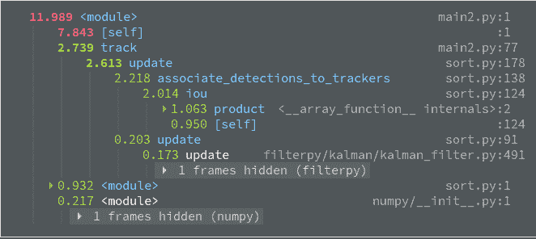

# 第十一章：性能分析和加速你的应用程序

当你遇到一个运行缓慢的应用程序时，首先，你需要找出你的代码中哪些部分花费了相当多的处理时间。找到这些代码部分（也称为 **瓶颈**）的一个好方法是对应用程序进行性能分析。一个允许在不修改应用程序的情况下对应用程序进行性能分析的好分析器是 `pyinstrument`（[`github.com/joerick/pyinstrument`](https://github.com/joerick/pyinstrument)）。在这里，我们使用 `pyinstrument` 对 第十章，*学习检测和跟踪对象* 的应用程序进行性能分析，如下所示：

```py
$ pyinstrument -o profile.html -r html  main.py
```

我们使用 `-o` 选项传递了一个输出 `.html` 文件，其中包含性能分析报告信息要保存的位置。

我们还使用 `-r` 选项指定了报告的渲染方式，以声明我们想要 HTML 输出。一旦应用程序终止，性能分析报告将被生成，并且可以在浏览器中查看。

你可以省略这两个选项。

在后一种情况下，报告将在控制台中显示。一旦我们终止应用程序，我们可以在浏览器中打开生成的 `.html` 文件，它将显示类似于以下内容的报告：



首先，我们可以注意到在脚本本身上花费了相当多的时间。这是可以预料的，因为目标检测模型正在对每一帧进行推理，这是一个相当重的操作。我们还可以注意到跟踪也花费了相当多的时间，尤其是在 `iou` 函数中。

通常，根据应用程序的特定应用，为了加速跟踪，只需将 `iou` 函数替换为更高效的另一个函数就足够了。在这个应用程序中，`iou` 函数被用来计算 `iou_matrix`，它存储了每个可能的检测和跟踪框对的 **交集与并集**（**IOU**）度量。当你致力于加速你的代码时，为了节省时间，将代码替换为加速版本并再次进行性能分析，以检查它是否满足你的需求可能是个好主意。

但让我们从应用程序中提取适当的代码，并分析使用 **Numba** 加速的可能性，我们将在下一节中介绍。

# 使用 Numba 加速

Numba 是一个编译器，它使用 **低级虚拟机**（**LLVM**）编译器基础设施优化纯 Python 编写的代码。它有效地将数学密集型的 Python 代码编译成与 **C**、**C++** 和 **Fortran** 相似性能的代码。它理解一系列 `numpy` 函数、Python `construct` 库和运算符，以及标准库中的一系列数学函数，并为 **图形处理单元**（**GPU**）和 **中央处理单元**（**CPU**）生成相应的本地代码，只需简单的注释。

在本节中，我们将使用**IPython**交互式解释器来处理代码。它是一个增强的交互式 Python 外壳，特别支持所谓的**魔法命令**，在我们的案例中，我们将使用这些命令来计时函数。一个选项是直接在控制台中使用解释器。其他几个选项是使用**Jupyter Notebook**或**JupyterLab**。如果您使用的是**Atom**编辑器，您可能想要考虑**Hydrogen**插件，该插件在编辑器中实现了一个交互式编码环境。

要导入 NumPy 和 Numba，请运行以下代码：

```py
import numpy as np
import numba
```

我们正在使用**Numba 版本 0.49**，这是撰写本文时的最新版本。在整个这一节中，您会注意到我们不得不以这种方式更改代码，以便可以使用这个版本的 Numba 进行编译。

据说，在未来的版本中，Numba 将支持更多函数，并且一些或所有修改可能不再需要。当您在您的应用程序代码上工作时，请参考撰写本文时的**Numba**文档，以了解支持的功能，文档可在[`numba.pydata.org/numba-doc/latest/index.html`](https://numba.pydata.org/numba-doc/latest/index.html)找到。

在这里，我们介绍了 Numba 的一些重要可能性，并在某个示例上展示了结果，以便您了解 Numba 如何帮助您加速您自己的应用程序代码。

现在我们将我们想要加速的代码隔离出来，如下所示：

1.  首先，这是一个计算两个框的`iou`的函数：

```py
def iou(a: np.ndarray, b: np.ndarray) -> float:
    a_tl, a_br = a[:4].reshape((2, 2))
    b_tl, b_br = b[:4].reshape((2, 2))
    int_tl = np.maximum(a_tl, b_tl)
    int_br = np.minimum(a_br, b_br)
    int_area = np.product(np.maximum(0., int_br - int_tl))
    a_area = np.product(a_br - a_tl)
    b_area = np.product(b_br - b_tl)
    return int_area / (a_area + b_area - int_area)
```

目前，我们将其保留为第十章中的原样，*学习检测和跟踪对象*。

1.  接下来是使用先前函数计算`iou_matrix`的代码部分，如下所示：

```py
def calc_iou_matrix(detections,trackers):
    iou_matrix = np.zeros((len(detections), len(trackers)), dtype=np.float32)

    for d, det in enumerate(detections):
        for t, trk in enumerate(trackers):
            iou_matrix[d, t] = iou(det, trk)
    return iou_matrix
```

我们已经将相应的循环和矩阵定义封装在一个新的函数中。

1.  为了测试性能，让我们定义两组`随机`边界框，如下所示：

```py
A = np.random.rand(100,4)
B = np.random.rand(100,4)
```

我们定义了两组`100`个边界框。

1.  现在，我们可以通过运行以下代码来估计计算这些边界框的`iou_matrix`所需的时间：

```py
%timeit calc_iou_matrix(A,B)
```

`%timeit`魔法命令会多次执行函数，计算平均执行时间以及与平均值的偏差，并输出结果，如下所示：

```py
307 ms ± 3.15 ms per loop (mean ± std. dev. of 7 runs, 1 loop each)
```

我们可以注意到计算矩阵大约需要 1/3 秒。因此，如果我们场景中有 100 个对象，并且我们想在 1 秒内处理多个帧，应用程序中将会出现巨大的瓶颈。现在让我们在 CPU 上加速这段代码。

# 使用 CPU 加速

Numba 有几个代码生成实用工具，可以将 Python 代码转换为机器代码。其核心特性之一是`@numba.jit`装饰器。这个装饰器允许您通过 Numba 编译器优化标记一个函数。例如，以下函数计算数组中所有元素的总乘积：

```py
@numba.jit(nopython=True)
def product(a):
    result = 1
    for i in range(len(a)):
        result*=a[i]
    return result
```

它可以被视为一个`np.product`的自定义实现。装饰器告诉 Numba 将函数编译成机器代码，这比 Python 版本有更快的执行时间。Numba 总是尝试编译指定的函数。在函数中的操作无法完全编译的情况下，Numba 会回退到所谓的**对象模式**，使用**Python/C API**，并将所有值作为 Python 对象处理，以对它们进行操作。

后者比前者慢得多。当我们传递`nopython=True`时，我们明确告诉它，当函数无法编译为完整的机器代码时，抛出异常。

我们可以使用与`iou`函数相同的装饰器，如下所示：

```py
@numba.jit(nopython=True)
def iou(a: np.ndarray, b: np.ndarray) -> float:
    a_tl, a_br = a[0:2],a[2:4]
    b_tl, b_br = b[0:2],b[2:4]
    int_tl = np.maximum(a_tl, b_tl)
    int_br = np.minimum(a_br, b_br)
    int_area = product(np.maximum(0., int_br - int_tl))
    a_area = product(a_br - a_tl)
    b_area = product(b_br - b_tl)
    return int_area / (a_area + b_area - int_area)
```

我们可以注意到这个函数与 Python 函数略有不同。首先，我们使用了我们自定义的`np.product`实现。如果我们尝试使用当前版本的 Numba 的本地实现，我们将遇到异常，因为本地的`np.product`目前不被 Numba 编译器支持。这与函数的前两行类似，Numba 无法解释数组的自动解包。

现在，我们准备像之前一样计时我们的函数，如下所示：

```py
%timeit calc_iou_matrix(A,B)
```

后者产生以下输出：

```py
14.5 ms ± 24.5 µs per loop (mean ± std. dev. of 7 runs, 1 loop each)
```

我们可以注意到，我们已经实现了巨大的加速（大约 20 倍），但让我们继续前进。我们可以注意到`calc_iou_matrix`仍然是用纯 Python 编写的，并且有嵌套循环，这可能会花费相当多的时间。让我们创建它的编译版本，如下所示：

```py
@numba.jit(nopython=True)
def calc_iou_matrix(detections,trackers):
    iou_matrix = np.zeros((len(detections), len(trackers)), dtype=np.float32)
    for d in range(len(detections)):
        det = detections[d]
        for t in range(len(trackers)):
            trk = trackers[t]
            iou_matrix[d, t] = iou(det, trk)
```

再次，这个函数与原始函数不同，因为 Numba 无法解释`enumerate`。对这个实现进行计时将产生类似于以下输出的结果：

```py
7.08 ms ± 31 µs per loop (mean ± std. dev. of 7 runs, 1 loop each)
```

我们再次实现了加速。这个版本比之前的版本快一倍。让我们继续加速，尽可能让它变得更快，但在做之前，让我们首先熟悉一下`vectorize`装饰器。

`vectorize`装饰器允许创建函数，这些函数可以用作 NumPy`ufuncs`类，从在标量参数上工作的函数中创建，如下面的函数所示：

```py
@numba.vectorize
def custom_operation(a,b):
    if b == 0:
        return 0
    return a*b if a>b else a/b
```

当给函数一对标量时，该函数执行一些特定的操作，而`vectorize`装饰器使得在 NumPy 数组上执行相同的操作成为可能，例如，如下所示：

```py
custom_operation(A,B)
```

NumPy 类型转换规则也适用——例如，你可以用一个标量替换一个数组，或者用一个形状为`(1,4)`的数组替换一个数组，如下所示：

```py
custom_operation(A,np.ones((1,4)))
```

我们将使用另一个装饰器`guvectorize`来加速我们的`iou_matrix`计算。这个装饰器将`vectorize`的概念推进了一步。它允许编写返回不同维度数组的`ufuncs`。我们可以注意到，在计算 IOU 矩阵时，输出数组的形状由每个传递数组中边界框的数量组成。我们如下使用装饰器来计算矩阵：

```py
@numba.guvectorize(['(f8[:, :], f8[:, :], f8[:, :])'], '(m,k),(n,k1)->(m, n)')
def calc_iou_matrix(x, y, z):
    for i in range(x.shape[0]):
        for j in range(y.shape[1]):
            z[i, j] = iou(x[i],y[i])
```

第一个参数告诉 Numba 编译一个在 8 字节浮点数（`float64`）上工作的函数。它还使用分号指定输入和输出数组的维度。第二个参数是签名，它指定了输入和输出数组的维度是如何相互匹配的。一旦我们用输入执行了函数，`z`输出就会在那里等待，具有正确的形状，只需要在函数中填充即可。

如果我们像之前那样计时这个实现，我们会得到一个类似于以下输出的结果：

```py
196 µs ± 2.46 µs per loop (mean ± std. dev. of 7 runs, 10000 loops each)
```

再次，我们的速度比之前的情况快了大约 30 倍。与最初的纯 Python 实现相比，我们快了大约 1,000 倍，这相当令人印象深刻。

# 理解 Numba、CUDA 和 GPU 加速

你已经看到了使用 Numba 创建 CPU 加速代码是多么简单。Numba 还提供了一个类似的接口，使用**Compute Unified Device Architecture**（**CUDA**）进行 GPU 计算。让我们将我们的 IOU 矩阵计算函数移植到使用 Numba 在 GPU 上进行计算。

我们可以通过稍微修改装饰器参数来指示 Numba 在 GPU 上进行计算，如下所示：

```py
@numba.guvectorize(['(f8[:, :], f8[:, :], f8)'], '(m,k),(n,k1)->()',target="cuda")
def mat_mul(x, y, z):
    for i in range(x.shape[0]):
        for j in range(y.shape[1]):
            z=iou(x[i],y[j])
```

在这里，我们通过传递`target="cuda"`来指示 Numba 在 GPU 上进行计算。我们还需要在`iou`函数上做一些工作。新的函数如下所示：

```py
@numba.cuda.jit(device=True)
def iou(a: np.ndarray, b: np.ndarray) -> float:
    xx1 = max(a[0], b[0])
    yy1 = max(a[1], b[1])
    xx2 = min(a[2], b[2])
    yy2 = min(a[3], b[3])
    w = max(0., xx2 - xx1)
    h = max(0., yy2 - yy1)
    wh = w * h
    result = wh / ((a[2]-a[0])*(a[3]-a[1])
        + (b[2]-b[0])*(b[3]-b[1]) - wh)
    return result
```

首先，我们更改了装饰器，现在使用`numba.cuda.jit`而不是`numba.jit`。后者指示 Numba 创建一个在 GPU 上执行的功能。这个函数本身是从在 GPU 设备上运行的功能中调用的。为此，我们传递了`device=True`，这明确指出这个函数打算用于从在 GPU 上计算的功能中调用。

你还可以注意到，我们做了相当多的修改，以便我们消除了所有的 NumPy 函数调用。正如 CPU 加速一样，这是因为`numba.cuda`目前无法执行函数中所有可用的操作，我们将它们替换成了`numba.cuda`支持的那些操作。

通常，在计算机视觉中，你的应用程序只有在处理**深度神经网络**（**DNNs**）时才需要 GPU 加速。大多数现代深度学习框架，如**TensorFlow**、**PyTorch**和**MXNet**，都支持开箱即用的 GPU 加速，让你远离底层 GPU 编程，专注于你的模型。在分析了这些框架之后，如果你发现自己有一个你认为必须直接使用 CUDA 实现的特定算法，你可能想分析`numba.cuda` API，它支持大多数 CUDA 功能。
