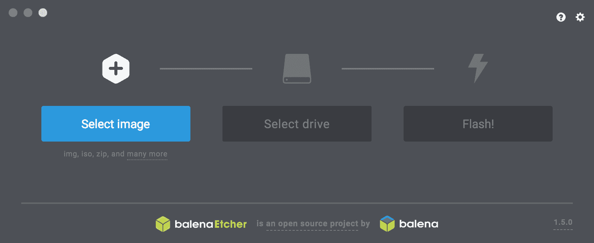
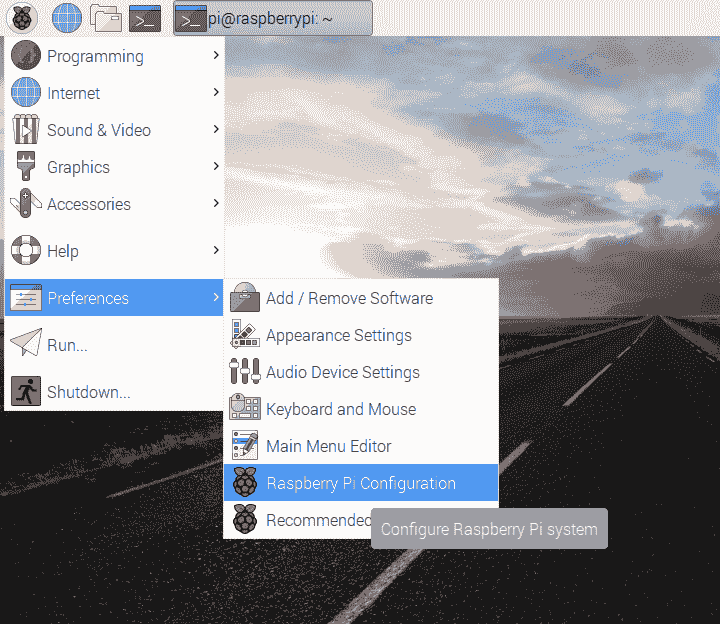
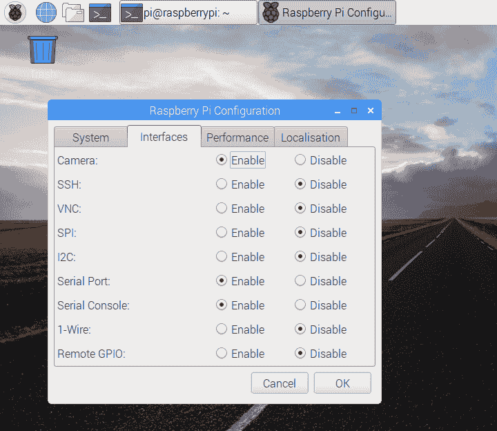

# 准备任务

“Q：多年来，先生，我一直说我们的专用设备已经过时了。而现在，计算机分析揭示了一种全新的方法：小型化。”

– 《她的秘密服务》（1969 年）

007 不是个普通人。他驾驶着潜艇车；他绑上火箭腰带；哦，他滑雪的样子，多么潇洒，多么潇洒！他总是拥有最新的装备，而且从不害怕在上面留下划痕，这让工程师 Q 感到非常沮丧。

作为 2010 年代的软件开发者，我们见证了新平台采用率的激增。在一个家庭屋檐下，我们可能会发现 Windows、Mac、iOS 和 Android 设备的混合。妈妈和爸爸的工作场所提供不同的平台。孩子们有三个或五个游戏机，如果你算上移动版本的话。幼儿有一个 LeapFrog 学习平板。智能眼镜变得越来越便宜。

我们不能害怕尝试新的平台，并考虑新的组合方式。毕竟，我们的用户是这样的。

这本书涵盖了多平台开发。它展示了我们可以部署在意想不到的地方的奇特而美妙的应用。它使用计算机的多种感官，尤其是计算机视觉，为围绕我们的平淡无奇、异构的设备堆叠注入新的活力。

在 007 特工用这些小玩意儿胡闹之前，他必须听从 Q 的简报。这一章将扮演 Q 的角色。这是设置章节。

到这一章结束时，你将拥有所有在 Windows、Mac 或 Linux 上使用 Python 开发 OpenCV 应用程序，以及在 Android 上使用 Java 的工具。你还将成为 Raspberry Pi 单板计算机的骄傲新用户。（这额外的硬件是可选的。）你甚至会对 Unity 游戏引擎有了一些了解，我们可以将其与 OpenCV 集成。具体来说，这一章将涵盖以下设置开发环境的方法：

+   在 Windows 上设置 Python 和 OpenCV。可选地，这包括使用 CMake 和 Visual Studio 配置和构建 OpenCV。

+   在 Mac 上设置 Python 和 OpenCV。这包括使用 MacPorts 或 Homebrew 作为包管理器。

+   在 Debian Jessie 或其衍生版本（如 Raspbian、Ubuntu 或 Linux Mint）上设置 Python 和 OpenCV。这包括使用**高级包工具**（**APT**）包管理器。可选地，它还将包括使用 CMake 和 GCC 从源代码配置和构建 OpenCV。

+   在 Fedora 或其衍生版本（如**Red Hat Enterprise Linux**（**RHEL**）或 CentOS）上设置 Python 和 OpenCV。这包括使用 yum 包管理器。

+   在 openSUSE 上设置 Python 和 OpenCV。这包括使用 yum 包管理器。

+   在 Windows、Mac 或 Linux 上设置 Android Studio 和 OpenCV 的 Android 库。

+   在 Windows 或 Mac 上设置 Unity 和 OpenCV。

+   设置 Raspberry Pi。

如果你发现这个设置章节的范围让你感到有些畏惧，请放心，并非所有工具都是必需的，也没有任何单个项目会同时使用所有这些工具。虽然我和 Q 都喜欢同时设置多个技术的大事件，但你只需浏览这一章，并在工具在我们的项目中一个接一个地变得有用时再回头查阅。

# 技术要求

这是设置章节。一开始没有特定的软件先决条件；我们将随着进行逐步设置一切。

运行 Python 代码的基本说明包含在附录 C，*与蛇共舞（或，Python 初步探索）*中。在用 OpenCV 设置 Python 环境之后，你可能需要参考这个附录，以便了解如何最小化测试环境。

# 设置开发机器

我们可以在台式机、笔记本电脑甚至谦逊的树莓派（在后面的*设置树莓派*部分中介绍）上开发我们的 OpenCV 应用程序。我们的大部分应用程序的内存占用小于 128 MB，因此它们仍然可以在旧或低功耗的机器上运行（尽管速度较慢）。为了节省时间，首先在最快的机器上开发，然后在较慢的机器上测试。

本书假设你的开发机器上安装了以下操作系统之一：

+   Windows 7 SP 1，或更高版本。

+   Mac OS 10.7（Lion），或更高版本。

+   Debian Jessie，更高版本，或以下衍生版本：

    +   Raspbian 2015-09-25，或更高版本

    +   Ubuntu 14.04，或更高版本

    +   Linux Mint 17，或更高版本

+   Fedora 28，更高版本，或以下衍生版本：

    +   RHEL 8，或更高版本

    +   CentOS 8，或更高版本

+   openSUSE Leap 42.3，openSUSE Leap 15.0，或更高版本；openSUSE Tumbleweed，或其衍生版本。

其他类 Unix 系统也可能工作，但本书不会涉及。

你应该有一个 USB 网络摄像头和任何必要的驱动程序。大多数摄像头都附有在 Windows 和 Mac 上安装驱动程序的说明。Linux 发行版通常包括支持许多摄像头的 **USB 视频类**（**UVC**）Linux 驱动程序，具体信息请见[`www.ideasonboard.org/uvc/#devices`](http://www.ideasonboard.org/uvc/#devices)。

我们将设置以下组件：

+   在 Mac 上，一个第三方包管理器帮助我们安装库及其依赖项；我们将使用 MacPorts 或 Homebrew。

+   Python 开发环境——在撰写本书时，OpenCV 支持 Python 2.7，3.4，3.5，3.6 和 3.7。本书中的 Python 代码支持所有这些版本。作为 Python 开发环境的一部分，我们将使用 Python 的包管理器，pip。

+   流行的 Python 库，如 NumPy（用于数值函数）、SciPy（用于数值和科学函数）、Requests（用于网络请求）和 wxPython（用于跨平台 GUI）。

+   PyInstaller，一个跨平台工具，可以将 Python 脚本、库和数据捆绑为可重新分发的应用程序，这样用户机器就不需要安装 Python、OpenCV 和其他库。就本书的目的而言，构建 Python 项目的可重新分发版本是一个可选主题。我们将在第二章中介绍基础知识，*全球寻找豪华住宿*，但你可能需要进行自己的测试和调试，因为 PyInstaller（就像其他 Python 捆绑工具一样）在操作系统、Python 版本和库版本之间并不总是表现出完全一致的行为。它在 Raspberry Pi 或其他 ARM 设备上支持不佳。

+   可选地，我们可以使用 C++ 开发环境来使我们能够从源代码构建 OpenCV。在 Windows 上，我们使用 Visual Studio 2015 或更高版本。在 Mac 上，我们使用 Xcode。在 Linux 上，我们使用 GCC，它是标准配置。

+   一个带有 Python 支持的 OpenCV 和 `opencv_contrib`（一组额外的 OpenCV 模块）的构建，以及针对某些桌面硬件的优化。在撰写本书时，OpenCV 4.0.x 是最新的稳定分支，我们的说明针对这个分支。然而，一般来说，本书中的代码也可以与之前的稳定分支 OpenCV 3.4.x 一起工作，它可以从包管理器中更广泛地获得，适用于喜欢预包装构建的用户。

+   另一个带有 Java 支持的 OpenCV 构建，以及针对某些 Android 硬件的优化。在撰写本文时，OpenCV 4.0.1 是最新的发布版本。

+   一个包括 Android Studio 和 Android SDK 的 Android 开发环境。

+   在 64 位 Windows 或 Mac 上，一个名为 **Unity** 的三维游戏引擎。

Android Studio 的内存占用很大。即使你想使用 Raspberry Pi 开发桌面和 Pi 应用程序，也请使用具有更多 RAM 的设备来开发 Android 应用程序。

让我们将这个设置分解为三个平台相关的步骤集，用于 Python 和 OpenCV 环境，以及一组平台无关的步骤集，用于 Android Studio 和 OpenCV 环境，还有另一组平台无关的步骤集，用于 Unity 和 OpenCV 环境。

# 在 Windows 上设置 Python 和 OpenCV

在 Windows 上，我们有设置 32 位开发环境（以制作与 32 位和 64 位 Windows 兼容的应用程序）或 64 位开发环境（以制作仅与 64 位 Windows 兼容的优化应用程序）的选择。OpenCV 提供了 32 位和 64 位版本。

我们还有选择使用二进制安装程序或从源代码编译 OpenCV。对于本书中的 Windows 应用程序，二进制安装程序提供了我们所需的一切。然而，我们也讨论了从源代码编译的选项，因为它使我们能够配置额外的功能，这些功能可能与你的未来工作或我们其他书籍中的项目相关。

无论我们获取 OpenCV 的方式如何，我们都需要一个通用的 Python 开发环境。我们将使用二进制安装程序来设置这个环境。Python 的安装程序可以从 [`www.python.org/getit/`](http://www.python.org/getit/) 获取。下载并运行 Python 3.7 的最新版本，无论是 32 位版本还是 64 位版本。

要使 Python 脚本默认使用我们新的 Python 3.7 安装程序运行，让我们编辑系统的 Path 变量并追加 `;C:\Python3.7`（假设 Python 3.7 安装在默认位置）。删除任何以前的 Python 路径，例如 `;C:\Python2.7`。注销并重新登录（或重启）。

Python 附带了一个名为 `pip` 的包管理器，它简化了安装 Python 模块及其依赖项的任务。打开命令提示符并运行以下命令来安装 `numpy`、`scipy`、`requests`、`wxPython` 和 `pyinstaller`：

```py
> pip install --user numpy scipy requests wxPython pyinstaller
```

现在，我们有一个选择。我们可以安装 `OpenCV` 和 `opencv_contrib` 的预构建二进制模块，或者我们可以从源代码构建这个模块。要安装预构建模块，只需运行以下命令：

```py
> pip install --user opencv-contrib-python
```

或者，要从源代码构建 `OpenCV` 和 `opencv_contrib`，请按照 *在 Windows 上使用 CMake 和 Visual Studio 构建 OpenCV* 这一部分的说明操作，如下所示。

在安装预构建的 `OpenCV` 和 `opencv_contrib` 模块或从源代码构建之后，我们将拥有开发 Windows 上 OpenCV 应用程序所需的一切。要为 Android 开发，我们需要按照本章后面的 *设置 Android Studio* 和 *OpenCV* 这一部分的说明来设置 Android Studio。

# 使用 CMake 和 Visual Studio 在 Windows 上构建 OpenCV

要从源代码编译 OpenCV，我们需要一个通用的 C++ 开发环境。作为我们的 C++ 开发环境，我们将使用 Visual Studio 2015 或更高版本。使用您可能购买的任何安装介质，或者访问 [`visualstudio.microsoft.com/downloads/`](https://visualstudio.microsoft.com/downloads/) 的下载页面。下载并运行以下安装程序的其中一个：

+   免费的 Visual Studio Community 2017

+   任何付费的 Visual Studio 2017 版本，这些版本有 30 天的免费试用期

如果安装程序列出了可选的 C++ 组件，我们应该选择安装所有这些组件。安装程序运行完成后，重启。

OpenCV 使用一组名为 **CMake** 的构建工具，我们必须安装它。可选地，我们可以安装几个第三方库，以便在 OpenCV 中启用额外功能。例如，让我们安装 Intel **线程构建块**（**TBB**），OpenCV 可以利用它来优化一些多核 CPU 的函数。安装 TBB 后，我们将配置和构建 OpenCV。最后，我们将确保我们的 C++ 和 Python 环境可以找到我们的 OpenCV 构建。

这里是详细的步骤：

1.  从 [`cmake.org/download/`](https://cmake.org/download/) 下载最新稳定的 CMake 版本。需要 CMake 3 或更高版本。即使我们使用 64 位库和编译器，32 位 CMake 也是兼容的。当安装程序询问是否修改 PATH 时，选择将 CMake 添加到系统 PATH 以供所有用户使用或仅添加到当前用户的系统 PATH。

1.  如果您的系统使用代理服务器访问互联网，请定义两个环境变量，`HTTP_PROXY` 和 `HTTPS_PROXY`，其值等于代理服务器的 URL，例如 `http://myproxy.com:8080`。这确保 CMake 可以使用代理服务器下载一些额外的 OpenCV 依赖项。（如果有疑问，请不要定义这些环境变量；你很可能没有使用代理服务器。）

1.  从 [`opencv.org/releases.html`](https://opencv.org/releases.html) 下载 OpenCV Win 包。（选择最新版本。）下载的文件可能有 `.exe` 扩展名，但实际上它是一个自解压的 ZIP 文件。双击文件，当提示时，输入任何目标文件夹，我们将称之为 `<opencv_unzip_destination>`。将创建一个子文件夹 `<opencv_unzip_destination>/opencv`。

1.  从 [`github.com/opencv/opencv_contrib/releases`](https://github.com/opencv/opencv_contrib/releases) 下载 `opencv_contrib` 作为 ZIP 文件。（选择最新版本。）将其解压到任何目标文件夹，我们将称之为 `<opencv_contrib_unzip_destination>`。

1.  从 [`www.threadingbuildingblocks.org/download`](https://www.threadingbuildingblocks.org/download) 下载最新稳定的 TBB 版本。它包括 32 位和 64 位二进制文件。将其解压到任何目标，我们将称之为 `<tbb_unzip_destination>`。

1.  打开命令提示符。创建一个文件夹来存储我们的构建：

```py
> mkdir <build_folder>
```

切换到新创建的构建文件夹：

```py
> cd <build_folder>
```

1.  在设置好我们的依赖项之后，我们现在可以配置 OpenCV 的构建系统。要了解所有配置选项，我们可以阅读 `<opencv_unzip_destination>/opencv/sources/CMakeLists.txt` 中的代码。然而，作为一个例子，我们将只使用用于包含 Python 绑定和通过 TBB 的多进程的发布构建的选项：

+   要为 Visual Studio 2017 创建一个 32 位项目，请运行以下命令（但将尖括号及其内容替换为实际路径）：

```py
> CALL <tbb_unzip_destination>\bin\tbbvars.bat ia32 vs2017
> cmake -DCMAKE_BUILD_TYPE=RELEASE DWITH_OPENGL=ON -DWITH_TBB=ON 
-DOPENCV_SKIP_PYTHON_LOADER=ON 
-DPYTHON3_LIBRARY=C:/Python37/libs/python37.lib 
-DPYTHON3_INCLUDE_DIR=C:/Python37/include -DOPENCV_EXTRA_MODULES_PATH="<opencv_contrib_unzip_destination>/modules" -G "Visual Studio 15 2017" "<opencv_unzip_destination>/opencv/sources"
```

+   或者，要为 Visual Studio 2017 创建一个 64 位项目，请运行以下命令（但将尖括号及其内容替换为实际路径）：

```py
> CALL <tbb_unzip_destination>\bin\tbbvars.bat intel64 vs2017
> cmake -DCMAKE_BUILD_TYPE=RELEASE DWITH_OPENGL=ON -DWITH_TBB=ON 
-DOPENCV_SKIP_PYTHON_LOADER=ON 
-DPYTHON3_LIBRARY=C:/Python37/libs/python37.lib 
-DPYTHON3_INCLUDE_DIR=C:/Python37/include -DOPENCV_EXTRA_MODULES_PATH="<opencv_contrib_unzip_destination>/modules" -G "Visual Studio 15 2017 Win64" "<opencv_unzip_destination>/opencv/sources"
```

+   CMake 将生成一个报告，说明它找到了或没有找到的依赖项。OpenCV 有许多可选依赖项，所以不要恐慌（目前还不要），关于缺失的依赖项。然而，如果构建没有成功完成，请尝试安装缺失的依赖项。（许多可以作为预构建的二进制文件获得。）然后，重复此步骤。

1.  现在我们已经配置了构建系统，我们可以编译 OpenCV。在 Visual Studio 中打开`<build_folder>/OpenCV.sln`。选择发布配置并构建解决方案。（如果您选择除了发布以外的其他构建配置，可能会出现错误，因为大多数 Python 安装不包括调试库。）

1.  我们应该确保我们的 Python 安装中不包含其他版本的 OpenCV。在您的 Python `DLLs`文件夹和 Python `site-packages`文件夹中查找并删除任何 OpenCV 文件。例如，这些文件的路径可能与`C:\Python37\DLLs\opencv_*.dll`、`C:\Python37\Lib\site-packages\opencv`和`C:\Python37\Lib\site-packages\cv2.pyd`模式匹配。

1.  最后，我们需要将 OpenCV 安装到一个 Python 和其他进程可以找到的位置。为此，在 Visual Studio 的解决方案资源管理器窗格中右键单击 OpenCV 解决方案的 INSTALL 项目，并构建它。当构建完成时，退出 Visual Studio。编辑系统的`Path`变量，并追加`;<build_folder>\install\x86\vc15\bin`（对于 32 位构建）或`;<build_folder>\install\x64\vc15\bin`（对于 64 位构建），这是 OpenCV DLL 文件所在的位置。此外，追加`;<tbb_unzip_destination>\lib\ia32\vc14`（32 位）或`;<tbb_unzip_destination>\lib\intel64\vc14`(64 位)，这是 TBB DLL 文件所在的位置。注销并重新登录（或重启）。OpenCV 的 Python 模块位于路径`C:\Python37\Lib\site-packages\cv2.pyd`，Python 会在这里找到它，因此您不需要采取任何其他步骤。

如果您使用的是 Visual Studio 2015，将`vs2017`替换为`vs2015`，将`Visual Studio 15 2017`替换为`Visual Studio 14 2015`，并将`vc15`替换为`vc14`。然而，对于 TBB，请注意，名为`vc14`的文件夹包含适用于 Visual Studio 2015 和 Visual Studio 2017 的 DLL 文件。

您可能想查看`<opencv_unzip_destination>/opencv/sources/samples/python`中的代码示例。

到目前为止，我们已经拥有了开发 Windows 上 OpenCV 应用程序所需的一切。要开发 Android 应用程序，我们需要设置 Android Studio，如本章后面的*设置 Android Studio 和 OpenCV*部分所述。

# 在 Mac 上设置 Python 和 OpenCV

Mac 预装了 Python。然而，预装的 Python 已被 Apple 为系统内部需求进行了定制。通常，我们不应该在 Apple 的 Python 之上安装任何库。如果我们这样做，我们的库可能在系统更新期间损坏，或者更糟的是，它们可能与系统所需的预装库冲突。相反，我们应该安装标准的 Python 3.7，然后在其之上安装我们的库。

对于 Mac，有几种可能的方法可以获得标准 Python 3.7 和与 Python 兼容的库，例如 OpenCV。所有方法最终都需要使用 Xcode 开发者工具从源代码编译某些组件。然而，根据我们选择的方法，构建这些组件的任务将以各种方式由第三方工具自动完成。

让我们先设置 Xcode 和 Xcode 命令行工具，这为我们提供了一个完整的 C++开发环境：

1.  从 Mac App Store 或[`developer.apple.com/xcode/`](https://developer.apple.com/xcode/)下载并安装 Xcode。如果安装程序提供了安装命令行工具的选项，请选择它。

1.  打开 Xcode。如果有许可协议出现，请接受它。

1.  如果命令行工具尚未安装，我们现在必须安装它们。转到 Xcode | 首选项 | **下载**，然后点击命令行工具旁边的安装按钮。等待安装完成。然后，退出 Xcode。或者，如果您在 Xcode 内部找不到安装命令行工具的选项，请打开终端并运行以下命令：

```py
$ xcode-select install 
```

现在，我们将探讨使用 MacPorts 或 Homebrew 自动化构建的方法。这两个工具是包管理器，帮助我们解决依赖关系，并将我们的开发库与系统库分开。

通常，我推荐使用 MacPorts。与 Homebrew 相比，MacPorts 为 OpenCV 提供了更多的补丁和配置选项。另一方面，Homebrew 为 OpenCV 提供了更及时更新。在撰写本文时，Homebrew 提供了 OpenCV 4.0.1 的包，但 MacPorts 仍然停留在 OpenCV 3.4.3。Homebrew 和 MacPorts 可以与 Python 包管理器 pip 共存，即使 MacPorts 尚未打包此版本，我们也可以使用 pip 获取 OpenCV 4.0.1。通常，MacPorts 和 Homebrew 不应安装在同一台机器上。

我们为 Mac 的安装方法并没有提供 OpenCV 的示例项目。要获取这些项目，请从[`opencv.org/releases.html`](https://opencv.org/releases.html)下载最新的源代码存档，并将其解压到任何位置。在`<opencv_unzip_destination>/samples/python`中找到示例。

现在，根据您的偏好，让我们继续到*Mac with MacPorts*部分或*Mac with Homebrew*部分。

# Mac with MacPorts

MacPorts 提供终端命令，可以自动化下载、编译和安装各种开源软件（**OSS**）的过程。MacPorts 还需要根据需要安装依赖项。对于每个软件包，依赖项和构建配方都定义在一个名为**Portfile**的配置文件中。MacPorts 仓库是一系列 Portfile 的集合。

从一个已经设置好 Xcode 及其命令行工具的系统开始，以下步骤将通过 MacPorts 为我们提供一个 OpenCV 安装：

1.  从[`www.macports.org/install.php`](http://www.macports.org/install.php)下载并安装 MacPorts。

1.  打开终端并运行以下命令以更新 MacPorts：

```py
$ sudo port selfupdate 
```

当提示时，输入您的密码。

1.  运行以下命令安装 Python 3.7、pip、NumPy、SciPy 和 Requests：

```py
$ sudo port install python37
$ sudo port install py37-pip
$ sudo port install py37-numpy
$ sudo port install py37-scipy
$ sudo port install py37-requests
```

1.  Python 安装可执行文件名为 python3.7。要将默认的 python 可执行文件链接到 python3.7，并将默认的 pip 可执行文件链接到这个 Python pip 安装，让我们也运行以下命令：

```py
$ sudo port install python_select
$ sudo port select python python37
$ sudo port install pip_select
$ sudo port select pip pip37
```

1.  在撰写本文时，MacPorts 只提供相对较旧的 wxPython 和 PyInstaller 软件包。让我们使用以下 `pip` 命令安装更近期的版本：

```py
$ pip install --user wxPython pyinstaller
```

1.  要检查 MacPorts 是否有 OpenCV 4 软件包，请运行 `$ port list opencv`。在撰写本文时，这会产生以下输出：

```py
opencv                         @3.4.3          graphics/opencv
```

+   这里，`@3.4.3` 表示 OpenCV 3.4.3 是来自 MacPorts 的最新可用软件包。然而，如果你的输出显示 `@4.0.0` 或更高版本，你可以通过运行类似以下命令的命令来使用 MacPorts 配置、构建和安装 OpenCV 4：

```py
$ sudo port install opencv +avx2 +contrib +opencl +python37
```

+   通过在命令中添加 `+avx2 +contrib +opencl +python37`，我们指定我们想要具有 AVX2 CPU 优化的 `opencv` 变体（构建配置）、`opencv_contrib` 额外模块、OpenCL GPU 优化和 Python 3.7 绑定的版本。在安装之前，我们可以输入以下命令来查看所有可用的变体：

```py
$ port variants opencv 
```

+   根据我们的定制需求，我们可以在 `install` 命令中添加其他变体。

+   另一方面，如果 `$ port list opencv` 的输出显示 MacPorts 尚未提供 OpenCV 4 软件包，我们可以通过运行以下命令来使用 pip 安装 OpenCV 4 和 `opencv_contrib` 额外模块：

```py
$ pip install --user opencv-contrib-python
```

现在，我们已经有了一切开发 Mac OpenCV 应用程序所需的东西。要开发 Android，我们需要设置 Android Studio，我们将在以下 *Android Studio* 部分中描述。

# Mac with Homebrew

与 MacPorts 类似，Homebrew 是一个包管理器，它提供终端命令来自动化下载、编译和安装各种开源软件的过程。

从已经设置好 Xcode 及其命令行工具的系统开始，以下步骤将通过 Homebrew 为我们提供 OpenCV 安装：

1.  打开终端并运行以下命令以安装 Homebrew：

```py
$ /usr/bin/ruby -e "$(curl -fsSL https://raw.githubusercontent.com/Homebrew/install/master/install)"
```

1.  与 MacPorts 不同，Homebrew 不会自动将其可执行文件放入 `PATH`。要这样做，创建或编辑 `~/.profile` 文件，并在顶部添加此行：

```py
export PATH=/usr/local/bin:/usr/local/sbin:$PATH
```

+   保存文件并运行此命令以刷新 `PATH`：

```py
$ source ~/.profile
```

+   注意，现在由 Homebrew 安装的可执行文件优先于由系统安装的可执行文件。

1.  对于 Homebrew 的自我诊断报告，请运行：

```py
$ brew doctor
```

遵循它提供的任何故障排除建议。

1.  现在，更新 Homebrew：

```py
$ brew update
```

1.  运行以下命令安装 Python 3.7：

```py
$ brew install python
```

1.  现在，我们可以使用 Homebrew 安装 OpenCV 及其依赖项，包括 NumPy。运行以下命令：

```py
$ brew install opencv --with-contrib
```

1.  同样，运行以下命令安装 SciPy：

```py
$ pip install --user scipy
```

1.  在撰写本文时，Homebrew 没有提供 `requests` 和 `pyinstaller` 的软件包，并且它的 `wxPython` 软件包是一个相对较旧的版本，因此我们将使用 `pip` 安装这些模块。运行以下命令：

```py
$ pip install --user requests wxPython pyinstaller
```

现在，我们已经拥有了开发 Mac 版 OpenCV 应用程序所需的一切。要同时为 Android 开发，我们需要设置 **Tegra Android 开发包**（**TADP**），如下面的 *Tegra Android 开发包* 部分所述。

# 在 Debian Jessie 及其衍生版本（包括 Raspbian、Ubuntu 和 Linux Mint）上设置 Python 和 OpenCV

关于设置 Raspbian 操作系统的信息，请参阅本章后面的 *设置 Raspberry Pi* 部分。

在 Debian Jessie、Raspbian、Ubuntu、Linux Mint 及其衍生版本上，python 可执行文件是 Python 2.7，它是预安装的。我们可以使用系统包管理器 apt 从标准仓库安装 NumPy、SciPy 和 Requests。要更新 apt 软件包索引并安装软件包，请在终端中运行以下命令：

```py
$ sudo apt-get update
$ sudo apt-get install python-numpy python-scipy python-requests
```

标准仓库的 wxPython 最新打包版本因操作系统而异。在 Ubuntu 14.04 及其衍生版本（包括 Linux Mint 17）上，最新的打包版本是 wxPython 2.8。通过运行以下命令安装它：

```py
$ sudo apt-get install python-wxgtk2.8
```

在 Ubuntu 18.04 及更高版本以及衍生版本（如 Linux Mint 19）上，最新的打包版本是 wxPython 4.0。通过运行以下命令安装它：

```py
$ sudo apt-get install python-wxgtk4.0
```

在 Debian Jessie 家族中的大多数其他系统上，wxPython 3.0 是最新的打包版本。通过运行以下命令安装它：

```py
$ sudo apt-get install python-wxgtk3.0
```

标准仓库不提供 PyInstaller 软件包。相反，让我们使用 Python 自身的包管理器 `pip` 来获取 PyInstaller。首先，为了确保已安装 `pip`，请运行以下命令：

```py
$ sudo apt-get install python-pip
```

现在，通过运行以下命令安装 PyInstaller：

```py
$ pip install --user pyinstaller
```

标准仓库包含一个 `python-opencv` 包，但它是一个较旧的版本（3.2.0 或更早版本，取决于操作系统），并且缺少 `opencv_contrib` 模块，因此缺少了本书中使用的一些功能。因此，我们有两种选择：要么使用 `pip` 获取带有 `opencv_contrib` 模块的 OpenCV 4，要么从源代码构建。要使用 `pip` 安装预构建版本的 OpenCV 4 和 `opencv_contrib`，请运行以下命令：

```py
$ pip install --user opencv-contrib-python
```

如果你更喜欢使用 `python3` 可执行文件，它是 Python 3.4 或更新的版本（取决于操作系统），请将前面指令中的所有 `apt-get` 命令修改为使用类似 `python3-numpy` 的包名，而不是类似 `python-numpy` 的名称。同样，将 `pip` 命令替换为 `pip3` 命令。

或者，要从源代码构建 `OpenCV` 和 `opencv_contrib`，请遵循以下 *在 Debian Jessie 及其衍生版本上使用 CMake 和 GCC 构建 OpenCV* 部分的说明。

在安装预构建的 `OpenCV` 和 `opencv_contrib` 模块或从源代码构建之后，我们将拥有为 Debian Jessie 或其衍生版本开发 OpenCV 应用程序所需的一切。要为 Android 开发，我们需要设置 Android Studio，如本章后面的 *设置 Android Studio 和 OpenCV* 部分所述。

# 使用 CMake 和 GCC 在 Debian Jessie 及其衍生版本上构建 OpenCV

要从源代码编译 OpenCV，我们需要一个通用的 C++ 开发环境。在 Linux 上，标准的 C++ 开发环境包括 g++ 编译器和 Make 构建系统，该系统在名为 **Makefile** 的文件格式中定义了构建指令。

OpenCV 使用一组称为 **CMake** 的构建工具，它自动化了 Make、g++ 和其他工具的使用。需要 CMake 3 或更高版本，我们必须安装它。此外，我们还将安装几个第三方库。其中一些是标准 OpenCV 功能所需的，而其他则是可选依赖项，它们可以启用额外功能。

例如，让我们安装以下可选依赖项：

+   `libdc1394`：这是一个用于程序化控制 IEEE 1394（火线）摄像头的库，这些摄像头在工业应用中相当常见。OpenCV 可以利用这个库从这些摄像头中捕获照片或视频。

+   `libgphoto2`：这是一个用于通过有线或无线连接程序化控制相机的库。`libgphoto2` 库支持来自佳能、富士、莱卡、尼康、奥林巴斯、松下、索尼和其他制造商的大量相机。OpenCV 可以利用这个库从这些相机中捕获照片或视频。

在安装依赖项之后，我们将配置、构建和安装 `OpenCV`。以下是详细步骤：

1.  在 Ubuntu 14.04 及其衍生版本，包括 Linux Mint 17 上，标准仓库中的 `cmake` 软件包是 CMake 2，这对于我们的目的来说太老了。我们需要确保不安装 `cmake` 软件包，然后我们需要安装 `cmake3` 软件包，以及其他必要的发展和打包工具。为此，请运行以下命令：

```py
$ sudo apt-get remove cmake
$ sudo apt-get install build-essential cmake3 pkg-config
```

在 Ubuntu 和其衍生版本以及 Debian Jessie 的较新版本上，`cmake3` 软件包不存在；相反，`cmake` 软件包是 CMake 3。通过运行以下命令安装它，以及其他必要的发展和打包工具：

```py
$ sudo apt-get install build-essential cmake pkg-config
```

1.  如果您的系统使用代理服务器访问互联网，定义两个环境变量 `HTTP_PROXY` 和 `HTTPS_PROXY`，其值等于代理服务器 URL，例如 `http://myproxy.com:8080`。这确保 CMake 可以使用代理服务器下载 OpenCV 的一些附加依赖项。（如果有疑问，请不要定义这些环境变量；您可能**没有**使用代理服务器。）

1.  运行以下命令以安装 OpenCV 的 Python 绑定和从 **Video4Linux**（**V4L**）兼容摄像头进行视频捕获的依赖项，包括大多数网络摄像头：

```py
$ sudo apt-get install python-dev libv4l-dev
```

如果您想使用 Python 3，请在上述命令中将 `python-dev` 替换为 `python3-dev`。

1.  运行以下命令以安装可选的 OpenCV 依赖项：

```py
$ sudo apt-get install libdc1394-22-dev libgphoto2-dev
```

1.  从 [`opencv.org/releases.html`](http://opencv.org/releases.html) 下载 OpenCV 源的 ZIP 文件。（选择最新版本。）将其解压到任何目标文件夹中，我们将称该文件夹为 `<opencv_unzip_destination>`。

1.  从 [`github.com/opencv/opencv_contrib/releases`](https://github.com/opencv/opencv_contrib/releases) 下载 `opencv_contrib` 的 ZIP 文件。（选择最新版本。）将其解压到任何目标文件夹中，我们将称该文件夹为 `<opencv_contrib_unzip_destination>`。

1.  打开命令提示符。创建一个文件夹来存储我们的构建：

```py
$ mkdir <build_folder>
```

将目录更改为新创建的构建文件夹：

```py
$ cd <build_folder>
```

1.  在设置好依赖项后，我们现在可以配置 OpenCV 的构建系统。要了解所有配置选项，我们可以阅读 `<opencv_unzip_destination>/opencv/sources/CMakeLists.txt` 中的代码。然而，作为一个例子，我们将只使用用于包含 Python 绑定、OpenGL 互操作性和额外相机类型及视频类型的发布构建的选项。要为 OpenCV 创建带有 Python 2.7 绑定的 Makefiles，请运行以下命令（但将尖括号及其内容替换为实际路径）：

```py
$ cmake -D CMAKE_BUILD_TYPE=RELEASE -D BUILD_EXAMPLES=ON -D WITH_1394=ON 
-D WITH_GPHOTO2=ON -D BUILD_opencv_python2=ON 
-D PYTHON2_EXECUTABLE=/usr/bin/python2.7 
-D PYTHON_LIBRARY2=/usr/lib/python2.7/config-x86_64-linux-gnu/libpython2.7.so -D PYTHON_INCLUDE_DIR2=/usr/include/python2.7 -D BUILD_opencv_python3=OFF 
-D OPENCV_EXTRA_MODULES_PATH=<opencv_contrib_unzip_destination>/modules <opencv_unzip_destination>

```

或者，要为 OpenCV 创建带有 Python 3 绑定的 Makefiles，请运行以下命令（但将尖括号及其内容替换为实际路径，如果您的 Python 3 版本不是 3.6，请将其替换为您的实际版本）：

```py
$ cmake -D CMAKE_BUILD_TYPE=RELEASE -D BUILD_EXAMPLES=ON -D WITH_1394=ON -D WITH_GPHOTO2=ON -D BUILD_opencv_python2=OFF 
-D BUILD_opencv_python3=ON -D PYTHON3_EXECUTABLE=/usr/bin/python3.6 -D PYTHON3_INCLUDE_DIR=/usr/include/python3.6 -D PYTHON3_LIBRARY=/usr/lib/python3.6/config-3.6m-x86_64-linux-gnu/libpython3.6.so -D OPENCV_EXTRA_MODULES_PATH=<opencv_contrib_unzip_destination> <opencv_unzip_destination>
```

1.  运行以下命令以按 Makefiles 中指定的方式构建和安装 OpenCV：

```py
$ make -j8
$ sudo make install
```

到目前为止，我们已经拥有了为 Debian Jessie 或其衍生版本开发 OpenCV 应用程序所需的一切。要为 Android 也进行开发，我们需要设置 Android Studio，如本章后面的 *设置 Android Studio 和 OpenCV* 部分所述。

# 在 Fedora 及其衍生版本（包括 RHEL 和 CentOS）上设置 Python 和 OpenCV

在 Fedora、RHEL 和 CentOS 上，`python` 可执行文件是 Python 2.7，它是预安装的。我们可以使用系统包管理器 yum 从标准仓库安装 NumPy、SciPy、Requests 和 wxPython。为此，打开终端并运行以下命令：

```py
$ sudo yum install numpy scipy python-requests wxPython
```

标准仓库不提供 PyInstaller 软件包。相反，让我们使用 Python 自身的包管理器 `pip` 来获取 PyInstaller。首先，为了确保已安装 `pip`，请运行以下命令：

```py
$ sudo yum install python-pip
```

现在，通过运行以下命令安装 PyInstaller：

```py
$ pip install --user pyinstaller
```

标准仓库包含一个 `opencv` 软件包，其中包含 `opencv_contrib` 模块和 Python 绑定，但它是一个旧版本（3.4.4 或更早版本，具体取决于操作系统）。因此，我们想使用 `pip` 获取带有 `opencv_contrib` 模块的 OpenCV 4。运行以下命令：

```py
$ pip install --user opencv-contrib-python
```

如果你更喜欢使用 `python3` 可执行文件，它是 Python 3.6 或 3.7（取决于操作系统），将前面的 `pip` 命令替换为 `pip3` 命令。你不需要修改 `yum` 命令，因为相关的包，如 `numpy`，包括 Python 2 和 Python 3 的子包。

现在，我们已经拥有了开发 Fedora 或其衍生版本 OpenCV 应用程序所需的一切。要开发 Android 应用，我们需要设置 Android Studio，如以下 **设置 Android Studio 和 OpenCV** 部分所述。

# 在 openSUSE 及其衍生版本上设置 Python 和 OpenCV

在 openSUSE 上，`python` 可执行文件是 Python 2.7，它是预安装的。我们可以使用系统包管理器 yum，从标准仓库安装 NumPy、SciPy、Requests 和 wxPython。为此，打开终端并运行以下命令：

```py
$ sudo yum install python-numpy python-scipy python-requests python-wxWidgets
```

虽然 openSUSE 和 Fedora 都使用 yum 包管理器，但它们使用不同的标准仓库，包名也不同。

标准仓库不提供 PyInstaller 包。相反，让我们使用 Python 自带的包管理器 `pip` 来获取 PyInstaller。首先，为了确保 pip 已安装，运行以下命令：

```py
$ sudo yum install python-pip
```

现在，通过运行以下命令来安装 PyInstaller：

```py
$ pip install --user pyinstaller
```

标准仓库包含一个 `python2-opencv` 包（以及 Python 3 的 `python3-opencv` 包），但它是一个较旧的 OpenCV 版本（3.4.3 或更早，取决于操作系统）。因此，我们想使用 pip 获取带有 `opencv_contrib` 模块的 OpenCV 4。运行以下命令：

```py
$ pip install --user opencv-contrib-python
```

如果你更喜欢使用 `python3` 可执行文件，它是 Python 3.4、3.6 或 3.7（取决于操作系统），将前面的 `pip` 命令替换为 `pip3` 命令。你不需要修改 `yum` 命令，因为相关的包，如 `python-numpy`，包括 Python 2 和 Python 3 的子包。

现在，我们已经拥有了开发 openSUSE 或其衍生版本 OpenCV 应用程序所需的一切。接下来，我们需要遵循跨平台步骤来设置 Android 开发环境。

# 设置 Android Studio 和 OpenCV

Android Studio 是 Google 为 Android 应用开发提供的官方 **集成开发环境**（**IDE**）。自 2014 年首次稳定发布以来，Android Studio 的受欢迎程度不断提高，并取代了 Eclipse，成为 Android 开发者的首选 IDE。尽管一些 OpenCV 文档仍然包含关于 Eclipse 中 Android 开发的过时教程，但现在，OpenCV Android 库和 Android 示例项目主要是为了与 Android Studio 一起使用。

Google 在 [`developer.android.com/studio/install`](https://developer.android.com/studio/install) 提供了一个关于 Android Studio 安装的优秀跨平台教程。请遵循与你的操作系统相关的教程部分。

从 [`opencv.org/releases.html`](https://opencv.org/releases.html) 下载最新的 OpenCV Android 包。将其解压到任何位置，我们将此位置称为 `<opencv_android_pack_unzip_destination>`。它包含两个子文件夹：

+   `<opencv_android_pack_unzip_destination>/sdk` 包含了 `OpenCV4Android` SDK。这包括 Java 和 C++ 库，以及构建说明，我们可以将其导入到 Android Studio 项目中。

+   `<opencv_android_pack_unzip_destination>/samples` 包含可以在 Android Studio 中构建的示例项目。不幸的是，截至 OpenCV 4.0.1，这些示例已经过时。在 Android 6.0 及更高版本上，这些示例无法访问相机，因为它们没有以正确的方式在运行时请求用户权限。

到目前为止，我们已经获得了 OpenCV Android 应用开发环境的核心组件。接下来，让我们看看 Unity，这是一个可以将游戏部署到 Android 和其他平台的游戏引擎。

# 设置 Unity 和 OpenCV

Unity ([`unity3d.com`](https://unity3d.com)) 是一款支持在 64 位 Windows 或 Mac 上进行开发，并部署到包括 Windows、Mac、Linux、iOS、Android、WebGL 以及多款游戏主机在内的多个平台的 三维游戏引擎。在我们的一个项目中，我们将使用 Unity 以及一个名为 **OpenCV for Unity** 的插件，该插件由 Enox Software ([`enoxsoftware.com/`](http://enoxsoftware.com/)) 开发。Unity 项目的主体编程语言是 C#，OpenCV for Unity 提供了一个基于 OpenCV Java API for Android 的 C# API。

Unity 有三种许可计划：个人版、专业版和高级版，它们都支持我们想要使用的插件。不同的版本适用于不同规模的公司，具体请参阅 [`store.unity.com`](https://store.unity.com) 上的许可信息。个人版是免费的。专业版和高级版有订阅费用。如果您还不是 Unity 订阅者，您可能需要等待，并在准备开始在第六章 创建基于笔和纸的物理模拟*时购买订阅。一旦准备好，从 [`store.unity.com`](https://store.unity.com) 获取您的许可证，并从 [`unity3d.com/get-unity/download`](https://unity3d.com/get-unity/download) 下载 Unity Hub。Unity Hub 是一个用于管理您的 Unity 许可证和安装的应用程序。使用它来设置系统上的 Unity。您可以从 Unity 资产商店 [`assetstore.unity.com/packages/tools/integration/opencv-for-unity-21088`](https://assetstore.unity.com/packages/tools/integration/opencv-for-unity-21088) 购买 OpenCV for Unity，但我们将详细说明在设置 Unity 项目时如何获取插件的内容，在第六章 创建基于笔和纸的物理模拟*中介绍。

在安装 Unity 之前，我们就可以从[`unity3d.com/unity/demos/`](https://unity3d.com/unity/demos/)上的演示中获得灵感。这些演示包括视频、关于开发过程的文章，在某些情况下，还有可以下载到各种平台上的可玩游戏。它们还包括可以在 Unity 中打开的源代码和艺术资源。安装 Unity 后，我们可以从这些和其他演示项目中学习。查看可下载的资源，请访问[`unity3d.com/learn/resources/downloads`](https://unity3d.com/learn/resources/downloads)。此外，还可以查看[`unity3d.com/learn`](https://unity3d.com/learn)上的教程、视频和文档。

如您所见，有很多官方资源可供 Unity 初学者使用，所以现在我将让您自己探索这些资源。

# 设置 Raspberry Pi

Raspberry Pi 是一款低成本、低功耗的单板计算机（**SBC**）。它可以作为台式机、服务器或控制其他电子设备的嵌入式系统使用。Pi 有多种型号。目前，旗舰产品是 Model 3 B+，售价约 35 美元。与其他型号相比，它提供了更快的 CPU、更多内存和更快的以太网端口，因此它是依赖于本地计算资源或云的计算机视觉实验的良好候选者。然而，其他型号也可以用于计算机视觉项目。

对于 Raspberry Pi，有几种操作系统可供选择。我们将使用 Raspbian，它是 Debian Stretch（一个主要的 Linux 发行版）的 ARM 端口。

从[`downloads.raspberrypi.org/raspbian_latest`](http://downloads.raspberrypi.org/raspbian_latest)下载最新的 Raspbian 磁盘镜像。您不需要解压缩下载的文件。在撰写本文时，ZIP 文件名为`2018-11-13-raspbian-stretch.zip`。由于您的文件名可能不同，我们将称该文件为`<raspbian_zip>`。

`<raspbian_zip>`文件包含一个磁盘镜像，我们需要将其烧录到至少 4GB 容量的 SD 卡上。（注意，8GB 或更大的容量更佳，以便为 OpenCV 和我们的项目留出足够的空间。）在烧录过程中，卡上的现有数据将会丢失。为了烧录卡，让我们使用一个跨平台的开源应用程序**Etcher**。从[`www.balena.io/etcher/`](https://www.balena.io/etcher/)下载它并设置。（Windows 或 Mac 都有安装程序。或者，Windows、Mac 或 Linux 都有便携式应用程序）。插入 SD 卡并打开 Etcher。您应该会看到以下窗口：



Etcher 的用户界面非常直观，即使是詹姆斯·邦德也可能在其中找不到双重含义。点击“选择镜像”按钮并选择`<raspbian_zip>`。点击“选择驱动器”按钮并选择您的 SD 驱动器。点击“闪存！”按钮将镜像烧录到 SD 卡上。等待烧录过程完成。退出 Etcher 并弹出卡片。

现在，让我们将注意力转向 Raspberry Pi 硬件。确保 Raspberry Pi 的 micro-USB 电源线已断开。连接一个 HDMI 显示器或电视、USB 键盘、USB 鼠标，以及（可选）以太网线。然后，将 SD 卡牢固地插入 Pi 底部的插槽中。连接 Pi 电源线。Pi 应该从 SD 卡启动。在第一次启动过程中，文件系统会扩展以填充整个 SD 卡。当 Raspbian 桌面首次出现时，系统会显示一系列设置对话框。按照对话框中的说明设置您的登录密码，并选择合适的区域设置、时区和键盘。Raspbian 默认为英国键盘布局，如果您使用的是美国或其他键盘，这可能会引起问题。如果您有互联网连接，您还可以使用设置对话框执行系统更新。

设置完成后，花点时间欣赏 Raspbian 桌面的壁纸并探索系统的无限视野，就像我在以下照片中所做的那样：


在其核心（或在其种子中），Raspbian 只是 Debian Linux，带有 LXDE 桌面和一些特殊的开发工具。如果您熟悉 Debian 或其衍生产品，如 Ubuntu，您应该会感到非常自在。否则，您可能想探索 Raspberry Pi 网站上发布的初学者文档和指南，网址为 [`www.raspberrypi.org/help/`](https://www.raspberrypi.org/help/)。

现在，作为一个练习，让我们通过 **虚拟网络计算**（**VNC**）共享我们的 Raspbian 桌面，这样我们就可以从 Windows、Mac 或 Linux 机器上控制它。

在 Pi 上，我们首先需要确定我们的本地网络地址，我们将称之为 `<pi_ip_address>`。打开 LXTerminal 并运行以下命令：

```py
$ ifconfig
```

输出应包含以类似 `inet addr:192.168.1.93` 开头的一行，尽管数字可能不同。在这个例子中，`<pi_ip_address>` 是 `192.168.1.93`。

现在，我们需要通过运行以下命令在 Pi 上安装一个 VNC 服务器：

```py
$ sudo apt-get install tightvncserver
```

要启动服务器，请运行此命令：

```py
$ tightvncserver 
```

当提示输入密码时，输入一个密码，其他用户在连接到此 VNC 服务器时必须输入。稍后，如果您想更改密码，请运行此命令：

```py
$ vncpasswd
```

除非 Pi（或连接到它的以太网插座）有一个静态 IP 地址，否则地址可能会在每次重启时更改。因此，在重启后，我们需要再次运行 `ifconfig` 以确定新地址。此外，在重启后，我们需要运行 `tightvncserver` 以重新启动 VNC 服务器。有关将 Pi 的 IP 地址设置为静态并在启动时自动运行 `tightvncserver` 的说明，请参阅 Neil Black 的在线 Raspberry Pi 初学者指南，网址为 [`www.neil-black.co.uk/raspberrypi/raspberry-pi-beginners-guide/`](http://www.neil-black.co.uk/raspberrypi/raspberry-pi-beginners-guide/)。

现在，在同一个本地网络上的另一台机器上，我们可以通过 VNC 客户端访问 Pi 的桌面。步骤取决于平台，如下所示：

1.  在 Windows 上，从[`www.realvnc.com/download/`](https://www.realvnc.com/download/)下载 VNC Viewer。将其解压到任何位置并运行解压文件夹中的可执行文件（例如`VNC-Server-6.4.0-Windows.exe`）。在 VNC 服务器字段中输入`vnc://<pi_ip_address>:5901`并点击连接按钮。当提示时，输入你之前创建的 VNC 密码。

1.  在 Mac 上，打开 Safari 并在地址栏中输入`vnc://<pi_ip_address>:5901`。应该会出现一个名为“连接到共享计算机”的窗口。点击连接按钮。当提示时，输入你之前创建的 VNC 密码。

1.  Ubuntu 通常自带一个名为**Vinagre**的 VNC 客户端。但是，如果我们还没有 Vinagre，我们可以在 Ubuntu 或任何基于 Debian 的系统上通过在终端中运行以下命令来安装它：

```py
$ sudo apt-get install vinagre
```

打开 Vinagre（它可能在系统的应用程序菜单或启动器中列为**远程桌面查看器**）。在工具栏中点击**连接**按钮。在主机：字段中输入`vnc://<pi_ip_address>:5901`。在右下角点击**连接**按钮。

现在你已经知道如何准备和提供 Pi。

# 设置 Raspberry Pi 相机模块

Raspbian 默认支持大多数 USB 摄像头。它还支持以下**相机串行接口**（**CSI**）摄像头，它们提供更快的传输速度：

+   **Raspberry Pi 相机模块**：一个 25 美元的 RGB 相机

+   **Pi NoIR**：与相同相机的 30 美元版本，移除了**红外辐射**（**IR**）阻挡过滤器，使其不仅对可见光敏感，还对可见光谱的最近部分，即**近红外**（**NIR**）敏感

与 USB 摄像头相比，相机模块或 NoIR 提高了我们在 Pi 上实现足够高的帧率以进行交互式计算机视觉的机会。因此，我推荐这些针对 Pi 的特定 CSI 相机。然而，根据低价格，它们的色彩表现不佳，自动曝光一般，并且对焦固定。

如果有疑问，请选择相机模块而不是 NoIR，因为根据主题和照明条件，NIR 可能会干扰视觉，而不是帮助它。

有关设置相机模块或 NoIR 的详细信息，请参阅官方教程[`www.raspberrypi.org/help/camera-module-setup/`](http://www.raspberrypi.org/help/camera-module-setup/)。一旦硬件设置完毕，您需要配置 Raspbian 以使用相机。从 Raspbian 启动菜单中选择首选项 | Raspbian Pi 配置，如下面的截图所示：



应该会出现 Raspberry Pi 配置窗口。转到接口选项卡并选择相机：启用，如下面的截图所示：



点击确定，当提示时，重新启动系统。

在撰写本文时，摄像头模块和 NoIR 无法与 OpenCV 直接工作。我们需要通过 **Video for Linux 2**（**V4L2**）驱动程序加载一个内核模块，以添加对摄像头的支持。为此，在终端中运行以下命令：

```py
$ sudo modprobe bcm2835-v4l2
```

或者，要始终在启动时加载内核模块，请运行以下命令，该命令将模块追加到 `/etc/modules` 文件中：

```py
$ echo "bcm2835-v4l2" | sudo tee -a /etc/modules
```

Raspbian 的未来版本（晚于 2018-11-13 版本）可能预先配置为使用此内核模块。您可以通过编辑 `/etc/modules` 来检查 `bcm2835-v4l2` 是否已列在那里。

再次重启系统，以便加载内核模块。现在，我们可以使用 `Camera` 模块或 NoIR 与任何支持 V4L2 驱动程序的摄像头软件一起使用，包括 OpenCV。

# 查找 OpenCV 文档、帮助和更新

OpenCV 的文档在线上，可在 [`docs.opencv.org/master/`](https://docs.opencv.org/master/) 找到。该文档包括最新 OpenCV C++ API 和其最新 Python API（基于 C++ API）的综合 API 参考。最新的 Java API 文档也在线，可在 [`docs.opencv.org/master/javadoc/`](http://docs.opencv.org/master/javadoc/) 查看。

如果文档似乎没有回答您的问题，请尝试联系 OpenCV 社区。以下网站是提问、回答和分享经验的良好场所：

+   官方 OpenCV 论坛，可在 [`answers.opencv.org/questions/`](http://answers.opencv.org/questions/) 查看

+   Adrian Rosebrock 教授计算机视觉和机器学习的 PyImageSearch 网站，可在 [`www.pyimagesearch.com/`](https://www.pyimagesearch.com/) 查看

+   我 OpenCV 书籍的支持网站，可在 [`nummist.com/opencv/`](http://nummist.com/opencv/) 查看

最后，如果您是想要尝试最新（不稳定）OpenCV 源代码中的新功能、错误修复和示例脚本的进阶用户，请查看项目的仓库 [`github.com/opencv/opencv/`](https://github.com/opencv/opencv/)，以及 `opencv_contrib` 模块的仓库 [`github.com/opencv/opencv_contrib/`](https://github.com/opencv/opencv_contrib/)。

# 树莓派的替代品

除了树莓派，许多其他低成本单板计算机（SBC）也适合运行桌面 Linux 发行版和 OpenCV 应用程序。树莓派 3 型号提供四核 ARMv8 处理器和 1 GB RAM。然而，一些竞争性的 SBC 提供八核 ARM 处理器和 2 GB RAM，并且可以在实时中运行更复杂的计算机视觉算法。此外，与任何当前的 Pi 模型不同，一些竞争对手提供 USB 3 接口，支持广泛的高分辨率或高速摄像头。这些优势往往伴随着更高的价格标签和更高的功耗。以下是一些示例：

+   Odroid XU4 ([`www.hardkernel.com/shop/odroid-xu4-special-price/`](https://www.hardkernel.com/shop/odroid-xu4-special-price/)): 一款配备 2 GB RAM 和 USB 3 接口的八核单板计算机。它可以运行 Ubuntu 和其他 Linux 发行版。在撰写本文时，Odroid 正在以促销价格 49 美元出售。

+   Banana Pi M3 ([`www.banana-pi.org/m3.html`](http://www.banana-pi.org/m3.html)): 一款配备 2 GB RAM 和 SATA 接口的八核单板计算机，用于快速存储设备。它与许多 Raspberry Pi 配件兼容，可以运行 Ubuntu、Raspbian 和其他 Linux 发行版。如果直接从工厂订购，通常价格约为 75 美元。

+   Orange Pi 3 ([`www.orangepi.org/Orange%20Pi%203/`](http://www.orangepi.org/Orange%20Pi%203/)): 一款配备 2 GB RAM 和 USB 3 接口的四核单板计算机。它可以运行 Ubuntu 和其他 Linux 发行版。如果直接从工厂订购，通常价格约为 40 美元。

如果你想分享你在计算机视觉项目中使用单板计算机的经验，请给我写信至 josephhowse@nummist.com。我将把社区的智慧发布在 [`nummist.com/opencv/`](http://nummist.com/opencv/) 上。

# 摘要

*这全是一个设置!* 我听到你倒吸一口凉气。是的，但我们这么做是有好理由的。现在，我们有一套多样化的开发工具，这将使我们能够在许多环境中探索 OpenCV。此外，了解许多应用程序框架并让它们都设置好，以防有人紧急要求我们做一个项目，这从来都不是坏事。

记住，詹姆斯·邦德拥有百科全书式的知识。在一次关于稀有和致命鱼类的象征性对话中，他与邪恶的海洋学家卡尔·斯特龙伯格针锋相对（*《007 之太空城》*，1977 年）。尽管我们从未看到邦德研究鱼类书籍，但他必须在摄像机切换后作为睡前阅读来做这件事。

道理是，要做好准备。接下来，我们将使用 OpenCV，以及我们已安装的几个 Python 库和工具，来构建一个图形用户界面应用程序，该应用程序可以在网络上查找和分类图像。
