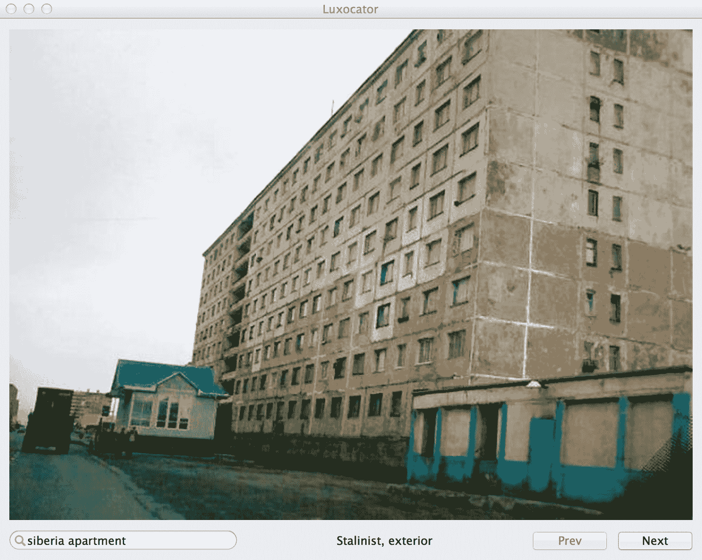
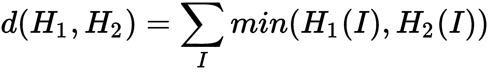
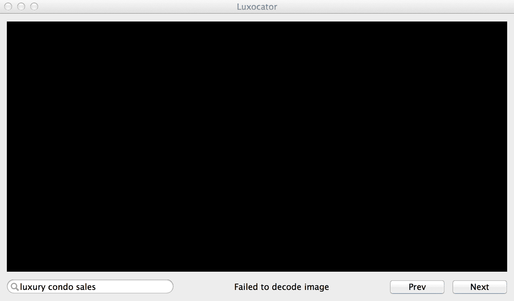
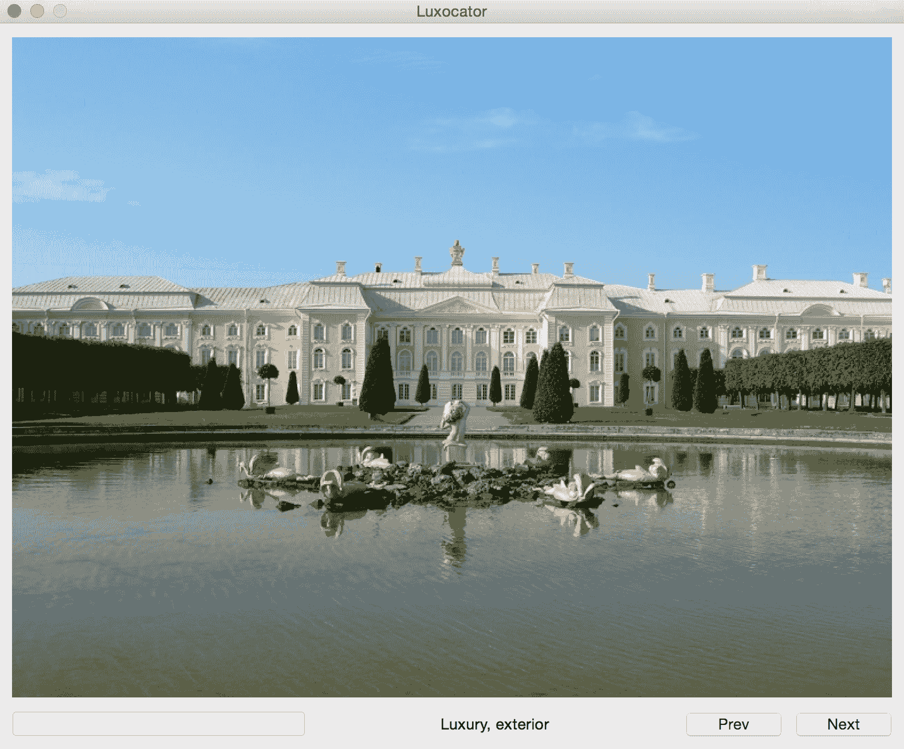

# 全球范围内搜索豪华住宿

今天是新娘套房，明天可能是监狱。一个秘密特工的睡眠安排是极其不可预测的。

每天都有人在 MI6 负责预订一个豪华酒店房间，反之，某个邪恶的帮凶必须选择一个仓库或破旧的公寓，再加上一盏灯、一把椅子和束缚工具。对于微型任务或简短的殴打，将地点选择权留给一个有缺陷的人类是可以容忍的。然而，对于长期租赁或收购，不是更明智地开发一个专门的搜索引擎，以消除其中的体力劳动和猜测工作吗？

带着这样的动机，我们将开发一个名为 `Luxocator: The Luxury Locator` 的桌面应用程序。它是一个搜索引擎，可以通过关键词搜索在网络上找到图像，并根据图像中的某些视觉线索将每张图像分类为豪华、室内场景；豪华、室外场景；斯大林主义、室内场景；或斯大林主义、室外场景。

尤其是我们的分类器依赖于比较不同图像或图像集中颜色的统计分布。这个主题被称为**颜色直方图分析**。我们将学习如何高效地存储和处理我们的统计模型，以及如何在应用程序捆绑包中重新分配它，包括我们的代码。具体来说，本章涵盖了以下编程主题：

+   使用 OpenCV 的 Python 绑定，结合 NumPy 和 SciPy 库，根据颜色直方图分析对图像进行分类

+   使用 Bing 图像搜索 API 从网络搜索中获取图像

+   使用 `wxPython` 构建 GUI 应用程序

+   使用 PyInstaller 将 Python 应用程序打包成可在其他系统上运行的可执行文件

# 技术要求

本章的项目有以下软件依赖：

+   **以下模块的 Python 环境**：OpenCV、NumPy、SciPy、Requests、wxPython，以及可选的 PyInstaller

设置说明包含在第一章，*准备任务*。请参考设置说明以了解任何版本要求。运行 Python 代码的基本说明包含在附录 C，*与 Python 一起运行（或，Python 的第一步)*。

本章的完成项目可以在本书的 GitHub 仓库中找到，[`github.com/PacktPublishing/OpenCV-4-for-Secret-Agents-Second-Edition`](https://github.com/PacktPublishing/OpenCV-4-for-Secret-Agents-Second-Edition)，在 `Chapter002` 文件夹中。

# 规划 Luxocator 应用

本章使用 Python。作为一种高级、解释型语言，具有强大的第三方库用于数值和科学计算，Python 让我们能够专注于系统的功能，而不是实现子系统细节。对于我们的第一个项目，这种高级视角正是我们所需要的。

让我们看看 Luxocator 的功能概述以及我们选择的支持此功能的 Python 库。像许多计算机视觉应用一样，Luxocator 有六个基本步骤：

1.  **获取一组静态的参考图像**：对于 Luxocator，我们（开发者）选择了一些我们认为属于豪华室内场景的图像，其他一些我们认为属于斯大林主义室内场景的图像，等等。我们将这些图像加载到内存中。

1.  **基于参考图像训练模型**：对于 Luxocator，我们的模型用图像的归一化颜色直方图来描述每个图像——即图像像素中颜色的分布。我们使用 OpenCV 和 NumPy 进行计算。

1.  **存储训练结果**：对于 Luxocator，我们使用 SciPy 压缩参考直方图并将它们写入/从磁盘读取。

1.  **获取一组动态的查询图像**：对于 Luxocator，我们通过 Python 包装器使用 Bing 搜索 API 获取查询图像。我们还使用 Requests 库下载全分辨率图像。

1.  **比较查询图像和参考图像**：对于 Luxocator，我们根据它们的直方图交集比较每个查询图像和每个参考图像。然后，我们根据这些比较的平均结果进行分类。我们使用 NumPy 进行计算。

1.  **展示比较结果**：对于 Luxocator，我们提供了一个 GUI 来启动搜索并导航结果。这个跨平台 GUI 是用`wxPython`开发的。每个图像下方都显示了一个分类标签，如斯大林主义，外部。请参见以下截图：



可选地，我们使用 PyInstaller 构建 Luxocator，以便它可以部署给没有 Python 或上述库的用户。然而，请记住，你可能需要在自己的环境中进行额外的故障排除，以便 PyInstaller 能够在某些环境中工作，包括树莓派或其他 ARM 设备。

# 创建、比较和存储直方图

“一种灰色绿色，常出现在公共机构的墙上——例如，医院，学校，政府大楼——以及，当被采用时，在各种各样的供应和设备上。”

– “机构绿色”，Segen 的医学词典（2012）

我犹豫着对墙上理想的颜料颜色做出概括性的陈述。这取决于。我在许多不同颜色的墙上找到了安慰。我的母亲是一位画家，我总体上喜欢颜料。

但并非所有颜色都是颜料。有些颜色是污垢。有些颜色是混凝土或大理石，胶合板或桃花心木。有些颜色是大窗户透过的天空，海洋，高尔夫球场，游泳池，或按摩浴缸。有些颜色是丢弃的塑料和啤酒瓶，炉灶上烤焦的食物，或腐烂的害虫。有些颜色是未知的。也许颜料掩盖了污垢。

一台典型的相机可以捕捉至少 16.7 百万 (*256 * 256 * 256*) 种不同的颜色。对于任何给定的图像，我们可以计算每种颜色的像素数量。这个计数的集合被称为图像的**颜色直方图**。通常，直方图中的大多数条目将为零，因为大多数场景不是多色的（多彩的）。

我们可以通过将颜色计数除以总像素数来归一化直方图。由于像素数被约简了，即使原始图像具有不同的分辨率，归一化直方图也是可以比较的。

给定一对归一化直方图，我们可以在零到一的比例尺度上测量直方图的相似度。相似度的一个度量称为直方图的**交集**。其计算方法如下：



这里是等效的 Python 代码（我们稍后会对其进行优化）：

```py
def intersection(hist0, hist1):
    assert len(hist0) == len(hist1),
            'Histogram lengths are mismatched'
    result = 0
    for i in range(len(hist0)):
        result += min(hist0[i], hist1[i])
    return result 
```

例如，假设在一个图像中，`50%` 的像素是黑色，`50%` 是白色。在另一个图像中，`100%` 的像素是黑色。相似度如下：

```py
min(50%, 100%) + min(50%, 0%) = 50% = 0.5
```

在这里，相似度为一并不意味着图像完全相同；这意味着它们的归一化直方图是相同的。相对于第一张图像，第二张图像可能大小不同，可能翻转，甚至可能以随机不同的顺序包含相同的像素值。

相反，相似度为零并不意味着图像对普通人来说看起来完全不同；它只是意味着它们没有共同的颜色值。例如，一张全黑的图像和另一张全炭灰的图像，根据我们的定义，它们的直方图相似度为零。

为了对图像进行分类，我们希望找到查询直方图与多个参考直方图集合之间的平均相似度。单个参考直方图（和单个参考图像）对于像**Luxury, indoor**这样的广泛分类来说过于具体。

尽管我们专注于比较直方图的一种方法，但还有许多替代方案。关于几个算法及其在 Python 中的实现，请参阅 Adrian Rosebrock 在 [`www.pyimagesearch.com/2014/07/14/3-ways-compare-histograms-using-opencv-python/`](http://www.pyimagesearch.com/2014/07/14/3-ways-compare-histograms-using-opencv-python/) 的这篇博客文章。

让我们编写一个名为 `HistogramClassifier` 的类，该类创建并存储参考直方图的集合，并找到查询直方图与每个参考直方图集合之间的平均相似度。为了支持此功能，我们将使用 OpenCV、NumPy 和 SciPy。创建一个名为 `HistogramClassifier.py` 的文件，并在顶部添加以下 shebang 行（Python 解释器的路径）和 `import` 语句：

```py
#!/usr/bin/env python

import numpy # Hint to PyInstaller
import cv2
import scipy.io
import scipy.sparse
```

一些版本的 PyInstaller 如果我们在导入 `cv2` 模块之前显式导入 `numpy` 模块，则工作得更好。请记住，OpenCV 的 Python 绑定依赖于 NumPy。此外，请注意，OpenCV 的 Python 模块称为 `cv2`，即使我们使用的是 OpenCV 4。`cv2` 这个名称来源于 OpenCV 中具有底层 C++ 实现的部分（称为 `cv2`）和具有较老、底层 C 实现的部分（称为 `cv`）之间的历史区别。截至 OpenCV 4，所有内容都是 `cv2`。

`HistogramClassifier` 的一个实例存储了几个变量。一个名为 `verbose` 的公共布尔值控制日志级别。一个名为 `minimumSimilarityForPositiveLabel` 的公共浮点值定义了一个相似度阈值——如果所有平均相似度都低于此值，则查询图像被赋予 `'Unknown'` 分类。几个变量存储与颜色模型相关的值。我们假设我们的图像有三个颜色通道，每个通道有 8 位（256 个可能值）。最后，也是最重要的，一个名为 `_references` 的字典将字符串键（如 `'Luxury, interior'`）映射到参考直方图的列表。让我们在 `HistogramClassifier` 类的 `__init__` 方法中声明这些变量，如下所示：

```py
class HistogramClassifier(object):

    def __init__(self):

        self.verbose = False
        self.minimumSimilarityForPositiveLabel = 0.075

        self._channels = range(3)
        self._histSize = [256] * 3
        self._ranges = [0, 255] * 3
        self._references = {}
```

按照惯例，在 Python 类中，如果一个变量或方法是为了保护（仅在类及其子类中访问）而设计的，那么它的名称前会加上一个下划线。然而，这种保护级别实际上并没有得到强制执行。本书中的大多数成员变量和方法都被标记为受保护的，但也有一些是公开的。Python 支持私有变量和方法（由双下划线前缀表示），这些变量和方法意味着不可访问，即使是子类也无法访问。然而，我们在这本书中避免使用私有变量和方法，因为 Python 类通常应该是高度可扩展的。

`HistogramClassifier` 类有一个名为 `_createNormalizedHist` 的方法，它接受两个参数——一个图像和一个布尔值，表示是否将生成的直方图存储在 **稀疏**（压缩）格式中。直方图是通过 OpenCV 函数 `cv2.calcHist` 计算的。它接受图像、通道数、直方图大小（即颜色模型的维度）以及每个颜色通道的范围作为参数。我们将生成的直方图展平成一种一维格式，这种格式使用内存更有效率。然后，可选地，我们使用名为 `scipy.sparse.csc_matrix` 的 SciPy 函数将直方图转换为稀疏格式。

稀疏矩阵使用一种依赖于默认值（通常是 `0`）的压缩形式。也就是说，我们不必分别存储所有的零；相反，我们记录充满零的范围。对于直方图来说，这是一个重要的优化，因为在典型的图像中，大多数可能的颜色都不存在。因此，大多数直方图值都是 `0`。

与未压缩格式相比，稀疏格式提供了更好的内存效率，但计算效率较差。这种权衡在一般情况下也适用于压缩格式。

下面是`_createNormalizedHist`的实现：

```py
    def _createNormalizedHist(self, image, sparse):
        # Create the histogram.
        hist = cv2.calcHist([image], self._channels, None,
                            self._histSize, self._ranges)
        # Normalize the histogram.
        hist[:] = hist * (1.0 / numpy.sum(hist))
        # Convert the histogram to one column for efficient storage.
        hist = hist.reshape(16777216, 1)  # 16777216 == pow(2, 24)
        if sparse:
            # Convert the histogram to a sparse matrix.
            hist = scipy.sparse.csc_matrix(hist)
        return hist
```

一个公共方法`addReference`接受两个参数——一个图像和一个标签（标签是一个描述分类的字符串）。我们将图像传递给`_createNormalizedHist`以创建一个稀疏格式的归一化直方图。对于参考直方图，稀疏格式更合适，因为我们希望在分类会话的整个过程中在内存中保留许多参考直方图。创建直方图后，我们使用标签作为键将其添加到`_references`列表中。以下是`addReference`的实现：

```py
    def addReference(self, image, label):
        hist = self._createNormalizedHist(image, True)
        if label not in self._references:
            self._references[label] = [hist]
        else:
            self._references[label] += [hist]
```

对于 Luxocator 来说，参考图像来自磁盘上的文件。让我们给`HistogramClassifier`提供一个公共方法，`addReferenceFromFile`，它接受一个文件路径而不是直接接受一个图像。它还接受一个标签。我们使用一个名为`cv2.imread`的 OpenCV 方法从文件中加载图像，该方法接受一个路径和一个颜色格式。根据我们之前关于有三个颜色通道的假设，我们总是希望以彩色而不是灰度格式加载图像。这个选项由`cv2.IMREAD_COLOR`值表示。加载图像后，我们将它及其标签传递给`addReference`。`addReferenceFromFile`的实现如下：

```py
    def addReferenceFromFile(self, path, label):
        image = cv2.imread(path, cv2.IMREAD_COLOR)
        self.addReference(image, label)
```

现在，我们来到了问题的关键——`classify`公共方法，它接受一个查询图像，以及一个可选的字符串来在日志输出中标识图像。对于每一组参考直方图，我们计算其与查询直方图的平均相似度。如果所有相似度值都低于`minimumSimilarityForPositiveLabel`，我们返回`'Unknown'`标签。否则，我们返回最相似的一组参考直方图的标签。如果`verbose`为`True`，我们还会记录所有标签及其相应的平均相似度。以下是该方法实现：

```py
    def classify(self, queryImage, queryImageName=None):
        queryHist = self._createNormalizedHist(queryImage, False)
        bestLabel = 'Unknown'
        bestSimilarity = self.minimumSimilarityForPositiveLabel
        if self.verbose:
            print('================================================')
            if queryImageName is not None:
                print('Query image:')
                print(' %s' % queryImageName)
            print('Mean similarity to reference images by label:')
        for label, referenceHists in self._references.items():
            similarity = 0.0
            for referenceHist in referenceHists:
                similarity += cv2.compareHist(
                        referenceHist.todense(), queryHist,
                        cv2.HISTCMP_INTERSECT)
            similarity /= len(referenceHists)
            if self.verbose:
                print(' %8f %s' % (similarity, label))
            if similarity > bestSimilarity:
                bestLabel = label
                bestSimilarity = similarity
        if self.verbose:
            print('================================================')
        return bestLabel
```

注意到使用了`todense`方法来解压缩稀疏矩阵。

我们还提供了一个公共方法，`classifyFromFile`，它接受一个文件路径而不是直接接受一个图像。以下是实现方式：

```py
    def classifyFromFile(self, path, queryImageName=None):
        if queryImageName is None:
            queryImageName = path
        queryImage = cv2.imread(path, cv2.IMREAD_COLOR)
        return self.classify(queryImage, queryImageName)
```

计算所有我们的参考直方图将花费一些时间。我们不希望在每次运行 Luxocator 时都重新计算它们。因此，我们需要将直方图序列化和反序列化（保存和加载）到磁盘上。为此，SciPy 提供了两个函数，`scipy.io.savemat`和`scipy.io.loadmat`。它们接受一个文件和多个可选参数。

我们可以实现一个具有可选压缩的`serialize`方法，如下所示：

```py
    def serialize(self, path, compressed=False):
        file = open(path, 'wb')
        scipy.io.savemat(
            file, self._references, do_compression=compressed)
```

在反序列化时，我们从`scipy.io.loadmat`获取一个字典。然而，这个字典包含的不仅仅是我们的原始`_references`字典。它还包含一些序列化元数据和一些序列化元数据，以及一些额外的数组，这些数组包装了原本在`_references`中的列表。我们移除了这些不需要的附加内容，并将结果存储回`_references`。实现如下：

```py
    def deserialize(self, path):
        file = open(path, 'rb')
        self._references = scipy.io.loadmat(file)
        for key in list(self._references.keys()):
            value = self._references[key]
            if not isinstance(value, numpy.ndarray):
                # This entry is serialization metadata so delete it.
                del self._references[key]
                continue
            # The serializer wraps the data in an extra array.
            # Unwrap the data.
            self._references[key] = value[0]
```

那就是我们的分类器。接下来，我们将通过提供一些参考图像和一个查询图像来测试我们的分类器。

# 使用参考图像训练分类器

"你能识别这条海岸线吗？给定时间，可以。"

– 照片标题，达恩特·斯特拉 ([`www.dantestella.com/technical/hex352.html`](http://www.dantestella.com/technical/hex352.html))

本书 GitHub 仓库中包含了一小部分参考图像，位于名为`Chapter002/images`的文件夹中。您可以自由地通过添加更多参考图像来实验分类器，因为更大的数据集可能会产生更可靠的结果。请记住，我们的分类器依赖于平均相似度，所以您在参考图像中包含特定配色方案次数越多，您就越倾向于在分类器中为该配色方案增加权重。

在`HistogramClassifier.py`的末尾，让我们添加一个`main`方法来使用我们的参考图像训练和序列化一个分类器。我们还将运行分类器对几幅图像进行测试。以下是部分实现：

```py
def main():
    classifier = HistogramClassifier()
    classifier.verbose = True

    # 'Stalinist, interior' reference images
    classifier.addReferenceFromFile(
            'images/communal_apartments_01.jpg',
            'Stalinist, interior')
    # ...
    # Other reference images are omitted for brevity.
    # See the GitHub repository for the full implementation.
    # ...

    classifier.serialize('classifier.mat')
    classifier.deserialize('classifier.mat')
    classifier.classifyFromFile('images/dubai_damac_heights.jpg')
    classifier.classifyFromFile('images/communal_apartments_01.jpg')

if __name__ == '__main__':
    main()
```

根据参考图像的数量，此方法可能需要几分钟（甚至更长）才能运行。幸运的是，由于我们正在序列化训练好的分类器，我们不必每次打开主应用程序时都运行此方法。相反，我们将简单地从文件中反序列化训练好的分类器，正如我们将在本章的*将一切整合到 GUI 中*部分中看到的。

对于大量的训练图像，您可能希望修改`HistogramClassifier.py`中的`main`函数，以便使用指定文件夹中的所有图像。（有关遍历文件夹中所有图像的示例，请参阅第三章*，训练智能闹钟识别恶棍和他的猫*。）然而，对于少量训练图像，我发现通过在代码中指定图像列表更方便，这样我们可以注释和取消注释单个图像以查看对训练的影响。

接下来，让我们考虑我们的主应用程序如何获取查询图像。

# 从网络获取图像

我们查询的图片将来自网络搜索。在我们开始实现搜索功能之前，让我们编写一些辅助函数，以便我们通过`Requests`库获取图片并将它们转换为 OpenCV 兼容的格式。由于这个功能高度可重用，我们将把它放在一个静态实用函数模块中。让我们创建一个名为`RequestsUtils.py`的文件，并按照以下方式导入 OpenCV、NumPy 和 Requests：

```py
#!/usr/bin/env python

import numpy # Hint to PyInstaller
import cv2
import requests
import sys
```

作为全局变量，让我们存储`HEADERS`，这是我们将在发送网络请求时使用的头信息字典。一些服务器拒绝看起来来自机器人的请求。为了提高我们的请求被接受的机会，让我们将`'User-Agent'`头设置为模拟网络浏览器的值，如下所示：

```py
# Spoof a browser's User-Agent string.
# Otherwise, some sites will reject us as a bot.
HEADERS = {
    'User-Agent': 'Mozilla/5.0 ' \
                  '(Macintosh; Intel Mac OS X 10.9; rv:25.0) ' \
                  'Gecko/20100101 Firefox/25.0'
}
```

每当我们收到网络请求的响应时，我们希望检查状态码是否为`200` OK。这只是一个粗略的测试，以确定响应是否有效，但对于我们的目的来说已经足够好了。我们在以下方法中实现这个测试，`validateResponse`，如果响应被认为是有效的，则返回`True`；否则，记录错误消息并返回`False`：

```py
def validateResponse(response):
    statusCode = response.status_code
    if statusCode == 200:
        return True
    url = response.request.url
    sys.stderr.write(
            'Received unexpected status code (%d) when requesting %s\n' % \
            (statusCode, url))
    return False
```

在`HEADERS`和`validateResponse`的帮助下，我们可以尝试从一个 URL 获取图片，并以 OpenCV 兼容的格式返回该图片（如果失败，则返回`None`）。作为一个中间步骤，我们使用名为`numpy.fromstring`的函数从网络响应中读取原始数据到一个 NumPy 数组。然后我们使用名为`cv2.imdecode`的函数将此数据解释为图片。以下是我们的实现，一个名为`cvImageFromUrl`的函数，它接受一个 URL 作为参数：

```py
def cvImageFromUrl(url):
    response = requests.get(url, headers=HEADERS)
    if not validateResponse(response):
        return None
    imageData = numpy.fromstring(response.content, numpy.uint8)
    image = cv2.imdecode(imageData, cv2.IMREAD_COLOR)
    if image is None:
        sys.stderr.write(
                'Failed to decode image from content of %s\n' % url)
    return image
```

为了测试这两个函数，让我们给`RequestsUtils.py`一个`main`函数，该函数从网络上下载图片，将其转换为 OpenCV 兼容的格式，并使用 OpenCV 的`imwrite`函数将其写入磁盘。以下是我们的实现：

```py
def main():
    image = cvImageFromUrl('http://nummist.com/images/ceiling.gaze.jpg')
    if image is not None:
        cv2.imwrite('image.png', image)

if __name__ == '__main__':
    main()
```

为了确认一切正常，打开`image.png`（它应该在`RequestsUtils.py`相同的目录中），并与您可以在网络浏览器中查看的在线图片进行比较[`nummist.com/images/ceiling.gaze.jpg`](http://nummist.com/images/ceiling.gaze.jpg)。

虽然我们将对`RequestUtils`模块的简单测试放在一个`main`函数中，但在 Python 中编写测试的更复杂和可维护的方法是使用标准库中的`unittest`模块中的类。有关更多信息，请参阅官方教程[`docs.python.org/3/library/unittest.html`](https://docs.python.org/3/library/unittest.html)。

# 从 Bing 图片搜索获取图片

微软的搜索引擎 Bing 有一个 API，它允许我们在自己的应用程序中发送查询并接收结果。对于每月有限数量的查询，Bing 搜索 API 是免费的（目前，每月限制为三千个查询，每秒三个查询）。然而，我们必须通过以下步骤注册：

1.  前往 [`azure.microsoft.com/`](https://azure.microsoft.com/) 并登录。如果您还没有，您需要创建一个 Microsoft 账户。

1.  前往 [`azure.microsoft.com/en-us/services/cognitive-services/bing-image-search-api/`](https://azure.microsoft.com/en-us/services/cognitive-services/bing-image-search-api/)。点击“尝试 Bing 图像搜索”按钮。

1.  在“访客”选项旁边，点击“开始使用”按钮以开始免费的七天试用期。开始试用后，前往 [`azure.microsoft.com/en-us/try/cognitive-services/`](https://azure.microsoft.com/en-us/try/cognitive-services/)。选择“搜索 API”选项卡。在“Bing 图像搜索 API v7”部分下，找到 32 字符的 API 密钥（您可能会找到两个标记为“Key 1”和“Key 2”的密钥。这两个都行）。复制密钥并将其保存在安全的地方。我们稍后需要使用它来将我们的 Bing 会话与我们的 Microsoft 账户关联。

1.  作为第三步的替代方案，或者试用七天后，您可以创建一个免费账户。在“免费 Azure 账户”选项旁边，点击“注册”按钮以注册一个每月使用量有限的免费账户（当然，如果您决定对 Luxocator 迷恋到排除正常活动的程度，您以后总是可以升级到付费账户）。尽管账户是免费的，但注册过程需要您提供一个电话号码和一张信用卡以验证您的身份。完成注册过程后，点击“门户”选项卡以进入 Microsoft Azure 控制面板。点击认知服务，然后添加，然后点击 Bing 搜索 v7，然后创建。按照以下截图中的示例填写“创建”对话框。点击对话框的创建按钮。点击“转到资源”按钮。点击“密钥”。找到 32 字符的 API 密钥（您可能会看到两个标记为“Key 1”和“Key 2”的密钥。这两个都行）。复制密钥并将其保存在安全的地方：


1.  创建一个名为 `BING_SEARCH_KEY` 的环境变量。将其值设置为我们在第三步或第四步中创建的 API 密钥（稍后，在我们的代码中，我们将访问这个环境变量的值，以便将我们的 Bing 搜索会话与我们的 API 密钥关联）。根据您的操作系统，创建环境变量的方法有很多种。在 Windows 上，您可能想使用控制面板添加用户环境变量。在类 Unix 系统上，您可能想通过编辑用户的登录脚本（在 Mac、Ubuntu 和许多其他系统上称为 `~/.profile`）来添加环境变量的定义。创建环境变量后，重新启动（或注销并重新登录）。

Bing 搜索 API 以及其他几个 Microsoft API 都有一个名为 `py-ms-cognitive` 的第三方 Python 封装器。我们可以使用 Python 的包管理器 `pip` 来安装它。打开终端（在类 Unix 系统上）或命令提示符（在 Windows 上），然后运行以下命令：

```py
$ pip install --user py-ms-cognitive
```

在`py-ms-cognitive`的基础上，我们希望有一个高级接口来提交查询字符串并导航通过图像结果列表，这些图像应与 OpenCV 兼容。我们将创建一个名为`ImageSearchSession`的类，它提供这样的接口。首先，让我们创建一个文件`ImageSearchSession.py`，并在顶部添加以下`import`语句：

```py
#!/usr/bin/env python

from py_ms_cognitive import PyMsCognitiveImageSearch
PyMsCognitiveImageSearch.SEARCH_IMAGE_BASE = \
        'https://api.cognitive.microsoft.com/bing/v7.0/images/search'

import numpy # Hint to PyInstaller
import cv2
import os
import pprint
import sys

import RequestsUtils
```

注意，我们正在修改`py_ms_cognitive`Python 包装器的静态变量`PyMsCognitiveImageSearch.SEARCH_IMAGE_BASE`。我们这样做是因为，默认情况下，`py_ms_cognitive`使用过时的基础 URL 作为 Bing 搜索 API 端点的 URL。

对于`py_ms_cognitive`，我们使用 OpenCV、pretty-print（用于从搜索中记录 JSON 结果）、系统库以及我们的网络实用函数。

与`HistogramClassifier`类似，`ImageSearchSession`有一个名为`verbose`的公共布尔值，用于控制日志级别。此外，`ImageSearchSession`有成员变量来存储当前查询、当前图像结果的元数据以及帮助我们导航到上一个和下一个结果的元数据。我们可以这样初始化这些变量：

```py
class ImageSearchSession(object):

    def __init__(self):
        self.verbose = False

        self._query = ''
        self._results = []
        self._offset = 0
        self._numResultsRequested = 0
        self._numResultsReceived = 0
        self._numResultsAvailable = 0
```

我们为许多成员变量提供了 getter，如下所示：

```py
    @property
    def query(self):
        return self._query

    @property
    def offset(self):
        return self._offset

    @property
    def numResultsRequested(self):
        return self._numResultsRequested

    @property
    def numResultsReceived(self):
        return self._numResultsReceived

    @property
    def numResultsAvailable(self):
        return self._numResultsAvailable
```

给定这些变量，我们可以通过一次只获取少量结果来导航大量结果集；也就是说，通过一个窗口查看结果。根据需要，我们可以通过简单地调整偏移量（基于请求的结果数量）并将偏移量限制在有效范围内来移动我们的窗口到更早或更晚的结果。以下是一些`searchPrev`和`searchNext`方法的实现，这些方法依赖于我们稍后将要实现的更通用的搜索方法：

```py
    def searchPrev(self):
        if self._offset == 0:
            return
        offset = max(0, self._offset - self._numResultsRequested)
        self.search(self._query, self._numResultsRequested, offset)

    def searchNext(self):
        if self._offset + self._numResultsRequested >= \
                self._numResultsAvailable:
            return
        offset = self._offset + self._numResultsRequested
        self.search(self._query, self._numResultsRequested, offset)
```

更通用的`search`方法接受一个查询字符串、最大结果数和相对于第一个可用结果的偏移量。我们将这些参数存储在成员变量中，以便在`searchPrev`和`searchNext`方法中重复使用。搜索方法还使用我们之前定义的`BING_SEARCH_KEY`环境变量。以下是该方法实现的第一部分：

```py
    def search(self, query, numResultsRequested=50, offset=0):
        if 'BING_SEARCH_KEY' in os.environ:
            bingKey = os.environ['BING_SEARCH_KEY']
        else:
            sys.stderr.write(
                    'Environment variable BING_SEARCH_KEY is undefined. '
                    'Please define it, equal to your Bing Search API '
                    'key.\n')
            return

        self._query = query
        self._numResultsRequested = numResultsRequested
        self._offset = offset
```

然后，我们设置搜索参数，指定结果应以`JSON`格式提供，并且仅包括彩色照片：

```py
        params = {'color':'ColorOnly', 'imageType':'Photo'}
```

我们设置搜索并请求以`JSON`格式提供的结果。我们通过打印错误消息、将搜索结果数设置为`0`并提前返回来处理任何异常：

```py
        searchService = PyMsCognitiveImageSearch(
                bingKey, query, custom_params=params)
        searchService.current_offset = offset

        try:
            self._results = searchService.search(numResultsRequested,
                                                 'json')
        except Exception as e:
            sys.stderr.write(
                    'Error when requesting Bing image search for '
                    '"%s":\n' % query)
            sys.stderr.write('%s\n' % str(e))
            self._offset = 0
            self._numResultsReceived = 0
            return
```

如果请求成功，我们继续解析`JSON`。我们存储关于实际接收到的结果数和可用结果数的元数据：

```py
        json = searchService.most_recent_json
        self._numResultsReceived = len(self._results)
        if self._numResultsRequested < self._numResultsReceived:
            # py_ms_cognitive modified the request to get more results.
            self._numResultsRequested = self._numResultsReceived
        self._numResultsAvailable = int(json[u'totalEstimatedMatches'])
```

如果`verbose`公共变量为`True`，我们打印 JSON 结果。以下是方法实现的结尾部分：

```py
        if self.verbose:
            print('Received results of Bing image search for ' 
                  '"%s":' % query)
            pprint.pprint(json)
```

虽然 `search` 方法获取了包括图像 URL 在内的结果文本描述，但它实际上并没有获取任何全尺寸图像。这是好的，因为全尺寸图像可能很大，我们不需要一次性获取所有这些。相反，我们提供了一个名为 `getCvImageAndUrl` 的另一个方法，用于检索当前结果中具有指定索引的图像和图像 URL。索引作为参数给出。作为可选的第二个参数，此方法接受一个布尔值，指示是否应使用缩略图而不是全尺寸图像。我们使用 `cvImageFromUrl` 来获取并转换缩略图或全尺寸图像。以下是我们的实现：

```py
    def getCvImageAndUrl(self, index, useThumbnail = False):
        if index >= self._numResultsReceived:
            return None, None
        result = self._results[index]
        if useThumbnail:
            url = result.thumbnail_url
        else:
            url = result.content_url
        return RequestsUtils.cvImageFromUrl(url), url
```

`getCvImageAndUrl` 的调用者负责优雅地处理下载缓慢或失败的情况。回想一下，我们的 `cvImageFromUrl` 函数在下载失败时仅记录错误并返回 `None`。

为了测试 `ImageSearchSession`，让我们编写一个主函数，实例化该类，将 `verbose` 设置为 `True`，搜索 `'luxury condo sales'`，并将第一个结果图像写入磁盘。以下是实现：

```py
def main():
    session = ImageSearchSession()
    session.verbose = True
    session.search('luxury condo sales')
    image, url = session.getCvImageAndUrl(0)
    cv2.imwrite('image.png', image)

if __name__ == '__main__':
    main()
```

现在我们已经有一个分类器和搜索会话，我们几乎准备好进入 Luxocator 的前端了。我们只需要几个额外的实用函数来帮助我们准备打包和显示的数据和图像。

# 准备应用程序的图像和资源

除了 `RequestsUtils.py` 和 `ImageSearchSession.py`，让我们再创建一个名为 `ResizeUtils.py` 的文件，并包含以下 `import` 语句：

```py
import numpy # Hint to PyInstaller
import cv2
```

对于在 GUI 中的显示，图像通常需要调整大小。一种流行的调整大小模式称为 **aspect fill**。在这里，我们希望在改变图像的较大维度（对于风景图像是宽度，对于肖像图像是高度）到一定值的同时，保留图像的宽高比。OpenCV 并没有直接提供这种调整大小模式，但它提供了一个函数 `cv2.resize`，该函数接受一个图像、目标尺寸和可选参数，包括插值方法。我们可以编写自己的函数 `cvResizeAspectFill`，该函数接受一个图像、最大尺寸以及用于放大和缩小时的首选插值方法。它确定 `cv2.resize` 的适当参数并将它们传递下去。以下是实现：

```py
def cvResizeAspectFill(src, maxSize,
                       upInterpolation=cv2.INTER_LANCZOS4,
                       downInterpolation=cv2.INTER_AREA):
    h, w = src.shape[:2]
    if w > h:
        if w > maxSize:
            interpolation=downInterpolation
        else:
            interpolation=upInterpolation
        h = int(maxSize * h / float(w))
        w = maxSize
    else:
        if h > maxSize:
            interpolation=downInterpolation
        else:
            interpolation=upInterpolation
        w = int(maxSize * w / float(h))
        h = maxSize
    dst = cv2.resize(src, (w, h), interpolation=interpolation)
    return dst
```

关于 OpenCV 支持的插值方法的描述，请参阅官方文档[`docs.opencv.org/master/da/d54/group__imgproc__transform.html#ga47a974309e9102f5f08231edc7e7529d`](https://docs.opencv.org/master/da/d54/group__imgproc__transform.html#ga47a974309e9102f5f08231edc7e7529d)。对于放大，我们默认使用 `cv2.INTER_LANCZOS4`，它产生清晰的结果。对于缩小，我们默认使用 `cv2.INTER_AREA`，它产生无摩尔纹的结果（摩尔纹是一种在特定放大倍数下使平行线或同心曲线看起来像交叉线纹的伪影）。

现在，让我们创建另一个名为 `WxUtils.py` 的文件，并包含以下 `import` 语句：

```py
import numpy # Hint to PyInstaller
import cv2
import wx
```

由于 `wxPython 3` 和 `wxPython 4` 之间的 API 变化，对于我们来说检查已导入的版本非常重要。我们使用以下代码来获取版本字符串，例如 `'4.0.3'`，以及解析主版本号，例如 `4`：

```py
WX_MAJOR_VERSION = int(wx.__version__.split('.')[0])
```

OpenCV 和 wxPython 使用不同的图像格式，因此我们将实现一个转换函数 `wxBitmapFromCvImage`。虽然 OpenCV 以 BGR 顺序存储颜色通道，但 wxPython 预期 RGB 顺序。我们可以使用 OpenCV 函数 `cv2.cvtColor` 重新格式化图像数据。然后，我们可以使用 wxPython 函数 `wx.BitmapFromBuffer` 将重新格式化的数据读取到 wxPython 位图中，并将其返回。以下是实现代码：

```py
def wxBitmapFromCvImage(image):
    image = cv2.cvtColor(image, cv2.COLOR_BGR2RGB)
    h, w = image.shape[:2]
    # The following conversion fails on Raspberry Pi.
    if WX_MAJOR_VERSION < 4:
        bitmap = wx.BitmapFromBuffer(w, h, image)
    else:
        bitmap = wx.Bitmap.FromBuffer(w, h, image)
    return bitmap
```

在某些版本的 Raspberry Pi 和 Raspbian 上，`wx.BitmapFromBuffer` 会受到一个特定平台的错误影响，导致它失败。作为解决方案，请参阅本书末尾的附录 A，即附录 A，*使 WxUtils.py 与 Raspberry Pi 兼容*。

我们还需要创建一个实用模块。让我们创建一个名为 `PyInstallerUtils.py` 的文件，其中包含 Python 标准库中的 `os` 和 `sys` 模块的 `import` 语句：

```py
import os
import sys
```

当我们使用 PyInstaller 打包我们的应用程序时，资源路径将会改变。因此，我们需要一个函数来正确解析路径，无论我们的应用程序是否已经被打包。让我们添加一个名为 `pyInstallerResourcePath` 的函数，它解析相对于应用程序目录（`'_MEIPASS'` 属性）的给定路径，或者如果失败，则解析当前工作目录（`'.'`）。它的实现如下：

```py
def resourcePath(relativePath):
    basePath = getattr(sys, '_MEIPASS', os.path.abspath('.'))
    return os.path.join(basePath, relativePath)
```

我们的工具模块现在已经完成，我们可以继续实现 Luxocator 的前端。

# 将一切集成到 GUI 中

对于 Luxocator 的前端，让我们创建一个名为 `Luxocator.py` 的文件。此模块依赖于 OpenCV、wxPython 以及 Python 标准库中的某些 OS 和 threading 功能。它还依赖于本章中我们编写的所有其他模块。在文件顶部添加以下 shebang 行和 `import` 语句：

```py
#!/usr/bin/env python

import numpy # Hint to PyInstaller
import cv2
import os
import threading
import wx

from HistogramClassifier import HistogramClassifier
from ImageSearchSession import ImageSearchSession
import PyInstallerUtils
import ResizeUtils
import WxUtils
```

现在，让我们实现`Luxocator`类作为`wx.Frame`的子类，它代表一个 GUI 框架，例如窗口的内容。我们的大部分 GUI 代码都在`Luxocator`类的`__init__`方法中，因此这是一个大方法，但并不复杂。我们的 GUI 元素包括一个搜索控件、上一页和下一页按钮、一个位图以及一个标签来显示分类结果。所有这些 GUI 元素都存储在成员变量中。位图被限制在一定的最大尺寸（默认为较大维度上的 768 像素），其他元素布局在其下方。几个方法被注册为回调以处理诸如窗口关闭、按下*Esc*键、输入搜索字符串或点击下一页或上一页按钮等事件。除了 GUI 元素外，其他成员变量还包括我们的`HistogramClassifier`和`ImageSearchSession`类的实例。以下是初始化器的实现，其中穿插了一些关于我们使用的 GUI 元素的说明：

```py
class Luxocator(wx.Frame):

    def __init__(self, classifierPath, maxImageSize=768,
                 verboseSearchSession=False,
                 verboseClassifier=False):

        style = wx.CLOSE_BOX | wx.MINIMIZE_BOX | wx.CAPTION | \
            wx.SYSTEM_MENU | wx.CLIP_CHILDREN
        wx.Frame.__init__(self, None, title='Luxocator', style=style)
        self.SetBackgroundColour(wx.Colour(232, 232, 232))

        self._maxImageSize = maxImageSize
        border = 12
        defaultQuery = 'luxury condo sales'

        self._index = 0
        self._session = ImageSearchSession()
        self._session.verbose = verboseSearchSession
        self._session.search(defaultQuery)

        self._classifier = HistogramClassifier()
        self._classifier.verbose = verboseClassifier
        self._classifier.deserialize(classifierPath)

        self.Bind(wx.EVT_CLOSE, self._onCloseWindow)

        quitCommandID = wx.NewId()
        self.Bind(wx.EVT_MENU, self._onQuitCommand,
                  id=quitCommandID)
        acceleratorTable = wx.AcceleratorTable([
            (wx.ACCEL_NORMAL, wx.WXK_ESCAPE, quitCommandID)
        ])
        self.SetAcceleratorTable(acceleratorTable)
```

关于在 wxPython 中使用位图、控件和布局的更多信息，请参考官方维基百科[`wiki.wxpython.org/`](http://wiki.wxpython.org/)。

搜索控件（接下来会提到）值得特别注意，因为它内部包含多个控件，并且它在不同操作系统中的行为略有不同。它可能最多有三个子控件——一个文本字段、一个搜索按钮和一个取消按钮。当文本字段处于活动状态时，可能有一个回调用于按下*Enter*键。如果存在搜索和取消按钮，它们有被点击的回调。我们可以按照以下方式设置搜索控件及其回调：

```py
        self._searchCtrl = wx.SearchCtrl(
                self, size=(self._maxImageSize / 3, -1),
                style=wx.TE_PROCESS_ENTER)
        self._searchCtrl.SetValue(defaultQuery)
        self._searchCtrl.Bind(wx.EVT_TEXT_ENTER,
                              self._onSearchEntered)
        self._searchCtrl.Bind(wx.EVT_SEARCHCTRL_SEARCH_BTN,
                              self._onSearchEntered)
        self._searchCtrl.Bind(wx.EVT_SEARCHCTRL_CANCEL_BTN,
                              self._onSearchCanceled)
```

与之相反，标签、上一页和下一页按钮以及位图没有我们关心的任何子控件。我们可以按照以下方式设置它们：

```py
        self._labelStaticText = wx.StaticText(self)

        self._prevButton = wx.Button(self, label='Prev')
        self._prevButton.Bind(wx.EVT_BUTTON,
                              self._onPrevButtonClicked)

        self._nextButton = wx.Button(self, label='Next')
        self._nextButton.Bind(wx.EVT_BUTTON,
                              self._onNextButtonClicked)

        self._staticBitmap = wx.StaticBitmap(self)
```

我们的控制项水平排列，搜索控件位于窗口的左侧边缘，上一页和下一页按钮位于右侧边缘，标签位于搜索控件和上一页按钮之间的一半位置。我们使用`wx.BoxSizer`的一个实例来定义这个水平布局：

```py
        controlsSizer = wx.BoxSizer(wx.HORIZONTAL)
        controlsSizer.Add(self._searchCtrl, 0,
                          wx.ALIGN_CENTER_VERTICAL | wx.RIGHT,
                          border)
        controlsSizer.Add((0, 0), 1) # Spacer
        controlsSizer.Add(
                self._labelStaticText, 0, wx.ALIGN_CENTER_VERTICAL)
        controlsSizer.Add((0, 0), 1) # Spacer
        controlsSizer.Add(
                self._prevButton, 0,
                wx.ALIGN_CENTER_VERTICAL | wx.LEFT | wx.RIGHT,
                border)
        controlsSizer.Add(
                self._nextButton, 0, wx.ALIGN_CENTER_VERTICAL)
```

布局（以及俄罗斯套娃）的最好之处在于它们可以嵌套，一个套在另一个里面。我们的控件水平布局需要出现在位图下方。这种关系是一个垂直布局，我们使用另一个`wx.BoxSizer`实例来定义：

```py
        self._rootSizer = wx.BoxSizer(wx.VERTICAL)
        self._rootSizer.Add(self._staticBitmap, 0,
                            wx.TOP | wx.LEFT | wx.RIGHT, border)
        self._rootSizer.Add(controlsSizer, 0, wx.EXPAND | wx.ALL,
                            border)

        self.SetSizerAndFit(self._rootSizer)

        self._updateImageAndControls()
```

这就是`__init__`方法的结束。

如以下代码所示，我们为我们的`ImageSearchSession`实例和`HistogramClassifier`实例的`verbose`属性提供了获取器和设置器：

```py
    @property
    def verboseSearchSession(self):
        return self._session.verbose

    @verboseSearchSession.setter
    def verboseSearchSession(self, value):
        self._session.verbose = value

    @property
    def verboseClassifier(self):
        return self._classifier.verbose

    @verboseClassifier.setter
    def verboseClassifier(self, value):
        self._classifier.verbose = value
```

我们的自定义`_onCloseWindow`回调只是通过调用超类的`Destroy`方法来清理应用程序。以下是它的实现：

```py
    def _onCloseWindow(self, event):
        self.Destroy()
```

同样，我们将*Esc*键连接到了`_onQuitCommand`回调，这会关闭窗口。这反过来会导致`_onCloseWindow`被调用。以下是`_onQuitCommand`的实现：

```py
    def _onQuitCommand(self, event):
        self.Close()
```

我们的 `_onSearchEntered` 回调通过 `ImageSearchSession` 的搜索方法提交查询字符串。然后，它调用一个辅助方法 `_updateImageAndControls`，该方法异步获取图像并更新 GUI，正如我们稍后将会看到的。以下是 `_onSearchEntered` 的实现：

```py
    def _onSearchEntered(self, event):
        query = event.GetString()
        if len(query) < 1:
            return
        self._session.search(query)
        self._index = 0
        self._updateImageAndControls()
```

我们的 `_onSearchCanceled` 回调简单地清除了搜索控制器的文本字段，如下面的代码所示：

```py
    def _onSearchCanceled(self, event):
        self._searchCtrl.Clear()
```

我们剩余的 GUI 事件回调 `_onNextButtonClicked` 和 `_onPrevButtonClicked` 检查是否有更多结果可用，如果有，则使用 `ImageSearchSession` 的 `searchNext` 或 `searchPrev` 方法。然后，使用 `_updateImageAndControls` 辅助方法异步获取图像并更新 GUI。以下是回调的实现：

```py
    def _onNextButtonClicked(self, event):
        self._index += 1
        if self._index >= self._session.offset + \
                self._session.numResultsReceived - 1:
            self._session.searchNext()
        self._updateImageAndControls()

    def _onPrevButtonClicked(self, event):
        self._index -= 1
        if self._index < self._session.offset:
            self._session.searchPrev()
        self._updateImageAndControls()
```

`_disableControls` 方法禁用搜索控件和上一个和下一个按钮，如下所示：

```py
    def _disableControls(self):
        self._searchCtrl.Disable()
        self._prevButton.Disable()
        self._nextButton.Disable()
```

相反，`_enableControls` 方法启用搜索控件、上一个按钮（如果我们还没有到达第一个可用的搜索结果），以及下一个按钮（如果我们还没有到达最后一个可用的搜索结果）。以下是其实施：

```py
    def _enableControls(self):
        self._searchCtrl.Enable()
        if self._index > 0:
            self._prevButton.Enable()
        if self._index < self._session.numResultsAvailable - 1:
            self._nextButton.Enable()
```

`_updateImageAndControls` 方法首先禁用控件，因为我们不希望在处理当前查询之前处理任何新的查询。然后，显示一个忙碌的光标，并在后台线程上启动另一个辅助方法 `_updateImageAndControlsAsync`。以下是其实施：

```py
    def _updateImageAndControls(self):
        # Disable the controls.
        self._disableControls()
        # Show the busy cursor.
        wx.BeginBusyCursor()
        # Get the image in a background thread.
        threading.Thread(
                target=self._updateImageAndControlsAsync).start()
```

后台方法 `_updateImageAndControlsAsync` 首先获取一个图像并将其转换为 OpenCV 格式。如果无法获取和转换图像，则使用错误消息作为标签。否则，图像将被分类并调整到适合显示的适当大小。然后，调整大小的图像和分类标签被传递给第三个也是最后的辅助方法 `_updateImageAndControlsResync`，该方法在主线程上更新 GUI。以下是 `_updateImageAndControlsAsync` 的实现：

```py
    def _updateImageAndControlsAsync(self):
        if self._session.numResultsRequested == 0:
            image = None
            label = 'Search had no results'
        else:
            # Get the current image.
            image, url = self._session.getCvImageAndUrl(
                self._index % self._session.numResultsRequested)
            if image is None:
                # Provide an error message.
                label = 'Failed to decode image'
            else:
                # Classify the image.
                label = self._classifier.classify(image, url)
                # Resize the image while maintaining its aspect ratio.
                image = ResizeUtils.cvResizeAspectFill(
                    image, self._maxImageSize)
        # Update the GUI on the main thread.
        wx.CallAfter(self._updateImageAndControlsResync, image,
                     label)
```

同步回调 `_updateImageAndControlsResync` 隐藏忙碌的光标，从获取的图像（如果没有成功获取和转换，则只是一个黑色位图）创建一个 wxPython 位图，显示图像及其分类标签，调整 GUI 元素的大小，重新启用控件，并刷新窗口。以下是其实施：

```py
    def _updateImageAndControlsResync(self, image, label):
        # Hide the busy cursor.
        wx.EndBusyCursor()
        if image is None:
            # Provide a black bitmap.
            bitmap = wx.Bitmap(self._maxImageSize,
                               self._maxImageSize / 2)
        else:
            # Convert the image to bitmap format.
            bitmap = WxUtils.wxBitmapFromCvImage(image)
        # Show the bitmap.
        self._staticBitmap.SetBitmap(bitmap)
        # Show the label.
        self._labelStaticText.SetLabel(label)
        # Resize the sizer and frame.
        self._rootSizer.Fit(self)
        # Re-enable the controls.
        self._enableControls()
        # Refresh.
        self.Refresh()
```

当图像无法成功获取和转换时，用户会看到如下截图所示的内容，包含一个黑色占位符图像：



相反，当图像成功获取并转换后，用户会看到分类结果，如下面的截图所示：



这样就完成了 `Luxocator` 类的实现。现在，让我们编写一个 `main` 方法来设置资源路径并启动 `Luxocator` 的一个实例：

```py
def main():
    os.environ['REQUESTS_CA_BUNDLE'] = \
            PyInstallerUtils.resourcePath('cacert.pem')
    app = wx.App()
    luxocator = Luxocator(
            PyInstallerUtils.resourcePath('classifier.mat'),
            verboseSearchSession=False, verboseClassifier=False)
    luxocator.Show()
    app.MainLoop()

if __name__ == '__main__':
    main()
```

注意，其中一个资源是一个名为 `cacert.pem` 的证书包。这是 Requests 所必需的，以便建立 SSL 连接，而 SSL 连接又是 Bing 所必需的。您可以在本章节的代码包中找到它的副本，该代码包可以从我的网站 [`nummist.com/opencv/7376_02.zip`](http://nummist.com/opencv/7376_02.zip) 下载。将 `cacert.pem` 放在与 `Luxocator.py` 相同的文件夹中。请注意，我们的代码设置了一个环境变量，`REQUESTS_CA_BUNDLE`，它被 Requests 用于定位证书包。

根据它是如何安装的或如何与应用程序捆绑在一起，Requests 可能或可能没有内部证书包版本。为了可预测性，提供这个外部版本会更好。

# 运行 Luxocator 和解决 SSL 问题

到目前为止，您可以运行 `Luxocator.py`，输入搜索关键词，并通过结果进行导航。注意 Luxocator 可能会打印到终端的任何错误。在某些系统上，特别是 Ubuntu 14.04 及其衍生版本，如 Linux Mint 17，当 Luxocator 尝试访问 HTTPS URL 时，您可能会遇到 Requests 库中的错误。这个错误的症状类似于以下错误信息：

```py
requests.exceptions.SSLError: [Errno 1] _ssl.c:510: error:14077410:SSL routines:SSL23_GET_SERVER_HELLO:sslv3 alert handshake failure
```

如果您遇到这个问题，您可以尝试通过安装额外的 SSL 相关包并将 Requests 降级到早期版本来解决它。一些 Ubuntu 14.04 及其衍生版本的用户报告说，他们通过运行以下命令解决了问题：

```py
$ sudo apt-get install python-dev libssl-dev libffi-dev
$ pip install --user pyopenssl==0.13.1 pyasn1 ndg-httpsclient
```

或者，一些 Ubuntu 14.04 及其衍生版本的用户报告说，他们通过升级到操作系统的较新版本解决了问题。请注意，这个问题并不特定于 Luxocator，而是影响任何使用 Requests 的软件，因此它可能是一个系统级的问题。

当您对 Luxocator 的测试结果满意时，让我们继续构建一个 Luxocator 包，这样我们就可以更容易地将它分发到其他用户的系统上。

# 为分发构建 Luxocator

为了告诉 PyInstaller 如何构建 Luxocator，我们必须创建一个规范文件，我们将称之为 `Luxocator.spec`。实际上，规范文件是一个 Python 脚本，它使用 PyInstaller 的一个名为 `Analysis` 的类和名为 `PYZ`、`EXE` 和 `BUNDLE` 的 PyInstaller 函数。`Analysis` 类负责分析一个或多个 Python 脚本（在我们的例子中，只是 `Luxocator.py`），并追踪必须与这些脚本捆绑在一起的所有依赖项，以便制作一个可分发的应用程序。有时，`Analysis` 会犯错误或遗漏，所以我们修改了初始化后的依赖项列表。然后，我们使用 `PYZ`、`EXE` 和 `BUNDLE` 分别压缩脚本、创建可执行文件，并为 Mac 创建应用程序包。以下是实现方式：

```py
a = Analysis(['Luxocator.py'],
             pathex=['.'],
             hiddenimports=[],
             hookspath=None,
             runtime_hooks=None)

# Include SSL certificates for the sake of the 'requests' module.
a.datas.append(('cacert.pem', 'cacert.pem', 'DATA'))

# Include our app's classifier data.
a.datas.append(('classifier.mat', 'classifier.mat', 'DATA'))

pyz = PYZ(a.pure)

exe = EXE(pyz,
          a.scripts,
          a.binaries,
          a.zipfiles,
          a.datas,
          name='Luxocator',
          icon='win\icon-windowed.ico',
          debug=False,
          strip=None,
          upx=True,
          console=False)

app = BUNDLE(exe,
             name='Luxocator.app',
             icon=None)
```

注意，此脚本指定了三个必须与应用程序捆绑的资源文件：`cacert.pem`、`classifier.mat` 和 `winicon-windowed.ico`。我们已经在上一节中讨论了 `cacert.pem`，而 `classifier.mat` 是我们在 `HistogramClassifier.py` 中的主函数的输出。Windows 图标文件 `winicon-windowed.ico` 包含在本书的 GitHub 仓库的 `Chapter002/win` 文件夹中。或者，如果你愿意，你也可以提供自己的图标文件。

有关 PyInstaller 的 `Analysis` 类、规范文件和其他功能的更多信息，请参阅官方文档[`pyinstaller.readthedocs.io/`](https://pyinstaller.readthedocs.io/)。

现在，让我们编写一个特定平台的 shell 脚本来清理任何旧的构建，训练我们的分类器，然后使用 PyInstaller 打包应用程序。在 Windows 上，创建一个名为 `build.bat` 的脚本，包含以下命令：

```py
set PYINSTALLER=pyinstaller

REM Remove any previous build of the app.
rmdir build /s /q
rmdir dist /s /q

REM Train the classifier.
python HistogramClassifier.py

REM Build the app.
"%PYINSTALLER%" --onefile --windowed Luxocator.spec

REM Make the app an executable.
rename dist\Luxocator Luxocator.exe
```

如果 `pyinstaller.exe` 不在系统路径 `Path` 中，你需要更改 `build.bat` 脚本中 `PYINSTALLER` 变量的定义，以便提供 `pyinstaller.exe` 的完整路径。

类似地，在 Mac 或 Linux 上，创建一个名为 `build.sh` 的脚本。使其可执行（例如，通过在终端中运行 `$ chmod +x build.sh`）。该文件应包含以下命令：

```py
#!/usr/bin/env sh

# Search for common names of PyInstaller in $PATH.
if [ -x "$(command -v "pyinstaller")" ]; then
    PYINSTALLER=pyinstaller
elif [ -x "$(command -v "pyinstaller-3.6")" ]; then
    PYINSTALLER=pyinstaller-3.6
elif [ -x "$(command -v "pyinstaller-3.5")" ]; then
    PYINSTALLER=pyinstaller-3.5
elif [ -x "$(command -v "pyinstaller-3.4")" ]; then
    PYINSTALLER=pyinstaller-3.4
elif [ -x "$(command -v "pyinstaller-2.7")" ]; then
    PYINSTALLER=pyinstaller-2.7
else
    echo "Failed to find PyInstaller in \$PATH"
    exit 1
fi
echo "Found PyInstaller in \$PATH with name \"$PYINSTALLER\""

# Remove any previous build of the app.
rm -rf build
rm -rf dist

# Train the classifier.
python HistogramClassifier.py

# Build the app.
"$PYINSTALLER" --onefile --windowed Luxocator.spec

# Determine the platform.
platform=`uname -s`

if [ "$platform" = 'Darwin' ]; then
    # We are on Mac.
    # Copy custom metadata and resources into the app bundle.
    cp -r mac/Contents dist/Luxocator.app
fi
```

如果 `pyinstaller` 可执行文件（或类似的可执行文件，如为 Python 3.6 定制的 `pyinstaller-3.6`）不在系统路径 `PATH` 中，你需要更改 `build.sh` 脚本中 `PYINSTALLER` 变量的定义，以便提供 `pyinstaller` 的完整路径。

注意，在 Mac（Darwin 平台）上，我们作为构建后的步骤手动修改应用程序捆绑包的内容。我们这样做是为了覆盖 PyInstaller 放置在所有 Mac 应用程序中的默认应用程序图标和默认属性文件（值得注意的是，在某些 PyInstaller 版本中，默认属性不包括对 Retina 模式的支持，因此在最近的 Mac 硬件上使应用程序看起来像素化。我们的自定义修改解决了这个问题）。本书的 GitHub 仓库在名为 `Chapter002/mac/Contents` 的文件夹中包含了自定义的 Mac 应用程序内容。你可以修改其文件以提供你想要的任何图标和属性。

在运行特定平台的构建脚本后，我们应该在 `dist/Luxocator.exe`（Windows）、`dist/Luxocator.app`（Mac）或 `dist/Luxocator`（Linux）中有一个可重新分发的 Luxocator 构建。如果我们在我们开发机器上使用 64 位 Python 库，此构建将仅在 64 位系统上工作。否则，它应该在 32 位和 64 位系统上都能工作。测试构建的最佳方式是在没有安装任何相关库（如 OpenCV）的另一台机器上运行它。

# 摘要

在一次任务中可以发生很多事情！我们训练了一个 OpenCV/NumPy/SciPy 直方图分类器，执行了必应图片搜索，构建了一个`wxPython`应用程序，并使用 PyInstaller 将其打包以便带着爱意（或者，实际上，带着任何情感）重新分发到俄罗斯（或者任何其他目的地）。到这一点，你已经准备好创建其他结合计算机视觉、网络请求和图形用户界面的 Python 应用程序了。

在我们的下一个任务中，我们将通过构建一个功能齐全的猫识别器来更深入地挖掘 OpenCV 和计算机视觉！
