# 第四章：用你的优雅手势控制手机应用程序

“你所有的动作都做得很好。”

- Lani Hall，《永不言弃》（1983）

他扬起眉毛；他低下下巴；他扭曲嘴角的轮廓；当他指向天花板时，他把一只手臂折进另一只手臂的弯里。这一切看起来都很令人印象深刻，但他在尝试记住别人的名字时，是不是只是在浪费时间？

007 特工有几个老朋友，名字很普通，比如 Bill Tanner 和 Felix Leiter。几乎所有其他名字都是一个数字、一个字母、多种语言的混合体，或者是一个明显的双关语。喝了几杯伏特加马提尼酒和镇静剂飞镖后，任何人都可能会开始怀疑自己的名字记忆是否在捉弄他。

为了消除这些疑虑，我们将开发一个基于一系列是/否问题的 Android 应用程序，以确定一个人的名字。为了让秘密特工能够隐秘地使用它，该应用程序将依赖于手势控制和音频输出，这些输出可以连接到蓝牙耳机，这样其他人就听不到。

该应用程序的逻辑类似于二十个问题的游戏。首先，应用程序通过播放音频剪辑来提出一个问题。然后，用户通过点头或摇头来回答。每个问题都比上一个更具体，直到应用程序准备好猜测一个名字或放弃。识别两种可能的头部手势——点头或摇头——是我们本章的计算机视觉任务。

具体来说，本章涵盖了以下编程主题：

+   使用 Android Studio 和 Android SDK 用 Java 构建 Android 应用程序

+   使用 OpenCV 的 Android 相机功能来捕获、处理和显示来自 Android 设备相机的图像

+   使用 OpenCV 的面部检测、特征检测和光流功能跟踪头部手势

该应用程序的代号是`Goldgesture`。

# 技术要求

本章的项目有以下软件依赖项：

+   Android Studio

+   OpenCV Android 包

设置说明在第一章 *准备任务* 中介绍。有关任何版本要求的说明，请参阅设置说明。构建和运行 Android 项目的说明在本章中介绍。

本章的完成项目可以在本书的 GitHub 仓库中找到，[`github.com/PacktPublishing/OpenCV-4-for-Secret-Agents-Second-Edition`](https://github.com/PacktPublishing/OpenCV-4-for-Secret-Agents-Second-Edition)，在`Chapter004`文件夹中。如果您想打开完成的项目，只需启动 Android Studio，选择打开现有的 Android Studio 项目，然后选择`Chapter004/Goldgesture`文件夹。

# 规划 Goldgesture 应用程序

`Goldgesture`是一个使用 Android SDK 和 OpenCV 的 Android Java 绑定的 GUI 应用程序。它只有一个视图，如下一页的截图所示。该应用程序具有以下执行流程：

1.  持续显示前置（自拍照）摄像头的实时视频流。

1.  使用 OpenCV 的`CascadeClassifier`类进行人脸检测。

1.  当检测到人脸时：

    1.  在脸部周围画一个蓝色矩形。

    1.  使用 OpenCV 的`goodFeaturesToTrack`函数检测人脸特征（在后续帧中尽管有运动但应该容易跟踪的点），在这些特征周围画绿色圆圈。

1.  当人脸移动时，使用 OpenCV 的`calcOpticalFlowPyrLK`函数在每一帧中跟踪特征。尽管`CascadeClassifier`不太可能连续检测到人脸，但此函数可以连续跟踪特征。

1.  当特征的中心点上下移动一定量并移动一定次数时，认为发生了点头。

1.  当特征的中心点左右移动一定量并移动一定次数时，认为发生了摇头。

1.  播放一系列音频剪辑。在每个转折点，根据头部是否点头或摇头来选择下一个剪辑。

1.  如果跟踪的可靠性下降到一定程度，或者用户的头部看起来同时点头和摇头，请重置跟踪：

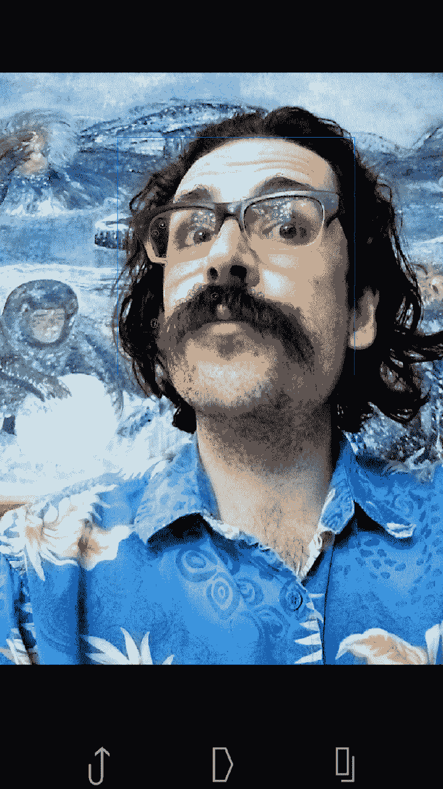

`Goldgesture`中的面部检测功能应该已经从第三章*，训练一个智能闹钟来识别恶人和他的猫*中的 Angora Blue 项目熟悉。然而，特征跟踪，特别是光流，对我们来说是一个新话题。在继续设置我们的项目之前，让我们先谈谈这些概念。

# 理解光流

**光流**是视频连续两帧之间的明显运动模式。我们在第一帧中选择特征点，并试图确定这些特征在第二帧中的位置。这个搜索受到一些限制：

+   我们不尝试区分相机运动和主体运动。

+   我们假设特征的颜色或亮度在帧之间保持相似。

+   我们假设相邻像素具有相似的运动。

OpenCV 的`calcOpticalFlowPyrLK`函数实现了计算光流的 Lucas-Kanade 方法。Lucas-Kanade 依赖于每个特征周围的*3 x 3*邻域（即 9 个像素）。从第一帧中取每个特征的邻域，我们尝试在第二帧中找到最佳匹配的邻域，基于最小二乘误差。OpenCV 对 Lucas-Kanade 的实现使用图像金字塔，这意味着它在不同的尺度上进行搜索。因此，它支持大范围和小范围的运动（函数名中的`PyrLK`代表*pyramidal Lucas-Kanade*）。以下图表是金字塔的可视化——从低分辨率（或低放大）图像到高分辨率（或高放大）图像的进展：

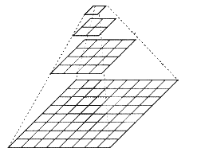

关于光流和 Lucas-Kanade 方法的更多详细信息，请参阅官方 OpenCV 文档 [`docs.opencv.org/master/d7/d8b/tutorial_py_lucas_kanade.html`](http://docs.opencv.org/master/d7/d8b/tutorial_py_lucas_kanade.html)。

OpenCV 还提供了其他光流算法的实现。例如，`calcOpticalFlowSF` 函数实现了 SimpleFlow 算法，该算法通过假设平滑（均匀）图像区域一起移动来为高分辨率视频进行优化。`calcOpticalFlowFarneback` 函数实现了 Gunnar Farneback 的算法，该算法认为一个邻域即使在运动过程中，也可以通过其像素值之间的多项式关系的系数来识别。这两种算法都是 *密集* 光流的形式，这意味着它们分析图像中的每个像素，而不仅仅是选定的（*稀疏*）特征。更多 OpenCV 的光流函数文档可以在 [`docs.opencv.org/master/dc/d6b/group__video__track.html`](https://docs.opencv.org/master/dc/d6b/group__video__track.html) 和 [`docs.opencv.org/master/d2/d84/group__optflow.html`](https://docs.opencv.org/master/d2/d84/group__optflow.html) 找到。

在几个选项中，为什么选择 `calcOpticalFlowPyrLK`？*你看，它是一个金字塔，*正如伊姆霍特普对法老德杰瑟所说，*它内部有开阔的空间。*金字塔式、稀疏的技术是我们以低成本和鲁棒性跟踪面部几个特征的好方法，这些特征在接近或远离相机时可能会改变尺度。

对于我们的目的来说，选择检测到的对象内部的特征是有用的，特别是检测到的面部特征。我们选择面部的一个内部区域（以避免背景区域），然后使用一个名为 `goodFeaturesToTrack` 的 OpenCV 函数，该函数根据 Jianbo Shi 和 Carlo Tomasi 的论文 "Good Features to Track"，*Proc. of IEEE Conf. on Computer Vision and Pattern Recognition*，第 593-600 页，1994 年 6 月中描述的算法来选择特征。

如其名所示，**Good Features to Track**（**GFTT**）算法（也称为 **Shi-Tomasi 算法**）考虑了跟踪算法和跟踪用例的要求，并试图选择与这些算法和用例配合得好的特征。正如论文中详细描述的那样，要跟踪的良好特征必须相对于相机视角的小变化具有稳定的外观。要跟踪的不良特征示例包括反射（如汽车引擎盖上的阳光）和在不同深度交叉的线条（如树木的树枝），因为这些特征在观察者或相机移动时会快速移动。可以通过扭曲给定图像并线性移动其内容来模拟视角变化的效果（尽管并不完美）。基于这样的模拟，可以选择最稳定的特征。

OpenCV 除了 Good Features to Track 之外，还提供了几个特征检测算法的实现。有关这些其他算法的信息，请参阅附录 B，*在 OpenCV 中学习更多关于特征检测的内容*。

# 在 Android Studio 中设置项目

若要复习设置 Android Studio 和 OpenCV Android 包的步骤，请参阅第一章中的*设置 Android Studio 和 OpenCV*部分，*准备任务*。

我们将按照以下方式在 Android Studio 项目中组织所有源代码和资源：

1.  打开 Android Studio，从菜单中选择 File | New | New Project...。应该会出现创建新项目窗口，并显示**选择您的项目**表单。选择 Empty Activity，如以下截图所示，然后点击 Next：

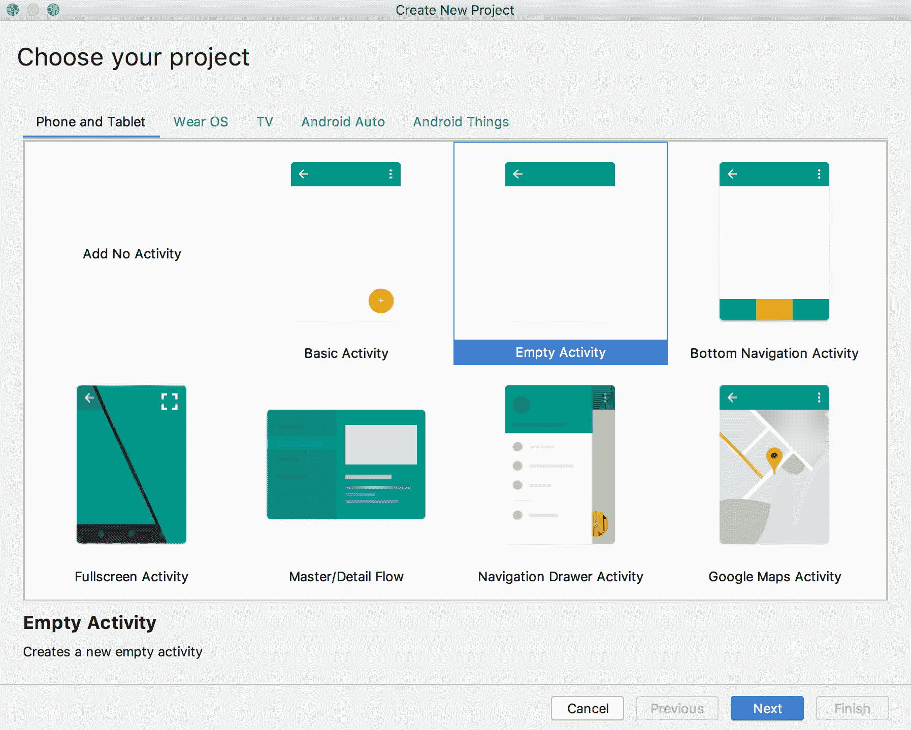

1.  创建新项目窗口应该显示配置您的项目表单。我们希望指定应用程序名称为`Goldgesture`，包名为`com.nummist.goldgesture`，它是一个 Java 项目，其最小 Android SDK 版本是 API 级别 21，即 Android 5.0。您可以选择任何新的文件夹作为项目位置。按照以下截图所示填写表单，然后点击 Finish：

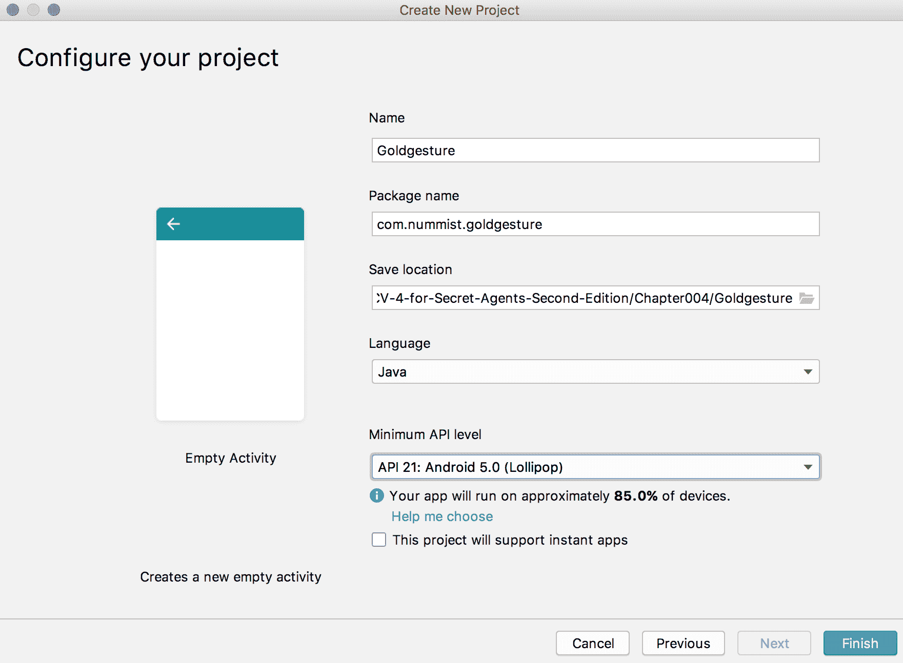

1.  默认情况下，Android Studio 创建一个主类，称为 MainActivity。让我们将其重命名为更具有描述性的名称，CameraActivity。在项目面板中右键单击`app/src/main/java/com.nummist.goldgesture/MainActivity`，从上下文菜单中选择 Refactor | Rename...。应该会出现重命名对话框。按照以下截图所示填写，然后点击 Refactor：

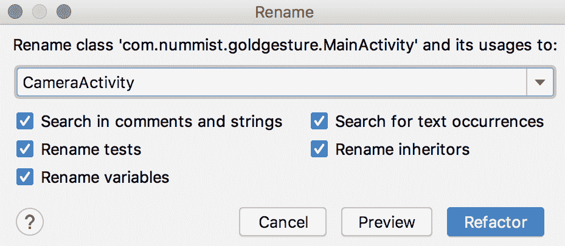

1.  让我们重命名与`main`类关联的 GUI 布局定义的 XML 文件。在项目面板中右键单击`app/src/main/res/layout/activity_main.xml`，从上下文菜单中选择 Refactor | Rename...。应该再次出现重命名对话框。按照以下截图所示填写，然后点击 Refactor：

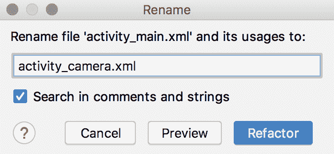

1.  由于我们的应用程序将依赖于 OpenCV，我们需要导入在第一章*，准备任务*中作为 OpenCV Android 包的一部分获得的 OpenCV 库模块。从 Android Studio 的菜单中选择 File | New | New Module.... 应该会出现创建新模块对话框，并显示新模块表单。选择 Import Gradle Project，如以下截图所示，然后点击 Next：

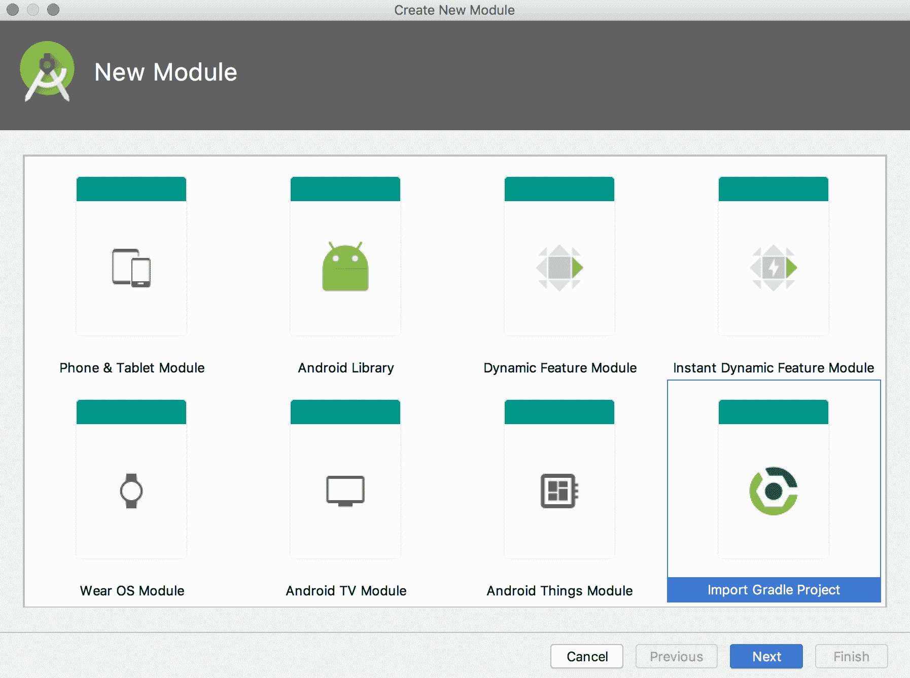

1.  应该会出现一个文件选择对话框。选择 OpenCV Android 包的`sdk`子文件夹，如以下截图所示，然后通过点击 Open 或 OK 按钮（其名称取决于操作系统）确认选择：

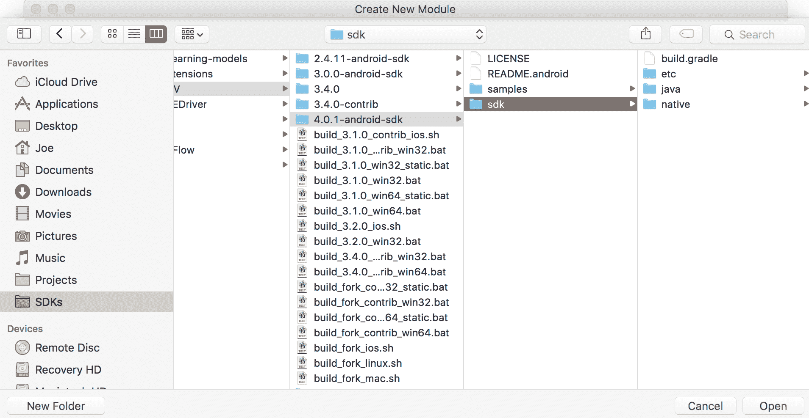

1.  创建新模块对话框应显示从源导入模块表单。在模块名称字段中输入`:OpenCV`，如图所示，然后点击完成：

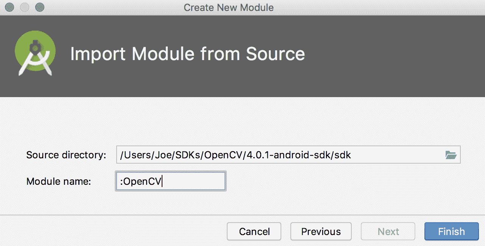

在此阶段，Android Studio 可能会提示您执行更新并接受许可协议，以便您拥有 OpenCV 的所有依赖项。如果您被提示，请同意。

1.  我们需要指定`Goldgesture`应用程序模块依赖于 OpenCV 库模块。从 Android Studio 的菜单中选择文件 | 项目结构... 项目结构对话框应该出现。在模块下选择 app。然后，选择依赖项选项卡，如图所示：

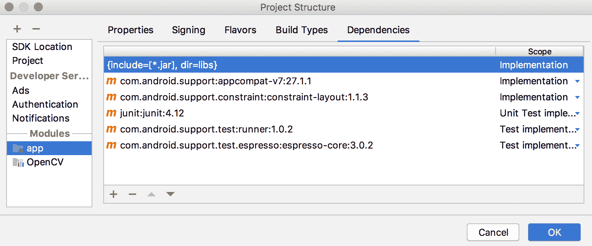

1.  点击+按钮添加依赖项。应该会出现一个菜单。选择模块依赖项。选择模块对话框应该出现。选择：OpenCV，如图所示，然后点击确定：

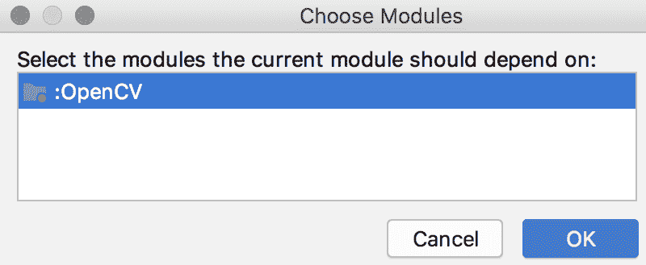

OpenCV 库现在已链接到`Goldgesture`。

# 获取级联文件和音频文件

如同第三章的部分内容，*训练智能闹钟识别恶棍和他的猫*，*安哥拉蓝项目*，`Goldgesture`执行人脸检测并需要 OpenCV 附带的一个级联文件。此外，`Goldgesture`使用音频剪辑。级联文件和音频剪辑位于书籍的 GitHub 仓库中的`Chapter004/Goldgesture/app/src/main/res/raw`子文件夹中。如果您是从头开始重新创建项目，您应该将这些文件复制到自己的`app/src/main/res/raw`文件夹中。此文件夹是我们希望与 Android 应用程序捆绑的文件的标准位置，以原始（未修改）形式。默认情况下，新 Android Studio 项目中不存在此文件夹。

要在 Android Studio 中创建它，请右键单击`app/src/main/res`文件夹（在项目窗格中），然后从上下文菜单中选择新建 | Android 资源目录。新资源目录窗口应该出现。填写它，如图所示，然后点击确定：

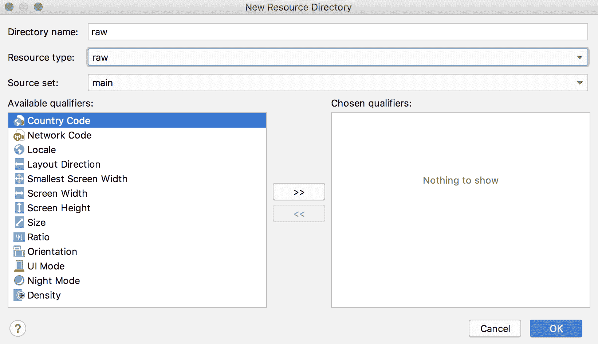

在创建`app/src/main/res/raw`文件夹后，您可以在 Android Studio 中将文件拖放到其中。

音频剪辑是使用 Mac 标准文本到语音合成器的 Vicki 语音生成的。例如，一个剪辑是通过在终端中运行以下命令创建的：

```py
$ say 'You are 007! I win!' -v Vicki -o win_007.mp4 
```

语音合成对全家人来说都是一项充满乐趣的活动。

Mac 语音合成器将`007`读作双-O 七。这是一个异常。例如，*008*被读作*零，零，八*。

# 指定应用程序的要求

`AndroidManifest.xml`（AndroidManifest 文件）是应用宣布系统、Google Play 和其他应用可能需要知道的信息的地方。例如，`Goldgesture`需要前置摄像头并允许使用它（可以说是一种拍摄许可）。`Goldgesture`还期望在横屏模式下运行，无论手机的物理方向如何，因为 OpenCV 的摄像头预览始终使用摄像头的横屏尺寸（OpenCV 的 Android 文档没有表明这种行为是否是预期的。也许未来的版本将提供更好的对竖屏方向的支持）。为了指定这些要求，编辑`app/src/main/AndroidManifest.xml`以匹配以下示例：

```py
<?xml version="1.0" encoding="utf-8"?>
<manifest xmlns:android="http://schemas.android.com/apk/res/android"
    package="com.nummist.goldgesture">

 <uses-permission android:name="android.permission.CAMERA" />

 <uses-feature android:name="android.hardware.camera.front" />

    <application
        android:allowBackup="true"
        android:icon="@mipmap/ic_launcher"
        android:label="@string/app_name"
        android:roundIcon="@mipmap/ic_launcher_round"
        android:supportsRtl="true"
        android:theme="@style/AppTheme">
 <activity
 android:name=".CameraActivity"
 android:screenOrientation="landscape"
 android:theme="@android:style/Theme.NoTitleBar.Fullscreen">
 <intent-filter>
 <action android:name="android.intent.action.MAIN" />

 <category android:name="android.intent.category.LAUNCHER" />
 </intent-filter>
 </activity>
    </application>

</manifest>
```

当你在 Android Studio 中打开`AndroidManifest.xml`时，你可能会看到两个标签页，一个标有“Text”，另一个标有“Merged Manifest”。选择“Text”标签页，它允许我们直接编辑`AndroidManifest.xml`的源代码（相比之下，“Merged Manifest”标签页不可直接编辑，它显示了`AndroidManifest.xml`和项目属性的设置组合）。

现在，我们的应用可以使用摄像头，并且将保持在横屏模式。此外，如果我们将其发布在 Google Play 上，它将仅适用于具有前置摄像头的设备。

# 将摄像头预览作为主视图布局

Android，像许多系统一样，允许程序员在 XML 文件中指定 GUI 布局。我们的 Java 代码可以从这些 XML 文件中加载整个视图或其部分。

`Goldgesture`有一个简单的布局，其中只包含一个摄像头预览，我们使用 OpenCV 在上面绘制一些额外的图形。摄像头预览由一个名为`JavaCameraView`的 OpenCV 类表示。让我们编辑`app/src/main/res/layout/activity_camera.xml`，使用前置摄像头填充布局，如下所示：

```py
<?xml version="1.0" encoding="utf-8"?>
<android.support.constraint.ConstraintLayout
    xmlns:android="http://schemas.android.com/apk/res/android"
    xmlns:app="http://schemas.android.com/apk/res-auto"
 xmlns:opencv="http://schemas.android.com/apk/res-auto"
    xmlns:tools="http://schemas.android.com/tools"
    android:layout_width="match_parent"
    android:layout_height="match_parent"
    tools:context=".CameraActivity">

 <org.opencv.android.JavaCameraView
        android:layout_width="fill_parent"
        android:layout_height="fill_parent"
        android:id="@+id/camera_view"
        app:layout_constraintBottom_toBottomOf="parent"
        app:layout_constraintLeft_toLeftOf="parent"
        app:layout_constraintRight_toRightOf="parent"
        app:layout_constraintTop_toTopOf="parent"
        opencv:camera_id="front" />

</android.support.constraint.ConstraintLayout>
```

或者，OpenCV 还提供了一个名为`JavaCamera2View`的类。`JavaCameraView`和`JavaCamera2View`都是名为`CameraBridgeViewBase`的接口的实现。区别在于`JavaCamera2View`基于 Android 摄像头 API 的较新版本，但目前在许多设备上帧率较低。`JavaCamera2View`的性能可能在 OpenCV 的未来版本或未来的 Android 设备上得到改善，因此您可能需要在您针对的特定 Android 设备上运行自己的性能测试。

# 跟踪来回手势

一些常见的手势由重复的、来回移动组成。考虑以下此类手势的例子：

+   点头（是或我在听）

+   摇头（不或失望）

+   挥手（问候）

+   握手（问候）

+   挥拳头（威胁或抗议）

+   挥手指（责备）

+   挥动手指或手指（召唤）

+   用脚跟敲击地面（不耐烦）

+   用四个手指敲击桌子（不耐烦）

+   用两个手指敲击桌子（谢谢绿茶）

+   踱步（焦虑）

+   跳上跳下（兴奋，快乐）

为了帮助我们识别此类手势，让我们编写一个名为 `BackAndForthGesture` 的类，该类跟踪一个值（如 *x* 坐标或 *y* 坐标）在低阈值和高阈值之间振荡的次数。一定次数的振荡可以被认为是一个完整的手势。

创建一个文件，`app/src/main/java/com/nummist/goldgesture/BackAndForthGesture.java`。在 Android Studio 中，右键点击 `app/src/main/java/com.nummist.goldgesture` 文件夹（在项目面板中），然后在上下文菜单中选择 New | Java Class。创建新类窗口应该会出现。按照以下截图所示填写，然后点击 OK：

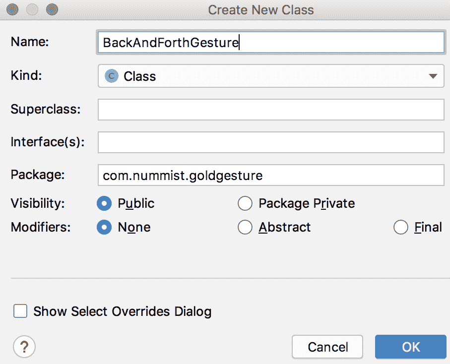

作为成员变量，`BackAndForthGesture` 将存储定义反向或正向运动的最低距离或阈值、初始位置、从这个位置的最新 delta 以及反向运动和正向运动的次数。以下是类代码的第一部分：

```py
package com.nummist.goldgesture;

public final class BackAndForthGesture {

    private double mMinDistance;

    private double mStartPosition;
    private double mDelta;

    private int mBackCount;
    private int mForthCount;
```

反向和正向计数（或振荡次数）是反向计数和正向计数的较小值。让我们在以下获取器方法中实现此规则：

```py
    public int getBackAndForthCount() {
        return Math.min(mBackCount, mForthCount);
    }
```

构造函数接受一个参数，即运动的最低距离或阈值：

```py
    public BackAndForthGesture(final double minDistance) {
        mMinDistance = minDistance;
    }
```

要开始跟踪运动，我们使用初始位置作为参数调用一个 `start` 方法。此方法记录初始位置并重置 delta 和计数：

```py
    public void start(final double position) {
        mStartPosition = position;
        mDelta = 0.0;
        mBackCount = 0;
        mForthCount = 0;
    }
```

我们将位置视为一维值，因为点头（上下）或摇头（左右）是一种线性手势。对于直立的头，图像的两个维度中只有一个与点头或摇头手势相关。

要继续跟踪运动，我们使用新的位置作为参数调用一个 `update` 方法。此方法重新计算 delta，如果刚刚超过了阈值，则反向计数或正向计数会增加：

```py
    public void update(final double position) {
        double lastDelta = mDelta;
        mDelta = position - mStartPosition;
        if (lastDelta < mMinDistance &&
                mDelta >= mMinDistance) {
            mForthCount++;
        } else if (lastDelta > -mMinDistance &&
                mDelta < -mMinDistance) {
            mBackCount++;
        }
    }
```

如果我们认为手势已完成，或者出于其他原因我们认为计数无效，我们将调用一个 `resetCounts` 方法：

```py
    public void resetCounts() {
        mBackCount = 0;
        mForthCount = 0;
    }
}
```

注意，`BackAndForthGesture` 本身不包含计算机视觉功能，但我们传递给它的位置值将来自计算机视觉。

# 将音频剪辑作为问题和答案播放

问题-答案序列的逻辑是另一个没有计算机视觉功能的组件。我们将其封装在一个名为 `YesNoAudioTree` 的类中，该类负责在应用程序的计算机视觉组件通知它有是或否答案时播放下一个音频剪辑。

请记住，音频剪辑是本书的 GitHub 仓库的一部分，它们属于项目的 `app/src/main/res/raw` 文件夹。然而，请注意，仓库中的音频剪辑绝不是关于邦德系列中角色的问题和猜测的完整集合。请随意添加您自己的剪辑和您自己的逻辑来播放它们。

创建一个文件，`app/src/main/java/com/nummist/goldgesture/YesNoAudioTree.java`。我们的`YesNoAudioTree`类需要成员变量来存储一个媒体播放器和相关上下文，最近播放的音频剪辑的 ID，以及从之前问题的答案中收集的信息。具体来说，下一个问题取决于未知的人是否已经被识别为 MI6、CIA、KGB 或犯罪组织的成员。这些信息，加上最近问题的答案，将足以让我们构建一个简单的问题树，以识别来自邦德系列的多个人物。类的实现开始如下：

```py
package com.nummist.goldgesture;

import android.content.Context;
import android.media.MediaPlayer;
import android.media.MediaPlayer.OnCompletionListener;

public final class YesNoAudioTree {

    private enum Affiliation { UNKNOWN, MI6, CIA, KGB, CRIMINAL }

    private int mLastAudioResource;
    private Affiliation mAffiliation;

    private Context mContext;
    private MediaPlayer mMediaPlayer;
```

该类使用`Context`对象实例化，这是应用 Android 环境的标准抽象：

```py
    public YesNoAudioTree(final Context context) {
        mContext = context;
    }
```

`Context`对象是创建媒体播放器所必需的，正如我们将在本章的这一节中看到的那样。

有关 Android SDK 的`MediaPlayer`类的更多信息，请参阅官方文档[`developer.android.com/reference/android/media/MediaPlayer.html`](http://developer.android.com/reference/android/media/MediaPlayer.html)。

要（重新）从第一个问题开始，我们调用一个`start`方法。它重置有关个人的数据，并使用一个私有的辅助方法`play`播放第一个音频剪辑：

```py
    public void start() {
        mAffiliation = Affiliation.UNKNOWN;
        play(R.raw.intro);
    }
```

要停止任何当前剪辑并清理音频播放器（例如，当应用暂停或结束时），我们调用一个`stop`方法：

```py
    public void stop() {
        if (mMediaPlayer != null) {
            mMediaPlayer.release();
        }
    }
```

当用户对一个问题的回答是肯定时，我们调用`takeYesBranch`方法。它使用嵌套的`switch`语句根据之前的答案和最近的问题选择下一个音频剪辑：

```py
    public void takeYesBranch() {

        if (mMediaPlayer != null && mMediaPlayer.isPlaying()) {
            // Do not interrupt the audio that is already playing.
            return;
        }

        switch (mAffiliation) {
            case UNKNOWN:
                switch (mLastAudioResource) {
                    case R.raw.q_mi6:
                        mAffiliation = Affiliation.MI6;
                        play(R.raw.q_martinis);
                        break;
                    case R.raw.q_cia:
                        mAffiliation = Affiliation.CIA;
                        play(R.raw.q_bond_friend);
                        break;
                    case R.raw.q_kgb:
                        mAffiliation = Affiliation.KGB;
                        play(R.raw.q_chief);
                        break;
                    case R.raw.q_criminal:
                        mAffiliation = Affiliation.CRIMINAL;
                        play(R.raw.q_chief);
                        break;
                }
                break;
            case MI6:
                // The person works for MI6.
                switch (mLastAudioResource) {
                    case R.raw.q_martinis:
                        // The person drinks shaken martinis (007).
                        play(R.raw.win_007);
                        break;
                    // ...
                    // See the GitHub repository for more cases.
                    // ...
                    default:
                        // The person remains unknown.
                        play(R.raw.lose);
                        break;
                }
                break;
            // ...
            // See the GitHub repository for more cases.
            // ...
         }            
       }       
```

类似地，当用户对一个问题的回答是否定时，我们调用`takeNoBranch`方法，该方法也包含大的嵌套`switch`语句：

```py
    public void takeNoBranch() {

        if (mMediaPlayer != null && mMediaPlayer.isPlaying()) {
            // Do not interrupt the audio that is already playing.
            return;
        }

        switch (mAffiliation) {
            case UNKNOWN:
                switch (mLastAudioResource) {
                    case R.raw.q_mi6:
                        // The person does not work for MI6.
                        // Ask whether the person works for a criminal
                        // organization.
                        play(R.raw.q_criminal);
                        break;
                    // ...
                    // See the GitHub repository for more cases.
                    // ...
                    default:
                        // The person remains unknown.
                        play(R.raw.lose);
                        break;
            // ...
            // See the GitHub repository for more cases.
            // ...
    }
   }
 }
```

当某些剪辑结束时，我们希望自动跳转到另一个剪辑，而无需用户输入是或否。一个私有的辅助方法`takeAutoBranch`在`switch`语句中实现了相关逻辑：

```py
    private void takeAutoBranch() {
        switch (mLastAudioResource) {
            case R.raw.intro:
                play(R.raw.q_mi6);
                break;
            case R.raw.win_007:
            case R.raw.win_blofeld:
            case R.raw.win_gogol:
            case R.raw.win_jaws:
            case R.raw.win_leiter:
            case R.raw.win_m:
            case R.raw.win_moneypenny:
            case R.raw.win_q:
            case R.raw.win_rublevitch:
            case R.raw.win_tanner:
            case R.raw.lose:
                start();
                break;
        }
    }
```

每当我们需要播放一个音频剪辑时，我们调用`play`私有的辅助方法。它使用上下文和一个音频剪辑的 ID 创建一个`MediaPlayer`实例，该 ID 作为参数传递给`play`。音频播放，并设置一个回调，以便在剪辑完成后清理媒体播放器并调用`takeAutoBranch`：

```py
    private void play(final int audioResource) {
        mLastAudioResource = audioResource;
        mMediaPlayer = MediaPlayer.create(mContext, audioResource);
        mMediaPlayer.setOnCompletionListener(
                new OnCompletionListener() {
                    @Override
                    public void onCompletion(
                            final MediaPlayer mediaPlayer) {
                        mediaPlayer.release();
                        if (mMediaPlayer == mediaPlayer) {
                            mMediaPlayer = null;
                        }
                        takeAutoBranch();
                    }
                });
        mMediaPlayer.start();
    }
}
```

现在我们已经编写了我们的支持类，我们准备处理应用的主类，包括计算机视觉功能。

# 在活动中捕获图像和跟踪面部

安卓应用是一个状态机，其中每个状态被称为**活动**。活动有一个生命周期。例如，它可以被创建、暂停、恢复和完成。在活动之间的转换过程中，暂停或完成的活动可以向创建或恢复的活动发送数据。一个应用可以定义许多活动，并以任何顺序在它们之间转换。它甚至可以在由 Android SDK 或其他应用定义的活动之间进行转换。

有关 Android 活动和它们的生命周期的更多信息，请参阅官方文档[`developer.android.com/guide/components/activities.html`](http://developer.android.com/guide/components/activities.html)。有关 OpenCV 的 Android 和 Java API（在我们的活动类中广泛使用）的更多信息，请参阅官方 Javadocs[`docs.opencv.org/master/javadoc/index.html`](https://docs.opencv.org/master/javadoc/index.html)。

OpenCV 提供了类和接口，可以将它们视为活动生命周期的附加组件。具体来说，我们可以使用 OpenCV 回调方法来处理以下事件：

+   摄像头预览开始

+   摄像头预览停止

+   摄像头预览捕获了一个新的帧

`Goldgesture`只使用一个活动，称为`CameraActivity`。`CameraActivity`使用一个`CameraBridgeViewBase`对象（更具体地说，是一个`JavaCameraView`对象）作为其摄像头预览。（回想一下，我们之前在本章的*将摄像头预览作为主视图布局*部分中看到了这个，当时我们实现了`CameraActivity`的 XML 布局。）`CameraActivity`实现了一个名为`CvCameraViewListener2`的接口，它为此摄像头预览提供回调。（或者，一个名为`CvCameraViewListener`的接口也可以起到这个作用。两个接口之间的区别在于，`CvCameraViewListener2`允许我们指定捕获图像的格式，而`CvCameraViewListener`则不提供这种功能。）我们类的实现如下：

```py
package com.nummist.goldgesture;

// ...
// See the GitHub repository for imports
// ...

public final class CameraActivity extends Activity
        implements CvCameraViewListener2 {

    // A tag for log output.
    private static final String TAG = "CameraActivity";
```

为了提高可读性和便于编辑，我们在计算机视觉函数中使用静态最终变量来存储许多参数。您可能希望根据实验调整这些值。首先，我们有面部检测参数，这些参数您可能从第三章*,* *训练一个智能闹钟来识别恶棍和他的猫*中已经熟悉：

```py
    // Parameters for face detection.
    private static final double SCALE_FACTOR = 1.2;
    private static final int MIN_NEIGHBORS = 3;
    private static final int FLAGS = Objdetect.CASCADE_SCALE_IMAGE;
    private static final double MIN_SIZE_PROPORTIONAL = 0.25;
    private static final double MAX_SIZE_PROPORTIONAL = 1.0;
```

为了选择特征，我们不使用整个检测到的面部。相反，我们使用一个内部区域，这个区域不太可能包含任何非面部背景。因此，我们定义了面部两侧应该排除在特征选择之外的面积比例：

```py
    // The portion of the face that is excluded from feature
    // selection on each side.
    // (We want to exclude boundary regions containing background.)
    private static final double MASK_PADDING_PROPORTIONAL = 0.15;
```

对于使用光流进行人脸追踪，我们定义了一个最小和最大特征数。如果我们无法追踪至少最小数量的特征，我们认为人脸已经丢失。我们还定义了一个最小特征质量（相对于找到的最佳特征的质量），特征之间的最小像素距离，以及尝试将新特征与旧特征匹配时的最大可接受误差值。正如我们将在本章的后续部分看到，这些参数与 OpenCV 的`calcOpticalFlowPyrLK`函数及其返回值相关。以下是声明：

```py
    // Parameters for face tracking.
    private static final int MIN_FEATURES = 10;
    private static final int MAX_FEATURES = 80;
    private static final double MIN_FEATURE_QUALITY = 0.05;
    private static final double MIN_FEATURE_DISTANCE = 4.0;
    private static final float MAX_FEATURE_ERROR = 200f;
```

我们还定义了在认为点头或摇头发生之前所需的移动量（作为图像大小的比例）和往返周期数：

```py
    // Parameters for gesture detection
    private static final double MIN_SHAKE_DIST_PROPORTIONAL = 0.01;
    private static final double MIN_NOD_DIST_PROPORTIONAL = 0.0025;
    private static final double MIN_BACK_AND_FORTH_COUNT = 2;
```

我们的成员变量包括摄像头视图、捕获图像的尺寸以及处理各个阶段的图像。这些图像存储在 OpenCV `Mat`对象中，类似于我们在 Python 绑定中看到的 NumPy 数组。OpenCV 始终以横幅格式捕获图像，但我们将其重新定向为竖幅格式，这是智能手机上自己人脸图片更常见的方向。以下是相关的变量声明：

```py
    // The camera view.
    private CameraBridgeViewBase mCameraView;

    // The dimensions of the image before orientation.
    private double mImageWidth;
    private double mImageHeight;

    // The current gray image before orientation.
    private Mat mGrayUnoriented;

    // The current and previous equalized gray images.
    private Mat mEqualizedGray;
    private Mat mLastEqualizedGray;
```

如以下代码和注释所示，我们还声明了与人脸检测和追踪相关的几个成员变量：

```py
    // The mask, in which the face region is white and the
    // background is black.
    private Mat mMask;
    private Scalar mMaskForegroundColor;
    private Scalar mMaskBackgroundColor;

    // The face detector, more detection parameters, and
    // detected faces.
    private CascadeClassifier mFaceDetector;
    private Size mMinSize;
    private Size mMaxSize;
    private MatOfRect mFaces;

    // The initial features before tracking.
    private MatOfPoint mInitialFeatures;

    // The current and previous features being tracked.
    private MatOfPoint2f mFeatures;
    private MatOfPoint2f mLastFeatures;

    // The status codes and errors for the tracking.
    private MatOfByte mFeatureStatuses;
    private MatOfFloat mFeatureErrors;

    // Whether a face was being tracked last frame.
    private boolean mWasTrackingFace;

    // Colors for drawing.
    private Scalar mFaceRectColor;
    private Scalar mFeatureColor;
```

最后，我们存储了我们之前定义的类的实例，即`BackAndForthGesture`（在本章的*追踪往返手势*部分）和`YesNoAudioTree`（在本章的*播放音频剪辑作为问题和答案*部分）：

```py
    // Gesture detectors.
    private BackAndForthGesture mNodHeadGesture;
    private BackAndForthGesture mShakeHeadGesture;

    // The audio tree for the 20 questions game.
    private YesNoAudioTree mAudioTree;
```

现在，让我们实现一个 Android 活动的标准生命周期回调。首先，当活动被创建时，我们尝试加载 OpenCV 库（如果由于某些原因失败，我们将记录错误信息并退出）。如果 OpenCV 成功加载，我们指定即使在没有触摸交互的情况下也要保持屏幕开启（因为所有交互都是通过摄像头进行的）。此外，我们需要从 XML 文件中加载布局，获取摄像头预览的引用，并将此活动设置为摄像头预览事件的处理程序。以下是实现代码：

```py
    @Override
    protected void onCreate(final Bundle savedInstanceState) {
        super.onCreate(savedInstanceState);

        if (OpenCVLoader.initDebug()) {
            Log.i(TAG, "Initialized OpenCV");
        } else {
            Log.e(TAG, "Failed to initialize OpenCV");
            finish();
        }

        final Window window = getWindow();
        window.addFlags(
                WindowManager.LayoutParams.FLAG_KEEP_SCREEN_ON);

        setContentView(R.layout.activity_camera);
        mCameraView = (CameraBridgeViewBase)
                findViewById(R.id.camera_view);
        //mCameraView.enableFpsMeter();
        mCameraView.setCvCameraViewListener(this);
    }
```

注意，我们尚未初始化大多数成员变量。相反，我们在摄像头预览开始后进行初始化。当活动暂停时，我们禁用摄像头预览，停止音频，并重置手势识别数据，如下面的代码所示：

```py
    @Override
    public void onPause() {
        if (mCameraView != null) {
            mCameraView.disableView();
        }
        if (mAudioTree != null) {
            mAudioTree.stop();
        }
        resetGestures();
        super.onPause();
    }
```

当活动恢复（包括在创建后第一次进入前台时），我们检查用户是否已授予应用使用摄像头的权限。如果尚未授予权限，我们将请求权限。（在某些情况下，Android 要求我们显示权限请求的理由。我们通过一个名为`showRequestPermissionRationale`的私有辅助方法来完成此操作。）如果权限已经授予，我们启用摄像头视图。以下是相关代码：

```py
    @Override
    public void onResume() {
        super.onResume();
        if (ContextCompat.checkSelfPermission(this,
                Manifest.permission.CAMERA)
                != PackageManager.PERMISSION_GRANTED) {
            if (ActivityCompat.shouldShowRequestPermissionRationale(this,
                    Manifest.permission.CAMERA)) {
                showRequestPermissionRationale();
            } else {
                ActivityCompat.requestPermissions(this,
                        new String[] { Manifest.permission.CAMERA },
                        PERMISSIONS_REQUEST_CAMERA);
            }
        } else {
            Log.i(TAG, "Camera permissions were already granted");

            // Start the camera.
            mCameraView.enableView();
        }
    }
```

当活动被销毁时，我们清理的方式与活动暂停时相同：

```py
    @Override
    public void onDestroy() {
        super.onDestroy();
        if (mCameraView != null) {
            // Stop the camera.
            mCameraView.disableView();
        }
        if (mAudioTree != null) {
            mAudioTree.stop();
        }
        resetGestures();
    }
```

我们的`showRequestPermissionRationale`辅助方法显示一个对话框，解释为什么`Goldgesture`需要使用摄像头。当用户点击此对话框的`OK`按钮时，我们请求使用摄像头的权限：

```py
    void showRequestPermissionRationale() {
        AlertDialog dialog = new AlertDialog.Builder(this).create();
        dialog.setTitle("Camera, please");
        dialog.setMessage(
                "Goldgesture uses the camera to see you nod or shake " +
                "your head. You will be asked for camera access.");
        dialog.setButton(AlertDialog.BUTTON_NEUTRAL, "OK",
                new DialogInterface.OnClickListener() {
                    public void onClick(DialogInterface dialog,
                                        int which) {
                        dialog.dismiss();
                        ActivityCompat.requestPermissions(
                                CameraActivity.this,
                                new String[] {
                                        Manifest.permission.CAMERA },
                                PERMISSIONS_REQUEST_CAMERA);
                    }
                });
        dialog.show();
    }
```

我们实现一个回调来处理权限请求的结果。如果用户授予使用摄像头的权限，我们启用摄像头视图。否则，我们记录错误并退出：

```py
@Override
public void onRequestPermissionsResult(final int requestCode,
        final String permissions[], final int[] grantResults) {
    switch (requestCode) {
        case PERMISSIONS_REQUEST_CAMERA: {
            if (grantResults.length > 0 &&
                    grantResults[0] == PackageManager.PERMISSION_GRANTED) {
                Log.i(TAG, "Camera permissions were granted just now");

                // Start the camera.
                mCameraView.enableView();
            } else {
                Log.e(TAG, "Camera permissions were denied");
                finish();
            }
            break;
        }
    }
}
```

现在，让我们将注意力转向摄像头回调。当摄像头预览开始（在加载 OpenCV 库并获得使用摄像头的权限之后），我们初始化剩余的成员变量。首先，我们存储摄像头正在使用的像素尺寸：

```py
    @Override
    public void onCameraViewStarted(final int width,
                                    final int height) {

        mImageWidth = width;
        mImageHeight = height;
```

接下来，我们通过一个名为`initFaceDetector`的私有辅助方法初始化我们的面部检测变量。`initFaceDetector`的作用包括加载检测器的级联文件，`app/main/res/raw/lbpcascade_frontalface.xml`。在这个任务中涉及大量的样板代码用于文件处理和错误处理，因此将其分离到另一个函数中可以提高可读性。我们将在本章的这一节稍后检查辅助函数的实现，但这里是如何调用的：

```py
        initFaceDetector();
        mFaces = new MatOfRect();
```

正如我们在第三章*，训练智能闹钟以识别恶棍和他的猫*中所做的那样，我们确定两个图像尺寸中的较小者，并在成比例的大小计算中使用它：

```py
        final int smallerSide;
        if (height < width) {
            smallerSide = height;
        } else {
            smallerSide = width;
        }

        final double minSizeSide =
                MIN_SIZE_PROPORTIONAL * smallerSide;
        mMinSize = new Size(minSizeSide, minSizeSide);

        final double maxSizeSide =
                MAX_SIZE_PROPORTIONAL * smallerSide;
        mMaxSize = new Size(maxSizeSide, maxSizeSide);
```

我们初始化与特征相关的矩阵：

```py
        mInitialFeatures = new MatOfPoint();
        mFeatures = new MatOfPoint2f(new Point());
        mLastFeatures = new MatOfPoint2f(new Point());
        mFeatureStatuses = new MatOfByte();
        mFeatureErrors = new MatOfFloat();
```

我们指定用于在脸部周围绘制矩形和在特征周围绘制圆圈的**颜色**（以**RGB**（**红色、绿色和蓝色**）格式，而不是**BGR**（**蓝色、绿色和红色**））：

```py
        mFaceRectColor = new Scalar(0.0, 0.0, 255.0);
        mFeatureColor = new Scalar(0.0, 255.0, 0.0);
```

我们初始化与点头和摇头识别相关的变量：

```py
        final double minShakeDist =
                smallerSide * MIN_SHAKE_DIST_PROPORTIONAL;
        mShakeHeadGesture = new BackAndForthGesture(minShakeDist);

        final double minNodDist =
                smallerSide * MIN_NOD_DIST_PROPORTIONAL;
        mNodHeadGesture = new BackAndForthGesture(minNodDist);
```

我们初始化并开始音频序列：

```py
        mAudioTree = new YesNoAudioTree(this);
        mAudioTree.start();
```

最后，我们初始化图像矩阵，其中大部分都是转置以适应肖像格式：

```py
        mGrayUnoriented = new Mat(height, width, CvType.CV_8UC1);

        // The rest of the matrices are transposed.

        mEqualizedGray = new Mat(width, height, CvType.CV_8UC1);
        mLastEqualizedGray = new Mat(width, height, CvType.CV_8UC1);

        mMask = new Mat(width, height, CvType.CV_8UC1);
        mMaskForegroundColor = new Scalar(255.0);
        mMaskBackgroundColor = new Scalar(0.0);
    }
```

当摄像头视图停止时，我们不进行任何操作。以下是空的回调方法：

```py
    @Override
    public void onCameraViewStopped() {
    }
```

当摄像头捕获一帧时，我们进行所有真正的操作，即计算机视觉。我们首先获取彩色图像（以**红色、绿色、蓝色和透明度**（**RGBA**）格式，而不是 BGR），将其转换为灰度，并将其重新调整为肖像格式。从横向到肖像格式的重新调整相当于将图像的 *内容* 逆时针旋转 90 度，或者将图像的 *X 和 Y 坐标轴* 顺时针旋转 90 度。为了实现这一点，我们应用转置操作后进行垂直翻转。在将灰度图像重新调整为肖像格式后，我们对其进行均衡。因此，回调的实现开始如下：

```py
    @Override
    public Mat onCameraFrame(final CvCameraViewFrame inputFrame) {
        final Mat rgba = inputFrame.rgba();

        // For processing, orient the image to portrait and equalize
        // it.
        Imgproc.cvtColor(rgba, mGrayUnoriented,
                Imgproc.COLOR_RGBA2GRAY);
        Core.transpose(mGrayUnoriented, mEqualizedGray);
        Core.flip(mEqualizedGray, mEqualizedGray, 0);
        Imgproc.equalizeHist(mEqualizedGray, mEqualizedGray);
```

我们通过调用`inputFrame.rgba()`来获取 RGBA 图像，然后将其转换为灰度图。或者，我们可以直接通过调用`inputFrame.gray()`来获取灰度图像。在我们的情况下，我们想要 RGBA 和灰度图像，因为我们使用 RGBA 图像进行显示，而使用灰度图像进行检测和跟踪。

接下来，我们声明一个特征列表。标准的 Java `List`允许快速插入和删除元素，而 OpenCV 的`Mat`则不允许，因此当我们过滤掉跟踪不佳的特征时，我们需要一个`List`。以下是声明：

```py
        final List<Point> featuresList;
```

我们检测面部——这是来自第三章*，训练一个智能闹钟来识别恶棍和他的猫*的 Angora Blue 项目的熟悉任务。与 OpenCV 的 Python 绑定不同，存储面部矩形的结构作为参数提供：

```py
        mFaceDetector.detectMultiScale(
                mEqualizedGray, mFaces, SCALE_FACTOR, MIN_NEIGHBORS,
                FLAGS, mMinSize, mMaxSize);
```

如果至少检测到一个面部，我们取第一个检测到的面部并围绕它画一个矩形。我们正在对纵向图像执行面部检测，但我们以横向图像绘制原始图像，因此需要进行一些坐标转换。注意，纵向图像的起点（左上角）对应于横向图像的右上角。以下是代码：

```py
        if (mFaces.rows() > 0) { // Detected at least one face

            // Get the first detected face.
            final double[] face = mFaces.get(0, 0);

            double minX = face[0];
            double minY = face[1];
            double width = face[2];
            double height = face[3];
            double maxX = minX + width;
            double maxY = minY + height;

            // Draw the face.
            Imgproc.rectangle(
                    rgba, new Point(mImageWidth - maxY, minX),
                    new Point(mImageWidth - minY, maxX),
                    mFaceRectColor);
```

接下来，我们在检测到的面部内部选择特征。我们通过传递一个掩码到 OpenCV 的`goodFeaturesToTrack`函数来指定感兴趣的区域。掩码是一个前景为白色（面部的内部部分）而背景为黑色的图像。以下代码找到感兴趣的区域，创建掩码，并使用所有相关参数调用`goodFeaturesToTrack`：

```py
            // Create a mask for the face region.
            double smallerSide;
            if (height < width) {
                smallerSide = height;
            } else {
                smallerSide = width;
            }
            double maskPadding =
                    smallerSide * MASK_PADDING_PROPORTIONAL;
            mMask.setTo(mMaskBackgroundColor);
            Imgproc.rectangle(
                    mMask,
                    new Point(minX + maskPadding,
                            minY + maskPadding),
                    new Point(maxX - maskPadding,
                            maxY - maskPadding),
                    mMaskForegroundColor, -1);

            // Find features in the face region.
            Imgproc.goodFeaturesToTrack(
                    mEqualizedGray, mInitialFeatures, MAX_FEATURES,
                    MIN_FEATURE_QUALITY, MIN_FEATURE_DISTANCE,
                    mMask, 3, false, 0.04);
            mFeatures.fromArray(mInitialFeatures.toArray());
            featuresList = mFeatures.toList();
```

注意，我们将特征复制到几个变量中：一个初始特征的矩阵，一个当前特征的矩阵，以及一个我们将稍后过滤的特征的可变列表。

根据我们是否已经在跟踪面部，我们调用一个辅助函数来初始化我们的手势数据或更新我们的手势数据。我们还记录我们现在正在跟踪一个面部：

```py
            if (mWasTrackingFace) {
                updateGestureDetection();
            } else {
                startGestureDetection();
            }
            mWasTrackingFace = true;
```

或者，我们可能在这个帧中没有检测到任何面部。然后，我们使用 OpenCV 的`calcOpticalFlowPyrLK`函数更新任何先前选定的特征，以给我们一个新特征的矩阵，一个错误值的矩阵和一个状态值的矩阵（`0`表示无效特征，`1`表示有效特征）。无效通常意味着新特征估计在帧外，因此它不能再通过光流跟踪。我们将新特征转换为列表，并过滤掉无效或错误高的那些，如下面的代码所示：

```py
        // if (mFaces.rows > 0) { ... See above ... }
        } else { // Did not detect any face
            Video.calcOpticalFlowPyrLK(
                    mLastEqualizedGray, mEqualizedGray, mLastFeatures,
                    mFeatures, mFeatureStatuses, mFeatureErrors);

            // Filter out features that are not found or have high
            // error.
            featuresList = new LinkedList<Point>(mFeatures.toList());
            final LinkedList<Byte> featureStatusesList =
                    new LinkedList<Byte>(mFeatureStatuses.toList());
            final LinkedList<Float> featureErrorsList =
                    new LinkedList<Float>(mFeatureErrors.toList());
            for (int i = 0; i < featuresList.size();) {
                if (featureStatusesList.get(i) == 0 ||
                        featureErrorsList.get(i) > MAX_FEATURE_ERROR) {
                    featuresList.remove(i);
                    featureStatusesList.remove(i);
                    featureErrorsList.remove(i);
                } else {
                    i++;
                }
            }
```

如果过滤后特征太少，我们认为面部不再被跟踪，并丢弃所有特征。否则，我们将接受的特征放回当前特征的矩阵中，并更新我们的手势数据：

```py
            if (featuresList.size() < MIN_FEATURES) {
                // The number of remaining features is too low; we have
                // probably lost the target completely.

                // Discard the remaining features.
                featuresList.clear();
                mFeatures.fromList(featuresList);

                mWasTrackingFace = false;
            } else {
                mFeatures.fromList(featuresList);
                updateGestureDetection();
            }
        }
```

我们在当前特征周围画绿色圆圈。同样，我们必须将坐标从竖直格式转换回横幅格式，以便在原始图像上绘制：

```py
        // Draw the current features.
        for (int i = 0; i< featuresList.size(); i++) {
            final Point p = featuresList.get(i);
            final Point pTrans = new Point(
                    mImageWidth - p.y,
                    p.x);
            Imgproc.circle(rgba, pTrans, 8, mFeatureColor);
        }
```

在帧的末尾，当前均衡的灰度图像和当前特征成为前一个均衡的灰度图像和前一个特征。我们不是复制这些矩阵，而是交换引用：

```py
        // Swap the references to the current and previous images.
        final Mat swapEqualizedGray = mLastEqualizedGray;
        mLastEqualizedGray = mEqualizedGray;
        mEqualizedGray = swapEqualizedGray;

        // Swap the references to the current and previous features.
        final MatOfPoint2f swapFeatures = mLastFeatures;
        mLastFeatures = mFeatures;
        mFeatures = swapFeatures;
```

我们水平翻转预览图像，使其看起来像镜子。然后，我们将其返回，以便 OpenCV 可以显示它：

```py
        // Mirror (horizontally flip) the preview.
        Core.flip(rgba, rgba, 1);

        return rgba;
    }
```

我们提到了几个辅助函数，我们现在将检查它们。当我们开始分析面部运动时，我们找到特征的几何平均值，并分别使用平均值*x*和*y*坐标作为摇头和点头手势的起始坐标：

```py
    private void startGestureDetection() {

        double[] featuresCenter = Core.mean(mFeatures).val;

        // Motion in x may indicate a shake of the head.
        mShakeHeadGesture.start(featuresCenter[0]);

        // Motion in y may indicate a nod of the head.
        mNodHeadGesture.start(featuresCenter[1]);
    }
```

回想一下，我们的`BackAndForthGesture`类使用一维位置。对于一个直立的头，只有*x*坐标与摇头手势相关，只有*y*坐标与点头手势相关。

类似地，当我们继续分析面部运动时，我们找到特征的新几何平均值，并使用平均值坐标来更新摇头和点头数据。根据前后摇动或点头的次数，我们可能在问答树中采取是分支或否分支。或者，我们可能决定用户的当前手势是模糊的（既是是又是否），在这种情况下，我们将重置数据：

```py
    private void updateGestureDetection() {

        final double[] featuresCenter = Core.mean(mFeatures).val;

        // Motion in x may indicate a shake of the head.
        mShakeHeadGesture.update(featuresCenter[0]);
        final int shakeBackAndForthCount =
                mShakeHeadGesture.getBackAndForthCount();
        //Log.i(TAG, "shakeBackAndForthCount=" +
        // shakeBackAndForthCount);
        final boolean shakingHead =
                (shakeBackAndForthCount >=
                        MIN_BACK_AND_FORTH_COUNT);

        // Motion in y may indicate a nod of the head.
        mNodHeadGesture.update(featuresCenter[1]);
        final int nodBackAndForthCount =
                mNodHeadGesture.getBackAndForthCount();
        //Log.i(TAG, "nodBackAndForthCount=" +
        // nodBackAndForthCount);
        final boolean noddingHead =
                (nodBackAndForthCount >=
                        MIN_BACK_AND_FORTH_COUNT);

        if (shakingHead && noddingHead) {
            // The gesture is ambiguous. Ignore it.
            resetGestures();
        } else if (shakingHead) {
            mAudioTree.takeNoBranch();
            resetGestures();
        } else if (noddingHead) {
            mAudioTree.takeYesBranch();
            resetGestures();
        }
    }
```

我们总是同时重置点头手势数据和摇头手势数据：

```py
    private void resetGestures() {
        if (mNodHeadGesture != null) {
            mNodHeadGesture.resetCounts();
        }
        if (mShakeHeadGesture != null) {
            mShakeHeadGesture.resetCounts();
        }
    }
```

我们初始化面部检测器的辅助方法与在官方 OpenCV 示例项目中找到的方法非常相似。我们将级联的原始数据从应用包复制到一个更易于访问的新文件。然后，我们使用此文件的路径初始化一个`CascadeClassifier`对象。如果在任何点上遇到错误，我们将记录它并关闭应用。以下是此方法的实现：

```py
    private void initFaceDetector() {
        try {
            // Load cascade file from application resources.

            InputStream is = getResources().openRawResource(
                    R.raw.lbpcascade_frontalface);
            File cascadeDir = getDir(
                    "cascade", Context.MODE_PRIVATE);
            File cascadeFile = new File(
                    cascadeDir, "lbpcascade_frontalface.xml");
            FileOutputStream os = new FileOutputStream(cascadeFile);

            byte[] buffer = new byte[4096];
            int bytesRead;
            while ((bytesRead = is.read(buffer)) != -1) {
                os.write(buffer, 0, bytesRead);
            }
            is.close();
            os.close();

            mFaceDetector = new CascadeClassifier(
                    cascadeFile.getAbsolutePath());
            if (mFaceDetector.empty()) {
                Log.e(TAG, "Failed to load cascade");
                finish();
            } else {
                Log.i(TAG, "Loaded cascade from " +
                        cascadeFile.getAbsolutePath());
            }

            cascadeDir.delete();

        } catch (IOException e) {
            e.printStackTrace();
            Log.e(TAG, "Failed to load cascade. Exception caught: "
                    + e);
            finish();
        }
    }
}
```

那就是所有的代码！我们准备测试。确保你的 Android 设备已经打开声音。将设备插入 USB 端口并按下运行按钮（绿色中的播放图标）。第一次运行项目时，你可能会看到选择部署目标窗口：


如果你看到这个窗口，请选择你的 Android 设备并点击 OK 按钮。

很快，你应该会在设备上看到应用的相机预览出现。当问题被提出时，有意识地点头或摇头：

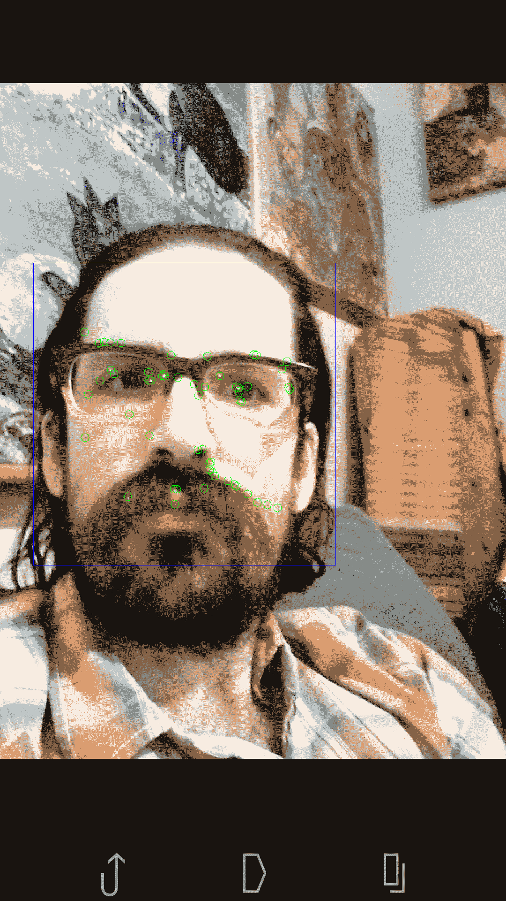

你应该会看到围绕你脸部的蓝色矩形，以及随着你的移动而（或多或少）锚定在你脸部某些特征上的绿色点。参考之前的截图作为示例。

为了改善特定摄像头和环境的手势检测结果，您可能想要尝试调整我们在代码中定义为常数的参数。此外，尽量保持摄像头静止。摄像头的运动将干扰我们的手势检测算法，因为我们依赖于光流，而光流无法区分摄像头运动和主体运动。

# 摘要

沉默是金——或者也许手势才是。至少，手势可以填补尴尬的沉默，并控制耳机中低声提醒的应用。

在本章中，我们使用 OpenCV 的 Java 绑定构建了我们的第一个 Android 应用。我们还学习了如何使用光流来跟踪检测到的物体运动。因此，我们能够识别出像点头时头部上下移动这样的手势。

在下一章中，我们的项目将处理三维运动。我们将构建一个系统，该系统可以估算距离的变化，以便在汽车被跟踪时提醒驾驶员。
