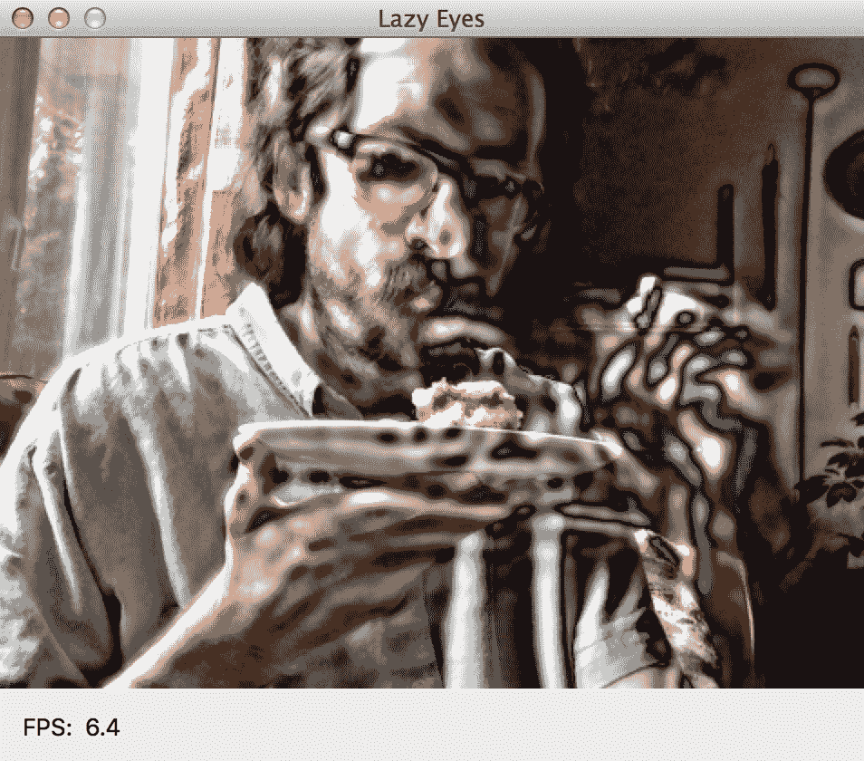
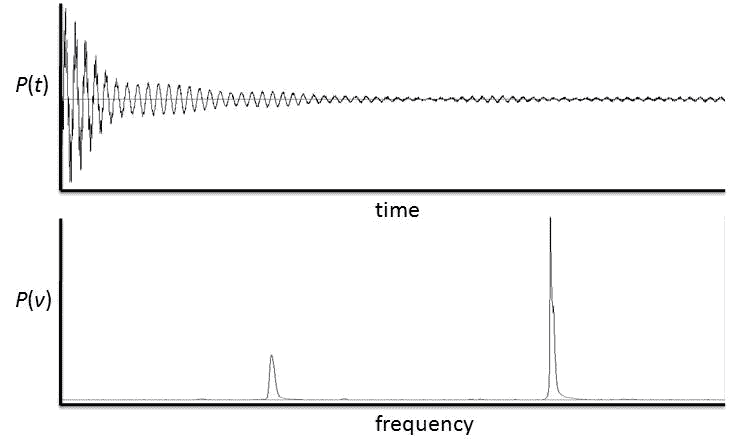
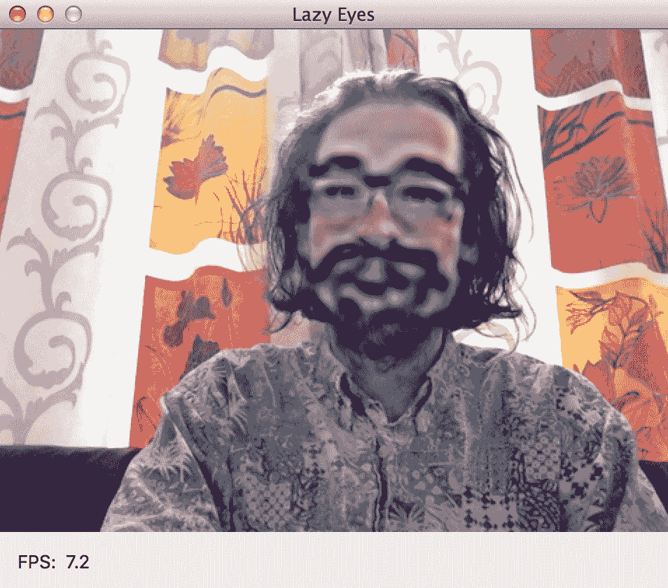
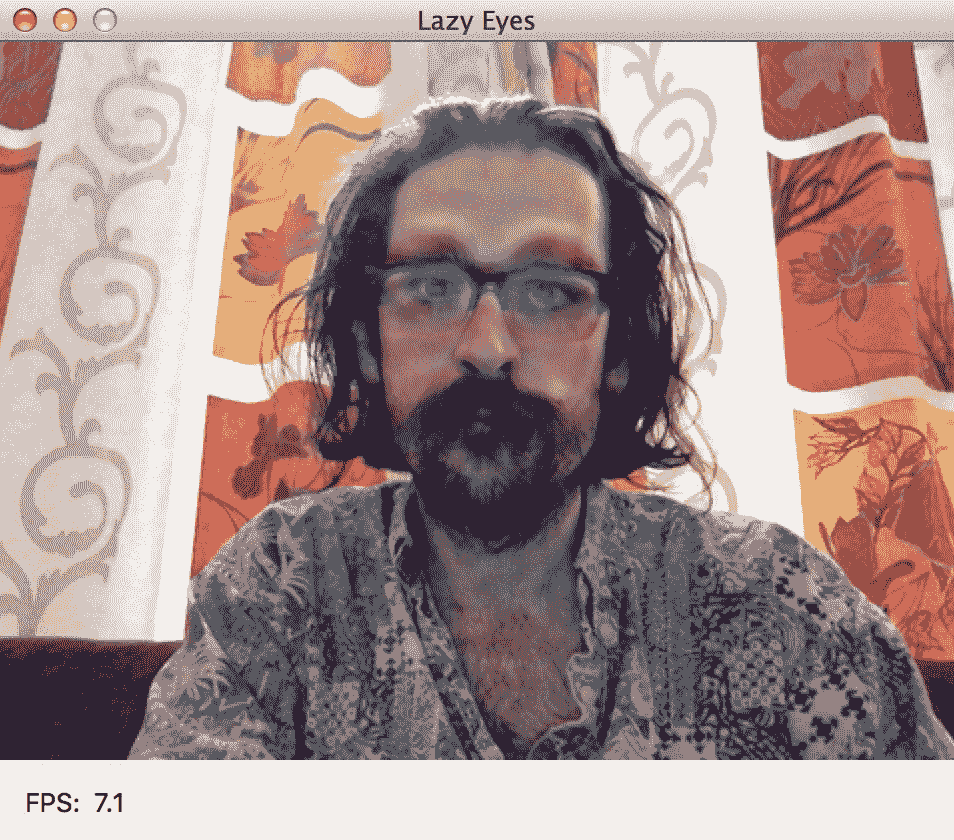
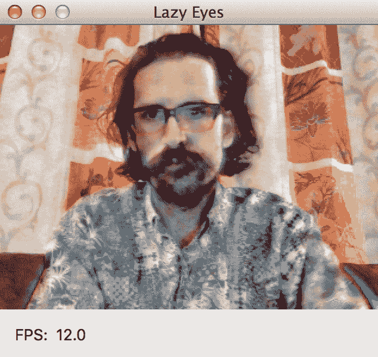
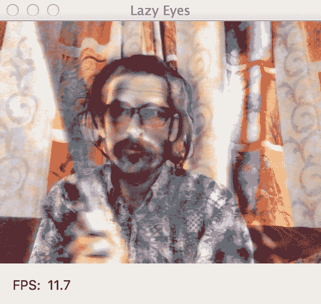
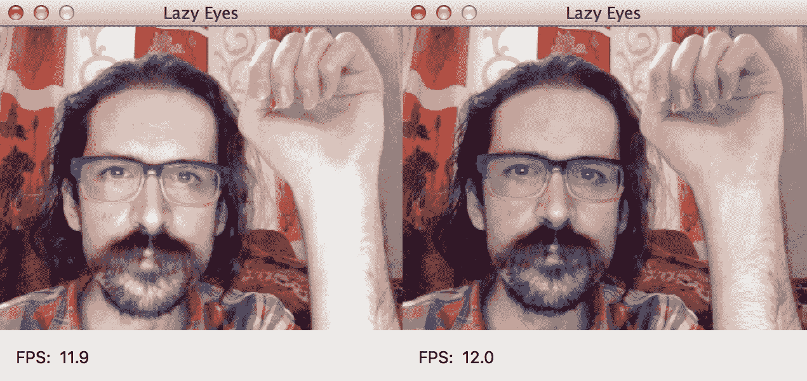

# 第七章：使用运动放大相机看到心跳

“移除所有与故事无关的东西。如果你在第一章中说墙上挂着一支枪，在第二章或第三章它绝对必须开火。如果它不会开火，它就不应该挂在那里。”

– 安东·契诃夫

“朱利安国王：我不知道为什么牺牲没有奏效。科学看起来是如此稳固。”

– 《马达加斯加：逃往非洲》（2008）

尽管它们的设计奇特，工程神秘，但 Q 的小玩意儿总是证明是有用和可靠的。邦德对这项技术如此有信心，以至于他甚至从未询问过如何充电。

在邦德系列电影中，更有创意的想法之一是，即使是一个装备轻的间谍也应该能够随时随地看到并拍摄隐藏的物体。让我们考虑一下电影中一些相关小工具的时间线，如下所示：

+   **1967（《你只能活两次》)**：X 光桌扫描客人以寻找隐藏的枪支。

+   **1979（《月亮上的火箭》)**：一个烟盒里含有一个用于揭示保险箱组合锁转轴的 X 光成像系统。

+   **1989（《杀手执照》)**：一台宝丽来相机拍摄 X 光照片。奇怪的是，它的闪光灯是一个可见的红激光。

+   **1995（《黄金眼》)**：一个茶盘里含有一个 X 光扫描仪，可以拍摄茶盘下的文件。

+   **1999（《世界末日》)**：邦德戴了一副时尚的蓝色镜片的太阳镜，可以穿透一层衣物看到隐藏的武器。根据《詹姆斯·邦德百科全书》（2007 年），这是一本官方的电影指南，眼镜在经过特殊处理后可以显示红外视频。尽管使用红外线，但它们通常被称为**X 光眼镜**，这是一个误称。

这些小玩意儿处理的是未知的可见光波长（或辐射），并且与机场安检仪和夜视镜等现实世界设备广泛可比。然而，解释邦德的设备为何如此紧凑，以及它如何在不同的光照条件下和通过不同的材料拍摄出如此清晰的图片仍然很困难。此外，如果邦德的设备是主动扫描仪（意味着它们会发射 X 射线辐射或红外光），它们将清楚地被使用类似硬件的其他间谍看到。

采用另一种方法，如果我们避免未知的可见光波长，而是专注于未知的运动频率呢？许多事物以我们难以轻易察觉的过快或过慢的节奏移动。假设有一个人站在一个地方。如果他的一条腿比另一条腿移动得多，也许他在移动更多的一侧隐藏着一个重物，比如一把枪。同样，我们也可能没有注意到偏离模式的偏差；假设同一个人一直在直视前方，但突然，当他认为没有人注意时，他的目光突然转向一侧。他在看某人吗？

我们可以通过重复某些频率的运动使其更加明显，就像延迟的视觉残留或幽灵一样，每次重复出现的亮度（或不透明度）都比上一次更弱。这种效果类似于回声或涟漪，并且是通过一种称为**欧拉视频放大**的算法实现的。

通过应用这项技术，我们将构建一个桌面应用程序，使我们能够同时看到现在的和过去选定的切片。对我来说，同时体验多个图像的想法相当自然，因为在我的前 26 年生活中，我患有**斜视**——通常被称为**懒眼**——这导致了我有双重视力。一位外科医生纠正了我的视力并给了我深度感知，但为了纪念斜视，我想将这个应用程序命名为 `Lazy Eyes`。

让我们更仔细地看看，或者看两眼或更多，我们与其他秘密特工共享的快节奏、动态的世界。

本章将涵盖以下主题：

+   理解欧拉视频放大能做什么

+   使用快速傅里叶变换从视频中提取重复的信号

+   使用图像金字塔合成两个图像

+   实现 Lazy Eyes 应用程序

+   配置和测试应用程序以支持各种运动

# 技术要求

本章的项目有以下软件依赖项：

+   **具有以下模块的 Python 环境**：OpenCV, NumPy, SciPy, PyFFTW, wxPython

如果没有特别说明，设置说明包含在第一章，*准备任务*中。PyFFTW 的设置说明包含在本章的*选择和设置 FFT 库*部分。始终参考设置说明以了解任何版本要求。运行 Python 代码的基本说明包含在附录 C，*与 Python 一起运行（或，Python 的第一步)*中。

本章的完整项目可以在本书的 GitHub 仓库中找到，[`github.com/PacktPublishing/OpenCV-4-for-Secret-Agents-Second-Edition`](https://github.com/PacktPublishing/OpenCV-4-for-Secret-Agents-Second-Edition)，在 `Chapter007` 文件夹中。

# 规划 Lazy Eyes 应用程序

在我们所有的应用中，`Lazy Eyes` 的用户界面最为简单。它只显示带有特殊效果的实时视频流，该效果突出显示运动。该效果参数相当复杂，而且，在运行时修改它们会对性能产生重大影响。因此，我们不提供用户界面来重新配置效果，但我们在代码中提供了许多参数，以便程序员创建效果和应用的多种变体。在视频面板下方，应用显示当前帧率，以每秒帧数（**FPS**）为单位。以下截图展示了应用的一种配置。这张截图显示我正在吃蛋糕。因为我的手和脸在动，所以我们看到一种类似光和暗波在移动边缘附近波动的效果（在实时视频中，这种效果比截图中的效果更加优雅）：



要获取更多截图和参数的深入讨论，请参阅本章后面的 *配置和测试应用以适应各种运动* 部分。

不论如何配置，应用都会循环执行以下操作：

1.  捕获一张图像。

1.  在应用模糊滤镜和可选的边缘检测滤镜的同时，复制并下采样图像。我们将使用所谓的**图像金字塔**进行下采样，这将在本章后面的 *使用图像金字塔合成两张图像* 部分讨论。下采样的目的是通过减少后续操作中使用的图像数据量来提高帧率。应用模糊滤镜和可选的边缘检测滤镜的目的是创建有助于放大运动的光晕。

1.  将下采样副本存储在带有时间戳的帧历史记录中。历史记录具有固定容量。一旦满载，最旧的帧将被覆盖，为新帧腾出空间。

1.  如果历史记录尚未满载，则继续循环的下一迭代。

1.  根据历史记录中帧的时间戳计算并显示平均帧率。

1.  将历史记录分解成描述每个像素处波动（运动）的频率列表。这个分解函数被称为**快速傅里叶变换**（**FFT**）。我们将在本章后面的 *使用快速傅里叶变换从视频中提取重复信号* 部分讨论它。

1.  将所有频率设置为零，除了一个感兴趣的频率范围。换句话说，过滤掉比某些阈值快或慢的运动数据。

1.  将过滤后的频率重新组合成一系列图像，这些图像是运动图。相对于我们选择的频率范围而言，静止区域变暗，而移动区域保持明亮。这个“重新组合”函数被称为**逆快速傅里叶变换**（**IFFT**），我们将在后面的章节中讨论。

1.  再次使用图像金字塔提升最新运动图的分辨率，增强其亮度，并将其以叠加方式覆盖在原始相机图像之上。

1.  展示结果合成图像。

就这样——一个需要相当细腻的实施和配置的简单计划。因此，考虑到这一点，让我们先做一些背景研究来做好准备。

# 理解欧拉视频放大的功能

欧拉视频放大是受到流体力学中一个称为**流场的欧拉规范**的模型的启发。让我们考虑一个移动的流体，比如一条河流。欧拉规范描述了河流在特定位置和时间的速度。在春天山区，速度会很快，而在冬天河流的入海口速度会慢。与河流表面撞击岩石并喷溅的点相比，河流底部淤泥饱和点的速度也会更慢。欧拉规范的另一种选择是**拉格朗日规范**，它描述了特定粒子在特定时间的位置。例如，一块特定的淤泥可能需要许多年才能从山区流到河流的入海口，然后在潮汐盆地漂泊数亿年。

对于欧拉规范、拉格朗日规范及其关系的更正式描述，请参考以下维基百科文章 [`en.wikipedia.org/wiki/Lagrangian_and_Eulerian_specification_of_the_flow_field`](http://en.wikipedia.org/wiki/Lagrangian_and_Eulerian_specification_of_the_flow_field)。

拉格朗日规范类似于许多计算机视觉任务，在这些任务中，我们模拟特定对象或特征随时间的变化。然而，欧拉规范类似于我们当前的任务，在这个任务中，我们模拟在特定位置和特定时间窗口内发生的任何运动。从欧拉视角模拟了运动后，我们可以通过叠加模型在不同位置和时间的输出来直观地夸大运动。

通过研究其他人的项目，我们可以为欧拉视频放大的预期设定一个基准，这些项目包括以下内容：

+   麻省理工学院迈克尔·鲁宾斯坦的网页（[`people.csail.mit.edu/mrub/vidmag/`](http://people.csail.mit.edu/mrub/vidmag/））：提供了他团队在欧拉视频放大方面的开创性工作的摘要，以及演示视频。

+   布赖斯·德雷南的欧拉放大库（[https://github.com/brycedrennan/eulerian-magnification](https://github.com/brycedrennan/eulerian-magnification)）：使用 NumPy、SciPy 和 OpenCV 实现算法。这个实现对我们来说是一个很好的灵感来源，但它是为处理预录制的视频而设计的，并且没有足够优化以适应实时输入。

现在，让我们继续前进，了解构成这些项目和我们的项目的基石——函数。

# 使用快速傅里叶变换从视频中提取重复信号

音频信号通常被可视化为一个条形图或波形。条形或波形在声音响亮时高，在声音柔和时低。我们认识到重复的声音，如节拍器的节拍，会在可视化中产生重复的峰值和谷值。当音频有多个通道（如立体声或环绕声录音）时，每个通道都可以被视为一个独立的信号，可以单独可视化为一个条形图或波形。

类似地，在视频中，每个像素的每个通道都可以被视为一个独立的信号，随时间上升和下降（变得更亮或更暗）。想象一下，我们使用一个静止的相机来捕捉节拍器的视频。在这种情况下，某些像素值将以固定的间隔上升和下降，因为它们捕捉节拍器针的移动。如果相机连接了一个麦克风，其信号值将以相同的间隔上升和下降。基于音频或视频，我们然后可以测量节拍器的频率——其**每分钟节拍数**（**bpm**）或其每秒节拍数（赫兹或 Hz）。相反，如果我们改变节拍器的 bpm 设置，对音频和视频的影响将是可预测的。从这个思想实验中，我们可以了解到一个信号——无论是音频、视频还是任何其他类型的信号——都可以表示为时间的函数，*等价地*，也可以表示为频率的函数。

考虑以下一对图表。它们以时间函数和频率函数的形式表达相同的信号。在时域内，我们看到一个宽的峰值和谷值（换句话说，一个渐变效果），跨越许多狭窄的峰值和谷值。在频域内，我们可以看到低频峰值和高频峰值，如下面的图所示：



从时域到频域的转换称为**傅里叶变换**（**FT**）。相反，从频域到时域的转换称为**逆傅里叶变换**。在数字世界中，信号是离散的，而不是连续的，所以我们使用**离散傅里叶变换**（**DFT**）和**逆离散傅里叶变换**（**IDFT**）这些术语。计算 DFT 或 IDFT 有多种高效的算法，这样的算法可能被描述为 FFT 或 IFFT。

对于算法描述，请参考以下维基百科文章：[快速傅里叶变换](http://en.wikipedia.org/wiki/Fast_Fourier_transform)。

FT（包括其离散变体）的结果是一个将频率映射到幅度和相位的函数。**幅度**表示频率对信号的贡献的大小。**相位**表示时间上的位移；它决定了频率的贡献是开始于高还是低。通常，幅度和相位被编码在一个复数中，`a+bi`，其中`幅度=sqrt(a²+b²)`和`相位=atan2(a, b)`。

关于复数的解释，请参阅以下维基百科文章：[`en.wikipedia.org/wiki/Complex_number`](http://en.wikipedia.org/wiki/Complex_number)。

FFT 和 IFFT 是计算机科学领域**数字信号处理**的基础。许多信号处理应用，包括`Lazy Eyes`，涉及获取信号的 FFT，修改或移除 FFT 结果中的某些频率，然后使用 IFFT 在时域中重建经过过滤的信号。例如，这种方法允许我们放大某些频率，同时保持其他频率不变。

现在，我们到哪里去找这个功能？

# 选择和设置 FFT 库

几个 Python 库提供了 FFT 和 IFFT 的实现，可以处理 NumPy 数组（因此也可以处理 OpenCV 图像）。以下五大主要竞争者如下：

+   *NumPy*，在名为`numpy.fft`的模块中提供了 FFT 和 IFFT 的实现（[`docs.scipy.org/doc/numpy/reference/routines.fft.html`](http://docs.scipy.org/doc/numpy/reference/routines.fft.html)）。该模块还提供了其他信号处理函数，用于处理 FFT 的输出。

+   *SciPy*，在名为`scipy.fftpack`的模块中提供了 FFT 和 IFFT 的实现（[`docs.scipy.org/doc/scipy/reference/fftpack.html`](http://docs.scipy.org/doc/scipy/reference/fftpack.html)）。这个 SciPy 模块与`numpy.fft`模块紧密相关，但增加了一些可选参数和基于输入格式的动态优化。SciPy 模块还增加了更多信号处理函数，用于处理 FFT 的输出。

+   *OpenCV*本身实现了 FFT（`cv2.dft`）和 IFFT（`cv2.idft`）。以下官方教程提供了示例，并与 NumPy 的 FFT 实现进行了比较：[`docs.opencv.org/master/d8/d01/tutorial_discrete_fourier_transform.html`](https://docs.opencv.org/master/d8/d01/tutorial_discrete_fourier_transform.html)。请注意，OpenCV 的 FFT 和 IFFT 接口不能直接与`numpy.fft`和`scipy.fftpack`模块互操作，后者提供了更广泛的信号处理功能。（它们的数据格式非常不同。）

+   *PyFFTW* ([`hgomersall.github.io/pyFFTW/`](https://hgomersall.github.io/pyFFTW/))，这是一个围绕名为 **Fastest Fourier Transform in the West** (**FFTW**) 的 C 库的 Python 包装器 ([`www.fftw.org/`](http://www.fftw.org/))。FFTW 提供了 FFT 和 IFFT 的多个实现。在运行时，它动态选择针对给定输入格式、输出格式和系统能力进行了优化的实现。可选地，它利用多线程（其线程可能运行在多个 CPU 核心上，因为实现释放了 Python 的 **Global Interpreter Lock** (**GIL**)）。PyFFTW 提供了与 NumPy 和 SciPy 的 FFT 和 IFFT 函数相匹配的可选接口。这些接口具有低开销成本（归功于 PyFFTW 提供的良好缓存选项），并且有助于确保 PyFFTW 与 `numpy.fft` 和 `scipy.fftpack` 中实现的广泛信号处理功能兼容。

+   *Reinka* ([`reikna.publicfields.net/en/latest/`](http://reikna.publicfields.net/en/latest/))，这是一个用于 GPU 加速计算的 Python 库，它使用 PyCUDA ([`mathema.tician.de/software/pycuda/`](http://mathema.tician.de/software/pycuda/)) 或 PyOpenCL ([`mathema.tician.de/software/pyopencl/`](http://mathema.tician.de/software/pyopencl/)) 作为后端。Reinka 提供了一个名为 `reikna.fft` 的模块，其中实现了 FFT 和 IFFT。Reinka 内部使用 PyCUDA 或 PyOpenCL 数组（而不是 NumPy 数组），并提供从 NumPy 数组到这些 GPU 数组的转换接口以及反向转换。转换后的 NumPy 输出与 `numpy.fft` 和 `scipy.fftpack` 中实现的其它信号处理功能兼容。然而，这种兼容性需要以高昂的开销为代价，因为需要锁定、读取和转换 GPU 内存的内容。

NumPy、SciPy、OpenCV 和 PyFFTW 都是在 BSD 许可下的开源库。Reinka 是在 MIT 许可下的开源库。

我推荐 PyFFTW，因为它进行了优化，具有低开销的互操作性，以及 NumPy、SciPy 和 OpenCV 中所有其他吸引我们的功能。要了解 PyFFTW 的功能，包括其与 NumPy 和 SciPy 兼容的接口，请参阅官方教程[`hgomersall.github.io/pyFFTW/sphinx/tutorial.html`](https://hgomersall.github.io/pyFFTW/sphinx/tutorial.html)。

根据我们的平台，我们可以以下列方式之一设置 PyFFTW：

+   在 Mac 上，第三方 MacPorts 包管理器为某些 Python 版本提供了 PyFFTW 包，目前包括 Python 3.6，但不包括 Python 3.7。要使用 MacPorts 安装 PyFFTW，请打开终端并运行以下类似命令（但如果你使用的 Python 版本与 `py36` 不同，请替换你的 Python 版本）：

```py
$ sudo port install py36-pyfftw
```

+   或者，在任意系统上，使用 Python 的包管理器 pip 来安装 PyFFTW。打开命令提示符并运行以下类似命令（根据您的系统，您可能需要将`pip`替换为`pip3`以安装 Python 3 的 PyFFTW）：

```py
$ pip install --user pyFFTW
```

pip 的`pyFFTW`包的一些版本存在安装错误，这会影响某些系统。如果`pip`无法安装`pyFFTW`包，请重试，但手动指定包的 10.4 版本，运行以下命令：

```py
$ pip install --user pyFFTW==0.10.4
```

注意，一些旧版本的库被称为`PyFFTW3`。我们不希望使用`PyFFTW3`。在 Ubuntu 18.04 及其衍生版本中，系统标准 apt 仓库中的`python-fftw`包是旧的`PyFFTW3`版本。

我们已经通过西方最快的傅里叶变换（FFT 和 IFFT）来满足我们的需求（如果我们是牛仔而不是秘密特工，我们可以说，*掩护我!*）。对于额外的信号处理功能，我们将使用 SciPy，它可以通过我们在第一章中描述的方式设置，即在*设置开发机器*部分。

对于 Lazy Eyes，我们不仅要学习信号处理的新材料，还要了解 OpenCV 提供的其他功能。

# 使用图像金字塔合成两个图像

在全分辨率视频流上运行 FFT 会很慢。结果频率可能还会反映每个捕获像素的局部现象，因此运动图（过滤频率后应用 IFFT 的结果）可能会出现噪声和过于尖锐。为了解决这些问题，我们需要一种便宜、模糊的下采样技术。然而，我们还想有增强边缘的选项，这对我们感知运动很重要。

我们对模糊下采样技术的需求通过**高斯图像金字塔**得到满足。**高斯滤波器**通过将每个输出像素设置为邻域内多个输入像素的加权平均值来模糊图像。图像金字塔是一系列图像，其中每个图像是前一个图像宽度和高度的一部分。通常，这个比例是二分之一。通过*降采样*实现图像尺寸的二分之一，这意味着简单地省略了每个像素。高斯图像金字塔是通过在每个降采样操作之前应用高斯滤波器来构建的。

我们在降采样图像中增强边缘的需求通过一个**拉普拉斯图像金字塔**得到满足，其构建方式如下。假设我们已构建了一个高斯图像金字塔。我们从高斯金字塔中取出`i+1`层的图像，通过复制像素进行上采样，并再次应用高斯滤波器。然后我们从高斯金字塔中`i`层的图像中减去这个结果，以产生拉普拉斯金字塔中`i`层的对应图像。因此，拉普拉斯图像是模糊的降采样图像与一个更模糊的图像之间的差异，这个图像经过降采样、再次降采样并上采样。

你可能会想知道这样的算法是如何成为边缘检测的一种形式的。考虑一下，边缘是局部对比度的区域，而非边缘是局部均匀性的区域。如果我们模糊一个均匀的区域，它仍然是均匀的——没有差异。然而，如果我们模糊一个对比度区域，它就会变得更加均匀——存在非零差异。因此，差异可以用来找到边缘。

高斯和拉普拉斯图像金字塔在以下期刊文章中有详细描述：E. H. Adelson, C. H. Anderson, J. R. Bergen, P. J. Burt, and J. M. Ogden. "图像处理中的金字塔方法"。RCA Engineer, Vol. 29, No. 6, November/December 1984。可以从[`persci.mit.edu/pub_pdfs/RCA84.pdf`](http://persci.mit.edu/pub_pdfs/RCA84.pdf)下载。

除了使用图像金字塔来降采样 FFT 的输入外，我们还可以使用它们来上采样 IFFT 输出的最新帧。这一上采样步骤对于创建与原始相机图像大小匹配的叠加层是必要的，这样我们就可以合成两个图像。就像在构建拉普拉斯金字塔时一样，上采样包括复制像素和应用高斯滤波器。

OpenCV 实现了相关的降采样和上采样函数，分别是`cv2.pyrDown`和`cv2.pyrUp`。这些函数在合成两个图像时非常有用（无论是否涉及信号处理），因为它们允许我们在保留边缘的同时软化差异。OpenCV 文档中包含了一个关于这个主题的优秀教程，链接为[`docs.opencv.org/master/dc/dff/tutorial_py_pyramids.html`](https://docs.opencv.org/master/dc/dff/tutorial_py_pyramids.html)。

现在我们已经掌握了必要的知识，是时候实现 Lazy Eyes 了！

# 实现 Lazy Eyes 应用程序

让我们为 Lazy Eyes 创建一个新的文件夹，并在该文件夹中创建从我们之前的 Python 项目（例如第五章中的`The Living Headlights`）中的`ResizeUtils.py`和`WxUtils.py`文件的副本或链接，例如`Equipping Your Car with a Rearview Camera and Hazard Detection`。在副本或链接旁边，让我们创建一个新的文件，`LazyEyes.py`。编辑它并输入以下`import`语句：

```py
import collections
import threading
import timeit

import numpy
import cv2
import wx

import pyfftw.interfaces.cache
from pyfftw.interfaces.scipy_fftpack import fft
from pyfftw.interfaces.scipy_fftpack import ifft
from scipy.fftpack import fftfreq

import ResizeUtils
import WxUtils
```

除了我们在以前的项目中使用过的模块外，我们现在还使用标准库的 `collections` 模块来高效地收集数据，以及 `timeit` 模块来进行精确的时间测量。第一次，我们还使用了 PyFFTW 和 SciPy 的信号处理功能。

与我们的其他 Python 应用程序一样，`Lazy Eyes` 是作为一个扩展 `wx.Frame` 的类实现的。以下代码块包含了类的声明及其初始化器：

```py
class LazyEyes(wx.Frame):

    def __init__(self, maxHistoryLength=360,
                 minHz=5.0/6.0, maxHz=1.0,
                 amplification=32.0, numPyramidLevels=2,
                 useLaplacianPyramid=True,
                 useGrayOverlay=True,
                 numFFTThreads=4, numIFFTThreads=4,
                 cameraDeviceID=0, imageSize=(640, 480),
                 title='Lazy Eyes'):
```

初始化器的参数会影响应用程序的帧率和运动放大的方式。这些效果将在本章后面的 *配置和测试应用程序以适应各种运动* 部分详细讨论。以下只是对参数的简要描述：

+   `maxHistoryLength` 是分析运动所用的帧数（包括当前帧和前面的帧）。

+   `minHz` 和 `maxHz` 分别定义了被放大的最慢和最快的运动。

+   `amplification` 是视觉效果的比例。值越高，运动越明亮地被突出显示。

+   `numPyramidLevels` 是在信号处理之前对帧进行下采样的金字塔层数。每一层对应于以 `2` 为因子的下采样。我们的实现假设 `numPyramidLevels>0`。

+   如果 `useLaplacianPyramid` 为 `True`，则在信号处理之前使用拉普拉斯金字塔对帧进行下采样。这意味着只有边缘运动被突出显示。如果 `useLaplacianPyramid` 为 `False`，则使用高斯金字塔，并且所有区域的运动都被突出显示。

+   如果 `useGrayOverlay` 为 `True`，则在信号处理之前将帧转换为灰度。这意味着只有在灰度对比度区域才会突出显示运动。如果 `useGrayOverlay` 为 `False`，则在任何颜色通道有对比度的区域突出显示运动。

+   `numFFTThreads` 和 `numIFFTThreads` 分别是用于 FFT 和 IFFT 计算的线程数。

+   `cameraDeviceID` 和 `imageSize` 是我们常用的捕获参数。

初始化器的实现方式与我们的其他 Python 应用程序相同。它设置标志以指示应用程序正在运行并且默认应该被镜像。它创建捕获对象并配置其分辨率以匹配请求的宽度和高度，如果可能的话。如果失败，则使用设备的备用捕获分辨率。初始化器还声明了用于存储图像的变量，并创建了一个锁来管理对图像的线程安全访问。相关代码如下：

```py
        self.mirrored = True

        self._running = True

        self._capture = cv2.VideoCapture(cameraDeviceID)
        size = ResizeUtils.cvResizeCapture(
                self._capture, imageSize)
        w, h = size

        self._image = None

        self._imageFrontBuffer = None
        self._imageFrontBufferLock = threading.Lock()
```

接下来，我们需要确定帧历史记录的形状。我们已经知道它至少有三个维度——帧的数量，以及每帧的宽度和高度。宽度和高度基于金字塔层级数从捕获宽度和高度下采样。如果我们关心颜色运动，而不仅仅是灰度运动，历史记录还有一个第四维，由三个颜色通道组成。以下代码计算历史记录的形状：

```py
        self._useGrayOverlay = useGrayOverlay
        if useGrayOverlay:
            historyShape = (maxHistoryLength,
                            h >> numPyramidLevels,
                            w >> numPyramidLevels)
        else:
            historyShape = (maxHistoryLength,
                            h >> numPyramidLevels,
                            w >> numPyramidLevels, 3)
```

注意前述代码中`>>`的使用，这是右移位运算符，用于将维度除以 2 的幂。这个幂等于金字塔层级数。

现在，我们需要存储指定的最大历史长度。对于历史记录中的帧，我们将创建一个形状与我们刚刚确定的 NumPy 数组。对于帧的时间戳，我们将创建一个**双端队列**（**deque**），这是一种允许我们以低成本从两端添加或删除元素的集合类型，如下所示：

```py
        self._maxHistoryLength = maxHistoryLength
        self._history = numpy.empty(historyShape,
                                    numpy.float32)
        self._historyTimestamps = collections.deque() 
```

我们将存储剩余的参数，因为我们将在稍后为每个帧将它们传递给金字塔函数和信号处理函数，如下所示：

```py
        self._numPyramidLevels = numPyramidLevels
        self._useLaplacianPyramid = useLaplacianPyramid

        self._minHz = minHz
        self._maxHz = maxHz
        self._amplification = amplification

        self._numFFTThreads = numFFTThreads
        self._numIFFTThreads = numIFFTThreads
```

为了确保有意义的错误消息和在无效参数的情况下提前终止，我们可以在每个参数上添加如下代码：

`assert numPyramidLevels > 0, \`

`        'numPyramidLevels must be positive.'`

为了简洁，我们在代码示例中省略了此类断言。

现在，我们需要调用以下两个函数来告诉 PyFFTW 缓存其数据结构（特别是其 NumPy 数组）至少 1.0 秒（默认为 0.1 秒）的时间。对于 PyFFTW 接口，这是一个关键的优化，因此我们将选择一个足够长的时间段，以确保从一帧到另一帧缓存保持活跃，如下所示：

```py
        pyfftw.interfaces.cache.enable()
        pyfftw.interfaces.cache.set_keepalive_time(1.0)
```

如以下代码所示，初始化器的实现以设置窗口、事件绑定、视频面板、布局和后台线程的代码结束，这些都是我们之前 Python 项目中的熟悉任务：

```py
        style = wx.CLOSE_BOX | wx.MINIMIZE_BOX | \
                wx.CAPTION | wx.SYSTEM_MENU | \
                wx.CLIP_CHILDREN
        wx.Frame.__init__(self, None, title=title,
                          style=style, size=size)

        self.Bind(wx.EVT_CLOSE, self._onCloseWindow)

        quitCommandID = wx.NewId()
        self.Bind(wx.EVT_MENU, self._onQuitCommand,
                  id=quitCommandID)
        acceleratorTable = wx.AcceleratorTable([
            (wx.ACCEL_NORMAL, wx.WXK_ESCAPE,
             quitCommandID)
        ])
        self.SetAcceleratorTable(acceleratorTable)

        self._videoPanel = wx.Panel(self, size=size)
        self._videoPanel.Bind(
                wx.EVT_ERASE_BACKGROUND,
                self._onVideoPanelEraseBackground)
        self._videoPanel.Bind(
                wx.EVT_PAINT, self._onVideoPanelPaint)

        self._videoBitmap = None

        self._fpsStaticText = wx.StaticText(self)

        border = 12

        controlsSizer = wx.BoxSizer(wx.HORIZONTAL)
        controlsSizer.Add(self._fpsStaticText, 0,
                          wx.ALIGN_CENTER_VERTICAL)

        rootSizer = wx.BoxSizer(wx.VERTICAL)
        rootSizer.Add(self._videoPanel)
        rootSizer.Add(controlsSizer, 0,
                      wx.EXPAND | wx.ALL, border)
        self.SetSizerAndFit(rootSizer)

        self._captureThread = threading.Thread(
                target=self._runCaptureLoop)
        self._captureThread.start()
```

现在，我们必须修改我们常用的`_onCloseWindow`回调以禁用 PyFFTW 的缓存。禁用缓存确保资源被释放，PyFFTW 的线程正常终止。回调的实现如下所示：

```py
    def _onCloseWindow(self, event):
        self._running = False
        self._captureThread.join()
        pyfftw.interfaces.cache.disable()
        self.Destroy()
```

逃逸键绑定到我们常用的`_onQuitCommand`回调，它只是关闭应用程序，如下所示：

```py
    def _onQuitCommand(self, event):
        self.Close() 
```

视频面板的擦除和绘制事件绑定到我们常用的回调，`_onVideoPanelEraseBackground`和`_onVideoPanelPaint`，如下所示：

```py
    def _onVideoPanelEraseBackground(self, event):
        pass

    def _onVideoPanelPaint(self, event):

        self._imageFrontBufferLock.acquire()

        if self._imageFrontBuffer is None:
            self._imageFrontBufferLock.release()
            return

        # Convert the image to bitmap format.
        self._videoBitmap = \
            WxUtils.wxBitmapFromCvImage(self._imageFrontBuffer)

        self._imageFrontBufferLock.release()

        # Show the bitmap.
        dc = wx.BufferedPaintDC(self._videoPanel)
        dc.DrawBitmap(self._videoBitmap, 0, 0)
```

在我们的后台线程上运行的循环与在其他 Python 应用程序中使用的循环类似。对于每一帧，它调用一个辅助函数`_applyEulerianVideoMagnification`。循环的实现如下：

```py
    def _runCaptureLoop(self):

        while self._running:
            success, self._image = self._capture.read(
                    self._image)
            if self._image is not None:
                self._applyEulerianVideoMagnification()
                if (self.mirrored):
                    self._image[:] = numpy.fliplr(self._image)

                # Perform a thread-safe swap of the front and
                # back image buffers.
                self._imageFrontBufferLock.acquire()
                self._imageFrontBuffer, self._image = \
                        self._image, self._imageFrontBuffer
                self._imageFrontBufferLock.release()

                # Send a refresh event to the video panel so
                # that it will draw the image from the front
                # buffer.
                self._videoPanel.Refresh()
```

`_applyEulerianVideoMagnification`辅助函数相当长，所以我们将将其实现分成几个部分。首先，我们需要为帧创建一个时间戳并将帧复制到一个更适合处理的格式。具体来说，我们将使用一个浮点数，它有一个灰度通道或三个颜色通道，具体取决于配置，如下面的代码所示：

```py
    def _applyEulerianVideoMagnification(self):

        timestamp = timeit.default_timer()

        if self._useGrayOverlay:
            smallImage = cv2.cvtColor(
                    self._image, cv2.COLOR_BGR2GRAY).astype(
                            numpy.float32)
        else:
            smallImage = self._image.astype(numpy.float32)
```

使用这个副本，我们将计算高斯或拉普拉斯金字塔的适当级别，如下所示：

```py
        # Downsample the image using a pyramid technique.
        i = 0
        while i < self._numPyramidLevels:
            smallImage = cv2.pyrDown(smallImage)
            i += 1
        if self._useLaplacianPyramid:
            smallImage[:] -= \
                cv2.pyrUp(cv2.pyrDown(smallImage))
```

对于历史和信号处理函数的目的，我们将把这个金字塔级别称为*图像*或*帧*。

接下来，我们需要检查到目前为止已填充的历史帧数。如果历史中有多于一个未填充的帧（这意味着在添加帧后历史仍然不会满），我们将在返回之前追加并标记新的图像，这样就不会在后续帧上进行信号处理。这可以在下面的代码中看到：

```py
        historyLength = len(self._historyTimestamps)

        if historyLength < self._maxHistoryLength - 1:

            # Append the new image and timestamp to the
            # history.
            self._history[historyLength] = smallImage
            self._historyTimestamps.append(timestamp)

            # The history is still not full, so wait.
            return
```

如果历史只差一帧就满了（这意味着在添加这一帧后历史将满），我们将追加新的图像和时间戳，如下所示：

```py
        if historyLength == self._maxHistoryLength - 1:
            # Append the new image and timestamp to the
            # history.
            self._history[historyLength] = smallImage
            self._historyTimestamps.append(timestamp)
```

如果历史已经满了，我们将删除最旧的图像和时间戳，并追加新的图像和时间戳，如下所示：

```py
        else:
            # Drop the oldest image and timestamp from the
            # history and append the new ones.
            self._history[:-1] = self._history[1:]
            self._historyTimestamps.popleft()
            self._history[-1] = smallImage
            self._historyTimestamps.append(timestamp)

        # The history is full, so process it.
```

图像数据的历史是一个 NumPy 数组，因此我们在这里松散地使用“追加”和“删除”这两个术语。NumPy 数组是不可变的，这意味着它们不能增长或缩小。此外，我们并不是因为数组很大而重新创建这个数组，因为为每一帧重新分配内存会非常昂贵。相反，我们只是通过将旧数据向左移动并复制新数据到数组中来覆盖数组内的数据。

根据时间戳，我们将计算历史中每帧的平均时间，并将显示帧率，如下面的代码所示：

```py
        # Find the average length of time per frame.
        startTime = self._historyTimestamps[0]
        endTime = self._historyTimestamps[-1]
        timeElapsed = endTime - startTime
        timePerFrame = \
                timeElapsed / self._maxHistoryLength
        fps = 1.0 / timePerFrame
        wx.CallAfter(self._fpsStaticText.SetLabel,
                     'FPS: %.1f' % fps)
```

然后，我们将进行一系列信号处理函数的组合，统称为**时域带通滤波器**。这个滤波器阻止（置零）一些频率，允许其他频率通过并保持不变。在实现此滤波器的第一步中，我们将使用历史和线程数作为参数运行`pyfftw.interfaces.scipy_fftpack.fft`函数。此外，使用`axis=0`参数，我们将指定历史的第一轴是时间轴，如下所示：

```py
        # Apply the temporal bandpass filter.
        fftResult = fft(self._history, axis=0,
                        threads=self._numFFTThreads)
```

我们将 FFT 结果和每帧时间传递给`scipy.fftpack.fftfreq`函数。然后，该函数将返回一个对应于 FFT 结果中索引的中点频率数组（在我们的情况下是 Hz）。（这个数组回答了问题：“哪个频率是索引`i`表示的频率桶的中点？”）然后，我们将找到中点频率最接近初始化器的`minHz`和`maxHz`参数（绝对值差异最小）的索引。然后，我们将通过将所有不表示感兴趣频率范围的数据设置为零来修改 FFT 结果，如下所示：

```py
        frequencies = fftfreq(
                self._maxHistoryLength, d=timePerFrame)
        lowBound = (numpy.abs(
                frequencies - self._minHz)).argmin()
        highBound = (numpy.abs(
                frequencies - self._maxHz)).argmin()
        fftResult[:lowBound] = 0j
        fftResult[highBound:-highBound] = 0j
        fftResult[-lowBound:] = 0j
```

FFT 结果是对称的——`fftResult[i]`和`fftResult[-i-1]`属于相同的频率桶。因此，我们对称地修改 FFT 结果。

记住，傅里叶变换将一个频率映射到一个复数，该复数编码了振幅和相位。因此，虽然 FFT 结果的索引对应于频率，但那些索引处的值是复数。Python 中将零作为复数写作`0+0j`或`0j`。

在过滤掉我们不感兴趣的频率后，我们现在将应用时间带通滤波器的最后一步，通过将数据传递给`pyfftw.interfaces.scipy_fftpack.ifft`函数，如下所示：

```py
        ifftResult = ifft(fftResult, axis=0,
                          threads=self._numIFFTThreads) 
```

从 IFFT 结果中，我们将取最新的帧。它应该在一定程度上类似于当前相机帧，但在不显示与我们的参数匹配的最近运动区域应该是黑色的。我们将乘以这个过滤帧，使非黑色区域变亮。然后，我们将使用金字塔技术对其进行上采样，并将结果添加到当前相机帧中，以便在运动区域点亮。完成`_applyEulerianVideoMagnification`方法的代码如下：

```py
        # Amplify the result and overlay it on the
        # original image.
        overlay = numpy.real(ifftResult[-1]) * \
                          self._amplification
        i = 0
        while i < self._numPyramidLevels:
            overlay = cv2.pyrUp(overlay)
            i += 1
        if self._useGrayOverlay:
            overlay = cv2.cvtColor(overlay,
                                   cv2.COLOR_GRAY2BGR)
        cv2.add(self._image, overlay, self._image,
                dtype=cv2.CV_8U)
```

这就完成了`LazyEyes`类的实现。我们的模块的`main`函数只是实例化和运行应用程序，如下面的代码所示：

```py
def main():
    app = wx.App()
    lazyEyes = LazyEyes()
    lazyEyes.Show()
    app.MainLoop()

if __name__ == '__main__':
    main() 
```

那就结束了！现在，是时候运行应用程序，并在它建立其帧历史记录时保持静止。直到历史记录填满，视频流将不会显示任何特殊效果。在历史记录的默认长度为 360 帧时，它在机器上大约填充了 50 秒。一旦填满，你应该开始看到视频流中最近运动区域出现波纹——或者如果相机移动或光线或曝光发生变化，可能甚至无处不在。然后，波纹应该逐渐在场景中静止的区域消失，在新运动区域出现新的波纹。请随意自行实验。现在，让我们讨论一些配置和测试`LazyEyes`类参数的配方。

# 配置和测试应用程序以处理各种运动

目前，我们的`main`函数使用默认参数初始化`LazyEyes`对象。如果我们显式地填充相同的参数值，我们将有如下语句：

```py
    lazyEyes = LazyEyes(maxHistoryLength=360,
                        minHz=5.0/6.0, maxHz=1.0,
                        amplification=32.0,
                        numPyramidLevels=2,
                        useLaplacianPyramid=True,
                        useGrayOverlay=True,
                        numFFTThreads=4,
                        numIFFTThreads=4,
                        imageSize=(640, 480))
```

此配方需要捕获分辨率为*640 x 480*和信号处理分辨率为*160 x 120*（因为我们通过`2`个金字塔级别进行下采样，或`4`的因子）。我们只在 0.833 Hz 到 1.0 Hz 的频率上放大运动，只在边缘（因为我们使用拉普拉斯金字塔），只在灰度上，并且只在 360 帧的历史记录中（大约 20 到 40 秒，取决于帧率）。运动被放大了`32`倍。这些设置适用于许多微妙的上半身运动，例如一个人的头部左右摇摆，肩膀随着呼吸起伏，鼻孔扩张，眉毛上下移动，以及眼睛的来回扫描。为了性能，FFT 和 IFFT 各自使用`4`个线程。

应用程序使用默认参数运行时的外观在以下截图中显示。在截图之前，我微笑了一下，然后恢复了正常表情。请注意，我的眉毛和胡须在多个位置可见，包括它们当前的低位置和之前的高位置。为了在静态图像中捕捉运动放大效果，这个手势被夸张了。然而，在移动视频中，我们也可以看到更微妙运动的放大：



以下截图展示了这样一个例子，我的眉毛在抬起后又放下后显得更高：



参数以复杂的方式相互作用。考虑以下关系：

+   帧率受到 FFT 和 IFFT 函数输入数据大小的极大影响。输入数据的大小由`maxHistoryLength`（较短的长度提供较少的输入，因此帧率更快）、`numPyramidLevels`（更多级别意味着较少的输入）、`useGrayOverlay`（`True`意味着较少的输入）和`imageSize`（较小的尺寸意味着较少的输入）决定。

+   帧率也受到 FFT 和 IFFT 函数多线程级别的极大影响，由`numFFTThreads`和`numIFFTThreads`确定（线程数量越多，速度越快，但达到某个点后速度会减慢）。

+   帧率稍微受到`useLaplacianPyramid`（`False`意味着帧率更快）的影响，因为拉普拉斯算法需要比高斯算法更多的步骤。

+   帧率决定了`maxHistoryLength`代表的时间量。

+   帧率和`maxHistoryLength`决定了在`minHz`到`maxHz`范围内可以捕获多少次运动（如果有）。捕获的重复次数，加上`amplification`，决定了运动或运动偏差将被放大多少。

+   噪声的包含或排除受`minHz`和`maxHz`（取决于哪些频率的噪声是摄像机的特征）的影响，`numPyramidLevels`（更多级别意味着图像噪声更少），`useLaplacianPyramid`（`True`意味着噪声更少），`useGrayOverlay`（`True`意味着噪声更少），以及`imageSize`（较小的尺寸意味着图像噪声更少）。

+   运动的包含或排除受`numPyramidLevels`（较少意味着对小运动的放大更全面）的影响，`useLaplacianPyramid`（`False`意味着非边缘区域中的运动更全面），`useGrayOverlay`（`False`意味着在颜色对比区域中的运动更全面），`minHz`（较低的值意味着对慢动作更全面），`maxHz`（较高的值意味着对快动作更全面），以及`imageSize`（较大的尺寸意味着对小运动更全面）。

+   主观上，当帧率高、噪声被排除、小运动被包含时，视觉效果总是更令人印象深刻。再次主观上，其他包含或排除运动的条件（边缘与非边缘、灰度对比与颜色对比、或快与慢）都是应用相关的。

现在，让我们尝试重新配置`Lazy Eyes`，从`numFFTThreads`和`numIFFTThreads`参数开始。我们想要确定在特定机器上最大化 Lazy Eyes 帧率的线程数量。CPU 核心越多，可以有效地使用的线程就越多。然而，实验是选择数字的最佳指南。

运行`LazyEyes.py`。一旦历史记录填满，窗口左下角将显示历史记录的平均 FPS。等待这个平均 FPS 值稳定。平均 FPS 可能需要一分钟才能调整到 FFT 和 IFFT 函数的影响。注意 FPS 值，关闭应用程序，调整线程计数参数，并再次测试。重复这些步骤，直到您觉得有足够的数据来选择在相关硬件上使用的线程数量。

通过激活额外的 CPU 核心，多线程可能会导致您的系统温度升高。在实验过程中，请监控机器的温度、风扇和 CPU 使用统计信息。如果您感到担忧，请减少 FFT 和 IFFT 线程的数量。拥有一个次优的帧率比让机器过热要好。

现在，尝试调整其他参数以观察它们对 FPS 的影响；`numPyramidLevels`、`useGrayOverlay`和`imageSize`参数都应该有相当大的影响。在约 12 FPS 的阈值下，一系列帧开始看起来像连续运动而不是*幻灯片*。帧率越高，运动看起来越平滑。传统上，手绘动画电影在大多数场景中以每秒 12 幅画面的速度运行，在快速动作中以每秒 24 幅画面的速度运行。

除了软件参数外，外部因素也会极大地影响帧率。例如，包括相机参数、镜头参数和场景的亮度。

让我们尝试另一个食谱。与我们的默认食谱强调具有高灰度对比度的边缘运动不同，这个下一个食谱强调所有区域（边缘或非边缘）的运动，无论是高颜色还是灰度对比度。通过考虑三个颜色通道而不是一个灰度通道，我们将 FFT 和 IFFT 处理的数据量增加了三倍。为了抵消这种变化，我们需要将捕获分辨率的每个维度减半到其默认值的一半，从而将数据量减少到默认量的 1/2 * 1/2 = 1/4 倍。作为一个净变化，FFT 和 IFFT 处理的数据量减少了 3/4 倍，这是一个小的减少。以下初始化语句显示了我们的新食谱的参数：

```py
    lazyEyes = LazyEyes(useLaplacianPyramid=False,
                        useGrayOverlay=False,
                        imageSize=(320, 240)) 
```

注意，我们仍在使用大多数参数的默认值。如果您在您的机器上找到了对`numFFTThreads`和`numIFFTThreads`有效的非默认值，请也输入它们。

以下截图显示了我们的新食谱的效果。我们先来看一个非极端的例子。这张截图是在我打字时拍摄的。注意我手臂周围的晕影，当我打字时手臂移动很多，以及我左脸颊（在这面镜像图中是您的左边）的轻微扭曲和变色。当我思考时，我的左脸颊会轻微抽搐。显然，这是我朋友和家人已经知道的习惯性动作，但我在计算机视觉的帮助下重新发现了它：



如果您正在查看电子书中的此图像的彩色版本，您应该会看到我手臂周围的晕影从衬衫中吸收了绿色调，从沙发上吸收了红色调。同样，我脸颊上的晕影从我的皮肤中吸收了洋红色调，从我的头发中吸收了棕色调。

现在，让我们考虑一个更富有想象力的例子。如果我们是绝地武士而不是秘密特工，我们可能会在空中挥舞一把钢尺，假装它是光剑。在测试“懒眼”能否让钢尺看起来像真正的光剑的理论时，我拍了以下这张截图。这张截图显示了我在挥舞光剑尺时两个地方的两对明暗线条。其中一对线条穿过我的每个肩膀。光明面（亮线）和黑暗面（暗线）显示了钢尺移动时的相反端点。在电子书的彩色版本中，线条特别清晰：



最后，我们一直等待的时刻——放大心跳的菜谱！如果你有心率监测器，请先测量你的心率。当我写这些话并听加拿大民谣歌手 Stan Rogers 的鼓舞人心的民谣时，我的心率大约是 87 **每分钟跳动**（**bpm**）。要将 bpm 转换为 Hz，将 bpm 值除以 60（每分钟的秒数），在我的情况下，(87 / 60) Hz = 1.45 Hz。心跳最明显的影响是，当血液通过一个区域时，一个人的皮肤会改变颜色，变得更红或更紫。因此，让我们修改我们的第二个菜谱，它能够放大非边缘区域的颜色运动。选择以 1.45 Hz 为中心的频率范围，我们有以下初始化器：

```py
    lazyEyes = LazyEyes(minHz=1.4, maxHz=1.5,
                        useLaplacianPyramid=False,
                        useGrayOverlay=False,
                        imageSize=(320, 240)) 
```

根据你自己的心率自定义`minHz`和`maxHz`。记住，如果你的机器上非默认值效果最好，也要指定`numFFTThreads`和`numIFFTThreads`。

即使放大，心跳在静态图像中也很难显示；在运行应用程序的实时视频中，它要清晰得多。然而，看看以下这对截图。在左边的截图中，我的皮肤更黄（更亮），而在右边的截图中，它更紫（更暗）。为了比较，请注意，背景中奶油色的窗帘没有任何变化：



三个菜谱是一个良好的开始，它们当然足够填满一个烹饪电视节目。那么，为什么不出去观察一下你周围的其他动作，尝试估计它们的频率，然后配置`Lazy Eyes`来放大它们呢？它们在灰度放大与颜色放大之间看起来如何？边缘（拉普拉斯）与面积（高斯）之间呢？当使用不同的历史长度、金字塔级别和放大倍数时又会怎样？

检查这本书的 GitHub 仓库[`github.com/PacktPublishing/OpenCV-4-for-Secret-Agents-Second-Edition`](https://github.com/PacktPublishing/OpenCV-4-for-Secret-Agents-Second-Edition)，以获取更多菜谱，并且请随时通过邮件 mailto:josephhowse@nummist.com 与我分享你的想法。

# 摘要

本章介绍了计算机视觉与数字信号处理之间的关系。我们将视频流视为许多信号的集合——每个像素的每个通道值对应一个信号——并且我们了解到重复的动作在这些信号中产生了波形模式。我们使用了快速傅里叶变换及其逆变换来创建一个只看到某些运动频率的替代视频流。最后，我们将这个过滤后的视频叠加在原始视频上，以放大所选运动频率。在那里，我们用 100 个字总结了欧拉视频放大！

我们的实现通过在最近捕获的帧的滑动窗口上反复运行 FFT，而不是在整个预录制的视频上运行一次，将欧拉视频放大应用于实时。我们已经考虑了优化，例如将我们的信号处理限制为灰度，回收大型数据结构而不是重新创建它们，以及使用多个线程。

# 从不同的角度看待事物

虽然我们是以将欧拉视频放大作为可见光的有用技术来介绍这一章，但它也适用于其他类型的灯光或辐射。例如，当皮肤下的血液（在静脉和瘀伤中）在**紫外光**（UV）或**近红外光**（NIR）中成像时比在可见光中更明显。这是因为血液在紫外光中的颜色比在可见光中更深，而皮肤在近红外光中的透明度比在可见光中更高。因此，当尝试放大一个人的脉搏时，UV 或 NIR 视频可能是一个更好的输入。

我们将在下一章中实验不可见光，第八章，*停止时间，像蜜蜂一样看世界*。Q 的装置将再次激发我们！
