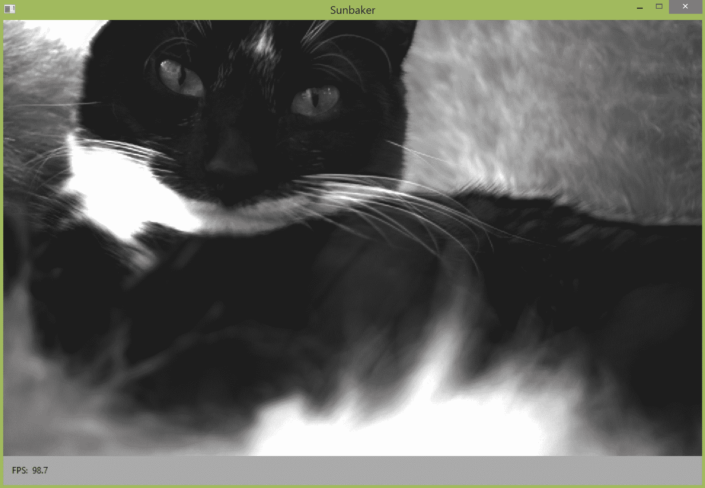
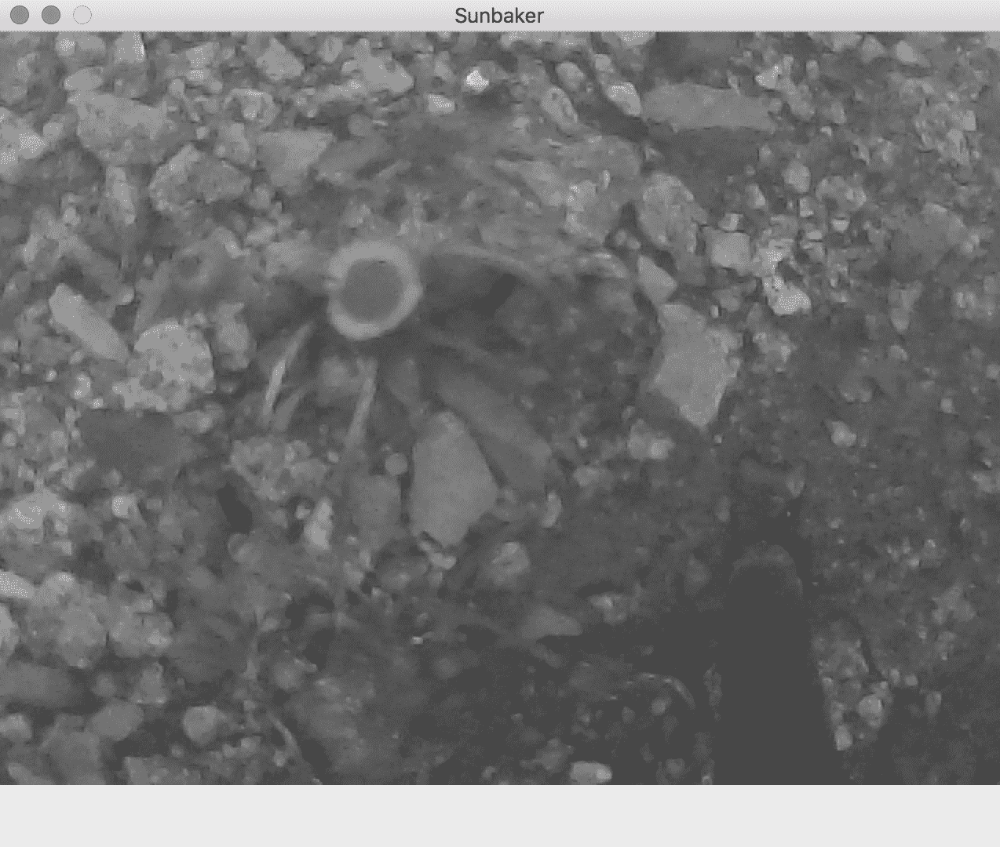
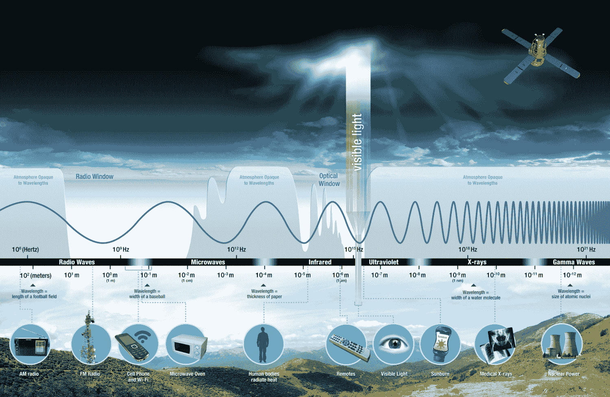
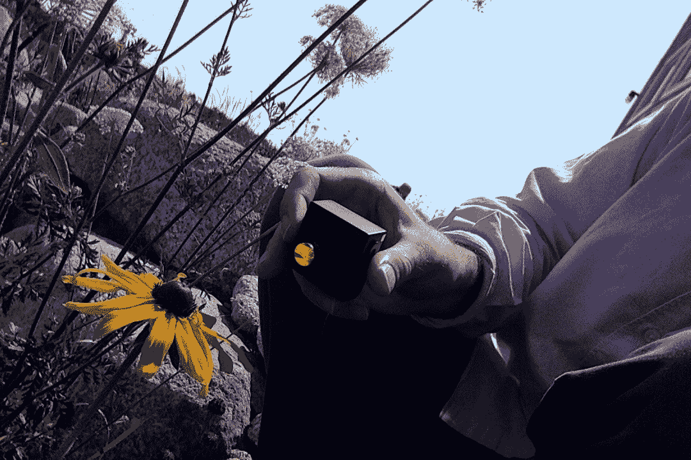
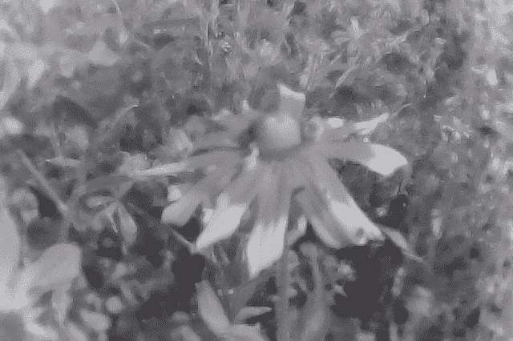
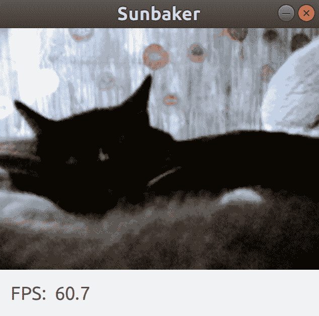
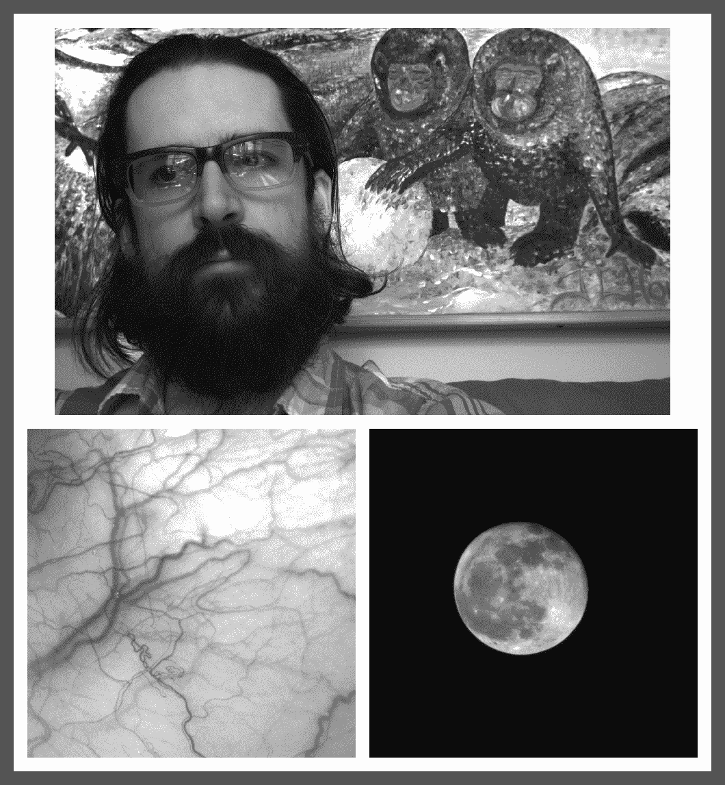

# 第八章：停止时间，像蜜蜂一样看世界

“你永远不知道蜜蜂会怎样。”

– A. A. 米尔恩，《小熊维尼》（1926）

辐射的隐形威胁在詹姆斯·邦德的世界上无处不在。当然，被盗的核弹头是令人担忧的原因之一，但过于晴朗的天气几乎同样糟糕，让英雄和他的可爱的旅行伴侣暴露在过量的紫外线辐射下。然后，在*《月亮神号》（1979）*中，有一个高预算的外太空任务，那里的辐射危害包括宇宙射线、太阳耀斑以及所有人都在发射的青绿色激光。

詹姆斯·邦德并不害怕所有这些辐射。也许他能够通过提醒自己电磁辐射可以指代各种以光速移动的波，包括我们所有人都能看到并喜爱的彩虹色范围*可见光*，但也包括无线电波、微波、热红外辐射、近红外光、紫外线、X 射线和伽马射线，从而以冷静、理性的观点看待它。

使用专业相机，可以捕捉到除了可见光之外的其他类型辐射的图像。此外，还可以以高帧率捕捉视频，揭示人类视觉无法感知的运动模式或脉冲光。这些功能将很好地补充我们在第七章中开发的*《用运动放大相机观察心跳》*应用程序。回想一下，`Lazy Eyes`实现了欧拉视频放大算法，该算法放大指定范围的运动频率。如果我们能提高帧率，我们就可以提高这个频率范围的精度；因此，我们可以更有效地隔离高频（快速运动）。这也可以被描述为在**选择性**上的改进。

从编程的角度来看，本章的目标仅仅是开发一个支持更多类型相机的`Lazy Eyes`变体。我们将把这个变体命名为`Sunbaker`。我们将使`Sunbaker`与 FLIR Systems 的 Point Grey 品牌工业相机兼容。这些相机可以使用名为**Spinnaker SDK**的 C++库进行控制，该库有一个名为`PySpin`的 Python 包装器。我们将学习如何无缝地将 PySpin（以及原则上任何用于相机控制的 Python 模块）与 OpenCV 集成。

PySpin（首字母大写的*P*和首字母大写的*S*）不应与 pyspin（全部小写字母）混淆。后者是一个不同的 Python 库，可以在终端中显示旋转图标。

更广泛地说，我们的目标是了解市场上一些专业相机的信息，使用它们的图像，并理解这类成像如何与自然世界相关。你知道吗，一只蜜蜂平均飞行速度为每小时 24 公里（15 英里），并且它能看到花朵上的紫外线图案？不同的相机可以让我们欣赏到这种生物如何感知光和时间的流逝。

# 技术要求

本章的项目有以下软件依赖：

+   **具有以下模块的 Python 环境**：OpenCV、NumPy、SciPy、PyFFTW 和 wxPython。

+   **可选**: Spinnaker SDK 和 PySpin。这些软件适用于 Windows 和 Linux，但不适用于 Mac。

如果没有特别说明，设置说明包含在第一章，*为任务做准备*中。PyFFTW 的设置说明包含在第七章[7cc1c0b9-a764-4069-9d45-e8bf129efc57.xhtml]，*使用运动放大相机观察心跳*中的*选择和设置 FFT 库*部分。Spinnaker SDK 和 PySpin 的设置说明包含在本章的*安装 Spinnaker SDK 和 PySpin*部分。始终参考设置说明以了解任何版本要求。运行 Python 代码的基本说明包含在附录 C，*与蛇一起运行（或 Python 的第一步）*中。

本章的完成项目可以在本书的 GitHub 仓库中找到，[`github.com/PacktPublishing/OpenCV-4-for-Secret-Agents-Second-Edition`](https://github.com/PacktPublishing/OpenCV-4-for-Secret-Agents-Second-Edition)，在 `Chapter008` 文件夹中。

# 计划 Sunbaker 应用

与 `Lazy Eyes` 相比，`Sunbaker` 有相同的 GUI 和，实质上，相同的欧拉视频放大实现。然而，如果连接了 Point Grey 工业相机，`Sunbaker` 可以捕获输入。以下截图显示了使用名为 **Point Grey Grasshopper 3 GS3-U3-23S6M-C** 的高速单色摄像头运行的 `Sunbaker`：



上一张截图显示了我的单色朋友，爱菲尔·爱因斯坦火箭。欧拉视频放大的效果在他的背部边缘可见，随着他的呼吸而移动。帧率（如截图所示为 98.7 **帧/秒**（**FPS**））恰好受到图像处理的限制；在更快的系统上，相机可能能够捕获高达 163 FPS。

作为备用方案，如果 PySpin 不可用或没有连接 PySpin 兼容的相机，`Sunbaker` 也可以从任何 OpenCV 兼容的相机捕获输入。以下截图显示了使用名为 **XNiteUSB2S-MUV** 的 OpenCV 兼容紫外线摄像头运行的 `Sunbaker`：



前面的截图显示了一朵小蒲公英。当然，在可见光中，蒲公英的花瓣完全是黄色的。然而，对于紫外线相机来说，蒲公英花瓣看起来像是一个明亮圆圈中的暗圈。这种靶心图案就是蜜蜂看到的景象。注意，在这个截图中，`Sunbaker`仍在构建其帧的历史，所以它还没有显示帧率或欧拉视频放大效果。潜在地，欧拉视频放大可以放大花瓣在风中运动的模式。

接下来，让我们花一点时间，通过观察电磁谱来将紫外网络相机的功能置于上下文中。

# 理解光谱

宇宙充满了光，或者说电磁辐射，天文学家可以使用所有波长来捕捉遥远物体的图像。然而，地球的大气层部分或全部反射了一些光或辐射的波长回到外太空，因此在地球上的成像通常处理更有限的波长范围。NASA 提供了以下插图，展示了各种电磁辐射的波长，它们对人类日常的重要性，以及它们穿透地球大气的（或不能穿透的）能力：



注意，前面图表的轴从左边的长波长到右边的短波长。地球的大气层在从最长无线电波长到短波波段（10 米）短端的范围内相对不透明。这种**不透明性**或**反射性**是全球无线电广播的一个重要原则，因为它使得某些无线电波长可以通过在地面和上层大气之间来回弹跳而绕地球传播。

在光谱中接下来，大气层在所谓的**无线电窗口**中相对透明，包括非常高频或调频广播（这不会传播到地平线之外）、蜂窝和 Wi-Fi 范围，以及微波长波部分。然后，大气层对微波短波部分和红外（**IR**）长波部分（大约从 1 毫米开始）相对不透明。

长波红外也称为**热红外**或**远红外**（**FIR**），短波红外也称为**近红外**（**NIR**）。在这里，术语*远*和*近*分别表示*远离可见光*和*靠近可见光*。因此，在可见光范围的另一端，长波紫外也称为**近紫外**（**NUV**），短波紫外也称为**远紫外**（**FUV**）。

无线电和微波频段在地面成像方面潜力相对较差。在这些频段中，由于波长是分辨率的限制因素，只能实现低分辨率成像。另一方面，从红外频段开始，捕捉到人大小或更小物体的可识别图像变得可行。幸运的是，红外和可见光频段有良好的自然光源。温血动物和其他温暖物体发出远红外辐射，这使得它们对热成像仪可见（即使在夜间，甚至在树木或墙壁等冷障碍物后面）。此外，大气在所谓的**光学窗口**中相对透明，包括近红外频段、可见光频段，以及较少程度的近紫外频段。近红外和近紫外相机产生的图像与可见光图像相当相似，但在物体着色、不透明度和清晰度方面存在一些差异。

在整个紫外频段以及 X 射线和伽马频段，地球大气再次相对不透明。这也是一个幸运的事——也许不是从计算机视觉的角度来看，但肯定是从生物学的角度来看。短波辐射可以穿透未受保护的皮肤、肉体，甚至骨骼，迅速造成烧伤，并缓慢地导致癌症。然而，简而言之，从人工源进行的有控制的曝光，**紫外线**（**UV**）和 X 射线成像在医学上非常有用。例如，紫外线成像可以记录皮肤表面下深处的隐形淤青，这种图像通常用作家庭暴力案件的法医证据。当然，X 射线成像可以更深地穿透，揭示骨骼或肺部内部。短波或**硬**X 射线，以及伽马射线，广泛用于扫描容器和车辆的内部，例如在安全检查站。

几十年来，X 射线图像在世界许多地方都很常见。在 20 世纪 50 年代和 60 年代，苏联的废弃 X 射线幻灯片数量足够多，以至于盗版音乐制作人将它们作为廉价替代品用于乙烯基唱片。人们听着“骨头上的爵士乐”或“骨头上的摇滚乐”，因为这种被禁止的外国音乐在其他任何形式中都无法获得。然而，与一个 X 射线扫描可能比爵士乐唱片更麻烦的世界相比，1895-1896 年的世界对第一张 X 射线图像感到震惊。“我看到了我的死亡，”安娜·贝莎·路德维希，这位开创性 X 射线科学家维尔纳·伦琴的妻子，在第一次看到她手的骨骼扫描时说。她和其他当时的观众从未想过照片可以揭示活人的骨骼。

今天，专业成像技术正变得越来越普遍，它将继续改变人们看待自己和世界的方式。例如，红外和紫外相机现在在警察工作中被广泛用于监控和检测，许多公众对此有所了解，这得益于电视上的警察剧，我们可能会开始质疑我们关于什么可以看到和什么看不到的旧假设。暂时忘记特工和甚至警察侦探；我们甚至可能在 DIY 节目中看到热成像仪，因为 FIR 成像可以用来定位窗户周围的冷风或墙内的热水管。红外和紫外相机正变得越来越实惠，甚至可以用于家庭使用，在下一节中，我们将考虑这些和其他专业相机的例子。

# 寻找专业相机

以下表格提供了一些可以以高帧率捕获视频、红外或紫外成像的相机的示例：

| **名称** | **价格** | **用途** | **模式** | **光学** | **兼容性** |
| --- | --- | --- | --- | --- | --- |
| XNiteUSB2S-MUV | $135 | 近紫外单色成像 | 单色 *1920 x 1080* @ 30 FPS 单色 *1280 x 720* @ 60 FPS 单色 *640 x 480* @ 120 FPS（及其他模式） | 对角视场角—86 度 3.6 mm 镜头在 1/2.7" 传感器上 | OpenCV 在 Windows、Mac、Linux 上 |
| XNiteUSB2S-IR715 | $135 | 近红外单色成像 | 单色 *1920 x 1080* @ 30 FPS 单色 *1280 x 720* @ 60 FPS 单色 *640 x 480* @ 120 FPS（及其他模式） | 对角视场角—86 度 3.6 mm 镜头在 1/2.7" 传感器上 | OpenCV 在 Windows、Mac、Linux 上 |
| Sony PlayStation Eye | $10 | 可见光高速彩色成像 | 彩色 *640 x 480* @ 60 FPS 彩色 *320 x 240* @ 187 FPS | 对角视场角—75 度或 56 度（两个缩放设置） | 仅 Linux 上的 OpenCV（V4L 后端） |
| Point Grey Grasshopper 3 GS3-U3-23S6C-C | $1045 | 可见光高速彩色成像 | 彩色 *1920 x 1200* @ 162 FPS（及其他模式） | 1/1.2" 传感器上的 C-mount 镜头（不包括） | Spinnaker SDK 和 PySpin 在 Windows、Linux 上 |
| Point Grey Grasshopper 3 GS3-U3-23S6M-C | $1045 | 可见光高速单色成像 | 单色 *1920 x 1200* @ 162 FPS（及其他模式） | 1/1.2" 传感器上的 C-mount 镜头（不包括） | Spinnaker SDK 和 PySpin 在 Windows、Linux 上 |
| Point Grey Grasshopper 3 GS3-U3-41C6NIR-C | $1359 | 近红外单色成像 | 单色 *2048 x 2048* @ 90 FPS（及其他模式） | 1" 传感器上的 C-mount 镜头（不包括） | Spinnaker SDK 和 PySpin 在 Windows、Linux 上 |

当然，除了这些例子之外，市场上还有许多其他专业相机。许多工业相机，包括之前列出的 Point Grey 相机，符合一个称为**GenICam**的行业标准，从原则上讲，这使得它们与基于此标准的第三方软件库兼容。Harvesters([`github.com/genicam/harvesters`](https://github.com/genicam/harvesters))是一个开源 Python 库的例子，它可以控制符合 GenICam 标准的相机。如果你对支持更多工业相机品牌和更多平台（包括 Mac 以及 Windows 和 Linux）感兴趣，你可能想了解一下 Harvesters。不过，现在让我们更详细地讨论一下前面表格中的一些相机。

# XNiteUSB2S-MUV

MaxMax.com 提供的 XNiteUSB2S-MUV 是一款真正的紫外线相机，因为它阻挡了可见光和红外光，以便单独捕捉紫外线。这是通过一个永久性连接的镜头滤镜实现的，该滤镜对可见光不透明，但对部分近紫外光范围相对透明。镜头本身的玻璃也过滤掉了一些紫外线，结果是相机捕捉了 360 nm 到 380 nm 的范围。以下照片展示了相机和黑眼苏珊（一种北美花卉，花瓣黄色，花药黑色）在镜头滤镜中的不透明反射：



以下照片是由紫外线相机拍摄的，显示了同一朵花，花瓣底部是深色的，尖端是明亮的，形成了一个典型的紫外线靶心图案：



对于蜜蜂来说，这两种对比鲜明的颜色的大片溅射就像快餐标志一样显眼。花粉就在这里！

XNiteUSB2S-MUV 可以在阳光下户外拍摄图像，但如果你想在室内使用它，你需要一个覆盖相机灵敏度范围的紫外线光源，360 nm 到 380 nm。MaxMax.com 可以提供关于紫外线光源的销售建议，以及定制 XNiteUSB2S-MUV 的石英镜头，将灵敏度范围扩展到大约 300 nm（成本显著提高）。请参阅相机的产品页面[`maxmax.com/maincamerapage/uvcameras/usb2-small`](https://maxmax.com/maincamerapage/uvcameras/usb2-small)和 MaxMax.com 的联系页面[`maxmax.com/contact-us`](https://maxmax.com/contact-us)。

MaxMax.com 还提供了一系列具有与 XNiteUSB2S-MUV 相同电子和镜头的红外相机，只是它们使用不同的过滤器来阻挡可见光和紫外光，同时捕捉部分近红外（NIR）范围。XNiteUSB2S-IR715 捕捉最广泛的 NIR 范围，波长约为 715 nm（相比之下，可见红光始于 700 nm）。产品系列包括几个类似命名的其他波长截止选项。

# Sony PlayStation Eye

PlayStation Eye 作为一款低成本相机，具有高最大帧率（尽管分辨率较低）的独特地位。索尼于 2007 年将 Eye 作为 PlayStation 3 游戏控制台的配件发布，游戏开发者使用该相机支持动作跟踪、面部跟踪或简单的视频聊天。后来，Eye 的驱动程序被逆向工程用于其他平台，该设备在计算机视觉实验者中获得了普及。Linux 内核（特别是 Video4Linux 或 V4L 模块）官方支持 Eye。因此，在 Linux（仅限 Linux）上，OpenCV 可以像普通网络摄像头一样使用 Eye。

PS3EYE 驱动程序 ([`github.com/inspirit/PS3EYEDriver`](https://github.com/inspirit/PS3EYEDriver)) 是一个开源的 C++ 库，可以在 Windows 或 Mac 上控制 PlayStation Eye。理论上，你可以围绕 PS3EYEDriver 编写自己的包装器，以提供 OpenCV 兼容的接口。PS3EYEDriver 重新使用了 Eye 的 Linux 驱动程序的大量代码，该代码是 GPL 许可的，因此在使用 PS3EYE 驱动程序时要小心考虑许可的影响；除非你的项目也是 GPL 许可的，否则可能不适合你。

下面是 `Sunbaker` 在 Linux 上以高帧率运行并使用 PlayStation Eye 相机的屏幕截图：



上一张照片显示了我的单色朋友，埃菲尔爱因斯坦火箭，处于静止状态。当他呼吸时，欧拉视频放大效应在他的背部边缘形成光环。请注意，帧率（60.7 FPS，如显示）实际上是由图像处理限制的；我们可以在更快的系统上接近或达到相机的最大速率 187 FPS。

# Point Grey Grasshopper 3 GS3-U3-23S6M-C

Point Grey Grasshopper 3 GS3-U3-23S6M-C 是一款高度可配置的单色相机，具有可更换镜头和高速 USB 3 接口。根据配置和所附镜头，它可以在各种条件下以高帧率捕捉各种主题的详细图像。考虑以下一组图像。我们看到作者的头像，作者眼睛静脉的特写，以及月亮的远距离拍摄，所有这些图像都是使用 GS3-U3-23S6M-C 相机和各种低成本镜头（每个 50 美元或以下）拍摄的：



该相机使用一种称为**C-mount**的镜头安装类型，其传感器尺寸被称为**1/1.2"格式**。这与被称为**16 mm**和 Super 16 的两种格式相同，这两种格式自 1923 年以来在业余电影相机中一直很受欢迎。因此，该相机与广泛的经济实惠、老式的*cine*（电影摄影）镜头以及较新且更昂贵的机器视觉镜头兼容。

在通过 USB 发送帧之前，相机本身就可以高效地执行一些图像处理操作，例如裁剪图像和合并（求和）相邻像素以增加亮度和降低噪声。我们将在本章的“使用 PySpin 从工业相机捕获图像”部分中看到如何控制这些功能。

Point Grey Grasshopper 3 GS3-U3-23S6C-C 与之前描述的相机相同，只是它捕获的是彩色可见光而不是单色。Point Grey Grasshopper 3 GS3-U3-41C6NIR-C 也属于同一系列的相机，但它是一款具有更大传感器（1"格式）、更高分辨率和更低帧率的单色近红外相机。还有许多其他有趣的 Point Grey 相机，您可以在[`www.flir.com/browse/camera-cores--components/machine-vision-cameras`](https://www.flir.com/browse/camera-cores--components/machine-vision-cameras)上搜索可用的型号和功能列表。

接下来，让我们看看我们如何设置软件库来控制 Point Grey 相机。

# 安装 Spinnaker SDK 和 PySpin

要获取使我们能够与 Point Grey 相机接口的驱动程序和库，请按照以下步骤操作：

1.  访问 FLIR 网站上的 Spinnaker SDK 部分，网址为[`www.flir.com/products/spinnaker-sdk/`](https://www.flir.com/products/spinnaker-sdk/)。点击“立即下载”按钮。您将被提示前往不同的下载网站。点击“从盒子下载”按钮。

1.  您将看到一个页面，允许您导航文件结构以查找可用的下载。选择与您的操作系统匹配的文件夹，例如 Windows 或 Linux/Ubuntu18.04。

1.  在所选文件夹或其子文件夹中，找到并下载与您的操作系统和架构匹配的 Spinnaker SDK 版本。（对于 Windows，您可以选择 Web 安装程序或完整 SDK。）还要找到并下载与您的 Python 版本、操作系统和架构匹配的 PySpin（Python Spinnaker 绑定）版本，例如`spinnaker_python-1.20.0.15-cp36-cp36m-win_amd64.zip`，适用于 Windows 上的 64 位 Python 3.6。

1.  关闭网页浏览器。

1.  各种系统的安装说明如下：

+   对于 Windows，Spinnaker SDK 安装程序是一个`.exe`安装程序。运行它并按照安装程序的提示操作。如果您被提示选择安装配置文件，请选择应用程序开发。如果您被提示选择安装组件，请选择文档、驱动程序以及您想要的任何其他组件。

+   对于 Linux，Spinnaker SDK 下载是一个`TAR.GZ`存档。将其解压到任何位置，我们将将其称为`<spinnaker_sdk_unzip_destination>`。打开终端，运行`$ cd <spinnaker_sdk_unzip_destination> && ./install_spinnaker.sh`，并输入`Yes`回答安装程序的提示。

1.  Python Spinnaker 下载是一个 ZIP 存档（适用于 Windows）或 TAR 存档（适用于 Linux）。将其解压到任何位置。我们将将其解压目标称为`<PySpin_whl_unzip_destination>`，因为它包含一个 WHL 文件，例如`spinnaker_python-1.20.0.15-cp36-cp36m-win_amd64.whl`。我们将将其称为`<PySpin_whl_file>`。WHL 文件是一个可以使用 Python 包管理器`pip`安装的包。打开终端并运行以下命令（但替换实际的文件夹名称和文件名）：

```py
$ cd <PySpin_whl_unzip_destination>
$ pip install --user <PySpin_whl_file>
```

对于某些 Python 3 环境，您可能需要在上述命令中运行`pip3`而不是`pip`。

在这一点上，我们已经拥有了从 Python 脚本控制 Point Grey 相机的所有软件。让我们继续编写一个支持 PySpin 和 OpenCV 之间互操作的 Python 类。

# 使用 PySpin 从工业相机捕获图像

让我们创建一个名为`PySpinCapture.py`的文件。不出所料，我们将从以下`import`语句开始其实现：

```py
import PySpin
import cv2
```

作为对`PySpin`的实际介绍，让我们添加以下函数，该函数返回当前连接到系统的 PySpin 兼容相机的数量：

```py
def getNumCameras():
    system = PySpin.System.GetInstance()
    numCameras = len(system.GetCameras())
    system.ReleaseInstance()
    return numCameras
```

在这里，我们可以看到我们的独立`getNumCameras`函数（类似于任何使用`PySpin`的自包含代码模块）负责获取和释放对`PySpin`系统的引用。我们还可以看到`PySpin`系统是一个网关，提供对任何连接的 PySpin 兼容相机的访问。

在这个文件中，我们的主要目标是实现一个名为`PySpinCapture`的类，它将提供与 OpenCV 的 Python 绑定中`cv2.VideoCapture`类相同的一些公共方法。`PySpinCapture`的一个实例将以自包含的方式提供对单个 PySpin 兼容相机的访问。然而，该类可以被多次实例化，以便通过不同的实例同时访问不同的相机。`PySpinCapture`将实现以下方法，部分模拟`cv2.VideoCapture`的行为：

+   `get(propId)`: 此方法通过`propId`参数返回由相机属性标识的值。我们将支持 OpenCV 的两个`propId`常量，即`cv2.CAP_PROP_FRAME_WIDTH`和`cv2.CAP_PROP_FRAME_HEIGHT`。

+   `read(image=None)`: 此方法读取相机帧并返回一个元组 `(retval, image_out)`，其中 `retval` 是一个布尔值，表示成功 (`True`) 或失败 (`False`)，而 `image_out` 是捕获的帧（如果捕获失败则为 `None`）。如果 `image` 参数不是 `None` 并且捕获成功，则 `image_out` 与 `image` 是同一个对象，但它包含新的数据。

+   `release()`: 此方法释放摄像头的资源。`cv2.VideoCapture` 的实现方式是析构函数调用 `release`，`PySpinCapture` 也将以这种方式实现。

其他 Python 脚本将能够在对象上调用这些方法，而无需知道该对象是 `cv2.VideoCapture`、`PySpinCapture` 或具有相同方法的某些其他类的实例。即使这些类在面向对象继承方面没有关系，也是如此。Python 的这个特性称为 **鸭子类型**。*如果它看起来像鸭子，游泳像鸭子，发出鸭子的叫声，那么它可能就是一只鸭子*，这句俗语如是说。如果它提供了一个返回帧的 `read` 方法，那么它可能 *就是* 一个帧捕获对象。在本章的 *将 Lazy Eyes 应用适配为 Sunbaker* 部分中，我们将根据 `PySpin` 是否可用实例化 `PySpinCapture`，否则实例化 `cv2.VideoCapture`；然后，我们将使用实例化的对象，而无需进一步关注其类型。

Point Grey 相机比 `cv2.VideoCapture` 支持的大多数相机都更可配置。我们的 `PySpinCapture` 的 `__init__` 方法将接受以下参数：

+   `index`: 这是摄像头的设备索引。

+   `roi`: 这是一个在 `(x, y, w, h)` 格式中的感兴趣区域，相对于摄像头的原生图像尺寸。感兴趣区域之外的数据将不会被捕获。例如，如果原生图像尺寸是 *800 x 600* 像素，并且 `roi` 是 `(0, 300, 800, 300)`，则捕获的图像将仅覆盖图像传感器的下半部分。

+   `binningRadius`: 如果要捕获未过滤的图像，则此值为 `1`，如果要在指定半径内的相邻像素求和以生成更小、更亮、更少噪声的图像，则此值为 `2` 或更大。

+   `isMonochrome`: 如果捕获的图像应该是灰度图，则为 `True`，如果应该是 BGR，则为 `False`。

以下代码展示了我们如何声明 `PySpinCapture` 类及其 `__init__` 方法：

```py
class PySpinCapture:

    def __init__(self, index, roi, binningRadius=1,
                 isMonochrome=False):
```

PySpin 和其底层的 Spinnaker SDK 是围绕一个系统的分层模型组织的，包括系统中的相机及其相应的配置。每个相机的配置组织到一个所谓的 **节点图** 中，它定义了属性、它们支持的价值以及它们的当前值。为了开始实现我们的 `__init__` 方法，我们获取一个系统实例、一个相机列表以及一个通过索引指定的特定相机。我们初始化这个相机并获取其节点图。所有这些都在以下代码中可以看到：

```py
        self._system = PySpin.System.GetInstance()

        self._cameraList = self._system.GetCameras()

        self._camera = self._cameraList.GetByIndex(index)
        self._camera.Init()

        self._nodemap = self._camera.GetNodeMap()
```

我们对捕获一系列连续的视频帧感兴趣，而不是孤立的静态图像。为了支持视频捕获，`PySpin`允许我们将相机的`'AcquisitionMode'`属性设置为`'Continuous'`捕获的值：

```py
        # Enable continuous acquisition mode.
        nodeAcquisitionMode = PySpin.CEnumerationPtr(
                self._nodemap.GetNode('AcquisitionMode'))
        nodeAcquisitionModeContinuous = \
                nodeAcquisitionMode.GetEntryByName(
                        'Continuous')
        acquisitionModeContinuous = \
                nodeAcquisitionModeContinuous.GetValue()
        nodeAcquisitionMode.SetIntValue(
                acquisitionModeContinuous)
```

有关节点、它们的名称和相关信息，请参阅 FLIR 网站上的技术笔记*Spinnaker Nodes*，网址为[`www.flir.com/support-center/iis/machine-vision/application-note/spinnaker-nodes/`](https://www.flir.com/support-center/iis/machine-vision/application-note/spinnaker-nodes/)。

接下来，我们设置一个名为`'PixelFormat'`的属性，其值为`'Mono8'`或`'BGR8'`，这取决于`__init__`方法的`isMonochrome`参数是否为`True`。以下是相关代码：

```py
        # Set the pixel format.
        nodePixelFormat = PySpin.CEnumerationPtr(
            self._nodemap.GetNode('PixelFormat'))
        if isMonochrome:
            # Enable Mono8 mode.
            nodePixelFormatMono8 = PySpin.CEnumEntryPtr(
                    nodePixelFormat.GetEntryByName('Mono8'))
            pixelFormatMono8 = \
                    nodePixelFormatMono8.GetValue()
            nodePixelFormat.SetIntValue(pixelFormatMono8)
        else:
            # Enable BGR8 mode.
            nodePixelFormatBGR8 = PySpin.CEnumEntryPtr(
                    nodePixelFormat.GetEntryByName('BGR8'))
            pixelFormatBGR8 = nodePixelFormatBGR8.GetValue()
            nodePixelFormat.SetIntValue(pixelFormatBGR8)
```

同样，我们根据`binningRadius`参数设置`'BinningVertical'`属性（水平合并半径自动设置为与垂直合并半径相同的值）。以下是相关代码：

```py
        # Set the vertical binning radius.
        # The horizontal binning radius is automatically set
        # to the same value.
        nodeBinningVertical = PySpin.CIntegerPtr(
                self._nodemap.GetNode('BinningVertical'))
        nodeBinningVertical.SetValue(binningRadius)
```

同样，根据`roi`参数，我们设置名为`'OffsetX'`、`'OffsetY'`、`'Width'`和`'Height'`的属性值，如下面的代码所示：

```py
        # Set the ROI.
        x, y, w, h = roi
        nodeOffsetX = PySpin.CIntegerPtr(
                self._nodemap.GetNode('OffsetX'))
        nodeOffsetX.SetValue(x)
        nodeOffsetY = PySpin.CIntegerPtr(
                self._nodemap.GetNode('OffsetY'))
        nodeOffsetY.SetValue(y)
        nodeWidth = PySpin.CIntegerPtr(
                self._nodemap.GetNode('Width'))
        nodeWidth.SetValue(w)
        nodeHeight = PySpin.CIntegerPtr(
                self._nodemap.GetNode('Height'))
        nodeHeight.SetValue(h)
```

`cv2.VideoCapture`在构造时立即开始捕获会话，因此我们希望在`PySpinCapture`中也做同样的事情。因此，我们使用以下代码行完成`__init__`方法的实现，该代码行告诉相机开始获取帧：

```py
        self._camera.BeginAcquisition()
```

我们在`get`方法的实现中再次使用节点映射。如果请求`cv2.CAP_PROP_FRAME_WIDTH`，我们返回`'Width'`属性的值。如果请求的是`cv2.CAP_PROP_FRAME_HEIGHT`，我们返回`'Height'`属性的值。对于任何其他请求，我们返回`0.0`。以下是该方法实现：

```py
    def get(self, propId):
        if propId == cv2.CAP_PROP_FRAME_WIDTH:
            nodeWidth = PySpin.CIntegerPtr(
                    self._nodemap.GetNode('Width'))
            return float(nodeWidth.GetValue())
        if propId == cv2.CAP_PROP_FRAME_HEIGHT:
            nodeHeight = PySpin.CIntegerPtr(
                    self._nodemap.GetNode('Height'))
            return float(nodeHeight.GetValue())
        return 0.0
```

我们通过告诉相机捕获一帧来开始实现`read`方法。如果这失败了，我们返回`False`和`None`（没有图像）。否则，我们获取帧的尺寸和通道数，将其数据作为 NumPy 数组获取，并将此数组重塑为 OpenCV 期望的格式。我们复制数据，释放原始帧，然后返回`True`和复制的图像。以下是该方法实现：

```py
    def read(self, image=None):

        cameraImage = self._camera.GetNextImage()
        if cameraImage.IsIncomplete():
            return False, None

        h = cameraImage.GetHeight()
        w = cameraImage.GetWidth()
        numChannels = cameraImage.GetNumChannels()
        if numChannels > 1:
            cameraImageData = cameraImage.GetData().reshape(
                    h, w, numChannels)
        else:
            cameraImageData = cameraImage.GetData().reshape(
                    h, w)

        if image is None:
            image = cameraImageData.copy()
        else:
            image[:] = cameraImageData

        cameraImage.Release()

        return True, image
```

我们通过告诉相机停止获取帧、取消初始化和删除相机、清除相机列表以及释放`PySpin`系统来实现`release`方法。以下是相关代码：

```py
    def release(self):

        self._camera.EndAcquisition()
        self._camera.DeInit()
        del self._camera

        self._cameraList.Clear()

        self._system.ReleaseInstance()
```

为了完成`PySpinCapture`类的实现，我们提供了以下析构函数或`__del__`方法，它简单地调用我们之前实现的`release`方法：

```py
    def __del__(self):
        self.release()
```

接下来，让我们看看如何在我们的应用程序中交替使用`PySpinCapture`或`cv2.VideoCapture`。

# 将 Lazy Eyes 应用程序适配为 Sunbaker

如我们在本章开头所讨论的，`Sunbaker` 是 `Lazy Eyes` 的一个变体，支持更多相机。作为一个起点，从 第七章 的 *使用运动放大相机观察心跳* 中复制完成的 `LazyEyes.py` 脚本，并将其重命名为 `Sunbaker.py`。`Sunbaker` 支持的相机将取决于运行时可用模块。

在 `Sunbaker.py` 中的其他 `import` 语句之后添加以下 `try`/`except` 块：

```py
try:
    import PySpinCapture
except ImportError:
    PySpinCapture = None
```

上述代码块尝试导入我们的 `PySpinCapture` 模块，该模块包含我们的 `getNumCameras` 函数和 `PySpinCapture` 类。反过来，`PySpinCapture` 模块会导入我们在本章前面的 *使用 PySpin 从工业相机捕获图像* 部分中看到的 `PySpin` 模块。如果找不到 `PySpin` 模块，则会抛出 `ImportError`。上述代码块捕获此错误，并定义 `PySpinCapture = None` 作为我们未能导入可选依赖项（即 `PySpinCapture` 模块）的标记。在 `Sunbaker.py` 的后面，我们只有在 `PySpinCapture` 不是 `None` 时才会使用 `PySpinCapture` 模块。

我们必须修改 `Sunbaker` 类的 `__init__` 方法，以移除 `cameraDeviceID` 和 `imageSize` 参数，并添加一个 `capture` 参数和一个 `isCaptureMonochrome` 参数。`capture` 参数可以是 `cv2.VideoCapture` 对象或 `PySpinCapture` 对象。我们假设在捕获传递给 `__init__` 之前，`capture` 参数的宽度、高度和其他属性已经完全配置。因此，我们不需要在 `__init__` 中调用 `ResizeUtils.cvResizeCapture`（并且我们可以从导入列表中删除 `ResizeUtils`）。我们尝试从实际帧中获取图像尺寸和格式（是否为灰度），如果失败，我们将转而依赖从 `capture` 参数的属性中获取尺寸，从 `isCaptureMonochrome` 参数中获取格式。`__init__` 的修改以粗体标注：

```py
class Sunbaker(wx.Frame):

    def __init__(self, capture, isCaptureMonochrome=False,
                 maxHistoryLength=360,
                 minHz=5.0/6.0, maxHz=1.0,
                 amplification=32.0, numPyramidLevels=2,
                 useLaplacianPyramid=True,
                 useGrayOverlay=True,
                 numFFTThreads=4, numIFFTThreads=4,
                 title='Sunbaker'):

        self.mirrored = True

        self._running = True

        self._capture = capture

 # Sometimes the dimensions fluctuate at the start of
 # capture.
 # Discard two frames to allow for this.
 capture.read()
 capture.read()

 success, image = capture.read()
 if success:
 # Use the actual image dimensions.
 h, w = image.shape[:2]
 isCaptureMonochrome = (len(image.shape) == 2)
 else:
 # Use the nominal image dimensions.
 w = int(capture.get(cv2.CAP_PROP_FRAME_WIDTH))
 h = int(capture.get(cv2.CAP_PROP_FRAME_HEIGHT))
 size = (w, h)
 if isCaptureMonochrome:
 useGrayOverlay = True
 self._isCaptureMonochrome = isCaptureMonochrome

        # ... The rest of the method is unchanged ...
```

`_applyEulerianVideoMagnification` 方法需要稍作修改以支持输入不是 BGR 图像，而是一个来自单色相机的灰度图像。同样，以下代码中的修改以粗体标注：

```py
    def _applyEulerianVideoMagnification(self):

        timestamp = timeit.default_timer()

        if self._useGrayOverlay and \
 not self._isCaptureMonochrome:
 smallImage = cv2.cvtColor(
 self._image, cv2.COLOR_BGR2GRAY).astype(
 numpy.float32)
 else:
 smallImage = self._image.astype(numpy.float32)

        # ... The middle part of the method is unchanged ...

        # Amplify the result and overlay it on the
        # original image.
        overlay = numpy.real(ifftResult[-1]) * \
                          self._amplification
        i = 0
        while i < self._numPyramidLevels:
            overlay = cv2.pyrUp(overlay)
            i += 1
 if self._useGrayOverlay and \
 not self._isCaptureMonochrome:
 overlay = cv2.cvtColor(overlay,
 cv2.COLOR_GRAY2BGR)
        cv2.add(self._image, overlay, self._image,
                dtype=cv2.CV_8U)
```

最后，`main` 函数需要进行修改，以便为 `Sunbaker` 应用程序的 `__init__` 方法提供适当的 `capture` 和 `isCaptureMonochrome` 参数。例如，假设如果 `PySpin` 可用，我们希望使用一个具有 `2` 像素合并半径和 *960 x 600* 捕获分辨率的单色相机。（GS3-U3-23S6M-C 相机支持这种配置。）如果 `PySpin` 不可用或没有连接 PySpin 兼容的相机，则让我们使用一个具有 *640 x 480* 捕获分辨率和 60 FPS 的 OpenCV 兼容相机。以下代码中的相关修改以粗体标注：

```py
def main():

    app = wx.App()

 if PySpinCapture is not None and \
            PySpinCapture.getNumCameras() > 0:
 isCaptureMonochrome = True
 capture = PySpinCapture.PySpinCapture(
 0, roi=(0, 0, 960, 600), binningRadius=2,
 isMonochrome=isCaptureMonochrome)
 else:
 # 320x240 @ 187 FPS
 #capture.set(cv2.CAP_PROP_FRAME_WIDTH, 320)
 #capture.set(cv2.CAP_PROP_FRAME_HEIGHT, 240)
 #capture.set(cv2.CAP_PROP_FPS, 187)

 # 640x480 @ 60 FPS
 capture.set(cv2.CAP_PROP_FRAME_WIDTH, 640)
 capture.set(cv2.CAP_PROP_FRAME_HEIGHT, 480)
 capture.set(cv2.CAP_PROP_FPS, 60)

 # Show motion at edges with grayscale contrast.
 sunbaker = Sunbaker(capture, isCaptureMonochrome)

 sunbaker.Show()
    app.MainLoop()
```

你可能需要根据摄像头支持的捕获模式修改前面的代码。如果你对使用 PlayStation Eye 摄像头在最大帧率下感兴趣，你应该注释掉与 *640 x 480* 分辨率 60 FPS 相关的代码行，并取消注释与 *320 x 240* 分辨率 187 FPS 相关的代码行。

这就标志着代码修订工作的结束。现在，你可以使用 Point Grey 摄像头或任何兼容 OpenCV 的摄像头（例如 USB 摄像头）来测试 `Sunbaker`。花些时间调整摄像头参数，以及欧拉视频放大算法的参数（后者在第七章，“用运动放大摄像头观察心跳”，在“配置和测试应用程序以适应各种运动”部分中详细描述）。尝试各种主题和照明条件，包括户外阳光。如果你使用的是紫外线摄像头，记得看看花朵！

# 摘要

本章拓宽了我们对于摄像头能看到的物体的认识。我们考虑了高帧率视频捕获以及人眼看不见的光波长的捕获。作为程序员，我们学会了以一种方式封装第三方摄像头 API，这样我们就可以通过 Python 的鸭子类型来互换使用工业摄像头和兼容 OpenCV 的网络摄像头。作为实验者，我们将对欧拉视频放大的研究扩展到更高的运动频率，以及超出可见光谱的更多令人惊讶的脉冲光模式。

让我们回顾一下我们所取得的进步。从找到 SPECTRE 的头目到探索电磁频谱，我们作为秘密特工的旅程已经走得很远了。然而，在这个自豪的时刻，我们的冒险必须画上句号。我们将会再次见面。请关注我网站上即将发布的未来书籍、网络直播和演示，网址为 [`nummist.com/opencv`](http://nummist.com/opencv)。你也可以通过发送电子邮件至 josephhowse@nummist.com 来向我报告问题、提问，并告诉我你是如何使用 OpenCV 的。

书现在即将结束，我正等待了解自己是否会与一个性感尤物一起消失在日落中，还是与 M 进行一次忧郁的总结会议。
