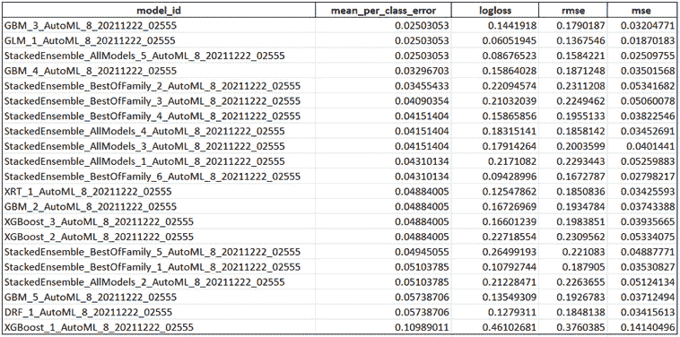

# 1

# 理解 H2O AutoML 基础

**机器学习**（**ML**）是使用计算机系统构建分析或统计模型的过程，这些系统通过学习历史数据并从中识别模式。然后，这些系统使用这些模式并尝试做出预测性决策，这些决策可以为企业和研究提供价值。然而，实现一个能够提供任何具体价值的 ML 系统所需的复杂数学知识已经阻止了很多人尝试它，留下了大量他们本可以从中受益的未发现潜力。

**自动化机器学习**（**AutoML**）是最新 ML 技术之一，它加速了所有规模的组织对 ML 的采用。它是自动所有这些涉及 ML 生命周期复杂任务的过程。AutoML 将所有这些复杂性隐藏起来并在幕后自动化它们。这使得任何人都可以轻松实现 ML 而无需任何麻烦，并更多地关注结果。

本章，我们将学习 H2O.ai（[`www.h2o.ai/`](https://www.h2o.ai/））提供的一种 AutoML 技术，它简单地命名为 H2O AutoML。我们将提供 AutoML 的一般历史和它解决的问题的简要介绍，以及关于 H2O.ai 及其 H2O AutoML 技术的一些信息。然后，我们将使用 H2O 的 AutoML 技术编写一个简单的 ML 实现并构建我们的第一个 ML 模型。

到本章结束时，你将了解 AutoML 究竟是什么，H2O.ai 公司及其技术 H2O AutoML，以及使用 H2O AutoML 需要的最小要求。你还将了解如何使用 H2O AutoML 训练你的第一个 ML 模型，而无需理解任何复杂的数学火箭科学。

本章我们将涵盖以下主题：

+   理解 AutoML 和 H2O AutoML

+   使用 H2O AutoML 的最小系统要求

+   安装 Java

+   使用 Python 的 H2O 的基本实现

+   使用 R 的 H2O 的基本实现

+   使用 H2O AutoML 训练你的第一个 ML 模型

# 技术要求

对于本章，你需要以下内容：

+   一个不错的网络浏览器（Chrome、Firefox 或 Edge），你首选浏览器的最新版本。

+   你选择的 **集成开发环境**（**IDE**）

+   Project Jupyter 的 Jupyter Notebook ([https://jupyter.org/](https://jupyter.org/))（可选）

本章的所有代码示例都可以在 GitHub 上找到，链接为 [`github.com/PacktPublishing/Practical-Automated-Machine-Learning-on-H2O/tree/main/Chapter%201`](https://github.com/PacktPublishing/Practical-Automated-Machine-Learning-on-H2O/tree/main/Chapter%201)。

# 理解 AutoML 和 H2O AutoML

在我们开始使用 H2O AutoML 的旅程之前，了解 AutoML 究竟是什么以及它在整个机器学习（ML）流程中扮演什么角色是非常重要的。在本节中，我们将尝试理解 ML 流程中涉及的各个步骤以及 AutoML 如何融入其中。然后，我们将探讨是什么使得 H2O 的 AutoML 在众多 AutoML 技术中如此独特。

让我们先了解一下 AutoML 的一般概念。

## AutoML

AutoML 是一个自动化过程，用于在开发用于预测的有效 ML 系统时执行的各种步骤。一个典型的 ML 流程包括以下步骤：

1.  **数据收集**：这是 ML 流程中的第一步。数据从各种来源收集。这些来源可以生成不同类型的数据，如分类数据、数值数据、文本数据、时间序列数据，甚至视觉和听觉数据。所有这些类型的数据根据需求聚合在一起，并合并成一个共同的结构。这可能是一个逗号分隔值文件、一个 parquet 文件，甚至是一个数据库的表格。

1.  **数据探索**：一旦收集到数据，就会使用基本的分析技术对其进行探索，以确定其包含的内容、数据的完整性和正确性，以及数据是否显示出可以构建模型的潜在模式。

1.  **数据准备**：缺失值、重复数据和噪声数据都可能影响模型的质量，因为它们引入了错误的学习。因此，收集和探索的原始数据需要通过特定的数据处理方法进行预处理，以消除所有异常。

1.  **数据转换**：许多 ML 模型可以处理不同类型的数据。一些可以处理分类数据，而另一些只能处理数值数据。这就是为什么你可能需要将某些类型的数据从一种形式转换为另一种形式。这允许在模型训练期间正确地提供数据集。

1.  **模型选择**：一旦数据集准备就绪，就需要选择一个 ML 模型进行训练。模型的选择基于数据集包含的数据类型、需要从数据集中提取的信息以及哪种模型适合数据。

1.  **模型训练**：这是模型被训练的地方。ML 系统将从处理后的数据集中学习并创建一个模型。这种训练可以受到多个因素的影响，例如数据属性加权、学习率和其他超参数。

1.  **超参数调整**：除了模型训练之外，还需要考虑模型的架构。模型的架构取决于所使用的算法类型，例如随机森林中的树的数量或神经网络中的神经元数量。我们并不立即知道哪种架构对给定的模型是最优的，因此需要进行实验。定义模型架构的参数称为超参数；找到最佳的超参数值组合被称为**超参数调整**。

1.  **预测**：机器学习管道的最终步骤是预测。基于模型在训练期间学习到的数据集模式，模型现在可以对未见数据做出一般化的预测。

对于非专业人士来说，所有这些步骤及其复杂性可能会令人感到压倒。机器学习管道过程中的每个步骤都是经过多年研究开发的，并且其中包含着广泛的主题。AutoML 是自动化这些步骤的大多数过程的过程，从数据探索到超参数调整，并提供最佳模型进行预测。这有助于公司专注于用结果解决现实世界问题，而不是机器学习过程和工作流程。

现在您已经了解了机器学习管道中的不同步骤以及这些步骤是如何被 AutoML 自动化的，让我们来看看为什么 H2O 的 AutoML 技术是行业领先技术之一。

## H2O AutoML

H2O AutoML 是由 H2O.ai 开发的一种 AutoML 软件技术，通过提供用户友好的界面，帮助非专业人士进行机器学习实验，从而简化了机器学习系统的开发过程。它是一个内存中、分布式、快速且可扩展的机器学习和分析平台，适用于大数据，并且可以满足企业需求。

它是用 Java 编写的，并使用键值存储来访问数据、模型和其他涉及的机器学习对象。它运行在集群系统上，并使用多线程 MapReduce 框架来并行化数据操作。它还很容易与之通信，因为它使用简单的 REST API。最后，它有一个提供数据细节和模型详细信息的图形视图的网页界面。

H2O AutoML 不仅自动化了机器学习生命周期中涉及的大多数复杂步骤，还为即使是专家数据科学家实施专门的模型训练过程提供了很多灵活性。H2O AutoML 提供了一个简单的包装函数，封装了几个原本需要复杂编排的模型训练任务。它还拥有广泛的可解释性功能，可以描述模型训练生命周期的各种细节。这为用户提供易于导出的模型细节，用户可以使用这些细节来解释已训练模型的性能和合理性。

H2O AutoML 最好的部分是它是完全开源的。您可以在[`github.com/h2oai`](https://github.com/h2oai)找到 H2O 的源代码。它由一个在开源和闭源公司中服务的开发者社区积极维护。在撰写本文时，它处于第三个主要版本，这表明它是一个非常成熟的技术，并且功能丰富——也就是说，它支持世界上几家主要公司。它还支持包括 R、Scala、Python 和 Java 在内的多种编程语言，这些语言可以在多个操作系统上运行，并为涉及机器学习生命周期的各种数据源提供支持，例如 Hadoop 分布式文件系统、Hive、Amazon S3，甚至**Java 数据库连接**（**JDBC**）。

现在您已经了解了 AutoML 的基本知识以及 H2O AutoML 的强大功能，让我们看看系统运行 H2O AutoML 而不出现性能问题的最低要求。

# 使用 H2O AutoML 的最小系统要求

H2O 安装非常简单，但要确保它运行顺畅和高效，需要满足某些最低标准要求。以下是一些 H2O 在硬件能力方面所需的最低要求，以及其他软件支持：

+   H2O 所需的最小硬件如下：

    +   **内存**：H2O 运行在内存架构上，因此它受限于使用它的系统的物理内存。因此，为了能够处理大量数据，系统拥有的内存越多越好。

    +   **中央处理器**（**CPU**）：默认情况下，H2O 将使用系统可用的最大 CPU 数量。然而，至少需要 4 个 CPU。

    +   **图形处理单元**（**GPU**）：如果 GPU 是 NVIDIA GPU（GPU Cloud，DGX Station，DGX-1 或 DGX-2）或 CUDA 8 GPU，则 AutoML 中的 XGBoost 模型才支持 GPU。

+   支持 H2O 的操作系统如下：

    +   **Ubuntu 12.04**

    +   **OS X 10.9 或更高版本**

    +   **Windows 7 或更高版本**

    +   **CentOS 6 或更高版本**

+   支持 H2O 的编程语言如下：

    +   **Java**：Java 是 H2O 的强制要求。H2O 构建需要 64 位 JDK，运行其二进制文件需要 64 位 JRE：

        +   **支持的 Java 版本**：Java SE 15，14，13，12，11，10，9 和 8

    +   **其他语言**：以下语言仅在 H2O 在这些环境中运行时需要：

        +   Python 2.7.x，3.5.x 或 3.6.x

        +   Scala 2.10 或更高版本

        +   R 版本 3 或更高版本

+   **附加要求**：以下要求仅在 H2O 在这些环境中运行时需要：

    +   **Hadoop**：Cloudera CDH 5.4 或更高版本，Hortonworks HDP 2.2 或更高版本，MapR 4.0 或更高版本，或 IBM Open Platform 4.2

    +   **Conda**：2.7，3.5 或 3.6

    +   **Spark**：版本 2.1，2.2 或 2.3

一旦我们有一个满足最低要求的系统，我们需要关注 H2O 对其他软件的功能依赖。H2O 只有一个依赖项，那就是 Java。让我们看看为什么 Java 对 H2O 很重要，以及我们如何下载和安装正确的支持 Java 版本。

# 安装 Java

H2O 的核心代码是用 Java 编写的。它需要在你的系统中安装 **Java 运行环境**（**JRE**）来启动 H2O 服务器集群。H2O 还以多线程方式训练所有机器学习算法，这在其 MapReduce 框架之上使用了 Java Fork/Join 框架。因此，拥有与 H2O 兼容的最新 Java 版本以顺畅运行 H2O 非常推荐。

你可以从 [`www.oracle.com/java/technologies/downloads/`](https://www.oracle.com/java/technologies/downloads/) 下载并安装最新稳定的 Java 版本。

在安装 Java 时，重要的是要知道你的系统运行的是哪种位版本。如果是 64 位版本，那么请确保你正在安装适用于你操作系统的 64 位 Java 版本。如果是 32 位，那么选择 32 位版本。

现在我们已经安装了正确的 Java 版本，我们可以下载并安装 H2O。让我们看看如何使用 Python 来完成这个简单的示例。

# 使用 Python 的 H2O 基本实现

Python 是计算机编程中机器学习（ML）领域最受欢迎的语言之一。它在所有行业中都得到广泛应用，并且拥有大量活跃维护的 ML 库，为创建 ML 管道提供了大量支持。

我们将首先安装 Python 编程语言，然后使用 Python 安装 H2O。

## 安装 Python

安装 Python 非常简单。无论是 Python 2.7 还是 Python 3 及以上版本，H2O 都可以与这两种语言版本完美兼容。然而，如果你使用的是 Python 2.7 以下的版本，那么你需要升级你的版本。

最好是使用 Python 3，因为它是当前的标准，Python 2.7 已经过时。除了 Python 之外，你还需要 `pip`，Python 的包管理器。现在，让我们学习如何在各种操作系统上安装 Python：

+   在 Linux（Ubuntu、Mint、Debian）上：

    +   对于 Python 2.7，请在系统终端中运行以下命令：

        ```py
        sudo apt-get python-pip 
        ```

    +   对于 Python 3，请在系统终端中运行以下命令：

        ```py
        sudo apt-get python3-pip
        ```

+   在 macOS 上：macOS 10.8 版本预装了 Python 2.7。如果你想安装 Python 3，请访问 https://python.org，进入 **下载** 部分，并下载适用于 macOS 的最新 Python 3 版本。

+   在 Windows 上：与 macOS 不同，Windows 没有预安装任何 Python 语言支持。你需要从 [`python.org`](https://python.org) 下载 Windows 的 Python 安装程序。安装程序将取决于你的 Windows 操作系统——也就是说，如果是 64 位还是 32 位。

现在你已经知道了如何安装正确的 Python 版本，让我们使用 Python 下载并安装 H2O Python 模块。

## 使用 Python 安装 H2O

H2O 在 Python 包索引中有一个 Python 模块可用。要安装`h2o`Python 模块，您只需在您的终端中执行以下命令：

```py
pip install h2o
```

就这么简单。

要测试是否已成功下载和安装，请按照以下步骤操作：

1.  打开您的 Python 终端。

1.  通过运行以下命令导入`h2o`模块：

    ```py
    import h2o
    ```

1.  通过运行以下命令初始化 H2O 以启动本地`h2o`服务器：

    ```py
    h2o.init()
    ```

以下截图显示了初始化`h2o`后应得到的结果：


图 1.1 – 使用 Python 执行 H2O

让我们快速查看我们得到的结果。首先，它运行成功，所以任务完成。

在通过读取输出日志执行`h2o.init()`之后，您将看到 H2O 检查了是否在本地主机上的端口 54321 上已经有一个 H2O 服务器实例正在运行。在这种情况下，之前没有 H2O 服务器实例正在运行，所以 H2O 尝试在相同端口上启动本地服务器。如果它在该端口上找到了已经存在的本地 H2O 实例，那么它将重用该实例来执行任何进一步的 H2O 命令。

然后，它使用 Java 版本 16 启动了 H2O 实例。您可能看到不同的 Java 版本，这取决于您在系统中安装的版本。

接下来，您将看到服务器启动时使用的`h2o jar`文件的位置，然后是**Java 虚拟机**（**JVM**）日志的位置。

一旦服务器启动并运行，它将显示在您系统上本地托管的 H2O 服务器 URL 以及 H2O Python 库与服务器连接的状态。

最后，您将看到一些关于服务器配置的基本元数据。这些元数据可能略不同于您在执行中看到的内容，因为它在很大程度上取决于您系统的规格。例如，默认情况下，H2O 将使用系统上可用的所有核心进行处理。所以，如果您有一个 8 核心的系统，那么`H2O_cluster_allowed_cores`属性值将是`8`。或者，如果您决定只使用四个核心，那么您可以执行`h2o.init(nthreads=4)`来只使用四个核心，并在服务器配置输出中反映这一点。

现在您已经知道了如何使用 Python 实现 H2O，让我们学习如何在 R 编程语言中完成同样的操作。

# 使用 R 的基本 H2O 实现

R 编程语言在机器学习和数据科学领域非常受欢迎，因为它提供了广泛的统计和数据操作支持。数据科学家和数据挖掘者广泛使用它来开发分析软件。

我们将首先安装 R 编程语言，然后使用 R 安装 H2O。

## 安装 R

一支国际开发团队维护着 R 编程语言。他们为 R 编程语言设立了一个专门的网页，称为**综合 R 存档网络**（**CRAN**）：[`cran.r-project.org/`](https://cran.r-project.org/). 根据你所使用的操作系统，安装 R 有不同的方法：

+   在 Linux（Ubuntu、Mint、Debian）上：

在系统终端中执行以下命令：

```py
sudo apt-get install r-base
```

+   在 macOS 上：要安装 R，请访问 [`cran.r-project.org/`](https://cran.r-project.org/)，点击**下载 R for macOS**超链接，并下载适用于 macOS 的最新 R 版本。

+   在 Windows 上：与你在 macOS 上安装 R 的方法类似，你可以从 [`cran.r-project.org/`](https://cran.r-project.org/) 下载 `.exe` 文件，点击**下载 R for Windows**超链接，并下载适用于 Windows 的最新 R 版本。

在 macOS 和 Windows 上安装 R 的另一种好方法是使用 RStudio。RStudio 简化了 R 支持软件的安装，并且也是 R 编程的非常好用的 IDE。你可以从 [`www.rstudio.com/`](https://www.rstudio.com/) 下载 RStudio。

现在你已经知道了如何安装正确的 R 版本，让我们使用 R 编程语言下载并安装 H2O R 包。

## 使用 R 安装 H2O

与 Python 类似，H2O 也为 R 编程语言提供支持。

要安装 R 包，请按照以下步骤操作：

1.  首先，我们需要下载 H2O R 包的依赖项。为此，在你的 R 终端中执行以下命令：

    ```py
    install.packages(c("RCurl", "jsonlite"))
    ```

1.  然后，为了安装实际的 `h2o` 包，在你的 R 终端中执行以下命令：

    ```py
    install.packages("h2o")
    ```

完成操作。

1.  要测试是否已成功下载和安装，请打开你的 R 终端，导入 `h2o` 库，并执行 `h2o.init()` 命令。这将启动一个本地的 H2O 服务器。

结果可以在以下屏幕截图中看到：


图 1.2 – 使用 R 执行 H2O

让我们快速查看我们得到的输出。

执行 `h2o.init()` 后，H2O 客户端将检查系统上是否已运行 H2O 服务器实例。H2O 服务器通常默认在端口 54321 上本地运行。如果它在该端口上找到了已存在的本地 H2O 实例，那么它将重用该实例。然而，在这个场景中，端口 54321 上没有运行任何 H2O 服务器实例，这就是为什么 H2O 尝试在相同端口上启动本地服务器的原因。

接下来，您将看到 JVM 日志的位置。一旦服务器启动并运行，H2O 客户端会尝试连接到它，并显示与服务器连接的状态。最后，您将看到一些关于服务器配置的基本元数据。这些元数据可能略不同于您在执行中看到的内容，因为它在很大程度上取决于您系统的规格。例如，默认情况下，H2O 将使用您系统上可用的所有核心进行处理。所以，如果您有一个 8 核心的系统，那么`H2O_cluster_allowed_cores`属性值将是`8`。或者，如果您决定只使用四个核心，则可以执行`h2o.init(nthreads=4)`命令来只使用四个核心，从而在服务器配置输出中反映出来。

现在您已经知道了如何使用 Python 和 R 实现 H2O，让我们创建我们的第一个机器学习模型，并使用 H2O AutoML 对其做出预测。

# 使用 H2O AutoML 训练您的第一个机器学习模型

所有机器学习管道，无论它们是否自动化，最终都遵循本章中“理解 AutoML 和 H2O AutoML”部分讨论的相同步骤。

对于这个实现，我们将使用鸢尾花数据集。这个数据集可以在[`archive.ics.uci.edu/ml/datasets/iris`](https://archive.ics.uci.edu/ml/datasets/iris)找到。

## 理解鸢尾花数据集

鸢尾花数据集，也称为费舍尔的鸢尾花数据集，是最受欢迎的多变量数据集之一——也就是说，这是一个在模型训练过程中每个观测值分析两个或更多变量的数据集。该数据集包括三种不同品种的鸢尾花样本 50 个。数据集中的特征包括花瓣和萼片的长度和宽度（以厘米为单位）。由于其简单性，该数据集常用于研究机器学习中的各种分类技术。分类是通过使用花瓣和萼片的长度和宽度作为特征来确定的，这些特征决定了鸢尾花的类别。

以下截图显示了数据集的一个小样本：


图 1.3 – 鸢尾花数据集

数据集中的列代表以下内容：

+   **C1**：萼片长度（厘米）

+   **C2**：萼片宽度（厘米）

+   **C3**：花瓣长度（厘米）

+   **C4**：花瓣宽度（厘米）

+   **C5**：类别：

    +   Iris-setosa

    +   Iris-versicolour

    +   Iris-virginica

在这个场景中，**C1**、**C2**、**C3** 和 **C4** 代表用于确定**C5**（即鸢尾花类别）的特征。

现在您已经理解了我们将要处理的数据集的内容，让我们实现我们的模型训练代码。

## 模型训练

**模型训练** 是寻找给定机器学习算法的最佳偏差和权重组合的过程，以便它最小化损失函数。**损失函数** 是衡量预测值与实际值之间距离的一种方法。因此，最小化它表示模型正在接近做出准确的预测——换句话说，它正在学习。机器学习算法构建了数据集中各种特征与目标标签之间关系的数学表示。然后，我们使用这种数学表示来预测目标标签对于某些特征值的潜在值。预测值的准确性很大程度上取决于数据集的质量，以及模型训练期间使用的权重和偏差与特征的组合。然而，所有这些都可以由 AutoML 完全自动化，因此对我们来说不是问题。

考虑到这一点，让我们学习如何快速简单地使用 H2O 在 Python 中创建一个机器学习模型。

### Python 中的模型训练和预测

H2O Python 模块使得在 Python 程序中使用 H2O 变得容易。H2O Python 模块中的内置函数易于使用，并隐藏了使用 H2O 的许多复杂性。

按照以下步骤在 Python 中使用 H2O AutoML 训练您的第一个模型：

1.  导入 H2O 模块：

    ```py
    import h2o
    ```

1.  初始化 H2O 以启动本地 H2O 服务器：

    ```py
    h2o.init()
    ```

`h2o.init()` 命令启动或重用本地端口 54321 上运行的 H2O 服务器实例。

1.  现在，您可以使用 `h2o.import_file()` 命令导入数据集，同时将数据集在系统中的位置传递进去。

1.  接下来，通过传递数据集下载位置来导入数据集：

    ```py
    data = h2o.import_file("Dataset/iris.data")
    ```

1.  现在，您需要确定 DataFrame 的哪些列是特征，哪些是标签。`C1`、`C2`、`C3`、`C4` 和 `C5` 作为特征列表：

    ```py
    features = data.columns
    ```

1.  根据我们的 DataFrame，表示 Iris 花类的 `C5` 列是我们希望在模型训练后最终预测的列。因此，我们将 `C5` 标记为标签，并从剩余的列名集合中删除它，我们将这些列标记为特征。设置目标标签并从特征列表中删除：

    ```py
    label = "C5"
    features.remove(label)
    ```

1.  将 DataFrame 分割为训练和测试 DataFrame：

    ```py
    train_dataframe, test_dataframe = data.split_frame([0.8])
    ```

`data.split_frame([0.8])` 命令将 DataFrame 分割成两个——一个训练 DataFrame 和另一个用于测试的 DataFrame。训练 DataFrame 包含 80% 的数据，而测试 DataFrame 包含剩余的 20%。我们将使用训练 DataFrame 来训练模型，并在模型训练后使用测试 DataFrame 来运行预测，以测试模型的性能。

小贴士

如果你对 H2O 如何根据比例分割数据集以及如何在不同分割之间随机化数据感兴趣，请随意探索并使用 `split_frame` 函数进行实验。更多详细信息请参阅 https://docs.h2o.ai/h2o/latest-stable/h2o-py/docs/_modules/h2o/frame.xhtml#H2OFrame.split_frame。

1.  初始化 H2O AutoML 对象。在这里，我们将 `max_model` 参数设置为 `10` 以限制 H2O 将训练的模型数量，将 AutoML 设置为 `10`，并将随机 `seed` 生成器设置为 `1`：

    ```py
    aml=h2o.automl.H2OAutoML(max_models=10, seed = 1)
    ```

1.  现在，通过传递特征列 – 即 `C1`、`C2`、`C3` 和 `C4` – 在 (*x*) 中，标签列 `C5` 在 (*y*) 中，以及使用 `aml.train()` 命令的 `train_dataframe` DataFrame 来触发 AutoML 训练。这是 H2O 开始其自动模型训练的时候。

1.  使用 H2O AutoML 对象训练模型：

    ```py
    aml.train(x = features, y = label, training_frame = train_dataframe)
    ```

在训练过程中，H2O 将分析标签列的类型。对于数值标签，H2O 将机器学习问题视为回归问题。如果标签是分类的，那么它将问题视为分类问题。对于 Iris 花数据集，`C5` 列包含类值的分类值。H2O 将分析此列并正确识别它是一个分类问题，并训练分类模型。

H2O AutoML 在幕后使用不同类型的机器学习算法训练多个模型。所有已训练的模型都在测试数据集上评估，并测量其性能。H2O 还提供了有关所有模型的详细信息，用户可以使用这些信息进一步对数据进行实验或比较不同的机器学习算法，了解哪些更适合解决他们的机器学习问题。H2O 最终可能训练 20-30 个模型，这可能需要一段时间。然而，由于我们已将 `max_models` 参数设置为 `10`，因此我们限制了将被训练的模型数量，以便我们可以快速查看训练过程的输出。关于集成学习的更多内容将在 *第五章*，*理解 AutoML 算法* 中讨论。

1.  一旦训练完成，AutoML 将创建一个包含它所训练的所有模型的领航表，从表现最好的到最差的进行排名。这个排名是通过比较所有模型的错误度量来实现的。**错误度量**是衡量模型在预测样本测试数据集时犯错误数量的值。较低的错误度量表示模型在预测过程中犯的错误较少，这表明与错误度量较高的模型相比，它是一个更好的模型。提取 AutoML 领航表：

    ```py
    model_leaderboard = aml.leaderboard
    ```

1.  显示 AutoML 领航表：

    ```py
    model_leaderboard.head(rows=model_leaderboard.nrows)
    ```

领航表将如下所示：


图 1.4 – H2O AutoML 领航表（Python）

领航表包括以下详细信息：

+   `model_id`：这代表模型的 ID。

+   `mean_per_class_error`：此度量用于衡量多类数据集中每个类错误的平均值。

+   `logloss`：此度量用于衡量每个实例校正预测概率对数的负平均值。

+   **均方根误差**（**RMSE**）：此度量用于衡量预测误差的标准差。

+   **均方误差**（**MSE**）：此指标用于衡量误差平方的平均值。

根据 ML 问题的类型，排行榜会根据某些默认指标对模型进行排序，除非在 AutoML 训练期间有特别说明。对于多项式分类，排行榜会根据`mean_per_class_error`排序，而对于回归则是**偏差**。

指标是模型性能中误差的不同度量。因此，误差值越小，模型在做出准确预测方面的表现越好。我们将在*第六章*中探讨不同的模型性能指标，*理解 H2O AutoML 排行榜和其他性能指标*。

在这种情况下，`GLM_1_AutoML_1_20211221_224844`是 H2O AutoML 认为的最佳模型，因为它是一个多项式分类问题，并且这个模型的`mean_per_class_error`最低。

您可能会注意到，尽管将`max_model`值设置为`10`，但在触发 AutoML 进行训练时，我们在排行榜上看到超过 10 个模型。这是因为只有 10 个模型被训练；其余的模型是 Stacked Ensemble 模型。**Stacked Ensemble**模型是由其他模型学习到的内容创建的模型，并且从技术上讲并不是以正常方式训练的。我们将在*第五章*中了解更多关于 Stacked Ensemble 模型的信息，以及在*第六章*中了解更多关于排行榜的信息，*理解 H2O AutoML 排行榜和其他性能指标*。

恭喜！您已正式使用 H2O AutoML 训练了您的第一个 ML 模型，现在它可以用于做出预测。

做出预测非常简单：我们将使用由`data.split_frame([0.8])`命令创建的`test_dataframe` DataFrame。

在 Python 中执行以下命令：

```py
aml.predict(test_dataframe)
```

就这样——一切都在模型对象的`predict`函数中封装。

执行预测后，您将看到以下结果：


图 1.5 – H2O AutoML 模型预测（Python）

预测结果显示一个表格，其中每一行都是测试 DataFrame 中现有行的预测表示。`predict`列指示该行属于哪种 Iris 类别，而其余列是模型在读取该行的特征值后计算出的 Iris 类别的概率，如列名所示。简而言之，模型预测对于*行 1*，有*99.6763%*的概率是 Iris-setosa。

恭喜！您现在已使用 AutoML 训练的新模型做出了准确的预测。

现在我们已经看到了在 Python 中使用 H2O AutoML 是多么简单，让我们学习如何在 R 编程语言中做到同样的事情。

### R 中的模型训练和预测

与 Python 类似，在 R 编程语言中使用 H2O AutoML 进行训练和预测也非常简单。H2O 对 R 编程语言有很多支持，因此它将许多 ML 的复杂性封装在可用的函数中。

让我们看看一个使用 R 编程语言在 Iris 花数据集上使用 H2O AutoML 进行模型训练的示例。

你会注意到在 R 中训练模型的方式与我们在 Python 中做的方式相似，唯一的区别是语法上的细微变化。

按照以下步骤操作：

1.  导入`H2O`库：

    ```py
    library(h2o)
    ```

1.  初始化 H2O 以启动本地 H2O 服务器：

    ```py
    h2o.init()
    ```

`h2o.init()`将启动一个运行在本地的端口 54321 上的 H2O 服务器实例，并将其连接。如果同一端口上已经存在 H2O 服务器，则将重用它。

1.  使用`h2o.importFile(“Dataset/iris.data”)`导入数据集，同时将数据集在系统中的位置作为参数传递。导入数据集：

    ```py
    data <- h2o.importFile("Dataset/iris.data")
    ```

1.  现在，你需要设置数据框的哪些列是特征，哪些列是标签。将`C5`列设置为目标标签，其余列名作为特征列表：

    ```py
    label <- "C5"
    features <- setdiff(names(data), label)
    ```

1.  将 DataFrame 分为两部分：

    ```py
    parts <- h2o.splitFrame(data, 0.8)
    ```

将使用一个 DataFrame 进行训练，而另一个将用于测试/验证正在训练的模型。`parts <- h2o.splitFrame(data, 0.8)`将 DataFrame 分为两部分。一个 DataFrame 包含 80%的数据，而另一个包含剩余的 20%。现在，将包含 80%数据的 DataFrame 指定为训练 DataFrame，另一个指定为测试或验证 DataFrame。

1.  将第一部分指定为训练 DataFrame：

    ```py
    train_dataframe <- parts[[1]]
    ```

1.  将第二部分指定为测试 DataFrame：

    ```py
    test_dataframe <- parts[[2]]
    ```

1.  现在数据集已经导入，其特征和标签也已识别，让我们将它们传递给 H2O 的 AutoML 以训练模型。这意味着你可以在 R 中使用`h2o.automl()`函数实现 AutoML 模型训练功能。使用 H2O AutoML 训练模型：

    ```py
    aml <- h2o.automl(x = features, y = label, training_frame = train_dataframe, max_models=10, seed = 1)
    ```

1.  提取 AutoML 排行榜：

    ```py
    model_leaderboard <- aml@leaderboard
    ```

1.  显示 AutoML 排行榜：

    ```py
    print(model_leaderboard, n = nrow(model_leaderboard))
    ```

一旦训练完成，AutoML 将创建一个排行榜，列出它所训练的所有模型，从表现最好的到最差的进行排名。

排行榜将按以下方式显示结果：



图 1.6 – H2O AutoML 排行榜（R）

排行榜包括我们在 Python 中训练模型时看到的排行榜上的相同详细信息。

然而，你可能注意到这个排行榜中建议的最佳模型与我们之前的实验中得到的模型不同。

在这种情况下，`GBM_3_AutoML_8_20211222_02555` 是 H2O AutoML 认定的最佳模型，而在之前的实验中，它是 `GLM_1_AutoML_1_20211221_224844`。这可能是由于几个因素造成的，例如在模型训练过程中种子值生成了不同的随机数，或者两个实验之间在训练和测试 DataFrame 中分割的数据值不同。这就是机器学习复杂的地方——你在模型训练流程中执行的每一步都可能极大地影响你训练的模型的整体性能。最终，机器学习是一种力求做出最准确预测的最佳努力方法。

恭喜你 – 你已经正式使用 R 中的 H2O AutoML 训练了你的机器学习模型。现在，让我们学习如何对其做出预测。我们将使用在分割函数之后创建的测试 DataFrame 对我们训练的模型进行预测。

在 R 中执行以下命令进行预测：

```py
predictions <- h2o.predict(aml, test_dataframe)
```

`h2o` 对象的 `predict` 函数接受两个参数。一个是模型对象，在我们的例子中是 `aml` 对象，另一个是要进行预测的 DataFrame。默认情况下，`aml` 对象将使用排行榜中的最佳模型进行预测。

执行预测后，你将看到以下结果：


图 1.7 – H2O AutoML 模型预测（R）

结果显示一个表格，其中包含与我们之前用 Python 进行的实验中看到类似的详细信息。每一行都是测试 DataFrame 中现有行的预测表示。`predict` 列指示该行的 Iris 类别，而其余列是 Iris 类别的计算概率。

恭喜你 – 你已经使用 R 中的 AutoML 新训练的模型做出了准确的预测。现在，让我们总结本章内容。

# 摘要

在本章中，我们了解了机器学习流程中的各个步骤以及 AutoML 如何在自动化这些步骤中发挥作用。然后，我们通过安装基本需求来准备我们的系统以使用 H2O AutoML。一旦我们的系统准备就绪，我们就在 Python 和 R 中实现了一个简单的应用程序，该程序使用 H2O AutoML 在 Iris 花数据集上训练模型。最后，我们了解了排行榜结果，并对我们刚刚训练的机器学习模型进行了成功的预测。所有这些都帮助我们测试了 H2O AutoML 的水，从而打开了通往 H2O AutoML 更高级概念的门户。

在下一章中，我们将探索 H2O 的 Web **用户界面**（**UI**），以便我们可以通过交互式可视化界面理解和观察各种机器学习细节。
