# 2

# 在 H2O Flow（H2O 的 Web UI）中工作

**机器学习**（**ML**）不仅仅是代码。它涉及从不同角度的大量观察。尽管实际编码非常强大，但很多信息都隐藏在编码的终端后面。人类总是比文字更容易理解图片。同样，ML 虽然复杂，但在交互式**用户界面**（**UI**）的帮助下，可以非常容易且有趣地实现。在学习困难主题时，在单调的黑白像素化终端上使用彩色的 UI 总是加分。

**H2O Flow**是由 H2O.ai 团队开发的一个基于 Web 的 UI。这个界面运行在我们已经在*第一章*的*理解 H2O AutoML 基础*部分中了解到的相同后端。它只是将主 H2O 库包装成一个 Web UI，在后端服务器上传递输入并触发函数，并通过将结果显示给用户来读取结果。

在本章中，我们将学习如何使用 H2O Flow。我们将执行 ML 管道的所有典型步骤，这些步骤我们在*第一章*的*理解 AutoML 和 H2O AutoML*部分中已经了解，即*理解 H2O AutoML 基础*，从读取数据集到使用训练好的模型进行预测。此外，我们还将探索一些指标和模型细节，以帮助我们更容易地进入更高级的主题。本章是实践性的，我们将在创建我们的 ML 管道时了解 H2O Flow 的各个部分。

到本章结束时，你将能够导航和使用 H2O Flow 的各种功能。此外，你将能够使用 H2O Flow 训练你的 ML 模型，并用于预测，而无需编写任何代码。

在本章中，我们将涵盖以下主题：

+   理解 H2O Flow 的基础

+   在 H2O Flow 中处理数据函数

+   在 H2O Flow 中处理模型训练函数

+   在 H2O Flow 中处理预测函数

# 技术要求

你将需要以下内容：

+   一个不错的 Web 浏览器（Chrome、Firefox 或 Edge），你首选 Web 浏览器的最新版本。

# 理解 H2O Flow 的基础

H2O Flow 是一个开源的 Web 界面，它帮助用户在单个称为**Flow 笔记本**或简称**Flow**的页面上执行代码、绘制图表和显示数据框。

Jupyter 笔记本的用户会发现 H2O Flow 非常相似。你可以在单元格中编写可执行代码，当你执行单元格时，代码的输出会显示在其下方。然后，光标会移动到下一个单元格。Flow 最好的地方在于它可以很容易地保存、导出和导入到各种用户之间。这有助于许多数据科学家在各个利益相关者之间共享结果，因为他们只需保存执行结果并分享流程。

在以下子节中，我们将了解 H2O Flow 的基础知识。让我们从下载 H2O Flow 到我们的系统开始我们的 H2O Flow 之旅。

## 下载和启动 H2O Flow

为了运行 H2O Flow，您需要首先将 H2O Flow 的 **Java 归档**（**JAR**）文件下载到您的系统上，然后下载完成后运行该 JAR 文件。

您可以使用以下步骤下载并启动 H2O Flow：

1.  您可以从 [`h2o-release.s3.amazonaws.com/h2o/master/latest.xhtml`](https://h2o-release.s3.amazonaws.com/h2o/master/latest.xhtml) 下载 H2O Flow。

1.  一旦 ZIP 文件下载完成，打开终端，在下载 ZIP 文件的文件夹中运行以下命令：

    ```py
    unzip {name_of_the_h2o_zip_file}
    ```

1.  要运行 H2O Flow，请在解压缩后的 `h2o` 文件夹内运行以下命令：

    ```py
    java -jar h2o.jar
    ```

这将在 [`localhost:54321`](http://localhost:54321) 上启动 H2O Web UI。

现在我们已经下载并启动了 H2O Flow，让我们简要地探索它，以了解它提供的功能。

## 探索 H2O Flow

H2O Flow 是一个非常功能丰富的应用程序。它几乎拥有您创建机器学习（ML）管道所需的所有功能。考虑到机器学习（ML）管道中涉及的各个步骤，H2O Flow 为这些步骤提供了丰富的功能。这对很多人来说可能会感到不知所措。因此，探索应用程序并一次关注应用程序的特定部分是非常有价值的。

在以下章节中，我们将详细了解这些部分；然而，一些功能可能在这个阶段过于复杂，难以理解。我们将在接下来的章节中更好地理解它们。目前，我们将专注于了解如何使用 H2O Flow 创建我们的机器学习（ML）管道。

因此，让我们首先通过启动 H2O Flow 并在 [`localhost:54321`](http://localhost:54321) URL 打开您的网络浏览器来进行探索。

以下截图显示了 H2O Flow UI 的主页面：

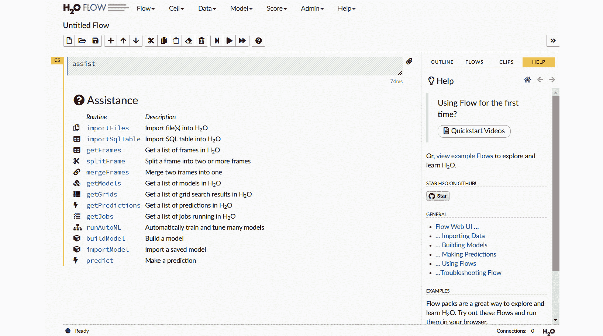

图 2.1 – H2O Flow UI 的主页面

如果您看到一些细微的差异，请不要惊慌。这可能是由于您安装的版本可能与本书中显示的不同。尽管如此，UI 的基本设置应该是相似的。正如您所看到的，有大量的交互式选项可供选择。一开始可能会有些令人不知所措，所以让我们一步一步来。

在网页的顶部，有各种机器学习对象操作，每个操作都有自己的功能下拉列表。它们如下所示：

+   **Flow**：本节包含所有与 Flow 笔记本相关的操作。

+   **Cell**：本节包含所有与笔记本中单个单元格相关的操作。

+   **Data**：本节包含所有与数据处理相关的操作。

+   **Model**：本节包含所有与模型训练和算法相关的操作。

+   **评分**: 这个部分包含所有与评分和预测相关的操作。

+   **管理员**: 这个部分包含所有管理操作，例如下载日志。

+   **帮助**: 这个部分包含所有指向 H2O 文档的链接，以获取更多详细信息。

一旦我们开始创建我们的机器学习管道，我们将逐步详细地介绍它们。

以下截图显示了 H2O Flow UI 的各种机器学习功能操作：


图 2.2 – 机器学习对象操作工具栏

在此之后，我们有**流名称**和**流工具栏**设置。默认情况下，流名称将是**未命名流程**。流名称有助于在一般情况下识别整个流程，这样你就不会混淆不同的实验。**流工具栏**部分是一个简单的工具栏，它帮助你进行基本操作，例如编辑和管理你流程中的单元格。

以下截图显示了主页上存在的流程工具栏：


图 2.3 – 流名称和流工具栏部分

**单元格**是你可以逐个执行的代码执行行。它们也可以用来添加注释、标题，甚至是 Markdown 文本。

工具列表如下。我们将从左到右开始：

+   **新建**: 这将创建一个新的 Flow 笔记本。

+   **打开**: 这将打开存储在你系统中的现有 Flow 笔记本。

+   **保存**: 这将保存你的当前流程。

+   **插入单元格**: 这将在下方插入一个单元格。

+   **向上移动**: 这会将当前高亮的单元格向上移动到上面的单元格之上。

+   **向下移动**: 这将当前高亮的单元格移动到其下的单元格下方。

+   **剪切**: 这将剪切单元格并将其存储在剪贴板上。

+   **复制**: 这将复制当前高亮的单元格。

+   **粘贴**: 这将在当前高亮的单元格下方粘贴之前复制的单元格。

+   **清除单元格**: 如果有输出，这将清除单元格的输出。

+   **删除单元格**: 这将完全删除单元格。

+   **运行并选择下方**: 这将运行当前高亮的单元格，并在下面的单元格处停止。

+   **运行**: 这将运行当前高亮的单元格。

+   **运行所有**: 这将逐个从上到下运行所有单元格。

+   **协助我**: 这将执行一个协助命令，通过显示基本机器学习命令的链接来帮助你。

在你的流程的右侧有额外的支持选项，帮助你管理你的工作流程。你有**概要**、**流程**、**剪辑**和**帮助**。每个选项都有自己的列，包含功能细节。

以下截图显示了 H2O Flow UI 的各种支持选项：


图 2.4 – 支持选项

**概述**列显示了您执行的所有操作的列表。查看概述可以帮助您快速检查在创建您的机器学习管道时执行的步骤是否按正确顺序排列，是否有任何重复，或者是否有任何错误的步骤。

以下截图显示了**概述**支持选项部分：

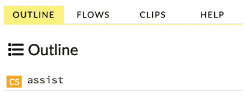

图 2.5 – 概述

**流程**列显示了您之前保存的所有流程。目前，您不会有任何，但一旦您保存了流程，它将在这里显示，并提供快速链接以打开它。请注意，在 H2O Flow 页面上一次只能打开一个 Flow 笔记本。如果您想同时处理多个流程，可以通过打开另一个标签页并在那里打开 Flow 笔记本来实现。

以下截图显示了**流程**支持选项部分：

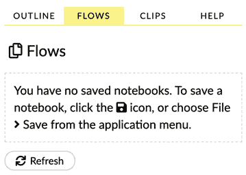

图 2.6 – 保存的流程

**CLIPS**列是您的剪贴板。如果您在流程中要多次运行的任何代码，则可以一次性编写并保存到剪贴板，方法是选择单元格右侧的纸夹图标。然后，您可以在需要时粘贴该单元格，而无需在流程中搜索它。剪贴板还存储了一定数量的垃圾单元格。

以下截图显示了**CLIPS**支持选项部分：

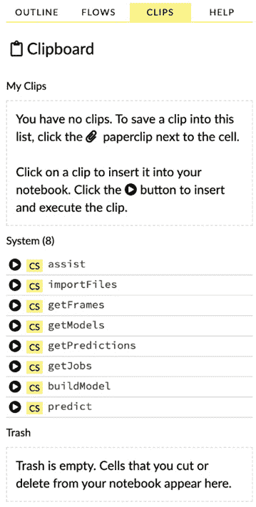

图 2.7 – 剪贴板

**帮助**列显示了各种资源，以帮助用户使用 H2O Flow。这包括快速入门视频、示例流程、一般使用示例以及指向官方文档的链接。请随意探索这些资源，以了解您如何使用 H2O Flow。

以下截图显示了**帮助**支持选项部分：

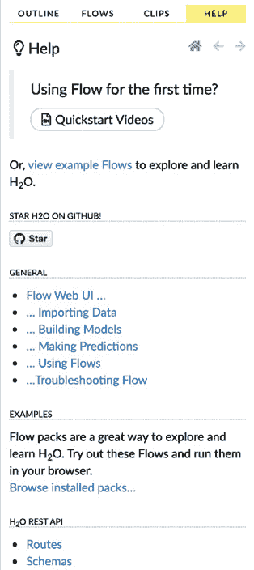

图 2.8 – 帮助部分

返回页面顶部，让我们探索前两个下拉列表。它们足够简单，易于理解。

以下截图显示了操作的第一下拉列表，即流程对象操作：

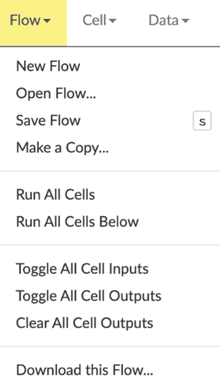

图 2.9 – 流程函数下拉列表

**流程**操作的下拉列表在一般意义上具有基本功能。您可以创建新的流程、打开现有的流程、保存、复制、运行流程中的所有单元格、清除输出以及下载流程。下载流程非常有用，因为您可以将您的机器学习工作轻松地从流程转移到其他系统。

在右侧是**单元**对象操作下拉列表（如图*图 2.10*所示）。这个下拉列表也易于理解。它具有操作流程中各种单元格的基本功能。通常，它针对 Flow 笔记本中突出显示的单元格。您只需点击它就可以更改突出显示的单元格：

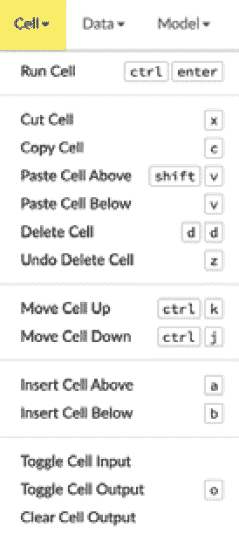

图 2.10 – 单元函数下拉列表

我们将在开始构建我们的机器学习流程时探索其他选项。

在本节中，我们了解了 H2O Flow 是什么，如何下载它，以及如何在本地启动它。此外，我们还探索了 H2O Flow UI 的各个部分以及它提供的各种功能。现在我们已经熟悉了我们的环境，让我们更深入地了解并创建我们的机器学习（ML）流程。我们将从流程的第一个部分开始，即处理数据。

# 在 H2O Flow 中与数据函数一起工作

机器学习流程始终从数据开始。您收集的数据量以及数据的质量在训练最高质量模型时起着非常关键的作用。如果数据的一部分与另一部分没有关系，或者如果存在大量不相关的噪声数据，那么模型的品质将相应降低。因此，在训练任何模型之前，我们通常会在将数据发送到模型训练之前对数据进行几个处理过程。H2O Flow 在其**数据**操作下拉列表中提供了所有这些过程的接口。

我们将逐步了解各种数据操作以及使用 H2O Flow 构建机器学习流程时的输出情况。

因此，让我们首先通过导入一个数据集来开始创建我们的机器学习流程。

## 导入数据集

本章我们将使用的数据集将是“心力衰竭预测”数据集。您可以在[`www.kaggle.com/fedesoriano/heart-failure-prediction`](https://www.kaggle.com/fedesoriano/heart-failure-prediction)找到心力衰竭预测数据集的详细信息。

这是一个包含有关个体胆固醇、最大心率、心绞痛和其他属性的健康信息的数据集，这些属性是判断一个人是否可能经历心力衰竭的重要指标。

让我们了解数据集的内容：

+   **Age**: 患者的年龄，单位为年

+   **Sex**: 患者的性别；男性为 M，女性为 F

+   **ChestPainType**:

    +   类型如下列出：

        +   **TA**: 典型心绞痛

        +   **ATA**: 不典型心绞痛

        +   **NAP**: 非心绞痛疼痛

        +   **ASY**: 无症状

+   **RestingBP**: 休息时的血压，单位为[毫米汞柱]

+   **Cholesterol**: 血清胆固醇，单位为[毫米/分升]

+   **FastingBS**: 空腹血糖，如果空腹血糖大于 120 mg/dl，则为 1，否则为 0

+   **RestingECG**: 休息时的心电图结果

    +   类型如下列出：

        +   **Normal**: 正常

        +   **ST**: 存在 ST-T 波异常

        +   **LVH**：根据 Estes 标准，显示可能或确定的左心室肥厚

+   **MaxHR**：达到的最大心率值，介于 60 和 202 之间

+   **ExerciseAngina**：运动诱导的心绞痛；Y 表示是，N 表示否

+   **Oldpeak**：ST（在下降时测量的数值）

+   **ST_Slope**：峰值运动 ST 段的斜率

    +   类型如下：

        +   **上升**：向上倾斜

        +   **Flat**：平坦

        +   **下降**：向下倾斜

+   **HeartDisease**：输出类别，其中 1 表示心脏病，0 表示无心脏病

我们将使用此数据集训练一个模型，尝试预测具有某些属性的人是否有面临心脏衰竭的潜力。请执行以下步骤：

1.  首先，让我们开始使用 H2O Flow 导入此数据集。

1.  在网页用户界面的最顶部，您可以看到 **数据** 对象操作的下拉列表。

1.  点击它，网页用户界面应显示如下截图所示的输出：

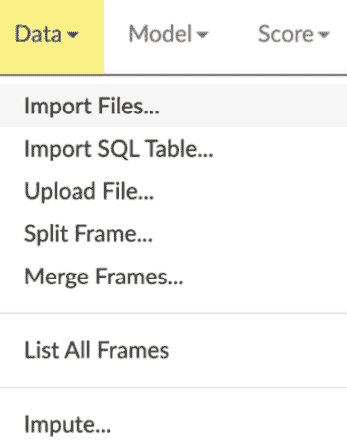

图 2.11 – 数据对象下拉列表

下拉列表显示您可以执行的所有各种操作列表，以及与您将要处理的数据相关的那些操作。

函数列表如下：

+   **导入文件**：此操作导入存储在您系统中的文件。它们可以是任何可读的文件，可以是 **逗号分隔值**（**CSV**）格式或 Excel 格式。

+   **导入 SQL 表**：如果您使用 SQL 数据库存储任何表格数据，此操作允许您导入存储在您的 **结构化查询语言**（**SQL**）表中的数据。当您点击它时，您将被提示输入您的 SQL 数据库的 **连接 URL** 值，以及其凭据、**表**名称、**列**名称，以及选择 **获取模式** 的选项，可以是 **分布式** 或 **单机**，如下面的截图所示：

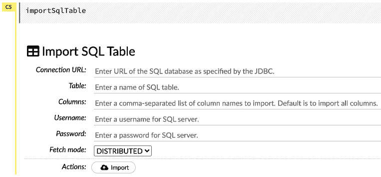

图 2.12 – 导入 SQL 表

+   **上传文件**：此操作从您的系统上传单个文件并立即解析它。

+   **分割框架**：此操作将已由 H2O Flow 导入和解析的数据框架分割成多个框架，您可以使用这些框架进行多个实验。

+   **合并框架**：此操作将多个框架合并为一个。当您点击它时，您将被提示选择右侧和左侧框架及其相应的列。此外，您可以选择包含在合并中的哪个框架的哪些行，如下面的截图所示：

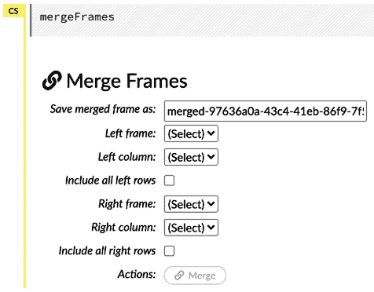

图 2.13 – 合并框架

+   **列出框架**：此操作列出所有当前由 H2O 导入和解析的框架。如果您想要在不同的数据集上运行您的管道，这很有帮助，这些数据集之前已被您导入或拼接。

+   **填充**：填充是将数据集中缺失的值替换为平均值的过程，这样它不会引入任何偏差，最小化值，最大化值，甚至空值。此操作允许你根据你的偏好替换你的框架中的这些值。

因此，首先，让我们导入`Heart Failure Prediction`数据集。

执行以下步骤：

1.  点击**数据**操作下拉列表。

1.  点击**导入文件…**。你应该会在你的流程中看到一个单元格上的操作被执行，如下面的截图所示：

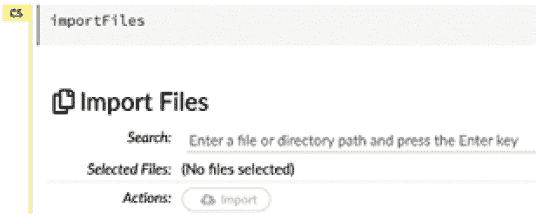

图 2.14 – 导入文件

你也可以通过在单元格中键入`importFiles`并按*Shift* + *Enter*直接运行相同的命令，而不是使用下拉列表。

1.  在搜索栏中，添加你已下载数据集的文件夹位置。

1.  点击最右侧的搜索按钮。这将显示文件夹中的所有文件，你可以选择要导入的文件。

1.  选择`heart.csv`数据集，如下面的截图所示：

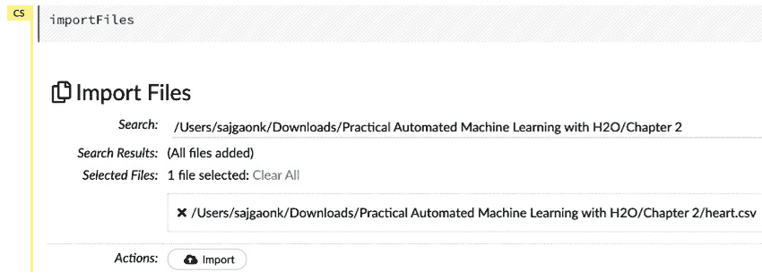

图 2.15 – 使用输入导入文件

1.  一旦你选择了文件，点击**导入**按钮。然后 H2O 将导入数据集并显示如下输出：

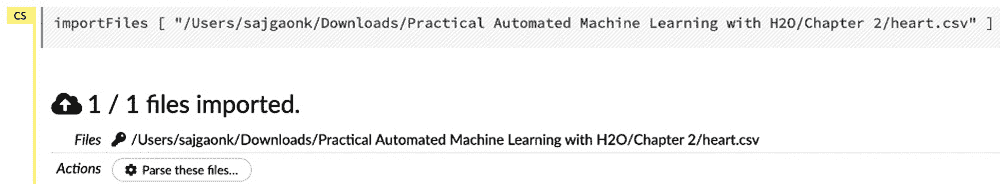

图 2.16 – 导入的文件

恭喜！你现在已成功将你的数据集导入到 H2O Flow 中。下一步是将它解析成逻辑格式。让我们了解什么是解析以及我们如何在 H2O Flow 中完成它。

## 解析数据集

**解析**是将数据集中的信息字符串分析并加载到逻辑格式中的过程，在这种情况下，是一个**hex**文件。hex 文件是一种内容以十六进制格式存储的文件。H2O 在内部使用此文件类型进行数据框操作并维护数据集的元数据。

让我们通过执行以下步骤来解析新导入的数据集：

1.  在导入数据集后，点击**解析这些文件…**按钮，如图*图 2.16*所示。

以下截图显示了你应该期望的输出：

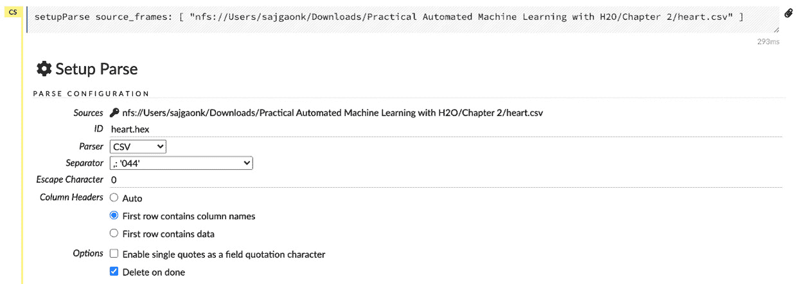

图 2.17 – 数据集解析输入

1.  然后，你将被提示输入`hex`文件。在解析过程中，你可以从以下配置中选择：

    +   **来源**：此配置表示你将要解析的数据集的来源。

    +   **ID**：此配置表示数据集的 ID。你可以更改将要创建的 hex 文件的 ID。

    +   **解析器**: 此配置设置用于解析数据集的解析器。您将使用不同的解析器来解析不同类型的数据集。例如，如果您正在解析 Parquet 文件，那么您需要选择 Parquet 文件解析器。在我们的情况下，我们正在解析 CSV 文件；因此，选择**CSV**解析器。您也可以将其设置为**自动**，H2O 将自行识别需要解析指定文件所需的解析器。

    +   **分隔符**: 此配置用于指定分隔数据集中值的分隔符。让我们将其保留为默认值，**,:’004’**，这是一个非常常见的 CSV 分隔符值。

    +   **转义字符**: 此配置用于指定数据集中使用的转义字符。让我们将其保留为默认值。

    +   **列标题**: 此配置用于指定数据集的第一行是否包含列名。H2O 将使用此信息来处理第一行，要么将其用作列信息，要么自动生成列名并使用第一行作为数据值。此外，您可以将值设置为**自动**，让 H2O 自行识别数据集的第一行是否包含列名。我们的数据集的第一行是列名，所以让我们选择**第一行包含列名**。

    +   **选项**: 此配置包含以下附加操作：

        +   **启用单引号作为字段引号字符**: 此选项启用单引号作为字段引号字符。

        +   **完成时删除**: 此选项在成功解析后删除导入的数据集。让我们勾选此选项，因为我们一旦成功解析就不会再需要导入的数据集。

1.  在**解析配置**部分下方，您有**编辑列名和类型**部分（见*图 2.18*）。在解析数据集之前，H2O 读取数据集并显示列名和它们提取的信息类型的简要摘要。这给了您编辑列名和类型的选择，以防它解释错误或您希望将列名更改为不同的名称。

以下截图显示了列名和解析数据集时编辑它们类型的选项：

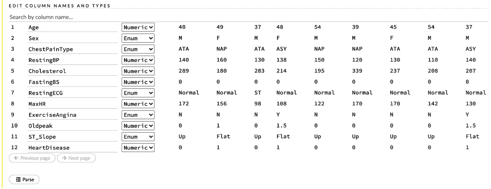

图 2.18 – 编辑列类型

现在，让我们简要了解列的类型，如前一个截图所示：

它们可以列出如下：

+   **数值**: 这表示该列中的值是数字。

+   **枚举**: 这表示该列中的值是**枚举类型**（**Enums**）。枚举是一组命名的非数值有限值集合。

+   **时间**: 这表示该列中的值是日期时间数据类型的值。

+   **UUID**: 这表示该列中的值是**通用唯一标识符**（**UUIDs**）。

+   **字符串**：这表示列中的值是字符串值。

+   **无效**：这表示列中的值无效，这意味着列中的值存在问题。

+   **未知**：这表示列中的值是未知的，这意味着列中没有值。

在训练过程中，H2O 根据列的类型不同对待数据框的列。有时，它会错误地解释列的值，并将错误的列类型分配给列。看看数据集的列及其对应类型。你可能会注意到，在导入数据集后，我们的**HeartDisease**输出列的类型是**数值型**。H2O 读取了 1 和 0，并假设它的类型是数值型。但实际上，它是一个**枚举**值，因为 1 表示心脏病，0 表示无心脏病。中间没有数值。我们在解析数据集时始终需要小心。我们需要确保在开始在该数据集上训练模型之前，H2O 正确地解释了数据集。H2O Flow 提供了一个在解析之前纠正这个问题的简单方法。

接下来，让我们纠正列的类型：

1.  选择**HeartDisease**列名旁边的下拉列表，将其设置为**枚举**。

1.  同样，**FastingBS**将被设置为**数值型**，但实际上，它是一个基于其描述的**枚举**值。所以，让我们将其设置为**枚举**。

1.  现在我们已经纠正了列的类型，并选择了正确的解析配置，让我们解析数据集。点击输出底部的**解析**按钮。

以下截图显示了解析后的输出：

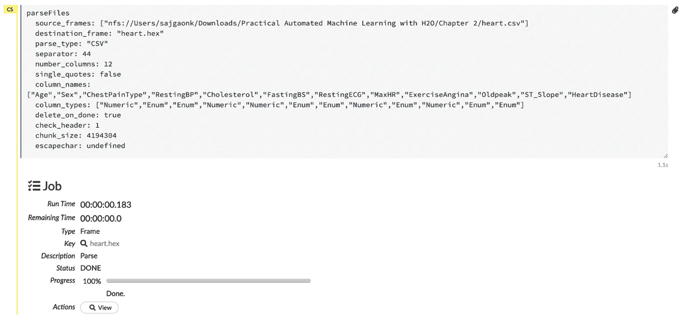

图 2.19 – 解析输出

现在，让我们观察从上一个截图得到的输出：

+   **运行时间**：这个输出显示了从 H2O 开始解析数据集以来的运行时间。

+   **剩余时间**：这个输出显示了 H2O 完成解析数据集预计所需的时间。

+   **类型**：这个输出显示了解析文件的类型。

+   **键**：这个输出显示了一个链接到十六进制文件，该文件是在成功解析后生成的。

+   **描述**：这个输出显示了当前正在进行的操作。

+   **状态**：这个输出显示了操作当前的状态。

+   **进度**：这个输出显示了操作的进度条。

+   **操作**：这个输出是一个按钮，显示在成功解析数据集后生成的十六进制文件。

恭喜！你已经成功解析了你的数据集，并生成了十六进制文件。十六进制文件通常被称为**数据框**。现在我们已经生成了数据框，让我们看看我们可以对数据框执行的各种元数据和操作。

## 观察数据框

数据框是 H2O 可以执行多个数据操作的主要数据对象。此外，H2O 还提供了关于数据框内容的详细见解和统计数据。当处理非常大的数据框时，这些见解特别有帮助，因为很难确定任何列中是否存在缺失值或零，而数据行可以从数千到数百万不等。

因此，让我们观察我们刚刚解析的数据框并探索其功能。您可以通过执行以下操作之一从我们在*图 2.19*中看到的解析输出中查看数据框：

+   在**键**行中单击`heart.hex`超链接。

+   在**操作**行中单击**查看数据**按钮。

以下截图显示了之前提到的操作的输出：

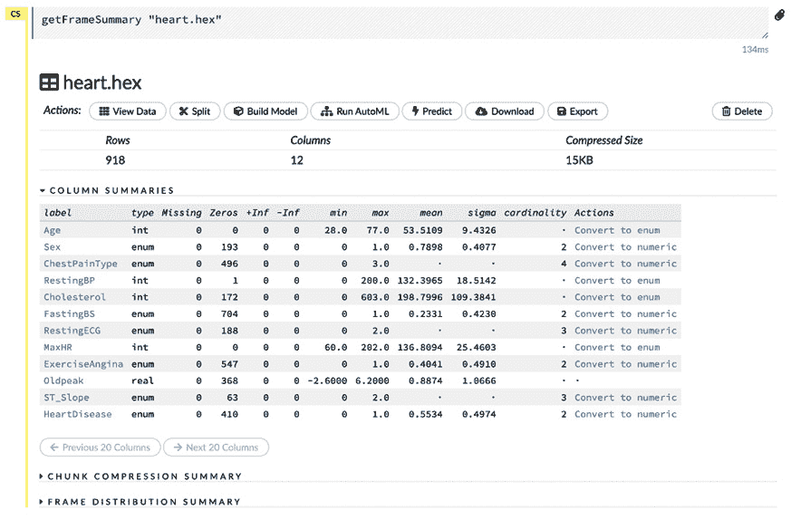

图 2.20 – 查看数据框

输出显示了数据框的摘要。在探索**操作**部分的各种操作之前，首先让我们探索下面的数据框元数据。

元数据包括以下内容：

+   **行数**：显示数据集中的行数。

+   **列数**：显示数据集中的列数。

+   **压缩大小**：显示数据框的总压缩大小。

在元数据下方，您有**列摘要**部分。在这里，您可以查看数据框内容的统计数据，这些数据按列划分。

摘要包含以下信息：

+   **标签**：此列显示了数据框列的名称。

+   **类型**：此列显示了列的类型。

+   **缺失**：此列显示了该列中缺失值的数量。

+   **零**：此列显示了该列中的零的数量。

+   **+Inf**：此列显示了正无穷值的数量。

+   **-Inf**：此列显示了负无穷值的数量。

+   **min**：此列显示了该列的最小值。

+   **max**：这显示了该列的最大值。

+   **sigma**：此列显示了该列值的变异性。

+   **基数**：此列显示了该列中唯一值的数量。

+   **操作**：此列显示了可以在数据框的列上执行的一些操作。这些操作主要涉及将列转换为不同类型。如果 H2O 在解析后错误地读取了列类型，这非常有用。

你可能想知道为什么在**Sex**和**RestingECG**等列的**Zeros**列中看到了很多值。这是因为**编码**。当解析枚举列时，H2O 将枚举和字符串编码成从 0 开始的数值，然后是 1，接着是 2，以此类推。你也可以通过选择你想要的编码过程来控制这个编码过程，例如，**标签编码**或**独热编码**。我们将在*第五章*中更详细地讨论编码，*理解 AutoML 算法*。

在**COLUMN SUMMARIES**部分之后，你会看到**CHUNK COMPRESSION SUMMARY**部分，如下截图所示：

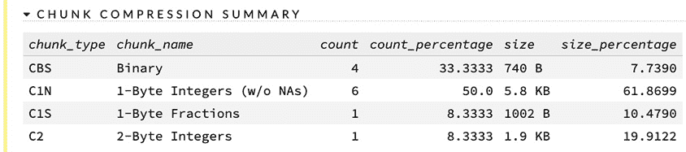

图 2.21 – 数据集的 CHUNK COMPRESSION SUMMARY 部分

当使用非常大的数据集时，如果以传统方式读取和写入数据，可能会花费很长时间。因此，系统如 Hadoop 文件系统、Spark 等经常被使用，因为它们以分布式方式执行读写，比传统的连续方式更快。**分块**是一个过程，其中分布式文件系统如 Hadoop 将数据集分割成块并在写入磁盘之前将它们展平。H2O 内部处理所有这些，这样用户就不需要担心管理分布式读写。**CHUNK COMPRESSION SUMMARY**部分只是提供了关于块分布的额外信息。

在**CHUNK COMPRESSION SUMMARY**下方是**FRAME DISTRIBUTION SUMMARY**部分，如下截图所示：

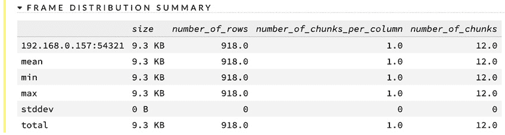

图 2.22 – 数据集的 Frame Distribution Summary 部分

**FRAME DISTRIBUTION SUMMARY**部分提供了关于数据框的一般统计信息。如果你导入了多个文件并将它们解析成一个单一的数据框，那么框架分布摘要将计算总大小、平均大小、最小大小、最大大小、每个数据集的块数等等。

回顾一下*图 2.20*中的数据框，你可以看到列名被突出显示为链接。让我们点击最后一个列，**HeartDisease**。

下面的截图将展示**HeartDisease**列的列摘要：

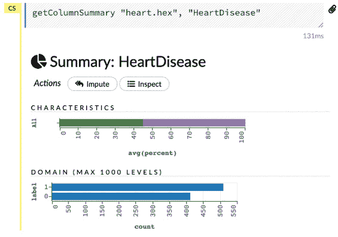

图 2.23 – 列摘要

**列摘要**根据列的类型提供了关于数据集中各个列的更多详细信息。

对于像**HeartDisease**这样的枚举类型，它会显示如下列的详细信息：

+   **特征**：此图表显示了零值和非零值的百分比分布。

+   **域**：此图表显示了列的域，即一个值在总行数中被重复的次数。

当你将鼠标悬停在图表上时，你会看到更多详细信息。请随意探索所有列并尝试理解它们的特征。

返回到*图 2.20*的 dataframe，现在让我们看看**操作**部分。这包括可以在 dataframe 上执行的一些操作。

这些操作包括以下内容：

+   **查看数据**：此操作显示 dataframe 中的数据。

+   **分割**：此操作将 dataframe 按指定的比例分割成指定的部分。

+   **构建模型**：此操作在此 dataframe 上开始构建模型。

+   **运行 AutoML**：此操作会在 dataframe 上触发 AutoML。

+   **预测**：此操作使用 dataframe 在已训练的模型上进行预测并获取结果。

+   **下载**：此操作将 dataframe 下载到系统中。

+   **导出**：此操作将 dataframe 导出到系统中的指定路径。

尽管我们很兴奋要触发 AutoML，但让我们继续探索 dataframe 的各种功能。

现在，让我们看看 dataframe 及其实际的数据内容。为此，请在**操作**部分的**查看数据**按钮上点击。

以下截图显示了点击**查看数据**按钮的输出：

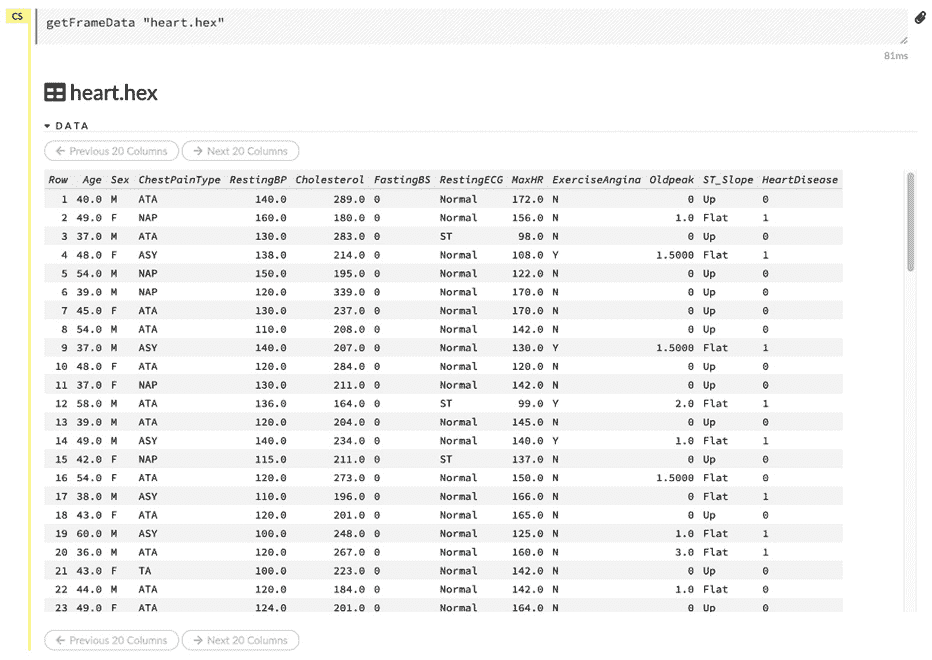

图 2.24 – dataframe 的内容视图

此功能显示数据集的实际内容。你可以向下滚动以查看 dataframe 的所有内容。如果你在 dataframe 上执行了任何操作，那么你可以使用此操作查看 dataframe 内容的变化。

现在你已经探索并理解了 dataframe 的各种操作和数据元数据，让我们调查另一个有趣的 dataframe 操作，称为**分割**。

## 分割 dataframe

在我们将 dataframe 发送进行模型训练之前，我们需要一个包含预测值的样本 dataframe。这个样本可以用来验证模型是否做出正确的预测，并衡量模型的准确性和性能。我们可以通过保留 dataframe 的一小部分用于后续验证来实现这一点。这就是分割功能出现的地方。

**分割**，正如其名所示，将数据集分割成我们可以后来用于不同操作的部分。数据集的分割会考虑比例。H2O 根据你想要进行的分割数量和数据分布的比例创建多个 dataframe。

要分割 dataframe，请在**操作**部分的**分割**操作按钮上点击。

以下截图显示了点击**分割**按钮的输出：

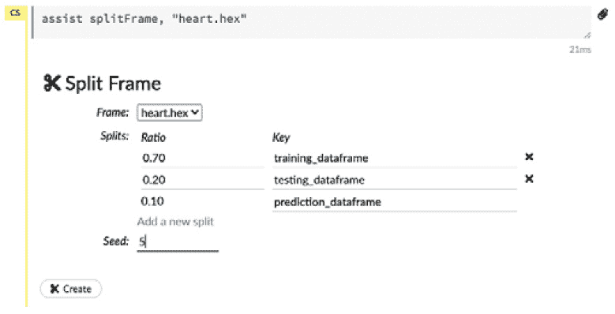

图 2.25 – 分割 dataframe

在前面的输出中，你将被提示输入分割配置，如下所示：

+   **框架**：此配置允许你选择要分割的框架。

+   `training_dataframe`比例为 0.70

+   `validation_dataframe`，比例为 0.20

+   `testing_dataframe`，比例为 0.10

+   **种子**：此配置允许您选择随机化点。分割不是线性分割数据框。它随机分割数据框的行。这是好事，因为它在分割的数据框之间均匀分配数据，从而消除了数据集行序列中可能存在的任何偏差。在我们的演示中，让我们将种子值设置为 5。

一旦你进行了这些更改，点击**创建**按钮。这将生成三个数据框：**training_dataframe**、**validation_dataframe**和**testing_dataframe**。这三个框架将存储在 H2O 的本地存储库中，也可以用于其他实验。

以下图表显示了**创建**操作的结果：

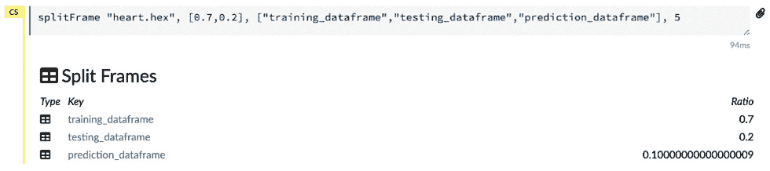

图 2.26 – 分割数据集结果

这三个数据框都是独立的数据框，它们具有与你在*图 2.20*中看到的原始数据集相同的特征和选项。分割不会删除原始数据框。它创建新的数据框，并将原始数据框中的数据根据所选比例分配到这些数据框中。

现在我们已经准备好了训练框架、验证框架和测试框架，我们就可以进入模型训练管道的下一步，即模型训练。

因此，为了总结，在本节中，你了解了可以在 H2O Flow 中执行的多种数据操作，例如导入、解析、读取解析后的数据框以及分割它。

在下一节中，我们将专注于模型训练，并使用 H2O AutoML 在我们在本节中创建的数据框上训练模型。

# 在 H2O Flow 中与模型训练函数一起工作

一旦您的数据集准备就绪，模型训练管道的下一步就是实际的训练部分。模型的训练可能非常复杂，因为有许多配置决定了模型如何在数据集上训练。即使在 AutoML 中，大多数超参数调整也是在幕后完成的，这也是事实。不仅对于特定类型的数据，训练模型有正确和错误的方法，而且一些配置值也可能影响模型的表现。因此，了解 H2O 在训练模型时提供的各种配置参数非常重要。在本节中，我们将专注于了解这些参数是什么，以及它们在模型训练中的具体作用。

我们将通过使用我们之前创建的数据框，逐步了解如何使用 AutoML 训练模型。

注意，在这个部分有很多东西在这个阶段理解起来会过于复杂。我们将在未来的章节中探讨其中的一些。目前，我们将只关注我们现在可以理解的功能，因为本章的目标是理解 H2O Flow 以及如何使用 AutoML 通过 H2O Flow 训练模型。

在接下来的子章节中，我们将了解模型训练操作，从了解 AutoML 训练配置参数开始。

## 理解 H2O Flow 中的 AutoML 参数

H2O AutoML 在如何训练模型方面具有极高的可配置性。尽管使用相同的 AutoML 技术，但每个行业通常都会根据其需求对如何训练模型有一定的偏好或倾向。因此，尽管 AutoML 正在自动化大多数 ML 过程，但在 AutoML 如何训练模型方面仍需要一定程度的控制和灵活性。H2O 为其 AutoML 功能提供了广泛的配置能力。让我们在训练模型时探索它们。

有两种方式可以在数据集上触发 AutoML。它们如下列出：

+   通过点击数据框输出**操作**部分的**运行 AutoML**按钮，如图*图 2.20*所示。

+   通过在**模型**部分的下拉菜单中选择**运行 AutoML**，在网页 UI 的最顶部，如图*图 2.27*所示。

我们选择第二个选项，以便我们可以探索网页 UI 页面顶部的**模型**操作部分。当你点击**模型**部分时，你应该会看到一个下拉列表，如下面的截图所示：

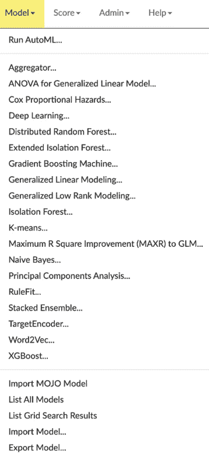

图 2.27 – 模型功能下拉列表

上述下拉列表将模型操作分为三种类型，如下所示：

+   **运行 AutoML**：这个操作通过提示用户输入配置值来启动 AutoML 过程，以使用 AutoML 训练模型。

+   **运行特定模型**：这个操作在特定的 ML 算法上启动模型训练，这些算法是你希望使用的；例如，深度学习、K-means 聚类、随机森林等。每个 ML 算法都有一组你必须指定的参数，以启动模型训练。

+   **模型管理选项**：这些操作是用于管理你在一段时间内可能训练过的各种模型的基本操作。

    +   操作列表如下：

        +   **导入 MOJO 模型**：这个操作导入之前由另一个 H2O 服务训练并导出为 MOJO 格式的 H2O **模型对象，优化**（**MOJO**）模型。

        +   **列出所有模型**：这个操作列出由你的 H2O 服务训练的所有模型。这包括由其他 Flow 笔记本训练的模型。

        +   **列出网格搜索结果**：网格搜索是一种在训练模型以获得最佳和最准确性能时寻找最佳超参数的技术。此操作列出从模型训练中获取的所有网格搜索结果。

        +   **导入模型**：此操作将模型对象导入到 H2O 中。

        +   **导出模型**：此操作将模型对象导出到系统，可以是二进制文件或 MOJO 格式。

现在，让我们使用 AutoML 在我们的数据集上训练我们的模型。

点击**运行 AutoML**。如图 2.27 所示，您应该看到一个提示您输入各种配置参数以运行 AutoML 的输出。有大量的选项可以配置您的 AutoML 训练。这些选项可以极大地影响您的模型训练性能以及最终训练出的模型质量。参数被分为三类。让我们逐一探索它们，并从基本参数开始，输入适合我们模型训练要求的值。

### 基本参数

基本参数是那些关注所有模型训练操作所需的基本输入的参数。这些参数在所有机器学习算法中都是通用的，并且是自我解释的。

以下截图显示了您需要输入以配置 AutoML 的基本参数值：

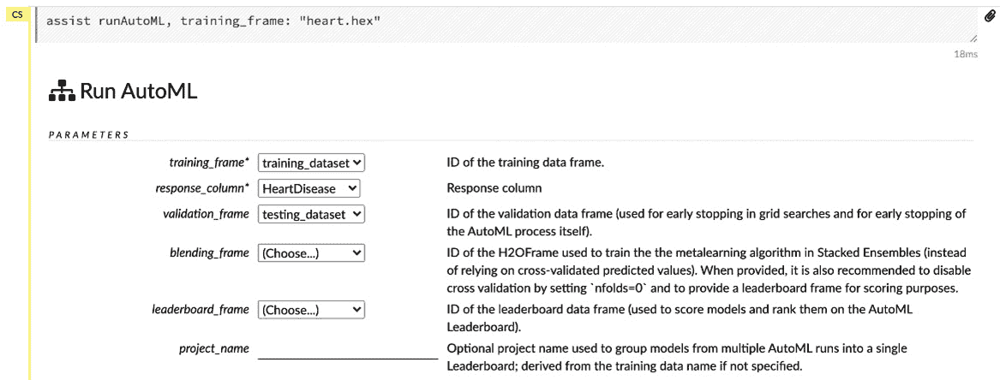

图 2.28 – AutoML 的基本参数

基本参数如下所示：

+   `training_frame`参数是我们创建在*使用 H2O Flow 中的数据函数*部分中的`training_dataframe.hex`文件。

+   `HeartDisease`列。

+   我们在上一节中创建的`validation_dataframe.hex`文件。

+   **blending_frame**：此配置设置用于训练堆叠集成模型的 dataframe。目前，我们可以忽略这一点，因为我们不会在本章中深入探讨堆叠集成。我们将在*第五章*“理解 AutoML 算法”中更详细地探讨堆叠集成模型，所以让我们留空。

+   将`nfolds`设置为 0，然后 AutoML 将从训练框架生成排行榜。

+   **项目名称**：此配置设置您的项目名称。AutoML 将所有多次运行的结果组合到单个排行榜下，该排行榜以项目名称命名。如果您留空此值，H2O 将自动为其生成一个随机项目名称。

+   **分布**：此配置用于指定机器学习算法将使用的分布函数类型。支持指定类型分布函数的算法将使用它，而其他算法将使用它们的默认值。我们将在*第五章*“理解 AutoML 算法”中了解更多关于分布函数的内容。

现在您已经了解了 AutoML 的基本参数，让我们来了解高级参数。

### 高级参数

高级参数为使用 AutoML 训练模型提供了额外的配置。这些参数已经设置了某些默认值，因此不是必需的。然而，它们确实提供了额外的配置，这些配置会改变 AutoML 在训练模型时的行为。

下面的截图显示了 AutoML 的高级参数的第一部分：

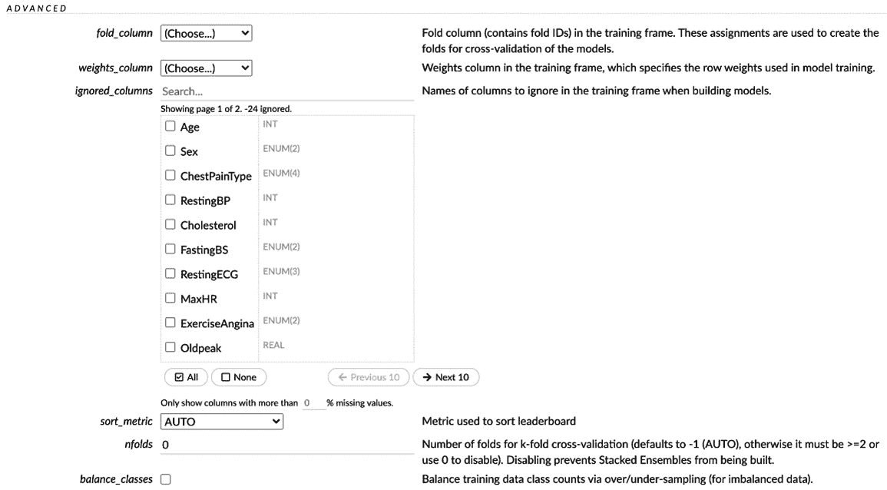

图 2.29 – AutoML 高级参数，第一部分

立即在这之下将是高级参数的第二部分。向下滚动查看剩余的参数，如下面的截图所示：

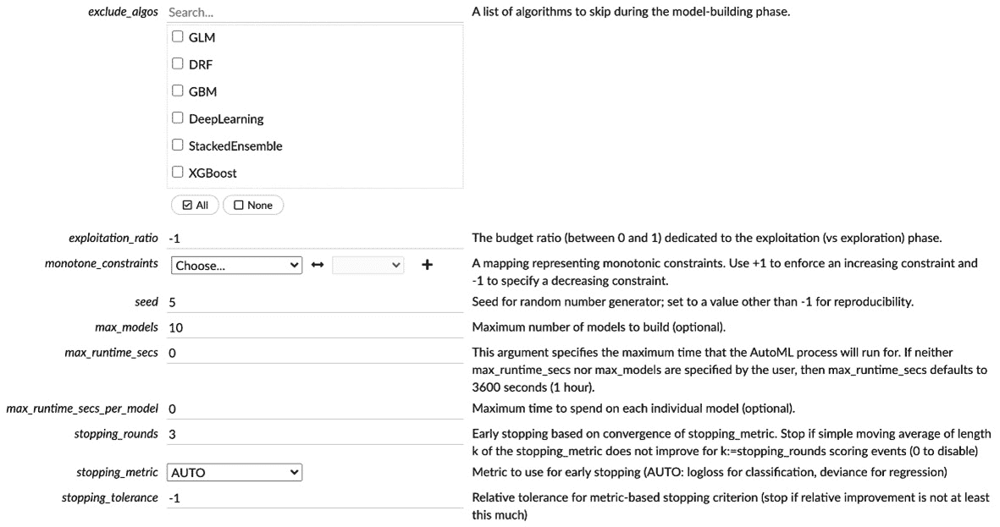

图 2.30 – AutoML 高级参数，第二部分

让我们逐一探索这些参数。高级参数如下所示：

+   **fold_column**：此参数使用列值作为其 N 折交叉验证中折叠的基础。我们将在接下来的章节中学习更多关于交叉验证的内容。

+   **weights_column**：此参数为训练数据框中的某一列赋予权重，或者简单地说，给予该列优先权。我们将在后面的章节中更详细地探讨模型训练中的权重问题。

+   **ignored_columns**：此参数允许您选择在训练模型时希望忽略的训练数据框中的列。在我们的实验中，我们不会忽略任何列，所以我们将保留所有列未选中。

+   **sort_metrics**：此参数选择 AutoML 训练的模型将使用的排序和排名指标。选择**AUTO**将使用**AUC**指标进行二分类，**mean_per_class_error**用于多项式分类，以及**deviance**用于回归。为了简化起见，让我们将**均方误差**（**MSE**）设置为排序指标，因为它更容易理解。我们将在*第六章*中更详细地探讨指标，*理解 H2O AutoML 排行榜和其他性能指标*。

+   `0` 用于防止创建堆叠集成模型。我们将在接下来的章节中进一步探讨堆叠集成模型和交叉验证。

+   **Balance_classes**: 在模型训练中，始终最好在具有输出类别值均匀分布的数据集上训练模型。这可以减轻由于值分布不均可能产生的任何偏差。此参数平衡输出类别，使其数量相等。在我们的案例中，输出类别是**心脏病**列。正如我们在**心脏病**列的列摘要中看到的，在分布部分，我们有大约 410 个值为 0，508 个值为 1（*见图 2.23*）。因此，理想情况下，我们需要在训练模型之前平衡类别。然而，为了简化当前的操作，我们将跳过类别的平衡，专注于理解基础知识。我们将在接下来的章节中进一步探讨类别平衡。

+   **exclude_algos**: 此参数排除 AutoML 训练中的某些算法。在我们的实验中，我们希望考虑所有算法，所以让我们将值留空。

+   `-1`保持原样。

+   **monotone_constraints**: 在某些情况下，如果对特征之间关系有非常强烈的先验信念，认为它们具有某种性质，可以使用约束来提高模型的预测性能。此参数有助于设置这些约束。我们将在接下来的章节中进一步讨论这个问题。现在，让我们将此值留空。

+   `5`。

+   `10`，否则模型训练可能会花费很长时间。

+   **max_runtime_secs**: 此参数设置 H2O 在训练单个模型上应花费的最大时间。通常，数据集的大小越大，模型训练所需的时间就越长。为模型训练设置非常短的时间将不会给 AutoML 足够的时间来训练模型。由于我们的数据集不是很大，我们将让 AutoML 有足够的时间来训练模型，这不应该花很长时间。

+   **max_runtime_sec_per_model**: 此参数设置 AutoML 在训练单个模型上应花费的最大时间。模型训练不会花费太多时间。所以，让我们忽略这个参数。

+   `0`以禁用它。

+   **stopping_metrics**: 此指标用于早期停止。由于停止功能被禁用，我们将忽略此参数。

+   **stopping_tolerance**: 这指的是在渐进式模型训练中，当预期改进的相对容忍度低于此值时，AutoML 应停止训练模型。由于停止功能被禁用，我们将忽略此参数。

现在你已经了解了 AutoML 的基本参数，让我们检查专家参数。

### 专家参数

专家参数是提供额外选项的参数，这些选项通过添加有助于进一步实验的额外功能来补充 AutoML 训练结果。这些参数取决于你在*高级参数*部分已选定的配置。

以下截图显示了当前演练中可用的专家参数选项：

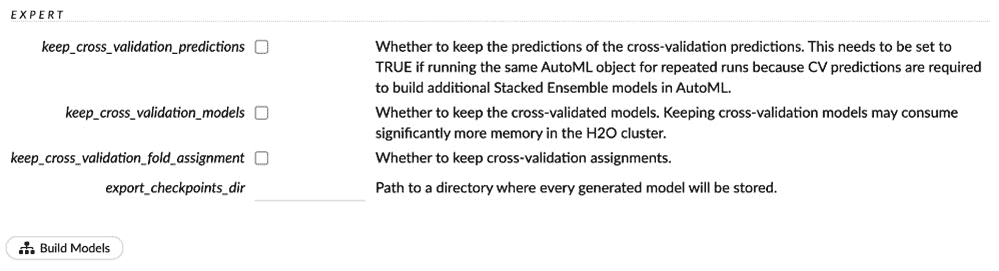

图 2.31 – AutoML 专家参数

专家参数如下列出：

+   **keep_cross_validation_predictions**：如果训练启用了交叉验证，那么 H2O 提供了保存那些预测值的选项。

+   **keep_cross_validation_models**：如果训练启用了交叉验证，那么 H2O 提供了保存用于相同训练的模型的选项。

+   **keep_cross_validation_fold_assignments**：如果训练启用了交叉验证，那么 H2O 提供了保存用于不同交叉验证中模型训练的折的选项。

+   **export_checkpoint_dir**：这是 H2O 将存储生成的模型的目录路径。

根据你在基本和高级参数中选择的内容，将提供更多专家选项。目前，我们可以禁用所有专家参数，因为我们在这个教程中不会过多关注它们。

一旦你设置了所有参数值，现在剩下的唯一事情就是触发 AutoML 模型训练。

## 在 H2O Flow 中使用 AutoML 训练和了解模型

模型训练是机器学习管道中最复杂和最重要的部分之一。模型训练是通过学习特征与预期输出之间的关系，通过最小化损失来映射数学近似的过程。你可以用各种方法来做这件事。系统执行此任务的方法被称为机器学习算法。AutoML 使用各种机器学习算法来训练模型，并比较它们的性能，以找到根据机器学习问题具有最小误差度量值的模型。

首先，让我们了解如何在 H2O Flow 中使用 AutoML 训练模型。

### 在 H2O Flow 中使用 AutoML 训练模型

当设置使用 AutoML 训练模型的参数值时，你需要仔细考虑。一旦你选择了正确的输入，你就可以触发 AutoML 模型训练。

你可以通过点击**构建模型**按钮在**运行 AutoML**输出的末尾来完成此操作。

以下截图显示了 AutoML 训练作业的进度：

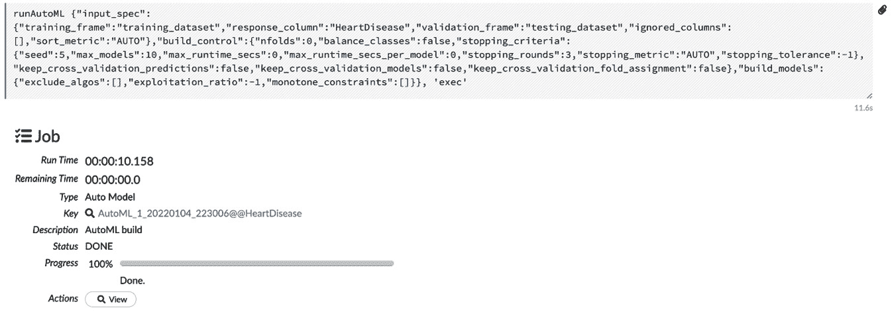

图 2.32 – AutoML 训练已完成

训练模型需要一些时间。模型训练的结果存储在**排行榜**上。**键**部分的值是排行榜的链接（见*图 2.32*）。

你可以通过以下两种方式之一查看排行榜。它们如下列出：

+   点击 AutoML 训练作业输出中的**键**部分中的排行榜链接。

+   点击 AutoML 训练作业输出的**查看**按钮。

在以下截图中，你可以看到**排行榜**的样子：

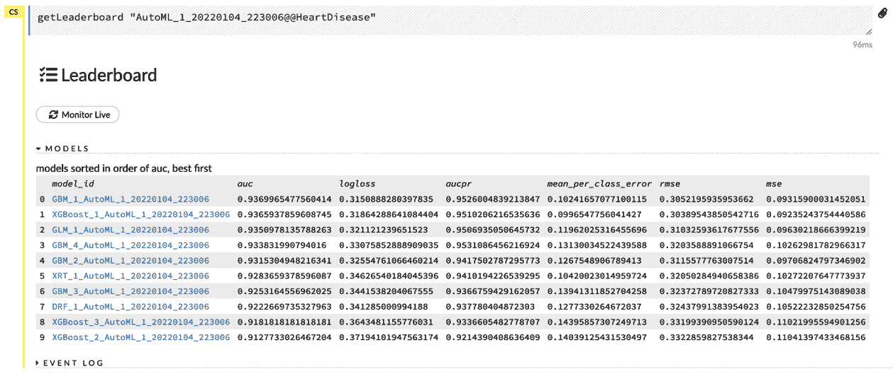

图 2.33 – AutoML 排行榜

如果您遵循了前面示例中显示的相同步骤，那么您应该看到相同的输出，尽管模型的 ID 可能略有不同，因为它们是随机生成的。排行榜显示了 AutoML 训练的所有模型，并根据**排序指标**从最好到最差进行排名。排序指标是衡量模型质量的一种统计测量，用于比较不同模型的性能。此外，排行榜还包含所有单个模型详情的链接。您可以选择其中的任何一个来获取有关单个模型的更多信息。如果 AutoML 正在运行并正在训练模型，您还可以通过点击**实时监控**按钮来实时查看训练进度。

现在您已经了解了如何使用 AutoML 训练模型，让我们深入探讨机器学习模型细节，并尝试理解其各种特性。

### 理解机器学习模型

一个机器学习模型可以被描述为一个包含数学方程式的对象，该方程式可以识别给定特征集的模式并预测潜在的输出。这些机器学习模型构成了所有机器学习管道的核心组件，因为整个机器学习管道的目标是创建和使用这些模型进行预测。因此，了解训练好的机器学习模型的各个方面细节对于判断其做出的预测是否准确以及准确程度如何至关重要。

让我们点击排行榜上的最佳模型，以了解其更多细节。您应该看到以下输出：

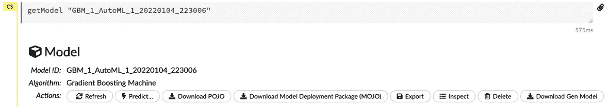

图 2.34 – 模型信息

如您所见，H2O 提供了对模型细节的非常深入的视图。所有细节都分类在其各自的子节中。这里有很多信息，因此可能会让人感到不知所措。目前，我们将只关注重要的部分。

让我们逐一浏览重要且易于理解的细节：

+   **模型 ID**：这是模型的 ID。

+   **算法**：这表示用于训练模型的算法。

+   **操作**：一旦模型被训练，您可以对它执行以下操作：

    +   **刷新**：这将刷新内存中的模型。

    +   **预测**：这允许您开始在此模型上进行预测。

    +   **下载 POJO**：这将以**纯旧 Java 对象**（**POJO**）格式下载模型。

    +   **下载模型部署包**：这将以 MOJO 格式下载模型。

    +   **导出**：这将以文件或 MOJO 格式将模型导出到系统。

    +   **检查**：H2O 进入检查模式，其中它检查模型对象，检索有关其模式和子模式的详细信息。

    +   **删除**：这将删除模型。

    +   **下载生成模型**：这将下载生成的模型 JAR 文件。

然后，您将有一组子节，解释更多关于模型的元数据和性能。这些子节对于不同的模型略有不同，因为某些模型可能需要显示一些额外的元数据以供解释性目的。

如您所见，许多细节在本质上似乎非常复杂，这是理所当然的。这是因为它们涉及一些数据科学知识。请放心；我们将在接下来的章节中探讨所有这些内容。

让我们通过更容易的子节来了解 ML 模型的各个元数据：

+   **模型参数**: 模型参数不过是传递给 AutoML 的输入参数，以及 AutoML 决定用于训练模型的一些输入。您可以通过点击**显示所有参数**或**显示修改参数**按钮来选择查看所有参数或仅查看修改过的参数。每个参数的描述都显示在每个参数旁边。

+   **变量重要性**: 变量重要性表示变量在预测中的重要性。重要性最高的变量是 ML 模型在预测时最依赖的变量。任何对高重要性变量的更改都可能极大地影响模型预测。

以下截图显示了用于训练模型的 dataframe 中各种特征的缩放重要性：

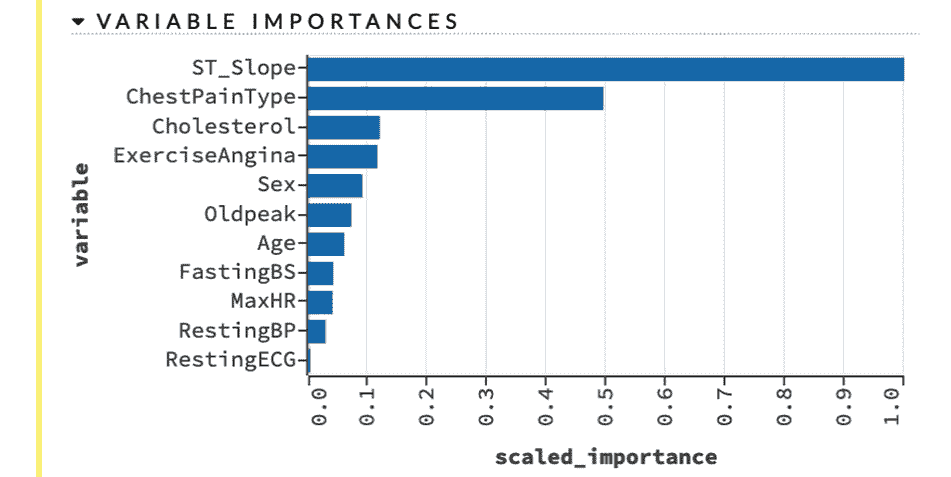

图 2.35 – 变量重要性

+   **输出**: 输出子节表示 AutoML 训练的基本输出值。显示的大多数细节都是交叉验证结果。

输出值如下所示：

+   **模型类别**: 此值表示模型的类别，表示它执行何种预测。二项式表示它执行二项式分类，这意味着它预测值是**1**还是**0**。在我们的案例中，**1**表示该人可能面临心脏病，而**0**表示该人不太可能面临心脏病。

+   **开始时间**: 此值表示模型训练开始的 epoch 时间。

+   **结束时间**: 此值表示模型训练结束时的 epoch 时间。

+   **运行时间**: 此值表示完成模型训练所需的总时间。

+   **默认阈值**: 这是模型将所有预测视为**1**的默认阈值。同样，低于默认阈值的任何预测值将被视为**0**。

以下截图显示了模型详细信息输出子节：

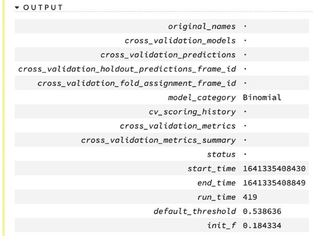

图 2.36 – 模型信息输出

+   **列类型**: 本小节为您简要介绍了数据框中列的类型。这些值与训练数据框中列的顺序相同。

下面的截图显示了模型细节的**列类型**指标：

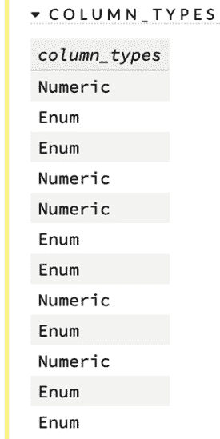

图 2.37 – 列类型

+   **输出 - 训练指标**：此子部分显示了当使用训练数据集进行预测时模型的指标。我们将在未来的章节中学习有关机器学习各种指标的内容。

下面的截图显示了模型细节的训练指标：

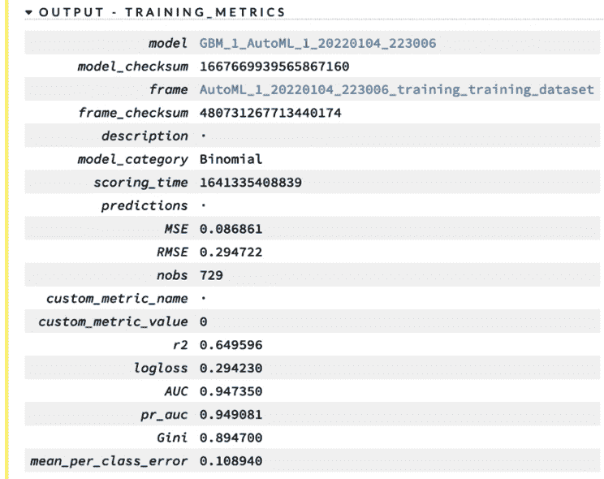

图 2.38 – 模型输出的训练指标

+   **输出 - 验证指标**：类似于前面的子部分，此子部分显示了当使用验证数据集进行预测时模型的指标。

下面的截图显示了模型细节的训练指标：

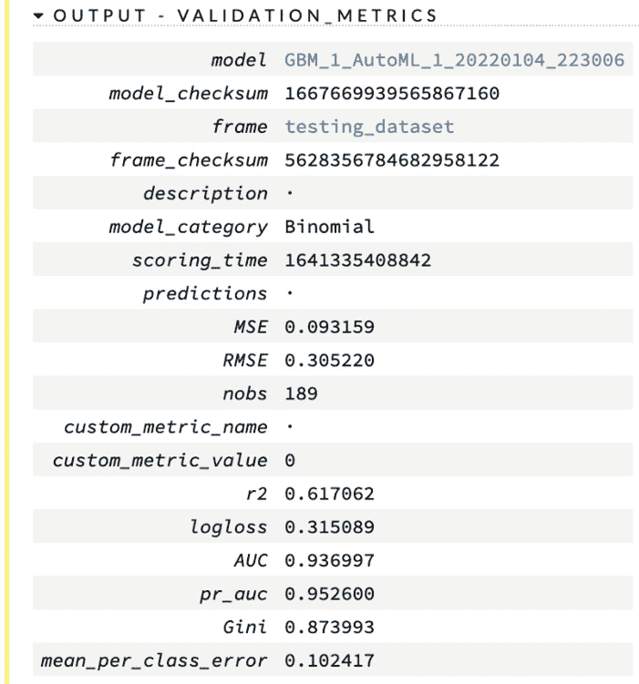

图 2.39 – 模型输出的验证指标

现在我们已经了解了模型细节的各个部分，让我们看看我们如何可以对这个新训练的模型进行预测。

# 在 H2O Flow 中使用预测函数

现在你终于有一个训练好的模型了，我们可以在它上面进行预测。对训练好的模型进行预测很简单。你只需要加载模型，并传入你的数据集，该数据集包含你想要进行预测的数据。H2O 将使用加载的模型并对数据集中的所有值进行预测。让我们使用之前创建的 `prediction_dataframe.hex` 数据框来进行预测。

在接下来的子部分中，我们将了解预测操作，首先了解如何进行预测。

## 使用 H2O Flow 进行预测

首先，让我们从探索网页 UI 顶部的**评分**操作下拉列表开始。

你将看到以下评分操作的列表：


图 2.40 – 评分函数下拉菜单

前面的下拉菜单显示了你可以执行的所有各种评分操作的列表。

函数列表如下：

+   **预测**：这使用训练好的模型进行预测。

+   **部分依赖图**：这些显示了变量对预测的影响的图形表示。换句话说，它们显示了在用于预测的数据中改变某些变量如何影响预测响应。

+   **列出所有预测**：此功能列出所有已进行的预测。

你可以在 H2O Flow 中开始进行预测有两种方式。如下所示：

+   使用来自**评分**操作下拉菜单的**预测**函数。

+   在模型的**操作**部分点击**预测**按钮，如图 2.34 所示。

这两种方法都会给出相同的结果，如下面的截图所示：

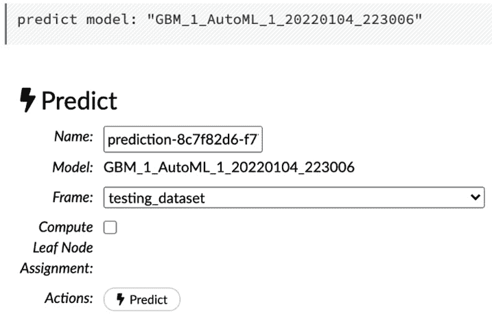

图 2.41 – 预测

点击 ML 模型的**预测**操作按钮将**模型**参数设置为相应的模型 ID。然而，当在**分数**操作下拉列表中点击**预测**操作按钮时，您可以选择任何模型。

**预测**操作将提示您以下参数：

+   **名称**：您可以给预测结果命名，以便更容易识别。如果您正在尝试不同的预测请求，并且需要快速参考您感兴趣的特定预测结果，这将特别有用。

+   **模型**：这是您希望用于进行预测的模型的 ID。由于我们选择了**梯度提升机（GBM）**模型的**预测**操作，这将不可编辑。

+   **框架**：这是您想要用于进行预测的数据框。因此，让我们选择**prediction_dataset.hex**文件。

+   **计算叶节点分配**：这返回了用于进行预测的数据框中每一行的行在模型的所有树中的叶节点位置。在我们的演示中，我们不需要这个功能，因此我们可以将其保持未选中状态。

一旦您选择了适当的参数值，剩下的唯一事情就是点击**预测**按钮来执行您的预测。

以下截图显示了**预测**操作的输出：

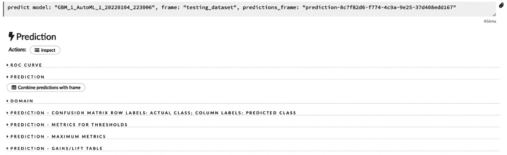

图 2.42 – 预测输出

恭喜！您终于成功地在由 AutoML 训练的模型上进行了预测。让我们继续到下一部分，我们将探索和理解我们刚刚得到的预测结果。

## 理解预测结果

预测是机器学习流程的最终阶段。它是将实际值带给所有投入创建机器学习流程的努力的部分。进行预测很容易；然而，理解实际预测值及其与输入值的关系是很重要的。

预测结果不仅提供了预测值的详细信息，还包括指标信息和某些元数据，如图 2.42 所示。

以下截图显示了您预测结果的预测输出子部分：

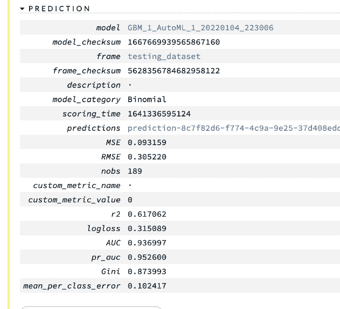

图 2.43 – 预测结果

这与我们在*图 2.38*和*图 2.39*中看到的模型详细信息的**输出 - 验证和训练指标**类似。

在这个子部分中，您可以在预测键旁边找到预测框架链接。点击它将显示您预测值的框架摘要。让我们这样做，以便我们可以更好地查看预测值。

以下截图显示了以数据框形式呈现的预测摘要详细信息：

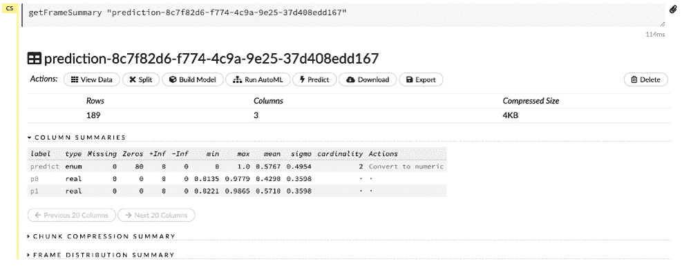

图 2.44 – 预测数据框

H2O 也将预测结果存储为数据框，因此它们具有我们在**在 H2O Flow 中处理数据函数**部分讨论的相同特性。

**列摘要**部分指示了预测数据框中的三列。它们如下列出：

+   **预测**：此列是枚举类型，表示预测数据框中输入行的预测值。

+   **P0**：此列表示预测值为 0 的概率。

+   **P1**：此列表示预测值为 1 的概率。

让我们查看数据以更好地理解其内容。你可以通过点击预测数据框输出中的**操作**部分的**查看数据**按钮来查看数据框的内容，如图 2.44 所示。

以下截图显示了查看预测数据时的预期输出：

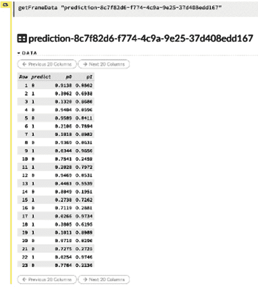

图 2.45 – 预测数据框的内容

让我们回到预测输出的**预测**子部分，如图 2.43 所示。让我们将预测结果与用作预测输入的数据框合并。你可以通过点击**将预测与框架合并**按钮来完成此操作。

以下截图显示了该操作的输出：

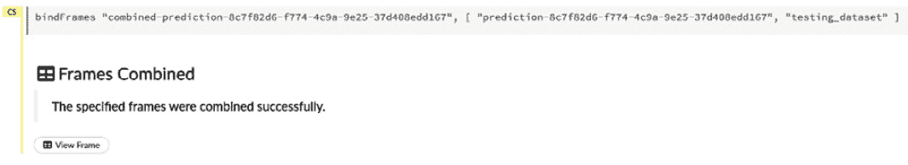

图 2.46 – 将预测与框架合并的结果

点击**查看框架**按钮会显示合并框架，它也是一个数据框。让我们点击**查看框架**按钮来查看框架的内容。

以下截图显示了从框架合并输出中的**查看框架**操作的输出：

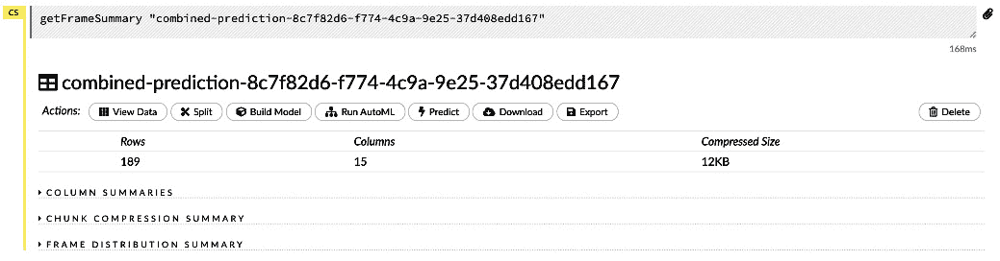

图 2.47 – 用于预测的数据框与预测结果的合并

在合并预测输出的**操作**部分的**查看数据**按钮中选择，会显示包含预测值的完整数据框内容。

以下截图显示了合并数据框的内容：

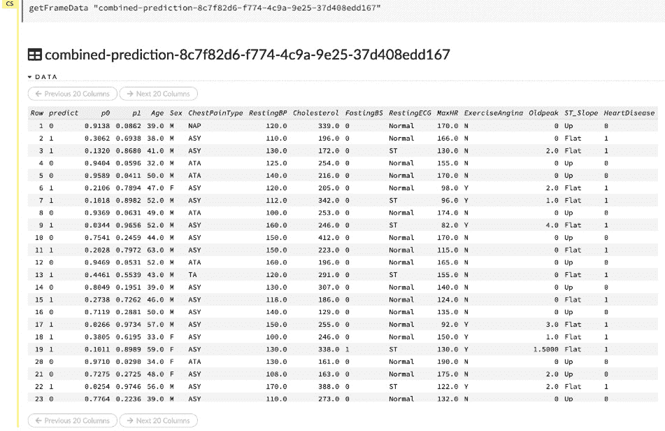

图 2.48 – 合并数据框的内容

观察合并数据框的内容，你会注意到你现在可以轻松地比较预测值，如**预测**列中提到的，以及与同一行中的**HeartDisease**列的实际值进行比较。

恭喜！你已经正式对一个你训练的模型进行了预测，并将结果合并到一个单独的数据框中，以便进行比较查看，你可以与你的利益相关者分享。因此，这总结了我们的 H2O Flow 创建 ML 管道的教程。

# 摘要

在本章中，我们了解了 H2O Flow 提供的各种功能。在熟悉了 Web UI 之后，我们开始实现我们的机器学习流程。我们导入了并解析了心力衰竭预测数据集。我们了解了可以在数据框上执行的各种操作，了解了数据框的元数据和统计数据，并为后续的训练、验证和预测模型做好了准备。

然后，我们使用 AutoML 在数据框上训练模型。我们了解了需要输入的各种参数，以正确配置 AutoML。我们使用 AutoML 训练模型并理解了排行榜。然后，我们更深入地研究了训练模型的细节，并尽力理解它们的特征。

在我们的模型训练完成后，我们对它进行了预测，并通过将其与原始数据框结合来探索预测输出，以便我们可以比较预测值。

在下一章中，我们将进一步探索各种数据操作操作。这将帮助我们了解在数据清洗和转换数据框方面需要采取哪些步骤，以及它如何提高训练模型的品质。

# 第二部分 H2O AutoML 深入探讨

本部分将帮助您理解 H2O AutoML 的内部工作原理。这包括 H2O AutoML 如何处理数据处理、训练和模型选择，以及它是如何衡量训练模型性能的。本部分还将帮助您理解如何阅读各种性能图表和其他模型细节，这些细节将有助于理解模型的行为。所有这些都将帮助您进一步实验和探索 H2O AutoML，并根据您的需求最大限度地利用它。

本节包括以下章节：

+   *第三章*，*理解数据处理*

+   *第四章*，*理解 H2O AutoML 训练和架构*

+   *第五章*，*理解 AutoML 算法*

+   *第六章*，*理解 H2O AutoML 排行榜和其他性能指标*

+   *第七章*，*与模型可解释性工作*
