# 3

# 理解数据处理

**机器学习**（**ML**）模型是在数据拟合到 ML 算法后得到的输出。它代表了各种特征之间的潜在关系以及这种关系如何影响目标变量。这种关系完全取决于数据集的内容。尽管使用相同的 ML 算法，但每个 ML 模型都是独特的，这是因为用于训练该模型的特定数据集。数据可以从各种来源收集，并且可以具有不同的模式和结构，它们之间可能不需要结构上兼容，但实际上可能相互关联。这种关系可能非常有价值，也可能潜在地成为好模型和坏模型之间的区别。因此，将数据转换为满足 ML 算法的要求，最终训练出一个好模型是很重要的。

**数据处理**、数据准备和数据预处理都是 ML 管道中的步骤，它们通过转换数据结构来最佳地暴露特征之间的潜在关系。数据处理可能是 ML 管道中最具挑战性的步骤，因为转换过程没有固定的步骤。数据处理完全取决于您希望解决的问题；然而，所有数据集之间都有一些相似之处，这可以帮助我们定义可以执行以优化 ML 管道的某些过程。

在本章中，我们将了解一些在数据处理中经常使用的常见功能，以及 H2O 内置的操作如何帮助我们轻松地执行它们。我们将了解一些可以重构我们数据框结构的 H2O 操作。我们将了解如何处理缺失值以及值插补的重要性。然后，我们将研究如何操作数据框中的各种特征列，以及如何根据不同的需求切片数据框。我们还将研究编码是什么以及不同的编码类型。

在本章中，我们将涵盖以下主要主题：

+   重构你的数据框

+   处理数据框中的缺失值

+   操作数据框的特征列

+   文本数据的分词

+   使用目标编码对数据进行编码

# 技术要求

本章中的所有代码示例都是在**Jupyter Notebook**上运行的，以便于理解代码块中每一行的操作。您可以通过 Python 或 R 脚本执行器运行整个代码块并观察输出结果，或者您可以通过安装 Jupyter Notebook 并观察代码块中每一行的执行结果来跟随操作。

要安装 Jupyter Notebook，请确保您的系统上安装了最新版本的 Python 和`pip`，并执行以下命令：

```py
pip install jupyterlab
```

一旦 JupyterLab 成功安装，您可以通过在终端执行以下命令来在本地启动 Jupyter Notebook：

```py
jupyter notebook
```

这将在你的默认浏览器上打开 **Jupyter Notebook** 页面。然后你可以选择你想要使用的语言并开始逐步执行代码步骤。

本章的所有代码示例都可以在 GitHub 上找到，网址为 [`github.com/PacktPublishing/Practical-Automated-Machine-Learning-on-H2O/tree/main/Chapter%203`](https://github.com/PacktPublishing/Practical-Automated-Machine-Learning-on-H2O/tree/main/Chapter%203)。

现在，让我们通过首先创建一个 dataframe 并将其重新格式化以满足我们的模型训练要求来开始处理我们的数据。

# 重新格式化你的 dataframe

从各种来源收集的数据通常被称为 **原始数据**。它被称为原始数据，是因为其中可能包含很多不必要的或过时的数据，这些数据可能不会必然有利于我们的模型训练。收集到的数据结构也可能在所有来源之间不一致。因此，首先将来自各种来源的数据重新格式化为一致格式变得非常重要。

你可能已经注意到，一旦我们将数据集导入 H2O，H2O 会将数据集转换为 `.hex` 文件，也称为 dataframe。你也可以选择导入多个数据集。假设你正在从各种来源导入多个数据集，每个数据集都有自己的格式和结构，那么你需要一个特定的功能来帮助你重新格式化数据集的内容并将它们合并成一个可以输入到你的机器学习流程中的单个 dataframe。

H2O 提供了几个你可以用来执行所需操作的功能。

这里有一些 dataframe 操作功能，可以帮助你重新格式化你的 dataframe：

+   将两个数据框的列合并

+   将两个数据框的行合并

+   合并两个数据框

让我们看看如何在 H2O 中将来自不同 dataframe 的列合并。

## 将两个数据框的列合并

最常见的 dataframe 操作功能之一是从不同的 dataframe 中合并不同的列。有时，一个 dataframe 的列可能与另一个 dataframe 的列相关。这在模型训练期间可能是有益的。因此，拥有一个可以帮助我们操作这些列并将它们合并成一个用于模型训练的单个 dataframe 的功能是非常有用的。

H2O 有一个名为 `cbind()` 的函数，可以将一个数据集的列合并到另一个数据集中。

让我们在我们的 Jupyter Notebook 中使用 Python 尝试这个函数。按顺序执行以下步骤：

1.  导入 `h2o` 库：

    ```py
    import h2o
    ```

1.  导入 `numpy` 库；我们将使用它来创建一个用于我们研究的样本 dataframe：

    ```py
    import numpy as np
    ```

1.  初始化 `h2o` 服务器：

    ```py
    h2o.init()
    ```

1.  现在，让我们创建一个名为 `important_dataframe_1` 的数据框；这是一个列很重要的数据框。为了确保你在数据集中生成的值与这个例子中的相同，将 `numpy` 的随机种子值设置为 `123`。我们将设置行数为 `15`，列数为 `5`。你可以给列取任何你喜欢的名字：

    ```py
    np.random.seed(123)
    important_dataframe_1 = h2o.H2OFrame.from_python(np.random.randn(15,5).tolist(), column_names=list([" important_column_1" , " important_column_2" , " important_column_3" , " important_column_4" , " important_column_5" ]))
    ```

1.  让我们通过执行以下代码来查看数据集的内容：

    ```py
    important_dataframe_1.describe
    ```

以下截图显示了数据集的内容：

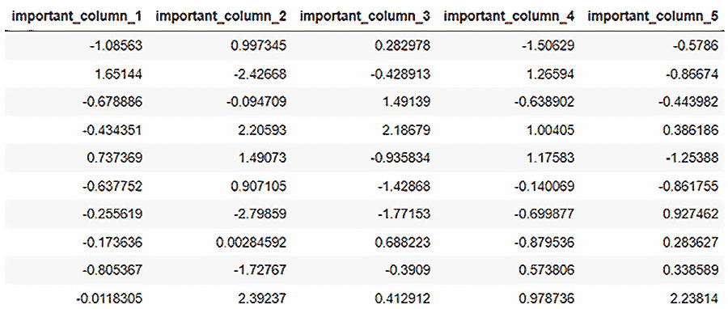

图 3.1 – important_dataframe_1 数据内容

1.  让我们创建另一个名为`important_dataframe_2`的数据框，就像之前一样，但具有不同的列名，但行数相等，只有`2`列：

    ```py
    important_dataframe_2 = h2o.H2OFrame.from_python(np.random.randn(15,2).tolist(), column_names=list([" important_column_6" , " important_column_7" ]))
    ```

1.  让我们查看这个数据框的内容：

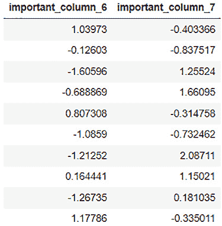

图 3.2 – important_dataframe_2 数据内容

1.  现在，让我们使用`cbind()`函数将两个数据框的列合并，并将它们存储在另一个名为`final_dataframe`的变量中：

    ```py
    final_dataframe = important_dataframe_1.cbind(important_dataframe_2)
    ```

1.  现在，让我们观察`final_dataframe`：

    ```py
    final_dataframe.describe
    ```

你应该看到**final_dataframe**的内容如下：

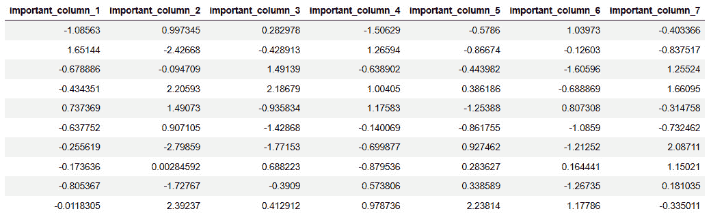

图 3.3 – cbind()后的 final_dataframe 数据内容

在这里，你会注意到我们已经成功地将`important_dataframe_2`的列与**important_dataframe_1**的列合并在一起。

这就是如何使用`cbind()`函数将两个不同数据集的列合并成一个单一的数据框。在使用`cbind()`函数时需要注意的唯一一点是，要确保要合并的两个数据集具有相同数量的行。此外，如果你有具有相同列名的数据框，那么 H2O 将在数据框的列名前添加一个**0**。

现在我们已经知道了如何合并不同数据框的列，让我们看看如何将具有相同列结构的多数据框的列值合并在一起。

## 合并两个数据框的行

大多数大型企业通常处理大量的数据。这些数据通常被分成多个块，以便更快、更有效地存储和读取。然而，在模型训练期间，我们经常需要访问所有这些分区的数据集。这些数据集具有相同的结构，但数据内容是分布的。换句话说，数据框具有相同的列；然而，数据值或行被分散在它们之间。我们经常需要一个函数将所有这些数据框合并在一起，以便我们有所有数据值可用于模型训练。

H2O 有一个名为`rbind()`的函数，可以将一个数据集的行合并到另一个数据集中。

让我们在以下示例中尝试这个函数：

1.  导入`h2o`库：

    ```py
    import h2o
    ```

1.  导入`numpy`库；我们将使用它来创建用于我们研究的随机数据框：

    ```py
    import numpy as np
    ```

1.  初始化`h2o`服务器：

    ```py
    h2o.init()
    ```

1.  现在，让我们创建一个名为`important_dataframe_1`的随机数据框。为了确保你在数据集中生成与这个例子相同的值，将`numpy`的随机种子值设置为`123`。我们将设置行数为`15`，列数为`5`。你可以给列取任何你喜欢的名字：

    ```py
    np.random.seed(123)
    important_dataframe_1 = h2o.H2OFrame.from_python(np.random.randn(15,5).tolist(), column_names=list([" important_column_1" , " important_column_2" ," important_column_3" ," important_column_4" ," important_column_5" ]))
    ```

1.  让我们查看数据框的行数，它应该是`15`：

    ```py
    important_dataframe_1.nrows
    ```

1.  让我们创建另一个名为`important_dataframe_2`的数据框，就像之前的一个一样，具有相同的列名和任意数量的行。在示例中，我使用了`10`行：

    ```py
    important_dataframe_2 = h2o.H2OFrame.from_python(np.random.randn(10,5).tolist(), column_names=list([" important_column_1" , " important_column_2" ," important_column_3" ," important_column_4" ," important_column_5" ]))
    ```

1.  让我们查看`important_dataframe_2`的行数，它应该是`10`：

    ```py
    important_dataframe_2.nrows
    ```

1.  现在，让我们使用`rbind()`函数将两个数据框的行合并并存储在另一个名为`final_dataframe`的变量中：

    ```py
    final_dataframe = important_dataframe_1.rbind(important_dataframe_2)
    ```

1.  现在，让我们观察`final_dataframe`：

    ```py
    final_dataframe.describe
    ```

你应该看到**final_dataframe**的内容如下：

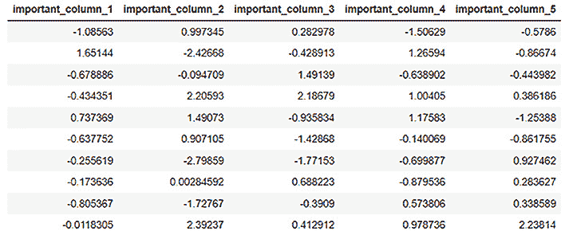

图 3.4 – 使用 rbind()后的 final_dataframe 数据内容

1.  让我们查看**final_dataframe**的行数：

    ```py
    final_dataframe.nrows
    ```

最后一个操作的输出应该显示最终数据集的行数。你会看到值是**25**，数据框的内容是前两个数据集的合并行值。

现在我们已经了解了如何在 H2O 中使用`rbind()`函数合并两个数据框的行，让我们看看我们如何完全合并两个数据集。

## 合并两个数据框

你可以直接合并两个数据框，将它们的行和列合并成一个数据框。H2O 提供了一个`merge()`函数，用于合并具有公共列或公共列的两个数据集。在合并过程中，两个数据集共有的列用作**合并键**。如果它们只有一个公共列，那么这个列形成合并的单个主键。如果有多个公共列，那么 H2O 将根据这些列的数据值形成所有这些列的复杂键，并将其用作合并键。如果两个数据集之间有多个公共列，而你只想合并特定的子集，那么你需要重命名其他公共列以消除相应的公共性。

让我们在下面的 Python 示例中尝试这个函数：

1.  导入`h2o`库：

    ```py
    import h2o
    ```

1.  导入`numpy`库；我们将使用它来创建一个用于我们研究的随机数据框：

    ```py
    import numpy as np
    ```

1.  初始化`h2o`服务器：

    ```py
    h2o.init()
    ```

1.  现在，让我们创建一个名为`dataframe_1`的数据框。该数据框有`3`列：`words`、`numerical_representation`和`letters`。现在，让我们按照以下内容填写数据内容：

    ```py
    dataframe_1 = h2o.H2OFrame.from_python({'words':['Hello', 'World', 'Welcome', 'To', 'Machine', 'Learning'], 'numerical_representation': [0,1,2,3,4,5],'letters':['a','b','c','d']})
    ```

1.  让我们查看数据集的内容：

    ```py
    dataframe_1.describe
    ```

1.  你将注意到数据集的内容如下：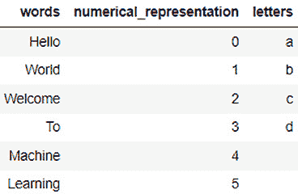

图 3.5 – dataframe_1 数据内容

1.  让我们创建另一个名为`dataframe_2`的数据框。这个数据框也包含`3`列：`numerical_representation`列、`letters`列（这两个列与`dataframe_1`相同），以及一个不常见的列。让我们称它为`other_words`：

    ```py
    dataframe_2 = h2o.H2OFrame.from_python({'other_words':['How', 'Are', 'You', 'Doing', 'Today', 'My', 'Friend', 'Learning', 'H2O', 'Artificial', 'Intelligence'], 'numerical_representation': [0,1,2,3,4,5,6,7,8,9],'letters':['a','b','c','d','e']})
    ```

1.  让我们查看这个数据框的内容：

    ```py
    dataframe_2.head(11)
    ```

执行代码后，你应该在你的笔记本中看到以下输出：

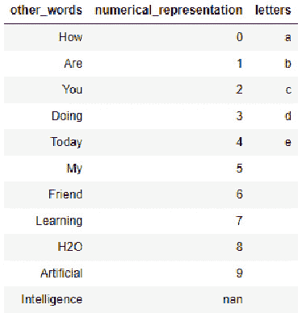

图 3.6 – dataframe_2 数据内容

1.  现在，让我们使用 `merge()` 操作将 `dataframe_1` 合并到 `dataframe_2` 中：

    ```py
    final_dataframe = dataframe_2.merge(dataframe_1)
    ```

1.  让我们现在观察 `final_dataframe`：

    ```py
    final_dataframe.describe
    ```

1.  你应该看到 **final_dataframe** 的内容如下：

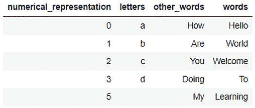

图 3.7 – merge() 后的 final_dataframe 内容

你会注意到 H2O 使用了 `numerical_representation` 列与其他列中适当的值的组合。

现在，你可能想知道为什么没有 **4** 这一行的数据。那是因为在合并过程中，我们有两个共同的列：**numerical_representation** 和 **letters**。所以，H2O 使用了一个复杂的合并键，它同时使用了这两个列：**（0，a）**、**（1，b）**、**（2，c）**，以此类推。

现在你可能有的下一个问题是 *关于值 5 的那一行，它在 letters 列中没有值。* 那是因为在机器学习中，即使是空值也被视为一个独特的值。因此，在合并过程中，生成的复杂键将 **（5，）** 视为一个有效的合并键。

H2O 丢弃了所有剩余的值，因为 **dataframe_1** 没有更多的数值表示值。

1.  你可以通过将 `all_x` 参数设置为 `True` 来强制 H2O 不丢弃合并键列中的任何值，如下所示：

    ```py
    final_dataframe = dataframe_2.merge(dataframe_1, all_x = True)
    ```

1.  现在，让我们观察 `describe` 属性的内容：

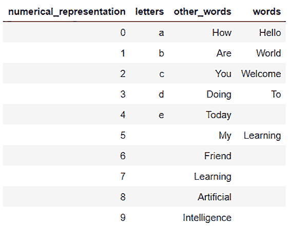

图 3.8 – 强制 merge() 后的 final_dataframe 数据内容

你会注意到我们现在将两个 dataframe 的所有值合并到一个单一的 dataframe 中。我们有了从 **0 到 9** 的所有数值表示，以及从 **dataframe_2** 中缺失的 **a 到 e** 的所有字母，以及来自 **other_words** 列和 **words** 列的正确值。

回顾一下，我们学习了如何合并 dataframe 的列和行。我们还学习了如何使用 `merge()` 函数将整个 dataframe 合并在一起。然而，我们注意到，即使数据框的关键列中没有共同的数据值，我们强制合并数据框时，最终在 dataframe 中出现了缺失值。

现在，让我们看看我们可以使用哪些不同的方法来处理 H2O 中的缺失值。

# 处理 dataframe 中的缺失值

在实际世界中，数据集中的缺失值是最常见的问题。通常，在从各种来源收集的大量数据块中，至少会有几个缺失数据的实例。数据可能因为多种原因而缺失，从数据在源头未生成到数据收集器的停机等。处理缺失数据对于模型训练非常重要，因为许多机器学习算法不支持缺失数据。那些支持缺失数据的算法可能会更重视寻找缺失数据中的模式，而不是实际存在的数据，这会分散机器学习的注意力。

缺失数据通常被称为**不可用**（**NA**）或**nan**。在我们可以将数据框发送给模型训练之前，我们需要首先处理这些类型的值。您可以选择删除包含任何缺失值的整个行，或者用默认值填充这些值，这些默认值可以是该数据列的默认值或常见值。您如何处理缺失值完全取决于哪些数据缺失以及这对于整体模型训练的重要性。

H2O 提供了一些功能，您可以使用这些功能来处理数据框中的缺失值。以下是一些例子：

+   `fillna()`函数

+   在框架中替换值

+   估算

接下来，让我们看看如何使用 H2O 在数据框中填充缺失值。

## 填充 NA 值

`fillna()`是 H2O 中的一个函数，您可以使用它以顺序方式填充缺失数据值。如果您有一个列中的某些数据值是按顺序排列的，例如时间序列或任何按顺序增加或减少的度量，并且可以排序，那么这个功能特别有用。序列中值的差异越小，这个函数就越适用。

`fillna()`函数有以下参数：

+   `method`：这可以是*前向*或*后向*。它表示 H2O 在数据框中开始填充 NA 值的方向。

+   `axis`：`0`表示按列填充，`1`表示按行填充。

+   `maxlen`：要填充的最大连续 NA 值数。

让我们通过 Python 的例子来看看我们如何使用这个函数来填充缺失值：

1.  导入`h2o`库：

    ```py
    import h2o
    ```

1.  导入`numpy`库；我们将使用它来创建用于我们研究的随机数据框：

    ```py
    import numpy as np
    ```

1.  初始化`h2o`服务器：

    ```py
    h2o.init()
    ```

1.  创建一个包含`1000`行、`3`列和一些 NA 值的随机数据框：

    ```py
    dataframe = h2o.create_frame(rows=1000, cols=3, integer_fraction=1.0, integer_range=100, missing_fraction=0.2, seed=123)
    ```

1.  让我们观察这个数据框的内容。执行以下代码，您将在数据框中看到某些缺失值：

    ```py
    dataframe.describe
    ```

您应该看到数据框的内容如下：

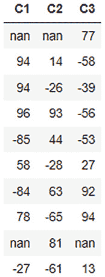

图 3.9 – 数据框内容

1.  现在我们使用`fillna()`函数来前向填充 NA 值。执行以下代码：

    ```py
    filled_dataframe = dataframe.fillna(method=" forward" , axis=0, maxlen=1)
    ```

1.  让我们观察填充后的数据框内容。执行以下代码：

    ```py
    filled_dataframe.describe
    ```

1.  您应该看到数据框的内容如下：

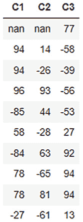

图 3.10 – 填充后的数据框内容

`fillna()`函数已按顺序填充数据框中的大多数 NA 值。

然而，你会注意到我们仍然有一些`NA`。由于这是第一列，H2O 在记录中没有先前的值来填充它，因此它跳过了它。

现在我们已经了解了如何使用 H2O 中的`fillna()`函数按顺序在数据框中填充数据，让我们看看我们如何替换数据框中的某些值。

## 替换数据框中的值

数据处理中经常需要的一种常见功能是替换数据框中的某些值。你可能想这样做的原因有很多。这在数值数据中尤为常见，其中一些最常用的转换包括舍入值、规范化数值范围或只是纠正数据值。在本节中，我们将探讨我们可以在 H2O 中使用的一些函数来替换数据框中的值。

让我们首先创建一个我们可以用来测试这些函数的数据框。执行以下代码，以便我们有一个可以操作的数据框：

```py
import h2o
h2o.init()
dataframe = h2o.create_frame(rows=10, cols=3, real_range=100, integer_fraction=1, missing_fraction=0.1, seed=5)
dataframe.describe
```

数据框应该看起来如下所示：

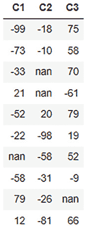

图 3.11 – 数据框数据内容

因此，我们有一个包含三个列：**C1**、**C2**和**C3**的数据框。每个列都有几个负数和一些**nan**值。让我们看看我们如何处理这个数据框。

让我们从简单的事情开始。让我们更新单个数据值，也称为`99`。你可以根据其在数据框中的位置更新单个数据值的值，如下所示：

```py
dataframe[3,1] = 99
```

注意，数据框中的列和行都从`0`开始。因此，我们将行号为`3`、列号为`1`的值设置为`99`。你可以通过执行以下`dataframe.describe`来在数据框中看到结果：

```py
dataframe.describe
```

数据框应该看起来如下所示：

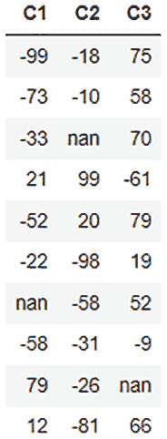

图 3.12 – 数据更新后的数据框内容

正如你在数据框中看到的，我们将之前位于**C2**列第三行的**nan**值替换为**99**。

这只是一个数据值的操作。让我们看看我们如何替换整个列的值。让我们将**C3**列的数据值增加到原始值的 3 倍。你可以通过执行以下代码来实现：

```py
dataframe[2] = 3*dataframe[2]
```

你可以通过执行以下`dataframe.describe`来在数据框中看到结果：

```py
dataframe.describe
```

数据框应该看起来如下所示：

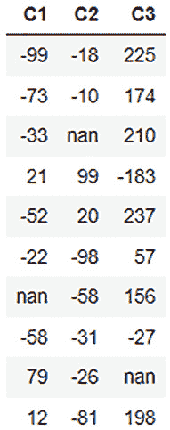

图 3.13 – 列值更新后的数据框内容

我们可以在输出中看到，**C3**列的值现在已增加到原始列值的 3 倍。

我们到目前为止所执行的所有替换都是直接的。让我们尝试在数据框上进行一些条件更新。让我们将数据框中的所有负数四舍五入到`0`。所以，条件是我们只更新负数为`0`，不更改任何正数。您可以进行如下条件更新：

```py
dataframe[dataframe['C1'] < 0, " C1" ] = 0
dataframe[dataframe['C2'] < 0, " C2" ] = 0
dataframe[dataframe['C2'] < 0, " C3" ] = 0
```

您可以通过执行以下`dataframe.describe`来在数据框中看到结果：

```py
dataframe.describe
```

数据框应如下所示：

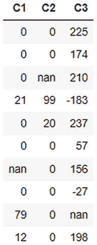

图 3.14 – 条件更新后的数据框内容

如您在数据框中所见，所有负值都已向上舍入/替换为**0**。

现在，如果我们不想将负数向上舍入到**0**，而是希望仅反转负数，我们可以通过结合条件更新和算术更新来实现。请参考以下示例：

```py
dataframe[" C1" ] = (dataframe[" C1" ] < 0).ifelse(-1*dataframe[" C1" ], dataframe[" C1" ])
dataframe[" C2" ] = (dataframe[" C2" ] < 0).ifelse(-1*dataframe[" C2" ], dataframe[" C2" ])
dataframe[" C3" ] = (dataframe[" C3" ] < 0).ifelse(-1*dataframe[" C3" ], dataframe[" C3" ])
```

现在，让我们尝试看看我们是否可以替换剩余的`fillna()`函数，但如果**nan**值只是某些缺失值，这些值并不完全符合任何递增或递减模式，而我们只想将其设置为 0 怎么办？让我们现在就做。运行以下代码：

```py
dataframe[dataframe[" C1" ].isna(), " C1" ] = 0
dataframe[dataframe[" C2" ].isna(), " C2" ] = 0
dataframe[dataframe[" C3" ].isna(), " C3" ] = 0
```

您可以通过执行以下`dataframe.describe`来在数据框中看到结果：

```py
dataframe.describe
```

数据框应如下所示：

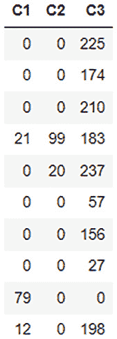

图 3.15 – 替换 nan 值为 0 后的数据框内容

`isna()`函数是一个检查数据中的值是否为**nan**的函数，并返回**True**或**False**。我们使用这个条件来替换数据框中的值。

提示

在数据框中操作和替换值有多种方法，H2O 提供了丰富的功能来简化实现。请随意探索和实验更多关于操作数据框中的值。您可以在以下链接中找到更多详细信息：[`docs.h2o.ai/h2o/latest-stable/h2o-py/docs/frame.xhtml`](https://docs.h2o.ai/h2o/latest-stable/h2o-py/docs/frame.xhtml)。

现在我们已经学习了在数据框中替换值的各种方法，让我们看看数据科学家和工程师经常采用的一种更高级的方法。

## 补充

之前，我们看到了如何使用`fillna()`函数在数据集中替换 nan 值，该函数按顺序替换 dataframe 中的 nan 数据。`fillna()`函数以顺序方式填充数据；然而，数据不一定总是具有顺序性。例如，考虑一个关于购买游戏笔记本电脑的人的数据集。该数据集将主要包含 13-28 岁年龄段的关于人的数据，还有一些异常值。在这种情况下，如果`fillna()`函数中有任何 nan 值用于填充 nan 值，那么任何异常值之后的任何 nan 值都会在 dataframe 中引入偏差。我们需要用一个在产品年龄组的标准分布中常见的值来替换 nan 值，这个值在 13 和 28 之间，而不是像 59 这样的值，因为 59 出现的可能性较小。

假设是替换 dataframe 中某些值的过程，用适当的替代值替换，这些替代值不会引入任何可能影响模型训练的偏差或异常值。用于计算替代值的计算方法被称为**假设策略**。假设是数据处理中最重要的一种方法，它处理缺失和 nan 值，并试图用可能对模型训练过程引入最少偏差的值来替换它们。

H2O 有一个名为`impute()`的函数，专门提供此功能。它有以下参数：

+   `column`: 此参数接受要设置`impute()`列号的列。值`1`假设整个 dataframe。

+   `method`: 此参数设置要使用的假设方法。方法可以是`mean`、`median`或`mode`。

+   `combine_method`: 此参数指定当选择`median`作为假设方法时，如何组合偶数样本的量数。组合方法可以是`interpolate`、`average`、`low`或`high`。

+   `group_by_frame`: 此参数假设所选预计算的分组框架的值。

+   `by`: 此参数按所选列对假设结果进行分组。

+   `values`: 此参数接受一个列表，其中包含每列的值。列表中的`None`值会跳过该列。

让我们通过一个 Python 示例来看看我们如何使用此函数来填充缺失值。

对于这个，我们将使用**高中学生短跑**数据集。高中学生短跑数据集是一个包含高中学生年龄、体重、最大记录速度和 100 米短跑表现的记录数据集。该数据集用于预测年龄、体重和短跑速度如何影响学生在 100 米短跑比赛中的表现。

数据集看起来如下：

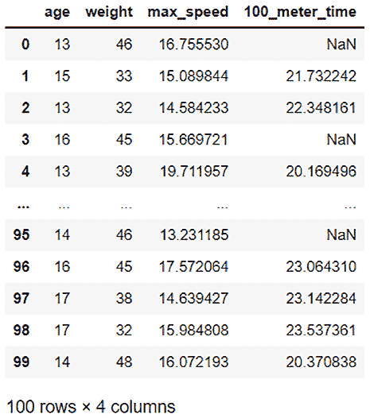

图 3.16 – 一位高中学生的短跑数据集

数据集的特征如下：

+   **年龄**：学生的年龄

+   **体重**：学生的体重（千克）

+   **max_speed**：学生每小时的最大冲刺速度（千米/小时）

+   **100_meter_time**：学生完成 100 米冲刺所需的时间（秒）

如你所见，**100_meter_time**列中有很多缺失值。

我们不能简单地使用`fillna()`函数，因为这会在缺失值恰好发生在最快或最慢时间之后时引入数据偏差。我们也不能简单地用常数替换这些值。

实际上，替换这些缺失值，用平均青少年 100 米冲刺的正常值来替换是有意义的。我们已经有大多数学生的数据，所以我们可以使用他们的结果来计算一个一般的 100 米冲刺平均时间，并以此作为基准来替换所有缺失值，而不会引入任何偏差。

这正是填充缺失值所用的。让我们使用填充函数来填充这些缺失值：

1.  导入`h20`模块并启动`h20`服务器：

    ```py
    import h2o
    h2o.init()
    ```

1.  我们然后使用`h2o.import_file()`导入`高中学生冲刺`数据集：

    ```py
    dataframe = h2o.import_file(" Dataset/high_school_student_sprint.csv" )
    ```

1.  使用`impute()`函数，让我们通过`mean`来填充`100_meter_time`列中的缺失值，并显示数据：

    ```py
    dataframe.impute(" 100_meter_time" , method = " mean" )
    dataframe.describe
    ```

你将看到以下填充后的数据框输出：

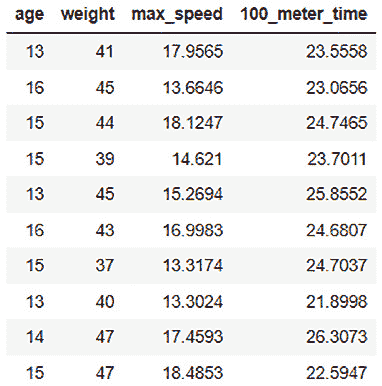

图 3.17 – 使用平均值填充的 100 米时间列

1.  H2O 计算了**100_meter_time**列所有值的**平均值**为**23.5558**，并用它替换了缺失值。

类似地，你还可以使用`median`值来代替`mean`。然而，请注意，如果某一列包含分类值，那么方法必须是`mode`。这个决定取决于你，根据最有助于替换缺失值的 dataset：

```py
dataframe.impute(" 100_meter_time" , method = " median" )
dataframe.impute(" 100_meter_time" , method = " mode" )
```

1.  让我们稍微增加一下复杂性。如果平均 100 米冲刺时间在所有学生之间并不真正可比，会怎样？如果按年龄比较，表现会更相似呢？例如，16 岁的学生比 13 岁的学生跑得快，因为他们身体发育得更成熟。在这种情况下，在填充 16 岁学生的缺失值时考虑 13 岁学生的冲刺时间就没有意义了。这就是我们可以使用`impute()`函数的`group`参数的地方：

    ```py
    dataframe = h2o.import_file(" Dataset/high_school_student_sprint.csv" )
    dataframe.impute(" 100_meter_time" , method = " mean" , by=[" age" ])
    dataframe.describe
    ```

你将看到以下输出：

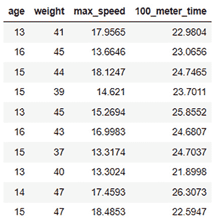

图 3.18 – 使用其平均值填充的 100 米冲刺数据，并按年龄分组

你会注意到现在 H2O 已经按年龄计算了平均值，并用它替换了相应年龄的`mean`值，在所有`impute()`函数中灵活地填充正确的值。

`impute()`函数在填充数据框中的正确值方面非常强大。通过列以及框架进行分组的附加参数使其在处理各种缺失值时非常灵活。

随意使用和探索这些函数在不同的数据集上。最终，所有这些函数都是数据科学家和工程师用来提高数据质量的工具；真正的技能是理解何时以及如何使用这些工具从您的数据中获得最大收益，这需要实验和实践。

现在我们已经了解了我们可以用不同的方式处理缺失数据，让我们继续到数据处理过程的下一部分，即如何操纵 dataframe 的特征列。

# 操纵 dataframe 的特征列

在大多数情况下，您数据处理活动将主要涉及操纵数据框的列。最重要的是，列中的值类型和列中值的顺序将在模型训练中发挥重要作用。

H2O 提供了一些功能，可以帮助您做到这一点。以下是一些帮助您处理 dataframe 中缺失值的功能：

+   列排序

+   改变列的类型

让我们首先了解如何使用 H2O 对列进行排序。

## 列排序

理想情况下，您希望在将数据传递给模型训练之前对 dataframe 中的数据进行洗牌。然而，可能存在某些场景，您可能希望根据列中的值重新排序 dataframe。

H2O 有一个名为 `sort()` 的功能，可以根据列中的值对 dataframe 进行排序。它有以下参数：

+   `by`：要排序的列。您也可以通过列表传递多个列名。

+   `ascending`：一个表示 H2O 应该按什么方向排序列的布尔数组。如果为 `True`，则 H2O 将按升序排序该列。如果为 `False`，则 H2O 将按降序排序。如果没有传递任何标志，则 H2O 默认按升序排序。

H2O 将如何排序 dataframe 取决于是否将单个列名传递给 `sort()` 函数或多个列名。如果只传递单个列名，则 H2O 将返回一个按该列排序的框架。

然而，如果传递了多个列，则 H2O 将返回一个按以下方式排序的数据框：

+   H2O 首先将对传递给参数的第一个列对 dataframe 进行排序。

+   H2O 将根据传递给参数的下一列对 dataframe 进行排序，但只有与第一排序列中相同的值的行才会被排序。如果前几列中没有重复值，则不会对后续列进行排序。

让我们通过一个 Python 示例来看看我们如何使用此函数来排序列：

1.  导入 `h2o` 库并初始化它：

    ```py
    import h2o
    h2o.init()
    ```

1.  执行以下代码创建一个 dataframe 并观察数据集：

    ```py
    dataframe = h2o.H2OFrame.from_python({'C1': [3,3,3,0,12,13,1,8,8,14,15,2,3,8,8],'C2':[1,5,3,6,8,6,8,7,6,5,1,2,3,6,6],'C3':[15,14,13,12,11,10,9,8,7,6,5,4,3,2,1]})
    dataframe.describe
    ```

数据集的内容应如下所示：

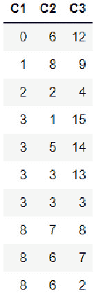

图 3.19 – dataframe_1 数据内容

1.  因此，目前，列`sort()`函数中的值被放入`by`参数中，表示数据框的第一列，或者通过传递**[‘C1’]**，这是一个包含列名的列表，按顺序对数据集进行排序：

    ```py
    sorted_dataframe_1 = dataframe.sort(0)
    sorted_dataframe_1.describe
    ```

你应该得到以下代码的输出：

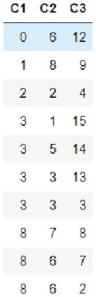

图 3.20 – 按 C1 列排序的 dataframe_1

你会发现数据框现在已按**C1**列的升序排序。

1.  让我们看看如果我们通过`by`参数传递多个列来按多个列排序，我们会得到什么。运行以下代码行：

    ```py
    sorted_dataframe_2 = dataframe.sort(['C1','C2']) sorted_dataframe_2.describe
    ```

你应该得到以下输出：

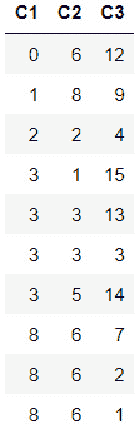

图 3.21 – 按列 C1 和 C2 排序的 dataframe_1

如你所见，H2O 首先使用`sort`函数对列进行排序。

1.  你也可以通过在`ascending`参数中传递`False`来反转排序顺序。让我们通过运行以下代码行来测试一下：

    ```py
    sorted_dataframe_3 = dataframe.sort(by=['C1','C2'], ascending=[True,False])
    sorted_dataframe_3.describe
    ```

你应该看到以下输出：

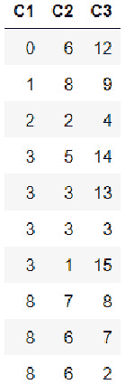

图 3.22 – dataframe_1 按 C1 列升序排序，按 C2 列降序排序

在这种情况下，H2O 首先按**C1**列对列进行排序。然后，对于在**C1**列中具有相同值的行，它按**C2**列对这些行进行排序。然而，这次它是按降序排序的。

现在你已经学会了如何按单列以及多列对数据框进行排序，让我们继续学习另一个更改列类型的列操作函数。

## 更改列类型

正如我们在*第二章*中看到的，*使用 H2O Flow (H2O 的 Web UI)*，我们将`Heart Disease`列的类型从`numerical`更改为`enum`。我们这样做的原因是列的类型在模型训练中起着重要作用。在模型训练期间，列的类型决定了 ML 问题是分类问题还是回归问题。尽管这两种情况中的数据本质上都是数值的，但 ML 算法如何处理该列完全取决于其类型。因此，在数据收集的初始阶段可能未正确设置列类型时，正确设置列类型变得非常重要。

H2O 有几个函数不仅可以帮助你更改列的类型，还可以对列类型进行初始检查。

其中一些函数如下：

+   `.isnumeric()`: 检查数据框中的列是否为数值类型。相应地返回`True`或`False`

+   `.asnumeric()`: 为指定列创建一个新框架，其中所有值都转换为数值

+   `.isfactor()`: 检查数据框中的列是否为分类类型。相应地返回`True`或`False`

+   `.asfactor()`: 为指定列创建一个新框架，其中所有值都转换为分类类型

+   `.isstring()`: 检查数据框中的列是否为字符串类型。相应地返回`True`或`False`

+   `.ascharacter()`: 为指定列创建一个新框架，其中所有值都转换为字符串类型

让我们看看如何在 Python 中使用这些函数来更改列类型的一个例子：

1.  导入`h2o`库并初始化 H2O：

    ```py
    import h2o
    h2o.init()
    ```

1.  执行以下代码行创建一个数据框并观察数据集：

    ```py
    dataframe = h2o.H2OFrame.from_python({'C1': [3,3,3,0,12,13,1,8,8,14,15,2,3,8,8],'C2':[1,5,3,6,8,6,8,7,6,5,1,2,3,6,6],'C3':[15,14,13,12,11,10,9,8,7,6,5,4,3,2,1]})
    dataframe.describe
    ```

数据集的内容应该是这样的：

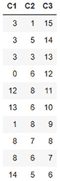

图 3.23 – 数据框数据内容

1.  让我们通过使用`isnumeric()`函数来确认`numerical`列如下：

    ```py
    dataframe['C1'].isnumeric()
    ```

你应该得到一个`True`的输出。

1.  让我们看看如果我们使用`asfactor()`函数检查`categorical`列会得到什么：

    ```py
    dataframe['C1'].isfactor()
    ```

你应该得到一个`False`的输出。

1.  现在，让我们使用`asfactor()`函数将`categorical`列转换为因子类型，然后检查`isfactor()`是否返回`True`：

    ```py
    dataframe['C1'] = dataframe['C1'].asfactor()
    dataframe['C1'].isfactor()
    ```

你现在应该得到一个`True`的输出。

1.  你可以使用`asnumeric()`函数将`numerical`列转换为数值类型：

    ```py
    dataframe['C1'] = dataframe['C1'].asnumeric()
    dataframe['C1'].isnumeric()
    ```

你现在应该得到一个`True`的输出。

现在你已经学会了如何对数据框的列进行排序和更改列类型，让我们继续学习数据处理中的另一个重要主题，即分词和编码。

# 文本数据的分词

并非所有**机器学习算法**（**MLAs**）都专注于数学问题解决。**自然语言处理**（**NLP**）是机器学习的一个分支，它专门分析从文本数据中提取的意义，尽管它也会尝试从文档或任何文本中提取意义和理解内容。训练 NLP 模型可能非常棘手，因为每种语言都有其自己的语法规则，某些单词的解释在很大程度上依赖于上下文。尽管如此，NLP 算法通常会尽力训练一个可以预测文本文档的意义和情感的模型。

训练 NLP 算法的方法是首先将文本数据块分解成更小的单元，称为**标记**。标记可以是单词、字符，甚至是字母。这取决于 MLA 的要求以及它是如何使用这些标记来训练模型的。

H2O 有一个名为`tokenize()`的函数，它可以帮助将数据框中的字符串数据分解成标记，并为进一步处理创建一个包含所有标记的单独列。

它有以下参数：`split`：我们在该参数中传递一个正则表达式，该表达式将由函数用于将文本数据分割成标记。

让我们看看如何使用这个函数在数据框中对字符串数据进行分词的例子：

1.  导入`h2o`库并初始化它：

    ```py
    import h2o
    h2o.init()
    ```

1.  执行以下代码行创建一个数据框并观察数据集：

    ```py
    dataframe1 = h2o.H2OFrame.from_python({'C1':['Today we learn AI', 'Tomorrow AI learns us', 'Today and Tomorrow are same', 'Us and AI are same']})
    dataframe1 = dataframe1.ascharacter()
    dataframe1.describe
    ```

数据集应该看起来如下所示：

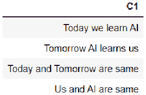

图 3.24 – 数据框数据内容

这种类型的文本数据通常在生成大量日志文本或对话数据的系统中收集。为了解决这类自然语言处理任务，我们需要将句子分解成单个标记，以便我们最终可以构建这些文本的上下文和意义，这将有助于机器学习算法进行语义预测。然而，在深入研究自然语言处理的复杂性之前，数据科学家和工程师将首先通过分词来处理这些数据。

1.  让我们使用这个函数来分词我们的数据框，观察分词后的列：

    ```py
    tokenized_dataframe = dataframe1.tokenize("  " )
    tokenized_dataframe
    ```

你应该看到以下数据框：

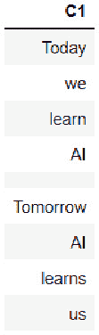

图 3.25 – 分词后的数据框内容

你会注意到`tokenize()`函数将文本数据分割成标记，并将标记作为行附加到单个列中。你还会注意到所有分词后的句子都由空行分隔。你可以通过使用`nrows`比较数据框中所有句子的单词数量以及句子之间的空格与分词数据集的行数来交叉检查这一点。

这些是在将数据输入到机器学习管道进行训练之前用于处理数据的常用数据处理方法。还有许多方法和技巧可以用来进一步清理和抛光数据框。如此之多，以至于你可以专门写一本书来讨论它们。数据处理恰好是整个机器学习生命周期中最困难的部分。用于训练的数据质量取决于问题陈述的上下文。它还取决于数据科学家和工程师在处理数据时的创造力和独创性。数据处理的目标是从数据集中提取尽可能多的信息，并从数据中去除噪声和偏差，以便在训练期间进行更有效的数据分析。

# 使用目标编码进行数据编码

正如我们所知，机器只能理解数字。然而，许多现实世界的机器学习问题都围绕着非数字性质的对象和信息。例如，状态、名称和类别等通常被表示为类别而不是数字。这种数据被称为**分类数据**。分类数据在分析和预测中通常会扮演重要角色。因此，有必要将这些分类值转换为数值格式，以便机器能够理解它们。这种转换还应该以这种方式进行，即我们不会失去这些类别的固有含义，也不会向数据中引入新的信息，例如数字的增量性质等。

这就是编码被使用的地方。**编码**是一个过程，其中分类值被转换，换句话说，*编码*为数值。有许多编码方法可以执行这种转换。其中最常用的一种是**目标编码**。

目标编码是一种编码过程，通过计算给定类别中目标变量发生的平均概率，将分类值转换为数值。H2O 也有帮助用户在数据上实现目标编码的方法。

为了更好地理解这种方法，考虑以下示例`神话生物`数据集：

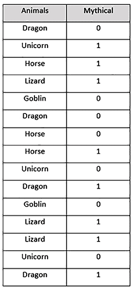

图 3.26 – 我们的神话生物数据集

此数据集包含以下内容：

+   **动物**：此列包含动物名称的分类值。

+   **神话**：此列包含**0**的二进制值和**1**的二进制值。**1**表示生物是神话中的，而**0**表示生物不是神话中的。

现在，让我们使用目标编码来编码**分类**列。目标编码将执行以下步骤：

1.  将分类值分组，并记录给定类别中目标值**神话**为**1**和为**0**的次数如下：

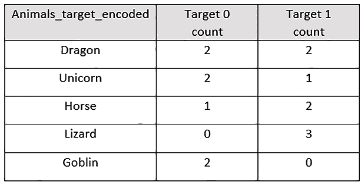

图 3.27 – 带有目标计数的神话生物数据集

1.  计算在特定组内**1**的目标值发生的概率，与**0**的目标值相比。这看起来如下所示：

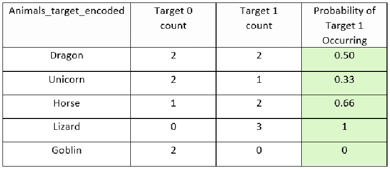

图 3.28 – 带有目标 1 发生概率列的神话生物数据集

1.  删除**动物**列，并使用**目标 1 发生概率**列作为**动物**列的编码表示。新的编码数据集将如下所示：

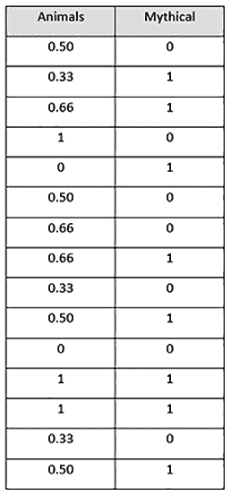

图 3.29 – 目标编码的神话生物数据集

在编码数据集中，**动物**特征使用目标编码进行编码，我们得到了一个完全数值化的数据集。这个数据集将很容易被机器学习算法解释和学习，从而提供高质量的模型。

让我们看看如何使用 H2O 进行目标编码。我们将使用此示例的`汽车价格预测`数据集。您可以在[`archive.ics.uci.edu/ml/datasets/Automobile`](https://archive.ics.uci.edu/ml/datasets/Automobile)（Dua, D. 和 Graff, C. (2019). UCI 机器学习库[[`archive.ics.uci.edu/ml`](http://archive.ics.uci.edu/ml)]。加州大学欧文分校信息与计算机科学学院，加州，欧文）找到该数据集的详细信息。

该数据集相当直接。它包含有关汽车的各种详细信息，例如汽车的**制造商**、**发动机尺寸**、**燃油系统**、**压缩比**和**价格**。机器学习算法的目标是根据这些特征预测汽车的价格。

在我们的实验中，我们将使用目标编码对`categorical`列**make**、**fuel type**和**body style**进行编码，其中**price**列是目标。

让我们按照以下示例执行目标编码：

1.  导入`h2o`和 H2O 的`H2OTargetEncoderEstimator`，并初始化你的 H2O 服务器。执行以下代码：

    ```py
    import h2o
    from h2o.estimators import H2OTargetEncoderEstimator
    h2o.init()
    ```

1.  导入`Automobile price prediction`数据集并打印数据集的内容。执行以下代码：

    ```py
    automobile_dataframe = h2o.import_file(" Dataset\Automobile_data.csv" )
    automobile_dataframe
    ```

让我们观察数据框的内容；它应该如下所示：

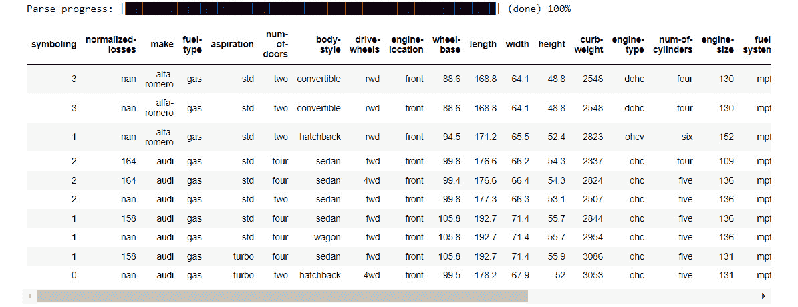

图 3.30 – 汽车价格预测数据框

如前图所示，数据框包含大量列，其中包含汽车的详细信息。为了理解目标编码，让我们筛选出我们想要实验的列，同时删除其余的列。由于我们计划对`make`列、`fuel-type`列和`body-style`列进行编码，让我们只使用这些列以及`price`响应列。执行以下代码：

```py
automobile_dataframe = automobile_dataframe[:,[" make" , " fuel-type" , " body-style" , " price" ]]
automobile_dataframe
```

过滤后的数据框将如下所示：

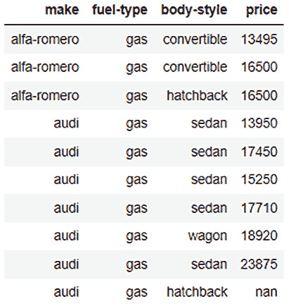

图 3.31 – 过滤列的汽车价格预测数据框

1.  现在让我们将这个数据框拆分为训练数据框和测试数据框。执行以下代码：

    ```py
    automobile_dataframe_for_training, automobile_dataframe_for_test = automobile_dataframe.split_frame(ratios = [.8], seed = 123)
    ```

1.  现在让我们使用`H2OTargetEncoderEstimator`训练我们的目标编码器模型。执行以下代码：

    ```py
    automobile_te = H2OTargetEncoderEstimator()
    automobile_te.train(x= [" make" , " fuel-type" , " body-style" ], y=" price" , training_frame=automobile_dataframe_for_training)
    ```

一旦目标编码器完成训练，你将看到以下输出：

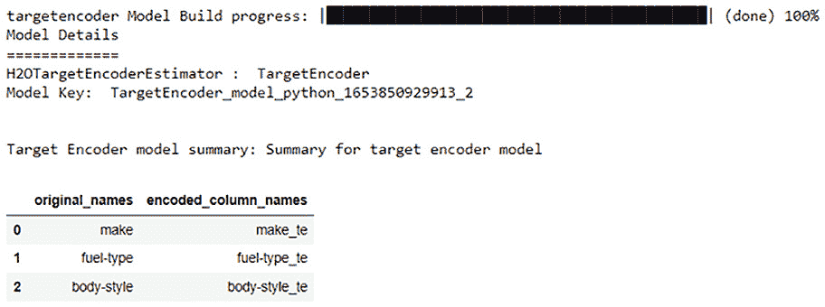

图 3.32 – 目标编码器训练的结果

从前面的截图可以看出，H2O 目标编码器将为`make`列、`fuel-type`列和`body-style`列生成目标编码值，并分别存储在不同的名为`make_te`、`fuel-type_te`和`body-style_te`的列中。这些新列将包含编码值。

1.  现在让我们使用这个训练过的目标编码器对训练数据集进行编码并打印编码后的数据框：

    ```py
    te_automobile_dataframe_for_training = automobile_te.transform(frame=automobile_dataframe_for_training, as_training=True)
    te_automobile_dataframe_for_training
    ```

编码后的训练帧应如下所示：

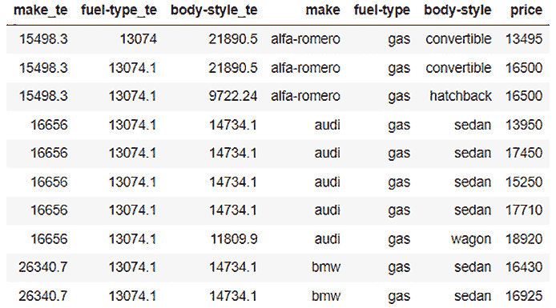

图 3.33 – 编码的汽车价格预测训练数据框

如图中所示，我们的训练帧现在有三个额外的列，`make_te`、`fuel-type_te`和`body-style_te`，包含数值。这些是`make`列、`fuel-type`列和`body-style`列的目标编码列。

1.  同样，现在让我们使用训练好的目标编码器来编码测试数据框架，并打印编码后的数据框架。执行以下代码：

    ```py
    te_automobile_dataframe_for_test = automobile_te.transform(frame=automobile_dataframe_for_test, noise=0)
    te_automobile_dataframe_for_test
    ```

编码后的测试框架应如下所示：

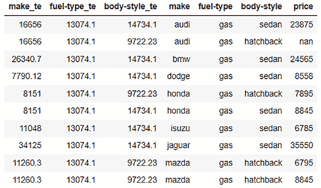

图 3.34 – 编码的汽车价格预测测试数据框架

如您从图中所示，我们的测试框架也有三个额外的列，这些是编码列。现在您可以使用这些数据框架来训练您的机器学习模型。

根据您的下一步行动，您可以使用编码后的数据框架以您认为合适的方式。如果您想使用数据框架来训练机器学习模型，那么您可以删除数据框架中的`分类`列，并使用相应的编码列作为训练特征来训练您的模型。如果您希望对数据集进行任何进一步的统计分析，那么您可以保留这两种类型的列，并进行任何比较研究。

小贴士

H2O 的目标编码器有几个参数可以设置以调整编码过程。根据您正在处理的数据类型，为目标编码数据集选择正确的设置可能会变得非常复杂。因此，请随意尝试这个功能，因为您对这个功能和目标编码的一般理解越好，您就能更好地编码数据框架并进一步提高模型训练。您可以在以下位置找到有关 H2O 目标编码器的更多详细信息：[`docs.h2o.ai/h2o/latest-stable/h2o-docs/data-science/target-encoding.xhtml`](https://docs.h2o.ai/h2o/latest-stable/h2o-docs/data-science/target-encoding.xhtml)。

恭喜！您刚刚了解了如何使用 H2O 的目标编码器对分类值进行编码。

# 摘要

在本章中，我们首先探讨了我们在将数据框架发送到模型训练之前所使用的各种技术和一些常见函数，以预处理我们的数据框架。我们探讨了如何将原始数据框架重新构建成适合的、一致的格式，以满足模型训练的要求。我们学习了如何通过将不同数据框架的不同列组合起来来操作数据框架的列。我们还学习了如何从分区数据框架中组合行，以及如何直接将数据框架合并成一个单一的数据框架。

一旦我们学会了如何重新构建我们的数据框架，我们就学会了如何处理新收集的数据中经常出现的缺失值。我们学会了如何填充 NA 值，替换某些错误值，以及如何使用不同的插补策略来避免在填充缺失值时添加噪声和偏差。

然后，我们研究了如何通过按列排序数据框架以及更改列的类型来操作特征列。我们还学习了如何对字符串进行标记化以处理文本数据，以及如何使用 H2O 的目标编码器对分类值进行编码。

在下一章中，我们将打开 AutoML 的“黑箱”，探索其训练过程，以及 AutoML 过程中内部发生的事情。这将帮助我们更好地理解 H2O 如何施展魔法并高效地自动化模型训练过程。
