# 4

# 理解 H2O AutoML 架构和训练

模型训练是机器学习（**ML**）管道的核心组件之一。它是管道中系统读取和理解数据集中模式的一步。这种学习输出数据集中不同特征与目标值之间关系的数学表示。系统读取和分析数据的方式取决于所使用的 ML 算法和其复杂性。这就是 ML 的主要复杂性所在。每个 ML 算法都有其自己的方式来解释数据并从中提取信息。每个 ML 算法都旨在优化某些指标，同时权衡某些偏差和方差。H2O AutoML 所做的自动化进一步复杂化了这一概念。试图理解它是如何工作的可能会让许多工程师感到不知所措。

不要因为这种复杂性而气馁。所有复杂的系统都可以分解成简单的组件。理解这些组件及其相互之间的交互有助于我们理解整个系统。同样，在本章中，我们将打开黑盒，即 H2O 的 AutoML 服务，并尝试理解是什么魔法使得机器学习的自动化成为可能。我们首先将了解 H2O 的架构。我们将将其分解成简单的组件，然后理解 H2O 的各个组件之间发生什么样的交互。稍后，我们将了解 H2O AutoML 如何训练如此多的模型，并能够优化它们的超参数以获得最佳模型。

在本章中，我们将涵盖以下主题：

+   观察 H2O 的高级架构

+   了解客户端与 H2O 服务之间交互的流程

+   理解 H2O AutoML 如何进行超参数优化和训练

因此，让我们首先了解 H2O 的架构。

# 观察 H2O 的高级架构

要深入了解 H2O 技术，我们首先需要了解其高级架构。这不仅有助于我们理解构成 H2O AI 堆栈的不同软件组件，还有助于我们理解这些组件之间如何相互交互以及它们的依赖关系。

在这个前提下，让我们看一下 H2O AI 的高级架构，如下所示：

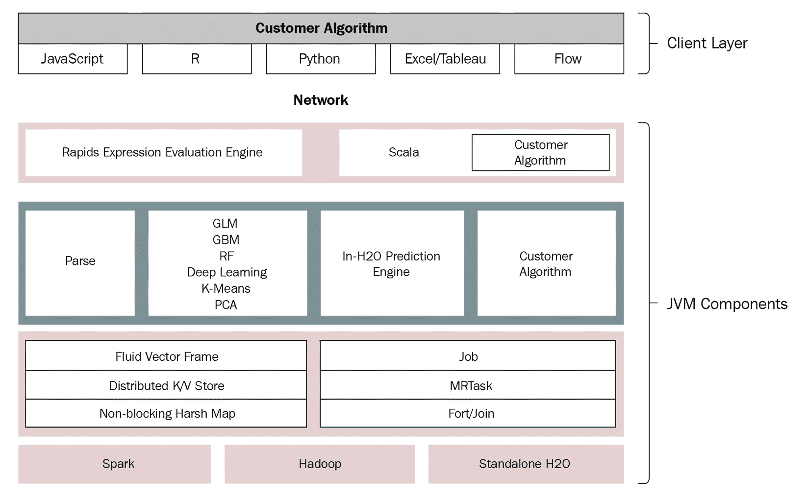

图 4.1 – H2O AI 高级架构

H2O AI 架构在概念上分为两部分，每一部分在软件堆栈中都有不同的作用。这两部分如下：

+   **客户端层** – 这一层指向与 H2O 服务器通信的客户端代码。

+   **Java 虚拟机**（**JVM**）**组件** – 这一层表示 H2O 服务器及其所有负责 H2O AI 不同功能的 JVM 组件，包括 AutoML。

客户端和 JVM 组件层之间由 **网络层** 分隔。网络层不过是普通的互联网，请求就是通过它发送的。

让我们深入到每一层，以更好地理解它们的职能，从第一层，客户端层开始。

## 观察客户端层

客户端层包括您在系统中安装的所有客户端代码。您使用这个软件程序向 H2O 服务器发送请求以执行您的机器学习活动。以下图表显示了 H2O 高级架构中的客户端层：

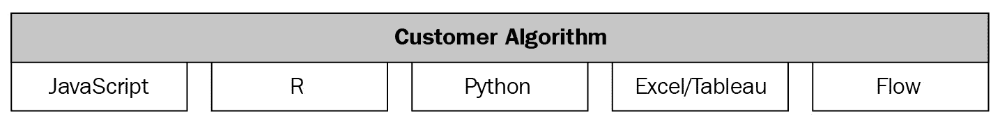

图 4.2 – H2O 高级架构的客户层

每种受支持的语言都将拥有自己的 H2O 客户端代码，这些代码将在相应语言的脚本中安装和使用。所有客户端代码内部通过套接字连接，通过 REST API 与 H2O 服务器通信。

以下 H2O 客户端分别适用于相应的语言：

+   **JavaScript**：H2O 的嵌入式 Web UI 是用 JavaScript 编写的。当您启动 H2O 服务器时，它启动一个托管在 http://localhost:54321 的 JavaScript Web 客户端。您可以使用 Web 浏览器登录此客户端，并与 H2O 服务器通信以执行您的机器学习活动。JavaScript 客户端通过 REST API 与 H2O 服务器通信。

+   `library(h2o)` 然后使用导入的 `H2O` 变量导入数据集并训练模型。这是与初始化的 H2O 服务器交互的 R 客户端，它使用 REST API 进行交互。

+   `import h2o` 然后使用导入的 `H2O` 变量来指挥 H2O 服务器。这是使用 REST API 与 H2O 服务器交互的 Python 客户端。

+   **Excel**：Microsoft Excel 是微软为 Windows、macOS、Android 和 iOS 开发的电子表格软件。由于它是处理大量二维数据的最广泛使用的电子表格软件，因此 H2O 也支持 Microsoft Excel。H2O 还有一个针对 Microsoft Excel 的客户端，它允许 Excel 用户通过 Excel 客户端使用 H2O 进行机器学习活动。

+   **Tableau**：Tableau 是交互式数据可视化软件，它帮助数据分析师和科学家以图表和图形的形式可视化数据，这些图表和图形本质上是交互式的。H2O 支持 Tableau，因此有一个专门的 Tableau 客户端，它为 Tableau 摄入的数据添加了机器学习功能。

+   **Flow**：如 第二章 中所述，*使用 H2O Flow (H2O 的 Web UI)*，H2O Flow 是 H2O 的 Web 用户界面，它具有在笔记本式界面中设置整个机器学习生命周期的所有功能。该界面内部运行在 JavaScript 上，并且同样通过标准 REST API 与 H2O 服务器通信。

以下图表显示了各种 H2O 客户端与同一 H2O 服务器的交互：

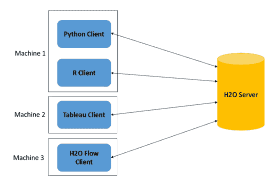

图 4.3 – 不同客户端与同一 H2O 服务器通信

如图中所示，所有不同的客户端都可以与同一实例的 H2O 服务器通信。这使得单个 H2O 服务器能够服务用不同语言编写的不同软件产品。

这涵盖了客户端层的所有内容；让我们继续向下移动到 H2O 高级架构的下一层，即 JVM 组件层。

## 观察 JVM 组件层

JVM 是一个运行时引擎，它在您的系统中运行 Java 程序。H2O 云服务器在多个**JVM 进程**上运行，也称为**JVM 节点**。每个 JVM 节点运行 H2O 软件堆栈的特定组件。

下图显示了构成 H2O 服务器的各种 JVM 组件：

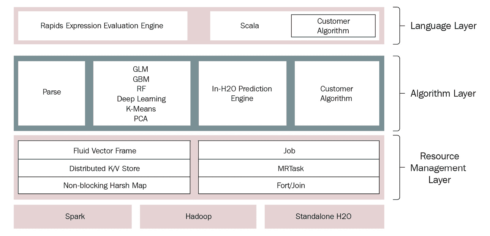

图 4.4 – H2O JVM 组件层

如前图所示，JVM 节点进一步分为三个不同的层级，具体如下：

+   `Shalala Scala`库是一个代码库，它访问用户可以用来编写自己的程序和算法的专用领域特定语言，这些程序和算法 H2O 可以使用。

+   **算法层**：该层包含 H2O 提供的所有内置机器学习算法。该层的 JVM 进程负责执行所有机器学习活动，如导入数据集、解析、为相应的机器学习算法计算数学，以及整体训练模型。该层还包含预测引擎，其进程使用训练好的模型执行预测和评分功能。任何导入到 H2O 中的自定义算法也位于这一层，JVM 进程的处理方式与其他算法相同。

+   **资源管理层**：该层包含所有负责在执行机器学习活动时高效管理系统资源（如内存和 CPU）的 JVM 进程。

该层中的一些 JVM 进程如下：

+   **流体向量框架**：框架，也称为 DataFrame，是 H2O 中的基本数据存储对象。流体向量是 H2O 的工程师们创造的一个术语，它指的是 DataFrame 中的列可以通过高效（或者说，流动）的方式添加、更新或删除，与数据工程领域的 DataFrame 相比，后者通常被认为是不可变的。

+   **分布式键值存储**：键值存储或数据库是一个数据存储系统，它通过使用索引键从分布式存储系统中高效快速地检索数据或值。H2O 在其集群中使用这种分布式键值内存存储，以实现快速存储和查找。

+   **NonBlockingHashMap**：通常在数据库中，为了提供 **原子性、一致性、隔离性和持久性**（**ACID**）属性，当对数据进行更新时，会使用锁定来锁定数据。这阻止了多个进程访问同一资源。H2O 使用一个 NonBlockingHashMap，这是 ConcurrentHashMap 的一个实现，具有更好的扩展能力。

+   **Job**：在编程中，一个工作就是一个大型的工作，由软件执行，服务于单一目的。H2O 使用一个作业管理器来协调执行各种复杂任务的作业，如高效的数学计算和减少 CPU 资源消耗。

+   **MRTask**：H2O 使用其自己的内存中 MapReduce 任务来执行其机器学习活动。MapReduce 是一种编程模型，用于通过在分布式集群上并行执行任务来处理大量计算或数据读取和写入。MapReduce 有助于系统比顺序计算更快地执行计算活动。

+   **Fork/Join**：H2O 使用一个名为 **jsr166y** 的修改版 Java 并发库来执行任务的并发执行。jsr166y 是一个非常轻量级的任务执行框架，它使用 **Fork**，其中进程将任务分解成更小的子任务，以及 **Join**，其中进程将子任务的输出结果合并以获得任务的最终输出。

整个 JVM 组件层位于 **Spark** 和 **Hadoop** 数据处理系统之上。JVM 层的组件利用这些数据处理集群管理引擎来支持集群计算。

这总结了 H2O 软件技术的整个高级架构。考虑到这个背景，让我们进入下一节，我们将了解客户端与 H2O 之间的交互流程以及客户端-服务器交互如何帮助我们执行机器学习活动。

# 了解客户端与 H2O 服务之间交互的流程

在*第一章*，*理解 H2O AutoML 基础*，以及*第二章*，*使用 H2O Flow (H2O 的 Web UI)*中，我们看到了如何向 H2O 发送命令来导入数据集或训练模型。让我们尝试理解当您向 H2O 服务器发送请求时幕后发生的事情，从数据摄取开始。

## 在数据摄取期间了解 H2O 客户端-服务器交互

系统摄取数据的过程与我们在现实生活中读书的方式相同：我们打开书本，逐行阅读。同样，当你想让你的程序读取存储在系统中的数据集时，你首先需要通知程序数据集的位置。然后程序会打开文件，逐行读取数据的字节，并将其存储在其 RAM 中。然而，在机器学习（ML）中，这种顺序数据读取的问题在于数据集往往非常大。这类数据通常被称为大数据，其体积可以从千兆字节到太字节不等。无论系统有多快，读取如此大量的数据都需要相当长的时间。这是机器学习管道所没有的时间，因为机器学习管道的目标是做出预测。如果做出决策的时间已经过去，这些预测将没有任何价值。例如，如果你设计了一个安装在汽车中的机器学习系统，该系统能够在检测到碰撞的可能性时自动停车，那么如果该系统花费所有时间读取数据，并且无法在碰撞发生之前及时做出预测，那么这个机器学习系统将毫无用处。

这就是**并行计算**或**集群计算**发挥作用的地方。一个**集群**不过是通过网络连接在一起，表现得像一个单一实体的多个进程。集群计算的主要目的是通过这些多个进程并行化长时间运行的顺序任务，以快速完成任务。这就是为什么集群计算在机器学习管道中扮演着非常重要的角色。H2O 也正确地使用了集群来摄取数据。

让我们观察数据摄取交互请求是如何从 H2O 客户端流向 H2O 服务器，以及 H2O 是如何摄取数据的。

参考以下图表以了解数据摄取交互的流程：

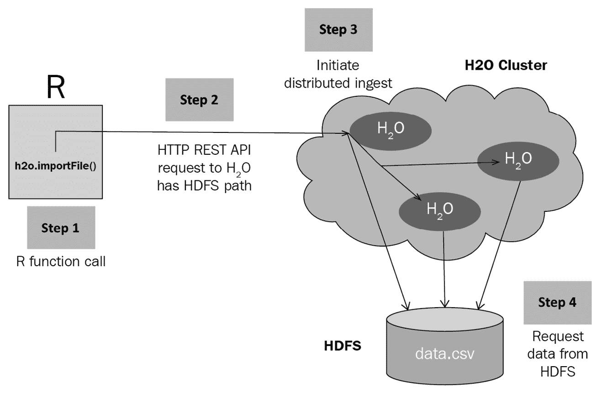

图 4.5 – H2O 数据摄取请求交互流程

以下步骤序列描述了客户端请求 H2O 集群服务器摄取数据的过程，H2O 使用**Hadoop 分布式文件系统**（**HDFS**）来提供服务：

1.  **发起请求**：一旦 H2O 集群服务器启动并运行，使用 H2O 客户端的用户将发起一个指向数据集位置的摄取数据函数调用（参见*图 4.5*中的**步骤 1**）。Python 中的函数调用如下所示：

    ```py
    h2o.import_file("Dataset/iris.data")
    ```

H2O 客户端将从函数调用中提取数据集位置，并在内部创建一个 REST API 请求（参见*图 4.5*中的**步骤 2**）。然后客户端将通过网络将请求发送到 H2O 服务器所在的 IP 地址。

1.  **H2O 服务器处理请求**：一旦 H2O 集群服务器从客户端接收到 HTTP 请求，它将提取请求中的数据集位置路径值并启动分布式数据集摄取过程（参见 *图 4.5* 中的 **步骤 3**）。然后集群节点将协调并并行化从给定路径读取数据集的任务（参见 *图 4.5* 中的 **步骤 4**）。

每个节点将读取数据集的一部分并将其存储在其集群内存中。

1.  **数据摄取**：从数据集位置路径读取的数据将存储在分布式 H2OFrame 集群内存中的块中（参见 *图 4.6* 中的 **步骤 1**）。数据块存储在分布式键值存储中（参见 *图 4.6* 中的 **步骤 2**）。一旦数据完全摄取，H2O 服务器将创建一个指针，该指针指向存储在键值存储中的摄取数据集，并将其返回给请求的客户端（参见 *图 4.6* 中的 **步骤 3**）。

参考以下图表以了解数据摄取后 H2O 返回响应时的交互流程：

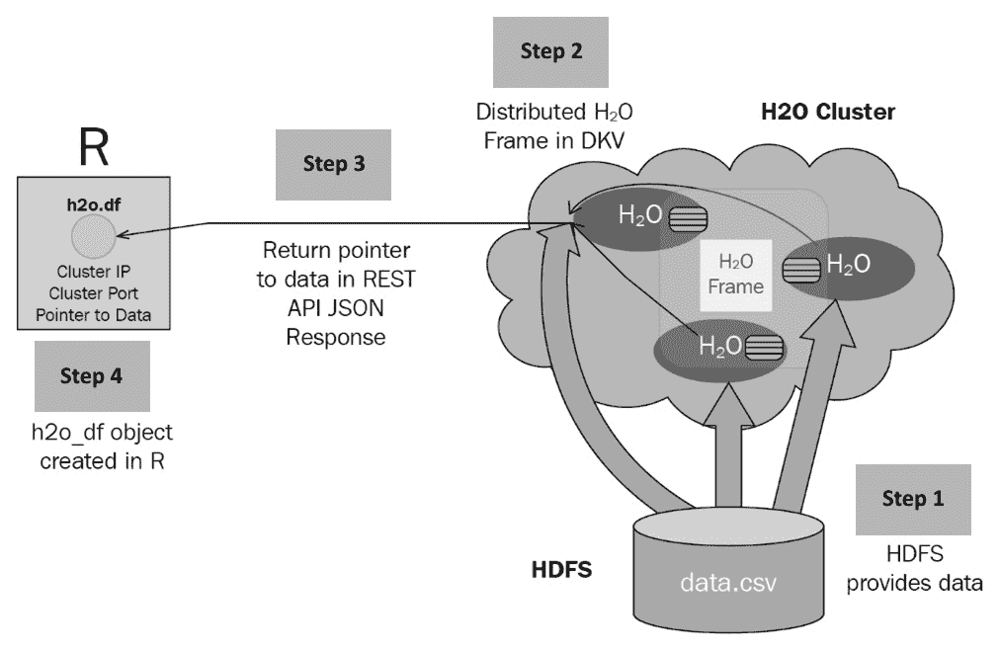

图 4.6 – H2O 数据摄取响应交互流程

一旦客户端收到响应，它将创建一个包含此指针的 DataFrame 对象，用户随后可以使用该指针在摄取的数据集上运行任何进一步的执行（参见 *图 4.6* 中的 **步骤 4**）。通过使用指针和分布式键值存储，H2O 可以在 DataFrame 操作和使用上工作，而无需在服务器和客户端之间传输它摄取的大量数据。

现在我们已经了解了 H2O 如何摄取数据，让我们现在看看它是如何处理模型训练请求的。

## 了解 H2O 在模型训练期间的交互序列

在模型训练过程中，有许多交互发生，从用户发起模型训练请求到用户获取训练好的机器学习模型。H2O 的各个组件通过一系列协调的消息和计划好的作业执行模型训练活动。

为了更好地理解当模型训练请求发送到 H2O 服务器时内部发生的情况，我们需要深入了解模型训练期间发生的交互序列。

我们将通过以下方式对交互序列进行分类来理解它们：

1.  客户端启动模型训练作业。

1.  H2O 执行模型训练作业。

1.  客户端轮询作业完成状态。

1.  客户端查询模型信息。

因此，让我们首先了解当客户端启动模型训练作业时会发生什么。

### 客户端启动模型训练作业

模型训练作业开始于客户端首次向 H2O 发送模型训练请求。

以下序列图显示了当客户端发送模型训练请求时在 H2O 内部发生的交互序列：

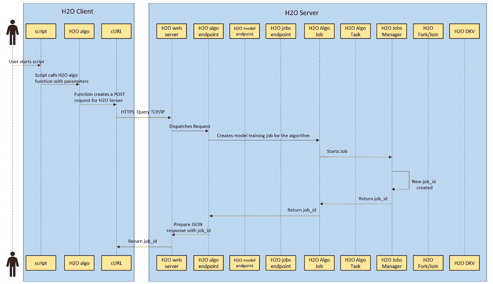

图 4.7 – 模型训练请求中的交互序列

在模型训练请求期间发生以下一系列操作：

1.  用户首先运行一个包含所有指令和函数调用的脚本，以向 H2O 发出模型训练请求。

1.  脚本包含一个模型训练函数调用及其相应的参数。这还包括一个 H2O AutoML 函数调用，其操作方式类似。

1.  函数调用指示相应的语言特定 H2O 客户端，该客户端创建一个包含所有正确训练模型所需参数信息的**POST**请求。

1.  然后，H2O 客户端将执行一个**curl**操作，将 HTTP POST 请求发送到它所在的主机 IP 地址上的 H2O 网络服务器。

1.  从这一点开始，信息流在 H2O 服务器内部执行。H2O 服务器根据用户选择的要训练的模型将请求派遣到适当的模型训练端点。

1.  此模型训练端点从请求中提取参数值并安排一个作业。

1.  一旦作业被安排，它就开始训练模型。

1.  训练作业的`job_id`，可用于识别作业的进度。

1.  作业管理器随后将`job_id`发送回训练作业，该作业将其分配给自己。

1.  训练作业随后将相同的`job_id`返回给模型训练端点。

1.  模型训练端点创建一个包含此`job_id`的 JSON 响应，并指示网络服务器将其作为响应发送给发出请求的客户端。

1.  网络服务器相应地做出 HTTP 响应，通过网络传输并到达 H2O 客户端。

1.  客户端随后创建一个包含此`job_id`的模型对象，用户可以使用它进一步跟踪模型训练的进度或在训练完成后进行预测。

这总结了当 H2O 服务器接收到模型训练请求时内部发生的事件序列。

现在我们已经了解了训练请求会发生什么，让我们了解在*第 6 步*中创建的训练作业在训练模型时发生的事件。

### H2O 运行模型训练作业

在 H2O 中，模型的训练由一个内部模型训练作业执行，该作业独立于用户的 API 请求。用户的 API 请求只是启动作业；作业管理器执行实际的作业执行。

以下序列图显示了模型训练作业在训练模型时发生的交互序列：

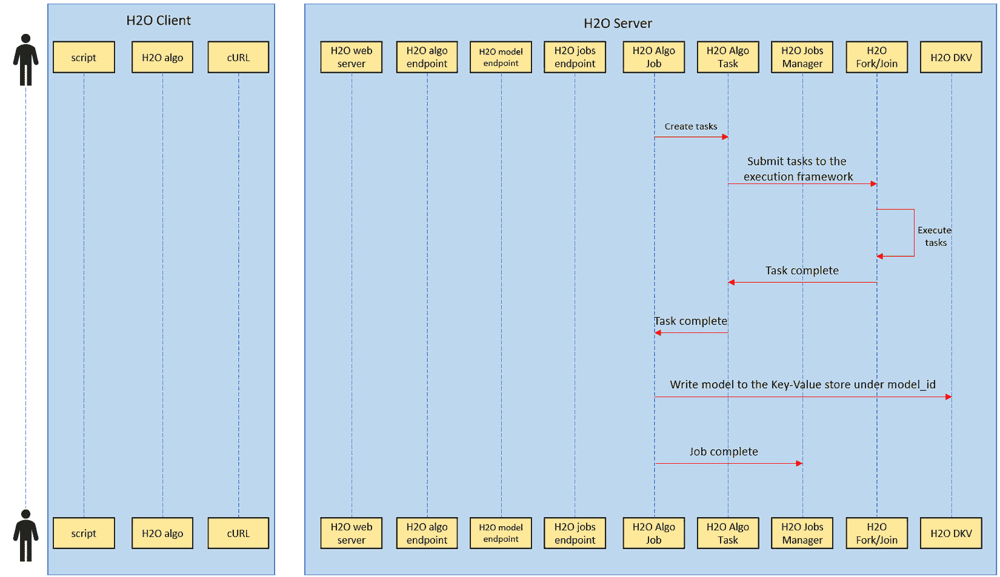

图 4.8 – 模型训练作业执行中的交互序列

在模型训练期间发生以下一系列操作：

1.  模型训练作业将模型训练分解为任务。

1.  然后，作业将任务提交给执行框架。

1.  执行框架使用 Java 并发库 `jsr166y` 通过 Fork/Join 处理框架以并发方式执行任务。

1.  一旦分叉任务成功执行，执行库将发送回完成的任务结果。

1.  一旦所有任务完成，训练好的模型将被发送回模型训练作业。

1.  模型训练作业随后将模型对象存储在 H2O 的分布式键值存储中，并为其分配一个唯一的模型 ID。

1.  训练作业随后通知作业管理器模型训练已完成，然后作业管理器可以自由地继续处理其他训练作业。

既然我们已经了解了模型训练作业在训练模型时幕后发生的事情，那么让我们继续了解当客户端轮询模型训练状态时会发生什么。

### 客户端轮询模型训练作业完成状态

如前所述，模型的实际训练是独立于客户端的训练请求处理的。在这种情况下，一旦客户端发送了训练请求，客户端实际上并不知道模型的进度。客户端需要不断轮询模型训练作业的状态。这可以通过手动使用 HTTP 发出请求或通过某些客户端软件功能来完成，例如进度跟踪器定期轮询 H2O 服务器以获取模型训练状态。

以下序列图展示了当客户端轮询模型训练作业完成情况时发生的交互序列：

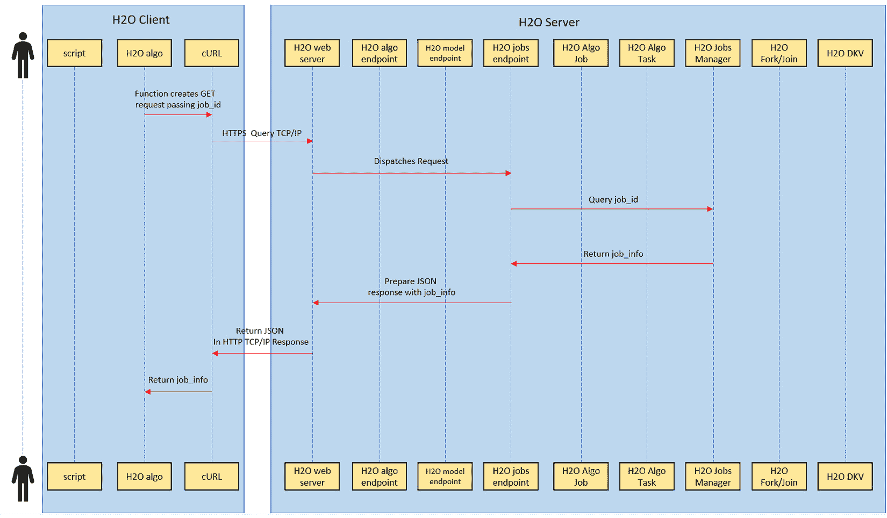

图 4.9 – 用户轮询模型状态交互序列

当客户端轮询模型训练作业完成情况时，会发生以下一系列操作：

1.  要获取模型训练的状态，客户端将发出 `GET` 请求，传递它在首次请求训练模型时收到的 `job_id`。

1.  `GET` 请求通过网络传输到主机 IP 地址的 H2O 网络服务器。

1.  H2O 网络服务器将请求调度到 H2O 作业端点。

1.  H2O 作业端点随后将查询作业管理器，请求 `GET` 请求中传递的 `job_id` 的状态。

1.  作业管理器将返回相应 `job_id` 的作业信息，其中包含有关模型训练进度的信息。

1.  H2O 作业端点将为 `job_id` 准备包含作业信息的 JSON 响应，并将其发送到 H2O 网络服务器。

1.  H2O 网络服务器随后将 JSON 作为响应发送回发起请求的客户端。

1.  接收到响应后，客户端将解包此 JSON 并根据作业信息更新用户关于模型训练状态的了解。

这总结了当客户端轮询模型训练状态时发生的各种交互。考虑到这一点，现在让我们看看当客户端在得知模型训练作业已完成模型训练后请求模型信息时会发生什么。

### 客户端查询模型信息

一旦模型训练成功，用户很可能会想要分析模型的详细信息。机器学习模型与其性能和质量相关联的元数据非常丰富。即使模型尚未用于预测，这些元数据也非常有用。但是，正如我们在上一节中看到的，模型训练过程与用户的请求无关，一旦训练完成，H2O 不会返回模型对象。然而，H2O 服务器确实提供了一个 API，使用它可以获取服务器上已存储的模型信息。

以下序列图显示了客户端请求有关已训练模型的信息时发生的交互序列：

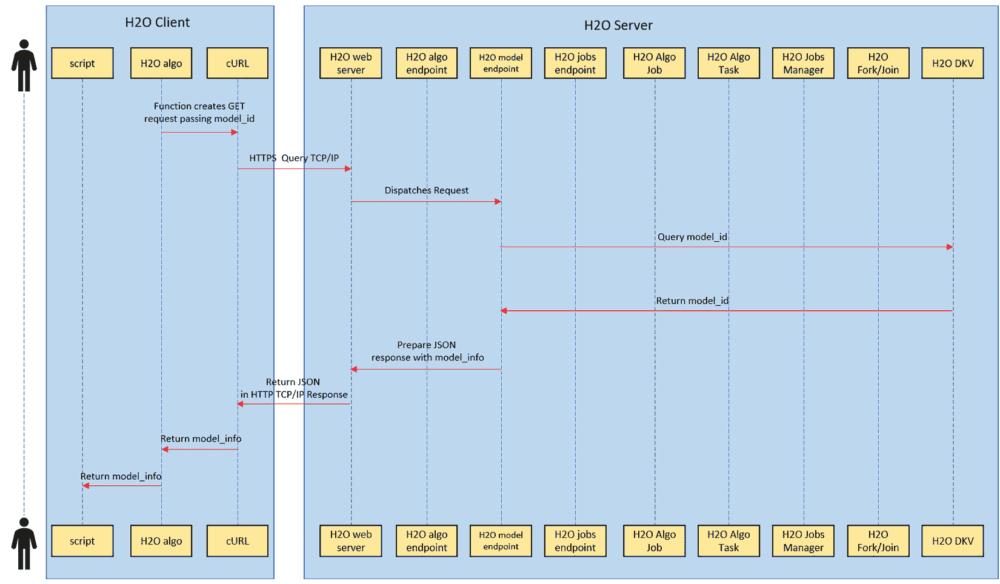

图 4.10 – 用户查询模型信息

当客户端轮询模型训练作业完成时，会发生以下一系列操作：

1.  要获取模型信息，客户端将发送一个 `GET` 请求，传递机器学习模型的唯一 `model_id`。

1.  `GET` 请求通过网络传输到主机 IP 地址的 H2O 网络服务器。

1.  H2O 网络服务器将请求调度到 H2O 模型端点。

1.  当模型训练作业完成模型训练时，所有模型信息都存储在 H2O 的分布式键值存储中。H2O 模型端点将使用 `model_id` 作为过滤器查询这个分布式键值存储。

1.  分布式键值存储将返回传递给它的 `model_id` 的所有模型信息。

1.  然后，H2O 模型端点将准备一个包含模型信息的 JSON 响应，并将其发送到 H2O 网络服务器。

1.  H2O 网络服务器将相应地将 JSON 作为响应发送回发起请求的客户端。

1.  在收到响应后，客户端将提取所有模型信息并显示给用户。

一旦模型训练完成，它将直接存储在 H2O 服务器本身中，以便在有任何预测请求时快速访问。您还可以下载 H2O 模型；然而，任何未导入到 H2O 服务器的模型都不能用于预测。

这总结了 H2O 客户端-服务器通信中各个部分发生的整个交互序列。现在我们了解了 H2O 如何使用作业和作业管理器内部训练模型，让我们进一步深入，尝试理解当 H2O AutoML 训练和优化超参数，最终选择最佳模型时会发生什么。

# 理解 H2O AutoML 如何执行超参数优化和训练

在本书的整个过程中，我们惊叹于 AutoML 过程如何自动化训练和选择最佳模型这一复杂的任务，而无需我们动手。然而，在每一次自动化背后，都有一系列简单的步骤，这些步骤以顺序的方式执行。

现在我们已经对 H2O 的架构以及如何使用 H2O AutoML 来训练模型有了很好的理解，我们现在终于可以打开黑盒，即 H2O AutoML。在本节中，我们将了解 H2O AutoML 在幕后做了什么，以便它能够自动化整个训练和选择最佳机器学习模型的过程。

这个问题的答案相当简单。H2O AutoML 通过使用**网格搜索超参数优化**自动完成整个机器学习过程。

网格搜索超参数优化对于许多非专业人士来说听起来非常令人畏惧，但如果你了解一些模型训练的基本概念，特别是**超参数**的重要性，这个概念本身实际上是非常容易理解的。

因此，在我们深入探讨网格搜索超参数优化之前，让我们首先了解什么是超参数。

## 理解超参数

大多数软件工程师都知道什么是参数：包含某些用户输入数据或任何系统计算数据，这些数据被馈送到另一个函数或过程中的某些变量。然而，在机器学习中，由于超参数的引入，这个概念稍微复杂一些。在机器学习领域，有两种类型的参数。一种我们称之为**模型参数**，或简称参数，另一种是**超参数**。尽管它们的名称相似，但它们之间有一些重要的区别，所有在机器学习领域工作的软件工程师都应该记住。

那么，让我们通过简单的定义来理解它们：

+   **模型参数**：模型参数是机器学习算法在模型训练过程中从给定数据集中计算或学习到的参数值。一些基本的模型参数示例包括数据集中的**均值**或**标准差**、**权重**和**偏差**。这些是我们从训练数据中学习到的元素，这些是我们机器学习算法用来训练机器学习模型的参数值。模型参数也称为**内部参数**。在给定的机器学习训练场景中，模型参数是不可调整的。

+   **超参数**：超参数是模型训练之外的外部配置，不是从训练数据集中派生出来的。这些是由机器学习实践者设置的参数值，用于推导模型参数。它们是机器学习实践者通过启发式方法发现并输入到模型训练开始之前的值。一些简单的超参数例子包括随机森林中的**树的数量**，或者回归算法中的**学习率**。每种机器学习算法都将有其自己所需的一组超参数。超参数是可调整的，并且通常在给定的机器学习训练场景中通过实验来获得最优模型。

训练最优模型的目标很简单：

1.  你选择最佳的超参数组合。

1.  这些超参数生成理想的模型参数。

1.  这些模型参数训练出一个错误率最低的模型。

听起来很简单。然而，这里有一个问题。超参数在本质上并不直观。人们不能仅仅观察数据并决定超参数的*x*值将给我们带来最佳模型。找到完美的超参数是一个试错过程，其目的是找到最小化错误的一个组合。

现在，接下来出现的问题是，你如何找到训练模型的最佳超参数。这就是超参数优化出现的地方，我们将在下一章中介绍。

## 理解超参数优化

超参数优化，也称为**超参数调整**，是指为给定的机器学习算法选择最佳超参数集的过程，以训练出最优模型。这些值的最佳组合可以最小化机器学习算法预定义的**损失函数**。简单来说，损失函数是一个衡量某些错误单位的函数。不同的机器学习算法有不同的损失函数。在潜在的超参数值组合中，具有最低错误量的模型被称为具有最优超参数。

实现超参数优化有许多方法。其中一些最常见的方法是**网格搜索**、**随机网格搜索**、**贝叶斯优化**和**基于梯度的优化**。每个都是一个非常广泛的话题；然而，对于本章，我们将只关注两种方法：网格搜索和随机网格搜索。

小贴士

如果你想了解更多关于超参数调整的贝叶斯优化技术，那么请随意探索。你可以在以下链接中找到有关此主题的更多信息：[`arxiv.org/abs/1807.02811`](https://arxiv.org/abs/1807.02811)。同样，你可以在以下链接中找到更多关于基于梯度的优化的详细信息：[`arxiv.org/abs/1502.03492`](https://arxiv.org/abs/1502.03492)。

实际上，H2O 的 AutoML 用于超参数优化的方法是随机网格搜索方法，但你需要理解优化中的原始网格搜索方法，以便理解随机网格搜索。

因此，让我们从网格搜索超参数优化开始。

### 理解网格搜索优化

让我们以我们在*第一章*中使用的例子，即*理解 H2O AutoML 基础*为例。在这个数据集中，我们正在训练一个模型，该模型通过学习花瓣宽度、花瓣长度、萼片宽度和萼片长度来预测花的分类类型。

现在，你面临的首要问题是：应该使用哪种机器学习算法来训练模型？假设你确实找到了答案并选择了一个算法，那么接下来的问题将是：哪个超参数组合将给我带来最优的模型？

传统上，机器学习从业者会为给定的机器学习算法训练多个模型，这些模型使用不同的超参数值组合。然后，他们会比较这些模型的性能，找出哪个超参数组合训练出的模型具有最低的可能错误率。

下面的图表展示了不同的超参数组合如何训练出性能各异的模型：

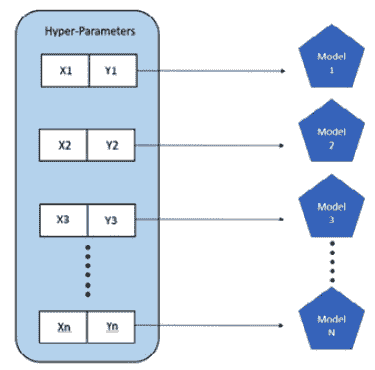

图 4.11 – 手动超参数调整

让我们以你正在训练决策树为例。它的超参数是树的数量`ntrees`和最大深度`max_depth`。如果你正在进行手动搜索以进行超参数优化，那么你将最初从`ntrees`的值`50`、`100`、`150`和`200`以及`max_depth`的值`5`、`10`和`50`开始，训练模型并测量它们的性能。当你发现哪个值的组合给你带来最佳结果时，你将这些值设置为阈值，并通过较小的增量或减量调整它们，使用这些新的超参数值重新训练模型，并再次比较性能。你一直这样做，直到找到最佳的超参数值组合，以获得最佳性能。

然而，这种方法有几个缺点。首先，你可以尝试的值范围有限，因为你只能手动训练这么多模型。所以，如果你有一个值介于 1 到 10,000 之间的超参数，那么你需要确保你覆盖足够的范围，以免因为巨大的误差而错过理想值。如果你这样做，那么你将不断以较小的增量或减量调整值，花费大量时间进行优化。其次，随着超参数数量的增加以及你想要使用的可能值和值组合数量的增加，机器学习从业者管理并运行优化过程变得繁琐。

为了管理和部分自动化使用不同超参数训练多个模型的过程，发明了网格搜索。网格搜索也被称为**笛卡尔超参数搜索**或**穷举搜索**。

网格搜索基本上将给定超参数的所有值映射到笛卡尔网格上，并在网格中全面搜索组合以训练模型。参考以下图表，它展示了超参数网格搜索如何转化为训练多个模型：

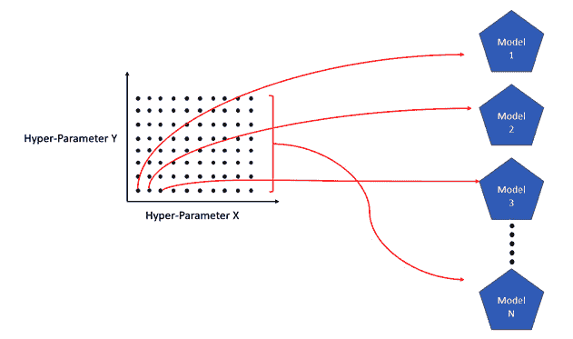

图 4.12 – 卡尔丹网格搜索超参数调整

在图中，我们可以看到我们有一个二维网格，它映射了两个超参数。使用这个笛卡尔网格，我们可以进一步将超参数值的组合扩展到每个参数 10 个值，从而扩展我们的搜索。网格搜索方法会全面搜索两个超参数的不同值。因此，它将有 100 种不同的组合，总共训练 100 个不同的模型，所有这些模型都是在不需要太多手动干预的情况下训练的。

H2O 确实具有网格搜索功能，用户可以使用它来测试他们自己手动实现的网格搜索方法进行超参数优化。当使用网格搜索训练模型时，H2O 会将所有训练的模型映射到网格中相应的超参数值组合。H2O 还允许你根据任何支持的模型性能指标对所有这些模型进行排序。这种排序可以帮助你根据指标值快速找到性能最佳的模型。我们将在*第六章*中进一步探讨性能指标，*理解 H2O AutoML 排行榜和其他性能指标*。

然而，尽管自动化并引入了提高生活质量的改进，这种方法仍然存在一些缺点。网格搜索超参数优化受到所谓的**维度诅咒**的影响。

维度诅咒这个术语是由**理查德·E·贝尔曼**在考虑动态规划问题时提出的。从机器学习的角度来看，这个概念表明，随着超参数组合数量的增加，网格搜索将执行的评估数量将以指数级增长。

例如，假设你有一个超参数*x*，并且你想尝试 1 到 20 的整数值。在这种情况下，你将进行 20 次评估，换句话说，训练 20 个模型。现在假设还有一个超参数*y*，并且你想尝试与*x*的值相结合的 1 到 20 的值。你的组合将如下所示：

*(1,1), (1,2), (1,3), (1,4), (1,5), (1,6), (1,7)……(20,20)，其中(x, y)*

现在，你的网格中共有 20x20=400 种组合，你的网格搜索优化将最终训练 400 个模型。再添加一个超参数*z*，你的组合数量将激增，超出管理范围。你拥有的超参数越多，你尝试的组合就越多，组合爆炸现象就越严重。

考虑到机器学习对时间和资源敏感，穷举搜索对于找到最佳模型来说是没有效果的。现实世界有局限性，因此随机选择超参数值已被证明往往比穷举网格搜索提供更好的结果。

这将我们引向超参数优化的下一个方法，即随机网格搜索。

### 理解随机网格搜索优化

随机网格搜索通过从超参数搜索空间中选择随机值来替代之前的穷举网格搜索，而不是按顺序耗尽所有值。

例如，参考以下图表，它展示了随机网格搜索优化的一个示例：

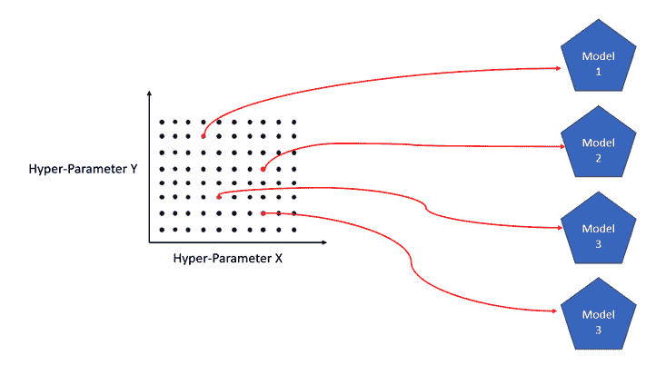

图 4.13 – 随机网格搜索超参数调整

上述图表是两个超参数*X*和*Y*的 100 种组合的超参数空间。随机网格搜索优化将随机选择其中几个，并使用这些超参数值进行评估。

随机网格搜索优化的缺点是它是一种在有限评估次数内寻找最佳超参数值组合的最佳努力方法。它可能或可能不会找到训练最佳模型的最佳超参数值组合，但给定一个大的样本量，它可以找到接近完美的组合来训练一个质量足够好的模型。

H2O 库函数支持随机网格搜索优化。它为用户提供设置自己的超参数搜索网格和设置搜索标准参数以控制搜索类型和范围的功能。搜索标准可以是任何东西，例如最大运行时间、最大训练模型数量或任何指标。H2O 将随机无重复地从网格中选择不同的超参数组合进行评估，并持续搜索和评估，直到满足搜索标准。

H2O AutoML 的工作方式与随机网格搜索优化略有不同。它不是等待用户输入超参数搜索网格，而是通过已经有一个包含所有潜在值的超参数列表，并在网格中默认值的形式自动完成这一部分。H2O AutoML 还提供了将用户设置的超参数搜索列表中的非默认值包括在内的功能。H2O AutoML 已经为算法预设了值；我们将在下一章中探讨这些值，同时了解不同算法的工作原理。

# 摘要

在本章中，我们了解了 H2O 的高级架构以及构成整体架构的不同层级。然后，我们深入到架构的客户端和 JVM 层，了解了构成 H2O 软件堆栈的不同组件。接下来，在心中牢记 H2O 的架构，我们了解了客户端和服务器之间发生的交互流程，了解了我们如何确切地命令 H2O 服务器执行各种机器学习活动。我们还了解了在模型训练过程中，交互如何在架构堆栈中流动。

建立在现有知识的基础上，我们研究了在模型训练过程中 H2O 服务器内部发生的交互序列。我们还探讨了 H2O 如何使用作业管理器来协调训练作业，以及 H2O 如何与用户沟通模型训练的状态。最后，我们揭开了 H2O AutoML 的面纱，并了解了它是如何自动训练最佳模型的。我们已经理解了超参数优化的概念及其各种方法，以及 H2O 如何自动化这些方法并减轻它们的缺点以自动训练最佳模型。

现在我们已经了解了 H2O AutoML 的内部细节以及它是如何训练模型的，我们现在准备了解 H2O AutoML 训练的各种机器学习算法以及它们如何进行预测。在下一章中，我们将探索这些算法，并更好地理解模型，这将帮助我们证明哪种模型最适合给定的机器学习问题。
