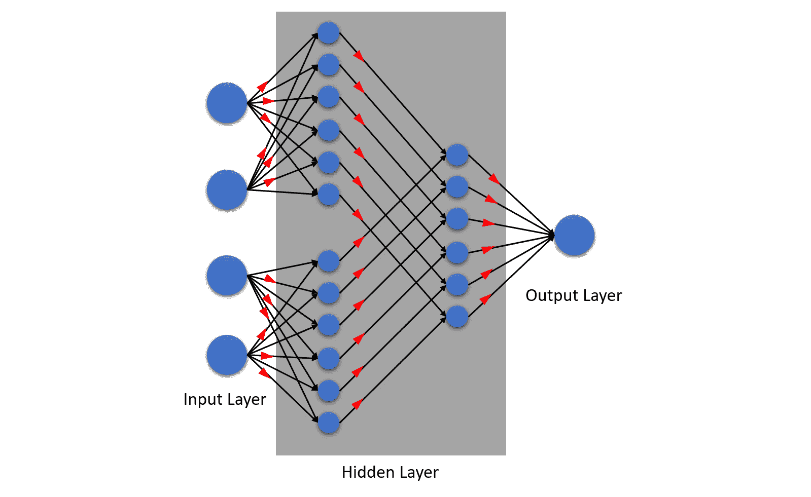

# 理解 AutoML 算法

所有机器学习算法都以**计算统计学**为基础。计算统计学是统计学与计算机科学的结合，其中计算机用于计算复杂的数学。这种计算就是机器学习算法，而我们从中得到的预测结果。作为机器学习领域的工程师和科学家，我们通常需要了解机器学习算法的基本逻辑。人工智能领域有大量的机器学习算法。它们都旨在解决不同类型的预测问题。它们各自也有自己的优缺点。因此，工程师和科学家的工作就是找到能够解决给定预测问题且在所需约束条件下表现最佳的机器学习算法。然而，随着 AutoML 的发明，这项工作变得容易多了。

尽管 AutoML 承担了寻找最佳机器学习算法的巨大责任，但作为工程师和科学家，我们仍然需要验证和证明这些算法的选择。为此，对机器学习算法的基本理解是必不可少的。

在本章中，我们将探讨和理解 H2O AutoML 用于训练模型的各种机器学习算法。如前所述，所有机器学习算法都有深厚的统计学基础。统计学本身是数学的一个庞大分支，内容太多，无法在一章中涵盖。因此，为了对机器学习算法的工作原理有一个基本的理解，我们将从基本统计学概念出发，从概念上探讨它们的内部运作，而不是深入数学。

小贴士

如果你想要在统计学领域获得更多知识，那么以下链接应该是一个不错的起点：[`online.stanford.edu/courses/xfds110-introduction-statistics`](https://online.stanford.edu/courses/xfds110-introduction-statistics)。

首先，我们将了解不同类型的机器学习算法，然后学习这些算法的工作原理。我们将通过将它们分解为单个概念，理解它们，然后再将这些概念组合起来以理解整体来做到这一点。

本章将涵盖以下主题：

+   理解不同类型的机器学习算法

+   理解广义线性模型算法

+   理解分布式随机森林算法

+   理解梯度提升机算法

+   理解深度学习是什么

因此，让我们从理解不同类型的机器学习算法开始我们的旅程。

# 理解不同类型的机器学习算法

机器学习算法旨在解决特定的预测问题。这些预测问题可以是任何在预测准确的情况下能提供价值的问题。不同预测问题之间的区别在于要预测的价值是什么。是简单的“是”或“否”值，一个数值范围，还是从潜在值列表中选择的一个特定值，或者是文本的概率或语义？机器学习领域足够广泛，可以以多种方式涵盖大多数，如果不是所有这样的问题。

因此，让我们从了解预测问题的不同类别开始。它们如下：

+   **回归**：回归分析是一种统计过程，旨在找到独立变量（也称为特征）和因变量（也称为标签或响应变量）之间的关系，并使用这种关系来预测未来的值。

回归问题是指旨在预测某些连续数值的问题——例如，根据汽车的品牌名称、发动机大小、经济性和电子特性来预测汽车的价格。在这种情况下，汽车的品牌名称、发动机大小、经济性和电子特性是独立变量，因为它们的存在与其他值无关，而汽车价格是因变量，其值取决于其他特性。此外，汽车的价格是一个连续值，因为它可以在 0 到 1 亿美元或任何其他货币的数值范围内。

+   **分类**：分类是一种统计过程，旨在根据标签值与特征之间的关系将它们分类到某些类别或类别中。

分类问题是指旨在预测一组特定值的问题——例如，根据一个人的胆固醇水平、体重、锻炼水平、心率和家庭病史来预测这个人是否可能面临心脏病。另一个例子是预测餐厅在谷歌评论上的评分，评分范围从 1 到 5 星，这取决于位置、食物、环境和价格。

如您从这些例子中看到的，分类问题可以是“是”或“否”，“真”或“假”，“1”或“0”类型的分类，或者是一组特定的分类值，例如在谷歌评论示例中，值可以是 1、2、3、4 或 5。因此，分类问题可以进一步分为以下几类：

+   **二元分类**：在这种分类问题中，预测值是二元的，这意味着它们只有两个值——也就是说，“是”或“否”，“真”或“假”，“1”或“0”。

+   **多类/多项式分类**：在这种分类问题中，预测值是非二元的，也称为多项式，这意味着它们有多于两组的值。例如，按年龄分类，涉及从 1 到 100 的整数，或者按基本颜色分类，可以是红色、黄色或蓝色。

+   **聚类**：聚类是一种统计过程，旨在以某种方式将某些数据点分组或划分，使得单个组内的数据点具有与其他组数据点不同的相似特征。

**聚类问题**：聚类问题是旨在理解一组值内部相似性的问题。

例如，给定一组具有某些细节（如他们使用的硬件、他们玩的不同游戏以及他们玩这些视频游戏的时间）玩视频游戏的人，你可以根据他们最喜欢的游戏类型对人们进行分类。聚类可以进一步细分为以下几种：

+   **硬聚类**：在这种类型的聚类中，所有数据点要么属于一个簇，要么属于另一个簇；它们是互斥的。

+   **软聚类**：在这种类型的聚类中，不是将数据点分配给一个簇，而是计算数据点可能属于某个簇的概率。这增加了数据点可能同时属于多个簇的可能性。

+   **关联**：关联是一种统计过程，旨在找出如果事件 A 发生了，事件 B 发生的可能性有多大？关联问题基于关联规则，这些规则是如果-那么陈述，显示了不同数据点之间关系的概率。

关联问题的最常见例子是**市场篮子分析**。市场篮子分析是一个预测问题，给定一个用户在市场上购买了一定产品 A，那么用户购买与产品 A 相关的产品 B 的概率是多少？

+   **优化/控制**：**控制理论**、**最优控制理论**或**优化问题**是数学的一个分支，它处理寻找一组值的组合，以优化动态系统。**机器学习控制**（**MLC**）是机器学习中的一个子领域，旨在使用机器学习来解决优化问题。MLC 的一个好例子是将机器学习应用于优化道路上的交通，使用自动汽车。

现在我们已经了解了不同类型的预测问题，让我们深入了解不同类型的机器学习算法。不同类型的机器学习算法被分类如下：

+   **监督学习**：监督学习是根据先前存在的、已标记的值来映射自变量和因变量之间关系的机器学习任务。标记数据是包含有关其特征哪些是依赖的、哪些是独立的的信息的数据。在监督学习中，我们知道我们想要预测的特征，并将该特征标记为标签。机器学习算法将使用这些信息来映射关系。使用这种映射，我们预测新输入值的输出。另一种理解这个问题的方式是，先前存在的值监督机器学习算法的学习任务。

监督学习算法通常用于解决回归和分类问题。

监督学习算法的一些例子包括**决策树**、**线性回归**和**神经网络**。

+   **无监督学习**：如前所述，监督学习是从未标记的数据中寻找模式和行为的机器学习任务。在这种情况下，我们不知道我们想要预测哪个特征，或者我们想要预测的特征甚至可能不是数据集的一部分。无监督学习帮助我们预测潜在的重复模式，并使用这些模式对数据集进行分类。另一种理解这个问题的方式是，没有标记的值来监督机器学习算法的学习任务；算法独立地学习模式和行为了。

无监督学习算法通常用于解决聚类和关联问题。

无监督学习算法的一些例子包括**K-means 聚类**和**关联规则学习**。

+   **半监督学习**：半监督学习介于监督学习和无监督学习之间。它是执行部分标记数据集上的机器学习任务的机器学习任务。它用于你有一个小部分标记的数据集和大量未标记数据集的场景。在现实场景中，标记大量数据是一个昂贵的任务，因为它需要大量的实验和需要人工解释的上下文信息，而未标记数据相对容易获取。在这种情况下，半监督学习通常证明是有效的，因为它擅长从未标记数据集中假设预期的标签值，同时像任何监督学习算法一样高效地工作。

无监督学习算法通常用于解决聚类和分类问题。

半监督学习算法的一些例子包括**生成模型**和**拉普拉斯正则化**。

+   **强化学习**：强化学习是一个旨在在给定环境中识别下一步正确逻辑动作以最大化累积奖励的机器学习任务。在这种学习中，预测的准确性是在使用正强化和/或负强化后计算的，这些强化再次被输入到算法中。这种对环境的持续学习最终帮助算法找到最佳步骤序列以最大化奖励，从而做出最准确的决策。

强化学习通常用于解决回归、分类和优化问题的混合。

强化学习算法的一些例子包括**蒙特卡洛方法**、**Q 学习**和**深度 Q 网络**。

尽管 AutoML 技术已经足够成熟，可以用于商业用途，但与机器学习领域的广泛发展相比，它仍然处于起步阶段。AutoML 可能能够在最短的时间内使用最少或没有人为干预来训练最佳的预测模型，但它的潜力目前仅限于监督学习。以下图表总结了不同机器学习任务下分类的各种机器学习算法：

图 5.1 – 机器学习问题的类型和算法

同样，H2O 的 AutoML 也专注于监督学习，因此你通常需要提供标签数据来供其使用。

与监督学习算法相比，执行无监督学习的机器学习算法通常更为复杂。因为在这种情况下，没有真实数据来衡量模型的性能。这与 AutoML 的本质相悖，AutoML 非常依赖于模型性能的测量来自动化训练和超参数调整。

因此，相应地，H2O AutoML 属于监督机器学习算法的范畴，它训练多个监督机器学习算法来解决回归和分类问题，并根据它们的性能进行排名。在本章中，我们将关注这些机器学习算法，了解它们的功能，以便我们能够充分理解、选择和证明 H2O AutoML 为特定预测问题训练的不同模型。

基于这种理解，让我们从第一个机器学习算法：广义线性模型开始。

# 理解广义线性模型算法

**广义线性模型**（**GLM**），正如其名所示，是一种灵活的推广线性模型的方法。它是由*约翰·尼尔*和*罗伯特·韦德伯恩*提出的，作为一种将各种回归模型组合成一个分析的方法，同时考虑到不同的概率分布。你可以在[`rss.onlinelibrary.wiley.com/doi/abs/10.2307/2344614`](https://rss.onlinelibrary.wiley.com/doi/abs/10.2307/2344614)找到他们详细的论文（Nelder, J.A. and Wedderburn, R.W., 1972\. *广义线性模型. 皇家统计学会会刊：A 系列（一般），135(3)，pp.370-384*）。

现在，你可能想知道什么是线性模型。为什么我们需要对它们进行推广？它提供了什么好处？这些问题确实很重要，而且不需要深入数学知识就可以很容易地理解。一旦我们分解了逻辑，你会发现广义线性模型的概念非常容易理解。

那么，让我们先从理解线性回归的基本概念开始。

## 线性回归简介

**线性回归**可能是最古老的统计模型之一，其历史可以追溯到 200 年前。它是一种在图上线性映射因变量和自变量之间关系的方法。这意味着两个变量之间的关系可以完全由一条直线来解释。

考虑以下例子：

图 5.2 – 线性回归

这个例子展示了两个变量之间的关系。一个人的身高 H 是自变量，而一个人的体重 W 是因变量。这两个变量之间的关系可以很容易地用一条红色的直线来解释。一个人越高，他或她的体重越有可能更重。这很容易理解。

统计上，任何直线的通用方程，也称为**线性方程**，如下所示：

在这里，我们有以下内容：

+   *y* 是 *Y* 轴上的一个点，表示因变量。

+   *x* 是 *X* 轴上的一个点，表示自变量。

+   *b**1* 是直线的斜率，也称为梯度，表示直线的陡峭程度。梯度越大，直线越陡。

+   *b**0* 是一个常数，表示直线与 *Y* 轴相交的点。

在线性回归过程中，机器将在图上映射两个变量的所有数据点，并在图上随机放置直线。然后，它将通过将图中的数据点的 *x* 值插入线性方程中来计算 *y* 的值，并将结果与数据点的相应 *y* 值进行比较。之后，它将计算它计算的 *y* 值与实际 *y* 值之间的误差大小。这种值之间的差异就是我们所说的**残差**。

以下图表应有助于你理解什么是残差：

图 5.3 – 线性回归中的残差

机器将为所有数据点做这件事，并记录所有误差。然后，它将通过改变 b1 和 b0 的值来尝试调整直线，这意味着改变图上直线的角度和位置，并重复这个过程。它将这样做，直到最小化误差。

产生最少误差的 b1 和 b0 的值是两个变量之间最准确的线性关系。具有这些 b1 和 b0 值的方程是线性模型。

现在，假设你想预测一个身高 180 厘米的人的体重。然后，你使用这个相同的线性模型方程，使用 b1 和 b0 的值，将 *x* 设置为 180，并计算 *y*，这将是你预期的体重。

恭喜你，你刚刚在心中进行了机器学习，没有任何计算机的帮助，并且做出了预测！实际的机器学习工作方式相同，尽管增加了复杂算法的复杂性。线性回归不仅限于两个变量——它还可以处理存在多个自变量的多个变量。这种线性回归称为多元或曲线回归。这种线性回归的方程如下扩展：

在这个方程中，附加的变量——x1、x2、x3 等等——分别与它们自己的系数——b1、b2 和 b3 相加。

如果你对线性回归的内部工作原理感兴趣，不妨探索这些算法及其背后的数学。

## 理解线性回归的假设

当在给定的数据集上训练模型时，线性回归基于对数据的某些假设。这些假设之一是**误差的正态性**。

在我们了解误差的正态性之前，让我们快速了解**概率密度函数**的概念。这是一个数学表达式，它定义了离散值的概率分布——换句话说，它是一个数学表达式，显示了从给定的样本空间中发生样本值的概率。为了理解这一点，请参考以下图表：

图 5.4 – 两个骰子数值的概率分布

前面的图表显示了当公平且独立地掷一对六面骰子时，所有可能出现的数值的概率分布。存在不同类型的分布。以下是一些常见分布的例子：

图 5.5 – 不同类型的分布

误差的正态性表明，数据残差必须是正态分布的。**正态分布**，也称为**高斯分布**，是一个关于均值对称的概率密度函数，其中最接近均值的值出现频率较高，而远离均值的值很少出现。以下图表显示了正态分布：

图 5.6 – 正态分布

线性回归期望计算出的残差落在正态分布范围内。在我们之前的关于预期体重与一定身高的人实际体重之间误差的例子中，预测体重和实际体重之间必然存在一些误差。然而，由于预期体重和预测体重之间极端差异的人出现的次数不会太多，因此预测的残差或误差很可能会落在正态分布范围内。

考虑一个人们申请健康保险赔付的场景。以下图表显示了该数据集的线性回归图样本：

图 5.7 – 健康保险赔付

在前面的图中，你可以看到来自各个年龄段的大多数人没有申请健康保险。其中一些人申请了，索赔费用差异很大。有些人有轻微的问题，花费*很少*，而有些人遭受了严重的伤害，不得不进行昂贵的手术。

如果你通过这个数据集绘制线性回归线，它看起来如下所示：

图 5.8 – 健康保险赔付的线性回归

但是，现在如果你从所有数据点的预期值和预测值中计算残差误差，那么这些残差的概率分布将不会落入正态分布。它看起来如下所示：

图 5.9 – 健康保险赔付的残差分布

这是一个不精确的模型，因为预期值和预测值甚至不够接近，以至于可以四舍五入或纠正。那么，对于这种错误假设对于数据集不成立的情况，你该怎么办？如果残差的分布是泊松分布而不是正态分布，机器将如何纠正？

好吧，这个问题的答案是残差的分布取决于数据集本身的分布。如果因变量的值呈正态分布，那么残差的分布也将是正态的。因此，一旦我们确定了哪个概率密度函数适合数据集，我们就可以使用该函数来训练我们的线性模型。

根据这个函数，为每个概率密度函数有专门的线性回归方法。如果你的分布是**泊松**，那么你可以使用**泊松回归**。如果你的数据分布是负**二项式**，那么你可以使用**负二项式回归**。

## 使用广义线性模型（GLM）进行工作

现在我们已经涵盖了基础知识，让我们来了解什么是 GLM。GLM 是一种指向所有特定于数据类型概率分布的回归方法的方式。技术上讲，所有回归模型都是 GLM，包括我们的普通简单线性模型。GLM 只是将它们封装在一起，并根据概率分布函数训练适当的回归模型。

GLM 的工作方式是使用所谓的连接函数，结合系统成分和随机变量。

这些是广义线性模型（GLM）的三个组成部分：

+   **系统成分**：回到多元线性方程，我们有以下内容：

在这里，b1x1+ b2x2 + b3x3 + …… + b0 是系统成分。这是将我们的数据（也称为预测变量）与我们的预测相联系的功能。

+   **随机成分**：这个成分指的是响应变量的概率分布。这将是响应变量是正态分布、二项分布还是其他任何形式的分布。

+   **链接函数**：链接函数是一个将数据的非线性关系映射到线性关系上的函数。换句话说，它弯曲线性回归的线，以更准确地表示非线性数据的关系。它是随机成分和系统成分之间的链接。我们可以用链接函数数学上解释方程式为 *Y = f*n*( b*1*x*1*+ b*2*x*2 *+ b*3*x*3 *+ …… + b*0 *)*，其中 *f*n 是随响应变量分布变化的链接函数。

链接函数对于不同的分布是不同的。下表显示了不同分布的不同链接函数：

| **分布类型** | **链接函数** | **算法名称** |
| --- | --- | --- |
| 正态 |  | 线性模型 |
| 二项分布 |  | 逻辑回归 |
| 泊松 |  | 泊松回归 |
| 伽马 |  | 伽马回归 |

图 5.10 – 不同分布类型的链接函数

当训练 GLM 模型时，你可以选择家庭超参数的值。家庭选项指定了响应列的概率分布，GLM 训练算法在训练期间使用适当的链接函数。

家庭超参数的值如下：

+   **高斯分布**：如果响应是一个实整数，你应该选择此选项。

+   **二项分布**：如果响应是具有两个类别的分类响应或二进制，可以是枚举或整数，你应该选择此选项。

+   **分数二项分布**：如果响应是介于 0 和 1 之间的数值，你应该选择此选项。

+   **有序**：如果响应是一个具有三个或更多类别的分类响应，你应该选择此选项。

+   **准二项分布**：如果响应是数值，你应该选择此选项。

+   **多项式分布**：如果响应是一个具有三个或更多类别的分类响应，且这些类别为枚举类型，你应该选择此选项。

+   **泊松**：如果响应是数值且包含非负整数，你应该选择此选项。

+   **伽马分布**：如果响应是数值且连续，并包含正实整数，你应该选择此选项。

+   **Tweedie**：如果响应是数值且包含连续的实数和非负值，你应该选择此选项。

+   **负二项分布**：如果响应是数值且包含非负整数，你应该选择此选项。

+   **AUTO**：这会自动为用户确定家族。

如你所猜，H2O 的 AutoML 在训练 GLM 模型时将 AUTO 选为家族类型。AutoML 过程通过理解数据集中响应变量的分布并应用正确的链接函数来训练 GLM 模型，来处理选择正确分布家族的情况。

恭喜，我们刚刚了解了 GLM 算法的工作原理！GLM 是一个非常强大且灵活的算法，H2O AutoML 专家地配置了其训练，以便训练最准确和性能最高的 GLM 模型。

现在，让我们继续了解 H2O 训练的下一个机器学习算法：**分布式随机森林**（**DRF**）。

# 理解分布式随机森林算法

**DRF**，简称为**随机森林**，是一种非常强大的监督学习技术，常用于分类和回归。DRF 学习技术的基础是基于**决策树**，其中随机创建大量决策树用于预测，并将它们的预测结果结合起来得到最终输出。这种随机性用于最小化所有单个决策树的偏差和方差。所有决策树共同组合在一起，称为森林，因此得名随机森林。

要对 DRF 有更深入的概念理解，我们需要了解 DRF 的基本构建块——那就是决策树。

## 决策树简介

用非常简单的话来说，决策树只是一组*IF*条件，根据传递给它的数据返回是或否的答案。以下图展示了决策树的一个简单示例：

图 5.11 – 简单决策树

上一图展示了基本的决策树。决策树由以下组件组成：

+   **节点**：节点基本上是*IF*条件，根据条件是否满足来分割决策树。

+   **根节点**：决策树顶部的节点被称为根节点。

+   **叶节点**：决策树中不再分支的节点被称为叶节点，或简称为叶子。在这种情况下，条件是如果传递给它的数据值是数值型的，则答案是数据是一个数字；如果传递给它的数据不是数值型的，则答案是数据是非数值型。这很简单，容易理解。

如图 5.11 所示，决策树基于一个简单的真或假问题。决策树也可以基于数值数据的数学条件。以下示例展示了基于数值条件的决策树：

图 5.12 – 数值决策树

在这个例子中，根节点计算智商数是否大于 300，并决定它是人工智能还是人类智能。

决策树也可以组合使用。它们可以形成依赖于先前决策结果的复杂决策条件集。请参考以下示例中的复杂决策树：

图 5.13 – 复杂决策树

在前面的例子中，我们试图计算你是否可以“出去玩”或“完成你的机器学习研究”。这个决策树结合了数值数据和数据的分类。在做出预测时，决策树将从顶部开始，逐层向下，根据数据是否满足条件做出决策。叶节点是决策树最终的潜在结果。

在这个知识的基础上，让我们在一个示例数据集上创建一个决策树。请参考以下表格中的示例数据集：

图 5.14 – 创建决策树的示例数据集

上述数据集的内容如下：

+   **胸痛**：此列表示患者是否患有胸痛。

+   **良好血液循环**：此列表示患者是否有良好的血液循环。

+   **阻塞动脉**：此列表示患者是否有阻塞的动脉。

+   **心脏病**：此列表示患者是否患有心脏病。

对于这个场景，我们想要创建一个决策树，该决策树使用胸痛、良好血液循环和阻塞动脉特征来预测患者是否患有心脏病。现在，在形成决策树时，我们首先需要做的是找到根节点。那么，我们应该将哪个特征放在决策树的顶部？

我们首先来看一下，仅凭“胸痛”特征在预测心脏病方面的表现。我们将遍历数据集中的所有值，并将它们映射到这个决策树上，同时比较“胸痛”列的值与心脏病列的值。我们将在决策树中跟踪这些关系。以“胸痛”为根节点的决策树如下：

图 5.15 – 胸痛特征的决策树

现在，我们对数据集中的其他所有特征都进行同样的操作。我们为“良好血液循环”创建一个决策树，并查看它在预测心脏病时的表现，同时记录比较结果，重复同样的过程来跟踪“动脉阻塞”状态。如果数据集中有任何缺失值，则跳过它们。理想情况下，你不应该使用包含缺失值的数据集。我们可以使用我们在*第三章*，“理解数据处理”中学到的技术，其中我们插补和处理缺失数据集值。

参考以下图表，它显示了创建的两个决策树 – 一个用于**患者有阻塞的动脉**，另一个用于**患者有良好的血液循环**：

图 5.16 – 阻塞性动脉和良好血液循环特征的决策树

现在我们已经为数据集中的所有特征创建了一个决策树，我们可以比较它们的结果以找到纯度最高的特征。在决策树的情况下，如果一个节点被平均分割，即 50/50，则称一个特征为 100% 不纯，如果所有数据都属于单个类别，则称其为 100% 纯。在我们的场景中，我们没有 100% 纯的特征。所有特征都有一定程度的不纯。因此，我们需要找到一种方法来找到最纯的特征。为此，我们需要一个可以衡量决策树纯度的指标。

数据科学家和工程师有很多种方法来衡量纯度。在决策树中衡量不纯度最常用的指标是**Gini 不纯度**。Gini 不纯度是衡量新随机数据实例在分类过程中被错误分类的可能性的度量。

Gini 不纯度的计算如下：

在这里，p1, p2, p3, p4…是心脏病各种分类的概率。在我们的场景中，我们只有两种分类 – 要或不要。因此，在我们的场景中，不纯度的度量如下：

因此，让我们计算我们刚刚创建的所有决策树的 Gini 不纯度，以便我们可以找到最纯的特征。具有多个叶子节点的决策树的 Gini 不纯度是通过计算单个叶子节点的 Gini 不纯度，然后计算所有不纯度值的加权平均来得到整个决策树的 Gini 不纯度。因此，让我们首先计算胸痛决策树的左叶子节点的 Gini 不纯度，并重复此操作以计算右叶子节点：

我们计算 Gini 不纯度的加权平均的原因是因为数据在决策树的两个分支中的表示并不是平均分配的。加权平均帮助我们抵消这种数据值的不均匀分布。因此，我们可以按照以下方式计算整个胸痛决策树的 Gini 不纯度：

*Gini 不纯度 (胸痛) = 叶子节点的 Gini 不纯度的加权平均*

*Gini 不纯度 (胸痛) =*

*(左叶子节点中的数据输入总数 / 总行数) x 左叶子节点的 Gini 不纯度*

*+*

*(右叶子节点中的数据输入总数 / 总行数) x 右叶子节点的 Gini 不纯度*

*= (144 / (144 + 159)) x 0.395 + (159 / (144 + 159)) x 0.364*

*= 0.364*

胸痛决策树的基尼不纯度为 0.364。

我们同样对其他特征决策树重复这个过程。我们应该得到以下结果：

+   胸痛决策树的基尼不纯度为 0.364

+   良好血液循环树的基尼不纯度为 0.360

+   阻塞动脉树的基尼不纯度为 0.381

比较这些值，我们可以推断出良好血液循环特征的基尼不纯度最低，使其成为数据集中最纯净的特征。因此，我们将用它作为决策树的根。

参考*图 5.12*和*图 5.13*，当我们使用良好血液循环特征对患者进行划分时，我们在左右叶节点上留下了一个不纯的结果分布。因此，每个叶节点都有显示有和无心脏病的结果混合。现在，我们需要找出一种方法，使用剩余的特征（胸痛和阻塞动脉）从良好血液循环特征中分离出结果混合。

因此，就像我们之前做的那样，我们将使用这些混合结果，并使用其他特征将它们分开，计算这些特征的基尼不纯度值。我们将选择最纯净的特征，并在给定的节点上进行替换以进行进一步分类。

我们同样需要为右分支重复这个过程。为了简化决策树节点的选择，我们必须做以下事情：

+   使用混合结果计算该节点所有剩余特征的基尼不纯度得分。

+   选择不纯度最低的一个，并用它替换节点。

+   在决策树的其余部分使用剩余特征重复相同的过程。

+   继续替换节点，只要分类降低了基尼不纯度，否则将其保留为叶节点。

因此，你的最终决策树将如下所示：

图 5.17 – 最终决策树

这个决策树适用于对真假值进行分类。如果你有数值数据会怎样呢？

使用数值数据创建决策树非常容易，几乎与我们对真假数据的处理步骤相同。以“重量”作为一个新特征；**重量**列的数据如下：

图 5.18 – 包含新特征“重量”，单位为千克的样本数据

对于这个场景，我们必须遵循以下步骤：

1.  按升序排序数据。在我们的场景中，我们将按重量列从高到低对数据集的行进行排序。

1.  计算所有相邻行的平均重量：

图 5.19 – 计算后续行值的平均值

1.  计算我们计算的所有平均值的基尼不纯度：

图 5.20 - 计算所有平均值的 Gini 不纯度

1.  识别并选择给我们带来最小 Gini 不纯度值的平均特征值。

1.  使用所选特征值作为决策树中的决策节点。

使用决策树进行预测非常简单。你将有一组具有胸痛、阻塞的动脉、良好的循环和体重等值的数值数据，并将这些数据输入到决策树模型中。模型将根据节点条件过滤决策树中的值，最终到达具有预测值的叶节点。

恭喜你——你刚刚理解了决策树的概念！尽管决策树易于理解和实现，但它们在解决现实生活中的机器学习问题方面并不出色。

使用决策树存在某些缺点：

+   决策树非常不稳定。数据集的任何微小变化都会极大地改变模型的性能和预测结果。

+   它们是不准确的。

+   对于具有大量特征的大数据集，它们可能会变得非常复杂。想象一下具有 1,000 个特征的数据库——该数据集的决策树将具有非常深的深度，其计算将非常资源密集。

为了减轻所有这些缺点，开发了随机森林算法，该算法建立在决策树之上。有了这些知识，让我们继续下一个概念：随机森林。

## 随机森林简介

**随机森林**，也称为**随机决策森林**，是一种机器学习方法，在学习过程中构建大量决策树，并将单个决策树的结果分组或集成，以进行预测。随机森林用于解决分类和回归问题。对于分类问题，预测值是多数决策树预测的类别值。对于回归问题，计算单个树的平均或预测值，并将其作为预测值返回。

随机森林算法在训练过程中遵循以下步骤进行学习：

1.  从原始数据集中创建一个 bootstrap 数据集。

1.  随机选择数据特征的一个子集。

1.  使用所选特征子集开始创建决策树，其中将最佳分割数据的特征选为根节点。

1.  选择其他剩余特征的一个随机子集以进一步分割决策树。

让我们通过创建一个来理解随机森林的概念。

我们将使用与我们在*图 5.17*中创建复杂决策树相同的同一个数据集。该数据集是我们创建决策树时使用的同一个数据集。要创建随机森林，我们需要创建数据集的 bootstrap 版本。

自助采样数据集是从原始数据集中随机选择行创建的数据集。自助采样数据集与原始数据集大小相同，也可以包含原始数据集中的重复行。有许多内置函数可以创建自助采样数据集，您可以使用其中的任何一个来创建一个。

考虑以下自助采样数据集：

图 5.21 – 自助采样数据集

下一步是从自助采样数据集中创建决策树，但在每个步骤中只使用特征列的子集。因此，选择所有要考虑的特征仅允许您使用良好的血液循环和阻塞动脉作为决策树的特性。

我们将遵循相同的纯度识别标准来确定节点的根。让我们假设在我们的实验中，良好的血液循环是最纯的。将其设置为根节点后，我们现在将考虑剩余的特征以填充决策节点的下一级。就像我们之前做的那样，我们将从剩余的特征中随机选择两个特征，并决定哪个特征应该适合下一个决策节点。我们将像往常一样构建树，同时考虑每个步骤中剩余变量的随机子集。

这里就是我们刚刚创建的树：

图 5.22 – 来自自助采样数据集的第一个决策树

现在，我们在创建多个决策树的同时，进行自助采样并从随机树中选择特征。一个理想的随机森林将创建数百个决策树，如下所示：

图 5.23 – 来自不同自助采样数据集的多个决策树

这种通过随机实现创建的决策树的大量多样性使得随机森林比单个决策树更有效。

现在我们已经创建了我们的随机森林，让我们看看我们如何使用它来进行预测。为了进行预测，您将有一行包含不同特征的数据值，并且您想要预测这个人是否有心脏病。

您将把这个数据传递给随机森林中的单个决策树：

图 5.24 – 随机森林中第一个决策树的预测

决策树将根据其结构预测结果。我们将跟踪此树所做的预测，并将数据继续传递给其他树，同时记录它们的预测：

图 5.25 – 随机森林中其他单个树所做的预测

一旦我们从所有单个树中得到预测，我们可以找出哪个值从所有决策树中获得最多的投票。获得最多投票的预测值即为随机森林的预测结果。

对数据集进行重采样并汇总所有决策树的预测值以做出决策的过程称为**袋装法**。

恭喜——你刚刚理解了随机森林的概念！尽管随机森林是一个非常优秀的 ML 算法，具有低偏差和方差，但它仍然面临着高计算需求的问题。因此，H2O AutoML 不是训练随机森林，而是训练随机森林的另一种版本，称为**极度随机树**（**XRT**）。

## 理解极度随机树

**XRT**算法，也称为**ExtraTrees**，与普通的随机森林算法类似。然而，随机森林和 XRT 之间有两个关键的区别，如下所示：

+   在随机森林中，我们使用重采样的数据集来训练单个决策树。在 XRT 中，我们使用整个数据集来训练单个决策树。

+   在随机森林中，决策节点是根据某些选择标准（如构建单个决策树时的不纯度指标或错误率）进行分裂的。在 XRT 中，这个过程是完全随机的，选择结果最好的进行选择。

让我们考虑之前用来理解随机森林的相同例子，以理解 XRT。我们有一个数据集，如图 5.17 所示。与图 5.20 中我们进行数据重采样不同，我们将直接使用原始数据集。

然后，我们开始通过随机选择特征子集来创建我们的决策树。在随机森林中，我们使用纯度标准来决定哪个特征应被设置为决策树的根节点。然而，对于 XRT，我们将随机设置决策树的根节点以及决策节点。同样，我们将创建具有所有特征随机选择的多个类似决策树。这种增加的随机性允许算法进一步减少模型的方差，但代价是略微增加偏差。

恭喜！我们刚刚研究了 XRT 算法如何使用极度随机的决策树来做出准确的回归和分类预测。现在，让我们了解 GBM 算法如何训练一个分类模型来对数据进行分类。

# 理解梯度提升机算法

**梯度提升机**（**GBM**）是一种前向学习集成 ML 算法，它适用于分类和回归。GBM 模型与 DRF 算法类似，是一个集成模型，因为 GBM 模型整体上是多个弱学习器模型的组合，其结果被汇总并作为 GBM 预测呈现。GBM 的工作方式与 DRF 类似，它由多个决策树组成，这些树按顺序构建，以逐步最小化误差。

GBM 可以用来预测连续数值，也可以用来分类数据。如果我们使用 GBM 来预测连续数值，我们说我们在使用 GBM 进行回归。如果我们使用 GBM 来分类数据，那么我们说我们在使用 GBM 进行分类。

GBM 算法与 DRF 一样，建立在决策树的基础上。然而，与 DRF 相比，决策树的构建方式不同。

让我们尝试理解 GBM 算法在回归中的工作原理。

## 构建梯度提升机

我们将使用以下样本数据集，并在概念上构建模型的同时理解 GBM 的工作原理。以下表格包含数据集的一个样本：

图 5.26 – GBM 的样本数据集

这是一个我们仅为了理解 GBM 如何构建其机器学习模型而使用的任意数据集。数据集的内容如下：

+   **身高**：这一列表示人的身高（厘米）。

+   **性别**：这一列表示人的性别。

+   **年龄**：这一列表示人的年龄。

+   **权重**：这一列表示人的权重。

与 DRF 不同，GBM 从叶节点而不是根节点开始创建其弱学习决策树。它将创建的第一个叶节点将是响应变量所有值的平均值。因此，相应地，GBM 算法将创建叶节点，如下面的图表所示：

图 5.27 – 使用列平均值计算叶节点

这个叶节点本身也可以被视为一个决策树。它像一个预测模型，只为任何类型的输入数据预测一个常数值。在这种情况下，它是我们从响应列得到的平均值。正如我们所预期的那样，这是一种错误的预测方式，但它只是 GBM 的第一步。

GBM 接下来要做的事情是创建另一个基于它在数据集上对初始叶节点预测观察到的错误的决策树。正如我们之前讨论的，错误不过是观察到的权重与预测的权重之间的差异，也称为残差。然而，这些残差与我们最终从完整的 GBM 模型中得到的实际残差不同。我们从 GBM 的弱学习决策树得到的残差称为**伪残差**，而 GBM 模型的残差是实际残差。

因此，正如之前提到的，GBM 算法将为数据集中的所有数据值计算第一个叶节点的伪残差，并创建一个特殊列来跟踪这些伪残差值。

参考以下图表以获得更好的理解：

图 5.28 – 带有伪残差的数据集

使用这些伪残差值，GBM 算法然后使用所有剩余的特征（即身高、最喜欢的颜色和性别）构建一个决策树。决策树将如下所示：

图 5.29 – 使用伪残差值的决策树

如您所见，这个决策树只有四个叶节点，而算法从第一个树生成的伪残差值远远超过四个。这是因为 GBM 算法限制了它所制作的决策树的大小。对于这种情况，我们只使用四个叶节点。数据科学家可以通过在配置 GBM 算法时传递正确的超参数来控制树的大小。理想情况下，对于大型数据集，您通常使用 8 到 32 个叶节点。

由于决策树中叶节点的限制，决策树最终在同一个叶节点中有多个伪残差值。因此，GBM 算法用它们的平均值替换它们，以得到一个单一叶节点的具体数字。相应地，在计算平均值后，我们将得到如下所示的决策树：

图 5.30 – 使用平均伪残差值的决策树

现在，算法将原始叶节点与这个新的决策树结合起来，对其做出预测。因此，现在，我们从初始叶节点预测中得到一个值为 71.2。然后，在将数据运行通过决策树后，我们得到 16.8。所以，预测的权重是这两个预测的总和，即 88。这也是观察到的权重。

这是不正确的，因为这是一个过拟合的例子。**过拟合**是一种建模错误，其中模型函数过于精细地调整，只能预测数据集中可用的数据值，而不能预测数据集外的任何其他值。结果，模型对于预测数据集外的任何值都变得无用。

因此，为了纠正这一点，GBM 算法为其训练的所有弱学习决策树分配一个学习率。**学习率**是一个超参数，它调整模型学习新信息（可以覆盖旧信息）的速度。学习率的值范围从 0 到 1。通过将这个学习率添加到决策树的预测中，算法控制决策树预测的影响，并逐步缓慢地朝着最小化误差的方向移动。在我们的例子中，假设学习率为 0.1。因此，相应地，预测的权重可以计算如下：

图 5.31 – 计算预测权重

因此，算法将为决策树做出的预测插入学习率，然后计算预测权重。现在，预测权重将是*62.1 + (0.1 x -14.2) = 60.68*。

60.68 不是一个很好的预测，但它仍然比初始叶节点预测的 62.68 要好。最小化误差的增量步骤是保持预测低方差的方法。正确的学习率平衡也同样重要，因为过高的学习率会导致校正方向相反，而过低的学习率会导致计算时间过长，因为算法将采取非常小的校正步骤以达到最小误差。

为了进一步校正预测值并最小化误差，GBM 算法将创建另一棵决策树。为此，它将从叶节点和第一棵决策树做出的预测中计算新的伪残差值，并使用这些值来构建第二棵决策树。

下图显示了如何计算新的伪残差值：

图 5.32 – 计算新的伪残差值

你会注意到，生成的新伪残差值与第一组伪残差值相比，更接近实际值。这表明 GBM 模型正在逐渐减少误差并提高其准确性。

继续使用第二棵决策树，算法使用新的伪残差值来创建第二棵决策树。一旦创建，它将树和学习率聚合到已经存在的叶节点和第一棵决策树中。

决策树每次 GBM 算法创建时可能都不同。然而，学习率对所有树都是通用的。因此，现在预测值将是三个组成部分的总和——初始叶节点预测值、第一棵决策树预测值的缩放值和第二棵决策树预测值的缩放值。因此，预测值如下所示：

图 5.33 – 带有第二棵提升决策树的 GBM 模型

GBM 算法将重复相同的过程，创建决策树，直到达到指定的树的数量或直到添加决策树不再提高预测为止。因此，GBM 模型最终将如下所示：

图 5.34 – 完整的 GBM 模型

恭喜！我们刚刚探讨了 GBM 算法如何使用一系列弱决策树学习器来做出准确的回归预测。

H2O AutoML 使用的另一种算法，它建立在 GBM 之上，是 XGBoost 算法。XGBoost 代表极端梯度提升（Extreme Gradient Boosting），实现了一种称为提升（boosting）的过程，有时有助于训练性能更好的模型。它是 Kaggle 竞赛中最广泛使用的机器学习算法之一，并且已被证明是一种出色的机器学习算法，可用于分类和回归。XGBoost 背后的数学对于不熟悉统计学的用户来说可能有些困难。然而，强烈建议您花时间学习更多关于这个算法的知识。您可以在[`docs.h2o.ai/h2o/latest-stable/h2o-docs/data-science/xgboost.xhtml`](https://docs.h2o.ai/h2o/latest-stable/h2o-docs/data-science/xgboost.xhtml)找到有关 H2O 如何执行 XGBoost 训练的更多信息。

小贴士

集成机器学习（Ensemble ML）是一种将多个机器学习模型组合起来以获得比单个模型性能更好的预测结果的方法——就像决策树组合成随机森林算法一样，使用袋装法，以及 GBM 算法使用弱学习者的组合来最小化错误。集成模型通过找到最佳的预测算法组合，并使用它们的组合性能来训练一个提供改进性能的元学习器，从而更进一步。这是通过称为堆叠的过程来完成的。您可以在[`docs.h2o.ai/h2o/latest-stable/h2o-docs/data-science/stacked-ensembles.xhtml#stacked-ensembles`](https://docs.h2o.ai/h2o/latest-stable/h2o-docs/data-science/stacked-ensembles.xhtml#stacked-ensembles)找到有关 H2O 如何训练这些堆叠集成模型的更多信息。

现在，让我们学习深度学习的工作原理，并理解神经网络。

# 理解什么是深度学习

**深度学习**（**DL**）是机器学习的一个分支，它使用**人工神经网络**（**ANNs**）来开发预测模型。人工神经网络（ANNs），简称为**神经网络**（**NNs**），是基于人类大脑中神经元如何处理信息而松散构建的计算。人工神经网络由神经元组成，这些神经元是相互连接的其他神经元类型的节点。这些神经元在彼此之间传输信息；这些信息在神经网络中处理，最终得到一个结果。

深度学习（DL）是最强大的机器学习（ML）技术之一，用于训练高度可配置的模型，这些模型可以支持对大型和复杂数据集的预测。深度学习模型可以是监督的、半监督的或无监督的，这取决于它们的配置。

ANNs 有多种类型：

+   **循环神经网络**（**RNN**）：RNN 是一种神经网络，其中神经网络中各个神经元之间的连接可以形成一个有向或无向图。这种类型的网络是循环的，因为网络的输出被送回到网络的起点，并有助于下一个预测周期的下一个循环。以下图显示了 RNN 的一个示例：

图 5.35 – RNN

如您所见，神经网络中最后节点的值被作为输入馈送到网络的起始节点。

+   **前馈神经网络**：前馈神经网络与 RNN 相似，唯一的区别是节点的网络不形成一个循环。以下图表显示了一个前馈神经网络的示例：

图 5.36 – 前馈神经网络

如您所见，这种类型的神经网络是单向的。这是最简单的 ANN 类型。前馈神经网络也称为**深度神经网络**（**DNN**）。

H2O 的深度学习（DL）基于多层前馈神经网络。它使用**随机梯度下降**和**反向传播**进行训练。H2O 可以训练多种不同类型的 DNN。具体如下：

+   **多层感知器**（**MLP**）：这类 DNN 最适合表格数据。

+   **卷积神经网络**（**CNN**）：这类 DNN 最适合图像数据。

+   **循环神经网络**（**RNN**）：这类 DNN 最适合序列数据，如语音数据或时间序列数据。

建议使用 H2O 提供的默认 DNN，因为对于非专家来说，配置 DNN 可能非常困难。H2O 已经预先配置了其深度学习实现，以使用针对给定情况的最佳类型的 DNN。

在了解这些基础知识后，让我们更深入地了解深度学习是如何工作的。

## 理解神经网络

**NN**是深度学习的基础。神经网络的工作原理易于理解：

1.  您将数据输入到神经网络的输入层。

1.  神经网络中的节点通过自身训练来识别输入数据中的模式和行。

1.  神经网络根据在训练期间学习的模式和行进行预测。

神经网络的架构如下：

图 5.37 – 神经网络的架构

神经网络（NN）有三个基本组成部分：

+   **输入层**：输入层由多个神经元集组成。这些神经元连接到下一层的神经元，这些神经元位于隐藏层。

+   **隐藏层**：在隐藏层中，可以有多个神经元层，这些神经元层逐层相互连接。

+   **输出层**：输出层是神经网络中的最后一层，它进行最终计算以计算最终预测值（以概率形式）。

神经网络的学习过程可以分为两个部分：

+   **前向传播**：正如其名所示，前向传播是信息从输入层通过中间层流向输出层的过程。以下图表显示了前向传播的实际操作：

图 5.38 – 神经网络中的前向传播

中间层中的神经元通过**通道**连接。这些通道被分配了称为**权重**的数值。权重决定了神经元在贡献整体预测中的重要性。权重值越高，该节点在预测时的重要性就越大。

输入层的输入值在通过通道时乘以这些权重，它们的总和作为输入发送到隐藏层中的神经元。隐藏层中的每个神经元都与一个称为**偏置**的数值相关联，该数值被添加到输入总和。

这个加权值随后传递到一个称为激活函数的非线性函数。激活函数是一个函数，它根据非线性函数的方程决定特定的神经元是否可以将计算出的权重值传递到下一层的神经元。偏置是一个标量值，它将激活函数向左或向右移动以进行校正。

这种信息流继续传递到隐藏层的下一层神经元，遵循相同的乘以通道权重并将输入传递到节点的下一个激活函数的过程。

最后，在输出层，具有最高值的神经元决定了预测值，这是一种概率的形式。

+   **反向传播**：反向传播的工作方式与正向传播相同，只是它的工作方向相反。信息以相反的方式从输出层通过隐藏层传递到输入层。以下图表将更好地帮助您理解这一点：

图 5.39 – 神经网络中的反向传播

由于反向传播从输出到输入以相反的方式工作，理解其工作原理可能有些反直觉，但这是一个使深度学习对机器学习如此强大的概念。正是通过反向传播，神经网络能够自主学习。

它这样做的方式相当简单。在反向传播学习中，神经网络将计算预期值和预测值之间的误差幅度，并通过将其映射到一个**损失函数**来评估其性能。损失函数是一个计算预测值和预期值之间偏差的函数。这个偏差值是帮助神经网络调整其隐藏层中的偏置和权重以改进性能和做出更好预测的信息。

恭喜您 – 我们刚刚对深度学习如何训练机器学习模型有了基本的了解！

小贴士

深度学习（DL）是机器学习中最复杂的领域之一，也是人工智能作为一个整体。这是一个庞大的机器学习专业化领域，数据科学家在这里花费大量时间研究并理解他们正在处理的问题陈述和数据，以便他们可以正确调整他们的深度学习神经网络（NN）。其背后的数学也非常复杂，因此值得有一本专门的书籍。所以，如果你对数学感兴趣并想在深度学习艺术上脱颖而出，请自由地深入研究机器学习算法，因为理解它的每一步都会使你成为一个更加专业的机器学习工程师。你可以在[`docs.h2o.ai/h2o/latest-stable/h2o-docs/data-science/deep-learning.xhtml`](https://docs.h2o.ai/h2o/latest-stable/h2o-docs/data-science/deep-learning.xhtml)找到更多关于 H2O 如何执行深度学习训练的信息。

# 摘要

在这一章中，我们了解了不同类型的预测问题以及各种算法如何试图解决这些问题。然后，我们了解了不同的机器学习算法是如何根据它们从数据中学习的方法被分类为监督学习、无监督学习、半监督学习和基于强化学习的。一旦我们对机器学习的整体问题领域有了理解，我们就明白 H2O AutoML 只训练监督学习的机器学习算法，并且可以专门解决这个领域的预测问题。

然后，我们了解了 H2O AutoML 从 GLM 开始训练的算法。为了理解 GLM，我们了解了线性回归是什么以及它是如何工作的，以及它必须对数据的正态分布做出哪些假设才能有效。带着这些基础知识，我们理解了 GLM 是如何被推广以有效性的，即使这些线性回归的假设得到满足，这在现实生活中是一个常见的情况。

然后，我们学习了随机森林（DRF）。为了理解 DRF，我们了解了决策树是什么——即 DRF 的基本构建块。然后，我们了解到，具有集成学习的多个决策树比普通的决策树是更好的机器学习模型——这就是随机森林的工作原理。在此基础上，我们学习了 DRF 如何通过 XRT 的形式增加更多的随机化，使算法在低方差和偏差的情况下更加有效。

之后，我们学习了梯度提升机（GBM）。我们了解到 GBM 与 DRF 相似，但它有稍微不同的学习方法。我们理解了 GBM 是如何顺序地构建决策树，并通过从先前决策树预测的残差中学习来逐渐最小化错误的。

最后，我们学习了什么是深度学习。我们理解了神经网络是深度学习的基础构建块以及它们的类型。我们还理解了神经网络如何通过其结果进行反向传播学习，并通过调整中间层神经元的权重和偏差来自我学习和改进模型。

本章为您提供了对 H2O AutoML 如何训练各种机器学习算法的简要概念性理解，而没有深入到数学层面。然而，对于那些想要成为机器学习领域专家并希望解决复杂机器学习问题的机器学习爱好者来说，强烈建议您理解机器学习算法奇妙世界背后的数学原理。正是由于科学家和像您这样的爱好者多年的研究和努力，我们今天才有可能在机器的帮助下预测未来。

在下一章中，我们将深入探讨如何使用不同的统计测量和其他指标来理解机器学习模型是否表现最优。这些指标能更详细地解释机器学习模型的表现。
