# 理解 H2O AutoML 排行榜及其他性能指标

当我们训练机器学习模型时，不同算法的统计细微差别往往使得比较使用不同算法训练的模型变得困难。从专业角度来看，你最终需要选择合适的模型来解决你的机器学习问题。因此，问题随之而来：你如何比较解决相同机器学习问题的两个不同模型，并决定哪个更好？

这就是模型性能指标发挥作用的地方。模型性能指标是一系列数值指标，可以准确衡量模型的表现。模型的表现可以意味着许多不同的事情，也可以用多种方式来衡量。我们评估模型的方式，无论是分类模型还是回归模型，只取决于我们用于评估的指标。你可以通过测量正确和错误预测的数量来衡量模型分类对象的准确性。你可以通过测量模型预测股票价格的准确性，并注意预测值与实际值之间的误差幅度。你也可以比较模型在数据异常值上的表现。

H2O 提供了大量的模型性能测量技术。其中大多数都是在模型训练时自动计算并存储为模型元数据的。H2O AutoML 还进一步自动化了模型的选择。它通过向你展示一个比较训练模型不同性能指标的排行榜来实现这一点。在本章中，我们将探讨 AutoML 排行榜中使用的不同性能指标，以及一些对用户来说很重要的附加指标。

我们将根据以下章节来探讨这些性能指标：

+   探索 H2O AutoML 排行榜性能指标

+   探索其他重要的性能指标

到本章结束时，你应该了解如何衡量模型的表现，以及我们如何使用这些指标来了解其预测行为。

因此，让我们从探索和理解 H2O AutoML 排行榜性能指标开始。

# 探索 H2O AutoML 排行榜性能指标

在*第二章* *使用 H2O Flow (H2O 的 Web UI)* 中，一旦我们使用 H2O AutoML 在数据集上训练了模型，模型的成果就会存储在排行榜中。排行榜是一个包含模型 ID 和相应模型某些指标值的表格（*见图 2.33*）。

排行榜根据默认指标对模型进行排名，理想情况下是表格的第二列。排名指标取决于模型训练的预测问题类型。以下列表表示用于相应机器学习问题的排名指标：

+   对于二分类问题，排名指标是**AUC**。

+   对于多分类问题，排名指标是**每类平均误差**。

+   对于回归问题，排名指标是**偏差**。

除了排名指标外，排行榜还提供了一些额外的性能指标，以更好地理解模型质量。

让我们尝试理解这些性能指标，从均方误差开始。

## 理解均方误差和均方根误差

**均方误差**（**MSE**），也称为**均方偏差**（**MSD**），正如其名所示，是一个指标，它衡量预测值与实际值误差的平方的平均值。

考虑以下回归场景：

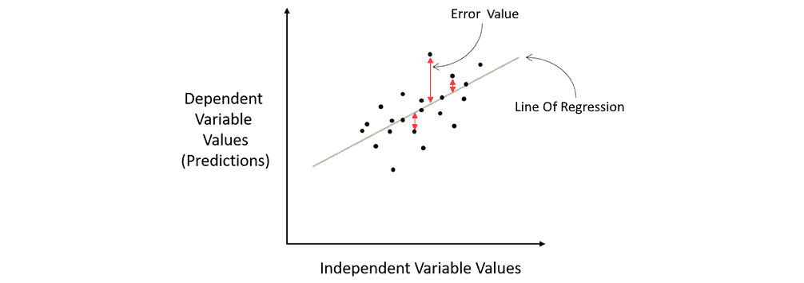

图 6.1 - 回归场景中的 MSE

这是一个通用的回归场景，其中回归线穿过图表上绘制的数据点。训练好的模型根据这条回归线进行预测。误差值显示了实际值与预测值之间的差异，这些差异位于回归线上，如红色线条所示。这些误差也称为残差。在计算 MSE 时，我们平方这些误差以消除任何负号，因为我们只关心误差的大小，而不是其方向。平方也赋予了较大的误差值更多的权重。一旦计算了所有数据点的平方误差，我们就计算平均值，这给出了最终的 MSE 值。

MSE 是一个指标，它告诉你回归线有多接近数据点。相应地，回归线与数据点之间的误差值越少，你的 MSE 值就越低。因此，在比较不同模型的 MSE 时，具有较低 MSE 的模型理想上是更准确的模型。

MSE 的数学公式如下：

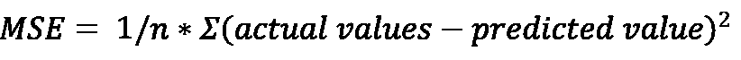

在这里，*n*将是数据集中的数据点数量。

**均方根误差**（**RMSE**），正如其名所示，是均方误差的平方根。因此，其数学公式如下：

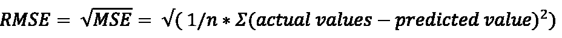

MSE 和 RMSE 之间的区别是直接的。虽然 MSE 是在响应列的平方单位中测量的，但 RMSE 是在与响应列相同的单位中测量的。

例如，如果你有一个线性回归问题，它以美元为单位预测其股票的价格，MSE 以平方美元为单位衡量误差，而 RMSE 将误差值仅以美元为单位衡量。因此，RMSE 通常比 MSE 更容易解释模型质量。

恭喜——你现在已经了解了 MSE 和 RMSE 指标是什么以及它们如何用于衡量回归模型的性能。

让我们继续到下一个重要的性能指标，即混淆矩阵。

## 与混淆矩阵一起工作

分类问题是一个机器学习问题，其中机器学习模型试图将数据输入分类到预指定的类别中。与回归模型相比，分类模型性能测量的不同之处在于，在分类问题中，预测值与实际值之间没有数值误差。预测值要么被正确分类到正确的类别，要么被错误分类。为了衡量分类问题的模型性能，数据科学家依赖于从称为**混淆矩阵**的特殊类型矩阵中派生出的某些性能指标。

混淆矩阵是一个表格矩阵，总结了分类问题的预测结果正确性。该矩阵并列展示了正确和错误的预测值，并按每个类别进行细分。这个矩阵被称为混淆矩阵，因为它显示了模型在分类值时的困惑程度。

以我们使用的冠心病预测数据集为例。这是一个二元分类问题，我们想要预测具有某些健康条件的人是否可能患有冠心病。在这种情况下，预测结果是**是**，也称为**正分类**，意味着该人可能患有冠心病，或者**否**，也称为**负分类**，意味着该人不太可能患有冠心病。

该场景的混淆矩阵如下所示：

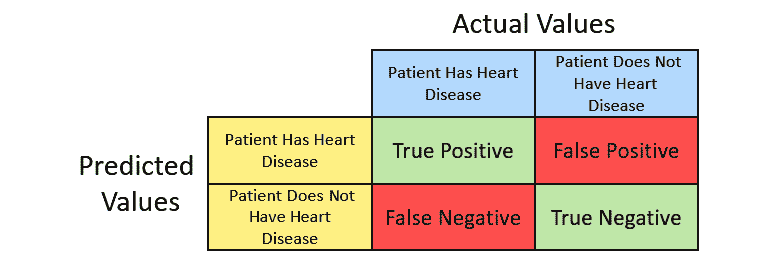

图 6.2 – 二项式混淆矩阵

混淆矩阵的行对应于模型预测的分类。混淆矩阵的列对应于模型的实际类值。

在矩阵的左上角，我们有**真正例** – 这些是正确预测为“是”的实际“是”的数量。在右上角，我们有**假正例** – 这些是错误预测为“否”的实际“是”的数量。在左下角，我们有**假负例** – 这些是错误预测为“是”的实际“否”的数量。最后，我们还有**真负例** – 这些是正确预测为“否”的实际“否”的数量。

对于具有六个可能类别的多项式分类，混淆矩阵将如下所示：

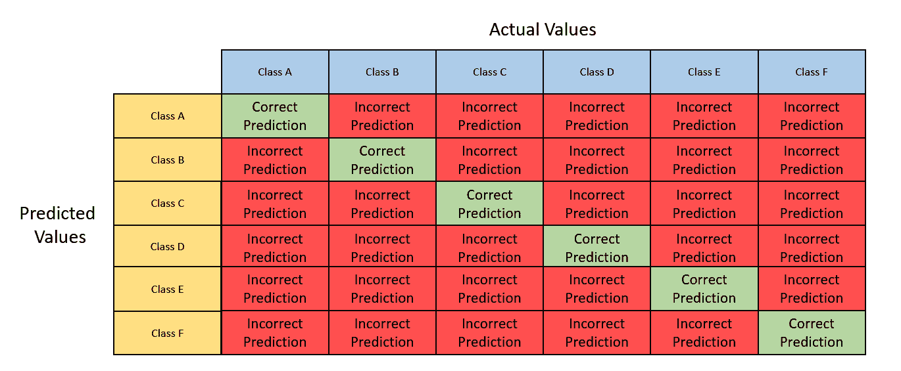

图 6.3 – 多项式混淆矩阵

使用两个分类模型的混淆矩阵，您可以比较个别算法预测的真正例和真负例的数量，并选择正确预测数量更多的模型作为更好的模型。

尽管使用混淆矩阵很容易解释模型的预测质量，但仅基于真正阳性和真正阴性的数量比较两个或多个模型仍然很困难。

考虑一个场景，你想要对一些医疗记录进行分类，以确定患者是否有脑瘤。假设一个特定模型的混淆矩阵相对于其他模型具有高数量的真正阳性和真正阴性，同时也有高数量的假阳性。在这种情况下，该模型将错误地将许多正常医疗记录标记为潜在脑瘤的迹象。这可能导致医院做出错误的决定，进行不必要的风险手术。在这种情况下，具有较低准确率但假阳性数量最少的模型更可取。

因此，在混淆矩阵的基础上开发了更复杂的指标。它们如下：

+   **准确度**：准确度是一个衡量与总预测数相比正确预测的阳性和阴性预测数的指标。计算方法如下：

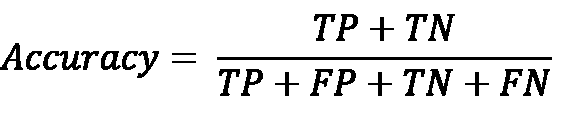

在这里，缩写代表以下内容：

+   **TP** 代表真正阳性。

+   **TN** 代表真正阴性。

+   **FP** 代表假阳性。

+   **FN** 代表假阴性。

当你想比较分类模型正确预测的能力，无论预测值是阳性还是阴性时，这个指标很有用。

+   **精确度**：精确度是一个衡量与总预测数相比正确阳性预测数的指标。计算方法如下：

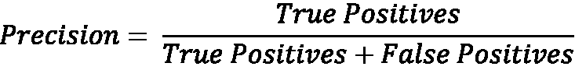

当测量在具有大量阴性结果和少量阳性结果的训练数据上训练的分类模型的性能时，这个指标特别有用。精确度不受正负分类值不平衡的影响，因为它只考虑阳性值。

+   **敏感性或召回率**：敏感性，也称为召回率，是衡量模型预测真正阳性的概率测量值。敏感性是通过识别在二项式分类中预测中被正确识别为阳性的预测百分比来衡量的。计算方法如下：

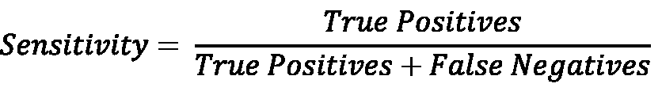

如果你的分类机器学习问题旨在准确识别所有正预测，那么模型的敏感性应该很高。

+   **特异性**：虽然敏感性是衡量模型预测真正阳性的概率测量值，但特异性是通过识别在二项式分类中被正确识别为阴性的预测百分比来衡量的。计算方法如下：

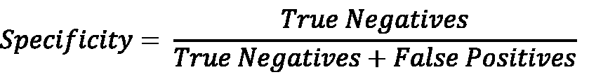

如果你的分类机器学习问题旨在准确识别所有负预测，那么模型的特异性应该很高。

敏感度和特异性之间始终存在权衡。一个具有高敏感度的模型通常具有非常低的特异性，反之亦然。因此，机器学习问题的上下文在决定你是否想要一个具有高敏感度或高特异性的模型来解决问题中起着非常重要的作用。

对于多项式分类，你需要为每个类别类型计算敏感度和特异性。对于敏感度，你的真正例将保持不变，但假阴性将根据对该类别的错误预测数量而变化。同样，对于特异性，真正例将保持不变——然而，假阳性将根据对该类别的错误预测数量而变化。

现在你已经了解了如何使用混淆矩阵来衡量分类模型，以及敏感度和特异性是如何建立在它之上的，那么我们现在继续到下一个指标，即受试者工作特征曲线及其曲线下面积。

## 计算受试者工作特征及其曲线下面积（ROC-AUC）

比较分类模型的另一种好方法是通过对它们性能的视觉表示。最广泛使用的视觉评估指标之一是**受试者工作特征**及其**曲线下面积**（**ROC-AUC**）。

ROC-AUC 指标分为两个概念：

+   **ROC 曲线**：这是在图表上绘制的图形曲线，总结了模型在各个阈值下的分类能力。阈值是一个分类值，用于将数据点分为不同的类别。

+   **AUC**：这是 ROC 曲线下的面积，帮助我们比较哪个分类算法表现更好，取决于哪个 ROC 曲线覆盖的面积最大。

让我们通过一个例子来更好地理解 ROC-AUC 如何帮助我们比较分类模型。参考以下样本数据集：

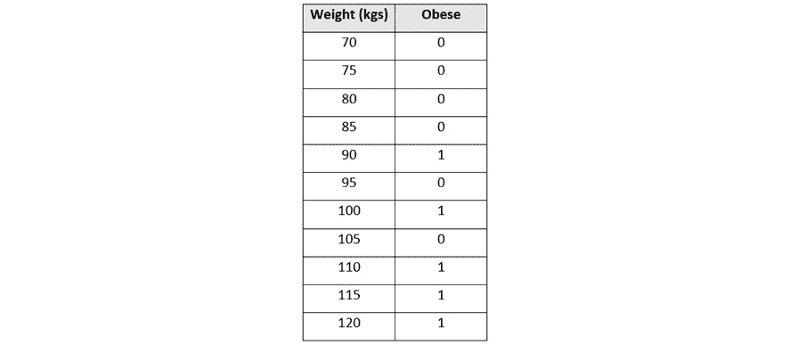

图 6.4 – 肥胖数据集

该数据集有两个列：

+   **体重（千克）**：这是一个数值列，包含一个人的体重（千克）

+   **肥胖**：这是一个分类列，包含**1**或**0**，其中**1**表示该人肥胖，**0**表示该人非肥胖

让我们将这个数据集绘制到图表上，其中**体重**作为自变量位于*x*轴上，**肥胖**作为因变量位于*y*轴上。这个简单的数据集在图表上看起来如下：

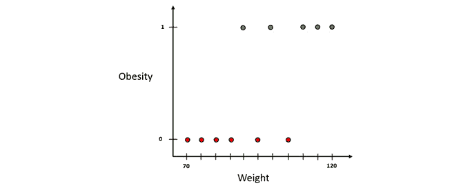

图 6.5 – 绘制的肥胖数据集

让我们使用一种称为**逻辑回归**的简单分类算法之一，通过这些数据拟合一个分类线。逻辑回归是一种预测给定数据样本属于某个特定类的概率的算法。在我们的例子中，该算法将根据体重预测一个人是否肥胖的概率。

逻辑回归线将如下所示：

图 6.6 – 使用分类线绘制的肥胖数据集

注意，由于逻辑回归预测数据可能属于某个特定类的概率，我们已经将*y*轴转换为一个人肥胖的概率。

在预测期间，我们首先将人的样本体重数据绘制在*x*轴上。然后，我们将在分类线上找到其相应的*y*值。这个值是相应的人肥胖的概率。

现在，为了判断一个人是否肥胖，我们需要决定将肥胖和非肥胖区分开来的概率**截止线**是什么。这条截止线被称为**阈值**。任何高于阈值的概率值都可以被归类为肥胖，而任何低于阈值的值都可以被归类为非肥胖。阈值可以是 0 到 1 之间的任何值：

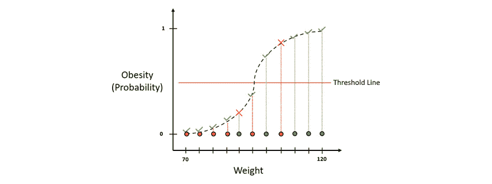

图 6.7 – 使用阈值线对肥胖数据集进行分类

如您从图中可以看出，多个值被错误地分类。这在任何分类问题中都是不可避免的。因此，为了跟踪正确和错误的分类，我们将创建一个混淆矩阵，并计算灵敏度和特异性来评估模型在所选阈值下的表现。

但如前所述，分类可以有多个阈值。具有高值的阈值将最小化假阳性的数量，但代价是分类将变得更加严格，导致更多的假阴性。同样，如果阈值值太低，那么我们最终会得到更多的假阳性。

哪个阈值表现最好取决于你的机器学习问题。然而，需要比较不同阈值的研究来找到一个合适的值。由于你可以创建任意数量的阈值，你最终会创建大量的混淆矩阵。这就是 ROC-AUC 指标发挥作用的地方。

ROC-AUC 指标总结了模型在不同阈值下的性能，并在图上绘制它们。在这个图中，*x*轴是**假阳性率**，即**1 - 特异性**，而*y*轴是**真阳性率**，也就是**灵敏度**。

让我们绘制我们的样本数据集的 ROC 图。我们将从使用一个将所有样本归类为肥胖的阈值开始。图上的阈值将如下所示：

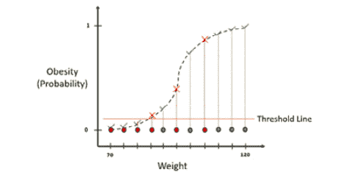

图 6.8 – 使用非常低的阈值绘制的肥胖分类

现在，我们需要计算绘制 ROC 曲线所需的敏感性（和 1 - 特异性）值，因此相应地，我们首先需要创建一个混淆矩阵。这个阈值的混淆矩阵看起来如下：

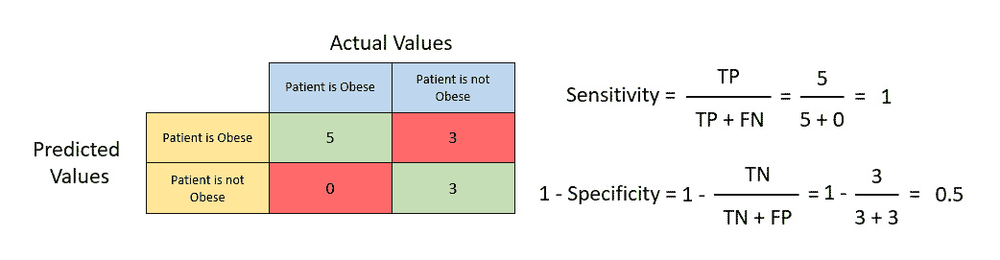

图 6.9 – 包含敏感性和 1 - 特异性的混淆矩阵

使用之前提到的公式计算敏感性和 1 - 特异性值，我们得到一个等于**1**的敏感性和一个等于**0.5**的 1 - 特异性。让我们在 ROC 图上绘制这个值。ROC 图将看起来如下：

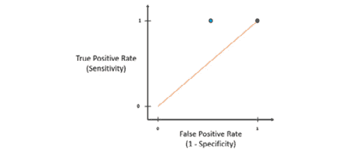

图 6.10 – ROC 图

图表中的蓝色线表示敏感性等于 1 - 特异性——换句话说，真正阳性率等于假阳性率。任何位于这条线上的 ROC 点都表明，使用此阈值训练的模型预测正确阳性的可能性与预测错误阳性的可能性相同。因此，为了找到最佳阈值，我们旨在找到一个具有尽可能高的敏感性和尽可能低的 1 - 特异性的 ROC 点。这将表明模型有很高的可能性预测正确的阳性预测，并且预测错误阳性的可能性要小得多。

现在，让我们提高阈值并重复相同的过程来计算这个新阈值的 ROC 值。让我们假设这个新阈值的敏感性为 1，1 - 特异性为 0.25。在 ROC 图上绘制这个值，我们得到以下结果：

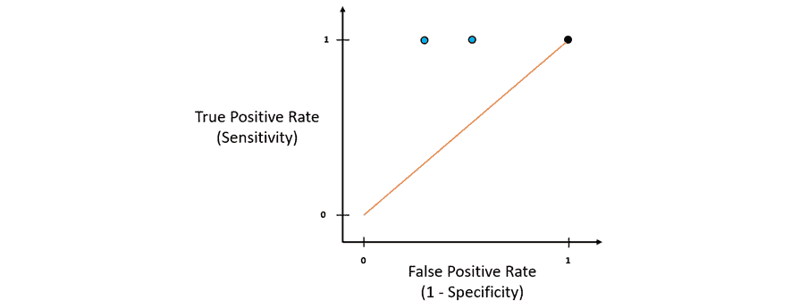

图 6.11 – 使用新阈值的 ROC 图

新阈值的 ROC 值位于蓝色线的左侧，也位于之前的 ROC 点。这表明它比之前的阈值具有更低的假阳性率。因此，新的阈值比之前的阈值更好。

将阈值值调得过高会导致模型预测所有值都不是肥胖的。基本上，它将错误地将所有值预测为假，增加了假阴性的数量。根据敏感性方程，假阴性的数量越多，敏感性越低。因此，这最终会降低您的敏感性，减少模型预测真正阳性的能力。

我们会为不同的阈值值重复进行相同的过程，并在 ROC 图上绘制它们的 ROC 值。如果我们连接所有这些点，我们得到 ROC 曲线：

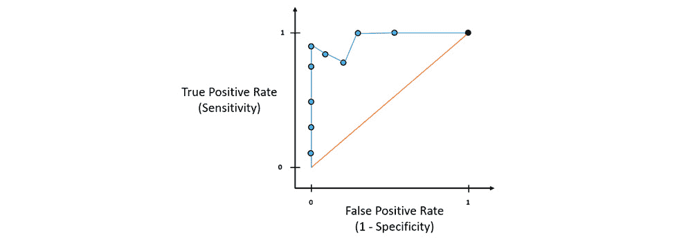

图 6.12 – 包含 ROC 曲线的 ROC 图

只需通过观察 ROC 图，就可以确定哪些阈值值比其他阈值值更好，并且根据你的机器学习问题可以容忍多少假阳性预测，你可以选择具有正确假阳性率的 ROC 点作为你的最终阈值值参考。这解释了 ROC 曲线的作用。

现在，假设你有一个使用不同阈值训练的另一个算法，你将它的 ROC 点绘制到这个相同的图上。假设绘制结果如下：

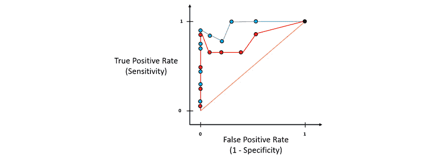

图 6.13 – 带有多个 ROC 曲线的 ROC 图

你会如何比较哪个算法表现更好？哪个阈值是该算法模型的最佳选择？

这就是 AUC 帮助我们的地方。AUC 不过是 ROC 曲线下的面积。整个 ROC 图将有一个总面积为*1*。红色线将面积分成两半，因此理想情况下，所有潜在的好算法都应该有大于 0.5 的 AUC。AUC 值越大，算法越好：

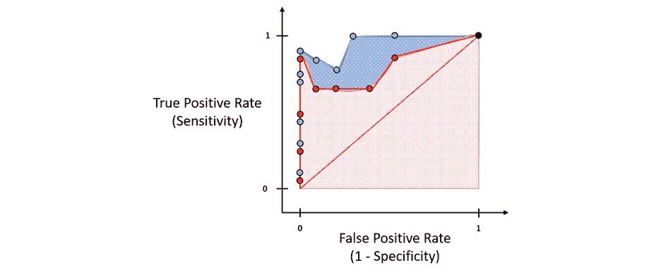

图 6.14 – ROC 曲线的 AUC

只需通过可视化，你就可以看到哪个算法的 AUC 值更高。同样，AUC 值帮助工程师和科学家确定选择哪个算法以及使用哪个阈值作为最佳机器学习模型进行分类。

恭喜你，你现在已经理解了 ROC-AUC 指标的工作原理以及它是如何帮助你比较模型性能的。现在，让我们继续介绍另一个类似性能指标，称为**精确率-召回率曲线**（**PR 曲线**）。

## 计算精确率-召回率曲线及其曲线下面积（AUC-PR）

使用 ROC-AUC，尽管这是一个非常好的比较模型的指标，但完全依赖它也存在一些小缺点。在一个非常不平衡的数据集中，其中存在大量真实负值，ROC 图的*x*轴将会非常小，因为特异性以真实负值为分母。这迫使 ROC 曲线向图的左侧移动，使得 ROC-AUC 值接近 1，这在技术上是不正确的。

这就是 PR 曲线发挥作用的地方。PR 曲线与 ROC 曲线类似，唯一的区别是 PR 曲线是一个函数，它在*y*轴上使用精确率，在*x*轴上使用召回率。精确率和召回率的计算都不使用真实负值。因此，当数据集的类别不平衡影响预测中的真实负值，或者当你的机器学习问题根本不关心真实负值时，PR 曲线及其 AUC 指标是合适的。

让我们通过一个例子进一步了解 PR 曲线。我们将使用与理解 ROC-AUC 曲线相同的样本肥胖数据集。将数据集的记录绘制到图上并创建其混淆矩阵的过程与 ROC-AUC 曲线相同。

现在，我们不再从混淆矩阵中计算敏感度和 1 – 特异性，而是这次我们将计算精确率和召回率值：

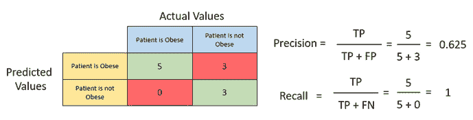

图 6.15 – 计算精确率和召回率值

如前图所示，我们得到了精确率为**0.625**和召回率为**1**。让我们将这些值绘制到下面的 PR 图中，如图所示：

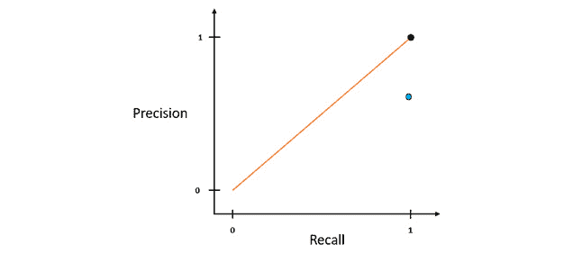

图 6.16 – PR 图

同样，通过移动阈值线并创建新的混淆矩阵，精确度和召回率值将根据混淆矩阵中预测的分布而变化。我们重复这个过程，为不同的阈值值计算精确度和召回率值，然后将它们绘制到 PR 图上：

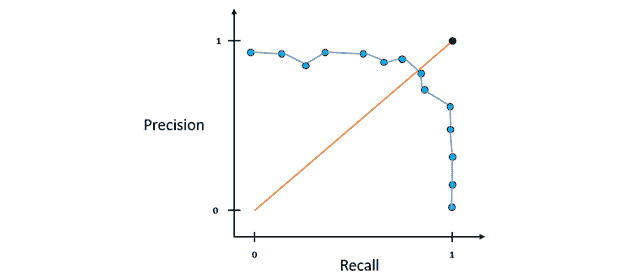

图 6.17 – PR 图及其 PR 曲线

连接所有点的蓝色线是 PR 曲线。代表阈值值最接近黑色点的点，即最接近具有 1 的精确度和 1 的召回率的理想分类器。

当比较不同的算法模型时，你将在 PR 图中看到多个 PR 曲线：

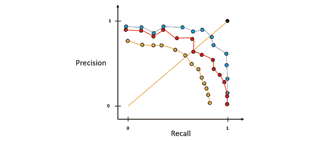

图 6.18 – 包含多个 PR 曲线的 PR 图

上述图表显示了可以在同一图表上绘制的多个 PR 曲线，以提供不同算法性能的更好比较视图。只需一眼，你就可以看到代表蓝色线的算法的阈值值最接近黑色点，理想情况下应该是性能最好的模型。

就像 ROC-AUC 一样，你也可以使用 AUC-PR 来计算 PR 曲线下的面积，以更好地理解不同算法的性能。基于此，你知道代表红色 PR 曲线的算法比代表黄色曲线的算法好，代表蓝色 PR 曲线的算法比红色和黄色曲线的算法都要好。

恭喜！你现在已经理解了 H2O AutoML 排行榜中的 AUC-PR 指标，以及它如何成为另一个良好的模型性能指标，在比较由 H2O AutoML 训练的模型时可以参考。

现在我们继续讨论下一个性能指标，它被称为对数损失。

## 对数损失的工作原理

**对数损失**是分类模型的重要模型性能指标之一。它主要用于衡量二元分类模型的性能。

对数损失是衡量分类模型性能的一种方式，该模型以概率值的形式输出分类结果。概率值可以从*0*开始，表示数据属于某个特定正类的概率为零，到*1*结束，表示数据属于某个特定正类的概率为 100%。对数损失值可以从 0 延伸到无穷大，所有机器学习模型的目的是尽可能最小化对数损失。任何对数损失值尽可能接近 0 的模型都被认为是性能更好的模型。

对数损失的计算完全是统计性的。然而，理解数学背后的直觉对于更好地理解其在比较模型性能时的应用非常重要。

对数损失是一个衡量预测概率与实际值之间差异的指标。因此，如果预测概率与实际值差异很小，那么你的对数损失值将会很宽容；然而，如果差异更大，对数损失值将会更加惩罚性。

让我们先了解预测概率是什么。我们将使用与 ROC-AUC 曲线相同的肥胖数据集。假设我们运行了一个分类算法，计算了预测该人肥胖的概率，并将这些值添加到数据集的列中，如下截图所示：

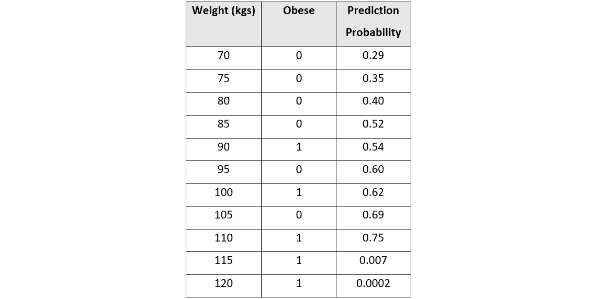

图 6.19 – 添加了预测概率的肥胖数据集

我们将有一个特定的阈值值，用于决定预测概率值必须是多少，我们才能将数据分类为肥胖或非肥胖。让我们假设阈值为 0.5 - 在这种情况下，预测概率值高于 0.5 被分类为肥胖，任何低于它的都被分类为非肥胖。

我们现在计算每个数据点的对数损失值。计算每个记录对数损失的公式如下：

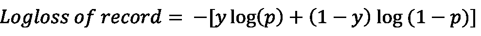

这里，方程可以分解如下：

+   **y** 是实际分类值，即 *0* 或 *1*。

+   **p** 是预测概率。

+   **log** 是数字的自然对数。

在我们的例子中，因为我们使用肥胖类别作为参考，所以我们将 *y* 设置为 *1*。使用这个公式，我们计算单个数据值的对数损失值如下：

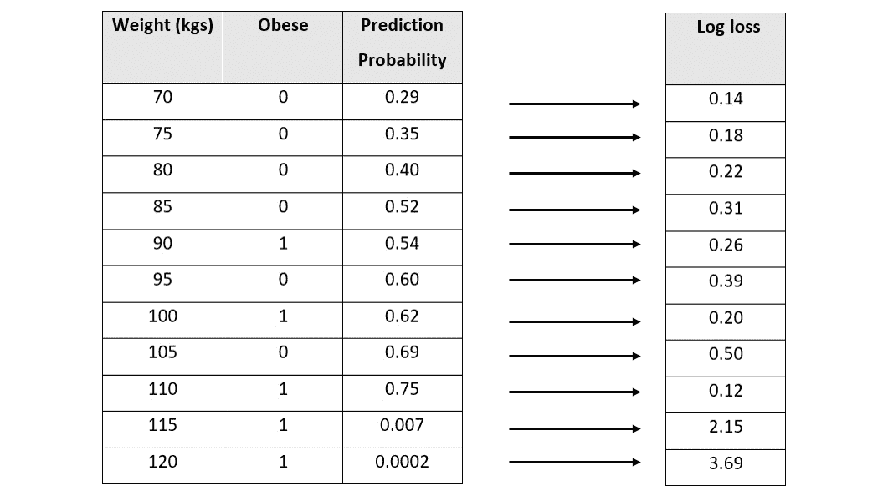

图 6.20 – 每条记录的对数损失值的肥胖数据集

现在，让我们将这些值绘制到对数损失图中，我们将对数损失值放在 *y* 轴上，预测概率放在 *x* 轴上：

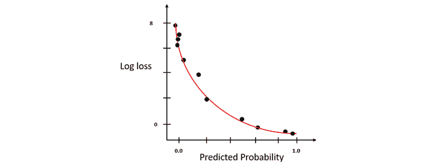

图 6.21 – 对数损失图，其中 y = 1

你会注意到，随着预测概率偏离实际值，对数损失值呈指数增长。差异越小，对数损失的增幅就越小。这就是为什么对数损失是一个好的比较指标，因为它不仅比较哪个模型是好是坏，还比较它有多好或多坏。

同样，如果你想使用非肥胖类别作为对数损失的参考，那么你需要反转预测概率，计算对数损失值，并绘制图表，或者你也可以将 *y* 设置为 0 并使用计算出的对数损失值绘制对数损失图。这个图将是之前图的镜像（*见图 6.21*）：

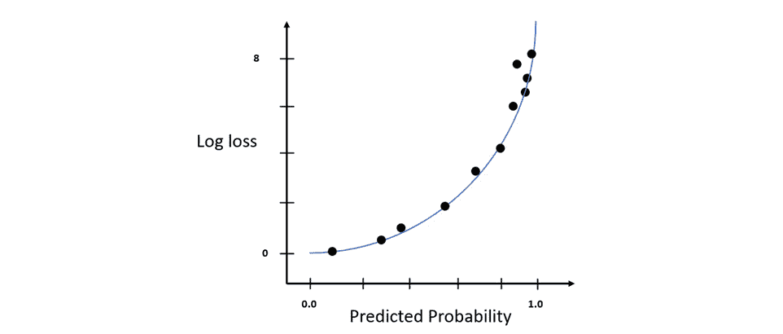

图 6.22 – 对数损失图，其中 y = 0

模型的 log 损失值，也称为模型的 **技能**，是数据集中所有记录的 log 损失值的平均值。因此，模型 log 损失的方程如下：

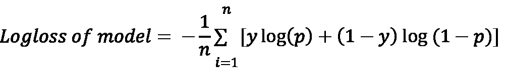

在这里，方程可以分解如下：

+   **n** 是数据集中的总记录数。

+   **y** 是实际的分类值，即 *0* 或 *1*。

+   **p** 是预测概率。

+   **log** 是数字的自然对数。

在一个理想的世界里，具有完美评分能力和技能的模型被认为具有等于 *0* 的 log 损失。为了正确应用 log 损失来比较模型，两个模型都必须使用相同的训练数据集进行训练。

恭喜！我们刚刚介绍了如何从统计角度计算 log 损失。在下一节中，我们将探讨一些其他重要的指标，这些指标虽然不是 H2O AutoML 排行榜的一部分，但在理解模型性能方面仍然很重要。

# 探索其他模型性能指标

H2O AutoML 排行榜基于某些常用的重要指标总结了模型性能。然而，在机器学习领域，仍然有许多性能指标描述了机器学习模型的不同技能。这些技能往往是你给定机器学习问题中什么工作得最好的决定因素，因此，了解我们如何使用这些不同的指标是很重要的。H2O 还通过在训练完成后计算这些指标并将它们存储为模型的元数据来为我们提供这些指标值。你可以通过使用内置函数轻松访问它们。

在接下来的小节中，我们将探讨一些其他重要的模型性能指标，从 F1 开始。

## 理解 F1 分数性能指标

精确率和召回率，尽管是衡量分类模型性能的非常好的指标，但存在权衡。精确率和召回率不能同时具有高值。如果你通过调整分类阈值来提高精确率，那么它会影响你的召回率，因为假阴性的数量可能会增加，从而降低你的召回率值，反之亦然。

精确度指标旨在最小化错误预测，而召回率指标旨在找到最多的积极预测。因此，技术上，我们需要在这两个指标之间找到正确的平衡。

这就是 **F1 分数** 性能指标出现的地方。F1 分数是一个试图同时最大化精确率和召回率的指标，并为模型性能给出一个总体分数。

F1 分数是精确度和召回率的调和平均值。**调和平均值**是计算值平均值的多种变体之一。使用调和平均值，我们计算所有观察值的倒数算术平均数的倒数。我们使用调和平均值来计算 F1 分数的原因是，使用一般的算术平均值会导致方程对所有程度的错误给予同等的重要性。另一方面，调和平均值通过相应地降低 F1 分数来惩罚高误差值。这就是为什么使用调和平均值生成 F1 分数的原因，因为计算出的分数值能更好地表示模型的性能。

F1 分数的范围是 0 到 1，其中 1 表示模型具有完美的精确度和召回率值，而 0 表示精确度或召回率值之一为 0。

计算 F1 分数的公式如下：

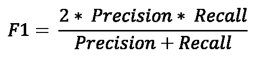

让我们以一个混淆矩阵为例：

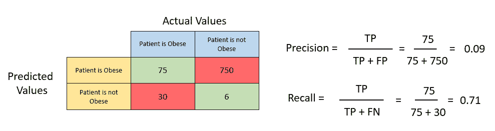

图 6.23 – 带有精确度和召回率的示例混淆矩阵

让我们计算矩阵的精确度值：

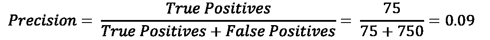

同样，现在让我们计算矩阵的召回率值：

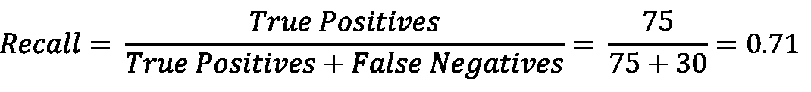

现在，将精确度和召回率的值代入 F1 分数公式中，我们得到以下结果：

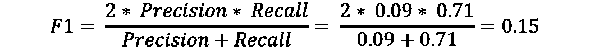

我们得到了一个 F1 分数为*0.15*。你现在可以通过类似地计算另一个模型的 F1 分数并将其与这个分数进行比较来比较另一个模型的性能。如果新模型的 F1 分数大于*0.15*，那么该模型比这个模型表现更好。

F1 分数的好处是，在比较分类模型时，你不需要平衡多个模型的精确度和召回率值，并基于两个对比指标的比较做出决定。F1 分数总结了精确度和召回率的最佳值，这使得更容易确定哪个模型更好。

尽管是一个好的指标，但 F1 分数仍然存在某些缺点。首先，F1 分数在计算分数时没有考虑真正的负例。其次，F1 分数不足以捕捉多类分类问题的性能。技术上，你可以使用宏平均来计算多类分类问题的 F1 分数——然而，有更好的指标可以使用。

让我们看看一种克服 F1 分数缺点的指标，即绝对马修斯相关系数。

## 计算绝对马修斯相关系数

考虑一个例子，我们试图根据给定水果的大小预测它是否是葡萄还是西瓜。我们有 200 个样本，其中 180 个是葡萄，20 个是西瓜。很简单，是的——越大，越可能是西瓜，而较小的尺寸则表明它是葡萄。假设我们训练了一个以葡萄为正类的分类器。这个分类器能够如下分类水果：

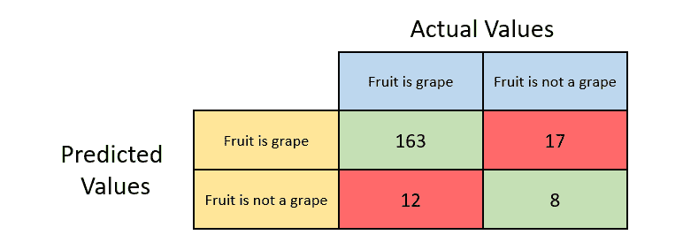

图 6.24 – 以葡萄为正类的果实分类混淆矩阵

让我们快速计算之前提到的标量分类度量。

分类器的准确度如下：

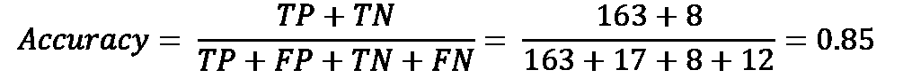

分类器的精确度如下：

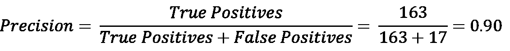

分类器的召回率如下：

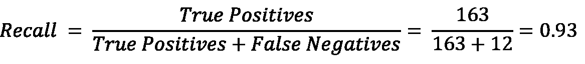

分类器的 F1 分数如下：

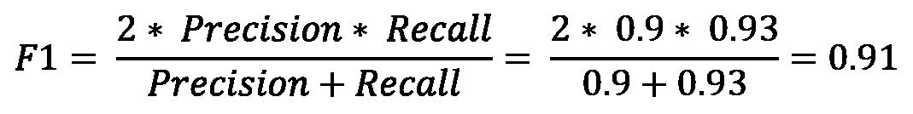

根据这些度量值，我们的分类器在预测葡萄时似乎表现非常好。那么，如果我们想预测西瓜呢？让我们将正类从葡萄改为西瓜。这种情况下的混淆矩阵如下：

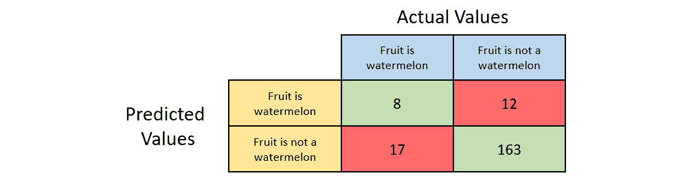

图 6.25 – 以西瓜为正类的果实分类混淆矩阵

我们将快速计算之前提到的标量分类度量。

分类器的准确度如下：

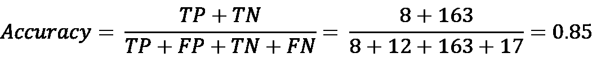

分类器的精确度如下：

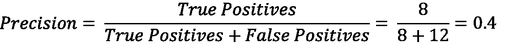

分类器的召回率如下：

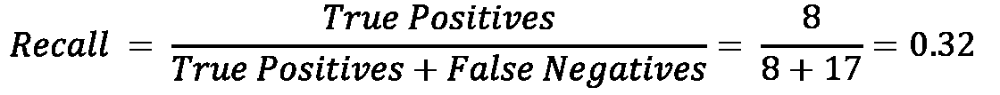

分类器的 F1 分数如下：

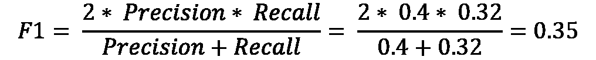

如我们从度量值中看到的那样，准确度保持不变，但精确度、召回率和 F1 分数急剧下降。尽管准确度、精确度、召回率和 F1 分数是衡量分类性能非常好的指标，但在数据集中存在类别不平衡时，它们也有一些缺点。在我们的葡萄和西瓜数据集中，我们只有 20 个西瓜样本，但葡萄有 180 个样本。这种数据不平衡会导致度量计算中的不对称，这可能具有误导性。

理想情况下，作为数据科学家和工程师，我们通常建议尽可能保持数据对称，以使这些指标的测量尽可能相关。然而，在包含数百万条记录的现实世界数据集中，保持这种对称性将非常困难。因此，拥有某种将正负类别视为相等并给出分类模型整体性能总体图的指标将是有益的。

这就是**绝对 Matthews 相关系数**（**MCC**），也称为**phi 系数**，发挥作用的地方。MCC 的方程如下：

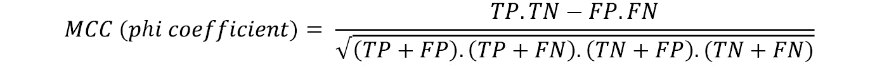

在计算过程中，它将实际类别和预测类别视为两个不同的变量，并确定它们之间的相关系数。相关系数不过是一个数值，它代表了变量之间的某种统计关系。这个相关系数值越高，你的分类模型就越好。

MCC 值范围从-1 到 1。1 表示分类器是完美的，并且总是正确分类记录。MCC 为 0 表示类别与模型预测之间没有相关性，模型预测完全随机。-1 表示分类器总是错误地分类记录。

MCC 值为-1 并不意味着模型在任何一个方面都是不好的。它仅表示预测类别和实际类别之间的相关系数是负的。因此，如果你只是反转分类器的预测，你将总是得到正确的分类预测。此外，MCC 是完全对称的——因此，它平等地对待所有类别，以提供一个考虑模型整体性能的指标。切换正负类别不会影响 MCC 值。因此，如果你只是取 MCC 的绝对值，它仍然不会失去其相关性的价值。H2O 通常使用 MCC 的绝对值来更容易地理解模型的表现。

让我们计算以葡萄为正类的水果分类混淆矩阵的 MCC 值：

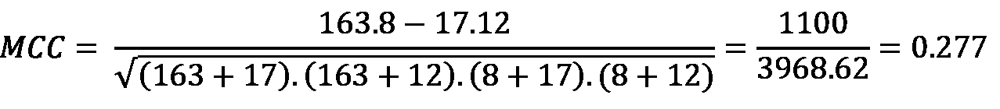

同样，让我们计算以西瓜为正类的水果分类混淆矩阵的 MCC 值：

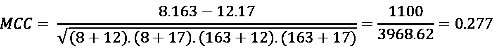

如您所见，即使我们切换正负类别，MCC 值仍然保持不变，为*0.277*。一个 MCC 为*0.277*的值表明预测类别和实际类别之间相关性较弱，考虑到分类器在分类西瓜方面表现不佳，这是正确的。

恭喜你，你现在理解了另一个重要的指标，称为绝对 MCC（Matthews Correlation Coefficient）。

现在让我们转向下一个性能指标，即 R2。

## 测量 R2 性能指标

**R2**，也称为确定系数，是一个回归模型性能指标，旨在通过独立变量变化对因变量影响的大小来解释自变量和因变量之间的关系。

R2 的值介于 0 到 1 之间，其中 0 表示回归线没有正确捕捉到数据中的趋势，而 1 表示回归线完美地捕捉到了数据中的趋势。

让我们通过一个数据集的图形示例更好地理解这个指标。请参考下面的图像，以了解身高与体重回归图：

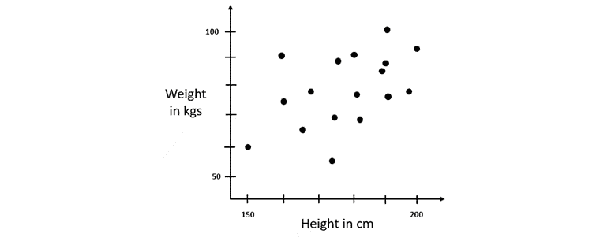

图 6.26 – 身高与体重回归图

数据集有两列：

+   **身高**：这是一个数值列，包含一个人的身高（厘米）。

+   **体重**：这是一个数值列，包含一个人的体重（千克）。

使用这个数据集，我们试图根据一个人的身高来预测他的体重。

因此，首先，让我们使用所有体重的平均值作为一般的回归线来预测体重。从技术上讲，这确实是有意义的，因为大多数成年人都会有平均范围的体重——尽管可能会有一些误差，但这仍然是一种合理的预测一个人体重的办法。

如果我们将这个数据集绘制在图上，用于预测的平均值将看起来如下：

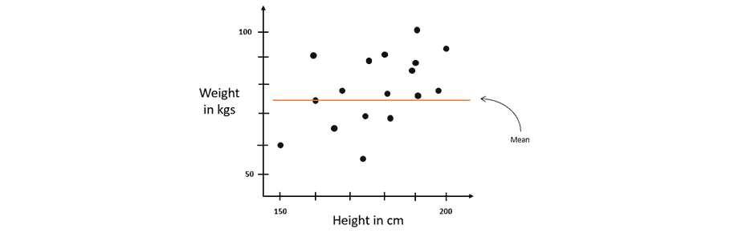

图 6.27 – 带有平均线的身高与体重回归图

如您所见，预测的体重值（即平均值）与实际值之间肯定存在一些误差。如前所述，这种误差称为残差。计算残差的平方给我们平方误差。所有记录的这些平方误差之和给我们提供了围绕平均线的变异。

现在我们来进行线性回归，并拟合一条通过数据的线，以便我们得到另一条回归线。这条回归线理想上应该比仅使用平均值作为预测指标有更好的预测能力。图上的回归线应该看起来如下：

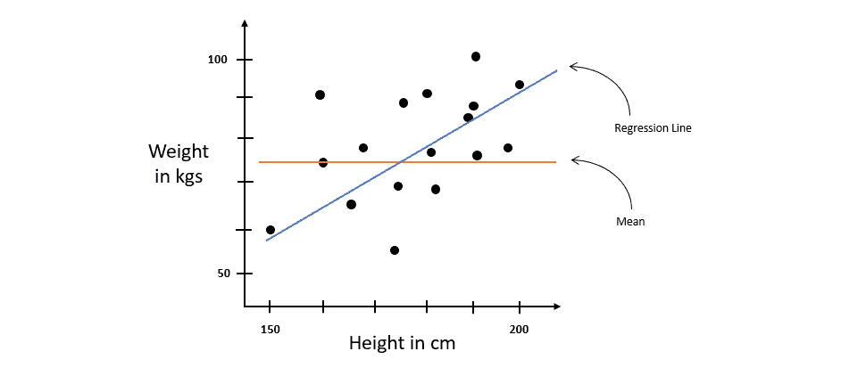

图 6.28 – 带有回归线的身高与体重回归数据集

让我们计算这条线的残差平方误差——这给我们提供了围绕回归线的变异。

现在，我们需要找出一种方法来识别哪条线更好，是回归线还是平均线，以及好多少。这正是 R2 可以用来比较两条回归线的地方。计算 R2 的公式如下：

假设回归线周围的残差平方和为 *7*，平均线周围的残差平方和为 *56*。将这些值代入 R2 公式，我们得到以下值：

值 *0.875* 是一个百分比。这个值解释了 87.5% 的 *y* 值的总变化是由 *x* 值的变化所描述的。剩余的 12.5% 可能是由于数据集中的一些其他因素，如肌肉量、脂肪含量或其他任何因素。

从机器学习（ML）的角度来看，R2 值越高，表示两个变量之间的关系解释了数据中的变化，因此线性模型已经准确地捕捉了数据集的模式。R2 值越低，表示线性模型并没有完全捕捉到数据集的模式，并且一定存在其他一些因素对数据集的模式有贡献。

这总结了 R2 指标可以用来衡量线性模型正确捕捉数据趋势的程度。

# 摘要

在本章中，我们专注于了解如何衡量我们机器学习模型的性能，以及如何根据哪个模型表现更好来选择一个模型而不是另一个。我们首先从探索 H2O AutoML 排行榜指标开始，因为它们是 AutoML 提供的最容易获得的指标。我们首先介绍了 MSE 和 RMSE 是什么，它们之间的区别是什么，以及它们是如何计算的。然后我们介绍了什么是混淆矩阵，以及如何从混淆矩阵中的值计算准确率、灵敏度、特异性、精确率和召回率。通过我们对灵敏度和特异性的新理解，我们了解了 ROC 曲线和它的 AUC 是什么，以及它们如何被用来直观地衡量不同算法的性能，以及在不同阈值上训练的相同算法的不同模型性能。基于 ROC-AUC 指标，我们探讨了 PR 曲线、它的 AUC 以及它如何克服 ROC-AUC 指标面临的缺点。最后，在排行榜中，我们了解了什么是对数损失，以及我们如何用它来衡量二元分类模型的性能。

然后，我们探索了排行榜之外的一些重要指标，首先是 F1 分数。我们了解了 F1 分数如何将召回率和精确率结合成一个单一指标。然后我们了解了 MCC 以及它如何克服在衡量不平衡数据集时精确率、召回率和 F1 分数的缺点。最后，我们探讨了 R2 指标，它解释了因变量和自变量之间的关系，即自变量变化多少会影响因变量。

带着这些信息，我们现在能够正确地测量和比较模型，以找到解决我们机器学习问题性能最佳的模型。在下一章中，我们将探讨 H2O 提供的各种模型可解释性功能，这些功能提供了关于模型及其特征的详细高级信息。
