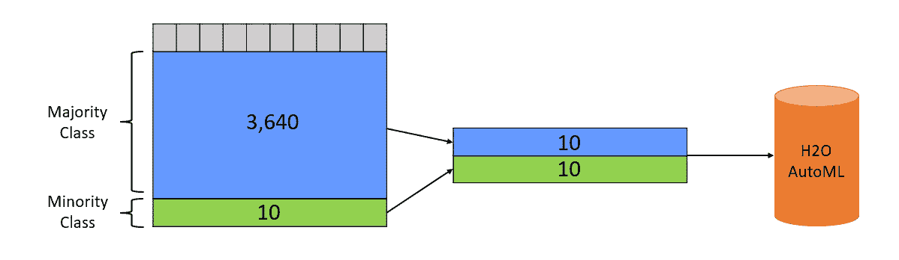
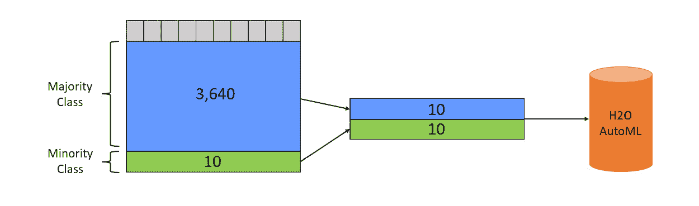
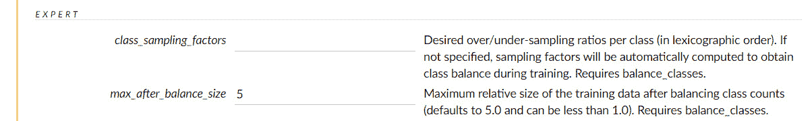
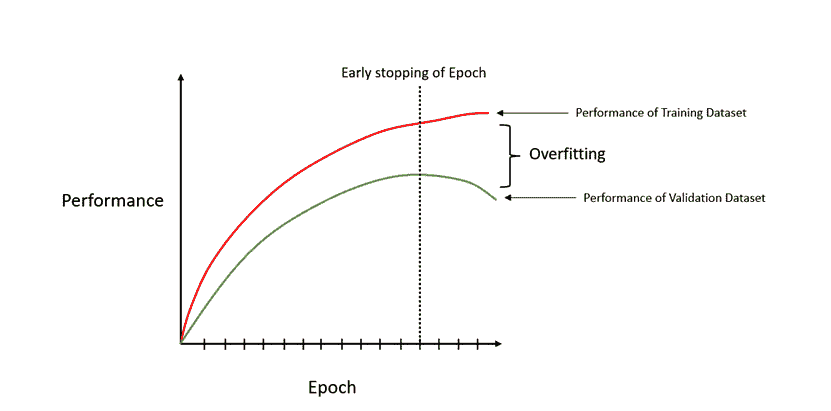
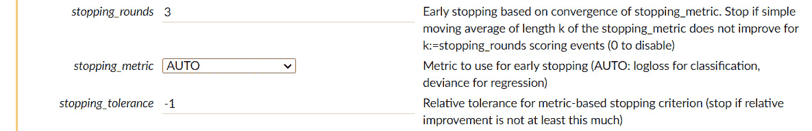
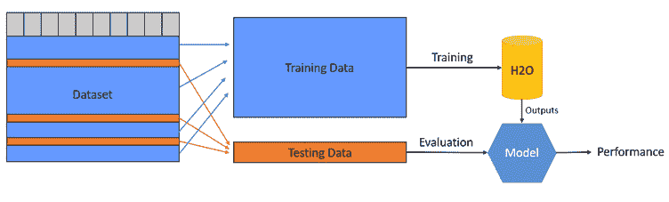
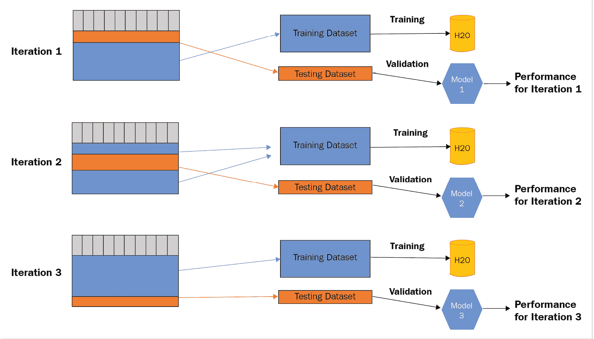
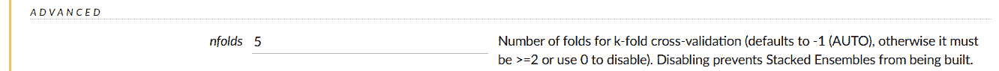
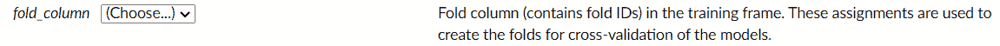
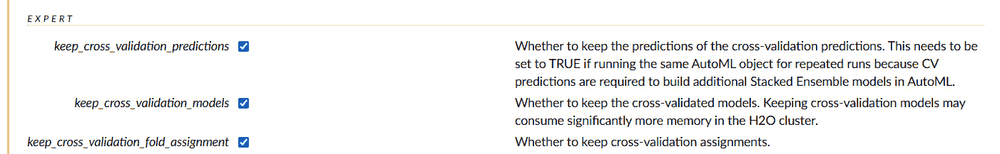

# 第八章：探索 H2O AutoML 的可选参数

正如我们在*第二章*中探讨的，*使用 H2O Flow（H2O 的 Web UI）*，当使用 H2O AutoML 训练模型时，我们有大量的参数可供选择。所有这些参数都赋予我们控制 H2O AutoML 如何训练我们的模型的能力。这种控制帮助我们根据我们的需求获得 AutoML 的最佳使用效果。我们探讨的大多数参数都很容易理解。然而，有些参数的目的和效果在本书一开始时理解起来稍微复杂一些。

在本章中，我们将通过了解其背后的**机器学习**（**ML**）概念来探索这些参数，然后了解我们如何在 AutoML 环境中使用它们。

到本章结束时，您不仅将了解一些高级 ML 概念，而且还将能够使用 H2O AutoML 中提供的参数规定来实现它们。

本章将涵盖以下主题：

+   尝试支持不平衡类别的参数

+   尝试支持提前停止的参数

+   尝试支持交叉验证的参数

我们将首先了解不平衡类别的概念。

# 技术要求

完成本章内容您需要以下条件：

+   您首选的网页浏览器的最新版本。

+   安装在您系统上的 H2O 软件。有关如何在您的系统上安装 H2O 的说明，请参阅*第一章*，*理解 H2O AutoML 基础知识*。

小贴士

本章中展示的所有 H2O AutoML 函数参数均使用 H2O Flow 进行展示，以保持内容简洁。等效参数也以 Python 和 R 编程语言的形式提供，供软件工程师将其编码到他们的服务中。您可以在[`docs.h2o.ai/h2o/latest-stable/h2o-docs/parameters.xhtml`](https://docs.h2o.ai/h2o/latest-stable/h2o-docs/parameters.xhtml)找到这些详细信息。

# 尝试支持不平衡类别的参数

在 ML 领域，您经常会遇到的一个常见问题是分类罕见事件。考虑大地震的例子。每年大约发生一次 7 级以上的大地震。如果您有一个包含过去十年每天地球板块活动的数据集，其中响应列包含是否发生地震，那么您将有大约 3,650 行数据；也就是说，十年中的每一天一行，大约有 8-12 行显示大地震。这个事件发生的概率不到 0.3%。99.7%的时间，不会有大地震。这个大型地震事件数量如此之小的数据集被称为**不平衡数据集**。

不平衡数据集的问题在于，即使你编写一个简单的`if-else`函数来标记所有构造事件为非地震，并将其称为模型，它仍然会显示 99.7%的准确率，因为大多数事件都不是地震引起的。然而，实际上，这个所谓的模型非常糟糕，因为它没有正确地告诉你是否是地震。

这种在**目标类**中的不平衡会在训练机器学习模型时造成很多问题。机器学习模型更有可能假设这些事件非常罕见，永远不会发生，并且不会学习这些事件之间的区别。

然而，有方法可以解决这个问题。一种方法是对多数类进行下采样，另一种方法是对少数类进行过采样。我们将在接下来的章节中了解更多关于这些技术的内容。

## 理解对多数类进行下采样的方法

在预测地震发生的情况中，数据集中包含大量已被识别为*非地震*的事件。这个事件被称为多数类。标记活动为*地震*的少数事件被称为少数类。

让我们看看**对多数类进行下采样**如何解决由类别不平衡引起的问题。考虑以下图表：



图 8.1 – 对不平衡数据集进行下采样

假设你拥有 3,640 个表示没有发生地震的构造活动数据样本，以及仅 10 个表示发生地震的样本。在这种情况下，为了解决这种不平衡问题，你必须创建一个包含所有 10 个少数类样本，以及从 3,640 个数据样本中随机选择的 10 个多数类样本的 bootstrapped 数据集。然后，你可以将这个新的数据集输入到 H2O AutoML 中进行训练。在这种情况下，我们在训练模型之前对多数类进行了下采样，并平衡了*地震*和*非地震*数据样本。

这种方法的缺点是我们最终会丢弃大量数据，并且模型无法从减少的数据中学习到很多。

## 理解对少数类进行过采样的方法

解决不平衡数据集问题的第二种方法是**对少数类进行过采样**。一种明显的方法是将少数类数据样本复制并附加到数据集中，使得多数类和少数类之间的数据样本数量相等。参考以下图表以获得更好的理解：



图 8.2 – 对不平衡数据集进行过采样

在前面的图表中，你可以看到我们复制了少数类数据样本并将它们附加到数据集中，结果每个类别都有 3,640 行。

这种方法可以工作；然而，过采样会导致数据集大小的爆炸性增长。你需要确保它不会超过你的计算和内存限制，否则最终会失败。

现在我们已经介绍了使用欠采样和过采样进行类别平衡的基本知识，让我们看看 H2O AutoML 是如何使用其类别平衡参数来处理它的。

## 在 H2O AutoML 中处理类别平衡参数

H2O AutoML 有一个名为`balance_classes`的参数，它接受一个布尔值。如果设置为*True*，H2O 将对少数类进行过采样，对多数类进行欠采样。平衡是按照这样的方式进行的，最终每个类别都包含相同数量的数据样本。

对相应类别的欠采样和过采样都是随机进行的。此外，少数类的过采样是带替换的。这意味着可以从少数类中选择数据样本并将其多次添加到新的训练数据集中，并且可以重复。

H2O AutoML 有以下参数支持类别平衡功能：

+   `balance_classes`：此参数接受一个布尔值。默认为*False*，但如果你想在将数据集输入 H2O AutoML 进行训练之前进行类别平衡，则可以将布尔值设置为*True*。

在 H2O Flow 中，你会在参数旁边得到一个复选框。请参考以下截图：


图 8.3 – H2O Flow 中的 balance_classes 复选框

选中它会使`class_sampling_factors`和`max_after_balance_size`参数在**运行 AutoML**参数的**专家**部分中可用，如下截图所示：



图 8.4 – 专家部分中的 class_sampling_factors 和 max_after_balance_size 参数

+   `class_sampling_factors`：此参数要求`balance_classes`为*True*。此参数接受一个浮点数列表作为输入，该列表将代表该类的采样率。对于给定类的值为*1.0*的采样率将在类别平衡期间不改变其采样率。采样率为*0.5*将使类别在类别平衡期间的采样率减半，而采样率为*2.0*将使其加倍。

+   `max_after_balance_size`：此参数要求`balance_classes`为*True*，并指定平衡后的训练数据集的最大相对大小。此参数接受一个`float`值作为输入，这将限制你的训练数据集可以增长的大小。默认值是*5.0*，表示训练数据集将增长到其大小的最大*5*倍。此值也可以小于*1.0*。

在 Python 编程语言中，你可以这样设置这些参数：

```py
aml = h2o.automl.H2OAutoML(balance_classes = True, class_sampling_factors =[0.3, 2.0], max_after_balance_size=0.95, seed = 123)
aml.train(x = features, y = label, training_frame = train_dataframe)
```

类似地，在 R 编程语言中，你可以这样设置这些参数：

```py
aml <- h2o.automl(x = features, y = label, training_frame = train_dataframe, seed = 123, balance_classes = TRUE, class_sampling_factors = c(0.3, 2.0), max_after_balance_size=0.95)
```

在使用 AutoML 训练模型进行类别平衡时，你可以在 H2O AutoML 估计器对象中将`balance_classes`参数设置为 true。在同一个对象中，你可以指定你的`class_sampling_factors`和`max_after_balance_size`参数。然后，你可以使用这个初始化的 AutoML 估计器对象来在你的训练数据集上触发 AutoML。

现在你已经了解了如何使用`balance_classes`、`class_sampling_factors`和`max_after_balance_size`参数来解决类别不平衡问题，让我们了解 AutoML 中的下一个可选参数——那就是停止标准。

# 尝试支持提前停止的参数

**过拟合**模型是在尝试解决机器学习问题时经常遇到的一个常见问题。当机器学习模型试图过度适应训练集时，就会发生过拟合，以至于它只能对训练集中之前见过的值做出预测，而无法对未见过的数据进行泛化预测。

过拟合是由于多种原因造成的，其中之一是模型从数据集中学习得太多，以至于它甚至吸收并学习了数据集中的噪声。这种学习对可能没有那种噪声的新数据的预测产生了负面影响。那么，我们如何解决这个问题并防止模型过拟合呢？在模型学习噪声之前尽早停止模型。

在接下来的子节中，我们将了解什么是提前停止以及它是如何实现的。然后，我们将学习 H2O AutoML 提供的提前停止参数是如何工作的。

## 理解提前停止

**提前停止**是一种**正则化**形式，一旦模型对数据有了令人满意的了解，就会停止模型的训练，并进一步防止它过拟合。提前停止旨在通过使用适当的性能指标观察模型性能的改善，一旦观察到由于过拟合导致的性能下降，就停止模型的训练。

当使用迭代优化最小化损失函数的算法训练模型时，训练数据集会在每次迭代中通过算法。然后，通过观察和理解这些数据，在下一个迭代中使用。这种将训练数据集通过算法的迭代过程称为**一个 epoch**。

对于提前停止，在每个 epoch 结束时，我们可以计算模型的表现并记录指标值。在每次迭代中比较这些值有助于我们了解模型是否在每个 epoch 后提高了性能，或者它是否在学习噪声并失去性能。我们可以监控这一点，并在性能开始下降的 epoch 停止模型训练。参考以下图表以更好地理解提前停止：



图 8.5 – 避免模型过拟合的提前停止

在前面的图中，*Y*轴上我们有模型的**性能**值。在*X*-轴上，我们有**Epoch**值。因此，随着时间的推移，我们遍历 epoch 的数量，我们看到模型在训练集和验证集上的性能持续增加。但经过某个点后，模型在验证数据集上的性能开始下降，而训练数据集的性能继续增加。这就是过拟合开始的地方。模型从训练数据集中学习得太多，并开始将其学习中的噪声纳入其中。这可能在训练数据集上显示出高性能，但模型无法泛化预测。这导致对未见数据（如验证数据集中的数据）的预测不佳。

因此，最好的做法是在模型性能在训练和验证数据集上最高的确切点停止模型。

现在我们已经对模型训练早期停止的工作原理有了基本了解，接下来让我们学习如何使用 H2O AutoML 函数提供的早期停止参数来执行它。

## 在 H2O AutoML 中处理早期停止参数

H2O AutoML 为您提供了实施和控制它将为您自动训练的模型早期停止的选项。

您可以使用以下参数来实现早期停止：

+   `stopping_rounds`：此参数表示在停止指标未能改善的情况下，我们停止模型训练的训练轮数。

+   `stopping_metric`：此参数用于选择在早期停止时考虑的性能指标。如果`stopping_rounds`被设置并且大于*0*，则此参数可用。我们在*第六章*，“理解 H2O AutoML 排行榜和其他性能指标”中研究了性能指标，如果您想复习不同指标如何衡量性能，请参阅该章节。此参数的可用选项如下：

    +   `AUTO`：这是默认值，并且根据机器学习问题的类型进一步默认为以下值：

        +   `logloss`：分类问题的默认停止指标。

        +   `deviance`：回归问题的默认停止指标。这代表平均残差偏差。

        +   `anomaly_score`：Isolation Forest 模型（集成模型）的默认停止指标。

    +   `anomaly_score`：Isolation Forest 模型（集成模型）的默认停止指标。它是观察正常性的度量，相当于在决策树中隔离给定树中某点的最大深度所需的分割数。

    +   `deviance`：这代表平均残差偏差。此值告诉我们，基于数据集中的特征数量，模型可以有多好地预测标签值。

    +   `logloss`：Log loss 是一种衡量输出概率值形式的分类模型性能的指标。

    +   `MSE`（`RMSE`（`MAE`（`RMSLE`（`AUC`（`AUCPR`（`lift_top_group`：此参数配置 AutoML，使得正在训练的模型必须在训练数据的前 1%内提高其提升度。提升度不过是衡量模型在做出准确预测方面的性能，与随机预测的模型相比。数据集的前 1%是具有最高预测值的观测值。

    +   `misclassification`：此指标用于衡量预测错误的预测比例，不区分正负预测。

    +   `mean_per_class_error`：这是一个指标，它计算包含多个类别的数据集中每类的所有错误的平均值。

    +   `custom`：此参数用于在 AutoML 训练期间将任何自定义指标设置为停止指标。自定义指标的行为应为“越少越好”，意味着自定义指标值越低，模型性能越好。自定义指标的假设下限值为 0。

    +   `custom_increasing`：此参数用于具有“越多越好”行为的自定义性能指标，意味着这些指标值越高，模型性能越好。在撰写本文时，此参数仅在 GBM 和 DRF 的 Python 客户端中受支持。

+   `stopping_tolerance`：此参数表示模型性能指标必须改善的容忍值，以便停止模型训练。如果设置了`stopping_rounds`并且大于**0**，则此参数可用。如果数据集包含至少 1 百万行，AutoML 的默认停止容忍度为**0.001**；否则，该值由数据集的大小和数据集中非 NA 数据量决定，导致值大于**0.001**。

在 H2O Flow 中，这些参数可在**运行 AutoML**参数的**高级**部分找到，如下面的截图所示：



图 8.6 – H2O Flow 中的早期停止参数

在 Python 编程语言中，您可以按以下方式设置这些参数：

```py
aml = h2o.automl.H2OAutoML(stopping_metric = "mse", stopping_rounds = 5, stopping_tolerance = 0.001)
aml.train(x = features, y = label, training_frame = train_dataframe)
```

在 R 编程语言中，您可以按以下方式设置这些参数：

```py
aml <- h2o.automl(x = features, y = label, training_frame = train_dataframe, seed = 123, stopping_metric = "mse", stopping_rounds = 5, stopping_tolerance = 0.001)
```

为了更好地理解 AutoML 如何提前停止模型训练，请考虑相同的 Python 和 R 示例值。我们将`stopping_metric`设置为`stopping_rounds`，将`stopping_tolerance`设置为**0.001**。

在实现早期停止时，H2O 将计算最后`stopping_tolerance`的**0.001**的移动平均值，然后 H2O 将停止模型训练。对于具有“越多越好”行为的性能指标，最佳移动平均值与参考移动平均值之比应小于或等于停止容忍度。

现在我们已经了解了如何使用`stopping_rounds`、`stopping_metrics`和`stopping tolerance`参数来提前停止模型训练，接下来让我们了解 AutoML 中的下一个可选参数——那就是交叉验证。

# 尝试支持交叉验证的参数

在对数据集进行模型训练时，我们通常会对数据集进行训练-测试划分。假设我们按照 70%和 30%的比例进行划分，其中 70%用于创建训练数据集，剩下的 30%用于创建测试数据集。然后，我们将训练数据集传递给机器学习系统进行训练，并使用测试数据集来计算模型的性能。训练-测试划分通常在随机状态下进行，这意味着用于创建训练数据集的 70%的数据通常是从原始数据集中随机选择，且不进行替换，除非是时间序列数据，其中事件的顺序需要保持，或者在我们需要保持类别分层的情况下。同样，对于测试数据集，30%的数据也是从原始数据集中随机选择来创建测试数据集。

以下图表展示了如何从数据集中随机选择数据来创建用于各自目的的训练和测试数据集：



图 8.7 – 数据集上的训练-测试划分

现在，训练-测试划分的问题在于，当 30%的数据被保留在测试数据集之外而没有用于训练模型时，从这些数据中可以推导出的任何知识都无法用于训练模型，这会导致模型性能的损失。如果你使用不同的随机状态重新训练模型进行训练-测试划分，那么模型最终将具有不同的性能水平，因为它是在不同的数据记录上训练的。因此，模型的性能取决于训练数据集的随机分配。那么，我们如何既为训练提供测试数据，又保留一些测试数据进行性能测量呢？这就是交叉验证发挥作用的地方。

## 理解交叉验证

**交叉验证**是一种模型验证技术，它通过重新采样数据来训练和测试模型。该技术在每个迭代中使用数据集的不同部分进行训练和测试。通过使用数据集的不同部分进行多次模型训练和测试，然后将性能结果合并，以给出模型性能的平均估计。

让我们通过一个例子来尝试理解这个概念。假设你的数据集包含大约 1,000 条记录。为了进行交叉验证，你必须将数据集分成一个比例——假设是 1:9 的比例，其中测试数据集有 100 条记录，训练数据集有 900 条记录。然后，你在训练数据集上执行模型训练。一旦模型训练完成，你必须测试模型在测试数据集上的性能，并记录其性能。这是你的第一次交叉验证迭代。

在下一次迭代中，你以相同的 1/9 记录比例分割数据集，用于测试和训练数据集，但这次，你选择不同的数据记录来形成你的测试数据集，并使用剩余的记录作为训练数据集。然后，你在训练数据集上执行模型训练，并计算模型在测试数据集上的性能。你将使用不同的数据记录重复相同的实验，直到所有数据集都被用于训练和测试。你需要进行大约 10 次交叉验证，这样在整个交叉验证过程中，模型在每个迭代中都会在全部数据集上训练和测试，同时测试数据框中包含不同的数据记录。

一旦所有迭代完成，你必须合并实验的性能结果，并提供模型性能的平均估计。这种技术称为交叉验证。

你可能已经注意到，在交叉验证过程中，我们在同一个数据集上多次执行模型训练。这预计会增加整体机器学习过程的时间。这在执行具有非常高的训练和测试分区比的大数据集的交叉验证时尤其如此。例如，如果我们有一个包含 30,000 行的数据集，我们将数据集分成 29,000 行用于训练和 1,000 行用于测试，那么这将导致总共 3,000 次模型训练和测试的迭代。因此，有一种交叉验证的替代形式，允许你选择要执行多少次迭代：称为**K 折交叉验证**。

在 K 折交叉验证中，你决定 K 的值，该值用于确定要执行多少次交叉验证迭代。根据 K 的值，机器学习服务将随机将数据集分成 K 个相等的子集，这些子集将在交叉验证迭代中重采样。以下图表将帮助您理解这一点：



图 8.8 – K 折交叉验证，其中 K=3

如您所见，我们有一个包含 30,000 条数据记录的数据集，K 折交叉验证中选择的 K 值为 3。因此，数据集将被分成 20,000 条记录用于测试数据集和 10,000 条记录用于训练，这些记录将在接下来的迭代中进行重采样，从而总共进行三次交叉验证。

使用 K 折交叉验证进行模型验证的好处是模型在完整数据集上训练，而不会在训练过程中丢失数据。这在多类分类问题中尤其有益，因为模型可能会错过某些预测类别的训练，因为它被从训练数据集中分割出来用于测试数据集。

现在我们已经更好地理解了交叉验证的基本原理及其工作方式，让我们看看如何使用 H2O AutoML 训练函数中的特殊参数来执行它。

## 在 H2O AutoML 中处理交叉验证参数

H2O AutoML 为您提供了在支持它的所有 ML 算法上实现 K 折交叉验证的选项，以及一些可能有助于支持实现的其他信息。

您可以使用以下参数来实现交叉验证：

+   `nfolds`: 此参数设置用于 K 折交叉验证的折叠数。

在 H2O Flow 中，此参数将在**运行 AutoML**参数的**高级**部分中可用，如下面的截图所示：



图 8.9 – H2O Flow 中的 nfolds 参数

+   `fold_assignment`: 此参数用于指定用于执行 K 折交叉验证的折叠分配方案。您可以设置的折叠分配类型如下：

    +   `AUTO`: 这个赋值允许模型训练算法选择要使用的折叠分配。`AUTO`当前使用`Random`作为折叠分配。

    +   `Random`: 这个赋值用于根据`nfolds`值随机分割数据集。如果`nfolds > 0`且未指定`fold_column`，则默认设置此值。

    +   `Modulo`: 这个赋值用于在根据`nfolds`值分割折叠时执行模运算。

    +   `Stratified`: 这个赋值用于根据分类问题的响应变量来安排折叠。

在 Python 编程语言中，您可以如下设置这些参数：

```py
aml = h2o.automl.H2OAutoML(nfolds = 10, fold_assignment = "AUTO", seed = 123)
aml.train(x = features, y = label, training_frame = train_dataframe)
```

在 R 编程语言中，您可以如下设置这些参数：

```py
aml <- h2o.automl(x = features, y = label, training_frame = train_dataframe, seed = 123, nfolds = 10, fold_assignment = "AUTO")
```

+   `fold_column`: 此参数用于根据列的内容而不是任何程序性分配技术来指定折叠分配。您可以通过创建一个包含折叠 ID 的单独列并设置`fold_column`为自定义列的名称来为数据集中的每一行自定义设置折叠值。

在 H2O Flow 中，此参数将在**运行 AutoML**参数的**高级**部分中可用，如下面的截图所示：



图 8.10 – H2O Flow 中的 fold_column 参数

在 Python 编程语言中，您可以如下设置这些参数：

```py
aml.train(x = features, y = label, training_frame = train_dataframe, fold_column = "fold_column_name")
```

在 R 编程语言中，您可以如下设置这些参数：

```py
aml <- h2o.automl(x = features, y = label, training_frame = train_dataframe, seed = 123, fold_column="fold_numbers")
```

+   `keep_cross_validation_predictions`：在进行 K 折交叉验证时，H2O 将训练*K+1*个模型，其中*K*个模型作为交叉验证的一部分进行训练，另外*1*个模型在全部数据集上训练。每个交叉验证模型都会对那个迭代的测试 DataFrame 进行预测，预测值存储在预测框架中。您可以通过将此参数设置为*True*来保存这些预测框架。默认情况下，此参数设置为*False*。

+   `keep_cross_validation_models`：类似于`keep_cross_validation_predictions`，您也可以选择通过将此参数设置为*True*来保留交叉验证期间训练的模型，以便进行进一步的检查和实验。默认情况下，此参数设置为*False*。

+   `keep_cross_validation_fold_assignment`：在交叉验证期间，数据是通过`fold_cloumn`或`fold_assignment`参数进行分割的。您可以通过将此参数设置为*True*来保存交叉验证中使用的分割分配。默认情况下，此参数设置为*False*。

在 H2O Flow 中，这些参数将在**运行 AutoML**参数的**专家**部分中可用，如下面的截图所示。



图 8.11 – H2O Flow 中的高级交叉验证参数

在 Python 编程语言中，您可以如下设置这些参数：

```py
aml = h2o.automl.H2OAutoML(nfolds = 10, keep_cross_validation_fold_assignment = True, keep_cross_validation_models = True, keep_cross_validation_predictions= True, seed = 123)
aml.train(x = features, y = label, training_frame = train_dataframe)
```

在 R 编程语言中，您可以如下设置这些参数：

```py
aml <- h2o.automl(x = features, y = label, training_frame = train_dataframe, seed = 123, nfolds = 10, keep_cross_validation_fold_assignment = TRUE, keep_cross_validation_models = TRUE, keep_cross_validation_predictions= TRUE)
```

恭喜您 – 您现在已经理解了更多高级机器学习概念以及如何在 H2O AutoML 中使用它们！

# 摘要

在本章中，我们学习了 H2O AutoML 中可用的某些可选参数。我们首先理解了数据集中不平衡类别的含义以及它们在训练模型时可能引起的问题。然后，我们了解了过采样和欠采样，我们可以使用这些方法来解决这个问题。之后，我们学习了 H2O AutoML 如何为我们提供参数，以便我们控制采样技术，从而处理数据集中的不平衡类别。

之后，我们了解了一个名为早期停止的概念。我们明白了过拟合如何导致机器学习模型在未见过的新的数据上表现非常糟糕。我们还了解到，早期停止是一种方法，一旦我们开始注意到模型开始过拟合，通过监控模型在验证数据集上的性能，我们可以使用这种方法来停止模型训练。然后，我们学习了 H2O AutoML 提供的各种参数，这些参数可以在模型训练过程中一旦发生过拟合时自动停止模型训练。

接着，我们了解了交叉验证是什么，以及它是如何帮助我们在整个数据集上训练模型，并像模型第一次看到数据一样验证模型性能的。我们还学习了 K 折交叉验证是如何帮助我们控制模型训练期间要执行的交叉验证迭代次数的。然后，我们探讨了 H2O AutoML 在 AutoML 训练期间执行交叉验证的各种规定。最后，我们学习了如果我们想对它们进行更多实验，我们如何保留交叉验证模型和预测，以及我们如何存储交叉验证的折分配。

在下一章中，我们将探讨 H2O AutoML 的一些杂项功能，这些功能在某些场景下对我们可能很有用。
