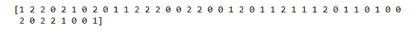
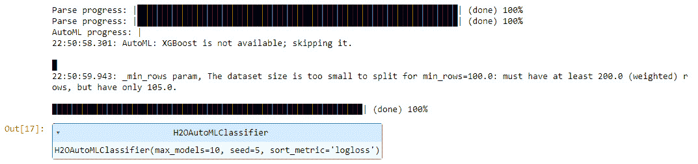
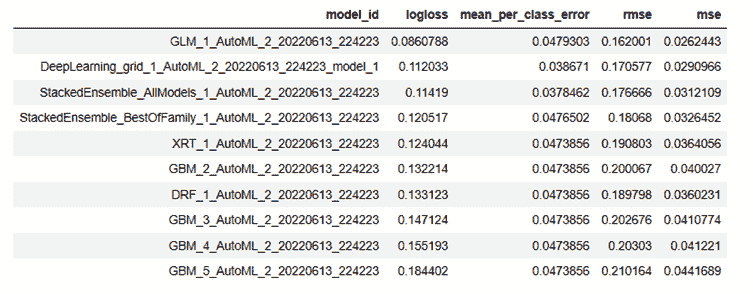
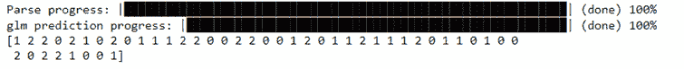
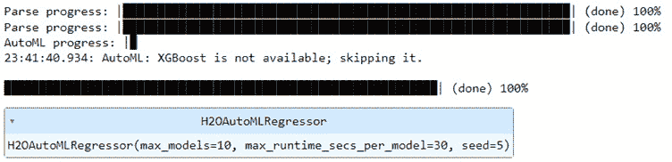
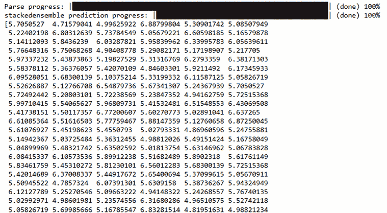
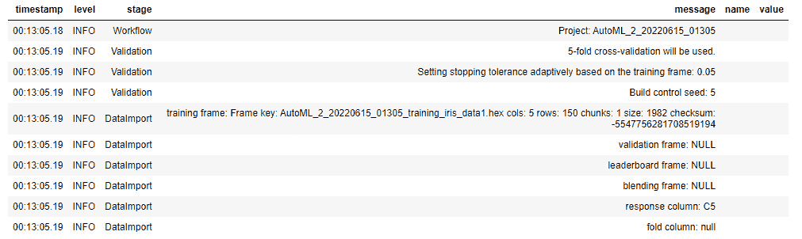
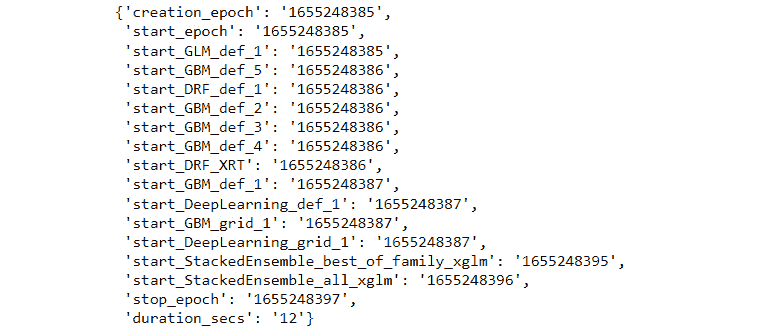

# 探索 H2O AutoML 中的杂项特性

除了整合许多**机器学习**（**ML**）算法和多种特性来训练它们之外，H2O AutoML 还有一些杂项特性，使其成为一个全能型服务，能够满足各种商业需求。

H2O AutoML 的优势不仅在于其自动训练多个模型的能力，还在于提供对其他对生产级系统至关重要的服务和特性的支持。

在本章中，我们将探讨 H2O AutoML 的两个独特特性，这些特性值得了解，并且在需要时可能非常有用。第一个特性是 H2O AutoML 与 Python 中流行的机器学习库 scikit-learn 的兼容性。我们将探讨如何在 scikit-learn 实现中使用 H2O AutoML，以及它如何为庞大的 scikit-learn 社区提供价值。

第二个特性是 H2O AutoML 内置的日志系统。这个日志系统在 AutoML 训练过程中记录有价值的信息。如果您计划在生产中使用 H2O AutoML 服务，这可能特别有用，因为在生产中监控系统健康是最重要的。

在本章中，我们将涵盖以下主题：

+   理解 H2O AutoML 在 scikit-learn 中的集成

+   理解 H2O AutoML 事件日志

基于这个想法，让我们探索 H2O AutoML 与 scikit-learn 的第一个杂项特性兼容性。

# 技术要求

对于本章，您需要以下内容：

+   您首选的网页浏览器的最新版本

+   您选择的**集成开发环境**（**IDE**）

+   （可选）Project Jupyter 的 Jupyter Notebook ([`jupyter.org/`](https://jupyter.org/))

本章中进行的所有实验都是在 Jupyter 笔记本上进行的，以便为您提供更好的输出可视化示例。您可以使用相同的设置自由跟随。您也可以在任何 Python 环境中执行相同的实验，因为 Python 代码在这两种环境中都会执行相同的操作。

本章的所有代码示例都可以在 GitHub 上找到，链接为 [`github.com/PacktPublishing/Practical-Automated-Machine-Learning-on-H2O/tree/main/Chapter%209`](https://github.com/PacktPublishing/Practical-Automated-Machine-Learning-on-H2O/tree/main/Chapter%209)。

# 理解 H2O AutoML 在 scikit-learn 中的集成

**Scikit-learn** 是机器学习和数据科学领域中应用最广泛的开源机器学习库之一。它是一个用于 Python 编程语言的库，专注于机器学习工具函数。它包括执行数学和统计分析、通用机器学习算法以及用于训练、测试和评估机器学习模型的函数。

Scikit-learn 最初由 David Cournapeau 开发，最初被称为**scikits.learn**。它是在 2007 年作为一个 Google Summer of Code 项目创建的，同年 Matthieu Brucher 将其作为论文项目。后来，它由法国罗克恩库尔计算机科学和自动化研究所的 Fabian Pedregosa、Gael Varoquaux、Alexandre Gramfort 和 Vincent Michel 重新编写并进一步开发。Scikit-learn 的第一个版本 1 的公开发布是在 2010 年 2 月 1 日。

你可以在这里找到更多关于 scikit-learn 的详细信息：[`scikit-learn.org/stable/`](https://scikit-learn.org/stable/).

scikit-learn 库建立在以下包之上：

+   **NumPy**：NumPy 是一个用于专门处理数组的 Python 库。它在 Python 中进行科学计算，并提供用于处理多维数组的函数。它还提供了对数组的各种快速计算数学运算，使其非常适合数据分析。它可以执行数组形状操作、排序、搜索、离散傅里叶变换操作、线性代数和统计。你可以在[`numpy.org/`](https://numpy.org/)找到更多关于 NumPy 的详细信息。

+   **SciPy**：SciPy 是一个建立在 NumPy 之上的科学计算库。它提供了高级科学计算函数。它用于执行图像处理、聚类、梯度优化等操作。Python 中的所有数值计算都由 SciPy 执行。你可以在[`scipy.org/`](https://scipy.org/)找到更多关于 SciPy 的详细信息。

+   **Matplotlib**：Matplotlib 是一个用于从数据创建可视化的库。这些可视化涉及各种类型的图表和图表，这些图表依赖于可以轻松用视觉表达和解释的计算数据。它可以创建适合在科学论文中发表的图表，并创建交互式图表，所有这些都可以导出为不同类型的格式。你可以在[`matplotlib.org/`](https://matplotlib.org/)找到更多关于 Matplotlib 的详细信息。

数据科学家在实验数据时经常使用 Scikit-learn。它在进行实验时提供了大量的灵活性，由于其 API 非常易于使用，因此它经常是执行通用机器学习函数的首选库。

H2O AutoML 可以轻松集成到 scikit-learn 中。你可以将 H2O AutoML 用作 scikit-learn 的**Estimator**，并与其他 scikit-learn 函数结合使用，以充分利用两者的优点。H2O AutoML 通过**h2o.sklearn**模块与 scikit-learn 交互。h2o.sklearn 模块公开了两个包装函数以执行 AutoML：

+   **H2OAutoMLClassifier**：此函数用于使用 H2O AutoML 训练分类模型

+   **H2OAutoMLRegressor**：此函数用于使用 H2O AutoML 训练回归模型

这些函数接受各种格式的输入数据，如 H2Oframes、NumPy 数组，甚至是 pandas DataFrames。它们还公开了与 scikit-learn 中使用的类似的标准训练和预测 API。这使得 scikit-learn 能够使用 H2O AutoML，以及其他 scikit-learn 组件。

H2O AutoML 估计器也保留了它们原有的功能，例如排行榜和训练信息等。用户仍然可以在 scikit-learn 中访问这些详细信息，以从 AutoML 训练中提取信息进行进一步的实验或分析。

现在我们对 scikit-learn 库及其用途有了更好的了解，让我们学习如何在 H2O AutoML 旁边使用它。我们将从了解我们可以在系统上安装 scikit-learn 的各种方法开始。

## 构建和安装 scikit-learn

安装 scikit-learn 非常简单。在您的系统上安装 scikit-learn 有三种不同的方法：

+   安装 scikit-learn 的最新官方版本

+   安装由您的 Python 发行版或操作系统提供的 scikit-learn 版本

+   从源代码构建和安装 scikit-learn 包

让我们逐一快速了解这些选项，以便我们可以在 H2O AutoML 旁边准备好使用 scikit-learn。

### 安装 scikit-learn 的最新官方版本

此过程可能因您系统上使用的 Python 包管理器类型而异：

+   使用`pip`包管理器，在您的终端中执行以下命令以安装 scikit-learn 的最新版本：

    ```py
    pip install -U scikit-learn
    ```

    +   以下命令将显示 scikit-learn 的安装位置及其版本：

        ```py
        python -m pip show scikit-learn 
        ```

+   使用**Anaconda**或**Miniconda**包管理器，在您的终端中执行以下命令以安装 scikit-learn 的最新版本：

    ```py
    conda create -n sklearn-env -c conda-forge scikit-learn
    conda activate sklearn-env
    ```

以下命令将显示您系统上安装的 scikit-learn 版本：

```py
conda list scikit-learn
```

您可以使用以下命令导入已安装的 scikit-learn 模块，以确保它已成功安装并显示其版本：

```py
python -c "import sklearn; sklearn.show_versions()"
```

现在我们知道了如何使用`pip`、Anaconda 和 Miniconda 安装 scikit-learn，让我们看看另一种使用操作系统附带打包的 Python 发行版安装它的方法。

### 使用您操作系统的 Python 发行版安装 scikit-learn

由于 scikit-learn 被开发者广泛使用，它通常与各种 Python 发行版或操作系统的内置包管理器一起打包。这使得用户可以直接安装可用的 scikit-learn 包，而无需从互联网上下载。

以下是一些带有预包装 scikit-learn 版本及其相应终端命令的操作系统列表：

+   `python-scikit-learn`。要安装此库，请执行以下命令：

    ```py
    sudo pacman -S python-scikit-learn
    ```

+   **Debian/Ubuntu**：Debian Ubuntu 发行版将 scikit-learn 包分成三个部分：

    +   **python3-sklearn**：此包包含 scikit-learn 函数的 Python 模块

    +   **python3-sklearn-lib**：此包包含 scikit-learn 的低级实现和绑定

    +   **python3-sklearn-doc**：此包包含 scikit-learn 的文档

要安装此库，请执行以下命令：

```py
sudo apt-get install python3-sklearn python3-sklearn-lib python3-sklearn-doc
```

+   `python3-scikit-learn`。它是`Fedora30`中唯一可用的：

    ```py
    sudo dnf install python3-scikit-learn
    ```

+   从这里：[`pkgsrc.se/math/py-scikit-learn`](http://pkgsrc.se/math/py-scikit-learn)的`pkgsrc-wip`。

这个过程的缺点是它通常伴随着较旧的 scikit-learn 版本。然而，这可以通过使用相应的包管理器将已安装的包升级到最新版本来修复。

### 从源代码构建和安装 scikit-learn 包

想要使用最新实验功能或希望为 scikit-learn 做出贡献的用户可以直接构建和安装 scikit-learn 的最新可用版本。

您可以通过执行以下步骤从源代码构建和安装 scikit-learn：

1.  使用 Git 从 GitHub 上的 scikit-learn 仓库检出最新源代码。scikit-learn 仓库可以在以下位置找到：[`github.com/scikit-learn/scikit-learn`](https://github.com/scikit-learn/scikit-learn)。执行以下命令以克隆最新的 scikit-learn 仓库：

    ```py
    git clone git://github.com/scikit-learn/scikit-learn.git
    ```

1.  使用 Python 创建虚拟环境并安装**NumPy**、**SciPy**和**Cython**，它们是 scikit-learn 的构建依赖项：

    ```py
    python3 -m venv h2o-sklearn
    source h2o-sklearn/bin/activate
    pip install wheel numpy scipy cython
    ```

1.  使用`pip`通过运行以下命令构建项目：

    ```py
    pip install --verbose --no-build-isolation --editable .
    ```

1.  安装完成后，通过运行以下命令检查 scikit-learn 是否正确安装：

    ```py
    python -c "import sklearn; sklearn.show_versions()"
    ```

为了避免与其他包冲突，强烈建议在虚拟环境或**conda**环境中安装 scikit-learn。此外，在安装 SciPy 和 NumPy 时，建议使用**二进制轮**，因为它们不是从源代码重新编译的。

## 尝试使用 scikit-learn

现在我们已经成功安装了 scikit-learn，让我们快速看一下 scikit-learn 训练模型的一个简单实现。以此为参考，我们将探讨如何将 H2O AutoML 集成到其中。

我们将用于此实验的数据集将是我们在整本书中一直在使用的同一爱丽丝花数据集。这个数据集是使用机器学习解决分类问题的良好示例。

因此，让我们首先使用纯 scikit-learn 函数来实现它。

按照以下步骤在 Python 中使用 scikit-learn 训练您的机器学习模型：

1.  导入`sklearn`和`numpy`库：

    ```py
    import sklearn
    import numpy
    ```

1.  爱丽丝花数据集在`sklearn`库中是现成的；它在`sklearn`的 dataset 子模块中。接下来，通过执行以下命令导入该数据集。让我们也仔细看看 DataFrame 的内容：

    ```py
    from sklearn.datasets import load_iris
    dataframe = load_iris()
    print(dataframe)
    ```

你应该得到一个以字典形式显示 DataFrame 内容的输出。让我们调查字典中的重要键值对，以了解我们正在处理什么：

+   `data`：此键包含数据集的所有特征——即花瓣长度、花瓣宽度、花萼长度和花萼宽度——以多维数组的形式。

+   `target_names`：此键包含数据集的目标或标签的名称——即 Iris-setosa、Iris-versicolour 和 Iris-virginica。这是一个数组，名称的索引是实际数据集中使用的数值表示。

+   `target`：此键包含数据集的所有目标值，也称为标签值。这也是一个表示目标值的数组，这些值在其他情况下将是表格数据集中的一列。这些值是数字，其中`0`代表 Iris-setosa，`1`代表 Iris-versicolour，`2`代表 Iris-virginica，这是根据`target_names`中的索引值决定的。

1.  在这个信息的基础上，通过执行以下命令将特征和标签提取到单独的变量中：

    ```py
    features = dataframe.data
    label = dataframe.target
    ```

1.  我们需要将数据集分成两部分——一部分用于训练，另一部分用于测试。与 H2O 不同，在 scikit-learn 中，我们将特征和标签视为两个独立的实体。它们应该具有相同的维度长度，以匹配数据内容。为此分割，执行以下命令：

    ```py
    from sklearn.model_selection import train_test_split
    feature_train, feature_test, label_train, label_test = train_test_split(features, label, test_size=0.30, random_state=5)
    ```

分割功能将特征和标签分割成 70%到 30%的比例，其中 70%的数据用于训练，剩余的 30%用于测试。因此，我们最终得到四个 DataFrame，如下所示：

+   `feature_train`：此 DataFrame 包含用于训练的 70%的特征数据

+   `label_train`：此 DataFrame 包含用于训练的 70%的标签数据

+   `feature_test`：此 DataFrame 包含用于测试的 30%的特征数据

+   `label_test`：此 DataFrame 包含用于测试的 30%的标签数据

1.  一旦训练和测试 DataFrame 准备就绪，声明并初始化用于模型训练的 ML 算法。Scikit-learn 有针对不同类型算法的独立库。由于我们正在处理分类问题，让我们使用**逻辑回归**算法来训练一个分类模型。执行以下命令初始化一个逻辑回归函数以训练模型：

    ```py
    from sklearn.linear_model import LogisticRegression
    logReg = LogisticRegression(solver='lbfgs', max_iter=1000)
    ```

1.  现在，让我们使用`feature_train`和`label_train`数据集来训练一个模型。执行以下函数：

    ```py
    logReg.fit(feature_train, label_train)
    ```

1.  一旦训练完成，我们可以使用相同的逻辑回归对象对`feature_test` DataFrame 进行预测。执行以下命令并打印预测的输出：

    ```py
    predictions = logReg.predict(feature_test)
    print(predictions)
    ```

你应该得到一个类似于以下输出的结果：



图 9.1 – scikit-learn 逻辑回归的预测输出

1.  你也可以通过执行以下命令来衡量你预测的准确率：

    ```py
    score = logReg.score(feature_test, label_test)
    print(score)
    ```

你应该得到大约`97.77`的准确率。

在本实验中，我们学习了如何使用 scikit-learn 导入数据集，进行分割，然后使用逻辑回归来训练分类模型。但正如我们在前几章所学，有大量的 ML 算法可供选择。每个都有自己的处理**方差**和**偏差**的方式。因此，最明显的问题仍然是未解答的：*我们应该使用哪种 ML 算法？*

正如我们在本实验中所看到的，scikit-learn 可能对不同的算法有大量的支持，但从编程的角度来看，训练所有这些算法可能会变得复杂。这就是我们可以集成 H2O AutoML 来自动训练所有 ML 算法的地方。

现在我们已经对如何使用 scikit-learn 来训练模型有了很好的了解，让我们看看如何使用 H2O AutoML 与 scikit-learn 结合使用。

## 在 scikit-learn 中使用 H2O AutoML

首先，我们将学习如何在 scikit-learn 中使用 H2O AutoML 通过`H2OAutoMLClassifier`子模块来进行分类。我们将使用相同的分类 ML 问题，使用 Iris 数据集，并看看我们如何使用 H2O AutoML 训练多个模型。

### 实验：使用 H2OAutoMLClassifier

按照以下步骤在 Python 中使用 scikit-learn 训练你的 H2O AutoML 分类模型：

1.  实施我们在“*使用 scikit-learn 进行实验*”部分遵循的*步骤 1*到*4*。

1.  在我们在“*使用 scikit-learn 进行实验*”部分进行的实验中，在*步骤 4*之后，我们通过从`sklearn.linear_model`导入`LogisticRegression`子模块初始化了逻辑回归算法。在本实验中，我们将从`h2o.sklearn`模块导入`H2OAutoMLClassifier`子模块：

    ```py
    from h2o.sklearn import H2OAutoMLClassifier
    h2o_aml_classifier = H2OAutoMLClassifier(max_models=10, seed=5, max_runtime_secs_per_model=30, sort_metric='logloss')
    ```

就像我们在前几章中设置 AutoML 参数一样，我们将`max_models`设置为`10`，`max_runtime_secs_per_model`设置为`30`秒，随机`seed`值设置为`5`，以及`sort_metric`设置为`logloss`。

1.  一旦初始化了`H2OAutoMLClassifier`，你就可以使用它来拟合，换句话说，训练你的模型。执行以下命令以触发 AutoML 训练：

    ```py
    h2o_aml_classifier.fit(feature_train, label_train)
    ```

首先，程序将检查本地主机：54321 上是否已经运行了一个 H2O 实例。如果没有，H2O 将启动一个 H2O 服务器的实例；否则，它将重用已经存在的实例来训练 AutoML 模型。一旦开始训练，你应该得到以下类似的输出：



图 9.2 – H2O AutoML 分类器训练输出

从输出中，你可以看到 H2O 首先导入并解析了**特征训练**和**标签训练**DataFrame。然后，它开始 AutoML 训练。

1.  要查看 AutoML 训练的结果，你可以通过执行以下命令来查看 H2O **排行榜**：

    ```py
    h2o_aml_classifier.estimator.leaderboard
    ```

你应该得到以下类似的输出：



图 9.3 – H2O AutoML 排行榜

1.  使用相同的 H2O AutoML 分类器，你也可以进行预测，如下所示：

    ```py
    predictions = h2o_aml_classifier.predict(feature_test)
    print(predictions)
    ```

你应该得到以下类似的输出：



图 9.4 – 使用 H2OAutoMLClassifier 进行预测的输出

默认情况下，分类器将使用排行榜上排名最高的模型进行预测。

通过这样，你已经学会了如何在 scikit-learn 中实现 H2O AutoML 来使用 `H2OAutoMLClassifier` 解决分类问题。

既然我们已经了解了如何使用 `H2OAutoMLClassifier` 对数据进行分类预测，那么让我们看看如何使用 `H2OAutoMLRegressor` 子模块进行回归预测。

### 尝试使用 H2OAutoMLRegressor

现在，让我们看看如何解决一个 `H2OAutoMLRegressor`。对于这个实验，我们将使用之前在 *第七章* 中使用的红酒质量数据集，*使用模型可解释性*。

按照以下步骤在 Python 中使用 scikit-learn 训练你的 H2O AutoML 回归模型：

1.  实现 *步骤 1* 到 *4*，我们在 *尝试使用 scikit-learn* 部分中遵循的步骤。

1.  在我们进行的 *尝试使用 H2OAutoMLClassifier* 部分的实验中，我们初始化了 `H2OAutoMLClassifier`。由于在这个实验中我们处理的是一个回归问题，我们将使用 `H2OAutoMLRegressor` 子模块。执行以下命令来导入并实例化 `H2OAutoMLRegressor` 类对象：

    ```py
    from h2o.sklearn import H2OAutoMLRegressor
    h2o_aml_regressor = H2OAutoMLRegressor(max_models=10, max_runtime_secs_per_model=30, seed=5)
    ```

1.  一旦 `H2OAutoMLRegressor` 已经初始化，我们可以触发 AutoML 来训练我们的回归模型。执行以下命令来触发 AutoML：

    ```py
    h2o_aml_regressor.fit(feature_train, label_train)
    ```

一旦模型训练完成，你应该得到以下类似的输出：



图 9.5 – H2O AutoML 回归器训练输出

1.  与 `H2OAutoMLClassifier` 类似，你也可以通过执行以下命令来查看 H2O **排行榜** 上 AutoML 训练的结果：

    ```py
    h2o_aml_regressor.estimator.leaderboard
    ```

1.  进行预测也非常简单。你使用相同的 `H2OAutoMLRegressor` 对象，并调用其 `predict` 方法，同时传递保留用于测试的特征数据集。执行以下命令使用由 `H2OAutoMLRegressor` 训练的领导模型进行预测：

    ```py
    predictions = h2o_aml_regressor.predict(feature_test)
    print(predictions)
    ```

你应该得到以下预测结果：



图 9.6 – 使用 H2OAutoMLRegressor 进行预测的输出

预测输出是一个包含 `feature_test` DataFrame 的数组。这就是你如何在 scikit-learn 中实现 H2O AutoML 来使用 `H2OAutoMLRegressor` 解决回归问题的方法。

现在你已经知道了如何在 scikit-learn 中使用 H2O AutoML，让我们继续到 H2O AutoML 的下一个杂项功能：事件日志。

# 理解 H2O AutoML 事件日志

由于 H2O AutoML 自动化了大多数机器学习过程，我们给了机器一些控制权。封装意味着 AutoML 中所有复杂的部分都被隐藏起来，我们只关注输入和 H2O AutoML 给出的任何输出。如果 H2O AutoML 有任何问题，并且给出了没有意义或不符合预期的模型，那么我们需要深入了解 AutoML 是如何训练这些模型的。因此，我们需要一种方法来跟踪 H2O AutoML 内部发生的事情，以及它是否按预期训练模型。

当构建旨在用于生产的软件系统时，您总是会需要一个日志系统来记录信息。软件的虚拟性质使得用户难以跟踪系统在处理和其他活动中的情况。任何故障或问题都可能导致一系列底层问题，开发者可能最终发现得太晚，如果他们能发现的话。

正因如此，日志系统总是被实施以支持您的系统。系统生成的日志帮助开发者追踪问题的根源并迅速缓解。H2O AutoML 还可以生成包含所有底层处理元信息的日志。当您让 H2O 处理所有机器学习过程时，您可以使用这些日志保持一定的控制感。

AutoML 生成两种类型的日志。具体如下：

+   **事件日志**：这些是在 AutoML 训练过程中在后台生成的日志。所有日志都被收集并以 H2O DataFrame 的形式呈现。

+   **训练日志**：这些是在 AutoML 训练模型时显示训练和预测时间的日志，以键值对字典的形式呈现。训练时间以 epoch 为单位，主要用于模型训练后的分析。

让我们看看如何通过实际实现从 H2O AutoML 中检索这些日志。

按照以下步骤使用 H2O AutoML 训练模型。然后，我们将学习如何提取日志并了解它们的结构：

1.  导入`h2o`模块并初始化 H2O 以启动本地 H2O 服务器：

    ```py
    import h2o
    h2o.init()
    ```

1.  通过传递数据集下载位置来导入 Iris 数据集：

    ```py
    data = h2o.import_file("Dataset/iris.data")
    ```

1.  设置标签和特征：

    ```py
    label = "C5"
    features = data.columns
    features.remove(label)
    ```

1.  使用以下参数初始化 H2O AutoML 对象：

    ```py
    aml = h2o.automl.H2OAutoML(max_models=10, seed = 5)
    ```

1.  通过传递特征列、标签列和用于训练模型的 DataFrame 来触发 AutoML 训练：

    ```py
    aml.train(x = features, y = label, training_frame = dataframe)
    ```

1.  一旦训练完成，您可以通过使用 AutoML 对象的`event_log`属性来查看事件日志。让我们检索日志 DataFrame 并查看其内容：

    ```py
    event_logs = aml.event_log
    print(event_logs)
    ```

您应该得到类似以下输出的结果：



图 9.7 – H2O AutoML 的事件日志输出

同样，您可以通过执行以下 R 命令在 R 编程语言中查看事件日志：

```py
event_log <- aml@event_log
```

事件日志包含以下信息：

+   **时间戳**：此列是特定事件发生的时间。

+   **级别**：在日志系统中，日志通常根据重要性或关键性分为某些类别。在大多数情况下，级别如下，基于关键性排名：

    1.  **致命错误**：此日志级别表示应用程序面临一个关键问题，需要停止运行并关闭。

    1.  **错误**：此日志级别表示应用程序在执行某些功能时遇到问题。然而，问题并不那么关键，以至于应用程序需要关闭。

    1.  **警告**：此日志级别表示应用程序检测到一些不寻常的情况，但无害，并且不会影响任何功能。

    1.  **信息**：此日志级别表示正常行为更新，如果需要，可以记录并存储以供将来参考。它们通常是信息性的。

    1.  **调试**：此日志级别表示在开发应用程序或进行诊断操作或调试问题时通常需要的更详细诊断信息。

    1.  **跟踪**：此日志级别类似于**调试**，但具有更详细的信息，尤其是在您正在跟踪代码库中信息流时。

+   **阶段**：此列指示生成日志时的 AutoML 训练阶段。

+   **消息**：此列包含描述性消息，提供有关发生事件的详细信息。

+   **名称**：如果设置了，此列包含发生的事件日志的名称。

+   **值**：如果设置了，此列包含发生的事件日志的值。

1.  现在，让我们检索训练日志并查看其内容：

    ```py
    info_logs = aml.training_info
    print(info_logs)
    ```

您应该得到以下类似的输出：



图 9.8 – H2O AutoML 的事件日志输出

同样，您可以通过执行以下 R 命令在 R 编程语言中查看事件日志：

```py
info_logs <- aml@training_info
```

训练日志包含以下信息：

+   `creation_epoch`: 训练日志字典中的此键包含 AutoML 作业创建时的 epoch 值。

+   `start_epoch`: 训练日志字典中的此键包含 AutoML 构建开始时的 epoch 值。

+   `start_{模型名称}`: 训练日志字典中的此类键包含特定模型开始训练时的 epoch 值。

+   `stop_epoch`: 训练日志字典中的此键包含 AutoML 构建停止时的 epoch 值。

+   `duration_secs`: 训练日志字典中的此键包含 AutoML 运行的总时间（以秒为单位）。

这个实验为我们提供了一个很好的例子，说明了 H2O 如何生成日志事件。当使用 H2O AutoML 构建机器学习系统时，你可以将这些日志纳入你的日志系统中，以便监控 H2O AutoML 的功能。这将帮助你及时识别可能出现的任何问题，并确保你的模型在生产中保持最高质量。如果在训练过程中出现任何问题，或者在你意外地将有缺陷的模型部署到生产中之前，你将会收到警报。

# 摘要

在本章中，我们了解了 H2O AutoML 的一些杂项功能。我们首先理解了 scikit-learn 库，并对其实现有了初步的了解。然后，我们看到了如何在 scikit-learn 实现中使用`H2OAutoMLClassifier`库和`H2OAutoMLRegressor`库来训练 AutoML 模型。

然后，我们探索了 H2O AutoML 的日志系统。在那之后，我们实施了一个简单的实验，其中我们触发了 AutoML 训练；一旦完成，我们就从 Python 和 R 编程语言中提取了事件日志和训练日志。然后，我们理解了这些日志的内容以及这些信息如何帮助我们监控 H2O AutoML 的功能。

在下一章中，我们将进一步关注如何在生产中使用 H2O，以及我们如何使用 H2O 的模型对象优化来实现这一点。
