# 12

# 与 H2O AutoML 和 Apache Spark 协同工作

在*第十章* *使用普通的 Java 对象（POJOs）*和*第十一章* *使用模型对象，优化（MOJO）*中，我们探讨了如何在生产系统中构建和部署我们的**机器学习**（**ML**）模型作为 POJOs 和 MOJOs，并使用它们进行预测。在大多数现实世界的问题中，你通常会需要在生产中部署你的整个 ML 管道，这样你就可以实时部署和训练模型。你的系统也将收集和存储新的数据，你可以稍后使用这些数据重新训练你的模型。在这种情况下，你最终需要将你的 H2O 服务器集成到你的商业产品中，并协调 ML 工作。

Apache Spark 是机器学习领域更常用的技术之一。它是一个用于大规模数据处理的集群计算分析引擎。它是完全开源的，并且得到了 Apache 软件基金会的广泛支持。

考虑到 Spark 在数据处理领域的普及，H2O.ai 开发了一个优雅的软件解决方案，将 Spark 和 AutoML 的优点结合成一个一站式解决方案，用于机器学习（ML）管道。这个软件产品被称为 H2O Sparkling Water。

在本章中，我们将更深入地了解 H2O Sparkling Water。首先，我们将了解 Spark 是什么以及它是如何工作的，然后继续了解 H2O Sparkling Water 如何与 Spark 结合操作 H2O AutoML，以满足快速数据处理需求。

在本章中，我们将涵盖以下主题：

+   探索 Apache Spark

+   探索 H2O Sparkling Water

到本章结束时，你应该对如何使用 H2O Sparkling Water 将 H2O AI 与 Apache Spark 相结合有一个大致的了解，以及你如何从这两个世界的最佳之处受益。

# 技术要求

对于本章，你需要以下内容：

+   你首选的网页浏览器的最新版本。

+   你选择的**集成开发环境**（**IDE**）或终端。

+   本章中进行的所有实验都是在终端上进行的。你可以自由地使用相同的设置来跟随，或者使用你选择的任何 IDE 进行相同的实验。

因此，让我们首先了解 Apache Spark 究竟是什么。

# 探索 Apache Spark

Apache Spark 始于 2009 年在加州大学伯克利分校的 AMPLab 的一个项目。它在 2010 年以 BSD 许可证开源。三年后，即 2013 年，它被捐赠给 Apache 软件基金会，成为顶级项目。一年后，它在 Databricks 举办的数据排序比赛中被使用，并创下了新的世界纪录。从那时起，它被广泛用于大数据行业中的内存分布式数据分析。

让我们看看 Apache Spark 的各个组件及其相应的功能。

## 理解 Apache Spark 的组件

**Apache Spark**是一个开源的数据处理引擎。它用于实时处理数据，以及通过集群计算进行批量处理。所有数据处理任务都在内存中执行，使得任务执行非常快速。Apache Spark 的数据处理能力与 H2O 的 AutoML 功能相结合，可以使您的机器学习系统运行得更高效、更强大。但在我们深入探讨 H2O Sparkling Water 之前，让我们先了解 Apache Spark 是什么以及它由什么组成。

让我们先了解 Spark 生态系统中的各种组件：

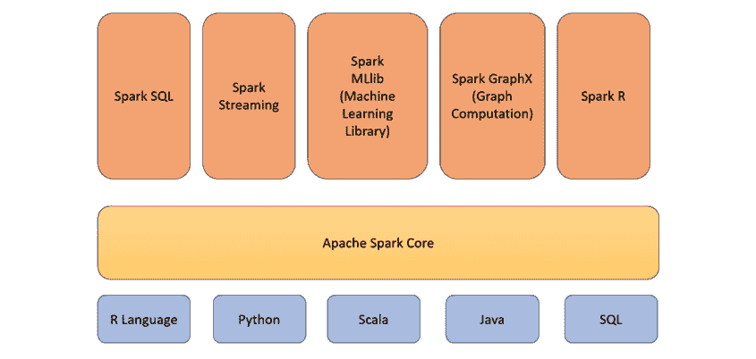

图 12.1 – Apache Spark 组件

Spark 生态系统的各种组件如下：

+   **Spark Core**：Spark Core 组件是 Spark 生态系统中最关键的部分。它负责基本功能，如输入输出操作、作业调度和监控。所有其他组件都是基于这个组件构建的。该组件通过特定的接口支持 Scala、Java、Python 和 R 编程语言。Spark Core 组件本身是用 Scala 编程语言编写的。

+   **Spark SQL**：Spark SQL 组件用于利用 SQL 查询的强大功能，在 Spark 节点存储的数据上运行数据查询。

+   **Spark Streaming**：Spark Streaming 组件用于在同一个应用程序中批量处理以及流式处理数据。

+   **Spark MLlib**：Spark MLlib 是 Spark 用于开发和部署可扩展机器学习管道的 ML 库。它还用于执行机器学习分析任务，如特征提取、特征工程、降维等。

+   **GraphX**：GraphX 组件是一个用于在基于图的数据上执行数据分析的库。它用于执行图数据构建和遍历。

+   **Spark R**：Spark R 组件是一个 R 包，为用户提供了一个通过 R 编程语言与 Spark 通信的前端 shell。所有由 R 执行的数据处理都在单个节点上完成。这使得 R 不适用于处理大量数据。Spark R 组件通过使用底层的 Spark 集群，帮助用户以分布式方式在大型数据集上执行这些数据操作。

## 理解 Apache Spark 架构

Apache Spark 具有一个明确的架构。如前所述，Spark 在集群系统上运行。在这个集群中，您将有一个节点被指定为主节点，而其他节点则作为工作节点。所有这些工作都是由工作节点上的独立进程完成的，而整个工作的协调则由 Spark 上下文完成。

参考以下图表以更好地理解 Apache Spark 架构：

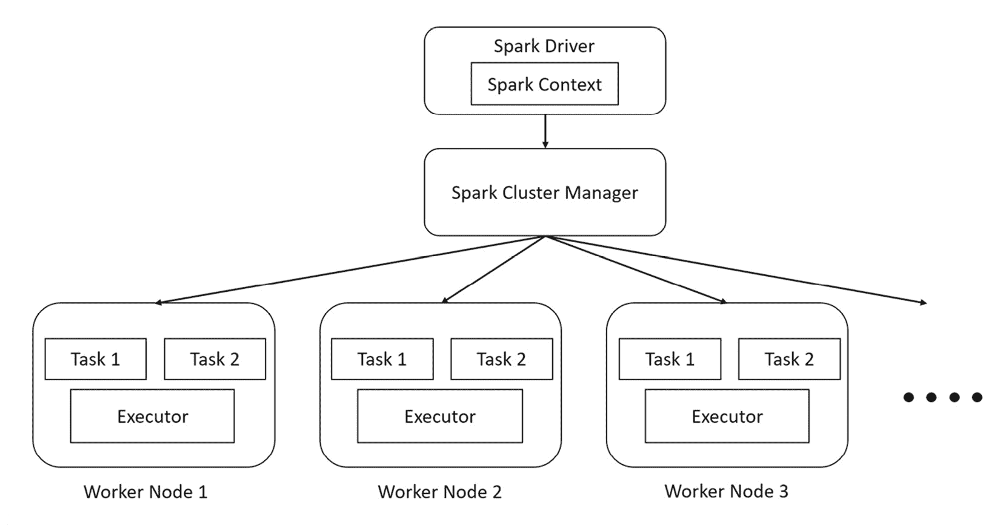

图 12.2 – Apache Spark 架构

Spark 架构包括以下组件：

+   **Spark 集群管理器**：Spark 集群管理器负责管理资源分配给节点并监控其健康状态。它负责维护 Spark 应用程序运行的机器集群。当你启动一个 Spark 应用程序时，集群管理器将根据指定的配置启动集群中的不同节点，并在执行过程中重启任何失败的服务。

Spark 集群管理器有三种类型：

+   **Standalone**：这是一个简单的集群管理器，与 Spark 一起捆绑提供，并且非常容易设置和使用。

+   **Hadoop YARN**：**YARN（Yet Another Resource Negotiator**）是 Hadoop 生态系统附带的一个资源管理器。作为一个数据处理系统，Spark 可以与许多数据存储系统集成。**Hadoop 分布式文件系统（HDFS**）是大数据行业中应用最广泛的分布式文件系统之一，Spark 与 HDFS 的集成在许多公司中已成为常见的配置。由于 YARN 是 Hadoop 生态系统的一部分，你可以使用相同的资源管理器来管理你的 Spark 资源。

+   **Kubernetes**：Kubernetes 是一个开源的容器编排系统，用于自动化部署操作、扩展服务以及其他形式的服务器管理。Kubernetes 还能够管理 Spark 集群资源。

+   **Spark 驱动程序**：Spark 驱动程序是 Spark 应用程序的主要程序。它负责控制应用程序的执行并跟踪节点的不同状态，以及分配给每个节点的任务。该程序可以是任何你运行的脚本，甚至是 Spark 接口。

+   **Spark 执行器**：Spark 执行器是实际在工作节点上执行计算任务的进程。它们是相当简单的进程，目的是接收分配的任务，计算它，然后将结果发送回 Spark Context。

+   **SparkContext**：正如其名所示，Spark Context 跟踪执行上下文。Spark 驱动程序执行的任何命令都通过这个上下文。Spark Context 与 Spark 集群管理器通信，以协调正确的执行器执行活动。

Spark 驱动程序是管理集群上操作并行执行的主要功能。驱动程序通过一个称为 **弹性分布式数据集**（**RDD**）的数据结构来实现这一点。

## 理解什么是弹性分布式数据集

Apache Spark 建立在 **RDD** 的基础上。它是一个容错的数据记录，位于多个节点上且不可变。你在 Spark 中所做的所有操作都是使用 RDD 完成的。由于它是不可变的，因此你进行的任何转换最终都会创建一个新的 RDD。RDD 被划分为逻辑集合，然后这些集合被分配到 Spark 节点上进行执行。Spark 内部处理所有这些分配。

让我们了解 Spark 如何使用 RDD 在规模上进行数据处理。参考以下图表：

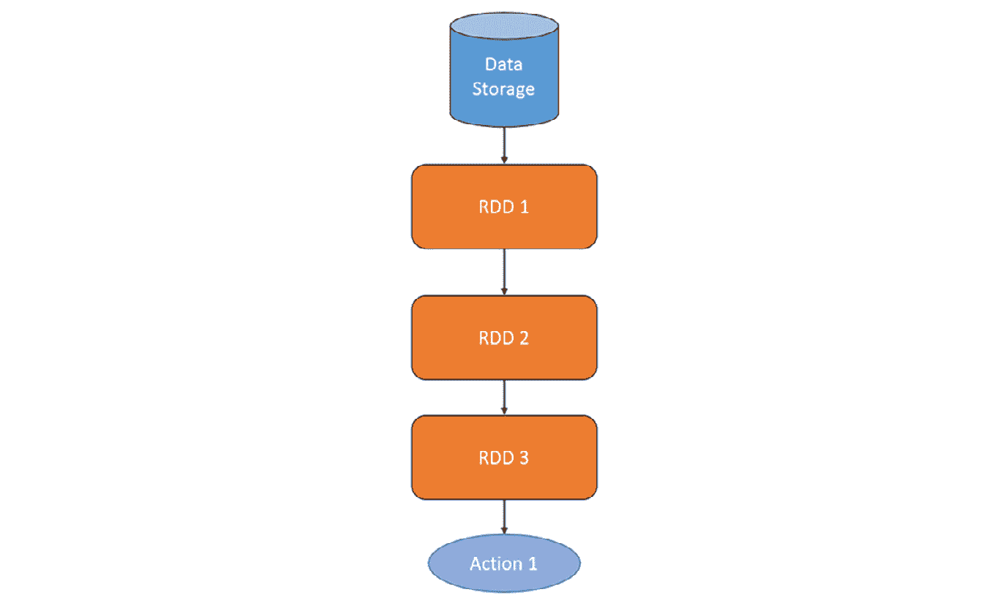

图 12.3 – 线性 RDD 转换

因此，RDD 是不可变的，这意味着一旦数据集被创建，就不能对其进行修改。所以，如果你想对数据集进行更改，那么 Spark 将从现有的 RDD 创建一个新的 RDD，并跟踪所做的更改。在这里，你的初始数据存储在**RDD 1**中，所以你必须假设你需要删除一列并将另一列的类型从字符串转换为数字。Spark 将创建**RDD 2**，它将包含这些更改，并记录所做的更改。最终，随着你进一步转换数据，Spark 将包含许多 RDD。

你可能会想知道，如果你需要对数据进行许多转换，Spark 是否会创建那么多的 RRD，最终耗尽内存？记住，RDD 是容错的且不可变的，所以如果你从**RDD 2**创建了**RDD 3**，那么你只需要保留**RDD 2**以及从**RDD 2**到**RDD 3**的数据转换过程。你将不再需要**RDD 1**，因此可以将其删除以释放空间。Spark 为你处理所有的内存管理。它将删除任何不再需要的 RDD。

那是一个对简单问题的非常简化的解释。如果你从同一个 RDD 创建多个包含不同转换的 RDD，会怎样？这可以在以下图表中看到：

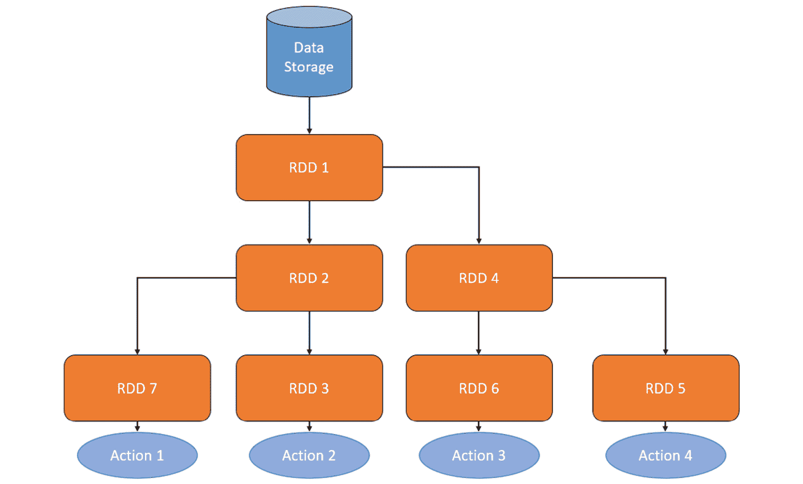

图 12.4 – 分支 RDD 转换

在这种情况下，你需要保留所有 RDD。这就是 Spark 的**延迟评估**发挥作用的地方。延迟评估是一种评估技术，其中评估表达式被延迟到结果值需要时才进行。让我们通过查看 RDD 操作来更好地理解这一点。有两种类型的操作：

+   **转换**：转换是产生新 RDD 的操作，该 RDD 基于包含数据集更改的现有 RDD。这些操作主要是由将原始数据集转换为可以用于提取评估指标或其他过程的精炼最终数据集的数据操作组成。这主要涉及如并集操作或分组操作之类的数据操作。

+   **动作**：动作是接受 RDD 作为输入但不生成新 RDD 作为输出的操作。从动作操作中导出的输出值被发送回驱动程序。这通常涉及如 count（返回 RDD 中元素的数量）或 aggregate（对 RDD 的内容执行聚合操作并将结果发送回）之类的操作。

转换操作是惰性的。当在 RDD 上执行转换操作时，Spark 会记录需要执行的操作，但不会立即执行。它只有在接收到动作操作时才会开始转换过程，因此得名惰性评估。

让我们用一个简单的例子来理解整个过程。假设你有一个包含一家公司所有员工原始数据集的 RDD，你想计算所有高级机器学习工程师的平均工资。你的转换操作是将所有机器学习工程师过滤到 **RDD 2**，然后进一步按资历过滤到 **RDD 3**。当你将这个转换操作传递给 Spark 时，它不会创建 **RDD 3**。它只会记录下来。当它接收到动作操作——即计算平均工资——这时惰性评估开始发挥作用，Spark 开始执行转换，并最终执行动作。

惰性评估帮助 Spark 理解执行动作操作所需的转换操作，并找到在考虑空间复杂性的同时进行转换的最有效方式。

小贴士

Spark 是一种非常复杂且强大的技术。它提供了大量的灵活性，可以根据不同的数据处理需求进行配置。在本章中，我们只是探索了 Apache Spark 的冰山一角。如果你对了解 Spark 的全部功能感兴趣，我强烈建议你探索 Apache Spark 文档，可以在 [`spark.apache.org/`](https://spark.apache.org/) 找到。

现在我们对 Spark 的工作原理有了基本的了解，让我们来了解 H2O Sparkling Water 如何结合 H2O 和 Spark。

# 探索 H2O Sparkling Water

**Sparkling Water** 是一个结合了 H2O 快速且可扩展的机器学习功能与 Apache Spark 分析能力的 H2O 产品。这两种技术的结合使用户能够进行数据清洗的 SQL 查询，将结果输入 H2O 进行模型训练，构建和部署模型到生产环境，然后用于预测。

H2O Sparkling Water 是设计成可以在常规 Spark 应用程序中运行 H2O 的。它提供了在 Spark 执行器内部运行 H2O 服务器的能力，这样 H2O 服务器就可以访问存储在执行器中的所有数据，以执行任何基于机器学习的计算。

H2O 和 Spark 之间的透明集成提供了以下好处：

+   H2O 算法，包括 AutoML，可以在 Spark 工作流程中使用

+   应用特定的数据结构可以在 H2O 和 Spark 之间进行转换和支持

+   你可以使用 Spark RDDs 作为 H2O ML 算法的数据集

Sparkling Water 支持两种类型的后端：

+   **内部后端**：在这种配置中，一旦初始化 H2O 上下文，H2O 应用就在 Spark executor 内部启动。然后，H2O 通过在每个 executor 内部初始化其键值存储和内存管理器来启动其服务。部署 H2O Sparkling Water 作为内部后端很容易，但如果 Spark 的集群管理器决定关闭任何 executor，那么在该 executor 中运行的 H2O 服务器也会关闭。内部后端是 H2O Sparkling Water 使用的默认设置。内部运行的 H2O Sparkling Water 架构如下所示：

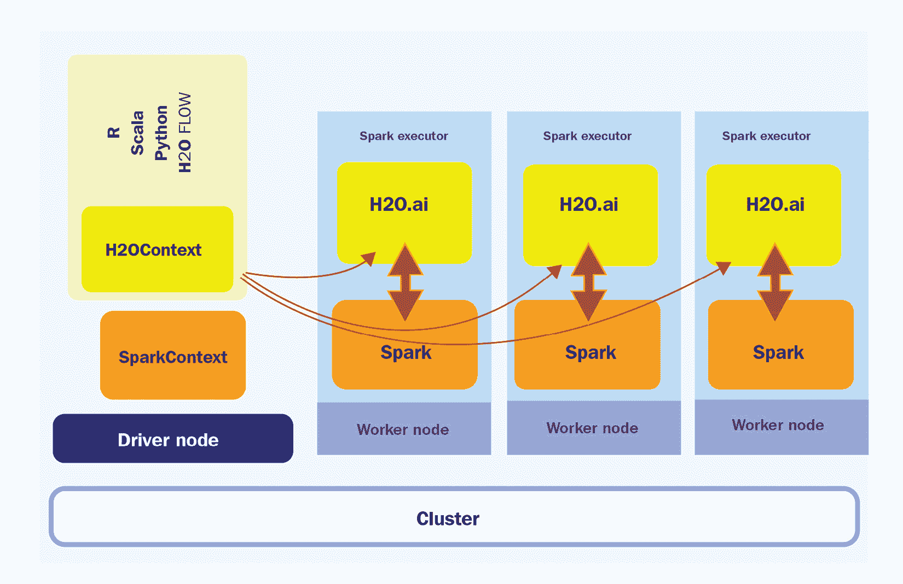

图 12.5 – Sparkling Water 内部后端架构

如您所见，H2O 服务位于每个 Spark executor 内部。

1.  **外部后端**：在这种配置中，H2O 服务与 Spark executor 分开部署，H2O 服务器和 Spark executor 之间的通信由 Spark driver 处理。作为外部后端的 H2O Sparkling Water 架构如下所示：

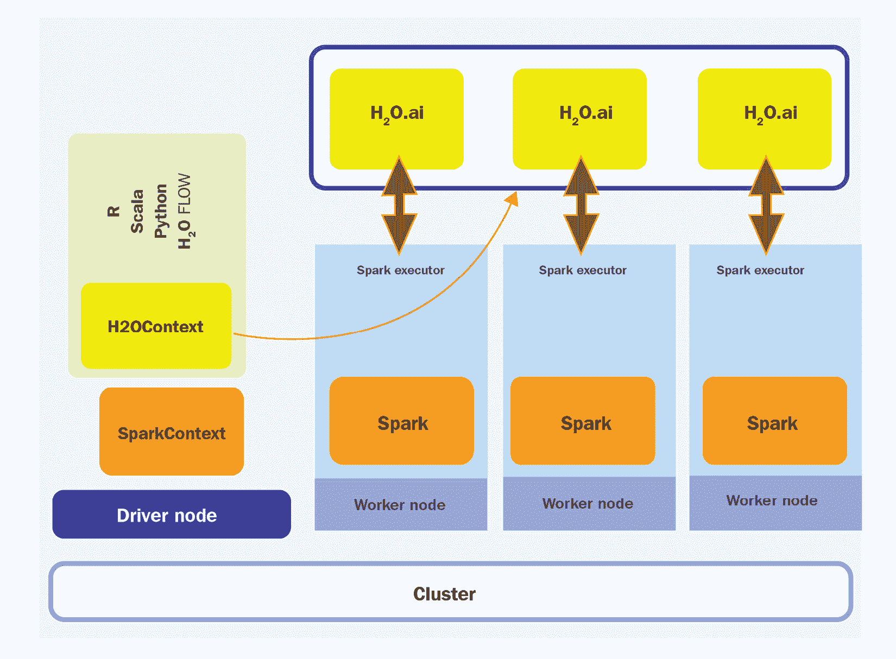

图 12.6 – Sparkling Water 外部后端架构

如您所见，H2O 集群是独立于 Spark executor 运行的。这种分离有好处，因为 H2O 集群不再受 Spark Executor 关闭的影响。然而，这也增加了 H2O driver 需要协调 H2O 集群和 Spark Executor 之间通信的开销。

Sparkling Water 虽然建立在 Spark 之上，但在使用 Sparkling Water 集群中的 H2O 服务器进行计算时，使用 H2OFrame。因此，Spark RDD 和 H2OFrame 之间存在大量的数据交换和交互。

DataFrame 之间的转换如下所示：

+   **H2OFrame 转换为 RDD**：当将 H2OFrame 转换为 RDD 时，Sparkling Water 不是重新创建数据为不同类型，而是在 H2OFrame 周围创建一个包装器，该包装器类似于 RDD API。这个包装器将所有基于 RDD 的操作解释为相同的 H2OFrame 操作。

+   **RDD 转换为 H2OFrame**：将 RDD 转换为 H2OFrame 涉及评估 RDD 中的数据，然后将其转换为 H2OFrame。然而，H2OFrame 中的数据被高度压缩。H2O 和 Spark 之间共享的数据取决于部署时使用的后端类型。

+   **内部 Sparkling Water 后端的数据共享**：在内部 Sparkling Water 后端，由于 H2O 服务是在 Spark Executor 内部启动的，因此 Spark 服务和 Executor 内部的 H2O 服务都使用相同的**Java 虚拟机**（**JVM**），因此数据对两个服务都是可访问的。以下图表显示了内部 Sparkling Water 后端的数据共享过程：

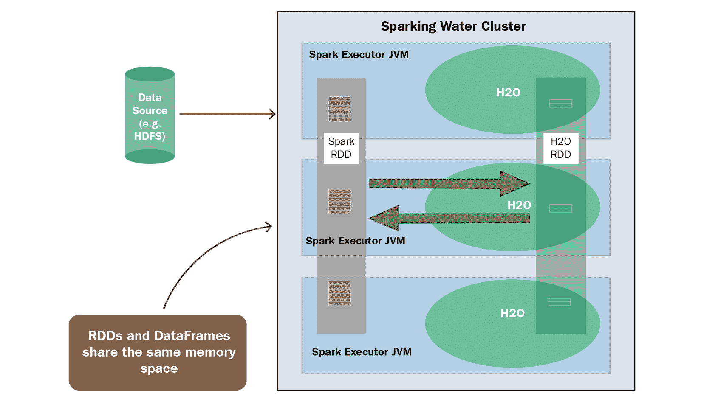

图 12.7 – 内部 Sparkling Water 后端的数据共享

由于这两个服务都在同一个 executor 上，您在转换两种类型之间的 DataFrames 时需要考虑内存。您需要为 Spark 和 H2O 执行各自的操作分配足够的内存。Spark 需要您数据集的最小内存，以及您希望执行的任何转换的额外内存。此外，将 RDD 转换为 H2OFrames 会导致数据重复，因此建议使用 4 倍更大的数据集用于 H2O。

+   **外部 Sparkling Water 后端的数据共享**：在外部 Sparkling Water 后端，H2O 服务是在一个与 Spark Executor 分开的集群中启动的。因此，在网络上从一个集群传输数据到另一个集群会有额外的开销。以下图表应该能帮助您理解这一点：

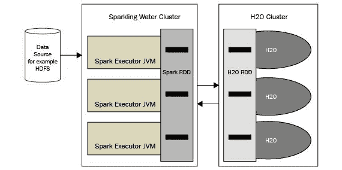

图 12.8 – 外部 Sparkling Water 后端的数据共享

由于这两个服务都位于它们自己的集群中（如果您为各自的集群分配了足够的内存），您不需要担心内存限制。

小贴士

H2O Sparkling Water 可以在各种平台上以各种方式运行。如果您想了解更多关于您可以部署 H2O Sparkling Water 的各种方式，以及获取更多有关其后端的信息，请随时查看[`docs.h2o.ai/sparkling-water/3.2/latest-stable/doc/design/supported_platforms.xhtml`](https://docs.h2o.ai/sparkling-water/3.2/latest-stable/doc/design/supported_platforms.xhtml)。

现在我们已经了解了 H2O Sparkling Water 是如何工作的，让我们看看我们如何下载和安装它。

## 下载和安装 H2O Sparkling Water

在您可以在系统上安装 H2O Sparkling Water 之前，H2O Sparkling Water 有一些特定的要求需要满足。H2O Sparkling Water 版本 3.36 的安装要求如下：

+   **操作系统**：H2O Sparkling Water 仅支持 Linux、macOS 和 Windows。

+   **Java 版本**：H2O Sparkling Water 支持所有高于 Java 1.8 的 Java 版本。

+   **Python 版本**：如果您计划使用 Sparkling Water 的 Python 版本，即 PySparkling，那么您需要在系统上安装一个高于 3.6 的 Python 版本。

+   **H2O 版本**：H2O Sparkling Water 版本 3.36.1 需要与您系统上安装的 H2O 相同版本。然而，H2O Sparkling Water 已经预包装了一个兼容的 H2O 版本，因此您不需要单独安装 H2O 来使用 H2O Sparkling Water。

+   **Spark 版本**：H2O Sparkling Water 版本 3.36.1 严格支持 Spark 3.2。任何高于或低于 3.2 版本的 Spark 版本可能会导致安装问题或 H2O Sparkling Water 的工作问题。Spark 3.2 有其自己的依赖项，如下所示：

    +   **Java 版本**：Spark 3.2 严格支持 Java 8 和 Java 11

    +   **Scala 版本**：Spark 3.2 严格运行在 Scala 2.12/2.13 上

    +   **R 版本**：Spark 3.2 支持任何高于 3.5 的 R 版本

    +   **Python 版本**：Spark 3.2 支持任何高于 3.6 的 Python 版本

+   将`SPARK_HOME`环境变量设置为指向您的本地 Spark 3.2 安装。

现在，让我们设置我们的系统，以便我们可以下载和安装 H2O Sparkling Water。按照以下步骤设置 H2O Sparkling Water：

1.  我们将首先安装 Java 11，这是 Spark 和 H2O Sparkling Water 所需的。尽管 Spark 也支持 Java 8，但建议使用 Java 11，因为它是一个更新的版本，具有改进和安全性补丁。您可以通过执行以下命令来下载和安装 Java 11：

    ```py
    sudo apt-get install openjdk-11-jdk
    ```

1.  如果您希望使用 PySparkling Python 解释器，则可以安装 Python 版本 3.10。您可以通过执行以下命令来实现：

    ```py
    sudo apt install python3
    ```

1.  现在我们已经安装了基本语言，接下来我们继续下载并安装 Spark 版本 3.2。您可以从 Apache 软件基金会官方下载页面（https://www.apache.org/dyn/closer.lua/spark/spark-3.2.1/spark-3.2.1-bin-hadoop3.2.tgz）下载 Spark 的特定版本，或者直接在您的终端中运行以下命令：

    ```py
    wget https://downloads.apache.org/spark/spark-3.1.2/spark-3.1.2-bin-hadoop3.2.tgz
    ```

如果您正在使用**Maven 项目**，则可以直接指定 Spark 核心 Maven 依赖项，如下所示：

```py
<dependency>
    <groupId>org.apache.spark</groupId>
    <artifactId>spark-core_2.13</artifactId>
    <version>3.1.2</version>
</dependency>
```

您可以在[`mvnrepository.com/artifact/org.apache.spark/spark-core`](https://mvnrepository.com/artifact/org.apache.spark/spark-core)找到 Spark 的 Maven 仓库。

1.  然后，您可以在终端中执行以下命令来解压缩`.tar`文件：

    ```py
    sudo tar xzvf spark-*
    ```

1.  现在我们已经提取了 Spark 的二进制文件，接下来我们设置环境变量，如下所示：

    ```py
    export SPARK_HOME="/path/to/spark/installation"
    ```

1.  我们还必须将`MASTER`环境变量设置为`local[*]`以启动一个本地 Spark 集群：

    ```py
    export MASTER="local[*]"
    ```

1.  现在我们已经安装并准备好了 H2O Sparkling Water 的所有依赖项，接下来我们继续下载 H2O Sparkling Water。您可以从[`h2o.ai/products/h2o-sparkling-water/`](https://h2o.ai/products/h2o-sparkling-water/)下载最新版本。点击**下载最新版**按钮后，您应该会被重定向到 H2O Sparkling Water 仓库网站，在那里您可以下载 H2O Sparkling Water 版本*3.36*的 ZIP 文件。

1.  下载完成后，您可以在终端中执行以下命令来解压 ZIP 文件：

    ```py
    unzip sparkling-water-*
    ```

1.  您可以通过在 Sparkling Water 安装文件夹内执行以下命令来启动 H2O Sparkling Water shell，以检查一切是否正常工作：

    ```py
    bin/sparkling-shell
    ```

1.  通过这样做，您可以通过在 Spark 集群内启动一个 H2O 云来查看 Sparkling Water 是否已与 Spark 集成。您可以在`sparkling-shell`内部执行以下命令来实现：

    ```py
    import ai.h2o.sparkling._
    val h2oContext = H2OContext.getOrCreate()
    ```

您应该会得到以下类似的输出：

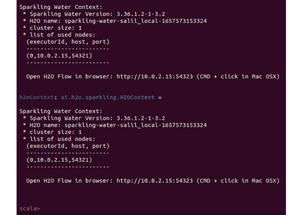

图 12.9 – 成功启动 H2O Sparkling Water

现在我们已成功下载并安装了 Spark 和 H2O Sparkling Water，并确保它们都能正常工作，根据 H2O.ai 的文档，还有一些通用的推荐调整您必须进行。让我们看一下：

+   在启动 Sparkling shell 时，增加 Spark 驱动器和 Spark 执行器的可用内存，从`config`参数的默认值：

    ```py
    bin/sparkling-shell --conf spark.executor.memory=4g spark.driver.memory=4g
    ```

如果您使用 YARN 或您的集群管理器，则使用`config spark.yarn.am.memory`而不是`spark.driver.memory`。您还可以通过在`spark-defaults.conf`文件中设置这些值来将这些值设置为默认配置属性。这些可以在您的 Spark 安装文件中找到。

+   除了集群内存外，还建议增加 Spark 节点的 PermGen 大小。默认的 PermGen 大小通常非常小，可能导致`OutOfMemoryError`。以下为`spark.driver.extraJavaOptions`和`spark.executor.extraJavaOptions`配置选项：

    ```py
    bin/sparkling-shell --conf spark.driver.extraJavaOptions -XX:MaxPermSize=384 -XX:PermSize=384m spark.executor.extraJavaOptions -XX:MaxPermSize=384 -XX:PermSize=384m
    ```

+   还建议保持您的集群同质化——也就是说，Spark 驱动器和执行器分配的资源数量相同。

+   以下配置也被推荐以加快和稳定在 Spark 集群上创建 H2O 服务：

    +   增加在数据本地模式下启动的任务等待秒数，以便 H2O 任务在本地使用数据进行处理。您可以按以下方式设置：

        ```py
        bin/sparkling-shell --conf spark.locality.wait=3000
        ```

    +   强制 Spark 仅在分配了 100%的资源后才开始调度作业：

        ```py
        bin/sparkling-shell --conf spark.scheduler.minRegisteredResourcesRatio=1
        ```

    +   不要重试失败的任务：

        ```py
        bin/sparkling-shell --conf spark.task.maxFailures=1
        ```

    +   将每个执行器心跳之间的间隔设置为小于 Spark 的网络超时时间（即`spark.network.timeout`），其默认值为*120 秒*。因此，将心跳值设置为约*10 秒*：

        ```py
        bin/sparkling-shell --conf spark.executor.heartbeatInterval=10s
        ```

现在我们已适当地配置了 Spark 和 H2O Sparkling Water，让我们看看如何使用这些技术通过 Spark 和 H2O AutoML 解决 ML 问题。

## 使用 H2O Sparkling Water 实现 Spark 和 H2O AutoML

对于这个实验，我们将使用混凝土抗压强度数据集。您可以在 https://archive.ics.uci.edu/ml/datasets/Concrete+Compressive+Strength 找到这个数据集。

关于数据集的更多详细信息：I-Cheng Yeh，*使用人工神经网络模拟高性能混凝土强度*，水泥与混凝土研究，第 28 卷，第 12 期，第 1797-1808 页（1998 年）。

让我们先了解我们将要解决的问题陈述。

### 理解问题陈述

混凝土抗压强度数据集是一个包含以下特征的*1,030*个数据点的数据集：

+   **水泥**: 此功能表示混合物每立方米的混凝土量（以千克计）

+   **高炉渣**: 此功能表示混合物每立方米的渣量（以千克计）

+   **粉煤灰**: 此功能表示混合物每立方米的粉煤灰量（以千克计）

+   **水**：这个特征表示混合物中添加的水的量，单位为千克/立方米

+   **高效减水剂**：这个特征表示混合物中添加的高效减水剂的量，单位为千克/立方米

+   **粗集料**：这个特征表示混合物中添加的粗集料（换句话说，石头）的量，单位为千克/立方米

+   **细集料**：这个特征表示混合物中添加的细集料（换句话说，沙子）的量，单位为千克/立方米

+   **年龄**：这个特征表示水泥的年龄

+   **混凝土抗压强度**：这个特征表示混凝土的抗压强度，单位为**兆帕**（**MPa**）

机器学习问题是要使用所有特征来预测混凝土的抗压强度。

数据集的内容如下：

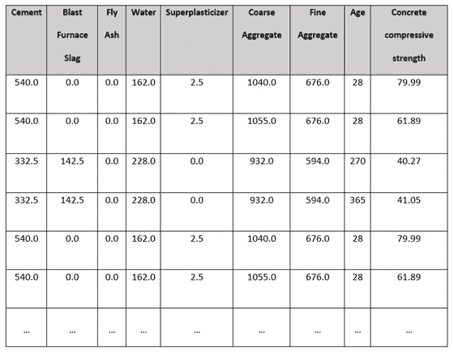

图 12.10 – 混凝土抗压强度数据集样本

那么，让我们看看我们如何使用 H2O Sparkling Water 解决这个问题。首先，我们将学习如何使用 H2O AutoML 和 Spark 来训练模型。

### 在 Sparkling Water 中运行 AutoML 训练

一旦成功安装了 Spark 3.2 和 H2O Sparkling Water，以及设置了正确的环境变量（`SPARK_HOME`和`MASTER`），你就可以开始模型训练过程了。

按照以下步骤操作：

1.  通过在 H2O Sparkling Water 提取文件夹中执行命令来启动 Sparkling shell：

    ```py
    ./bin/sparkling-shell
    ```

这应该在你的终端中启动一个 Scala shell。输出应该如下所示：

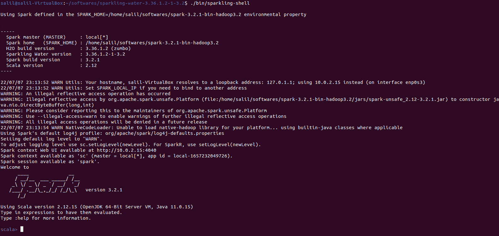

图 12.11 – H2O Sparkling Water 的 Scala shell

你也可以使用`PySparkling` shell 在 Python 中执行相同的实验。你可以通过执行以下命令来启动`PySparkling` shell：

```py
./bin/PySparkling
```

你应该得到以下类似的输出：

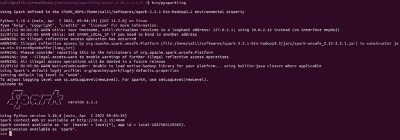

图 12.12 – H2O Sparkling Water 的 Python shell

1.  现在，我们需要在 Spark 环境中启动一个 H2O 集群。我们可以通过创建一个 H2OContext 并执行其`getOrCreate()`函数来实现这一点。因此，在你的 Sparkling shell 中执行以下代码来导入必要的依赖项并执行 H2O 上下文代码：

    ```py
    import ai.h2o.sparkling._
    import java.net.URI
    val h2oContext = H2OContext.getOrCreate()
    ```

在 PySparkling shell 中，代码将如下所示：

```py
from PySparkling import *
h2oContext = H2OContext.getOrCreate()
```

你应该得到以下类似的输出，表明你的 H2O 上下文已创建：

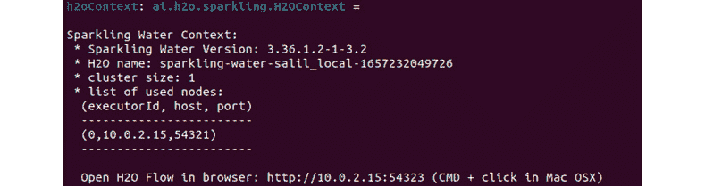

图 12.13 – 成功创建 H2O 上下文

1.  现在，我们必须确保我们的混凝土抗压强度数据集可以通过 Spark 内置的文件 I/O 系统在每一个节点上下载。因此，执行以下命令来导入你的数据集：

    ```py
    import org.apache.spark.SparkFiles
    spark.sparkContext.addFile("/home/salil/Downloads/Concrete_Data.csv")
    ```

在 PySparkling shell 中，我们必须使用 H2O 的`import`函数导入数据集。Python 代码将如下所示：

```py
import h2o
h2oFrame = h2o.import_file("/home/salil/Downloads/Concrete_Data.csv")
```

1.  添加后，我们必须通过在 Scala shell 中执行以下命令将数据集解析为 Spark DataFrame：

    ```py
    val sparkDataFrame = spark.read.option("header", "true").option("inferSchema", "true").csv(SparkFiles.get("Concrete_Data.csv"))
    ```

在 PySparkling shell 中，等效的代码如下：

```py
sparkDataFrame = hc.asSparkFrame(h2oFrame)
```

1.  现在，`sparkDataFrame` 包含了作为 Spark DataFrame 的数据集。因此，让我们在它上面执行训练-测试拆分，将 DataFrame 拆分为测试和训练 DataFrame。您可以在 Sparkling shell 中执行以下命令：

    ```py
    val Array(trainingDataFrame, testingDataFrame) = sparkDataFrame.randomSplit(Array(0.7, 0.3), seed=123)
    ```

在 PySparkling shell 中，执行以下命令：

```py
[trainingDataFrame, testingDataFrame] = sparkDataFrame.randomSplit([0.7, 0.3], seed=123)
```

1.  现在我们有了 `trainingDataFrame` 和 `testingDataFrame`，分别用于训练和测试。让我们创建一个 H2OAutoML 实例，在 `trainingDataFrame` 上自动训练模型。执行以下命令以实例化 H2O AutoML 对象：

    ```py
    import ai.h2o.sparkling.ml.algos.H2OAutoML
    val aml = new H2OAutoML()
    ```

在 PySparkling 中，当初始化 H2O AutoML 对象时，我们也会设置标签列。相应的代码如下：

```py
from PySparkling.ml import H2OAutoML
aml = H2OAutoML(labelCol=" Concrete compressive strength ")
```

1.  让我们看看如何在 Scala shell 中设置数据集的标签，以便 AutoML 对象知道 DataFrame 中哪些列是要预测的。执行以下命令：

    ```py
    aml.setLabelCol("Concrete compressive strength")
    ```

H2O 将将 DataFrame 的所有列视为特征，除非明确指定。然而，它将忽略设置为 **标签**、**折叠列**、**权重**或任何其他明确设置为忽略的列。

H2O AutoML 根据响应列的类型区分回归和分类问题。如果响应列是字符串，那么 H2O AutoML 假设它是一个 `ai.h2o.sparkling.ml.algos.classification.H2OAutoMLClassifier` 对象或 `ai.h2o.sparkling.ml.algos.regression.H2OAutoMLRegressor` 对象，而不是我们在这个例子中使用的 `ai.h2o.sparkling.ml.algos.H2OautoML`。

1.  现在，让我们将 AutoML 模型训练限制为仅 10 个模型。执行以下命令：

    ```py
    aml.setMaxModels(10)
    ```

此代码的等效 Python 语法相同，因此请在您的 PySparkling shell 中执行此相同命令。

1.  一旦我们设置了所有 AutoML 对象，剩下的唯一事情就是触发训练。为此，执行以下命令：

    ```py
    val model = aml.fit(trainingDataFrame)
    ```

相当于 Python 的代码如下：

```py
model = aml.fit(trainingDataFrame)
```

一旦训练完成，您应该得到以下类似的结果：

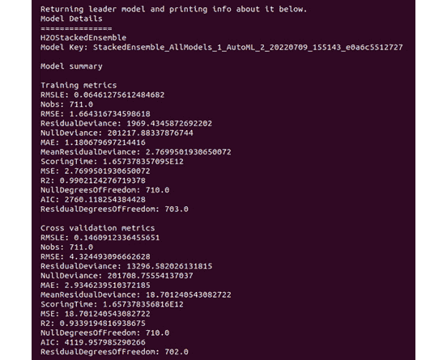

图 12.14 – H2O AutoML 在 H2O Sparkling Water 中的结果

如您所见，我们得到了一个堆叠集成模型作为主模型，其下方是模型键。在 **模型键** 下方是 **模型摘要**，其中包含训练和交叉验证的指标。

正如我们在 *第二章* 中所做的那样，*使用 H2O Flow (H2O 的 Web UI)*，我们没有为 `aml` 对象设置排序指标，因此默认情况下，H2O AutoML 将使用默认指标。这将默认为 `deviance`，因为它是 `automl.setSortMetric()` 并传入您选择的排序指标。

1.  您还可以通过使用 `getModelDetails()` 函数来获取模型的详细视图。执行以下命令：

    ```py
    model.getModelDetails()
    ```

此命令在 PySparkling 和 Scala shell 中都适用，并将输出关于模型元数据的非常详细的 JSON。

1.  您还可以通过执行以下命令来查看 AutoML 排行榜：

    ```py
    val leaderboard = aml.getLeaderboard()
    leaderboard.show(false)
    ```

PySparkling shell 的等效 Python 代码如下：

```py
leaderboard = aml.getLeaderboard("ALL")
leaderboard.show(truncate = False)
```

你应该得到以下类似的输出：

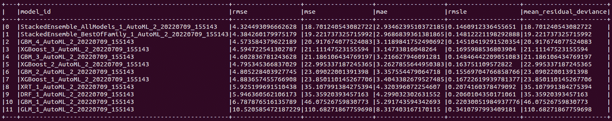

图 12.15 – H2O AutoML 在 H2O Sparkling Water 中的排行榜

这将显示包含所有已训练并按排序指标排名的模型的排行榜。

1.  使用 H2O Sparkling Water 进行预测也非常简单。预测功能被封装在一个简单易用的包装函数 `transform` 中。执行以下代码以对测试 DataFrame 进行预测：

    ```py
    model.transform(testingDataFrame).show(false)
    ```

在 PySparkling shell 中，情况略有不同。在这里，你必须执行以下代码：

```py
model.transform(testingDataFrame).show(truncate = False)
```

你应该得到以下类似的输出：

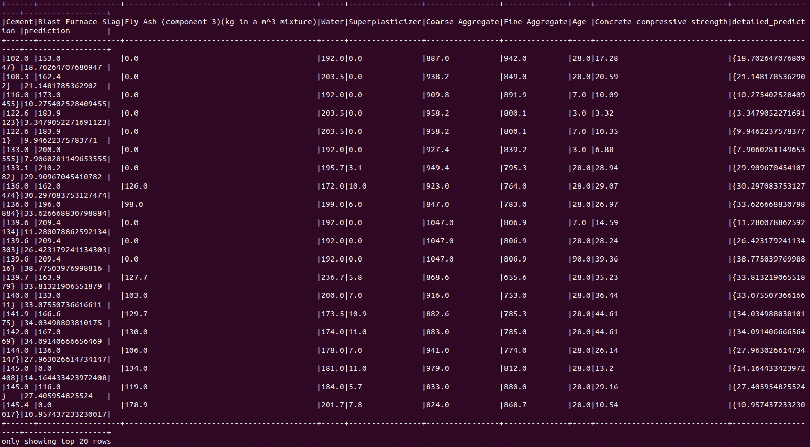

图 12.16 – 将预测结果与测试 DataFrame 结合

`transform` 函数的输出显示了右侧带有两个额外列的整个 **testDataFrame**，这两个列分别称为 **detailed_prediction** 和 **prediction**。

1.  现在，让我们下载这个模型作为 MOJO，以便我们可以在下一个实验中使用它，我们将看到 H2O Sparkling Water 如何加载和使用 MOJO 模型。执行以下命令：

    ```py
    model.write.save("model_dir")
    ```

该命令对 Scala 和 Python shell 都相同，应将模型 MOJO 下载到指定的路径。如果你使用 Hadoop 文件系统作为 Spark 数据存储引擎，则默认使用 HDFS。

现在我们知道了如何使用 H2O Sparkling Water 导入数据集、训练模型和进行预测，让我们更进一步，看看我们如何通过将它们加载到 H2O Sparkling Water 中并对它们进行预测来重用现有的模型二进制文件，也称为 MOJOs。

### 在 H2O Sparkling Water 中使用模型 MOJOs 进行预测

当你使用 H2O Sparkling Water 训练模型时，生成的模型总是 MOJO 类型。H2O Sparkling Water 可以加载由 H2O-3 生成的模型 MOJOs，并且与不同版本的 H2O-3 兼容。你不需要创建 H2O 上下文来使用模型 MOJOs 进行预测，但你确实需要一个评分环境。让我们通过完成一个实验来理解这一点。

按照以下步骤操作：

1.  要使用导入的模型 MOJOs 进行预测，你需要一个评分环境。我们可以通过两种方式创建评分环境；让我们看看：

    1.  使用 Sparkling Water 准备好的脚本，这些脚本设置了加载 MOJOs 并在 Spark 类路径上对其进行预测所需的全部依赖项。请参考以下命令：

以下命令适用于 Scala shell：

```py
./bin/spark-shell --jars jars/sparkling-water-assembly-scoring_2.12-3.36.1.3-1-3.2-all.jar
```

以下命令适用于 Python shell：

```py
./bin/pyspark --py-files py/h2o_PySparkling_scoring_3.2-3.36.1.3-1-3.2.zip
```

1.  直接使用 Spark 并手动设置依赖项。

1.  一旦我们设置了评分环境，我们就可以加载模型 MOJO。加载到 Sparkling Water 中的模型 MOJO 是不可变的。因此，一旦加载了模型，就无法进行任何配置更改。然而，你可以在加载模型之前设置配置。你可以通过使用 `H2OMOJOSettings()` 函数来实现这一点。请参考以下示例：

    ```py
    import ai.h2o.sparkling.ml.models._
    val modelConfigurationSettings = H2OMOJOSettings(convertInvalidNumbersToNa = true, convertUnknownCategoricalLevelsToNa = true)
    ```

对于 PySparkling，请参考以下代码：

```py
from PySparkling.ml import *
val modelConfigurationSettings = H2OMOJOSettings(convertInvalidNumbersToNa = true, convertUnknownCategoricalLevelsToNa = true)
```

1.  一旦设置了配置设置，你可以使用 `H2OMOJOModel` 库中的 `createFromMojo()` 函数加载模型 MOJO。因此，执行以下代码加载你在 *Sparkling Water 中运行 AutoML 训练* 部分创建的模型 MOJO 并传递配置设置：

    ```py
    val loadedModel = H2OMOJOModel.createFromMojo("model_dir/model_mojo", modelConfigurationSettings)
    ```

Python 的等效代码如下：

```py
loadedModel = H2OMOJOModel.createFromMojo("model_dir/ model_mojo", modelConfigurationSettings)
```

如果你指定模型 MOJO 路径为相对路径并且启用了 HDFS，Sparkling Water 将检查 HDFS 主目录；否则，它将从当前目录中搜索。你也可以传递一个指向你的模型 MOJO 文件的绝对路径。

你也可以手动指定你想要加载模型 MOJO 的位置。对于 HDFS 文件系统，你可以使用以下命令：

```py
loadedModel = H2OMOJOModel.createFromMojo("hdfs:///user/salil/ model_mojo")
```

对于本地文件系统，你可以使用以下命令：

```py
loadedModel = H2OMOJOModel.createFromMojo("file:///Users/salil/some_ model_mojo")
```

1.  一旦成功加载，你可以直接使用模型进行预测，就像我们在 *Sparkling Water 中运行 AutoML 训练* 部分所做的那样。因此，执行以下命令使用你最近加载的模型 MOJO 进行预测：

    ```py
    val predictionResults = loadedModel.transform(testingDataframe)
    ```

1.  预测结果存储为另一个 Spark DataFrame。因此，要查看预测值，我们只需执行以下命令来显示预测结果：

    ```py
    predictionResults.show()
    ```

你应该得到以下类似的输出：

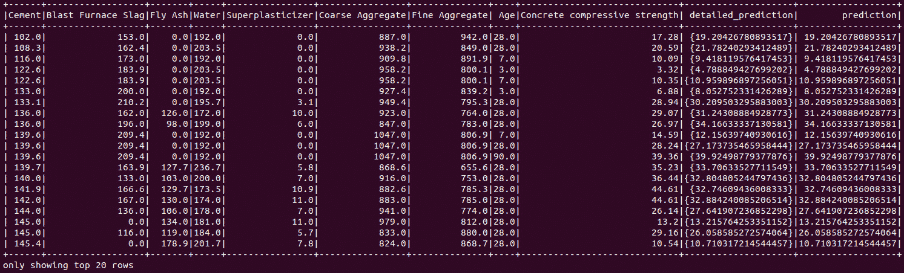

图 12.17 – 模型 MOJO 的预测结果

如你所见，我们在加载 MOJO 时特别将 `withDetailedPredictionCol` 设置为 `False`。这就是为什么我们看不到预测结果中的详细 `_prediction_column`。

小贴士

在将 H2O 模型 MOJO 加载到 Sparkling Water 时，你可以设置许多配置。对于 MOJO 模型，也有额外的可用方法，可以帮助收集更多关于你的模型 MOJO 的信息。所有这些详细信息都可以在 H2O 的官方文档页面上找到：[`docs.h2o.ai/sparkling-water/3.2/latest-stable/doc/deployment/load_mojo.xhtml#loading-and-usage-of-h2o-3-mojo-model`](https://docs.h2o.ai/sparkling-water/3.2/latest-stable/doc/deployment/load_mojo.xhtml#loading-and-usage-of-h2o-3-mojo-model)。

恭喜你 – 你刚刚学会了如何使用 H2O Sparkling Water 将 Spark 和 H2O AutoML 结合使用。

# 摘要

在本章中，我们学习了如何使用 H2O Sparkling Water 系统中的 H2O AutoML 与 Apache Spark 结合使用。我们首先了解了 Apache Spark 是什么。我们调查了构成 Spark 软件的各种组件。然后，我们深入研究了其架构，并了解了它是如何使用计算机集群来执行数据分析的。我们还调查了 Spark 集群管理器、Spark 驱动程序、Executor 以及 Spark Context。然后，我们进一步深入研究了 RDDs，并了解了 Spark 是如何使用它们在数据集上的转换操作上执行懒加载评估的。我们还了解到，Spark 足够智能，能够高效地管理其资源，并在操作期间删除任何未使用的 RDD。

在掌握了 Spark 的相关知识的基础上，我们开始探索 H2O Sparkling Water 是什么，以及它是如何在一个无缝集成的系统中结合使用 Spark 和 H2O 的。然后，我们深入研究了其架构，并了解了可以用来部署系统的两种后端类型。我们还了解了它是如何处理 Spark 和 H2O 之间的数据交换的。

一旦我们对 H2O Sparkling Water 有了清晰的认识，我们就开始实际使用该系统的实施。我们学习了如何下载和安装系统以及它运行顺畅所需的严格依赖项。我们还探索了 H2O.ai 在启动 H2O Sparkling Water 时推荐的各种配置调整。一旦系统启动并运行，我们进行了一个实验，使用混凝土抗压强度数据集，通过 H2O Sparkling Water 对混凝土的抗压强度进行预测。我们将数据集导入 Spark 集群，使用 H2O AutoML 进行自动机器学习，并使用领先模型进行预测。最后，我们学习了如何将模型 MOJOs 导出和导入到 H2O Sparkling Water 中，并使用它们进行预测。

在下一章中，我们将探讨 H2O.ai 进行的一些案例研究，了解企业如何在实际应用中实施 H2O，以及 H2O 如何帮助他们解决机器学习问题。
