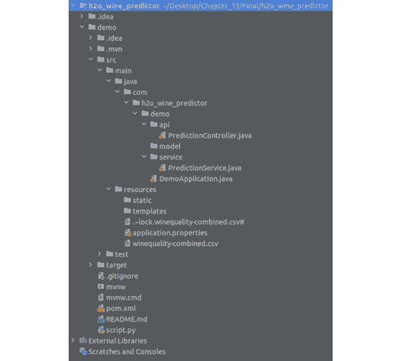

# 使用 H2O AutoML 与其他技术

在前几章中，我们一直在探讨如何在生产环境中使用 H2O AutoML。我们看到了如何使用 H2O 模型作为 POJOs 和 MOJOs 作为可移植对象来进行预测。然而，在实际的生产环境中，您通常会使用多种技术来满足各种技术要求。这些技术的协作在您系统的无缝功能中起着重要作用。

因此，了解我们如何将 H2O 模型与其他在机器学习领域中常用的技术协作使用非常重要。在本章中，我们将探索和实现 H2O 与这些技术中的一些，并查看我们如何构建可以协同工作以提供协作优势的系统。

首先，我们将研究如何使用 **Spring Boot** 应用程序将 H2O 预测服务托管为网络服务。然后，我们将探讨如何使用 H2O 和 **Apache Storm** 进行实时预测。

本章将涵盖以下主题：

+   使用 H2O AutoML 和 Spring Boot

+   使用 H2O AutoML 和 Apache Storm

到本章结束时，您应该对如何使用使用 H2O AutoML 训练的模型与不同技术结合，在不同场景中进行预测有更好的理解。

# 技术要求

对于本章，您需要以下内容：

+   您首选的网页浏览器的最新版本。

+   您选择的 **集成开发环境**（**IDE**）。

+   本章中进行的所有实验都是在 Ubuntu Linux 系统上的 IntelliJ IDE 中完成的。您可以使用相同的设置跟随操作，或者使用您熟悉的 IDE 和操作系统执行相同的实验。

本章的所有代码示例都可以在 GitHub 上找到，网址为 [`github.com/PacktPublishing/Practical-Automated-Machine-Learning-on-H2O/tree/main/Chapter%2013`](https://github.com/PacktPublishing/Practical-Automated-Machine-Learning-on-H2O/tree/main/Chapter%2013)。

让我们直接进入第一部分，我们将学习如何将使用 H2O AutoML 训练的模型托管在 Spring Boot 创建的 Web 应用程序上。

# 使用 H2O AutoML 和 Spring Boot

在当今时代，大多数创建的软件服务都托管在互联网上，它们可以通过托管在 Web 服务器上的 Web 应用程序对所有互联网用户开放。所有这些都是在使用 Web 应用程序完成的。即使是使用机器学习的预测服务也可以通过托管在 Web 应用程序上向公众提供。

**Spring 框架**是最常用的开源 Web 应用框架之一，用于创建网站和 Web 应用。它基于 Java 平台，因此可以在任何具有 JVM 的系统上运行。**Spring Boot**是 Spring 框架的扩展，它提供了预配置的 Web 应用设置。这有助于你快速设置 Web 应用，无需实现配置和托管 Web 服务所需的底层管道。

因此，让我们通过理解问题陈述来深入了解实现。

## 理解问题陈述

假设你正在为一家葡萄酒制造公司工作。官员们有一个要求，他们希望自动化计算葡萄酒品质及其颜色的过程。该服务应作为一个 Web 服务提供，质量保证主管可以提供一些关于葡萄酒特性的信息，该服务使用这些细节和底层 ML 模型来预测葡萄酒的品质及其颜色。

因此，从技术上讲，我们需要两个模型来完成完整的预测。一个将是预测葡萄酒品质的回归模型，另一个将是预测葡萄酒颜色的分类模型。

我们可以使用红葡萄酒品质和白葡萄酒品质数据集的组合，并在其上运行 H2O AutoML 来训练模型。你可以在 https://archive.ics.uci.edu/ml/datasets/Wine+Quality 找到数据集。组合数据集已存在于[`github.com/PacktPublishing/Practical-Automated-Machine-Learning-on-H2O/tree/main/Chapter%2013/h2o_spring_boot/h2o_spring_boot`](https://github.com/PacktPublishing/Practical-Automated-Machine-Learning-on-H2O/tree/main/Chapter%2013/h2o_spring_boot/h2o_spring_boot)。

下面的截图显示了数据集的一个样本：


图 13.1 – 葡萄酒品质和颜色数据集

此数据集包含以下特征：

+   **固定酸度**：这个特征解释了非挥发性酸度的量，意味着它不会在特定时间内蒸发。

+   **挥发性酸度**：这个特征解释了挥发性酸度的量，意味着它会在特定时间内蒸发。

+   **柠檬酸**：这个特征解释了葡萄酒中柠檬酸的量。

+   **残留糖分**：这个特征解释了葡萄酒中残留糖分的量。

+   **氯化物**：这个特征解释了葡萄酒中氯化物的数量。

+   **游离二氧化硫**：这个特征解释了葡萄酒中游离二氧化硫的量。

+   **总二氧化硫**：这个特征解释了葡萄酒中总二氧化硫的量。

+   **密度**：这个特征解释了葡萄酒的密度。

+   **pH 值**：这个特征解释了葡萄酒的 pH 值，其中 0 是最酸性的，14 是最碱性的。

+   **硫酸盐**: 此功能解释了葡萄酒中存在的硫酸盐数量。

+   **酒精**: 此功能解释了葡萄酒中存在的酒精含量。

+   **质量**: 这是响应列，记录了葡萄酒的质量。0 表示葡萄酒非常差，而 10 表示葡萄酒非常好。

+   **颜色**: 此功能代表葡萄酒的颜色。

现在我们已经理解了问题陈述和我们将要处理的数据集，让我们设计架构以展示这个网络服务的工作方式。

## 设计架构

在我们深入服务实施之前，让我们看看所有技术应该如何协同工作的整体架构。以下是我们葡萄酒质量和颜色预测网络服务的架构图：


图 13.2 – 葡萄酒质量和颜色预测网络服务的架构

让我们了解这个架构的各个组成部分：

+   **客户端**: 这是指使用应用程序的人——在这种情况下，是葡萄酒质量保证执行者。客户端通过向其发送 POST 请求并与网络应用程序通信，传递葡萄酒的属性，并获取葡萄酒的质量和颜色作为预测响应。

+   **Spring Boot 应用程序**: 这是运行在网络服务器上的网络应用程序，负责执行计算过程。在我们的场景中，这是将接受客户端 POST 请求的应用程序，将数据输入到模型中，获取预测结果，并将结果作为响应发送回客户端。

+   **Tomcat Web 服务器**: 网络服务器仅仅是处理互联网上 HTTP 通信的软件和硬件。在我们的场景中，我们将使用 Apache Tomcat 网络服务器。Apache Tomcat 是一个用 Java 编写的免费开源 HTTP 网络服务器。网络服务器负责将客户端请求转发到网络应用程序。

+   使用`h2o-genmodel`库进行预测。

+   **H2O 服务器**: 将使用 H2O 服务器来训练模型。正如我们在*第一章*中看到的，*理解 H2O AutoML 基础知识*，我们可以在 H2O 服务器上运行 H2O AutoML。我们将通过启动 H2O 服务器，使用 H2O AutoML 训练模型，然后下载训练好的模型作为 POJOs，以便我们可以将它们加载到 Spring Boot 应用程序中。

+   **数据集**: 这是用于训练我们的模型的葡萄酒质量数据集。如前所述，此数据集是红葡萄酒质量和白葡萄酒质量数据集的组合。

现在我们已经很好地理解了我们将如何创建我们的葡萄酒质量和颜色预测网络服务，让我们继续到其实施部分。

## 在实施工作中

此服务已经构建完成，可在 GitHub 上找到。代码库可以在 [`github.com/PacktPublishing/Practical-Automated-Machine-Learning-on-H2O/tree/main/Chapter%2013/h2o_spring_boot`](https://github.com/PacktPublishing/Practical-Automated-Machine-Learning-on-H2O/tree/main/Chapter%2013/h2o_spring_boot) 找到。

在我们深入代码之前，请确保您的系统满足以下最低要求：

+   Java 版本 8 及以上

+   Maven 的最新版本，最好是 3.8.6 版本

+   Python 版本 3.7 及以上

+   使用 pip3 安装的 H2O Python 库

+   系统上已安装的 Git

首先，我们将克隆 GitHub 仓库，在我们的首选 IDE 中打开它，并查看文件以了解整个过程。以下步骤已在 *Ubuntu 22.04 LTS* 上执行，我们使用 **IntelliJ IDEA** *版本 2022.1.4* 作为 IDE。请随意使用任何支持 Maven 和 Spring 框架的 IDE 以获得更好的支持。

因此，克隆 GitHub 仓库并导航到 `Chapter 13/h2o_spring_boot/`。然后，你启动你的 IDE 并打开项目。一旦你打开了项目，你应该得到一个类似于以下目录结构的结构：



图 13.3 – h2o_wine_predictor 的目录结构

目录结构包括以下重要文件：

+   `pom.xml`: **项目对象模型**（**POM**）是 Maven 构建自动化工具的基本单元。它是一个包含所有所需依赖项信息以及正确构建应用程序所需配置的 XML 文件。

+   `script.py`: 这是我们将用于在葡萄酒质量数据集上训练模型的 Python 脚本。该脚本启动 H2O 服务器实例，导入数据集，然后运行 AutoML 来训练模型。我们将在稍后更详细地查看它。

+   `src/main/java/com.h2o_wine_predictor.demo/api/PredictionController.java`: 这是一个控制器文件，它具有将 POST 请求映射到执行映射函数的请求映射。该函数最终调用实际的业务逻辑，在 ML 模型中进行预测，并将响应发送回去。

+   `src/main/java/com.h2o_wine_predictor.demo/service/PredictionService.java`: 这是实际存放预测业务逻辑的文件。这个函数导入 POJO 模型和 h2o-genmodel 库，并使用它们来预测从控制器接收到的数据。

+   `src/main/java/com.h2o_wine_predictor.demo/Demo`: 这是 Spring Boot 应用程序的主函数。如果你想启动 Spring Boot 应用程序，你必须执行这个主函数，它会启动 Apache Tomcat 服务器，该服务器承载着网络应用程序。

+   `src/main/resources/winequality-combined.csv`: 这是实际 CSV 数据集存储的地方。训练 H2O 模型的 Python 脚本从这个路径选择数据集并开始训练模型。

你可能已经注意到，我们在这个目录中没有找到任何模型 POJO 文件。所以，让我们构建这些文件。参考 `script.py` Python 文件，让我们逐行了解正在做什么。

`script.py` 的代码如下：

1.  脚本首先导入依赖项：

    ```py
    import h2o
    import shutil
    from h2o.automl import H2OautoML
    ```

1.  导入完成后，脚本初始化 H2O 服务器：

    ```py
    h2o.init()
    ```

1.  一旦 H2O 服务器启动并运行，脚本将从 `src/main/resources` 目录导入数据集：

    ```py
    wine_quality_dataframe = h2o.import_file(path = "sec/main/resources/winequality_combined.csv")
    ```

1.  由于列颜色是分类的，脚本将其设置为 `factor`：

    ```py
    wine_quality_dataframe["color"] = wine_quality_dataframe["color"].asfactor()
    ```

1.  最后，你将需要一个用于训练和验证的 DataFrame，以便在训练过程中训练和验证你的模型。因此，脚本还将 DataFrame 分割成 70/30 的比例：

    ```py
    train, valid = wine_quality_dataframe.split_frame(ratios=[.7])
    ```

1.  现在数据框已经准备好了，我们可以开始训练第一个模型，这是一个用于分类葡萄酒颜色的分类模型。因此，脚本设置了标签和特征，如下所示：

    ```py
    label = "color"
    features = ["fixed acidity", "volatile acidity", "citric acid", "residual sugar", "chlorides", "free sulfur dioxide", "total sulfur dioxide", "density", "pH", "sulphates", "alcohol"]
    ```

1.  现在训练数据已经准备好了，我们可以创建 H2O AutoML 对象并开始模型训练。以下脚本执行此操作：

    ```py
    aml_for_color_predictor = H2OAutoML(max_models=10, seed=123, exclude_algos=["StackedEnsemble"], max_runtime_secs=300)
    aml_for_color_predictor.train(x = features, y = label, training_frame=train, validation_frame = valid)
    ```

当初始化 `H2OautoML` 对象时，我们使用 `StackedEnsemble` 值设置 `exclude_algos` 参数。这样做是因为堆叠集成模型不支持 POJO，正如我们在 *第十章*，*与普通旧 Java 对象 (POJOs) 一起工作* 中所学到的。

这启动了 AutoML 模型训练过程。一些 `print` 语句将帮助你观察模型训练过程的进度和结果。

1.  模型训练过程完成后，脚本将检索主模型并将其作为具有正确名称的 POJO（即 `WineColorPredictor`）下载，并将其放置在 `tmp` 目录中：

    ```py
    model = aml_for_color_predictor.leader
    model.model_id = "WineColorPredictor"
    print(model)
    model.download_pojo(path="tmp")
    ```

1.  接下来，脚本将对下一个模型（即回归模型）做同样的事情，以预测葡萄酒的质量。它稍微调整了标签并将其设置为 `quality`。其余步骤相同：

    ```py
    label="quality"
    aml_for_quality_predictor = H2OAutoML(max_models=10, seed=123, exclude_algos=["StackedEnsemble"], max_runtime_secs=300)
    aml_for_quality_predictor.train(x = features, y = label, training_frame=train, validation_frame = valid)
    ```

1.  训练完成后，脚本将提取主模型，将其命名为 `WineQualityPredictor`，并将其作为 POJO 下载到 `tmp` 目录中：

    ```py
    model = aml_for_color_predictor.leader
    model.model_id = "WineQualityPredictor"
    print(model)
    model.download_pojo(path="tmp")
    ```

1.  现在我们已经下载了两个模型 POJO，我们需要将它们移动到 `src/main/java/com.h2o_wine_predictor.demo/model/` 目录。但在我们这样做之前，我们还需要将 POJO 添加到 `com.h2o.wine_predictor.demo` 包中，以便 `PredictionService.java` 文件可以导入模型。因此，脚本通过创建一个新文件，将包包含指令行添加到文件中，附加原始 POJO 文件的其余部分，并将文件保存在 `src/main/java/com.h2o_wine_predictor.demo/model/` 目录中来实现这一点：

    ```py
    with open("tmp/WineColorPredictor.java", "r") as raw_model_POJO:
         with open("src/main/java/com.h2o_wine_predictor.demo/model/ WineColorPredictor.java", "w") as model_POJO:
               model_POJO.write(f'package com.h2o_wine_predictor.demo;\n' + raw_model_POJO.read())
    ```

1.  它对 `WineQualityPredictor` 模型也做了同样的事情：

    ```py
    with open("tmp/WineQualityPredictor.java", "r") as raw_model_POJO:
         with open("src/main/java/com.h2o_wine_predictor.demo/model/ WineQualityPredictor.java", "w") as model_POJO:
               model_POJO.write(f'package com.h2o_wine_predictor.demo;\n' + raw_model_POJO.read())
    ```

1.  最后，它删除 `tmp` 目录以清理所有内容：

    ```py
    shutil.rmtree("tmp")
    ```

因此，让我们运行这个脚本并生成我们的模型。你可以在你的终端中执行以下命令来做到这一点：

```py
python3 script.py
```

这应该在 `src/main/java/com.h2o_wine_predictor.demo/model/` 目录中生成相应的模型 POJO 文件。

现在，让我们观察位于 `src/main/java/com.h2o_wine_predictor.demo/service` 目录下的 `PredictionService` 文件。

`PredictionService` 文件中的 `PredictionService` 类具有以下属性：

+   `wineColorPredictorModel`: 这是一个 `EasyPredictModelWrapper` 类型的属性。它是由 `PredictionService` 文件导入的 h2o-genmodel 库中的类。我们使用此属性来加载我们刚刚使用 `script.py` 生成的 `WineColorPredictor` 模型。我们将使用此属性来对后续的请求进行预测。

+   `wineQualityPredictorModel`: 与 `wineColorPredictorModel` 类似，这是使用相同 `EasyPredictModelWrapper` 的葡萄酒质量等效属性。此属性将用于加载 `WineQualityPredictor` 模型，并使用它来预测葡萄酒的质量。

现在我们已经了解了这个文件的属性，让我们来看看方法，具体如下：

+   `createJsonResponse()`: 这个函数在意义上相当直接，它从 `WineColorPredictor` 模型的二项分类预测结果和 `WineQualityPredictor` 模型的回归预测结果中获取，并将它们合并成一个 JSON 响应，该响应由网络应用程序发送回客户端。

+   `predictColor()`: 这个函数使用 `PredictionService` 类的 `wineColorPredictorModel` 属性对数据进行预测。它以 `BinomialModelPrediction` 对象的形式输出葡萄酒颜色的预测结果，这是 h2o-genmodel 库的一部分。

+   `predictQuality()`: 这个函数使用 `PredictionService` 类的 `wineQualityPredictorModel` 属性对数据进行预测。它以 `RegressionModelPrediction` 对象的形式输出葡萄酒质量的预测结果，这是 h2o-genmodel 库的一部分。

+   `fillRowDataFromHttpRequest()`: 这个函数负责将来自 POST 请求的特征值转换为 `RowData` 对象，该对象将被传递给 `wineQualityPredictorModel` 和 `wineColorPredictorModel` 以进行预测。`RowData` 是 h2o-genmodel 库中的一个对象。

+   `getPrediction()`: 这个函数由 `PredictionController` 调用，它将特征值作为映射传递以进行预测。此函数内部调用所有之前提到的函数，并协调整个预测过程：

1.  它从 POST 请求中获取特征值作为输入。它将这些值（以 `Map` 对象的形式）传递给 `fillRowDataFromHttpRequest()`，该函数将它们转换为 `RowData` 类型。

1.  然后，它将此 `RowData` 传递给 `predictColor()` 和 `predictQuality()` 函数以获取预测值。

1.  然后，它将这些结果传递给 `createJsonResponse()` 函数，以创建包含预测值的适当 JSON 响应，并将 JSON 返回给 `PredictionController`，控制器将其返回给客户端。

现在我们已经有机会了解整个项目的重要部分，让我们继续运行应用程序，以便我们可以在本地机器上运行 Web 服务。然后，我们将使用葡萄酒质量特征值运行一个简单的 `cURL` 命令，看看我们是否得到响应。

要启动应用程序，你可以执行以下操作：

+   如果你使用 IntelliJ IDE，则可以直接点击 IDE 右上角的绿色播放按钮。

+   或者，你可以在项目目录中直接运行它，该目录包含 `pom.xml` 文件，并执行以下命令：

    ```py
    mvn spring-boot:run -e
    ```

如果一切正常，你应该得到以下类似的输出：


图 13.4 – 成功的 Spring Boot 应用程序运行输出

现在，Spring Boot 应用程序正在运行，剩下的事情就是通过向运行在 `localhost:8082` 的 Web 服务发出 POST 请求调用来测试它。

打开另一个终端，并执行以下 `curl` 命令以发出预测请求：

```py
curl -X POST localhost:8082/api/v1/predict -H "Content-Type: application/json" -d '{"fixed acidity":6.8,"volatile acidity":0.18,"citric acid":0.37,"residual sugar":1.6,"chlorides":0.055,"free sulfur dioxide":47,"total sulfur dioxide":154,"density":0.9934,"pH":3.08," ,"sulphates":0.45,"alcohol":9.1}'
```

请求应发送到 Web 应用程序，应用程序将提取特征值，将它们转换为 `RowData` 对象类型，将 `RowData` 传递给预测函数，获取预测结果，将预测结果转换为适当的 `JSON`，并将 `JSON` 作为响应返回。这应该看起来如下所示：


图 13.5 – Spring Boot 网络应用程序的预测结果

从 JSON 响应中，你可以看到预测的葡萄酒颜色是 `white`，其质量是 `5.32`。

恭喜！你已经在 Spring Boot 网络应用程序上实现了一个机器学习预测服务。你可以通过添加一个前端来进一步扩展此服务，该前端接受特征值作为输入，并添加一个按钮，点击该按钮将创建所有这些值的 POST 主体，并将 API 请求发送到后端。请随意实验这个项目，因为你可以有很多方法在 Web 服务中使用 H2O 模型 POJO。

在下一节中，我们将学习如何使用 H2O AutoML 和另一个有趣的技术 Apache Storm 进行实时预测。

# 使用 H2O AutoML 和 Apache Storm

**Apache Storm** 是一个开源的数据分析和计算工具，用于实时处理大量流数据。在现实世界中，你经常会遇到许多系统持续生成大量数据。你可能需要对这些数据进行一些计算或运行一些过程，以便在实时生成时提取有用信息。

## Apache Storm 是什么？

让我们以一个在非常繁忙的 Web 服务中使用的 **日志系统** 为例。假设这个 Web 服务每秒接收数百万个请求，它将生成大量的日志。您已经有一个系统来存储这些日志到您的数据库中。现在，这些日志数据最终会堆积起来，您将在数据库中存储数以 PB 计的日志数据。一次性查询所有这些历史数据来处理它将非常慢且耗时。

您可以做到的是在数据生成时处理数据。这正是 Apache Storm 发挥作用的地方。您可以将您的 Apache Storm 应用程序配置为执行所需的处理，并将您的日志数据引导通过它，然后存储到您的数据库中。这将简化处理过程，使其成为实时处理。

Apache Storm 可用于多种用例，例如实时分析、数据管道中的 **提取-转换-加载**（**ETL**）数据，甚至机器学习（ML）。使 Apache Storm 成为实时处理首选解决方案的原因在于它的速度之快。Apache 基金会进行的一项基准测试发现，Apache Storm 每个节点每秒可以处理大约一百万个元组。Apache Storm 还非常可扩展和容错，这保证了它将处理所有传入的实时数据。

因此，让我们深入探讨 Apache Storm 的架构，以了解它是如何工作的。

### 理解 Apache Storm 的架构

Apache Storm 使用集群计算，类似于 **Hadoop** 和 H2O 的工作方式。考虑以下 Apache Storm 的架构图：


图 13.6 – Apache Storm 架构

Apache Storm 将其集群中的节点分为两类 – 主节点和工节点。这些节点的特性如下：

+   **主节点**：主节点运行一个名为 **Nimbus** 的特殊守护进程。Nimbus 守护进程负责在集群中的所有工节点之间分配数据。它还监控故障，并在检测到故障后重新发送数据到其他节点，确保没有数据被遗漏处理。

+   **工节点**：工节点运行一个名为 **Supervisor** 的守护进程。Supervisor 守护进程是始终监听工作并根据计算需要启动或停止底层进程的服务。

主节点和工节点之间使用各自的守护进程进行通信，这是通过 **Zookeeper 集群** 实现的。简而言之，Zookeeper 集群是一个集中式服务，为无状态组维护配置和同步服务。在这种情况下，主节点和工节点是无状态且快速失败的服务。所有状态细节都存储在 Zookeeper 集群中。这很有益，因为保持节点无状态有助于容错，因为节点可以被恢复并开始工作，就像什么都没发生过一样。

小贴士

如果你感兴趣，想了解 Zookeeper 的各种概念和技术细节，那么请自由地在其官网[`zookeeper.apache.org/`](https://zookeeper.apache.org/)上详细探索。

在我们继续 Apache Storm 的实现部分之前，我们需要了解某些重要概念，这些概念对于理解 Apache Storm 的工作方式至关重要。不同的概念如下：

+   **元组（Tuples）**：Apache Storm 使用一个称为元组的数据模型作为其要处理的主要数据单元。它是一个命名值列表，可以是任何类型的对象。Apache Storm 支持所有原始数据类型。但它也可以支持自定义对象，这些对象可以被反序列化为原始类型。

+   **流（Streams）**：流是无界元组的序列。流表示你的数据从一处流向下一处转换的路径。Apache Storm 提供的基本原语用于执行这些转换是喷泉和螺栓：

    +   **喷泉（Spouts）**：喷泉是流的来源。它是流的起点，从这里读取来自外部世界的数据。它从外部世界获取这些数据并将其发送到螺栓。

    +   **螺栓（Bolt）**：螺栓是一个从单个或多个流中消耗数据、对其进行转换或处理，然后输出结果的过程。你可以在连续的流中链接多个螺栓，将一个螺栓的输出作为下一个螺栓的输入，以执行复杂的处理。螺栓可以运行函数、过滤数据、执行聚合，甚至可以将数据存储在数据库中。你可以在螺栓上执行任何你想要的功能。

+   **拓扑（Topologies）**：使用流、喷泉和螺栓以**有向无环图（DAG**）的形式实时处理数据的整个编排过程称为**拓扑**。你需要使用 Apache Storm 的主函数将此拓扑提交给 Nimbus 守护进程。拓扑图包含节点和边，就像常规的图结构一样。每个节点包含处理逻辑，每条边显示数据如何在两个节点之间传输。Nimbus 和拓扑都是**Apache Thrift**结构，这是一种特殊的类型系统，允许程序员在任何编程语言中使用本地类型。

**提示**

你可以通过访问[`thrift.apache.org/docs/types`](https://thrift.apache.org/docs/types)来了解更多关于 Apache Thrift 的信息。

现在你已经更好地理解了 Apache Storm 是什么以及其实施中涉及的各种概念，我们可以继续本节的实现部分，从安装 Apache Storm 开始。

**提示**

Apache Storm 是一个非常强大且复杂的系统。它不仅在机器学习之外有广泛的应用，而且还有许多特性和支持。如果你想了解更多关于 Apache Storm 的信息，请访问[`storm.apache.org/`](https://storm.apache.org/)。

### 安装 Apache Storm

让我们先记下安装 Apache Storm 的基本要求。它们如下：

+   Java 版本大于 Java 8

+   最新的 Maven 版本，最好是 3.8.6 版

因此，请确保这些基本要求已经安装到您的系统上。现在，让我们先下载 Apache Storm 仓库。您可以在 [`github.com/apache/storm`](https://github.com/apache/storm) 找到该仓库。

因此，执行以下命令以将存储库克隆到您的系统：

```py
git clone https://github.com/apache/storm.git
```

下载完成后，您可以打开 `storm` 文件夹，一窥其内容。您会注意到有很多文件，所以在试图弄清楚从哪里开始时可能会感到不知所措。别担心——我们将通过非常简单的示例来工作，这些示例应该足以让您对 Apache Storm 的工作方式有一个基本的了解。然后，您可以从那里分支出去，以更好地了解 Apache Storm 提供的内容。

现在，打开您的终端并导航到克隆的仓库。在您开始实现任何 Apache Storm 功能之前，您需要本地构建 Apache Storm 本身。您需要这样做，因为本地构建 Apache Storm 会生成重要的 JAR 文件，这些文件将被安装到您的 `$HOME/.m2/repository` 文件夹中。这是 Maven 在构建您的 Apache Storm 应用程序时将检索 JAR 依赖项的文件夹。

因此，在仓库根目录下执行以下命令以本地构建 Apache Storm：

```py
mvn clean install -DskipTests=true
```

构建可能需要一些时间，因为 Maven 将构建几个对您的应用程序重要的 JAR 文件。所以，当这个过程中发生时，让我们了解我们将要工作的问题描述。

## 理解问题描述

假设您在一家医疗公司工作。医疗官员有一个要求，他们希望创建一个系统，预测一个人在心脏病发作后是否可能遭受任何并发症，或者他们是否可以安全出院。难点在于这个预测服务将用于全国的所有医院，他们需要立即的预测结果，以便医生可以决定是否将患者留院观察几天以监测他们的健康状况，或者决定让他们出院。

因此，机器学习问题在于将会有数据流进入我们的系统，系统需要立即做出预测。我们可以设置一个 Apache Storm 应用程序，将所有数据流输入到预测服务中，并部署使用 H2O AutoML 训练的模型 POJO 来进行预测。

我们可以在心脏衰竭临床数据集上训练模型，该数据集可在 [`archive.ics.uci.edu/ml/datasets/Heart+failure+clinical+records`](https://archive.ics.uci.edu/ml/datasets/Heart+failure+clinical+records) 找到。

以下截图显示了数据集的一些示例内容：


图 13.7 – 心脏衰竭临床数据集

此数据集包含以下特征：

+   **年龄**：此功能表示患者的年龄，单位为年

+   `1` 表示是，`0` 表示否

+   `1` 表示是，`0` 表示否

+   **肌酸激酶**：此功能表示血液中 CPK 酶的水平，单位为每升**微克**（**mcg/L**）

+   `1` 表示是，`0` 表示否

+   **射血分数**：此功能表示每次收缩时心脏排出的血液百分比

+   **血小板**：此功能表示血液中的血小板，单位为每毫升**千血小板**（**ml**）

+   `1` 表示患者为女性，`0` 表示患者为男性

+   **血清肌酐**：此功能表示血液中血清肌酐的水平，单位为每毫升**毫克**（**mg/dL**）

+   **血清钠**：此功能表示血液中血清钠的水平，单位为每升**毫当量**（**mEq/L**）

+   `1` 表示是，`0` 表示否

+   **时间**：此功能表示随访天数

+   `1` 表示是，`0` 表示否

现在我们已经了解了问题陈述以及我们将要处理的数据集，让我们设计如何使用 Apache Storm 和 H2O AutoML 解决这个问题的架构。

## 设计架构

让我们看看所有技术如何协同工作的整体架构。参考以下心脏衰竭并发症预测服务架构图：


图 13.8 – 使用 H2O AutoML 与 Apache Storm 的架构图

让我们了解架构的各个组成部分：

+   `script.py`：从架构角度来看，解决方案相当简单。首先，我们使用 H2O AutoML 训练模型，这可以通过使用此脚本轻松完成，该脚本导入数据集，设置标签和特征，并运行 AutoML。然后可以提取领先模型作为 POJO，我们可以在 Apache Storm 中使用它进行预测。

+   **数据喷泉**：在 Apache Storm 中，我们将有一个喷泉，它将不断读取数据并将其实时传递给**预测螺栓**。

+   **预测螺栓**：此螺栓包含预测服务，它导入训练好的模型 POJO 并使用它进行预测。

+   **分类螺栓**：预测螺栓的结果传递给此螺栓。此螺栓根据预测螺栓的二分类结果将结果分类为潜在并发症和无并发症。

现在我们已经设计了一个简单且良好的解决方案，让我们继续其实现。

## 在实现上工作

此服务已在 GitHub 上提供。代码库可以在[`github.com/PacktPublishing/Practical-Automated-Machine-Learning-on-H2O/tree/main/Chapter%2013/h2o_apache_storm/h2o_storm`](https://github.com/PacktPublishing/Practical-Automated-Machine-Learning-on-H2O/tree/main/Chapter%2013/h2o_apache_storm/h2o_storm)找到。

因此，下载仓库并导航到`/Chapter 13/h2o_apache_storm/h2o_storm/`。

你会看到我们有两个文件夹。一个是`storm-starter`目录，另一个是`storm-streaming`目录。让我们首先关注`storm-streaming`目录。启动你的 IDE 并打开`storm-streaming`项目。一旦打开项目，你应该会看到一个类似于以下目录结构：


图 13.9 – storm_streaming 目录结构

此目录结构包含以下重要文件：

+   `scripty.py`：这是我们将在心脏衰竭并发症数据集上训练模型的 Python 脚本。脚本启动 H2O 服务器实例，导入数据集，然后运行 AutoML 来训练模型。我们将在稍后详细探讨这一点。

+   `H2ODataSpout.java`：这是一个 Java 文件，其中包含 Apache Storm spout 及其功能。它从`live_data.csv`文件中读取数据，并将单个观测值逐个转发到 bolt，模拟数据的实时流动。

+   `H2OStormStarter.java`：这是一个 Java 文件，其中包含 Apache Storm 拓扑以及两个 bolt 类 – 预测 bolt 和分类 bolt。我们将使用此文件启动我们的 Apache Storm 服务。

+   `training_data.csv`：这是我们用来训练模型的包含部分心脏衰竭并发症数据的数据集。

+   `live_data.csv`：这是我们用来模拟 Apache Storm 应用程序实时数据流入的心脏衰竭并发症数据集。

与之前在单独的应用程序仓库中做更改的实验不同，对于这次实验，我们将在 Apache Storm 的仓库中做更改。

以下步骤已在*Ubuntu 22.04 LTS*上执行；*IntelliJ IDEA 版本 2022.1.4*已被用作 IDE。请随意使用任何支持 Maven 框架的 IDE，以获得更好的支持。

让我们先了解模型训练脚本`script.py`。`script.py`的代码如下：

1.  首先，脚本导入依赖项：

    ```py
    import h2o
    from h2o.automl import H2OautoML
    ```

1.  导入完成后，H2O 服务器被初始化：

    ```py
    h2o.init()
    ```

1.  一旦 H2O 服务器启动并运行，脚本将导入`training_data.csv`文件：

    ```py
    wine_quality_dataframe = h2o.import_file(path = "training_data.csv")
    ```

1.  现在 DataFrame 已经导入，我们可以开始使用 AutoML 对模型进行训练过程。因此，脚本设置了标签和特征，如下所示：

    ```py
    label = "complications"
    features = ["age", "anemia", "creatinine_phosphokinase", "diabetes", "ejection_fraction", "high_blood_pressure", "platelets", "serum_creatinine ", "serum_sodium", "sex", "smoking", "time"]
    ```

1.  现在，我们可以创建 H2O AutoML 对象并开始模型训练：

    ```py
    aml_for_complications = H2OAutoML(max_models=10, seed=123, exclude_algos=["StackedEnsemble"], max_runtime_secs=300)
    aml_for_complications.train(x = features, y = label, training_frame = wine_quality_dataframe )
    ```

由于 POJO 不支持堆叠集成模型，我们使用`StackedEnsemble`值设置`exclude_algos`参数。

这启动了 AutoML 模型训练过程。这里有一些`print`语句，它们将帮助您观察模型训练过程的进度和结果。

1.  一旦模型训练过程完成，脚本检索主模型，并以正确的名称（即`HeartFailureComplications`）将其作为 POJO 下载，并将其放置在`tmp`目录中：

    ```py
    model = aml_for_color_predictor.leader
    model.model_id = "HeartFailureComplications"
    print(model)
    model.download_pojo(path="tmp")
    ```

因此，让我们运行这个脚本并生成我们的模型。在您的终端中执行以下命令：

```py
python3 script.py
```

这应该在`tmp`目录中生成相应的模型 POJO 文件。

现在，让我们调查仓库中的下一个文件：`H2ODataSpout.java`。Java 文件中的`H2ODataSpout`类有几个属性和函数，对于构建 Apache Storm 应用程序非常重要。我们不会过多关注它们，但让我们看看在应用程序的业务逻辑中扮演更大角色的函数。它们如下：

+   `nextTuple()`: 这个函数包含从`live_data.csv`文件读取数据的逻辑，并将数据行行地发送到 Prediction Bolt。让我们快速看一下代码：

    1.  首先，你有睡眠计时器。众所周知，Apache Storm 是一个超级快速的现实数据处理系统。观察我们的实时数据通过系统对我们来说将是困难的，所以`sleep`函数确保有 1,000 毫秒的延迟，这样我们就可以轻松观察数据的流动并看到结果：

    ```py
    Util.sleep(1000)
    ```

1.  然后该函数将`live_data.csv`文件实例化到程序中：

```py
File file = new File("live_data.csv")
```

1.  然后代码声明了`observation`变量。这仅仅是将被读取并存储在这个变量中的单个行数据，由 spout 读取：

```py
String[] observation = null;
```

1.  然后，我们有逻辑，其中 spout 程序读取数据中的行。读取哪一行是由`_cnt`原子整数决定的，它在 spout 读取并将行发送到 Prediction Bolt 的无限循环中时递增。这个无限循环模拟了数据的连续流动，尽管`live_data.csv`只包含有限的数据：

```py
try {
      String line="";
      BufferedReader br = new BufferedReader(new FileReader(file));
      while (i++<=_cnt.get()) line = br.readLine(); // stream thru to next line
      observation = line.split(",");
    } catch (Exception e) {
      e.printStackTrace();
      _cnt.set(0);
    }
```

1.  然后，我们有原子数递增，以便下一次迭代可以获取数据中的下一行：

```py
_cnt.getAndIncrement();
if (_cnt.get() == 1000) _cnt.set(0);
```

1.  最后，我们有`_collector.emit()`函数，它发出行数据，以便将其存储在`_collector`中，然后`_collector`被 Prediction Bolt 消费：

```py
_collector.emit(new Values(observation));
```

+   `declareOutputFields()`: 在这个方法中，我们声明了我们的数据头。我们可以使用训练好的 AutoML 模型 POJO 的`NAMES`属性来提取和使用这些头：

    ```py
    LinkedList<String> fields_list = new LinkedList<String>(Arrays.asList(ComplicationPredictorModel.NAMES));
    fields_list.add(0,"complication");
    String[] fields = fields_list.toArray(new String[fields_list.size()]);
    declarer.declare(new Fields(fields));
    ```

+   *其他杂项函数*：剩余的`open()`、`close()`、`ack()`、`fail()`和`getComponentConfiguration()`函数是用于错误处理和预处理或后处理活动的辅助函数。为了使这个实验简单，我们不会过多地探讨它们。

接下来，让我们调查`H2OStormStarter.java`文件。此文件包含执行预测和分类所需的两个 bolt，以及构建 Apache Storm 拓扑并将其传递给 Apache Storm 集群的`h2o_storm()`函数。让我们深入了解各个属性：

+   `class PredictionBolt`：这是一个`Bolt`类，负责获取心脏衰竭并发症数据集的类别概率。它导入 H2O 模型 POJO 并使用它来计算传入行数据的类别概率。它有三个函数 – `prepare()`、`execute()`和`declareOutputFields()`。我们只关注`execute`函数，因为它包含 bolt 的执行逻辑；其余的都是辅助函数。`execute`函数包含以下代码：

    1.  此函数首先执行的操作是导入 H2O 模型 POJO：

    ```py
    HeartFailureComplications h2oModel = new HeartFailureComplications();
    ```

1.  然后，它从其参数变量中提取输入元组值并将它们存储在`raw_data`变量中：

```py
ArrayList<String> stringData = new ArrayList<String>();
for (Object tuple_value : tuple.getValues()) stringData.add((String) tuple_value);
String[] rawData = stringData.toArray(new String[stringData.size()]);
```

1.  接下来，代码将行中的所有分类数据分类映射：

```py
double data[] = new double[rawData.length-1]; 
String[] columnName = tuple.getFields().toList().toArray(new String[tuple.size()]);
for (int I = 1; i < rawData.length; ++i) {
   data[i-1] = h2oModel.getDomainValues(columnName[i]) == null
             ? Double.valueOf(rawData[i])
            : h2oModel.mapEnum(h2oModel.getColIdx(columnName[i]), rawData[i]);
}
```

1.  然后，代码获取预测并发出结果：

```py
double[] predictions = new double [h2oModel.nclasses()+1];
h2oModel.score0(data, predictions);
_collector.emit(tuple, new Values(rawData[0], predictions[1]));
```

1.  最后，代码确认了元组，以便 spout 知道其消费情况，不会为重试重新发送元组：

```py
_collector.ack(tuple);
```

+   `Bolt`类也有一些辅助函数，以及主要的`execute()`函数。让我们深入了解这个函数，以了解函数中发生了什么：

    +   函数简单地根据`_threshold`值计算是否存在*可能的并发症*或*无并发症*的可能性，并将结果发送回去：

        ```py
        _collector.emit(tuple, new Values(expected, complicationProb <= _threshold ? "No Complication" : "Possible Complication"));
        _collector.ack(tuple);
        ```

+   `h2o_storm()`：这是应用程序的主要函数，使用`H2ODataSpout`和两个 bolt（预测 bolt 和分类 bolt）构建拓扑。让我们深入了解其功能。

    1.  首先，函数实例化`TopologyBuilder()`：

    ```py
    TopologyBuilder builder = new TopologyBuilder();
    ```

1.  使用此对象，它通过设置 spout 和 bolt 来构建拓扑，如下所示：

```py
builder.setSpout("inputDataRow", new H2ODataSpout(), 10);
builder.setBolt("scoreProbabilities", new PredictionBolt(), 3).shuffleGrouping("inputDataRow");
builder.setBolt("classifyResults", new ClassifierBolt(), 3).shuffleGrouping("scoreProbabilities");
```

1.  Apache Storm 也需要一些配置数据来设置其集群。由于我们正在创建一个简单的示例，我们可以直接使用默认配置，如下所示：

```py
Config conf = new Config();
```

1.  最后，它创建一个集群并提交它创建的拓扑以及配置：

```py
LocalCluster cluster = new LocalCluster();
cluster.submitTopology("HeartComplicationPredictor", conf, builder.createTopology());
```

1.  之后，有一些函数将整个实验封装在一起。`Util.sleep()`函数用于暂停一小时，以便 Apache Storm 可以无限循环功能，同时模拟实时数据的连续流动。`cluster.killTopology()`函数终止`HeartComplicationPredictor`拓扑，停止集群中的模拟。最后，`cluster.shutdown()`函数关闭 Apache Storm 集群，释放资源：

```py
Utils.sleep(1000 * 60 * 60);
cluster.killTopology("HeartComplicationPredictor");
cluster.shutdown();
```

现在我们已经更好地理解了文件的内容以及我们将如何运行我们的服务，让我们继续并查看`storm-starter`项目的目录结构。结构如下：


图 13.10 – storm-starter 目录结构

`src` 目录包含几种不同类型的 Apache Storm 拓扑示例，你可以选择进行实验。我强烈建议你这样做，因为这将帮助你更好地理解 Apache Storm 在配置不同需求的流服务时的多功能性。

然而，我们将在这个 `test` 目录中执行这个实验，以保持我们的文件与 `src` 目录中的文件隔离。那么，让我们看看我们如何运行这个实验。

按照以下步骤构建和运行实验：

1.  在 `storm-streaming` 目录中，运行 `script.py` 文件以生成 H2O 模型 POJO。脚本应该运行 H2O AutoML 并生成一个排行榜。领先模型将被提取，重命名为 `HeartFailureComplications`，并作为 POJO 下载。在你的终端中运行以下命令：

    ```py
    python3 script.py
    ```

1.  `HeartFailureComplications` POJO 将被 `storm-starter` 项目的其他文件导入，因此为了确保它可以被同一包中的文件正确导入，我们需要将这个 POJO 添加到同一个包中。因此，修改 POJO 文件，将 `storm.starter` 包作为第一行添加。

1.  现在，将 `HeartFailureComplications` POJO 文件、`H2ODataSpout.java` 文件和 `H2OStormStarted.java` 文件移动到 `storm-starter` 仓库内的 `storm-starter/test/jvm/org.apache.storm.starter` 目录中。

1.  接下来，我们需要将 `h2o-model.jar` 文件导入到 `storm-starter` 项目中。我们可以通过在实验的 `pom.xml` 文件中添加以下依赖项来实现，如下所示：

    ```py
    <dependency>
        <groupId>ai.h2o</groupId>
        <artifactId>h2o-genmodel</artifactId>
        <version>3.36.1.3</version>
    </dependency>
    ```

你的目录现在应该看起来如下所示：


图 13.11 – 文件传输后的 storm-starter 目录结构

1.  最后，我们将通过右键单击 `H2OStormStarter.java` 文件并运行它来运行此项目。你应该会得到一个显示你的 spout 和 bolt 作用的恒定输出流。这可以在以下屏幕截图中看到：


图 13.12 – Apache Storm 中的心脏并发症预测输出

如果你仔细观察结果，你应该会看到日志中有执行者；所有的 Apache Storm spouts 和 bolts 都是运行在集群内部的内部执行进程。你还会看到每个元组旁边的预测概率。这应该看起来如下所示：


图 13.13 – 心脏并发症预测结果

恭喜 – 我们刚刚覆盖了另一个设计模式，它展示了我们如何使用 H2O AutoML 训练的模型，通过 Apache Storm 对流数据进行实时预测。这标志着本章最后一个实验的结束。

# 摘要

在本章中，我们关注了如何使用不同的技术在不同场景下实现使用 H2O AutoML 训练的模型，以便对各种数据进行预测。

我们从一个场景开始，在这个场景中，我们尝试在 Web 服务上对数据进行预测，并实现了 AutoML 领导者模型。我们创建了一个简单的 Web 服务，该服务使用 Spring Boot 和 Apache Tomcat Web 服务器在本地主机上托管。我们使用 AutoML 在数据上训练模型，提取领导者模型作为 POJO，并将该 POJO 作为类加载到 Web 应用程序中。通过这样做，应用程序能够使用模型对作为 POST 请求接收到的数据进行预测，并返回预测结果。

然后，我们探讨了另一种设计模式，我们的目标是预测实时数据。我们必须实现一个能够模拟实时数据流的系统。我们使用 Apache Storm 做到了这一点。首先，我们深入了解了 Apache Storm 是什么，它的架构以及它是如何通过使用 spouts 和 bolts 来工作的。利用这些知识，我们构建了一个实时数据流应用程序。我们将 AutoML 训练的模型部署在预测 Bolt 中，Apache Storm 应用程序能够使用该模型对实时流数据进行预测。

这本书的最后一章到此结束。在使用 H2O AutoML 的过程中，我们还可以利用无数的特征、概念和设计模式。你越是对这项技术进行实验，你将越擅长实现它。因此，强烈建议你继续实验这项技术，并在自动化你的机器学习工作流程的同时，发现解决机器学习问题的新方法。
