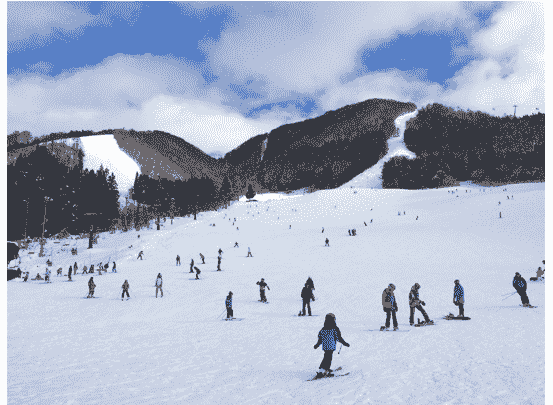
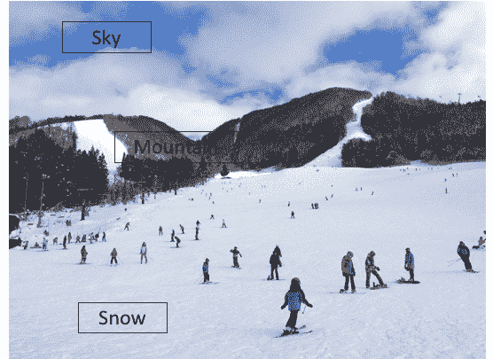
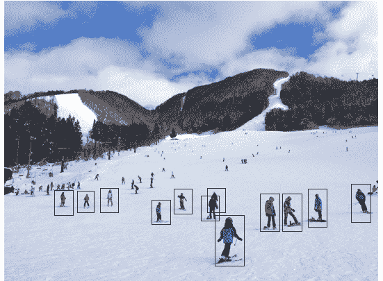
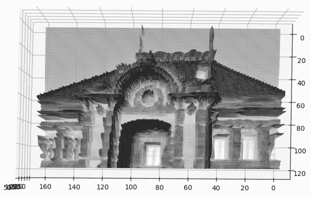
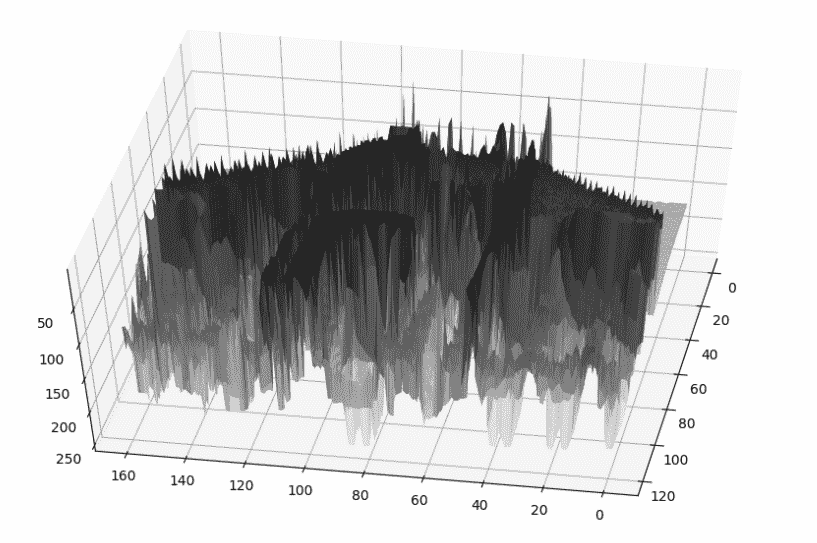
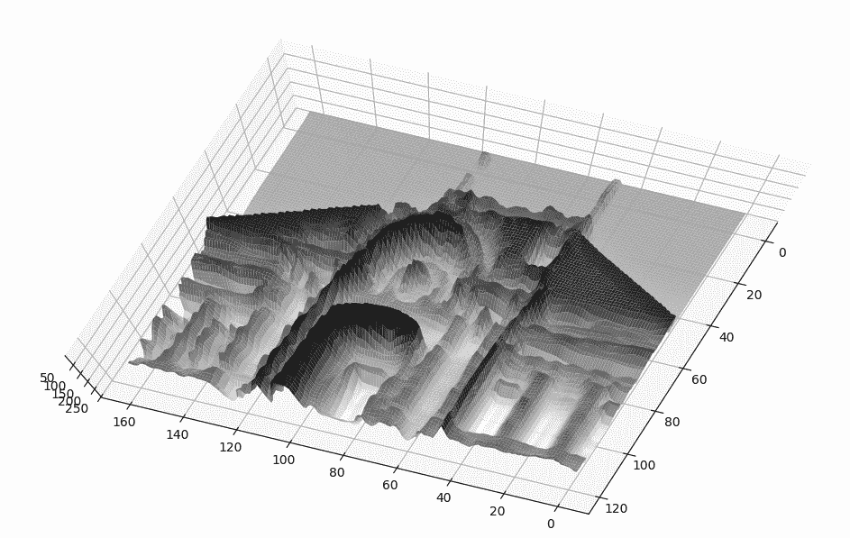
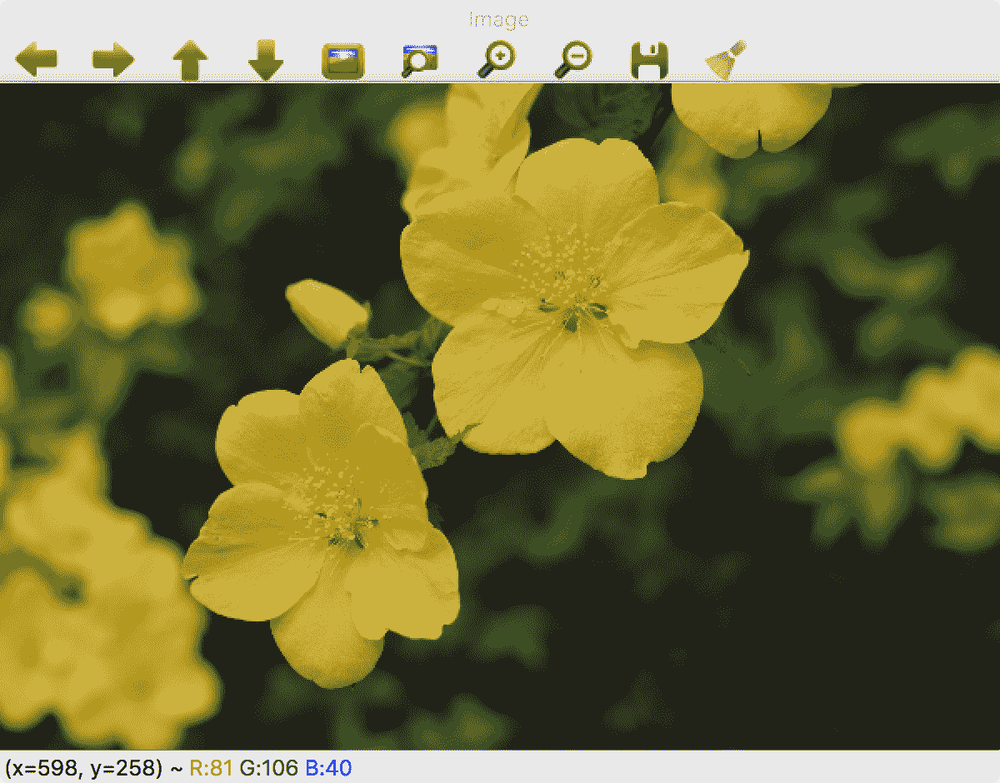
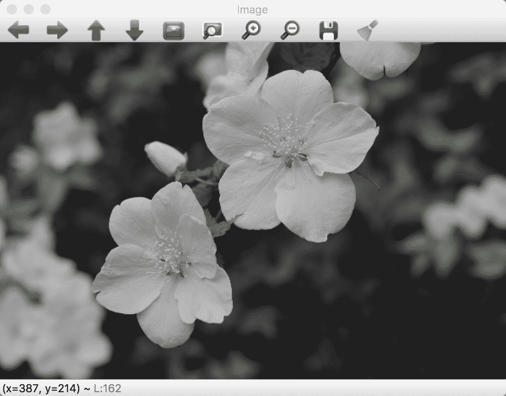
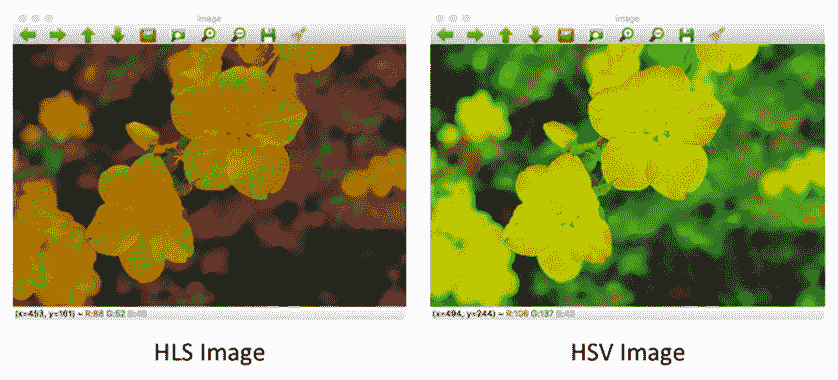

# 快速了解计算机视觉

计算机视觉应用在我们的生活中变得非常普遍。应用范围广泛，从玩**虚拟现实**（VR）或**增强现实**（AR）游戏的应用程序到使用智能手机摄像头扫描文档的应用程序。在我们的智能手机上，我们有二维码扫描和面部识别，现在我们甚至有面部识别技术。在网上，我们现在可以使用图片进行搜索并找到类似外观的图片。照片分享应用程序可以识别人物并基于照片中找到的朋友或家人创建相册。由于图像稳定技术改进，即使手抖，我们也能创建稳定的视频。

随着深度学习技术的最近进步，图像分类、目标检测、跟踪等应用变得更加准确，这导致了更复杂的自主系统的发展，如无人机、自动驾驶汽车、类人机器人等等。使用深度学习，图像可以转化为更复杂的细节；例如，图像可以被转换成梵高风格的画作。

在几个领域的这种进步让非专业人士感到惊讶，计算机视觉是如何从图像中推断出这种信息的。动机在于人类的感知和我们周围环境复杂分析的方式。我们可以估计物体的接近度、结构和形状，还可以估计表面的纹理。即使在不同的光线条件下，我们也能识别物体，甚至如果我们以前见过，我们还能识别出某些东西。

考虑到这些进步和动机，一个基本的问题出现了，那就是什么是计算机视觉？在本章中，我们将首先回答这个问题，然后提供一个更广泛的概述，包括计算机视觉中的各个子领域和应用。在章节的后面部分，我们将从基本的**图像操作**开始。

# 什么是计算机视觉？

为了开始讨论计算机视觉，观察以下图片：



即使以前从未做过这项活动，我们也可以清楚地看出这张图片是关于人们在多云天气下在雪山上滑雪的。我们所感知到的信息非常复杂，并且可以进一步分解为计算机视觉系统更基本的推断。

我们可以从一张图片中得到的最基本的观察结果是其中的事物或物体。在上一张图片中，我们可以看到的各种事物包括树木、山脉、雪、天空、人物等等。提取这些信息通常被称为图像分类，我们希望用一组预定义的类别来标记一张图片。在这种情况下，标签就是我们看到的图片中的事物。

从上一张图片中我们可以得到的一个更广泛的观察结果是风景。我们可以看出，这张图片由**雪**、**山**和**天空**组成，如下面的图片所示：



尽管在图像中为**雪**、**山**和**天空**创建精确的边界很困难，但我们仍然可以识别出每个物体的近似图像区域。这通常被称为图像分割，其中我们根据物体占用情况将其分割成区域。

使我们的观察更加具体，我们可以进一步确定图像中物体的确切边界，如图所示：



在图像中，我们看到人们在进行不同的活动，因此有不同的形状；有些人坐着，有些人站着，有些人滑雪。即使有这么多变化，我们仍然可以检测到物体并在它们周围创建边界框。图像中只显示了少数边界框以供理解——我们可以观察到的比这些要多得多。

虽然在图像中，我们在一些物体周围显示了矩形边界框，但我们并没有对框中的物体进行分类。下一步将是说这个框包含一个人。这种检测和分类框的联合观察通常被称为目标检测。

扩展我们对人和周围环境的观察，我们可以这样说，图像中不同的人有不同的身高，尽管有些人离相机更近，有些人离得更远。这是由于我们对图像形成和物体之间关系的直观理解。我们知道，树通常比人高得多，即使图像中的树木比相机附近的更矮。从图像中提取几何信息是计算机视觉的另一个子领域，通常被称为图像重建。

# 计算机视觉无处不在

在上一节中，我们初步了解了计算机视觉。有了这种理解，已经开发出了一些算法，并在工业应用中使用。研究这些算法不仅提高了我们对系统的理解，还可以为改进整体系统提供新的思路。

在本节中，我们将通过查看各种应用及其问题表述来扩展我们对计算机视觉的理解：

+   **图像分类**：在过去的几年里，基于图像中对象的分类已经变得流行。这是由于算法的进步以及大量数据集的可用性。用于图像分类的深度学习算法在训练数据集如`ImageNet`上显著提高了准确性。我们将在下一章进一步研究这个数据集。训练好的模型通常还会用于改进其他识别算法，如目标检测，以及在线应用中的图像分类。在本书中，我们将看到如何使用深度学习模型创建一个简单的图像分类算法。

+   **目标检测**：不仅自动驾驶汽车，机器人、自动零售商店、交通检测、智能手机摄像头应用、图像过滤器等许多应用都使用了目标检测。这些应用也受益于深度学习和视觉技术，以及大型、标注数据集的可用性。我们在上一节中看到了目标检测的介绍，它会在对象周围产生边界框，并分类框内是什么对象。

+   **目标跟踪**：跟踪机器人、监控摄像头和人与人的互动是目标跟踪的几个应用之一。这包括定义位置并跟踪一系列图像中的相应对象。

+   **图像几何**：这通常被称为从相机计算物体的深度。这个领域也有许多应用。智能手机应用现在能够从车载视频中计算三维结构。使用三维重建的数字模型，可以开发进一步扩展，如 AR 或 VR 应用，以将图像世界与真实世界接口。

+   **图像分割**：这是在图像中创建具有相似属性的聚类区域。通常的方法是将属于同一对象的图像像素进行聚类。最近的应用在自动驾驶汽车和医疗分析中使用图像区域有所增长。

+   **图像生成**：这些在艺术领域有更大的影响，可以合并不同的图像风格或生成全新的图像。现在，我们可以将梵高的绘画风格与智能手机摄像头图像混合，创造出看起来像是用类似梵高的风格绘制的图像。

该领域正在迅速发展，不仅通过开发新的图像分析方法，还通过寻找计算机视觉可以应用的新领域。因此，应用不仅限于之前所解释的那些。

开发视觉应用需要深入了解工具和技术。在第二章“库、开发平台和数据集”中，我们将看到一系列有助于实现视觉技术的工具列表。其中最受欢迎的工具之一是 OpenCV，它包含了计算机视觉中最常见的算法。对于更近期的技术，如深度学习，可以使用 Keras 和 TensorFlow 来创建应用。

尽管我们将在下一节中看到一些基本的图像操作，但在第三章“OpenCV 中的图像滤波和变换”中，还有更详尽的图像滤波和变换操作。这些操作在许多应用中作为初始操作，用于去除不需要的信息。

在第四章，*什么是特征？*中，我们将介绍图像的特征。图像中有几个属性，如角点、边缘等，可以作为关键点。这些属性用于在图像之间找到相似性。我们将实现并理解常见的特征和特征提取器。

最近在图像分类或目标检测方面的视觉技术进步使用了基于深度学习的先进特征。在第五章，*卷积神经网络*中，我们将从理解卷积神经网络的各个组成部分以及如何用它来分类图像开始。

如前所述，目标检测是一个更复杂的问题，它不仅需要定位图像中物体的位置，还需要描述它是什么类型的物体。因此，这需要更复杂的技术，我们将在第六章，*基于特征的物体检测*中使用 TensorFlow 来了解这些技术。

如果我们想了解图像中物体的区域，我们需要进行图像分割。在第七章，*分割和跟踪*中，我们将看到一些使用卷积神经网络进行图像分割的技术，以及跟踪一系列图像或视频中的多个物体的技术。

最后，在第八章，*3D 计算机视觉*中，我们将介绍图像构建以及图像几何的应用，例如视觉里程计和视觉 SLAM。

尽管我们将在下一章详细介绍如何设置 OpenCV，但在下一节中，我们将使用 OpenCV 来执行基本的图像操作，如读取和转换图像。这些操作将展示图像在数字世界中的表示方式以及需要改变什么来提高图像质量。更详细图像操作将在第三章，*OpenCV 中的图像滤波和变换*中介绍。

# 开始

在本节中，我们将看到基本的图像读取和写入操作。我们还将了解图像是如何以数字方式表示的。

在我们进一步讨论图像输入输出之前，让我们看看在数字世界中图像是由什么组成的。图像简单地是一个二维数组，数组的每个单元格包含强度值。一个简单的图像是黑白图像，其中 0 表示白色，1 表示黑色。这也被称为二值图像。这种图像的进一步扩展是将黑白分为更广泛的灰度范围，范围从 0 到 255。这种类型的图像在三维视图中的表示如下，其中 *x* 和 *y* 是像素位置，*z* 是强度值：



这是一个俯视图，但当我们从侧面观察时，我们可以看到组成图像的强度变化：



我们可以看到有几个峰值和图像强度不平滑。让我们应用 *平滑算法*，其详细内容可以在第三章*，OpenCV 中的图像滤波和转换*中找到：



如我们所见，像素强度形成了更连续的形状，尽管在物体表示上没有显著变化。可视化此内容的代码如下（用于可视化图像所需的库在第二章，*库、开发平台和数据集*中详细描述）：

```py
import numpy as np
import matplotlib.pyplot as plt
from mpl_toolkits.mplot3d import Axes3D
import cv2

# loads and read an image from path to file
img = cv2.imread('../figures/building_sm.png')

# convert the color to grayscale 
gray = cv2.cvtColor(img, cv2.COLOR_BGR2GRAY)
# resize the image(optional)
gray = cv2.resize(gray, (160, 120))

# apply smoothing operation
gray = cv2.blur(gray,(3,3))

# create grid to plot using numpy
xx, yy = np.mgrid[0:gray.shape[0], 0:gray.shape[1]]

# create the figure
fig = plt.figure()
ax = fig.gca(projection='3d')
ax.plot_surface(xx, yy, gray ,rstride=1, cstride=1, cmap=plt.cm.gray,
 linewidth=1)
# show it
plt.show()
```

此代码使用了以下库：`NumPy`、`OpenCV` 和 `matplotlib`。

在本章的后续部分，我们将看到使用图像的颜色属性进行的图像操作。请从网站上下载相关图像以清晰查看。

# 读取图像

存储在数字格式中的图像由一个网格结构组成，每个单元格包含一个值来表示图像。在接下来的章节中，我们将看到不同格式的图像。对于每种格式，网格单元格中表示的值将具有不同的值范围。

要操作图像或用于进一步处理，我们需要加载图像并将其用作类似于网格的结构。这被称为图像输入输出操作，我们可以使用 OpenCV 库来读取图像，如下所示。在此，根据需要更改图像文件的路径：

```py
import cv2 

# loads and read an image from path to file
img = cv2.imread('../figures/flower.png')

# displays previous image 
cv2.imshow("Image",img)

# keeps the window open until a key is pressed
cv2.waitKey(0)

# clears all window buffers
cv2.destroyAllWindows()
```

最终生成的图像如下截图所示：



在这里，我们以 BGR 颜色格式读取图像，其中 B 代表蓝色，G 代表绿色，R 代表红色。输出中的每个像素都是使用每种颜色的值共同表示的。像素位置及其颜色值的示例在上一图底部显示。

# 图像颜色转换

一张图像由像素组成，通常根据存储的值进行可视化。还有其他属性使得不同类型的图像。每个像素中存储的值都与一个固定的表示相关联。例如，像素值十可以表示灰度强度值十或蓝色强度值 10 等等。因此，了解不同的颜色类型及其转换非常重要。在本节中，我们将使用 `OpenCV` 来查看颜色类型和转换：

+   **灰度图**：这是一个简单的一通道图像，其值范围从 0 到 255，代表像素的强度。之前的图像可以转换为灰度图，如下所示：

```py
import cv2 

# loads and read an image from path to file
img = cv2.imread('../figures/flower.png')

# convert the color to grayscale 
gray = cv2.cvtColor(img, cv2.COLOR_BGR2GRAY)

# displays previous image 
cv2.imshow("Image",gray)

# keeps the window open until a key is pressed
cv2.waitKey(0)

# clears all window buffers
cv2.destroyAllWindows()
```

最终生成的图像如下截图所示：



+   **HSV 和 HLS**：这是另一种颜色表示方法，其中 H 代表色调，S 代表饱和度，V 代表亮度，L 代表亮度。这些表示方法受到人类感知系统的影响。以下是对这些颜色进行图像转换的示例：

```py
# convert the color to hsv 
hsv = cv2.cvtColor(img, cv2.COLOR_BGR2HSV)

# convert the color to hls 
hls = cv2.cvtColor(img, cv2.COLOR_BGR2HLS)
```

这种转换如图所示，其中以 BGR 格式读取的输入图像被转换为**HLS**（左侧）和**HSV**（右侧）颜色类型：



+   **LAB 颜色空间**：用*L*表示亮度，*A*表示绿-红颜色，B 表示蓝-黄颜色，它包含了所有可感知的颜色。由于其设备独立性特性，它被用来在一种颜色空间（例如，RGB）与其他颜色空间（如 CMYK）之间进行转换。在设备格式与发送的图像格式不同的设备上，首先将输入图像的颜色空间转换为 LAB，然后再转换为设备上可用的相应空间。将 RGB 图像转换后的输出如下：


# 计算机视觉研究会议

寻找最新研究成果和应用的一些会议如下：

+   **CVPR**：**计算机视觉与模式识别会议**每年举行一次，是广受欢迎的会议，其研究论文涵盖了从理论到应用广泛的领域

+   **ICCV**：**国际计算机视觉会议**是每两年举行一次的另一项重要会议，吸引了其中一些最佳研究论文

+   **SIGGRAPH**：**计算机图形学特别兴趣小组**和交互技术，尽管更多关注计算机图形学领域，但也有利用计算机视觉技术的应用论文。

其他值得注意的会议包括**神经信息处理系统**（**NIPS**）、**国际机器学习会议**（**ICML**）、**亚洲计算机视觉会议**（**ACCV**）、**欧洲计算机视觉会议**（**ECCV**）等。

# 摘要

在本章中，我们简要概述了计算机视觉，包括对图像的基本输入/输出操作。尽管这是一个庞大的领域，但总有令人兴奋的应用可以通过计算机视觉技术构建。本书试图弥合理论与实践之间的差距，将几个流行算法的实践方法联系起来。此外，在本书中，我们将从理解更多基本的图像操作开始，这些操作可以执行过滤和转换。扩展这些基本技术后，我们将看到特征由什么组成以及如何计算它们。

在本章介绍计算机视觉之后，我们将在下一章开始设置库和环境。这些库将在整本书中使用。下一章中介绍的数据库可以成为几个算法的起点。
