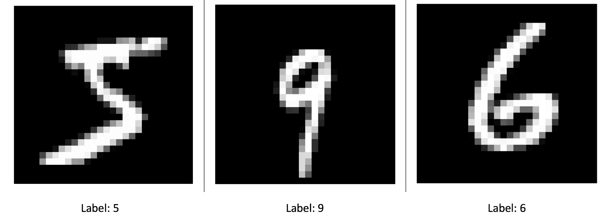

# 第二章：库、开发平台和数据集

在本章中，我们将设置一个开发环境，以帮助运行本书中的代码以及通用开发，并介绍各种计算机视觉数据集。由于有几个标准库既用于研究计算机视觉，也用于工业部署，因此在学习路径中使用它们也变得非常简单。随着我们在后续章节中研究计算机视觉的各个子主题，我们将能够直接实现当时引入的代码，而不是陷入安装和其他库依赖项的困境。

本章分为两个主要部分：

+   首先，我们将设置基于 Python 的环境，例如 Anaconda

+   我们将设置 OpenCV 及其各种安装形式

+   对于深度学习，我们还将设置 Keras 和 TensorFlow

# 库和安装

在开始之前，我们需要安装每个库。安装库有两种主要方法：

+   我们通过编译代码来下载源代码并构建二进制文件

+   我们可以直接下载二进制文件并将它们放入相关目录

虽然下载预构建的二进制文件是一种更快的方法，然而，由于平台差异或二进制文件的不可用，可能需要从源代码构建库。如果读者使用的是以下章节中提到的不同操作系统，他们可能会遇到这种情况。一旦安装了库，就可以在程序或其他库中使用它。

由于需要确保库不受其他安装的影响，本书的大部分内容中我们将使用基于 Python 的环境。这有助于跟踪已安装的库，并在需要时分离不同的环境。这里的“环境”指的是具有特定版本及其依赖关系的已安装库。

对于从源代码构建库，我们将使用 `CMake` 工具。安装说明将在后续章节中展示。这有助于通过在每个平台上链接到相关的编译器以及它们的依赖项来构建跨平台软件。它还带有 GUI，但为了方便，我们将使用命令行 `cmake`。

对于深度学习，我们将在本书的后续章节中看到，强烈建议使用 GPU。要使用 GPU 运行我们的程序，我们需要安装 Nvidia 提供的 CUDA 和 cuDNN 二进制文件。有关每个平台（如 Linux、Mac OS 或 Windows）的安装详细说明，可以从 Nvidia 获取。

让我们先按顺序安装所需的软件包。

# 安装 Anaconda

我们需要做的第一件事是设置我们的 Python 环境，以便其他库可以通过 Python 轻松访问。Anaconda 是一个流行的数据科学平台，具有 Python 接口，可在以下网址找到：[`www.anaconda.com/`](https://www.anaconda.com/)。它包含`conda`作为包管理器，可以安装、删除和管理 Python 库的版本，同时将其与其他 Python 环境隔离开来。在这本书中，我们将使用 Anaconda 中的`conda`。让我们继续设置它。

首先，下载并安装 Anaconda：

+   在 Linux 上：

```py
wget https://repo.continuum.io/archive/Anaconda3-5.0.1-Linux-x86_64.sh
bash Anaconda3-5.0.1-MacOSX-x86_64.sh
```

+   在 macOS 上，`wget`不可直接使用；使用 brew 安装`wget`：

```py
wget https://repo.continuum.io/archive/Anaconda3-5.0.1-MacOSX-x86_64.sh
bash Anaconda3-5.0.1-MacOSX-x86_64.sh
```

这将在`$HOME/anaconda3`文件夹中安装 Python 库，因为我们正在使用 Python 3。Python 2 版本也可用，安装过程类似。要使用 Anaconda，新安装的库需要添加到`$PATH`中，这可以通过每次启动新 shell 时运行以下命令来完成：

```py
export PATH="$PATH_TO_ANACONDA3/anaconda3/bin:$PATH" 
```

`$PATH_TO_ANACONDA3`是`Anaconda3`文件夹的位置路径。为了方便，根据您是否使用 Linux 或 macOS，将其添加到`.bashrc`或`.bash_profile`中。

一旦安装了 conda，许多其他科学包也将被安装。其中一些包包括：

# NumPy

NumPy 包用于在 N 维数组上执行图像操作。创建和转置二维数组的示例如下：

```py
import numpy as np 

A = [[1, 2],[3, 4]]

# transpose A 
np.transpose(A)
```

# Matplotlib

这是一个流行的 Python 包，用于绘图和显示数据和图像。在 Python 中使用，脚本如下：

```py
import matplotlib.pyplot as plt 
```

如果我们想在 Jupyter 笔记本中绘图，请添加以下命令：

```py
%matplotlib inline 
```

一个显示图像的示例函数如下：

```py
def plot_img(input_image): 
    """ 
    Takes in image 
    Plots image using matplotlib
    """ 
    plt.figure(figsize=(12,8))

    # change color channels order for matplotlib 
    plt.imshow(input_image)

    # For easier view, turn off axis around image 
    plt.axis('off')
    plt.show()
```

# SciPy

这是一个基于 Python 的科学计算库，包含用于优化、线性代数、信号处理、统计学等的高级算法。

计算二维数组特征值和特征向量的示例如下：

```py
from scipy import linalg

A = [[5, 6], [7, 8]]
eig_vals, eig_vectors = linalg.eig(A)
```

# Jupyter 笔记本

Jupyter 笔记本广泛用于创建带有可视化和文本的逐步实时代码。在第三章的*OpenCV 中的图像滤波和变换*和第四章的*什么是特征？*中，可以使用 Jupyter 笔记本来使用图像滤波和特征提取的代码。

要启动笔记本服务器，请在 shell 中运行以下命令：

```py
jupyter notebook
```

这将启动浏览器，我们可以看到启动文件夹中的文件。启动后，在浏览器页面的左上角点击“新建”，选择所需的 Python 笔记本。浏览器中会打开一个新的标签页，带有 Python 解释器格式。

其他包，如 scikit-learn、pandas、seaborn 等。

# 安装 OpenCV

OpenCV（可在[`opencv.org/`](https://opencv.org/) 获取）是最受欢迎的计算机视觉开源库，可以在包括 Linux、macOS、Windows、Android、iOS 等所有主要平台上安装。它包含用 C++编写的优化代码，并为 Python 和 Java 提供绑定。考虑到 OpenCV 的通用性，我们将使用它来解释计算机视觉算法。本书中的大部分代码都是 Python 编写的，除了外部仓库。根据我们将如何使用 OpenCV，它可以以两种方式设置。我们将从简单的方法开始。

# OpenCV Anaconda 安装

使用我们在上一节中安装的 Anaconda，OpenCV 可以在 Linux 和 macOS 上安装，如下所示（这是仅包含 Python 库的 OpenCV）：

```py
conda install -c conda-forge opencv
```

# 从源代码构建 OpenCV

根据您使用的硬件，从源代码构建 OpenCV 是一个相当长的过程：

+   Linux（此处为 Ubuntu）上的要求：

```py
sudo apt-get install build-essential
sudo apt-get install cmake git libgtk2.0-dev pkg-config libavcodec-dev libavformat-dev libswscale-dev
sudo apt-get install libtbb2 libtbb-dev libjpeg-dev libpng-dev libtiff-dev libjasper-dev libdc1394-22-dev
```

+   macOS 上的要求：

    +   从[`www.cmake.org/download/`](http://www.cmake.org/download/) 安装 CMake

以下是一个安装脚本；将以下片段复制到安装`install.sh`文件，然后运行`bash install.sh`以安装 OpenCV。

在以下代码中，将`$PATH_TO_ANACONDA`替换为 Anaconda 的绝对路径，例如`/Users/mac`：

```py
# download opencv 
wget https://github.com/opencv/opencv/archive/3.3.0.zip
unzip 3.3.0.zip
mv opencv-3.3.0 opencv
rm -rf 3.3.0.zip

# install opencv 
cd opencv 
mkdir build && cd build
cmake -D -DPYTHON_INCLUDE_DIR=$PATH_TO_ANACONDA/anaconda3/include/python3.6m/ \
 -DPYTHON_EXECUTABLE=$PATH_TO_ANACONDA/anaconda3/bin/python \
 -DPYTHON_PACKAGES_PATH=$PATH_TO_ANACONDA/anaconda3/lib/python3.6/site-packages \
 -DINSTALL_PYTHON_EXAMPLES=ON \
 -DCMAKE_INSTALL_PREFIX=$PATH_TO_ANACONDA/anaconda3 \
 -DWITH_QT=ON \
 -DFORCE_VTK=ON \
 -DWITH_GDAL=ON \
 -DWITH_FFMPEG=ON \
 -DWITH_TBB=ON \
 -DWITH_XINE=ON \
 -DWITH_OPENCL=OFF \
 -DBUILD_EXAMPLES=ON ..

make -j4
make install

```

由于 OpenCV2 和 OpenCV3 之间存在重大变化，本书中的代码仅使用 OpenCV3 编写。

在`OpenCV`中，额外贡献的模块被移动到名为`opencv_contrib`的单独仓库下。为了构建包含`opencv_contrib`的`OpenCV`，步骤如下：

+   以下是如何下载 OpenCV：

```py
# download opencv 
wget https://github.com/opencv/opencv/archive/3.3.0.zip
unzip 3.3.0.zip
mv opencv-3.3.0 opencv
rm -rf 3.3.0.zip
```

+   在此处下载额外的模块，并注意此文件夹的路径：

```py
# opencv contrib code 
wget https://github.com/opencv/opencv_contrib/archive/3.3.0.zip
unzip 3.3.0.zip
mv opencv_contrib-3.3.0 opencv_contrib
rm -rf 3.3.0.zip
```

+   按如下方式重新构建完整的 OpenCV，其中`PATH_TO_CONTRIB`是之前下载的`opencv_contrib`路径：

```py
cd opencv 
mkdir build && cd build
cmake -D -DOPENCV_EXTRA_MODULES_PATH=$PATH_TO_CONTRIB/opencv_contrib/modules \
 -DPYTHON_INCLUDE_DIR=$PATH_TO_ANACONDA/anaconda3/include/python3.6m/ \
 -DPYTHON_EXECUTABLE=$PATH_TO_ANACONDA/anaconda3/bin/python \
 -DPYTHON_PACKAGES_PATH=$PATH_TO_ANACONDA/anaconda3/lib/python3.6/site-packages \
 -DINSTALL_PYTHON_EXAMPLES=ON \
 -DCMAKE_INSTALL_PREFIX=$PATH_TO_ANACONDA/anaconda3 \
 -DWITH_QT=ON \
 -DFORCE_VTK=ON \
 -DWITH_GDAL=ON \
 -DWITH_FFMPEG=ON \
 -DWITH_TBB=ON \
 -DWITH_XINE=ON \
 -DWITH_OPENCL=OFF \
 -DBUILD_EXAMPLES=ON ..

make -j4
make install
```

在这里，我们可以看到有几个选项是开启或关闭的。这些操作的选择取决于依赖项的可用性。如果所有依赖项都可用，则可以将其设置为开启。

# OpenCV 常见问题解答

尽管我们在上一章中看到了 OpenCV 的入门级程序，但我们将看到一些更常用的代码片段，这些代码片段将贯穿本书。

+   让我们从导入 OpenCV 并打印使用的 OpenCV 版本开始：

```py
import cv2
print(cv2.__version__)
```

+   我们可以从文件中读取图像如下：

```py
 img = cv2.imread('flower.png')
```

以下代码片段将解码存储在常见格式中的图像，如`.jpg`、`.png`、`.jpeg`、`.tiff`、`.pgm`等，使用与 OpenCV 一起安装或平台上可用的图像编解码器。如果没有编解码器可用，则 OpenCV 将无法读取图像或将其写入文件。因此，对于非支持平台（如嵌入式设备）的用户来说，安装编解码器是必要的。

我们可以将图像写入文件如下：

```py
cv2.imwrite('image.png', img)
```

在写入文件时，也需要图像编解码器，这些编解码器通常与 OpenCV 一起安装。我们可以使用 JPG、PNG、JPEG、TIFF 等文件格式写入图像。

处理视频包括打开视频文件并在每个帧上应用算法。我们首先初始化帧的来源，可以是视频文件或连接的 USB 摄像头，如下所示：

```py
# to use default usb camera set the value to 0
video_capture = cv2.VideoCapture(0)
```

或者我们也可以这样写：

```py
# to use video file, set filename 
video_capture = cv2.VideoCapture('video.avi')
```

与图像读取和写入类似，视频读取也需要编解码器，这些编解码器与 OpenCV 一起安装或从操作系统提供。一旦设置好来源，我们就可以继续处理每个帧，如下所示：

```py
while(True):
 # get each frame
 ret, frame = video_capture.read()

 # if no frame available then quit
 if not ret:
 print("Frame not available")
 break

 # show read frame in window
 cv2.imshow('frame', frame)

 # escape the loop on pressing 'q'
 if cv2.waitKey(1) & 0xFF == ord('q'):
 break
```

在这里，`cv2.imshow`用于显示图像，而`cv2.waitKey()`是执行中的时间延迟。

# TensorFlow 深度学习

TensorFlow 是可用的流行深度学习库之一，并为 Python、C++、Java 等提供了 API。在这本书中，我们将使用 1.4.0 版本的 Python API。详细解释 TensorFlow 超出了本书的范围；官方文档是了解它的更好起点。

为了安装，我们将使用基于`pip`的方法，如下所示：

```py
pip install tensorflow=1.4.0
```

如果有带有 CUDA 和 cuDNN 的 GPU 可用：

```py
pip install tensorflow-gpu=1.4.0
```

关于 TensorFlow 及其使用的更多信息，请参考以下教程：

[`www.tensorflow.org/get_started/get_started`](https://www.tensorflow.org/get_started/get_started).

安装完成后，可以通过运行以下命令来检查 TensorFlow 版本：

```py
python -c "import tensorflow as tf;print(tf.__version__)"
```

# Keras 深度学习

Keras 是一个基于 Python 的 API，它使用 TensorFlow、CNTK 或 Theano 作为深度学习后端。由于其高级 API 和简化的抽象，它在深度学习社区中相当受欢迎。我们将使用这个库来研究卷积神经网络。为了安装它，首先按照前面章节的说明安装 TensorFlow，然后使用以下命令：

```py
pip install keras
```

没有针对 GPU 的单独版本。为了安装特定版本的 Keras，例如 2.1.2 版本，请使用以下命令：

```py
pip install keras==2.1.2
```

写这本书时 Keras 的最新版本是 2.1.2。要检查已安装 Keras 的版本，请使用以下命令：

```py
python -c "import keras;print(keras.__version__)"
```

如果 TensorFlow 是从前面的部分安装的，它将使用它作为后端。

要使用 Keras，先决条件之一是具备基本的深度学习知识。在这本书中，我们将在第五章中看到它，*卷积神经网络*。

# 数据集

在计算机视觉中，数据集在开发高效应用程序中起着关键作用。现在，随着大型开源数据集的可用性，创建计算机视觉任务的最高性能模型变得容易得多。在本节中，我们将看到几个计算机视觉数据集。

# ImageNet

ImageNet 是计算机视觉中最大的标注数据集之一。数据按照层次顺序排列。总共有 1,000 个类别，1,400 万张图像。尽管这些图像仅供非商业使用，但 ImageNet 仍然是学习计算机视觉中最受欢迎的数据集之一。特别是在深度学习中，由于存在大量不同类型的图像，该数据集被用于创建图像分类模型。

以下网站提供了下载图像 URL 或其他图像属性的链接和资源：

[ImageNet 下载](http://image-net.org/download)

在这本书中，ImageNet 没有被明确使用，但我们将使用其上的预训练模型。对于这本书，没有要求下载此数据集。

# MNIST

`MNIST`是一个包含 0-9 数字的手写数字数据集，有 60,000 个 28 x 28 大小的训练图像和 10,000 个 28 x 28 大小的测试图像。这已成为开始机器学习或深度学习的首选数据集。它被大多数框架提供，无需单独下载。在`Keras`中可以这样使用：

```py
from __future__ import print_function

from keras.datasets import mnist
import matplotlib.pyplot as plt 

# Download and load dataset 
(x_train, y_train), (x_test, y_test) = mnist.load_data()

# to know the size of data
print("Train data shape:", x_train.shape, "Test data shape:", x_test.shape)

# plot sample image
idx = 0
print("Label:",y_train[idx])
plt.imshow(x_train[idx], cmap='gray')
plt.axis('off')
plt.show()
```

此数据集的一些样本图像如图所示：



# CIFAR-10

虽然`MNIST`是最容易开始的数据集之一，但由于缺乏彩色图像，它对于需要彩色数据集的任务吸引力较小。一个稍微复杂一些的数据集是 Alex 和其他人编写的`CIFAR-10`，它由 10 个类别的图像组成，包括 60,000 个训练图像和 10,000 个测试图像，每个类别均匀分布。每个图像的大小为 32 x 32，每个图像都有三个颜色通道。此数据集也可以很容易地在 Keras 中加载，如下所示：

```py
from __future__ import print_function

from keras.datasets import cifar10
import matplotlib.pyplot as plt 

# Download and load dataset 
(x_train, y_train), (x_test, y_test) = cifar10.load_data()
labels = ['airplane', 'automobile', 'bird', 'cat', 'deer', 'dog', 'frog', 'horse', 'ship', 'truck']
# to know the size of data
print("Train data shape:", x_train.shape, "Test data shape:", x_test.shape)

# plot sample image
idx = 1500
print("Label:",labels[y_train[idx][0]])
plt.imshow(x_train[idx])
plt.axis('off')
plt.show()
```

标签依次为：`飞机`、`汽车`、`鸟`、`猫`、`鹿`、`狗`、`青蛙`、`马`、`船`和`卡车`。

# Pascal VOC

由于像`MNIST`和`CIFAR`这样的数据集在表示上有限，我们不能使用它们进行如人体检测或分割等任务。Pascal VOC[4]因其作为物体识别的主要数据集之一而受到欢迎。在 2005-2012 年期间，有比赛使用了这个数据集，并在测试数据上实现了最佳可能的准确率。该数据集通常也按年份命名；例如，VOC2012 指的是可用于 2012 年比赛的那些数据集。在 VOC2012 中，有三个比赛类别。第一个是分类和检测数据集，它包含 20 个类别的物体以及物体周围的矩形区域标注。第二个类别是带有物体周围实例边界的分割。第三个比赛类别是图像动作识别。

您可以从以下链接下载此数据集：

[VOC2012 数据集](http://host.robots.ox.ac.uk/pascal/VOC/voc2012/index.html).

在这个数据集中，一个图像的样本标注文件（XML 格式）如下所示，其中标签代表该字段的属性：

```py
<annotation>
  <folder>VOC2012</folder>
  <filename>2007_000033.jpg</filename>
  <source>
    <database>The VOC2007 Database</database>
    <annotation>PASCAL VOC2007</annotation>
    <image>flickr</image>
  </source>
  <size>
    <width>500</width>
    <height>366</height>
    <depth>3</depth>
  </size>
  <segmented>1</segmented>
  <object>
    <name>aeroplane</name>
    <pose>Unspecified</pose>
    <truncated>0</truncated>
    <difficult>0</difficult>
    <bndbox>
      <xmin>9</xmin>
      <ymin>107</ymin>
      <xmax>499</xmax>
      <ymax>263</ymax>
    </bndbox>
  </object>
  <object>
    <name>aeroplane</name>
    <pose>Left</pose>
    <truncated>0</truncated>
    <difficult>0</difficult>
    <bndbox>
      <xmin>421</xmin>
      <ymin>200</ymin>
      <xmax>482</xmax>
      <ymax>226</ymax>
    </bndbox>
  </object>
  <object>
    <name>aeroplane</name>
    <pose>Left</pose>
    <truncated>1</truncated>
    <difficult>0</difficult>
    <bndbox>
      <xmin>325</xmin>
      <ymin>188</ymin>
      <xmax>411</xmax>
      <ymax&amp;gt;223</ymax>
    </bndbox>
  </object>
</annotation>
```

对应的图像如图所示：


此数据集中可用的类别包括：飞机、自行车、船只、瓶子、公共汽车、汽车、猫、椅子、牛、餐桌、狗、马、摩托车、人、盆栽植物、羊、火车和电视。

然而，类别的数量是有限的。在下一节中，我们将看到一个具有 80 个类别的更详细的数据集。拥有更多的通用物体类别将有助于创建可以在更通用场景中轻松使用的应用程序。

# MSCOCO

COCO[2]指的是上下文中的常见物体，是一个包含 80 个类别和 33 万张图片的目标识别数据集。在 Pascal VOC'12 之后，这成为了一个流行的训练和评估系统的基准。数据集可以从 [`cocodataset.org/#download`](http://cocodataset.org/#download) 下载。

为了读取数据并将其用于应用，有一个 API 可以在 [`github.com/cocodataset/cocoapi`](https://github.com/cocodataset/cocoapi) 上找到，需要下载。要开始，我们可以使用提供的 API，如下所示：

```py
git clone https://github.com/cocodataset/cocoapi.git
cd cocoapi/PythonAPI
make
```

这将安装用于读取`coco`数据集的 Python API。

许多在线可用的目标检测或图像分割模型最初是在这个数据集上训练的。如果我们有与 MSCOCO 数据集不同的特定数据，一个更常见的方法，我们将在第五章[prac-cv_ch05.html]，*卷积神经网络*和第六章[prac-cv_ch06.html]，*基于特征的物体检测*中看到，是首先在一个 MSCOCO 数据集上训练一个模型，然后使用训练好的模型的一部分并在新的数据集上重新训练。

# TUM RGB-D 数据集

虽然之前的数据集用于物体识别，但这个数据集用于理解场景的几何形状。RGB-D 数据集[3]在 SLAM 研究中很受欢迎，也是一个比较的基准。在这里，RGB-D 指的是包含**RGB**（彩色）图像和**深度**图像的数据集。这里的深度指的是像素与摄像机的距离，使用深度相机获取。由于也提供了深度信息，这个数据集也可以用于评估基于深度的 SLAM 算法和从 RGB 图像及其相应的深度图像中重建的三维结构。

要下载此数据集，请访问 [`vision.in.tum.de/data/datasets/rgbd-dataset/download`](https://vision.in.tum.de/data/datasets/rgbd-dataset/download) 并选择要使用的序列类型。

# 摘要

在本章中，我们学习了如何安装 Python、Keras 和 TensorFlow 的不同库文件。为了在后续章节中使用几个代码片段，这些库将足够使用。我们还查看了一些不同的数据集，如 ImageNet、`MNIST`、`CIFAR-10`、MSCOCO 和 TUM RGBD 数据集。这些数据集是计算机视觉应用的基础，因为我们开发的几个软件的能力直接取决于这些数据集的可用性。

在下一章中，我们将通过介绍不同类型的过滤器来开始更深入地分析图像，并学习图像的变换，如平移、旋转或仿射变换。

# 参考文献

+   克里泽夫斯基，亚历克斯，和杰弗里·辛顿。*从微小图像中学习多层特征*。（2009 年）。

+   Lin, Tsung-Yi, Michael Maire, Serge Belongie, James Hays, Pietro Perona, Deva Ramanan, Piotr Dollár, and C. Lawrence Zitnick. *Microsoft COCO: Common Objects in Context*. In European Conference on Computer Vision, pp. 740-755. Springer, Cham, 2014.

+   Sturm, Jürgen, Nikolas Engelhard, Felix Endres, Wolfram Burgard, and Daniel Cremers. *A Benchmark for the Evaluation of RGB-D SLAM Systems*. In Intelligent Robots and Systems (IROS), 2012 IEEE/RSJ International Conference on, pp. 573-580. IEEE, 2012.

+   Everingham Mark, Luc Van Gool, Christopher KI Williams, John Winn, and Andrew Zisserman. *The Pascal Visual Object Classes (VOC) Challenge*. International Journal of Computer Vision 88, no. 2 (2010): 303-338.
