# OpenCV 中的图像滤波和变换

在本章中，你将学习计算机视觉应用的基本构建块。我们已经熟悉带有自动图像增强或颜色调整功能的数码相机和智能手机设备，以使我们的照片更加令人愉悦。这些技术背后的原理很久以前就出现了，经过多次迭代变得更好更快。本章中解释的许多技术也成为了后来介绍的对象检测和对象分类任务的主要预处理技术。因此，研究这些技术并理解其应用非常重要。

你将学习这些应用的基础，包括线性以及非线性滤波图像的几种技术。

在本章的后面部分，你还将学习变换技术和下采样技术。这里提供了一个代码示例，包括解释和示例输出。鼓励读者编写代码并尝试更改参数以理解几个概念。本章中包含几个彩色图像结果，为了有效理解，请从本书的网站上下载图像。

在本章中，我们将学习以下主题：

+   需要的数据集和库

+   图像处理

+   滤波器简介

+   图像上的变换

+   图像金字塔

# 需要的数据集和库

在这个任务的大部分过程中，我们将使用一个示例图像。然而，你也可以尝试使用任何其他图像，或者使用摄像头查看实时结果。本章使用的库有`OpenCV`、`NumPy`和`matplotlib`。即使你不熟悉这些库，你仍然可以理解代码并实现它们。对于这里编写的代码，还有一些关于特殊情况的备注，当使用 Jupyter 笔记本时：

```py
import numpy as np 
import matplotlib.pyplot as plt 
import cv2 
# With jupyter notebook uncomment below line 
# %matplotlib inline 
# This plots figures inside the notebook

```

本章中使用的示例图像可以按以下方式加载：

```py
# read an image 
img = cv2.imread('flower.png')

```

这张图像可以使用`OpenCV`或`matplotlib`库进行绘制。我们将主要使用`matplotlib`进行绘图，因为这将有助于在后面的章节中绘制其他类型的数据。以下是一个读取`OpenCV`中的彩色图像的绘图函数：

```py
def plot_cv_img(input_image):     
    """     
    Converts an image from BGR to RGB and plots     
    """   
    # change color channels order for matplotlib     
    plt.imshow(cv2.cvtColor(input_image, cv2.COLOR_BGR2RGB))          

    # For easier view, turn off axis around image     
    plt.axis('off')  
    plt.show()

```

之前读取的图像可以按以下方式绘制：

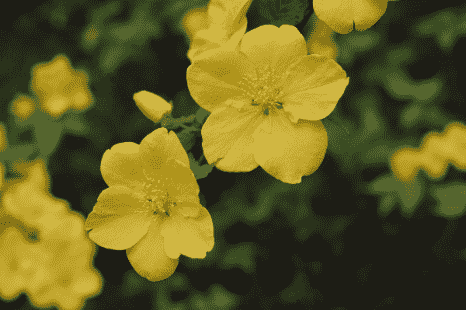

在 Python 中，图像是一个 NumPy 数组，因此所有数组操作在图像中仍然有效。例如，你可以通过数组切片来裁剪图像：

```py
plot_cv_img(img[100:400, 100:400]) 
```

这将产生以下结果：

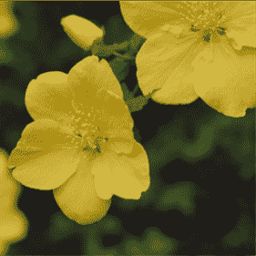

# 图像处理

如前几章所述，在数字域中，例如在计算机上，图像由一个网格状结构组成，每个网格单元被称为**像素**。这些像素存储一个表示图像信息的值。对于简单的灰度图像，这些像素存储一个范围在[0, 255]的整数。改变这些像素值也会改变图像。基本图像处理技术之一就是修改像素值。

让我们从显示图像在像素级别的内部内容开始。为了简单起见，我们将对灰度图像进行分析：

```py
# read an image 
img = cv2.imread('gray_flower.png')
```

早期的代码从文件中读取灰度图像，在这种情况下，图像是 PNG 格式。我们也可以将一种图像颜色格式转换为另一种格式。在这种情况下，要将彩色图像转换为灰度，`OpenCV` 提供了以下函数：

```py
# converts rgb image to grayscale 
gray_output = cv2.cvtColor(color_input, cv2.COLOR_BGR2GRAY)
```

之前显示图像的代码只接受彩色图像作为输入，因此要显示灰度图像需要进行一些修改：

```py
def plot_cv_img(input_image,is_gray=False): 
    """ 
    Takes in image with flag showing, if gray or not
    Plots image using matplotlib
    """ 
    # change color channels order for matplotlib 
    if not is_gray:
        plt.imshow(cv2.cvtColor(input_image, cv2.COLOR_BGR2RGB))
    else:
        plt.imshow(input_image, cmap='gray')

    # For easier view, turn off axis around image 
    plt.axis('off')
    plt.show()
```

上一段代码的输出如下：

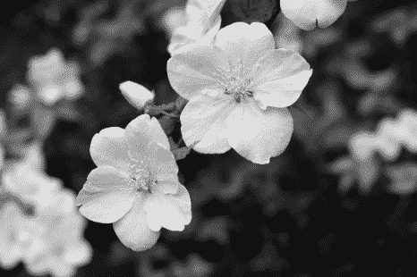

我们可以如下显示图像的一个小区域，显示像素值：

```py
# read the image
flower = cv2.imread('../figures/flower.png')

# convert to gray scale 
gray_flower = cv2.cvtColor(flower, cv2.COLOR_BGR2GRAY)

# take out a patch of pixels
patch_gray = gray_flower[250:260, 250:260]

#plot the patch as well as print the values 
plot_cv_img(patch_gray, is_gray=True)
print(patch_gray)
```

这将生成一个图像块，并打印出在该图像块中提取的值：

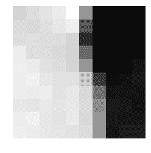

对应的值如下，较低的值表示较暗的区域：

```py
[[142 147 150 154 164 113  39  40  39  38]
 [146 145 148 152 156  78  42  41  40  40]
 [147 148 147 147 143  62  42  42  44  44]
 [155 148 147 145 142  91  42  44  43  44]
 [156 154 149 147 143 113  43  42  42  48]
 [155 157 152 149 149 133  68  45  47  50]
 [155 154 155 150 152 145  94  48  48  48]
 [152 151 153 151 152 146 106  51  50  47]
 [155 157 152 150 153 145 112  50  49  49]
 [156 154 152 151 149 147 115  49  52  52]]
```

这些是像素的强度，表示为二维数组。每个像素值的范围是 0-255。为了修改图像，我们改变这些像素值。对图像进行简单过滤的方法是对每个像素值应用点操作，乘以常数并加到每个像素值上。我们将在下一节中详细看到这种类型的过滤器。

在本节中，我们看到了基本输入输出，扩展了从第一章，《快速入门计算机视觉》的讨论。在下一节中，我们将看到如何使用过滤器修改这些内容，这些过滤器用于智能手机、桌面甚至社交媒体应用程序上的图像编辑应用。

# 过滤器简介

过滤器是对图像进行操作以修改它们，以便它们可用于其他计算机视觉任务或为我们提供所需信息。这些执行各种功能，如从图像中去除噪声、提取图像中的边缘、模糊图像、去除不需要的对象等。我们将看到它们的实现并理解结果。

过滤技术是必要的，因为有几个因素可能导致图像中存在噪声或不需要的信息。在阳光下拍照，会在图像中产生很多明亮和暗淡的区域，或者在夜间等不适当的环境中，相机捕获的图像可能包含大量噪声。此外，在图像中存在不需要的对象或颜色的情况下，这些也被认为是噪声。

盐和胡椒噪声的例子如下所示：

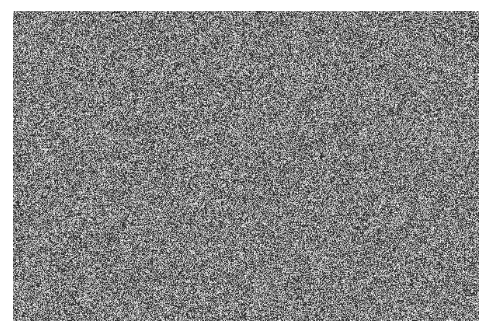

可以很容易地使用 OpenCV 以下列方式生成前面的图像：

```py
# initialize noise image with zeros
noise = np.zeros((400, 600))

# fill the image with random numbers in given range
cv2.randu(noise, 0, 256)
```

让我们在灰度图像（左侧）上添加加权噪声，以便生成的图像将看起来像右侧的图像：

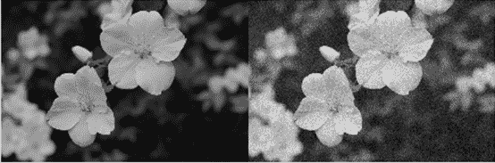

这段代码如下：

```py
# add noise to existing image 
noisy_gray = gray + np.array(0.2*noise, dtype=np.int)
```

在这里，`0.2` 被用作参数，增加或减少该值以创建不同强度的噪声。

在几个应用中，噪声在提高系统能力方面起着重要作用，尤其是在我们将在接下来的章节中使用基于深度学习的模型时。对于几个应用来说，了解应用对噪声的鲁棒性变得非常重要。例如，我们希望为图像分类等应用设计的模型也能处理带噪声的图像，因此故意在图像中添加噪声以测试应用的精度。

# 线性过滤器

首先，最简单的过滤器类型是点操作符，其中每个像素值乘以一个标量值。这个操作可以写成如下：

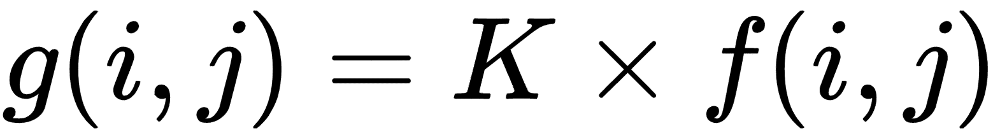

这里：

+   输入图像是 F，像素在 *(i,j)* 的值表示为 *f(i,j)*

+   输出图像是 G，像素在 *(i,j)* 的值表示为 *g(i,j)*

+   *K* 是标量常数

对图像进行的这种操作被称为 **线性** **过滤器**。在本节中，你将了解到更多种类的线性过滤器。除了乘以标量值之外，每个像素也可以通过一个常数值增加或减少。因此，整体点操作可以写成如下：

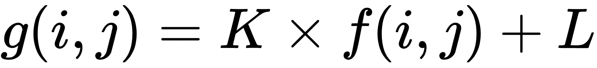

这种操作可以应用于灰度图像和 RGB 图像。对于 RGB 图像，每个通道将分别使用此操作进行修改。以下是在改变 *K* 和 *L* 时的结果。左边的第一幅图像是输入图像。在第二幅图像中，`*K*=0.5` 且 `*L*=0.0`，而在第三幅图像中，*K* 设置为 `1.0` 且 *L* 为 `10`。对于右边的最终图像，`*K*=0.7` 且 `*L*=25`。正如你所见，改变 *K* 会改变图像的亮度，而改变 *L* 会改变图像的对比度：

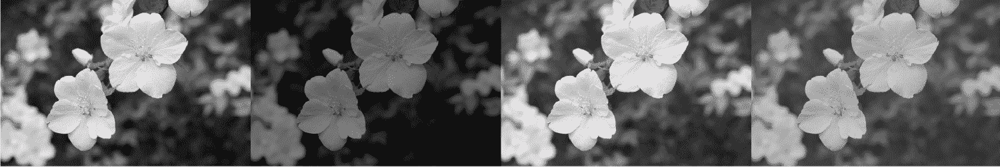

这张图像可以用以下代码生成：

```py
import numpy as np 
import matplotlib.pyplot as plt 
import cv2 

def point_operation(img, K, L):
    """
    Applies point operation to given grayscale image
    """
    img = np.asarray(img, dtype=np.float)
    img = img*K + L
    # clip pixel values
    img[img > 255] = 255 
    img[img < 0] = 0
    return np.asarray(img, dtype = np.int)

def main():
    # read an image 
    img = cv2.imread('../figures/flower.png')
    gray = cv2.cvtColor(img, cv2.COLOR_BGR2GRAY)

    # k = 0.5, l = 0
    out1 = point_operation(gray, 0.5, 0)

    # k = 1., l = 10
    out2 = point_operation(gray, 1., 10)

    # k = 0.8, l = 15
    out3 = point_operation(gray, 0.7, 25)

    res = np.hstack([gray,out1, out2, out3])
    plt.imshow(res, cmap='gray')
    plt.axis('off')

    plt.show()

if __name__ == '__main__':
    main()
```

# 2D 线性过滤器

虽然前面的过滤器是一个基于点的过滤器，但图像像素周围也有信息。在之前的花朵图像中，花瓣中的像素值都是黄色。如果我们选择花瓣中的一个像素并移动，这些值将非常接近。这为图像提供了一些更多信息。为了在过滤中提取这些信息，有几种邻域过滤器。

在邻域过滤器中，有一个核矩阵，它捕捉像素周围的局部区域信息。为了解释这些过滤器，让我们从一个输入图像开始，如下所示：

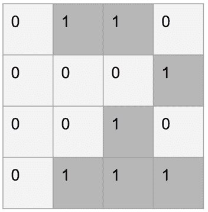

这是一个简单的二值图像，数字为 2。要从这个图像中获取某些信息，我们可以直接使用所有像素值。但为了简化，我们可以应用过滤器。我们定义一个比给定图像小的矩阵，它在目标像素的邻域内操作。这个矩阵被称为 **核**；以下是一个示例：

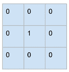

该操作首先通过将核矩阵叠加到原始图像上，然后取对应像素的乘积并返回所有乘积的总和来定义。在以下图中，原始图像下方的 3 x 3 区域与给定的核矩阵叠加，并且核和图像中的对应像素值相乘。结果图像显示在右侧，是所有先前像素乘积的总和：

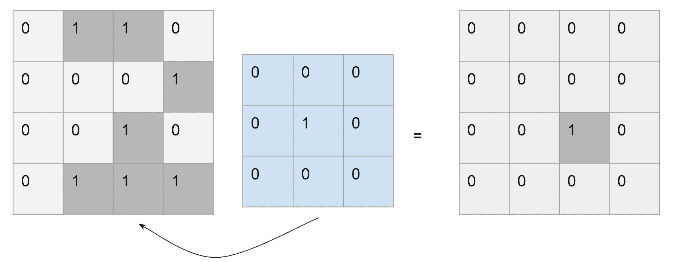

此操作通过沿图像行和列滑动核来重复进行。这可以像以下代码那样实现。我们将在接下来的章节中看到应用此操作在图像上的效果：

```py
# design a kernel matrix, here is uniform 5x5
kernel = np.ones((5,5),np.float32)/25

# apply on the input image, here grayscale  input
dst = cv2.filter2D(gray,-1,kernel)
```

然而，正如之前所看到的，角落像素将产生巨大影响，并导致图像尺寸减小，因为核在重叠时将超出图像区域。这会在图像边界处产生黑色区域或空洞。为了纠正这一点，有一些常用的技术：

+   使用常数值（可能是 0 或 255）填充角落，默认情况下`OpenCV`将使用此值。

+   沿边缘将像素镜像到外部区域

+   在图像周围创建像素模式

这些选择将取决于手头的任务。在常见情况下，填充能够生成令人满意的结果。

核的效果最为关键，因为这些值的改变会显著改变输出。我们将首先看到简单的基于核的过滤器，并看到在改变大小时的输出效果。

# 盒式滤波器

此过滤器将像素值平均化，如核矩阵如下所示：

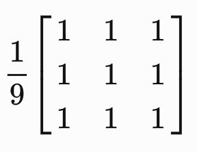

应用此过滤器会导致图像模糊。结果如下所示：

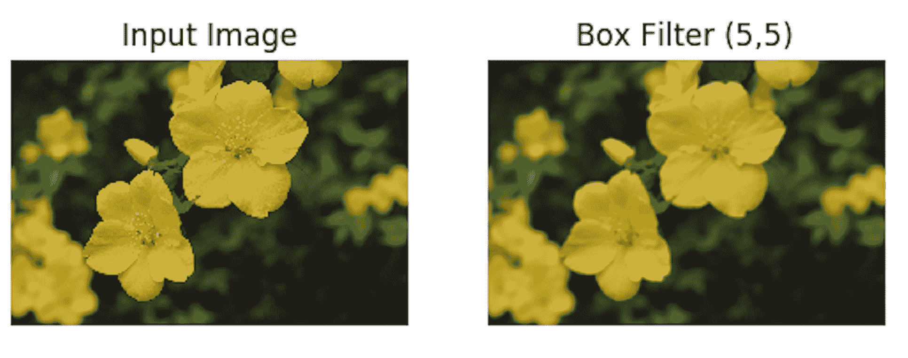

在图像的频域分析中，此过滤器是一个低通滤波器。频域分析是通过图像的傅里叶变换来完成的，这超出了本介绍的范畴。我们可以看到，随着核大小的改变，图像变得越来越模糊：

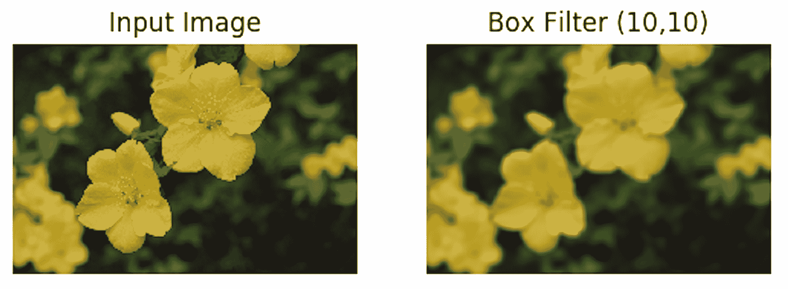

随着核大小的增加，我们可以观察到结果图像变得越来越模糊。这是由于在应用核的小邻域内平均峰值值。应用 20 x 20 大小核的结果可以在以下图像中看到：

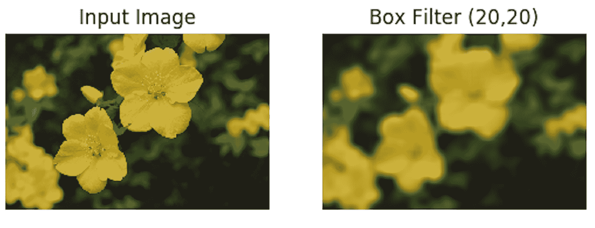

然而，如果我们使用一个非常小的（3, 3）大小的过滤器，由于核大小与照片大小相比相当小，因此对输出几乎没有影响。在大多数应用中，核大小是根据图像大小进行启发式设置的：

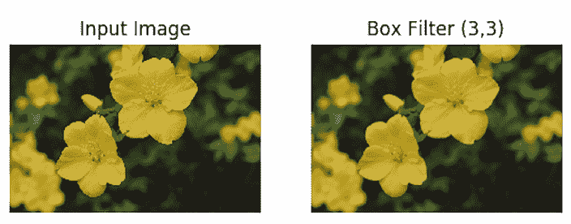

生成盒式滤波图像的完整代码如下：

```py
def plot_cv_img(input_image, output_image): 
    """ 
    Converts an image from BGR to RGB and plots 
    """ 

    fig, ax = plt.subplots(nrows=1, ncols=2)

    ax[0].imshow(cv2.cvtColor(input_image, cv2.COLOR_BGR2RGB)) 
    ax[0].set_title('Input Image')
    ax[0].axis('off')

    ax[1].imshow(cv2.cvtColor(output_image, cv2.COLOR_BGR2RGB)) 
    ax[1].set_title('Box Filter (5,5)')
    ax[1].axis('off') 
    plt.show()

def main():
    # read an image 
    img = cv2.imread('../figures/flower.png')

    # To try different kernel, change size here.  
    kernel_size = (5,5)

    # opencv has implementation for kernel based box blurring
    blur = cv2.blur(img,kernel_size)

    # Do plot
    plot_cv_img(img, blur)

if __name__ == '__main__':
    main()
```

# 线性滤波器的属性

几个计算机视觉应用是由输入照片到输出的逐步转换组成的。这很容易做到，因为与常见类型的过滤器（即线性过滤器）相关联的几个属性：线性过滤器：

+   线性过滤器是可交换的，这意味着我们可以以任何顺序对过滤器执行乘法运算，结果仍然相同：

*a * b = b * a*

+   它们在本质上具有关联性，这意味着应用过滤器的顺序不会影响结果：

*(a * b) * c = a * (b * c)*

+   即使在两个过滤器求和的情况下，我们也可以先进行求和然后应用过滤器，或者我们也可以分别应用过滤器然后求和结果。整体结果仍然相同：

*b = (k+l) * a*

+   将缩放因子应用于一个过滤器并将其乘以另一个过滤器等同于首先将两个过滤器相乘，然后应用缩放因子

这些属性在后续处理计算机视觉任务，如目标检测、分割等时起着重要作用。这些过滤器的适当组合可以增强信息提取的质量，从而提高准确性。

# 非线性过滤器

虽然在许多情况下线性过滤器足以获得所需的结果，但在几个其他用例中，使用非线性过滤器可以显著提高性能。正如其名所示，这些过滤器由更复杂的操作组成，具有某种非线性，因此这些过滤器不遵循线性过滤器的某些或所有属性。

我们将通过实现来理解这些过滤器。

# 平滑照片

应用具有硬边缘的盒式过滤器不会在输出照片上产生平滑的模糊效果。

为了改进这一点，过滤器可以在边缘处变得更加平滑。这类流行的过滤器之一是**高斯过滤器**。这是一个非线性过滤器，它增强了中心像素的效果，并随着像素远离中心而逐渐减少效果。数学上，高斯函数如下所示：

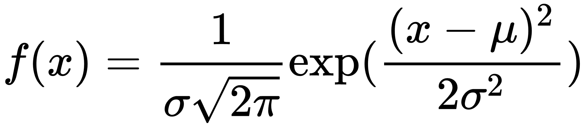

其中 μ 是均值，σ 是方差。

在二维离散域中，此类过滤器的一个示例核矩阵如下所示：

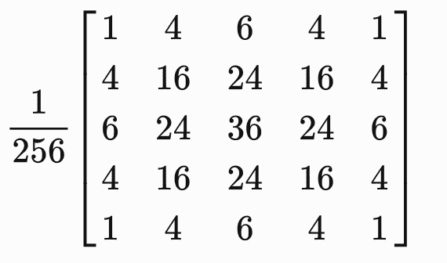

这个二维数组以归一化形式使用，并且该滤波器的影响也取决于其宽度，通过改变核宽度，在后续章节中讨论的输出效果会有所不同。应用高斯核作为过滤器可以去除高频成分，从而去除强烈的边缘，因此照片变得模糊：

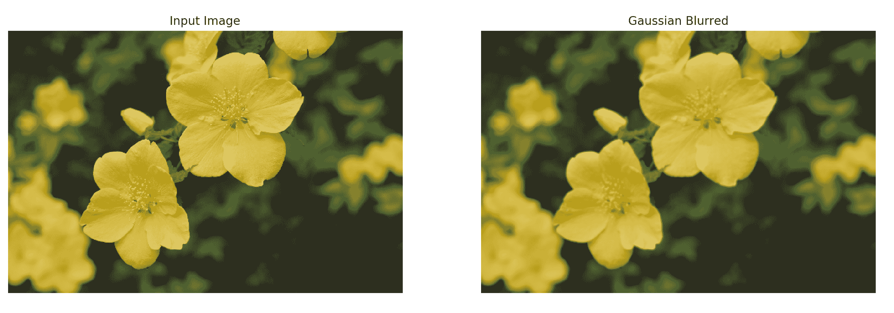

虽然这个过滤器比盒式过滤器具有更好的模糊效果，但使用 OpenCV 的实现也非常简单：

```py
def plot_cv_img(input_image, output_image): 
    """ 
    Converts an image from BGR to RGB and plots 
    """ 
    fig, ax = plt.subplots(nrows=1, ncols=2)

    ax[0].imshow(cv2.cvtColor(input_image, cv2.COLOR_BGR2RGB)) 
    ax[0].set_title('Input Image')
    ax[0].axis('off')

    ax[1].imshow(cv2.cvtColor(output_image, cv2.COLOR_BGR2RGB)) 
    ax[1].set_title('Gaussian Blurred')
    ax[1].axis('off')
    plt.show()

def main():
    # read an image 
    img = cv2.imread('../figures/flower.png')

    # apply gaussian blur,

    # kernel of size 5x5, 
    # change here for other sizes 
    kernel_size = (5,5)
    # sigma values are same in both direction 
    blur = cv2.GaussianBlur(img,(5,5),0)

    plot_cv_img(img, blur)

if __name__ == '__main__':
    main()
```

# 直方图均衡化

基本点操作，如改变亮度和对比度，有助于提高照片质量，但需要手动调整。使用直方图均衡化技术，这些可以通过算法找到，并创建出更好看的照片。直观上，这种方法试图将最亮的像素设置为白色，将较暗的像素设置为黑色。其余像素值相应缩放。这种缩放是通过将原始强度分布转换为捕获所有强度分布来执行的。以下是一个均衡化的示例：

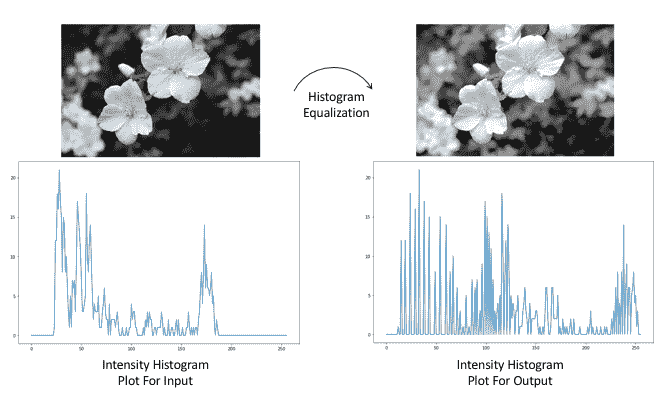

前面的图像是直方图均衡化的一个示例。在右侧是输出，如图所示，对比度显著增加。输入直方图显示在左侧底部图中的底部图，可以观察到并非所有颜色都在图像中。应用均衡化后，结果直方图如图右侧底部图所示。为了在图像中可视化均衡化的结果，输入和结果在以下图中堆叠在一起：

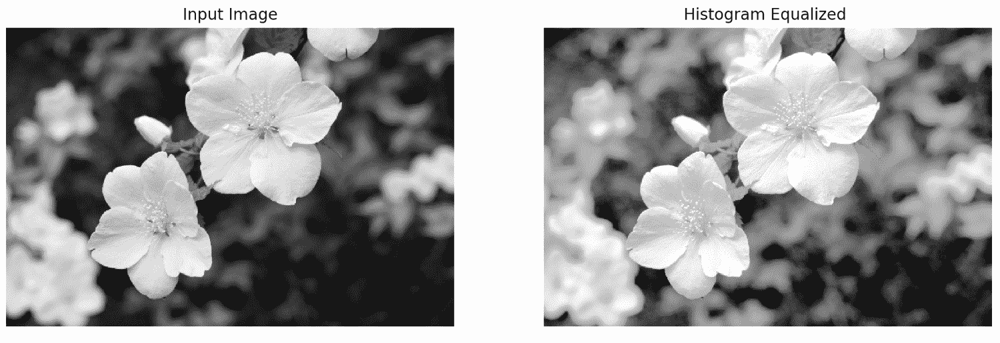

前面照片的代码如下：

```py
def plot_gray(input_image, output_image): 
    """ 
    Converts an image from BGR to RGB and plots 
    """ 
    # change color channels order for matplotlib 
    fig, ax = plt.subplots(nrows=1, ncols=2)

    ax[0].imshow(input_image, cmap='gray') 
    ax[0].set_title('Input Image')
    ax[0].axis('off')

    ax[1].imshow(output_image, cmap='gray') 
    ax[1].set_title('Histogram Equalized ')
    ax[1].axis('off') 

    plt.savefig('../figures/03_histogram_equalized.png')

    plt.show()

def main():
    # read an image 
    img = cv2.imread('../figures/flower.png')

    # grayscale image is used for equalization
    gray = cv2.cvtColor(img, cv2.COLOR_BGR2GRAY)

    # following function performs equalization on input image     
    equ = cv2.equalizeHist(gray)

    # for visualizing input and output side by side
    plot_gray(gray, equ)

if __name__ == '__main__':
    main()
```

# 中值滤波

此滤波器使用与邻域滤波相同的技巧；关键技巧是使用中值值。因此，该滤波器是非线性的。它在去除如盐和胡椒等尖锐噪声方面非常有用。

与使用邻域像素值的乘积或和不同，此滤波器计算该区域的中间值。这导致区域中随机峰值值的移除，这可能是由于盐和胡椒噪声等噪声引起的。以下图示展示了使用不同内核大小创建输出时的进一步说明。

在此图像中，首先输入加上通道随机噪声如下：

```py
# read the image
flower = cv2.imread('../figures/flower.png')

# initialize noise image with zeros
noise = np.zeros(flower.shape[:2])

# fill the image with random numbers in given range
cv2.randu(noise, 0, 256)

# add noise to existing image, apply channel wise
noise_factor = 0.1
noisy_flower = np.zeros(flower.shape)
for i in range(flower.shape[2]):
    noisy_flower[:,:,i] = flower[:,:,i] + np.array(noise_factor*noise, dtype=np.int)

# convert data type for use
noisy_flower = np.asarray(noisy_flower, dtype=np.uint8)
```

创建的噪声图像用于中值滤波如下：

```py
# apply median filter of kernel size 5
kernel_5 = 5
median_5 = cv2.medianBlur(noisy_flower,kernel_5)

# apply median filter of kernel size 3
kernel_3 = 3
median_3 = cv2.medianBlur(noisy_flower,kernel_3)
```

在以下照片中，你可以看到通过改变内核大小（括号中所示）得到的结果照片。最右边的是其中最平滑的：

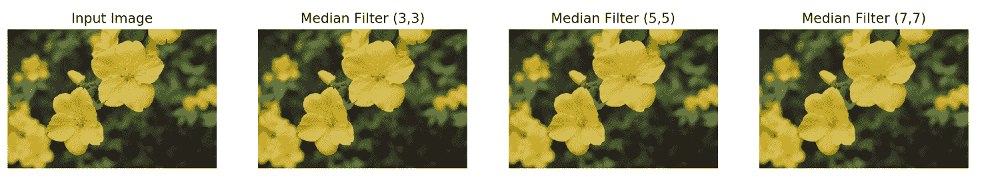

中值模糊的最常见应用是在智能手机应用程序中，它过滤输入图像并添加额外的伪影以添加艺术效果。

生成前面照片的代码如下：

```py
def plot_cv_img(input_image, output_image1, output_image2, output_image3): 
    """ 
    Converts an image from BGR to RGB and plots 
    """ 

    fig, ax = plt.subplots(nrows=1, ncols=4)

    ax[0].imshow(cv2.cvtColor(input_image, cv2.COLOR_BGR2RGB)) 
    ax[0].set_title('Input Image')
    ax[0].axis('off')

    ax[1].imshow(cv2.cvtColor(output_image1, cv2.COLOR_BGR2RGB)) 
    ax[1].set_title('Median Filter (3,3)')
    ax[1].axis('off')

    ax[2].imshow(cv2.cvtColor(output_image2, cv2.COLOR_BGR2RGB)) 
    ax[2].set_title('Median Filter (5,5)')
    ax[2].axis('off') 

    ax[3].imshow(cv2.cvtColor(output_image3, cv2.COLOR_BGR2RGB)) 
    ax[3].set_title('Median Filter (7,7)')
    ax[3].axis('off')

    plt.show()

def main():
    # read an image 
    img = cv2.imread('../figures/flower.png')

    # compute median filtered image varying kernel size
    median1 = cv2.medianBlur(img,3)
    median2 = cv2.medianBlur(img,5)
    median3 = cv2.medianBlur(img,7)

    # Do plot
    plot_cv_img(img, median1, median2, median3)

if __name__ == '__main__':
    main()
```

# 图像梯度

这些是更 *边缘检测器* 或照片中的急剧变化。图像梯度在目标检测和分割任务中广泛使用。在本节中，我们将探讨如何计算图像梯度。首先，图像导数是应用内核矩阵，该矩阵计算方向上的变化。

索贝尔滤波器就是这样一种滤波器和内核，*x* 方向的内核如下所示：

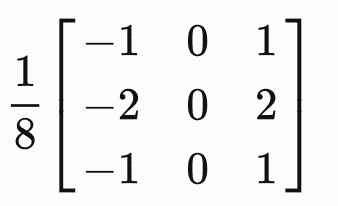

在这里，在 *y* 方向上：

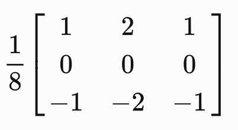

这与线性盒式滤波器以类似的方式应用，通过在叠加的核上计算与照片的值。然后滤波器沿着图像移动以计算所有值。以下是一些示例结果，其中 *X* 和 *Y* 表示 Sobel 核的方向：

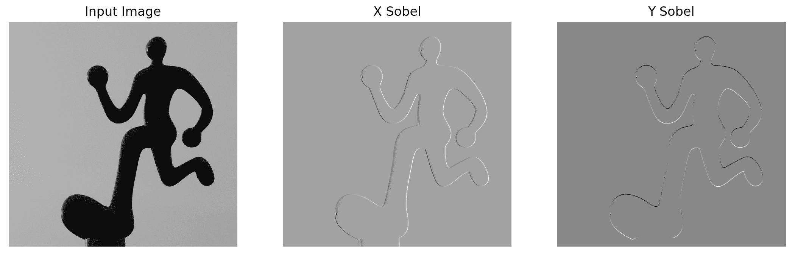

这也被称为相对于给定方向（此处为 X 或 Y）的图像导数。较亮的生成照片（中间和右侧）是正梯度，而较暗的区域表示负梯度，灰色为零。

虽然 Sobel 滤波器对应于照片的一阶导数，但拉普拉斯滤波器给出照片的二阶导数。拉普拉斯滤波器也以类似的方式应用于 Sobel：

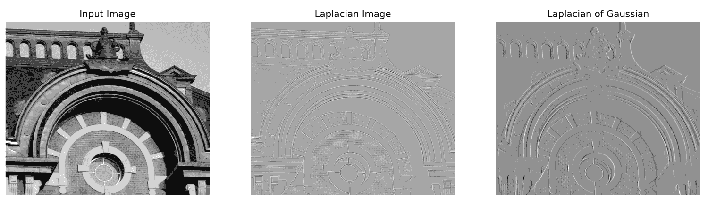

获取 Sobel 和拉普拉斯滤波器的代码如下：

```py
# sobel 
x_sobel = cv2.Sobel(img,cv2.CV_64F,1,0,ksize=5)
y_sobel = cv2.Sobel(img,cv2.CV_64F,0,1,ksize=5)

# laplacian
lapl = cv2.Laplacian(img,cv2.CV_64F, ksize=5)

# gaussian blur
blur = cv2.GaussianBlur(img,(5,5),0)
# laplacian of gaussian
log = cv2.Laplacian(blur,cv2.CV_64F, ksize=5)
```

# 图像的变换

图像上的变换通常被称为几何变换，应用于照片。还有其他几种变换，但在这个部分我们将讨论几何变换。这些包括但不限于移动图像、沿轴旋转图像或将其投影到不同的平面上。

变换的核心是我们图像的矩阵乘法。我们将查看这个矩阵的不同组成部分以及生成的图像。

# 平移

在任何方向上移动图像可以通过创建一个变换矩阵并将变换应用于我们的图像来完成。仅平移的变换矩阵如下：

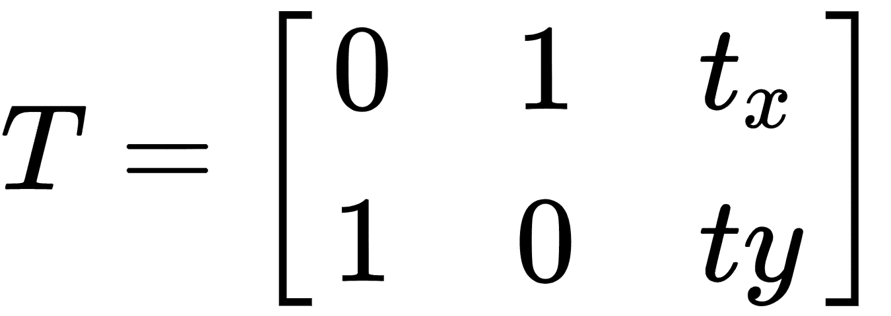

其中 *t[x]* 是图像中 *x* 方向的平移，*t[y]* 是图像中 *y* 方向的平移。选择不同的平移矩阵值，结果如下所示：

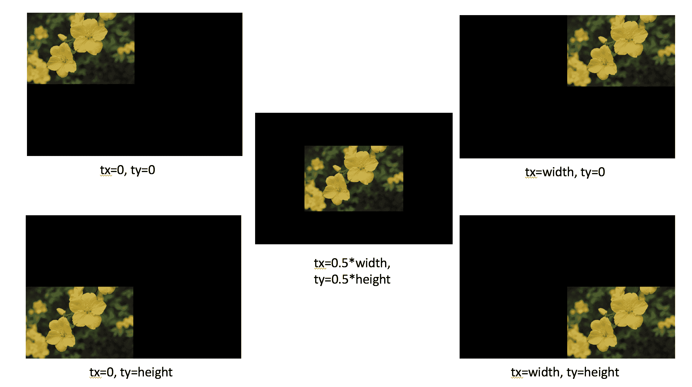

在前面的图中，输出图像比输入图像大，以显示平移的效果，否则只有图像的可见区域（位于原始图像大小内）将被显示。

创建此平移的代码如下，在此处更改 `tx` 和 `ty` 的值以生成不同的平移：

```py
# input shape
w, h = flower.shape[1], flower.shape[0]

# create translation matrix
tx = w/2 # half of width
ty = h/2 # half of height
translation_matrix = np.float32([[1,0,tx],
                                 [0,1,ty]])

# apply translation operation using warp affine function. 
output_size = (w*2,h*2)
translated_flower = cv2.warpAffine(flower, translation_matrix, output_size)
```

# 旋转

与平移类似，通过创建一个变换矩阵也可以旋转图像。在 `OpenCV` 中，给定一个旋转角度 θ，创建一个以下形式的旋转矩阵：

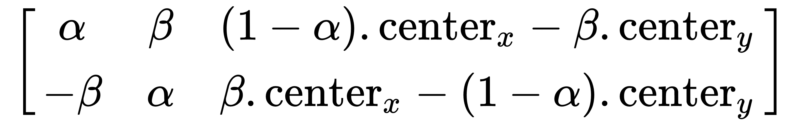

其中，

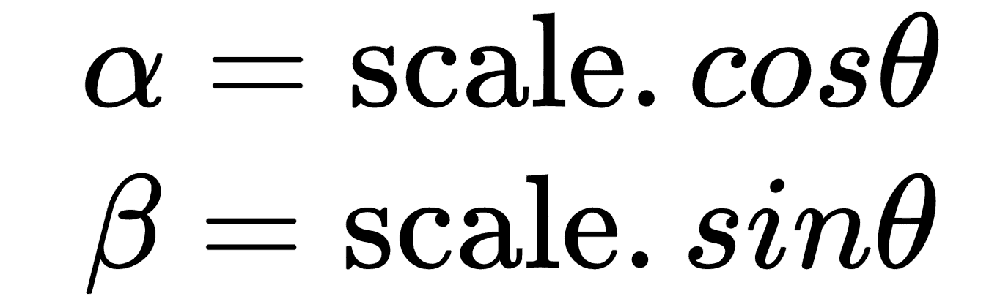

应用结果的示例如下：

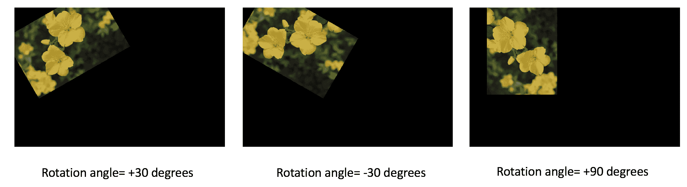

对于前面的截图，代码如下：

```py
# input shape
w, h = flower.shape[1], flower.shape[0]

# create rotation matrix
rot_angle = 90 # in degrees
scale = 1 # keep the size same
rotation_matrix = cv2.getRotationMatrix2D((w/2,h/2),rot_angle,1)

# apply rotation using warpAffine 
output_size = (w*2,h*2)
rotated_flower = cv2.warpAffine(flower,rotation_matrix,output_size)
```

类似地，也可以通过结合旋转和变换以及缩放来完成变换，从而保持线条之间的角度。

# 斜变换

使用仿射变换，输出中只保留平行线。以下是一个示例输出图像：

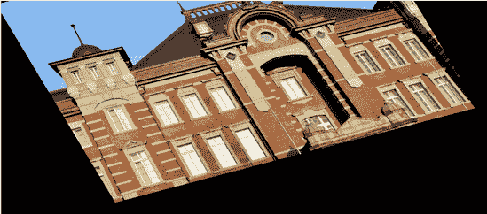

上一张图像的代码如下：

```py
# create transformation matrix form preselected points
pts1 = np.float32([[50,50],[200,50],[50,200]])
pts2 = np.float32([[10,100],[200,50],[100,250]])

affine_tr = cv2.getAffineTransform(pts1,pts2)
transformed = cv2.warpAffine(img, affine_tr, (img.shape[1]*2,img.shape[0]*2))
```

# 图像金字塔

塔形结构指的是对照片进行缩放，要么增加分辨率，要么降低分辨率。这些通常用于提高计算机视觉算法的计算效率，例如在大型数据库中进行图像匹配。在这种情况下，图像匹配是在下采样图像上计算的，然后对图像的搜索会迭代地细化以获得更高分辨率的图像。

下采样和上采样通常取决于像素选择过程。其中最简单的过程是选择交替的行和列像素值，以创建照片的下采样版本，如下所示：

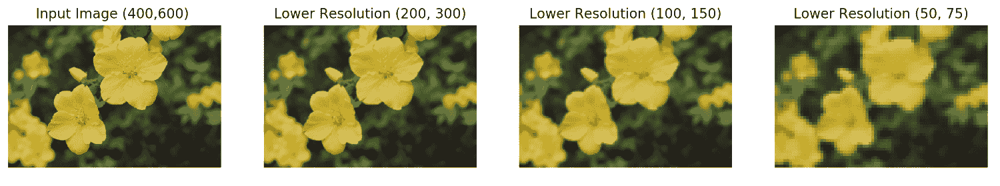

然而，如果我们尝试从上一图最右侧的图片上采样，结果看起来如下：

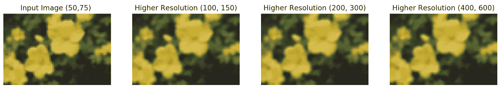

很容易看出，上图最右侧的图片与最初的原始图片不同。这是因为我们在下采样过程中丢失了信息，因此图像不能以与原始图像相同的方式重建。在`OpenCV`中，在下采样或上采样之前，也会对输入图像进行模糊处理。这也进一步使得保持分辨率完整变得更加困难。

下采样代码如下：

```py
# downsample image by halving both width and height
# input:(h, w) --> output:(h/2, w/2)
lower_resolution_img = cv2.pyrDown(img)
```

对于将图像上采样到其高度和宽度的两倍，如下所示：

```py
# Upsamples image by doubling both width and height
# input:(h, w) --> output:(h*2, w*2)
higher_resolution_img = cv2.pyrUp(img)
```

# 摘要

在本章中，我们通过应用各种操作开始了初始图像分析。我们从点滤波开始讨论，并扩展到更复杂的线性以及非线性滤波。我们看到了结果的可视化，例如在核大小等参数上的变化。非线性滤波器，如直方图均衡化，可以进一步调整那些用线性滤波器难以处理的图像。本章引入的图像梯度在复杂任务中非常常见，如目标检测、图像分割等。我们还看到了各种变换方法，如平移、旋转和仿射变换，以及不同参数选择下的输出可视化。这些变换可以以级联方式应用，以创建组合变换结果。最后，介绍了图像下采样和上采样方法，这在使计算更快或提取更丰富信息方面起着关键作用。

在下一章中，我们将讨论不同的特征和特征提取方法，并介绍每个方法的重要性。
