# 第四章：什么是特征？

在上一章中，我们的主要关注点是过滤图像并在其上应用不同的变换。这些技术是分析图像的好方法，但对于大多数计算机视觉任务来说并不足够。例如，如果我们为一家商店制作一个产品检测器，仅计算边缘可能不足以判断图像是橙子还是苹果。另一方面，如果一个人被赋予同样的任务，区分橙子和苹果是非常直观的。这是因为人类感知结合了多个特征，例如纹理、颜色、表面、形状、反射等，以区分一个物体与另一个物体。这促使我们寻找与物体复杂特征相关的更多细节。这些复杂特征可以用于高级图像视觉任务，如图像识别、搜索等。然而，也有情况是有人直接撞上了玻璃墙，这是由于无法找到足够多的特征来判断是空旷空间还是玻璃。

在本章中，我们首先将解释特征及其在计算机视觉中的重要性。在章节的后面部分，我们将介绍不同类型的特征提取器，如 Harris 角点检测器、FAST 关键点检测器、ORB 特征检测器。使用 OpenCV 描述了使用每个提取器可视化关键点的方法。最后，通过两个类似的应用展示了 ORB 特征的有效性。我们还将简要讨论黑盒特征。

# 特征用例

以下是一些在计算机视觉中流行的通用应用：

+   我们有两张图像，我们想要量化这两张图像是否匹配。假设一个比较度量，当我们的比较度量值大于阈值时，我们说图像匹配。

+   在另一个例子中，我们有一个大型图像数据库，对于一张新图像，我们想要执行类似于匹配的操作。而不是为每张图像重新计算一切，我们可以存储一个更小、更容易搜索且足够鲁棒的图像表示。这通常被称为图像的特征向量。一旦有新图像到来，我们提取新图像的相似表示，并在先前生成的数据库中搜索最近的匹配。这种表示通常用特征来表述。

+   此外，在寻找物体的案例中，我们有一个物体的或区域的较小图像，称为**模板**。目标是检查图像是否包含这个模板。这需要将模板中的关键点与给定的样本图像进行匹配。如果匹配值大于阈值，我们可以说样本图像有一个与给定模板相似的区域。为了进一步增强我们的发现，我们还可以显示模板图像在样本图像中的位置。

同样，计算机视觉系统需要学习描述对象的几个特征，以便于与其他对象区分开来。

当我们设计软件在图像中进行图像匹配或目标检测时，检测的基本流程是从机器学习角度制定的。这意味着我们取一组图像，提取显著信息，学习我们的模型，并在新图像上使用学习到的模型来检测相似对象。在本节中，我们将进一步探讨这一点。

通常，图像匹配过程如下所示：

+   第一步是从给定图像中提取鲁棒特征。这涉及到在整个图像中搜索可能的特征，然后对其进行阈值处理。有几种选择特征的技术，如 SIFT[3]、SURF[4]、FAST[5]、BRIEF[6]、ORB 检测器[2]等。在某些情况下，提取的特征需要转换为更描述性的形式，以便模型学习或可以存储以供重新读取。

+   在特征匹配的情况下，我们给定一个样本图像，并希望查看它是否与参考图像匹配。在特征检测和提取之后，如前所述，形成一个距离度量来计算样本特征与参考特征之间的距离。如果这个距离小于阈值，我们可以说这两张图像是相似的。

+   对于特征跟踪，我们省略了之前解释过的特征匹配步骤。不是全局匹配特征，而是更关注邻域匹配。这在图像稳定、目标跟踪或运动检测等情况下使用。

# 数据集和库

在本章中，我们将使用`OpenCV`库进行特征检测和匹配。图表使用`matplotlib`生成。我们将使用自定义图像来展示各种算法的结果。然而，这里提供的代码也应该适用于摄像头或其他自定义图像。

# 特征为什么重要？

特征在创建高质量计算机视觉系统中起着重要作用。我们可以想到的第一个特征是**像素**。为了创建一个比较工具，我们使用两个图像像素值之间平方距离的平均值。然而，这些并不稳健，因为很少会看到两张完全相同的图像。图像之间总是存在一些相机移动和光照变化，计算像素值之间的差异将会给出很大的值，即使图像非常相似。

然而，还有其他类型的特征，它们考虑了图像的局部和全局属性。局部属性指的是图像周围邻域的图像统计信息，而全局属性是指考虑整体图像统计信息。由于图像的局部和全局属性都提供了关于图像的重要信息，因此计算能够捕捉这些信息的特征将使它们在应用中更加鲁棒和准确。

最基本的特征检测形式是点特征。在我们的智能手机上创建全景图等应用中，每张图像都与对应的上一张图像拼接。这种图像拼接需要以像素级精度正确对齐重叠的图像。计算两张图像之间的对应像素需要像素匹配。

# 哈里斯角检测

我们开始使用哈里斯角检测[1]技术进行特征点检测。在这个过程中，我们首先选择一个矩阵，称为**窗口**，其大小与图像大小相比较小。

基本思想是首先将选定的窗口叠加到输入图像上，并仅从输入图像中观察叠加区域。然后，将这个窗口在图像上移动，并观察新的叠加区域。在这个过程中，会出现三种不同的情况：

+   如果存在一个平面表面，那么无论窗口移动的方向如何，我们都无法看到窗口区域中的任何变化。这是因为窗口区域中没有边缘或角落。

+   在我们的第二种情况下，窗口在图像的边缘上叠加并发生了偏移。如果窗口沿着边缘的方向移动，我们将无法看到窗口中的任何变化。然而，如果窗口向任何其他方向移动，我们可以很容易地观察到窗口区域中的变化。

+   最后，如果窗口叠加在图像的角落上并且发生了偏移，而角落是两条边缘的交汇处，在大多数情况下，我们将能够观察到窗口区域中的变化。

哈里斯角检测（Harris Corner Detection）利用这个属性作为得分函数。从数学上讲，它表示为：

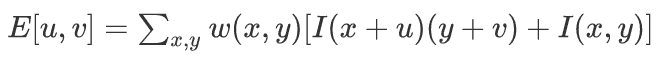

其中 *w* 是窗口，*u* 和 *v* 是偏移量，*I* 是图像像素值。输出 *E* 是目标函数，通过相对于 *u* 和 *v* 最大化这个函数，我们得到图像 *I* 中的角落像素。

哈里斯角检测的得分值将显示是否存在边缘、角落或平面表面。以下图中展示了不同类型图像的哈里斯角示例：

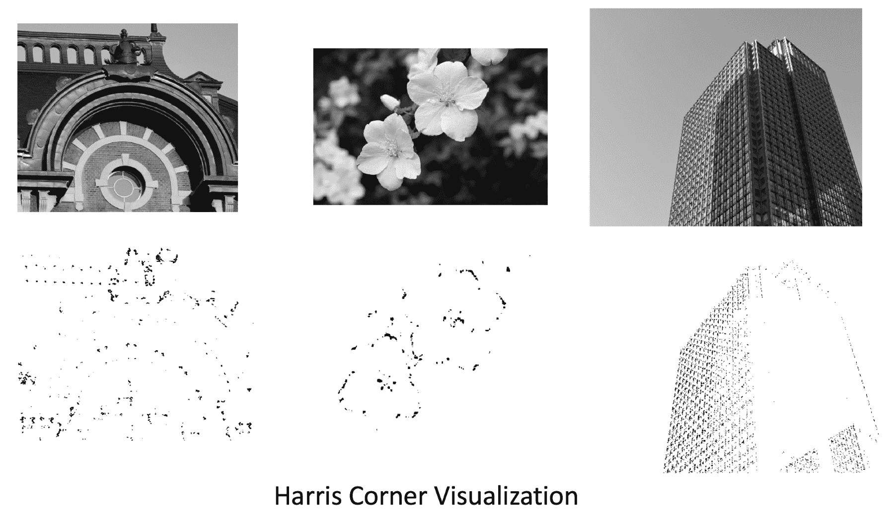

在前面的图中，上面一行是输入图像，下面一行是检测到的角落。这些角落用对应于输入图像位置的灰色像素值表示。为了生成给定彩色图像的角落图像，请使用以下代码：

```py
# load image and convert to grayscale
img = cv2.imread('../figures/flower.png')
gray = cv2.cvtColor(img, cv2.COLOR_BGR2GRAY)

# harris corner parameters
block_size = 4 # Covariance matrix size
kernel_size = 3 # neighbourhood kernel
k = 0.01 # parameter for harris corner score

# compute harris corner
corners = cv2.cornerHarris(gray, block_size, kernel_size, k)

# create corner image
display_corner = np.ones(gray.shape[:2])
display_corner = 255*display_corner
# apply thresholding to the corner score
thres = 0.01 # more than 1% of max value
display_corner[corners>thres*corners.max()] = 10 #display pixel value

# set up display
plt.figure(figsize=(12,8))
plt.imshow(display_corner, cmap='gray')
plt.axis('off')
```

我们可以通过改变协方差矩阵块大小、邻域核大小和 Harris 分数参数等参数来为图像生成不同数量的角点。在下一节中，我们将看到更鲁棒的特征检测器。

# FAST 特征

许多特征检测器对于实时应用（如带有摄像头的机器人在街道上移动）没有用。任何延迟都可能导致机器人或整个系统的功能下降，甚至可能导致系统完全失效。特征检测不是机器人系统的唯一部分，但如果这影响了运行时间，它可能会对其他任务造成显著的开销，使其能够实时工作。

**FAST**（**加速段测试特征**）[5]，由 Edward Rosten 和 Tom Drummond 于 2006 年提出。该算法使用像素邻域来计算图像中的关键点。FAST 特征检测的算法如下：

1.  选择一个有趣的点候选像素**（i,j）**，其强度为*I (i,j)*：

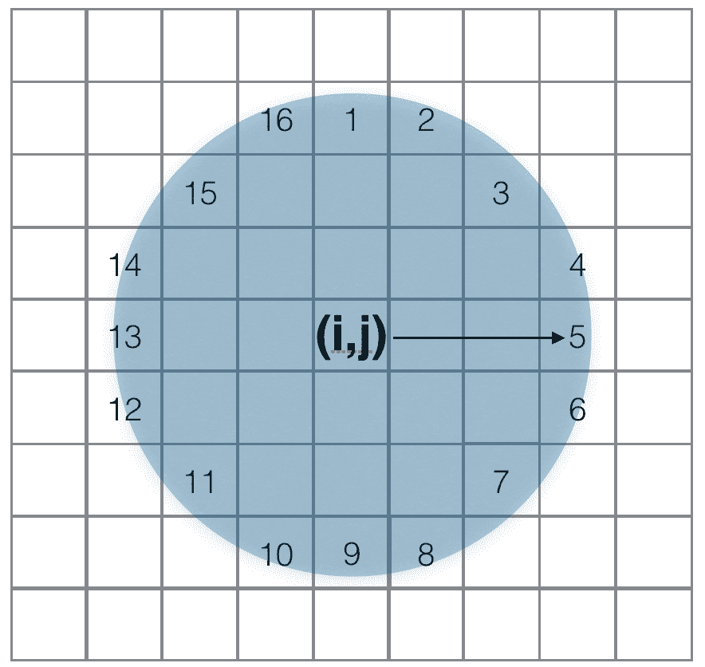

1.  在一个 16 像素的圆内，给定一个阈值*t*，估计*n*个相邻点，这些点的亮度比像素*(i,j)*的强度高一个阈值*t*，或者比*(i,j)*像素的强度低一个阈值*t*。这将成为*n*个像素，这些像素的亮度要么小于*(I(i,j) + t)*，要么大于*(I(i,j) - t)*。这个*n*被选为 12。

1.  在高速测试中，只查看四个像素（如图所示），位置为 1、9、5 和 13。这些像素中的至少三个像素的强度值决定了中心像素*p*是否为角点。如果这些值要么大于*(I(i,j) + t)*，要么小于*(I(i,j) - t)*，则中心像素被认为是角点。

在 OpenCV 中，计算 FAST 特征的步骤如下：

1.  使用`cv2.FastFeatureDetector_create()`初始化检测器

1.  设置阈值参数以过滤检测

1.  设置标志，如果需要使用非最大抑制来清除重复检测的邻域区域

1.  在输入图像上检测关键点并绘制它们

在以下图中，有不同阈值值的输入图像上的 FAST 角点（在小圆圈中）的图表。根据图像的不同，不同的阈值选择会产生不同数量的关键特征点：

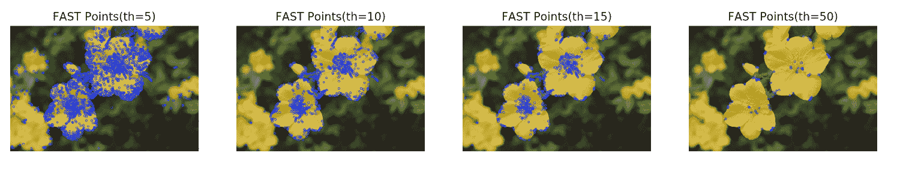

要生成上一图中的每个图像，请使用以下代码并更改阈值值：

```py
def compute_fast_det(filename, is_nms=True, thresh = 10):
 """
 Reads image from filename and computes FAST keypoints.
 Returns image with keypoints
 filename: input filename
 is_nms: flag to use Non-maximal suppression
 thresh: Thresholding value
 """
 img = cv2.imread(filename)

 # Initiate FAST object with default values
 fast = cv2.FastFeatureDetector_create() 

 # find and draw the keypoints
 if not is_nms:
 fast.setNonmaxSuppression(0)

 fast.setThreshold(thresh)

 kp = fast.detect(img,None)
 cv2.drawKeypoints(img, kp, img, color=(255,0,0))

 return img
```

以下图显示了在不同图像上具有不同阈值的同一检测器的变化：

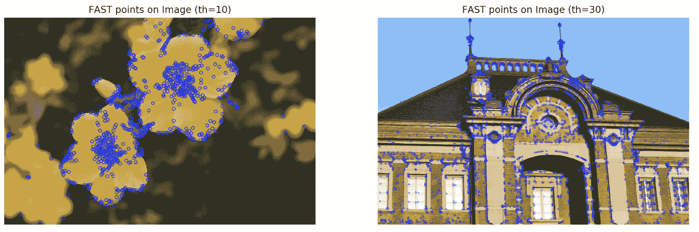

这表明参数的选择对于不同的图像至关重要。尽管一个常见的阈值值可能不适用于所有图像，但可以根据图像的相似性使用一个好的近似值。

# ORB 特征

使用先前描述的角点检测器计算速度快，然而在匹配两张图像时，很难选择哪两个图像角点对应于相应的像素。需要额外的信息来描述角点的属性。检测到的关键点（如角点）及其对应描述符的组合使得比较图像更加高效和鲁棒。

ORB 特征检测[2]由 Ethan Rublee 等人于 2011 年描述，并自那时起在各种应用中成为流行的特征之一。它结合了两个算法：具有方向组件的 FAST 特征检测器和 BRIEF 描述符，因此得名**Oriented FAST and Rotated BRIEF**（**ORB**）。使用 ORB 特征的主要优点是检测速度的快速性，同时保持鲁棒的检测。这使得它们在机器人视觉系统、智能手机应用等多种实时应用中非常有用。

在本章中，我们已经看到了 FAST 特征检测器，我们将进一步继续描述 BRIEF 描述符，并最终基于 ORB 检测器构建。

# FAST 特征限制

如前所述的 FAST 特征通过使用邻域像素计算图像中的角点。通过在像素周围的圆形区域内创建比较测试，特征可以快速计算。FAST 特征对于实时应用非常高效；这些特征不产生特征旋转信息。如果我们寻找的是方向不变的特征，这会带来限制。

在 ORB 中，FAST 特征与方向信息一起使用。使用 9 像素的圆形半径，一个从计算出的强度质心到角点中心的向量用于描述给定角点的方向。给定补丁的强度质心按以下方式计算：

+   对于图像 I 和补丁窗口，使用以下方法计算矩：

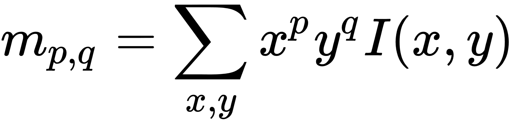

+   使用先前矩，给定补丁的强度质心给出如下：

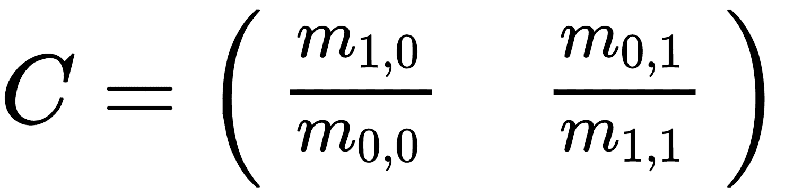

由于我们已经知道了补丁的中心*O*，连接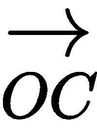的向量是补丁的方向。在接下来的章节中，我们将看到 ORB 特征检测器的整体实现，它使用这种方法。

# BRIEF 描述符及其限制

流行的特征描述符如 SIFT 或 SURF 分别输出 128 维和 64 维的大向量。在图像搜索等应用中，很可能会存储和搜索特征而不是原始图像。如果图像数量达到几百万，这会变得计算复杂，内存可能效率低下。在这种情况下，简单的降维是一个额外的步骤，可能会降低整体效率。由 Michael Calonder 及其合作者在*BRIEF: Binary Robust Independent Elementary Features*[6]中提出的描述符通过消耗更少的内存解决了这些问题。

BRIEF 计算图像小补丁中强度的差异，并将其表示为二进制字符串。这不仅使其更快，而且描述符保持了良好的精度。然而，BRIEF 中没有特征检测器，但与 FAST 检测器结合使其更有效。

# 使用 OpenCV 的 ORB 特征

以下代码使用了`OpenCV`中的 ORB 特征实现。

这是一个三步过程，具体描述如下：

+   首先创建一个 ORB 对象并更新参数值：

```py
orb = cv2.ORB_create()
# set parameters orb.setScoreType(cv2.FAST_FEATURE_DETECTOR_TYPE_9_16)
```

+   从之前创建的 ORB 对象中检测关键点：

```py
# detect keypoints
kp = orb.detect(img,None)
```

+   最后，计算每个检测到的关键点的描述符：

```py
# for detected keypoints compute descriptors. 
kp, des = orb.compute(img, kp)
```

ORB 关键点检测和描述符提取的整体代码如下：

```py
import numpy as np 
import matplotlib.pyplot as plt 
import cv2 
# With jupyter notebook uncomment below line 
# %matplotlib inline 
# This plots figures inside the notebook

def compute_orb_keypoints(filename):
 """
 Reads image from filename and computes ORB keypoints
 Returns image, keypoints and descriptors. 
 """
 # load image
 img = cv2.imread(filename)

 # create orb object
 orb = cv2.ORB_create()

 # set parameters 
 # FAST feature type
 orb.setScoreType(cv2.FAST_FEATURE_DETECTOR_TYPE_9_16)

 # detect keypoints
 kp = orb.detect(img,None)

 # for detected keypoints compute descriptors. 
 kp, des = orb.compute(img, kp)
 return img, kp, des
```

生成的关键点的示例如图所示（圆圈中）：

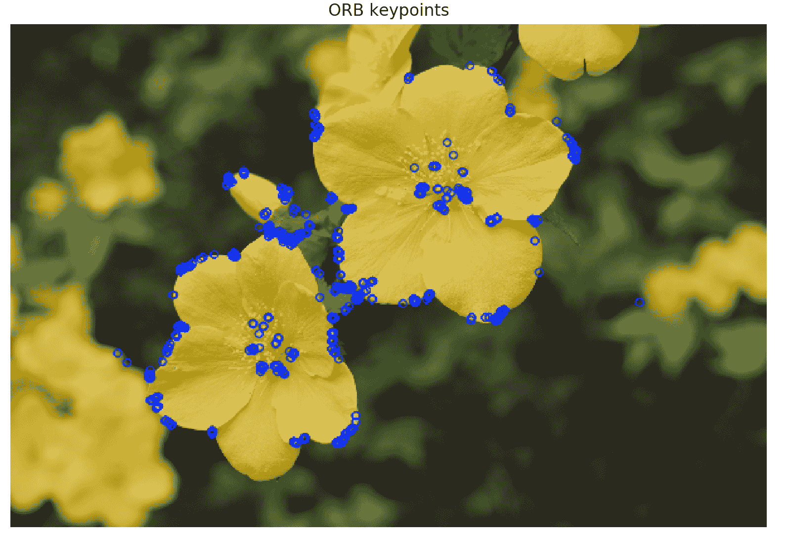

如您在以下图中所见，不同的图像为各种形状的物体产生了不同的特征点：

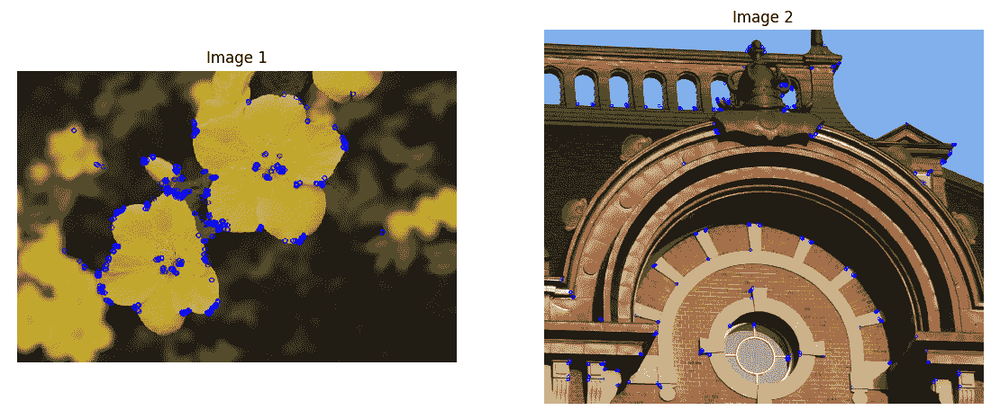

为了绘制之前展示的图像并使用不同的关键点，我们可以同时使用`OpenCV`和`Matplotlib`如下：

```py
def draw_keyp(img, kp):
 """
 Takes image and keypoints and plots on the same images
 Does not display it. 
 """
 cv2.drawKeypoints(img,kp,img, color=(255,0,0), flags=2) 
 return img

def plot_img(img, figsize=(12,8)):
 """
 Plots image using matplotlib for the given figsize
 """
 fig = plt.figure(figsize=figsize)
 ax = fig.add_subplot(1,1,1)

 # image need to be converted to RGB format for plotting
 ax.imshow(cv2.cvtColor(img, cv2.COLOR_BGR2RGB))
 plt.axis('off')
 plt.show()

def main():
 # read an image 
 filename = '../figures/flower.png'
 # compute ORB keypoints
 img1,kp1, des1 = compute_orb_keypoints(filename)
 # draw keypoints on image 
 img1 = draw_keyp(img1, kp1)
 # plot image with keypoints
 plot_img(img1)

if __name__ == '__main__':
 main()
```

在本节中，我们看到了 ORB 特征的公式化，它不仅结合了鲁棒特征，还为其他特征的比较提供了描述符。这是一个强大的特征检测器公式，然而，为不同的任务显式设计特征检测器将需要高效选择参数，例如 FAST 检测器的补丁大小、BRIEF 描述符参数等。对于非专家来说，设置这些参数可能是一项相当繁琐的任务。在下一节中，我们将从讨论黑盒特征及其在创建计算机视觉系统中的重要性开始。

# 黑盒特征

我们之前讨论的特征高度依赖于图像到图像的基础。在检测特征时观察到的挑战包括：

+   在光照变化的情况下，例如夜间图像或日光图像，像素强度值以及邻域区域会有显著差异

+   随着物体方向的变化，关键点描述符会显著变化。为了匹配相应的特征，需要正确选择描述符参数

由于这些挑战，这里使用的几个参数需要由专家进行调整。

近年来，在计算机视觉领域，神经网络发生了许多变化。它们的普及率因更高的准确性和更少的手动调整参数而上升。我们可以称它们为黑盒特征——尽管“黑”一词仅指它们的设计方式。在这些模型部署的大多数情况下，参数是通过训练学习的，并且需要参数设置的最小监督。黑盒建模特征检测有助于通过学习图像数据集来获得更好的特征。这个数据集包含图像的可能不同变体，因此，学习到的检测器甚至可以在图像类型广泛变化的情况下提取更好的特征。我们将在下一章中作为 CNN 研究这些特征检测器。

# 应用 – 在图像中找到你的对象

使用特征的最常见应用是给定一个对象，在图像中找到其最佳匹配。这通常被称为**模板匹配**，其中当前对象通常是一个称为**模板**的小窗口，目标是计算从该模板到目标图像的最佳匹配特征。存在几种解决方案，但为了理解起见，我们将使用 ORB 特征。

使用 ORB 特征，我们可以以以下暴力方式执行特征匹配：

+   计算每个图像（模板和目标）中的特征。

+   对于模板中的每个特征，比较之前在目标中检测到的所有特征。标准是通过匹配分数设置的。

+   如果特征对通过了标准，则它们被认为是匹配的。

+   绘制匹配以可视化。

作为先决条件，我们将遵循之前显示的代码来提取特征：

```py
def compute_orb_keypoints(filename):
 """
 Takes in filename to read and computes ORB keypoints
 Returns image, keypoints and descriptors 
 """

 img = cv2.imread(filename)
 # create orb object
 orb = cv2.ORB_create()

 # set parameters 
 orb.setScoreType(cv2.FAST_FEATURE_DETECTOR_TYPE_9_16)

 # detect keypoints
 kp = orb.detect(img,None)

 # using keypoints, compute descriptor
 kp, des = orb.compute(img, kp)
 return img, kp, des
```

一旦我们从每个图像中获得了关键点和描述符，我们就可以使用它们进行比较和匹配。

两个图像之间匹配关键点是一个两步过程：

+   创建所需的匹配器，指定要使用的距离度量。这里我们将使用汉明距离的暴力匹配：

```py
bf = cv2.BFMatcher(cv2.NORM_HAMMING2, crossCheck=True)
```

+   使用每个图像的关键点描述符进行匹配，执行如下：

```py
matches = bf.match(des1,des2)
```

在以下代码中，我们将展示使用对应描述符从一幅图像到另一幅图像匹配关键点的整体暴力方法：

```py
def brute_force_matcher(des1, des2):
 """
 Brute force matcher to match ORB feature descriptors
 des1, des2: descriptors computed using ORB method for 2 images
 returns matches 
 """
 # create BFMatcher object
 bf = cv2.BFMatcher(cv2.NORM_HAMMING2, crossCheck=True)
 # Match descriptors.
 matches = bf.match(des1,des2)

 # Sort them in the order of their distance.
 matches = sorted(matches, key = lambda x:x.distance)

 return matches
```

在以下图中，模板中的特征与原始图像进行了匹配。为了展示匹配的有效性，只显示了最佳匹配：

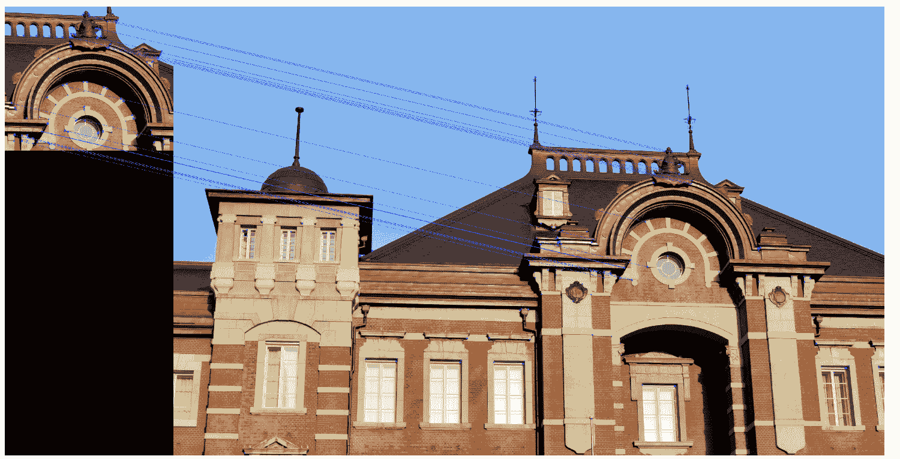

之前的特征匹配图像是通过以下代码创建的，其中我们使用一个样本模板图像与同一对象的较大图像进行匹配：

```py

def compute_img_matches(filename1, filename2, thres=10):
 """
 Extracts ORB features from given filenames
 Computes ORB matches and plot them side by side 
 """
 img1, kp1, des1 = compute_orb_keypoints(filename1)
 img2, kp2, des2 = compute_orb_keypoints(filename2)

 matches = brute_force_matcher(des1, des2)
 draw_matches(img1, img2, kp1, kp2, matches, thres)

def draw_matches(img1, img2, kp1, kp2, matches, thres=10):
 """
 Utility function to draw lines connecting matches between two images.
 """
 draw_params = dict(matchColor = (0,255,0),
 singlePointColor = (255,0,0),
 flags = 0)

 # Draw first thres matches.
 img3 = cv2.drawMatches(img1,kp1,img2,kp2,matches[:thres],None, **draw_params)
 plot_img(img3)

def main():
 # read an image 
 filename1 = '../figures/building_crop.jpg'
 filename2 = '../figures/building.jpg'

 compute_img_matches(filename1, filename2)

if __name__ == '__main__':
 main()
```

# 应用 – 它们是否相似？

在这个应用中，我们想通过之前描述的特征检测器来查看它们是否相似。为此，我们采用与之前提到的类似方法。第一步是计算每个图像的特征关键点和描述符。使用这些信息在一张图像和另一张图像之间进行匹配。如果有足够多的匹配，我们就可以舒适地说这两张图像是相似的。

对于先决条件，我们使用相同的 ORB 关键点和描述符提取器，但增加了图像的下采样：

```py
def compute_orb_keypoints(filename):
 """
 Takes in filename to read and computes ORB keypoints
 Returns image, keypoints and descriptors 
 """

 img = cv2.imread(filename)

 # downsample image 4x
 img = cv2.pyrDown(img) # downsample 2x
 img = cv2.pyrDown(img) # downsample 4x

 # create orb object
 orb = cv2.ORB_create()

 # set parameters 
 orb.setScoreType(cv2.FAST_FEATURE_DETECTOR_TYPE_9_16)

 # detect keypoints
 kp = orb.detect(img,None)

 kp, des = orb.compute(img, kp)
 return img, kp,  des
```

使用之前计算的关键点和描述符，匹配过程如下：

```py
def compute_img_matches(filename1, filename2, thres=10):
 """
 Extracts ORB features from given filenames
 Computes ORB matches and plot them side by side 
 """
 img1, kp1, des1 = compute_orb_keypoints(filename1)
 img2, kp2, des2 = compute_orb_keypoints(filename2)

 matches = brute_force_matcher(des1, des2)
 draw_matches(img1, img2, kp1, kp2, matches, thres)

def brute_force_matcher(des1, des2):
 """
 Brute force matcher to match ORB feature descriptors
 """
 # create BFMatcher object
 bf = cv2.BFMatcher(cv2.NORM_HAMMING2, crossCheck=True)
 # Match descriptors.
 matches = bf.match(des1,des2)

 # Sort them in the order of their distance.
 matches = sorted(matches, key = lambda x:x.distance)

 return matches

def draw_matches(img1, img2, kp1, kp2, matches, thres=10):
 """
 Utility function to draw lines connecting matches between two images.
 """
 draw_params = dict(matchColor = (0,255,0),
 singlePointColor = (255,0,0),
 flags = 0)

 # Draw first thres matches.
 img3 = cv2.drawMatches(img1,kp1,img2,kp2,matches[:thres],None, **draw_params)
 plot_img(img3)

def main():
 # read an image 
 filename2 = '../figures/building_7.JPG'
 filename1 = '../figures/building_crop.jpg'
 compute_img_matches(filename1, filename2, thres=20)

if __name__ == '__main__':
 main()
```

以下图所示为示例结果，其中输入是具有不同视点的相同对象。正确的匹配用连接线表示：

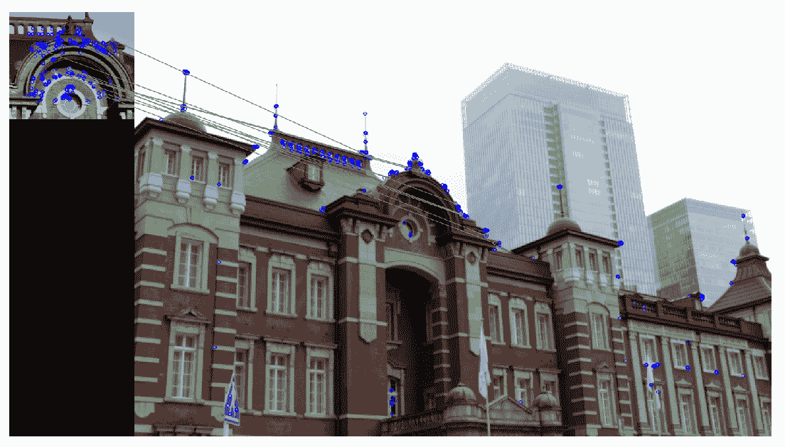

在本节中，我们看到了两种使用 ORB 关键点和暴力匹配器进行图像匹配的类似方法。通过使用更快的算法，如近似邻域匹配，可以进一步增强匹配效果。更快的匹配效果主要在提取了大量特征关键点的情况下才能看到。

# 摘要

在本章中，我们开始讨论特征及其在计算机视觉应用中的重要性。Harris 角点检测器用于检测运行时间至关重要的角点。这些可以在高速运行的嵌入式设备上运行。扩展到更复杂的检测器，我们看到了 FAST 特征，以及与 BRIEF 描述符结合，可以形成 ORB 特征。这些特征对不同的尺度和旋转都具有鲁棒性。最后，我们看到了使用 ORB 特征进行特征匹配的应用，以及金字塔下采样的使用。

关于黑盒特征的讨论将在下一章继续，届时将介绍神经网络，特别是卷积神经网络 (CNN)。

# 参考文献

+   Harris Chris, 和 Mike Stephens. *一种结合角点和边缘检测器*. 在 Alvey 视觉会议，第 15 卷，第 50 期，第 10-5244 页。1988 年。

+   Rublee Ethan, Vincent Rabaud, Kurt Konolige, 和 Gary Bradski. *ORB：SIFT 或 SURF 的有效替代方案*. 在 2011 年 IEEE 国际计算机视觉会议 (ICCV)，第 2564-2571 页。IEEE，2011 年。

+   Lowe David G. *从局部尺度不变特征进行物体识别*. 在 1999 年计算机视觉会议，第 7 届 IEEE 国际会议，第 2 卷，第 1150-1157 页。IEEE，1999 年。

+   Bay Herbert, Tinne Tuytelaars, 和 Luc Van Gool. *Surf：加速的鲁棒特征*. 计算机视觉 – ECCV 2006(2006): 404-417。

+   Rosten Edward, 和 Tom Drummond. *高速角点检测的机器学习*. 计算机视觉 – ECCV 2006(2006): 430-443。

+   Calonder Michael, Vincent Lepetit, Christoph Strecha, 和 Pascal Fua. *Brief：二进制鲁棒独立基本特征*. 计算机视觉 – ECCV 2010 (2010): 778-792。
