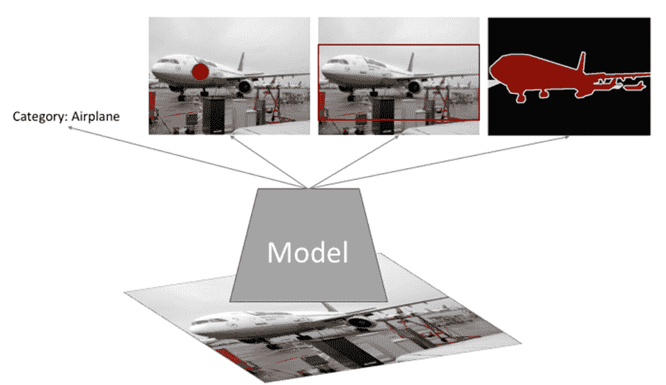
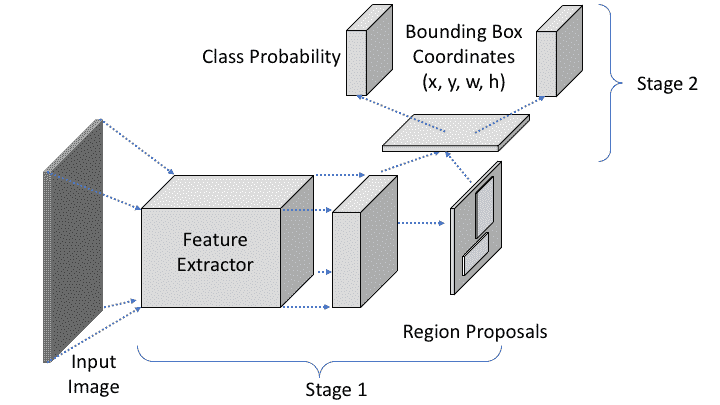
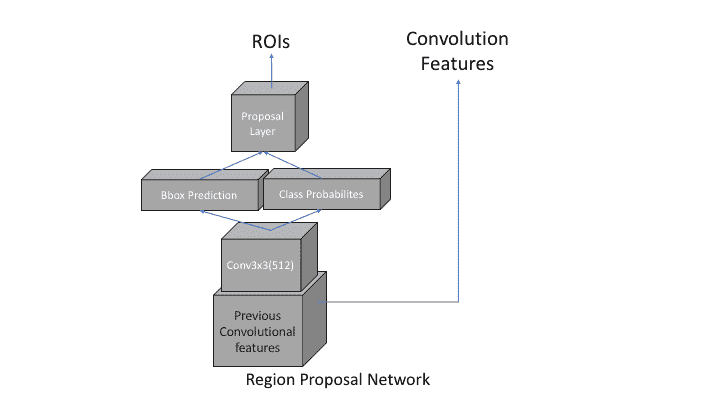
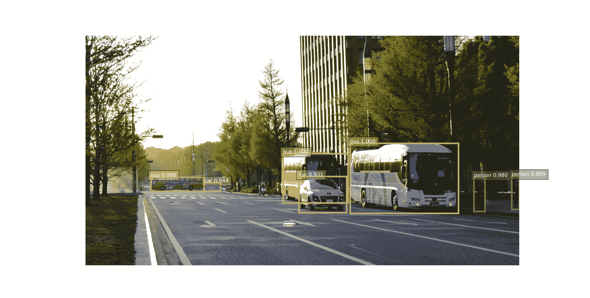
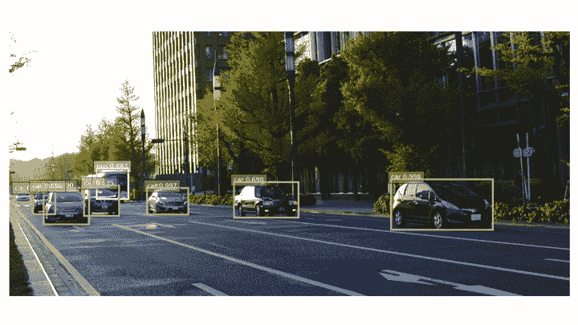
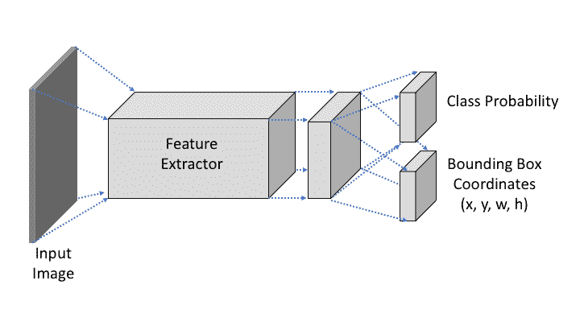
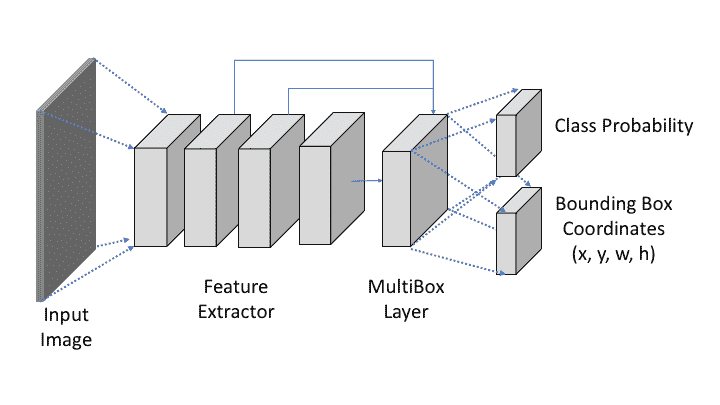
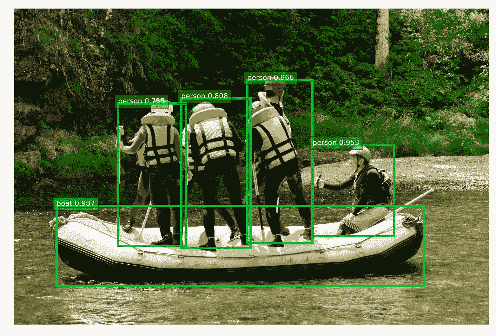
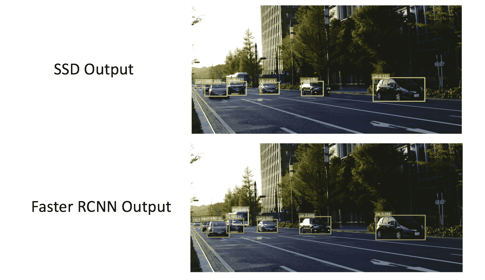

# 第六章：基于特征的对象检测

在上一章中，我们了解了如何使用**卷积神经网络**（**CNNs**）建模深度层特征提取的重要性。在本章中，我们将学习如何建模 CNN 以检测图像中的对象位置，并分类为预先决定的类别之一。

在本章中：

+   我们将从一个关于图像识别以及什么是对象检测的通用讨论开始

+   使用 OpenCV 进行人脸检测的流行技术的一个工作示例

+   使用两阶段模型如 Faster-RCNN 进行对象检测

+   使用单阶段模型如 SSD 进行对象检测

+   本章的主要内容将讨论基于深度学习的对象检测器，并使用演示代码进行解释

# 对象检测简介

要开始对象检测，我们首先将看到图像识别的概述，因为检测是其中的一部分。在下面的图中，使用`Pascal VOC`数据集的图像描述了对象识别的概述。输入通过一个模型传递，然后以四种不同的风格产生信息：



上一张图中的模型执行的是通用图像识别，我们可以预测以下信息：

+   图像中对象的类名

+   对象中心像素位置

+   作为输出围绕对象的边界框

+   在实例图像中，每个像素被分类为一个类别。这些类别包括对象以及背景

当我们提到对象检测时，我们通常指的是图像识别的第一种和第三种类型。我们的目标是估计目标对象的类名以及围绕目标对象的边界框。在我们开始讨论对象检测技术之前，在下一节中我们将看到为什么检测对象是一个困难的计算机视觉任务。

# 对象检测的挑战

在过去，提出了几种对象检测的方法。然而，这些方法要么在受控环境中表现良好，要么在图像中寻找特殊对象，如人脸。即使在人脸的情况下，这些方法也面临着诸如低光照条件、高度遮挡的人脸或与图像大小相比人脸尺寸过小等问题。

以下是一些对象检测器在实际应用中面临的挑战：

+   **遮挡**：像狗或猫这样的对象可能被彼此遮挡，因此从它们中提取的特征不足以说明它们是对象。

+   **视点变化**：在物体不同视点的情况下，形状可能会发生剧烈变化，因此物体的特征也会发生剧烈变化。这导致了一个训练有素的检测器，从特定视点看到给定物体时可能会在其他视点失败。例如，在人体检测的情况下，如果检测器正在寻找头部、手和腿的组合来找到一个人，当我们把相机放在上方拍摄垂直向下面对图像时，它将失败。检测器将看到的东西只有头部，因此结果会大大减少。

+   **尺寸变化**：同一个物体可以离相机很远或很近。因此，物体的尺寸会有所变化。因此，检测器需要具有尺寸不变性和旋转不变性。

+   **非刚性物体**：如果物体的形状分成几部分或者存在流体物体，那么使用特征来描述它们就变得更加具有挑战性。

+   **运动模糊**：如果我们正在检测一个移动的物体，如汽车，那么可能会出现相机捕获的图像模糊的情况。这对物体检测器来说又是一个挑战，提供正确的估计，以及在移动机器人（如自动驾驶汽车或无人机）中部署时使检测器鲁棒至关重要。

# 数据集和使用的库

在本章中，我们将使用 TensorFlow（v1.4.0）和 OpenCV 作为我们的主要库进行检测。我们在自定义图像上展示结果。然而，任何彩色图像都可以作为各种模型的输入。在需要的地方，章节中提供了预训练模型文件的链接。

# 物体检测方法

目标检测是两步的问题。首先，它应该在图像内部定位一个或多个对象。其次，它为每个定位的对象给出一个预测类别。已经有一些使用滑动窗口方法的物体检测方法。其中一种流行的检测技术是 Viola 和 Jones 开发的**人脸检测方法**[1]。该论文利用了人类面部具有强烈的描述性特征这一事实，例如眼睛附近区域比嘴巴附近区域更暗。因此，眼睛周围的矩形区域与鼻子附近的矩形区域之间可能存在显著差异。利用这一点作为几个预定义的矩形对模式之一，他们的方法计算了每个模式中矩形之间的面积差异。

检测人脸是两步的过程：

+   第一是要创建一个具有特定物体检测参数的分类器。在我们的例子中，它是人脸检测：

```py
face_cascade = cv2.CascadeClassifier('haarcascades/haarcascade_frontalface_default.xml')
```

+   在第二步中，对于每个图像，使用之前加载的分类器参数进行人脸检测：

```py
faces = face_cascade.detectMultiScale(gray)
```

在 OpenCV 中，我们可以编写代码来检测人脸，如下所示：

```py
import numpy as np
import cv2

# create cascaded classifier with pre-learned weights
# For other objects, change the file here
face_cascade = cv2.CascadeClassifier('haarcascades/haarcascade_frontalface_default.xml')

cap = cv2.VideoCapture(0)

while(True):
 ret, frame = cap.read()
 if not ret:
 print("No frame captured")

 # frame = cv2.resize(frame, (640, 480))
 gray = cv2.cvtColor(frame, cv2.COLOR_BGR2GRAY)

 # detect face
 faces = face_cascade.detectMultiScale(gray)

 # plot results
 for (x,y,w,h) in faces:
 cv2.rectangle(frame,(x,y),(x+w,y+h),(255,0,0),2)

 cv2.imshow('img',frame)
 if cv2.waitKey(1) & 0xFF == ord('q'):
 break

cap.release()
cv2.destroyAllWindows()
```

在这里，我们使用了文件`haarcascade_frontalface_default.xml`，它包含可在[`github.com/opencv/opencv/tree/master/data/haarcascades`](https://github.com/opencv/opencv/tree/master/data/haarcascades)找到的分类器参数。我们必须下载这些级联分类器文件才能运行人脸检测。同样，为了检测其他对象，如眼睛、微笑等，我们也需要类似的文件与 OpenCV 一起使用。

我们之前看到的面部检测器在从智能手机到数码相机等多种设备上变得流行。然而，深度学习的最新进展正在创造更好的面部检测器。我们将在下一节中看到基于深度学习的通用目标检测器的几个部分。

# 基于深度学习的目标检测

随着卷积神经网络（CNNs）的最近进展及其在图像分类中的表现，使用类似模型风格进行目标检测变得越来越直观。这一点已经被证明是正确的，因为在过去几年中，每年都有更好的目标检测器被提出，这提高了在标准基准测试上的整体准确性。其中一些检测器风格已经被用于智能手机、自动驾驶汽车等设备中。

一个通用的 CNN 输出类别概率，就像图像识别的情况一样。但是，为了检测对象，这些必须修改为输出类别概率以及边界框的矩形坐标和形状。早期的基于 CNN 的目标检测，从输入图像中计算可能的窗口，然后使用 CNN 模型为每个窗口计算特征。CNN 特征提取器的输出将告诉我们所选窗口是否为目标对象。这由于 CNN 特征提取器对每个窗口的大量计算而变得缓慢。直观地讲，我们希望从图像中提取特征，并使用这些特征进行目标检测。这不仅提高了检测速度，还过滤了图像中的不需要的噪声。

已经提出了几种方法来解决目标检测中的速度和准确性问题。这些方法通常分为两大类：

+   **两阶段检测器**：在这里，整个过程被分为两个主要步骤，因此得名两阶段检测器。其中最受欢迎的是**Faster R-CNN**。在下一节中，我们将看到对这个方法的详细解释。

+   **单阶段检测器**：虽然两阶段检测器提高了检测的准确性，但它们仍然难以训练，并且在几个实时操作中速度较慢。单阶段检测器通过构建一个单架构网络来预测更快地解决了这些问题。这种风格中流行的模型之一是**单次多框检测器**（**SSD**）。

在以下几节中，我们将通过演示来展示这两种类型检测器的质量，演示将展示每个检测器产生的结果质量。

# 两阶段检测器

如 CNN 在一般图像分类中显示其性能，研究人员使用了相同的 CNN 来进行更好的目标检测。使用深度学习进行目标检测的初始方法可以描述为两阶段检测器，其中之一是 2015 年由 Shaoqing Ren、Kaiming He、Ross Girshick 和 Jian Sun 提出的 Faster R-CNN [`arxiv.org/pdf/1506.01497.pdf`](https://arxiv.org/pdf/1506.01497.pdf)。

该方法分为两个阶段：

1.  在第一阶段，从图像中提取特征，并提议**感兴趣区域（ROI）**。ROI 包括一个可能包含对象的矩形框。

1.  第二阶段使用特征和 ROI 来计算每个框的最终边界框和类别概率。这些共同构成了最终输出。

Faster-RCNN 的概述如图所示。输入图像用于提取特征和区域提议。这些提取的特征和提议一起用于计算每个矩形的预测边界框和类别概率：



如前图所示，整体方法被认为是两阶段，因为在训练过程中，模型首先会学习使用称为**区域提议网络（RPN）**的子模型来产生区域（ROIs）。然后，它将学习使用 ROIs 和特征来产生正确的类别概率和边界框定位。RPN 的概述如图所示。RPN 层使用特征层作为输入，为边界框创建提议和相应的概率：



矩形的定位通常是宽度和高度值的归一化值，对于矩形的左上角坐标，尽管这取决于模型的学习方式。在预测过程中，模型输出一系列类别概率、类别类别以及以(x, y, w, h)格式表示的矩形定位。这个集合再次通过阈值过滤掉置信度得分低于阈值的矩形。

使用这种检测器风格的主要优点是它比单阶段检测器提供了更高的精度。这些通常实现了最先进的检测精度。然而，在预测过程中它们速度较慢。如果对于预测应用，时间起着至关重要的作用，那么建议为这些网络提供高性能系统或使用单阶段检测器。另一方面，如果要求是获得最佳精度，则强烈建议使用这种方法进行目标检测。以下图显示了目标检测的示例输出，其中检测到的对象周围有矩形框。每个框都有一个标签，显示预测的类别名称和框的置信度：



上一张截图中的检测使用了 Faster RCNN 模型，即使是像右下角的人这样的小物体，模型也能以良好的置信度进行检测。总体上检测到的物体有公交车、汽车和人。模型没有检测到其他物体，如树木、电线杆、交通灯等，因为它没有被训练来检测这些物体。

# 示例 – 使用 ResNet-101 的 Faster R-CNN

从上一张截图可以看出，即使在物体大小变化的情况下，以及物体尺寸较小的情况下，Faster R-CNN 的两阶段模型也能准确预测。现在，我们将展示如何使用 TensorFlow 运行类似的预测。让我们首先克隆一个存储库，因为它将包含大部分所需的代码：

```py
git clone https://github.com/tensorflow/models.git
cd models/research
```

在我们克隆之后，我们将设置环境。我们首先将从 TensorFlow 的`model-zoo`下载一个预训练模型：

+   对于 macOS X：

```py
curl -O http://download.tensorflow.org/models/object_detection/faster_rcnn_resnet101_coco_2017_11_08.tar.gz
tar -xvf faster_rcnn_resnet101_coco_2017_11_08.tar.gz
```

+   对于 Linux：

```py
wget http://download.tensorflow.org/models/object_detection/faster_rcnn_resnet101_coco_2017_11_08.gz
tar -xvf faster_rcnn_resnet101_coco_2017_11_08.tar.gz
```

请将名为`faster_rcnn_resnet101_coco_2017_11_08`的提取文件夹保留在`models/research/object_detection`中。*这完成了预训练模型的下载。

这两个步骤每次启动终端外壳时都必须执行：

+   首先，我们将编译`protobuf`文件，因为 TensorFlow 使用它们来序列化结构化数据：

```py
protoc object_detection/protos/*.proto --python_out=.
```

+   还需要在研究文件夹中运行：

```py
export PYTHONPATH=$PYTHONPATH:`pwd`:`pwd`/slim 
```

环境和预训练模型已设置，现在我们将开始预测代码。以下代码将保留并运行在`models/research/object_detection`中，代码风格类似于 Jupyter 笔记本。随着本节的进展，每个后续的代码块都可以在 Jupyter 笔记本单元格中运行。如果您不熟悉 Jupyter，您仍然可以运行完整的 Python 脚本：

1.  让我们从加载这里将要用到的库开始：

```py
import numpy as np
import os
import sys
import tensorflow as tf
import cv2
from matplotlib import pyplot as plt
# inside jupyter uncomment next line 
# %matplotlib inline
import random
import time
from utils import label_map_util 
```

1.  为了加载用于预测的预训练模型：

```py
# load graph 
def load_and_create_graph(path_to_pb):
    """
    Loads pre-trained graph from .pb file. 
    path_to_pb: path to saved .pb file
    Tensorflow keeps graph global so nothing is returned
    """
    with tf.gfile.FastGFile(path_to_pb, 'rb') as f:
        # initialize graph definition
        graph_def = tf.GraphDef()
        # reads file 
        graph_def.ParseFromString(f.read())
        # imports as tf.graph
        _ = tf.import_graph_def(graph_def, name='')
```

1.  可以使用它来加载在`MSCOCO`数据集上预训练的 ResNet-101 特征提取器的 Faster R-CNN 模型：

```py
load_and_create_graph('faster_rcnn_resnet101_coco_2017_11_08/frozen_inference_graph.pb')
```

1.  现在，让我们设置用于在图中显示的标签，使用`MSCOCO`标签：

```py
# load labels for classes output
path_to_labels = os.path.join('data', 'mscoco_label_map.pbtxt')
# pre-training was done on 90 categories
nb_classes = 90
label_map = label_map_util.load_labelmap(path_to_labels)
categories = label_map_util.convert_label_map_to_categories(label_map,
                   max_num_classes=nb_classes, use_display_name=True)
category_index = label_map_util.create_category_index(categories)
```

1.  在进行最终预测之前，我们将设置实用函数如下：

```py
def read_cv_image(filename):
    """
    Reads an input color image and converts to RGB order
    Returns image as an array
    """
    img = cv2.imread(filename)
    img = cv2.cvtColor(img, cv2.COLOR_BGR2RGB)
    return img
```

1.  以下是一个使用`matplotlib`显示边界框的实用函数：

```py

def show_mpl_img_with_detections(img, dets, scores, 
                                 classes, category_index, 
                                 thres=0.6):
    """
    Applies thresholding to each box score and 
    plot bbox results on image. 
    img: input image as numpy array
    dets: list of K detection outputs for given image.(size:[1,K])
    scores: list of detection score for each detection output(size: [1,K]).
    classes: list of predicted class index(size: [1,K]) 
    category_index: dictionary containing mapping from class index to class name. 
    thres: threshold to filter detection boxes:(default: 0.6)
    By default K:100 detections
    """
    # plotting utilities from matplotlib
    plt.figure(figsize=(12,8))
    plt.imshow(img)
    height = img.shape[0]
    width = img.shape[1]
    # To use common color of one class and different for different classes
    colors = dict() 
    # iterate over all proposed bbox 
    # choose whichever is more than a threshold
    for i in range(dets.shape[0]):
        cls_id = int(classes[i])
        # in case of any wrong prediction for class index
        if cls_id >= 0:

            score = scores[i]
            # score for a detection is more than a threshold
            if score > thres:
                if cls_id not in colors:
                    colors[cls_id] = (random.random(), 
                                      random.random(), 
                                      random.random())
                xmin = int(dets[i, 1] * width)
                ymin = int(dets[i, 0] * height)
                xmax = int(dets[i, 3] * width)
                ymax = int(dets[i, 2] * height)
                rect = plt.Rectangle((xmin, ymin), xmax - xmin,
                                     ymax - ymin, fill=False,
                                     edgecolor=colors[cls_id],
                                     linewidth=2.5)
                plt.gca().add_patch(rect)
                # to plot class name and score around each detection box
                class_name = str(category_index[cls_id]['name'])

                plt.gca().text(xmin, ymin - 2,
                           '{:s} {:.3f}'.format(class_name, score),
                           bbox=dict(facecolor=colors[cls_id], alpha=0.5),
                           fontsize=8, color='white')
    plt.axis('off')
    plt.show()

    return
```

使用这个设置，我们可以对输入图像进行预测。在以下代码片段中，我们正在对输入图像进行预测并显示结果。我们将启动一个`Tensorflow`会话，并在`sess.run`中运行图来计算边界框、每个框的分数、框的类别预测和检测数量：

```py
image_dir = 'test_images/'
# create graph object from previously loaded graph
# tensorflow previously loaded graph as default 
graph=tf.get_default_graph()

# launch a session to run this graph 
with tf.Session(graph=graph) as sess:
    # get input node
    image_tensor = graph.get_tensor_by_name('image_tensor:0')

    # get output nodes
    detection_boxes = graph.get_tensor_by_name('detection_boxes:0')
    detection_scores = graph.get_tensor_by_name('detection_scores:0')
    detection_classes = graph.get_tensor_by_name('detection_classes:0')
    num_detections = graph.get_tensor_by_name('num_detections:0')

    # read image from file and pre-process it for input.
    # Note: we can do this outside session scope too. 
    image = read_cv_image(os.path.join(image_dir, 'cars2.png'))
    input_img = image[np.newaxis, :, :, :]

    # To compute prediction time 
    start = time.time()
    # Run prediction and get 4 outputs
    (boxes, scores, classes, num) = sess.run(
          [detection_boxes, detection_scores, detection_classes, num_detections],
          feed_dict={image_tensor: input_img})
    end = time.time()
    print("Prediction time:",end-start,"secs for ", num[0], "detections")
    # display results
    show_mpl_img_with_detections(image, boxes[0],scores[0], classes[0],category_index, thres=0.6)

```

使用之前的代码，以下截图展示了预测的一个示例。每个检测到的物体都显示有边界框。每个边界框都有一个预测类别的名称以及框内物体的置信度分数：



# 单阶段检测器

在上一节中，我们看到了两阶段检测器由于将网络分成两部分而存在预测时间较慢和训练难度较大的问题。在最近提出的网络，如**单阶段多框检测器 (SSD)**[3]中，通过移除中间阶段，预测时间得到了减少，并且训练始终是端到端的。这些网络通过在智能手机以及低端计算单元上运行，已经展示了其有效性：



网络的抽象视图如图所示。网络的总体输出与两阶段相同，即对象的类别概率和**（x, y, w, h）**形式的边界框坐标，其中（x,y）是矩形的左上角，（w, h）分别是框的宽度和高度。为了使用多个分辨率，模型不仅使用特征提取的最终层，还使用几个中间特征层。以下截图显示了抽象视图：



为了进一步提高检测速度，该模型还使用了一种称为**非极大值抑制**的技术。这将抑制给定区域和给定类别中所有没有最大得分的**边界框**。因此，从**MultiBox 层**输出的总框数显著减少，从而我们只在每个类别中获取高得分的检测。

在下一节中，我们将看到基于 TensorFlow 的 SSD 物体检测。我们将使用上一节中的一些代码；如果已经安装了上一节的安装，则读者无需再次安装。

# 演示

在以下代码中，我们将加载一个预训练模型并在预定义的 90 个类别上执行物体检测任务。在我们开始之前，请检查是否存在一个可工作的 TensorFlow（版本 = 1.4.0）Python 环境。

在本节中，我们的输入如图所示，包含人物：


我们将遵循与两阶段检测器类似的说明，并首先克隆 TensorFlow/models 仓库：

```py
git clone https://github.com/tensorflow/models.git
cd models/research
```

让我们从 TensorFlow 模型库中下载一个预训练模型。这些模型适用于单阶段检测器：

+   对于 macOS X:

```py
curl -O http://download.tensorflow.org/models/object_detection/ssd_inception_v2_coco_2017_11_17.tar.gz
tar -xvf ssd_inception_v2_coco_2017_11_17.tar.gz
```

+   对于 Linux:

```py
wget http://download.tensorflow.org/models/object_detection/ssd_inception_v2_coco_2017_11_17.tar.gz
tar -xvf ssd_inception_v2_coco_2017_11_17.tar.gz
```

同样，保留名为 `ssd_inception_v2_coco_2017_11_17` 的提取文件夹在 `models/research/object_detection` 中*.* 我们现在将设置环境。如果这已经在上一节中完成，请跳过此步骤：

+   首先，我们将编译 `protobuf` 文件：

```py
protoc object_detection/protos/*.proto --python_out=.
```

+   此外，在研究文件夹中运行：

```py
export PYTHONPATH=$PYTHONPATH:`pwd`:`pwd`/slim 
```

让我们从加载库开始：

```py
import numpy as np
import os
import sys
import tensorflow as tf
import cv2
from matplotlib import pyplot as plt
# inside jupyter uncomment next line 
# %matplotlib inline
import random
import time
from utils import label_map_util 
```

1.  以下代码读取预训练模型。在 TensorFlow 中，这些模型通常以 `.pb` 格式保存为 `protobuf`。另外，请注意，如果有其他格式的预训练模型文件，我们可能需要相应地读取：

```py
def load_and_create_graph(path_to_pb):
 """
 Loads pre-trained graph from .pb file. 
 path_to_pb: path to saved .pb file
 Tensorflow keeps graph global so nothing is returned
 """
 with tf.gfile.FastGFile(path_to_pb, 'rb') as f:
 # initialize graph definition
 graph_def = tf.GraphDef()
 # reads file 
 graph_def.ParseFromString(f.read())
 # imports as tf.graph
 _ = tf.import_graph_def(graph_def, name='')
```

1.  对于使用我们的输入图像，以下代码块从给定路径读取图像到一个文件中：

```py
def read_cv_image(filename):
 """
 Reads an input color image and converts to RGB order
 Returns image as an array
 """
 img = cv2.imread(filename)
 img = cv2.cvtColor(img, cv2.COLOR_BGR2RGB)
 return img
```

1.  最后一个实用函数是用于显示预测对象的边界框的输出，包括每个框的类别名称和检测分数：

```py
def show_mpl_img_with_detections(img, dets, scores, 
 classes, category_index, 
 thres=0.6):
 """
 Applies thresholding to each box score and 
 plot bbox results on image. 
 img: input image as numpy array
 dets: list of K detection outputs for given image. (size:[1,K] )
 scores: list of detection score for each detection output(size: [1,K]).
 classes: list of predicted class index(size: [1,K]) 
 category_index: dictionary containing mapping from class index to class name. 
 thres: threshold to filter detection boxes:(default: 0.6)
 By default K:100 detections
 """
 # plotting utilities from matplotlib
 plt.figure(figsize=(12,8))
 plt.imshow(img)
 height = img.shape[0]
 width = img.shape[1]
 # To use common color of one class and different for different classes
 colors = dict() 
 # iterate over all proposed bbox 
 # choose whichever is more than a threshold
 for i in range(dets.shape[0]):
 cls_id = int(classes[i])
 # in case of any wrong prediction for class index
 if cls_id >= 0:

 score = scores[i]
 # score for a detection is more than a threshold
 if score > thres:
 if cls_id not in colors:
 colors[cls_id] = (random.random(), 
 random.random(), 
 random.random())
 xmin = int(dets[i, 1] * width)
 ymin = int(dets[i, 0] * height)
 xmax = int(dets[i, 3] * width)
 ymax = int(dets[i, 2] * height)
 rect = plt.Rectangle((xmin, ymin), xmax - xmin,
 ymax - ymin, fill=False,
 edgecolor=colors[cls_id],
 linewidth=2.5)
 plt.gca().add_patch(rect)
 # to plot class name and score around each detection box
 class_name = str(category_index[cls_id]['name'])

 plt.gca().text(xmin, ymin - 2,
 '{:s} {:.3f}'.format(class_name, score),
 bbox=dict(facecolor=colors[cls_id], alpha=0.5),
 fontsize=8, color='white')
 plt.axis('off')
 plt.show()

 return 
```

1.  我们将使用一个 SSD 模型进行物体检测，该模型使用 Inception-v2 模型进行特征提取。这个模型在`MSCOCO`数据集上进行了预训练。我们之前已经看到了下载模型和加载模型的代码片段。所以，让我们继续读取模型：

```py
# load pre-trained model
load_and_create_graph('ssd_inception_v2_coco_2017_11_17/frozen_inference_graph.pb')
```

1.  在我们开始使用模型对输入图像进行预测之前，我们需要确保我们的输出是有意义的。我们将创建一个字典映射，将类别索引映射到预定义的类别名称。以下代码将读取文件`data/mscoco_label_map.pbtxt`，该文件包含索引到类别名称的映射。最终的索引可以用来读取我们的输出作为类别名称：

```py
# load labels for classes output
path_to_labels = os.path.join('data', 'mscoco_label_map.pbtxt')
nb_classes = 90
label_map = label_map_util.load_labelmap(path_to_labels)
categories = label_map_util.convert_label_map_to_categories(label_map,
 max_num_classes=nb_classes, use_display_name=True)
category_index = label_map_util.create_category_index(categories)
```

我们已经为预测设置了所有必要的东西。在 TensorFlow 中，模型表示为一个计算图，在代码片段中通常被称为图。这由各种层和层上的操作组成，这些操作以节点表示，节点之间的连接表示数据如何流动。为了执行预测，我们需要知道输入节点名称和输出节点名称。可能存在多个同类型的节点。为了开始执行计算，我们将首先创建一个会话。一个图只能在会话内部执行计算，我们可以在程序中按需创建会话。在以下代码片段中，我们创建了一个会话并获取了预定义的输入节点和输出节点：

```py
image_dir = 'test_images/'
# create graph object from previously loaded graph
# tensorflow previously loaded graph as default 
graph=tf.get_default_graph()

# launch a session to run this graph 
with tf.Session(graph=graph) as sess:
 # get input node
 image_tensor = graph.get_tensor_by_name('image_tensor:0')

 # get output nodes
 detection_boxes = graph.get_tensor_by_name('detection_boxes:0')
 detection_scores = graph.get_tensor_by_name('detection_scores:0')
 detection_classes = graph.get_tensor_by_name('detection_classes:0')
 num_detections = graph.get_tensor_by_name('num_detections:0')

 # read image from file and pre-process it for input.
 # Note: we can do this outside session scope too. 
 image = read_cv_image(os.path.join(image_dir, 'person1.png'))
 # Input Shape : [N, Width,Height,Channels], 
 # where N=1, batch size
 input_img = image[np.newaxis, :, :, :] 

 # To compute prediction time 
 start = time.time()
 # Run prediction and get 4 outputs
 (boxes, scores, classes, num) = sess.run(
 [detection_boxes, detection_scores, detection_classes, num_detections],
 feed_dict={image_tensor: input_img})
 end = time.time()
 print("Prediction time:",end-start,"secs for ", num, "detections")

 # display results with score threshold of 0.6
 # Since only one image is used , hence we use 0 index for outputs
 show_mpl_img_with_detections(image, boxes[0],scores[0], classes[0], thres=0.6)
```

在之前的代码中，输入节点是`image_tensor:0`，四个输出节点分别是`detection_boxes:0`、`detection_scores:0`、`detection_classes:0`和`num_detections:0`。

当我们对给定的图像进行推理时，推理结果如图所示。每个框的颜色根据类别而定，预测的类别名称以及类别预测的分数显示在左上角。理想情况下，分数为 1 表示模型对框内物体的类别有 100%的把握：

这个分数并不是用来衡量框是否正确，而是仅用于判断框内物体的类别置信度。



在这里，我们只使用了一张图像作为输入。我们可以使用图像列表作为输入，相应地，我们将为每个图像得到一个输出列表。为了显示结果，我们可以同时迭代图像和输出，如下所示：

```py
for i in range(nb_inputs):
 show_mpl_img_with_detections(images[i], boxes[i],scores[i], classes[i], thres=0.6)
```

为了与两阶段检测器进行比较，对于相同的输入，以下是一阶段检测器的输出预测。我们可以很容易地注意到，一阶段检测器如 SSD 对于大物体很好，但无法识别如人这样的小物体。此外，两个检测器之间的预测分数差异很大：



# 摘要

本章概述了目标检测以及建模良好检测器时的一些挑战。虽然有许多使用深度学习的检测方法，但常见的类别是一阶段和两阶段检测器。每种检测器都有其自身的优点，例如一阶段检测器适合实时应用，而两阶段检测器适合高精度输出。模型之间准确度的差异通过示例图展示。我们现在可以理解目标检测器的选择，并使用 TensorFlow 运行预训练模型。每个输出的各种样本展示了模型在复杂图像中的有效性。

在下一章中，我们将学习更多关于使用深度学习方法进行图像识别中的分割以及跟踪问题。

# 参考文献

+   Viola Paul 和 Michael J. Jones. *鲁棒的实时人脸检测*。国际计算机视觉杂志 57, 第 2 期 (2004): 137-154.

+   任少强，何凯明，Ross Girshick，以及 姜山。*Faster R-CNN：使用区域建议网络实现实时目标检测*。在神经信息处理系统进展中，第 91-99 页。2015。

+   刘伟，Dragomir Anguelov，Dumitru Erhan，Christian Szegedy，Scott Reed，Cheng-Yang Fu，以及 Alexander C. Berg。S*SD: 单次多框检测器*。在欧洲计算机视觉会议上，第 21-37 页。Springer，Cham，2016。

+   林等人，*Microsoft COCO: 上下文中的常见物体*，[`arxiv.org/pdf/1405.0312.pdf`](https://arxiv.org/pdf/1405.0312.pdf).
