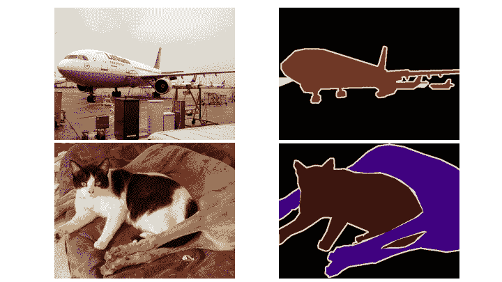
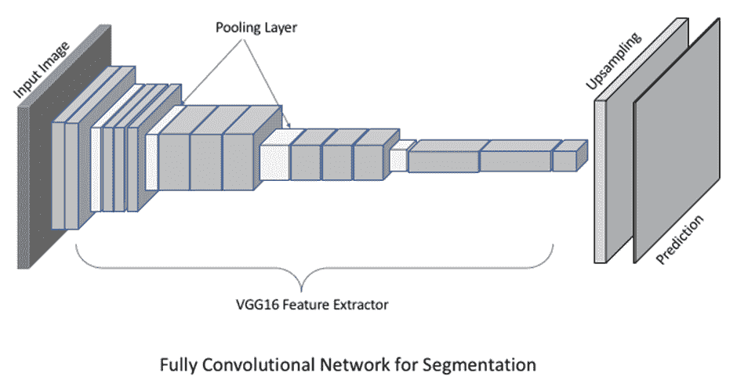
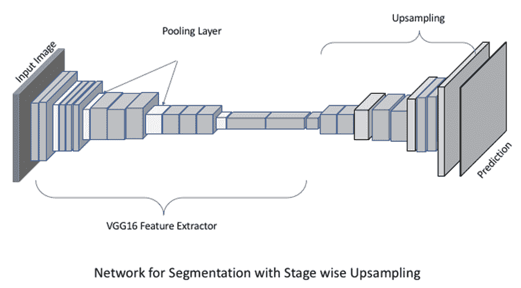
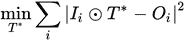
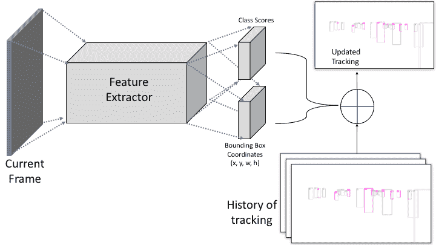
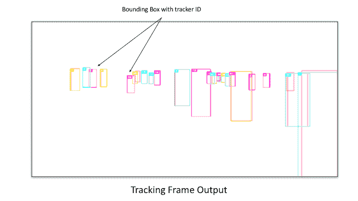

# 分割和跟踪

在上一章中，我们研究了使用**卷积神经网络**（**CNNs**）进行特征提取和图像分类的不同方法，以检测图像中的对象。这些方法在围绕目标对象创建边界框方面表现良好。然而，如果我们的应用程序需要围绕对象的一个精确边界，即**实例**，我们需要采用不同的方法。

在本章中，我们将重点关注对象实例检测，这也可以称为图像分割。在章节的第二部分，我们将首先看到使用 OpenCV 的 MOSSE 跟踪器，并了解在一系列图像中跟踪对象的各种方法。

分割和跟踪并不是完全相关的两个问题，但它们在很大程度上依赖于之前特征提取和对象检测的方法。应用范围相当广泛，包括图像编辑、图像去噪、监控、动作捕捉等。所选择的方法适合特定的应用。

# 数据集和库

我们将继续使用 OpenCV 和 NumPy 进行图像处理。对于深度学习，我们将使用 Keras 和 TensorFlow 后端。对于分割，我们将使用`Pascal VOC`数据集。这个数据集包含对象检测和分割的注释。对于跟踪，我们将使用`MOT16`数据集，它由视频中的注释图像序列组成。我们将在使用代码的章节中提及如何使用代码。

# 分割

分割通常被称为相似类别像素的聚类。以下截图是一个例子。在这里，我们看到输入在左边，分割结果在右边。物体的颜色根据预定义的物体类别。这些例子是从`Pascal VOC`数据集中选取的：



在左上方的图片中，背景中有几架小型飞机，因此我们在右边的相应图像中看到相应的小像素被相应地着色。在左下方的图片中，有两只宠物躺在一起，因此它们分割后的图像在右边为猫和狗的像素分别有不同的颜色。在这个图中，边界以不同的颜色表示，以方便查看，并不表示不同的类别。

在传统的分割技术中，使用的关键属性是图像强度级别。首先，找到具有相似强度值的不同较小区域，然后它们被合并成较大的区域。为了获得最佳性能，用户为算法选择一个初始点。最近使用深度学习的方法已经显示出更好的性能，而不需要初始化。在接下来的章节中，我们将看到之前看到的 CNNs 在图像分割中的应用扩展。

在开始我们关于分割方法的讨论之前，让我们看看所面临的挑战。

# 分割的挑战

分割任务中的挑战大于之前的对象检测任务，因为检测的复杂性增加了：

+   **噪声边界**：由于对象的模糊边缘，将属于某一类别的像素分组可能不会那么准确。因此，来自不同类别的对象可能会聚集在一起。

+   **杂乱场景**：当图像框架中有多个对象时，正确分类像素变得更加困难。随着杂乱的增多，错误分类的可能性也增加。

# 用于分割的 CNN

基于深度学习的分割方法最近在更复杂的领域中，无论是在准确性还是在有效性方面，都得到了增长。使用 CNN 进行分割的流行模型之一是**全卷积网络**（**FCN**）[5]，我们将在本节中探讨。这种方法的优势在于训练一个端到端的 CNN 以执行像素级语义分割。输出是一个图像，每个像素都被分类为背景或预定义对象类别之一。整体架构如下截图所示：



随着层的层次堆叠，每一层的输出都会下采样，但特征丰富。在最后一层，如图所示，使用反卷积层将下采样输出上采样，从而使得最终输出与输入大小相同。

反卷积层用于将输入特征转换为上采样特征，然而，这个名称有点误导，因为操作并不完全是卷积的逆操作。这相当于转置卷积，与常规卷积操作相比，输入在转置后进行卷积。

在先前的模型中，特征层的上采样是通过单个层完成的。然而，这可以扩展到层次结构，如下所示：



在前面的截图中，特征提取器保持不变，而上采样通过添加更多的反卷积层进行更新，其中每个这些层都从上一层上采样特征并生成更丰富的预测。

# FCN 的实现

在本节中，我们将学习在 Keras 中建模基本分割模型之一。

让我们从导入 Keras 所需的模块开始：

```py
from keras.models import *
from keras.layers import *
from keras.applications.vgg16 import VGG16
```

以下代码将创建一个 FCN 模型，该模型以 VGG16 特征作为输入，并添加更多层以进行微调。然后这些层被上采样以产生结果输出：

```py
def create_model_fcn32(nb_class, input_w=256):
 """
 Create FCN-32s model for segmentaiton. 
 Input:
 nb_class: number of detection categories
 input_w: input width, using square image

 Returns model created for training. 
 """
 input = Input(shape=(input_w, input_w, 3))

 # initialize feature extractor excuding fully connected layers
 # here we use VGG model, with pre-trained weights. 
 vgg = VGG16(include_top=False, weights='imagenet', input_tensor=input)
 # create further network
 x = Conv2D(4096, kernel_size=(7,7), use_bias=False,
 activation='relu', padding="same")(vgg.output)
 x = Dropout(0.5)(x)
 x = Conv2D(4096, kernel_size=(1,1), use_bias=False,
 activation='relu', padding="same")(x)
 x = Dropout(0.5)(x)
 x = Conv2D(nb_class, kernel_size=(1,1), use_bias=False, 
 padding="same")(x)
 # upsampling to image size using transposed convolution layer
 x = Conv2DTranspose(nb_class , 
 kernel_size=(64,64), 
 strides=(32,32), 
 use_bias=False, padding='same')(x)
 x = Activation('softmax')(x)
 model = Model(input, x)
 model.summary()
 return model

# Create model for pascal voc image segmentation for 21 classes
model = create_model_fcn32(21)
```

在本节中，我们看到了计算图像中对象精确区域的分割方法。这里展示的 FCN 方法仅使用卷积层来计算这些区域。`上采样`方法是计算像素级类别的关键，因此不同的上采样方法选择将导致结果质量的不同。

# 跟踪

跟踪是估计物体在连续图像序列中的位置的问题。这进一步分为单目标跟踪和多目标跟踪，然而，单目标和多目标跟踪都需要稍微不同的方法。在本节中，我们将看到多目标跟踪的方法，以及单目标跟踪。

基于图像的跟踪方法被应用于多个应用中，例如动作识别、自动驾驶汽车、安全和监控、增强现实应用、动作捕捉系统和视频压缩技术。例如，在增强现实（**AR**）应用中，如果我们想在平面表面上绘制一个虚拟的三维物体，我们希望跟踪平面表面以实现可行的输出。

在监控或交通监控中，跟踪车辆并记录车牌号码有助于管理交通并保持安全。此外，在视频压缩应用中，如果我们已经知道单个物体是帧中唯一变化的东西，我们可以通过仅使用那些变化的像素来执行更好的压缩，从而优化视频传输和接收。

在跟踪设置中，我们将在下一节看到挑战。

# 跟踪挑战

在构建应用程序之前了解我们需要关注哪些挑战始终至关重要。作为一个标准的计算机视觉方法，这里的大多数挑战都是常见的：

+   **物体遮挡**：如果目标物体在一系列图像中隐藏在其他物体后面，那么不仅难以检测到该物体，而且如果它再次可见，更新未来图像也会变得困难。

+   **快速移动**：例如智能手机上的相机，常常受到抖动的影响。这会导致模糊效果，有时甚至会导致物体完全从帧中消失。因此，相机运动的突然变化也会导致跟踪应用中的问题。

+   **形状变化**：如果我们针对的是非刚性物体，物体的形状变化或完全变形通常会导致无法检测到物体，以及跟踪失败。

+   **误报**：在包含多个相似物体的场景中，很难匹配后续图像中目标物体是哪一个。跟踪器可能在检测过程中丢失当前物体，并开始跟踪一个相似的物体。

这些挑战可能导致我们的应用程序突然崩溃或给出完全错误的目标物体位置估计。

# 物体跟踪方法

一种直观的跟踪方法是使用前一章中的对象检测方法并在每个帧中进行检测。这将导致每个帧都有一个边界框检测，但我们还想知道特定对象是否保持在图像序列中以及持续了多少帧，即跟踪场景中对象的 K 帧。我们还需要一个匹配策略来说明前一个图像中找到的对象与当前图像帧中的对象相同。

继续这种直觉，我们添加了一个用于边界框运动的预测器。我们假设一个边界框的状态，它由框中心的坐标及其速度组成。随着我们在序列中看到更多的框，这个状态会发生变化。

给定当前框的状态，我们可以通过假设测量中存在一些噪声来预测它将在下一帧中可能出现的区域。对象检测器可以在下一个可能的区域中搜索与先前对象相似的对象。新找到的对象框的位置和先前框的状态将帮助我们更新框的新状态。这将用于下一帧。因此，在所有帧上迭代此过程不仅会导致对象边界框的跟踪，而且还会在整个序列中对特定对象的位置进行检查。这种跟踪方法也被称为**检测跟踪**。

在检测跟踪中，每一帧都使用对象检测器来找到可能的对象实例，并将这些检测与前一帧中的相应对象进行匹配。

另一方面，如果不需要使用对象检测器，我们可以通过匹配和在每个帧中找到相似对象来初始化目标对象并跟踪它。

在下一节中，我们将看到两种流行的跟踪方法。第一种方法相当快，而且简单，而后者相当准确，即使在多对象跟踪的情况下也是如此。

# MOSSE 跟踪器

这是由提出的一种使用相关滤波器方法进行快速对象跟踪的方法。基于相关滤波器的跟踪包括以下步骤：

1.  假设目标对象 *T* 的模板和输入图像 *I*，我们首先对模板 (*T*) 和图像 (*I*) 进行**快速傅里叶变换**（**FFT**）。

1.  在模板 *T* 和图像 *I* 之间执行卷积操作。

1.  第 2 步的结果通过**逆快速傅里叶变换**（**IFFT**）转换到空间域。图像 *I* 中模板对象的位置是获得的 IFFT 响应的最大值。

这种基于相关滤波器的技术在选择*T*时有局限性。由于单个模板图像匹配可能无法观察到对象的所有变化，例如图像序列中的旋转，Bolme 及其合作者[1]提出了一种更鲁棒的基于跟踪器的相关滤波器，称为**最小输出平方误差**（MOSSE）滤波器。在此方法中，匹配的模板*T*首先通过最小化平方误差和来学习：



这里，*i*是训练样本，得到的学到的模板是*T**。

我们将查看 OpenCV 中 MOSSE 跟踪器的实现，因为它在这里已经有了很好的实现：[`github.com/opencv/opencv/blob/master/samples/python/mosse.py`](https://github.com/opencv/opencv/blob/master/samples/python/mosse.py)

我们将查看以下代码的关键部分：

```py
 def correlate(self, img):
 """
 Correlation of input image with the kernel
 """

 # get response in fourier domain
 C = cv2.mulSpectrums(cv2.dft(img, flags=cv2.DFT_COMPLEX_OUTPUT), 
 self.H, 0, conjB=True)

 # compute inverse to get image domain output
 resp = cv2.idft(C, flags=cv2.DFT_SCALE | cv2.DFT_REAL_OUTPUT)

 # max location of the response
 h, w = resp.shape
 _, mval, _, (mx, my) = cv2.minMaxLoc(resp)
 side_resp = resp.copy()
 cv2.rectangle(side_resp, (mx-5, my-5), (mx+5, my+5), 0, -1)
 smean, sstd = side_resp.mean(), side_resp.std()
 psr = (mval-smean) / (sstd+eps)

 # displacement of max location from center is displacement for  
        tracker
 return resp, (mx-w//2, my-h//2), psr
```

`update`函数迭代地从视频或图像序列中获取一帧并更新跟踪器的状态：

```py
def update(self, frame, rate = 0.125):
 # compute current state and window size
 (x, y), (w, h) = self.pos, self.size

 # compute and update rectangular area from new frame
 self.last_img = img = cv2.getRectSubPix(frame, (w, h), (x, y))

 # pre-process it by normalization
 img = self.preprocess(img)

 # apply correlation and compute displacement
 self.last_resp, (dx, dy), self.psr = self.correlate(img)

 self.good = self.psr > 8.0
 if not self.good:
 return

 # update pos
 self.pos = x+dx, y+dy
 self.last_img = img = cv2.getRectSubPix(frame, (w, h), self.pos)
 img = self.preprocess(img)

 A = cv2.dft(img, flags=cv2.DFT_COMPLEX_OUTPUT)
 H1 = cv2.mulSpectrums(self.G, A, 0, conjB=True)
 H2 = cv2.mulSpectrums( A, A, 0, conjB=True)

 self.H1 = self.H1 * (1.0-rate) + H1 * rate
 self.H2 = self.H2 * (1.0-rate) + H2 * rate
 self.update_kernel()
```

使用 MOSSE 滤波器的一个主要优点是它对于实时跟踪系统来说非常快。整体算法简单易实现，可以在没有特殊图像处理库的硬件上使用，例如嵌入式平台。对此滤波器已经进行了几次修改，因此读者被要求探索更多关于这些滤波器的信息。

# Deep SORT

之前，我们查看了一种最简单的跟踪器。在本节中，我们将使用 CNN 的更丰富特征来进行跟踪。**Deep SORT**[2]是一种跟踪算法，它扩展了**简单在线实时跟踪**[3]，并在**多目标跟踪**（MOT）问题中取得了显著成果。

在 MOT 的问题设置中，每一帧都有多个需要跟踪的对象。解决这个问题的通用方法有两个步骤：

+   **检测**：首先，在帧中检测所有对象。可能存在单个或多个检测。

+   **关联**：一旦我们为帧获得了检测，就会对与前一帧相似的检测进行匹配。匹配的帧会跟随序列以获取对象的跟踪。

在 Deep SORT 中，这种方法进一步分为三个步骤：

1.  为了计算检测，使用了一种基于 CNN 的流行目标检测方法。在论文[2]中，使用 Faster-RCNN[4]对每一帧进行初始检测。正如前一章所解释的，这种方法是两阶段目标检测，对于目标检测效果良好，即使在目标变换和遮挡的情况下也是如此。

1.  在数据关联之前的中间步骤包括一个估计模型。该模型使用每个轨迹的状态作为包含八个量的向量，即框中心（*x*，*y*），框尺度（*s*），框宽高比（*a*），以及它们随时间变化的导数作为速度。卡尔曼滤波用于将这些状态建模为动态系统。如果没有检测到跟踪对象连续帧的阈值，则认为该对象已出帧或丢失。对于新检测到的框，将开始新的轨迹。

1.  在最后一步，给定使用先前信息和当前帧中新检测到的框进行卡尔曼滤波预测的状态，对新检测与前一帧中的旧对象轨迹进行关联。这是通过在二分图匹配上使用匈牙利算法来计算的。通过设置匹配的权重与距离公式，这使匹配更加稳健。

这在以下图中进一步解释。跟踪器使用状态向量来存储先前检测的历史信息。如果新帧到来，我们可以使用预先存储的边界框检测或使用第*6*章中讨论的对象检测方法来计算它们。最后，使用当前观察到的边界框检测和先前状态，估计当前跟踪：



我们将使用其官方仓库在[`github.com/nwojke/deep_sort`](https://github.com/nwojke/deep_sort)中看到 Deep SORT 的有效演示

首先，克隆以下仓库：

```py
git clone https://github.com/nwojke/deep_sort.git
```

由于我们已安装了 TensorFlow 和 Keras，因此我们将不会介绍它们的安装过程。正如我们之前所看到的，它使用基于 CNN 的对象检测进行初始检测。我们可以运行网络以获取检测或使用预先生成的检测。为此，让我们在`deep_sort`文件夹中获取预训练模型：

+   在 macOS 上（如果`wget`不可用）：

```py
curl -O https://owncloud.uni-koblenz.de/owncloud/s/f9JB0Jr7f3zzqs8/download
```

+   在 Linux 上：

```py
wget https://owncloud.uni-koblenz.de/owncloud/s/f9JB0Jr7f3zzqs8/download
```

这些下载的文件包括使用 CNN 模型对`MOT challenge`数据集进行预检测的框，CC BY-NC-SA 3.0。为了使用下载的模型，我们还需要一个数据集，这些检测是在该数据集上创建的。让我们从[`motchallenge.net/data/MOT16.zip`](https://motchallenge.net/data/MOT16.zip)获取数据集：[`motchallenge.net/data/MOT16.zip`](https://motchallenge.net/data/MOT16.zip)

+   在 macOS 上：

```py
curl -O https://motchallenge.net/data/MOT16.zip
```

+   在 Linux 上：

```py
wget https://motchallenge.net/data/MOT16.zip
```

现在我们已经完成了代码结构的设置，我们可以运行一个演示：

```py
python deep_sort_app.py \
 --sequence_dir=./MOT16/test/MOT16-06 \
 --detection_file=./deep_sort_data/resources/detections/MOT16_POI_test/MOT16-06.npy \
 --min_confidence=0.3 \
 --display=True
```

在这种情况下：

+   `--sequence_dir`是 MOT 挑战测试图像序列的路径

+   `--detection_file`是我们下载的与先前选择的序列目录相对应的预生成检测文件

+   `--min_confidence`是过滤任何小于此值的检测的阈值

对于测试序列 MOT16-06，我们可以看到显示视频输出帧帧的窗口。每一帧都包含跟踪到的人的边界框和数字，该数字是正在跟踪的人的 ID。如果检测到新的人，数字会更新，直到跟踪停止。在下面的图中，从跟踪窗口中解释了一个示例输出。为了便于解释，未显示背景图像，只显示了跟踪框：



鼓励读者运行其他测试序列，如 MOT16-07，以进一步了解模型在不同环境下的有效性。

在本节中，我们看到了用于多目标跟踪（MOT）的 Deep SORT 方法的演示。这个方法的关键部分之一是检测，以及使用 Faster RCNN 作为优秀的检测器。然而，为了提高整个算法的速度，Faster RCNN 也可以被其他快速目标检测器如单次检测器所替代，因为该方法的其他部分使用的是检测到的框状态，而不是特征提取方法和特征本身。

# 摘要

在本章中，展示了两个不同的计算机视觉问题。在分割方面，展示了像素级以及基于卷积神经网络的方法。FCN 展示了使用特征提取方法分割图像的有效性，因此，几个当前的应用程序可以基于它。在跟踪方面，讨论了两种不同的方法。检测跟踪和匹配跟踪都可以用于视频中的对象跟踪应用。MOSSE 跟踪器是一个适用于快速应用的简单跟踪器，可以实现在小型计算设备上。本章中解释的 Deep SORT 方法可以用于使用深度 CNN 对象检测器的多目标跟踪。

在下一章中，我们将从计算机视觉的另一个分支开始，该分支专注于显式理解场景的几何结构。我们将看到仅使用图像来计算相机位置和跟踪其轨迹的方法。

# 参考文献

+   Bolme David S. J., Ross Beveridge, Bruce A. Draper, 和 Yui Man Lui. *使用自适应相关滤波进行视觉目标跟踪*. 在《计算机视觉和模式识别》（CVPR）2010 IEEE 会议论文集中，第 2544-2550 页。IEEE，2010。

+   Wojke, Nicolai, Alex Bewley, 和 Dietrich Paulus. *使用深度关联度量进行简单在线和实时跟踪*. arXiv 预印本 arXiv:1703.07402（2017）。

+   Bewley, Alex, Zongyuan Ge, Lionel Ott, Fabio Ramos, 和 Ben Upcroft. *简单在线和实时跟踪*. 在《图像处理》（ICIP）2016 IEEE 国际会议上，第 3464-3468 页。IEEE，2016。

+   Ren, Shaoqing, Kaiming He, Ross Girshick, 和 Jian Sun. *Faster R-CNN：使用区域提议网络实现实时目标检测*. 在《神经信息处理系统进展》中，第 91-99 页。2015。

+   长江，乔纳森，伊万·谢尔汉默，和特雷弗·达雷尔。*全卷积网络在语义分割中的应用*。载于《IEEE 计算机视觉与模式识别会议论文集》，第 3431-3440 页。2015 年。
