# 三维计算机视觉

在最后几章中，我们讨论了从图像中提取对象和语义信息。我们看到了如何通过良好的特征提取实现对象检测、分割和跟踪。这些信息明确地需要场景的几何形状；在许多应用中，了解场景的确切几何形状起着至关重要的作用。

在本章中，我们将探讨导致图像三维方面的讨论。在这里，我们将首先使用一个简单的相机模型来理解像素值和现实世界点是如何相应地联系起来的。稍后，我们将研究从图像序列中计算深度和计算摄像头运动的方法。

本章我们将涵盖以下主题：

+   RGDB 数据集

+   从图像中提取特征的应用

+   图像形成

+   图像对齐

+   视觉里程计

+   视觉 SLAM

# 数据集和库

在本章中，我们将使用 OpenCV 进行大多数应用。在最后一节中，对于**视觉同时定位与建图（vSLAM**）技术，我们将看到开源存储库的使用；其使用说明在章节中提及。数据集是`RGBD`数据集，由使用 RGB 和深度相机捕获的一系列图像组成。要下载此数据集，请访问以下链接并下载`fr1/xyz`tar 文件：[`vision.in.tum.de/data/datasets/rgbd-dataset/download`](https://vision.in.tum.de/data/datasets/rgbd-dataset/download)。

或者，在终端中使用以下（仅限 Linux）命令：

```py
wget https://vision.in.tum.de/rgbd/dataset/freiburg1/rgbd_dataset_freiburg1_xyz.tgz
tar -xvf rgbd_dataset_freiburg1_xyz.tgz
```

# 应用

虽然深度学习可以提取适用于高级应用的良好特征，但还有一些领域需要像素级匹配来从图像中计算几何信息。使用这些信息的某些应用包括：

+   **无人机**：在无人机等商用机器人中，图像序列被用来计算安装在它们上的摄像头的运动。这有助于它们进行稳健的运动估计，并且除了陀螺仪、加速度计等其他**惯性测量单元（IMU**）之外，整体运动估计更加准确。

+   **图像编辑应用**：智能手机和专业图像编辑应用包括创建全景、图像拼接等工具。这些应用通过计算图像样本中的公共像素来计算方向，并将图像对齐到单一的目标方向。结果图像看起来就像是通过将一个图像的末端连接到另一个图像来拼接的。

+   **卫星或航天器**：在卫星或机器人的远程操作中，在显著运动后获得方向是困难和错误的。如果机器人沿着月球上的路径移动，它可能会因为其局部 GPS 系统或惯性测量单元的错误而迷路。为了构建更健壮的系统，还计算并融合了摄像机的基于图像的方向和其他传感器数据，以获得更稳健的运动估计。

+   **增强现实**：随着智能手机和应用程序的兴起以及更好硬件的可用性，现在可以使用几何信息的几个计算机视觉算法可以实时运行。**增强现实**（**AR**）应用程序和游戏使用一系列图像的几何属性。这些进一步将此信息与其他传感器数据相结合，以创建无缝的 AR 体验，我们可以看到虚拟物体就像它是一个放在桌子上的真实物体。在这些应用中，跟踪平面物体和计算物体与摄像机的相对位置至关重要。

# 图像形成

基本相机模型是针孔相机，尽管我们使用的现实世界相机要复杂得多。针孔相机由一个平面上非常小的缝隙组成，允许形成如图所示的图像：

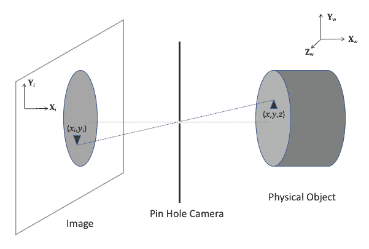

这台相机将物理世界中的点，通常称为*现实世界*，转换为图像平面上的一点。转换遵循三维坐标到二维坐标的变换。在这里，图像平面上的坐标表示为 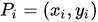，*P[i]* 是图像上的任意一点。在物理世界中，相同的点表示为 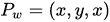，其中 *P[w]* 是具有全局参考框架的物理世界中的任意一点。

*Pi* 和 *Pw* 可以通过理想的针孔相机相关联，如下所示：


这里，*f* 是相机的焦距。

对于图像形成几何学的进一步讨论，有必要引入齐次坐标系。物理世界坐标系被称为**欧几里得坐标系**。在图像平面上，具有 *(x, y)* 坐标的点 *P'* 在齐次坐标系中表示为 *(x, y, 1)*。同样，具有 *(x, y, z)* 的世界坐标的点 *P[w]* 可以在齐次坐标系中表示为 (x, y, z, 1) 。

要从齐次坐标转换回欧几里得坐标，我们需要除以最后一个坐标值。将图像平面上齐次坐标系中的点(x, y, w)转换为欧几里得坐标系中的点(x/w, y/w)。同样，对于齐次坐标系中给出的 3D 点(x, y, z, w)，欧几里得坐标由(x/w, y/w, z/w)给出。在这本书中，我们将明确提及齐次坐标系统的使用；否则，我们将看到欧几里得坐标系中的方程。

图像形成是从物理世界坐标到图像平面坐标的转换，但丢失了关于额外维度的信息。这意味着当我们构建图像时，我们正在丢失每个像素的深度信息。因此，从图像像素坐标转换回真实世界坐标是不可能的。如图所示，对于图中的点**P[I]**，可以沿直线存在无限多个点。点**P1**、**P2**和**P3**具有相同的图像像素位置，因此在图像形成过程中丢失了深度（距离相机）的估计：

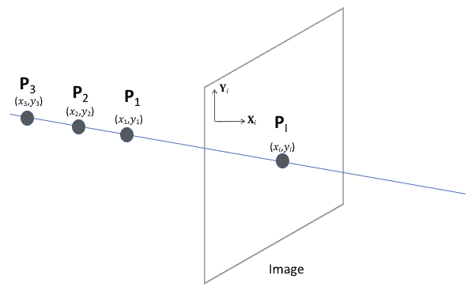

让我们从两个图像中观察一个世界点。如果我们知道构建图像的相机的光学中心和两个图像中的点位置，我们可以获得更多信息。以下图使用两个图像解释**极线几何**：

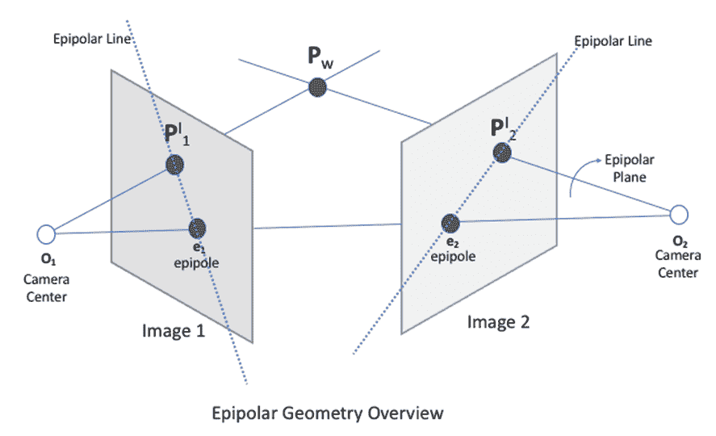

在前面的图中，相机中心**O[1]**和**O[2]**连接到世界中的点**P[w]**，形成线**P[w]**、**O[1]**、**O[2]**的平面是极线平面。相机中心线 O[1]O[2]与图像相交的点是该图像的极点。这些点可能位于图像上，也可能不在图像上。在两个图像平面都平行的情况下，极点将位于无穷远处。在这里，我们可以定义一个极线约束，如果我们知道相机中心**O[1]**和**O[2]**之间的变换为平移 T 和旋转 R，我们可以计算**P1**在**图像 1**中的位置对应到**图像 2**中的位置。数学上，这可以表示如下：

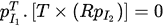

反过来，如果我们知道两个图像中对应点的位置，我们希望计算两个相机中心之间的旋转矩阵 R 和平移矩阵 T。在这里，如果两个相机不同，相机中心可以位于图像平面的不同距离处，因此我们还需要相机内参参数。数学上，这可以表示如下：

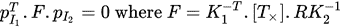

这里，*F*被称为**基本矩阵**，*K*是每个相机的**相机内参矩阵**。计算*F*，我们可以知道两个相机姿态之间的正确变换，并将一个图像平面上的任何点转换为另一个图像平面。

在下一节中，我们将看到图像之间的变换及其应用。

# 图像配准

图像配准是计算变换矩阵以将输入图像应用于该变换，从而将其转换为目标图像平面的问题。因此，生成的图像看起来像是拼接在一起，形成一个连续的大图像。

全景是图像配准的一个示例，其中我们收集具有变化相机角度的场景图像，生成的图像是配准图像的组合。结果图像如下所示：

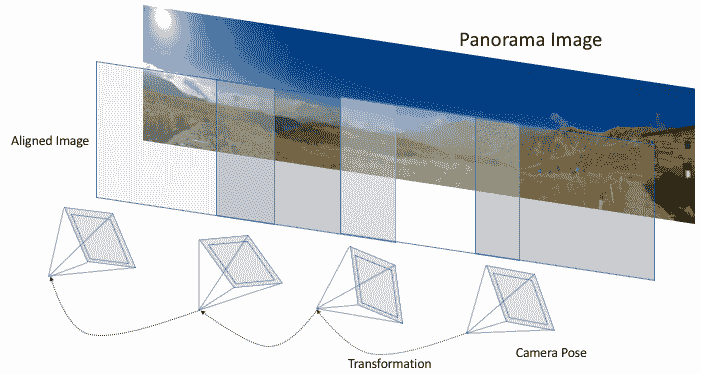

在前面的图中，展示了全景创建的一个示例。使用相机，我们通过添加重叠区域来收集同一场景的多个图像。由于相机移动时，姿态通常会显著变化，因此对于相机的不同姿态，需要计算一个变换矩阵。

让我们从计算这个变换矩阵的基本方法开始。以下代码在 Jupyter 笔记本中也可以工作。在以下代码块中，我们定义了一个函数来计算**定向 BRIEF**（**ORB**）特征点。每个特征点也有一个描述符：

```py
import numpy as np 
import matplotlib.pyplot as plt 
import cv2 
print(cv2.__version__)
import glob
# With jupyter notebook uncomment below line 
# %matplotlib inline 
# This plots figures inside the notebook

def compute_orb_keypoints(filename):
 """
 Reads image from filename and computes ORB keypoints
 Returns image, keypoints and descriptors. 
 """
 # load image
 img = cv2.imread(filename)

 # create orb object
 orb = cv2.ORB_create()

 # set method for extraction orb points 
 orb.setScoreType(cv2.FAST_FEATURE_DETECTOR_TYPE_9_16)
 orb.setWTA_K(3)

 # detect keypoints
 kp = orb.detect(img,None)

 # for detected keypoints compute descriptors. 
 kp, des = orb.compute(img, kp)

 return img,kp, des
```

一旦我们有了特征点，我们就使用暴力匹配器进行匹配，如下所示：

```py
def brute_force_matcher(des1, des2):
 """
 Brute force matcher to match ORB feature descriptors
 """
 # create BFMatcher object
 bf = cv2.BFMatcher(cv2.NORM_HAMMING2, crossCheck=True)
 # Match descriptors.
 matches = bf.match(des1,des2)

 # Sort them in the order of their distance.
 matches = sorted(matches, key = lambda x:x.distance)

 return matches
```

这是我们的主要函数，用于计算基本矩阵：

```py

def compute_fundamental_matrix(filename1, filename2):
 """
 Takes in filenames of two input images 
 Return Fundamental matrix computes 
 using 8 point algorithm
 """
 # compute ORB keypoints and descriptor for each image
 img1, kp1, des1 = compute_orb_keypoints(filename1)
 img2, kp2, des2 = compute_orb_keypoints(filename2)

 # compute keypoint matches using descriptor
 matches = brute_force_matcher(des1, des2)

 # extract points
 pts1 = []
 pts2 = []
 for i,(m) in enumerate(matches):
 if m.distance < 20:
 #print(m.distance)
 pts2.append(kp2[m.trainIdx].pt)
 pts1.append(kp1[m.queryIdx].pt)
 pts1 = np.asarray(pts1)
 pts2 = np.asarray(pts2)

 # Compute fundamental matrix
 F, mask = cv2.findFundamentalMat(pts1,pts2,cv2.FM_8POINT)
 return F

# read list of images form dir in sorted order
# change here to path to dataset 
image_dir = '/Users/mac/Documents/dinoRing/' 
file_list = sorted(glob.glob(image_dir+'*.png'))

#compute F matrix between two images
print(compute_fundamental_matrix(file_list[0], file_list[2]))

```

在下一节中，我们将扩展图像之间的相对变换来计算相机姿态并估计相机的轨迹。

# 视觉测距仪

测距仪是逐步估计机器人或设备位置的过程。对于轮式机器人，它使用轮子运动或使用陀螺仪或加速度计等工具进行惯性测量，通过求和轮子旋转来估计机器人的位置。使用**视觉测距仪**（**VO**），我们可以通过连续估计相机运动，仅使用图像序列来估计相机的测距仪。

VO 的主要用途是在无人机等自主机器人中，因为陀螺仪和加速度计在运动估计方面不够稳健。然而，在使用 VO 时存在几个假设和挑战：

+   首先，对于相机的场景中的物体应该是静态的。当相机捕捉一系列图像时，唯一移动的物体应该是相机本身。

+   此外，在估计 VO 期间，如果存在显著的照明变化，如光源出现，后续图像中的像素值可能会发生剧烈变化。因此，VO 会遭受大的误差或完全失效。同样，在黑暗环境中，由于缺乏照明，VO 无法估计稳健的运动。

VO 的过程描述如下：

1.  将起始位置初始化为原点，作为参考框架。所有后续的运动估计都是相对于这个框架进行的。

1.  当图像到达时，计算特征并将相应的特征与前一帧匹配以获得变换矩阵。

1.  使用所有后续帧之间的历史变换矩阵来计算相机的轨迹。

该过程如下图中所示：

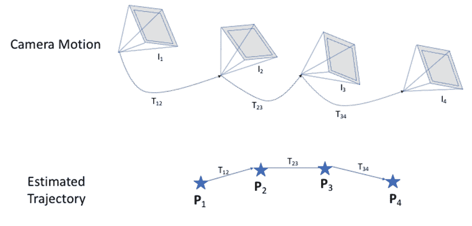

在这里，**I[i]** 是从相机接收到的第 i 幅图像，**T[ij]** 是使用图像 i 和 j 之间的特征匹配计算出的变换矩阵。相机运动轨迹用星号表示，其中**P[i]** 是第 i 幅图像中相机的估计姿态。这可能是一个二维姿态，具有(*x*, *y*)角度，也可能是一个三维姿态。每个**P[j]** 都是通过将变换**T[ij]** 应用到**P[i]** 上来计算的。

除了前面提到的假设之外，VO 估计还有一些局限性：

+   随着从序列中观察到的图像越来越多，轨迹估计中的误差会累积。这导致计算出的相机运动轨迹出现整体漂移。

+   在相机突然运动的情况下，对应两幅图像之间的图像特征匹配将出现显著错误。因此，帧间估计的变换也将有巨大的误差，因此，相机运动的整体轨迹会高度扭曲。

# 视觉 SLAM

SLAM 代表同时定位与建图，是机器人导航中最常见的问题之一。由于移动机器人没有关于其周围环境的硬编码信息，它使用机载传感器来构建该区域的表示。机器人试图估计其相对于周围物体（如树木、建筑物等）的位置。因此，这是一个“先有鸡还是先有蛋”的问题，其中机器人首先尝试使用周围的物体来定位自己，然后使用其获得的位置来绘制周围的物体；因此，术语为“同时定位与建图”。解决 SLAM 问题有几种方法。在本节中，我们将讨论使用单个 RGB 相机进行特殊类型的 SLAM。

视觉 SLAM 方法通过计算更稳健的相机轨迹以及构建环境的稳健表示来扩展视觉里程计。以下图中展示了视觉 SLAM 的实际应用概述：

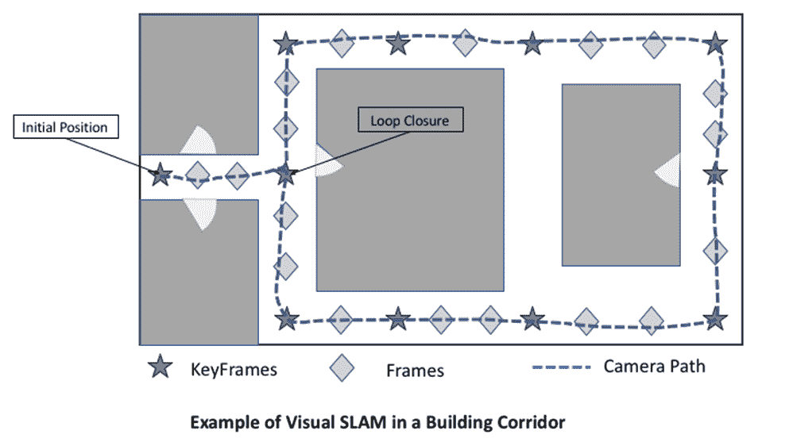

这是一个由无向图组成的通用 SLAM 方法的概述。图中的每个节点由一个关键帧组成，它代表关于世界的独特信息，并且包含该位置的相机姿态（*x*，*y*，角度）。在它们之间，关键帧是与场景中的关键帧显著重叠的帧，然而，它们有助于计算下一帧姿态的鲁棒估计。在这里，相机通过在原点初始化一个关键帧来开始这个过程。随着相机沿着轨迹移动，SLAM 系统通过根据标准添加关键帧或帧来更新图。如果相机返回到一个之前看到过的区域，它将与旧帧连接起来，在图中创建一个循环结构。这通常被称为**闭环检测**，有助于纠正整体图结构。连接图中节点到另一个节点的边通常用两个节点姿态之间的转换矩阵加权。总体而言，通过改进关键帧的位置来纠正图结构。这是通过最小化总体误差来完成的。一旦构建了一个图，就可以将其保存并用于通过匹配到最近的关键帧来定位相机。

在本节中，我们将看到一个使用单目相机的流行鲁棒方法，即 ORB SLAM。这种方法构建了一个类似于之前展示的图结构，以跟踪相机姿态，并处理来自简单相机的 RGB 图像帧。涉及到的步骤可以总结如下：

1.  **输入**：在单目摄像头的情况下，输入是一个捕获的单帧。

1.  **初始化**：一旦进程开始，就会用一个原点初始化一个地图，并构建一个关键帧图的第一个节点。

1.  系统中并行运行三个线程：

    +   **跟踪**：对于每个进入的帧，提取 ORB 特征以进行匹配。这些特征与之前看到的帧进行匹配，然后用于计算当前帧的相对姿态。这也决定了当前帧是作为关键帧保留还是用作普通帧。

    +   **局部映射**：如果从跟踪中确定了一个新的关键帧，则通过在图中插入一个新节点来更新整体地图。在形成新的邻域关键帧之间的连接的同时，会移除冗余连接。

    +   **闭环检测**：如果有一个之前看到的关键帧与当前关键帧匹配，就会形成一个闭环。这提供了关于由相机姿态轨迹引起的漂移的额外信息，因此，通过优化算法，图中的所有节点姿态都得到了纠正。

在下一节中，我们将使用来自[`github.com/raulmur/ORB_SLAM2`](https://github.com/raulmur/ORB_SLAM2)的 ORB SLAM2 的实现。这不是一个基于 Python 的实现。那里提供的说明可用于构建包，并可用于查看视觉 SLAM。然而，出于演示目的，我们将使用它的 Docker 容器版本。

Docker 是一个容器平台，它提供了一种将环境分布式地打包在船用集装箱中，以及运行应用程序的代码的方式。我们需要安装 Docker 平台并拉取环境的镜像，以及代码。镜像内的环境与我们使用的平台无关，只要安装了 Docker 平台即可。如果您想了解更多关于 Docker 和容器的内容，以下网站提供了更多详细信息以及安装说明：[`www.docker.com/what-docker`](https://www.docker.com/what-docker)。

Docker 安装完成后，我们可以开始以下步骤来运行 ORB SLAM 2。让我们首先拉取 ORB SLAM 的 Docker 镜像（这类似于克隆仓库）：

```py
docker pull resbyte/orb-slam2
```

这将下载该软件包的环境并预先构建 ORB SLAM2 仓库，这样我们就不需要再次构建它。这个仓库的所有依赖项已经在 Docker 镜像内部满足。

一旦下载了 Docker 镜像，让我们开始下载数据集。在本节中，我们将使用 `TUM RGBD` 数据集，该数据集专门收集用于评估 SLAM 和 VO 方法。在本章早期，在数据集和库部分，我们看到了如何下载这个数据集。我们将在下一节中使用提取的数据集。

由于这个 ORB SLAM 的实现使用 GUI 界面输出结果，我们首先将 GUI 界面添加到 Docker 镜像中。以下代码假设在 Linux 环境下。

对于 ORB SLAM 的 GUI 输出，请将此作为第一步添加，否则视觉 SLAM 将运行但会出现错误：

```py
xhost +local:docker
```

现在，让我们使用 Docker 平台启动下载的镜像，尽管带有几个参数：

```py
docker run -ti --rm   -e DISPLAY=$DISPLAY   -v /tmp/.X11-unix:/tmp/.X11-unix   -v /home/rgbd_dataset_freiburg1_xyz:/root/rgbd_dataset_freiburg1_xyz   orb-slam:latest /bin/bash
```

在这里，`-e` 和 `-v` 参数用于设置 GUI 的显示环境。之前下载的数据集通过 `- v $PATH_TO_DOWNLOADED_DATASET:$PATH_INSIDE_DOCKER` 在 Docker 内部共享。最后，镜像的名称是 `orb-slam: latest`*，这是我们之前使用 Docker pull 下载的，并要求它在 Docker 内运行 bash `/bin/bash`。

在运行前面的命令后，我们可以在终端中看到变化，就像登录到一个新的计算机终端一样。让我们按照以下方式运行 ORB-SLAM：

```py
cd ORB_SLAM2

# run orb slam
./Examples/Monocular/mono_tum Vocabulary/ORBvoc.txt Examples/Monocular/TUM1.yaml /root/rgbd_dataset_freiburg1_xyz
```

这里，第一个参数是运行单目视觉 SLAM，因为还有其他方法。其他参数是运行我们之前下载的数据集类型。如果数据集有任何变化，这些参数需要相应地更改。

在这个命令执行一段时间后，将出现两个窗口，如下所示：

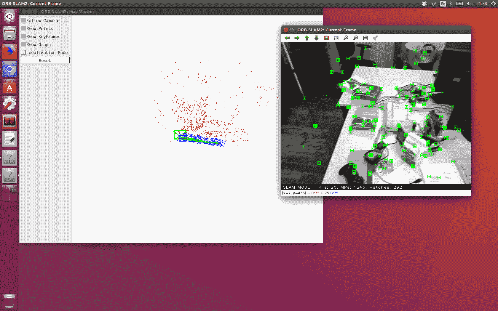

在这里，右侧的窗口是输入数据集，其中显示了每帧中检测到的关键点。而左侧的窗口详细展示了正在发生的视觉 SLAM。正如我们所见，有蓝色框显示关键帧图的创建，以及当前相机位置及其与历史位置的联系。随着数据集中相机的移动，随着更多观测值的发现，图被创建和调整。结果是相机精确的轨迹以及调整后的关键点。

# 摘要

在本章中，目标是从一个几何的角度来审视计算机视觉。从理解如何使用针孔相机形成图像开始，讨论了如何通过多图像形成结合三维世界。我们解释了视觉里程计，并介绍了视觉 SLAM。解释了 SLAM 中涉及的各个步骤，并展示了 ORB-SLAM 的使用演示，以便我们可以看到 SLAM 操作的实际发生。这是扩展 SLAM 解决方案以适应各种其他数据集的基本动机，从而创建有趣的应用。

# 参考文献

+   Sturm Jürgen, Nikolas Engelhard, Felix Endres, Wolfram Burgard, 和 Daniel Cremers. *RGB-D SLAM 系统评估的基准*. 在《智能机器人系统》（IROS）2012 年 IEEE/RSJ 国际会议上，第 573-580 页。IEEE，2012 年。

+   Mur-Artal Raul, Jose Maria Martinez Montiel, 和 Juan D. Tardos. *ORB-SLAM：一种通用且精确的单目 SLAM 系统*. IEEE 机器人学汇刊，第 31 卷第 5 期（2015 年）：1147-1163。

+   Rublee Ethan, Vincent Rabaud, Kurt Konolige, 和 Gary Bradski. *ORB：一种比 SIFT 或 SURF 更有效的替代方案*. 在《计算机视觉》（ICCV）2011 年 IEEE 国际会议上，第 2564-2571 页。IEEE，2011 年。
