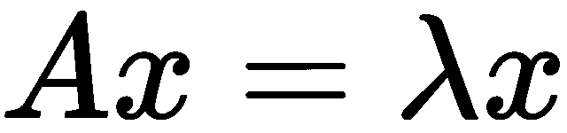

# 计算机视觉数学

在本书中，我们使用了需要良好数学背景的几个高级算法。本附录首先描述了一些先决条件，在需要的地方提供了 Python 实现。

在本附录中，我们将涵盖以下主题：

+   线性代数运算和向量矩阵的性质

+   概率和常见的概率函数

# 数据集和库

在本附录中，我们不会使用特定的数据集；而是将使用示例值来展示工作原理。使用的库是 NumPy 和 scipy。在第二章中，*库、开发平台和数据集*，我们看到了 Anaconda 工具的安装，它包含 NumPy 和 SciPy；因此，不需要新的安装。

如果没有安装 Anaconda，那么要安装 Numpy 和 SciPy，请使用以下命令：

```py
pip install numpy scipy
```

要绘制图形，我们将使用`matplotlib`。这也包含在 Anaconda 中；然而，如果需要安装，请使用以下命令：

```py
pip install matplotlib
```

要开始本章的代码，我们将使用以下常用导入：

```py
import numpy as np
import scipy
import matplotlib.pyplot as plt
```

# 线性代数

计算机视觉工具和技术高度依赖于线性代数运算。我们将看到在开发 CV 应用中所需的基本到高级运算的解释。

# 向量

在二维平面上，向量表示为一个点 。

在这种情况下，向量`p`的模表示为  并由以下给出：


在 Python 中，向量用一个一维数组表示，如下所示：

```py
p = [1, 2, 3]
```

在这里，所需的一些常见性质是向量的长度和向量的模量，如下所示：

```py
print(len(p))

>>> 3
```

常见的向量运算如下：

+   加法

+   减法

+   向量乘法

+   向量范数

+   正交性

# 加法

假设有两个向量如下表示：

```py
v1 = np.array([2, 3, 4, 5])
v2 = np.array([4, 5, 6, 7])
```

结果向量是逐元素的和，如下所示：

```py
print(v1 + v2)

>>> array([ 6, 8, 10, 12])
```

# 减法

减法类似于加法；而不是逐元素的和，我们计算逐元素的差：

```py
v1 = np.array([2, 3, 4, 5])
v2 = np.array([4, 5, 6, 7])
print(v1 - v2)

>>> array([-2, -2, -2, -2])
```

# 向量乘法

计算向量乘法有两种方法：

+   内积——这也称为点积，是两个向量逐元素乘积的和：


其中 和 分别是向量 和 的第`n`个元素。

在 Python 中，我们可以使用 NumPy 来计算：

```py
v1 = np.array([2, 3, 4, 5])
v2 = np.array([4, 5, 6, 7])
print(np.inner(v1, v2))

>>> 82
```

+   外积——这需要两个向量并计算一个矩阵

其中每个元素`i`，`j`在*V[3]*中给出如下：


在 Python 中我们可以这样计算：

```py
v1 = np.array([2, 3, 4, 5])
v2 = np.array([4, 5, 6, 7])
print(np.outer(v1, v2))

>>> array([[ 8, 10, 12, 14],
[12, 15, 18, 21],
[16, 20, 24, 28],
[20, 25, 30, 35]])
```

# 向量范数

向量 *V* 的第 ![img/fa4e3c9c-b6b4-4451-ad66-a76c56a501d2.png] 阶范数如下所示：

![img/657e7e9e-cf5e-4d23-9170-b38c904197ea.png]

向量有两种流行的范数类型：

+   ![img/650d12a4-fec9-4487-8293-2dd540d4f483.png] 范数——这被表示为 ![img/cb13a987-1b45-46ff-a011-fe8bae9f6e36.png] ，以下是一个示例：

```py
v = np.array([2, 3, 4, 5])
print(np.linalg.norm(v, ord=1))

>>>14.0
```

+   ![img/156cdc07-de10-409f-ad83-f55b15c4be1e.png] 范数——这被表示为 ![img/e9c191c5-0c1a-463f-883f-b42d74cc72e6.png] ，以下是一个示例：

```py
v = np.array([2, 3, 4, 5])
print(np.linalg.norm(v, ord=2))

>>>7.34846922835
```

# 正交性

如果两个向量的内积为零，则称这两个向量是正交的。从几何角度来看，如果两个向量垂直，则称它们相互正交：

```py
v1 = np.array([2, 3, 4, 5])
v2 = np.array([1,-1,-1,1]) # orthogonal to v1
np.inner(v1, v2)

>>> 0
```

# 矩阵

二维数组被称为矩阵，在计算机视觉中，这些起着重要作用。在数字世界中，图像被表示为矩阵；因此，我们将研究这里进行的运算也适用于图像。

矩阵 ![img/87cc0af2-5de1-4537-9109-a3b43d5c8df5.png] 被表示如下：

![img/cf2d5797-d82c-4783-af6c-18c51b1d6156.png]

在这里，矩阵的形状是 m x n  有 ![img/10eaa40b-1f57-4ade-866d-e0f4567ff54d.png] 行和 ![img/f44f6cfc-e944-4dc7-9f10-08b3a8c31806.png] 列。如果 ![img/71eb906d-a20f-4811-82fa-3c1bac00b478.png]，则该矩阵被称为方阵。

在 Python 中，我们可以创建一个示例矩阵，如下所示：

```py
A = np.array([[1, 2, 3],[4, 5, 6], [7, 8, 9]])
```

这被打印如下：

```py
print(A)

>>> array([[1, 2, 3],
[4, 5, 6],
[7, 8, 9]])
```

# 矩阵运算

我们将在矩阵上执行与向量上相同的运算。唯一的区别在于我们执行这些运算的方式。要详细了解这一点，请参阅以下章节。

# 加法

为了执行两个矩阵 `A` 和 `B` 的加法，它们应该具有相同的形状。加法运算是对元素进行逐个加法，以创建一个与 `A` 和 `B` 具有相同形状的矩阵 `C`。以下是一个示例：

```py
A = np.array([[1, 2, 3],[4, 5, 6], [7, 8, 9]])
B = np.array([[1,1,1], [1,1,1], [1,1,1]])
C = A+B
print(C)

>>> array([[ 2, 3, 4],
[ 5, 6, 7],
[ 8, 9, 10]])
```

# 减法

与加法类似，从矩阵 `A` 中减去矩阵 `B` 需要它们具有相同的形状。结果矩阵 `C` 将与 `A` 和 `B` 具有相同的形状。以下是从 `A` 中减去 `B` 的示例：

```py
A = np.array([[1, 2, 3],[4, 5, 6], [7, 8, 9]])
B = np.array([[1,1,1], [1,1,1], [1,1,1]])
C = A - B
print(C)

>>> array([[0, 1, 2],
[3, 4, 5],
[6, 7, 8]])
```

# 矩阵乘法

假设有两个矩阵：`A` 的大小为 *m x n*  和 `B` 的大小为 *q x p*。这里的假设是 ![img/02925eb1-b19c-467d-aaf3-ffbd710d3db6.png]。现在，大小为 *m x n* 和 *n x p* 的两个矩阵可以进行矩阵乘法。乘法如下所示：

![img/85f9afbc-9a90-46f3-8251-560263f08e64.png]

在这里，![img/156acaf4-f860-4faf-bdbb-d454b7636383.png] 中的每个元素如下所示：

![img/d78baab5-f8e8-4770-aeeb-afd5510d4bd6.png]

这项操作是用 Python 完成的，如下所示：

```py
# A matrix of size (2x3)
A = np.array([[1, 2, 3],[4, 5, 6]])
# B matrix of size (3x2)
B = np.array([[1, 0], [0, 1], [1, 0]])
C = np.dot(A, B) # size (2x2)
print(C)

>>> array([[ 4, 2],
[10, 5]])
```

由于矩阵乘法依赖于乘法的顺序，改变顺序可能会导致不同的矩阵或由于大小不匹配而无效的乘法。

我们已经看到了矩阵的基本操作；现在我们将探讨它们的某些性质。

# 矩阵性质

在矩阵执行数学运算时，有一些性质被使用。它们在本节中详细说明。

# 转置

当我们交换矩阵的列和行时，得到的矩阵被称为矩阵的转置，表示为 ，对于原始矩阵 。以下是一个例子：

```py
A = np.array([[1, 2, 3],[4, 5, 6]])
np.transpose(A)

>>> array([[1, 4],
[2, 5],
[3, 6]])
```

# 单位矩阵

这是一个特殊的矩阵，其对角线元素为`1`，其余元素为零：

```py
I = np.identity(3) # size of identity matrix
print(I)

>>> [[ 1\. 0\. 0.]
[ 0\. 1\. 0.]
[ 0\. 0\. 1.]]
```

单位矩阵的一个有趣性质是它在乘法后不会修改目标矩阵，即  或  将得到 。

# 对角矩阵

扩展单位矩阵的定义，在对角矩阵中，矩阵主对角线上的元素非零，其余值均为零。以下是一个例子：

```py
A = np.array([[12,0,0],[0,50,0],[0,0,43]])

>>> array([[12, 0, 0],
[ 0, 50, 0],
[ 0, 0, 43]])
```

# 对称矩阵

在对称矩阵中，元素遵循以下性质：。对于给定的对称矩阵 ，这种逐元素性质也可以用转置来定义，如下所示：。

让我们考虑一个如下给出的非对称方阵（大小为 *n x n*）：

```py
A = np.array([[1, 2, 3],[4, 5, 6], [7, 8, 9]])
```

其转置可以按以下方式计算：

```py
A_T = np.transpose(A)

>>> [[1 4 7]
[2 5 8]
[3 6 9]]
```

我们可以证明  是一个对称矩阵：

```py
print(A + A_T)

>>> [[ 2 6 10]
[ 6 10 14]
[10 14 18]]
```

在这里，我们可以看到元素 。

此外，我们还可以计算反对称矩阵，如下所示：，其中每个元素 ：

```py
print(A - A_T)

>>> [[ 0 -2 -4]
[ 2 0 -2]
[ 4 2 0]]
```

从这里产生的一个重要性质是；我们可以将任何方阵分解为对称矩阵和反对称矩阵的和，如下所示：


继续以下 Python 脚本：

```py
symm = A + A_T
anti_symm = A - A_T
print(0.5*symm + 0.5*anti_symm)

>>> [[ 1\. 2\. 3.]
[ 4\. 5\. 6.]

[ 7\. 8\. 9.]]
```

# 矩阵的迹

矩阵的迹是所有对角线元素的和：

```py
A = np.array([[1, 2, 3],[4, 5, 6], [7, 8, 9]])

np.trace(A)
```

# 矩阵行列式

从几何上看，矩阵行列式的绝对值是由每一行作为向量所围成的体积。这可以通过以下方式计算：

```py
A = np.array([[2, 3],[ 5, 6]])
print(np.linalg.det(A))

>>> -2.9999999999999982
```

# 矩阵范数

继续从上一节关于向量的范数公式，在矩阵中，最常见的一种范数是 Frobenius 范数：


在 Python 中，我们这样计算：

```py
A = np.array([[1, 2, 3],[4, 5, 6], [7, 8, 9]])
np.linalg.norm(A)

>>> 16.881943016134134
```

# 获取矩阵的逆

矩阵的逆，表示为 ，有一个有趣的性质；。每个矩阵的逆是唯一的；然而，并非所有矩阵都有逆矩阵。以下是一个矩阵逆的例子：

```py
A = np.array([[1, 2, 3],[5, 4, 6], [9, 8, 7]])
A_inv = np.linalg.inv(A)
print(A_inv)

>>>[[ -6.66666667e-01 3.33333333e-01 4.93432455e-17]
[ 6.33333333e-01 -6.66666667e-01 3.00000000e-01]
[ 1.33333333e-01 3.33333333e-01 -2.00000000e-01]]
```

现在，如果我们取  和  的乘积，我们得到以下结果：

```py
np.dot(A, A_inv)

>>> [[ 1.00000000e+00 1.66533454e-16 -5.55111512e-17]
[ 3.33066907e-16 1.00000000e+00 1.11022302e-16]
[ 8.32667268e-16 -2.77555756e-16 1.00000000e+00]]
```

我们可以看到对角线元素是 `1`，而其他所有元素都大约是 `0`。

# 正交性

与方阵相关联的另一个属性是正交性，其中  或 。这也导致了 。

# 计算特征值和特征向量

方阵 `A` 的特征值 λ 具有这样的性质，即任何用特征向量  对其进行的变换等于  与  的标量乘积：

 其中 

要计算  的特征值和特征向量，我们需要解特征方程，如下所示：


在这里， 是与  相同大小的单位矩阵：

我们可以使用 NumPy 如下完成此操作：

```py
A = np.array([[1, 2, 3],[5, 4, 6], [9, 8, 7]])
eigvals, eigvectors = np.linalg.eig(A)
print("Eigen Values: ", eigvals)
print("Eigen Vectors:", eigvectors)

>>> Eigen Values: [ 15.16397149 -2.30607508 -0.85789641]
Eigen Vectors: [[-0.24668682 -0.50330679 0.54359359]
[-0.5421775 -0.3518559 -0.8137192 ]
[-0.80323668 0.78922728 0.20583261]]
```

# 赫斯矩阵

 的一阶梯度矩阵是通过计算 `A` 的每个元素的偏导数来形成的：


类似地，函数  的二阶梯度如下所示：


赫斯矩阵用  表示。

# 奇异值分解

**奇异值分解**（**SVD**）用于将矩阵  分解为 ，其中  和  是正交矩阵，而  是对角矩阵：

```py
A = np.array([[1, 2, 3],[5, 4, 6], [9, 8, 7]])

U, s, V = np.linalg.svd(A, full_matrices=True)
```

# 概率论简介

我们在大学或其他地方通过几门课程学习了概率论。在本节中，目标是填补空白，以便可以轻松构建需要概率论理论的计算机视觉算法。在计算机视觉中使用概率论的动力是建模不确定性。

# 随机变量是什么？

随机变量用于用实数来定义事件的可能性。它可以表示的值是随机的，通过应用某些假设，我们可以将其限制在给定的范围内。要开始使用随机变量，我们需要计算一个近似其行为的函数，或者通过实验假设并证明我们的假设函数。这些函数有两种类型：

+   在离散域中，随机变量的值是离散的。因此，用于建模概率的函数被称为**概率质量函数**（**PMF**）。例如，设为一个离散随机变量；其 PMF 由给出，其中是随机变量的不同值之一。

+   在连续域中，用于建模随机变量的函数被称为**概率密度函数**（**PDF**），它接受随机变量的连续域值来产生概率。

# 期望

对于一个离散随机变量，函数的期望如下所示：


这里是概率质量函数。

对于一个连续随机变量，函数的期望如下所示：


# 方差

为了衡量随机变量的集中质量，我们使用方差。从数学上讲，它定义如下：


这个表达式也可以转换为：


# 概率分布

分布将在以下章节中详细解释。

# 伯努利分布

在伯努利分布中，函数如下所示：


这里，参数为，我们可以使用 SciPy 来模拟这个模型：

```py
from scipy.stats import bernoulli
import matplotlib.pyplot as plt

# parameters for bernoulli distribution
p = 0.3
# create random variable
random_variable = bernoulli( p)
```

# 二项分布

在二项分布中，函数如下所示：，参数为和。我们可以使用 SciPy 来模拟这个模型：

```py
from scipy.stats import binom
import matplotlib.pyplot as plt

# parameters for binomial distribution
n = 10
p = 0.3

# create random variable
random_variable = binom(n, p)

# compute probability mass function
x = scipy.linspace(0,10,11)

# plot
plt.figure(figsize=(12, 8))
plt.vlines(x, 0, random_variable.pmf(x))
plt.show()
```

结果的图表如下所示：


# 泊松分布

泊松分布的函数如下：


这里，参数是λ，SciPy 中的一个示例脚本如下：

```py
from scipy.stats import poisson
import matplotlib.pyplot as plt

# parameters for bernoulli distribution
lambda_ = 0.1

# create random variable
random_variable = poisson(lambda_)

# compute probability mass function
x = scipy.linspace(0,5,11)

# plot
plt.figure(figsize=(12, 8))
plt.vlines(x, 0, random_variable.pmf(x))
plt.show()
```

# 均匀分布

如果一个分布在和之间，并且遵循以下规则，那么它被称为均匀分布：


# 高斯分布

计算机视觉中最常用的分布之一，高斯分布如下定义：


这里，参数是和，它们也被称作**均值**和**方差**。当为 0 且为 1.0 时，出现一个特殊情况；它被称为正态分布。使用 SciPy，我们可以如下建模：

```py
from scipy.stats import norm
import matplotlib.pyplot as plt
import scipy

# create random variable
random_variable = norm()

# compute probability mass function
x = scipy.linspace(-5,5,20)

# plot
plt.figure(figsize=(12, 8))
plt.vlines(x, 0, random_variable.pdf(x))
plt.show()

```

结果的图表如下所示：


# 联合分布

联合分布用于两个随机变量，如果我们想要找到两个与它们相关的事件同时发生时的有效概率。设和为两个随机变量；它们的联合分布函数由给出。

# 边缘分布

在联合分布的情况下，我们想要知道在我们可以观察到所有其他事件的情况下，一个事件的概率密度函数。我们称之为边缘分布，它如下给出：


对于离散情况，边缘分布如下：


这里，我们正在寻找相对于的的边缘分布。

# 条件分布

我们希望在知道一个随机变量的值之后计算概率。这在数学上表示为对于已知的变量，并且它与联合概率分布的关系如下：


这里，是联合分布，是边缘分布。

# 贝叶斯定理

在许多计算机视觉应用中隐含使用的一个重要定理是贝叶斯定理，它在连续随机变量的情况下如下扩展条件概率：


这里，我们有：


# 概述

在本附录中，我们解释了一些计算机视觉算法的先决条件。这里解释的线性代数表达式用于图像的几何变换，例如平移、旋转等。

概率方法被应用于一系列应用中，包括但不限于目标检测、分割和跟踪应用。因此，对这些先决条件的良好理解将使我们的应用实现更快、更高效。
