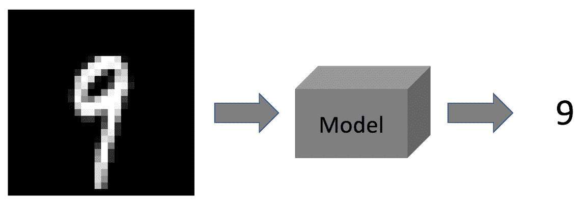
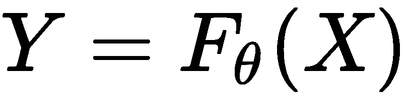
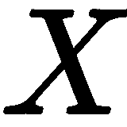
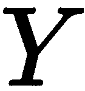
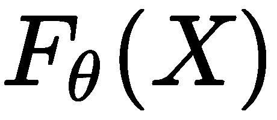
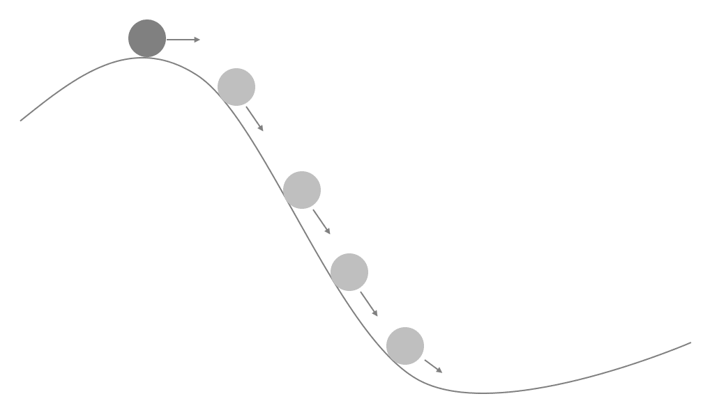
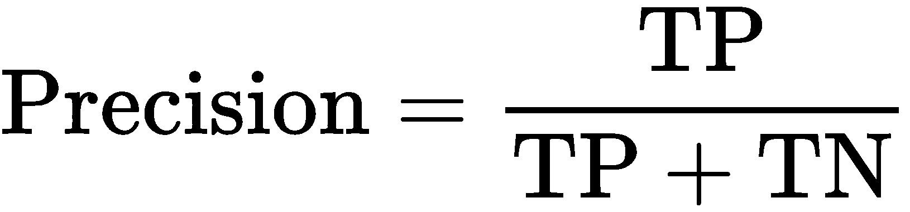
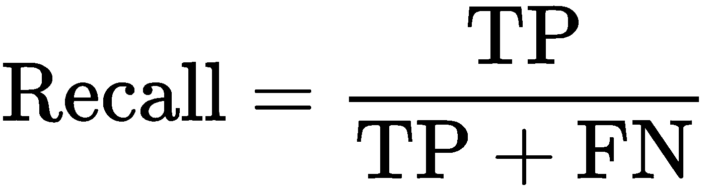
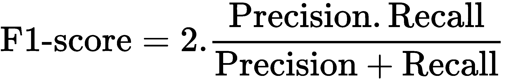

# 计算机视觉中的机器学习

在本章中，我们将概述相关的机器学习理论和工具，这些工具在开发图像分类、目标检测等应用程序时非常有用。随着通信工具的普及和摄像头传感器的广泛应用，我们现在被大量的图像数据所淹没。利用这些数据创建计算机视觉应用程序需要理解一些基本的机器学习概念。

让我们先解释一下什么是机器学习，然后我们将看到其中的不同类型的算法。

# 什么是机器学习？

假设我们已经扫描了几张手写数字的图像，并希望制作一个软件，该软件能够从图像扫描中识别手写数字。为了简化，让我们假设我们只有一个数字。我们开发的软件接受这张图像，并输出与该图像对应的数字。我们可以创建一个包含几个检查的算法，例如：如果有一条单独的垂直线，则输出 1，或者如果有一个椭圆形，则显示为 0。然而，这种方法非常天真，并且是一个糟糕的解决方案，因为我们也可以为其他数字有垂直线：7，9，等等。以下图解释了整个过程，取自 MNIST 手写数字数据集的一个样本：



有几种方法可以建模这样的问题。我们知道图像由像素数组组成，每个像素存储一个值。在之前的图中，每个像素的值是二进制的，最初的方法是计算图像的平均值。基于这个平均值，我们可以定义一个函数，如果平均值位于某个范围内，则该图像为**9**；我们可以对其他数字做同样的处理。在整个过程中，我们的参数是每个数字图像的范围，这些范围可以是直观地添加，也可以通过经验学习。

然而，这种在图像中检测数字的方法容易出错，并且效率不高。模型的参数可能只适用于特定的一组图像，而且仅凭经验很难找到合适的值。机器学习技术在这里起着重要作用。在这个设置中，让我们使用一个函数，该函数将输出一个大小为 10 的数组，对应于我们试图找到的数字。每个数组值代表该数字在图像中的概率。概率最高的数字将被识别为该数字。现在，我们已经对输出进行了建模，但我们的输入仍然是图像的平均值，这在不同图像之间可能变化不大。因此，我们不是使用平均值，而是可以使用整个图像像素，并将像素值直接映射到输出概率。这样，我们可以捕捉到图像中的更多变化，这是计算机视觉中的常用方法。

我们对机器学习的理解可以通过以下建模问题的数学方法进一步增强：



这里，是输入，是模型的输出。在我们之前的例子中，这些是图像和概率数组。是我们希望创建的机器学习模型，是的参数。

# 机器学习技术的种类

在上一节中，我们看到了机器学习的介绍以及数字图像的建模示例。现在，我们将看到不同的机器学习技术风格。

# 监督学习

在监督学习中，我们被给出一个包含模型输入和所需输出的数据集；我们的目标是创建一个模型，该模型可以接受任何以前未见过的数据，并尽可能真实地输出值。监督学习有两种类型。

# 分类

这是指模型输出为分类情况的术语。例如，在数字分类的情况下，输出是 10 个不同数字中的一个。

# 回归

这是指输出具有连续值的情况，例如，线性拟合模型。在其中，目标是尽可能逼近曲线，以便模型的输出是一个特定范围内的值。

# 无监督学习

在这种机器学习类型中，我们没有给出任何具有特定输出的数据集；相反，模型应该能够根据输入找到可能的输出。例如，在之前的手写数字图像中，我们希望估计某些古代文本中所有可能的数字。这里的假设是我们不知道该文本中存在多少种不同的数字。在这种情况下，模型应该理解数字的外观。一个可能的办法是对图像中数字的区域进行分割，并拟合基本形状，如线条、圆形、矩形等。

# 维度诅咒

考虑到不同的机器学习技术，了解建模中的挑战非常重要。我们将使用之前提到的数字分类方法。我们之前尝试使用所有像素作为可用输入来建模它。输入的维度是图像大小，即 h x w。它从几百到几千不等。这个大小被认为是输入维度，随着它的增加，计算以及估计的不确定性也会增加。如果输入维度增加，我们需要更大的模型来进行更好的估计。这被称为**维度诅咒**。

为了解决这个诅咒，强烈建议减少输入维度。例如，我们不是使用像素值作为输入，而是提取强大的特征并将它们作为模型的输入。这将显著减少输入维度，并可能提高模型的总体性能。

# 学习的滚动球视角

为了学习模型的参数，我们创建一个`成本`函数或`目标`函数，并最小化其值。`目标`的最小值将给出模型的最佳参数。例如，假设模型  预测一个值 ，并且我们给出了模型输入和输出的数据集。那么，学习一个模型需要更新参数 ，以便我们获得最佳性能。

为了让模型学习，我们使用参数更新规则。它通过估计模型估计值与目标值之间的距离，然后更新参数，使得这种差异减少。经过几次迭代，差异会变小，一旦足够小，我们就说我们的模型已经学会了参数。这里给出了一个形象的解释：



模型的学习类似于滚动球。它是一个迭代过程，每次过程后，参数都会更新。更新将参数推向最小化`目标`函数。这种最小化表示为将球向下推到斜坡上。最佳参数相当于斜坡底部的模型状态。

# 有用工具

在本节中，我们将看到在创建机器学习模型时使用的某些工具。在这里，我们将使用 scikit-learn 包，但这些在其他许多库中也是可用的。整体功能和目的保持不变。

# 预处理

在分类或回归等设置中对输入以及目标标签进行预处理与模型本身一样重要。以下是一些使用的技术解释。

# 归一化

为了让模型通过训练集学习适当的参数，将值归一化到一个小范围内，通常是 0 到 1，是非常重要的。

# 噪声

为了使系统更加鲁棒，输入也可以添加小的高斯噪声。在图像作为输入的情况下，噪声对应于盐和胡椒噪声。

# 后处理

在分类的情况下，模型的输出是一个概率数组。为了计算输入的预测标签，我们使用数组中最大值的索引。

在回归的情况下，模型的输出通常是介于 0-1 范围内的归一化值。这需要对输出进行缩放以回到原始域。

# 评估

一旦我们训练了一个模型，为了评估它，高度有必要检查其整体有效性。在二元分类问题中，设置评估是通过使用以下输出值完成的。在这里，我们想要评估模型对类别 A 的性能：

+   **真阳性**（**TP**）：给定一个来自标签 A 的样本，输出也被分类为 A

+   **真阴性**（**TN**）：给定一个来自标签 A 的样本，输出被分类到 B

+   **假阳性**（**FP**）：给定一个来自标签 B 的样本，输出被分类到 A

+   **假阴性**（**FN**）：给定一个来自 B 的样本，输出也被分类到 B

这是在评估集上完成的，并且基于它，我们计算以下参数。

# 精确度

精确度值告诉我们结果与我们的目标在准确性方面有多相关。这是按照以下方式计算的：



使用 scikit-learn，我们可以这样做：

```py
from sklearn.metrics import precision_score
true_y = .... # ground truth values
pred_y = .... # output of the model

precision = precision_score(true_y, pred_y, average='micro')
```

# 召回率

召回率告诉我们有多少结果是真正相关的。这是按照以下方式计算的：



使用 scikit-learn：

```py
from sklearn.metrics import recall_score
true_y = .... # ground truth values
pred_y = .... # output of the model

recall = recall_score(true_y, pred_y, average='micro')
```

# F 度量

使用精确度和召回率值，计算 F 度量（特别是 F1 分数用于整体评估）。这是按照以下方式给出的：



使用 scikit-learn，这可以计算如下：

```py
from sklearn.metrics import f1_score
true_y = .... # ground truth values
pred_y = .... # output of the model

f1_value = f1_score(true_y, pred_y, average='micro')
```

# 摘要

在本章中，我们用相关工具解释了机器学习概述。这里的解释补充了章节中提出的几个算法。

考虑到维度诅咒、学习概述和模型评估，我们可以创建更好的计算机视觉应用，这些应用使用机器学习技术。
