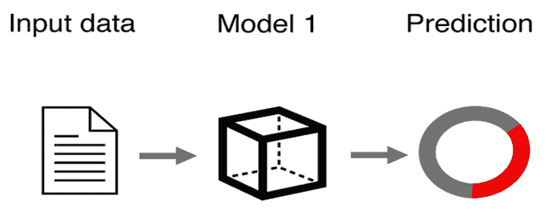

# 正规预测介绍

本书关于正规预测，这是一个用于不确定性量化的现代框架，在工业和学术界越来越受欢迎。

机器学习和人工智能应用无处不在。在机器学习的领域，预测是一个基本任务。给定一个训练数据集，我们训练一个机器学习模型对新数据进行预测。

图 1.1 – 机器学习预测模型

然而，在许多实际应用中，由于各种因素，如数据不足或不完整、建模过程中的问题，或者仅仅是底层问题的随机性和复杂性，统计、机器学习和深度学习模型做出的预测往往是不正确或不可靠的。

机器学习模型做出的预测通常没有提供所需的置信度和可靠性量化，这正是正规预测发挥作用的地方。通过提供其预测可靠性的明确度量，正规预测增强了机器学习模型的可信度和可解释性，使它们对决策者更加透明和用户友好。

本章将介绍正规预测，并探讨它在实际环境中的应用。

在本章中，我们将涵盖以下主要主题：

+   正规预测简介

+   正规预测的起源

+   正规预测与传统机器学习的区别

+   p 值及其在正规预测中的作用

本章将提供对正规预测及其应用的实用理解。在本章结束时，您将能够理解如何将正规预测应用于自己的机器学习模型，以提高其可靠性和可解释性。

# 技术要求

本书使用 Python。本书的代码托管在 GitHub 上，可在以下链接找到：[`github.com/PacktPublishing/Practical-Guide-to-Applied-Conformal-Prediction`](https://github.com/PacktPublishing/Practical-Guide-to-Applied-Conformal-Prediction)。您可以在本地运行笔记本或将它们上传到 Google Colab ([`colab.research.google.com/`](https://colab.research.google.com/))。

# 正规预测简介

在本节中，我们将介绍正规预测，并解释如何利用它来提高统计、机器学习和深度学习模型生成的预测的可靠性。我们将概述正规预测背后的关键思想和概念，包括其基本原理和优势。在本节结束时，您将对正规预测有一个扎实的理解，并了解为什么它是一个重要的知识框架。

正规预测是一种强大的机器学习框架，为个别预测提供有效的置信度度量。这意味着当你使用正规预测框架中的任何模型进行预测时，你还可以测量你对该预测的置信度。

这在许多实际应用中非常有用，在这些应用中，可靠和可解释的预测至关重要。例如，在医疗诊断中，正规预测可以提供肿瘤是恶性还是良性的置信水平。这使得医生可以根据预测置信度做出更明智的治疗决策。在金融领域，正规预测可以提供估计金融风险的预测区间。这允许投资者量化上行和下行风险。

具体来说，正规预测可以确定有 95%的可能性肿瘤是恶性的，这使医生对癌症诊断充满信心。或者，它可以预测下个月股价将在 50 美元和 60 美元之间的 80%的可能性，提供一个估计的交易范围。正规预测通过提供可量化的置信度，增加了信任，并在医疗诊断和金融预测等现实世界应用中非常有价值。

正规预测的关键优势是它为个别预测提供有效的置信度度量。正规预测模型通常以预测区间或预测集的形式提供预测，并指定一个置信水平，例如 95%。在分类问题中，正规预测还可以校准类概率，增强置信度和明智的决策。

在正规预测中，“覆盖”表示预测区域（无论是分类任务中的潜在结果集合还是回归任务中的预测区间）准确包含真实值的可能性。本质上，如果你选择 95%的覆盖，这意味着有 95%的可能性真实值落在提供的预测集或区间内。

我们称这样的预测区域为“有效的”。预测有效性的要求对于确保模型不包含预测偏差至关重要，特别是在健康、金融和自动驾驶汽车等后果重大的应用中尤为重要。有效的预测是信任产生该预测的机器学习模型的前提。

虽然有其他方法来量化不确定性，例如贝叶斯方法、蒙特卡洛方法和自助法，以提供有效性保证，但这些方法需要关于数据的特定分布假设——例如，假设数据遵循正态分布。然而，真实世界数据的真实分布通常未知。相反，正规预测不做出分布假设，可以在不假设数据分布具体细节的情况下提供有效性保证。这使得正规预测更广泛地适用于可能不满足如正态性、平滑性等常见统计假设的真实数据。

在实践中，对特定分布的假设需求限制了贝叶斯推理或自助法等方法正式严格地陈述关于任意真实数据源的能力。无法保证这些方法的预测将具有所声称的置信水平或覆盖范围，因为这些假设可能不成立。这可能导致向用户传达的置信水平与实际覆盖范围之间存在不匹配，导致决策不准确并误导用户关于模型预测可靠性的认识。

正规预测通过提供不依赖于难以验证的数据分布假设的无分布有限样本有效性保证来规避这些问题。这使得正规预测的置信度估计在现实世界应用中更加可靠和稳健。

正规预测具有多重优势：

+   **保证覆盖范围**：正规预测自动保证预测区域的有效性。来自正规预测框架的任何方法都通过数学设计保证了预测区域的有效性。相比之下，其他方法输出的预测不提供任何有效性保证。例如，流行的 NGBoost 包不产生有效的预测区间（你可以在以下链接中了解更多信息：[`medium.com/@valeman/does-ngboost-work-evaluating-ngboost-against-critical-criteria-for-good-probabilistic-prediction-28c4871c1bab`](https://medium.com/@valeman/does-ngboost-work-evaluating-ngboost-against-critical-criteria-for-good-probabilistic-prediction-28c4871c1bab))。

+   **无分布依赖性**：一致性预测是无分布依赖性的，可以应用于任何数据分布，无论分布的性质如何，只要数据是可交换的。可交换性意味着数据点的顺序或索引并不重要——对数据点进行洗牌或排列不会改变整体数据分布。例如，可交换性假设观察 1、2、3 与观察 2、3、1 或 3、1、2 具有相同的分布。这是一个比独立同分布（IID）更弱的假设，并且是提供有效性保证所必需的。与许多经典统计模型不同，一致性预测不假设数据遵循正态分布。数据可以具有任何分布，甚至包括像厚尾这样的不规则性。唯一的要求是可交换性。通过仅依赖于可交换性而不是严格的分布假设，一致性预测在预测覆盖范围上提供了有限样本保证，这些保证是无分布依赖性的，并且适用于任何数据源。

+   **模型无关性**：一致性预测可以应用于任何产生点预测的预测模型，包括分类、回归、时间序列、计算机视觉、自然语言处理、强化学习或其他统计、机器学习和深度学习任务。一致性预测已经成功应用于许多创新模型类型，包括最近的一些创新，如扩散模型和**大型语言模型**（**LLMs**）。一致性预测不要求模型是统计的、机器学习的或深度学习的。它可以是任何类型的任何模型，例如由领域专家开发的商业启发式模型。如果您有一个用于进行点预测的模型，您可以使用一致性预测作为您点预测模型上的不确定性量化层，以获得一个校准良好、可靠且安全的概率预测模型。

+   **非侵入性**：一致性预测在简单性和效率方面脱颖而出。它不是彻底改造现有的点预测模型，而是无缝地与之集成。对于已经将模型投入生产的公司来说，这是一个颠覆性的变化。对于数据科学家来说，这个过程甚至更加令人兴奋。只需将您的点预测模型与一致性预测提供的不确定性量化层叠加，您就装备了一个最先进的概率预测模型。

+   **数据集大小**：符合预测与典型的统计方法不同，后者依赖于严格的数据分布假设，如正态性，或需要大量数据集才能提供可靠的保证。它提供内在的数学保证，确保无论数据集大小如何，预测都是有效的且无偏差。虽然较小的数据集在回归任务中可能产生更宽的预测区间（或分类中的更大集合），但符合预测始终保持一致性。无论数据集大小、底层预测模型或数据分布如何，其有效性都得到保证，使其成为不确定性量化的一种独特且无与伦比的方法。

+   **易于使用**：几年前，由于开源库的稀缺，符合预测的采用受到限制，尽管一些著名大学和主要公司如微软已经使用它多年。快进到今天，情况发生了巨大变化。现在有丰富的顶级 Python 包，如 MAPIE 和 Amazon Fortuna 等。这意味着通过符合预测生成良好校准的概率预测只需几行代码，使其能够轻松集成到商业应用中。此外，KNIME 等平台通过低代码或无代码解决方案使它的使用民主化。

+   **快速**：最广泛采用的符合预测变体，归纳符合预测，因其高效运行且无需重新训练基础模型而脱颖而出。相比之下，其他方法，如贝叶斯网络，通常需要重新训练。这种区别意味着归纳符合预测提供了一种简化的方法，消除了与重复模型重新训练相关的时延和计算成本。

+   **非侵入性**：与许多不确定性量化技术不同，符合预测无缝集成，不会改变底层点预测模型。其非侵入性既经济又方便，尤其是与其他需要可能昂贵且复杂的机器或深度学习模型调整的方法相比。使用符合预测的好处确实是令人难以置信的。你可能想知道符合预测是如何实现其提供给用户的独特而强大的益处的。

符合预测的关键目标是提供有效的置信度度量，这些度量会根据做出个别预测的难度进行调整。符合预测使用“非一致性度量”来评估新观测值与先前观测值拟合得有多好。

整体工作流程包括以下步骤：

1.  符合预测器通过从过去的训练示例中学习来量化对新观测值的预测的不确定性。

1.  在量化新观察预测的不确定性时，它计算非符合度得分，衡量新观察与训练集（在符合预测的经典归纳版本中）或校准（在符合预测最受欢迎的变体——归纳符合预测中）相比有多不同或“不符合”。

1.  这些非符合度得分用于确定新观察是否落在基于训练数据预期的值范围内。

1.  该模型为每个预测计算个性化的置信度度量以及预测集（在分类问题中）或预测区间（在回归问题和时间序列预测中）。

符合预测的魔力在于这些非符合度度量，它允许模型在先前看到的数据的背景下评估每个新的预测。这种简单但强大的方法导致了对给定预测内在难度的适应性的有限样本覆盖保证。这种有效性适用于任何数据分布、预测算法或数据集大小。

在这本书中，我们将交替讨论非符合度和符合度度量；一个是另一个的倒数，并且根据应用，使用符合度或非符合度度量可能更方便。

## 理解符合度度量

符合度度量是符合预测的一个关键组成部分，本质上是一个函数，它将数值分数（符合度分数）分配给数据集中每个对象。符合度分数表示新观察与观测数据拟合得有多好。在做出新的预测时，我们可以使用符合度度量来计算新观察的符合度分数，并将其与先前观察的符合度分数进行比较。基于这种比较，我们可以计算预测的置信度度量。符合度分数表示预测的置信度程度。

符合度度量的选择是符合预测的关键步骤。符合度度量决定了我们如何评估新观察与过去示例的相似性。根据问题的不同，定义符合度度量的选项有很多。

在分类设置中，一个简单的符合度度量可以计算预测模型为新观察分配给每个类的概率得分。概率得分最高的类别将具有最佳的符合度或与训练数据的匹配度。

符合预测的关键优势在于，无论使用何种符合度度量，我们都能获得有效的预测区域。这是因为符合预测仅依赖于符合度度量所诱导的顺序，而不是其确切形式。

因此，我们有灵活性在设计中融入领域知识，为当前问题设计适当的一致性度量。如果度量可以评估新观测值与过去数据的匹配程度，则符合性预测可以用来提供有限样本覆盖保证。

虽然所有符合性预测器都提供有效的预测区域，但一致性度量的选择会影响它们的效率。效率与预测区间或集合的宽度相关——较窄的区间包含更多对决策有价值的信息。

虽然任何一致性度量都保持有效性，但精心选择一个针对应用的定制度量可以提高效率，并产生更窄、更有用的预测区间。这些区间还应根据模型的不确定性进行调整——对于难以预测的情况扩大，对于清晰的情况缩小。

让我们用一个例子来说明这一点。假设我们有一个包含疾病诊断患者的数据集，具有年龄、性别和测试结果等特征。我们想要预测新患者是否处于风险之中。

一个简单的一致性度量可以计算新患者的特征值与训练数据中的患者之间的相似度。与数据差异很大的新患者将获得低一致性得分和宽预测区间，这表明高度的不确定性。虽然这种一致性度量会产生有效的区间，但我们可以通过更定制的方法来提高效率。

通过仔细选择与我们的预测问题和领域知识相一致的一致性度量，我们可以获得高质量的符合性预测器，这些预测器既有效又高效。

我们现在将简要谈谈符合性预测的起源。

# 符合性预测的起源

符合性预测的起源在阿纳斯塔西奥斯·N·安杰洛普洛斯（Anastasios N. Angelopoulos）和斯蒂芬·贝茨（Stephen Bates）所著的《符合性预测与无分布不确定性量化轻松入门》（[`arxiv.org/abs/2107.07511`](https://arxiv.org/abs/2107.07511)）中有详细记录。

注意

符合性预测是由我的博士导师、伦敦皇家霍洛威大学的教授弗拉基米尔·沃克（Prof. Vladimir Vovk）发明的。弗拉基米尔·沃克毕业于莫斯科国立大学，在那里他学习数学，并成为了 20 世纪最著名的数学家之一安德烈·柯尔莫哥洛夫的学生。在这段时间里，后来引发符合性预测发明的初步想法出现了。

《随机世界中的算法学习》的第一版（[`link.springer.com/book/10.1007/b106715`](https://link.springer.com/book/10.1007/b106715)）由弗拉基米尔·沃克（Vladimir Vovk）、亚历山大·加默曼（Alexander Gammerman）和格伦·沙弗（Glenn Shafer）所著，于 2005 年出版。该书的第二版于 2022 年出版（[`link.springer.com/book/10.1007/978-3-031-06649-8`](https://link.springer.com/book/10.1007/978-3-031-06649-8)）。

同构预测在美国学术界得到普及，是由 Carnegie Mellon 大学的 Larry Wasserman 教授及其合作者推广的，他们发表了一些关键论文，并将同构预测介绍给了美国的其他许多研究人员。

注意

在 2022 年，我完成了我的机器学习博士学位。同年，我创建了 *Awesome Conformal Prediction* ([`github.com/valeman/awesome-conformal-prediction`](https://github.com/valeman/awesome-conformal-prediction)) – 这是关于同构预测最全面的专业整理资源，自那时起已经收到了数千个 GitHub 星标。

同构预测已经从一个小众研究领域迅速发展为主流的不确定性量化框架。近年来，该领域迅速发展，预计仅在 2023 年就有超过 1,000 篇关于同构预测的研究论文发表。

这股研究热潮反映了同构预测在学术界和工业界的日益流行和适用性。像 Microsoft、Amazon、DeepMind 和 NVIDIA 这样的主要科技公司现在都在研究和应用同构预测。该框架也已被应用于医疗保健和金融等高风险领域，在这些领域中，有效性和可靠性至关重要。

自从引入以来，超过二十年的时间里，同构预测已经巩固了自己作为机器学习不确定性量化领域中最优秀和最可信的方法之一。随着越来越多的从业者认识到同构预测的有限样本保证相对于依赖于渐近理论和不可验证的分布假设的传统统计方法的价值，该领域将继续扩大。随着研究的增长和采用率的提高，同构预测有望成为任何需要严格不确定性估计和点预测的应用的标准工具。

在 *NeurIPS 2022* 上，我们这个时代的杰出数学家之一，Emmanuel Candes（斯坦福大学）发表了一场主题为 *2022 年的同构预测* 的关键邀请演讲 ([`slideslive.com/38996063/conformal-prediction-in-2022?ref=speaker-43789`](https://slideslive.com/38996063/conformal-prediction-in-2022?ref=speaker-43789))，吸引了成千上万的参与者。在他的演讲中，Emmanuel Candes 表示：

同构推断方法在学术界和工业界都变得非常流行。简而言之，这些方法为未来的观测提供了精确的预测区间，而不需要对任何分布假设做出任何假设，除了具有独立同分布（IID）数据，以及更一般地，可交换数据。

## 同构预测的未来

多年来，我一直推广一致预测作为可靠概率预测的顶级框架。令人兴奋的是，在过去的 2-3 年里，对一致预测的兴趣和采用率激增，包括亚马逊、微软、谷歌和 DeepMind 等主要科技领导者。许多大学和公司正在研究一致预测，积极开发实际应用，并发布开源库，如 MAPIE 和 Amazon Fortuna。

随着越来越多的从业者认识到一致预测在可信不确定性量化方面的力量，这些趋势将只会加速。正如著名机器学习研究者迈克尔·I·乔丹在 ICML 2021 研讨会([`icml.cc/virtual/2021/workshop/8373`](https://icml.cc/virtual/2021/workshop/8373))上所指出的：“*一致预测的想法是 UQ（不确定性量化）的答案；我认为这是我见过的最好的——它简单、可推广，等等*。”

一致预测作为量化机器学习中不确定性的不可或缺的工具，拥有极其光明的未来。几个关键原因推动了一致预测的势头和采用率：

+   **简单性**：一致预测易于理解和实现，使得没有深厚统计专业知识的从业者也能使用。其核心是直观地衡量新观测值如何与过去的数据一致。

+   **灵活性**：它可以应用于任何机器学习模型和数据分布。不需要对现有的预测器进行修改。这种模型无关的特性极大地扩大了一致预测的应用范围。

+   **理论保证**：有限的样本覆盖保证提供了与传统依赖于渐近理论的统计方法相比无与伦比的可信度水平。

这些优势使一致预测完美地定位为机器学习应用中不确定性量化的黄金标准，在这些应用中，可信的置信度估计至关重要。

我坚信，在未来的几年里，在学术研究和工业界采用一致预测将会迅速加速。它简单而强大的方法正在巩固其在任何处理预测不确定性的从业者或组织中的基本工具地位。在接下来的几年里，随着我们充分发挥这一颠覆性框架的潜力，将会非常激动人心。

# 一致预测与传统机器学习的不同之处

正规预测允许为任何统计、机器学习或深度学习模型生成良好校准的概率预测。这是在不依赖其他方法（如贝叶斯技术、蒙特卡洛模拟和重抽样）所需的限制性假设的情况下实现的。重要的是，正规预测不需要主观先验。它每次都提供数学保证的、良好校准的预测——无论底层预测模型、数据分布或数据集大小如何。

传统机器学习的一个关键限制是需要为单个预测提供更合理的置信度度量。模型可能具有出色的整体性能，但无法可靠地量化给定输入的不确定性。

正规预测通过输出具有统计有效保证的预测区域和置信度度量来解决这一问题。它在不需修改底层预测器的情况下实现了无分布依赖的可靠性。

当机器学习和深度学习模型在量化不确定性方面遇到困难，限制了用户信任时，正规预测已成功应用于具有重大现实问题的领域。例如，诊断抑郁症、药物发现以及预测癌症和中风的风险。

通过提供可靠的个体预测不确定性，正规预测释放了机器学习在需要置信度度量的高风险应用中的潜力。

正规预测在许多高风险领域具有宝贵的应用，在这些领域中，可靠的置信度估计至关重要：

+   **医学**：正规预测可以提高对医学影像中 AI 严重程度评分的信任，协助放射科医生使用 MRI 扫描进行疾病分级。

+   **健康**：它可以检测异常并提供可靠的异常分数，以告知治疗决策。

+   **自动驾驶汽车**：正规预测可以通过提供可靠的人行横道位置和轨迹预测区间来提高自动驾驶车辆的安全性。

+   **金融**：它可以确保贷款中的算法公平性，通过提供良好校准的预测。

+   **推荐系统**：通过正规预测增强推荐系统可以提高推荐质量，通过保证高质量的建议和最小化错误项目。

通过提供严格的置信度估计，正规预测在医学、交通、金融等领域解锁了可靠和道德的 AI 应用。其有效性保证使其对于依赖机器学习的高风险决策变得极其宝贵。

# p 值及其在正规预测中的作用

在正规预测中，p 值在构建具有保证置信水平的预测区域和区间中起着关键作用。然而，它们的目的与传统统计假设检验中的不同。

让我们通过一个二元分类任务的例子来了解这是如何工作的。假设我们想根据患者的症状和特征来预测患者是否有医疗状况：

1.  首先，我们计算一个非一致性分数，该分数衡量新患者与先前看到的患者的不同或“不符合”程度。我们可以以各种方式定义此分数，例如特征值之间的距离。

1.  接下来，我们暂时为患者分配每个可能的标签——0（无状况）和 1（有状况），并使用分配的标签重新计算非一致性分数。

如果分数与过去具有标签 0 的患者的分数相似，那么标签 0 很好地符合数据。为了从统计上测量这种拟合，我们通过比较测试对象的“异常性”来计算 p 值，使用测试对象的非一致性分数与先前患者的非一致性分数进行比较。

如果这个 p 值超过我们选择的显著性水平，我们就将标签 0 添加到预测集中，因为它符合数据。我们重复这个过程，看看是否应该包括标签 1。

最终，我们构建了一个包含所有标签的预测集，这些标签的非一致性分数导致 p 值超过显著性水平。这为预测区域的置信水平提供了有限样本保证。

因此，总的来说，非一致性分数衡量每个潜在标签与训练数据拟合得有多好。然后 p 值让我们将这些分数转换为统计上严格的预测集和区间。这两个概念在一致性预测框架中是相辅相成的。

# 摘要

在本章中，我们介绍了一致性预测，并解释了这一强大框架在可靠地量化预测不确定性以提高对机器学习模型信任方面的多重好处。

我们解释说，一致性预测的关键好处是，与任何其他概率预测框架不同，它提供了有效的概率预测，并附带置信度度量，无论底层模型、数据集大小和数据分布如何。

我们随后探讨了一致性预测的起源，并了解了它最近如何成为被领先大学和公司采用的非常流行的框架。

最后，我们探讨了一致性预测与传统机器学习的不同之处，并了解了 p 值在一致性预测中的作用。

在*第二章*中，我们将解释为什么一致性预测是量化预测不确定性的宝贵工具，特别是在医疗保健、自动驾驶汽车和金融等关键环境中。我们还将讨论不确定性量化的概念以及一致性预测框架如何成功地解决了量化不确定性的挑战。
